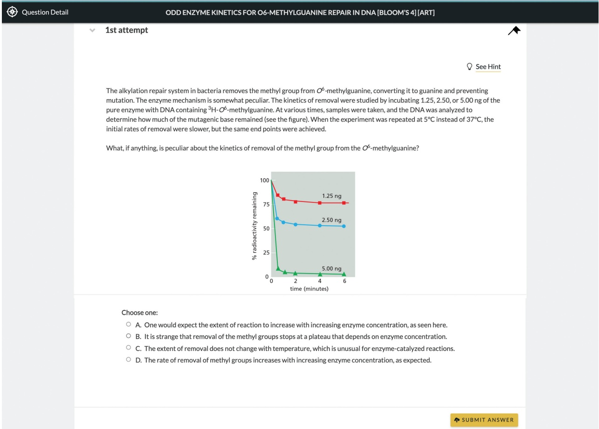
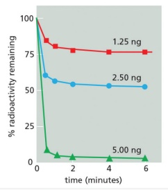

A. One would expect the extent of reaction to increase with increasing enzyme concentration, as seen here.

# Resources for Instructors

## digital.wwnorton.com/mboc7

Designed to enrich the classroom experience, Instructor Resources are available at **digital.wwnorton.com/mboc7**. Adopting instructors can obtain access to the site from their sales representative, who can be identified by visiting wwnorton.com/educator and clicking the “Find My Rep” button.

## The Digital Problems Book in Smartwork

For the first time, the popular print supplement Molecular Biology of the Cell: The Problems Book is now available in Smartwork. Easier for instructors to assign and more helpful to students because of each question’s pedagogical scaffolding, the Digital Problems Book in Smartwork features the questions authored by Tim Hunt and John Wilson adapted for digital delivery. An enormous library of almost 3500 questions that include critical thinking questions, data analysis questions, and animation and video questions, allows instructors to deliver the exact type of assessment that their students need. The Digital Problems Book in Smartwork comes at no additional cost with all new copies of Molecular Biology of the Cell.

B. It is strange that removal of the methyl groups stops at a plateau that depends on enzyme concentration.

C. The extent of removal does not change with temperature, which is unusual for enzyme-catalyzed reactions.

D. The rate of removal of methyl groups increases with increasing enzyme concentration, as expected.