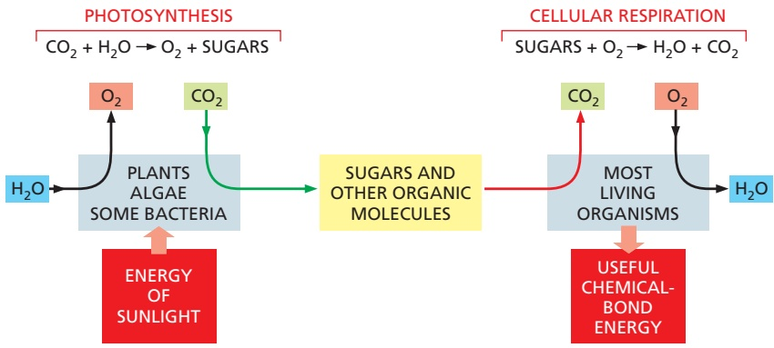

is required for cells to create and maintain an island of order in a universe tending toward chaos.

## Cells Obtain Energy by the Oxidation of Organic Molecules

All animal and plant cells are powered by energy stored in the chemical bonds of organic molecules, whether they are sugars that a plant has photosynthesized as food for itself or the mixture of large and small molecules that an animal has eaten. Organisms must extract this energy in usable form to live, grow, and reproduce. In both plants and animals, energy is extracted from food molecules by a process of gradual oxidation, or controlled burning.

Earth’s atmosphere contains a great deal of oxygen, and in the presence of oxygen the most energetically stable form of carbon is $\mathrm { C O _ { 2 } }$ and that of hydrogen is $\mathrm { H _ { 2 } O } .$ A cell is therefore able to obtain energy from sugars or other organic molecules by allowing their carbon and hydrogen atoms to combine with oxygen to produce $\mathrm { C O _ { 2 } }$ and $\mathrm { H _ { 2 } O } ,$ respectively—a process called **aerobic respiration**.

Photosynthesis (discussed in detail in Chapter 14) and respiration are complementary processes (**Figure 2–18**). This means that the transactions between plants and animals are not all one way. Plants, animals, and microorganisms have existed together on this planet for so long that many of them have become an essential part of the others’ environments. The oxygen released by photosynthesis is consumed in the combustion of organic molecules during aerobic respiration. And some of the $\mathrm { C O _ { 2 } }$ molecules that are fixed today into organic molecules by photosynthesis in a green leaf were yesterday released into the atmosphere by the respiration of an animal—or by the respiration of a fungus or bacterium decomposing dead organic matter. We therefore see that carbon utilization forms a huge cycle that involves the biosphere (all of the living organisms on Earth) as a whole (**Figure 2–19**). Similarly, atoms of nitrogen, phosphorus, and sulfur move between the living and nonliving worlds in cycles that involve plants, algae, animals, fungi, and bacteria.

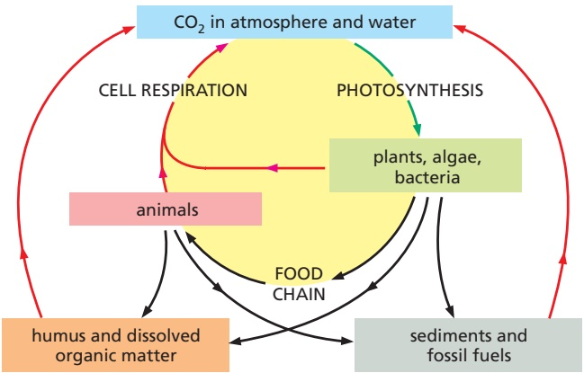

Figure 2–18 Photosynthesis and respiration as complementary processes in the living world. Photosynthesis converts the electromagnetic energy in sunlight into chemical-bond energy in sugars and other organic molecules. Plants, algae, and cyanobacteria obtain the carbon atoms that they need for this purpose from atmospheric $\mathrm { C O } _ { 2 }$ and the hydrogen from water, producing sugars and releasing $\mathrm { O } _ { 2 }$ gas as a by-product. The organic molecules produced by photosynthesis in turn serve as food for other organisms. Many of these organisms carry out aerobic respiration, a process that uses $\mathrm { O } _ { 2 }$ to form $\mathrm { C O } _ { 2 }$ from the same carbon atoms that had been taken up as $\mathrm { C O } _ { 2 }$ and converted into sugars by photosynthesis. In the process, the organisms that respire obtain the chemical-bond energy that they need to survive.

The first cells on Earth are thought to have been capable of neither photosynthesis nor respiration (discussed in Chapter 14). However, photosynthesis must have preceded respiration on Earth, because there is strong evidence that billions of years of photosynthesis were required before O2 had been released in sufficient quantity to create an atmosphere rich in this gas. (Earth’s atmosphere currently contains 21% $\left. \mathrm { O } _ { 2 } . \right)$

Figure 2–19 How carbon atoms cycle through the biosphere. Individual carbon atoms are incorporated into organic molecules of the living world by the photosynthetic activity of bacteria, algae, and plants. They pass to animals, microorganisms, and organic material in soil and oceans in cyclic paths. $\mathrm { C O } _ { 2 }$ is restored to the atmosphere when organic molecules are oxidized by cells during respiration or burned by humans as fossil fuels. In this diagram, the green arrow denotes an uptake of $CO_{2},$ whereas a red arrow indicates $\mathrm { C O } _ { 2 }$ release.

As indicated in Chapter 1, the total biomass on Earth is estimated to contain ∼550 gigatons $( 1 0 ^ { 1 5 }$ grams) of carbon (Gt C), of which 450 Gt C are plants, 70 are bacteria, 7 are archaea, and 2 are animals (see Figure 1–14).

(B)

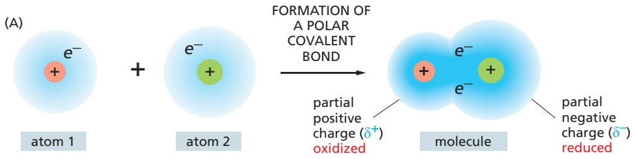

Figure 2–20 Oxidation and reduction. (A) When two atoms form a polar covalent bond, the atom ending up with a greater share of electrons is said to be reduced, while the other atom acquires a lesser share of electrons and is said to be oxidized. The reduced atom has acquired a partial negative charge (δ–) as the positive charge on the atomic nucleus is now more than equaled by the total charge of the electrons surrounding it, and conversely, the oxidized atom has acquired a partial positive charge (δ+). (B) The single carbon atom of methane can be converted to that of carbon dioxide by the successive replacement of its covalently bonded hydrogen atoms with oxygen atoms. With each step, electrons are shifted away from the carbon (as indicated by the changes in the amount of blue shading), and the carbon atom becomes progressively more oxidized. Each of these steps is energetically favorable under the conditions present inside a cell.

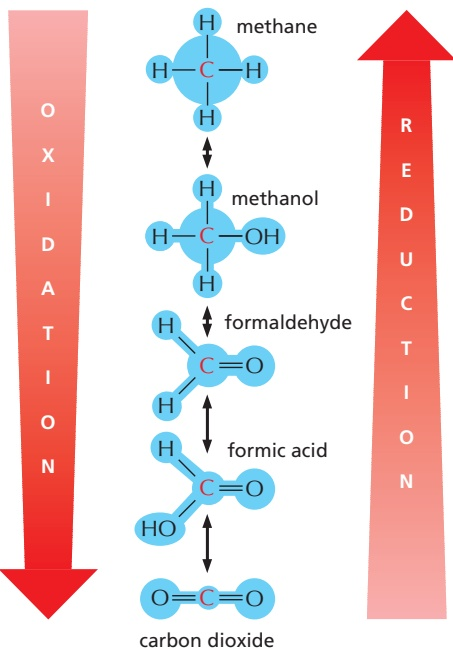

## Oxidation and Reduction Involve Electron Transfers

The cell does not oxidize organic molecules in one step, as occurs when organic material is burned in a fire. Through the use of enzyme catalysts, metabolism takes these molecules through a large number of reactions that only rarely involve the direct addition of oxygen. Before we consider some of these reactions and their purpose, we discuss what is meant by the process of oxidation.

**Oxidation** refers to more than the addition of oxygen atoms; the term applies more generally to any reaction in which electrons are transferred from one atom to another. Oxidation in this sense refers to the removal of electrons, andMBoC7 e3.11/2.20 **reduction**—the converse of oxidation—means the addition of electrons. Thus, $\mathrm { F e ^ { 2 + } }$ is oxidized if it loses an electron to become $\mathrm { F e ^ { 3 + } }$ , and a chlorine atom is reduced if it gains an electron to become Cl–. Because the number of electrons is conserved (no loss or gain) in a chemical reaction, oxidation and reduction always occur simultaneously; that is, if one molecule gains an electron in a reaction (reduction), a second molecule loses the electron (oxidation). When a sugar molecule is oxidized to $\mathrm { C O _ { 2 } }$ and $\mathrm { H _ { 2 } O } ,$ for example, the $\mathrm { O } _ { 2 }$ molecules involved in forming H2O gain electrons and thus are said to have been reduced.

Why is a “gain” of electrons referred to as a “reduction”? The term arose before anything was known about the movement of electrons. Originally, reduction reactions involved a liberation of oxygen—for example, when metals are extracted from ores by heating—which caused the samples to become lighter; in other words, “reduced” in mass.

It is important to recognize that the terms “oxidation” and “reduction” apply even when there is only a partial shift of electrons between atoms linked by a covalent bond (**Figure 2–20**). When a carbon atom becomes covalently bonded to an atom with a strong affinity for electrons, such as oxygen, chlorine, or sulfur, for example, it gives up more than its equal share of electrons and forms a polar covalent bond. Because the positive charge of the carbon nucleus is now somewhat greater than the negative charge of its electrons, the atom acquires a partial positive charge and is said to be oxidized. Conversely, a carbon atom in a C–H linkage has slightly more than its share of electrons, and so it is said to be reduced.

When a molecule in a cell picks up an electron $\left( e ^ { - } \right) _ { i }$ , it often picks up a proton $( \mathrm { H } ^ { + } )$ at the same time (protons being freely available in water). The net effect in this case is to add a hydrogen atom to the molecule.

$$
\mathrm{A} + e ^ {-} + \mathrm{H} ^ {+} \rightarrow \mathrm{AH}
$$

Even though a proton plus an electron is involved (instead of just an electron), such hydrogenation reactions are reductions, and the reverse dehydrogenation reactions are oxidations. It is especially easy to tell whether an organic molecule is being oxidized or reduced: reduction is occurring if its number of C–H bonds increases, whereas oxidation is occurring if its number of C–H bonds decreases (see Figure 2–20B).

Cells use enzymes to catalyze the oxidation of organic molecules in small steps, through a sequence of reactions that allows useful energy to be harvested. We now need to explain how enzymes work and some of the constraints under which they operate.

Enzymes Lower the Activation-Energy Barriers That Block Chemical Reactions

Consider the reaction

$$
\text {paper} + \mathrm{O} _ {2} \rightarrow \text {smoke} + \text {ashes} + \text {heat} + \mathrm{CO} _ {2} + \mathrm{H} _ {2} \mathrm{O}
$$

Once ignited, the paper burns readily, releasing to the atmosphere both energy as heat and water and carbon dioxide as gases. The reaction is irreversible, as the smoke and ashes never spontaneously retrieve these entities from the heated atmosphere and reconstitute themselves into paper. When the paper burns, its chemical energy is dissipated as heat—not lost from the universe, as energy can never be created or destroyed, but irretrievably dispersed in the chaotic random thermal motions of molecules. At the same time, the atoms and molecules of the paper become dispersed and disordered. In the language of thermodynamics, there has been a loss of free energy; that is, of energy that can be harnessed to do work or drive chemical reactions. This loss reflects a reduction of orderliness in the way the energy and molecules were stored in the paper.

We shall discuss free energy in more detail shortly, but the general principle is clear enough intuitively: chemical reactions proceed spontaneously only in the direction that leads to a loss of free energy. In other words, the spontaneous direction for any reaction is the direction that goes “downhill,” where a “downhill” reaction is one that is energetically favorable.

Although the most energetically favorable form of carbon under ordinary conditions is $\mathrm { C O _ { 2 } } ,$ and that of hydrogen is H2O, a living organism does not disappear in a puff of smoke, and the paper book in your hands does not burst into flames. This is because the molecules both in the living organism and in the book are in a relatively stable state, and they cannot be changed to a state of lower energy without an input of energy; in other words, a molecule requires **activation energy**—a kick over an energy barrier—before it can undergo a chemical reaction that leaves it in a more stable state (**Figure 2–21**). In the case of a burning book, the activation energy can be provided by the heat of a lighted match. For the molecules in the watery solution inside a cell, the kick is delivered by an unusually energetic random collision with surrounding molecules.

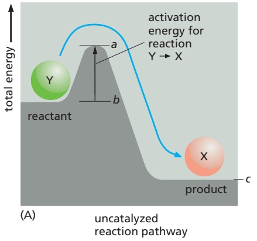

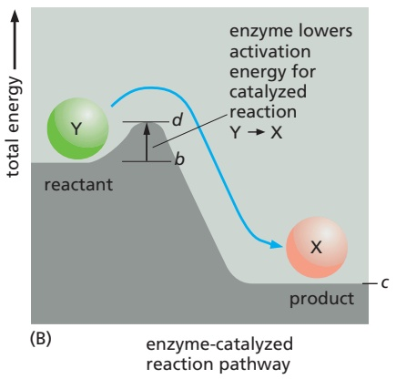

Figure 2–21 The important principle of activation energy. (A) Compound Y (a reactant) is in a relatively stable state, and energy is required to convert it to compound X (a product), even though X is at a lower overall energy level than Y. This conversion will not take place, therefore, unless compound Y can acquire enough activation energy (energy a minus energy b) from its surroundings to undergo the reaction that converts it into compound X. This energy may be provided by means of an unusually energetic collision with other molecules. For the reverse reaction, $X \to Y ,$ the activation energy will be much larger (energy a minus energy c); this reaction will therefore occur much more rarely. Activation energies are always positive; note, however, that the total energy change for the energetically favorable reaction $\tilde { \mathsf { Y } } \to \mathsf { X }$ is energy c minus energy b, a negative number. (B) Energy barriers for specific reactions can be lowered by catalysts, as indicated by the line marked d. Enzymes are particularly effective catalysts because they greatly reduce the activation energy for the reactions they perform.

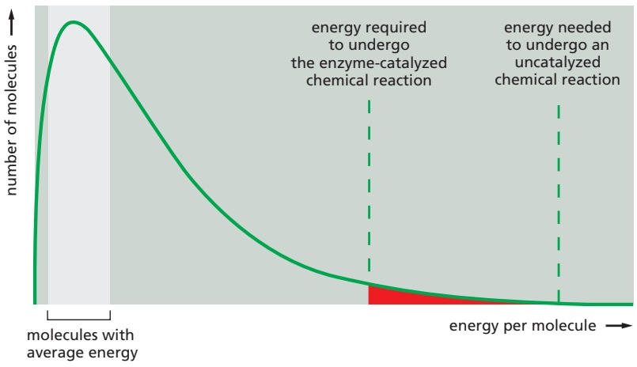

Figure 2–22 Lowering the activation energy greatly increases the probability of a reaction. At any given instant, a population of identical substrate molecules will have a range of energies, distributed as shown on the graph. The varying energies come from collisions with surrounding molecules, which make the substrate molecules jiggle, vibrate, and spin. For a molecule to undergo a chemical reaction, the energy of the molecule must exceed the activation-energy barrier for that reaction (dashed lines). For most biological reactions, this almost never happens without enzyme catalysis. Even with enzyme catalysis, the substrate molecules must experience a particularly energetic collision to react (red shaded area). Raising the temperature will also increase the number of molecules with sufficient energy to overcome the activation energy needed for a reaction; but in marked contrast to enzyme catalysis, this effect is nonselective, speeding up all reactions (Movie 2.2).

The chemistry in a living cell is tightly controlled, because the kick over energy barriers is greatly aided by a specialized class of proteins—the **enzymes**. Each enzyme binds tightly to one or more molecules, called **substrates**, and holds them in a way that greatly reduces the activation energy of a particular chemical reaction that the bound substrates can undergo. A substance that can lower the activation energy of a reaction is termed a **catalyst**; catalysts increase the rate of chemical reactions because they allow a much larger proportion of the random collisions with surrounding molecules to kick the substrates over the energy barrier, as illustrated in **Figure 2–22**. Enzymes are among the most effective catalysts known: some are capable of speeding up reactions by factors of 1014 or more. Enzymes thereby allow reactions that would not otherwise occur to proceed rapidly at normal temperatures.

## Enzymes Can Drive Substrate Molecules Along Specific Reaction Pathways

An enzyme cannot change the equilibrium point for a reaction. The reason is simple: when an enzyme (or any catalyst) lowers the activation energy for the reaction Y → X, of necessity it also lowers the activation energy for the reverse reaction X → Y by exactly the same amount (see Figure 2–21). The forward and backward reactions will therefore be accelerated by the same factor by an enzyme, and the equilibrium point for the reaction will be unchanged (**Figure 2–23**).

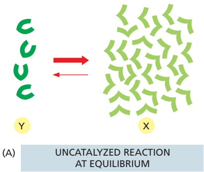

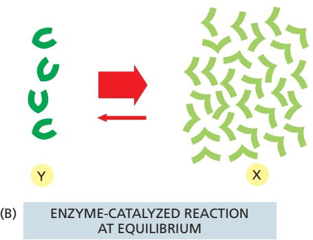

Figure 2–23 Enzymes cannot change the equilibrium point for reactions. Enzymes, like all catalysts, speed up the forward and backward rates of a reaction by the same factor. Therefore, for both the catalyzed and the uncatalyzed reactions shown here, the number of molecules undergoing the transition X → Y is equal to the number of molecules undergoing the transition Y → X when the ratio of X molecules to Y molecules is 7 to 1. In other words, the two reactions will eventually reach exactly the same equilibrium point, although the catalyzed reaction will reachMBoC7 e3.24/2.23 equilibrium much faster.

Figure 2–24 Directing substrate molecules through a specific reaction pathway by enzyme catalysis. A substrate molecule in a cell (green ball) is converted into a different molecule (red ball) by means of a series of enzyme-catalyzed reactions. As indicated (yellow box), several reactions are energetically favorable at each step, but only one is catalyzed by each enzyme. Sets of enzymes thereby determine the exact reaction pathway that is followed by each molecule inside the cell.

Thus no matter how much an enzyme speeds up a reaction, it cannot change its direction.

Despite the above limitation, enzymes steer all of the reactions in cells through specific reaction paths. This is because enzymes are both highly selective and very precise, usually catalyzing only one particular reaction. In other words, each enzyme selectively lowers the activation energy of only one of the several possible chemical reactions that its bound substrate molecules could undergo. In this way, sets of enzymes can direct each of the many different molecules in a cell along a particular reaction pathway (**Figure 2–24**).

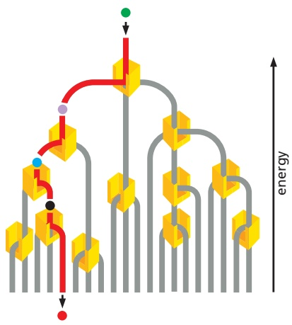

The success of living organisms is attributable to a cell’s ability to make enzymes of many types, each with precisely specified properties. Each enzyme has a unique shape containing an active site, a pocket or groove in the enzyme into which only particular substrates will fit (**Figure 2–25**). Like all other catalysts, enzyme molecules themselves remain unchanged after participating in a reaction and therefore can function over and over again. In Chapter 3, we discuss further how enzymes work.

## How Enzymes Find Their Substrates: The Enormous Rapidity of Molecular Motions

An enzyme will often catalyze the reaction of thousands of substrate molecules every second. This means the enzyme must be able to bind a new substrate molecule in a fraction of a millisecond. But both enzymes and their substrates are present in relatively small numbers in a cell. How do they find each other so fast? Rapid binding is possible because the motions caused by heat energy are enormously fast at the molecular level. These molecular motions can be classified broadly into three kinds: (1) the movement of a molecule from one place to another (translational motion), (2) the rapid back-and-forth movement of covalently linked atoms with respect to one another (vibrations), and (3) rotations. All three of these motions help to bring the surfaces of interacting molecules together.

The rates of molecular motions can be measured by a variety of spectroscopic techniques. A large globular protein is constantly tumbling, rotating about its axis approximately a million times per second. Molecules are also in constant translational motion, which causes them to explore the space inside the cell very efficiently by wandering through it—a process called **diffusion**. In this way, every molecule in a cell collides with a huge number of other molecules each second. As the molecules in a liquid collide and bounce off one another, an individual molecule moves first one way and then another, its path constituting a random walk (**Figure 2–26**). In such a walk, the average net distance that each molecule travels (as the “crow flies”) from its starting point is proportional to the square root of the time involved; that is, if it takes a molecule 1 second on average to travel 1 μm, it takes 4 seconds to travel 2 μm, 100 seconds to travel 10 μm, and so on.

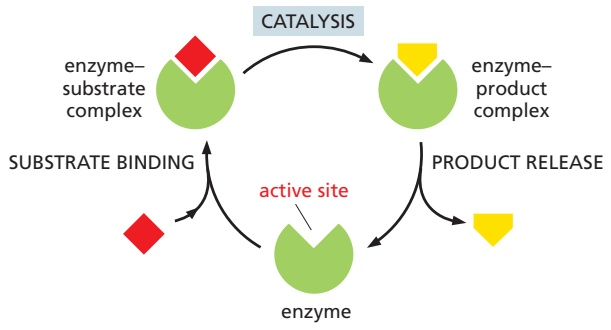

Figure 2–25 How enzymes work. Each enzyme has an active site to which one or more substrate molecules bind, forming an enzyme–substrate complex. A reaction occurs at the active site, producing an enzyme–product complex. The product is then released, allowing the enzyme to bind further substrate molecules.

The inside of a cell is very crowded (**Figure 2–27**). Nevertheless, experiments in which fluorescent dyes and other labeled molecules are injected into cells show that small organic molecules diffuse through the watery gel of the cytosol nearly as rapidly as they do through water. A small organic molecule, for example, takes only about one-fifth of a second on average to diffuse a distance of 10 μm. Diffusion is therefore an efficient way for small molecules to move the limited distances in the cell (a typical animal cell is 15 μm in diameter).

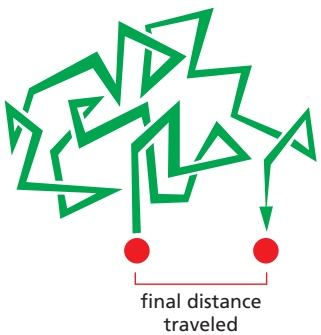

Proteins also move rapidly in cells. But because enzymes move more slowly than substrates, we can think of them as sitting still. The rate of encounter of each enzyme molecule with its substrate will depend on the concentration of the substrate molecule. For example, some abundant substrates are present at a concentration of 0.5 mM. As pure water is 55.5 M, there is only about one such substrate molecule in the cell for every $1 0 ^ { 5 }$ water molecules. Nevertheless, the active site on an enzyme molecule that binds this substrate will be bombarded by about 500,000 random collisions with the substrate molecule per second. (For a substrate concentration tenfold lower, the number of collisions drops to 50,000 per second, and so on.) A random collision between the active site of an enzyme and the matching surface of its substrate molecule often leads immediately to the formation of an enzyme–substrate complex. A reaction in which a covalent bond is broken or formed can then occur extremely rapidly. When one appreciates how quickly molecules move and react, the observed rates of enzymatic catalysis do not seem so amazing.

Two molecules that are held together by noncovalent bonds can also dissociate. The multiple weak noncovalent bonds that they form with each other will persist until random thermal motion causes the two molecules to separate. In general, the stronger the binding of the enzyme and substrate, the slower their rate of dissociation. In contrast, whenever two colliding molecules have poorly matching surfaces, they form few noncovalent bonds and the total energy of association will be negligible compared with that of thermal motion. In this case, the two molecules dissociate as rapidly as they come together, preventing incorrect and unwanted associations between mismatched molecules, such as between an enzyme and the wrong substrate.

## The Free-Energy Change for a Reaction, ΔG, Determines Whether It Can Occur Spontaneously

Although enzymes speed up reactions, they cannot by themselves force energetically unfavorable reactions to occur. In terms of a water analogy, enzymes by themselves cannot make water run uphill. Cells, however, must do just that in order to grow and divide: they must build highly ordered and energy-rich molecules from small and simple ones. We shall see that this is done through enzymes that directly couple energetically favorable reactions, which release energy and produce heat, to energetically unfavorable reactions, which produce biological order.

What do cell biologists mean by the term “energetically favorable,” and how can this be quantified? According to the second law of thermodynamics, the universe tends toward maximum disorder (largest entropy or greatest probability). Thus, a chemical reaction can proceed spontaneously only if it results in a net increase in the disorder of the universe (see Figure 2–16). This disorder of the universe can be expressed most conveniently in terms of the free energy of a system, a concept we touched on earlier.

**Free energy,** $G ,$ is an expression of the energy available to do work; for example, the work of driving chemical reactions. The value of G is of interest only when a system undergoes a change. The **free-energy change**, denoted **G** (delta G), is critical because, as explained in **Panel 2–7** (pp. 106–107), it is a direct measure of the amount of disorder created in the universe when a reaction takes place. Energetically favorable reactions, by definition, are those that decrease free energy; in other words, they have a negative ΔG and disorder the universe (**Figure 2–28**).

Figure 2–26 A random walk. Molecules in solution move in a random fashion as a result of the continual buffeting they receive in collisions with other molecules. This movement allows small molecules to diffuse rapidly from one part of the cell to another, as described in the text (Movie 2.3).

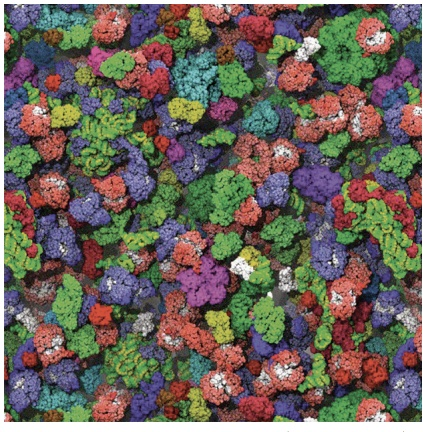

Figure 2–27 The crowded structure of the cell interior. Only the macromolecules, which are drawn to scale and displayed in different colors, are shown. Enzymes andMBoC7 e3.22/2.27 other macromolecules diffuse relatively slowly inside the cell, in part because they interact with many other macromolecules; small molecules, by contrast, diffuse nearly as rapidly as they do in water (Movie 2.4). (From S.R. McGuffee and A.H. Elcock, PLoS Comput. Biol. 6(3):e1000694, 2010.)

An example of an energetically favorable reaction on a macroscopic scale is the “reaction” by which a compressed spring relaxes to an expanded state, releasing its stored elastic energy as heat to its surroundings; an example on a microscopic scale is salt dissolving in water. Conversely, energetically unfavorable reactions with a positive ΔG—such as the joining of two amino acids to form a peptide bond—by themselves create order in the universe. Therefore, these reactions can take place only if they are coupled to a second reaction with a negative ΔG so large that the ΔG of the overall process is negative (**Figure 2–29**).

## The Concentration of Reactants Influences the Free-Energy Change and a Reaction’s Direction

As we have just described, a reaction Y ↔ X will go in the direction $\mathrm { Y } \to \mathrm { X }$ when the associated free-energy change, ΔG, is negative, just as a tensed spring left to itself will relax and lose its stored energy to its surroundings as heat. For a chemical reaction, however, ΔG depends not only on the energy stored in each individual molecule but also on the concentrations of the molecules in the reaction mixture. Remember that ΔG reflects the degree to which a reaction creates a more disordered—in other words, a more probable—state of the universe. Recalling our coin analogy, it is very likely that a coin will flip from a head to a tail orientation if a jiggling box contains 90 heads and 10 tails, but this is a less probable event if the box has 10 heads and 90 tails.

The same is true for a chemical reaction. For a reversible reaction Y ↔ X, a large excess of Y over X will tend to drive the reaction in the direction Y → X. Therefore, as the ratio of Y to X increases, the ΔG becomes more negative for the transition Y → X (and more positive for the transition X → Y).

The amount of concentration difference that is needed to compensate for a given decrease in chemical-bond energy (and accompanying heat release) is not intuitively obvious. In the late nineteenth century, the relationship was determined through a thermodynamic analysis that makes it possible to separate the concentration-dependent and the concentration-independent parts of the free-energy change, as we describe next.

## The Standard Free-Energy Change, $\Delta G ^ { \circ }$ , Makes It Possible to Compare the Energetics of Different Reactions

Because ΔG depends on the concentrations of the molecules in the reaction mixture at any given time, it is not a particularly useful value for comparing the relative energies of different types of reactions. To consider reactions on a comparable basis, we need to turn to the **standard free-energy change** of a reaction, **G°**. The ΔG° is the change in free energy under a standard condition, defined as that where the concentrations of all the reactants are set to the same fixed value of 1 mole/liter. Defined in this way, $\Delta G ^ { \circ }$ depends only on the intrinsic characters of the reacting molecules.

For the simple reaction $\mathrm { Y }   \rightarrow   \mathrm { X }$ at $3 7 ^ { \circ } \mathrm { C } ,$ ΔG° is related to ΔG as follows:

$$
\Delta G = \Delta G ^ {\circ} + R T \ln \frac {[ \mathrm{X} ]}{[ \mathrm{Y} ]}\left. \right\}
$$

where ΔG is in kilojoules per mole, [Y] and [X] denote the concentrations of Y and X in moles/liter, ln is the natural logarithm, and RT is the product of the gas constant, R, and the absolute temperature, T. At $3 7 ^ { \circ } \mathrm { C } _ { i }$ RT = 2.58 kJ mole–1. (A mole is $6 \times 1 0 ^ { 2 3 }$ molecules of a substance.)

A large body of thermodynamic data has been collected that has made it possible to determine the standard free-energy change, ΔG°, for the important metabolic reactions of a cell. Given these $\Delta G ^ { \circ }$ values, combined with additional information about metabolite concentrations and reaction pathways, it is possible to quantitatively predict the course of most biological reactions.

ENERGETICALLY FAVORABLE REACTION

The free energy of Y is greater than the free energy of X. Therefore ΔG < 0, and the disorder of the universe increases during the reaction Y X.

this reaction can occur spontaneously

ENERGETICALLY UNFAVORABLE REACTION

If the reaction X Y occurred, ΔG would be > 0, and the universe would become more ordered.

this reaction can occur only if it is coupled to a second, energetically favorable reaction

Figure 2–28 The distinction between energetically favorable and energetically unfavorable reactions, and how they relate to ΔG.

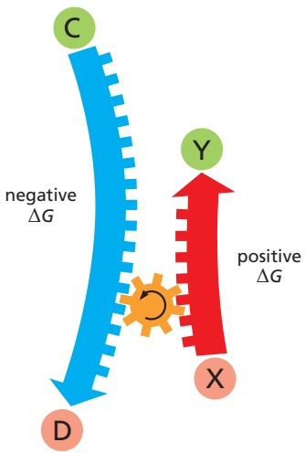

the energetically unfavorable reaction X Y is driven by the energetically favorable reaction C D, because the net free-energy change for the pair of **coupled** reactions is less than zero

Figure 2–29 How reaction coupling is used to drive energetically unfavorable reactions.

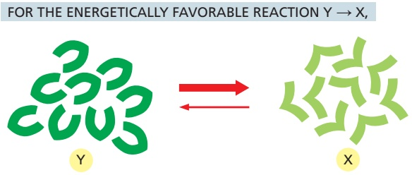

Figure 2–30 Chemical equilibrium. When a reaction reaches equilibrium, the forward and backward fluxes of reacting molecules are equal and opposite. In these diagrams, the widths of the red arrows indicate the relative rates at which an individual molecule reacts.

if X and Y are at equal concentrations, $[ \mathsf { Y } ] = [ \mathsf { X } ] ,$ the formation of X is energetically favored. In other words, the ΔG of Y → X is negative and the ΔG of X → Y is positive. Nevertheless because of thermal bombardments, there will always be some X converting to Y.

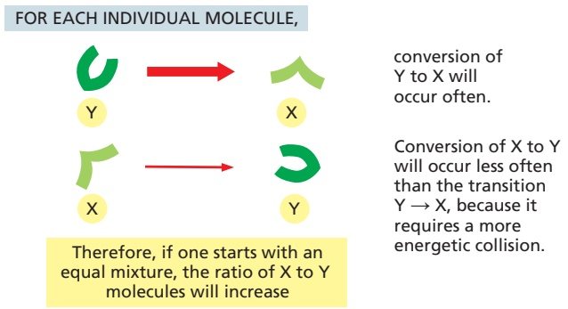

EVENTUALLY, there will be a large enough excess of X over Y to just compensate for the slow rate of X → Y, such that the number of X molecules being converted to Y molecules each second is exactly equal to the number of Y molecules being converted to X molecules each second. At this point, the reaction will be at equilibrium.

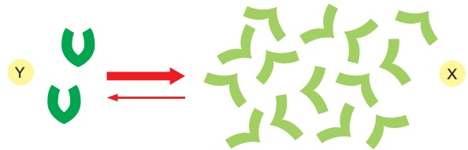

AT EQUILIBRIUM, there is no net change in the ratio of Y to X, and the ΔG for both forward and backward reactions is zero.

## The Equilibrium Constant and $\Delta G ^ { \circ }$ Are Readily Derived from Each Other

Inspection of the above equation reveals that the ΔG equals the value of $\Delta G ^ { \circ }$ when the concentrations of Y and X are equal. But as any favorable reaction proceeds, the concentrations of the products will increase as the concentration of the substrates decreases. This change in relative concentrations will causeMBoC7 e3.18/2.30 [X]/[Y] to become increasingly large, making the initially favorable $\Delta G$ less and less negative (the logarithm of a number x is positive for $x   \geq   1$ , negative for $x   \leq   1 ,$ and zero for $x = 1 )$ . Eventually, when $\Delta G = 0 ,$ a chemical **equilibrium** will be attained; here there is no net change in free energy to drive the reaction in either direction, inasmuch as the concentration effect just balances the push given to the reaction by $\Delta G ^ { \circ } ,$ . As a result, the ratio of product to substrate reaches a constant value at chemical equilibrium (**Figure 2–30**).

We can define the **equilibrium constant, K**, for the reaction $\mathrm { Y }   \rightarrow   \mathrm { X }$ as

$$
K = \frac {[ \mathrm{X} ]}{[ \mathrm{Y} ]}
$$

where [X] is the concentration of the product and [Y] is the concentration of the reactant at equilibrium. Remembering that $\Delta G = \Delta G ^ { \circ } + R T \ln [ \mathrm { X } ] / [ \mathrm { Y } ]$ , and that $\Delta G = 0$ at equilibrium, we see that

$$
\Delta G ^ {\circ} = - R T \ln \frac {[ \mathrm{X} ]}{[ \mathrm{Y} ]} = - R T \ln K
$$

$\operatorname { A t } 3 7 ^ { \circ } \mathrm { C } ,$ where $R T = 2 . 5 8$ , the equilibrium equation is therefore:

$$
\Delta G ^ {\circ} = - 2. 5 8 \ln K
$$

Converting this equation from the natural logarithm (ln) to the more commonly used base 10 logarithm (log), we get

$$
\Delta G ^ {\circ} = - 5. 9 4 \log K
$$

The above equation reveals how the equilibrium ratio of X to Y (expressed as the equilibrium constant, $K )$ depends on the intrinsic character of the molecules (as expressed in the value of $\Delta G ^ { \circ }$ in kilojoules per mole). The more energetically favorable a reaction, the more product will accumulate when the reaction proceeds to equilibrium. More precisely, for every 5.94 kJ/mole difference in free energy at $3 7 ^ { \circ } \mathrm { C } ,$ the equilibrium constant changes by a factor of 10 (**Table 2–2**). Note that this amount of free-energy difference is roughly equivalent to the free energy available from a single hydrogen bond.

More generally, for a reaction that has multiple reactants and products, such as $\mathrm { A + B \xrightarrow { \sigma } C + D _ { r } }$

$$
K = \frac {[ \mathrm{C} ] [ \mathrm{D} ]}{[ \mathrm{A} ] [ \mathrm{B} ]}
$$

The concentrations of the two reactants and the two products are multiplied because the rate of the forward reaction depends on the collision of A and B and the rate of the backward reaction depends on the collision of C and D. Thus, at $3 7 ^ { \circ } \mathrm { C } _ { i }$

$$
\Delta G ^ {\circ} = - 5. 9 4 \log \frac {[ \mathrm{C} ] [ \mathrm{D} ]}{[ \mathrm{A} ] [ \mathrm{B} ]}
$$

where $\Delta G ^ { \circ }$ is in kilojoules per mole, and [A], [B], [C], and [D] denote the concentrations of the reactants and products in moles/liter.

## The Free-Energy Changes of Coupled Reactions Are Additive

We have pointed out that unfavorable reactions can be coupled to favorable ones to drive the unfavorable ones forward (see Figure 2–29). In thermodynamic terms, this is possible because the overall free-energy change for a set of coupled reactions is the sum of the free-energy changes in each of its component steps. Consider, as a simple example, two sequential reactions

$$
\mathrm{X} \rightarrow \mathrm{Y} \text {and} \mathrm{Y} \rightarrow \mathrm{Z}
$$

whose $\Delta G ^ { \circ }$ values are $+ 5$ and –13 kJ/mole, respectively. If these two reactions occur sequentially, the $\Delta G ^ { \circ }$ for the coupled reaction will be –8 kJ/mole. This means that, with appropriate conditions, the unfavorable reaction $\mathrm { X } \to \mathrm { Y }$ can be driven by the favorable reaction $\mathrm { Y } \rightarrow \mathrm { Z } ,$ provided that this second reaction follows the first. For example, several of the reactions in the long pathway that converts sugars into $\mathrm { C O _ { 2 } }$ and $\mathrm { H _ { 2 } O }$ have positive $\Delta G ^ { \circ }$ values. But the pathway nevertheless proceeds because the total $\Delta G ^ { \circ }$ for the series of sequential reactions has a large negative value.

Forming a sequential pathway is not adequate for many purposes. Often the desired pathway is simply $\mathrm { X } \to \mathrm { Y } ,$ without further conversion of Y to some other product. Fortunately, there are other more general ways of using enzymes to couple reactions together. In order to explain how this is possible, we need to introduce the activated carrier molecules that we discuss next.

## Activated Carrier Molecules Are Essential for Biosynthesis

To make life possible, the energy released by the oxidation of food molecules must be stored temporarily before it can be channeled into the construction of the many other molecules needed by the cell. In most cases, the energy is stored as chemical-bond energy in a small set of activated “carrier molecules,” which contain one or more energy-rich covalent bonds. These molecules diffuse rapidly throughout the cell and thereby carry their bond energy from sites of energy

TABLE 2–2 Relationship Between the Standard Free-Energy Change, $\Delta G ^ { \circ }$ and the Equilibrium Constant

| Equilibrium constant [X] = K [Y] | Free energy of X minus free energy of Y [kJ/mole (kcal/ mole)] |
| --- | --- |
| 105 | -29.7 (-7.1) |
| 104 | -23.8 (-5.7) |
| 103 | -17.8 (-4.3) |
| 102 | -11.9 (-2.8) |
| 101 | -5.9 (-1.4) |
| 1 | 0 (0) |
| 10-1 | 5.9 (1.4) |
| 10-2 | 11.9 (2.8) |
| 10-3 | 17.8 (4.3) |
| 10-4 | 23.8 (5.7) |
| 10-5 | 29.7 (7.1) |

Values of the equilibrium constant were calculated for the simple chemical reaction $\mathsf { Y } \leftrightarrow \mathsf { X }$ using the equation given in the text. The $\Delta G ^ { \circ }$ given here is in kilojoules per mole at ${ \bar { 3 } } { \bar { 7 } } ^ { \circ } \mathrm { C } ,$ with kilocalories per mole in parentheses. One kilojoule (kJ) is equal to 0.239 kilocalories (kcal) (1 kcal = 4.18 kJ). As explained in the text, $\Delta G ^ { \circ }$ represents the free-energy difference under standard conditions (where all components are present at a concentration of 1.0 mole/ liter).

From this table, we see that if there is a favorable standard free-energy change (ΔG°) of –17.8 kJ/mole (–4.3 kcal/mole) for the transition $\mathsf { Y } \to \mathsf { \dot { X } } ,$ there will be 1000 times more molecules in state X than in state Y at equilibrium $( K = 1 0 0 0 )$

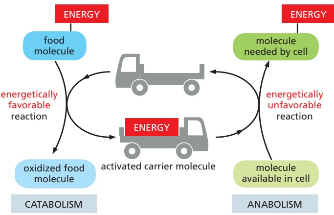

Figure 2–31 Energy transfer and the role of activated carriers in metabolism. By serving as energy shuttles, activated carrier molecules perform their function as go-betweens that link the breakdown of food molecules and the release of energy (catabolism) to the energy-requiring biosynthesis of small and large organic molecules (anabolism).

generation to the sites where the energy will be used for biosynthesis and other cell activities (**Figure 2–31**).

The **activated carriers** store energy in an easily exchangeable form, either as a readily transferable chemical group or as electrons held at a high energyMBoC7 m2.31/2.31 level, and they can serve a dual role as a source of both energy and chemical groups in biosynthetic reactions. For historical reasons, these molecules are also sometimes referred to as coenzymes. The most important of the activated carrier molecules are ATP and two molecules that are closely related to each other, NADH and NADPH. As we discuss next, coupled reactions allow cells both to generate such activated carrier molecules and to use them like money to pay for reactions that otherwise could not take place.

## The Formation of an Activated Carrier Is Coupled to an Energetically Favorable Reaction

Coupling mechanisms require enzymes and are fundamental to all the energy transactions of the cell. The nature of a **coupled reaction** is illustrated by a mechanical analogy in **Figure 2–32**, in which an energetically favorable chemical reaction is represented by rocks falling from a cliff. The energy of falling rocks would normally be entirely wasted in the form of heat generated by friction when the rocks hit the ground (see the falling-brick diagram in Figure 2–17). By careful design, however, part of this energy could be used instead to drive a paddle wheel

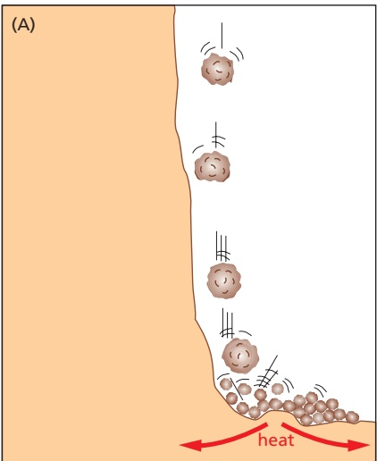

kinetic energy of falling rocks is transformed into heat energy only

Figure 2–32 A mechanical model illustrating the principle of coupled chemical reactions. The spontaneous reaction shown in (A) could serve as an analogy for the direct oxidation of glucose to CO2 and H2O, which produces heat only. In (B), the same reaction is coupled to a second reaction; this second reaction is analogous to the synthesis of activated carrier molecules. The energy produced in (B) is in a more useful form than in (A) and can be used to drive a variety of otherwise energetically unfavorable reactions (C).

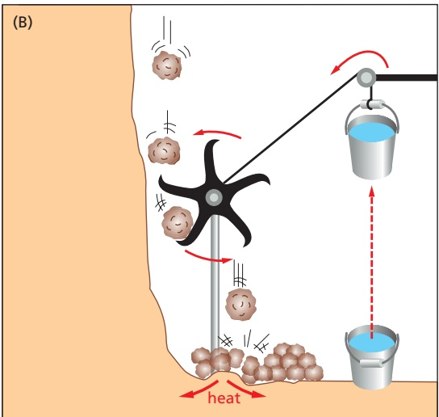

part of the kinetic energy is used to lift a bucket of water, and a correspondingly smaller amount is transformed into heat

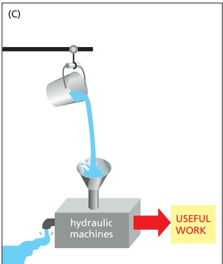

the potential kinetic energy stored in the raised bucket of water can be used to drive hydraulic machines that carry out a variety of useful tasks

that lifts a bucket of water (Figure 2–32B). Because the rocks can now reach the ground only after moving the paddle wheel, we say that the energetically favorable reaction of rock falling has been directly coupled to the energetically unfavorable reaction of lifting the bucket of water. Note that because part of the energy is used to do work in Figure 2–32B, the rocks hit the ground with less velocity than in Figure 2–32A, and correspondingly less energy is dissipated as heat.

Similar processes occur in cells, where enzymes play the role of the paddle wheel. By mechanisms that we discuss later in this chapter, enzymes couple an energetically favorable reaction, such as the oxidation of foodstuffs, to an energetically unfavorable reaction, such as the generation of an activated carrier molecule. As in this example, the amount of heat released by the oxidation reaction is reduced by exactly the amount of energy stored in the energy-rich covalent bonds of the activated carrier molecule. And the activated carrier molecule picks up a packet of energy of a size sufficient to power a chemical reaction elsewhere in the cell.

## ATP Is the Most Widely Used Activated Carrier Molecule

The most important and versatile of the activated carriers in cells is **ATP** (adenosine triphosphate). Just as the energy stored in the raised bucket of water in Figure 2–32B can drive a wide variety of hydraulic machines, ATP is a convenient and versatile store, or currency, of energy used to drive a huge variety of chemical reactions in cells. ATP is synthesized by coupling a reaction that is highly energetically favorable to an energetically unfavorable phosphorylation reaction in which a phosphate group is added to **ADP** (adenosine diphosphate). When required, ATP gives up its energy packet through its energetically favorable hydrolysis to ADP and inorganic phosphate (**Figure 2–33**). The regenerated ADP is then available to be used for another round of the phosphorylation reaction that forms ATP.

The two outermost phosphate groups in ATP are said to be held to the rest of the molecule by “high-energy” covalent bonds, because each of these phosphoanhydride linkages releases a great deal of free energy when hydrolyzed. The unusually large negative free-energy change for these hydrolysis reactions arises from a number of factors. The release of the terminal phosphate group when ATP forms ADP removes an unfavorable repulsion between adjacent negative charges; in addition, the inorganic phosphate ion released is stabilized both by resonance and by favorable hydrogen-bond formation with water.

The energetically favorable reaction of ATP hydrolysis is coupled to many otherwise unfavorable reactions through which needed molecules are synthesized.

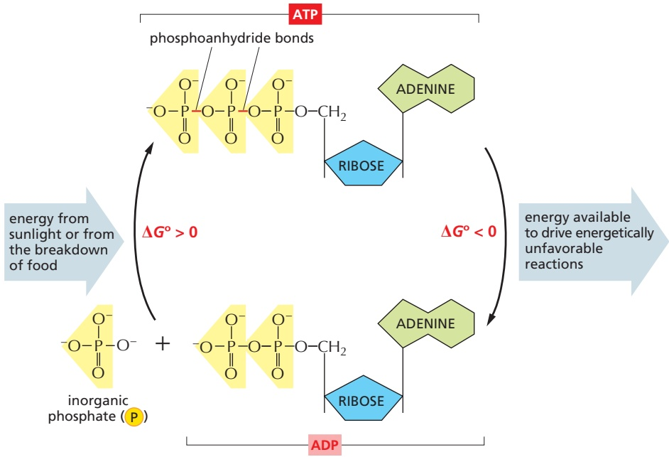

Figure 2–33 The interconversion of ATP and ADP occurs in a cycle. The two outermost phosphates in ATP are held to the rest of the molecule by “highenergy” phosphoanhydride bonds and are readily hydrolyzed or transferred to other molecules. Water can be added to ATP to form ADP and inorganic phosphate. This hydrolysis of the terminal phosphate of ATP yields between 46 and 54 kJ/mole of usable energy, depending on the intracellular conditions. (Although the ΔG° of this reaction is –30.5 kJ/mole, its ΔG inside cells is much more negative, because the ratio of ATP to the products ADP and phosphate is kept so high.)

The formation of ATP from ADP and phosphate reverses the hydrolysis reaction; because this condensation reaction is energetically unfavorable, it must be coupled to a highly energetically favorable reaction to occur.

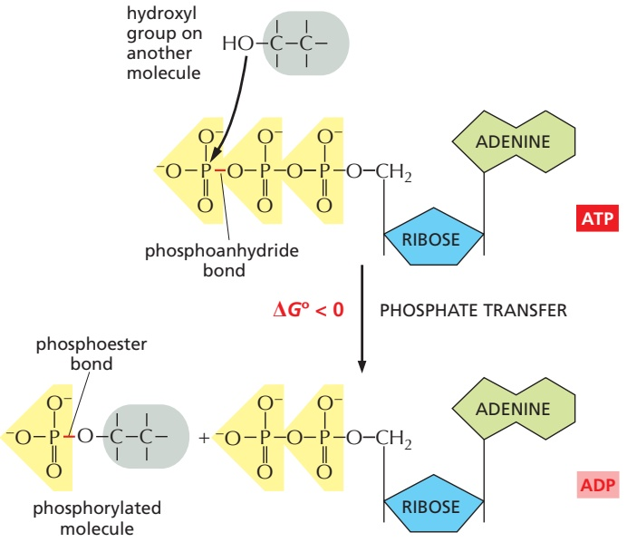

Figure 2–34 An example of a phosphate transfer reaction. Because an energyrich phosphoanhydride bond in ATP is converted to a phosphoester bond, this reaction is energetically favorable, having a large negative ΔG. Reactions of this type are involved in the synthesis of phospholipids and in the initial steps of reactions that catabolize sugars, as well as in many other metabolic pathways.

Many of these coupled reactions involve the transfer of the terminal phosphate in ATP to another molecule, as illustrated by the phosphorylation reaction in **Figure 2–34**.

As the most abundant activated carrier in cells, ATP is the principal energy currency. To give just two examples, it supplies energy for many of the pumpsMBoC7 e3.31/2.34 that transport substances into and out of the cell (discussed in Chapter 11), and it powers the molecular motors that enable muscle cells to contract and nerve cells to transport materials from one end of their long axons to another (discussed in Chapter 16).

## Energy Stored in ATP Is Often Harnessed to Join Two Molecules Together

We have previously discussed one way in which an energetically favorable reaction can be coupled to an energetically unfavorable reaction, X → Y, so as to enable it to occur. In that scheme, a second enzyme catalyzes the energetically favorable reaction $\operatorname { Y } \to \operatorname { Z } ,$ pulling all of the X to Y in the process. But when the required product is Y and not Z, this mechanism is not useful.

A typical biosynthetic reaction is one in which two molecules, A and B, are joined together to produce A–B in the energetically unfavorable condensation reaction

$$
\mathrm{B-H} + \mathrm{A-OH} \rightarrow \mathrm{A-B} + \mathrm{H} _ {2} \mathrm{O}
$$

There is an indirect pathway that allows B–H and A–OH to form A–B, in which a coupling to ATP hydrolysis makes the reaction go. Here, energy from ATP hydrolysis is first used to convert A–OH to a higher-energy intermediate compound, which then reacts directly with B–H to give A–B. The simplest possible mechanism involves the transfer of a phosphate from ATP to A–OH to make $\mathrm{A}\mathrm{-O}\mathrm{-PO}_{3},$ in which case the reaction pathway contains only two steps:

$$
1. \mathrm{A-OH} + \mathrm{ATP} \rightarrow \mathrm{A-O-PO} _ {3} + \mathrm{ADP}
$$

$$
2. \mathrm{B-H} + \mathrm{A-O-PO} _ {3} \rightarrow \mathrm{A-B} + \text {phosphate}
$$

$$
\text {Net result: A - OH + ATP + B - H} \rightarrow \mathrm{A-B+ADP+phosphate}
$$

The condensation reaction, which by itself is energetically unfavorable, is forced to occur by being directly coupled to ATP hydrolysis in an enzyme-catalyzed reaction pathway (**Figure 2–35A**).

A biosynthetic reaction of exactly this type synthesizes the amino acid glutamine (**Figure 2–35B**). We will see shortly that similar (but more complex) mechanisms are also used to produce nearly all of the large molecules of the cell.