97

## WATER AS A SOLVENT

Many substances, such as household sugar (sucrose), dissolve in water. That is, their molecules separate from each other, each becoming surrounded by water molecules.

pH

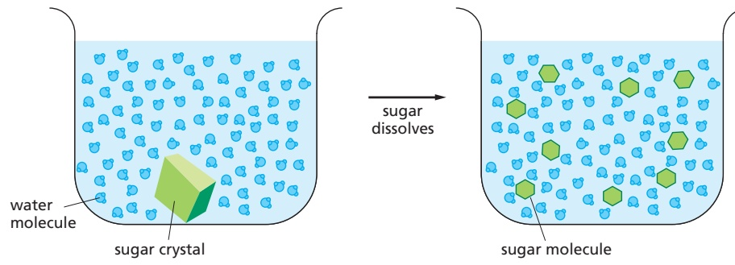

When a substance dissolves in a liquid, the mixture is termed a solution. The dissolved substance (in this case sugar) is the solute, and the liquid that does the dissolving (in this case water) is the solvent. Water is an excellent solvent for hydrophilic substances because of its polar bonds.

## ACIDS

Substances that release hydrogen ions (protons) into solution are called acids.

Many of the acids important in the cell are not completely dissociated, and they are therefore weak acids; for example, the carboxyl group (–COOH), which dissociates to give a hydrogen ion in solution.

Note that this is a reversible reaction.

The acidity of a solution is defined by the concentration (conc.) of hydronium ions (H3O+) it possesses, generally abbreviated as H+. For convenience, we use the pH scale, where

$$
\mathrm{pH} = - \log_ {1 0} [ \mathrm{H} ^ {+} ]
$$

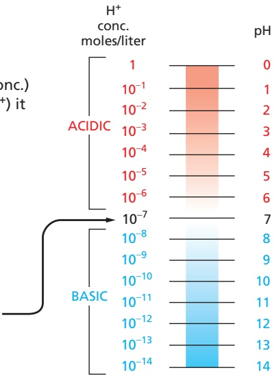

For pure water

$$
[ \mathrm{H} ^ {+} ] = 1 0 ^ {- 7} \text {moles / liter}
$$

$$
\mathrm{pH} = 7. 0
$$

## HYDROGEN ION EXCHANGE

Positively charged hydrogen ions (H+) can spontaneously move from one water molecule to another, thereby creating two ionic species.

$$
\text {often written as:} \quad \mathrm{H} _ {2} \mathrm{O} \underset {\text {hydrogen ion}} {\rightleftharpoons} \mathrm{H} ^ {+} + \mathrm{OH} ^ {-}
$$

Because the process is rapidly reversible, hydrogen ions are continually shuttling between water molecules. Pure water contains equal concentrations of hydronium ions and hydroxyl ions (both $1 0 ^ { - 7 }$ M).

## BASES

Substances that reduce the number of hydrogen ions in solution are called bases. Some bases, such as ammonia, combine directly with hydrogen ions.

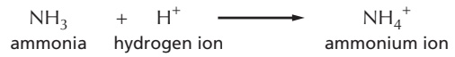

Other bases, such as sodium hydroxide, reduce the number of H+ ions indirectly, by producing OH– ions that then combine directly with $\mathsf { H } ^ { + }$ ions to make $\mathsf { H } _ { 2 } \mathsf { O } .$

Many bases found in cells are partially associated with H+ ions and are termed weak bases. This is true of compounds that contain an amino group (–NH2), which has a weak tendency to reversibly accept an $\bar { \mathsf { H } } ^ { + }$ ion from water, thereby increasing the concentration of free OH ions.

$$
\mathrm {-NH_ {2}} \quad + \quad \mathrm{H} ^ {+}
$$

$$
- \mathrm{NH} _ {3} ^ {+}
$$

---

98

PANEL 2–3: The Principal Types of Weak Noncovalent Bonds That Hold Macromolecules Together

## WEAK NONCOVALENT CHEMICAL BONDS

Organic molecules can interact with other molecules through three types of short-range attractive forces known as noncovalent bonds: van der Waals attractions, electrostatic attractions, and hydrogen bonds. The repulsion of hydrophobic groups from water is also important for these interactions and for the folding of biological macromolecules.

weak noncovalent bond

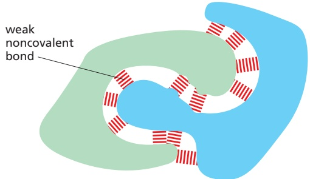

Weak noncovalent bonds have less than 1/20 the strength of a strong covalent bond. They are strong enough to provide tight binding only when many of them are formed simultaneously.

## HYDROGEN BONDS

As already described for water (see Panel 2–2, pp. 96–97), hydrogen bonds form when a hydrogen atom is “sandwiched” between two electron-attracting atoms (usually oxygen or nitrogen).

Hydrogen bonds are strongest when the three atoms are in a straight line:

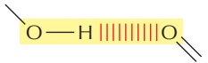

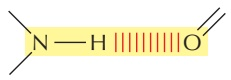

Examples in macromolecules:

Amino acids in a polypeptide chain can be hydrogen-bonded together in a folded protein.

Two bases, G and C, are hydrogen bonded in a DNA double helix.

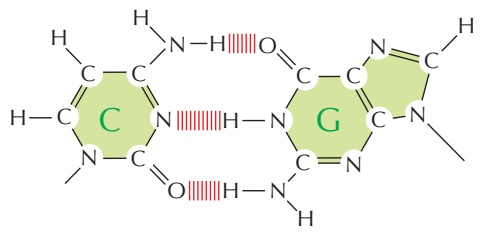

## VAN DER WAALS ATTRACTIONS

If two atoms are too close together, they repel each other very strongly. For this reason, an atom can often be treated as a sphere with a fixed radius. The characteristic “size” for each atom is specified by a unique van der Waals radius. The contact distance between any two noncovalently bonded atoms is the sum of their van der Waals radii.

0.12 nm radius

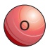

0.2 nm radius

0.15 nm radius

0.14 nm radius

At very short distances, any two atoms show a weak bonding interaction due to their fluctuating electrical charges. The two atoms will be attracted to each other in this way until the distance between their nuclei is approximately equal to the sum of their van der Waals radii. Although they are individually very weak, such van der Waals attractions can become important when two macromolecular surfaces fit together very closely, because many atoms are involved.

Note that when two atoms form a covalent bond, the centers of the two atoms (the two atomic nuclei) are much closer together than the sum of the two van der Waals radii. Thus,

0.4 nm two nonbonded carbon atoms

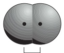

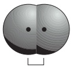

0.15 nm two carbon atoms held by a single covalent bond

0.13 nm two carbon atoms held by a double covalent bond

## HYDROGEN BONDS IN WATER

Any two atoms that can form hydrogen bonds to each other can alternatively form hydrogen bonds to water molecules. Because of this competition with water molecules, the hydrogen bonds formed in water between two peptide bonds, for example, are relatively weak.

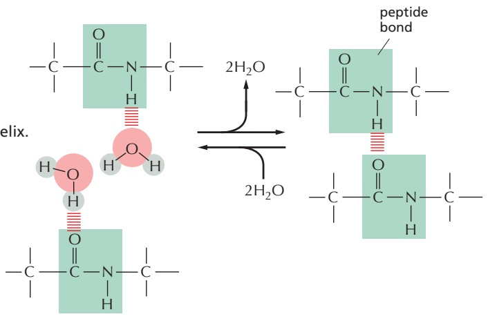

---

99

## ELECTROSTATIC ATTRACTIONS

Electrostatic attractions occur both between fully charged groups (ionic bond) and between partially charged groups on polar molecules.

The force of attraction between the two partial charges, δ+ and δ–, falls off rapidly as the distance between the charges increases.

In the absence of water, ionic bonds are very strong. They are responsible for the strength of such minerals as marble and agate and for crystal formation in common table salt, NaCl.

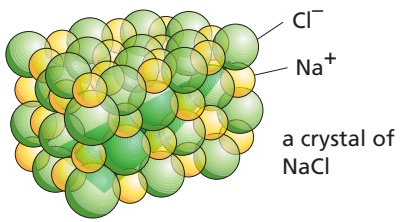

## CATION– INTERACTIONS

The structure of a typical protein reveals that it contains several cation– (pi) interactions, these electrostatic attractions being about half as abundant as the electrostatic attractions between positively and negatively charged amino-acid side chains. In this energetically favorable interaction, a cation is paired with the aromatic () electrons of either a tryptophan, tyrosine, or phenylalanine side chain. As shown, the cation can either be an inorganic ion or a positively charged lysine or arginine side chain. A tryptophan– arginine pair is the most common, as illustrated here.

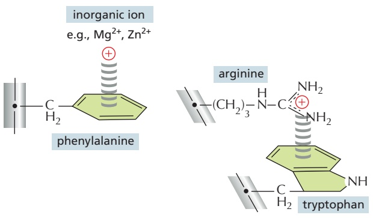

## HYDROPHOBIC FORCES

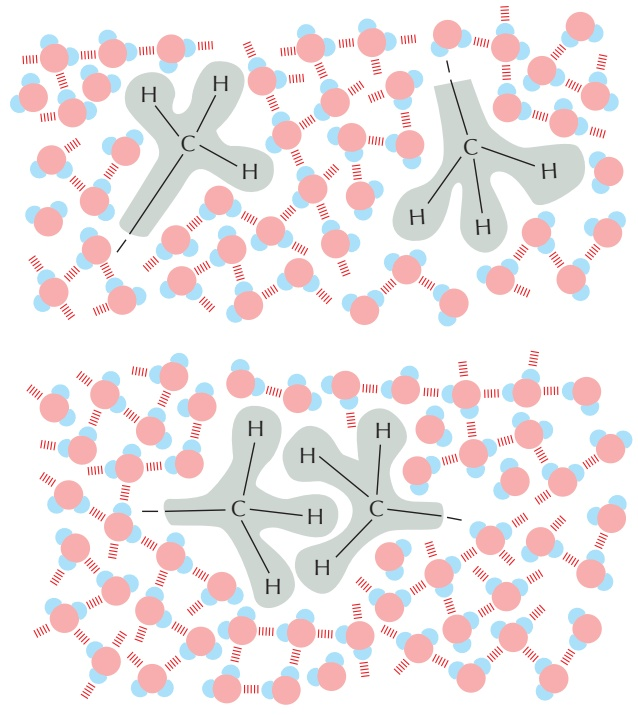

Water forces hydrophobic groups together in order to minimize their disruptive effects on the water network formed by the hydrogen bonds between water molecules. Hydrophobic groups held together in this way are sometimes said to be held together by “hydrophobic bonds,” even though the attraction is actually caused by a repulsion from water.

## ELECTROSTATIC ATTRACTIONS IN WATER

Charged groups are shielded by their interactions with water molecules. Electrostatic attractions are therefore quite weak in water.

Inorganic ions in solution can also cluster around charged groups and further weaken these electrostatic attractions.

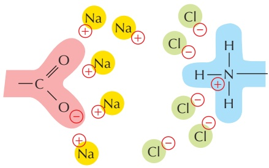

Despite being weakened by water and inorganic ions, electrostatic attractions are very important in biological systems.

---

glucose

ALDOSES

KETOSES

glyceraldehyde

100

PANEL 2–4: An Outline of Some of the Types of Sugars Commonly Found in Cells

## MONOSACCHARIDES

Monosaccharides usually have the general formula $( \mathsf { C H } _ { 2 } \mathsf { O } ) _ { \mathcal { D } ^ { \prime } }$ where n can be 3, 4, 5, 6, 7, or 8, and have two or more hydroxyl groups. They contain either an aldehyde group $( - c \nleq \frac { 0 } { H } )$ and are called aldoses or a ketone group $( \sum c   =   0 )$ and are called ketoses.

## 3-carbon (TRIOSES)

## 5-carbon (PENTOSES)

## 6-carbon (HEXOSES)

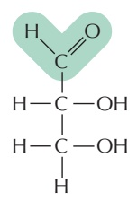

ribose

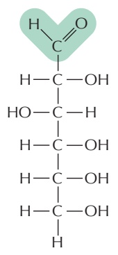

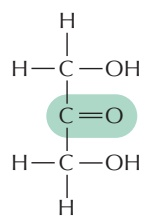

dihydroxyacetone

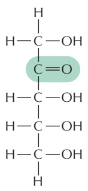

ribulose

## RING FORMATION

In aqueous solution, the aldehyde or ketone group of a sugar molecule tends to react with a hydroxyl group of the same molecule, thereby closing the molecule into a ring.

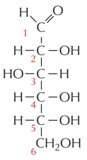

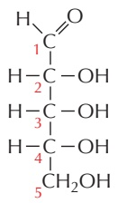

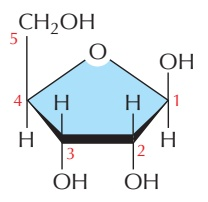

Note that each carbon atom has a number.

## ISOMERS

Many monosaccharides differ only in the spatial arrangement of atoms; that is, they are isomers. For example, glucose, galactose, and mannose have the same formula $( \mathsf { C } _ { 6 } \mathsf { H } _ { 1 2 } \mathsf { O } _ { 6 } )$ but differ in the arrangement of groups around one or two carbon atoms. CH.OH

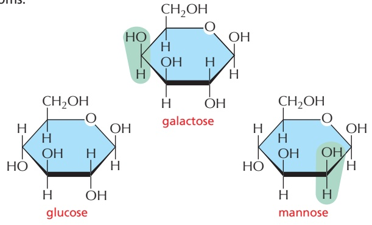

These small differences make only minor changes in the chemical properties of the sugars. But the differences are recognized by enzymes and other proteins and therefore can have major biological effects.

---

101

## α AND β LINKS

The hydroxyl group on the carbon that carries the aldehyde or ketone can rapidly change from one position to the other. These two positions are called α and β.

α hydroxyl

β hydroxyl

As soon as one sugar is linked to another, the α or β form is frozen.

## SUGAR DERIVATIVES

The hydroxyl groups of a simple monosaccharide, such as glucose, can be replaced by other groups. H

glucuronic acid

## DISACCHARIDES

The carbon that carries the aldehyde or the ketone can react with any hydroxyl group on a second sugar molecule to form a disaccharide. Three common disaccharides are

maltose (glucose + glucose) lactose (galactose + glucose) sucrose (glucose + fructose)

The reaction forming sucrose is shown here.

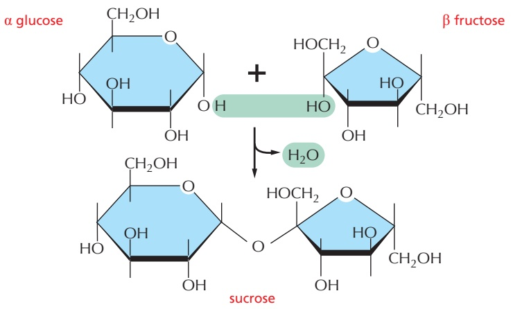

## OLIGOSACCHARIDES AND POLYSACCHARIDES

Large linear and branched molecules can be made from simple repeating sugar subunits. Short chains are called oligosaccharides, and long chains are called polysaccharides. Glycogen, for example, is a polysaccharide made entirely of glucose subunits joined together.

## COMPLEX OLIGOSACCHARIDES

In many cases, a sugar sequence is nonrepetitive. Many different molecules are possible. Such complex oligosaccharides are usually linked to proteins or to lipids, as is this oligosaccharide, which is part of a cell-surface molecule that defines a particular blood group.

---

space-filling model

carbon skeleton

102

PANEL 2–5: Fatty Acids and Other Lipids

## FATTY ACIDS

All fatty acids have a carboxyl group at one end and a long hydrocarbon tail at the other.

PHOSPHOLIPIDS

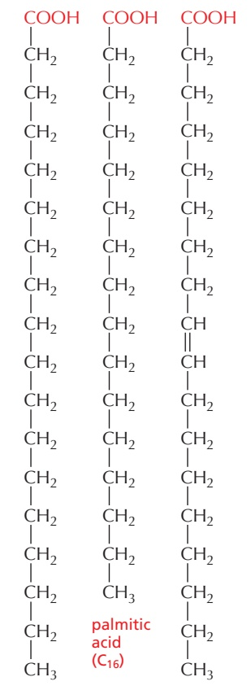

Hundreds of different kinds of fatty acids exist. Some have one or more double bonds in their hydrocarbon tail and are said to be unsaturated. Fatty acids with no double bonds are saturated.

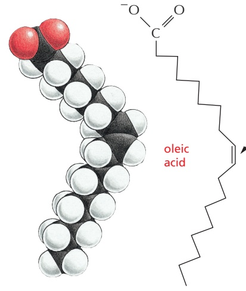

This double bond is rigid and creates a kink in the chain. The rest of the chain is free to rotate about the other C–C bonds.

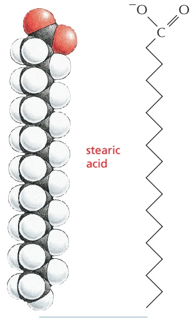

TRIACYLGLYCEROLS

Fatty acids are stored in cells as an energy reserve (fats and oils) through an ester linkage to glycerol to form triacylglycerols, also known as triglycerides.

stearic acid (C18)

$$
\mathrm{H} _ {2} \mathrm{C} - \mathrm{OH}
$$

$$
\mathrm{H} _ {2} \stackrel {\mathrm{T}} {\mathrm{C}} - \mathrm{OH}
$$

glycerol

## CARBOXYL GROUP

If free, the carboxyl group of a fatty acid will be ionized.

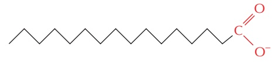

But more often it is linked to other groups to form either esters

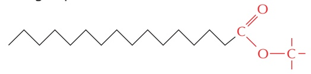

or amides.

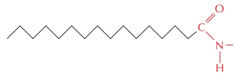

Phospholipids are the major constituents of cell membranes.

general structure of a phospholipid

In phospholipids, two of the –OH groups in glycerol are linked to fatty acids, while the third –OH group is linked to phosphoric acid. The phosphate, which carries a negative charge, is further linked to one of a variety of small polar groups, such as choline.

---

103

## LIPID AGGREGATES

Fatty acids have a hydrophilic head and a hydrophobic tail.

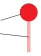

In water, they can form either a surface film or small, spherical micelles.

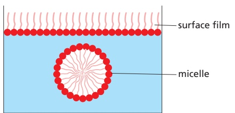

Their derivatives can form larger aggregates held together by hydrophobic forces:

Triacylglycerols form large, spherical fat droplets in the cell cytoplasm.

Phospholipids and glycolipids form self-sealing lipid bilayers, which are the basis for all cell membranes.

## OTHER LIPIDS

Lipids are defined as water-insoluble molecules that are soluble in organic solvents. Two other common types of lipids are steroids and polyisoprenoids. Both are made from isoprene units.

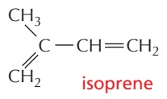

## STEROIDS

Steroids have a common multiple-ring structure.

cholesterol—found in many cell membranes

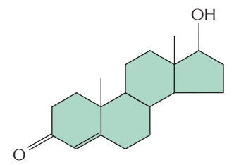

testosterone—male sex hormone

## GLYCOLIPIDS

Like phospholipids, these compounds are composed of a hydrophobic region, containing two long hydrocarbon tails, and a polar region, which contains one or more sugars. Unlike phospholipids, there is no phosphate.

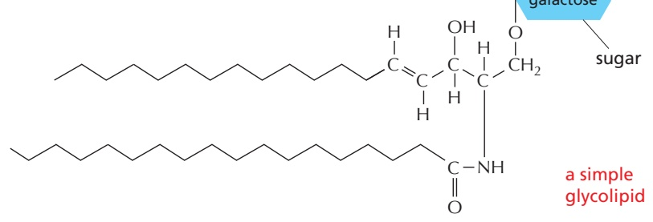

## POLYISOPRENOIDS

Long-chain polymers of isoprene

dolichol phosphate—used to carry activated sugars in the membraneassociated synthesis of glycoproteins and some polysaccharides

---

104

PANEL 2–6: A Survey of the Nucleotides

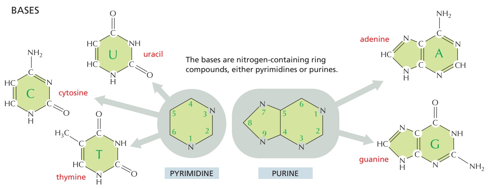

## PHOSPHATES

The phosphates are normally joined to the C5 hydroxyl of the ribose or deoxyribose sugar (designated 5′). Mono-, di-, and triphosphates are common.

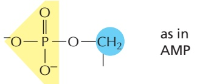

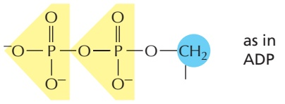

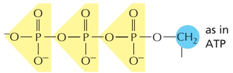

The phosphate makes a nucleotide negatively charged.

## NUCLEOTIDES

A nucleotide consists of a nitrogen-containing base, a five-carbon sugar, and a phosphate group.

Nucleotides are the subunits of the nucleic acids.

## BASE–SUGAR LINKAGE

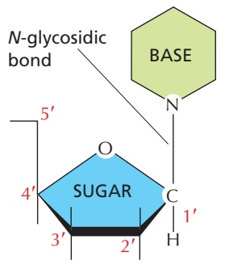

The base is linked to the same carbon (C1) used in sugar–sugar bonds.

## SUGARS

## PENTOSE

a five-carbon sugar

Each numbered carbon on the sugar of a nucleotide is followed by a prime mark; therefore, one speaks of the “5-prime carbon,” etc.

two kinds of pentoses are used β-D-ribose used in ribonucleic acid (RNA)

β-D-2-deoxyribose used in <u>deoxyribo</u>nucleic acid (DNA)

---

105

NOMENCLATURE

| BASE | NUCLEOSIDE | ABBR. |
| --- | --- | --- |
| adenine | adenosine | A |
| guanine | guanosine | G |
| cytosine | cytidine | C |
| uracil | uridine | U |
| thymine | thymidine | T |

A nucleoside or nucleotide is named according to its nitrogenous base.

Single-letter abbreviations are used variously as shorthand for (1) the base alone, (2) the nucleoside, or (3) the whole nucleotide— the context will usually make clear which of the three entities is meant. When the context is not sufficient, we will add the terms “base,” “nucleoside,” “nucleotide,” or—as in the examples below—use the full 3-letter nucleotide code.

AMP= adenosine monophosphate

dAMP= deoxyadenosine monophosphate

UDP= uridine diphosphate

ATP= adenosine triphosphate

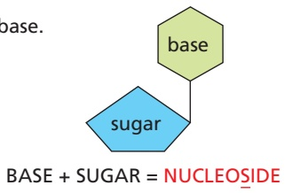

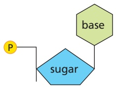

BASE + SUGAR + PHOSPHATE = NUCLEOTIDE

## NUCLEIC ACIDS

To form nucleic acid polymers, nucleotides are joined together by phosphodiester bonds between the 5’ and 3’ carbon atoms of adjacent sugar rings. The linear sequence of nucleotides in a nucleic acid chain is abbreviated using a one-letter code, such as AGCTT, starting with the 5’ end of the chain.

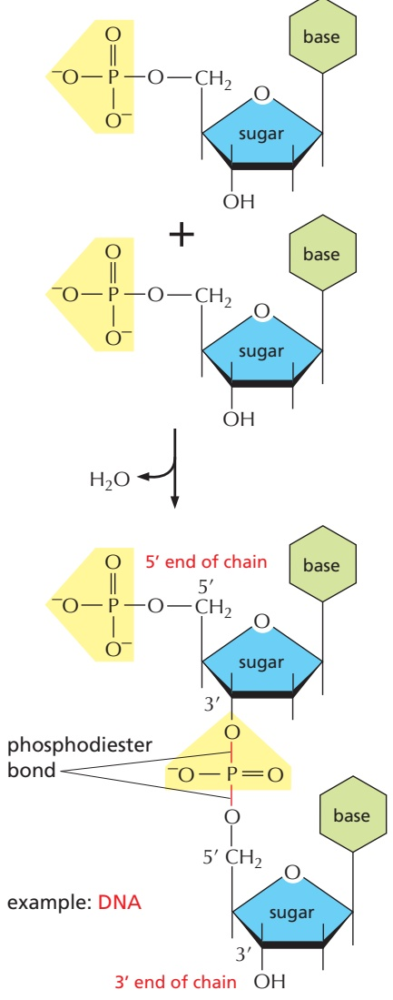

## NUCLEOTIDES AND THEIR DERIVATIVES HAVE MANY OTHER FUNCTIONS

1 As nucleoside di- and triphosphates, they carry chemical energy in their easily hydrolyzed phosphoanhydride bonds.

2 They combine with other groups to form coenzymes.

3 They are used as small intracellular signaling molecules in the cell.

example: cyclic AMP (cAMP)

---

106

PANEL 2–7: Free Energy and Biological Reactions

## THE IMPORTANCE OF FREE ENERGY FOR CELLS

Life is possible because of the complex network of interacting chemical reactions occurring in every cell. In viewing the metabolic pathways that comprise this network, one might suspect that the cell has had the ability to evolve an enzyme to carry out any reaction that it needs. But this is not so. Although enzymes are powerful catalysts, they can promote only those reactions that are thermodynamically possible; other reactions proceed in cells only because they are coupled to very favorable reactions that drive them.

The question of whether a reaction can occur spontaneously, or instead needs to be coupled to another reaction, is central to cell biology. The answer is obtained by reference to a quantity called the free energy. In this Panel, we shall explain some of the fundamental ideas—derived from a special branch of chemistry and physics called thermodynamics—that are required for understanding what free energy is and why it is so important to cells.

## ENERGY RELEASED BY CHANGES IN CHEMICAL BONDING IS CONVERTED INTO HEAT

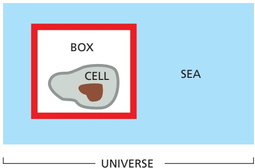

An enclosed system is defined as a collection of molecules that does not exchange matter with the rest of the universe (e.g., the “cell in a box” shown above). Any such system will contain molecules with a total energy E. This energy will be distributed in a variety of ways: some as the translational energy of the molecules, some as their vibrational and rotational energies, but most as the bonding energies between the individual atoms that make up the molecules. Suppose that a reaction occurs in the system. The first law of thermodynamics places a constraint on what types of reactions are possible: it states that “in any process, the total energy of the universe remains constant.” For example, suppose that reaction A B occurs somewhere in the box and releases a great deal of chemical-bond energy. This energy will initially increase the intensity of molecular motions (translational, vibrational, and rotational) in the system, which is equivalent to raising its temperature. However, these increased motions will soon be transferred out of the system by a series

## THE SECOND LAW OF THERMODYNAMICS

Consider a container in which 1000 coins are all lying heads-up. If the container is shaken vigorously, subjecting the coins to the types of random motions that all molecules experience due to their frequent collisions with other molecules, one will end up with about half the coins oriented heads-down. The reason for this reorientation is that there is only a single way in which the original orderly state of the coins can be reinstated (every coin must lie heads-up), whereas there are many different ways (about $1 0 ^ { 2 9 8 } )$ to achieve a disorderly state in which there is an equal mixture of heads and tails; in fact, there are more ways of molecular collisions that heat up first the walls of the box and then the outside world (represented by the sea in our example). In the end, the system returns to its initial temperature, by which time all the chemical-bond energy released in the box has been converted into heat energy and transferred out of the box to the surroundings. According to the first law, the change in the energy in the box $( \Delta E _ { \mathrm { b o x } } ,$ which we shall denote as ΔE) must be equal and opposite to the amount of heat energy transferred, which we shall designate as h; that is, ΔE = \_h. Thus, the energy in the box (E) decreases when heat leaves the system.

E also can change during a reaction as a result of work being done on the outside world. For example, suppose that there is a small increase in the volume (ΔV) of the box during a reaction. Because the walls of the box must push against the constant pressure (P) in the surroundings in order to expand, this does work on the outside world and requires energy. The energy used is P(ΔV), which according to the first law must decrease the energy in the box (E) by the same amount. In most reactions, chemical-bond energy is converted into both work and heat. Enthalpy (H) is a composite function that includes both of these $\left( H = E + P V \right)$ . To be rigorous, it is the change in enthalpy (ΔH) in an enclosed system, and not the change in energy, that is equal to the heat transferred to the outside world during a reaction. Reactions in which H decreases release heat to the surroundings and are said to be “exothermic,” while reactions in which H increases absorb heat from the surroundings and are said to be “endothermic.” Thus, \_h = ΔH. However, the volume change is negligible in most biological reactions, so to a good approximation

$$
- h = \Delta H \approx \Delta E
$$

to achieve a 50–50 state than to achieve any other state. Each state has a probability of occurrence that is proportional to the number of ways it can be realized. The second law of thermodynamics states that “systems will change spontaneously from states of lower probability to states of higher probability.” Because states of lower probability are more ordered than states of higher probability, the second law can be restated: “the universe constantly changes so as to become more disordered.”

---

107

## THE ENTROPY, S

The second law (but not the first law) allows one to predict the direction of a particular reaction. But to make it useful for this purpose, one needs a convenient measure of the probability or, equivalently, the degree of disorder of a state. The entropy (S) is such a measure. It is a logarithmic function of the probability. Thus the change in entropy (ΔS) that occurs when the reaction $\mathsf { A }   \to   \mathsf { B }$ converts 1 mole of A into 1 mole of B is

$$
\Delta S = R \ln p _ {\mathrm{B}} / p _ {\mathrm{A}}
$$

where $p _ { \mathrm { A } }$ and $p _ { \mathrm { B } }$ are the probabilities of the two states A and B, R is the gas constant $( 8 . 3 \dot { 1 } \mathsf { J }   \mathsf { K } ^ { - 1 }$ mole\_1), and ΔS is measured in entropy units (eu).

For 1000 coins, the relative probability of all heads (state A) versus half heads and half tails (state B) is equal to the ratio of the number of different ways that the two results can be obtained. One can calculate that $p _ { \mathsf { A } } = 1$ and $p _ { \mathsf { B } } = 1 0 0 0 ! ( 5 0 0 ! \times 5 0 0 ! ) = 1 0 ^ { 2 9 8 }$ Therefore, the entropy change for the reorientation of the coins

## THE GIBBS FREE ENERGY, G

When dealing with an enclosed biological system, one would like to have a simple way of predicting whether a given reaction will or will not occur spontaneously in the system. We have seen that the crucial question is whether the entropy change for the universe is positive or negative when that reaction occurs. In our idealized system, the cell in a box, there are two separate components to the entropy change of the universe—the entropy change for the system enclosed in the box and the entropy change for the surrounding “sea”—and both must be added together before any prediction can be made. For example, it is possible for a reaction to absorb heat and thereby decrease the entropy of the sea $( \Delta S _ { \mathsf { s e a } }   <   0 )$ and at the same time cause such a large degree of disordering inside the box $( \Delta S _ { \mathrm { b o x } } > 0 )$ that the total $\Delta \mathsf { S } _ { \mathsf { u n i v e r s e } } = \Delta \mathsf { S } _ { \mathsf { s e a } } + \Delta \mathsf { S } _ { \mathsf { b o x } }$ is greater than zero. In this case, the reaction will occur spontaneously, even though the sea gives up heat to the box during the reaction. An example of such a reaction is the dissolving of sodium chloride in a beaker containing water (the “box”), which is a spontaneous process even though the temperature of the water drops as the salt goes into solution.

Chemists have found it useful to define a number of new “composite functions” that describe combinations of physical properties of a system. The properties that can be combined include the temperature $( T ) ,$ pressure (P), volume (V), energy $( E ) ,$ and entropy (S). The enthalpy (H) is one such composite function. But by far the most useful composite function for biologists is the Gibbs free energy, G. It serves as an accounting device that allows one to deduce the entropy change of the universe resulting from a chemical reaction in the box, while avoiding any separate consideration of the entropy change in the sea. The definition of G is

$$
G = H - T S
$$

where, for a box of volume V, H is the enthalpy described earlier $( E + P V ) ,$ T is the absolute temperature, and S is the entropy. Each of these quantities applies to the inside of the box only. The change in free energy during a reaction in the box (the G of the products minus the G of the starting materials) is denoted as ΔG and, as we shall now demonstrate, it is a direct measure of the amount of disorder that is created in the universe when the reaction occurs.

when their container is vigorously shaken and an equal mixture of heads and tails is obtained is R In $( 1 0 ^ { 2 9 8 } )$ , or about 1370 eu per mole of such containers $( 6 \times 1 0 ^ { 2 3 }$ containers). Because ΔS defined above is positive for the transition from state A to state B $( p _ { \mathrm { B } } / p _ { \mathrm { A } } > 1 )$ , reactions with an increase in S (i.e., for which $\Delta \mathsf { S } > 0 )$ are favored and will occur spontaneously.

Heat energy causes the random commotion of molecules. Because the transfer of heat from an enclosed system to its surroundings increases the number of different arrangements that the molecules in the outside world can have, it increases their entropy. It can be shown that the release of a fixed quantity of heat energy has a greater disordering effect at low temperature than at high temperature, and that the value of ΔS for the surroundings, as described above $( \Delta \mathsf { S } _ { \mathsf { s e a } } ) ,$ is precisely equal to $h _ { r }$ the amount of heat transferred to the surroundings from the system, divided by the absolute temperature (T ):

$$
\Delta S _ {\text {sea}} = h / T
$$

At constant temperature the change in free energy (ΔG) during a reaction equals $\Delta H - T \Delta { \sf S } .$ Remembering that $\Delta H = - h ,$ the heat absorbed from the sea, we have

$$
\begin{array}{c} - \Delta G = - \Delta H + T \Delta S \\ - \Delta G = h + T \Delta S, \text {so} - \Delta G / T = h / T + \Delta S \end{array}
$$

But h/T is equal to the entropy change of the sea $( \Delta \mathsf { S } _ { \mathsf { s e a } } ) ,$ and the ΔS in the above equation is $\Delta \mathsf { S } _ { \mathsf { b o x } } .$ Therefore

$$
- \Delta G / T = \Delta S _ {\text {sea}} + \Delta S _ {\text {box}} = \Delta S _ {\text {universe}}
$$

We conclude that the free-energy change is a direct measure of the entropy change of the universe. A reaction will proceed in the direction that causes the change in the free energy (ΔG) to be less than zero, because in this case there will be a positive entropy change in the universe when the reaction occurs.

For a complex set of coupled chemical reactions involving many different molecules, the total free-energy change can be computed simply by adding up the free energies of all the different molecular species after the reaction and comparing this value with the sum of free energies before the reaction. For common substances, the required free-energy values can be found from published tables. In this way, one can predict the direction of a reaction and thereby readily check the feasibility of any proposed mechanism. (Thus, for example, from the magnitude of the electrochemical proton gradient across the inner mitochondrial membrane and the ΔG for ATP hydrolysis inside the mitochondrion, one can be certain that the ATP synthase enzyme requires that more than one proton pass through it for each molecule of ATP that it synthesizes.)

The value of ΔG for a reaction is a direct measure of how far the reaction is from equilibrium. The large negative value for ATP hydrolysis in a cell merely reflects the fact that cells keep the ATP hydrolysis reaction as much as 10 orders of magnitude away from equilibrium. If a reaction reaches equilibrium, $\Delta \mathsf { G } = \mathsf { 0 } ,$ that reaction then proceeds at precisely equal rates in the forward and backward directions. For ATP hydrolysis, equilibrium is reached when the vast majority of the ATP has been hydrolyzed, as occurs in a dead cell.

---

108

PANEL 2–8: Details of the 10 Steps of Glycolysis

For each step, the part of the molecule that undergoes a change is shadowed in blue, and the name of the enzyme that catalyzes the reaction is in a yellow box. Reactions represented by double arrows ( ) are readily reversible, whereas those represented by single arrows ( ) are effectively irreversible. To watch a video of the reactions of glycolysis, see Movie 2.5.

## STEP 1

Glucose is phosphorylated by ATP to form a sugar phosphate. The negative charge of the phosphate prevents passage of the sugar phosphate through the plasma membrane, trapping glucose inside the cell.

## STEP 2

A readily reversible rearrangement of the chemical structure (isomerization) moves the carbonyl oxygen from carbon 1 to H carbon 2, forming a ketose from an aldose sugar. (See Panel 2–4, pp. 100–101.)

## STEP 3

The new hydroxyl group on carbon 1 is phosphorylated by ATP, in preparation for the formation of two three-carbon sugar phosphates. The entry of sugars into glycolysis is controlled at this step, through regulation of the enzyme phosphofructokinase.

## STEP 4

The six-carbon sugar is cleaved to produce two three-carbon molecules. Only the glyceraldehyde 3-phosphate can proceed immediately through glycolysis.

## STEP 5

The other product of step 4, dihydroxyacetone phosphate, is isomerized to form a second molecule of glyceraldehyde 3-phosphate.

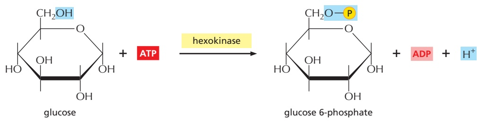

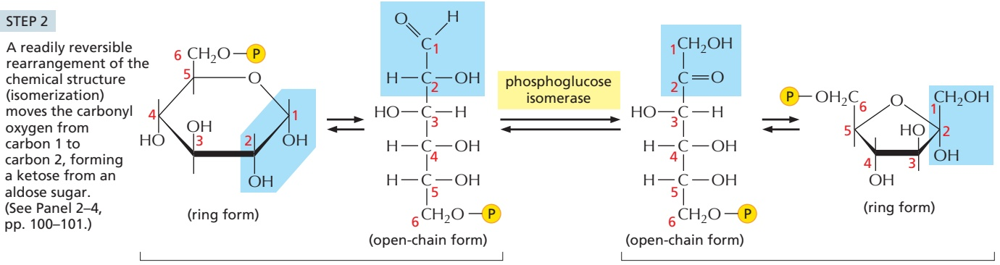

glucose 6-phosphate

fructose 6-phosphate

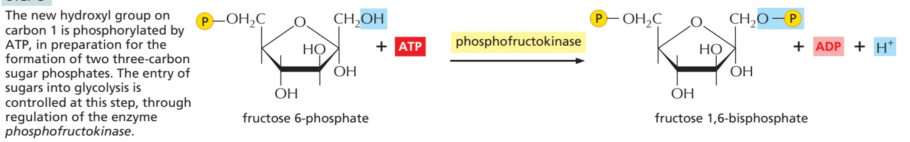

fructose 6-phosphate

phosphofructokinase

fructose 1,6-bisphosphate

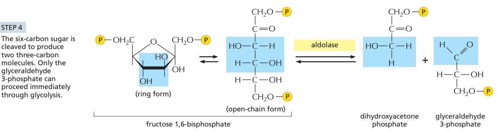

(ring form)

fructose 1,6-bisphosphate

(open-chain form)

dihydroxyacetone phosphate

glyceraldehyde 3-phosphate

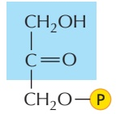

dihydroxyacetone phosphate

triose phosphate isomerase

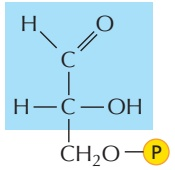

glyceraldehyde 3-phosphate