C HAP T E R

115

## Proteins

When we look at a cell through a microscope or analyze its electrical or biochemical activity, we are, in essence, observing proteins. Proteins constitute most of a cell’s dry mass. They are not only the cell’s building blocks; they also execute the majority of the cell’s functions. Proteins that are enzymes provide the intricate molecular surfaces inside a cell that catalyze its many chemical reactions. Proteins embedded in the plasma membrane form channels and pumps that control the passage of small molecules into and out of the cell. Other proteins carry messages from one cell to another or act as signal integrators that relay sets of signals inward from the plasma membrane to the cell nucleus. Yet others serve as tiny molecular machines with moving parts: kinesin, for example, propels organelles through the cytoplasm; topoisomerase can untangle knotted DNA molecules. Other specialized proteins act as antibodies, toxins, hormones, antifreeze molecules, elastic fibers, ropes, or sources of luminescence. Before we can hope to understand how genes work, how muscles contract, how nerves conduct electricity, how embryos develop, or how our bodies function, we must attain a deep understanding of proteins.

IN THIS CHAPTER The Atomic Structure of Proteins Protein Function

## THE ATOMIC STRUCTURE OF PROTEINS

From a chemical point of view, proteins are by far the most structurally complex and functionally sophisticated molecules known. This is perhaps not surprising, once we realize that the structure and chemistry of each protein have been developed and fine-tuned over billions of years of evolutionary history. The theoretical calculations of population geneticists reveal that, over evolutionary time periods, a surprisingly small selective advantage is enough to cause a randomly altered protein sequence to spread through a population of organisms. Yet, even to experts, the remarkable versatility of proteins can seem truly amazing.

In this section, we consider how the location of each amino acid in a protein’s long string of amino acids determines its three-dimensional shape. Later in the chapter, we use this understanding of protein structure at the atomic level to describe how the precise shape of each protein molecule determines its function in a cell.

## The Structure of a Protein Is Specified by Its Amino Acid Sequence

There are 20 different types of amino acids in proteins that are encoded directly in an organism’s DNA, each with different chemical properties. Every **protein** molecule consists of a long unbranched chain of these amino acids, each linked to its neighbor through a covalent peptide bond (**Figure 3–1A**). Proteins are therefore also known as polypeptides. Each type of protein has a unique sequence of amino acids, and there are many thousands of different proteins in a cell.

The repeating sequence of atoms along the core of the polypeptide chain is referred to as the **polypeptide backbone**. Attached to this repetitive backbone are those portions of the amino acids that are not involved in making

---

116

Chapter 3: Proteins

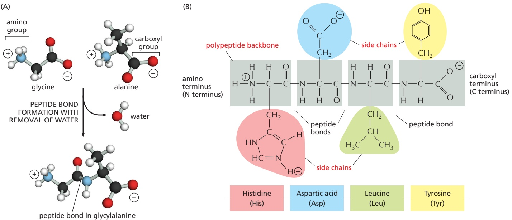

Figure 3–1 The components of a protein. (A) Formation of a peptide bond. This covalent bond forms when the carbon atom of the carboxyl group of one amino acid (such as glycine) shares electrons with the nitrogen atom from the amino group of a second amino acid (such as alanine). As indicated, a molecule of water is eliminated in this condensation reaction (see Figure 2–9). In this model, carbon atoms are black, nitrogen blue, oxygen red, and hydrogen white. (B) A two-dimensional representation of a short section of polypeptide backbone with its attached side chains. Each type of protein differs in its sequence and number of amino acids; it is the sequence of the chemically different side chains that makes each protein distinct. The two ends of a polypeptide chain are chemically different: the end carrying the free amino group (NH2, which takes up a proton at neutral pH to become NH3+) is the amino terminus, or N-terminus, and the end carrying the free carboxyl group (COOH, which loses a proton at neutral pH to become COO–) is the carboxyl terminus, or C-terminus. Note that, for simplicity, in many figures in this textbook, NH2 and COOH are used to denote these termini, instead of their actual ionized forms. The amino acid sequence of a protein is always presented in the N-to-C direction, reading from left to right.

a peptide bond; these are the 20 different amino acid **side chains** that give each amino acid its unique properties (**Figure 3–1B**). Some of these side chains are nonpolar and hydrophobic (“water-fearing”), others are negatively or positively charged, some can readily form covalent bonds, and so on. **Panel 3–1** (pp. 118–119) shows their atomic structures, and **Figure 3–2** lists their abbreviations.

<table><tr><td colspan="3">AMINO ACID</td><td>SIDE CHAIN</td></tr><tr><td>Aspartic acid</td><td>Asp</td><td>D</td><td>acidic (negative charge)</td></tr><tr><td>Glutamic acid</td><td>Glu</td><td>E</td><td>acidic (negative charge)</td></tr><tr><td>Arginine</td><td>Arg</td><td>R</td><td>basic (positive charge)</td></tr><tr><td>Lysine</td><td>Lys</td><td>K</td><td>basic (positive charge)</td></tr><tr><td>Histidine</td><td>His</td><td>H</td><td>basic (positive charge)</td></tr><tr><td>Asparagine</td><td>Asn</td><td>N</td><td>uncharged polar</td></tr><tr><td>Glutamine</td><td>Gln</td><td>Q</td><td>uncharged polar</td></tr><tr><td>Serine</td><td>Ser</td><td>S</td><td>uncharged polar</td></tr><tr><td>Threonine</td><td>Thr</td><td>T</td><td>uncharged polar</td></tr><tr><td>Tyrosine</td><td>Tyr</td><td>Y</td><td>uncharged polar</td></tr></table>

<table><tr><td colspan="3">AMINO ACID</td><td>SIDE CHAIN</td></tr><tr><td>Alanine</td><td>Ala</td><td>A</td><td>nonpolar</td></tr><tr><td>Glycine</td><td>Gly</td><td>G</td><td>nonpolar</td></tr><tr><td>Valine</td><td>Val</td><td>V</td><td>nonpolar</td></tr><tr><td>Leucine</td><td>Leu</td><td>L</td><td>nonpolar</td></tr><tr><td>Isoleucine</td><td>Ile</td><td>I</td><td>nonpolar</td></tr><tr><td>Proline</td><td>Pro</td><td>P</td><td>nonpolar</td></tr><tr><td>Phenylalanine</td><td>Phe</td><td>F</td><td>nonpolar</td></tr><tr><td>Methionine</td><td>Met</td><td>M</td><td>nonpolar</td></tr><tr><td>Tryptophan</td><td>Trp</td><td>W</td><td>nonpolar</td></tr><tr><td>Cysteine</td><td>Cys</td><td>C</td><td>nonpolar</td></tr></table>

Figure 3–2 The 20 amino acids commonly found in proteins. Each amino acid has a three-letter and a one-letter abbreviation. There are equal numbers of polar and nonpolar side chains; however, some side chains listed here as polar are large enough to have some nonpolar properties (for example, Thr, Tyr, Arg, Lys). For atomic structures, see Panel 3–1 (pp. 118–119).

---

THE ATOMIC STRUCTURE OF PROTEINS

117

(B)

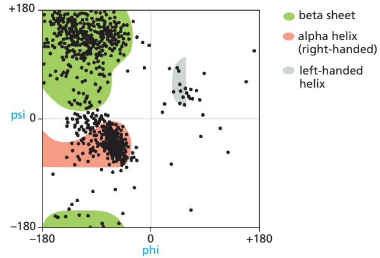

Figure 3–3 Steric limitations on the bond angles in a polypeptide chain. (A) Each amino acid contributes three bonds (red) to the backbone of the chain. Because it has a partial double-bond character, the peptide bond is planar (gray shading) and does not permit free rotation. By contrast, rotation can occur about the $\mathrm { C _ { \alpha } \mathrm { - C } }$ bond, whose angle of rotation is called psi (Ψ), and about the $N { - } C _ { \alpha }$ bond, whose angle of rotation is called phi (ϕ). By convention, an R group is often used to denote an amino acid side chain (purple circles). (B) The conformation of the main-chain atoms in a protein is determined by one pair of ϕ and Ψ angles for each amino acid; because of steric restrictions, most of the possible pairs of ϕ and Ψ angles do not occur. In this so-called Ramachandran plot, each dot represents an observed pair of angles in a protein. The three differently shaded clusters of dots reflect three different secondary structures repeatedly found in proteins. Most prominent are the alpha helix and the beta sheet, as will be described in the text. (B, from J. Richardson, Adv. Prot. Chem. 34:174–175, 1981. With permission from Elsevier.)

As discussed in Chapter 2, atoms behave almost as if they were hard spheres with a definite radius (their van der Waals radius). Other constraints limit the possible bond angles in a polypeptide chain, and this—plus the requirementMBoC7 m3.03/3.03 that no two atoms overlap—severely restricts the possible three-dimensional arrangements (or conformations) of proteins. As illustrated in **Figure 3–3**, these steric restrictions (which include a delocalization of electrons in the peptide bond that makes that linkage planar) confine the energy minima for the bond angles in polypeptides to a narrow range. But a long flexible chain such as a protein can still fold in an enormous number of different ways.

The folding of a protein chain is determined by many different sets of weak noncovalent bonds that form between one part of the chain and another. These involve atoms in the polypeptide backbone, as well as atoms in the amino acid side chains. There are three types of these weak bonds: hydrogen bonds, electrostatic attractions, and van der Waals attractions, as explained in Chapter 2 (see p. 51). Individual noncovalent bonds are 30–300 times weaker than the typical covalent bonds that create biological molecules. But many weak bonds acting in parallel can hold two regions of a polypeptide chain tightly together. It is the combined strength of large numbers of these noncovalent bonds that stabilizes each protein’s folded shape (**Figure 3–4**).

A fourth weak force—a hydrophobic clustering force—also has a central role in determining the shape of a protein. As described in Chapter 2, hydrophobic molecules, including the nonpolar side chains of particular amino acids, tend to be forced together in an aqueous environment in order to minimize their disruptive effect on the hydrogen-bonded network of water molecules (see Panel 2–2, pp. 96–97). Therefore, an important factor governing the folding of any protein is the distribution of its polar and nonpolar amino acids. The nonpolar (hydrophobic) side chains in a protein—belonging to such amino acids as phenylalanine, leucine, valine, and tryptophan—tend to cluster in the interior of the molecule (just as hydrophobic oil droplets coalesce in water to form one large droplet). This enables these side chains to avoid contact with the water that surrounds them inside a cell. In contrast, polar groups—such as those belonging to arginine, glutamine, and histidine—tend to arrange themselves near the outside of the molecule, where they can form hydrogen bonds with water and with other polar molecules (**Figure 3–5**). Any polar amino acids that are left buried within the protein are usually hydrogen-bonded to other polar amino acids or to the polypeptide backbone.

---

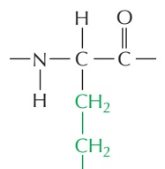

118

PANEL 3–1: The 20 Amino Acids Found in Proteins

## FAMILIES OF AMINO ACIDS

The common amino acids are grouped according to whether their side chains are

acidic

basic

uncharged polar nonpolar

These 20 amino acids are given both three-letter and one-letter abbreviations.

Thus: alanine $\mathbf { \partial } = \mathbf { A } | \mathbf { \partial } \mathbf { a } = \mathbf { A }$

## BASIC SIDE CHAINS

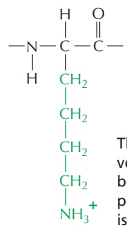

This group is very basic because its positive charge is stabilized by resonance (see Panel 2–1).

These nitrogens have a relatively weak affinity for an H+ and are only partly positive at neutral pH.

## THE AMINO ACID

The general formula of an amino acid is

R is commonly one of 20 different side chains. At pH 7, both the amino and carboxyl groups are ionized.

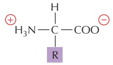

OPTICAL ISOMERS

The α-carbon atom is asymmetric, allowing for two mirror-image (or stereo-) isomers, L and D.

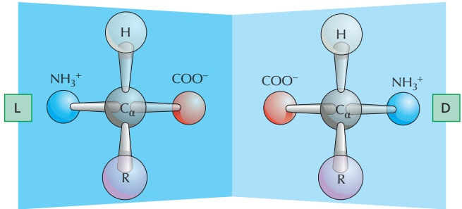

Proteins contain exclusively L-amino acids.

## PEPTIDE BONDS

In proteins, amino acids are joined together by an amide linkage, called a peptide bond.

Proteins are long polymers of amino acids linked by peptide bonds, and they are always written with the N-terminus toward the left. Peptides are shorter, usually fewer than 50 amino acids long. The sequence of this tripeptide is histidine–cysteine–valine.

The four atoms involved in each peptide bond form a rigid planar unit (red box). There is no rotation around the C–N bond.

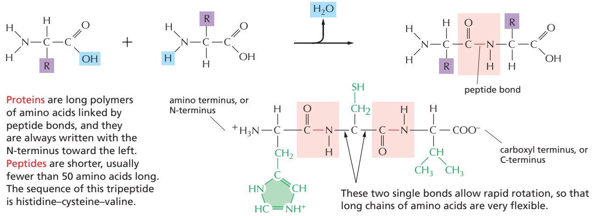

These two single bonds allow rapid rotation, so that long chains of amino acids are very flexible.

---

119

ACIDIC SIDE CHAINS

aspartic acid

(Asp, or D)

H O N C C H CH2 ()

glutamic acid

(Glu, or E)

H O N C C H CH2 CH2 C O

UNCHARGED POLAR SIDE CHAINS

asparagine

(Asn, or N)

glutamine

(Gln, or Q)

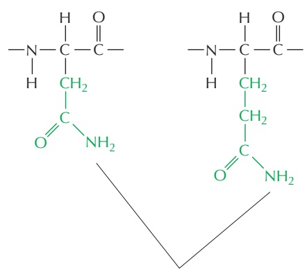

Although the amide N is not charged at neutral pH, it is polar.

serine

(Ser, or S)

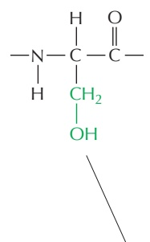

threonine

(Thr, or T)

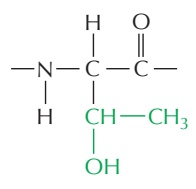

tyrosine

(Tyr, or Y)

The –OH group is polar.

NONPOLAR SIDE CHAINS

(Ala, or A)

valine

H O C CN HCH3

(Val, or V)

H O C CN H CH H3C CH3

leucine

isoleucine

(Leu, or L)

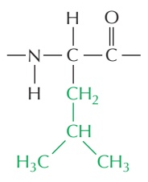

(Ile, or I)

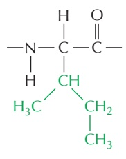

proline

(Pro, or P)

phenylalanine

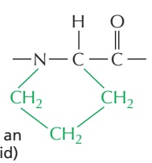

(Phe, or F)

(actually an imino acid)

## methionine

tryptophan

(Met, or M)

(Trp, or W)

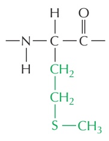

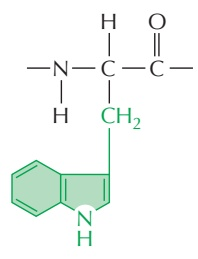

glycine

(Gly, or G)

cysteine

(Cys, or C)

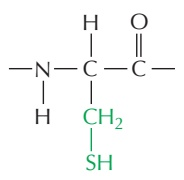

A disulfide bond (red) can form between two cysteine side chains in proteins.

---

120

Chapter 3: Proteins

Figure 3–4 Three types of noncovalent bonds help proteins fold. Although a single one of these bonds is quite weak, many of them often act together to create a strong bonding arrangement, as in the example shown. As in the previous figure, R is used as a general designation for an amino acid side chain.

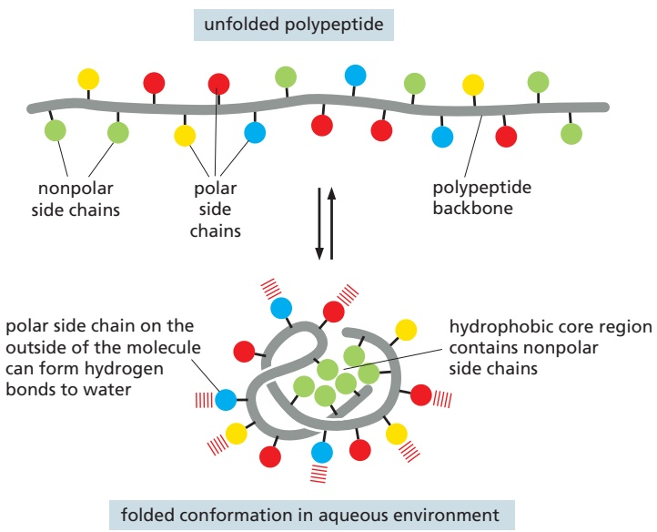

Figure 3–5 How a protein folds into a compact conformation. The polar amino acid side chains tend to lie on the outside of the protein, where they can interact with water; the nonpolar amino acid side chains are buried on the inside forming a tightly packed hydrophobic core of atoms that are hidden from water. In this highly schematic drawing, the protein contains only 17 amino acids; actual proteins are generally much larger.

---

THE ATOMIC STRUCTURE OF PROTEINS

121

## Proteins Fold into a Conformation of Lowest Energy

As a result of all of these interactions, most proteins have a particular threedimensional structure, which is determined by the order of the amino acids in a protein’s chain. The final folded structure, or **conformation**, of any polypeptide chain is generally the one that minimizes its free energy. Biologists have studied protein folding in a test tube using highly purified proteins. Treatment with certain solvents, which disrupt the noncovalent interactions holding the folded chain together, unfolds, or denatures, a protein. This treatment converts the protein into a flexible polypeptide chain that has lost its natural shape. When the denaturing solvent is removed, the protein often refolds spontaneously, or renatures, into its original conformation. This indicates that the amino acid sequence contains all of the information needed for specifying the three-dimensional shape of a protein, a critical point for understanding cell biology.

Most proteins fold up into a single stable conformation. However, this conformation is very dynamic, experiencing constant fluctuations caused by thermal energy. In addition, a protein’s conformation can change when the protein interacts with other molecules in the cell. This change in shape is often crucial to the function of the protein, as we explain in detail later.

Although a protein chain can fold into its correct conformation without outside help, special proteins called molecular chaperones often assist in protein folding (see Chapter 6). Molecular chaperones bind to partly folded polypeptide chains and help them progress along the most energetically favorable folding pathway. In the crowded conditions of the cytoplasm, chaperones are required to prevent the temporarily exposed hydrophobic regions in newly synthesized protein chains from associating with each other to form protein aggregates. However, the final three-dimensional shape of the protein is still specified by its amino acid sequence: chaperones simply make reaching the folded state more reliable.

## The α Helix and the β Sheet Are Common Folding Motifs

When we compare the three-dimensional structures of many different protein molecules, it becomes clear that, although the overall conformation of each protein is unique, two regular folding patterns are often found within them. Both patterns were discovered 70 years ago from studies of hair and silk. The first folding pattern to be described, called the **a helix**, was found in the protein a-keratin, which forms the filaments in hair. Within a year of the discovery of the α helix, a second folded structure, called a **b sheet**, was found in the protein fibroin, the major constituent of silk. These two patterns are common because they result from hydrogen-bonding between the N}H and C�O groups in the polypeptide backbone, without involving the side chains of the amino acids. Thus, although incompatible with some amino acid side chains, many different amino acid sequences can form them. In each case, the protein chain adopts a regular, repeating conformation. **Figure 3–6** illustrates the detailed structures of these two important conformations, which in ribbon models of proteins are represented by a helical ribbon and by a set of aligned arrows, respectively.

The cores of many proteins contain extensive regions of β sheet. As shown in **Figure 3–7**, these β sheets can form either from neighboring segments of the polypeptide backbone that run in the same orientation (parallel chains) or from a polypeptide backbone that folds back and forth upon itself, with each section of the chain running in the direction opposite to that of its immediate neighbors (antiparallel chains). Both types of β sheet produce a very rigid structure, held together by hydrogen bonds that connect the peptide bonds in neighboring chains (see Figure 3–6C).

---

122

Chapter 3: Proteins

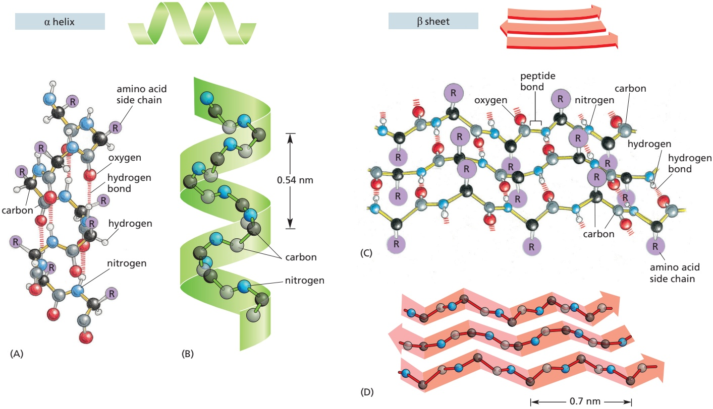

Figure 3–6 The regular conformation of the polypeptide backbone in the a helix and the b sheet. The α helix (alpha helix) is shown in (A) and (B). The N}H of every peptide bond is hydrogen-bonded to the C�O of a neighboring peptide bond located four peptide bonds away in the same chain. Note that all of the N}H groups point up in this diagram and that all of the C�O groups point down (toward the C-terminus); this gives a polarity to the helix, with the C-terminus having a partial negative and the N-terminus a partial positive charge (Movie 3.1). The β sheet (beta sheet) is shown in (C) and (D). In this example, adjacent peptide chains run in opposite (antiparallel) directions. Hydrogen-bonding between peptide bonds in different strands holds the individual polypeptide chains (strands) together in a β sheet, and the amino acid side chains inMB C7 3.07/3.06 each strand alternately project above and below the plane of the sheet. By convention, when arrows are used to represent a β sheet, the arrowheads point toward the C-terminus (Movie 3.2). (A) and (C) show all the atoms in the polypeptide backbone, but the amino acid side chains are truncated and denoted by R. (It has long been a convention to use R in this way.) In contrast, (B) and (D) show only the carbon and nitrogen backbone atoms.

An α helix is generated when a single polypeptide chain twists around on itself to form a rigid cylinder. A hydrogen bond forms between every fourth peptide bond, linking the C�O of one peptide bond to the N}H of another (see Figure 3–6A). This gives rise to a regular helix with a complete turn every 3.6 amino acids.

Regions of α helix are abundant in proteins located in cell membranes, such as transport proteins and receptors. As we discuss in Chapter 10, those portions of a transmembrane protein that cross the lipid bilayer usually cross as α helices composed largely of amino acids with nonpolar side chains. The polypeptide backbone, which is hydrophilic, is hydrogen-bonded to itself in the α helix and shielded from the hydrophobic lipid environment of the membrane by its protruding nonpolar side chains (see Figure 10–19).

In other proteins, α helices can wrap around each other to form a particularly stable structure, known as a **coiled-coil**. This structure can form when the two (or in some cases, three or four) α helices have most of their nonpolar (hydrophobic) side chains on one side, so that they can twist around each other with these side chains facing inward (**Figure 3–8**). Long rodlike coiled-coils provide the structural framework for many elongated proteins. Examples are α-keratin, which forms the intracellular fibers that reinforce the outer layer of the skin and its appendages, and the myosin molecules responsible for muscle contraction.

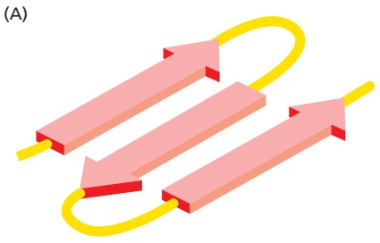

Figure 3–7 Two types of b sheet structures. (A) An antiparallel β sheet (see Figure 3–6C). (B) A parallel β sheet. Both of these structures are common in proteins.

---

THE ATOMIC STRUCTURE OF PROTEINS

123

stripe of hydrophobic “a” and “d” amino acids

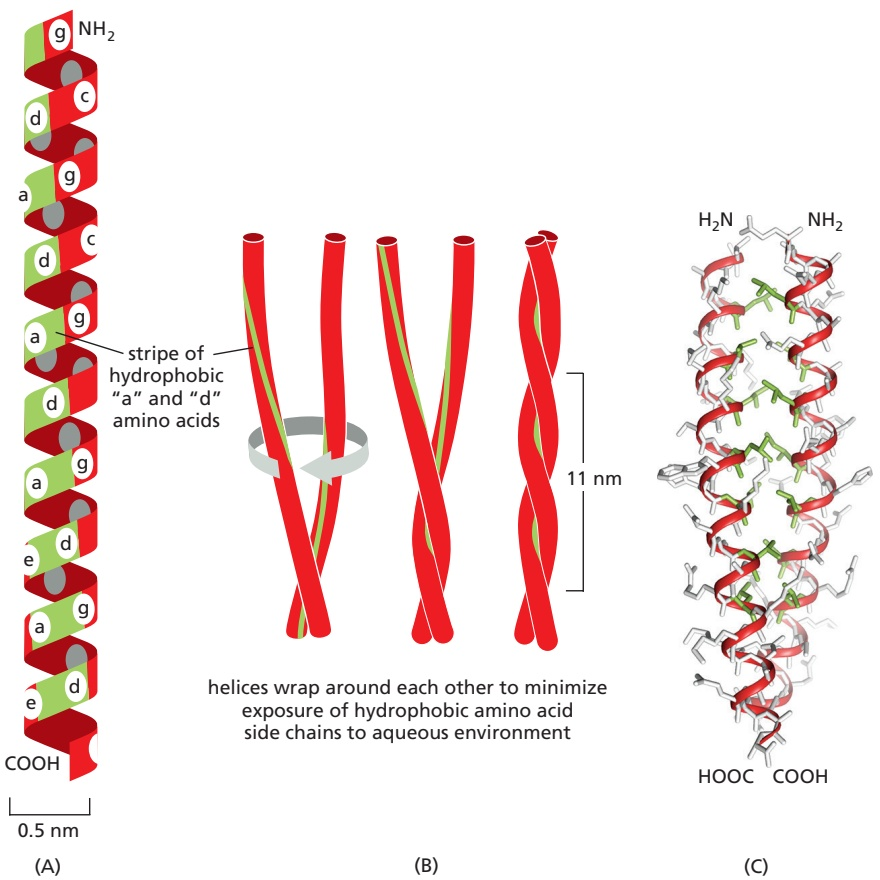

helices wrap around each other to minimize exposure of hydrophobic amino acid side chains to aqueous environment

Figure 3–8 A coiled-coil. (A) A single α helix, with successive amino acid side chains labeled in a sevenfold sequence, “abcdefg” (from top to bottom). Amino acids “a” and $\text{" } \triangleleft  \text{" }$ in such a sequence lie close together on the cylinder surface, forming a “stripe” (green) that winds slowly around the α helix. Proteins that form coiled-coils typically have nonpolar amino acids at positions $\text{" } \underline{ a }  \text{" }$ and “d.” Consequently, as shown in (B), the two α helices can wrap around each other with the nonpolar side chains of one α helix interacting with the nonpolar side chains of the other. (C) The atomic structure of a coiled-coil determined by x-ray crystallography. The α-helical backbone is shown in red and the nonpolar side chains in green, while the more hydrophilic amino acid side chains, shown in gray, are left exposed to the aqueous environment (Movie 3.3). Coiled-coils can also form MBoCfrom three α helices. (PDB code: 3NMD.)

## Four Levels of Organization Are Considered to Contribute to Protein Structure

Scientists have found it useful to define four levels of organization that successively generate the structure of a protein. The first level is the protein’s amino acid sequence, which is known as its **primary structure**; this sequence is unique for each protein, as determined by the gene that encodes that protein. At the next level, those stretches of the polypeptide chain that form α helices and β sheets constitute the protein’s **secondary structure**. The full three-dimensional organization of a polypeptide chain—including its α helices, β sheets, and the many twists and turns that form between its N- and C-termini—is referred to as the protein’s **tertiary structure**. And finally, if a protein molecule is formed as a complex of more than one polypeptide chain, its complete conformation is designated as its **quaternary structure**.

Because even a small protein molecule is built from thousands of atoms linked together by precisely oriented covalent and noncovalent bonds, biologists are aided in visualizing these extremely complicated structures by computer-based three-dimensional displays. The student resource site that accompanies this book contains computer-generated images of selected proteins, which can be displayed and rotated on the screen in a variety of formats (Movie 3.4).

---

124

Chapter 3: Proteins

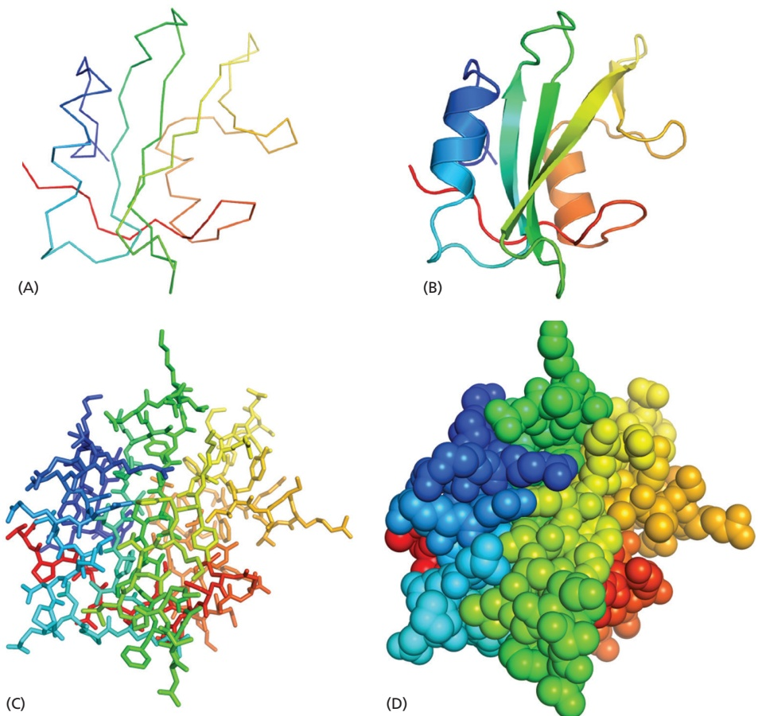

Figure 3–9 Four representations that are commonly used to describe the structure of a protein. Constructed from a string of 100 amino acids, the SH2 domain is part of many different proteins. Here, its structure is displayed as (A) a polypeptide backbone model, (B) a ribbon model, (C) a wire model that includes the amino acid side chains, and (D) a space-filling model (Movie 3.4). Each image is colored in a way that allows the polypeptide chain to be followed from its N-terminus (purple) to its C-terminus (red). (PDB code: 1SHA.)

## Protein Domains Are the Modular Units from Which Larger Proteins Are Built

Proteins come in a wide variety of shapes, and most are between 50 and 2000 amino acids long. Large proteins usually consist of a set of smaller protein domains that are joined together. A **domain** is a structural unit that folds more or less independently, being formed from perhaps 40 to 350 contiguous amino acids, and it is a modular unit from which larger proteins are constructed.

To display a protein structure in three dimensions, several different representations are conventionally used, each of which emphasizes distinct features. As an example, **Figure 3–9** presents four representations of an important protein structure called the SH2 domain. The SH2 domain is present in many different proteins in eukaryotic cells, where it responds to cell signals to cause selected protein molecules to bind to each other, thereby altering cell behavior (see Chapter 15). Contributing to the tertiary structure of this domain are two α helices and a three-stranded, antiparallel β sheet, which are its critical secondary structure elements (see Figure 3–9B).

**Figure 3–10** presents ribbon models of three differently organized protein domains. As these examples illustrate, the central core of a domain can be constructed from α helices, from β sheets, or from various combinations of these two fundamental folding elements.

---

THE ATOMIC STRUCTURE OF PROTEINS

125

(A)

(B)

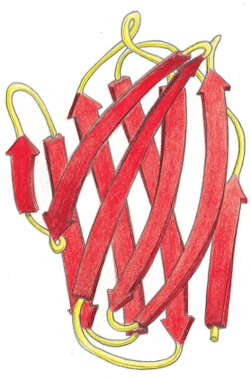

(C)

Figure 3–10 Ribbon models of three different protein domains. (A) Cytochrome $b _ { 5 6 2 } ,$ a single-domain protein involved in electron transport in mitochondria. This protein is composed almost entirely of α helices. (B) The NAD-binding domain of the enzyme lactate dehydrogenase, which is composed of a mixture of α helices and parallel β sheets. (C) The variable domain of an immunoglobulin (antibody) light chain, composed of a sandwich of two antiparallel β sheets. In these examples, the α helices are shown in green, while strands organized as β sheets are denoted by red arrows. Note how the polypeptide chain generally traverses back and forth across the entire domain, making sharp turns (Movie 3.5) only at the protein surface. It is the protruding loop regions (yellow) that often form the binding sites for other molecules.

The different domains of a protein are often associated with different functions. **Figure 3–11** shows an example—the Src protein kinase, which functions in signaling pathways inside vertebrate cells (Src is pronounced “sarc”). This protein is considered to have three domains: its SH2 and SH3 domains have regulatory roles—responding to signals that turn the kinase on and off—while its C-terminal domain is responsible for the kinase catalytic activity. Later in the chapter, we shall return to this protein to explain how proteins can form molecular switches that transmit information throughout cells.

(A)

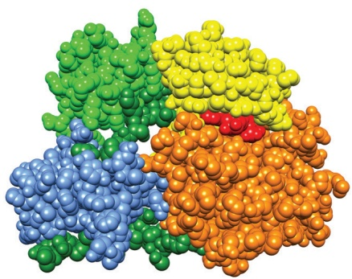

(B)

Figure 3–11 A protein formed from multiple domains. In the Src protein shown, a C-terminal domain with two lobes (yellow and orange) forms the core protein kinase enzyme, while its SH2 and SH3 domains perform regulatory functions. Note that both the SH2 and SH3 domains derive their names from this protein, being abbreviations for “Src homology 2” and “Src homology 3,” respectively. (A) A ribbon model, with ATP substrate in red. (B) A space-filling model, with ATP substrate in red. Note that the site that binds ATP is positioned at the interface of the two lobes that form the kinase domain. The human genome encodes about 300 different SH3 domains and 120 SH2 domains. The structure of the SH2 domain was illustrated in Figure 3–9. (PDB code: 2SRC.)

---

126

Chapter 3: Proteins

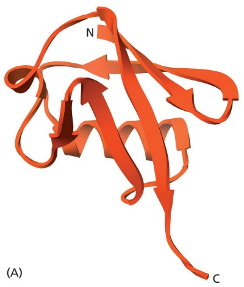

Figure 3–12 A folded protein molecule exists as an ensemble of closely related substructures, or conformers, as displayed here for ubiquitin. (A) A ribbon model that displays the structure of ubiquitin. Ubiquitin is a small protein widely used in cells, often being covalently attached to larger proteins, as described in Chapters 6 and 15. (B) In this diagram, a set of backbone conformations determined for ubiquitin has been overlaid to reveal regions that rapidly transition between different substructures. Superimposed on these structures are the rates of motion of the protein’s atoms, as observed in NMR residual dipolar coupling experiments. A color code has been used to indicate the magnitude of these rates, which are largest for red, with orange and yellow also being high. (A, PDB code 1UBI; B, from O.F. Lange et al., Science 320:1471–1475, 2008. With permission from AAAS.)

## Proteins Also Contain Unstructured Regions

The smallest protein molecules contain only a single domain, whereas larger proteins can contain several dozen domains, often connected to each other by short,MBoC7 n3.150/3.12 relatively unstructured lengths of polypeptide chain that can act as flexible hinges between domains. The ubiquity of such intrinsically disordered sequences, which continually bend and flex due to thermal buffeting, became appreciated only after bioinformatics methods were developed that could recognize them from their amino acid sequences. Current estimates suggest that a third of all eukaryotic proteins also possess longer, intrinsically disordered regions (IDRs)—greater than 30 amino acids in length—in their polypeptide chains. These intrinsically disordered regions can be very long, and they have important functions in cells, as discussed later in this chapter.

## All Protein Structures Are Dynamic, Interconverting Rapidly Between an Ensemble of Closely Related Conformations Because of Thermal Energy

Even though a protein has folded into a conformation of lowest free energy, this conformation is always being subjected to thermal bombardment from the Brownian motions of the many molecules that constantly collide with it. Thus the atoms in the protein are always moving, which causes neighboring regions of the protein to oscillate in concerted ways. These motions can now be precisely traced using special NMR techniques, as illustrated in **Figure 3–12** for the small protein ubiquitin.

From recent studies combining many types of analyses, we know that protein function exploits these rapid fluctuations—as when a loop on the surface of a protein flips out to expose a binding site for a second molecule. In fact, the function of a protein is generally dependent on that protein’s dynamic character, as we explain later when we discuss protein function in detail.

## Function Has Selected for a Tiny Fraction of the Many Possible Polypeptide Chains

Because each of the 20 amino acids is chemically distinct and each can, in principle, occur at any position in a protein chain, there are $20 \times 20 \times 20 \times 20 =$ 160,000 different possible polypeptide chains four amino acids long, or 20n different possible polypeptide chains n amino acids long. For a typical protein length of about 300 amino acids, a cell could theoretically make more than $1 0 ^ { 3 9 0 }   \widetilde { ( 2 0 ^ { 3 0 0 } ) }$ different polypeptide chains. This is such an enormous number that to produce

---

THE ATOMIC STRUCTURE OF PROTEINS

127

just one molecule of each kind would require many more atoms than exist in the universe.

Only a very small fraction of this vast set of conceivable polypeptide chains would adopt a stable three-dimensional conformation—by some estimates, less than one in a billion. And yet the majority of proteins present in cells do adopt unique and stable conformations. How is this possible? The answer lies in natural selection. A protein with an unpredictably variable structure and biochemical activity is unlikely to help the survival of a cell that contains it. Such proteins would therefore have been eliminated by natural selection through the enormously long trial-and-error process that underlies biological evolution.

Because evolution has selected for protein function in living organisms, present-day proteins have chemical properties that enable the protein to perform a particular catalytic or structural function in the cell. Proteins are so precisely built that the change of even a few atoms in one amino acid can sometimes disrupt the structure of the whole molecule so severely that all function is lost. And, as discussed later in this chapter, when certain rare protein misfolding accidents occur, the results can be disastrous for the organisms that contain them.

## Proteins Can Be Classified into Many Families

Once a protein had evolved that folded up into a stable conformation with useful properties, its structure was often modified during evolution to enable it to perform new functions. As we will discuss in Chapter 4, this process has been greatly accelerated by genetic mechanisms that duplicate genes accidentally, which allows gene copies to evolve independently to perform new functions. Because this type of event occurred frequently in the past, present-day proteins can be grouped into protein families, each family member having an amino acid sequence and a three-dimensional conformation that resemble those of the other family members.

Consider, for example, the serine proteases, a large family of protein-cleaving (proteolytic) enzymes that includes the digestive enzymes chymotrypsin, trypsin, and elastase, as well as several proteases involved in blood clotting. When the protease portions of any two of these enzymes are compared, parts of their amino acid sequences are found to match. The similarity of their three-dimensional conformations is even more striking: most of the detailed twists and turns in their polypeptide chains, which are several hundred amino acids long, are virtually identical (**Figure 3–13**). The many different serine proteases nevertheless have distinct enzymatic activities, each cleaving different proteins or the peptide bonds between different types of amino acids. Each therefore performs a distinct function in an organism.

The story we have told for the serine proteases could be repeated for hundreds of other protein families. In general, the structure of the different members of a protein family has been more highly conserved than has the amino acid sequence. In many cases, the amino acid sequences have diverged so far that we cannot be certain of a family relationship between two proteins without determining their three-dimensional structures. The yeast α2 protein and the Drosophila engrailed protein, for example, are both transcription regulatory proteins in the homeodomain family (discussed in Chapter 7). Because they are identical in only 17 of the 60 amino acids of their homeodomain, their relationship became certain only by comparing their three-dimensional structures (**Figure 3–14**). Many similar examples show that two proteins with more than 25% identity in their amino acid sequences usually share the same overall structure.

The various members of a large protein family often have distinct functions. Mutation is a random process. Some of the amino acid changes that make family members different were selected in the course of evolution because they resulted in useful changes in biological activity; these give the individual family members the different functional properties they have today. Other amino acid changes were effectively “neutral,” having neither a beneficial nor a damaging effect on

Figure 3–13 A comparison of the conformations of two serine proteases. The backbone conformations of elastase and chymotrypsin. Although only those MBoC7 m3.12/3.13amino acids in the polypeptide chain shaded in green are the same in the two proteins, the two conformations are very similar nearly everywhere. The active site of each enzyme is circled in red; this is where the peptide bonds of the proteins that serve as substrates are bound and cleaved by hydrolysis. The serine proteases derive their name from the amino acid serine, whose side chain is part of the active site of each enzyme and directly participates in the cleavage reaction. The two dots on the right side of the chymotrypsin molecule mark the new ends created when this enzyme cuts its own backbone.

---

128

Chapter 3: Proteins

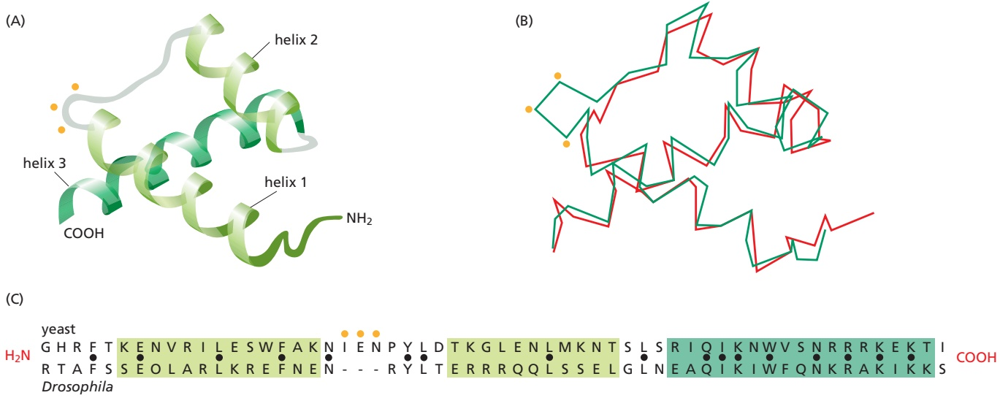

Figure 3–14 A comparison of a class of DNA-binding domains, called homeodomains, in a pair of proteins from two organisms separated by more than a billion years of evolution. (A) A ribbon model of the structure common to both proteins. (B) A trace of the α-carbon positions. The three-dimensional structures shown were determined by x-ray crystallography for the yeast α2 protein (green) and the Drosophila engrailed protein (red). (C) A comparison of amino acid sequences for the region of the proteins shown in A and B. Black dots mark sites with identical amino acids. Green shading has been used to mark the three α helices shown in A. Orange dots indicate the position of a three-amino-acid insert in the α2 protein. (Adapted from C. Wolberger et al., Cell 67:517–528, 1991.)

the basic structure and function of the protein. In addition, because mutation is random, there must also have been many deleterious changes that altered the three-dimensional structure of these proteins sufficiently to make them useless.. / . Such faulty proteins would have been readily lost during evolution.

Protein families are readily recognized when the genome of any organism is sequenced; for example, the determination of the DNA sequence for the entire human genome has revealed that we contain about 20,000 protein-coding genes. Through sequence comparisons, we can assign the products of more than half of our protein-coding genes to known protein structures belonging to more than 500 different protein families. Most of the proteins in each family have evolved to perform somewhat different functions, as for the enzymes elastase and chymotrypsin illustrated previously in Figure 3–13. These family members are sometimes called paralogs to distinguish them from orthologs—those evolutionarily related proteins that have the same function in different organisms (such as the mouse elastase and human elastase enzymes).

The current database of known protein sequences contains more than 100 million entries, and it is growing very rapidly as more and more genomes are sequenced—revealing huge numbers of new genes that encode proteins. The encoded polypeptides range widely in size, from 6 amino acids to a gigantic protein of 34,000 amino acids (titin, a structural protein in muscle).

As described in Chapters 8 and 9, because of the powerful techniques of x-ray crystallography, nuclear magnetic resonance (NMR), and cryo-electron microscopy, we now know the three-dimensional shapes, or conformations, of more than 100,000 of these proteins. By carefully comparing the conformations of these proteins, structural biologists (that is, experts on the structure of biological molecules) have concluded that there are a limited number of ways in which protein domains usually fold up in nature—estimated to be about 2000, if we consider all organisms. For most of these so-called protein folds, representative structures have been determined.

Protein comparisons are important because related structures often imply related functions. Many years of experimentation can be saved by discovering that a new protein has an amino acid sequence similarity with a protein of known

---

THE ATOMIC STRUCTURE OF PROTEINS

129

function. Such sequence relationships, for example, first indicated that certain genes that cause mammalian cells to become cancerous encode protein kinases (discussed in Chapter 20).

## Some Protein Domains Are Found in Many Different Proteins

As previously stated, most proteins are composed of a series of protein domains in which different regions of the polypeptide chain fold independently to form compact structures. Such multidomain proteins are believed to have originated from the accidental joining of the DNA sequences that encode each domain, creating a new gene. In an evolutionary process called domain shuffling, many large proteins have evolved through the joining of preexisting domains in new combinations (**Figure 3–15**). Novel binding surfaces have often been created at the juxtaposition of domains, and many of the functional sites where proteins bind to small molecules are found to be located there.

Figure 3–15 Domain shuffling. An extensive shuffling of blocks of protein sequence (protein domains) has occurred during protein evolution. Those portions of a protein denoted by the same shape and color in this diagram are evolutionarily related. Serine proteases such as chymotrypsin are formed from two domains (brown). In the three other proteases shown, which MBoC7 m3.14/3.15are highly regulated and more specialized, these two protease domains are connected to one or more domains that are similar to domains found in epidermal growth factor (EGF; green), to a calcium-binding protein (yellow), or to a kringle domain (blue). Chymotrypsin is illustrated in Figure 3–13.

A subset of protein domains has been especially mobile during evolution; these seem to have particularly versatile structures and are sometimes referred to as protein modules. The structure of one such module, the SH2 domain, was featured in Figure 3–9. Three other abundant protein domains are illustrated in **Figure 3–16**.

Each of these three domains has a stable core structure formed from strands of β sheets, from which less-ordered loops of polypeptide chain protrude. The loops are ideally situated to form binding sites for other molecules, as most clearly demonstrated for the immunoglobulin fold, which forms the basis for antibody molecules. Such β sheet–based domains may have achieved their evolutionary success because they provide a convenient framework for the generation of new binding sites for ligands, requiring only small changes to their protruding loops (see Figure 3–40).

A second feature of these protein domains that explains their utility is the ease with which they can be integrated into other proteins. Two of the three domains illustrated in Figure 3–16 have their N- and C-terminal ends at opposite poles of the domain. When the DNA encoding such a domain undergoes tandem duplication, which is not unusual in the evolution of genomes (discussed in Chapter 4), the duplicated domains with this in-line arrangement can be readily linked in series to form extended structures—either with themselves or with

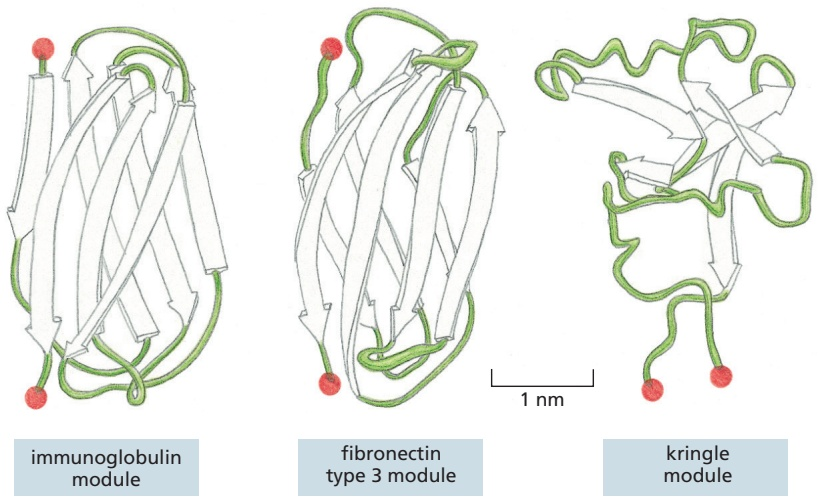

Figure 3–16 The three-dimensional structures of three commonly used protein domains. In these ribbon diagrams, β-sheet strands are shown as arrows, and the N- and C-termini are indicated by red spheres. Many more such “protein modules” exist in nature. (Adapted from D.J. Leahy et al., Science 258:987–991, 1992. With permission from AAAS.)

---

130

Chapter 3: Proteins

other in-line domains (**Figure 3–17**). Stiff extended structures composed of a series of domains are especially common in extracellular matrix molecules and in the extracellular portions of cell-surface receptor proteins. Other frequently used domains, including the SH2 domain and the kringle domain in Figure 3–16, are of a plug-in type, with their N- and C-termini close together. After genomic rearrangements, such domains are usually accommodated as an insertion into a loop region of a second protein.

A comparison of the relative frequency of domain utilization in different eukaryotes reveals that for many common domains, such as protein kinases, this frequency is similar in organisms as diverse as yeast, plants, worms, flies, and humans. But there are some notable exceptions, such as the major histocompatibility complex (MHC) antigen-recognition domain (see Figure 24–36) that is present in 57 copies in humans, but absent in the other four organisms just mentioned. Domains such as these have specialized functions that are not shared with the other eukaryotes; they are assumed to have been strongly selected for during recent evolution to produce the multiple copies observed.

## The Human Genome Encodes a Complex Set of Proteins, Revealing That Much Remains Unknown

The result of sequencing the human genome has been surprising, because it reveals that our chromosomes contain only about 20,000 protein-coding genes. On the basis of this number alone, we would appear to be no more complex than the tiny mustard weed, Arabidopsis, and only about 1.3-fold more complex than a nematode worm. The genome sequences also reveal that vertebrates have inherited nearly all of their protein domains from invertebrates—with only 7% of identified human domains being vertebrate specific.

Each of our proteins is on average more complicated, however (**Figure 3–18**). Domain shuffling during vertebrate evolution has given rise to many novel combinations of protein domains, with the result that there are nearly twice as many combinations of domains found in human proteins as in a worm or a fly. This extra variety in our proteins greatly increases the range of protein– protein interactions possible, but how it contributes to making us human is not known.

The complexity of living organisms is staggering, and it is quite sobering to note that we currently lack even the tiniest hint of what the function might be for more than 10,000 of the proteins that have been identified through examining the human genome. There are certainly enormous challenges ahead for the next generation of cell biologists, with no shortage of fascinating mysteries to solve.

## Protein Molecules Often Contain More Than One Polypeptide Chain

The same weak noncovalent bonds that enable a protein chain to fold into a specific conformation also allow proteins to bind to each other to produce larger structures in the cell. Any region of a protein’s surface that can interact with another molecule through sets of noncovalent bonds is called a **binding site**. A protein can contain binding sites for various large and small molecules. If a binding site recognizes the surface of a second protein, the tight binding of two folded polypeptide chains at this site creates a larger protein molecule with a precisely defined geometry. Each polypeptide chain in such a protein is called

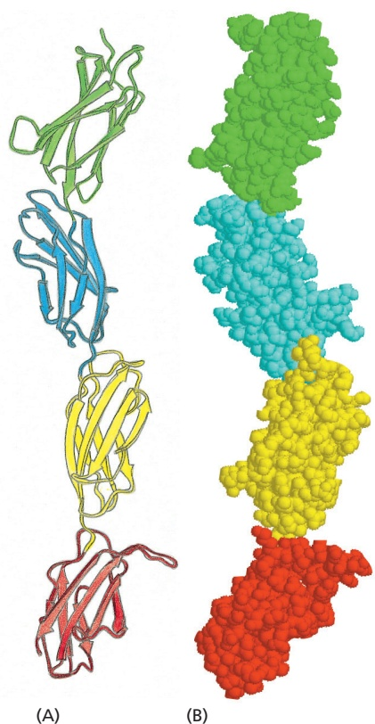

Figure 3–17 An extended structure formed from a series of protein domains. Four fibronectin type 3 domains (see Figure 3–16) from the extracellular matrix molecule fibronectin are illustrated in (A) ribbon and (B) space-filling models. (Adapted from D.J. Leahy et al., Cell 84:155–164, 1996.)

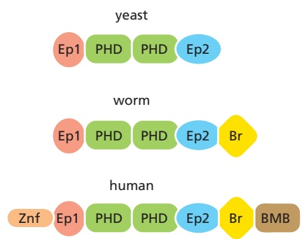

<small>Figure 3–18 Domains in a group of evolutionarily related proteins that have a similar function. In general, there is a tendency for the proteins in more complex organisms, such as humans, to contain additional domains compared to a less complex organism such as yeast—as is the case for the DNA-binding protein compared here.</small>

---

<small>Figure 3–20 Hemoglobin is a protein formed as a symmetrical assembly using two each of two different subunits. This abundant, oxygen-carrying protein in red blood cells contains two copies of α-globin (green) and two copies of β-globin (blue). Each of these four polypeptide chains contains a heme molecule (red), which is the site that binds oxygen (O2). Thus, each molecule of hemoglobin carries four molecules of oxygen. (PDB code: 2DHB.)</small>

THE ATOMIC STRUCTURE OF PROTEINS

131

Figure 3–19 Many protein molecules contain multiple copies of the same protein subunit. (A) A symmetrical dimer. The CAP protein, a bacterial transcription regulatory protein, is a complex of two identical polypeptide chains. (B) A symmetrical homotetramer. The enzyme neuraminidase exists as a ring of four identical polypeptide chains. For both A and B, a small schematic below the structure emphasizes how the repeated use of the same binding interaction forms the structure. In A, the use of the same binding site on each monomer (represented by brown and green ovals) causes the formation of a symmetrical dimer. In B, a pair of nonidentical binding sites (represented by orange circles and blue squares) causes the formation of a symmetrical tetramer.

a **protein subunit**. And the precise way that these subunits are arranged creates the protein’s quaternary structure—as introduced previously.

In the simplest case, two identical, folded polypeptide chains form a symmetrical complex of two protein subunits (called a dimer) that is held together by interactions between two identical binding sites. (**Figure 3–19A**). Symmetrical protein complexes that are formed from more than two copies of the same polypeptide chain are also commonly found in cells (**Figure 3–19B**).

Many other proteins contain two or more types of polypeptide chains. Hemoglobin, the protein that carries oxygen in red blood cells, contains two identical α-globin subunits and two identical β-globin subunits, symmetrically arranged (**Figure 3–20**). Such multisubunit proteins can be very large (**Movie 3.6**).

## Some Globular Proteins Form Long Helical Filaments

The proteins that we have discussed so far are globular proteins, in which the polypeptide chain folds up into a compact shape like a ball with an irregular surface. Some of these protein molecules can nevertheless assemble to form filaments that may span the entire length of a cell. Most simply, a long chain of identical protein molecules can be constructed if each molecule has a

---

132

Chapter 3: Proteins

Figure 3–21 Protein assemblies. (A) A protein with just one binding site can form a dimer with another identical protein. (B) Identical proteins with two different binding sites often form a long helical filament. (C) If the two binding sites are disposed appropriately in relation to each other, the protein subunits may form a closed ring instead of a helix. (For an example of A, see Figure 3–19A; for an example of B, see Figure 3–22; for an example of C, see Figure 14–32.)

(A)

binding site complementary to another region of the surface of the same molecule (**Figure 3–21**). An actin filament, for example, is a long helical structure produced from many molecules of the protein actin (**Figure 3–22**). Actin is a globular protein that is very abundant in eukaryotic cells, where it forms one of the major filament systems of the cytoskeleton (discussed in Chapter 16).

We will encounter many helical structures in this book. Why is a helix such a common structure in biology? As we have seen, biological structures are often formed by linking similar subunits into long, repetitive chains. If all the subunits are identical, the neighboring subunits in the chain can often fit together in only one way, adjusting their relative positions to minimize the free energy of the contact between them. As a result, each subunit is positioned in exactly the same way in relation to the next, so that subunit 3 fits onto subunit 2 in the same way that subunit 2 fits onto subunit 1, and so on. Because it is very rare for subunits to join up in a straight line, this arrangement generally results in a helix—a regular structure that resembles a spiral staircase, as illustrated in **Figure 3–23**. Depending on the twist of the staircase, a helix is said to be either right-handed or left-handed (see Figure 3–23E). Handedness is not affected by turning the helix upside down, but it is reversed if the helix is reflected in the mirror.

The observation that helices occur commonly in biological structures holds true whether the subunits are small molecules linked together by covalent bonds (for example, the amino acids in an α helix) or large protein molecules that are linked by noncovalent forces (for example, the actin molecules in actin filaments). This is not surprising. A helix is an unexceptional structure, and it is generated simply by placing many similar subunits next to each other, each in the same strictly repeated relationship to the one before; that is, with a fixed rotation followed by a fixed translation along the helix axis.

## Protein Molecules Can Have Elongated, Fibrous Shapes

Enzymes tend to be globular proteins: even though many are large and complicated, with multiple subunits, most have an overall rounded shape. In Figure 3–22, we saw that a globular protein can associate to form long filaments. But some functions require that an individual protein molecule span a large distance. These fibrous proteins generally have a relatively simple, elongated three-dimensional structure.

One large family of intracellular fibrous proteins consists of α-keratin, introduced when we described the α helix. Keratin filaments are extremely stable and are the main component in long-lived structures such as hair, horn, and nails. An α-keratin molecule is a dimer of two identical subunits, with the long α helices of each subunit forming a coiled-coil (see Figure 3–8). The coiled-coil regions are capped at each end by globular domains containing binding sites. This enables this type of protein to assemble into ropelike intermediate filaments—an important component of the cytoskeleton that creates the cell’s internal structural framework (see Figure 16–62).

Fibrous proteins are especially abundant outside the cell, where they are a main component of the gel-like extracellular matrix that helps to bind collections of cells together to form tissues. Cells secrete extracellular matrix proteins into their surroundings, where they often assemble into sheets or long fibrils. Collagen is the most abundant of these proteins in animal tissues. A collagen molecule consists of three long polypeptide chains, each containing the nonpolar amino acid glycine at every third position. This regular structure allows the chains to wind around

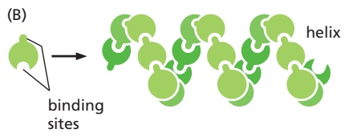

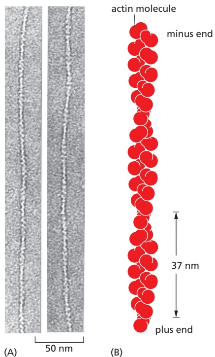

Figure 3–22 Globular actin monomers assemble to produce an actin filament. (A) Transmission electron micrographs of negatively stained actin filaments. (B) The helical arrangement of actin molecules in an actin filament. (A, courtesy of Roger Craig.)MBoC7 m3.21/3.22

---

THE ATOMIC STRUCTURE OF PROTEINS

133

(A)

(B)

(C)

(D)

lefthanded

righthanded

(E)

Figure 3–23 Some properties of a helix. (A–D) A helix forms when a series of subunits (here represented by rectangular bricks) bind to each other in a regular way. At the top, each of these helices is viewed from directly above the helix and seen to have two (A), three (B), and six (C and D) subunits per helical turn. Note that the helix in D has a wider path than that in C but the same number of subunits per turn. (E) As discussed in the text, a helix can be either right-handed or left-handed. As a reference, it is useful to remember that standard metal screws, which insert when turned clockwise, are right-handed. Note that a helix retains the same handedness when it is turned upside down.

one another to generate a long, regular triple helix (Figure 3–24). Many collagen molecules then bind to one another side-by-side and end-to-end to create long overlapping arrays—thereby generating the extremely tough collagen fibrils that give connective tissues their tensile strength, as described in Chapter 19.

## Covalent Cross-Linkages Stabilize Extracellular Proteins

Many protein molecules are either attached to the outside of a cell’s plasma membrane or secreted to form part of the extracellular matrix. All such proteins are directly exposed to extracellular conditions. To help maintain their structures, the polypeptide chains in such proteins are often stabilized by covalent cross-linkages. These linkages can either tie together two amino acids in the same protein or join together many polypeptide chains in a large protein complex—as for the collagen fibrils just described.

A variety of such cross-links exist, but the most common are covalent sulfur– sulfur bonds. These disulfide bonds (also called S–S bonds) form as cells prepare newly synthesized proteins for export. As described in Chapter 12, their formation is catalyzed in the endoplasmic reticulum by an enzyme that links together

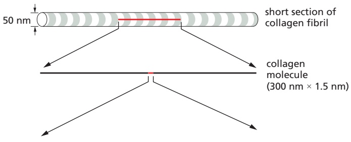

Figure 3–24 The fibrous protein collagen. The collagen molecule is a triple helix formed by three( ) extended protein chains that wrap around one another (bottom). In the extracellular space, many rodlike collagen molecules become covalently linked together through their lysine side chains to form collagen fibrils (top) that have the tensile strength of steel. The striping on the collagen fibril is caused by the regular repeating arrangement of the collagen molecules within the fibril.

---

134

Chapter 3: Proteins

Figure 3–25 Disulfide bonds. Covalent disulfide bonds form between adjacent cysteine side chains. These cross-linkages can join either two parts of the same polypeptide chain or two different polypeptide chains. Because the energy required to break one covalent bond is much larger than the energy required to break even a whole set of noncovalent bonds (see Table 2–1, p. 51), a disulfide bond can have a major stabilizing effect on a protein (Movie 3.7).

the –SH groups of two cysteine side chains that are adjacent in the folded protein (**Figure 3–25**). Disulfide bonds do not change the conformation of a proteinMBoC7 e4.30/3.25 but instead act as atomic staples to reinforce its most favored conformation. For example, lysozyme—an enzyme in tears that dissolves bacterial cell walls— retains its antibacterial activity for a long time because it is stabilized by such cross-linkages.

Disulfide bonds generally fail to form in the cytosol, where a high concentration of reducing agents converts S–S bonds back to cysteine –SH groups. Apparently, proteins do not require this type of reinforcement in the relatively mild environment inside the cell.

## Protein Molecules Often Serve as Subunits for the Assembly of Large Structures

The same principles that enable a protein molecule to associate with itself to form rings or a long filament also operate to generate structures that are formed from a set of different macromolecules, such as enzyme complexes, ribosomes, viruses, and membranes. These much larger objects are not made as single, giant, covalently linked molecules. Instead they are formed by the noncovalent assembly of many separately manufactured molecules, which serve as the subunits of the final structure.

The use of smaller subunits to build larger structures has several advantages:

1. A large structure built from one or a few repeating smaller subunits requires only a small amount of genetic information.

2. Both assembly and disassembly can be readily controlled reversible processes, because the subunits associate through multiple bonds of relatively low energy.

Figure 3–26 Single protein subunits form protein assemblies that feature multiple protein–protein contacts. Hexagonally packed globular protein subunits are shown here forming either flat sheets or tubes. Such large structures are not considered to be single “molecules.” Instead, like the actin filament described previously, they are viewed as assemblies formed of many different molecules.

---

THE ATOMIC STRUCTURE OF PROTEINS

135

3. Errors in the synthesis of the structure can be more easily avoided, because correction mechanisms can operate during the course of assembly to exclude malformed subunits.

To focus on a well-studied example, we can consider how a virus forms from a mixture of proteins and nucleic acids. Some protein subunits are found to assemble into flat sheets in which the subunits are arranged in hexagonal patterns, but with a slight change in the geometry of the individual subunits, a hexagonal sheet can be converted into a tube (**Figure 3–26**) or, with more changes, into a hollow sphere. Protein tubes and spheres that bind specific RNA and DNA molecules in their interior form the coats of viruses.

The formation of closed structures, such as rings, tubes, or spheres, provides additional stability because it increases the number of noncovalent bonds between the protein subunits. Moreover, because such a structure is created by mutually dependent, cooperative interactions between subunits, a relatively small change that affects each subunit individually can cause the structure to assemble or disassemble. These principles are dramatically illustrated in the protein coat, or capsid, of many simple viruses, which takes the form of a hollow sphere based on an icosahedron (**Figure 3–27**). Capsids are often made of hundreds of identical protein subunits that enclose and protect the viral nucleic acid (**Figure 3–28**). The protein in such a capsid must have a particularly adaptable

Figure 3–27 The protein capsid of a virus. The structure of the simian virus SV40 capsid has been determined by x-ray MBoC7 m3.27/3.27crystallography and, as for the capsids of many other viruses, it is known in atomic detail. (Courtesy of Robert Grant, Stephan Crainic, and James M. Hogle.)

Figure 3–28 The structure of a spherical virus. In viruses, many copies of a single protein subunit often pack together to create a spherical shell (a capsid). This capsid encloses the viral genome, composed of either RNA or DNA. For geometric reasons, no more than 60 identical subunits can pack together in a precisely symmetrical way. If slight irregularities are allowed, however, more subunits can be used to produce a larger capsid that retains icosahedral symmetry. The tomato bushy stunt virus (TBSV) shown here, for example, is a spherical virus about 33 nm in diameter formed from 180 identical copies of a 386-amino-acid capsid protein (90 dimers) plus an RNA genome of 4500 nucleotides. To construct such a large capsid, the protein must be able to fit into three somewhat different environments. This requires three slightly different conformations, each of which is differently colored in the virus particle shown here. The postulated pathway of assembly is shown; the precise threedimensional structure has been determined by x-ray diffraction. (Courtesy of Steve Harrison.)

---

136

Chapter 3: Proteins

Figure 3–29 The structure of tobacco mosaic virus (TMV). (A) An electron micrograph of the viral particle, which consists of a single long RNA molecule enclosed in a cylindrical protein coat composed of identical protein subunits. (B) A model showing part of the structure of TMV. An RNA molecule of 6395 nucleotides, present as a single strand, is packaged in a helical coat constructed from 2130 copies of a coat protein 158 amino acids long. Fully infective viral particles can self-assemble in a test tube from purified RNA and protein molecules. (A, courtesy of Robley Williams; B, courtesy of Richard J. Feldmann.)

structure: not only must it make several different kinds of contacts to create the sphere, it must also change this arrangement to let the nucleic acid out to initiate viral replication once the virus has entered a cell.

## Many Structures in Cells Are Capable of Self-Assembly

The information for forming many of the complex assemblies of macromolecules in cells must be contained in the subunits themselves, because purified subunits can spontaneously assemble into the final structure under the appropriate conditions. The first large macromolecular aggregate shown to be capable of self-assembly from its component parts was tobacco mosaic virus (TMV). This virus is a long rod in which a cylinder of protein is arranged around a helical RNA core, which constitutes the viral genome (**Figure 3–29**). If the dissociated RNA and protein subunits are mixed together in solution, they recombine to form fully active viral particles. The assembly process is unexpectedly complex and includes the formation of double rings of protein, which serve as intermediates that add to the growing viral coat.

Another complex macromolecular aggregate that can reassemble from its component parts is the bacterial ribosome. This structure is composed of about 55 different protein molecules and 3 different ribosomal RNA (rRNA) molecules. Incubating a mixture of the individual components under appropriate conditions in a test tube causes them to spontaneously re-form the original structure. Most important, such reconstituted ribosomes are able to catalyze protein synthesis. As might be expected, the reassembly of ribosomes follows a specific pathway: after certain proteins have bound to the RNA, this complex is then recognized by other proteins, and so on, until the structure is complete.

It is still not clear how some of the more elaborate self-assembly processes are regulated. Many structures in the cell, for example, have a precisely defined length that appears to be many times greater than that of their component macromolecules. How such length determination is achieved is in many cases a mystery. In the simplest case, a long core protein or other macromolecule provides a scaffold that determines the extent of the final assembly. This is the mechanism that determines the length of the TMV particle, where the RNA chain provides the core. Similarly, a core protein interacting with actin is thought to determine the length of the thin filaments in muscle.

## Assembly Factors Often Aid the Formation of Complex Biological Structures

Not all cellular structures held together by noncovalent bonds self-assemble. A cilium, or a myofibril of a muscle cell, for example, cannot form spontaneously from a solution of its component macromolecules. In these cases, part of the assembly information is provided by special enzymes and other proteins that

---

THE ATOMIC STRUCTURE OF PROTEINS

137

Figure 3–30 Proteolytic cleavage in insulin assembly. The polypeptide hormone insulin cannot spontaneously re-form efficiently if its disulfide bonds are disrupted. It is synthesized as a larger protein (proinsulin) that is cleaved by a proteolytic enzyme after the protein chain has folded into a specific shape. Excision of part of the proinsulin polypeptide chain removes some of the information needed for the protein to fold spontaneously into its normal conformation. For this reason, once insulin has been denatured and its two polypeptide chains have separated, its ability to reassemble is lost.

perform the function of templates, serving as assembly factors that guide construction but take no part in the final assembled structure.

Even relatively simple structures may lack some of the ingredients necessary for their own assembly. In the formation of certain bacterial viruses, for example, the head, which is composed of many copies of a single protein subunit, is assembled on a temporary scaffold composed of a second protein that is produced by the virus. Because the second protein is absent from the final viral particle, the head structure cannot spontaneously reassemble once it has been taken apart. Other examples are known in which proteolytic cleavage is an essential and irreversible step in the normal assembly process. This is even the case for some small protein assemblies, including the structural protein collagen and the hormone insulin (**Figure 3–30**). From these relatively simple examples, it seems certain that the assembly of a structure as complex as a cilium will involve a temporal and spatial ordering that is imparted by numerous other components.

## When Assembly Processes Go Wrong: The Case of Amyloid Fibrils

A special class of protein structure, utilized for some normal cell functions, can also contribute to human diseases when not controlled. These are self-propagating, very stable β-sheet aggregates called **amyloid fibrils**. These fibrils are built from a series of identical polypeptide chains that become layered one over the other to create a continuous stack of β strands, with each of the β strands oriented perpendicular to a fibril axis (**Figure 3–31**). In a fibril, two of these stacks of β strands are paired with each other to form a long cross-beta filament, with many hundreds of monomers producing an unbranched fibrous structure that can be several micrometers long and 5–15 nm in width (**Figure 3–32**). A surprisingly large fraction of proteins have the potential to adopt such structures,

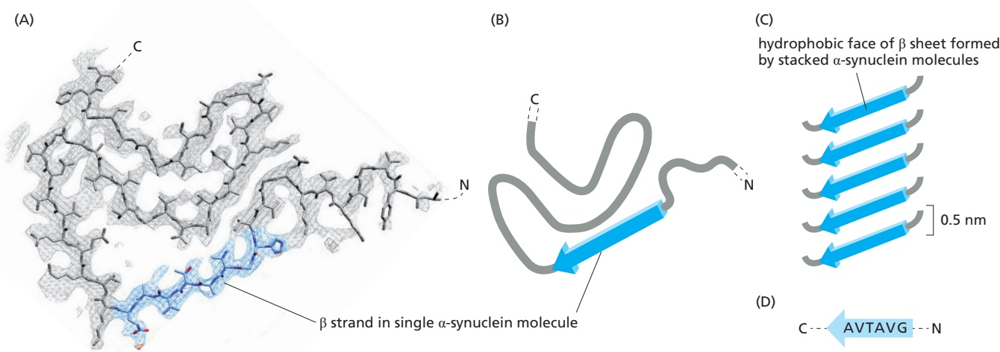

Figure 3–31 How an amyloid fibril forms from a protein associated with Parkinson’s disease. Illustrated here is the structure of one-half of an amyloid fibril that is formed by the protein α-synuclein, whose abnormal aggregates contribute to Parkinson’s disease. The conformation of the α-synuclein monomer is shown as an atomic model in (A) and schematically in (B), with the β strand that will form the cross-beta spine of the filament colored blue (only 57 of α-synuclein’s 140 amino acids are shown). (C) How the monomer associates to form a long sheet of stacked β strands. As illustrated in Figure 3–32, a second, identical sheet of β strands pairs with this one to form a two-sheet motif that runs the entire length of the fibril. (D) The amino acid sequence that creates a hydrophobic zipper joining the two sheets, forming the cross-beta spine of the fibril. (From R. Guerrero-Ferreira et al., eLife 7:e36402, 2018.)

---

138

Chapter 3: Proteins

Figure 3–32 The structure of an amyloid fibril. (A) How two monomers of α-synuclein pair to create an amyloid fibril. (B) A three-dimensional rendering of a section of the complete fibril, as determined by cryo-electron microscopy. (C) Electron micrograph of α-synuclein amyloid fibrils. The α-synuclein protein, like some other amyloid-forming proteins, can form several different variants of amyloid fibrils from the same polypeptide chain—only one of which is illustrated here. (From R. Guerrero-Ferreira et al., eLife 7:e36402, 2018. This article is distributed under a Creative Commons Attribution 4.0 International license.)

because only a short segment of the polypeptide chain is needed to form the spine of the fibril; in addition, the spine can accommodate a variety of amino acid sequences. Nevertheless, very few proteins will actually form this structure inside cells.

In humans, the quality-control mechanisms governing proteins gradually decline with age, occasionally permitting normal proteins to form pathological aggregates. In extreme cases, the accumulation of such amyloid fibrils in the cell interior can kill the cells and damage tissues. Because the brain is composed of a highly organized collection of nerve cells that cannot regenerate, the brain is especially vulnerable to this sort of cumulative damage. Thus, although amyloid fibrils may form in different tissues and are known to cause pathologies in several sites in the body, the most severe amyloid pathologies are neurodegenerative diseases. For example, an abnormal formation of amyloid fibrils is thought to play a central causative role in both Alzheimer’s and Parkinson’s diseases.

Prion diseases are a special type of these pathologies. They have attained special notoriety because, unlike Parkinson’s or Alzheimer’s, prion diseases can readily spread from one organism to another, providing that the second organism eats a tissue containing the protein aggregate. A set of closely related diseases— scrapie in sheep, Creutzfeldt–Jakob disease (CJD) in humans, kuru in humans, and bovine spongiform encephalopathy (BSE) in cattle—are caused by a misfolded, aggregated form of a particular protein called PrP (for prion protein). PrP is normally located on the outer surface of the plasma membrane, most prominently in neurons, and it has the unfortunate property of forming amyloid fibrils that are “infectious” because they convert normally folded molecules of PrP to the same pathological form (**Figure 3–33**). This property creates a positive feedback loop that propagates the abnormal form of PrP, called PrP\*, and allows the pathological

## Figure 3–33 Prion diseases are caused by proteins whose misfolding is infectious.

prion protein can adopt an abnormal,(A) misfolded form

normal PrP protein abnormal prion form of PrP protein (PrP\*)

(B) misfolded protein can induce formation of protein aggregates

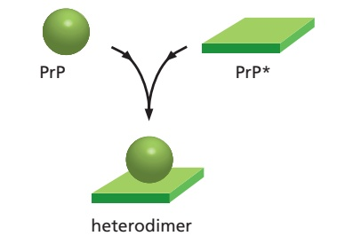

heterodimer

misfolded protein converts normal PrP into abnormal conformation

homodimer

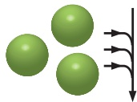

the conversion of more PrP to misfolded form creates a stable amyloid fibril

<small>(A) Schematic illustration of the type of conformational change in the prion protein (PrP) that produces material for an amyloid fibril. (B) The self-infectious nature of the protein aggregation that is central to prion diseases. The misfolded version of the protein, called PrP\*, induces the normal PrP protein it contacts to change its conformation, as shown. PrP\* is extremely stable, and if eaten, it can produce amyloid fibrils that disrupt brain-cell function, causing a deadly neurodegenerative disorder. Some of the abnormal amyloid fibrils that form in common noninfectious neurodegenerative disorders, including Parkinson’s and Alzheimer’s diseases, appear to propagate from cell to cell within the brain in a similar way.</small>

protein aggregate in form of amyloid fibril

---

THE ATOMIC STRUCTURE OF PROTEINS

139

conformation to spread rapidly from cell to cell in the brain, eventually causing death. It can be dangerous to eat the tissues of animals that contain PrP\*, as witnessed by the spread of BSE (commonly referred to as “mad cow disease”) from cattle to humans. Fortunately, in the absence of PrP\*, PrP is extraordinarily difficult to convert to its abnormal form.

A closely related protein-only inheritance has been observed in yeast cells. The ability to study infectious proteins in yeast has clarified another remarkable feature of prions. These protein molecules can form several distinctively different types of amyloid fibrils from the same polypeptide chain. Moreover, each type of aggregate can be infectious, forcing normal protein molecules to adopt the same type of abnormal structure. Thus, several different “strains” of infectious particles can arise from the same polypeptide chain.

Recent data suggest that at least some of the abnormal amyloids that form in common human neurological diseases promote the disease by spreading from cell to cell in the brain in a “prion-like” manner, with the abnormally folded form of the protein being taken up by neighboring cells to seed a more widespread formation of the same abnormal structures (for example, α-synuclein in Parkinson’s disease, tau protein in Alzheimer’s disease). Drugs and antibody treatments are currently being designed in attempts to block these spreading events—and thereby reduce the terrible human toll created by these widespread, common diseases.

## Amyloid Structures Can Also Perform Useful Functions in Cells

Amyloid fibrils were initially studied because they cause disease. But the same type of structure is now known to be exploited by cells for useful functions. Eukaryotic cells, for example, store many different peptide and protein hormones that they will secrete in specialized secretory vesicles, which package a high concentration of their cargo in dense cores with a regular structure (see Figure 13–43). We now know that these structured cores consist of amyloid fibrils, which in this case have a structure that causes them to dissolve to release soluble cargo after being secreted by exocytosis to the cell exterior (**Figure 3–34A**). Many bacteria use the amyloid structure in a very different way, secreting proteins that form long amyloid fibrils that project from the cell exterior to help bind bacterial neighbors into biofilms (**Figure 3–34B**). Because these biofilms help bacteria to survive in adverse environments (including in humans treated with antibiotics), new drugs that specifically disrupt the fibrous networks formed by bacterial amyloids have promise for treating human infections.

Figure 3–34 Two normal functions for amyloid fibrils. (A) In eukaryotic cells, protein cargo can be packed very densely in secretory vesicles and stored until signals cause a release of this cargo by exocytosis. For example, proteins and peptide hormones of the endocrine system, such as glucagon and calcitonin, are efficiently stored as short amyloid fibrils, which dissociate when they reach the cell exterior. (B) Bacteria produce amyloid fibrils on their surface by secreting their precursor proteins; these fibrils then create biofilms that link together, and help to protect, large numbers of individual bacteria.

---

140

Chapter 3: Proteins

## Summary

A protein molecule’s amino acid sequence determines its three-dimensional conformation. Large numbers of noncovalent attractions between different parts of the polypeptide chain stabilize its folded structure. For example, amino acids with hydrophobic side chains tend to cluster in the interior of the molecule, and local hydrogen-bond interactions between neighboring peptide bonds give rise to a helices and b sheets.

Regions of contiguous amino acid sequence fold into globular protein domains. These domains generally contain 40–350 amino acids, and they are the modular units from which larger proteins are constructed. Small proteins typically consist of only a single domain, while large proteins are formed from multiple domains linked together by various lengths of relatively disordered polypeptide chain. As organisms have evolved, the DNA sequences that encode these domains have duplicated, mutated, and been combined with other domains to construct large numbers of new proteins.

Proteins are brought together into larger structures by the same noncovalent attractions that determine protein folding. Proteins with binding sites for their own surface can assemble into dimers, closed rings, spherical shells, or helical polymers. The amyloid fibril is a long unbranched structure assembled through a repeating aggregate of b sheets.

Some mixtures of proteins and nucleic acids can assemble spontaneously into complex structures in a test tube. But not all structures in the cell are capable of spontaneous reassembly after they have been dissociated into their component parts, because many biological assembly processes involve assembly factors that have been removed from the final structure.

## PROTEIN FUNCTION

We have seen that each type of protein consists of a precise sequence of amino acids that allows it to fold up into a particular three-dimensional shape, or conformation. These proteins can also have moving parts whose mechanical actions are coupled to chemical events. This coupling of chemistry and movement helps to give proteins the extraordinary capabilities that underlie the dynamic processes in living cells.

In this section, we explain how proteins bind to other selected molecules and how a protein’s activity depends on such binding. We will use selected examples to demonstrate how their ability to bind to other molecules enables proteins to act as catalysts, signal receptors, switches, motors, or tiny pumps. These examples by no means exhaust the vast functional repertoire of proteins. You will encounter the specialized functions of many other proteins elsewhere in this book, based on similar principles.

## All Proteins Bind to Other Molecules

A protein molecule’s physical interaction with other molecules determines its biological properties. Thus, antibodies attach to viruses or bacteria to mark them for destruction, the enzyme hexokinase binds glucose and ATP so as to catalyze a reaction between them, actin molecules bind to each other to assemble into actin filaments, and so on. Indeed, all proteins stick, or bind, to other molecules. In some cases, this binding is very tight; in others it is weak and short-lived. But the binding always shows great specificity, in the sense that each protein molecule can usually bind just one or a few molecules out of the many thousands of different types it encounters. The substance that is bound by the protein—whether it is an ion, a small molecule, or a macromolecule such as another protein—is referred to as a **ligand** for that protein (from the Latin word ligare, meaning “to bind”).

The ability of a protein to bind selectively and with high affinity to a ligand depends on the formation of a set of weak noncovalent bonds—hydrogen bonds, electrostatic attractions, and van der Waals attractions—plus favorable hydrophobic interactions (see Panel 2–3, pp. 98–99). Because each individual bond is

---

PROTEIN FUNCTION

141

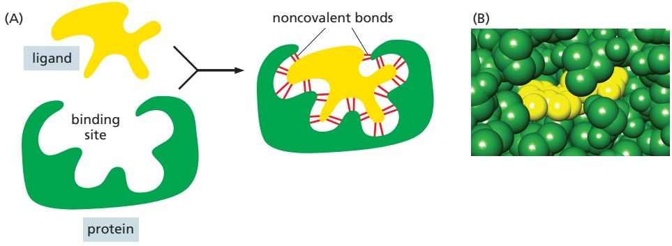

Figure 3–35 The selective binding of a protein to another molecule. Many weak bonds are needed to enable a protein to bind tightly to a second molecule, or ligand. A ligand must therefore fit precisely into a protein’s binding site, like a hand into a glove, so that a large number of noncovalent bonds form between the protein and the ligand. (A) Schematic; (B) space-filling model. (PDB code: 1G6N.)

weak, effective binding occurs only when many of these bonds form simultaneously. Such binding is possible only if the surface contours of the ligand molecule fit very closely to the protein, matching it like a hand in a glove (**Figure 3–35**).

The region of a protein that associates with a ligand, known as the ligand’s binding site, usually consists of a cavity in the protein surface formed by a particular arrangement of amino acids. These amino acids can belong to different portions of the polypeptide chain that are brought together when the protein folds (**Figure 3–36**). Separate regions of the protein surface generally provide binding sites for different ligands, allowing the protein’s activity to be regulated, as we shall see later. And other parts of the protein act as a handle to position the protein in the cell—an example is the SH2 domain discussed previously, which often moves a protein containing it to particular intracellular sites in response to signals.

Although the atoms buried in the interior of the protein have no direct contact with the ligand, they form the framework that gives the surface its contours and its chemical and mechanical properties. Even small changes to the amino acids in the interior of a protein molecule can change its three-dimensional shape enough to destroy a binding site on the surface.

Figure 3–36 The binding site of a protein. (A) The folding of the polypeptide chain typically creates a crevice or cavity on the protein surface. This crevice contains a set of amino acid side chains disposed in such a way that they can form noncovalent bonds only with certain ligands. (B) A close-up of an actual binding site, showing the hydrogen bonds and electrostatic interactions formed between a protein and its ligand. In this example, a molecule of cyclic AMP is the bound ligand, shown in dark yellow.

---

142

Chapter 3: Proteins

## The Surface Conformation of a Protein Determines Its Chemistry

The impressive chemical capabilities of proteins often require that the chemical groups on their surface interact in ways that enhance the chemical reactivity of one or more amino acid side chains. These interactions fall into two main categories.

First, the interaction of neighboring parts of the polypeptide chain may restrict the access of water molecules to that protein’s ligand-binding sites. Because water molecules readily form hydrogen bonds that can compete with ligands for sites on the protein surface, a ligand will form tighter hydrogen bonds (and electrostatic interactions) with a protein if water molecules are kept away. It might be hard to imagine a mechanism that would exclude a molecule as small as water from a protein surface without affecting the access of the ligand itself. However, because of the strong tendency of water molecules to form water–water hydrogen bonds, water molecules exist in a large hydrogen-bonded network (see Panel 2–2, pp. 96–97). In effect, a protein can keep a ligand-binding site dry, increasing that site’s reactivity, because it is energetically unfavorable for individual water molecules to break away from this network—as they must do to reach into a crevice on a protein’s surface.

Second, the clustering of neighboring polar amino acid side chains can alter their reactivity. If protein folding brings together a number of negatively charged side chains against their mutual repulsion, for example, the affinity of the site for a positively charged ion is greatly increased. In addition, when amino acid side chains interact with one another through hydrogen bonds, normally unreactive groups (such as the –CH2OH on the serine shown in **Figure 3–37**) can become reactive, enabling them to be used to make or break selected covalent bonds.

The surface of each protein molecule therefore has a unique chemical reactivity that depends not only on which amino acid side chains are exposed, but also on their exact orientation relative to one another. For this reason, two slightly different conformations of the same protein molecule can differ greatly in their chemistry.

## Sequence Comparisons Between Protein Family Members Highlight Crucial Ligand-binding Sites

As we have described previously, genome sequences allow us to group many of the domains found in proteins into families that show clear evidence of their evolution from a common ancestor. The three-dimensional structures of members of the same domain family are remarkably similar. For example, even when the amino acid sequence identity falls to 25%, the backbone atoms in a domain can follow a common protein fold within 0.2 nm (2 Å).

We can use a method called evolutionary tracing to identify those sites in a protein domain that are the most crucial to the domain’s function. Those sites that bind to other molecules are the most likely to be kept unchanged as organisms

Figure 3–37 An unusually reactive amino acid at the active site of an enzyme. This example is the catalytic triad Asp His-Ser found in chymotrypsin, elastase, and other serine proteases (see Figure 3–13). The aspartic acid side chain (Asp) induces the histidine (His) to remove the proton from a particular serine (Ser). This activates the serine and enables it to form a covalent bond with the enzyme’s substrate, hydrolyzing a peptide bond. The many convolutions of the polypeptide chain are omitted here.

---

PROTEIN FUNCTION

143

evolve. Thus, in this method, those amino acids that are the same, or nearly so, in all of the known protein family members are mapped onto a model of the three-dimensional structure of a single family member. When this is done, the most invariant positions often form one or more clusters on the protein surface, as illustrated in **Figure 3–38A** for the SH2 domain described previously (see Figure 3–9). These clusters generally correspond to ligand-binding sites.

The SH2 domain functions to link two proteins together. It binds the protein containing it to a second protein that contains a phosphorylated tyrosine side chain in a specific amino acid sequence context, as shown in **Figure 3–38B**. The amino acids located at the binding site for the phosphorylated polypeptide have been the slowest to change during the long evolutionary process that produced the large SH2 family of peptide recognition domains. Mutation is a random process; survival is not. Thus, natural selection (random mutation followed by nonrandom survival) produces the sequence conservation by preferentially eliminating organisms whose SH2 domains have become altered in a way that inactivates the SH2 binding site, destroying SH2 function.MB

Figure 3–38 The evolutionary trace method applied to a protein domain. (A) Front and back views of a spacefilling model of the SH2 domain, with evolutionarily conserved amino acids on the protein surface colored yellow, and those more toward the protein interior colored red. (B) The structure of one specific SH2 domain with its bound polypeptide. Here, those amino acids located within 0.4 nm of the bound ligand are colored blue. The two key amino acids of the ligand are yellow, and the others are purple. Note the high degree of correspondence between A and B. (Adapted from O. Lichtarge et al., J. Mol. Biol. 257:342–358, 1996. PDB codes: 1SPR, 1SPS.)

Genome sequencing has revealed huge numbers of proteins whose functions are unknown. Once a three-dimensional structure has been determined for one member of a protein family, evolutionary tracing allows biologists to determine binding sites for the members of that family, and this provides a useful start in deciphering protein function.

## Proteins Bind to Other Proteins Through Several Types of Interfaces

Proteins can bind to other proteins in multiple ways. In many cases, a portion of the surface of one protein contacts an extended loop of polypeptide chain (a string) on a second protein (**Figure 3–39A**). Such a surface–string interaction,

Figure 3–39 Three ways in which two proteins can bind to each other. Only the interacting parts of the two proteins are shown. (A) A rigid surface on one protein can bind to an extended loop of polypeptide chain (a string) on a second protein. (B) Two α helices can bind together to form a coiled-coil. (C) Two complementary rigid surfaces often link two proteins together. Binding interactions can also involve the pairing of β strands (see, for example, Figure 3–19B).

---

144

Chapter 3: Proteins

for example, allows the SH2 domain to recognize a phosphorylated polypeptide loop on a second protein, as just described, and it also enables a protein kinase to recognize the proteins that it will phosphorylate (see below).

A second type of protein–protein interface forms when two α helices, one from each protein, pair together to form a coiled-coil (**Figure 3–39B**). This type of protein interface is found in several families of transcription regulatory proteins, as discussed in Chapter 7.

Another common way for proteins to interact is by the precise matching of one rigid surface with that of another (**Figure 3–39C**). Such interactions can be very tight, because a large number of weak bonds can form between two surfaces that match well. For the same reason, such surface–surface interactions can be extremely specific, enabling a protein to select just one partner from the many thousands of different proteins found in a cell.

## Antibody Binding Sites Are Especially Versatile

All proteins must bind to particular ligands to carry out their various functions, and the antibody family is notable for its capacity for tight, highly selective binding (see Chapter 24).

**Antibodies**, or **immunoglobulins**, are proteins produced by the immune system in response to foreign molecules, such as those on the surface of an invading microorganism. Each antibody binds tightly to a particular target molecule, thereby either inactivating the target molecule directly or marking it for destruction. An antibody recognizes its target (called an **antigen**) with remarkable specificity. Because there are potentially billions of different antigens that humans might encounter, we need to be able to produce billions of different antibodies.

Antibodies are Y-shaped molecules with two identical binding sites that are complementary to a small portion of the surface of the antigen molecule. A detailed examination of the antigen-binding sites of antibodies reveals that they are formed from several loops of polypeptide chain that protrude from the ends of a pair of closely juxtaposed protein domains (**Figure 3–40**). The genes that encode different antibodies generate an enormous diversity of antigen-binding sites by changing only the length and amino acid sequence of these loops, without altering the basic protein structure.

Figure 3–40 An antibody is Y-shaped and has two identical antigen-binding sites, one on each arm of the Y. (A) Schematic drawing of a typical antibody molecule. The protein is composed of four polypeptide chains (two identical heavy chains and two identical, smaller light chains), stabilized and held together by disulfide bonds (red). Each chain is made up of several similar domains, here shaded with blue, for the variable domains, or gray, for the constant domains. The antigenbinding site is formed where a heavy-chain variable domain (VH) and a light-chain variable domain (VL) come close together. These are the domains that differ most in their amino acid sequence in different antibodies—hence their name. (B) Ribbon drawing of a single light chain showing that the most variable parts of the polypeptide chain (orange) extend as loops at one end of the variable domain (VL) to form half of one antigen-binding site of the antibody molecule shown in A. Note that both the constant and variable domains are composed of a sandwich of two antiparallel β sheets connected by a disulfide bond (red). (See Movie 24.5.)

---

PROTEIN FUNCTION

145

Loops of this kind are ideal for grasping other molecules. They allow a large number of chemical groups to surround a ligand so that the protein can link to it with many weak bonds. For this reason, loops often form the ligand-binding sites in proteins.

## The Equilibrium Constant Measures Binding Strength

Molecules in the cell encounter each other very frequently because of their continual random thermal movements. Colliding molecules with poorly matching surfaces form few noncovalent bonds with one another, and the two molecules dissociate as rapidly as they come together. At the other extreme, when many non-covalent bonds form between two colliding molecules, the association can persist for a very long time (**Figure 3–41**). Such strong interactions occur in cells whenever a biological function requires that molecules remain associated; for example, when a group of RNA and protein molecules come together to make a subcellular structure such as a ribosome.

We can measure the strength with which any two molecules bind to each other. As an example, consider a population of identical antibody molecules that suddenly encounters a population of ligands diffusing in the fluid surrounding them. At frequent intervals, one of the ligand molecules will bump into the binding site of an antibody and form an antibody–ligand complex. The population of antibody–ligand complexes will therefore increase, but not without limit: over time, a second process, in which individual complexes break apart because of thermally induced motion, will become increasingly important. Eventually, any population of antibody molecules and ligands will reach a steady state, or **equilibrium**, in which the number of binding (association) events per second is precisely equal to the number of “unbinding” (dissociation) events (see Figure 2–30).

From the concentrations of the ligand, antibody, and antibody–ligand complex at equilibrium, we can calculate a convenient measure of the strength of binding— the **equilibrium constant** (K; **Figure 3–42A**). This constant was described in detail in Chapter 2, where its connection to free-energy differences was derived (see pp. 68–69). The equilibrium constant for a reaction in which two molecules (A and B) bind to each other to form a complex (AB) has units of liters/mole, and half of the binding sites will be occupied by ligand when that ligand’s concentration (in moles/liter) reaches a value that is equal to 1/K. This equilibrium constant is larger the greater the binding strength, and it is a direct measure of the freeenergy difference between the bound and free states (**Figure 3–42B**). Even a change of a few noncovalent bonds can have a striking effect on a binding interaction,

Figure 3–41 How noncovalent bonds mediate interactions between macromolecules (see Movie 2.1).

---

146

Chapter 3: Proteins

(B)

(A)

as shown by the example in **Figure 3–43**. (Note that the equilibrium constant, as defined here, is the **association** or **affinity constant,** $K _ { \mathrm { a } } ;$ the reciprocal of $K _ { \mathrm { a } }$ is the **dissociation constant**, $K _ { \mathrm { d } } ,$ which is also widely used.)

We have used the case of an antibody binding to its ligand to illustrate the effect of binding strength on the equilibrium state, but the same principles apply to any molecule and its ligand. Many proteins are enzymes, which, as we nowMBoC7 m3.44/3.42 discuss, first bind to their ligands and then catalyze the breakage or formation of covalent bonds in these molecules.

## Enzymes Are Powerful and Highly Specific Catalysts

Many proteins can perform their function simply by binding to another molecule. An actin molecule, for example, need only associate with other actin molecules to form a filament. There are other proteins, however, for which ligand binding is only a necessary first step in their function. This is the case for the large and very important class of proteins called **enzymes**. As described in Chapter 2, enzymes are remarkable molecules that cause the chemical transformations that make and break covalent bonds in cells. They bind to one or more ligands, called **substrates**, and convert them into one or more chemically modified products, doing this over and over again with amazing rapidity. Enzymes speed up reactions, often by a factor of a million or more, without themselves being changed; that is, they act as **catalysts** that permit cells to make or break covalent bonds in a controlled way. It is the catalysis of organized sets of chemical reactions by enzymes that creates and maintains the cell, making life possible.

We can group enzymes into functional classes that perform similar chemical reactions (**Table 3–1**). Each type of enzyme within such a class is highly specific, catalyzing only a single type of reaction. Thus, hexokinase adds a phosphate group to d-glucose but ignores its optical isomer l-glucose; the blood-clotting enzyme thrombin cuts one type of blood protein between a particular arginine and its adjacent glycine and nowhere else, and so on. As discussed in detail in Chapter 2, enzymes work in teams, with the product of one enzyme becoming the substrate for the next. The result is an elaborate network of metabolic pathways that provides the cell with energy and generates the many large and small molecules that the cell needs (see Figure 2–62).

## Substrate Binding Is the First Step in Enzyme Catalysis

For a protein that catalyzes a chemical reaction (an enzyme), the binding of each substrate molecule to the protein is an essential prelude. In the simplest case, if we denote the enzyme by $\mathrm { E } ,$ the substrate by S, and the product by P, the basic reaction

Figure 3–42 Relating standard free-energy difference (G°) to the equilibrium constant (K). (A) The equilibrium between molecules A and B and the complex AB is maintained by a balance between the two opposing reactions shown in panels 1 and 2. Molecules A and B must collide if they are to react, and the association rate is therefore proportional to the product of their individual concentrations [A] × [B]. (Square brackets indicate concentration.) As shown in panel 3, the ratio of the rate constants for the association and the dissociation reactions is equal to the equilibrium constant (K) for the reaction. (B) The equilibrium constant in panel 3 is that for the reaction $\mathsf { A } + \mathsf { B } \rightleftharpoons \mathsf { A B }$ and the larger its value, the stronger the binding between A and B. Note that for every 5.91 kJ/mole decrease in standard free energy, the equilibrium constant increases by a factor of 10 at 37°C.

The equilibrium constant here has units of liters/mole; for simple binding interactions it is also called the affinity constant or association constant, denoted $K _ { \mathrm { a } } .$ The reciprocal $\mathrm { o f }   K _ { \mathrm { a } }$ is called the dissociation constant, $K _ { \mathrm { d } }$ (in units of moles/liter).

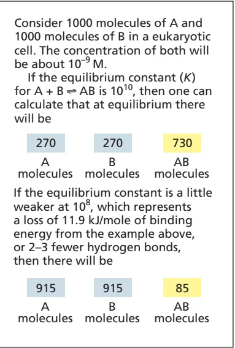

Figure 3–43 Small changes in the number of weak bonds can have drastic effects on a binding interaction. This example illustrates the dramatic effect of the presence or absence of a few weak noncovalent bonds in a biological context.

---

PROTEIN FUNCTION

147

<table><tbody><tr><td colspan="2">TABLE 3-1 Some Common Types of Enzymes</td></tr><tr><td>Enzyme</td><td>Reaction catalyzed</td></tr><tr><td>Hydrolases</td><td>General term for enzymes that catalyze a hydrolytic cleavage reaction; nucleases and proteases are more specific names for subclasses of these enzymes</td></tr><tr><td>Nucleases</td><td>Break down nucleic acids by hydrolyzing bonds between nucleotides. Endonucleases and exonucleases cleave nucleic acids within and from the ends of the polynucleotide chains, respectively</td></tr><tr><td>Proteases</td><td>Break down proteins by hydrolyzing bonds between amino acids</td></tr><tr><td>Synthases</td><td>Synthesize molecules in anabolic reactions by condensing two smaller molecules together</td></tr><tr><td>Ligases</td><td>Join together (ligate) two molecules in an energy-dependent process. DNA ligase, for example, joins two DNA molecules together end-to-end through phosphodiester bonds</td></tr><tr><td>Isomerases</td><td>Catalyze the rearrangement of bonds within a single molecule</td></tr><tr><td>Polymerases</td><td>Catalyze polymerization reactions such as the synthesis of DNA and RNA</td></tr><tr><td>Kinases</td><td>Catalyze the addition of a phosphate group to a molecule. Protein kinases are an important group of kinases that attach phosphate groups to proteins</td></tr><tr><td>Phosphatases</td><td>Catalyze the hydrolytic removal of a phosphate group from a molecule</td></tr><tr><td>Oxido-reductases</td><td>General name for enzymes that catalyze reactions in which one molecule is oxidized while the other is reduced. Enzymes of this type are often more specifically named oxidases, reductases, or dehydrogenases</td></tr><tr><td>ATPases</td><td>Hydrolyze ATP. Many proteins with a wide range of roles have an energy-harnessing ATPase activity as part of their function; for example, motor proteins such as myosin and membrane transport proteins such as the sodium-potassium pump</td></tr><tr><td>GTPases</td><td>Hydrolyze GTP. A large family of GTP-binding proteins are GTPases with central roles in the regulation of cell processes</td></tr><tr><td colspan="2">Enzyme names typically end in "-ase," with the exception of some enzymes, such as pepsin, trypsin, thrombin, and lysozyme, that were discovered and named before the convention became generally accepted at the end of the nineteenth century. The common name of an enzyme usually indicates the substrate or product and the nature of the reaction catalyzed. For example, citrate synthase catalyzes the synthesis of citrate by a reaction between acetyl CoA and oxaloacetate.</td></tr></tbody></table>

path is $\mathrm { E + S \rightarrow E S \rightarrow E P \rightarrow E + P . }$ As illustrated in **Figure 3–44**, there is a limit to the amount of substrate that a single enzyme molecule can process in a given time. Although an increase in the concentration of substrate increases the rate at which product is formed, this rate eventually reaches a maximum value. At that point the enzyme molecule is saturated with substrate, and the rate of reaction $( V _ { \mathrm { m a x } } )$

Figure 3–44 Enzyme kinetics. The rate of an enzyme reaction (V) increases as the substrate concentration increases until a maximum value $( V _ { \mathsf { m a x } } )$ is reached. At this point all substrate-binding sites on the enzyme molecules are fully occupied, and the rate of reaction is limited by the rate of the catalytic process on the enzyme surface. For most enzymes, the concentration of substrate at which the reaction rate is half-maximal $( K _ { m } )$ is a measure of how tightly the substrate is bound, with a large value of $K _ { \mathrm { m } }$ corresponding to weak binding $( K _ { m }$ approximates the dissociation constant, $K _ { \mathrm { d } } ,$ for substrate binding).

---

Figure 3–46 The rate accelerations caused by five different enzymes. (Adapted from A. Radzicka and R. Wolfenden, Science 267:90–93, 1995.)

148

Chapter 3: Proteins

depends only on how rapidly the enzyme can process the substrate molecule. This maximum rate divided by the enzyme concentration is called the turnover number. Turnover numbers are often about 1000 substrate molecules processed per second per enzyme molecule, although turnover numbers between 1 and 10,000 are known.

The other kinetic parameter frequently used to characterize an enzyme is its $K _ { \mathrm { m } }$ the concentration of substrate that allows the reaction to proceed at one-half its maximum rate $\left( 0 . 5 V _ { \mathrm { m a x } } \right)$ (see Figure 3–44). A low $K _ { \mathrm { m } }$ value means that the enzyme reaches its maximum catalytic rate at a low concentration of substrate and generally indicates that the enzyme binds to its substrate very tightly, whereas a high $K _ { \mathrm { m } }$ value corresponds to weak binding. The methods used to characterize enzymes in this way are explained in **Panel 3–2** (pp. 150–151).

## Enzymes Speed Reactions by Selectively Stabilizing Transition States

Enzymes achieve extremely high rates of chemical reaction—rates that are far higher than for any synthetic catalysts. There are several reasons for this efficiency. First, when two molecules need to react, the enzyme greatly increases the local concentration of both of these substrate molecules at the catalytic site, holding them in the correct orientation for the reaction that is to follow. More important, however, some of the binding energy contributes directly to the catalysis. Substrate molecules must pass through a series of intermediate states of altered geometry and electron distribution before they form the ultimate products of the reaction. The free energy required to attain the most unstable intermediate state, called the **transition state**, is known as the activation energy for the reaction, and it is the major determinant of the reaction rate. Enzymes have a much higher affinity for the transition state of the substrate than they have for the stable form. Because this tight binding greatly lowers the energy of the transition state, the enzyme greatly accelerates a particular reaction by lowering the activation energy that is required (**Figure 3–45**; see also p. 63).

## Enzymes Can Use Simultaneous Acid and Base Catalysis

**Figure 3–46** compares the spontaneous reaction rates and the corresponding enzyme-catalyzed rates for five enzymes. Rate accelerations range from $1 0 ^ { 9 }$ to $\left[ 1 0 ^ { 2 3 } \right]$ . This is possible because enzymes not only bind tightly to a transition state, they also contain precisely positioned atoms that alter the electron distributions in the atoms that participate directly in the making and breaking of covalent bonds. Peptide bonds, for example, can be hydrolyzed in the absence of an enzyme by exposing a polypeptide to either a strong acid or a strong base. Enzymes are unique, however, in being able to use acid and base catalysis simultaneously, because the rigid framework of the protein constrains the acidic and

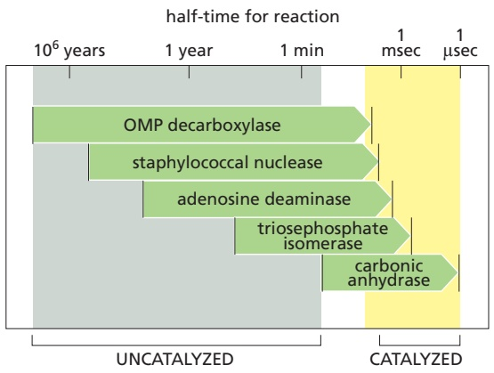

Figure 3–45 Enzymes accelerate chemical reactions by decreasing the activation energy. There is a single transition state in this example. However, often both the uncatalyzed reaction (A) and the enzyme-catalyzed reactionMB C7 3.47/3.45 (B) go through a series of transition states. In that case, it is the transition state with the highest energy (ST and EST) that determines the activation energy and limits the rate of the reaction. (S = substrate; P = product of the reaction; ES = enzyme–substrate complex; EP = enzyme–product complex.)

---

PROTEIN FUNCTION

149

Figure 3–47 Simultaneous acid catalysis and base catalysis by an enzyme. (A) The start of the uncatalyzed reaction that hydrolyzes a peptide bond, with blue shading used to indicate electron distribution in the water and carbonyl bonds. (B) An acid likes to donate a proton (H+) to other atoms. By pairing with the carbonyl oxygen, an acid causes electrons to move away from the carbonyl carbon, making this atom much more attractive to the electronegative oxygen of an attacking water molecule. (C) A base likes to take up H+. By pairing with a hydrogen of the attacking water molecule, a base causes electrons to move toward the water oxygen, making it a better attacking group for the carbonyl carbon. (D) By having appropriately positioned atoms on its surface, an enzyme can perform both acid catalysis and base catalysis at the same time. (E) A tetrahedral intermediate is formed by the attack of the water oxygen atom on the carbonyl carbon atom, and this intermediate rapidly decays to hydrolysis products. The red arrows denote the electron shifts associated with product formation.

basic residues and prevents them from combining with each other, as they wouldMB C7 3.49/3.47 do in solution (**Figure 3–47**).

The fit between an enzyme and its substrate needs to be precise. A small change introduced by genetic engineering in the active site of an enzyme can therefore have a profound effect. Replacing a glutamic acid with an aspartic acid in one enzyme, for example, shifts the position of the catalytic carboxylate ion by only 1 Å (about the radius of a hydrogen atom), yet this is enough to decrease the activity of the enzyme a thousandfold.

## Lysozyme Illustrates How an Enzyme Works

To demonstrate how enzymes catalyze chemical reactions, we examine an enzyme that acts as a natural antibiotic in egg white, saliva, tears, and other secretions. **Lysozyme** catalyzes the cutting of polysaccharide chains in the cell walls of bacteria. The bacterial cell is under pressure from osmotic forces, and cutting even a small number of these chains causes the cell wall to rupture and the cell to burst. A relatively small and stable protein that can be easily isolated in large quantities, lysozyme was the first enzyme to have its structure worked out in atomic detail by x-ray crystallography (in the mid-1960s).

The reaction that lysozyme catalyzes is a hydrolysis: it adds a molecule of water to a single bond between two adjacent sugar groups in the polysaccharide chain, thereby causing the bond to break (see Figure 2–9). The reaction is energetically favorable because the free energy of the severed polysaccharide chain is lower than the free energy of the intact chain. However, there is an energy barrier for the reaction (its activation energy). In particular, a colliding water molecule can break a bond linking two sugars only if the polysaccharide molecule is distorted into a particular shape—the transition state—in which the atoms around the bond have an altered geometry and electron distribution. Because of this requirement, random collisions must supply a very large activation energy for the reaction to take place. In an aqueous solution at room temperature, the energy of collisions almost never exceeds the activation energy. The pure polysaccharide can therefore remain for years in water without being hydrolyzed to any detectable degree.

This situation changes drastically when the polysaccharide binds to lysozyme. The active site of lysozyme, because its substrate is a polymer, is a long groove that holds six linked sugars at the same time. As soon as the polysaccharide

---

150

PANEL 3–2: Some of the Methods Used to Study Enzymes

## WHY ANALYZE THE KINETICS OF ENZYMES?

Enzymes are the most selective and powerful catalysts known. An understanding of their detailed mechanisms provides a critical tool for the discovery of new drugs, for the large-scale industrial synthesis of useful chemicals, and for appreciating the chemistry of cells and organisms. A detailed study of the rates of the chemical reactions that are catalyzed by a purified enzyme—more specifically how these rates change with changes in conditions such as the concentrations of substrates, products, inhibitors, and regulatory ligands—allows

## STEADY-STATE ENZYME KINETICS

Many enzymes have only one substrate, which they bind and then process to produce products according to the scheme outlined in Figure 3–48A. In this case, the reaction is written as

$$
\left| \begin{array}{c} E + S \xrightarrow [ k _ {- 1} ]{k _ {1}} E S \xrightarrow [ k _ {\text {cat}} ]{k _ {\text {cat}}} E + P \end{array} \right|
$$

Here we have assumed that the reverse reaction, in which $\mathsf { E } + \mathsf { P }$ recombine to form EP and then ES, occurs so rarely that we can ignore it. In this case, EP need not be represented, and we can express the rate of the reaction, known as its velocity, V, as

$$
V = k _ {\mathrm{cat}} [ \mathrm{ES} ]
$$

where [ES] is the concentration of the enzyme–substrate complex, and $k _ { \mathrm { c a t } }$ is the turnover number, a rate constant that has a value equal to the number of substrate molecules processed per enzyme molecule each second.

But how does the value of [ES] relate to the concentrations that we know directly, which are the total concentration of the enzyme, $[ \mathsf { E } _ { 0 } ] _ { \iota }$ and the concentration of the substrate, [S]? When enzyme and substrate are first mixed, the concentration [ES] will rise rapidly from zero to a so-called steady-state level, as illustrated below.

biochemists to figure out exactly how each enzyme works. For example, this is the way that the ATP-producing reactions of glycolysis, shown previously in Figure 2–47, were deciphered—allowing us to appreciate the rationale for this critical enzymatic pathway.

In this Panel, we introduce the important field of enzyme kinetics, which has been indispensable for deriving much of the detailed knowledge that we now have about cell chemistry.

At this steady state, [ES] is nearly constant, so that

$$
\begin{array}{c c c} \text {rate of ES breakdown} & = & \text {rate of ES formation} \\ k _ {- 1} [ \mathrm{ES} ] + k _ {\mathrm{cat}} [ \mathrm{ES} ] & & k _ {1} [ \mathrm{E} ] [ \mathrm{S} ] \end{array}
$$

or, because the concentration of the free enzyme, [E], is equal to $[ \mathsf { E } _ { \mathsf { o } } ] - [ \mathsf { E } \mathsf { S } ]$ ,

$$
\text {[ES]} = \left(\frac {k _ {1}}{k _ {- 1} + k _ {\mathrm{cat}}}\right) [ \mathrm{E} ] [ \mathrm{S} ] = \left(\frac {k _ {1}}{k _ {- 1} + k _ {\mathrm{cat}}}\right) \left(\left[ \mathrm{E} _ {\mathrm{o}} \right] - [ \mathrm{ES} ]\right) [ \mathrm{S} ]
$$

Rearranging, and defining the constant $K _ { \mathrm { m } }$ as

$$
\frac {k _ {- 1} + k _ {\text {cat}}}{k _ {1}}
$$

we get

$$
\boxed {[ E S ]} = \frac {[ E _ {o} ] [ S ]}{K _ {m} + [ S ]}
$$

or, remembering that $V   = k _ { \mathsf { c a t } }$ [ES], we obtain the famous Michaelis–Menten equation

$$
V = \frac {k _ {\mathrm{cat}} [ E _ {\mathrm{o}} ] [ S ]}{K _ {\mathrm{m}} + [ S ]}
$$

As [S] is increased to higher and higher levels, essentially all of the enzyme will be bound to substrate at steady state; at this point, a maximum rate of reaction, $V _ { \mathsf { m a x } } ,$ will be reached where $V = V _ { \mathrm { m a x } } = k _ { \mathrm { c a t } } [ \mathsf { E } _ { \mathrm { o } } ] .$ Thus, it is convenient to rewrite the Michaelis–Menten equation as

$$
V = \frac {V _ {\max} [ S ]}{K _ {\mathrm{m}} + [ S ]}
$$

---

151

## THE DOUBLE-RECIPROCAL PLOT

A typical plot of V versus [S] for an enzyme that follows Michaelis–Menten kinetics is shown below. From this plot, neither the value of $V _ { \mathsf { m a x } }$ nor of $K _ { \mathrm { m } }$ is immediately clear.

To obtain $V _ { \mathsf { m a x } }$ and $K _ { \mathrm { m } }$ from such data, a double-reciprocal plot is often used, in which the Michaelis–Menten equation has merely been rearranged, so that 1/V can be plotted versus 1/ [S].

$$
1 / V = \left(\frac {K _ {\mathrm{m}}}{V _ {\max}}\right) \left(\frac {1}{[ S ]}\right) + 1 / V _ {\max}
$$

## THE SIGNIFICANCE OF $K _ { \mathsf { m } } ,   k _ { \mathsf { c a t } } ,$ and $k _ { \mathsf { c a t } } / K _ { \mathsf { m } }$

As described in the text, $K _ { \mathrm { m } }$ is an approximate measure of substrate affinity for the enzyme: it is numerically equal to the concentration of [S] at $V = 0 . 5 V _ { \mathrm { m a x } } .$ In general, a lower value of $K _ { \mathrm { m } }$ means tighter substrate binding. In fact, for those cases where $k _ { \mathsf { c a t } }$ is much smaller than $k _ { - 1 } ,$ the $K _ { \mathrm { m } }$ will be equal to $K _ { \mathrm { d } } ,$ the dissociation constant for substrate binding to the enzyme $( K _ { \mathrm { d } } = 1 / K _ { \mathrm { a } } )$

We have seen that $k _ { \mathrm { c a t } }$ is the turnover number for the enzyme. At very low substrate concentrations, where $[ \mathsf { S } ] < < K _ { \mathsf { m } }$ , most of the enzyme is free. Thus we can think of $[ \mathsf { E } ] = [ \mathsf { E } _ { \mathsf { o } } ] ,$ , so that the Michaelis–Menten equation can be simplified as $V = k _ { \mathrm { c a t } } / K _ { \mathrm { m } } [ \mathsf { E } ] [ \mathsf { S } ]$ . Thus, the ratio $k _ { \mathsf { c a t } } / K _ { \mathfrak { m } }$ is equivalent to the rate constant for the reaction between free enzyme and free substrate.

A comparison of $k _ { \mathrm { c a t } } / K _ { \mathfrak { m } }$ for the same enzyme with different substrates, or for two enzymes with their different substrates, is widely used as a measure of enzyme effectiveness.

For simplicity, in this Panel we have discussed enzymes that have only one substrate, such as the lysozyme enzyme described in the text (see p. 152). Most enzymes have two substrates, one of which is often an active carrier molecule—such as NADH or ATP.

A similar, but more complex, analysis is used to determine the kinetics of such enzymes—allowing the order of substrate binding and the presence of covalent intermediates along the pathway to be revealed.

## SOME ENZYMES ARE DIFFUSION LIMITED

The values of $k _ { \mathsf { c a t } } , K _ { \mathsf { m } ^ { \prime } }$ and $k _ { \mathrm { c a t } } / K _ { \mathfrak { m } }$ for some selected enzymes are given below:

| enzyme | substrate | (ksceact-1) | K(Mm) | k(sceact/-K1mM-1) |
| --- | --- | --- | --- | --- |
| acetylcholinesterase | acetylcholine | 1.4 × 104 | 9 × 10-5 | 1.6 × 108 |
| catalase | H2O2 | 4 × 107 | 1 | 4 × 107 |
| fumarase | fumarate | 8 × 102 | 5 × 10-6 | 1.6 × 108 |

Because an enzyme and its substrate must collide before they can react, $k _ { \mathrm { c a t } } / K _ { \mathfrak { m } }$ has a maximum possible value that is limited by collision rates. If every collision forms an enzyme–substrate complex, one can calculate from diffusion theory that $k _ { \mathsf { c a t } } / K _ { \mathsf { m } }$ will be between $1 0 ^ { 8 }$ and ${ \sf 1 0 ^ { 9 } }   \mathrm { s e c ^ { - 1 }   M ^ { - 1 } } ,$ in the case where all subsequent steps proceed immediately. Thus, it is claimed that enzymes like acetylcholinesterase and fumarase are “perfect enzymes,” each enzyme having evolved to the point where nearly every collision with its substrate converts the substrate to a product.

---

152

Chapter 3: Proteins

Figure 3–48 The overall reaction catalyzed by lysozyme. (A) The enzyme lysozyme (E) catalyzes the cutting of a polysaccharide chain, which is its substrate (S). The enzyme first binds to the chain to form an enzyme–substrate complex (ES) and then catalyzes the cleavage of a specific covalent bond in the backbone of the polysaccharide, forming an enzyme– product complex (EP) that rapidly dissociates. Release of the severed chain (the products P) leaves the enzyme free to act on another substrate molecule. (B) A space-filling model of the lysozyme molecule bound to a short length of polysaccharide chain before cleavage (Movie 3.8). (PDB code: 3AB6.)

binds to form an enzyme–substrate complex, the enzyme cuts the polysaccharide by adding a water molecule across one of its sugar–sugar bonds. The product MBoC7 e4.38/3/48chains are then quickly released, freeing the enzyme for further cycles of reaction (**Figure 3–48**).

An impressive increase in hydrolysis rate is possible because conditions are created in the microenvironment of the lysozyme active site that greatly reduce the activation energy necessary for the hydrolysis to take place. In particular, lysozyme distorts one of the two sugars connected by the bond to be broken from its normal, most stable conformation. The bond to be broken is also held close to two amino acids with acidic side chains (a glutamic acid and an aspartic acid) that participate directly in the reaction. **Figure 3–49** highlights the three central steps in this enzymatically catalyzed reaction, which occurs millions of times faster than uncatalyzed hydrolysis.

Other enzymes use similar mechanisms to lower activation energies and speed up the reactions they catalyze. In reactions involving two or more reactants, the active site also acts like a template, or mold, that brings the substrates together in the proper orientation for a reaction to occur between them (**Figure 3–50A**). As we saw for lysozyme, the active site of an enzyme contains precisely positioned atoms that speed up a reaction by using charged groups to alter the distribution of electrons in the substrates (**Figure 3–50B**). And as we have also seen, when a substrate binds to an enzyme, bonds in the substrate are often distorted, changing the substrate shape. These changes drive a substrate toward a particular transition state (**Figure 3–50C**). Finally, like lysozyme, many enzymes participate intimately in the reaction by transiently forming a covalent bond between the substrate and a side chain of the enzyme. Subsequent steps in the reaction restore the side chain to its original state, so that the enzyme remains unchanged after the reaction (see also Figure 2–47).

## Tightly Bound Small Molecules Add Extra Functions to Proteins

Although we have emphasized the versatility of enzymes—and proteins in general—as chains of amino acids that perform remarkable functions, there are many instances in which the amino acids by themselves are not enough. Just as humans employ tools to enhance and extend the capabilities of their hands, enzymes and other proteins often use small nonprotein molecules to perform functions that would be difficult or impossible to do with amino acids alone. Thus, enzymes frequently have a small molecule or metal atom tightly associated with their active site that assists with their catalytic function. Carboxypeptidase, for example, an enzyme that cuts polypeptide chains, carries a tightly bound zinc ion in its active site. During the cleavage of a peptide bond by carboxypeptidase, the zinc ion forms a transient bond with one of the substrate atoms,

---

PROTEIN FUNCTION

153

## SUBSTRATE

This substrate is an oligosaccharide of six sugars, labeled A through F. Only sugars D and E are shown in detail.

## PRODUCTS

## STEP 2: FORMATION OF ES

In the enzyme–substrate complex (ES), the lysozyme forces sugar D into a strained conformation. The Glu35 in the active site is positioned to serve as an acid that attacks the adjacent sugar–sugar bond by donating a proton (H+) to sugar E; Asp52 is poised to attack the C1 carbon atom of sugar D.

## STEP 3: TRANSITION STATE

The Asp52 has formed a covalent bond between the enzyme and the C1 carbon atom of sugar D. The Glu35 then polarizes a water molecule (red), so that its oxygen can readily attack the C1 carbon atom of sugar D and displace Asp52.

## STEP 4: FORMATION OF EP

The water molecule splits: its –OH group attaches to sugar D and its remaining proton replaces the proton donated by Glu35 in step 2. This completes the hydrolysis and returns the enzyme to its initial state, forming the final enzyme– product complex (EP).

Figure 3–49 Events at the active site of lysozyme. The top left and top right drawings show the free substrate and the free products, respectively. The other three drawings show the sequential events at the enzyme active site, where a sugar–sugar covalent bond is bent and then broken. Note the change in the conformation of sugar D in the enzyme–substrate complex compared with its conformation in the free substrate. This changed conformation favors the formation of the transition stateMBoC7 e4.39/3.49 shown in the middle panel, greatly lowering the activation energy that is required for the reaction. This reaction, and the structure of lysozyme bound to its product, are shown in Movie 3.8 and Movie 3.9. (Based on D.J. Vocadlo et al., Nature 412:835–838, 2001.)

thereby assisting the hydrolysis reaction. In other enzymes, a small organic molecule serves a similar purpose. Such organic molecules are often referred to as **coenzymes**. An example is biotin, which is found in enzymes that transfer a carboxylate group (–COO–) from one molecule to another (see Figure 2–40). Biotin participates in these reactions by forming a transient covalent bond to the –COO– group to be transferred, being better suited to this function than any

(A) enzyme binds to two substrate molecules and orients them precisely to encourage a reaction to occur between them

(B) binding of substrate to enzyme rearranges electrons in the substrate, creating partial negative and positive charges that favor a reaction

(C) enzyme strains the bound substrate molecule, forcing it toward a transition state that favors a reaction

Figure 3–50 Some general strategies used for enzyme catalysis. (A) Holding substrates together in a precise alignment. (B) Charge stabilization of reaction intermediates. (C) Applying forces that distort bonds in the substrate to increase the rate of a particular reaction.

---

Figure 3–51 Retinal and heme. (A) The structure of retinal, the light-sensitive molecule attached to rhodopsin in the eye, showing its isomerization when it absorbs light. (B) The structure of a heme group. The carbon-containing heme ring is red and the iron atom at its center is orange. A heme group is tightly bound to each of the four polypeptide chains in hemoglobin, the oxygen-carrying protein whose structure is shown in Figure 3–20.

154

Chapter 3: Proteins

<table><tbody><tr><td colspan="3">TABLE 3-2 Many Vitamin Derivatives Are Critical Coenzymes for Human Cells</td></tr><tr><td>Vitamin</td><td>Coenzyme</td><td>Enzyme-catalyzed reactions requiring these coenzymes</td></tr><tr><td>Thiamine (vitamin B1)</td><td>Thiamine pyrophosphate</td><td>Activation and transfer of aldehydes</td></tr><tr><td>Riboflavin (vitamin B2)</td><td>FADH</td><td>Oxidation-reduction</td></tr><tr><td>Niacin</td><td>NADH, NADPH</td><td>Oxidation-reduction</td></tr><tr><td>Pantothenic acid</td><td>Coenzyme A</td><td>Acyl group activation and transfer</td></tr><tr><td>Pyridoxine</td><td>Pyridoxal phosphate</td><td>Amino acid activation; also glycogen phosphorylase</td></tr><tr><td>Biotin</td><td>Biotin</td><td>CO2 activation and transfer</td></tr><tr><td>Lipoic acid</td><td>Lipoamide</td><td>Acyl group activation; oxidation-reduction</td></tr><tr><td>Folic acid</td><td>Tetrahydrofolate</td><td>Activation and transfer of single carbon groups</td></tr><tr><td>Vitamin B12</td><td>Cobalamin coenzymes</td><td>Isomerization and methyl group transfers</td></tr></tbody></table>

of the amino acids used to make proteins. Because it cannot be synthesized by humans, and must therefore be supplied in small quantities in our diet, biotin is a vitamin. Many other coenzymes are either vitamins or derivatives of vitamins (**Table 3–2**).

Other proteins also frequently require specific small-molecule adjuncts to function properly. Thus, the signal receptor protein rhodopsin, which is made by the photoreceptor cells in the retina, detects light by means of a small molecule, retinal, embedded in the protein (**Figure 3–51A**). Retinal, which is derived from vitamin A, changes its shape when it absorbs a photon of light, and this change causes the protein to trigger a cascade of enzymatic reactions that eventually lead to an electrical signal being carried to the brain.

Another example of a protein with a nonprotein portion is hemoglobin (see Figure 3–20). Each molecule of hemoglobin carries four heme groups, ringshaped molecules each with a single central iron atom (**Figure 3–51B**). Heme

---

PROTEIN FUNCTION

155

gives hemoglobin (and blood) its red color. By binding reversibly to oxygen gas through its iron atom, heme enables hemoglobin to pick up oxygen in the lungs and release it in the tissues.

Sometimes these small molecules are attached covalently and permanently to their protein, thereby becoming an integral part of the protein molecule itself. We shall see in Chapter 10 that proteins are often anchored to cell membranes through covalently attached lipid molecules. And membrane proteins exposed on the surface of the cell, as well as proteins secreted outside the cell, are often modified by the covalent addition of sugars and oligosaccharides.

## The Cell Regulates the Catalytic Activities of Its Enzymes

A living cell contains thousands of enzymes, many of which operate at the same time and in the same small volume of the cytosol. By their catalytic action, these enzymes generate a complex web of metabolic pathways, each composed of chains of chemical reactions in which the product of one enzyme becomes the substrate of the next. In this maze of pathways, there are many branch points (nodes) where different enzymes compete for the same substrate. The system is complex (see Figure 2–62), and elaborate controls are required to regulate when and how rapidly each reaction occurs.

Figure 3–52 Feedback inhibition of a single biosynthetic pathway. The end product Z inhibits the first enzyme that is unique to its synthesis and thereby controls its own level in the cell. This is an example of negative regulation.

Regulation occurs at many levels. At one level, the cell controls how many molecules of each enzyme it makes by regulating the expression of the gene that encodes that enzyme (discussed in Chapter 7). The cell also controls enzymatic activities by confining sets of enzymes to particular subcellular compartments (discussed in Chapters 12 and 14) or by concentrating them on protein scaffolds (see pp. 170–173). As will be explained later in this chapter, enzymes are also covalently modified to control their activity. The rate of protein destruction by targeted proteolysis represents yet another important regulatory mechanism (see Figure 6–89). But the most general process that adjusts reaction rates operates through a direct, reversible change in the activity of an enzyme in response to the specific small molecules that it binds.

The most common type of control occurs when an enzyme binds a molecule that is not a substrate to a special regulatory site outside the active site, thereby altering the rate at which the enzyme converts its substrates to products. For example, in **feedback inhibition**, a product produced late in a reaction pathway inhibits an enzyme that acts earlier in the pathway. Thus, whenever large quantities of the final product begin to accumulate, this product binds to the enzyme and slows down its catalytic action, thereby limiting the further entry of substrates into that reaction pathway (**Figure 3–52**). Where pathways branch or intersect, there are usually multiple points of control by different final products, each of which works to regulate its own synthesis (**Figure 3–53**). Feedback inhibition can work almost instantaneously, and it is rapidly reversed when the level of the product falls.

Feedback inhibition is negative regulation: it prevents an enzyme from acting. Enzymes can also be subject to positive regulation, in which a regulatory molecule stimulates the enzyme’s activity rather than shutting the enzyme down. Positive regulation occurs when a product in one branch of the metabolic network stimulates the activity of an enzyme in another pathway. As one example, the accumulation of ADP activates several enzymes involved in the oxidation of sugar molecules, thereby stimulating the cell to convert more ADP to ATP.

## Allosteric Enzymes Have Two or More Binding Sites That Interact

A striking feature of both positive and negative feedback regulation is that the regulatory molecule often has a shape totally different from the shape of the substrate of the enzyme. This is why the effect on a protein is termed **allostery** (from the Greek words allos, meaning “other,” and stereos, meaning “solid” or “three-dimensional”). As biologists learned more about feedback regulation,

---

156

Chapter 3: Proteins

Figure 3–53 Multiple feedback inhibition. In this example, which shows the biosynthetic pathways for four different amino acids in bacteria, the red lines indicate positions at which products feed back to inhibit enzymes. Each amino acid controls the first enzyme specific to its own synthesis, thereby controlling its own levels and avoiding a wasteful or even dangerous buildup of intermediates. The products can also separately inhibit the initial set of reactions common to all the syntheses; in this case, three different enzymes catalyze the initial reaction, each inhibited by a different product.

they recognized that the enzymes involved must have at least two different binding sites on their surface—an **active site** that recognizes the substrates, and a **regulatory site** that recognizes a regulatory molecule. These two sites must somehow communicate, so that the catalytic events at the active site can be influenced by the binding of the regulatory molecule at its separate site on the protein’s surface.

The interaction between separated sites on a protein molecule is now known to depend on a conformational change in the protein: binding at one of the sites causes a shift from one folded shape to a slightly different folded shape. During feedback inhibition, for example, the binding of an inhibitor at one site on the protein causes the protein to shift to a conformation that incapacitates its active site located elsewhere in the protein.

It is thought that most protein molecules are allosteric. They can adopt many slightly different conformations, and a shift from one to another caused by the binding of a ligand can alter their activity. This is true not only for enzymes but also for many other proteins, including receptors, structural proteins, and motor proteins. In all instances of allosteric regulation, each conformation of the protein has somewhat different surface contours, and the protein’s binding sites for ligands are altered when the protein changes shape. Importantly, as we discuss next, each ligand will stabilize the conformation that it binds to most strongly, and thus—at high enough concentrations—will tend to “switch” the protein toward the conformation that has a high affinity for that ligand.

---

PROTEIN FUNCTION

157

Figure 3–54 Positive regulation caused by conformational coupling between two separate binding sites. In this example, both glucose and molecule X bind best to the closed conformation of a protein with two domains. Because both glucose and molecule X drive the protein toward its closed conformation, each ligand helps the other to bind. Glucose and molecule X are therefore said to bind cooperatively to the protein.

## Two Ligands Whose Binding Sites Are Coupled Must Reciprocally Affect Each Other’s Binding

The effects of ligand binding on a protein follow from a fundamental chemical principle known as **linkage**. Suppose, for example, that a protein that binds glucose also binds another molecule, X, at a distant site on the protein’s surface. If the binding site for X changes shape as part of the conformational change in the protein induced by glucose binding, the binding sites for X and for glucose are said to be coupled. Whenever two ligands prefer to bind to the same conformation of an allosteric protein, it follows from basic thermodynamic principles that each ligand must increase the affinity of the protein for the other. For example, if the shift of a protein to a conformation that binds glucose best also causes the binding site for X to fit X better, then the protein will bind glucose more tightly when X is present than when X is absent. In other words, X will positively regulate the protein’s binding of glucose (**Figure 3–54**).

Conversely, linkage operates in a negative way if two ligands prefer to bind to different conformations of the same protein. In this case, the binding of the first ligand discourages the binding of the second ligand. Thus, if a shape change caused by glucose binding decreases the affinity of a protein for molecule X, the binding of X must also decrease the protein’s affinity for glucose (**Figure 3–55**). The linkage relationship is quantitatively reciprocal, so that, for example, if glucose has a very large effect on the binding of X, X has a very large effect on the binding of glucose.

The relationships shown in Figures 3–54 and 3–55 apply to all proteins, and they underlie all of cell biology. The principle seems so obvious in retrospect

100% active

10% active

Figure 3–55 Negative regulation caused by conformational coupling between two separate binding sites. The scheme here resembles that in the previous figure, but here molecule X prefers the open conformation, while glucose prefers the closed conformation. Because glucose and molecule X drive the protein toward opposite conformations (closed and open, respectively), the presence of either ligand interferes with the binding of the other.

---

158

Chapter 3: Proteins

that we now take it for granted. But the discovery of linkage in studies of a few enzymes in the 1950s, followed by an extensive analysis of allosteric mechanisms in proteins in the early 1960s, had a revolutionary effect on our understanding of biology. Because molecule X in these examples binds at a site on the enzyme that is distinct from the site where catalysis occurs, it need not have any chemical relationship to the substrate that binds at the active site. Moreover, as we have just seen, for enzymes that are regulated in this way, molecule X can either turn the enzyme on (positive regulation) or turn it off (negative regulation). By such a mechanism, **allosteric proteins** serve as general switches that, in principle, can allow one molecule in a cell to affect the fate of any other.

## Symmetrical Protein Assemblies Produce Cooperative Allosteric Transitions

A single-subunit enzyme that is regulated by negative feedback can at most decrease from 90% to about 10% activity in response to a 100-fold increase in the concentration of an inhibitory ligand that it binds (**Figure 3–56**, red line). Responses of this type are apparently not sharp enough for optimal cell regulation, and most enzymes that are turned on or off by ligand binding consist of symmetrical assemblies of identical subunits. With this arrangement, the binding of a molecule of ligand to a single site on one subunit can promote an allosteric change in the entire assembly that helps the neighboring subunits bind the same ligand. As a result, a cooperative allosteric transition occurs (Figure 3–56, blue line), allowing a relatively small change in ligand concentration in the cell to switch the whole assembly from an almost fully active to an almost fully inactive conformation (or vice versa).

The principles involved in a cooperative “all-or-none” transition are the same for all proteins, whether or not they are enzymes. Thus, for example, they are critical for the efficient uptake and release of $\mathrm { O } _ { 2 }$ by hemoglobin in our blood. But they are perhaps easiest to visualize for an enzyme that forms a symmetrical dimer. In the example shown in **Figure 3–57**, the first molecule of an inhibitory ligand binds with great difficulty because its binding disrupts an energetically favorable interaction between the two identical monomers in the dimer. A second molecule of inhibitory ligand now binds more easily, however, because its binding restores

Figure 3–57 A cooperative allosteric transition in an enzyme composed of two identical subunits. This diagram illustrates how the conformation of one subunit can influence that of its neighbor. The binding of a single molecule of an inhibitory ligand (orange) to one subunit of the enzyme occurs with difficulty because it changes the conformation of this subunit and thereby disrupts the energetically favorable interactions in the symmetrical enzyme. Once this conformational change has occurred, however, the free energy gained by restoring the symmetrical pairing interaction between the two subunits makes it especially easy for the second subunit to bind the inhibitory ligand and undergo the same conformational change. Because the binding of the first molecule of ligand increases the affinity with which the other subunit binds the same ligand, the response of the enzyme to changes in the concentration of the ligand is much steeper than the response of an enzyme with only one subunit (see Figure 3–56 and Movie 3.10).

Figure 3–56 Enzyme activity versus the concentration of inhibitory ligand for single-subunit and multisubunit allosteric enzymes. For an enzyme with a single subunit (red line), a drop from 90% enzyme activity to 10% activity (indicated by the two dots on the curve) requires a 100-fold increase in the concentration of inhibitor. The enzyme activity is calculated from the simple equilibrium relationship $K = [ \mathsf { I P } ] / [ \mathsf { I } ] [ \mathsf { P } ] ,$ where P is active protein, I is inhibitor, and IP is the inactive protein bound to inhibitor. An identical curve applies to any simple binding interaction between two molecules, A and B. In contrast, a multisubunit allosteric enzyme can respond in a switchlike manner to a change in ligand concentration: the steep response is caused by a cooperative binding of the ligand molecules, as explained in Figure 3–57. Here, the green line represents the idealized result expected for the cooperative binding of two inhibitory ligand molecules to an allosteric enzyme with two subunits, and the blue line shows the idealized response of an enzyme with four subunits. As indicated by the two dots on each of these curves, the more complex enzymes drop from 90% to 10% activity over a much narrower range of inhibitor concentration than does the enzyme composed of a single subunit.

---

PROTEIN FUNCTION

159

the energetically favorable monomer–monomer contacts of a symmetrical dimer (this also completely inactivates the enzyme).

As an alternative to this induced fit model for a cooperative allosteric transition, we can view such a symmetrical enzyme as having only two possible conformations, corresponding to the “enzyme on” and “enzyme off” structures in Figure 3–57. In this view, ligand binding perturbs an all-or-none equilibrium between these two states, thereby changing the proportion of active molecules. Both models represent true and useful concepts.

## Many Changes in Proteins Are Driven by Protein Phosphorylation

Proteins are regulated by more than the reversible binding of other molecules. A second method that eukaryotic cells use extensively to regulate a protein’s function is the covalent addition of a smaller molecule to one or more of its amino acid side chains. The most common such regulatory modification in higher eukaryotes is the addition of a phosphate group. We shall therefore use protein phosphorylation to illustrate some of the general principles involved in the control of protein function through the covalent modification of amino acid side chains.

A phosphorylation event (by a kinase) can affect the protein that is modified in three important ways. First, because each phosphate group carries two negative charges, the enzyme-catalyzed addition of a phosphate group to a protein can cause a major conformational change in the protein by, for example, attracting a cluster of positively charged amino acid side chains. This can, in turn, affect the binding of ligands elsewhere on the protein surface, dramatically changing the protein’s activity. When a second enzyme (called a phosphatase) removes the phosphate group, the protein returns to its original conformation and restores its initial activity.

Second, an attached phosphate group can form part of a structure that the binding sites of other proteins recognize. As previously discussed, the SH2 domain binds to a short peptide sequence containing a phosphorylated tyrosine side chain (see Figure 3–38B). More than 10 other common domains provide binding sites for attaching their protein to phosphorylated peptides in other protein molecules, each recognizing a phosphorylated amino acid side chain in a different protein context. Third, the addition of a phosphate group can mask a binding site that otherwise holds two proteins together, and thereby disrupt protein–protein interactions. As a result of the last two effects, protein phosphorylation and dephosphorylation very often drive the regulated assembly and disassembly of protein complexes.

Reversible protein phosphorylation controls the activity, structure, and cellular localization of enzymes and many other types of proteins in eukaryotic cells. In fact, this regulation is so extensive that more than one-third of the 10,000 or so proteins in a typical mammalian cell are thought to be phosphorylated at any given time—many with more than one phosphate.

As might be expected, the addition and removal of phosphate groups from specific proteins often occur in response to signals that specify some change in a cell’s state. For example, the complicated series of events that takes place as a eukaryotic cell divides is largely timed in this way (discussed in Chapter 17), and many of the signals mediating cell–cell interactions are relayed from the plasma membrane to the nucleus by a cascade of protein phosphorylation events (discussed in Chapter 15).

## A Eukaryotic Cell Contains a Large Collection of Protein Kinases and Protein Phosphatases

**Protein phosphorylation** involves the enzyme-catalyzed transfer of the terminal phosphate group of an ATP molecule to the hydroxyl group on a serine, threonine, or tyrosine side chain of the protein (**Figure 3–58**). A **protein kinase** catalyzes this reaction, and the reaction is essentially unidirectional because of the large amount of free energy released when the phosphate–phosphate bond in

Figure 3–58 Protein phosphorylation. Many thousands of proteins in a typical eukaryotic cell are modified by the covalent addition of a phosphate group. (A) The general reaction transfers a phosphate group from ATP to an amino acid side chain of the target protein, catalyzed by a protein kinase. Removal of the phosphate group is catalyzed by a second enzyme, a protein phosphatase. In this example, the phosphate is added to a serine side chain; in other cases, the phosphate is instead linked to the –OH group of a threonine or a tyrosine in the protein. (B) The phosphorylation of a protein by a protein kinase can either increase or decrease the protein’s activity, depending on the site of phosphorylation and the structure of the protein.

---

160

Chapter 3: Proteins

ATP is broken to produce ADP (discussed in Chapter 2). A **protein phosphatase** catalyzes the reverse reaction of phosphate removal, or dephosphorylation. Cells contain hundreds of different protein kinases, each responsible for phosphorylating a different protein or set of proteins. There are also many different protein phosphatases; some are highly specific and remove phosphate groups from only one or a few proteins, whereas others act on a broad range of proteins and are targeted to specific substrates by regulatory subunits. The state of phosphorylation of a protein at any moment, and thus its activity, depends on the relative activities of the protein kinases and phosphatases that modify it.

The protein kinases that phosphorylate proteins in eukaryotic cells belong to a very large family of enzymes that share a catalytic (kinase) sequence of about 290 amino acids. The various family members contain different amino acid sequences on either end of the kinase sequence (for example, see Figure 3–11) and often have short amino acid sequences inserted into loops within it. Some of these additional amino acid sequences enable each kinase to recognize the specific set of proteins it phosphorylates or to bind to structures that localize it in specific regions of the cell. Other parts of the protein regulate the activity of each kinase, so it can be turned on and off in response to different specific signals, as described below.

By comparing the number of amino acid sequence differences between the various members of a protein family, we can construct an “evolutionary tree” that is thought to reflect the pattern of gene duplication and divergence that gave rise to the family. **Figure 3–59** shows an evolutionary tree for protein kinases. Kinases with related functions are often located on nearby branches of the tree: the protein kinases involved in cell signaling that phosphorylate tyrosine side chains, for example, are all clustered in the top left corner of the tree. The other kinases shown phosphorylate either a serine or a threonine side chain, and many are organized into clusters that seem to reflect their function— in transmembrane signal transduction, intracellular signal amplification, cellcycle control, and so on.

As a result of the combined activities of protein kinases and protein phosphatases, the phosphate groups on proteins are continually turning over—being added and then rapidly removed. Such phosphorylation cycles may seem wasteful, but they are important in allowing the phosphorylated proteins to switch rapidly from one state to another. In fact, the more rapid this cycle is “turning,” the faster a population of protein molecules can change its state of phosphorylation in response to a sudden change in its phosphorylation rate (see Figure 15–15).

Figure 3–59 An evolutionary tree of selected protein kinases. A higher eukaryotic cell contains hundreds of such enzymes, and the human genome codes for more than 500. Note that only some of these, those discussed in this book, are shown.

---

PROTEIN FUNCTION

161

Figure 3–60 The domain structure of the Src family of protein kinases, mapped along the amino acid sequence. For the three-dimensional structure of Src, see Figure 3–11.

The energy required to drive this phosphorylation cycle is derived from the free energy of ATP hydrolysis, one molecule of which is consumed for each phosphorylation event.

## The Regulation of the Src Protein Kinase Reveals How a Protein Can Function as a Microprocessor

The hundreds of different protein kinases in a eukaryotic cell are organized into complex networks of signaling pathways that help to coordinate the cell’s activities, drive the cell cycle, and relay signals into the cell from the cell’s environment. Many of the extracellular signals involved need to be both integrated and amplified by the cell. Individual protein kinases (and other signaling proteins) serve as input–output devices, or “microprocessors,” in the integration process. An important part of the input to these signal-processing proteins comes from the control that is exerted by phosphates added and removed from them by protein kinases and protein phosphatases, respectively.

The Src family of protein kinases (see Figure 3–11) exhibits such behavior. The Src protein (pronounced “sarc” and named for the type of tumor, a sarcoma, that its deregulation can cause) was the first tyrosine kinase to be discovered. It is now known to be part of a subfamily of nine very similar protein kinases, which are found only in multicellular animals. As indicated by the evolutionary tree in Figure 3–59, sequence comparisons suggest that tyrosine kinases as a group were a relatively late innovation that branched off from the serine/threonine kinases, with the Src subfamily being only one subgroup of the tyrosine kinases created in this way.

The Src protein and its relatives contain a short N-terminal region that becomes covalently linked to a strongly hydrophobic fatty acid, which anchors the kinase at the cytoplasmic face of the plasma membrane. Next along the linear sequence of amino acids come two peptide-binding domains, a Src homology 3 (SH3) domain and an SH2 domain, followed by the kinase catalytic domain (**Figure 3–60**). These kinases normally exist in an inactive conformation, in which a phosphorylated tyrosine near the C-terminus is bound to the SH2 domain, and the SH3 domain is bound to an internal peptide in a way that distorts the active site of the enzyme and helps to render it inactive.

As shown in **Figure 3–61**, turning the kinase on involves at least two specific inputs: removal of the C-terminal phosphate and the binding of the SH3 domain by a specific activating protein. In this way, the activation of the Src kinase signals

Figure 3–61 The activation of a Src-type protein kinase by two sequential events. As described in the text, the requirement for multiple upstream events to trigger these processes allows the kinase to serve as a signal integrator (Movie 3.11). (Adapted from S.C. Harrison, Cell 112: 737–740, 2003.)

---

OUTPUT

162

Chapter 3: Proteins

the completion of a particular set of separate upstream events (**Figure 3–62**). Thus, the Src family of protein kinases serves as specific signal integrators, contributing to the web of information-processing events that enable the cell to compute useful responses to a complex set of different conditions.

## Regulatory GTP-binding Proteins Are Switched On and Off by the Gain and Loss of a Phosphate Group

Eukaryotic cells have a second way to regulate protein activity by phosphate addition and removal. In this case, however, the phosphate is not enzymatically transferred from ATP to the protein. Instead, the phosphate is part of a guanine nucleotide—guanosine triphosphate (GTP)—that binds tightly to various types of **GTP-binding proteins**. These proteins, also called **GTPases**, bind to other proteins to regulate their activities. They serve as molecular switches: GTP-binding proteins are in their “on” conformation when GTP is bound, but they can hydrolyze this GTP to GDP—which releases a phosphate and flips the protein to its “off” conformation. As with protein phosphorylation, this process is reversible: the active conformation is regained by dissociation of the GDP, followed by the rapid binding of a fresh molecule of GTP (**Figure 3–63**).

Hundreds of different GTP-binding proteins function as such molecular switches in cells. They all contain variations of the same globular domain that undergoes a conformational change when its tightly bound GTP is hydrolyzed to GDP. The three-dimensional structure of a prototypical member of this family, the monomeric GTPase called **Ras** that plays important roles in cell signaling, is shown in **Figure 3–64**.

The crucial role that GTP-binding proteins play in intracellular signaling pathways is discussed in detail in Chapter 15.

## Proteins Can Be Regulated by the Covalent Addition of Other Proteins

Cells contain a special family of small proteins whose members are covalently attached to many other proteins to determine the activity or fate of the second protein. In each case, the carboxyl end of the small protein becomes linked to the amino group of a lysine side chain of a target protein through an isopeptide bond. The first such protein discovered, and the most abundantly used, is **ubiquitin** (**Figure 3–65A**). Ubiquitin can be covalently attached to target proteins in a variety of ways, each of which has a different meaning for cells. The major form of ubiquitin addition produces polyubiquitin chains in which—once the first ubiquitin molecule is attached to the target—each subsequent ubiquitin molecule links to Lys48 of the previous ubiquitin, creating a chain of Lys48-linked ubiquitins that are attached to a single lysine side chain of the target protein. This form

Src-type protein kinase activity turns on fully only if the answers to all of the above questions are yes

Figure 3–62 How a Src-type protein kinase acts as a signal-integrating device. A disruption of the inhibitory interaction illustrated for the SH3 domain (green) occurs when its binding to the indicated orange linker region is replaced with its higher-affinity binding to an MBoC7activating ligand.

Figure 3–63 Many different GTP-binding proteins function as molecular switches. The activity of a GTP-binding protein (also called a GTPase) generally requires the presence of a tightly bound GTP molecule (switch “on”). Hydrolysis of this GTP molecule by the GTP-binding protein—at a rate that can be regulated—produces GDP and inorganic phosphate, and it causes the protein to convert to a different, usually inactive, conformation (switch “off”). Resetting the switch to “on” requires that the tightly bound GDP dissociate. This is a slow step, and the dissociation of GDP, which is followed by its rapid replacement by GTP, is controlled by cell signals (see Figure 15–8).

---

PROTEIN FUNCTION

163

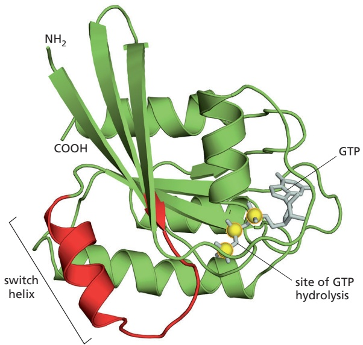

Figure 3–64 The structure of the Ras protein in its GTP-bound form. This monomeric GTPase illustrates the structure of a GTP-binding domain, which is present in a large family of GTP-binding proteins. The red regions change their conformation when the GTP molecule is hydrolyzed to GDP and inorganic phosphate by the protein; the GDP remains bound to the protein, while the inorganic phosphate is released. The special role of the switch helix in proteins related to Ras is explained in the text (see Figure 3–68 and Movie 15.7). (PDB code: 121P.)

of polyubiquitin directs the target protein to the interior of a proteasome, where it is digested to small peptides (see Figure 6–87). In other circumstances, only single molecules of ubiquitin are added to proteins. In addition, some target proteins are modified with a different type of polyubiquitin chain. These modifications have different functional consequences for the protein that is targeted (**Figure 3–65B**).

Related structures are created when a different member of the ubiquitin family, such as SUMO (small ubiquitin-related modifier), is covalently attached to a lysine side chain of target proteins. Not surprisingly, all such modifications are reversible. Cells contain sets of ubiquitylating and deubiquitylating (and sumoylating and desumoylating) enzymes that manipulate these covalent adducts, thereby playing roles analogous to the protein kinases and protein phosphatases that add and remove phosphates from protein side chains.

## An Elaborate Ubiquitin-conjugating System Is Used to Mark Proteins

How do cells select target proteins for ubiquitin addition? As an initial step, the carboxyl end of ubiquitin needs to be activated. This activation is accomplished when a protein called a ubiquitin-activating enzyme (E1) uses ATP

Figure 3–65 The marking of proteins by ubiquitin. (A) The three-dimensional structure of ubiquitin, a small protein of 76 amino acids. A family of special enzymes couples its carboxyl end to the amino group of a lysine side chain in a target protein molecule, forming an isopeptide bond. (B) Some modification patterns that have specific meanings to the cell. Note that the two types of polyubiquitylation differ in the way the ubiquitin molecules are linked together. Linkage through Lys48 signifies degradation by the proteasome (see Figure 6–87), whereas that through Lys63 has other meanings. Ubiquitin markings are “read” by proteins that specifically recognize each type of modification.

---

164

Chapter 3: Proteins

Figure 3–66 How ubiquitin is added to proteins. (A) Ubiquitin activations. The C-terminus of ubiquitin is initially activated by being linked via a high-energy thioester bond to a cysteine side chain on the E1 protein. This reaction requires ATP, and it proceeds via a covalent AMP–ubiquitin intermediate. The activated ubiquitin on E1, also known as the ubiquitin-activating enzyme, is then transferred to the cysteine on an E2 molecule. (B) The addition of a polyubiquitin chain to a target protein. In a mammalian cell, there are several hundred distinct E2–E3 complexes. The E2s are called ubiquitin-conjugating enzymes. The E3s are referred to as ubiquitin ligases. (Adapted from D.R. Knighton et al., Science 253:407–414, 1991.)

hydrolysis energy to attach ubiquitin to itself through a high-energy covalent bond (a thioester). E1 then passes this activated ubiquitin to one of a set of ubiquitin-conjugating (E2) enzymes, each of which acts in conjunction with a set of accessory (E3) proteins called **ubiquitin ligases** that select the target proteins to be modified. There are roughly 30 structurally similar but distinct E2 enzymes in mammals and hundreds of different E3 proteins that form complexes with specific E2 enzymes.

**Figure 3–66** illustrates the process used to mark proteins for proteasomal degradation. [Similar mechanisms are used to attach ubiquitin (and SUMO) to other types of target proteins.] Here, the ubiquitin ligase binds to specific degradation signals, called degrons, in protein substrates, thereby helping E2 to form a polyubiquitin chain linked to a lysine of the substrate protein. This polyubiquitin chain on a target protein will then be recognized by a specific receptor in the proteasome, causing the target protein to be rapidly destroyed. Distinct ubiquitin ligases recognize different degradation signals, thereby targeting distinct subsets of intracellular proteins for destruction, often in response to specific signals (see Figure 6–89).

## Protein Complexes with Interchangeable Parts Make Efficient Use of Genetic Information

Controlled protein degradation is critical for cells, and we will describe the structure and function of one of the families of E3 proteins that adds polyubiquitin chains to target proteins in order to illustrate a general principle: how the cell makes use of interchangeable parts to diversify its many protein complexes.

The SCF ubiquitin ligase is a C-shaped structure that is formed from five protein subunits, the largest of which serves as a scaffold on which the rest of the complex is built. The structure underlies a remarkable mechanism (**Figure 3–67**). At one end of the C is an E2 ubiquitin–conjugating enzyme. At the other end is a substrate-binding arm, a subunit known as an F-box protein. These two subunits are separated by a gap of about 5 nm. When this protein complex is activated, the

---

PROTEIN FUNCTION

165

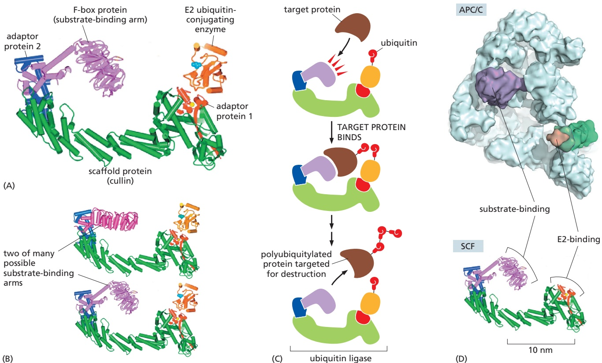

Figure 3–67 The structure and mode of action of a ubiquitin ligase. (A) The structure of the five-protein SCF ubiquitin ligase complex that includes an E2 ubiquitin-conjugating enzyme. Four proteins form the E3 portion. The protein denoted here as adaptor protein 1 is the Rbx1/Hrt1 protein, adaptor protein 2 is the Skp1 protein, and cullin is the Cul1 protein. One of the many different F-box proteins completes the complex. (B) Comparison of the same complex with two different substratebinding arms, the F-box proteins Skp2 (top) and β-trCP1 (bottom), respectively. (C) The binding and ubiquitylation of a target. / . protein by the SCF ubiquitin ligase. If, as indicated, a chain of ubiquitin molecules is added to the same lysine of the target protein, that protein is marked for rapid destruction by the proteasome. (D) Comparison of SCF (bottom) with a low-resolution electron microscopy structure of a ubiquitin ligase called the anaphase-promoting complex (APC/C; top) at the same scale. The APC/C is a large, 15-protein complex. As discussed in Chapter 17, its ubiquitylations control the late stages of mitosis. It is distantly related to SCF and contains a cullin subunit (green) that lies along the side of the complex at right, only partly visible in this view. E2 proteins are not shown here, but their binding sites are indicated in orange, along with substratebinding sites in purple. (A and B, adapted from G. Wu et al., Mol. Cell 11:1445–1456, 2003. D, adapted from P. da Fonseca et al., Nature 470:274–278, 2011.)

F-box protein binds to a specific site on a target protein, positioning the protein in the gap so that some of its lysine side chains contact the ubiquitin-conjugating enzyme. The enzyme can then catalyze repeated additions of ubiquitin to these lysines (see Figure 3–67C), producing the polyubiquitin chains that mark its target proteins for destruction in a proteasome.

In this manner, specific proteins are targeted for rapid destruction in response to specific signals, thereby helping to drive the cell cycle (discussed in Chapter 17). The timing of the destruction often involves creating a specific pattern of phosphorylation on the target protein that is required for its recognition by the F-box subunit. It also requires the activation of an SCF-like ubiquitin ligase that carries the appropriate substrate-binding arm. Many of these arms (the F-box subunits) are interchangeable in the protein complex (see Figure 3–67B), and there are more than 70 human genes that encode them.

As emphasized previously, once a successful protein has evolved, its genetic information tends to be duplicated to produce a family of related proteins. Thus, for example, not only are there many F-box proteins—making possible the recognition of different sets of target proteins—but there is also a family of scaffolds (known as cullins) that give rise to a family of SCF-like ubiquitin ligases.

A protein machine like the SCF ubiquitin ligase, with its interchangeable parts, makes economical use of the genetic information in cells. It also creates

---

166

Chapter 3: Proteins

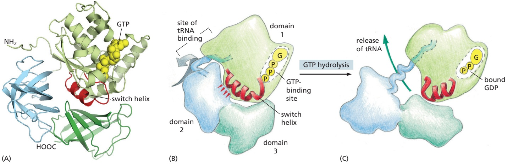

Figure 3–68 The large conformational change in EF-Tu caused by GTP hydrolysis. (A and B) The three-dimensional structure of EF-Tu with GTP bound. The domain at the top has a structure similar to the Ras protein, and its red α helix is the switch helix, which moves after GTP hydrolysis. (C) The change in the conformation of the switch helix in domain 1 allows domains 2 and 3 to rotate as a single unit by about 90 degrees toward the viewer, which releases the tRNA that was bound to this structure (see also Figure 3–69). (A, PDB code: 1EFT; B, courtesy of Mathias Sprinzl and Rolf Hilgenfeld.)

opportunities for “rapid” evolution, inasmuch as new functions can evolve for the entire complex simply by producing an alternative version of one of its subunits.

Ubiquitin ligases form a diverse family of protein complexes. Some of these complexes are far larger and more complicated than SCF, but their underlying enzymatic function remains the same (see Figure 3–67D).

## A GTP-binding Protein Shows How Large Protein Movements Can Be Generated from Small Ones

Detailed structures obtained for one of the GTP-binding protein family members, the EF-Tu protein, provide a good example of how allosteric changes in protein conformations can produce large movements by amplifying a small, local conformational change. As will be discussed in Chapter 6, EF-Tu is an abundant molecule that serves as an elongation factor (hence the EF) in protein synthesis, loading each aminoacyl-tRNA molecule onto the ribosome. EF-Tu contains a Ras-like domain (see Figure 3–64), and the tRNA molecule forms a tight complex with its GTP-bound form. For the tRNA molecule to transfer its amino acid to the growing polypeptide chain requires that the GTP bound to EF-Tu be hydrolyzed, dissociating the EF-Tu from the tRNA. Because this GTP hydrolysis is triggered by a proper fit of the tRNA to the mRNA molecule on the ribosome, the EF-Tu serves to discriminate between correct and incorrect mRNA–tRNA pairings (see Figure 6–69).

By comparing the three-dimensional structure of EF-Tu in its GTP-bound and GDP-bound forms, we can see how the repositioning of the tRNA occurs. The dissociation of the inorganic phosphate group, which follows the reaction GTP → GDP + phosphate, causes a shift of a few tenths of a nanometer at the GTP-binding site, just as it does in the Ras protein. This tiny movement, equivalent to a few times the diameter of a hydrogen atom, causes a conformational change to propagate along a crucial piece of α helix, called the switch helix, in the Ras-like domain of the protein. The switch helix seems to serve as a latch that adheres to a specific site in another domain of the molecule, holding the protein in a “shut” conformation. The conformational change triggered by GTP hydrolysis causes the switch helix to detach, allowing separate domains of the protein to swing apart, through a distance of about 4 nm (**Figure 3–68**). This releases the tRNA, allowing its attached amino acid to be used for protein synthesis (**Figure 3–69**).

Notice in this example how cells have exploited a simple chemical change that occurs on the surface of a small protein domain to create a movement 50 times

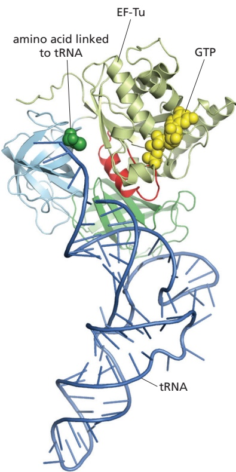

Figure 3–69 An aminoacyl tRNA molecule bound to EF-Tu. Note how the bound protein blocks the use of the tRNAlinked amino acid (dark green) for protein synthesis until GTP hydrolysis triggers the conformational changes shown in Figure MBoC7 m3.73/3.693–68C, dissociating the protein–tRNA complex. EF-Tu is a bacterial protein; however, a very similar protein exists in eukaryotes, where it is called EF-1 (Movie 3.12). (PDB code: 1B23.)

---

PROTEIN FUNCTION

167

larger. Dramatic shape changes of this type also cause the very large movements that occur in motor proteins, as we discuss next.

## Motor Proteins Produce Directional Movement in Cells

We have seen that conformational changes in proteins have a central role in enzyme regulation and cell signaling. We now discuss proteins whose major function is to move other molecules. These motor proteins generate the forces responsible for muscle contraction and the crawling and swimming of cells. Motor proteins also power smaller-scale intracellular movements: they help to move chromosomes to opposite ends of the cell during mitosis (discussed in Chapter 17), to move organelles along molecular tracks within the cell (discussed in Chapter 16), and to move enzymes along a DNA strand during the synthesis of a new DNA molecule (discussed in Chapter 5). All these fundamental processes depend on proteins with moving parts that operate as force-generating machines.

How do these machines work? It is a challenge for cells to use shape changes in proteins to generate persistent movements in a single direction. If, for example, a protein is required to walk along a long cytoskeletal filament, it can do this by undergoing a series of conformational changes, such as those shown in **Figure 3–70**. But with nothing to drive these changes in an orderly sequence, they are perfectly reversible, and the protein can only wander randomly back and forth along the thread. We can look at this situation in another way. Because the directional movement of a protein does work, the laws of thermodynamics (discussed in Chapter 2) demand that such movement use free energy from some other source (otherwise the protein could be used to make a perpetual motion machine). Therefore, without an input of energy, the protein molecule can only wander aimlessly.

How can the cell make such a series of conformational changes unidirectional? To force the entire cycle to proceed in one direction, it is enough to make any one of the changes in shape irreversible. Most proteins that are able to walk in one direction for long distances achieve this motion by coupling one of the conformational changes to the hydrolysis of an ATP molecule that is tightly bound to the protein. The mechanism is similar to the one discussed earlier that drives allosteric protein shape changes by GTP hydrolysis. Because ATP (or GTP) hydrolysis releases a great deal of free energy, it is very unlikely that the nucleotide-binding protein will undergo the reverse shape change needed for moving backward—as this would require that it also reverse the ATP hydrolysis by adding a phosphate molecule to ADP to form ATP.

In the model shown in **Figure 3–71A**, ATP binding shifts a motor protein from conformation 1 to conformation 2. The bound ATP is then hydrolyzed to produce ADP and inorganic phosphate, causing a change from conformation 2 to conformation 3. Finally, the release of the bound ADP and phosphate drives the protein back to conformation 1. Because the energy provided by ATP hydrolysis drives the transition 2 → 3, this series of conformational changes is effectively irreversible. Thus, the entire cycle goes in only one direction, causing the protein molecule to walk continuously to the right in this example.

Many motor proteins generate directional movement through the use of a similar unidirectional ratchet, including the muscle motor protein myosin, which walks along actin filaments (**Figure 3–71B**), and the kinesin proteins that walk along microtubules (both discussed in Chapter 16). These movements can be rapid: some of the motor proteins involved in DNA replication (the DNA helicases) propel themselves along a DNA strand at rates as high as 1000 nucleotides per second.

## Proteins Often Form Large Complexes That Function as Protein Machines

Large proteins formed from many domains are able to perform more elaborate functions than small, single-domain proteins. But large protein assemblies formed from many protein molecules linked together by noncovalent bonds perform the most impressive tasks. Now that it is possible to reconstruct most biological

# A
 A
 B
 B
 B
 B
 C
 C
 C
 C

Figure 3–70 Changes in conformation can cause a protein to “walk” along a cytoskeletal filament, driven by its constant collisions with other molecules (thermal energy). This protein cycles between three different conformations (A, B, and C) as it moves along the filament. But, without an input of energy to drive its movement in a single direction, the protein can only wander randomly back and forth, ultimately getting nowhere.

---

168

Chapter 3: Proteins

Figure 3–71 How a protein can walk in one direction. (A) An allosteric motor protein driven by ATP hydrolysis. The transition between three different conformations includes a step driven by the hydrolysis of a tightly bound ATP molecule, creating a “unidirectional ratchet” that makes the entire cycle essentially irreversible. By repeated cycles, the protein therefore moves continuously to the right along the thread. (B) Direct visualization of a walking myosin motor protein by high-speed atomic force microscopy; the elapsed time between steps was less than 0.5 sec (see Movie 16.3). (B, adapted from N. Kodera et al., Nature 468:72–76, published 2010 by Macmillan Publishers Ltd. Reproduced with permission of SNCSC.)

processes in cell-free systems in the laboratory, it is clear that each of the central processes in a cell—such as DNA replication, protein synthesis, vesicle budding, or transmembrane signaling—is catalyzed by a highly coordinated, linked set of MB C7 3.75/3.71 10 or more proteins. In most such protein machines, energetically favorable reactions such as the hydrolysis of bound nucleoside triphosphates (ATP or GTP) drive an ordered series of conformational changes in one or more of the individual protein subunits, enabling the ensemble of proteins to move in a coordinated way. As a result, each enzyme can be moved directly into position as the machine catalyzes successive reactions in a series (**Figure 3–72**). This is what occurs, for example, in protein synthesis on a ribosome (an RNA–protein, or macromolecular machine, discussed in Chapter 6)—or in DNA replication, where a large multiprotein complex moves rapidly along the DNA (discussed in Chapter 5).

Cells have evolved protein machines for the same reason that humans have invented mechanical and electronic machines. For accomplishing almost any task, manipulations that are spatially and temporally coordinated through linked processes are much more efficient than the use of many separate tools.

## The Disordered Regions in Proteins Are Critical for a Set of Different Functions

Scientists have discovered that proteins contain a surprisingly large amount of intrinsically disordered polypeptide chain. Thus, as previously mentioned, it is estimated that about a third of all eukaryotic proteins contain unstructured

---

PROTEIN FUNCTION

169

Figure 3–72 Schematic example showing how protein machines can carry out complex functions. These machines are made of individual proteins that collaborate to perform a specific task (Movie 3.13). As in this example, the movement of these proteins is often coordinated by the hydrolysis of a bound nucleotide such as ATP or GTP. Directional allosteric conformational changes of proteins driven in this way often occur in a large protein assembly, thereby allowing directed movements within the complex to coordinate the activities of its individual molecules. (See also Movie 5.5.)

regions greater than 30 amino acids in length. Some of these regions are formed from only a limited subset of the 20 amino acids and are therefore designated as low-complexity domains. Because many unstructured regions have been conserved in a particular protein over long periods of evolutionary time, their presence must benefit the organisms that contain them. What do these disordered regions do?

Intrinsically disordered regions of proteins often form specific binding sites for other proteins that are of high specificity, as illustrated in **Figure 3–73A**. In addition, this type of binding interaction is easily controlled. Most protein phosphorylation sites are in intrinsically disordered regions, not in globular domains, and these regions are central to regulatory mechanisms. As one example, the eukaryotic RNA polymerase enzyme that produces mRNAs contains an unstructured C-terminal tail of 200 amino acids that is covalently modified as the RNA polymerase proceeds, thereby attracting specific other proteins to the transcription complex at different times (see Figure 6–23). Disordered regions tend to evolve rapidly, and the type of binding diagrammed in **Figure 3–73B** facilitates the fine-tuning and evolution of cell signaling networks (see Chapter 15).

A very different type of function is exemplified by elastin, an abundant protein in the extracellular matrix that is formed as a highly disordered polypeptide. Elastin’s relatively loose and unstructured polypeptide chains are covalently cross-linked to produce an elastic meshwork that can be stretched like a rubber band, as illustrated in **Figure 3–74**. The elastic fibers that result enable skin and other tissues, such as arteries and lungs, to stretch and recoil without tearing.

Perhaps most uniquely, intrinsically disordered regions are widely used as tethers to concentrate reactants and thereby accelerate the reactions needed by a cell. For example, within large multienzyme complexes, unstructured regions of polypeptide chain can allow substrates to be carried sequentially between different active sites (**Figure 3–75**).

In their most general tethering role, unstructured regions allow large scaffold proteins with multiple binding sites to concentrate sets of interacting RNA and/or protein molecules at a particular site in a cell, as we discuss next.

(A) BINDING

(B) SIGNALING

Figure 3–73 Intrinsically disordered protein sequences provide versatile binding sites. (A) Unstructured regions of polypeptide chain often form binding sites for other proteins. Although these binding events are of high specificity, they are often of low affinity because of the free-energy cost of folding the normally unfolded partner (and they are thus readily reversible). (B) Unstructured MBoC7 m3.24/3.73regions can be easily modified covalently to change their binding preferences, and they are therefore frequently involved in cell signaling processes. In this schematic, multiple sites of protein phosphorylation are indicated.

---

170

Chapter 3: Proteins

Figure 3–74 Intrinsically disordered protein chains are used to produce elastic structures. The polypeptide chains of the protein elastin are cross-linked together in the extracellular space to form rubberlike, elastic fibers. Each elastin molecule uncoils into a more extended conformation when the fiber is stretched, and it recoils spontaneously as soon as the stretching force is relaxed.

Scaffolds Bring Sets of Interacting Macromolecules Together and Concentrate Them in Selected Regions of a Cell

As scientists have learned more of the details of cell biology, they have recognized an increasing degree of sophistication in cell chemistry. We now know that protein machines play a predominant role and that all of their activities—like those of other proteins—are highly regulated. In addition, it has also become clear thatMBoC7 m3.23(B)/3.74

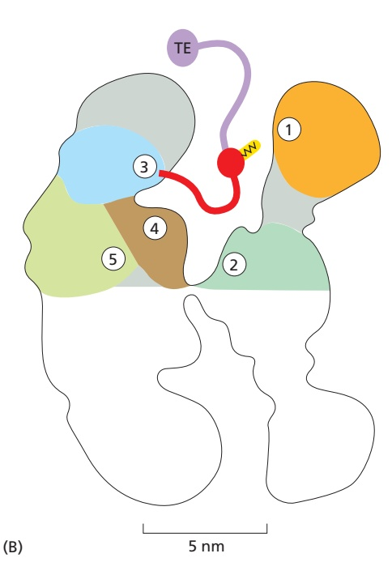

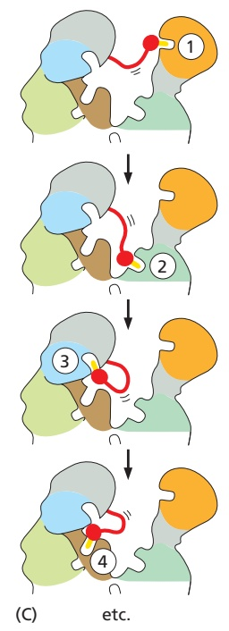

Figure 3–75 How unstructured regions of polypeptide chain can serve as tethers to allow reaction intermediates to be passed from one active site to another in a large multienzyme complex, the fatty acid synthase in mammals. (A) The locations of seven protein domains with different activities in this 270-kilodalton protein are shown. The numbers refer to the order in which each enzyme domain must function to complete each twocarbon addition step. After multiple cycles of two-carbon addition, the termination domain releases the final product once the desired length of fatty acid has been synthesized. (B) The structure of the dimeric enzyme, with the location of the five active sites in one monomer indicated. (C) How a flexible tether allows the substrate that remains linked to the acyl carrier domain (red) to be passed from one active site to another in each monomer, sequentially elongating and modifying the bound fatty acid intermediate (yellow). The five steps are repeated until the final length of fatty acid chain has been synthesized. (Only steps 1 through 4 are illustrated here.) (Adapted from T. Maier et al., Q. Rev. Biophys. 43:373–422, 2010.)

---

PROTEIN FUNCTION

171

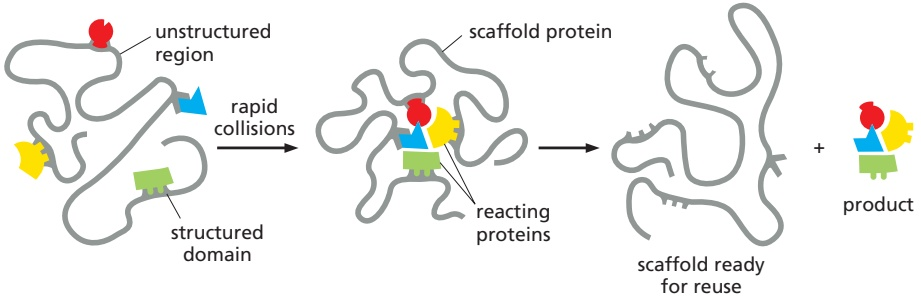

Figure 3–76 How the proximity created by scaffold proteins can greatly speed reactions in a cell. In this example, long unstructured regions of polypeptide chain in a large scaffold protein connect a series of structured domains that bind a set of reacting proteins or RNA molecules. The unstructured regions serve as flexible tethers that greatly speed reaction rates by causing a rapid, random collision of all of the molecules that are bound to the scaffold. (For specific examples of protein tethering, see Figure 3–75 and Figure 16–14; for scaffold RNA molecules, see Figure 7–82.)

these machines are often localized to specific sites in the cell, being assembled and activated only where and when they are needed. As one example, when extracellular signaling molecules bind to receptor proteins in the plasma membrane, the activated receptors often recruit a set of other proteins to the inside surface of the plasma membrane to form a large protein complex that passes the signal on (illustrated and discussed in Chapter 15).

The mechanisms generally involve **scaffold proteins** that have binding sites for multiple other proteins and/or RNA molecules. Such scaffolds serve both to link together specific sets of interacting macromolecules and to position them at specific locations inside a cell. At one extreme are rigid scaffolds, such as the cullin7 3.78/3.76 in SCF ubiquitin ligase (see Figure 3–67). At the other extreme are large, flexible scaffold proteins that create special regions inside the cell that have a unique biochemistry. Networks of such large scaffolds often underlie regions of specialized plasma membrane. For example, the Discs-large protein (Dlg) of about 900 amino acids is concentrated in special regions beneath the plasma membrane in epithelial cells and at synapses. Dlg contains binding sites for at least seven other proteins interspersed with regions of more flexible polypeptide chain. An ancient protein, conserved in organisms as diverse as sponges, worms, flies, and humans, Dlg derives its name from the mutant phenotype of the organism in which it was first discovered. In a Drosophila embryo with a mutation in the Dlg gene, the imaginal disc cells fail to stop proliferating when they should, and they produce unusually large discs whose epithelial cells can form tumors.

Dlg and a large number of similar scaffold proteins are thought to function like the protein that is schematically illustrated in **Figure 3–76**. By binding a specific set of interacting proteins and/or RNA molecules, these scaffolds can enhance the rate of critical reactions, while also confining them to the particular region of the cell that contains the scaffold. For similar reasons, cells also make extensive use of scaffold RNA molecules, as discussed in Chapter 7.

## Macromolecules Can Self-assemble to Form Biomolecular Condensates

The macromolecular assemblies and protein machines that we have discussed so far are defined by physical interactions that organize individual proteins and nucleic acids at defined positions relative to each other. Each copy of a macromolecular machine generally is built from the same parts and assembled into the same three-dimensional structure. For example, the bacterial ribosome responsible for synthesizing new proteins is built from 55 proteins and three RNA molecules arranged in an invariant complex (see Figure 6–65). Even in the case of protein complexes containing flexible scaffolds (see Figure 3–75), the macromolecular assembly has a characteristic (albeit flexible) conformation.

In contrast, **biomolecular condensates** are a different type of cellular structure built from proteins (and often RNA) held together by a large number of weak and constantly changing interactions among them. Each condensate is created by at least one scaffold macromolecule (a protein or RNA molecule) that is capable of making multiple independent interactions with either itself or with other macromolecules, which themselves often make multiple interactions. These types of macromolecules are said to be multivalent. Typically, each of the individual

---

172

Chapter 3: Proteins

interactions among these multivalent proteins and RNAs is very weak, so it forms and breaks frequently. When any one interaction breaks, other interactions at different sites in that macromolecule prevent it from diffusing away and keep the macromolecule locally concentrated. By the time some of these other interactions break, new ones have already formed elsewhere. In this way, all of the proteins within a condensate continually interact with each other, even though the specific set of interactions changes from one moment to another.

Formation of a condensate serves to segregate and concentrate a subset of the cell’s macromolecules into a separate compartment in the cell. In some cases, these macromolecules perform specialized biochemistry within the condensate—forming a biochemical “factory” that efficiently produces a specific product, as for the ribosomes that are produced by the nucleolus. In other cases, sequestration into a condensate can serve as a temporary storage depot for a set of macromolecules while blocking their activity, as for the stress granules that can form when a cell is perturbed.

The disordered, low-complexity domains of proteins are often found to mediate the fluctuating, weak binding interactions that form a condensate, frequently making a major contribution to their formation. In addition, other types of binding can also drive condensate formation (**Figure 3–77A**). The dynamic, fluctuating interactions within a condensate cause it to behave like a liquid: all of the participating molecules within it jostle around and rapidly exchange their relative positions; in addition, they often exchange rapidly with their equivalents outside the condensate (**Figure 3–77B**). Because the condensate remains intact and

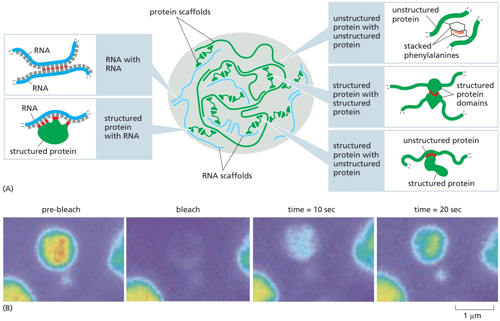

Figure 3–77 The multivalent interactions between scaffold macromolecules that drive the formation of biomolecular condensates. (A) Schematic diagram of a biomolecular condensate that contains both RNA and proteins; illustrated are some types of weak binding interactions frequently involved. Note that the low-complexity domains of scaffold proteins are often critical for forming these condensates, and that several different types of binding interactions are known to cause these unstructured regions to adhere to each other. In addition to the stacking of aromatic side chains (phenylalanine is shown), these include ionic attractions, cation–pi interactions, and the formation of kinked cross-beta structures that resemble amyloids. (B) A fluorescence recovery after photobleaching (FRAP) experiment reveals that the protein molecules inside a condensate are mobile. Here the multiple nucleoli in a mammalian cell have been fluorescently labeled by fusing GFP to the scaffold protein fibrillin, and this fibrillin in one of the nucleoli has been bleached with a flash from a focused laser beam. A rapid recovery of fluorescence demonstrates that the fibrillin in this condensate is continually exchanging with the fibrillin molecules in its surroundings. (B, from R.D. Phair and T. Misteli, Nature 404:604–609, 2000. Reproduced with permission of SNCSC.)

---

PROTEIN FUNCTION

173

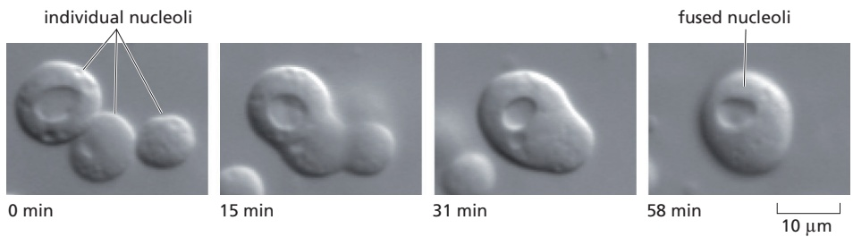

Figure 3–78 Spherical, liquid-droplet-like nucleoli can be seen to fuse in the light microscope. In these experiments, the nucleoli are present inside a nucleus that has been dissected from Xenopus oocytes and placed under oil on a microscope slide. Here, three nucleoli are seen fusing to form a larger biomolecular condensate. A very similar process occurs after each round of division, when small nucleoli initially form on multiple chromosomes but then coalesce to form a MBoC7 e4.53/3.78single, large nucleolus (see Figure 6–47). (From C.P. Brangwynne et al., Proc. Natl. Acad. Sci. USA 108:4334–4339, 2011. With permission from National Academy of Sciences.)

distinct from the surrounding liquid, the process of condensate formation is commonly termed **liquid–liquid phase separation** or liquid–liquid demixing.

A characteristic feature of biomolecular condensates that reflects their dynamic nature is the readily reversible assembly and disassembly of many of these structures. Thus, for example, the nucleolus disappears during mitosis, and it reforms in early interphase by fusion of the initially separate droplets that form on different chromosomes at the start of each interphase (**Figure 3–78**). Likewise, the DNA repair, DNA replication, and DNA transcription factories in the nucleus appear only where and when each of these processes occurs (**Figure 3–79**; see also Figure 6–51C).

## Classical Studies of Phase Separation Have Relevance for Biomolecular Condensates

A familiar phase-separation process is that between oil and water, which occurs in some salad dressings. A phase separation occurs whenever forming two phases instead of one minimizes the free energy of a mixture, and it requires overcoming the large unfavorable free-energy change caused by the entropic cost of demixing. Thus, in the oil and water example, there are many more ways of distributing the small oil molecules in between water molecules than there are ways of condensing the oil molecules all together. The completely mixed state is by far the most probable, and the act of demixing therefore involves a large unfavorable (negative) entropy change that produces a large unfavorable (positive) change in the ∆G for phase separation (remembering that ∆G = ∆H – T∆S). But because of an even larger, favorable ∆G derived from preventing the oil molecules from disrupting the hydrogen-bonded network of water molecules, the oil and water separate into distinct phases (see Panel 2–2, pp. 96–97).

time = 0

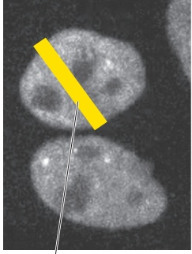

UV laser creates DNA damage

time = 30 sec

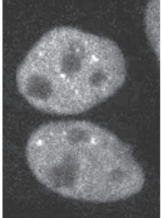

time = 50 sec

time = 80 sec

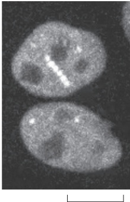

10 µm

Figure 3–79 The formation of a biomolecular condensate in response to DNA damage. Here, a brief irradiation flash from a UV laser has been used to create a narrow line of DNA damage in the interphase nucleus of a mammalian cell. Because the FUS scaffold protein has been fluorescently labeled with GFP, the formation of the liquid-droplet-like DNA repair factories that this scaffold helps to generate can be followed in a living cell. (Adapted from Movie S1 in A. Patel et al., Cell 162:1066–1077, 2015. With permission from Elsevier.)

---

174

Chapter 3: Proteins

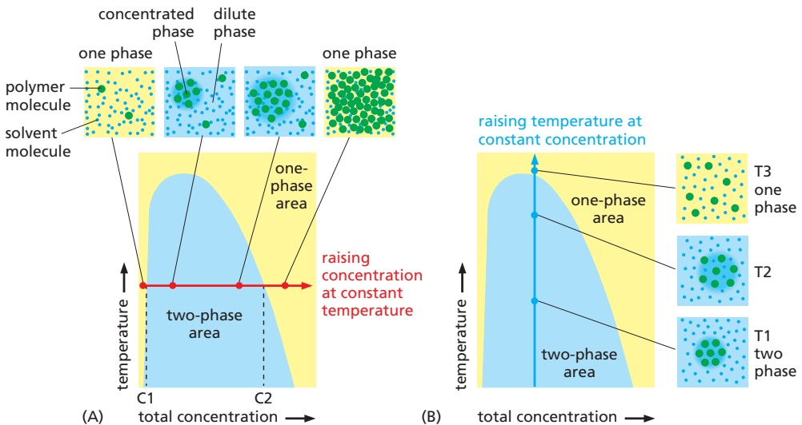

Figure 3–80 How phase diagrams are used to describe phase separations. (A) The effect of increasing the polymer concentration at constant temperature. At a low total concentration of a polymer (Ct), only a single dilute phase is observed. But as the polymer concentration is increased (red arrow), phase separation begins for $\mathbb { C } \mathbb { t } > \mathbb { C } \mathbb { 1 }$ , and a new concentrated phase now forms with the polymer at concentration C2 in equilibrium with a dilute phase at polymer concentration C1. As Ct is further increased, the phase with polymer concentration C2 increases in volume, while remaining in equilibrium with the polymer in the dilute phase at an unchanging concentration C1. Finally, for $\dot { \mathrm { C t } > \mathrm { C } 2 }$ , there is only a single phase with concentration Ct. In the example illustrated, C2 is more than 10-fold greater than C1. (B) The effect of increasing temperature (T ) at a constant total polymer concentration. As the temperature is raised in a solution that contains a phase-separated polymer from T1 to T2 (blue arrow), the concentration of polymer in its dilute phase (C1) increases and the concentration of polymer in its concentrated phase (C2) decreases. At a higher critical temperature $\mathbb { C } 1 = \mathbb { C } 2$ , and the two phases become one. This occurs because the unfavorable 2entropy change for demixing (∆S) makes an increasingly large, unfavorable contribution to the net free-energy change at higher temperatures (via the –T∆S term in the equation for ∆G), eventually preventing any separation of phases.

For large polymers, which include proteins and nucleic acids, the entropic cost of demixing is considerably less than that for an equivalent mass of small molecules. This is because the monomeric subunits of a polymer are already greatly constrained in their possible arrangements through their covalent attachment to other subunits. As a result, a set of relatively weak attractions between the polymer molecules can often provide a large enough favorable free-energy change to drive phase separation—overcoming the unfavorable free-energy change of demixing.

Chemists have developed phase diagrams to describe what happens when chemically synthesized polymers phase-separate (**Figure 3–80**). As illustrated, when a threshold concentration of a polymer is reached, the solution separates into two distinct phases, one dilute and the other considerably more concentrated. The most important feature to notice is that, as more polymer is added at a fixed temperature (Figure 3–80A), its concentration in each phase remains the same. To accommodate the increased amount of polymer present, the volume of the concentrated phase increases and the volume of the dilute phase decreases. These and other features of phase separation are relevant when considering biomolecular condensates, even though the latter are generally composed of mixtures of more complex biological polymers (proteins and RNA molecules).

## A Comparison of Three Important Types of Large Biological Assemblies

It has long been recognized that eukaryotic cells contain many membraneenclosed compartments central to cell biology. These take the form of organelles such as the nucleus, endoplasmic reticulum, Golgi apparatus, and lysosome. Each such organelle concentrates a particular set of enzymes and substrates, thereby

---

PROTEIN FUNCTION

175

<table><tr><td rowspan="2"></td><td colspan="3">Comparison of three types of large biochemical assemblies</td></tr><tr><td>Macromolecular machine</td><td>Biomolecular condensate</td><td>Membrane-enclosed compartment</td></tr><tr><td>Properties</td><td>Fixed macromolecular composition, with a defined stoichiometry and spatial organization of constituentsFormed from a specific set of protein molecules or from protein and RNA moleculesAssembles spontaneously and can form de novoNevertheless, in many cases assembly is regulated to occur at specific sites, as needed</td><td>Dynamic, often liquidlike or gel-like organization, in which RNAs and low-complexity domains of proteins form specific, but transient, interactionsReadily permeable to small moleculesLarger than most macromolecular machinesMacromolecule composition is selective, but stoichiometry is usually not fixedCan assemble de novo and be disassembled in response to changing conditions or cellular need</td><td>Creates a distinct chemical and protein environment that is maintained by active transport across the enclosing membraneInterior contains a variable stoichiometry of macromolecules in solution, as determined by the above transport processesNot permeable to most small moleculesFormation usually requires a preexisting membrane-enclosed compartment of a special kind, different for each compartment</td></tr><tr><td>Examples</td><td>SCF ubiquitin ligaseDNA replication protein machineRibosomeNuclear pore</td><td>NucleolusCentrosomeStress granuleNeuronal RNA transport granule</td><td>Endoplasmic reticulumMitochondrionTransport vesicleLysosome</td></tr></table>

creating a specialized biochemistry in its interior. Those compartments will be the subject of Chapter 12, where we will also discuss biomolecular condensates in more detail. In **Table 3–3**, we compare the properties of the protein machines and biomolecular condensates introduced in this chapter, both with each other and with membrane-enclosed compartments.

## Many Proteins Are Controlled by Covalent Modifications That Direct Them to Specific Sites Inside the Cell

In this chapter, we have thus far described only a few ways in which proteins are post-translationally modified. A large number of other such modifications also occur, more than 200 distinct types being known. To give a sense of the variety, **Table 3–4** presents a few of the modifying groups with known regulatory roles.

<table><tbody><tr><td colspan="2">TABLE 3-4 Some Molecules Covalently Attached to Proteins That Regulate Protein Function</td></tr><tr><td>Modifying group</td><td>Some prominent functions</td></tr><tr><td>Phosphate on Ser, Thr, or Tyr</td><td>Drives the assembly of a protein into larger complexes (see Figure 15-11)</td></tr><tr><td>Methyl on Lys</td><td>Helps to create distinct regions in chromatin by forming either monomethyl, dimethyl, or trimethyl lysine in histones (see Figure 4-34)</td></tr><tr><td>Acetyl on Lys</td><td>Helps to activate genes in chromatin by modifying histones (see Figure 4-34)</td></tr><tr><td>Palmityl group on Cys</td><td>This fatty acid addition drives protein association with membranes (see Figure 10-18)</td></tr><tr><td>N-Acetylglucosamine on Ser or Thr</td><td>Controls enzyme activity and gene expression in glucose homeostasis</td></tr><tr><td rowspan="3">Ubiquitin on Lys</td><td>Monoubiquitin addition regulates the transport of membrane proteins in vesicles (see Figure 13-59)</td></tr><tr><td>A polyubiquitin chain targets a protein for degradation (see Figure 3-66)</td></tr><tr><td>(Ubiquitin is a 76-amino-acid polypeptide; there are at least 10 other ubiquitin-related proteins in mammalian cells.)</td></tr></tbody></table>

---

176

Chapter 3: Proteins

Figure 3–81 Multisite protein modification and its effects. (A) A protein that carries a post-translational addition to more than one of its amino acid side chains can be considered to carry a combinatorial regulatory code. Multisite modifications are added to (and removed from) a protein through signaling networks, and the resulting combinatorial regulatory code on the protein is read to alter its behavior in the cell. (B) The pattern of some covalent modifications to the protein p53.

Like the phosphate and ubiquitin additions described previously, these groups are added and then removed from proteins according to the needs of the cell.

A large number of proteins are modified on more than one amino acid side chain, with different regulatory events producing a different pattern of such modifications. A striking example is the protein p53, which plays a central part in controlling a cell’s response to adverse circumstances (see Figure 17–60). Through one of four different types of molecular additions, this protein can be modified at 20 different sites. Because an enormous number of different combinations of these 20 modifications are possible, the protein’s behavior can in principle be altered in a huge number of ways. Such modifications will often create a site on the modified protein that binds it to a scaffold protein in a specific region of the cell, thereby connecting it—via the scaffold—to the other proteins. / . required for a reaction at that site. The effects can include moving the modified protein either into or out of a specific biomolecular condensate.

One can view each protein’s set of covalent modifications as a combinatorial regulatory code. Specific modifying groups are added to or removed from a protein in response to signals, and the code then alters protein behavior—changing the activity or stability of the protein, its binding partners, and/or its specific location within the cell (**Figure 3–81**). As a result, the cell is able to respond rapidly and with great versatility to changes in its condition or environment.

## A Complex Network of Protein Interactions Underlies Cell Function

There are many challenges facing cell biologists in this information-rich era when a huge number of complete genome sequences are known. One is the need to dissect each one of the thousands of protein machines that exist in an organism such as ourselves. To understand these remarkable protein complexes, each will need to be reconstituted from its purified protein parts, so that we can study its detailed mode of operation under controlled conditions in a test tube, free from all other cell components. This alone is a massive task. But we now know that each of these subcomponents of a cell also interacts with other sets of macromolecules, creating a large network of protein–protein and protein–nucleic acid interactions throughout the cell. To understand the cell, therefore, we will need to analyze most of these other interactions as well.

---

PROTEIN FUNCTION

177

Figure 3–82 A network of proteinbinding interactions in the cells of the fruit fly, Drosophila. Each line connecting a pair of dots (proteins) indicates a protein– protein interaction. Labels are used to denote a few of the highly interactive groups of proteins whose functions are described in this textbook. (From K.G. Guruharsha et al., Cell 147:690–703, 2011. With permission from Elsevier.)

We can begin to gain a sense of the nature of intracellular protein networks from a particularly well-studied example described in Chapter 16: the many dozens of proteins in the actin cytoskeleton that interact to control actin filament behavior (see Panel 16–3, p. 965). Biochemists and structural biologists are, in principle, able to purify all of these different actin-accessory proteins to study their effects on actin filaments individually and in combination, and to determine all of their protein–protein interactions and their atomic structures. But to truly understand the actin cytoskeleton will require that we also learn how to use this data to compute how any particular mixture of these components present in an individual cell creates that cell’s observed set of three-dimensional networks of actin structures—a goal that currently seems out of reach.

Of course, understanding the cell will require much more than understanding actin. In recent years, as described in Chapter 8, robotics has been harnessed to a set of powerful technologies to produce enormous protein interaction maps (**Figure 3–82**). The data obtained suggest that each of the roughly 10,000 different proteins in a human cell interacts with 5–10 different partners, illustrating the challenges that face scientists working to understand the complexity of cell chemistry.

What does the future hold? Despite the enormous progress made in recent years, we cannot yet claim to understand even the simplest known cells, such as the small Mycoplasma bacterium formed from only about 500 gene products (see Figure 1–8). How then can we hope to understand a human? Clearly, a great deal of new biochemistry will be essential, in which each protein in a particular interacting set is purified so that its chemistry and interactions can be dissected in a test tube. But in addition, more powerful ways of analyzing networks will be needed using mathematical and computational tools not yet invented. Clearly, there are many wonderful challenges that remain for future generations of cell biologists.

---

178

Chapter 3: Proteins

## Protein Structures Can Be Predicted and New Proteins Designed

Because the structures and functions of proteins are encoded in their amino acid sequences, in principle it is possible to predict the structures and functions of proteins directly from their amino acid sequences. We should also be able to create proteins with entirely new structures and functions by designing new amino acid sequences to produce these structures and functions, encoding them in synthetic genes. Success in the first endeavor would transform our ability to understand how the biology of an organism is encoded in the DNA sequence of its genome. Success in the second endeavor could lead to a new generation of designed proteins that address some of the twenty-first-century challenges confronting humanity.

There are major challenges in both of the above areas. A first challenge is the very large number of potential structures that are possible for any given amino acid sequence. Because, as we have seen, a protein folds to its lowest free-energy state, one needs to use physics to compute the energy of each protein conformation. But the number of possible conformations for even a relatively short protein of 100 amino acids is of the order 3100, as each amino acid has on average 3 or more rotatable bonds. Success in predicting protein structure and in designing new proteins thus requires computational methods for very efficient searching through huge numbers of structures.

Progress has been made in recent years. For small proteins or for proteins from very large families to help constrain the problem, large-scale computer searches for the lowest energy state can often accurately predict protein structure starting from amino acid sequence. Recently developed deep learning approaches using artificial intelligence (AI) can produce even more accurate protein structure predictions. Conversely, many new protein structures and functions have been created from scratch by designing new sequences in which the lowest energy state has the desired structure and function (**Figure 3–83**).

While this progress suggests that the protein-folding problem is not intractable, huge challenges remain. Predicting function from structure is even more difficult: while in some cases function can be predicted from structure by analogy to other proteins with similar structures and already known functions, this can be problematic because even a few amino acid changes can considerably change function; for example, the identity of the substrate that an enzyme acts upon. On the design side, while it has been possible to design new proteins with new structures and binding

Figure 3–83 Some examples of designed proteins. The amino acid sequences of the three proteins illustrated were determined computationally, being selected so that each protein would adopt a specifically designed three-dimensional conformation in its lowest energy state. After each protein was produced in a bacterium using genetic engineering techniques, its actual structure was then determined and shown to be the same as that intended by the designer. (A) A small protein of 122 amino acids. (B) A protein that creates an octahedral shell formed from 24 identical subunits, only 8 of which are shown. (C) A protein that consists of an antiparallel three-helix bundle. (A, PDB code 2N76; B, PDB code 3VCD; C, PDB code 4TQL).

---

PROBLEMS

179

activities, it remains a big challenge to match the remarkable activities of natural enzymes and the sophisticated information integration and force generation of natural molecular machines.

## Summary

The function of a protein largely depends on the detailed chemical properties of its surface. Enzymes are catalytic proteins that greatly accelerate the rates of covalent bond making and breaking. They do this by binding the high-energy transition state for a specific reaction path, lowering that reaction’s activation energy. The rates of enzyme-catalyzed reactions are often so fast that they are limited only by diffusion.

Proteins can reversibly change their shape when ligands bind to their surface. The allosteric changes in protein conformation produced by one ligand affect the binding of a second ligand, and this linkage between two ligand-binding sites provides a crucial mechanism for regulating cell processes. Metabolic pathways, for example, are controlled by feedback regulation: some small molecules inhibit and other small molecules activate enzymes early in a pathway. Enzymes controlled in this way generally form symmetrical assemblies, allowing cooperative conformational changes to create a steep response to changes in the concentrations of the ligands that regulate them.

The expenditure of chemical energy can drive unidirectional changes in protein shape. By coupling allosteric shape changes to the hydrolysis of a tightly bound ATP molecule, for example, proteins can do useful work, such as generating a mechanical force or moving for long distances in a single direction. The three-dimensional structures of proteins have revealed how a small local change caused by nucleoside triphosphate hydrolysis is amplified to create major changes elsewhere in the protein. Highly efficient protein machines are formed by incorporating many different protein molecules into larger assemblies that coordinate the allosteric movements of the individual components. Machines of this type perform most of the important reactions in cells. They and other specific macromolecules can be brought together in large, liquid-like assemblies known as biomolecular condensates, which are created by weak, fluctuating interactions between multivalent protein and RNA scaffolds.

Proteins are subjected to many reversible, post-translational modifications, such as the covalent addition of a phosphate or an acetyl group to a specific amino acid side chain. The addition of these modifying groups is used to regulate the activity of a protein, changing its conformation, its binding to other proteins, and its location inside the cell. A typical protein in a cell will interact with more than five different partners. Understanding the large protein networks inside cells will require biochemistry, through which small sets of interacting proteins can be purified and their chemistry dissected in detail. In addition, new computational approaches will be required to make sense of the enormous complexity of these networks.

## PROBLEMS

Which statements are true? Explain why or why not.

3–1 Each strand in a β sheet is a helix with two amino acids per turn.

3–2 Loops of polypeptide that protrude from the surface of a protein often form the binding sites for other molecules.

3–3 An enzyme reaches a maximum rate at high substrate concentration because it has a fixed number of active sites where substrate binds.

3–4 Higher concentrations of enzyme give rise to a higher turnover number for that enzyme.

3–5 Enzymes that undergo cooperative allosteric transitions invariably consist of symmetrical assemblies of multiple subunits.

3–6 Continual addition and removal of phosphates by protein kinases and protein phosphatases is wasteful of energy—because their combined action consumes ATP— but it is a necessary consequence of effective regulation by phosphorylation.

Discuss the following problems.

3–7 Titin, which has a mass of about $3   \times   1 0 ^ { 6 }$ daltons, is the largest polypeptide yet described. Titin molecules

---

180

Chapter 3: Proteins

extend from muscle thick filaments to the Z disc; they are thought to act as springs to keep the thick filaments centered in the sarcomere. Titin is composed of a large number of repeated immunoglobulin (Ig) sequences of 89 amino acids, each of which is folded into a domain about 4 nm in length (**Figure Q3–1A**).

Figure Q3–1 Springlike behavior of titin (Problem 3–7). (A) The structure of an individual Ig domain. (B) Force in piconewtons versus extension in nanometers obtained by atomic force microscopy.

You suspect that the springlike behavior of titin is caused MBoC7 mQ3.02/Q3.01 by the sequential unfolding (and refolding) of individual Ig domains. You test this hypothesis using an atomic force microscope, which allows you to pick up one end of a protein molecule and pull with an accurately measured force. For a fragment of titin containing seven repeats of the Ig domain, this experiment gives the sawtooth force-versus-extension curve shown in **Figure Q3–1B**. If the experiment is repeated in a solution of 8 M urea (a protein denaturant), the peaks disappear and the measured extension becomes much longer for a given force. If the experiment is repeated after the protein has been cross-linked by treatment with glutaraldehyde, once again the peaks disappear but the extension becomes much smaller for a given force.

A. Are the data consistent with your hypothesis that titin’s springlike behavior is due to the sequential unfolding of individual Ig domains? Explain your reasoning.

B. Is the extension for each putative domainunfolding event the magnitude you would expect? (In an extended polypeptide chain, amino acids are spaced at intervals of 0.34 nm.)

C. Why does the force collapse so abruptly after each peak?

3–8 Consider the following statement. “To produce one molecule of each possible kind of polypeptide chain, 300 amino acids in length, would require more atoms than exist in the universe.” Given the size of the universe, do you suppose this statement could possibly be correct? Because counting atoms is a tricky business, consider the problem from the standpoint of mass. The observable universe is estimated to contain $1 0 ^ { 8 0 }$ protons plus neutrons, which have a total mass of about $\bar { 1 . 7 } \times 1 0 ^ { 5 6 }$ grams. Assuming that the average mass of an amino acid is 110 daltons, what would be the total mass of one molecule of each possible kind of polypeptide chain 300 amino acids in length? Is this greater than the mass of the universe?

3–9 The so-called kelch motif consists of a fourstranded β sheet shaped like the blade of a propeller. It is usually found to be repeated four to seven times, forming a β propeller, or kelch repeat domain, in a multidomain protein. One such kelch repeat domain is shown in **Figure Q3–2**. Would you classify this domain as an in-line or plug-in type domain?

Figure Q3–2 The kelch repeat domain of galactose oxidase from D. dendroides (Problem 3–9). The seven individual blades of the β propeller are color coded and labeled. The N- and C-termini are indicated by N and C.

3–10 In principle, dimers of identical proteins could be arranged either “head-to-tail” (same as “tail-to-head”) MBoC7 mQ3.1/Q3.02or “head-to-head” (equivalent to “tail-to-tail”), as illustrated schematically in Figure Q3–3. Do you suppose that one type of dimer is significantly more common than the other? Why or why not?

Figure Q3–3 Head-to-head and tail-to-tail dimers (Problem 3–10).

3–11 An antibody binds to another protein with an equilibrium constant, K, o $\mathrm { f }   5 \times 1 0 ^ { 9 }   \mathrm { M } ^ { - 1 }$ . When it binds to a second, related protein, it forms three fewer hydrogen bonds, reducing its binding affinity by 11.9 kJ/mole. What is the K for its binding to the second protein? [Free-energy change is related to the equilibrium constant by the equation $\tilde { \Delta } G ^ { \circ } = - 2 . 3$ RT log K, where R is $8 . 3 \times 1 0 ^ { - 3 }$ kJ/(mole K) and T is 310 K.]

3–12 In bacteria, the protein SmpB binds to a special species of tRNA, tmRNA, to eliminate the incomplete proteins made from truncated mRNAs. If the binding of SmpB to tmRNA is plotted as fraction tmRNA bound versus SmpB concentration, one obtains a symmetrical S-shaped curve as shown in **Figure Q3–4**. This curve is a visual display of a very useful relationship between $K _ { \mathrm { d } }$ and concentration, which has broad applicability. The general expression for fraction of ligand (L) bound to a protein (Pr) is derived from the equation for $\dot{K}_{\mathrm{d}}\left(K_{\mathrm{d}}=[\mathrm{Pr}][\mathrm{L}] /[\mathrm{Pr}-\mathrm{L}]\right)$ by substituting ([L]TOT – [L])

---

REFERENCES

181

for [Pr–L] and rearranging. Because the total concentration of ligand ([L]TOT) is equal to the free ligand ([L]) plus bound ligand ([Pr–L]),

$$
\text {fraction bound} = [ \mathrm{Pr} - \mathrm{L} ] / [ \mathrm{L} ] _ {\mathrm{TOT}} = [ \mathrm{Pr} ] / ([ \mathrm{Pr} ] + K _ {\mathrm{d}})
$$

For SmpB and tmRNA, the fraction bound = [SmpB–tmRNA]/ $[ \mathrm { t m R N A } ] _ { \mathrm { T O T } }   =   [ \mathrm { S m p B } ] / ( [ \mathrm { S m p B } ] + K _ { \mathrm { d } } )$ . Using this relationship, calculate the fraction of tmRNA bound for SmpB MBoC7 mQ3.03/Qconcentrations equal to $1 0 ^ { 4 }   K _ { \mathrm { d } } ,   1 0 ^ { 3 }   K _ { \mathrm { d } } ,   1 0 ^ { 2 }   K _ { \mathrm { d } } ,$ 101 $K _ { \mathrm { d } } , K _ { \mathrm { d } } ,$ $1 0 ^ { - 1 }   K _ { \mathrm { d } } ,   1 0 ^ { - 2 }   K _ { \mathrm { d } } ,   \dot { 1 0 ^ { - 3 } }   K _ { \mathrm { d } } ,$ and $1 0 ^ { - 4 }   K _ { \mathrm { d } } .$

3–13 The enzyme hexokinase adds a phosphate to d-glucose but ignores its mirror image, l-glucose. Suppose that you were able to synthesize hexokinase entirely from d-amino acids, which are the mirror image of the normal l-amino acids.

A. Assuming that the $\text{" }  D  \text{" }$ enzyme would fold to a stable conformation, what relationship would you expect it to have to the normal “l” enzyme?

B. Do you suppose the ${ \mathrm { { } ^ { a } D } } ^ { \prime \prime }$ enzyme would add a phosphate to l-glucose and ignore d-glucose?

3–14 Many enzymes obey simple Michaelis–Menten kinetics, which are summarized by the equation

$$
\text {rate} = V _ {\max} [ \mathrm{S} ] / ([ \mathrm{S} ] + K _ {\mathrm{m}})
$$

where $V _ { \mathrm { m a x } } =$ maximum velocity, [S] = concentration of substrate, and $K _ { \mathrm { m } } =$ the Michaelis constant.

It is instructive to plug a few values of [S] into the equation to see how rate is affected. What are the rates for [S] equal to zero, equal to $K _ { \mathrm { m } } ,$ and equal to infinite concentration?

## REFERENCES

## General

Berg JM, Tymoczko JL, GJ Gatto & Stryer L (2021) Biochemistry, 9th ed. New York: W.H. Freeman.

Branden C & Tooze J (1999) Introduction to Protein Structure, 2nd ed. New York: Garland Science.

Dickerson RE (2005) Present at the Flood: How Structural Molecular Biology Came About. Sunderland, MA: Sinauer.

Kuriyan J, Konforti B & Wemmer D (2013) The Molecules of Life: Physical and Chemical Principles. New York: Norton.

Petsko GA & Ringe D (2004) Protein Structure and Function. London: New Science Press.

3–15 Synthesis of the purine nucleotides AMP and GMP proceeds by a branched pathway starting with ribose 5-phosphate (R5P), as shown schematically in **Figure Q3–5**. Using the principles of feedback inhibition, propose a regulatory strategy for this pathway that ensures an adequate supply of both AMP and GMP and minimizes the buildup of the intermediates (A–I) when supplies of AMP and GMP are adequate.

Figure Q3–5 Schematic diagram of the metabolic pathway for synthesis of AMP and GMP from R5P (Problem 3–15).

3–16 How do you suppose that a molecule of hemoglo-MB C7 mQ3.04/Q3.05bin is able to bind oxygen efficiently in the lungs and yet release it efficiently in the tissues?

3–17 Rous sarcoma virus (RSV) carries an oncogene called Src, which encodes a continually active protein tyrosine kinase that leads to unchecked cell proliferation. Normally, Src carries an attached fatty acid (myristoylate) group that allows it to bind to the cytoplasmic side of the plasma membrane. A mutant version of Src that does not allow attachment of myristoylate does not bind to the membrane. Infection of cells with RSV encoding either the normal or the mutant form of Src leads to the same high level of protein tyrosine kinase activity, but the mutant Src does not cause cell proliferation.

A. Assuming that the normal Src is all bound to the plasma membrane and that the mutant Src is distributed throughout the cytoplasm, calculate their relative concentrations in the neighborhood of the plasma membrane. For the purposes of this calculation, assume that the cell is a sphere with a radius (r) of 10 μm and that the mutant Src is distributed throughout the cell, whereas the normal Src is confined to a 4-nm-thick layer immediately beneath the membrane. [For this problem, assume that the membrane has no thickness. The volume of a sphere is $( 4 / 3 ) \pi r ^ { 3 } . ]$

B. The target (X) for phosphorylation by Src resides in the membrane. Explain why the mutant Src does not cause cell proliferation.

Steven AC, Baumeister W, Johnson LN & Perham RN (2016) Molecular Biology of Assemblies and Machines. New York: Garland Science.

## The Atomic Structure of Proteins

Anfinsen CB (1973) Principles that govern the folding of protein chains. Science 181, 223–230.

Caspar DLD & Klug A (1962) Physical principles in the construction of regular viruses. Cold Spring Harb. Symp. Quant. Biol. 27, 1–24.

Dill KA & MacCallum JL (2012) The protein-folding problem, 50 years on. Science 338, 1042–1046.

---

182

Chapter 3: Proteins

Eisenberg D (2003) The discovery of the alpha-helix and beta-sheet, the principal structural features of proteins. Proc. Natl. Acad. Sci. USA 100, 11207–11210.

Fraenkel-Conrat H & Williams RC (1955) Reconstitution of active tobacco mosaic virus from its inactive protein and nucleic acid components. Proc. Natl. Acad. Sci. USA 41, 690–698.

Goodsell DS & Olson AJ (2000) Structural symmetry and protein function. Annu. Rev. Biophys. Biomol. Struct. 29, 105–153.

Greenwald J & Riek R (2010) Biology of amyloid: structure, function, and regulation. Structure 18, 1244–1260.

Harrison SC (1992) Viruses. Curr. Opin. Struct. Biol. 2, 293–299.

Hudder A, Nathanson L & Deutscher MP (2003) Organization of mammalian cytoplasm. Mol. Cell. Biol. 23, 9318–9326.

Ke PC, Zhou R, Serpell LC . . . Mezzenga R (2020) Half a century of amyloids: past, present and future. Chem. Soc. Rev. 49(15), 5473–5509.

Li P, Banjade S, Cheng H-C . . . Rosen MK (2012) Phase transitions in the assembly of multivalent signalling proteins. Nature 483, 336–340.

Lindquist SL & Kelly JW (2011) Chemical and biological approaches for adapting proteostasis to ameliorate protein misfolding and aggregation diseases—progress and prognosis. Cold Spring Harb. Perspect. Biol. 3, a004507.

Maji SK, Perrin MH, Sawaya MR . . . Riek R (2009) Functional amyloids as natural storage of peptide hormones in pituitary secretory granules. Science 325, 328–332.

Nelson R, Sawaya MR, Balbirnie M . . . Eisenberg D (2005) Structure of the cross-beta spine of amyloid-like fibrils. Nature 435, 773–778.

Nomura M (1973) Assembly of bacterial ribosomes. Science 179, 864–873.

Oldfield CJ & Dunker AK (2014) Intrinsically disordered proteins and intrinsically disordered protein regions. Annu. Rev. Biochem. 83, 553–584.

Orengo CA & Thornton JM (2005) Protein families and their evolution—a structural perspective. Annu. Rev. Biochem. 74, 867–900.

Pauling L & Corey RB (1951) Configurations of polypeptide chains with favored orientations around single bonds: two new pleated sheets. Proc. Natl. Acad. Sci. USA 37, 729–740.

Pauling L, Corey RB & Branson HR (1951) The structure of proteins: two hydrogen-bonded helical configurations of the polypeptide chain. Proc. Natl. Acad. Sci. USA 37, 205–211.

Prusiner SB (1998) Prions. Proc. Natl. Acad. Sci. USA 95, 13363–13383.

Toyama BH & Weissman JS (2011) Amyloid structure: conformational diversity and consequences. Annu. Rev. Biochem. 80, 557–585.

Weiss MC, Sousa FL, Mrnjavac N . . . Martin WF (2006) The physiology and habitat of the last universal common ancestor. Nat. Microbiol. 1, 16116.

Wright PE & Dyson HJ (2015) Intrinsically disordered proteins in cellular signalling and regulation. Nat. Rev. Mol. Cell Biol. 16(1), 18–29.

## Protein Function

Alberts B (1998) The cell as a collection of protein machines: preparing the next generation of molecular biologists. Cell 92, 291–294.

Bahar I, Jernigan RL & Dill KA (2017) Protein Actions: Principles and Modeling. New York: Garland Science.

Banani SF, Lee HO, Hyman AA, & Rosen MK (2017) Biomolecular condensates: organizers of cellular biochemistry. Nat. Rev. Mol. Cell Biol. 18, 285–298.

Benkovic SJ (1992) Catalytic antibodies. Annu. Rev. Biochem. 61, 29–54.

Berg OG & von Hippel PH (1985) Diffusion-controlled macromolecular interactions. Annu. Rev. Biophys. Biophys. Chem. 14, 131–160.

Bergeron-Sandoval LP, Safaee N & Michnick SW (2016) Mechanisms and consequences of macromolecular phase separation. Cell 165, 1067–1079.

Bourne HR (1995) GTPases: a family of molecular switches and clocks. Philos. Trans. R. Soc. Lond. B Biol. Sci. 349, 283–289.

Case LB, Ditlev JA & Rosen MK (2019) Regulation of transmembrane signaling by phase separation. Annu. Rev. Biophys. 48, 465–494.

Costanzo M, Baryshnikova A, Bellay J . . . Boone C (2010) The genetic landscape of a cell. Science 327, 425–431.

Deshaies RJ & Joazeiro CAP (2009) RING domain E3 ubiquitin ligases. Annu. Rev. Biochem. 78, 399–434.

Dickerson RE & Geis I (1983) Hemoglobin: Structure, Function, Evolution, and Pathology. Menlo Park, CA: Benjamin Cummings.

Fersht AR (2017) Structure and Mechanism in Protein Science: A Guide to Enzyme Catalysis and Protein Folding. Cambridge, UK: Kaissa Publications.

Hua Z & Vierstra RD (2011) The cullin-RING ubiquitin-protein ligases. Annu. Rev. Plant Biol. 62, 299–334.

Huang PS, Boyken SE & Baker D (2016) The coming of age of de novo protein design. Nature 537, 320–327.

Hunter T (2012) Why nature chose phosphate to modify proteins. Philos. Trans. R. Soc. Lond. B Biol. Sci. 367, 2513–2516.

Hyman AA, Weber CA & Jülicher F (2014) Liquid–liquid phase separation in biology. Annu. Rev. Cell Dev. Biol. 30, 39–58.

Johnson LN & Lewis RJ (2001) Structural basis for control by phosphorylation. Chem. Rev. 101, 2209–2242.

Kantrowitz ER & Lipscomb WN (1988) Escherichia coli aspartate transcarbamylase: the relation between structure and function. Science 241, 669–674.

Kerscher O, Felberbaum R & Hochstrasser M (2006) Modification of proteins by ubiquitin and ubiquitin-like proteins. Annu. Rev. Cell Dev. Biol. 22, 159–180.

Koshland DE, Jr (1984) Control of enzyme activity and metabolic pathways. Trends Biochem. Sci. 9, 155–159.

Krogan NJ, Cagney G, Yu H . . . Greenblatt JF (2006) Global landscape of protein complexes in the yeast Saccharomyces cerevisiae. Nature 440, 637–643.

Lichtarge O, Bourne HR & Cohen FE (1996) An evolutionary trace method defines binding surfaces common to protein families. J. Mol. Biol. 257, 342–358.

Lu J, Cao Q, Hughes MP . . . Eisenberg DS (2020) CryoEM structure of the low-complexity domain of hnRNPA2 and its conversion to pathogenic amyloid. Nat. Commun. 11, 4090.

Maier T, Leibundgut M & Ban N (2008) The crystal structure of a mammalian fatty acid synthase. Science 321, 1315–1322.

Monod J, Changeux JP & Jacob F (1963) Allosteric proteins and cellular control systems. J. Mol. Biol. 6, 306–329.

Perutz M (1990) Mechanisms of Cooperativity and Allosteric Regulation in Proteins. Cambridge, UK: Cambridge University Press.

Radzicka A & Wolfenden R (1995) A proficient enzyme. Science 267, 90–93.

Riback JA, Zhu L, Ferrolino MC . . . Brangwynne CP (2020) Composition-dependent thermodynamics of intracellular phase separation. Nature 581, 209–214.

Schramm VL (2011) Enzymatic transition states, transition-state analogs, dynamics, thermodynamics, and lifetimes. Annu. Rev. Biochem. 80, 703–732.

Scott JD & Pawson T (2009) Cell signaling in space and time: where proteins come together and when they’re apart. Science 326, 1220–1224.

Taylor SS, Keshwani MM, Steichen JM & Kornev AP (2012) Evolution of the eukaryotic protein kinases as dynamic molecular switches. Philos. Trans. R. Soc. Lond. B Biol. Sci. 367, 2517–2528.

Tunyasuvunakool K, Adler J, Wu Z . . . Hassabis D (2021) Highly accurate protein structure prediction for the human proteome. Nature 596, 590–596.

Vale RD & Milligan RA (2000) The way things move: looking under the hood of molecular motor proteins. Science 288, 88–95.