151

## THE DOUBLE-RECIPROCAL PLOT

A typical plot of V versus [S] for an enzyme that follows Michaelis–Menten kinetics is shown below. From this plot, neither the value of $V _ { \mathsf { m a x } }$ nor of $K _ { \mathrm { m } }$ is immediately clear.

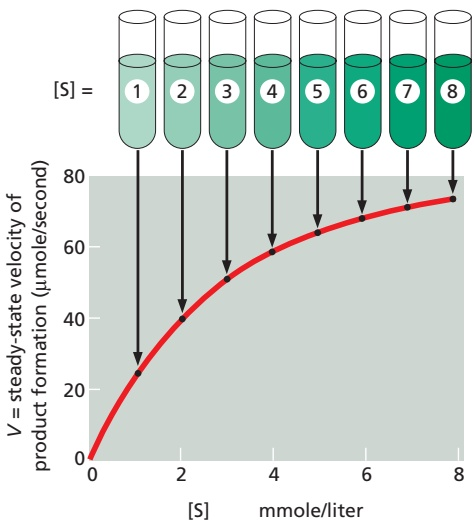

To obtain $V _ { \mathsf { m a x } }$ and $K _ { \mathrm { m } }$ from such data, a double-reciprocal plot is often used, in which the Michaelis–Menten equation has merely been rearranged, so that 1/V can be plotted versus 1/ [S].

$$
1 / V = \left(\frac {K _ {\mathrm{m}}}{V _ {\max}}\right) \left(\frac {1}{[ S ]}\right) + 1 / V _ {\max}
$$

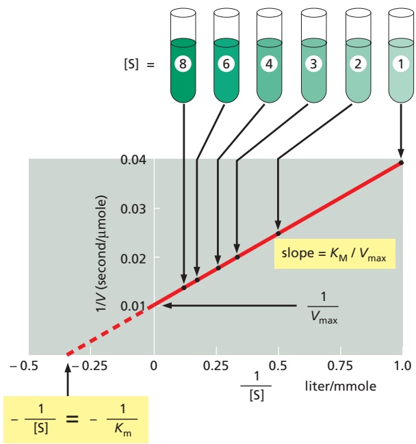

## THE SIGNIFICANCE OF $K _ { \mathsf { m } } ,   k _ { \mathsf { c a t } } ,$ and $k _ { \mathsf { c a t } } / K _ { \mathsf { m } }$

As described in the text, $K _ { \mathrm { m } }$ is an approximate measure of substrate affinity for the enzyme: it is numerically equal to the concentration of [S] at $V = 0 . 5 V _ { \mathrm { m a x } } .$ In general, a lower value of $K _ { \mathrm { m } }$ means tighter substrate binding. In fact, for those cases where $k _ { \mathsf { c a t } }$ is much smaller than $k _ { - 1 } ,$ the $K _ { \mathrm { m } }$ will be equal to $K _ { \mathrm { d } } ,$ the dissociation constant for substrate binding to the enzyme $( K _ { \mathrm { d } } = 1 / K _ { \mathrm { a } } )$

We have seen that $k _ { \mathrm { c a t } }$ is the turnover number for the enzyme. At very low substrate concentrations, where $[ \mathsf { S } ] < < K _ { \mathsf { m } }$ , most of the enzyme is free. Thus we can think of $[ \mathsf { E } ] = [ \mathsf { E } _ { \mathsf { o } } ] ,$ , so that the Michaelis–Menten equation can be simplified as $V = k _ { \mathrm { c a t } } / K _ { \mathrm { m } } [ \mathsf { E } ] [ \mathsf { S } ]$ . Thus, the ratio $k _ { \mathsf { c a t } } / K _ { \mathfrak { m } }$ is equivalent to the rate constant for the reaction between free enzyme and free substrate.

A comparison of $k _ { \mathrm { c a t } } / K _ { \mathfrak { m } }$ for the same enzyme with different substrates, or for two enzymes with their different substrates, is widely used as a measure of enzyme effectiveness.

For simplicity, in this Panel we have discussed enzymes that have only one substrate, such as the lysozyme enzyme described in the text (see p. 152). Most enzymes have two substrates, one of which is often an active carrier molecule—such as NADH or ATP.

A similar, but more complex, analysis is used to determine the kinetics of such enzymes—allowing the order of substrate binding and the presence of covalent intermediates along the pathway to be revealed.

## SOME ENZYMES ARE DIFFUSION LIMITED

The values of $k _ { \mathsf { c a t } } , K _ { \mathsf { m } ^ { \prime } }$ and $k _ { \mathrm { c a t } } / K _ { \mathfrak { m } }$ for some selected enzymes are given below:

| enzyme | substrate | (ksceact-1) | K(Mm) | k(sceact/-K1mM-1) |
| --- | --- | --- | --- | --- |
| acetylcholinesterase | acetylcholine | 1.4 × 104 | 9 × 10-5 | 1.6 × 108 |
| catalase | H2O2 | 4 × 107 | 1 | 4 × 107 |
| fumarase | fumarate | 8 × 102 | 5 × 10-6 | 1.6 × 108 |

Because an enzyme and its substrate must collide before they can react, $k _ { \mathrm { c a t } } / K _ { \mathfrak { m } }$ has a maximum possible value that is limited by collision rates. If every collision forms an enzyme–substrate complex, one can calculate from diffusion theory that $k _ { \mathsf { c a t } } / K _ { \mathsf { m } }$ will be between $1 0 ^ { 8 }$ and ${ \sf 1 0 ^ { 9 } }   \mathrm { s e c ^ { - 1 }   M ^ { - 1 } } ,$ in the case where all subsequent steps proceed immediately. Thus, it is claimed that enzymes like acetylcholinesterase and fumarase are “perfect enzymes,” each enzyme having evolved to the point where nearly every collision with its substrate converts the substrate to a product.

---

152

Chapter 3: Proteins

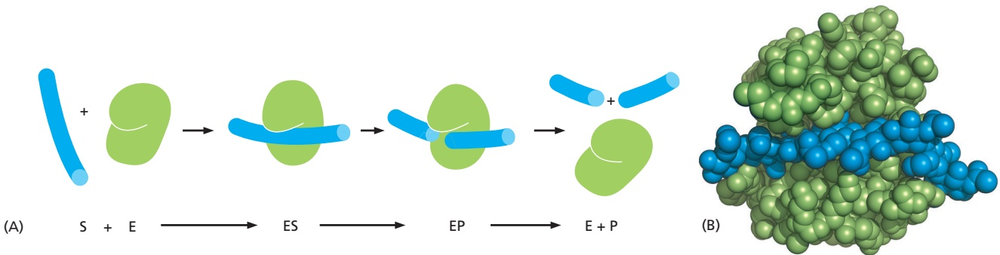

Figure 3–48 The overall reaction catalyzed by lysozyme. (A) The enzyme lysozyme (E) catalyzes the cutting of a polysaccharide chain, which is its substrate (S). The enzyme first binds to the chain to form an enzyme–substrate complex (ES) and then catalyzes the cleavage of a specific covalent bond in the backbone of the polysaccharide, forming an enzyme– product complex (EP) that rapidly dissociates. Release of the severed chain (the products P) leaves the enzyme free to act on another substrate molecule. (B) A space-filling model of the lysozyme molecule bound to a short length of polysaccharide chain before cleavage (Movie 3.8). (PDB code: 3AB6.)

binds to form an enzyme–substrate complex, the enzyme cuts the polysaccharide by adding a water molecule across one of its sugar–sugar bonds. The product MBoC7 e4.38/3/48chains are then quickly released, freeing the enzyme for further cycles of reaction (**Figure 3–48**).

An impressive increase in hydrolysis rate is possible because conditions are created in the microenvironment of the lysozyme active site that greatly reduce the activation energy necessary for the hydrolysis to take place. In particular, lysozyme distorts one of the two sugars connected by the bond to be broken from its normal, most stable conformation. The bond to be broken is also held close to two amino acids with acidic side chains (a glutamic acid and an aspartic acid) that participate directly in the reaction. **Figure 3–49** highlights the three central steps in this enzymatically catalyzed reaction, which occurs millions of times faster than uncatalyzed hydrolysis.

Other enzymes use similar mechanisms to lower activation energies and speed up the reactions they catalyze. In reactions involving two or more reactants, the active site also acts like a template, or mold, that brings the substrates together in the proper orientation for a reaction to occur between them (**Figure 3–50A**). As we saw for lysozyme, the active site of an enzyme contains precisely positioned atoms that speed up a reaction by using charged groups to alter the distribution of electrons in the substrates (**Figure 3–50B**). And as we have also seen, when a substrate binds to an enzyme, bonds in the substrate are often distorted, changing the substrate shape. These changes drive a substrate toward a particular transition state (**Figure 3–50C**). Finally, like lysozyme, many enzymes participate intimately in the reaction by transiently forming a covalent bond between the substrate and a side chain of the enzyme. Subsequent steps in the reaction restore the side chain to its original state, so that the enzyme remains unchanged after the reaction (see also Figure 2–47).

## Tightly Bound Small Molecules Add Extra Functions to Proteins

Although we have emphasized the versatility of enzymes—and proteins in general—as chains of amino acids that perform remarkable functions, there are many instances in which the amino acids by themselves are not enough. Just as humans employ tools to enhance and extend the capabilities of their hands, enzymes and other proteins often use small nonprotein molecules to perform functions that would be difficult or impossible to do with amino acids alone. Thus, enzymes frequently have a small molecule or metal atom tightly associated with their active site that assists with their catalytic function. Carboxypeptidase, for example, an enzyme that cuts polypeptide chains, carries a tightly bound zinc ion in its active site. During the cleavage of a peptide bond by carboxypeptidase, the zinc ion forms a transient bond with one of the substrate atoms,

---

PROTEIN FUNCTION

153

## SUBSTRATE

This substrate is an oligosaccharide of six sugars, labeled A through F. Only sugars D and E are shown in detail.

## PRODUCTS

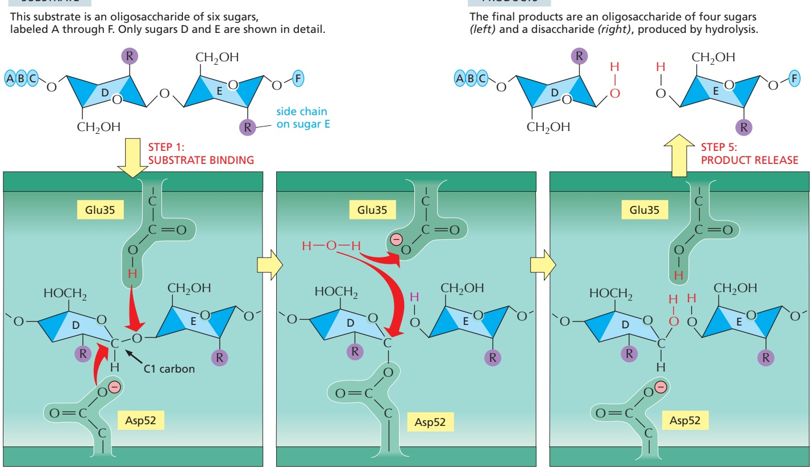

## STEP 2: FORMATION OF ES

In the enzyme–substrate complex (ES), the lysozyme forces sugar D into a strained conformation. The Glu35 in the active site is positioned to serve as an acid that attacks the adjacent sugar–sugar bond by donating a proton (H+) to sugar E; Asp52 is poised to attack the C1 carbon atom of sugar D.

## STEP 3: TRANSITION STATE

The Asp52 has formed a covalent bond between the enzyme and the C1 carbon atom of sugar D. The Glu35 then polarizes a water molecule (red), so that its oxygen can readily attack the C1 carbon atom of sugar D and displace Asp52.

## STEP 4: FORMATION OF EP

The water molecule splits: its –OH group attaches to sugar D and its remaining proton replaces the proton donated by Glu35 in step 2. This completes the hydrolysis and returns the enzyme to its initial state, forming the final enzyme– product complex (EP).

Figure 3–49 Events at the active site of lysozyme. The top left and top right drawings show the free substrate and the free products, respectively. The other three drawings show the sequential events at the enzyme active site, where a sugar–sugar covalent bond is bent and then broken. Note the change in the conformation of sugar D in the enzyme–substrate complex compared with its conformation in the free substrate. This changed conformation favors the formation of the transition stateMBoC7 e4.39/3.49 shown in the middle panel, greatly lowering the activation energy that is required for the reaction. This reaction, and the structure of lysozyme bound to its product, are shown in Movie 3.8 and Movie 3.9. (Based on D.J. Vocadlo et al., Nature 412:835–838, 2001.)

thereby assisting the hydrolysis reaction. In other enzymes, a small organic molecule serves a similar purpose. Such organic molecules are often referred to as **coenzymes**. An example is biotin, which is found in enzymes that transfer a carboxylate group (–COO–) from one molecule to another (see Figure 2–40). Biotin participates in these reactions by forming a transient covalent bond to the –COO– group to be transferred, being better suited to this function than any

(A) enzyme binds to two substrate molecules and orients them precisely to encourage a reaction to occur between them

(B) binding of substrate to enzyme rearranges electrons in the substrate, creating partial negative and positive charges that favor a reaction

(C) enzyme strains the bound substrate molecule, forcing it toward a transition state that favors a reaction

Figure 3–50 Some general strategies used for enzyme catalysis. (A) Holding substrates together in a precise alignment. (B) Charge stabilization of reaction intermediates. (C) Applying forces that distort bonds in the substrate to increase the rate of a particular reaction.

---

Figure 3–51 Retinal and heme. (A) The structure of retinal, the light-sensitive molecule attached to rhodopsin in the eye, showing its isomerization when it absorbs light. (B) The structure of a heme group. The carbon-containing heme ring is red and the iron atom at its center is orange. A heme group is tightly bound to each of the four polypeptide chains in hemoglobin, the oxygen-carrying protein whose structure is shown in Figure 3–20.

154

Chapter 3: Proteins

<table><tbody><tr><td colspan="3">TABLE 3-2 Many Vitamin Derivatives Are Critical Coenzymes for Human Cells</td></tr><tr><td>Vitamin</td><td>Coenzyme</td><td>Enzyme-catalyzed reactions requiring these coenzymes</td></tr><tr><td>Thiamine (vitamin B1)</td><td>Thiamine pyrophosphate</td><td>Activation and transfer of aldehydes</td></tr><tr><td>Riboflavin (vitamin B2)</td><td>FADH</td><td>Oxidation-reduction</td></tr><tr><td>Niacin</td><td>NADH, NADPH</td><td>Oxidation-reduction</td></tr><tr><td>Pantothenic acid</td><td>Coenzyme A</td><td>Acyl group activation and transfer</td></tr><tr><td>Pyridoxine</td><td>Pyridoxal phosphate</td><td>Amino acid activation; also glycogen phosphorylase</td></tr><tr><td>Biotin</td><td>Biotin</td><td>CO2 activation and transfer</td></tr><tr><td>Lipoic acid</td><td>Lipoamide</td><td>Acyl group activation; oxidation-reduction</td></tr><tr><td>Folic acid</td><td>Tetrahydrofolate</td><td>Activation and transfer of single carbon groups</td></tr><tr><td>Vitamin B12</td><td>Cobalamin coenzymes</td><td>Isomerization and methyl group transfers</td></tr></tbody></table>

of the amino acids used to make proteins. Because it cannot be synthesized by humans, and must therefore be supplied in small quantities in our diet, biotin is a vitamin. Many other coenzymes are either vitamins or derivatives of vitamins (**Table 3–2**).

Other proteins also frequently require specific small-molecule adjuncts to function properly. Thus, the signal receptor protein rhodopsin, which is made by the photoreceptor cells in the retina, detects light by means of a small molecule, retinal, embedded in the protein (**Figure 3–51A**). Retinal, which is derived from vitamin A, changes its shape when it absorbs a photon of light, and this change causes the protein to trigger a cascade of enzymatic reactions that eventually lead to an electrical signal being carried to the brain.

Another example of a protein with a nonprotein portion is hemoglobin (see Figure 3–20). Each molecule of hemoglobin carries four heme groups, ringshaped molecules each with a single central iron atom (**Figure 3–51B**). Heme

---

PROTEIN FUNCTION

155

gives hemoglobin (and blood) its red color. By binding reversibly to oxygen gas through its iron atom, heme enables hemoglobin to pick up oxygen in the lungs and release it in the tissues.

Sometimes these small molecules are attached covalently and permanently to their protein, thereby becoming an integral part of the protein molecule itself. We shall see in Chapter 10 that proteins are often anchored to cell membranes through covalently attached lipid molecules. And membrane proteins exposed on the surface of the cell, as well as proteins secreted outside the cell, are often modified by the covalent addition of sugars and oligosaccharides.

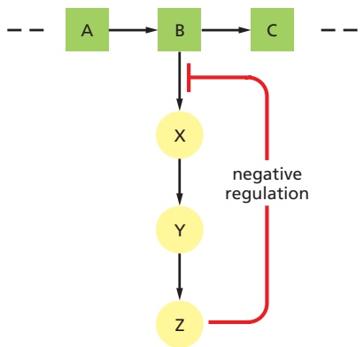

## The Cell Regulates the Catalytic Activities of Its Enzymes

A living cell contains thousands of enzymes, many of which operate at the same time and in the same small volume of the cytosol. By their catalytic action, these enzymes generate a complex web of metabolic pathways, each composed of chains of chemical reactions in which the product of one enzyme becomes the substrate of the next. In this maze of pathways, there are many branch points (nodes) where different enzymes compete for the same substrate. The system is complex (see Figure 2–62), and elaborate controls are required to regulate when and how rapidly each reaction occurs.

Figure 3–52 Feedback inhibition of a single biosynthetic pathway. The end product Z inhibits the first enzyme that is unique to its synthesis and thereby controls its own level in the cell. This is an example of negative regulation.

Regulation occurs at many levels. At one level, the cell controls how many molecules of each enzyme it makes by regulating the expression of the gene that encodes that enzyme (discussed in Chapter 7). The cell also controls enzymatic activities by confining sets of enzymes to particular subcellular compartments (discussed in Chapters 12 and 14) or by concentrating them on protein scaffolds (see pp. 170–173). As will be explained later in this chapter, enzymes are also covalently modified to control their activity. The rate of protein destruction by targeted proteolysis represents yet another important regulatory mechanism (see Figure 6–89). But the most general process that adjusts reaction rates operates through a direct, reversible change in the activity of an enzyme in response to the specific small molecules that it binds.

The most common type of control occurs when an enzyme binds a molecule that is not a substrate to a special regulatory site outside the active site, thereby altering the rate at which the enzyme converts its substrates to products. For example, in **feedback inhibition**, a product produced late in a reaction pathway inhibits an enzyme that acts earlier in the pathway. Thus, whenever large quantities of the final product begin to accumulate, this product binds to the enzyme and slows down its catalytic action, thereby limiting the further entry of substrates into that reaction pathway (**Figure 3–52**). Where pathways branch or intersect, there are usually multiple points of control by different final products, each of which works to regulate its own synthesis (**Figure 3–53**). Feedback inhibition can work almost instantaneously, and it is rapidly reversed when the level of the product falls.

Feedback inhibition is negative regulation: it prevents an enzyme from acting. Enzymes can also be subject to positive regulation, in which a regulatory molecule stimulates the enzyme’s activity rather than shutting the enzyme down. Positive regulation occurs when a product in one branch of the metabolic network stimulates the activity of an enzyme in another pathway. As one example, the accumulation of ADP activates several enzymes involved in the oxidation of sugar molecules, thereby stimulating the cell to convert more ADP to ATP.

## Allosteric Enzymes Have Two or More Binding Sites That Interact

A striking feature of both positive and negative feedback regulation is that the regulatory molecule often has a shape totally different from the shape of the substrate of the enzyme. This is why the effect on a protein is termed **allostery** (from the Greek words allos, meaning “other,” and stereos, meaning “solid” or “three-dimensional”). As biologists learned more about feedback regulation,

---

156

Chapter 3: Proteins

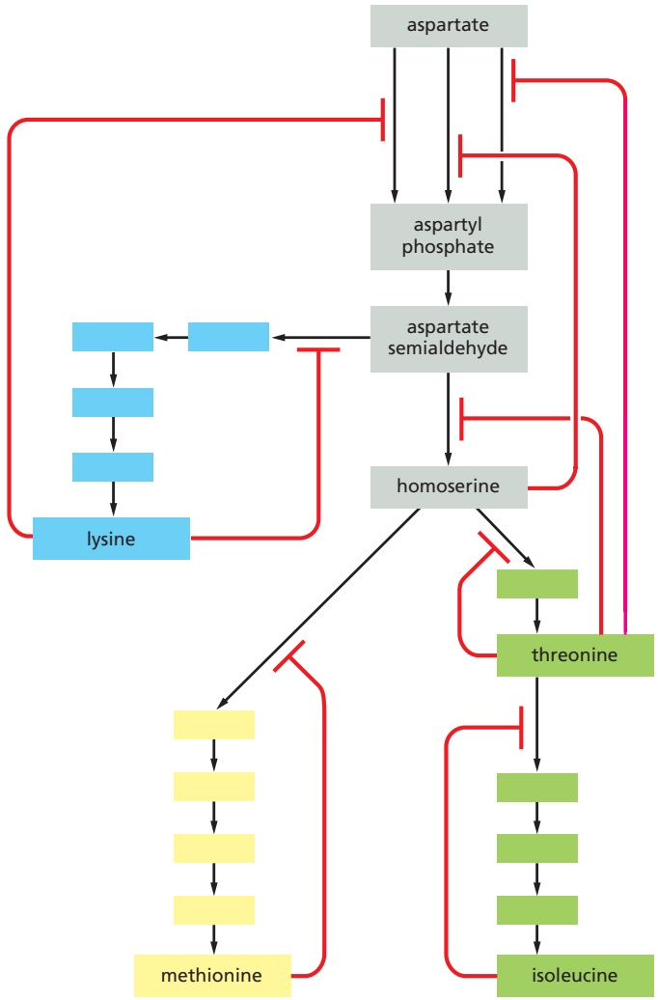

Figure 3–53 Multiple feedback inhibition. In this example, which shows the biosynthetic pathways for four different amino acids in bacteria, the red lines indicate positions at which products feed back to inhibit enzymes. Each amino acid controls the first enzyme specific to its own synthesis, thereby controlling its own levels and avoiding a wasteful or even dangerous buildup of intermediates. The products can also separately inhibit the initial set of reactions common to all the syntheses; in this case, three different enzymes catalyze the initial reaction, each inhibited by a different product.

they recognized that the enzymes involved must have at least two different binding sites on their surface—an **active site** that recognizes the substrates, and a **regulatory site** that recognizes a regulatory molecule. These two sites must somehow communicate, so that the catalytic events at the active site can be influenced by the binding of the regulatory molecule at its separate site on the protein’s surface.

The interaction between separated sites on a protein molecule is now known to depend on a conformational change in the protein: binding at one of the sites causes a shift from one folded shape to a slightly different folded shape. During feedback inhibition, for example, the binding of an inhibitor at one site on the protein causes the protein to shift to a conformation that incapacitates its active site located elsewhere in the protein.

It is thought that most protein molecules are allosteric. They can adopt many slightly different conformations, and a shift from one to another caused by the binding of a ligand can alter their activity. This is true not only for enzymes but also for many other proteins, including receptors, structural proteins, and motor proteins. In all instances of allosteric regulation, each conformation of the protein has somewhat different surface contours, and the protein’s binding sites for ligands are altered when the protein changes shape. Importantly, as we discuss next, each ligand will stabilize the conformation that it binds to most strongly, and thus—at high enough concentrations—will tend to “switch” the protein toward the conformation that has a high affinity for that ligand.

---

PROTEIN FUNCTION

157

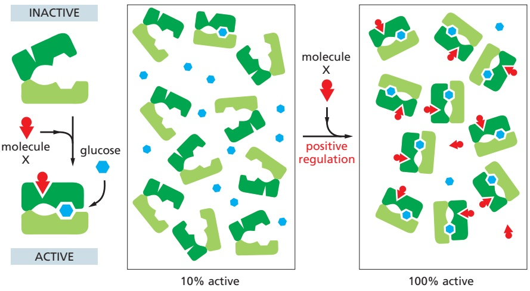

Figure 3–54 Positive regulation caused by conformational coupling between two separate binding sites. In this example, both glucose and molecule X bind best to the closed conformation of a protein with two domains. Because both glucose and molecule X drive the protein toward its closed conformation, each ligand helps the other to bind. Glucose and molecule X are therefore said to bind cooperatively to the protein.

## Two Ligands Whose Binding Sites Are Coupled Must Reciprocally Affect Each Other’s Binding

The effects of ligand binding on a protein follow from a fundamental chemical principle known as **linkage**. Suppose, for example, that a protein that binds glucose also binds another molecule, X, at a distant site on the protein’s surface. If the binding site for X changes shape as part of the conformational change in the protein induced by glucose binding, the binding sites for X and for glucose are said to be coupled. Whenever two ligands prefer to bind to the same conformation of an allosteric protein, it follows from basic thermodynamic principles that each ligand must increase the affinity of the protein for the other. For example, if the shift of a protein to a conformation that binds glucose best also causes the binding site for X to fit X better, then the protein will bind glucose more tightly when X is present than when X is absent. In other words, X will positively regulate the protein’s binding of glucose (**Figure 3–54**).

Conversely, linkage operates in a negative way if two ligands prefer to bind to different conformations of the same protein. In this case, the binding of the first ligand discourages the binding of the second ligand. Thus, if a shape change caused by glucose binding decreases the affinity of a protein for molecule X, the binding of X must also decrease the protein’s affinity for glucose (**Figure 3–55**). The linkage relationship is quantitatively reciprocal, so that, for example, if glucose has a very large effect on the binding of X, X has a very large effect on the binding of glucose.

The relationships shown in Figures 3–54 and 3–55 apply to all proteins, and they underlie all of cell biology. The principle seems so obvious in retrospect

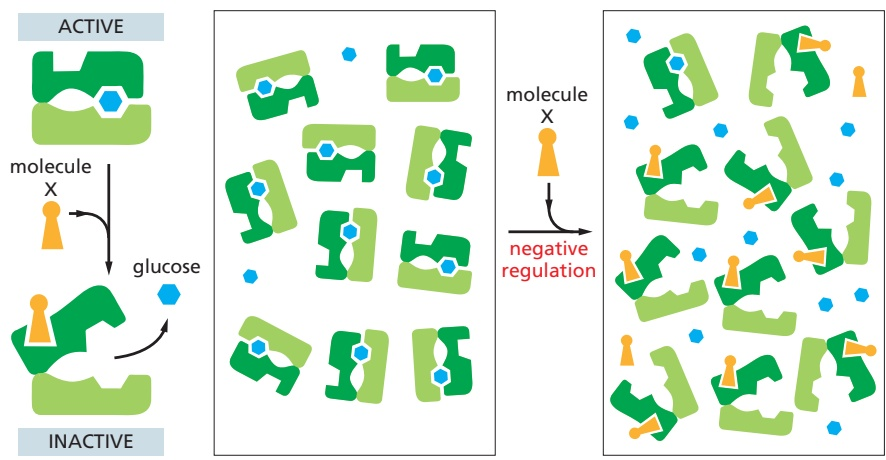

100% active

10% active

Figure 3–55 Negative regulation caused by conformational coupling between two separate binding sites. The scheme here resembles that in the previous figure, but here molecule X prefers the open conformation, while glucose prefers the closed conformation. Because glucose and molecule X drive the protein toward opposite conformations (closed and open, respectively), the presence of either ligand interferes with the binding of the other.

---

158

Chapter 3: Proteins

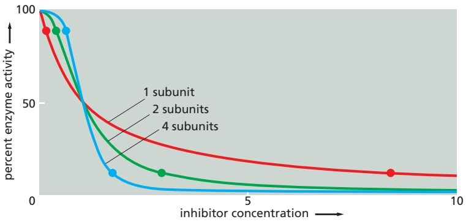

that we now take it for granted. But the discovery of linkage in studies of a few enzymes in the 1950s, followed by an extensive analysis of allosteric mechanisms in proteins in the early 1960s, had a revolutionary effect on our understanding of biology. Because molecule X in these examples binds at a site on the enzyme that is distinct from the site where catalysis occurs, it need not have any chemical relationship to the substrate that binds at the active site. Moreover, as we have just seen, for enzymes that are regulated in this way, molecule X can either turn the enzyme on (positive regulation) or turn it off (negative regulation). By such a mechanism, **allosteric proteins** serve as general switches that, in principle, can allow one molecule in a cell to affect the fate of any other.

## Symmetrical Protein Assemblies Produce Cooperative Allosteric Transitions

A single-subunit enzyme that is regulated by negative feedback can at most decrease from 90% to about 10% activity in response to a 100-fold increase in the concentration of an inhibitory ligand that it binds (**Figure 3–56**, red line). Responses of this type are apparently not sharp enough for optimal cell regulation, and most enzymes that are turned on or off by ligand binding consist of symmetrical assemblies of identical subunits. With this arrangement, the binding of a molecule of ligand to a single site on one subunit can promote an allosteric change in the entire assembly that helps the neighboring subunits bind the same ligand. As a result, a cooperative allosteric transition occurs (Figure 3–56, blue line), allowing a relatively small change in ligand concentration in the cell to switch the whole assembly from an almost fully active to an almost fully inactive conformation (or vice versa).

The principles involved in a cooperative “all-or-none” transition are the same for all proteins, whether or not they are enzymes. Thus, for example, they are critical for the efficient uptake and release of $\mathrm { O } _ { 2 }$ by hemoglobin in our blood. But they are perhaps easiest to visualize for an enzyme that forms a symmetrical dimer. In the example shown in **Figure 3–57**, the first molecule of an inhibitory ligand binds with great difficulty because its binding disrupts an energetically favorable interaction between the two identical monomers in the dimer. A second molecule of inhibitory ligand now binds more easily, however, because its binding restores

Figure 3–57 A cooperative allosteric transition in an enzyme composed of two identical subunits. This diagram illustrates how the conformation of one subunit can influence that of its neighbor. The binding of a single molecule of an inhibitory ligand (orange) to one subunit of the enzyme occurs with difficulty because it changes the conformation of this subunit and thereby disrupts the energetically favorable interactions in the symmetrical enzyme. Once this conformational change has occurred, however, the free energy gained by restoring the symmetrical pairing interaction between the two subunits makes it especially easy for the second subunit to bind the inhibitory ligand and undergo the same conformational change. Because the binding of the first molecule of ligand increases the affinity with which the other subunit binds the same ligand, the response of the enzyme to changes in the concentration of the ligand is much steeper than the response of an enzyme with only one subunit (see Figure 3–56 and Movie 3.10).

Figure 3–56 Enzyme activity versus the concentration of inhibitory ligand for single-subunit and multisubunit allosteric enzymes. For an enzyme with a single subunit (red line), a drop from 90% enzyme activity to 10% activity (indicated by the two dots on the curve) requires a 100-fold increase in the concentration of inhibitor. The enzyme activity is calculated from the simple equilibrium relationship $K = [ \mathsf { I P } ] / [ \mathsf { I } ] [ \mathsf { P } ] ,$ where P is active protein, I is inhibitor, and IP is the inactive protein bound to inhibitor. An identical curve applies to any simple binding interaction between two molecules, A and B. In contrast, a multisubunit allosteric enzyme can respond in a switchlike manner to a change in ligand concentration: the steep response is caused by a cooperative binding of the ligand molecules, as explained in Figure 3–57. Here, the green line represents the idealized result expected for the cooperative binding of two inhibitory ligand molecules to an allosteric enzyme with two subunits, and the blue line shows the idealized response of an enzyme with four subunits. As indicated by the two dots on each of these curves, the more complex enzymes drop from 90% to 10% activity over a much narrower range of inhibitor concentration than does the enzyme composed of a single subunit.

---

PROTEIN FUNCTION

159

the energetically favorable monomer–monomer contacts of a symmetrical dimer (this also completely inactivates the enzyme).

As an alternative to this induced fit model for a cooperative allosteric transition, we can view such a symmetrical enzyme as having only two possible conformations, corresponding to the “enzyme on” and “enzyme off” structures in Figure 3–57. In this view, ligand binding perturbs an all-or-none equilibrium between these two states, thereby changing the proportion of active molecules. Both models represent true and useful concepts.

## Many Changes in Proteins Are Driven by Protein Phosphorylation

Proteins are regulated by more than the reversible binding of other molecules. A second method that eukaryotic cells use extensively to regulate a protein’s function is the covalent addition of a smaller molecule to one or more of its amino acid side chains. The most common such regulatory modification in higher eukaryotes is the addition of a phosphate group. We shall therefore use protein phosphorylation to illustrate some of the general principles involved in the control of protein function through the covalent modification of amino acid side chains.

A phosphorylation event (by a kinase) can affect the protein that is modified in three important ways. First, because each phosphate group carries two negative charges, the enzyme-catalyzed addition of a phosphate group to a protein can cause a major conformational change in the protein by, for example, attracting a cluster of positively charged amino acid side chains. This can, in turn, affect the binding of ligands elsewhere on the protein surface, dramatically changing the protein’s activity. When a second enzyme (called a phosphatase) removes the phosphate group, the protein returns to its original conformation and restores its initial activity.

Second, an attached phosphate group can form part of a structure that the binding sites of other proteins recognize. As previously discussed, the SH2 domain binds to a short peptide sequence containing a phosphorylated tyrosine side chain (see Figure 3–38B). More than 10 other common domains provide binding sites for attaching their protein to phosphorylated peptides in other protein molecules, each recognizing a phosphorylated amino acid side chain in a different protein context. Third, the addition of a phosphate group can mask a binding site that otherwise holds two proteins together, and thereby disrupt protein–protein interactions. As a result of the last two effects, protein phosphorylation and dephosphorylation very often drive the regulated assembly and disassembly of protein complexes.

Reversible protein phosphorylation controls the activity, structure, and cellular localization of enzymes and many other types of proteins in eukaryotic cells. In fact, this regulation is so extensive that more than one-third of the 10,000 or so proteins in a typical mammalian cell are thought to be phosphorylated at any given time—many with more than one phosphate.

As might be expected, the addition and removal of phosphate groups from specific proteins often occur in response to signals that specify some change in a cell’s state. For example, the complicated series of events that takes place as a eukaryotic cell divides is largely timed in this way (discussed in Chapter 17), and many of the signals mediating cell–cell interactions are relayed from the plasma membrane to the nucleus by a cascade of protein phosphorylation events (discussed in Chapter 15).

## A Eukaryotic Cell Contains a Large Collection of Protein Kinases and Protein Phosphatases

**Protein phosphorylation** involves the enzyme-catalyzed transfer of the terminal phosphate group of an ATP molecule to the hydroxyl group on a serine, threonine, or tyrosine side chain of the protein (**Figure 3–58**). A **protein kinase** catalyzes this reaction, and the reaction is essentially unidirectional because of the large amount of free energy released when the phosphate–phosphate bond in

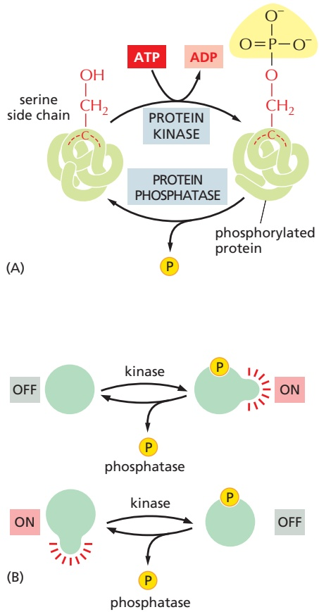

Figure 3–58 Protein phosphorylation. Many thousands of proteins in a typical eukaryotic cell are modified by the covalent addition of a phosphate group. (A) The general reaction transfers a phosphate group from ATP to an amino acid side chain of the target protein, catalyzed by a protein kinase. Removal of the phosphate group is catalyzed by a second enzyme, a protein phosphatase. In this example, the phosphate is added to a serine side chain; in other cases, the phosphate is instead linked to the –OH group of a threonine or a tyrosine in the protein. (B) The phosphorylation of a protein by a protein kinase can either increase or decrease the protein’s activity, depending on the site of phosphorylation and the structure of the protein.

---

160

Chapter 3: Proteins

ATP is broken to produce ADP (discussed in Chapter 2). A **protein phosphatase** catalyzes the reverse reaction of phosphate removal, or dephosphorylation. Cells contain hundreds of different protein kinases, each responsible for phosphorylating a different protein or set of proteins. There are also many different protein phosphatases; some are highly specific and remove phosphate groups from only one or a few proteins, whereas others act on a broad range of proteins and are targeted to specific substrates by regulatory subunits. The state of phosphorylation of a protein at any moment, and thus its activity, depends on the relative activities of the protein kinases and phosphatases that modify it.

The protein kinases that phosphorylate proteins in eukaryotic cells belong to a very large family of enzymes that share a catalytic (kinase) sequence of about 290 amino acids. The various family members contain different amino acid sequences on either end of the kinase sequence (for example, see Figure 3–11) and often have short amino acid sequences inserted into loops within it. Some of these additional amino acid sequences enable each kinase to recognize the specific set of proteins it phosphorylates or to bind to structures that localize it in specific regions of the cell. Other parts of the protein regulate the activity of each kinase, so it can be turned on and off in response to different specific signals, as described below.

By comparing the number of amino acid sequence differences between the various members of a protein family, we can construct an “evolutionary tree” that is thought to reflect the pattern of gene duplication and divergence that gave rise to the family. **Figure 3–59** shows an evolutionary tree for protein kinases. Kinases with related functions are often located on nearby branches of the tree: the protein kinases involved in cell signaling that phosphorylate tyrosine side chains, for example, are all clustered in the top left corner of the tree. The other kinases shown phosphorylate either a serine or a threonine side chain, and many are organized into clusters that seem to reflect their function— in transmembrane signal transduction, intracellular signal amplification, cellcycle control, and so on.

As a result of the combined activities of protein kinases and protein phosphatases, the phosphate groups on proteins are continually turning over—being added and then rapidly removed. Such phosphorylation cycles may seem wasteful, but they are important in allowing the phosphorylated proteins to switch rapidly from one state to another. In fact, the more rapid this cycle is “turning,” the faster a population of protein molecules can change its state of phosphorylation in response to a sudden change in its phosphorylation rate (see Figure 15–15).

Figure 3–59 An evolutionary tree of selected protein kinases. A higher eukaryotic cell contains hundreds of such enzymes, and the human genome codes for more than 500. Note that only some of these, those discussed in this book, are shown.

---

PROTEIN FUNCTION

161

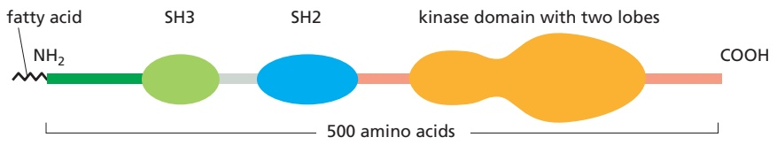

Figure 3–60 The domain structure of the Src family of protein kinases, mapped along the amino acid sequence. For the three-dimensional structure of Src, see Figure 3–11.

The energy required to drive this phosphorylation cycle is derived from the free energy of ATP hydrolysis, one molecule of which is consumed for each phosphorylation event.

## The Regulation of the Src Protein Kinase Reveals How a Protein Can Function as a Microprocessor

The hundreds of different protein kinases in a eukaryotic cell are organized into complex networks of signaling pathways that help to coordinate the cell’s activities, drive the cell cycle, and relay signals into the cell from the cell’s environment. Many of the extracellular signals involved need to be both integrated and amplified by the cell. Individual protein kinases (and other signaling proteins) serve as input–output devices, or “microprocessors,” in the integration process. An important part of the input to these signal-processing proteins comes from the control that is exerted by phosphates added and removed from them by protein kinases and protein phosphatases, respectively.

The Src family of protein kinases (see Figure 3–11) exhibits such behavior. The Src protein (pronounced “sarc” and named for the type of tumor, a sarcoma, that its deregulation can cause) was the first tyrosine kinase to be discovered. It is now known to be part of a subfamily of nine very similar protein kinases, which are found only in multicellular animals. As indicated by the evolutionary tree in Figure 3–59, sequence comparisons suggest that tyrosine kinases as a group were a relatively late innovation that branched off from the serine/threonine kinases, with the Src subfamily being only one subgroup of the tyrosine kinases created in this way.

The Src protein and its relatives contain a short N-terminal region that becomes covalently linked to a strongly hydrophobic fatty acid, which anchors the kinase at the cytoplasmic face of the plasma membrane. Next along the linear sequence of amino acids come two peptide-binding domains, a Src homology 3 (SH3) domain and an SH2 domain, followed by the kinase catalytic domain (**Figure 3–60**). These kinases normally exist in an inactive conformation, in which a phosphorylated tyrosine near the C-terminus is bound to the SH2 domain, and the SH3 domain is bound to an internal peptide in a way that distorts the active site of the enzyme and helps to render it inactive.

As shown in **Figure 3–61**, turning the kinase on involves at least two specific inputs: removal of the C-terminal phosphate and the binding of the SH3 domain by a specific activating protein. In this way, the activation of the Src kinase signals

Figure 3–61 The activation of a Src-type protein kinase by two sequential events. As described in the text, the requirement for multiple upstream events to trigger these processes allows the kinase to serve as a signal integrator (Movie 3.11). (Adapted from S.C. Harrison, Cell 112: 737–740, 2003.)

---

OUTPUT

162

Chapter 3: Proteins

the completion of a particular set of separate upstream events (**Figure 3–62**). Thus, the Src family of protein kinases serves as specific signal integrators, contributing to the web of information-processing events that enable the cell to compute useful responses to a complex set of different conditions.

## Regulatory GTP-binding Proteins Are Switched On and Off by the Gain and Loss of a Phosphate Group

Eukaryotic cells have a second way to regulate protein activity by phosphate addition and removal. In this case, however, the phosphate is not enzymatically transferred from ATP to the protein. Instead, the phosphate is part of a guanine nucleotide—guanosine triphosphate (GTP)—that binds tightly to various types of **GTP-binding proteins**. These proteins, also called **GTPases**, bind to other proteins to regulate their activities. They serve as molecular switches: GTP-binding proteins are in their “on” conformation when GTP is bound, but they can hydrolyze this GTP to GDP—which releases a phosphate and flips the protein to its “off” conformation. As with protein phosphorylation, this process is reversible: the active conformation is regained by dissociation of the GDP, followed by the rapid binding of a fresh molecule of GTP (**Figure 3–63**).

Hundreds of different GTP-binding proteins function as such molecular switches in cells. They all contain variations of the same globular domain that undergoes a conformational change when its tightly bound GTP is hydrolyzed to GDP. The three-dimensional structure of a prototypical member of this family, the monomeric GTPase called **Ras** that plays important roles in cell signaling, is shown in **Figure 3–64**.

The crucial role that GTP-binding proteins play in intracellular signaling pathways is discussed in detail in Chapter 15.

## Proteins Can Be Regulated by the Covalent Addition of Other Proteins

Cells contain a special family of small proteins whose members are covalently attached to many other proteins to determine the activity or fate of the second protein. In each case, the carboxyl end of the small protein becomes linked to the amino group of a lysine side chain of a target protein through an isopeptide bond. The first such protein discovered, and the most abundantly used, is **ubiquitin** (**Figure 3–65A**). Ubiquitin can be covalently attached to target proteins in a variety of ways, each of which has a different meaning for cells. The major form of ubiquitin addition produces polyubiquitin chains in which—once the first ubiquitin molecule is attached to the target—each subsequent ubiquitin molecule links to Lys48 of the previous ubiquitin, creating a chain of Lys48-linked ubiquitins that are attached to a single lysine side chain of the target protein. This form

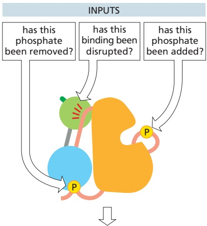

Src-type protein kinase activity turns on fully only if the answers to all of the above questions are yes

Figure 3–62 How a Src-type protein kinase acts as a signal-integrating device. A disruption of the inhibitory interaction illustrated for the SH3 domain (green) occurs when its binding to the indicated orange linker region is replaced with its higher-affinity binding to an MBoC7activating ligand.

Figure 3–63 Many different GTP-binding proteins function as molecular switches. The activity of a GTP-binding protein (also called a GTPase) generally requires the presence of a tightly bound GTP molecule (switch “on”). Hydrolysis of this GTP molecule by the GTP-binding protein—at a rate that can be regulated—produces GDP and inorganic phosphate, and it causes the protein to convert to a different, usually inactive, conformation (switch “off”). Resetting the switch to “on” requires that the tightly bound GDP dissociate. This is a slow step, and the dissociation of GDP, which is followed by its rapid replacement by GTP, is controlled by cell signals (see Figure 15–8).