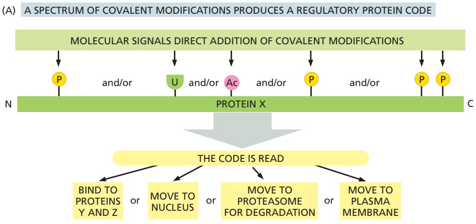
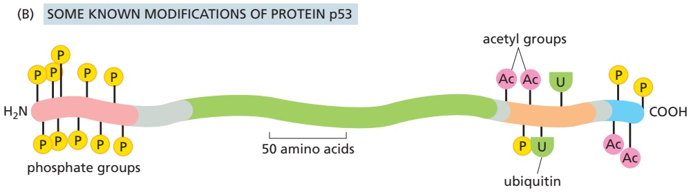
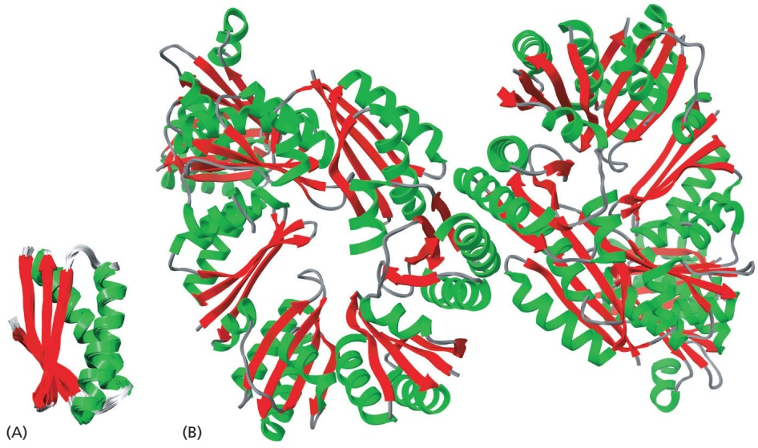
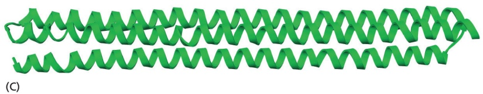
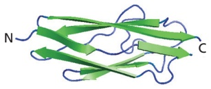
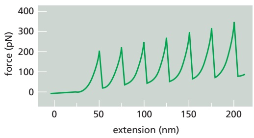
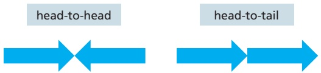
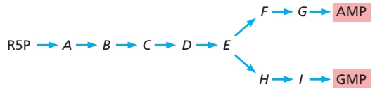

<table><tr><td rowspan="2"></td><td colspan="3">Comparison of three types of large biochemical assemblies</td></tr><tr><td>Macromolecular machine</td><td>Biomolecular condensate</td><td>Membrane-enclosed compartment</td></tr><tr><td>Properties</td><td>Fixed macromolecular composition, with a defined stoichiometry and spatial organization of constituentsFormed from a specific set of protein molecules or from protein and RNA moleculesAssembles spontaneously and can form de novoNevertheless, in many cases assembly is regulated to occur at specific sites, as needed</td><td>Dynamic, often liquidlike or gel-like organization, in which RNAs and low-complexity domains of proteins form specific, but transient, interactionsReadily permeable to small moleculesLarger than most macromolecular machinesMacromolecule composition is selective, but stoichiometry is usually not fixedCan assemble de novo and be disassembled in response to changing conditions or cellular need</td><td>Creates a distinct chemical and protein environment that is maintained by active transport across the enclosing membraneInterior contains a variable stoichiometry of macromolecules in solution, as determined by the above transport processesNot permeable to most small moleculesFormation usually requires a preexisting membrane-enclosed compartment of a special kind, different for each compartment</td></tr><tr><td>Examples</td><td>SCF ubiquitin ligaseDNA replication protein machineRibosomeNuclear pore</td><td>NucleolusCentrosomeStress granuleNeuronal RNA transport granule</td><td>Endoplasmic reticulumMitochondrionTransport vesicleLysosome</td></tr></table>

creating a specialized biochemistry in its interior. Those compartments will be the subject of Chapter 12, where we will also discuss biomolecular condensates in more detail. In **Table 3–3**, we compare the properties of the protein machines and biomolecular condensates introduced in this chapter, both with each other and with membrane-enclosed compartments.

## Many Proteins Are Controlled by Covalent Modifications That Direct Them to Specific Sites Inside the Cell

In this chapter, we have thus far described only a few ways in which proteins are post-translationally modified. A large number of other such modifications also occur, more than 200 distinct types being known. To give a sense of the variety, **Table 3–4** presents a few of the modifying groups with known regulatory roles.

<table><tbody><tr><td colspan="2">TABLE 3-4 Some Molecules Covalently Attached to Proteins That Regulate Protein Function</td></tr><tr><td>Modifying group</td><td>Some prominent functions</td></tr><tr><td>Phosphate on Ser, Thr, or Tyr</td><td>Drives the assembly of a protein into larger complexes (see Figure 15-11)</td></tr><tr><td>Methyl on Lys</td><td>Helps to create distinct regions in chromatin by forming either monomethyl, dimethyl, or trimethyl lysine in histones (see Figure 4-34)</td></tr><tr><td>Acetyl on Lys</td><td>Helps to activate genes in chromatin by modifying histones (see Figure 4-34)</td></tr><tr><td>Palmityl group on Cys</td><td>This fatty acid addition drives protein association with membranes (see Figure 10-18)</td></tr><tr><td>N-Acetylglucosamine on Ser or Thr</td><td>Controls enzyme activity and gene expression in glucose homeostasis</td></tr><tr><td rowspan="3">Ubiquitin on Lys</td><td>Monoubiquitin addition regulates the transport of membrane proteins in vesicles (see Figure 13-59)</td></tr><tr><td>A polyubiquitin chain targets a protein for degradation (see Figure 3-66)</td></tr><tr><td>(Ubiquitin is a 76-amino-acid polypeptide; there are at least 10 other ubiquitin-related proteins in mammalian cells.)</td></tr></tbody></table>

Figure 3–81 Multisite protein modification and its effects. (A) A protein that carries a post-translational addition to more than one of its amino acid side chains can be considered to carry a combinatorial regulatory code. Multisite modifications are added to (and removed from) a protein through signaling networks, and the resulting combinatorial regulatory code on the protein is read to alter its behavior in the cell. (B) The pattern of some covalent modifications to the protein p53.

Like the phosphate and ubiquitin additions described previously, these groups are added and then removed from proteins according to the needs of the cell.

A large number of proteins are modified on more than one amino acid side chain, with different regulatory events producing a different pattern of such modifications. A striking example is the protein p53, which plays a central part in controlling a cell’s response to adverse circumstances (see Figure 17–60). Through one of four different types of molecular additions, this protein can be modified at 20 different sites. Because an enormous number of different combinations of these 20 modifications are possible, the protein’s behavior can in principle be altered in a huge number of ways. Such modifications will often create a site on the modified protein that binds it to a scaffold protein in a specific region of the cell, thereby connecting it—via the scaffold—to the other proteins. / . required for a reaction at that site. The effects can include moving the modified protein either into or out of a specific biomolecular condensate.

One can view each protein’s set of covalent modifications as a combinatorial regulatory code. Specific modifying groups are added to or removed from a protein in response to signals, and the code then alters protein behavior—changing the activity or stability of the protein, its binding partners, and/or its specific location within the cell (**Figure 3–81**). As a result, the cell is able to respond rapidly and with great versatility to changes in its condition or environment.

## A Complex Network of Protein Interactions Underlies Cell Function

There are many challenges facing cell biologists in this information-rich era when a huge number of complete genome sequences are known. One is the need to dissect each one of the thousands of protein machines that exist in an organism such as ourselves. To understand these remarkable protein complexes, each will need to be reconstituted from its purified protein parts, so that we can study its detailed mode of operation under controlled conditions in a test tube, free from all other cell components. This alone is a massive task. But we now know that each of these subcomponents of a cell also interacts with other sets of macromolecules, creating a large network of protein–protein and protein–nucleic acid interactions throughout the cell. To understand the cell, therefore, we will need to analyze most of these other interactions as well.

Figure 3–82 A network of proteinbinding interactions in the cells of the fruit fly, Drosophila. Each line connecting a pair of dots (proteins) indicates a protein– protein interaction. Labels are used to denote a few of the highly interactive groups of proteins whose functions are described in this textbook. (From K.G. Guruharsha et al., Cell 147:690–703, 2011. With permission from Elsevier.)

We can begin to gain a sense of the nature of intracellular protein networks from a particularly well-studied example described in Chapter 16: the many dozens of proteins in the actin cytoskeleton that interact to control actin filament behavior (see Panel 16–3, p. 965). Biochemists and structural biologists are, in principle, able to purify all of these different actin-accessory proteins to study their effects on actin filaments individually and in combination, and to determine all of their protein–protein interactions and their atomic structures. But to truly understand the actin cytoskeleton will require that we also learn how to use this data to compute how any particular mixture of these components present in an individual cell creates that cell’s observed set of three-dimensional networks of actin structures—a goal that currently seems out of reach.

Of course, understanding the cell will require much more than understanding actin. In recent years, as described in Chapter 8, robotics has been harnessed to a set of powerful technologies to produce enormous protein interaction maps (**Figure 3–82**). The data obtained suggest that each of the roughly 10,000 different proteins in a human cell interacts with 5–10 different partners, illustrating the challenges that face scientists working to understand the complexity of cell chemistry.

What does the future hold? Despite the enormous progress made in recent years, we cannot yet claim to understand even the simplest known cells, such as the small Mycoplasma bacterium formed from only about 500 gene products (see Figure 1–8). How then can we hope to understand a human? Clearly, a great deal of new biochemistry will be essential, in which each protein in a particular interacting set is purified so that its chemistry and interactions can be dissected in a test tube. But in addition, more powerful ways of analyzing networks will be needed using mathematical and computational tools not yet invented. Clearly, there are many wonderful challenges that remain for future generations of cell biologists.

## Protein Structures Can Be Predicted and New Proteins Designed

Because the structures and functions of proteins are encoded in their amino acid sequences, in principle it is possible to predict the structures and functions of proteins directly from their amino acid sequences. We should also be able to create proteins with entirely new structures and functions by designing new amino acid sequences to produce these structures and functions, encoding them in synthetic genes. Success in the first endeavor would transform our ability to understand how the biology of an organism is encoded in the DNA sequence of its genome. Success in the second endeavor could lead to a new generation of designed proteins that address some of the twenty-first-century challenges confronting humanity.

There are major challenges in both of the above areas. A first challenge is the very large number of potential structures that are possible for any given amino acid sequence. Because, as we have seen, a protein folds to its lowest free-energy state, one needs to use physics to compute the energy of each protein conformation. But the number of possible conformations for even a relatively short protein of 100 amino acids is of the order 3100, as each amino acid has on average 3 or more rotatable bonds. Success in predicting protein structure and in designing new proteins thus requires computational methods for very efficient searching through huge numbers of structures.

Progress has been made in recent years. For small proteins or for proteins from very large families to help constrain the problem, large-scale computer searches for the lowest energy state can often accurately predict protein structure starting from amino acid sequence. Recently developed deep learning approaches using artificial intelligence (AI) can produce even more accurate protein structure predictions. Conversely, many new protein structures and functions have been created from scratch by designing new sequences in which the lowest energy state has the desired structure and function (**Figure 3–83**).

While this progress suggests that the protein-folding problem is not intractable, huge challenges remain. Predicting function from structure is even more difficult: while in some cases function can be predicted from structure by analogy to other proteins with similar structures and already known functions, this can be problematic because even a few amino acid changes can considerably change function; for example, the identity of the substrate that an enzyme acts upon. On the design side, while it has been possible to design new proteins with new structures and binding activities, it remains a big challenge to match the remarkable activities of natural enzymes and the sophisticated information integration and force generation of natural molecular machines.

Figure 3–83 Some examples of designed proteins. The amino acid sequences of the three proteins illustrated were determined computationally, being selected so that each protein would adopt a specifically designed three-dimensional conformation in its lowest energy state. After each protein was produced in a bacterium using genetic engineering techniques, its actual structure was then determined and shown to be the same as that intended by the designer. (A) A small protein of 122 amino acids. (B) A protein that creates an octahedral shell formed from 24 identical subunits, only 8 of which are shown. (C) A protein that consists of an antiparallel three-helix bundle. (A, PDB code 2N76; B, PDB code 3VCD; C, PDB code 4TQL).

## Summary

The function of a protein largely depends on the detailed chemical properties of its surface. Enzymes are catalytic proteins that greatly accelerate the rates of covalent bond making and breaking. They do this by binding the high-energy transition state for a specific reaction path, lowering that reaction’s activation energy. The rates of enzyme-catalyzed reactions are often so fast that they are limited only by diffusion.

Proteins can reversibly change their shape when ligands bind to their surface. The allosteric changes in protein conformation produced by one ligand affect the binding of a second ligand, and this linkage between two ligand-binding sites provides a crucial mechanism for regulating cell processes. Metabolic pathways, for example, are controlled by feedback regulation: some small molecules inhibit and other small molecules activate enzymes early in a pathway. Enzymes controlled in this way generally form symmetrical assemblies, allowing cooperative conformational changes to create a steep response to changes in the concentrations of the ligands that regulate them.

The expenditure of chemical energy can drive unidirectional changes in protein shape. By coupling allosteric shape changes to the hydrolysis of a tightly bound ATP molecule, for example, proteins can do useful work, such as generating a mechanical force or moving for long distances in a single direction. The three-dimensional structures of proteins have revealed how a small local change caused by nucleoside triphosphate hydrolysis is amplified to create major changes elsewhere in the protein. Highly efficient protein machines are formed by incorporating many different protein molecules into larger assemblies that coordinate the allosteric movements of the individual components. Machines of this type perform most of the important reactions in cells. They and other specific macromolecules can be brought together in large, liquid-like assemblies known as biomolecular condensates, which are created by weak, fluctuating interactions between multivalent protein and RNA scaffolds.

Proteins are subjected to many reversible, post-translational modifications, such as the covalent addition of a phosphate or an acetyl group to a specific amino acid side chain. The addition of these modifying groups is used to regulate the activity of a protein, changing its conformation, its binding to other proteins, and its location inside the cell. A typical protein in a cell will interact with more than five different partners. Understanding the large protein networks inside cells will require biochemistry, through which small sets of interacting proteins can be purified and their chemistry dissected in detail. In addition, new computational approaches will be required to make sense of the enormous complexity of these networks.

## PROBLEMS

Which statements are true? Explain why or why not.

3–1 Each strand in a β sheet is a helix with two amino acids per turn.

3–2 Loops of polypeptide that protrude from the surface of a protein often form the binding sites for other molecules.

3–3 An enzyme reaches a maximum rate at high substrate concentration because it has a fixed number of active sites where substrate binds.

3–4 Higher concentrations of enzyme give rise to a higher turnover number for that enzyme.

3–5 Enzymes that undergo cooperative allosteric transitions invariably consist of symmetrical assemblies of multiple subunits.

3–6 Continual addition and removal of phosphates by protein kinases and protein phosphatases is wasteful of energy—because their combined action consumes ATP— but it is a necessary consequence of effective regulation by phosphorylation.

Discuss the following problems.

3–7 Titin, which has a mass of about $3   \times   1 0 ^ { 6 }$ daltons, is the largest polypeptide yet described. Titin molecules extend from muscle thick filaments to the Z disc; they are thought to act as springs to keep the thick filaments centered in the sarcomere. Titin is composed of a large number of repeated immunoglobulin (Ig) sequences of 89 amino acids, each of which is folded into a domain about 4 nm in length (**Figure Q3–1A**).

Figure Q3–1 Springlike behavior of titin (Problem 3–7). (A) The structure of an individual Ig domain. (B) Force in piconewtons versus extension in nanometers obtained by atomic force microscopy.

You suspect that the springlike behavior of titin is caused MBoC7 mQ3.02/Q3.01 by the sequential unfolding (and refolding) of individual Ig domains. You test this hypothesis using an atomic force microscope, which allows you to pick up one end of a protein molecule and pull with an accurately measured force. For a fragment of titin containing seven repeats of the Ig domain, this experiment gives the sawtooth force-versus-extension curve shown in **Figure Q3–1B**. If the experiment is repeated in a solution of 8 M urea (a protein denaturant), the peaks disappear and the measured extension becomes much longer for a given force. If the experiment is repeated after the protein has been cross-linked by treatment with glutaraldehyde, once again the peaks disappear but the extension becomes much smaller for a given force.

A. Are the data consistent with your hypothesis that titin’s springlike behavior is due to the sequential unfolding of individual Ig domains? Explain your reasoning.

B. Is the extension for each putative domainunfolding event the magnitude you would expect? (In an extended polypeptide chain, amino acids are spaced at intervals of 0.34 nm.)

C. Why does the force collapse so abruptly after each peak?

3–8 Consider the following statement. “To produce one molecule of each possible kind of polypeptide chain, 300 amino acids in length, would require more atoms than exist in the universe.” Given the size of the universe, do you suppose this statement could possibly be correct? Because counting atoms is a tricky business, consider the problem from the standpoint of mass. The observable universe is estimated to contain $1 0 ^ { 8 0 }$ protons plus neutrons, which have a total mass of about $\bar { 1 . 7 } \times 1 0 ^ { 5 6 }$ grams. Assuming that the average mass of an amino acid is 110 daltons, what would be the total mass of one molecule of each possible kind of polypeptide chain 300 amino acids in length? Is this greater than the mass of the universe?

3–9 The so-called kelch motif consists of a fourstranded β sheet shaped like the blade of a propeller. It is usually found to be repeated four to seven times, forming a β propeller, or kelch repeat domain, in a multidomain protein. One such kelch repeat domain is shown in **Figure Q3–2**. Would you classify this domain as an in-line or plug-in type domain?

Figure Q3–2 The kelch repeat domain of galactose oxidase from D. dendroides (Problem 3–9). The seven individual blades of the β propeller are color coded and labeled. The N- and C-termini are indicated by N and C.

3–10 In principle, dimers of identical proteins could be arranged either “head-to-tail” (same as “tail-to-head”) MBoC7 mQ3.1/Q3.02or “head-to-head” (equivalent to “tail-to-tail”), as illustrated schematically in Figure Q3–3. Do you suppose that one type of dimer is significantly more common than the other? Why or why not?

Figure Q3–3 Head-to-head and tail-to-tail dimers (Problem 3–10).

3–11 An antibody binds to another protein with an equilibrium constant, K, o $\mathrm { f }   5 \times 1 0 ^ { 9 }   \mathrm { M } ^ { - 1 }$ . When it binds to a second, related protein, it forms three fewer hydrogen bonds, reducing its binding affinity by 11.9 kJ/mole. What is the K for its binding to the second protein? [Free-energy change is related to the equilibrium constant by the equation $\tilde { \Delta } G ^ { \circ } = - 2 . 3$ RT log K, where R is $8 . 3 \times 1 0 ^ { - 3 }$ kJ/(mole K) and T is 310 K.]

3–12 In bacteria, the protein SmpB binds to a special species of tRNA, tmRNA, to eliminate the incomplete proteins made from truncated mRNAs. If the binding of SmpB to tmRNA is plotted as fraction tmRNA bound versus SmpB concentration, one obtains a symmetrical S-shaped curve as shown in **Figure Q3–4**. This curve is a visual display of a very useful relationship between $K _ { \mathrm { d } }$ and concentration, which has broad applicability. The general expression for fraction of ligand (L) bound to a protein (Pr) is derived from the equation for $\dot{K}_{\mathrm{d}}\left(K_{\mathrm{d}}=[\mathrm{Pr}][\mathrm{L}] /[\mathrm{Pr}-\mathrm{L}]\right)$ by substituting ([L]TOT – [L])

for [Pr–L] and rearranging. Because the total concentration of ligand ([L]TOT) is equal to the free ligand ([L]) plus bound ligand ([Pr–L]),

$$
\text {fraction bound} = [ \mathrm{Pr} - \mathrm{L} ] / [ \mathrm{L} ] _ {\mathrm{TOT}} = [ \mathrm{Pr} ] / ([ \mathrm{Pr} ] + K _ {\mathrm{d}})
$$

For SmpB and tmRNA, the fraction bound = [SmpB–tmRNA]/ $[ \mathrm { t m R N A } ] _ { \mathrm { T O T } }   =   [ \mathrm { S m p B } ] / ( [ \mathrm { S m p B } ] + K _ { \mathrm { d } } )$ . Using this relationship, calculate the fraction of tmRNA bound for SmpB MBoC7 mQ3.03/Qconcentrations equal to $1 0 ^ { 4 }   K _ { \mathrm { d } } ,   1 0 ^ { 3 }   K _ { \mathrm { d } } ,   1 0 ^ { 2 }   K _ { \mathrm { d } } ,$ 101 $K _ { \mathrm { d } } , K _ { \mathrm { d } } ,$ $1 0 ^ { - 1 }   K _ { \mathrm { d } } ,   1 0 ^ { - 2 }   K _ { \mathrm { d } } ,   \dot { 1 0 ^ { - 3 } }   K _ { \mathrm { d } } ,$ and $1 0 ^ { - 4 }   K _ { \mathrm { d } } .$

3–13 The enzyme hexokinase adds a phosphate to d-glucose but ignores its mirror image, l-glucose. Suppose that you were able to synthesize hexokinase entirely from d-amino acids, which are the mirror image of the normal l-amino acids.

A. Assuming that the $\text{" }  D  \text{" }$ enzyme would fold to a stable conformation, what relationship would you expect it to have to the normal “l” enzyme?

B. Do you suppose the ${ \mathrm { { } ^ { a } D } } ^ { \prime \prime }$ enzyme would add a phosphate to l-glucose and ignore d-glucose?

3–14 Many enzymes obey simple Michaelis–Menten kinetics, which are summarized by the equation

$$
\text {rate} = V _ {\max} [ \mathrm{S} ] / ([ \mathrm{S} ] + K _ {\mathrm{m}})
$$

where $V _ { \mathrm { m a x } } =$ maximum velocity, [S] = concentration of substrate, and $K _ { \mathrm { m } } =$ the Michaelis constant.

It is instructive to plug a few values of [S] into the equation to see how rate is affected. What are the rates for [S] equal to zero, equal to $K _ { \mathrm { m } } ,$ and equal to infinite concentration?

## REFERENCES

## General

Berg JM, Tymoczko JL, GJ Gatto & Stryer L (2021) Biochemistry, 9th ed. New York: W.H. Freeman.

Branden C & Tooze J (1999) Introduction to Protein Structure, 2nd ed. New York: Garland Science.

Dickerson RE (2005) Present at the Flood: How Structural Molecular Biology Came About. Sunderland, MA: Sinauer.

Kuriyan J, Konforti B & Wemmer D (2013) The Molecules of Life: Physical and Chemical Principles. New York: Norton.

Petsko GA & Ringe D (2004) Protein Structure and Function. London: New Science Press.

3–15 Synthesis of the purine nucleotides AMP and GMP proceeds by a branched pathway starting with ribose 5-phosphate (R5P), as shown schematically in **Figure Q3–5**. Using the principles of feedback inhibition, propose a regulatory strategy for this pathway that ensures an adequate supply of both AMP and GMP and minimizes the buildup of the intermediates (A–I) when supplies of AMP and GMP are adequate.

Figure Q3–5 Schematic diagram of the metabolic pathway for synthesis of AMP and GMP from R5P (Problem 3–15).

3–16 How do you suppose that a molecule of hemoglo-MB C7 mQ3.04/Q3.05bin is able to bind oxygen efficiently in the lungs and yet release it efficiently in the tissues?

3–17 Rous sarcoma virus (RSV) carries an oncogene called Src, which encodes a continually active protein tyrosine kinase that leads to unchecked cell proliferation. Normally, Src carries an attached fatty acid (myristoylate) group that allows it to bind to the cytoplasmic side of the plasma membrane. A mutant version of Src that does not allow attachment of myristoylate does not bind to the membrane. Infection of cells with RSV encoding either the normal or the mutant form of Src leads to the same high level of protein tyrosine kinase activity, but the mutant Src does not cause cell proliferation.

A. Assuming that the normal Src is all bound to the plasma membrane and that the mutant Src is distributed throughout the cytoplasm, calculate their relative concentrations in the neighborhood of the plasma membrane. For the purposes of this calculation, assume that the cell is a sphere with a radius (r) of 10 μm and that the mutant Src is distributed throughout the cell, whereas the normal Src is confined to a 4-nm-thick layer immediately beneath the membrane. [For this problem, assume that the membrane has no thickness. The volume of a sphere is $( 4 / 3 ) \pi r ^ { 3 } . ]$

B. The target (X) for phosphorylation by Src resides in the membrane. Explain why the mutant Src does not cause cell proliferation.

Steven AC, Baumeister W, Johnson LN & Perham RN (2016) Molecular Biology of Assemblies and Machines. New York: Garland Science.

## The Atomic Structure of Proteins

Anfinsen CB (1973) Principles that govern the folding of protein chains. Science 181, 223–230.

Caspar DLD & Klug A (1962) Physical principles in the construction of regular viruses. Cold Spring Harb. Symp. Quant. Biol. 27, 1–24.

Dill KA & MacCallum JL (2012) The protein-folding problem, 50 years on. Science 338, 1042–1046.

Eisenberg D (2003) The discovery of the alpha-helix and beta-sheet, the principal structural features of proteins. Proc. Natl. Acad. Sci. USA 100, 11207–11210.

Fraenkel-Conrat H & Williams RC (1955) Reconstitution of active tobacco mosaic virus from its inactive protein and nucleic acid components. Proc. Natl. Acad. Sci. USA 41, 690–698.

Goodsell DS & Olson AJ (2000) Structural symmetry and protein function. Annu. Rev. Biophys. Biomol. Struct. 29, 105–153.

Greenwald J & Riek R (2010) Biology of amyloid: structure, function, and regulation. Structure 18, 1244–1260.

Harrison SC (1992) Viruses. Curr. Opin. Struct. Biol. 2, 293–299.

Hudder A, Nathanson L & Deutscher MP (2003) Organization of mammalian cytoplasm. Mol. Cell. Biol. 23, 9318–9326.

Ke PC, Zhou R, Serpell LC . . . Mezzenga R (2020) Half a century of amyloids: past, present and future. Chem. Soc. Rev. 49(15), 5473–5509.

Li P, Banjade S, Cheng H-C . . . Rosen MK (2012) Phase transitions in the assembly of multivalent signalling proteins. Nature 483, 336–340.

Lindquist SL & Kelly JW (2011) Chemical and biological approaches for adapting proteostasis to ameliorate protein misfolding and aggregation diseases—progress and prognosis. Cold Spring Harb. Perspect. Biol. 3, a004507.

Maji SK, Perrin MH, Sawaya MR . . . Riek R (2009) Functional amyloids as natural storage of peptide hormones in pituitary secretory granules. Science 325, 328–332.

Nelson R, Sawaya MR, Balbirnie M . . . Eisenberg D (2005) Structure of the cross-beta spine of amyloid-like fibrils. Nature 435, 773–778.

Nomura M (1973) Assembly of bacterial ribosomes. Science 179, 864–873.

Oldfield CJ & Dunker AK (2014) Intrinsically disordered proteins and intrinsically disordered protein regions. Annu. Rev. Biochem. 83, 553–584.

Orengo CA & Thornton JM (2005) Protein families and their evolution—a structural perspective. Annu. Rev. Biochem. 74, 867–900.

Pauling L & Corey RB (1951) Configurations of polypeptide chains with favored orientations around single bonds: two new pleated sheets. Proc. Natl. Acad. Sci. USA 37, 729–740.

Pauling L, Corey RB & Branson HR (1951) The structure of proteins: two hydrogen-bonded helical configurations of the polypeptide chain. Proc. Natl. Acad. Sci. USA 37, 205–211.

Prusiner SB (1998) Prions. Proc. Natl. Acad. Sci. USA 95, 13363–13383.

Toyama BH & Weissman JS (2011) Amyloid structure: conformational diversity and consequences. Annu. Rev. Biochem. 80, 557–585.

Weiss MC, Sousa FL, Mrnjavac N . . . Martin WF (2006) The physiology and habitat of the last universal common ancestor. Nat. Microbiol. 1, 16116.

Wright PE & Dyson HJ (2015) Intrinsically disordered proteins in cellular signalling and regulation. Nat. Rev. Mol. Cell Biol. 16(1), 18–29.

## Protein Function

Alberts B (1998) The cell as a collection of protein machines: preparing the next generation of molecular biologists. Cell 92, 291–294.

Bahar I, Jernigan RL & Dill KA (2017) Protein Actions: Principles and Modeling. New York: Garland Science.

Banani SF, Lee HO, Hyman AA, & Rosen MK (2017) Biomolecular condensates: organizers of cellular biochemistry. Nat. Rev. Mol. Cell Biol. 18, 285–298.

Benkovic SJ (1992) Catalytic antibodies. Annu. Rev. Biochem. 61, 29–54.

Berg OG & von Hippel PH (1985) Diffusion-controlled macromolecular interactions. Annu. Rev. Biophys. Biophys. Chem. 14, 131–160.

Bergeron-Sandoval LP, Safaee N & Michnick SW (2016) Mechanisms and consequences of macromolecular phase separation. Cell 165, 1067–1079.

Bourne HR (1995) GTPases: a family of molecular switches and clocks. Philos. Trans. R. Soc. Lond. B Biol. Sci. 349, 283–289.

Case LB, Ditlev JA & Rosen MK (2019) Regulation of transmembrane signaling by phase separation. Annu. Rev. Biophys. 48, 465–494.

Costanzo M, Baryshnikova A, Bellay J . . . Boone C (2010) The genetic landscape of a cell. Science 327, 425–431.

Deshaies RJ & Joazeiro CAP (2009) RING domain E3 ubiquitin ligases. Annu. Rev. Biochem. 78, 399–434.

Dickerson RE & Geis I (1983) Hemoglobin: Structure, Function, Evolution, and Pathology. Menlo Park, CA: Benjamin Cummings.

Fersht AR (2017) Structure and Mechanism in Protein Science: A Guide to Enzyme Catalysis and Protein Folding. Cambridge, UK: Kaissa Publications.

Hua Z & Vierstra RD (2011) The cullin-RING ubiquitin-protein ligases. Annu. Rev. Plant Biol. 62, 299–334.

Huang PS, Boyken SE & Baker D (2016) The coming of age of de novo protein design. Nature 537, 320–327.

Hunter T (2012) Why nature chose phosphate to modify proteins. Philos. Trans. R. Soc. Lond. B Biol. Sci. 367, 2513–2516.

Hyman AA, Weber CA & Jülicher F (2014) Liquid–liquid phase separation in biology. Annu. Rev. Cell Dev. Biol. 30, 39–58.

Johnson LN & Lewis RJ (2001) Structural basis for control by phosphorylation. Chem. Rev. 101, 2209–2242.

Kantrowitz ER & Lipscomb WN (1988) Escherichia coli aspartate transcarbamylase: the relation between structure and function. Science 241, 669–674.

Kerscher O, Felberbaum R & Hochstrasser M (2006) Modification of proteins by ubiquitin and ubiquitin-like proteins. Annu. Rev. Cell Dev. Biol. 22, 159–180.

Koshland DE, Jr (1984) Control of enzyme activity and metabolic pathways. Trends Biochem. Sci. 9, 155–159.

Krogan NJ, Cagney G, Yu H . . . Greenblatt JF (2006) Global landscape of protein complexes in the yeast Saccharomyces cerevisiae. Nature 440, 637–643.

Lichtarge O, Bourne HR & Cohen FE (1996) An evolutionary trace method defines binding surfaces common to protein families. J. Mol. Biol. 257, 342–358.

Lu J, Cao Q, Hughes MP . . . Eisenberg DS (2020) CryoEM structure of the low-complexity domain of hnRNPA2 and its conversion to pathogenic amyloid. Nat. Commun. 11, 4090.

Maier T, Leibundgut M & Ban N (2008) The crystal structure of a mammalian fatty acid synthase. Science 321, 1315–1322.

Monod J, Changeux JP & Jacob F (1963) Allosteric proteins and cellular control systems. J. Mol. Biol. 6, 306–329.

Perutz M (1990) Mechanisms of Cooperativity and Allosteric Regulation in Proteins. Cambridge, UK: Cambridge University Press.

Radzicka A & Wolfenden R (1995) A proficient enzyme. Science 267, 90–93.

Riback JA, Zhu L, Ferrolino MC . . . Brangwynne CP (2020) Composition-dependent thermodynamics of intracellular phase separation. Nature 581, 209–214.

Schramm VL (2011) Enzymatic transition states, transition-state analogs, dynamics, thermodynamics, and lifetimes. Annu. Rev. Biochem. 80, 703–732.

Scott JD & Pawson T (2009) Cell signaling in space and time: where proteins come together and when they’re apart. Science 326, 1220–1224.

Taylor SS, Keshwani MM, Steichen JM & Kornev AP (2012) Evolution of the eukaryotic protein kinases as dynamic molecular switches. Philos. Trans. R. Soc. Lond. B Biol. Sci. 367, 2517–2528.

Tunyasuvunakool K, Adler J, Wu Z . . . Hassabis D (2021) Highly accurate protein structure prediction for the human proteome. Nature 596, 590–596.

Vale RD & Milligan RA (2000) The way things move: looking under the hood of molecular motor proteins. Science 288, 88–95.