CHROMOSOMAL DNA AND ITS PACKAGING IN THE CHROMATIN FIBER

195

its linear sequence of nucleotides the information for the linear sequence of the amino acids of a protein. Only about 1300 nucleotides are required to encode a protein of average size (about 430 amino acids in humans). Most of the remaining sequence in a gene consists of long stretches of noncoding DNA that interrupt the relatively short segments of DNA that code for protein. As will be discussed in detail in Chapter 6, the coding sequences are included in the **exons**; the intervening sequences in genes are noncoding and called **introns** (see Figure 4–15 and Table 4–1). The majority of human genes thus consist of a long string of alternating exons and introns, with most of the gene consisting of introns. In contrast, the majority of genes from organisms with concise genomes either lack introns (as in prokaryotes) or contain relatively short ones. This helps to account for the much smaller size of their genes, as well as for the much higher fraction of coding DNA in their chromosomes.

In addition to introns and exons, each gene is associated with regulatory DNA sequences, which are responsible for ensuring that the gene is turned on or off at the proper time, expressed at the appropriate level, and only in the proper type of cell. In humans, the regulatory sequences for a typical gene are spread out over hundreds of thousands of nucleotide pairs. As would be expected, these regulatory sequences are much more compact and less numerous in organisms with concise genomes. In Chapter 7 we discuss how regulatory DNA sequences work.

Detailed studies of genome sequences have surprised biologists with the discovery that, in addition to 20,000 protein-coding genes, the human genome contains thousands of genes that encode RNA molecules that do not produce proteins, but instead have a variety of other important functions. Although the roles of some of these non-coding RNA genes have been known for decades, many more remain mysterious, as will be discussed in Chapters 6 and 7.

Last, but not least, the nucleotide sequence of the human genome has revealed that the archive of information needed to produce a human seems to be in an alarming state of chaos. As one commentator described our genome, “In some ways it may resemble your garage/bedroom/refrigerator/life: highly individualistic, but unkempt; little evidence of organization; much accumulated clutter (referred to by the uninitiated as ‘junk’); virtually nothing ever discarded; and the few patently valuable items indiscriminately, apparently carelessly, scattered throughout.” We shall discuss how this is thought to have come about in the final section of this chapter, which is titled “How Genomes Evolve.”

## Each DNA Molecule That Forms a Linear Chromosome Must Contain a Centromere, Two Telomeres, and Replication Origins

To form a functional chromosome, a DNA molecule must be able to do more than simply carry genes: it must be able to replicate, and the replicated copies must be separated and reliably partitioned into daughter cells at each cell division. This process occurs through an ordered series of stages, collectively known as the **cell cycle**, which provides for a temporal separation between the duplication of chromosomes and their segregation into two daughter cells. The eukaryotic cell cycle is briefly summarized in **Figure 4–17**, and it is discussed in detail in Chapter 17.

Figure 4–17 A simplified view of the eukaryotic cell cycle. During interphase, the cell is actively expressing its genes and is therefore synthesizing proteins. Also, during interphase and before cell division, the DNA is replicated, and each chromosome is duplicated to produce two closely paired sister DNA molecules (called sister chromatids). A cell with only one type of chromosome, present in maternal and paternal copies, is illustrated here.

Once DNA replication is complete, the cell can enter M phase, when mitosis occurs and the nucleus is divided into two daughter nuclei. During this stage, the chromosomes condense, the nuclear envelope breaks down, and the mitotic spindle forms from microtubules and other proteins. The condensed mitotic chromosomes are captured by the mitotic spindle, and one complete set of chromosomes is then pulled to each end of the cell by separating the members of each sister-chromatid pair. A nuclear envelope re-forms around each chromosome set, and in the final step of M phase, the cell divides to produce two daughter cells. Most of the time in the cell cycle is spent in interphase; M phase is brief in comparison, occupying only about an hour in many mammalian cells.

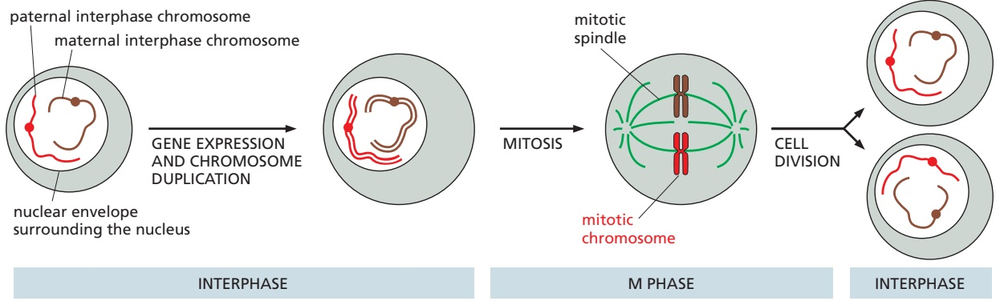

---

196

Chapter 4: DNA, Chromosomes, and Genomes

Briefly, during a long interphase, genes are expressed and chromosomes are replicated, with the two replicas remaining together as a pair of sister chromatids. Throughout this time the chromosomes are extended, and much of their chromatin exists as long threads in the nucleus so that individual chromosomes cannot be easily distinguished. It is only during a much briefer period of mitosis that each chromosome condenses so that its two sister chromatids can be separated and distributed to the two daughter nuclei. The highly condensed chromosomes in a dividing cell are known as mitotic chromosomes (**Figure 4–18**). This is the form in which chromosomes are most easily visualized; in fact, the images of chromosomes shown so far in the chapter are of chromosomes in mitosis.

Each chromosome operates as a distinct structural unit. For a faithful copy of a chromosome to be passed on to each daughter cell at division, it must have been completely replicated during interphase to produce two identical DNA molecules. In addition, these newly replicated, enormously long DNA copies must then be separated and partitioned correctly into the two daughter cells. These basic functions are controlled by three types of specialized sites on the DNA, each of which binds specific proteins that guide the machinery that replicates and segregates chromosomes (**Figure 4–19**).

Experiments in budding yeast, whose chromosomes are relatively small and easy to manipulate, have identified the minimal DNA sequence elements responsible for each of these functions. One type of nucleotide sequence acts as a DNA **replication origin**, the location at which duplication of the DNA begins. Eukaryotic chromosomes contain many origins of replication to ensure that the entire chromosome can be replicated rapidly, as discussed in detail in Chapter 5.

After DNA replication, the two sister chromatids that form each chromosome remain attached to one another and, as the cell cycle proceeds, they are condensed further to produce mitotic chromosomes. In budding yeasts, the presence of a second specialized DNA sequence, called a **centromere**, allows one copy of each duplicated and condensed chromosome to be pulled into each daughter cell when a cell divides. A protein complex called a kinetochore forms at the centromere and attaches the duplicated chromosomes to the mitotic spindle, in a manner that causes the two sister chromatids to be pulled apart (discussed in Chapter 17).

The third specialized DNA sequence forms **telomeres**, the ends of a chromosome. Telomeres contain repeated nucleotide sequences that enable the ends of chromosomes to be efficiently replicated. Telomeres also perform another function: the repeated telomere DNA sequences, together with the regions adjoining them, form structures that protect the end of the chromosome from

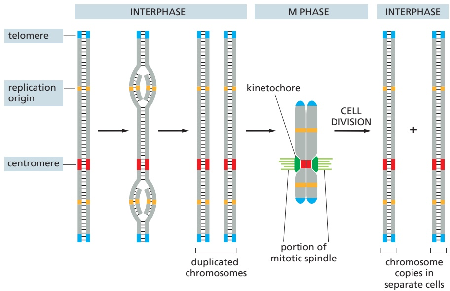

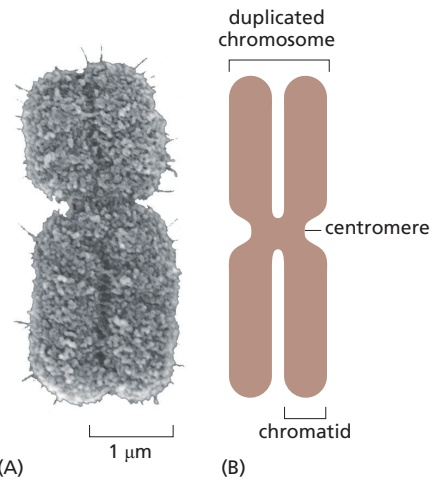

Figure 4–18 A mitotic chromosome. At the metaphase stage of M phase, each MBoC7 e5.15/4.18chromosome exists as a condensed duplicated chromosome, in which the two replicated chromosomes, called sister chromatids, are still linked together (see Figure 4–17). The constricted region indicates the position of the centromere. (A) Electron micrograph; (B) schematic drawing. (A, courtesy of Terry D. Allen.)

Figure 4–19 The three specialized sites on the DNA required to produce a eukaryotic chromosome that can be replicated and then segregated accurately at mitosis. Each chromosome has multiple origins of replication, one centromere, and two telomeres. Shown here is the sequence of events that a typical chromosome follows during the cell cycle. The DNA replicates during the portion of interphase known as S phase, beginning at the origins of replication and proceeding bidirectionally from the origins across the chromosome. In M phase, the centromere attaches the duplicated chromosomes to the mitotic spindle so that a copy of the entire genome is distributed to each daughter cell during mitosis; the special structure that attaches the centromere to the spindle is a protein complex called the kinetochore (dark green). The centromere also helps to hold the duplicated chromosomes together until they are ready to be moved apart. As explained in the text, the telomeres form special caps at each chromosome end.

---

CHROMOSOMAL DNA AND ITS PACKAGING IN THE CHROMATIN FIBER

197

being mistaken by the cell for a broken DNA molecule in need of repair. We discuss both this type of repair and the structure and function of telomeres in Chapter 5.

In budding yeast cells, the three types of sequences required to propagate a chromosome are relatively short (typically fewer than 1000 base pairs each) and therefore use only a tiny fraction of the information-carrying capacity of a chromosome. Although telomere sequences are fairly simple and short in all eukaryotes, the DNA sequences that form centromeres and replication origins in more complex organisms are much longer than their yeast counterparts. For example, experiments suggest that a human centromere can contain up to a million nucleotide pairs and that it may not require a stretch of DNA with a defined nucleotide sequence. Instead, as we shall discuss later in this chapter, a human centromere is thought to consist of a large, regularly repeating protein–nucleic acid structure that can be inherited when a chromosome replicates.

## DNA Molecules Are Highly Condensed in Chromosomes

All eukaryotic organisms have special ways of packaging DNA into chromosomes. Thus, if the 48 million nucleotide pairs of DNA in human chromosome 22 could be laid out as one long double helix stretched out end to end, the molecule would extend for about 1.5 cm. But chromosome 22 measures only about 2 μm in length in mitosis (see Figure 4–11), representing an end-to-end compaction ratio of more than 7000-fold. This remarkable feat of compression is performed by proteins that successively coil and fold the DNA into higher levels of organization.

Although much less condensed than mitotic chromosomes, the DNA of human interphase chromosomes is still tightly packed. But interphase chromosomes have a dynamic structure. Specific regions of interphase chromosomes decondense to allow access to specific DNA sequences for gene expression, DNA repair, and replication—and then recondense when these processes are completed. The packaging of DNA in chromosomes is therefore accomplished in a way that allows rapid localized, on-demand access to the DNA. In the next sections, we discuss the specialized proteins that make this type of packaging possible.

## Nucleosomes Are a Basic Unit of Eukaryotic Chromosome Structure

The proteins that bind to the DNA to form eukaryotic chromosomes are traditionally divided into two classes: the **histones** and the non-histone chromosomal proteins, each contributing about the same mass to a chromosome. The complex of both classes of protein with the nuclear DNA of eukaryotic cells is known as **chromatin** (**Figure 4–20**; **Movie 4.2**).

Histones are responsible for the first and most basic level of chromosome packing, a protein–DNA complex called the **nucleosome**. When interphase nuclei are broken open very gently and their contents examined under the electron microscope, most of the chromatin appears to be in the form of a fiber

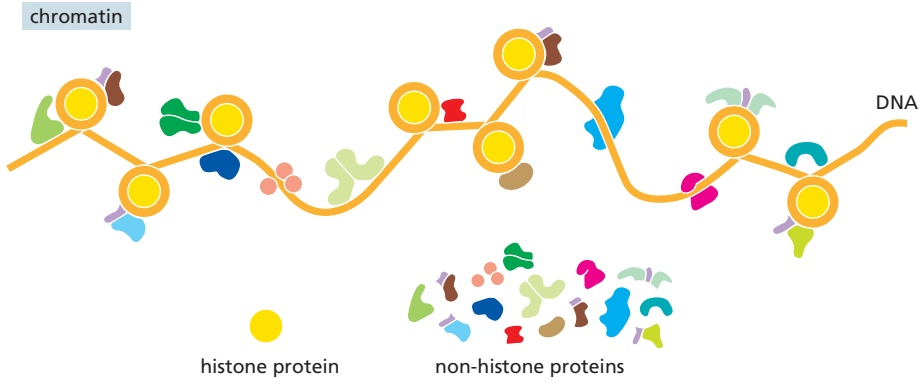

Figure 4–20 Chromatin. As illustrated, chromatin consists of DNA bound to both histone and non-histone proteins. The mass of histone protein present is about equal to the total mass of non-histone protein, but—as schematically indicated here—the latter class is composed of an enormous number of different species. In total, a chromosome is about one-third DNA and two-thirds protein by mass.

---

198

Chapter 4: DNA, Chromosomes, and Genomes

Figure 4–21 Nucleosomes as seen in the electron microscope. (A) Chromatin isolated directly from an interphase nucleus appears in the electron microscope as a thread of associated nucleosomes. (B) This electron micrograph shows a length of chromatin that has been experimentally decondensed after isolation to show the nucleosomes. (A, courtesy of Barbara Hamkalo; B, courtesy of Victoria Foe.)

(**Figure 4–21A**). If this chromatin is subjected to treatments that cause it to unfold partially, it can be seen under the electron microscope as a series of “beads on a string” (**Figure 4–21B**). The string is DNA, and each bead is a nucleosome core particle that consists of DNA wound around a histone core.

The nucleosome core particles can be isolated by digesting chromatin with particular enzymes (called nucleases) that cut DNA. After digestion for a short period, the exposed DNA between the nucleosome core particles, the linker DNA, is degraded. Each individual nucleosome core particle is found to consist of a complex of eight histone proteins—two molecules each of histones H2A, H2B, H3, and H4—and double-stranded DNA that is 147 nucleotide pairs long. This histone octamer forms a protein core around which the double-stranded DNA is wound (**Figure 4–22**).

The region of linker DNA that separates each nucleosome core particle from the next can vary in length from a few nucleotide pairs up to about 80. (The term “nucleosome” technically refers to a nucleosome core particle plus one of its adjacent DNA linkers, but it is often used synonymously with “nucleosome core particle.”) On average, therefore, nucleosomes repeat at intervals of about 200 nucleotide pairs. For example, a diploid human cell with $6 . 2 \times 1 0 ^ { 9 }$ nucleotide pairs contains approximately 30 million nucleosomes. The formation of nucleosomes converts a DNA molecule into a chromatin thread that is about one-third of its initial length.

## The Structure of the Nucleosome Core Particle Reveals How DNA Is Packaged

The high-resolution structure of a nucleosome core particle reveals a discshaped histone core around which the DNA is tightly wrapped in a left-handed coil of 1.7 turns (**Figure 4–23**). All four of the histones that make up the core of the nucleosome are relatively small proteins (102–135 amino acids), and they share a structural motif, known as the histone fold, formed from three α helices connected by two loops (**Figure 4–24**). In assembling a nucleosome, the histone folds first bind to each other to form H3–H4 and H2A–H2B dimers, and the H3–H4 dimers combine to form tetramers. An H3–H4 tetramer then further combines with two H2A–H2B dimers to form a compact histone octamer, the core around which the DNA is wound.

The interface between DNA and histone is extensive: 142 hydrogen bonds are formed between DNA and the histone core in each nucleosome. Nearly half

<small>Figure 4–22 Structural organization of the nucleosome. A nucleosome contains a protein core made of eight histone molecules. In biochemical experiments, the nucleosome core particle can be released from isolated chromatin by digestion of the linker DNA with a nuclease, an enzyme that hydrolyzes the phosphodiester bonds that connect the nucleotides in DNA. (The nuclease can degrade the exposed linker DNA but cannot attack the DNA wound tightly around the nucleosome core.) After dissociation of the isolated nucleosome into its protein core and DNA, the length of the DNA that was wound around the core can be determined. This length of 147 nucleotide pairs is sufficient to wrap 1.7 times around the histone core.</small>

---

CHROMOSOMAL DNA AND ITS PACKAGING IN THE CHROMATIN FIBER

199

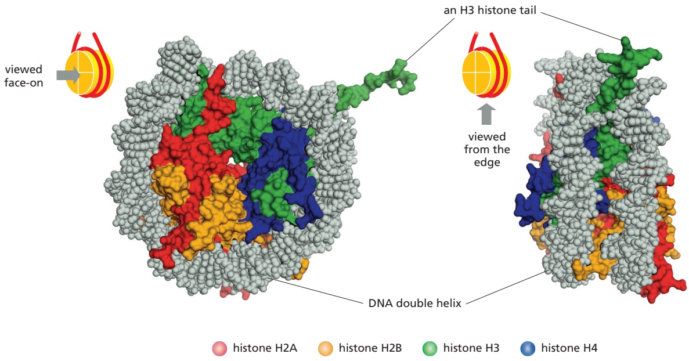

of these bonds form between the amino acid backbone of the histones and the sugar–phosphate backbone of the DNA. Numerous hydrophobic interactions and salt linkages also hold DNA and protein together in the nucleosome. More than one-fifth of the amino acids in each of the core histones are either lysine or arginine (two amino acids with basic side chains), and their positive chargesMBoC7 e5.21/4.23 can effectively neutralize the negatively charged DNA backbone. These numerous interactions explain in part why DNA of virtually any sequence can be bound on a histone octamer core. The path of the DNA around the histone core is not smooth; rather, several kinks are seen in the DNA, as expected from the nonuniform surface of the core.

Figure 4–23 The structure of a nucleosome core particle, as determined by x-ray diffraction analyses of crystals. Each histone is colored according to the scheme in Figure 4–22, with the DNA double helix in light gray. One H3 N-terminal tail (green) can be seen extending from the nucleosome core; the positions of the tails of the other histones could not be determined, due to their disorder. (Adapted from K. Luger et al., Nature 389:251–260, 1997.)

The bending of the DNA requires a substantial compression of the minor groove of the DNA helix. Certain dinucleotides in the minor groove are especially

Figure 4–24 The overall structural organization of the core histones. (A) Each of the core histones contains an N-terminal tail, which is subject to several forms of covalent modification, and a histone fold region, as indicated. (B) The structure of the histone fold, which is formed by all four of the core histones. (C) Histones H2A and H2B form a dimer through an interaction known as the “handshake.” Histones H3 and H4 form a dimer through the same type of interaction. (D) The final histone octamer around which the DNA is wound. Note that all eight N-terminal tails of the histones protrude from the disc-shaped core structure. Their conformations are highly flexible, and they serve as binding sites for sets of other proteins.

---

200

Chapter 4: DNA, Chromosomes, and Genomes

easy to compress, and some nucleotide sequences bind the histone core more tightly than others (**Figure 4–25**). This probably explains some striking, but unusual, cases of very precise positioning of nucleosomes along a stretch of DNA. However, the sequence preference of nucleosomes must be weak enough to allow other factors to dominate, inasmuch as nucleosomes can occupy any one of a number of positions relative to the DNA sequence in most chromosomal regions.

In addition to its histone fold, each of the core histones has a largely unstructured N-terminal amino acid “tail,” which extends out from the DNA–histone core (see Figure 4–24D). These histone tails are “hot spots” for different types of covalent modifications that control critical aspects of chromatin structure and function, as we shall discuss shortly.

As a reflection of their fundamental role in DNA function through controlling chromatin structure, the histones are among the most highly conserved eukaryotic proteins. For example, the amino acid sequence of histone H4 from a pea differs from that of a human at only two of the 102 positions. Although histones H2A and H2B have been somewhat less constrained in their evolution than histones H3 and H4, such a strong evolutionary conservation suggests that the functions of histones involve nearly all of their amino acids, so that a change in any position is deleterious to the cell.

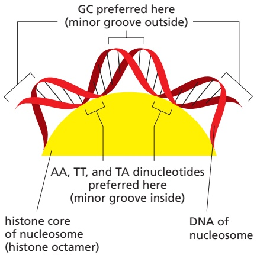

Figure 4–25 The bending of DNA in a nucleosome. The DNA helix makes 1.7 tight turns around the histone octamer. This diagram illustrates how the minor groove is compressed on the inside of the turn. Owing to structural features of the DNA molecule, the indicated dinucleotides are preferentially accommodated in such a narrow minor groove, which helps to explain why certain DNA sequences will bind more tightly than others to the nucleosome core.

In addition to this remarkable conservation, eukaryotic organisms also produce smaller amounts of specialized variant core histones that differ in amino acid sequence from the main ones. As discussed later, these variants, combined with the surprisingly large number of covalent modifications that can be added to the histones in nucleosomes, give rise to a variety of chromatin structures in cells.

# Nucleosomes Have a Dynamic Structure and Are Frequently Subjected to Changes Catalyzed by ATP-dependent Chromatin-remodeling Complexes

For many years biologists thought that, once formed in a particular position on DNA, a nucleosome would remain fixed in place because of the very tight association between its core histones and DNA. If true, this would pose problems for genetic readout mechanisms, which require easy access to many specific DNA sequences. It would also hinder the rapid passage of the DNA transcription and replication machinery through chromatin. But kinetic experiments show that the DNA in an isolated nucleosome unwraps from each end at a rate of about four times per second, remaining exposed for 10–50 milliseconds before the partially unwrapped structure recloses. Thus, most of the DNA in an isolated nucleosome is in principle available for binding other proteins (see Figure 7–12).

Inside a cell, a further loosening of DNA–histone contacts is clearly required, because eukaryotic cells contain a variety of ATP-dependent chromatinremodeling complexes. These abundant proteins include a subunit that hydrolyzes ATP (an ATPase evolutionarily related to the DNA helicases discussed in Chapter 5). This “motor subunit” binds both to the protein core of the nucleosome and to the double-stranded DNA that winds around it. By using the energy of ATP hydrolysis to move this DNA relative to the core, the remodeling complex changes the structure of a nucleosome temporarily, making the DNA less tightly bound to the histone core. Through repeated cycles of ATP hydrolysis that pull the DNA helix along the nucleosome core, a remodeling complex can catalyze nucleosome sliding (**Figure 4–26**). Because nucleosomes are frequently repositioned in this way, all of the DNA sequences in chromatin are potentially available for binding to other proteins in the cell.

In addition, some types of remodeling complexes are able to remove either all or part of the nucleosome core from a nucleosome—catalyzing either an exchange of its H2A–H2B histones or the complete removal of the octameric core from the DNA (**Figure 4–27**). As a result, a typical nucleosome is replaced on the DNA every 1 or 2 hours inside the cell.

Cells contain dozens of different ATP-dependent chromatin-remodeling complexes that are specialized for different roles, with roughly one complex present per five nucleosomes. Most are large protein complexes that can contain 10 or

---

CHROMOSOMAL DNA AND ITS PACKAGING IN THE CHROMATIN FIBER

201

Figure 4–26 The nucleosome movements catalyzed by ATP-dependent chromatin-remodeling complexes. (A) Using the energy of ATP hydrolysis, a remodeling complex that catalyzes nucleosome sliding pulls on the DNA of its bound nucleosome and loosens its attachment to the histone octamer. Each cycle of ATP binding, ATP hydrolysis, and release of the ADP and phosphate products thereby moves the DNA in the direction of the arrows in this diagram. Because each cycle moves the DNA by one base pair, it requires many such cycles to produce the nucleosome sliding shown. (B) The structure of the yeast SWR1 chromatin-remodeling complex. This complex catalyzes an exchange of an H2A–H2B dimer for a dimer that contains an H2A histone variant. Its ATP-driven motor subunit is colored purple. (B, PDB code: 6GEJ.)

more subunits, some of which bind to specific modifications on histones. The activity of these complexes is controlled by the cell. As genes are turned on and off, chromatin-remodeling complexes are brought to specific regions of DNA where they act locally to influence chromatin structure (discussed in Chapter 7).

Although some DNA sequences bind more tightly than others to the nucleosome core (see Figure 4–25), the most important influence on nucleosome positioning appears to be the presence of other tightly bound proteins on the DNA. Some bound proteins favor the formation of a nucleosome adjacent to them. Others create obstacles that force the nucleosomes to move elsewhere. The exact positions of nucleosomes along a stretch of DNA therefore depend mainly

Figure 4–27 Nucleosome removal and histone exchange catalyzed by ATP-dependent chromatin-remodeling complexes. Some chromatin-remodeling complexes can remove the H2A–H2B dimers from a nucleosome (top series of reactions) and replace them with dimers that contain a variant histone, such as the H2AZ–H2B dimer (see Figure 4–36). Other remodeling complexes are attracted to specific sites on chromatin to remove the histone octamer completely and/or to replace it with a different nucleosome core (bottom series of reactions). Highly simplified views of the processes are illustrated here.

---

202

Chapter 4: DNA, Chromosomes, and Genomes

Figure 4–28 A zigzag model for the chromatin fiber. (A) The conformation of two of the four nucleosomes in a tetranucleosome, from a structure determined by x-ray crystallography. (B) Schematic of the entire tetranucleosome; the fourth nucleosome is not visible, being stacked on the bottom nucleosome and behind it in this diagram. (C) Diagrammatic illustration of a possible zigzag structure in the chromatin fiber. (A, PDB code: 1ZBB; C, adapted from C.L. Woodcock, Nat. Struct. Mol. Biol. 12:639–640, 2005.)

on the presence and nature of other proteins bound to the DNA. And due to the presence of ATP-dependent chromatin-remodeling complexes, the arrangement of nucleosomes on DNA can be highly dynamic, changing rapidly according to the needs of the cell.

## Attractions Between Nucleosomes Compact the Chromatin Fiber

Although enormously long strings of nucleosomes form on the chromosomal DNA, chromatin in a living cell probably rarely adopts the extended “beadson-a-string” form. Instead, the nucleosomes are packed on top of one another, generating arrays in which the DNA is more highly condensed. Thus, when nuclei are very gently lysed onto an electron microscope grid, much of the chromatin is seen to be in the form of a fiber that is considerably wider than an individual nucleosome (see Figure 4–21A).

How nucleosomes are organized into condensed arrays is unclear. The structure of a tetranucleosome (a complex of four nucleosomes) obtained by x-rayMB C7 4.28/4.28 crystallography and high-resolution electron microscopy of reconstituted chromatin has been used to support a zigzag model for the stacking of nucleosomes (**Figure 4–28**). But cryo-electron microscopy of carefully prepared nuclei suggests that most regions of chromatin are less regularly structured.

What causes nucleosomes to stack on each other? Nucleosome-to-nucleosome attractions that involve histone tails, most notably the H4 tail, constitute one important factor (**Figure 4–29**). In addition, an additional histone is often present in a 1-to-1 ratio with nucleosome cores, known as **histone H1**. This so-called linker histone is larger than the individual core histones, and it has been considerably less well conserved during evolution. A nucleosome can bind a single histone H1 molecule; this H1 molecule contacts both the DNA and the histone octamer and changes the path of the DNA as it exits from the nucleosome

Figure 4–29 A model for the role played by histone tails in the compaction of chromatin. (A) A schematic diagram shows the approximate exit points of the eight N-terminal histone tails, one from each histone protein, that extend from each nucleosome. The actual structure is shown to its right. In the high-resolution structure of the nucleosome, most of the histone tails are not visible, suggesting that they are relatively unstructured and highly flexible. (B) As indicated, the histone tails are thought to be involved in interactions between nucleosomes that help to hold them together. (A, PDB code: 1KX5.)

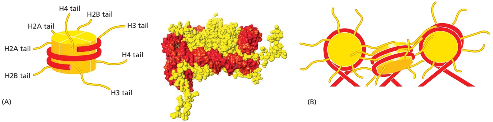

---

THE EFFECT OF CHROMATIN STRUCTURE ON DNA FUNCTION

203

(Figure 4–30). The change in the exit path of DNA is thought to help compact nucleosomal DNA. The presence of many other DNA-binding proteins, as well as proteins that bind directly to histones, is certain to add important additional features to any array of nucleosomes.

Figure 4–30 How the linker histone binds to the nucleosome. The position and structure of histone H1 are shown. H1 constrains the DNA where it exits from the nucleosome and thereby compacts chromatin. (A) Schematic, and (B) structure inferred for a single nucleosome from a structure determined by high-resolution electron microscopy of a reconstituted chromatin fiber. (B, adapted from F. Song et al., Science 344:376–380, 2014.)

## Summary

A gene is a nucleotide sequence in a DNA molecule that acts as a functional unit for the production of a protein, a structural RNA, or a catalytic or regulatory RNA molecule. In eukaryotes, protein-coding genes are usually composed of a string of alternating introns and exons associated with regulatory regions of DNA. A chromosome is formed from a single, enormously long DNA molecule that contains a linear array of many genes, bound to a large set of proteins. The human genome contains 3.1 3 109 DNA nucleotide pairs, divided between 22 different autosomes (present in two copies each) and 2 sex chromosomes. Only a small percentage of this DNA codes for proteins or functional RNA molecules. A chromosomal DNA molecule also contains three other types of important nucleotide sequences: replication origins and telomeres allow the DNA molecule to be efficiently replicated, while a centromere attaches the sister DNA molecules to the mitotic spindle, ensuring their accurate segregation to daughter cells during the M phase of the cell cycle.

The DNA in eukaryotes is tightly bound to an equal mass of histones, which form repeated arrays of DNA–protein particles called nucleosomes. The nucleosome is composed of an octameric core of histone proteins around which the DNA double helix is wrapped. Nucleosomes are spaced at intervals of about 200 nucleotide pairs, and they associate with neighboring nucleosomes to create a more compact chromatin fiber. Chromatin structure must be highly dynamic to allow access to the DNA. Some spontaneous DNA unwrapping and rewrapping occurs in the nucleosome itself; however, the general strategy for reversibly changing local chromatin structure in a cell features ATP-driven chromatin-remodeling complexes. Cells contain a large set of such complexes, which are targeted to specific regions of chromatin at appropriate times. The remodeling complexes allow nucleosome cores to be repositioned, reconstituted with different histones, or completely removed to expose the underlying DNA.

## THE EFFECT OF CHROMATIN STRUCTURE ON DNA FUNCTION

Having described how DNA is packaged into nucleosomes to create a chromatin fiber, we next describe the mechanisms that create different chromatin structures in different regions of a cell’s genome and how this affects DNA function in cells. Most strikingly, we shall see that some types of chromatin structure can be inherited; that is, the structure can be directly passed down from a cell to its descendants. Because this creates a cell memory that is not based on an inherited change in DNA sequence, it creates a form of **epigenetic inheritance**. The prefix epi is Greek for “on”; this is appropriate, because epigenetics represents a form of inheritance that is superimposed on the DNA-based genetic inheritance.

---

204

Chapter 4: DNA, Chromosomes, and Genomes

Chapter 7 explains the many different ways in which the expression of genes is regulated; there we will discuss epigenetic inheritance in detail and present several different mechanisms that can produce it. Here, we are concerned only with those epigenetic mechanisms based on chromatin structure. We shall emphasize some of the chemistry that makes this possible—the covalent modification of histones in nucleosomes. These modifications serve as recognition sites for protein domains that bind different non-histone protein complexes to different regions of chromatin. In total, these complexes are so abundant that, roughly speaking, chromatin consists of one-third DNA, one-third histones, and one-third non-histone proteins by mass (see Figure 4–20). The varieties of chromatin structures produced have critical effects not only on gene expression but also on many other DNA-dependent processes—playing an important role in the development, growth, and maintenance of all eukaryotic organisms, including ourselves.

## Different Regions of the Human Genome Are Packaged Very Differently in Chromatin

Light-microscope studies in the 1930s distinguished two types of chromatin in the interphase nuclei of higher eukaryotic cells: a highly condensed form, called **heterochromatin**, and all the rest, called **euchromatin**, which is less condensed. Powerful new types of molecular analyses have now allowed scientists to classify these two chromatin types more precisely. Chromatin is now considered to be either “open and active” or “closed and inactive.” As illustrated in **Figure 4–31**, roughly 80% of the human genome is in the closed form, half of which is compactly packaged in heterochromatin, with the other, less condensed half (part of the euchromatin) designated as “quiescent.” Only about 20% of the genome is packaged in that portion of the euchromatin associated with the actively expressed genes that will be the focus of Chapters 6 and 7.

## Heterochromatin Is Highly Condensed and Restricts Gene Expression

Heterochromatin represents an especially compact form of chromatin (see Figure 4–10), and we are finally beginning to understand its molecular properties. Some heterochromatin is concentrated in specialized chromosomal regions, most notably at the centromeres and telomeres introduced previously (see Figure 4–19). But heterochromatin is also present at many other locations along chromosomes— locations that can vary according to the developmental state of the cell.

The packaging of DNA in heterochromatin typically prevents gene expression. However, we know now that the term heterochromatin encompasses a number of

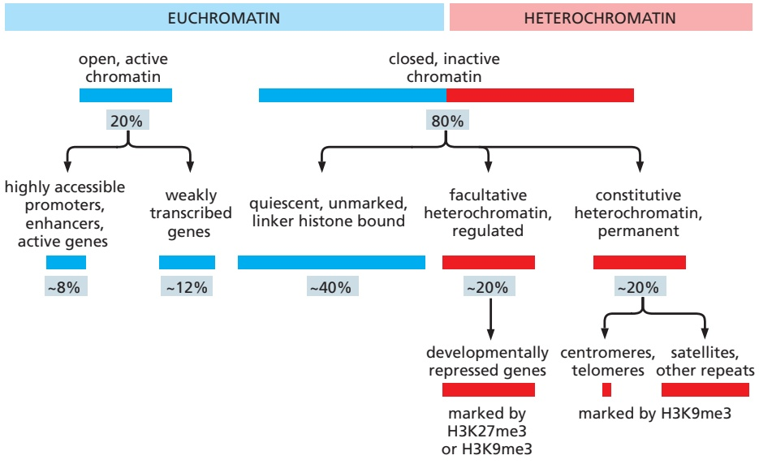

Figure 4–31 Some distinct ways that DNA is packaged in chromatin in a mammalian cell. Although all of these types of chromatin are based on long strings of nucleosomes, the nucleosomes are differently organized through association with different non-histone proteins. As we discuss shortly, these associations can depend on the particular ways that the histones in each nucleosome have been covalently “marked.” For example, as indicated here, the histone H3 molecules in heterochromatin are marked either with trimethylated lysine 9 (H3K9me3) or with trimethylated lysine 27 (H3K27me3), depending on the particular structure that is formed (see Figure 4–40).

---

THE EFFECT OF CHROMATIN STRUCTURE ON DNA FUNCTION

205

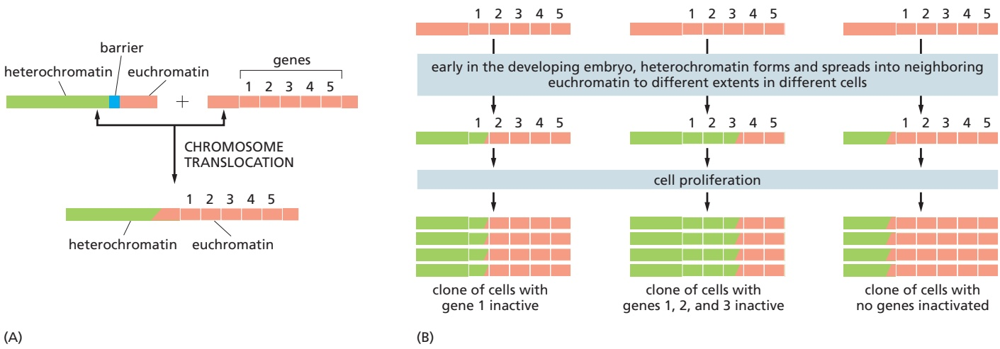

distinct modes of chromatin compaction that have different functions. There are two broad classes, distinguished as constitutive heterochromatin and facultative heterochromatin (see Figure 4–31). The constitutive class permanently condenses many regions of the genome (and hence its name), whereas the facultative class of heterochromatin can be regulated to control gene expression.

As described next, heterochromatin has the critical property of being able to self-propagate.

## The Heterochromatic State Can Spread Along a Chromosome and Be Inherited from One Cell Generation to the Next

Through errors that can occur in chromosome rejoining when DNA double-strand breaks are repaired, a piece of chromosome that is normally euchromatic can be accidentally translocated into the neighborhood of heterochromatin. Remarkably, this often causes the silencing—inactivation—of normally active genes, a phenomenon referred to as a position effect. First recognized in the fruit fly Drosophila, such position effects have now been observed in many eukaryotes, including yeasts, plants, and humans. Position effects are caused by a spreading of the heterochromatic state into an originally euchromatic region, and detailed studies of this phenomenon have provided important clues to the mechanisms that create and maintain heterochromatin.

After the above type of chromosome breakage-and-rejoining event, the zone of silencing, where euchromatin is converted to a heterochromatic state, is found to spread for different distances in different cells of the early fly embryo. Remarkably, these differences then are perpetuated for the rest of the animal’s life: in each cell, once the heterochromatic condition is established on a piece of chromatin, it tends to be stably inherited by all of that cell’s progeny (**Figure 4–32**). This remarkable phenomenon, called position effect variegation, was first recognized as a mottled loss of red pigment in the fly eye (**Figure 4–33**).

These observations, taken together, point to a fundamental feature of heterochromatin formation: heterochromatin begets more heterochromatin. This

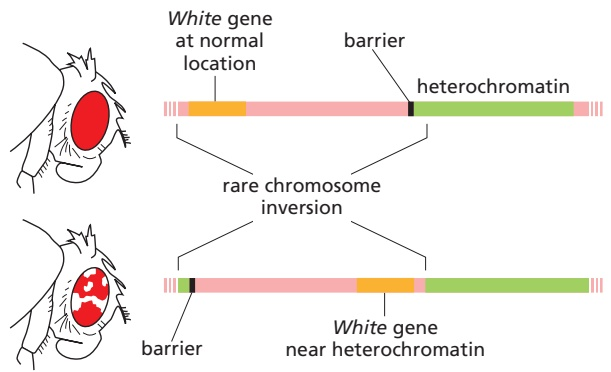

## Figure 4–32 The cause of position effect variegation in Drosophila.

(A) Heterochromatin (green) is normally prevented from spreading into adjacent regions of euchromatin (red) by barrier DNA sequences, which we shall discuss shortly. In flies that inherit certain chromosomal rearrangements, however, this barrier is no longer present. (B) During the early development of such flies, heterochromatin can spread into neighboring chromosomal DNA, proceeding for different distances in different cells. This spreading soon stops, but the established pattern of heterochromatin is subsequently inherited, so that large clones of progeny cells are produced that have the same neighboring genes condensed into heterochromatin and thereby inactivated (hence the “variegated” appearance of some of these flies; see Figure 4–33).

Figure 4–33 The discovery of position effects on gene expression. The White gene in the fruit fly Drosophila controls eye pigment production and is named after the mutation that first identified it. Wild-type flies with a normal White gene (White1) have normal pigment production, which gives them red eyes, but if the White gene is mutated and inactivated, the mutant flies (White–) make no pigment and have white eyes. In flies in which a normal White gene has been moved near a region of heterochromatin, the eyes are mottled, with both red and white patches. The white patches represent cell lineages in which the White gene has been silenced by the effects of the heterochromatin. In contrast, the red patches represent cell lineages in which the White gene is expressed. Early in development, when the heterochromatin is first formed, it spreads into neighboring euchromatin to different extents in different embryonic cells (see Figure 4–32). The presence of large patches of red and white cells reveals that the state of transcriptional activity, as determined by the packaging of this gene into chromatin in those ancestor cells, is inherited by all daughter cells.

---

206

Chapter 4: DNA, Chromosomes, and Genomes

(A) LYSINE ACETYLATION AND METHYLATION ARE COMPETING REACTIONS

Figure 4–34 Some prominent types of covalent amino acid side-chain modifications found on nucleosomal histones. (A) Three different levels of lysine methylation are shown; each can be recognized by a different binding protein, and thus each can have a different significance for the cell. Note that acetylation removes the plus charge on lysine, and that, perhaps most important, an acetylated lysine cannot be methylated, and vice versa. (B) Serine phosphorylation adds a negative charge to a histone. Modifications of histones not shown here include the mono- or dimethylation of an arginine, the phosphorylation of a threonine, the addition of ADP-ribose to a glutamic acid, and the addition of a ubiquityl, sumoyl, or biotin group to a lysine.

positive feedback can operate both in space, causing the heterochromatic state to spread along the chromosome, and in time, across cell generations, propagating the heterochromatic state of the parent cell to its daughters. The challenge is to explain the molecular mechanisms that underlie this remarkable behavior.

(B) SERINE PHOSPHORYLATION

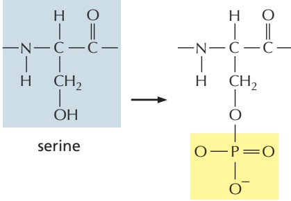

phosphoserine

As a first step, one can carry out a search for the molecules that are involved. This has been done by means of genetic screens, in which large numbers of mutants are generated, after which one picks out those that show an abnormality of the process in question. Extensive genetic screens in Drosophila, fungi, and mice have identified more than 100 genes whose products either enhance or suppress the spread of heterochromatin and its stable inheritance—in other words, genes that serve as either enhancers or suppressors of position effect variegation. Many of these genes turn out to code for non-histone chromosomal proteins that interact with histones and are involved in modifying or maintaining chromatin structure. These include genes that encode some of the enzymes that add or remove covalent modifications to histone side chains, as we discuss next.

## The Core Histones Are Covalently Modified at Many Different Sites

All of the above types of modifications are reversible, with one enzyme serving to create a particular type of modification and a different enzyme serving to remove it. These enzymes are highly specific. Thus, for example, acetyl groups are added to specific lysines by a set of different histone acetyl transferases (HATs) and removed by a set of histone deacetylase complexes (HDACs). Likewise, methyl groups are added to lysine side chains by a set of different histone methyl transferases and removed by a set of histone demethylases. Each enzyme is recruited to specific sites on the chromatin at defined times in each cell’s life history. The initial recruitment can depend on transcription regulatory proteins (sometimes

The amino acid side chains of the four histones in the nucleosome core are subjected to a remarkable variety of covalent modifications, including the acetylation of lysines, the mono-, di-, and trimethylation of lysines, and the phosphorylation of serines (**Figure 4–34**). A large number of these side-chain modifications occur on the eight relatively unstructured N-terminal “histone tails” that protrude from the nucleosome (**Figure 4–35**). However, there are also more than 20 specific side-chain modifications on the nucleosome’s globular core.