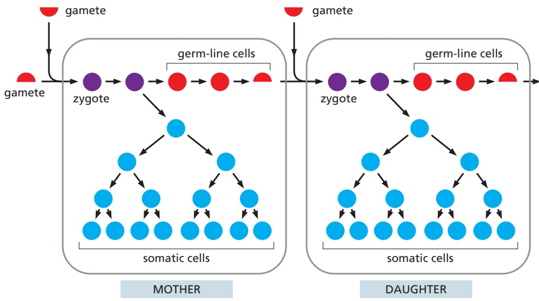
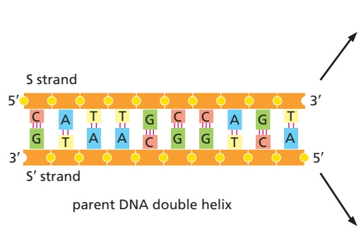
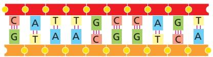
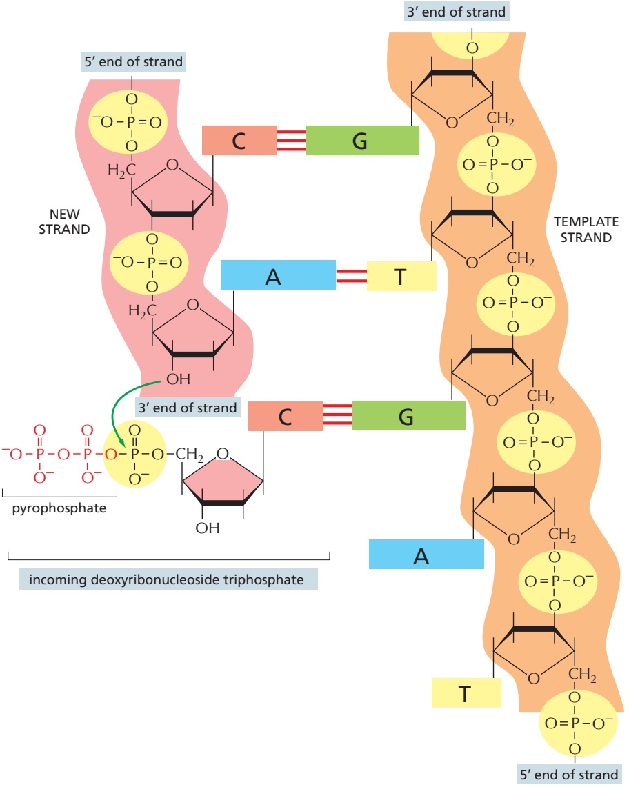
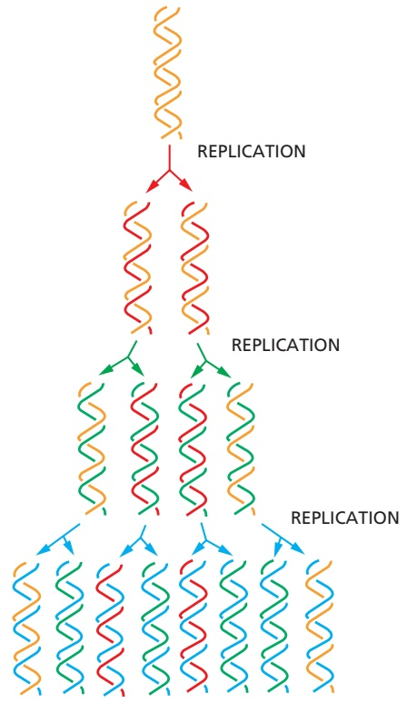
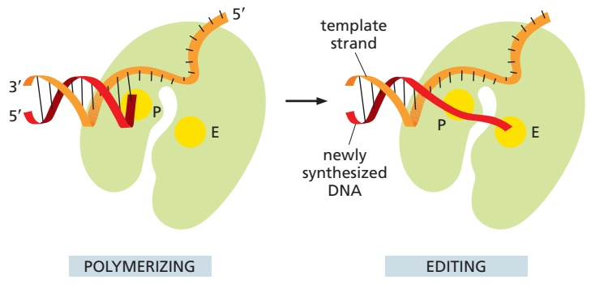
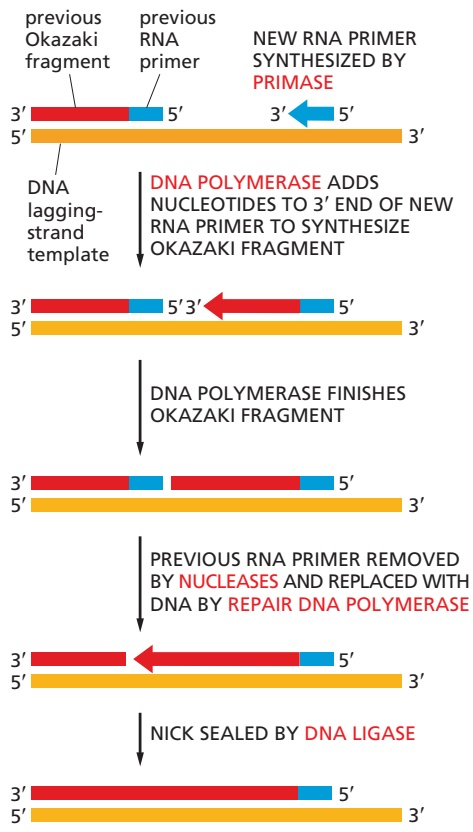
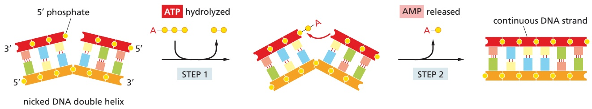
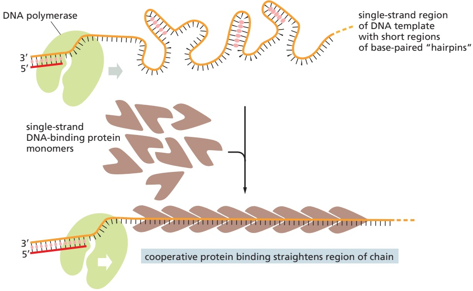
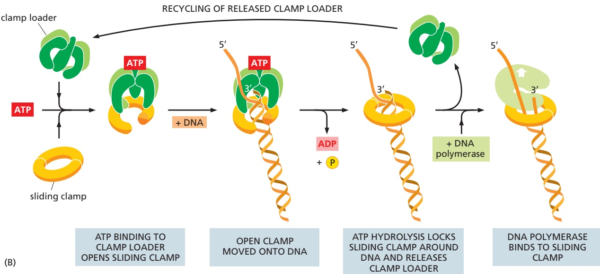

# DNA Replication, Repair, and Recombination

The ability of cells to maintain a high degree of order in a chaotic universe depends on the accurate duplication of vast quantities of genetic information carried in chemical form as DNA. This process, called DNA replication, must occur before a cell can produce two genetically identical daughter cells. Maintaining order also requires the continued surveillance and repair of this genetic information, because DNA inside cells is repeatedly damaged by chemicals and radiation from the environment, as well as by thermal accidents and reactive molecules generated inside the cell. In this chapter, we describe the protein machines that replicate and repair the cell’s DNA. These machines catalyze some of the most rapid and accurate processes that take place within cells, and their mechanisms provide clear illustrations of the elegance and efficiency of cell chemistry.

The short-term survival of a cell depends on preventing harmful changes in its DNA. But the long-term survival of a species requires that these same DNA sequences be changeable over many generations to permit evolutionary adaptation to changing circumstances. We shall see that, despite the great efforts that cells make to protect their DNA, occasional changes in DNA sequences are unavoidable. These changes produce the genetic variation that is required for natural selection to drive the evolution of organisms.

We begin this chapter with a brief discussion of the changes that occur in DNA as it is passed down from generation to generation. Next, we discuss the mechanisms—DNA replication and DNA repair—that are responsible for minimizing these changes. Finally, we consider some of the most intriguing pathways that alter DNA sequences—those of DNA recombination. These pathways include the movement within chromosomes of special DNA sequences called transposable elements.

## THE MAINTENANCE OF DNA SEQUENCES

The survival of an individual organism demands a high degree of genetic stability. Only rarely do the cell’s DNA-maintenance processes fail, resulting in permanent change in the DNA. Such a change is called a mutation, and it can destroy an organism if it occurs in a vital position in the DNA sequence.

## Mutation Rates Are Extremely Low

The **mutation rate**, the rate at which changes occur in DNA sequences, can be determined directly from experiments carried out with a bacterium such as Escherichia coli—a resident of our intestinal tract and a commonly used laboratory organism (see Figure 1–38). Under laboratory conditions, an E. coli cell divides about once every 30 minutes; as a result, a single cell can generate a very large population—several billion—in less than a day. In such a population, it is possible to detect the small fraction of bacteria that have suffered a damaging mutation in a particular gene. For example, the mutation rate of a gene specifically required for cells to use the sugar lactose as an energy source can be determined by growing the cells in the presence of a different sugar, such as

C HAP T E R

## IN THIS CHAPTER

The Maintenance of DNA Sequences

DNA Replication Mechanisms

The Initiation and Completion of DNA Replication in Chromosomes

DNA Repair

Homologous Recombination

Transposition and Conservative Site-specific Recombination

glucose, and testing them subsequently to see how many have lost the ability to survive on a lactose diet. The fraction of damaged genes will underestimate the actual mutation rate because many mutations are silent (for example, those that change a codon but not the amino acid it specifies or those that change an amino acid without affecting the activity of the protein coded for by the gene). After correcting for these silent mutations, one finds that bacteria display a mutation rate of about three nucleotide changes per 1010 nucleotides copied.

It is also possible to measure the germ-line mutation rate in more complex, sexually reproducing organisms such as humans. In this case, the complete genomes from a family—parents and offspring—are directly sequenced, and a careful comparison reveals that approximately 70 new single-nucleotide mutations typically arise in the germ lines of each offspring. Normalized to the size of the human genome, the mutation rate is one nucleotide change per $1 0 ^ { 8 }$ nucleotides per human generation. (This is a slight underestimate because some germ-line mutations will be lethal and will therefore be absent from progeny; however, because relatively little of the human genome carries critical information, this consideration has a negligible effect on the true mutation rate.) It is estimated that approximately 100 cell divisions occur in the germ line from the time of conception to the time of production of the eggs and sperm that go on to make the next generation. Thus, the human mutation rate, expressed in terms of cell divisions (instead of human generations), is approximately one nucleotide change per $1 0 ^ { 1 0 }$ nucleotides copied.

Although E. coli and humans differ greatly in their modes of reproduction and in their generation times, when the mutation rates of each are normalized to a single round of DNA replication, they are both extremely low and within a factor of 3 of each other. We shall see later in the chapter that the basic mechanisms that ensure these low rates of mutation have been conserved since the very early history of cells on Earth.

## Low Mutation Rates Are Necessary for Life as We Know It

Because many mutations are deleterious, no species can afford to allow them to accumulate at a high rate in its germ cells. Even though the observed mutation frequency is very low, it is thought to limit the number of essential genes that any organism can rely on to perhaps 30,000. More essential genes than this, and the probability that at least one critical component will suffer a damaging mutation becomes catastrophically high. By an extension of the same argument, a mutation frequency tenfold higher would limit an organism to about 3000 essential genes. In this case, evolution would have been limited to organisms considerably less complex than a fruit fly.

The cells of a sexually reproducing animal or plant are of two types: **germ cells** and **somatic cells**. The germ cells transmit genetic information from parent to offspring; the somatic cells form the body of the organism (Figure 5–1). We have seen that germ cells must be protected against high rates of mutation to maintain the species. However, the somatic cells of multicellular organisms must also be protected from genetic change to properly maintain the organized structure of the body. Nucleotide changes in somatic cells can give rise to variant cells, some of which, through “local” natural selection, proliferate rapidly at the expense of the rest of the organism. In an extreme case, the result is the uncontrolled cell proliferation that we know as cancer. This condition is due largely to an accumulation of changes in the DNA sequences of somatic cells, as discussed in Chapter 20. Any significant increase in the mutation frequency would presumably cause a disastrous increase in the incidence of cancer by accelerating the rate at which dangerous somatic-cell variants arise. Thus, both for the perpetuation of a species with a large number of genes (germ-cell stability) and for the prevention of cancer resulting from mutations in somatic cells (somaticcell stability), multicellular organisms like ourselves absolutely depend on the remarkably high fidelity with which their DNA sequences are replicated and maintained.

new S strand

Figure 5–1 Germ-line cells and somatic cells carry out fundamentally different functions. In sexually reproducing organisms, genetic information is propagated into the next generation exclusively by germ-line cells (red). This cell lineage includes the specialized reproductive cells—the gametes (eggs and sperm, half circles)—which contain only half the number of chromosomes as that contained in the other cells in the body (full circles). When two gametes come together during fertilization, they form a fertilized egg, or zygote (purple), which once again contains a full set of chromosomes. The zygote gives rise to both germ-line cells and somatic cells (blue). Somatic cells form the body of the organism but do not contribute their DNA to the next generation.

## Summary

In all cells, DNA sequences are maintained and replicated with extremely high fidelity. The mutation rate, approximately one nucleotide change per $I O ^ { I O ^ { ' } }$ nucleotides each time the DNA is replicated, is very similar for organisms as different as bacteria and humans. Because of this remarkable accuracy, the sequence of the human genome (approximately $3 . \dot { I } \times I 0 ^ { 9 }$ nucleotide pairs) is unchanged or changed byMBoC7 m5.01/5.01 only a few nucleotides each time a typical human cell divides. This allows humans to pass accurate genetic instructions from one generation to the next and also—for most of us—to avoid the changes in somatic cells that lead to cancer.

## DNA REPLICATION MECHANISMS

All organisms duplicate their DNA with extraordinary accuracy before each cell division. In this part of the chapter, we explore how an elaborate “replication machine” achieves this accuracy, while duplicating DNA at rates as high as 1000 nucleotides per second.

## Base-pairing Underlies DNA Replication and DNA Repair

As introduced in Chapter 1, DNA templating is the mechanism the cell uses to copy the nucleotide sequence of one DNA strand into a complementary DNA sequence (**Figure 5–2**). This process requires the separation of the DNA helix into two template strands, and it entails the recognition of each nucleotide in the DNA template strands by a free (unpolymerized) complementary nucleotide. The separation of the DNA helix exposes the hydrogen-bond donor and acceptor groups on each DNA base to allow its base-pairing with the appropriate incoming free nucleotide, aligning it for its enzyme-catalyzed polymerization into a new DNA chain.

template S strand

template S′ strand

Figure 5–2 DNA acts as a template for its own replication. Because the nucleotide A will successfully pair only with T, and G with C, each strand of a DNA double helix—labeled here as the S strand and its complement, the S′ strand—can serve as a template to specify the sequence of nucleotides in a complementary strand. In this way, both strands of a DNA double helix can be copied with precision, producing two exact copies of the original double helix. How complementary nucleotides base-pair is shown in Figure 4–5.

Figure 5–3 The chemistry of DNA synthesis. Nucleotides enter the reaction as deoxyribonucleoside triphosphates, and the addition of a deoxyribonucleotide to the 3′ end of a polynucleotide chain is the fundamental reaction by which DNA is synthesized. As shown, base-pairing between an incoming deoxyribonucleoside triphosphate and an existing strand of DNA (the template strand) guides the formation of the new strand of DNA and ensures that its nucleotide sequence is complementary to that of the template.

The first nucleotide-polymerizing enzyme, **DNA polymerase**, was discovered in 1957. The free nucleotides that serve as substrates for this enzyme were found to be deoxyribonucleoside triphosphates, and their polymerization into DNA required a single-strand DNA template. **Figure 5–3** and **Figure 5–4** illustrate the stepwise mechanism of this reaction.

## The DNA Replication Fork Is Asymmetrical

During DNA replication inside a cell, each of the two original DNA strands serves as a template for the formation of an entire new strand. Because each of the two daughters of a dividing cell inherits a new DNA double helix containing one original and one new strand (**Figure 5–5**), the DNA double helix is said to be replicated semiconservatively. How is this feat actually accomplished?

Analyses carried out in the early 1960s on the whole replicating chromosome of an E. coli bacterium revealed a localized region of replication that moves progressively along the parent DNA double helix. Because of its Y-shaped structure, this active region is called a **replication fork** (**Figure 5–6**). At the replication fork, a multienzyme complex that contains the DNA polymerase synthesizes the DNA of both new daughter strands.

Figure 5–4 How DNA polymerase adds a deoxyribonucleotide to the end of a growing DNA strand. (A) An incoming deoxynucleoside triphosphate forms a base pair with its partner in the template strand. It is then covalently attached to the free 3′-hydroxyl (3′-OH) end of the growing DNA strand. The new DNA strand is therefore synthesized in the 5′-to-3′ direction. The energy for the polymerization reaction comes from the hydrolysis of a high-energy phosphate bond in the incoming nucleoside triphosphate and the release of pyrophosphate, which is subsequently hydrolyzed to yield two molecules of inorganic phosphate (not shown). (B) The reaction is catalyzed by the enzyme DNA polymerase (light green). The polymerase guides the incoming nucleoside triphosphate to the template strand and positions it such that its 5′ triphosphate will be able to react with the 3′-hydroxyl group on the newly synthesized strand. The white arrow indicates the direction of polymerase movement. (C) Structure of DNA polymerase, as determined by x-ray crystallography, also showing the replicating DNA. The template strand is the longer, orange strand, and the DNA strand being synthesized is colored red. See Movie 5.1. (C, PDB code: 1KRP.)

Initially, the simplest mechanism of DNA replication seemed to be the continuous growth of both new strands, nucleotide by nucleotide, at the replication fork as it moves from one end of a DNA molecule to the other. But because of the antiparallel orientation of the two DNA strands in the DNA double helix (see Figure 5–2), this mechanism would require one daughter strand to polymerize in the 5′-to-3′ direction and the other in the $3' - \mathrm{t}0 - 5'$ direction. Such a replication fork would require two distinct types of DNA polymerase enzymes. However, as attractive as this model might seem, the DNA polymerases at replication forks can synthesize only in the $5^{\prime}-\mathrm{t}0-3^{\prime}$ direction.

How, then, can a DNA strand grow in the $3 ^ { \prime } - \mathrm { t o } - 5 ^ { \prime }$ direction? The answer came from an experiment performed in the late 1960s. Researchers added highly radioactive 3H-thymidine to dividing bacteria for a few seconds, so that only the most recently replicated DNA—that just behind the replication fork—became radiolabeled. This experiment revealed the transient existence of pieces of

<small>Figure 5–5 In each round of DNA replication, each of the two strands of DNA is used as a template for the formation of a new, complementary strand. DNA replication is semiconservative because each daughter DNA double helix is composed of one conserved (old) strand and one newly synthesized strand.</small>

DNA that were 1000–2000 nucleotides long, now commonly known as Okazaki fragments (named for their discoverer), at the growing replication fork. Similar replication intermediates were later found in eukaryotes, where they are only 100–200 nucleotides long. The Okazaki fragments were shown to be synthesized only in the $5' - \mathrm{t}0 - 3'$ chain direction and to be joined together after their synthesis to create long DNA chains.

Each replication fork therefore has an asymmetric structure (**Figure 5–7**). The DNA daughter strand that is synthesized continuously is known as the **leading strand**. Its synthesis slightly precedes the synthesis of the daughter strand that is synthesized discontinuously, known as the **lagging strand**. For the lagging strand, the direction of nucleotide polymerization is opposite to the overall direction of DNA chain growth. The synthesis of this strand by a discontinuous “backstitching” mechanism means that DNA replication requires only the $5' - \mathrm{t}0 - 3'$ type of DNA polymerase.

## The High Fidelity of DNA Replication Requires Several Proofreading Mechanisms

As discussed at the beginning of the chapter, the fidelity of copying DNA during replication is such that only about one mistake occurs for every $1 0 ^ { \check { 1 } 0 }$ nucleotides copied. This accuracy is much higher than one would expect solely from the

Figure 5–6 Two replication forks moving in opposite directions on the E. coli chromosome, a large circular DNA molecule. Each replication fork has a Y-shaped structure and moves progressively along the DNA, spinning out newly replicated DNA behind it. The stem of the Y is the parent DNA double helix, and the two arms of the Y contain the newly synthesized DNA. The image on the left was obtained by feeding E. coli radioactive thymine for several hours, gently isolating the DNA on filter paper, and placing a piece of photographic film next to the DNA. Because radioactivity exposes photographic film, an image of the DNA was captured when the film was developed and viewed under a light microscope. The diagram on the right is an interpretation of the result, with parent DNA strands in orange and newly synthesized DNA strands in red. During its isolation for this experiment, the E. coli DNA folded on itself, accounting for the crossing of the double helix. (From J. Cairns, Cold Spring Harb. Symp. Quant. Biol. 38:43–46, 1963. With permission from Cold Spring Harbor Laboratory Press.)

Figure 5–7 At each replication fork, the lagging DNA strand is synthesized in pieces. The upper diagram shows two replication forks moving in opposite directions on a double-helical DNA molecule, as in Figure 5–6; the lower diagram shows the same two forks a short time later. Because both of the new strands at a replication fork are synthesized in the $5 ^ { \prime } - \dot { 1 } 0 - \dot { 3 } ^ { \prime }$ direction, the lagging strand of DNA must be made initially as a series of short DNA strands, which are later joined together. To replicate the lagging strand, the DNA polymerase molecule on that side of the fork uses a backstitching mechanism: it synthesizes a short piece of DNA in the 5′-to-3′ direction, stops, and is then moved by its protein machine back toward the fork in order to synthesize the next fragment.

properties of complementary base-pairing. The standard complementary base pairs (see Figure 4–5) are not the only ones possible. For example, with small changes in helix geometry, two hydrogen bonds can form between G and T in DNA. In addition, rare configurations of the four DNA bases (known as tautomers) occur transiently in ratios of 1 part to 104 or 105. These forms mispair without a change in helix geometry: the rare tautomeric form of C pairs with A instead of G, for example.

If the DNA polymerase did nothing special when a mispairing occurred between an incoming deoxyribonucleoside triphosphate and the DNA template, the wrong nucleotide would often be incorporated into the new DNA chain, producing frequent mutations. The high fidelity of DNA replication, however, depends not only on the initial base-pairing, but also on several “proofreading” mechanisms that act sequentially to correct any initial mispairings that might have occurred.

DNA polymerase performs the first proofreading step just before a new nucleotide is covalently added to the growing chain. After complementary nucleotide binding, but before the nucleotide is covalently added to the growing chain, the enzyme must undergo a conformational change in which its “grip” tightens around the active site. Because this change occurs more readily with correct than incorrect base-pairing, it allows the polymerase to “double-check” the exact basepair geometry before it catalyzes the addition of the nucleotide. Incorrectly paired nucleotides are harder to add and therefore more likely to diffuse away before the polymerase can mistakenly add them.

The next error-correcting reaction, known as exonucleolytic proofreading, takes place immediately after those rare instances in which an incorrect nucleotide is covalently added to the growing chain. DNA polymerase enzymes are highly discriminating in the types of DNA chains they will elongate: they require a previously formed, base-paired 3′-OH end of a primer strand (see Figure 5–4). Those DNA molecules with a mismatched (improperly base-paired) nucleotide at the 3′-OH end of the primer strand are not effective as templates because the polymerase has difficulty extending such a strand. DNA polymerase molecules correct such a mismatched primer strand by means of a separate catalytic site (either in a separate subunit or in a separate protein domain of the polymerase molecule, depending on the polymerase). This 3-to-5 proofreading exonuclease clips off any unpaired or mispaired residues at the primer terminus, continuing until enough nucleotides have been removed to regenerate a correctly base-paired 3′-OH terminus that can prime DNA synthesis. In this way, DNA polymerase functions as a “self-correcting” enzyme that removes its own polymerization errors as it moves along the DNA (**Figure 5–8** and **Figure 5–9**).

Because the self-correcting properties of DNA polymerase depend on its requirement for a perfectly base-paired primer terminus, it is apparently not possible for such an enzyme to start DNA synthesis de novo without an existing primer. By contrast, the RNA polymerase enzymes involved in gene transcription do not need such an efficient exonucleolytic proofreading mechanism: errors in making RNA are not passed on to the next generation, and the occasional defective RNA molecule that is produced has no long-term significance. As a result,

Figure 5–8 During DNA synthesis, DNA polymerase proofreads its own work. If an incorrect nucleotide is accidentally added to a growing strand, the DNA polymerase stops, cleaves it from the strand, and replaces it with the correct nucleotide before continuing.

Figure 5–9 DNA polymerase contains separate sites for DNA synthesis and proofreading. The DNA polymerase, which cradles the DNA molecule being replicated, is shown in the polymerizing mode (left) and in the proofreading, or editing, mode (right). The catalytic sites for the polymerization activity (P) and editing activity (E) are indicated. When the polymerase adds an incorrect nucleotide, the newly synthesized DNA strand (red) transiently unpairs from the template strand (orange), and its 3′ end moves into the editing site (E) to allow the incorrect nucleotide to be removed. These diagrams are based on the structure of an E. coli DNA polymerase molecule, as determined by x-ray crystallography.

<table><tr><td>Replication step</td><td>Errors per nucleotide added</td></tr><tr><td>5&#x27;→3&#x27; polymerization</td><td>1 in 10^5</td></tr><tr><td>3&#x27;→5&#x27; exonucleolytic proofreading</td><td>1 in 10^2</td></tr><tr><td>Strand-directed mismatch repair</td><td>1 in 10^3</td></tr><tr><td>Combined</td><td>1 in 10^10</td></tr><tr><td colspan="2">The third step, strand-directed mismatch repair, is described later in this chapter. For the polymerization step, “errors per nucleotide added” describes the probability that an incorrect nucleotide will be added to the growing chain. For the other two steps, “errors per nucleotide added” describes the probability that an error will not be corrected. Each step therefore reduces the chance of a final error by the factor shown.</td></tr></table>

RNA polymerases do not require a base-paired end $3 ^ { \prime } \mathrm { { - O H } }$ for nucleotide addition and are able to start new polynucleotide chains without a primer.

On average, about one mistake is made for every $1 0 ^ { 4 }$ polymerization events both in RNA synthesis and in the separate process of translating mRNA sequences into protein sequences. This error rate is over 100,000 times greater than that in DNA replication, where, as we have seen, a series of proofreading processes makes the process unusually accurate (**Table 5–1**).

## DNA Replication in the 5′-to-3′ Direction Allows Efficient Error Correction

The need for accuracy probably explains why DNA replication occurs only in the $5' - \mathrm{t}0 - 3'$ direction. If there were a DNA polymerase that added deoxyribonucleoside triphosphates in the $3' - \mathrm{t}0 - 5'$ direction, the growing $5 ^ { \prime }$ end of the chain, rather than the incoming mononucleotide, would have to provide the activating triphosphate needed for the covalent linkage (see Figure 5–3). In this case, the mistakes in polymerization could not be simply hydrolyzed away, because the bare $5 ^ { \prime }$ end of the chain thus created would immediately terminate DNA synthesis. It is therefore possible to correct a mismatched base only if it has been added to the $3 ^ { \prime }$ end of a DNA chain. Although the backstitching mechanism for DNA replication seems complex, it preserves the $5' - \mathrm{t}0 - 3'$ direction of polymerization that is required for exonucleolytic proofreading.

Despite these safeguards against DNA replication errors, DNA polymerases occasionally leave mistakes behind in the DNA that they produce. However, as we shall see later in this chapter, cells have yet another chance to correct these errors by a process called strand-directed mismatch repair. Before discussing this mechanism, however, we describe the other types of proteins that function at the replication fork as part of a large protein machine that replicates DNA.

## A Special Nucleotide-polymerizing Enzyme Synthesizes Short RNA Primer Molecules

For the leading strand, a primer is needed only at the start of replication: once a replication fork is established, the DNA polymerase is continuously presented with a base-paired chain end on which to add new nucleotides. On the lagging side of the fork, however, each time the DNA polymerase completes a short DNA Okazaki fragment (which takes a few seconds), it must start synthesizing a completely new fragment at a site further along the template strand (see Figure 5–7). Each time this occurs, a special mechanism is required to produce a base-paired primer strand for the DNA polymerase to elongate. This requires an enzyme called **DNA primase** that uses ribonucleoside triphosphates to synthesize short **RNA primers** on the lagging strand (**Figure 5–10**). In eukaryotes, these primers are about 10 nucleotides long and are made at intervals of 100–200 nucleotides

Figure 5–10 RNA primers are synthesized by an RNA polymerase called DNA primase, which uses a DNA strand as a template. Like DNA polymerase, primase synthesizes MBoC7 e6.17/5.10in the 5′-to-3′ direction. Unlike DNA polymerase, however, primase can start a new polynucleotide chain by joining together two nucleoside triphosphates without the need for a base-paired 3′ end as a starting point. A DNA primase uses ribonucleoside triphosphates rather than deoxyribonucleoside triphosphates, and it is much less accurate than a DNA polymerase.

Figure 5–11 Different enzymes act in series to synthesize DNA on the lagging strand. In eukaryotes, RNA primers are made at intervals of about 200 nucleotides on the lagging strand, and each RNA primer is approximately 10 nucleotides long. These primers are extended by DNA polymerases at the replication fork to produce Okazaki fragments. The primers are subsequently removed by nucleases that recognize the RNA strand in an RNA–DNA hybrid helix and destroy it; this leaves gaps that are filled in by an accurate “repair” DNA polymerase that proofreads as it fills in the gaps. The completed DNA fragments are finally joined together by an enzyme called DNA ligase, which catalyzes the formation of a phosphodiester bond between the 3′-hydroxyl end of one fragment and the 5′-phosphate end of the next, thus linking up the sugar–phosphate backbones. This nick-sealing reaction requires an input of energy in the form of ATP (see Figure 5–12).

on the lagging strand. The synthesis of the leading strand also requires an RNA primer, but only at its very beginning.

RNA was introduced in Chapter 1 and is described in detail in Chapter 6. Here, we note only that RNA is very similar in structure to DNA. A strand of RNA can form base pairs with a strand of DNA, generating a DNA–RNA hybrid double helix if the two nucleotide sequences are complementary. Thus, the same templating principle used for DNA synthesis guides the synthesis of RNA primers. Because an RNA primer contains a properly base-paired nucleotide with a 3′-OH group at one end, it can be elongated by the DNA polymerase at this end to begin an Okazaki fragment.

The synthesis of each Okazaki fragment ends when this DNA polymerase runs into the RNA primer attached to the 5′ end of the previous fragment. To produce a continuous DNA chain from the many DNA fragments made on the lagging strand, a special DNA repair system acts quickly to remove the RNA primers and replace them with DNA. An enzyme called **DNA ligase** then joins the 3′ end of the new DNA fragment to the 5′ end of the previous one to complete the process (**Figure 5–11** and **Figure 5–12**).

Why might an erasable RNA primer be used instead of a DNA primer? The argument that a self-correcting polymerase cannot start chains de novo also implies the converse: an enzyme that starts chains anew cannot be efficient at self-correction. Thus, any enzyme that primes the synthesis of Okazaki fragments will of necessity make a relatively inaccurate copy. If these inaccurate copies were allowed to remain, the resulting increase in the overall mutation rate would be enormous. It therefore seems likely that the use of RNA rather than DNA for priming brings a powerful advantage to the cell: the ribonucleotides in the primer automatically mark these sequences as “suspect copy” to be efficiently removed and replaced by DNA produced by a highly accurate DNA polymerase.

## Special Proteins Help to Open Up the DNA Double Helix in Front of the Replication Fork

For DNA synthesis to proceed, the DNA double helix must be opened up ahead of the replication fork so that the incoming deoxyribonucleoside triphosphates can form base pairs with the template strand. The DNA double helix is very stable under physiological conditions: the base pairs are locked in place so strongly that it requires temperatures approaching that of boiling water to separate the two strands in a test tube. For this reason, two additional types of replication proteins—DNA helicases and single-strand DNA-binding proteins—are needed

Figure 5–12 DNA ligase joins together Okazaki fragments on the lagging strand during DNA synthesis. The ligase enzyme uses a molecule of ATP to activate the 5′ phosphate of one fragment (step 1) before forming a new bond with the 3′ hydroxyl of the other fragment (step 2).

(A)

Figure 5–13 How DNA helicase enzymes can separate strands as they move along a DNA single strand. An experiment is diagrammed, in which a short, complementary DNA fragment is base-paired to a longer DNA strand to form a region of DNA double helix. Because the purified DNA helicase added acts as a “moving wedge,” the double helix is pulled apart as the helicase runs unidirectionally along the DNA single strand, releasing the short DNA strand in a reaction that requires the presence of both the helicase protein and ATP. The rapid stepwise movement of the helicase is powered by its ATP hydrolysis (shown schematically in Figure 3–71A). As indicated, many DNA helicases are composed of a ring of six subunits.

to open the double helix and present an appropriate single-stranded DNA template for the DNA polymerase to copy.

**DNA helicases** were first isolated as proteins that hydrolyze ATP when they are bound to single strands of DNA. As described in Chapter 3, the binding and hydrolysis of ATP can change the shape of a protein molecule in a cyclical manner that allows the protein to perform mechanical work. DNA helicases use this principle to propel themselves rapidly along a single DNA strand. When they encounter a region of double helix, they continue to move along their strand, thereby prying apart the helix ahead of them. This unidirectional movement can occur at rates of up to 1000 nucleotides per second (**Figure 5–13** and **Figure 5–14**).

The two strands of DNA have opposite polarities, and, in principle, a helicase could unwind the DNA double helix in front of a replication fork by moving either in the $5' - \mathrm{t}0 - 3'$ direction along one strand or in the 3′-to-5′ direction along the other strand. In fact, both types of DNA helicase exist. In the best-understood replication systems in bacteria, a helicase moving 5′-to-3′ along the lagging-strand template has the predominant role.

**Single-strand DNA-binding (SSB) proteins** bind tightly and cooperatively to the single-stranded DNA that is produced by helicases. Through cooperative binding, SSB proteins coat and straighten out all regions of single-stranded DNA, thereby preventing the formation of the short hairpin helices that otherwise form in these single strands (**Figure 5–15** and **Figure 5–16**). These regions occur routinely on the lagging-strand template, and if not removed, they can impede the DNA synthesis catalyzed by DNA polymerase.

## A Sliding Ring Holds a Moving DNA Polymerase onto the DNA

On their own, most DNA polymerase molecules will synthesize only a short string of nucleotides before falling off the DNA template. However, an accessory protein (called PCNA in eukaryotes) forms a **sliding clamp** that keeps the polymerase firmly on the DNA when it is moving but releases the polymerase as soon as it runs into a double-strand region of DNA.

How can a sliding clamp prevent the polymerase from dissociating without impeding the polymerase’s rapid movement along DNA? The three-dimensional structure of the clamp protein revealed that it forms a large ring around the DNA double helix. One face of the ring binds to the back of the DNA polymerase, and the whole ring slides freely along the DNA as the polymerase moves. The assembly of the clamp around the DNA requires a special protein complex, the **clamp loader**, that can open and close the ring in a regulated manner.

The moving DNA polymerase is tightly bound to the clamp, and, on the leading strand, the two remain associated for a very long time. The DNA polymerase on the lagging-strand template also makes use of the clamp, but each time the polymerase reaches the 5′ end of the preceding Okazaki fragment, the polymerase releases itself from the clamp and dissociates from the template. With the help of the clamp loader, which hydrolyzes ATP as it loads a new clamp onto a primer– template junction (**Figure 5–17**), this lagging-strand polymerase molecule then associates with the new clamp that is assembled on the RNA primer of the next Okazaki fragment.

<small>Figure 5–14 The structure of a DNA helicase. (A) Diagram of the protein, a hexameric ring, drawn to scale with a replication fork. (B) Detailed structure of the bacteriophage T7 replicative helicase, as determined by x-ray diffraction. Six identical subunits bind and hydrolyze ATP in an ordered fashion to propel this molecule, like a rotary engine, along a DNA single strand that passes through the central hole. Bound ATP molecules in the structure are indicated in red (Movie 5.2). (PDB code: 1E0J.)</small>

Figure 5–15 The effect of single-strand DNA-binding proteins (SSB proteins) on the structure of single-stranded DNA. Because each protein molecule prefers to bind next to a previously bound molecule, long rows of this protein form on a DNA single strand. This cooperative binding straightens out the DNA template and facilitates the DNA polymerization process. The “hairpin helices” shown in the bare, single-stranded DNA result from a chance matching of short regions of MBoC7 complementary nucleotide sequence.

## The Proteins at a Replication Fork Cooperate to Form a Replication Machine

Although we have discussed DNA replication as though it were performed by a set of proteins all acting independently, in reality most of these proteins are held together in a large and orderly multienzyme complex that rapidly synthesizes DNA. This complex can be likened to a tiny sewing machine composed of protein

Figure 5–16 Human single-strand binding protein bound to DNA. (A) Front view of the two DNA-binding domains of the protein (called RPA), which cover a total of eight nucleotides. Note that the DNA bases remain exposed in this protein–DNA complex. (B) Diagram showing the three-dimensional structure, with the DNA strand (orange) viewed end on. (PDB code: 1JMC.)

Figure 5–17 The sliding clamp that holds DNA polymerase on the DNA. (A) The structure of the clamp protein from E. coli, as determined by x-ray crystallography, with a DNA helix added to indicate how the protein fits around DNA (Movie 5.3). (B) Schematic illustration showing how the clamp is loaded onto DNA. The structure of the clamp loader (green) resembles a screw nut, with its threads matching the grooves of double-stranded DNA. The loader binds to a free clamp molecule, forcing a gap in its ring of subunits, which enables it to slip around DNA. The loader then “screws” the open clamp onto double-stranded DNA until it encounters the 3′ end of a primer, at which point the loader hydrolyzes ATP and releases the clamp, allowing it to close around the DNA. In the simplified reaction shown here, the clamp loader dissociates once the clamp has been assembled. At bacterial replication forks, the clamp loader remains bound to the polymerase so that, on the lagging strand, it is ready to assemble a new clamp at the start of each new Okazaki fragment. (A, from X.P. Kong et al., Cell 69:425–437, 1992; PDB code: 3BEP; B, adapted from B.A. Kelch et al., Science 334:1675–1680, 2011.)

parts and powered by nucleoside triphosphate hydrolysis. Like a sewing machine, the replication complex probably remains stationary with respect to its immediate surroundings; the DNA can be thought of as a long strip of cloth being rapidly threaded through it. Although the replication complex has been most intensively studied in E. coli and several of its viruses, a very similar complex also operates in eukaryotes, as we shall see below.

How the different proteins at the replication fork work together in bacteria is shown in **Figure 5–18**. At the front of the replication fork, DNA helicase opens the DNA helix. Several identical DNA polymerase molecules work at the fork, one on the leading strand and two on the lagging strand. Whereas the DNA polymerase molecule on the leading strand can operate in a continuous fashion, the DNA polymerase molecules on the lagging-strand alternate at short intervals, using the short RNA primers made by DNA primase to begin each Okazaki fragment. The close association of all these protein components increases the efficiency of replication, and it is made possible by a folding back of the lagging strand as shown in the figure. This arrangement facilitates the loading of the polymerase clamp each time that an Okazaki fragment is synthesized: the clamp loader and the lagging-strand DNA polymerase molecule are kept in place at the replication fork even when they detach from their DNA template. The replication proteins are thus linked together into a single large unit (total molecular mass >106 daltons), enabling DNA to be synthesized on both sides of the replication fork in a coordinated and efficient manner.

On the lagging strand, the DNA replication machine leaves behind a series of unsealed Okazaki fragments, which still contain the RNA that primed their synthesis at their 5′ ends. As discussed earlier, this RNA is removed, and the resulting