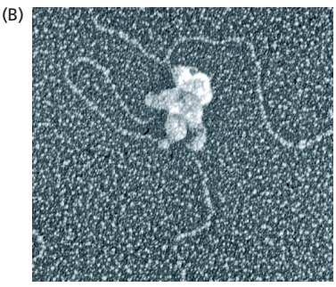
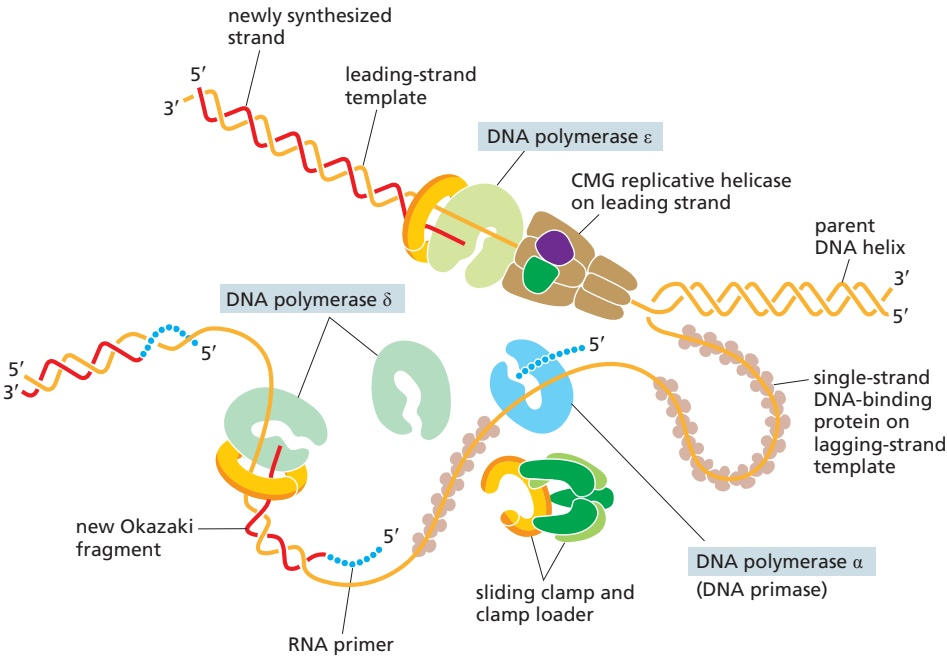
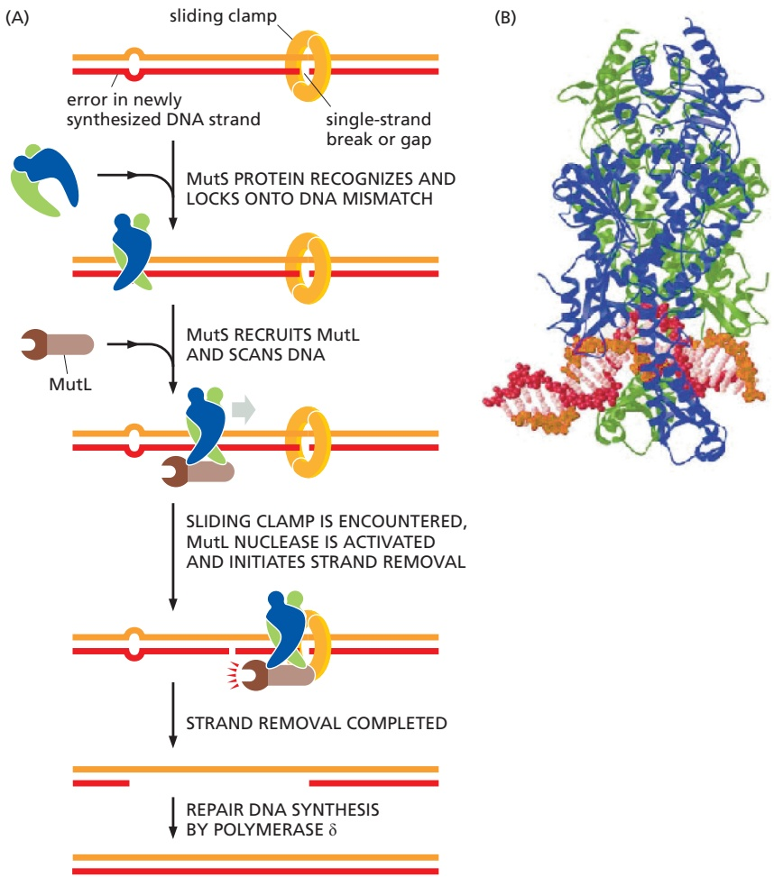
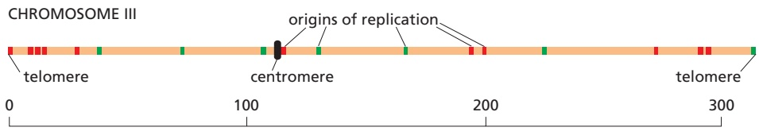

Figure 5–18 A bacterial replication fork. (A) In this case, a single DNA polymerase molecule synthesizes the leading strand while two DNA polymerases are used—in alternating fashion—for lagging-strand DNA synthesis. All of these polymerase molecules, which are identical, are held in place at the fork by flexible “arms” that extend from the clamp loader. Additional interactions (for example, between the DNA helicase and primase) ensure that all the individual components function together as a well-coordinated protein machine (Movie 5.4). (B) An electron micrograph showing the replication machine from the bacteriophage T4 as it moves along a template synthesizing DNA behind it. (C) An interpretation of the micrograph is given in the sketch: note especially the DNA loop on the lagging strand. Apparently, during the preparation of this sample for electron microscopy, the replication proteins became partly detached from the very front of the replication fork. (B, from P.D. Chastain et al., J. Biol. Chem. 278:21276–21825, 2003. With permission from American Society for Biochemistry and Molecular Biology.)

gap is filled in by DNA repair enzymes that operate behind the replication fork (see Figure 5–11).

## DNA Replication Is Fundamentally Similar in Eukaryotes and Bacteria

Much of what we know about DNA replication was first derived from studies of purified bacterial and bacteriophage multienzyme systems capable of DNA replication in vitro. The development of these systems in the 1970s was greatly facilitated by the prior isolation of mutants in a variety of replication genes; these mutants were exploited to identify and purify the corresponding replication proteins. The first eukaryotic replication system that accurately replicated DNA in vitro was described in the mid-1980s, and mutations in genes encoding nearly all of the replication components have now been isolated and analyzed in the yeast Saccharomyces cerevisiae. As a result, much is known about the detailed enzymology of DNA replication in eukaryotes, and it is clear that the fundamental features of DNA replication—including replication-fork geometry and the use of $5 ^ { \prime } { \rightarrow } 3 ^ { \prime }$ DNA polymerases, helicases, clamps, clamp loaders, and single-strand binding proteins—are similar.

Figure 5–19 Schematic diagram of a eukaryotic replication fork. Unlike the bacterial replication proteins, those from eukaryotes are thought to function largely independently, perhaps accounting for the slower speed of the eukaryotic replication fork (Movie 5.5). Note that the eukaryotic CMG helicase moves unidirectionally along the leading-strand template, whereas the bacterial helicase discussed earlier moves in one direction along the lagging-strand template (see Figure 5–18). In both cases, the DNA duplex is rapidly pried apart at the front of the moving replication fork by harnessing the energy of ATP hydrolysis.

However, there are some important differences in how bacteria and eukaryotes replicate their DNA. Perhaps most important, eukaryotes use three different kinds of DNA polymerase at each replication fork (**Figure 5–19**). Polymerase ε (Polε) synthesizes the leading strand, whereas Polα and Polδ synthesize the lagging-strand Okazaki fragments. Each type of polymerase has special properties that make it well suited for its job. Polε binds to both the sliding clamp and the replicative helicase, allowing it to synthesize very long stretches of leading-strand DNA without dissociating. Polα includes DNA primase as one of its subunits, which begins all new chains by synthesizing a short length of RNA. This RNA is extended by a different subunit of Polα, which adds only about 20 nucleotides of DNA before dissociating. Finally, Polδ, which is loaded in conjunction with a sliding clamp, takes over and completes synthesis of each Okazaki fragment to produce a total length of about 200 nucleotides.

The use of three different kinds of DNA polymerase at the replication fork is part of a trend toward higher complexity observed for eukaryotic DNA replication compared to that of bacteria. As another example, the eukaryotic single-strand binding protein is formed from three different subunits, while only a single subunit is found in bacteria. Likewise, the eukaryotic replicative helicase (known as the CMG helicase) is composed of 11 different protein subunits, while the bacterial enzyme is a hexamer of 6 identical subunits. We do not know why the eukaryotic replication machinery is so much more complex than that of bacteria; however, there are several possibilities. In eukaryotes, DNA replication must be coordinated with the elaborate process of mitosis; it must also deal with DNA packaged into nucleosomes, topics we discuss in the next part of the chapter. It is also possible that the difference in complexity between bacteria and eukaryotes largely reflects evolutionary pressure for bacteria to make do with fewer genes.

Another important distinction between eukaryotic and bacterial replication protein complexes lies in the detailed structures of their individual protein components. With the exception of the sliding clamp, the replication proteins in bacteria have completely different structures and amino acid sequences than those of their eukaryotic counterparts. The simplest interpretation of this surprising fact is that, over hundreds of millions of years, the DNA replication machinery in eukaryotes and bacteria evolved independently, yet converged on the same basic mechanisms. This situation is in contrast to other fundamental processes in the cell, such as transcription and translation, where the fundamental components (RNA polymerase and the ribosome) are very similar between bacteria and eukaryotes—and where the structures are conserved from an ancient, common ancestor.

## A Strand-directed Mismatch Repair System Removes Replication Errors That Remain in the Wake of the Replication Machine

Because bacteria such as E. coli are capable of dividing once every 30 minutes, it is relatively easy to screen large populations to find a rare mutant cell that is altered in a specific process. One interesting class of mutants consists of those with alterations in so-called mutator genes, which greatly increase the rate of spontaneous mutation. Not surprisingly, one such mutant makes a defective form of the 3′-to-5 proofreading exonuclease that is a part of the DNA polymerase enzyme (see Figures 5–8 and 5–9). The mutant DNA polymerase no longer proofreads effectively, and many replication errors that would otherwise have been removed accumulate in the DNA.

The study of other E. coli mutants exhibiting abnormally high mutation rates uncovered an additional proofreading system, common to all cells on Earth, that removes those rare replication errors that were made by the polymerase and missed by its proofreading exonuclease. These errors leave mismatched base pairs behind the replication fork, which are subsequently recognized and corrected by a **strand-directed mismatch repair** system. This system picks out mismatches from normal DNA by monitoring their potential to distort the DNA double helix, which is greatly increased by the misfit between noncomplementary base pairs. However, if the repair system simply recognized a mismatch in newly replicated DNA and randomly corrected one of the two mismatched nucleotides, it would mistakenly “correct” the original template strand to match the error exactly half the time, thereby failing to lower the overall error rate. To be effective, such a proofreading system must be able to remove only the nucleotide on the newly synthesized strand, where the error occurred.

The strand-distinction mechanism used by the mismatch proofreading system in E. coli depends on the methylation of selected A residues in the DNA. Methyl groups are added to all A residues in the sequence GATC, but not until some time after the GATC has been synthesized. As a result, the only unmethylated GATC sequences lie in the newly synthesized strands just behind a replication fork. The recognition of these unmethylated GATCs (which are base-paired to methylated GATCs) allows the new DNA strands to be transiently distinguished from old ones, as required if their mismatches are to be selectively removed. The five-step error-correction process involves recognition of a mismatch, identification of the newly synthesized strand, excision of the portion containing the misincorporated nucleotide, resynthesis of the excised segment using the old strand as a template, and ligation to seal the DNA backbone. This strand-directed mismatch repair system reduces the number of errors made during DNA replication by an additional factor of 100–1000 (see Table 5–1, p. 260).

A similar mismatch proofreading system functions in eukaryotic cells, but it uses a different way to distinguish the newly synthesized DNA strands from the parent strands. On the lagging strand, the newly synthesized DNA will contain transient single-strand gaps before the series of Okazaki fragments are processed and ligated together. Each gap will usually carry a sliding clamp, which remains on the DNA after the DNA polymerase has dissociated from it to begin the next fragment. Together, the clamp and the single-strand break signal to the mismatch repair proteins to correct the mismatch using the parent DNA strand as the template (**Figure 5–20**).

Figure 5–20 Strand-directed mismatch repair in eukaryotes. (A) The MutS protein binds to a mismatched base pair, recruits the MutL protein, and the complex scans the nearby DNA for a gap and a sliding clamp whose orientation determines which strand is to be cut and its nucleotides replaced. When these are encountered, MutL is activated and begins to cleave the DNA. In most organisms, MutL is joined by another nuclease and, together, they remove the newly synthesized DNA starting at the gap and extending past the mismatch. The gap is then filled in by DNA polymerase δ and sealed by DNA ligase. (B) The structure of the MutS protein bound to a DNA MBoC7 m5.19/5.20mismatch. This protein is a dimer, which grips the DNA double helix as shown, kinking the DNA at the mismatched base pair. It seems that the MutS protein scans the DNA for mismatches by testing for sites that can be readily kinked, which are those with an abnormal base pair. (PDB code: 1EWQ.)

The two faces of the clamp differ, and the clamp loader always loads the clamp in the same orientation with respect to the 3′ end of the previously synthesized Okazaki fragment. Because all the clamps on the DNA “face” in the same direction relative to the replication process, the oriented clamps can be used by the mismatch repair machinery to distinguish newly synthesized DNA from parent DNA. It is not known for certain how strand discrimination occurs on the leading strand (where gaps in newly synthesized DNA should be rare), but because oriented sliding clamps are also left behind by the leading-strand polymerase, they can signal old from new DNA in the same way that they do on the lagging strand. The recent discovery of a correction system that removes misincorporated ribonucleotides suggests a further possibility for distinguishing newly synthesized DNA from parent DNA, as we discuss in the next section.

Mismatch correction is crucial for all cells; its importance for humans is seen in individuals who inherit one defective copy of a mismatch repair gene (along with a functional gene on the other copy of the chromosome). These individuals have a marked predisposition for certain types of cancers. For example, in a type of colon cancer called hereditary nonpolyposis colorectal cancer (HNPCC), a spontaneous deleterious mutation of the one functional gene will produce a clone of somatic cells that, because they are deficient in mismatch proofreading, accumulate mutations unusually rapidly. Because most cancers arise in cells that have accumulated many mutations (as discussed in Chapter 20), cells deficient in mismatch proofreading have a greatly enhanced chance of becoming cancerous. Fortunately, most of us inherit two good copies of each gene that encodes a mismatch proofreading protein; this protects us, because it is highly unlikely that both copies will become mutated in the same cell.

## The Accidental Incorporation of Ribonucleotides During DNA Replication Is Corrected

We have seen that cells have several ways to correct mistakes where the wrong deoxynucleotide has been incorporated in newly replicated DNA. Occasionally, however, DNA polymerases make a different kind of mistake, one that is not caused by improper base-pairing: in this case, they accidently incorporate a ribonucleotide instead of a deoxyribonucleotide. These molecules differ by a single –OH group in the sugar portion of the nucleotide. Yet, when incorporated into DNA, they weaken the DNA chain at that point, rendering it highly susceptible to breakage. If left unrepaired, these “weak links” would cause high mutation rates and genome rearrangements. Even if it does not cause a break, an incorporated ribonucleotide distorts the DNA double helix and can stall some polymerases during the next cycle of DNA replication.

Although DNA polymerases much prefer deoxyribonucleotides over ribonucleotides (by a factor of about a million), the concentration of ribonucleotides in the cell is much higher than that of their deoxy counterparts, as much as 500-fold for ATP, which has many different uses in the cell. This concentration imbalance means that a ribonucleotide is accidentally incorporated approximately once per several thousand nucleotides of DNA synthesized. These mistakes are corrected by specific nucleases that cleave the DNA chain when they encounter a ribonucleotide, leading to the excision of the ribonucleotide and its replacement by DNA, much in the same way that RNA primers are replaced by DNA to complete lagging-strand synthesis (see Figure 5–11). Because this repair process produces gaps only in newly synthesized DNA, it has been proposed that these transient lesions help the mismatch repair system “know” which strand to repair; in particular, these cues may be especially important on the leading strand.

## DNA Topoisomerases Prevent DNA Tangling During Replication

As a replication fork moves along double-stranded DNA, it creates what has been called the “winding problem.” The two parent strands that are wound around each other must be unwound and separated for replication to occur. For every 10 nucleotide pairs replicated at the fork, one complete turn of the parent double helix must be unwound. In principle, this unwinding can be achieved by rapidly rotating the entire chromosome ahead of a moving fork; however, this is energetically highly unfavorable (particularly for long chromosomes). Instead, the DNA in front of a replication fork becomes overwound (**Figure 5–21**). This overwinding is continually relieved by enzymes known as DNA topoisomerases.

A **DNA topoisomerase** can be viewed as a reversible nuclease that adds itself covalently to a DNA backbone phosphate, thereby breaking a phosphodiester bond in a DNA strand. This reaction is reversible, and the phosphodiester bond re-forms as the protein leaves.

One type of topoisomerase, called topoisomerase I, produces a transient single-strand break; this break in the phosphodiester backbone allows the two sections of DNA helix on either side of the nick to rotate freely relative to each other, using the phosphodiester bond in the strand opposite the nick as a swivel point (**Figure 5–22**). Any tension in the DNA helix will drive this rotation in the direction that relieves the tension. As a result, DNA replication can occur withMBoC7 e6.21/5.21 the rotation of only a short length of helix—the part just ahead of the fork. Because the covalent linkage that joins the DNA topoisomerase protein to a DNA phosphate retains the energy of the cleaved phosphodiester bond, resealing is rapid and does not require additional energy input. In this respect, the rejoining mechanism differs from that catalyzed by the enzyme DNA ligase, discussed previously (see Figure 5–12).

(A) in the absence of topoisomerase, the DNA cannot rapidly rotate, and torsional stress builds up

Figure 5–21 The “winding problem” that arises during DNA replication. (A) For a bacterial replication fork moving at 500 nucleotides per second, the parent DNA helix ahead of the fork must rotate at about 50 revolutions per second. The brackets represent about 20 turns of DNA. (B) If the ends of the DNA double helix remain fixed (or difficult to rotate), tension builds up in front of the replication fork as it becomes overwound. Some of this tension can be taken up by supercoiling, whereby the DNA double helix twists around itself. However, if the tension continues to build up, the replication fork will eventually stop because further unwinding requires more energy than the DNA helicase at the fork can provide. (C) DNA topoisomerases relieve this stress by generating temporary singlestrand breaks in the DNA, which allow rapid rotation around the single strands opposite the break.

(C) torsional stress ahead of the helicase is relieved by free rotation of DNA around the phosphodiester bond opposite the single-strand break; the same DNA topoisomerase molecule that produced the break reseals it

A second type of DNA topoisomerase, topoisomerase II, forms a covalent linkage to both strands of the DNA helix at the same time, making a transient double-strand break in the helix. These enzymes are activated by sites on chromosomes where two double helices cross over each other, such as those generated by supercoiling in front of a replication fork (see Figure 5–21B). As illustrated in **Figure 5–23**, once a topoisomerase II molecule binds to such a crossing site, the protein uses ATP hydrolysis to perform the following set of reactions: (1) it breaks one double helix reversibly to create a DNA “gate”; (2) it causes the second, nearby double helix to pass through this opening; and (3) it then reseals the break and dissociates from the DNA. At crossover points generated by supercoiling, passage of the double helix through the gate occurs in the direction that will reduce supercoiling. In this way, type II topoisomerases—like type I topoisomerases—can relieve the overwinding tension generated in front of a replication fork.

Their reaction mechanism also allows type II DNA topoisomerases to efficiently separate any intertwined DNA molecules. This ability of topoisomerase II is especially important for preventing the severe DNA tangling problems that would otherwise arise from DNA replication. This role is nicely illustrated by mutant yeast cells that produce, in place of the normal topoisomerase II, a version that is inactive above 37°C. When the mutant cells are warmed to this temperature, their daughter chromosomes remain intertwined after DNA replication and are unable to separate. The enormous usefulness of topoisomerase II for untangling

topoisomerase II

type I DNA topoisomerase with tyrosine at the active site

DNA topoisomerase covalently attaches to a DNA phosphate, thereby breaking a phosphodiester linkage in one DNA strand

spontaneous re-formation of the phosphodiester bond regenerates both the DNA helix and the DNA topoisomerase

two DNA double helices that are interlocked

Figure 5–22 The reversible DNA nicking reaction catalyzed by a DNA topoisomerase I enzyme. As indicated, these enzymes transiently form a single covalent bond with DNA; this allows free rotation of the DNA around the covalent backbone bonds linked to the blue phosphate. On reversal of the reaction, the enzyme and the DNA are restored, the only MBoC7 m5.21/5.22difference being the relaxation of tension in the DNA.

topoisomerase recognizes the entanglement and makes a reversible covalent attachment to the two opposite strands of one of the double helices (orange) creating a doublestrand break and forming a protein gate

the topoisomerase gate opens to let the second DNA helix pass

the gate shuts releasing the red helix

reversal of the covalent attachment of the topoisomerase restores an intact orange double helix

Figure 5–23 The DNA-helix-passing reaction catalyzed by DNA topoisomerase II. Unlike type I topoisomerases, type II enzymes hydrolyze ATP, which is needed to release and reset the enzyme after each cycle. The small yellow circles represent the 5′ phosphates in the DNA backbone that become covalently bonded to the topoisomerase. Type II topoisomerases are especially important for rapidly dividing cells; partly for that reason, they are effective targets for a large class of antibiotics, the fluoroquinolones, used to treat many different kinds of bacterial infections. These drugs inhibit bacterial topoisomerase II at the third step in the figure and thereby produce high levels of double-strand breaks that are lethal to rapidly dividing cells.

chromosomes before mitosis begins can readily be appreciated by anyone who has struggled to remove a severe tangle from a fishing line—or from a large ball of thread—without the aid of scissors.

## Summary

DNA replication takes place at a Y-shaped structure called a replication fork. Self-correcting DNA polymerase enzymes catalyze nucleotide polymerization in a 5-to-3 direction, copying a DNA template strand with remarkable fidelity. Because the two strands of a DNA double helix are antiparallel, this 5-to-3 DNA synthesis can take place continuously on only one of the strands at a replication fork (the leading strand). On the lagging strand, short DNA fragments must be made by a “backstitching” process. Because the self-correcting DNA polymerases cannot start a new chain, these lagging-strand DNA fragments are primed by short RNA primer molecules that are subsequently erased and replaced with DNA.

DNA replication requires the cooperation of many proteins. These include (1) DNA polymerases and DNA primases to catalyze nucleoside triphosphate polymerization; (2) DNA helicases and single-strand DNA-binding (SSB) proteins to help in opening up the DNA helix so that it can be copied; (3) clamps and clamp loaders to enable DNA polymerases to copy longer stretches of DNA; (4) DNA ligases and enzymes that degrade RNA primers to seal together the discontinuously synthesized lagging-strand DNA fragments; and (5) DNA topoisomerases to help to relieve helical winding and DNA tangling problems. Many of these proteins associate with each other at a replication fork to form a highly efficient “replication machine,” through which the activities and spatial movements of the individual components are coordinated.

The self-correcting DNA polymerases make mistakes only rarely when copying DNA; when they do, a variety of enzymes inspect the DNA shortly after it is made and correct any mishaps. Given the number of proteins dedicated to the task, copying DNA with extreme accuracy is clearly of great importance to all cells on Earth.

## THE INITIATION AND COMPLETION OF DNA REPLICATION IN CHROMOSOMES

We have seen how a set of replication proteins rapidly and accurately generates two daughter DNA double helices behind a replication fork. But how is this replication machinery assembled in the first place, and how are replication forks created on an intact, double-strand DNA molecule? In this part of the chapter, we discuss how cells initiate DNA replication and how they carefully regulate this process to ensure that it takes place only at the proper time and chromosomal sites. We also discuss special problems that the replication machinery in eukaryotic cells must overcome including the need to replicate the enormously long DNA molecules found in eukaryotic chromosomes, as well as the need to copy DNA molecules that are tightly complexed with nucleosomes.

## DNA Synthesis Begins at Replication Origins

As discussed previously, the DNA double helix is normally very stable: the two DNA strands are locked together firmly by the hydrogen bonds formed between the bases on each strand. To begin DNA replication, the double helix must first be opened up and the two strands separated to expose unpaired bases. As we shall see, the process of DNA replication is begun by special initiator proteins that bind to double-stranded DNA and pry the two strands apart, breaking the hydrogen bonds between the bases.

The positions at which the DNA helix is first opened are called **replication origins** (**Figure 5–24**). In simple cells like those of bacteria or budding yeast, origins are specified by DNA sequences several hundred nucleotide pairs in length. This DNA contains both short sequences that attract initiator proteins and stretches of DNA that are especially easy to open. We saw in Figure 4–5A that an A-T base pair is held together by fewer hydrogen bonds than is a G-C base pair. Therefore, DNA rich in A-T base pairs is relatively easy to pull apart, and regions of DNA enriched in A-T base pairs are typically found at replication origins.

Figure 5–24 A replication bubble formed by replication-fork initiation. This diagram outlines the major steps in the initiation of replication forks at replication origins. In the last step, two replication forks move away from each other, separated by an expanding replication bubble.

Although the basic process of replication-fork initiation depicted in Figure 5–24 is fundamentally the same for bacteria and eukaryotes, the detailed way in which this process is performed and regulated differs considerably between these two groups of organisms. We first consider the case in bacteria and then turn to the more complex situation found in yeasts, mammals, and other eukaryotes.

## Bacterial Chromosomes Typically Have a Single Origin of DNA Replication

The genome of E. coli is contained in a single circular DNA molecule of 4.6 × 106 nucleotide pairs. DNA replication begins at a single origin of replication, and the two replication forks assembled there proceed (at approximately 1000 nucleotides per second) in opposite directions until they meet up roughly halfway around the chromosome (**Figure 5–25**). The only point at which E. coli can control DNA replication is initiation: once the forks have been assembled at the origin, they synthesize DNA at a relatively constant speed until replication is finished. Therefore, it is not surprising that the initiation step of DNA replication is tightly regulated. The process begins when specialized initiator proteins (in their ATP-bound state) bind in multiple copies to specific DNA sites located at the replication origin, wrapping the DNA around the proteins to form a large protein–DNA filament that introduces torsional stress on the DNA double helix (**Figure 5–26**). This stress is partially relieved by melting of the adjacent AT-rich sequences. The protein–DNA complex then attracts two DNA helicases, each bound to a helicase loader, and these are placed—facing in opposite directions— around adjacent DNA single strands whose bases have been exposed by the assembly of the initiator protein–DNA complex. The helicase loader is analogous to the clamp loader we encountered earlier; it has the additional job of keeping the helicase in an inactive form until it is properly loaded. Once the helicases are properly positioned on DNA, the loaders dissociate and the helicases begin to unwind DNA, exposing enough single-stranded DNA for DNA primases to synthesize the first RNA primers. This quickly leads to the assembly of the remaining replication proteins to create two replication forks that move in opposite directions away from the replication origin, each synthesizing new DNA as they travel.

In E. coli, the interaction of the initiator proteins with the replication origin is carefully regulated, with initiation occurring only when sufficient nutrients are available for the bacterium to complete an entire round of replication. Initiation is also controlled to ensure that only one round of DNA replication occurs for each cell division. After replication is initiated, the initiator protein is inactivated by hydrolysis of its bound ATP molecule, and the origin of replication experiences a refractory period. The refractory period is caused by a delay in the methylation of newly incorporated A nucleotides in the origin (**Figure 5–27**). Initiation cannot occur again until the A’s are methylated and the initiator protein is restored to its ATP-bound state, conditions that are met only when the cell is capable of carrying out a new round of DNA replication.

## Eukaryotic Chromosomes Contain Multiple Origins of Replication

We have seen how two replication forks begin at a single replication origin in bacteria and proceed in opposite directions, moving away from the origin until all of the DNA in the single circular chromosome is replicated. The bacterial genome is sufficiently small for these two replication forks to duplicate the genome in about

2 circular daughter DNA molecules

Figure 5–25 DNA replication of a bacterial genome. It takes E. coli about 30 minutes to duplicate its genome of 4.6 × 106 nucleotide pairs. For simplicity, Okazaki fragments are not shown on the lagging strand.

30 minutes. Because of the much greater size of most eukaryotic chromosomes, a different strategy is required to allow their replication in a timely manner.

A method for determining the general pattern of eukaryotic chromosome replication was developed in the early 1960s that is similar to the strategy we saw earlier for visualizing bacterial replication (see Figure 5–6). Human cells growing

Figure 5–26 The proteins that initiate DNA replication in bacteria. The mechanism shown was established by studies in vitro with mixtures of highly purified proteins. For E. coli DNA replication, the major initiator protein (purple), the helicase (yellow), and the primase (blue) are the dnaA, dnaB, and dnaG proteins, respectively. In the first step, many molecules of the initiator protein bind to specific DNA sequences at the replication origin and destabilize the double helix by forming a filamentous structure in which the DNA is wrapped around the protein. Next, two helicases are brought in by helicase-loading proteins (the dnaC proteins; brown), which inhibit the helicases until they are properly loaded at the replication origin. (The helicase-loading proteins prevent the replicative DNA helices from inappropriately entering other singlestrand stretches of DNA in the bacterial genome.) Aided by single-strand binding protein (not shown), the loaded helicases further separate the DNA strands, thereby enabling primases to enter and synthesize initial primers. In subsequent steps, two complete replication forks are assembled at the origin and move in opposite directions away from the replication origin. The initiator proteins are displaced as the lefthand fork moves through them.

## Figure 5–27 Methylation of the E. coli replication origin creates a refractory period for DNA initiation. DNA

methylation occurs at GATC sequences, 11 of which are found in the origin of replication (spanning approximately 250 nucleotide pairs). In its hemimethylated state (that is, one strand of the DNA methylated, the other unmethylated), the origin of replication is bound by an inhibitor protein (Seq A, not shown), which blocks the ability of the initiator proteins to unwind the origin DNA. About 15 minutes after replication is initiated, the hemimethylated origins become fully methylated by a DNA methylase enzyme; Seq A then dissociates allowing the origin of replication to become active.

A single enzyme, the Dam methylase, is responsible for methylating all E. coli GATC sequences. As discussed earlier in the chapter, a lag in methylation after the replication of GATC sequences is also used by the E. coli mismatch proofreading system to distinguish the newly synthesized DNA strand from the parent DNA strand; in that case, the relevant GATC sequences are scattered throughout the chromosome, and they are not bound by Seq A.

in culture are labeled for a short time with 3H-thymidine so that the DNA synthesized during this period becomes highly radioactive. The cells are then gently lysed, and the DNA is stretched on the surface of a glass slide coated with a photographic emulsion. Development of the emulsion in the dark reveals the pattern of labeled DNA through a technique known as autoradiography. The time allotted for radioactive labeling is chosen to allow each replication fork to move several micrometers along the DNA, so that the replicated DNA can be detected in the light microscope as lines of silver grains (radioactivity exposes photographic emulsion much as light does), even though the DNA molecule itself is too thin to be visible. In this way, both the rate and the direction of replication-fork movement can be determined (**Figure 5–28**). From the rate at which tracks of replicated DNA increase in length with increasing labeling time, the eukaryotic replication forks are estimated to travel at about 50 nucleotides per second. This is approximately twentyfold slower than the rate at which bacterial replication forks move, possibly reflecting the increased difficulty of replicating DNA that is packaged in chromatin.

An average-size human chromosome contains a single linear DNA molecule of about 150 million nucleotide pairs. It would take 0.02 seconds/nucleotide × $1 5 0 \times 1 0 ^ { 6 }$ nucleotides $= 3 . 0 \times 1 0 ^ { 6 }$ seconds (about 35 days) to replicate such a DNA molecule from end to end with a single replication fork moving at a rate of 50 nucleotides per second. As expected, therefore, the autoradiographic experiments just described reveal that many forks, belonging to separate replication bubbles, are moving simultaneously on each eukaryotic chromosome.

Much more sophisticated methods now exist for monitoring DNA replication initiation and tracking the movement of DNA replication forks across whole genomes. If a population of cells can be synchronized so they all begin DNA replication at the same time, the amount of each segment of DNA in the genome can be determined at specific time points using one of the DNA sequencing methods described in Chapter 8. Because a segment of a genome that has been replicated will contain twice as much DNA as an unreplicated segment, replication-fork initiation and fork movement can be accurately monitored across an entire genome.

Experiments of this type have shown the following: (1) Approximately 30,000–50,000 origins of replication are used each time a human cell divides. (2) The human genome has many more (perhaps tenfold more) potential origins than this, and different cell types use different sets of origins. This excess of origins may allow a cell to coordinate its active origins with other features of its chromosomes such as which genes are being expressed. The excess origins also provide “backups” in case a primary origin fails. (3) Origins of replication do not all “fire” simultaneously; rather, they often are activated in a prescribed order in a given cell type. (4) Regardless of when a given origin fires or where on the chromosome it is located, the replication forks all move at approximately the same speed. (5) As in bacteria, replication forks are formed in pairs and create an expanding

Figure 5–28 The experiments that first demonstrated the pattern in which replication forks are formed and move on eukaryotic chromosomes. The new DNA made in human cells in culture was labeled briefly with a pulse of highly radioactive thymidine (3H-thymidine). (A) In this experiment, the cells were lysed, and the DNA was stretched out on a glass slide that was subsequently covered with a photographic emulsion. After several months, the emulsion was developed, revealing a line of silver grains over the radioactive DNA. The brown DNA in this figure is shown only to help with the interpretation of the autoradiograph; the unlabeled DNA is invisible in such experiments. (B) This experiment was the same except that a further incubation in unlabeled medium allowed additional DNA, with a lower level of radioactivity, to be replicated. The pairs of dark tracks in B were found to have silver grains tapering off in opposite directions, demonstrating bidirectional fork movement from a central replication origin where a replication bubble forms (see Figure 5–24). A replication fork is thought to stop only when it encounters a replication fork moving in the opposite direction or when it reaches the end of the chromosome; in this way, all the DNA is eventually replicated.

replication bubble as they move in opposite directions away from a common point of origin, stopping only when they meet a replication fork moving in the opposite direction or when they reach a chromosome end. In this way, many replication forks operate independently on each chromosome and yet form two complete daughter DNA helices.

## In Eukaryotes, DNA Replication Takes Place During Only One Part of the Cell Cycle

When growing rapidly, bacteria replicate their DNA nearly continually. In contrast, DNA replication in most eukaryotic cells occurs only during a specific part of the cell-division cycle, called the DNA synthesis phase, or **S phase** (**Figure 5–29**). In a mammalian cell, the S phase typically lasts for about 8 hours; in simpler eukaryotic cells such as yeasts, the S phase can be as short as 40 minutes. By its end, each chromosome has been replicated to produce two complete copies, which remain joined together at their centromeres until the M phase (M for mitosis), which soon follows. Although different origins of replication fire at different times, all DNA replication is begun and completed during S phase. In Chapter 17, we describe the control system that runs the cell cycle, and we explain how entry into each phase of the cycle requires the cell to have successfully completed the previous phase.

In the following sections, we explore how DNA replication begins on eukary otic chromosomes and how this event is coordinated with the cell cycle.

## Eukaryotic Origins of Replication Are “Licensed” for Replication by the Assembly of an Origin Recognition Complex

Having seen that a eukaryotic chromosome is replicated using many origins of replication, each of which fires at a characteristic time in S phase of the cell cycle, we turn to the nature of these origins of replication. We saw earlier in this chapter that replication origins have been precisely defined in bacteria as specific DNA sequences that attract initiator proteins, which then assemble the DNA replication machinery. We shall see that this is also the case for the singlecell budding yeast S. cerevisiae, but it appears not to be strictly true for many other eukaryotes.

For budding yeast, the location of every origin of replication on each chromosome has been determined. The particular chromosome shown in **Figure 5–30**—chromosome III from S. cerevisiae—is one of the smallest chromosomes known, with a length less than 1/100 that of a typical human chromosome. Its major origins are spaced an average of 30,000 nucleotide pairs apart, but only a subset of these origins is used by a given cell. Nonetheless, this chromosome can be replicated in about 15 minutes.

The minimal DNA sequence required for directing DNA replication initiation in S. cerevisiae has been determined by taking a segment of DNA that spans an origin of replication and testing smaller and smaller DNA fragments for their ability to function as origins. These DNA sequences that can serve as an origin of replication are found to contain (1) a binding site for a large, multisubunit initiator protein called ORC, for origin recognition complex; (2) a stretch of DNA that is rich in A’s and T’s and therefore easy to pull apart; and (3) at least one binding site for proteins that facilitate ORC binding, probably by adjusting the local chromatin structure.

nucleotide pairs (thousands)

Figure 5–29 The four successive phases of a standard eukaryotic cell cycle. During the G1, S, and G2 phases, the cell grows continually. During M phase growth stops, the nucleus divides, and the cell divides in two. DNA replication is confined to the part of the cell cycle known as S phase. G1 is the gap between M phase and S phase; G2 is the gap between S phase and M phase. Many eukaryotic cells spend only a small fraction of their time in S phase.

Figure 5–30 The origins of DNA replication on chromosome III of the yeast S. cerevisiae. This chromosome, one of the smallest eukaryotic chromosomes known, carries a total of 180 genes. As indicated, it contains 18 replication origins, although they are used with different frequencies. Those in red are typically used in less than 10% of cell divisions, while those in green are used about 90% of the time.