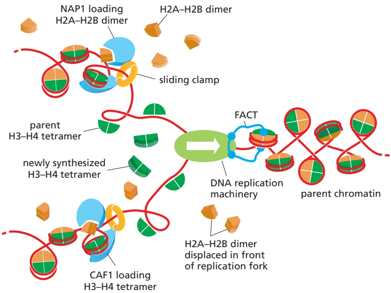
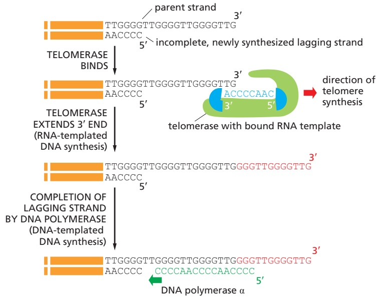
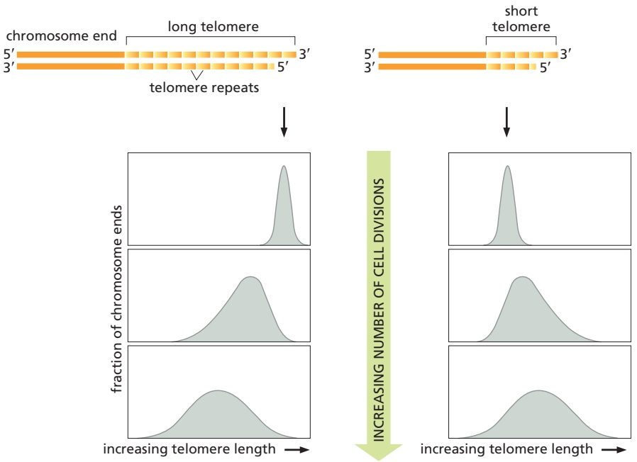
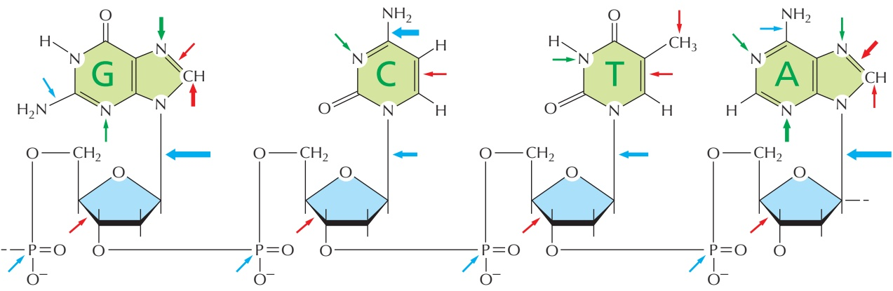
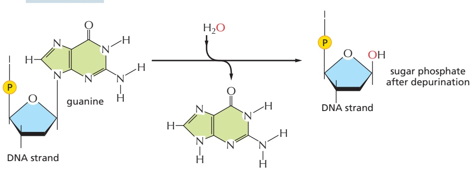
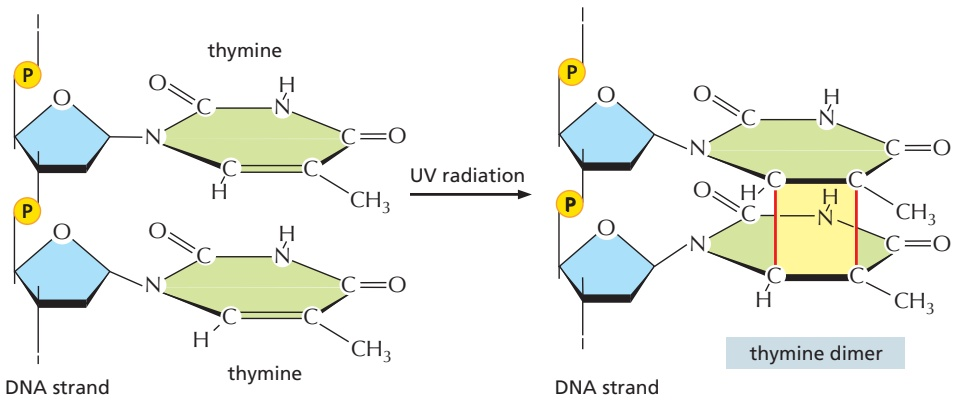

## Features of the Human Genome That Specify Origins of Replication Remain to Be Fully Understood

Compared with the situation in budding yeast, the determinants of replication origins in humans have been difficult to discover. It has been possible to identify specific human DNA sequences, each several thousand nucleotide pairs in length, that are sufficient to serve as replication origins. These origins continue to function when moved to a different chromosomal region by recombinant DNA methods, as long as they are placed in a region where the chromatin is relatively uncondensed. However, comparisons of such DNA sequences have not revealed DNA sequences in common as in the origins of bacteria and yeasts.

Despite this, a human ORC that is very similar to the yeast ORC binds to origins of replication and initiates DNA replication in humans. Many of the other proteins that function in the initiation process in yeast likewise have central roles in humans. The yeast and human initiation mechanisms are thus similar, although some property of the genome other than a specific DNA sequence has the central role in attracting an ORC to a mammalian origin of replication. Origins of replication are often nucleosome-free, and it has been proposed that DNA that is difficult to fold onto a histone core may help define origins of replication. Nearby transcriptional activity on the genome may also play a role in activating certain origins, by altering the local chromatin structures, as we discuss in Chapter 7. This idea helps to explain why different cell types—which express different sets of genes—often use different origins. Consistent with this idea, origins that fire the earliest in S phase tend to be located near highly transcribed regions of the genome.

Finally, origins located in proximity to each other tend to fire together, and it seems likely that the three-dimensional structure of chromosomes organizes origins of replication into domains, such that all the origins in a given domain fire simultaneously. All of these influences probably work together to determine how mammalian origins of replication are selected by the cell, thereby explaining the difficulty scientists have had in precisely defining their salient features.

## Properties of the ORC Ensure That Each Region of the DNA Is Replicated Once and Only Once in Each S Phase

In bacteria, once the initiator protein is properly bound to the single origin of replication, the assembly of the replication forks seems to follow more or less automatically. In eukaryotes, the situation is significantly different because of a profound problem eukaryotes have in replicating chromosomes: with so many places to begin replication, how is the process regulated to ensure that all the DNA is copied once and only once?

The answer lies in how the assembly of the replication-fork protein at the origins of replication is regulated. We discuss this process in more detail in Chapter $1 7 ,$ where we consider the machinery that underlies the cell-division cycle. In brief, during $\mathrm { G _ { 1 } }$ phase, a symmetrical complex of two incomplete helicases is loaded onto DNA by the bound ORC. Then, upon passage from $\mathrm { G _ { 1 } }$ phase to S phase, specialized protein kinases come into play and direct the final assembly of the two replicative helicases, positioning one on each of the two complementary DNA single strands, where they move in opposite directions to begin opening the DNA double helix. At this point, the additional replication proteins are brought to the DNA, and two complete replication forks move in opposite directions away from the origin of replication (**Figure 5–31**).

The same protein kinases that trigger the final assembly of the helicases pre-vent the binding of new helicases to that origin until the next M phase resets the entire cycle (for details, see pp. 1043–1045). They do this, in part, by phosphorylating ORC, rendering it unable to accept new helicases. Thus, the kinases specify a single window of opportunity for precursor helicases to be loaded at origins of replication $( \mathrm { G _ { 1 } }$ phase, when kinase activity is low) and a second window for

Figure 5–31 DNA replication initiation in eukaryotes. This mechanism ensures that each origin of replication is activated only once per cell cycle. An origin of replication can be used only if two Mcm helicases (which form the enzymatic cores of the replicative helicases) are loaded in G1 phase. At the beginning of S phase, specialized kinases phosphorylate both the Mcm helicases and ORC, activating the former and inactivating the latter. These kinases also guide the assembly of additional proteins that complete the helicases to form the fully active replicative helicases, known as the CMG helicases. New Mcm helicases cannot be loaded at the origin until the cell progresses through mitosis to the next G1 phase, when ORC is dephosphorylated. The name CMG derives from Cdc45, Mcm, and GINS, the components of the active helicase (see Figure 5–19).

them to be assembled into their active form (S phase, when kinase activity is high). Because these two phases of the cell cycle are mutually exclusive and occur in a prescribed order, each origin of replication can fire only once during each cell cycle.

Because there are many more potential replication origins on a eukaryotic chromosome than are actually used in any one cell cycle (see Figure 5-30), the DNA at many ORC-bound replication origins will be replicated by forks formed at a neighboring region of the chromosome. Thus, preventing any single origin from firing more than once during an S phase is not enough to avoid the re-replication of DNA in eukaryotes. In addition, any ORC–DNA complex that is passed by a replication fork must be inactivated, and it is the combination of the two mechanisms that guarantees that each region of the DNA is replicated once and only once in each S phase.

## New Nucleosomes Are Assembled Behind the Replication Fork

Several additional aspects of DNA replication are specific to eukaryotes compared with bacteria. As discussed in Chapter 4, eukaryotic chromosomes are composed of roughly equal mixtures of DNA and protein. Chromosome duplication therefore requires not only the replication of DNA but also the synthesis of new chromosomal proteins and their assembly onto the DNA behind each replication fork. Although we are far from understanding this process in detail, we are beginning to learn how the fundamental unit of chromatin packaging, the nucleosome, is duplicated. The cell requires a large amount of new histone protein, approximately equal in mass to the newly synthesized DNA, each time it divides. For this reason, most eukaryotic organisms possess multiple copies of the gene for each histone. Vertebrate cells, for example, have about 20 repeated gene sets, most containing the genes that encode all five histones (H1, H2A, H2B, H3, and H4).

Unlike most proteins, which are made continually, histones are synthesized mainly in S phase, when the level of histone mRNA increases about fiftyfold as a result of both increased transcription and decreased mRNA degradation. The major histone mRNAs are degraded within minutes when DNA synthesis stops at the end of S phase. The mechanism depends on special properties of the 3′ ends of these mRNAs, as discussed in Chapter 7. In contrast to their mRNAs, the histone proteins themselves are remarkably stable and may survive for many generations. The tight linkage between DNA synthesis and histone synthesis appears to reflect a feedback mechanism that monitors the level of free histone to ensure that the amount of histone made exactly matches the amount of new DNA synthesized.

As a replication fork advances it must pass through the parent nucleosomes. In the cell, efficient replication requires chromatin remodeling complexes (discussed in Chapter 4) and histone chaperone proteins (discussed below) to destabilize the DNA–histone interfaces. Aided by such specialized proteins, replication forks can transit even highly condensed chromatin. As a replication fork passes through chromatin, the histones are transiently displaced leaving about 600 nucleotide pairs of “free” DNA in its wake. The reestablishment of nucleosomes behind a moving fork occurs in an intriguing way. When a nucleosome is traversed by a replication fork, the histone octamer is broken into an H3–H4 tetramer and two H2A–H2B dimers (discussed in Chapter 4), all of which are released from DNA. The H3–H4 tetramers remain in the vicinity of the fork by loosely binding to several of the proteins at the replication fork (primarily the CMG helicase) and are distributed at random to one or the other daughter duplexes as the fork moves forward. In contrast, the H2A–H2B dimers are released completely from the fork and may diffuse to entirely different chromosomes. Freshly made H3–H4 tetramers are added to the newly synthesized DNA to fill in the “spaces,” and H2A–H2B dimers—half of which are old and half new—are then added at random to complete the nucleosomes behind the fork (**Figure 5–32**). The formation of new nucleosomes behind a replication fork has an important consequence for the process of DNA replication itself. As DNA polymerase δ discontinuously synthesizes the lagging strand (see Figure 5–19), the length of each Okazaki fragment is determined by the point at which DNA polymerase δ is blocked by a newly formed nucleosome. This tight coupling between nucleosome duplication and DNA repli-MBoC7 m5.32/5.32 cation probably explains why the length of Okazaki fragments in eukaryotes (∼200 nucleotides) is approximately the same as the nucleosome repeat length.

The orderly and rapid addition of new H3–H4 tetramers and H2A–H2B dimers behind a replication fork requires **histone chaperones** (also called chromatin assembly factors). These multisubunit complexes bind the highly basic histones and release them on DNA only in the appropriate context. For example, some of the histone chaperones, along with their histone cargoes, are directed to newly replicated DNA through a specific interaction with the sliding clamp (see Figure 5–32). As we have seen, these clamps remain on the DNA behind replication forks, and some appear to linger just long enough for the histone chaperones to complete their tasks. Because they bind so well to histones, some histone chaperones also help to disassemble nucleosomes. Of particular importance to DNA replication is the FACT chaperone, which moves at the front of the replication machinery, disassembling nucleosomes as it moves forward (see Figure 5–32).

Figure 5–32 Formation of nucleosomes behind a replication fork. Parent H3–H4 tetramers remain associated with the fork and are distributed at random to the daughter DNA molecules, with roughly equal numbers inherited by each daughter. In contrast, H2A–H2B dimers are released completely from the fork as it passes. This release begins just in front of the replication fork and is facilitated by the histone chaperone FACT, which moves with the fork. FACT has several globular protein domains connected by flexible linkers and can make multiple contacts with a nucleosome to aid in its disassembly. Additional histone chaperones (NAP1 and CAF1) restore the full complement of histones to daughter molecules using both parent and newly synthesized histones. Although not shown in the figure, it has been proposed that FACT directly hands off parent H3–H4 tetramers to components of the replication machinery, which in turn hand them off to CAF1 chaperones, which deposit them evenly on the two daughter molecules. The way in which histones are distributed behind a replication fork means that some daughter nucleosomes contain only parent histones or only newly synthesized histones, but most are hybrids of old and new. For simplicity, the DNA double helix is shown as a single red line.

## Termination of DNA Replication Occurs Through the Ordered Disassembly of the Replication Fork

We saw earlier in this chapter that E. coli DNA replication begins at a single origin, and two replication forks proceed bidirectionally around the circular genome, meeting at a spot opposite to the origin of replication. Here, the two forks do not simply collide with each other running at full speed; rather, this spot on the E. coli genome has a special DNA sequence that slows down and stalls the movement of each fork, causing them to disassemble. The remaining gaps in the daughter DNA molecules are filled in and sealed by repair DNA polymerases and DNA ligase (see Figures 5–11 and 5–12), and the two completed bacterial genomes are separated using topoisomerases (see Figure 5–23).

As might be expected, the situation in eukaryotes is more complicated. First, each round of replication requires many termination events, roughly as many as there are initiation events at origins of replication. Thus, in mammalian cells, approximately 30,000–50,000 termination events occur in every S phase. Second, the termination of replication forks in eukaryotes is largely independent of any underlying DNA sequence in the genome. Rather, the principal termination signal is a head-on encounter with a fork moving in the opposite direction. When two forks meet, the CMG helicase at each fork is covalently modified by addition of ubiquitin (see Figure 3–65), which causes its disassembly and removal from DNA. Without the helicase, the other replication proteins rapidly dissociate from the fork. Repair DNA polymerase and DNA ligase subsequently fill in and seal any remaining gaps. Eukaryotic replication forks must also contend with the ends of chromosomes. Here, it is believed that the CMG helicase simply slides off the end of the DNA molecule, leading to the dissociation of the other fork proteins. However, replicating DNA to the very end of a chromosome presents a special challenge to the eukaryotic cell, as we describe next.

## Telomerase Replicates the Ends of Chromosomes

We saw earlier in the chapter that synthesis of the lagging strand at a replication fork must occur discontinuously through a backstitching mechanism that produces short DNA fragments attached to RNA primers. The final RNA primer synthesized on the lagging-strand template cannot be replaced by DNA because there is no primer ahead of it to provide a 3′-OH end for the repair polymerase. Without a mechanism to deal with this problem, DNA would be lost from the ends of all chromosomes each time a cell divides.

Bacteria avoid this “end-replication” problem by having circular DNA molecules as chromosomes, as we have seen. Eukaryotes solve it in a different way: they have specialized nucleotide sequences at the ends of their chromosomes that are incorporated into structures called telomeres (discussed in Chapter 4). Telomeres contain many tandem repeats of a short sequence that is similar in organisms as diverse as protozoa, fungi, plants, and mammals. In humans, the sequence of the repeat unit is GGGTTA, and it is repeated roughly a thousand times at each telomere.

Telomere DNA sequences are recognized by sequence-specific DNA-binding proteins that attract an enzyme, called **telomerase**, that replenishes these sequences each time a cell divides. Telomerase recognizes the tip of an existing telomere DNA repeat sequence and elongates it in the 5′-to-3′ direction, using an RNA template that is a component of the enzyme itself to synthesize new DNA copies of the repeat (**Figure 5–33**). The enzymatic portion of telomerase resembles other reverse transcriptases, proteins that synthesize DNA using an RNA template, although, in this case, the telomerase RNA also contributes to the active site and is essential for efficient catalysis. After extension of the parent DNA strand by telomerase, replication of the lagging strand at the chromosome end can be completed by the conventional DNA polymerases, using these extensions as a template to synthesize the complementary strand (**Figure 5–34**).

Figure 5–33 Schematic structure of human telomerase. This large enzyme is composed of 10 protein subunits and an RNA of 451 nucleotides. The RNA forms the scaffold of the complex, provides the template for synthesizing new DNA telomere repeats, and helps form the active site. The synthesis reaction itself is carried out by the reverse transcriptase domain of the protein, shown in light green, in conjunction with the RNA. A reverse transcriptase is a special form of polymerase enzyme that uses an RNA template to make a DNA strand; telomerase is unique in carrying its own RNA template with it. Telomerase also contains several additional protein complexes (some of which are shown in dark green and blue) that are needed to assemble the enzyme and, for many organisms but not humans, to bring it to the ends of chromosomes. (Modified from T.H.D. Nguyen et al., Nature 557: 190–195, 2018.)

Figure 5–34 Telomere replication. Shown here is the reaction that synthesizes the repeating sequences that form the ends of the chromosomes (telomeres) of eukaryotes. The 3′ end of the parent lagging-strand template is extended by RNA-templated DNA synthesis; this allows the incomplete daughter DNA strand that is paired with it to be synthesized to the end of the chromosome. The synthesis of the final bit of lagging strand is carried out by DNA polymerase α, which carries a DNA primase as one of its subunits (Movie 5.6). DNA polymerase α is the same enzyme used to begin the synthesis of each Okazaki fragment on the lagging strand; it begins its synthesis with RNA (not shown) and continues with DNA (green). The telomere sequence illustrated is that of the ciliate Tetrahymena, in which these reactions were first discovered.

Figure 5–35 A t-loop at the end of a mammalian chromosome. (A) Electron micrograph of the DNA at the end of an interphase human chromosome. The chromosome was fixed, deproteinated, and artificially thickened before viewing. The loop seen here is approximately 15,000 nucleotide pairs in length. (B) Schematic diagram of t-loop formation. (A, from J.D. Griffith et al., Cell 97:503–514, 1999. With permission from Elsevier.)

## Telomeres Are Packaged into Specialized Structures That Protect the Ends of Chromosomes

The ends of chromosomes present cells with an additional problem. As we will see in the next part of this chapter, when a chromosome is accidently broken into two pieces, the break is rapidly repaired. Telomeres must clearly be distinguished from these accidental breaks; otherwise, the cell will attempt to “repair”MBoC7 m5.35/5.35 telomeres, generating chromosome fusions and other genetic abnormalities. Telomeres have several features to prevent this from happening.

A specialized nuclease chews back the 5′ end of a telomere leaving a protruding, single-strand 3′ end. This protruding end—in combination with the GGGTTA repeats in telomeres—attracts a group of proteins that form a protective chromosome cap known as shelterin. In particular, shelterin protects telomeres from being treated as damaged DNA. Another feature of telomeres may offer additional protection. When human telomeres are artificially cross-linked and viewed by electron microscopy, structures known as “t-loops” can be observed in which the protruding single-strand end of the telomere loops back and tucks itself into the duplex DNA of the telomere repeat sequence (**Figure 5–35**). An attractive idea is that t-loops are orchestrated by shelterin to help “hide” the very ends of chromosomes.

## Telomere Length Is Regulated by Cells and Organisms

Because the processes that grow and shrink each telomere sequence are only approximately balanced, chromosome ends contain variable numbers of telomeric repeats. Not surprisingly, many cells, including stem cells and germ cells, have homeostatic mechanisms that maintain the number of these repeats within a limited range (**Figure 5–36**).

In most of the dividing somatic cells of humans, however, telomeres gradually shorten, and it has been proposed that this provides a counting mechanism that helps prevent the unlimited proliferation of wayward cells in adult tissues. In its simplest form, this idea holds that our somatic cells start off in the embryo with a full complement of telomeric repeats. These are then eroded to different extents in different cell types. Some stem cells, notably those in tissues that must be replenished at a high rate throughout life—bone marrow or gut lining, for example—retain full telomerase activity. However, in many other types of cells, the level of telomerase is reduced so that the enzyme cannot quite keep up with chromosome duplication. Such cells lose 100–200 nucleotides from each telomere every time they divide. After many cell generations, the descendant cells will inherit chromosomes that lack functioning telomeres, and, as a result of this defect, activate a DNA-damage response causing them to withdraw permanently from the cell cycle and cease dividing—a process called replicative cell senescence (discussed in Chapters 17 and 20). In theory, such a mechanism could provide a

Figure 5–36 A demonstration that yeast cells control the length of their telomeres. In this experiment, the telomere at one end of a particular chromosome is artificially made either longer (left) or shorter (right) than average. After many cell divisions, the chromosome recovers, showing an average telomere length and a length distribution that is typical of the other chromosomes in the yeast cell. A similar feedback mechanism for controlling telomere length has been proposed for the germ-line cells and stem cells of mammals.

safeguard against the uncontrolled cell proliferation of abnormal cells in somatic tissues, thereby helping to protect us from cancer.

The idea that telomere length acts as a “measuring stick” to count cell divisions and thereby regulate the lifetime of the cell lineage has been tested in several ways. For certain types of human cells grown in tissue culture, theMBoC7 m5.36/5.36 experimental results support such a theory. Human fibroblasts normally proliferate for about 60 cell divisions in culture before undergoing replicative cell senescence. Like most other somatic cells in humans, fibroblasts produce only low levels of telomerase, and their telomeres gradually shorten each time they divide. When telomerase is provided to the fibroblasts by inserting a fully active telomerase gene, telomere length is maintained and many of the cells now continue to proliferate indefinitely. Also consistent with these ideas is the observation that, in approximately 90% of cancer cells, the telomerase gene has become reactivated, thereby circumventing the normal safety mechanism (see pp. 1073–1074).

It has been proposed that this type of control on cell proliferation may contribute to the aging of animals like ourselves. These ideas have been tested by producing transgenic mice that lack telomerase entirely. The telomeres in mouse chromosomes are about five times longer than human telomeres, and the mice must therefore be bred through three or more generations before their telomeres have shrunk to the normal human length. It is therefore perhaps not surprising that the first generations of mice develop normally. However, the mice in later generations develop progressively more defects in some of their highly proliferative tissues. In addition, these mice show signs of premature aging and have a pronounced tendency to develop tumors. In these and other respects, these mice resemble humans with the genetic disease dyskeratosis congenita. Individuals afflicted with this disease carry one functional and one nonfunctional copy of the telomerase RNA gene; they have prematurely shortened telomeres and typically die of progressive bone marrow failure. These individuals also develop lung scarring and liver cirrhosis and show abnormalities in various epidermal structures including skin, hair follicles, and nails.

The above observations demonstrate that controlling cell proliferation by telomere shortening poses a risk to an organism, because not all of the cells that begin losing the ends of their chromosomes will stop dividing. Some apparently become genetically unstable, but continue to divide, giving rise to variant cells that can lead to cancer. As discussed above, many of these variant cells ultimately produce high levels of telomerase, thereby ensuring their continued survival. Clearly, the use of telomere shortening as a regulating mechanism is not foolproof and, like many mechanisms in the cell, it must strike a balance between benefit and risk.

## Summary

The proteins that initiate DNA replication bind to DNA sequences at a replication origin to catalyze the formation of a replication bubble with two outward-moving replication forks. The process begins when an initiator protein–DNA complex is formed that subsequently loads a DNA helicase onto the DNA template. Other proteins are then added to form the multienzyme “replication machine” that catalyzes DNA synthesis at each replication fork.

In bacteria and some simple eukaryotes, replication origins are defined by specific DNA sequences that are several hundred nucleotide pairs long. In other eukaryotes, such as humans, features that specify an origin of DNA replication are less well defined, and probably depend more on structural features of chromosomes than on specific DNA sequences.

Bacteria typically have a single origin of replication in a circular chromosome. With fork speeds of up to 1000 nucleotides per second, they can replicate their genome in less than an hour. Eukaryotic DNA replication takes place in only one part of the cell cycle, the S phase. The replication fork in eukaryotes moves about 20 times more slowly than the bacterial replication fork, and the much longer eukaryotic chromosomes each require many replication origins to complete their replication in an S phase, which typically lasts for 8 hours in human cells. The different replication origins in these eukaryotic chromosomes are activated in a sequence, determined in part by which genes are currently being transcribed and the structure of chromatin across each chromosome. After the replication fork has passed, chromatin structure is re-formed by the addition of new histones to the old histones that are directly inherited by each daughter DNA molecule.

Eukaryotes solve the problem of replicating the ends of their linear chromosomes with a specialized end structure, the telomere, maintained by a special nucleotidepolymerizing enzyme called telomerase. Telomerase extends one of the DNA strands at the end of a chromosome by using an RNA template that is an integral part of the enzyme itself, producing a highly repeated DNA sequence that typically extends for thousands of nucleotide pairs at each chromosome end. Telomeres have specialized structures that distinguish them from broken ends of chromosomes, ensuring that they are not treated as damaged DNA.

## DNA REPAIR

Maintaining the genetic stability that an organism needs for its survival requires not only an extremely accurate mechanism for replicating DNA but also mechanisms for repairing the many accidental lesions that DNA continually suffers. Most such spontaneous changes in DNA are temporary because they are immediately corrected by a set of processes that are collectively called **DNA repair**. Of the tens of thousands of random changes created every day in the DNA of a human cell by heat, metabolic accidents, radiation of various sorts, and exposure to substances in the environment, only a few (less than 0.02%) accumulate as permanent mutations in the DNA sequence. The rest are eliminated with remarkable efficiency by DNA repair.

The importance of DNA repair is evident from the large investment that cells make in the enzymes that carry it out: several percent of the coding capacity of most genomes is devoted solely to DNA repair functions. The importance of DNA repair is also demonstrated by the increased rate of mutation that follows the inactivation of a DNA repair gene. Many DNA repair proteins and the genes that encode them—which we now know operate in a wide range of organisms, including humans—were originally identified in bacteria by the isolation and characterization of mutants that displayed an increased mutation rate or an increased sensitivity to DNA-damaging agents.

<table><tbody><tr><td rowspan="2">TABLE 5-2 Some Inherited Hum Name of syndrome or</td><td rowspan="2">an Syndromes with Defects in DNA Repair</td><td></td></tr><tr><td></td></tr><tr><td>responsible genes</td><td>Phenotype</td><td>Enzyme or process affected</td></tr><tr><td>Msh2, Msh3, Msh6, Mlh1, Pms2</td><td>Colon cancer</td><td>Mismatch repair</td></tr><tr><td>Polymerase proofreading-</td><td>Colon cancer</td><td>Proofreading by DNA polymerase ε</td></tr><tr><td>associated polyposis</td><td></td><td></td></tr><tr><td>Aicardi-Goutières syndrome</td><td>Encephalopathy, neurological dysfunction, genome instability</td><td>Removal of misincorporated ribonucleotides in DNA</td></tr><tr><td>Xeroderma pigmentosum (XP)</td><td>Skin cancer, UV sensitivity, neurological</td><td>Nucleotide excision repair</td></tr><tr><td>groups A-G</td><td>abnormalities</td><td></td></tr><tr><td>Cockayne syndrome</td><td>UV sensitivity, developmental abnormalities</td><td>Coupling of nucleotide excision repair to transcription</td></tr><tr><td>XP variant</td><td>UV sensitivity, skin cancer</td><td>Translesion synthesis by DNA polymerase η</td></tr><tr><td>Ataxia telangiectasia (AT)</td><td>Leukemia, lymphoma, γ-ray sensitivity, genome instability</td><td>ATM protein, a protein kinase activated by double-strand DNA breaks</td></tr><tr><td>Seckel syndrome</td><td>Dwarfism, microcephaly</td><td>ATR protein, a protein kinase activated by single-strand DNA breaks</td></tr><tr><td>Brca1</td><td>Breast and ovarian cancer</td><td>Repair by homologous recombination</td></tr><tr><td>Brca2</td><td>Breast, ovarian, prostate, and pancreatic cancer</td><td>Repair by homologous recombination</td></tr><tr><td>Ataxia-telangiectasia-like</td><td>Leukemia, lymphoma, γ-ray sensitivity,</td><td>Mre11 protein, required for processing</td></tr><tr><td>disorder (ATLD)</td><td>genome instability</td><td>double-strand DNA breaks</td></tr><tr><td>Werner syndrome</td><td>Premature aging, cancer at several sites, genome instability</td><td>Accessory 3'-exonuclease and DNA helicase used in repair</td></tr><tr><td>Bloom syndrome</td><td>Cancer at several sites, stunted growth, genome instability</td><td>DNA helicase needed for recombination</td></tr><tr><td>Fanconi anemia groups A-W</td><td>Congenital abnormalities, leukemia, genome instability</td><td>DNA interstrand cross-link repair</td></tr><tr><td>46BR patient</td><td>Hypersensitivity to DNA-damaging agents, genome instability</td><td>DNA ligase I</td></tr></tbody></table>

Studies of the consequences of a diminished capacity for DNA repair in humans have linked many human diseases with decreased repair (**Table 5–2**). Thus, we saw previously that defects in a human gene whose product normally functions to repair the mismatched base pairs resulting from DNA replication errors can lead to an inherited predisposition to cancers of the colon and some other organs, caused by an increased mutation rate. In another human disease, xeroderma pigmentosum (XP), the afflicted individuals have an extreme sensitivity to ultraviolet radiation because they are unable to repair the damage to DNA caused by this component of sunlight. This repair defect results in an increased mutation rate that leads to serious skin lesions and a greatly increased susceptibility to skin cancers. Finally, mutations in the Brca1 and Brca2 genes compromise a type of DNA repair known as homologous recombination and are a major cause of hereditary breast and ovarian cancers.

Without DNA Repair, Spontaneous DNA Damage Would Rapidly Change DNA Sequences

Although DNA is a highly stable material—as required for the storage of geneticMBoC7 m5.37/5.37 information—it is a complex organic molecule that is susceptible, even under normal cell conditions, to spontaneous changes that would lead to mutations if left unrepaired (**Figure 5–37** and see **Table 5–3**). For example, the DNA of each human cell loses about 18,000 purine bases (adenine and guanine) every day because their N-glycosyl linkages to deoxyribose break, a spontaneous hydrolysis reaction called depurination. Similarly, a spontaneous deamination of cytosine to uracil in

Figure 5–37 A summary of spontaneous alterations that require DNA repair. The sites on each nucleotide modified by spontaneous oxidative damage (red arrows), hydrolytic attack (blue arrows), and methylation (green arrows) are shown, with the width of each arrow indicating the relative frequency of each event (see Table 5–3). (After T. Lindahl, Nature 362:709–715, 1993.)

TABLE 5–3 Endogenous DNA Lesions Arising and Repaired in a Diploid Mammalian Cell in 24 Hours

<table><tbody><tr><td>DNA lesion</td><td>Number repaired in 24 hr</td></tr><tr><td colspan="2">Hydrolysis</td></tr><tr><td>Depurination</td><td>18,000</td></tr><tr><td>Depyrimidination</td><td>600</td></tr><tr><td>Cytosine deamination</td><td>100</td></tr><tr><td>5-Methylcytosine deamination</td><td>10</td></tr><tr><td colspan="2">Oxidation</td></tr><tr><td>8-oxoguanine</td><td>1500</td></tr><tr><td>Ring-saturated pyrimidines (thymine glycol, cytosine hydrates)</td><td>2000</td></tr><tr><td>Lipid peroxidation products (M1G, etheno-A, etheno-C)</td><td>1000</td></tr><tr><td colspan="2">Nonenzymatic methylation by S-adenosylmethionine</td></tr><tr><td>7-Methylguanine</td><td>6000</td></tr><tr><td>3-Methyladenine</td><td>1200</td></tr><tr><td colspan="2">Nonenzymatic methylation by nitrosated polyamines and peptides</td></tr><tr><td>O6-Methylguanine</td><td>20-100</td></tr><tr><td colspan="2">The DNA lesions listed in the table are the result of the normal chemical reactions that take place in cells. Cells that are exposed to external chemicals and radiation suffer greater and more diverse forms of DNA damage. (From T. Lindahl and D.E. Barnes, Cold Spring Harb. Symp. Quant. Biol. 65:127-133, 2000.)</td></tr></tbody></table>

Figure 5–38 Depurination and deamination are the most frequent spontaneous chemical reactions known to create serious DNA damage in cells. (A) Depurination can remove guanine (or adenine) from DNA. (B) The major type of deamination reaction converts cytosine to uracil, which, as we have seen, is not normally found in DNA. However, deamination can occur on other bases as well. Both depurination and deamination take place on double-helical DNA, and neither reaction breaks the phosphodiester backbone.

DNA occurs at a rate of about 100 bases per cell per day (Figure 5–38). DNA bases are also occasionally damaged by encounters with reactive metabolites produced in the cell (for example, the high-energy methyl donor, S-adenosylmethionine) or by exposure to toxic chemicals in the environment. Likewise, ultraviolet radiation from the Sun can produce a covalent linkage between two adjacent pyrimidine bases in DNA to form, for example, thymine dimers (Figure 5–39). If left uncor-MBoC6 e6.24/5.38rected, most of these changes would lead either to the deletion of one or more base pairs or to a base-pair substitution in the daughter DNA chain when the DNA is replicated (**Figure 5–40**). These mutations would then be propagated throughout all subsequent cell generations. Such a high rate of unrepaired random changes in the DNA sequence would have disastrous consequences, both in the germ line and in somatic tissues.

Figure 5–39 The ultraviolet radiation in sunlight can cause the formation of thymine dimers. Two adjacent thymine bases have become covalently attached to each other to form a thymine dimer. Skin cells that are exposed to sunlight are especially susceptible to this type of DNA damage. Dimers can also form between an adjacent thymine and cytosine.

The DNA Double Helix Is Readily Repaired

The double-helical structure of DNA is ideally suited for repair because it carries two separate copies of all the genetic information—one in each of its two strands. Thus, when one strand is damaged, the complementary strand retains an intact copy of the same information, and this copy is generally used as the template to restore the correct nucleotide sequences to the damaged strand.

An indication of the importance of a double-strand helix to the safe storage of genetic information is that all cells use it; only a few small viruses use singlestranded DNA or RNA as their genetic material. The types of repair processes described in this part of the chapter cannot operate on such nucleic acids, and once damaged, the chance of a permanent nucleotide change occurring in these single-strand genomes of viruses is thus very high. It seems that only tiny genomes (and therefore tiny targets for DNA damage) can have their genetic information successfully carried in any molecule other than a DNA double helix.

## DNA Damage Can Be Removed by More Than One Pathway

Cells have multiple pathways to repair their DNA using different enzymes that act upon different kinds of lesions. **Figure 5–41** shows two of the most common pathways. In both, the damage is excised, the original DNA sequence is restored by a high-fidelity DNA polymerase using the undamaged strand as its template, and the remaining break in the double helix is sealed by DNA ligase (see Figure 5–12).

The two pathways differ in the way in which they remove the damage from DNA. The first pathway, called **base excision repair**, involves a battery of enzymes called DNA glycosylases, each of which can recognize a specific type of altered base in DNA and catalyze its hydrolytic removal from the DNA backbone. There are many types of these enzymes, including those that remove deaminated C’s, deaminated A’s, different types of alkylated or oxidized bases, bases with opened rings, and bases in which a carbon–carbon double bond has been accidentally converted to a carbon–carbon single bond. How are altered bases detected in the double helix? A key step is an enzyme-mediated “flipping-out” of the altered nucleotide from the helix, which allows the DNA glycosylase to probe all faces of the base for damage (**Figure 5–42**). It is thought that these enzymes travel along DNA using base-flipping to evaluate the status of each base. Once an enzyme finds the damaged base that it recognizes, it removes that base from its sugar.

Figure 5–40 Chemical modifications of nucleotides, if left unrepaired, produce mutations. (A) Deamination of cytosine, if uncorrected, results in the substitution of one base for another when the DNA is replicated. As shown in Figure 5–43, deamination of cytosine produces uracil. Uracil differs from cytosine in its basepairing properties and preferentially basepairs with adenine. The DNA replication machinery therefore inserts an adenine when it encounters a uracil on the template strand. (B) Depurination, if uncorrected, can lead to the loss of a nucleotide pair. When the replication machinery encounters a missing purine on the template strand, it can skip to the next complete nucleotide, as shown, thus producing a daughter DNA molecule that is missing one nucleotide pair. In other cases, the replication machinery places an incorrect nucleotide across from the missing base, again resulting in a mutation (not shown).

The “missing tooth” created by DNA glycosylase action is recognized by an enzyme called AP endonuclease (AP for apurinic or apyrimidinic, and endo to signify that the nuclease cleaves within the polynucleotide chain), which cuts the phosphodiester backbone, after which the resulting gap is repaired (see