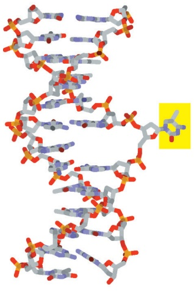
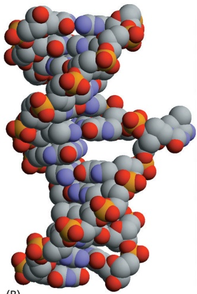
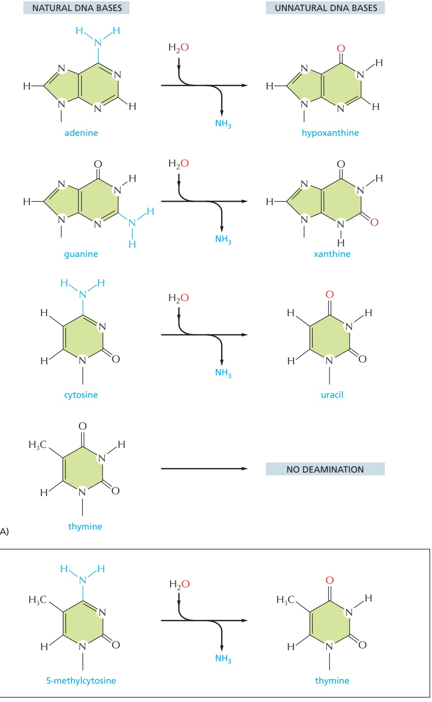
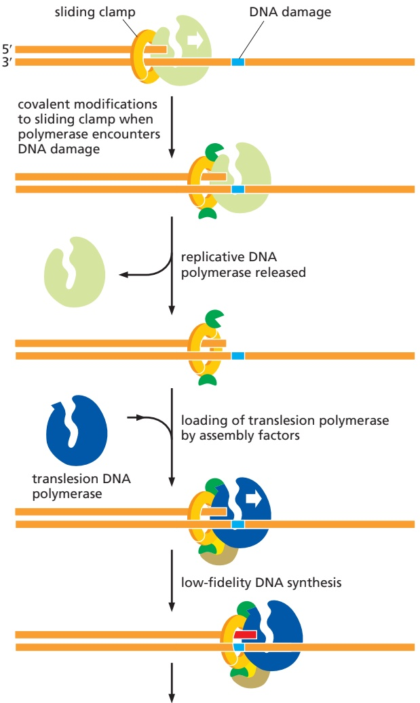
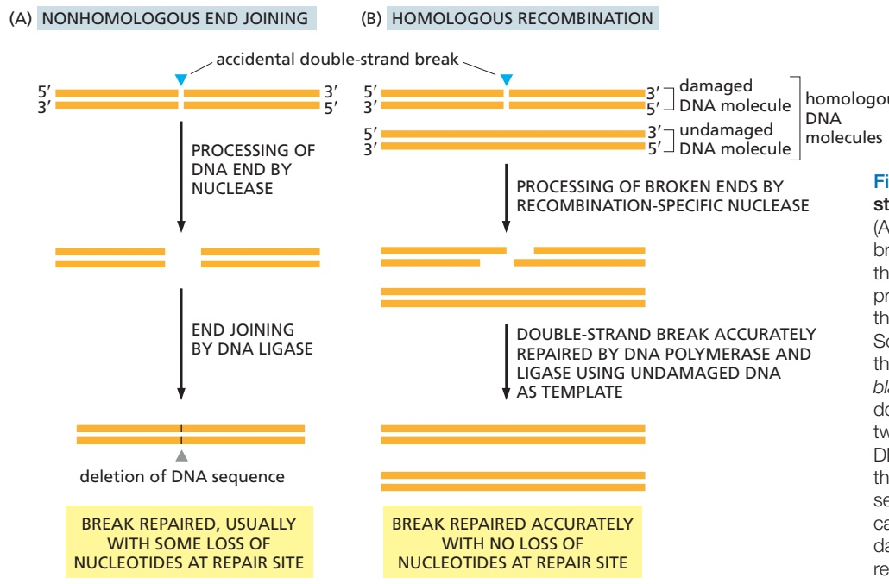
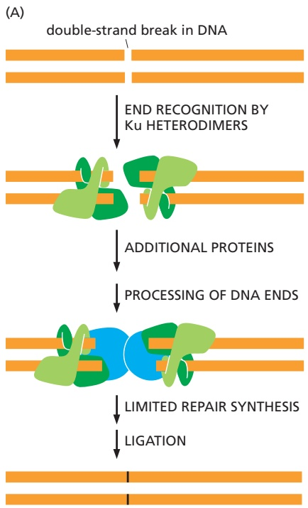
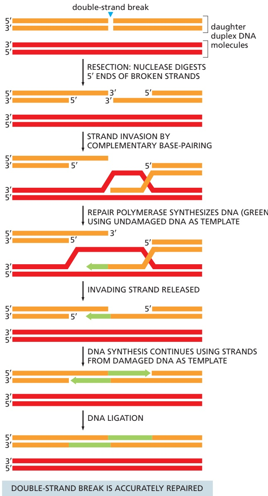
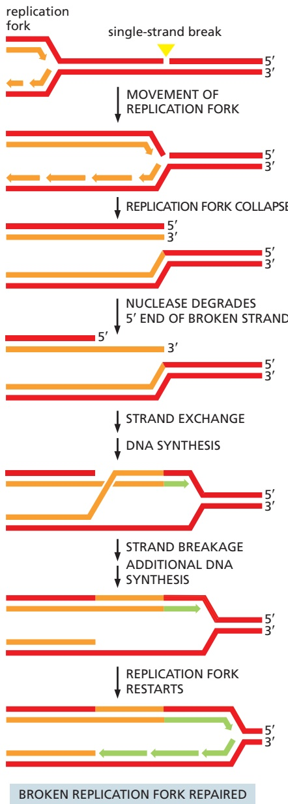

Figure 5–41 A comparison of two major DNA repair pathways. (A) Base excision repair. This pathway starts with a DNA glycosylase. In the example shown here, the enzyme uracil DNA glycosylase removes an accidentally deaminated cytosine in DNA. After the action of this glycosylase (or another DNA glycosylase that recognizes a different kind of damage), the sugar phosphate with the missing base is cut out by the sequential action of AP endonuclease and a phosphodiesterase. The gap of a single nucleotide is then filled by DNA polymerase and DNA ligase. The net result is that the U that was created by accidental deamination is restored to a C. The loss of a base can occur either from the actions of DNA glycosylases that recognize damaged bases or from spontaneous chemical reactions (see Figure 5–37). AP endonuclease is so named because it recognizes any site in the DNA helix that contains a deoxyribose sugar with a missing base; such sites can arise either by the loss of a purine (apurinic sites) or by the loss of a pyrimidine (apyrimidinic sites). (B) Nucleotide excision repair. In bacteria, after a multienzyme complex has recognized a lesion such as a pyrimidine dimer (see Figure 5–39), one cut is made on each side of the lesion, and an associated DNA helicase then removes the entire portion of the damaged strand. The excision repair machinery in bacteria operates as shown. In humans, once the damaged DNA is recognized, a helicase is recruited to locally unwind the DNA duplex. Next, the excision nuclease enters and cleaves on either side of the damage, leaving a gap of about 30 nucleotides that is subsequently filled in. The nucleotide excision repair machinery in both bacteria and humans can recognize and repair many different types of DNA damage.

Figure 5–41A). Depurination, which is by far the most frequent type of damage suffered by DNA, also leaves a deoxyribose sugar with a missing base. Depurinations are directly repaired beginning with AP endonuclease, following the bottom half of the pathway in Figure 5–41A.

The second major repair pathway is called **nucleotide excision repair**. This mechanism can repair the damage caused by almost any large change in the structure of the DNA double helix. Such “bulky lesions” include those created by the covalent reaction of DNA bases with large hydrocarbons (such as the carcinogen benzopyrene, found in tobacco smoke, coal tar, and diesel exhaust), as well as the various pyrimidine dimers (T-T, T-C, and C-C) caused by sunlight. In this pathway, a large multienzyme complex scans the DNA for a distortion in the double helix, rather than for a specific base change. Once it finds a lesion, it cleaves the phosphodiester backbone of the abnormal strand on both sides of

Figure 5–42 The recognition of an unusual nucleotide in DNA by baseflipping. The DNA glycosylase family of enzymes recognizes inappropriate bases in DNA in the conformation shown. Each of these enzymes cleaves the glycosyl bond that connects a particular recognized base (yellow) to the backbone sugar, removing it from the DNA. (A) Stick model of the DNA; (B) space-filling model.

(A)

(B)

the distortion, and a DNA helicase peels away the single-strand oligonucleotide containing the lesion. The large gap produced in the DNA helix is then repaired by DNA polymerase and DNA ligase (see Figure 5–41B).

An alternative to these base and nucleotide excision repair processes is the direct chemical reversal of DNA damage, and this strategy is selectively employed for the rapid removal of certain highly mutagenic or cytotoxic lesions. For exam-MBoC7 m5.42/5.42 ple, the lesion $O ^ { 6 } .$ -methylguanine has its methyl group removed by direct transfer to a cysteine residue in the repair protein itself. Because the repair protein is destroyed in the process, each molecule of it can only be used once. In another example, methyl groups in the lesions 1-methyladenine and 3-methylcytosine are “burned $\dot { \mathrm { o f f } } ^ { \nu }$ by an iron-dependent demethylase, with release of formaldehyde from the methylated DNA and regeneration of the native base.

## Coupling Nucleotide Excision Repair to Transcription Ensures That the Cell’s Most Important DNA Is Efficiently Repaired

All of a cell’s DNA is under constant surveillance for damage, and the repair mechanisms we have described act on all parts of the genome. However, cells have a way of directing DNA repair to the DNA sequences that are most needed. They do this by linking RNA polymerase, the enzyme that transcribes DNA into RNA as the first step in gene expression, to the nucleotide excision repair pathway. As discussed above, this repair system can correct many different types of DNA damage. RNA polymerase stalls at DNA lesions and, through the use of coupling proteins, directs the excision repair machinery to those sites, thereby selectively repairing genes that are in current use by the cell. In bacteria, where genes are relatively short, the stalled RNA polymerase can be dissociated from the DNA; the DNA is repaired, and the gene is transcribed again from the beginning. In eukaryotes, where genes can be enormously long, a more complex reaction is used to “back up” the RNA polymerase, repair the damage, and then restart the polymerase.

The importance of transcription-coupled excision repair is seen in people with Cockayne syndrome, which is caused by a defect in this coupling. These individuals suffer from growth retardation, skeletal abnormalities, progressive neural retardation, and severe sensitivity to sunlight. Most of these problems are thought to arise from RNA polymerase molecules that become permanently stalled at sites of DNA damage that lie in important genes.

## The Chemistry of the DNA Bases Facilitates Damage Detection

The DNA double helix is well suited for repair. As noted earlier, it contains a backup copy of all genetic information. Equally importantly, the nature of the four bases in DNA makes the distinction between undamaged and damaged (A)

NATURAL DNA BASES

Figure 5–43 The deamination of DNA nucleotides. In each case, the oxygen atom that is added in this reaction with water is colored red. (A) The spontaneous deamination products of A and G are recognizable as unnatural when they occur in DNA and thus are readily found and repaired, as is the deamination of C to U; T has no amino group to remove. (B) About 3% of the C nucleotides in vertebrate DNAs are methylated to help in controlling gene expression (discussed in Chapter 7). When these 5-methyl C nucleotides are accidentally deaminated, they form the natural nucleotide T. This T will be paired with a G on the opposite strand, forming a mismatched base pair.

(B)

bases very clear. For example, every possible deamination event in DNA yields an “unnatural” base, which can be directly recognized and removed by a specific DNA glycosylase. Hypoxanthine, for example, is the simplest purine base capable of pairing specifically with C. But hypoxanthine is not used in DNA, presumably because it is the direct deamination product of A. Instead G, with a second amino group, pairs with C: G cannot form from A by spontaneous deamination, and its own deamination product (xanthine) is likewise unique (**Figure 5–43**).

As discussed in Chapter 6, RNA is thought, on an evolutionary time scale, to have served as the genetic material before DNA, and it seems likely that the genetic code was initially carried in the four nucleotides A, C, G, and U. This raises the question of why the U in RNA was replaced in DNA by T (which is 5-methyl U). We have seen that the spontaneous deamination of C converts it to U, but that this event is rendered relatively harmless by uracil DNA glycosylase. However, if DNA contained U as a natural base, the repair system would not be able to distinguish a deaminated C from a naturally occurring U.

A special situation occurs in vertebrate DNA, in which selected C nucleotides are methylated at specific CG sequences that are associated with inactive genes (discussed in Chapter 7). The accidental deamination of these methylated C nucleotides produces the natural nucleotide T (see Figure 5–43B) in a mismatched base pair with a G on the opposite DNA strand. To help in repairing deaminated methylated C nucleotides, a special DNA glycosylase recognizes a mismatched base pair involving T in the sequence T-G and removes the T. This DNA repair mechanism must be relatively ineffective, however, because methylated C nucleotides are exceptionally common sites for mutations in vertebrate DNA. It is striking that, even though only about 3% of the C nucleotides in human DNA are methylated, mutations in these methylated nucleotides account for about one-third of the single-base mutations that have been observed in inherited human diseases.

## Special Translesion DNA Polymerases Are Used in Emergencies

If a cell’s DNA suffers heavy damage, the repair mechanisms that we have discussed are often insufficient to cope with it. In these cases, a different strategy is called into play, one that entails some risk to the cell. The highly accurate replicative DNA polymerases stall when they encounter damaged DNA, and in emergencies cells employ versatile, but less accurate, backup polymerases, known as translesion polymerases, to replicate through the DNA damage.

Human cells contain seven different translesion polymerases, some of which can recognize a specific type of DNA damage and add the nucleotides required to restore the correct sequence. For example, one such polymerase adds two A’s opposite a thymine dimer (see Figure 5–39). Others make only “good guesses,” especially when the template base has been extensively damaged. These enzymes are not as accurate as the normal replicative polymerases even when they copy an undamaged DNA sequence. For one thing, they lack exonucleolytic proofreading activity; in addition, many are much less discriminating than the replicative polymerase in choosing which nucleotide to incorporate initially. Each such translesion polymerase is therefore given a chance to add only one or a few nucleotides before a high-fidelity replicative polymerase resumes DNA synthesis.

Despite their usefulness in allowing heavily damaged DNA to be replicated, these translesion polymerases do, as noted above, pose risks to the cell. They are probably responsible for most of the base-substitution and single-nucleotide deletion mutations that accumulate in genomes. Not only do they frequently produce mutations when copying damaged DNA, they probably also generate mutations— at a low level—on undamaged DNA. Clearly, it is important for the cell to tightly regulate these polymerases, activating them only at sites of DNA damage. Exactly how this happens for each translesion polymerase remains to be discovered, but a conceptual model is presented in **Figure 5–44**. The same principle applies to many of the DNA repair processes discussed in this chapter: because the enzymes that carry out these reactions are potentially dangerous to the genome, they must be brought into play only at the appropriate damaged sites.

## Double-Strand Breaks Are Efficiently Repaired

An especially dangerous type of DNA damage occurs when both strands of the double helix are broken, leaving no intact template strand to enable accurate repair. Ionizing radiation, replication errors, oxidizing agents, and other metabolites produced in the cell cause breaks of this type. If these lesions were left unrepaired, they would quickly lead to the breakdown of chromosomes into smaller fragments and to loss of genes when the cell divides. However, two distinct mechanisms have evolved to deal with this type of damage by restoring an intact double helix: nonhomologous end joining and homologous recombination (**Figure 5–45**).

Figure 5–44 How translesion DNA polymerases are recruited to damaged templates. According to this model, a replicative polymerase stalled at a site of DNA damage is recognized by the cell as needing rescue. Specialized enzymes covalently modify the sliding clamp (typically, it is ubiquitylated—see Figure 3–65), which releases the replicative DNA polymerase and, together with the damaged DNA, attracts a translesion polymerase specific to that type of damage. Once the damaged DNA is bypassed, the covalent modification of the clamp is removed, the translesion polymerase dissociates, and the highfidelity replicative polymerase is brought back into play.

removal of covalent modifications from clamp, reloading of replicative DNA polymerase, continuation of accurate DNA synthesis

The simplest to understand is **nonhomologous end joining**, in which the broken ends are processed to remove any damaged nucleotides and simply brought together and rejoined by DNA ligation, generally with the loss of nucleotides at the site of joining (**Figure 5–46**). This end-joining mechanism, which can be seen as a “quick and dirty” solution to the repair of double-strand breaks, is the predominant way of repairing these lesions in mammalian somatic cells. Although a change in the DNA sequence (a mutation) usually results at the site of breakage, so little of the mammalian genome is essential for life that this mechanism is apparently an acceptable solution to the problem of rejoining broken chromosomes. By the time a human reaches the age of 70, the typical somatic cell contains more than 2000 such “scars,” distributed throughout its genome, representing places where DNA has been inaccurately repaired by nonhomologous end joining.

But nonhomologous end joining presents another danger: nonhomologous end joining can occasionally generate rearrangements in which one broken chromosome becomes covalently attached to another. This can result in chromosomes with two centromeres and chromosomes lacking centromeres altogether; both types of aberrant chromosomes are missegregated during cell division. As previously discussed, the specialized structure of telomeres pre-MBoC7 e6.30/5.45 vents the natural ends of chromosomes from being mistaken for broken DNA and “repaired” in this way.

A much more accurate type of double-strand break repair is also possible (see Figure 5–45B). Here, a damaged DNA molecule is repaired using a second DNA double helix as a template, one with an identical (or nearly identical) DNA sequence. This reaction utilizes homologous recombination, a mechanism to be

Figure 5–45 Cells can repair doublestrand breaks in one of two ways. (A) In nonhomologous end joining, the break is first “cleaned” by a nuclease that chews back the broken ends to produce flush ends. The flush ends are then stitched together by a DNA ligase. Some nucleotides are usually lost in the repair process, as indicated by the black lines in the repaired DNA. (B) If a double-strand break occurs in one of two duplicated DNA double helices after DNA replication has occurred, but before the chromosome copies have been separated, the undamaged double helix can be used as a template to repair the damaged double helix through homologous recombination. Although more complicated than nonhomologous end joining, this process accurately restores the original DNA sequence at the site of the break. Homologous recombination is described in detail in the next part of this chapter. Although nonhomologous end joining and homologous recombination are the two principal ways that cells repair double-strand breaks, additional mechanisms exist.

repaired DNA has generally suffered a deletion of nucleotides

(B)

Figure 5–46 Nonhomologous end joining. (A) A central role is played by the Ku protein, a heterodimer that quickly grasps the broken chromosome ends. The additional proteins (shown in blue) are recruited to hold the broken ends together and remove any damaged nucleotides before the two DNA molecules are joined covalently by a specialized ligase that is dedicated to nonhomologous end joining. During this process, any single-strand gaps that arise are “filled in” by specialized repair polymerases. When DNA suffers double-strand breaks through ionizing radiation or chemical attack, the broken ends are often chemically damaged. Nonhomologous end joining is unusually versatile in being able to “clean up” just about any type of damaged end. (B) Three-dimensional structure of a Ku heterodimer bound to the end of a duplex DNA fragment. This Ku protein is also essential for V(D)J joining, a specific process through which antibody and T-cell receptor diversity is generated in developing B and T cells (discussed in Chapter 24). V(D)J joining and nonhomologous end joining share many mechanistic similarities, but the former relies on specific double-strand breaks that are produced deliberately by the cell. (From J. Walker, R. Corpina, and J. Goldberg, Nature 412:607–614, 2001. With permission from Springer Nature; PDB codes: 1JEQ, 1JEY.)

described later in this chapter. Most organisms employ both nonhomologous end joining and homologous recombination to repair double-strand breaks in DNA. Nonhomologous end joining predominates in humans; homologous recombination is used only in the S and $\mathrm { G } _ { 2 }$ cell-cycle phases, when one newly replicated daughter molecule can act as a template to repair damage to the other daughter that remains nearby.

## DNA Damage Delays Progression of the Cell Cycle

We have just seen that cells contain multiple enzyme systems that can recognize and repair many types of DNA damage (**Movie 5.7**). Because of the importance of maintaining intact, undamaged DNA from generation to generation, eukaryotic cells delay the progression of their cell cycle until DNA repair is complete. As discussed in detail in Chapter 17, the orderly progression of the cell cycle is stopped when damaged DNA is detected, and it restarts only when the damage has been repaired. In mammalian cells, the presence of DNA damage can block entry from $\mathrm { G _ { 1 } }$ phase into S phase, it can slow S phase once it has begun, and it can block the transition from $\mathrm { G _ { 2 } }$ phase to M phase. These delays facilitate DNA repair by providing the time needed for the repair to reach completion.

DNA damage also results in an increased synthesis of many DNA repair enzymes. This response depends on special signaling proteins that sense DNA damage and synthesize more of the DNA repair enzymes appropriate for the damage. The importance of this mechanism is revealed by the phenotype of humans who are born with defects in the gene that encodes the ATM protein. These individuals have the disease ataxia telangiectasia (AT), the symptoms of which include neurodegeneration, a predisposition to cancer, and genome instability. The ATM protein is a large protein kinase that generates the intracellular signals needed to halt the cell cycle in response to many types of spontaneous DNA damage (see Figure 17–60), and individuals with defects in this protein suffer from the effects of unrepaired DNA lesions.

## Summary

Genetic information can be stored stably in DNA sequences only because a large set of DNA repair enzymes continually scans the DNA double helix and replaces any damaged nucleotides. Most types of DNA repair depend on the fact that a DNA molecule carries two copies of its genetic information—one copy on each of its two complementary strands. This allows an accidental lesion on one strand to be removed by a repair enzyme and a corrected strand then resynthesized by reference to the information in the undamaged strand.

Most of the damage to DNA bases is excised by one of two major DNA repair pathways. In base excision repair, the altered base is removed by a DNA glycosylase enzyme, followed by excision of the resulting sugar phosphate. In nucleotide excision repair, a small section of the DNA strand surrounding the damage is removed from the DNA double helix. In both cases, the gap left in the DNA helix is filled in by the sequential action of DNA polymerase and DNA ligase, using the undamaged DNA strand as the template. Some types of DNA damage can be repaired by a different strategy—the direct chemical reversal of the damage— which is carried out by specialized repair proteins. Usually, all such corrections are completed prior to DNA replication. But if not, a special class of inaccurate DNA polymerases, called translesion polymerases, is used to bypass the damage, allowing the cell to survive but sometimes creating permanent mutations at the sites of damage.

Other critical repair systems—based on either nonhomologous end joining or homologous recombination—are needed to reseal the accidental double-strand breaks that occasionally occur in the DNA helix. In most cells, an elevated level of DNA damage causes a delay in the cell cycle, which helps to ensure that the damage is repaired before the cell divides.

## HOMOLOGOUS RECOMBINATION

In the preceding parts of this chapter, we discussed the mechanisms that allow the DNA sequences in cells to be maintained from generation to generation with very little change. In this part, we further explore a group of repair mechanisms that depend on a process called homologous recombination. The key feature of **homologous recombination** (also known as general recombination) is an exchange of DNA strands between a pair of homologous duplex DNA sequences. Such a strand exchange between two regions of double helix that are very similar or identical in nucleotide sequence allows one stretch of duplex DNA to restore lost or damaged information on a second stretch of duplex DNA. Because the DNA sequence information that is used to correct the damage can come from a separate DNA molecule, homologous recombination can repair many types of DNA damage. It makes possible, for example, the accurate repair of double-strand breaks, as mentioned previously (see Figure 5–45B). As pointed out earlier, these double-strand breaks can result from reactive chemicals or radiation (for example, that from radon gas that accumulates in some old basements). But more frequently they arise from DNA replication accidents—when forks become stalled or broken independently of any such external cause. Homologous recombination accurately corrects these accidents, and, because they occur during nearly every round of DNA replication, this repair pathway is essential for every proliferating cell. Homologous recombination can also repair other types of DNA damage (for example, covalent cross-links between the two strands of a DNA double helix), being perhaps the most versatile DNA repair mechanism available to the cell; this probably explains why its mechanism and the proteins that carry it out have been conserved in virtually all cells on Earth.

We shall also see that homologous recombination plays an additional role in sexually reproducing organisms. During meiosis, a key step in gamete (sperm and egg) production, it catalyzes the orderly exchange of blocks of genetic information between corresponding (homologous) maternal and paternal chromosomes. This creates new combinations of DNA sequences in the chromosomes that are passed to offspring, giving the next generation unique characteristics upon which natural selection can act.

## Homologous Recombination Has Common Features in All Cells

The current view of homologous recombination as a critical DNA repair mechanism in all cells developed slowly from its original discovery as a key component in the specialized process of meiosis in plants and animals. The subsequent recognition that homologous recombination also occurs in unicellular organisms made it readily amenable to molecular analyses. Thus, much of what we know about the biochemistry of genetic recombination was derived from studies of bacteria, especially of E. coli and its viruses, as well as from experiments with simple eukaryotes such as yeasts. For these organisms with short generation times and relatively small genomes, it was possible to isolate a large set of mutants with defects in their recombination processes. The protein altered in each mutant was then identified and, ultimately, studied biochemically. Very close relatives of these proteins were subsequently found in more complex eukaryotes including flies, mice, and humans, and it is now possible to directly analyze homologous recombination in these species as well. As a result, we now know that the fundamental processes that catalyze homologous recombination are common to all cells.

## DNA Base-pairing Guides Homologous Recombination

The hallmark of homologous recombination is that it takes place only between DNA duplexes that have extensive regions of sequence similarity (homology). Not surprisingly, base-pairing underlies this requirement: before undergoing homologous recombination, two DNA helices will “sample” each other’s DNA sequence by testing the potential base-pairing between a single strand from one

DNA duplex and a complementary single strand from the other. Recombination is initiated when a match is found; this match need not be perfect, but it must be very close for homologous recombination to succeed. As we shall see, the process is carefully controlled and guided by a group of specialized proteins.

## Homologous Recombination Can Flawlessly Repair Double-Strand Breaks in DNA

Unlike the nonhomologous end joining discussed earlier, homologous recombination repairs double-strand breaks accurately, without any loss or alteration of nucleotides at the site of repair. For homologous recombination to do this repair job, the damaged DNA must first be brought into proximity with a homologous but undamaged DNA double helix, which can then serve as a template for repair. For this reason, homologous recombination often occurs after DNA replication, when the two daughter DNA molecules lie close together and one can serve as a template for repair of the other.

One of the simplest pathways through which homologous recombination can repair double-strand breaks is shown in **Figure 5–47**. In essence, the broken DNA duplex and the template duplex carry out a “strand dance” so that one of the damaged strands can use the complementary strand of the intact DNA duplex

Figure 5–47 A mechanism that repairs double-strand breaks by homologous recombination. Homologous recombination can be regarded as a flexible series of reactions, with the exact pathway differing from one case to the next. The pathway shown here represents one of the major forms of recombinational double-strand break repair; however other, closely related pathways also exist. All share the first two steps—resection and strand invasion— but they diverge afterward. For example, recombinational repair of some doublestrand breaks proceeds through a double Holliday junction, a structure we discuss later in this chapter.

as a template for repair. Once the damaged and template DNA double helices are in proximity (as occurs, for example, after DNA replication), the ends of the broken DNA are chewed back, or “resected,” by specialized nucleases to produce overhanging, single-strand $3 ^ { \prime }$ ends. The next step is **strand exchange** (also called strand invasion), during which one of the single-strand $3 ^ { \prime }$ ends from the damaged DNA molecule searches the template duplex for homologous sequences through base-pairing. Once stable base-pairing is established (which completes the strand-exchange step), an accurate DNA polymerase extends the invading strand using the information provided by the undamaged template molecule, thus restoring one of the damaged DNA strands. The last steps—strand displacement, further repair synthesis, and ligation—restore the two original DNA double helices and complete the repair process, as illustrated.

Homologous recombination resembles other DNA repair reactions in that a DNA polymerase utilizes a pristine template to restore damaged DNA. However, instead of using the partner strand as a template, as occurs in most DNA repair pathways, homologous recombination makes use of a complementary strand from a separate DNA duplex. In the following sections, we discuss the steps of homologous recombination in more detail with an emphasis on the proteins that guide this remarkable process.

## Specialized Processing of Double-Strand Breaks Commits Repair to Homologous Recombination

Once a double-strand break occurs, nonhomologous end joining and homologous recombination compete to repair the damage. But the specialized nuclease that resects DNA ends to begin homologous recombination becomes highly active during S and $\mathrm { G } _ { 2 }$ (through its phosphorylation by cell-cycle-controlled kinases), and homologous recombination usually wins out at these times, allowing use of a newly replicated daughter DNA molecule as a template. The initiating nuclease (called the Mre11 complex in eukaryotes) chews back in the $5 ^ { \prime } { \rightarrow } 3 ^ { \prime }$ direction leaving protruding $3 ^ { \prime }$ ends on either side of the break that can be as long as several thousand nucleotides. Single-strand binding protein (the same one used at replication forks) then coats the exposed single strands, protecting them from other nucleases in the cell and ensuring that they remain free of intramolecular base-pairing. The formation of these protruding ends prevents nonhomologous end joining from occurring, and it commits the repair pathway to homologous recombination.

## Strand Exchange Is Directed by the RecA/Rad51 Protein

Of all the steps of homologous recombination, strand invasion is the most difficult to imagine. How does the invading single strand rapidly sample a DNA duplex for a complementary sequence? Once the homology is found, how is the structure stabilized? And how is the inherent stability of the template double helix overcome to allow tests for base-pairing during this process?

The answers to these questions came from biochemical and structural studies of the main protein that carries out this feat, called **RecA** in E. coli and **Rad51** in virtually all eukaryotic organisms. A special group of accessory proteins loads a set of RecA/Rad51 monomers onto a protruding DNA single strand (such as that in Figure 5-47), forming a cooperatively bound filament that displaces the single-strand binding protein originally present. This orderly loading process produces a protein–DNA filament in which the DNA is held by RecA/Rad51 in an unusual conformation: groups of three consecutive nucleotides are positioned as though they were in a conventional DNA double helix, but, between adjacent triplets, the DNA backbone is untwisted and stretched out (**Figure 5–48**). This unusual protein–DNA structure then grasps a nearby duplex DNA molecule in a way that stretches it, destabilizing it and making it easy to pull the strands apart. The invading single strand then can sample the sequence of the duplex by conventional base-pairing to one of its strands. This sampling occurs in triplet nucleotide blocks, each of which is already in a “base-pair ready” conformation in the invading strand; when a good triplet match occurs, only then is the adjacent triplet sampled, and so on. In this way, mismatches very quickly cause dissociation, so that millions of possible pairings can be tested. Only an extended stretch of base-pairing (at least 15 nucleotides) can stabilize the invading strand, leading to the next steps in homologous recombination.

Figure 5–48 Strand invasion catalyzed by the RecA protein. Our understanding of this reaction is based in part on structures determined by x-ray diffraction studies of the bacterial RecA protein bound to single-stranded and double-stranded DNA. These DNA structures (illustrated with the RecA protein removed) are shown on the left side of the diagram. The reaction begins when ATP-bound RecA protein (blue) associates with a DNA single strand (typically a protruding 3′ end as shown in Figure 5–47), holding it in an elongated form where groups of three bases are separated from each other by a stretched and twisted backbone. The RecA-bound single strand then binds to duplex DNA, destabilizing it to allow the single strand to sample its sequence through base-MBoC7 m5.49/5.48 pairing, three bases at a time. If an extensive match is found, the structure is disassembled through ATP hydrolysis, resulting in protein dissociation and the exchange of one single strand of DNA for another, thereby forming a new heteroduplex from the complementary strands of two different DNA molecules. In the vast majority of cases, no match will be found in any one binding event, in which case the RecA-bound DNA single strand rapidly dissociates to begin a new search. (PDB code: 3CMX.)

RecA/Rad51 is an ATPase, and the steps described above require that each monomer along the filament be in the ATP-bound state. However, the searching itself does not require ATP hydrolysis; instead, the process occurs by simple molecular collisions, allowing an enormous number of potential sequences to be rapidly sampled. Once stable base-pairing occurs and a strand-exchange reaction is completed, ATP hydrolysis is necessary to disassemble RecA from the complex of DNA molecules. At this point, repair DNA polymerases and DNA ligase, which we encountered earlier in this chapter, complete the repair process, as shown previously in Figure 5–47.

## Homologous Recombination Can Rescue Broken and Stalled DNA Replication Forks

Although accurately repairing double-strand breaks is a crucial function of homologous recombination, it can also repair other types of damage. For example, some chemicals cross-link the two strands of DNA together by covalently joining nucleotides on opposite strands. A special set of enzymes unlinks the strands and cuts out the damaged bits on both strands. At this point, the damaged DNA has been converted to a double-strand break, which can be accurately repaired by homologous recombination, as discussed earlier. Similarly, proteins can become accidently covalently linked to DNA, and these sites can also be converted by nucleases into double-strand breaks, allowing repair by homologous

Figure 5–49 Repair of a broken replication fork by homologous recombination. When a moving replication fork encounters a single-strand break, it will collapse but can be repaired by homologous recombination. The process uses many of the same reactions shown in Figure 5–47 and proceeds through the same basic steps. Green strands represent the new DNA synthesis that takes place after the replication fork has broken. This pathway allows the fork to move past the break on the damaged template using the undamaged duplex as a template to synthesize DNA. (Adapted from M.M. Cox, Proc. Natl. Acad. Sci. USA 98:8173–8180, 2001. Copyright 2001 National Academy of Sciences, USA. With permission from National Academy of Sciences.)

recombination. But perhaps the most important role of homologous recombination is in rescuing broken or stalled DNA replication forks. Many types of events can cause a replication fork to stop, and here we consider two examples. The first arises from an accidental single-strand gap in the parent DNA helix that lies just ahead of a replication fork. When the fork reaches this lesion, it falls apart—resulting in one broken and one intact daughter chromosome. Because this is a “one-sided” double-strand break, it cannot be repaired by nonhomologous end joining, and homologous recombination becomes crucial. The broken fork can be accurately repaired using the same basic reactions we discussed earlier for the repair of double-strand breaks (**Figure 5–49**). With slight modifications, the set of reactions just depicted can accurately repair many different types of DNA damage, providing that an undamaged duplex DNA template is available.

A different type of problem arises when a replication fork attempts to move through certain types of DNA damage that clogs up the replication machinery, stalling the fork. Because such damaged DNA often ends up deeply buried in the core of the replication fork, it cannot be easily repaired. To resolve this problem, the replication machine “backs up” through a series of strand-exchange reactions similar to those we have discussed (**Figure 5–50**). This maneuver allows one newly synthesized DNA strand to act as a template for synthesis of the other new strand, thereby bypassing the damaged template and allowing replication to proceed.

## DNA Repair by Homologous Recombination Entails Risks to the Cell

Although homologous recombination neatly solves the problem of accurately repairing double-strand breaks and other types of DNA damage, it sometimes “repairs” damage using the wrong bit of the genome as the template. For example, sometimes a broken human chromosome is repaired using the homolog from the other parent instead of the sister chromatid as the template. Because maternal and paternal chromosomes differ in DNA sequence at many positions along their lengths, this type of repair can convert the sequence of the repaired DNA from the maternal to the paternal sequence or vice versa. The result of this type of errant recombination is a **loss of heterozygosity**. It can have severe consequences if the homolog used for repair contains a deleterious mutation, because the recombination event destroys the “good” copy. Loss of heterozygosity, although it happens rarely, is nonetheless a critical step in the formation of many cancers (discussed in Chapter 20).

Cells go to great lengths to minimize the risk of mishaps of these types; indeed, as we have seen, nearly every step of homologous recombination is carefully regulated. Recall that the first step (resection of the broken ends) is coordinated with the cell cycle: it occurs primarily in the S and $\mathrm { G } _ { 2 }$ phases of the cell cycle, favoring the use of a daughter duplex (either as a partially replicated chromosome or a fully replicated sister chromatid) as a template for repair (see Figure 5–47). The close proximity of the two daughter chromosomes disfavors the use of other genome sequences in the repair process.

The loading of RecA/Rad51 onto the processed DNA ends and the subsequent strand-exchange reaction are also tightly controlled by the cell, and a host of accessory proteins is needed to regulate these steps. There are many such proteins, and exactly how all of them coordinate and control homologous recombination remains a mystery, although we do understand how a few of them work, as described below. We also know that the enzymes that catalyze

