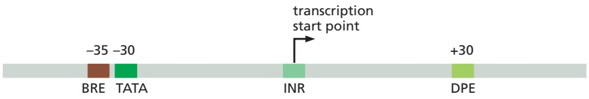
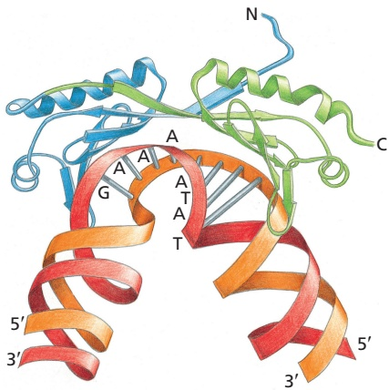
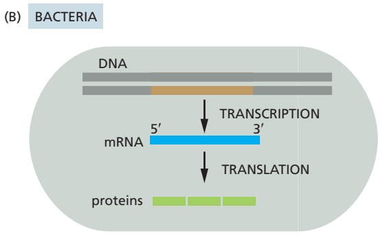
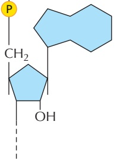
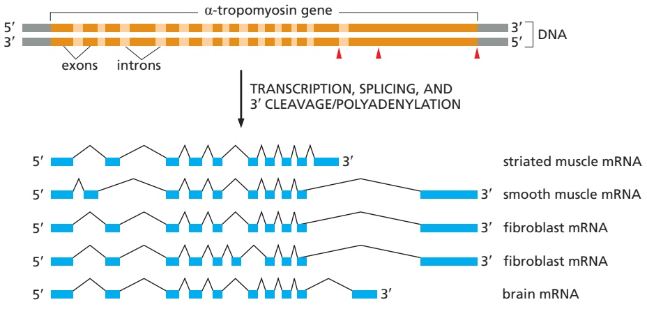
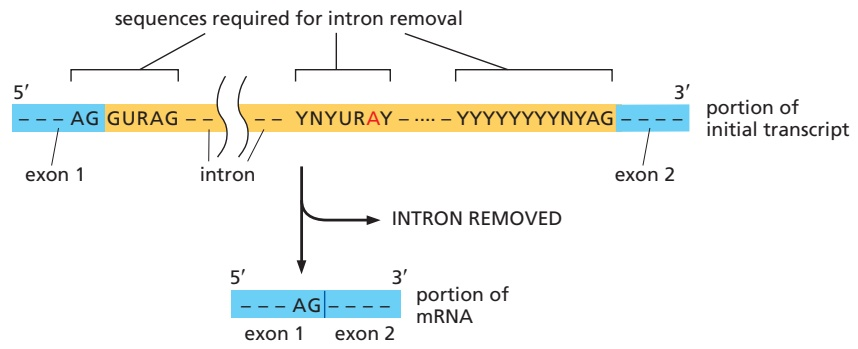
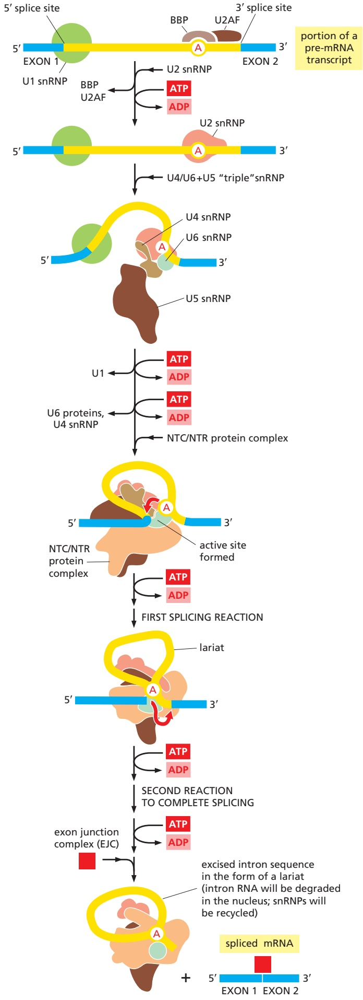

<table><tbody><tr><td colspan="3">TABLE 6-3 The General Transcription Factors Needed for Transcription Initiation by Eukaryotic RNA Polymerase II</td></tr><tr><td>Name</td><td>Number of subunits</td><td>Roles in transition initiation</td></tr><tr><td>TFIID</td><td>12</td><td>Recognizes TATA box and other DNA sequences near the transcription start point</td></tr><tr><td>TFIIB</td><td>1</td><td>Recognizes BRE element in promoters; accurately positions RNA polymerase at the start site of transcription</td></tr><tr><td>TFIIA</td><td>2</td><td>Not required in all promoters; stabilizes binding of TFIID</td></tr><tr><td>TFIIF</td><td>3</td><td>Stabilizes RNA polymerase interaction with TFIIB; helps attract TFIIE and TFIIH</td></tr><tr><td>TFIIE</td><td>2</td><td>Attracts and regulates TFIIH</td></tr><tr><td>TFIIH</td><td>10</td><td>Unwinds DNA at the transcription start point, phosphorylates Ser5 of the RNA polymerase C-terminal domain (CTD); releases RNA polymerase from the promoter</td></tr><tr><td colspan="3">TFIID is composed of TBP and 11 additional subunits called TAFs (TBP-associated factors).</td></tr></tbody></table>

TFIID causes a large distortion in the DNA of the TATA box (**Figure 6–17**). This distortion is thought to serve as a physical landmark for the location of an active promoter in the midst of a very large genome, and it brings DNA sequences on both sides of the distortion closer together to allow for subsequent protein assembly steps. The additional general transcription factors then assemble, along with RNA polymerase II, to form a complete transcription initiation complex (see Figure 6–15). The most complicated of the general transcription factors is TFIIH (shown in pink). Consisting of 10 subunits, it is nearly as large as RNA polymerase II itself and, as we shall see shortly, performs several enzymatic steps needed for the initiation of transcription.

After forming a transcription initiation complex on the promoter DNA, RNA polymerase II must gain access to the template strand at the transcription start point. TFIIH makes this step possible by hydrolyzing ATP and pulling apart the DNA strands at the start site, thereby exposing the template strand. Next, RNA polymerase II, like the bacterial polymerase, remains at the promoter synthesizing short lengths of RNA until it undergoes a series of conformational changes that allow it to move away from the promoter and enter the elongation phase of transcription. A key step in this transition is the addition of phosphate groups to the “tail” of the RNA polymerase (known as the CTD, or C-terminal domain). In

| element | consensus sequence | general transcription factor |
| --- | --- | --- |
| BRE | G/C G/C G/A C G C C | TFIIB |
| TATA | T A T A A/T A A/T | TBP subunit of TFIID |
| INR | C/T C/T A N T/A C/T C/T | TFIID |
| DPE | A/G G A/T C G T G | TFIID |

Figure 6–16 Consensus sequences found in the vicinity of eukaryotic RNA polymerase II start points. The name given to each consensus sequence (first column) and the general transcription factor that recognizes it (last column) are indicated. N indicates any nucleotide, and two nucleotides separated by a slash indicate an equal probability of either nucleotide at the indicated position. In reality, each consensus sequence is a shorthand representation of a histogram similar to that of Figure 6–12.

For most RNA polymerase II transcription start points, only two or three of the four sequences are present. For example, many polymerase II promoters have a TATA box sequence, but those that do not typically have a “strong” INR sequence. Although most of the DNA sequences that influence transcription initiation are located upstream of the transcription start point, a few, such as the DPE shown in the figure, are located within the transcribed region.

humans, the CTD consists of 52 tandem repeats of a seven-amino-acid sequence, which extend from the RNA polymerase core structure. During transcription initiation, the serines located at the fifth position in each repeat sequence (Ser5) are phosphorylated by TFIIH, which contains a protein kinase in one of its subunits. Triggered by these phosphorylations, the polymerase disengages from the cluster of general transcription factors (see Figure 6–15D). During this process, it undergoes a series of conformational changes that tighten its interaction with DNA, and it acquires new proteins that allow it to transcribe for long distances, in some cases for many hours, without dissociating from DNA.

Once the polymerase II has begun elongating the RNA transcript, most of the general transcription factors are released from the DNA so that they are available to initiate another round of transcription with a new RNA polymerase molecule. As we see shortly, the phosphorylation of the tail of RNA polymerase II has an additional function: it causes components of the RNA-processing machinery to load onto the polymerase and thereby be positioned to modify the newly transcribed RNA as it emerges from the polymerase.

## In Eukaryotes, Transcription Initiation Also Requires Activator, Mediator, and Chromatin-modifying Proteins

The model for transcription initiation just described is based on experiments performed in vitro using purified proteins and DNA. However, as discussed in Chapter 4, DNA in eukaryotic cells is packaged into nucleosomes, which are further arranged in higher-order chromatin structures. As a result, transcription initiation in a eukaryotic cell is more complex and requires more proteins than it does on purified DNA. First, regulatory proteins known as transcriptional activators must bind to specific sequences in DNA (called enhancers) to help attract the general transcription factors and RNA polymerase II to the start point of transcription (**Figure 6–18**). We discuss the role of these activators in Chapter 7, because they are one of the main ways in which cells regulate expression of their genes. Here we simply note that their presence on DNA is required for transcription initiation in a eukaryotic cell. Second, eukaryotic transcription initiation in vivo requires the presence of a large protein complex known as Mediator, which

Figure 6–17 Three-dimensional structure of TBP (TATA-binding protein) bound to DNA. The TBP is the subunit of the general transcription factor TFIID that is responsible for recognizing and binding the TATA box sequence in the DNA. The unique DNA bending caused by TBP—kinks in the double helix separated by partly unwound DNA—is thought to serve as a landmark that helps to attract the other general transcription factors (Movie 6.4). TBP is a single polypeptide chain that is folded into two very similar domains (blue and green). (Adapted from J.L. Kim et al., Nature 365:520–527, 1993.)

Figure 6–18 Transcription initiation by RNA polymerase II in a eukaryotic cell. Transcription initiation in vivo requires the presence of transcription activator proteins. As described in Chapter 7, these proteins bind to short, specific sequences in DNA that are located in regulatory regions called enhancers. Although only one activator is shown here (in blue), a typical eukaryotic gene utilizes many DNA-bound transcription activator proteins, which act together to determine that gene’s rate and pattern of transcription across different cell types. Often acting from a distance of many thousand nucleotide pairs along DNA (indicated by the dashes), these proteins help RNA polymerase, the general transcription factors, and Mediator all to assemble at the promoter. In addition, ATP-dependent chromatin remodeling complexes and histone-modifying enzymes are needed at most genes. One of the main roles of Mediator is to coordinate the assembly of all these proteins at the promoter so that transcription can begin. As discussed in Chapter 4, the “default” state of eukaryotic DNA is to be packaged into nucleosomes and higher-order chromatin structures; for simplicity, these are not shown in this figure.

allows the activator proteins to communicate properly with the polymerase II and with the general transcription factors. Mediator also correctly positions TFIIH near the tail of RNA polymerase, facilitating phosphorylation of the tail and the consequent release of the polymerase from the promoter to begin synthesizing RNA. Finally, transcription initiation in a eukaryotic cell typically requires the recruitment of chromatin-modifying enzymes, including chromatin remodeling complexes and histone-modifying enzymes. As discussed in Chapter 4, both types of enzymes can increase access to the DNA in chromatin, and by doing so they facilitate the assembly of the transcription initiation machinery onto DNA.

To summarize, as illustrated schematically in Figure 6–18, many proteins (well over 100 individual subunits) must assemble at the start point of transcription to initiate transcription in a eukaryotic cell. We shall return to some of these proteins—especially transcription activator proteins, chromatin remodeling complexes, and histone-modifying enzymes—in the following chapter, where we discuss how eukaryotic cells regulate the process of transcription initiation.

## Transcription Elongation in Eukaryotes Requires Accessory Proteins

Once RNA polymerase has initiated transcription, it moves jerkily, pausing at some DNA sequences and rapidly transcribing through others. Elongating RNA polymerases, both bacterial and eukaryotic, are associated with a series of elongation factors, proteins that decrease the likelihood that RNA polymerase will dissociate before it reaches the end of a gene. These factors typically associate with RNA polymerase shortly after initiation, and they help the polymerase move both through nucleosomes (**Figure 6–19**) and through the wide variety of different DNA sequences that are found in genes.

We will see in the next chapter that, like the process of transcription initiation, transcription elongation can be regulated by the cell; more specifically, we will see that at many human genes, RNA polymerase pauses shortly after it initiates transcription. This pause can last from several seconds to many hours, and the cell controls the duration of this pause as part of gene regulatory processes.

As RNA polymerase II moves along a gene, some of the enzymes bound to it modify the histones, leaving behind a record of where the polymerase has been. Although it is not clear exactly how the cell uses this information, it may aid in transcribing a gene over and over again once it has become active for the first time.

## Transcription Creates Superhelical Tension

Nucleosomes are not the only impediment to elongating RNA polymerases, and in this section, we describe an entirely different type of barrier, one that applies to both bacterial and eukaryotic polymerases. To introduce this issue, we need first to consider a subtle property inherent in the DNA double helix called DNA supercoiling. **DNA supercoiling** is the name given to a conformation that DNA can adopt in response to superhelical tension. Alternatively, the creation of loops or coils in a double-helical DNA molecule will produce such tension.

Figure 6–19 Structure of an RNA polymerase II transcribing through a nucleosome. In the structure diagrammed here, which was determined by cryoelectron microscopy, the polymerase has moved about halfway through the DNA of the nucleosome, leaving only one of the two loops of duplex DNA still bound to the histone core. The polymerase is shown in blue, associated with three elongation factors (Spt4, Spt5, and Elf1) that help the polymerase transcribe through nucleosomes. These factors act in several ways: they form a wedge to pry the DNA away from the histone core as the polymerase moves forward; they directly destabilize histone–DNA interactions by pushing a positively charged surface ahead of the RNA polymerase; and they reduce the intrinsic “stickiness” of RNA polymerase for nucleosomes. In addition to these factors, eukaryotic transcription is typically aided by ATP-dependent chromatin remodeling complexes that seek out and rescue the occasional stalled polymerase, as well as by histone chaperones that can partially disassemble nucleosomes in front of a moving RNA polymerase and reassemble them behind. (Based on PDB code 6IR9.)

**Figure 6–20** illustrates why. There are approximately 10 nucleotide pairs for every helical turn in a DNA double helix. Imagine a helix whose two ends are fixed with respect to each other (as they are in a DNA circle, such as a bacterial chromosome, or in a tightly clamped loop, as can exist in eukaryotic chromosomes). In this case, one large DNA supercoil will form to compensate for each 10 nucleotide pairs that are opened (unwound). The formation of this supercoil is energetically favorable because it restores a normal helical twist to the base-paired regions that remain, which would otherwise become overwound because of the fixed ends.

RNA polymerase creates superhelical tension as it moves along a stretch of DNA that is anchored at its ends. As illustrated in Figure 6–20C, if the polymerase is not free to rotate rapidly (and such rotation is unlikely given the size of RNA polymerases and their attached transcripts), a moving polymerase will generate positive superhelical tension in the DNA in front of it and negative helical tension

Figure 6–20 Superhelical tension in DNA causes DNA supercoiling. (A) For a DNA molecule with one free end (or a break in one strand that serves as a swivel), the DNA double helix rotates by one turn for every 10 nucleotide pairs opened. (B) If rotation is prevented, superhelical tension is introduced into the DNA by helix opening. In the example shown, the DNA helix contains 10 helical turns, one of which is opened. One way of accommodating the tension created would be to increase the helical twist from 10 to 11 nucleotide pairs per turn in the double helix that remains. The DNA helix, however, resists such a deformation in a springlike fashion, preferring to relieve the MBoC7 m6.19/6.20superhelical tension by bending into supercoiled loops. As a result, one DNA supercoil forms in the DNA double helix for every 10 nucleotide pairs opened. The supercoil formed in this case is a positive supercoil. (C) Supercoiling of DNA is induced by a protein tracking through the DNA double helix. The two ends of the DNA shown here are unable to rotate freely relative to each other, and the protein molecule is assumed also to be prevented from rotating freely as it moves. Under these conditions, the movement of the protein causes an excess of helical turns to accumulate in the DNA helix ahead of the protein (inducing positive supercoils) and a deficit of helical turns to arise in the DNA behind the protein (inducing negative supercoils), as shown. Because locally pulling apart the two strands of the double helix relieves the tension from negative supercoils, it is easier to do behind the moving protein than ahead of it.

behind it. If this tension is not relieved, the polymerase will grind to a halt because further unwinding requires more energy than the transcription process can provide. For eukaryotes, the mild buildup of tension is thought to provide a bonus: the positive superhelical tension ahead of the polymerase facilitates the partial unwrapping of the DNA in nucleosomes, inasmuch as the release of DNA from the histone core helps to relax this tension. The tension can also be relieved by DNA topoisomerase enzymes, as we saw in the previous chapter for the similar kind of tension generated by DNA polymerases during DNA replication (see Figure 5–21).

In bacteria (but not eukaryotes), a specialized topoisomerase called DNA gyrase uses the energy of ATP hydrolysis to pump supercoils continually into theMB C7 6.20/6.21 DNA, thereby maintaining the DNA under constant tension. These are negative supercoils, having the opposite handedness from the positive supercoils that form when a region of DNA helix opens (see Figure 6–20B). Whenever a region of helix opens, it removes these negative supercoils from bacterial DNA, reducing the superhelical tension. DNA gyrase therefore makes the opening of the DNA helix in bacteria energetically favorable compared with helix opening in DNA that is not supercoiled. For this reason, it facilitates those genetic processes in bacteria, such as the initiation of transcription by bacterial RNA polymerase, that require helix opening (see Figure 6–11).

## Transcription Elongation in Eukaryotes Is Tightly Coupled to RNA Processing

We saw earlier that bacterial mRNAs are synthesized by the RNA polymerase starting and stopping at specific spots on the genome. The situation in eukaryotes is substantially different. In particular, transcription is only the first of several steps needed to produce a mature mRNA molecule. Other critical steps are the covalent modification of the ends of the RNA and the removal of intron sequences that are discarded from the middle of the RNA transcript by the process of RNA splicing (**Figure 6–21**). As we shall see, RNA splicing not only joins together different portions of an RNA transcript to eliminate the intron sequences; it also provides eukaryotes with the ability to synthesize several related but different proteins from the same gene.

Figure 6–21 Comparison of the steps leading from gene to protein in eukaryotes and bacteria. The final amount of a protein in the cell depends on the efficiency of each step and on the rates of degradation of the RNA and protein molecules. (A) In eukaryotic cells, the mRNA molecule resulting from transcription contains both coding (exon) and noncoding (intron) sequences. Before it can be translated into protein, the two ends of the RNA are modified, the introns are removed by an enzymatically catalyzed RNA splicing reaction, and the resulting mRNA is transported from the nucleus to the cytoplasm. For convenience, the steps in this figure are depicted as occurring one at a time; in reality, many occur concurrently. For example, the RNA cap is added and splicing begins before transcription has been completed. Because of the coupling between transcription and RNA processing, intact primary transcripts—the full-length RNAs that would, in theory, be produced if no processing had occurred—are found only rarely. (B) In bacteria, the production of mRNA is much simpler. The 5′ end of an mRNA molecule is produced by the initiation of transcription, and the 3 end is produced by the termination of transcription. Because bacteria lack a nucleus, transcription and translation take place in a common compartment, and the translation of a bacterial mRNA often begins before its synthesis has been completed. As indicated, a single bacterial mRNA typically produces several different proteins, another feature that distinguishes eukaryotes from bacteria.

Figure 6–22 A comparison of the structures of bacterial and eukaryotic mRNA molecules. (A) The $5 ^ { \prime }$ and $3 ^ { \prime }$ ends of a bacterial mRNA are the unmodified ends of the chain synthesized by the RNA polymerase, which initiates and terminates transcription at those points, respectively. The corresponding ends of a eukaryotic mRNA are formed by adding a 5′ cap and by cleavage of the pre-mRNA transcript near the 3′ end and the addition of a poly-A tail, respectively. The figure also illustrates another difference between the prokaryotic and eukaryotic mRNAs: bacterial mRNAs can contain the instructions for several different proteins, whereas eukaryotic mRNAs nearly always contain the information for only a single protein. (B) The structure of the cap at the $5 ^ { \prime }$ end of eukaryotic mRNA molecules. Note the unusual $5 ^ { \prime } - 1 0 - 5 ^ { \prime }$ linkage of the 7-methylguanosine to the remainder of the RNA. Most eukaryotic mRNAs carry an additional modification: methylation of the 2′-hydroxyl group of the ribose sugar at the 5′ end of the primary transcript. Although the precise role of this modification remained mysterious for many years, recent work indicates that it aids cells in distinguishing their own mRNAs from those of invading viruses, which typically lack this modification. On the basis of this difference, cells can block translation of viral RNAs, thereby defending themselves from viral attack.

Both ends of eukaryotic mRNAs are modified: by capping on the $5 ^ { \prime }$ end and by polyadenylation of the $3 ^ { \prime }$ end (**Figure 6–22**). These special ends allow the cell to assess whether both ends of an mRNA molecule are present (and if the message is therefore intact) before it exports the RNA from the nucleus and translates it into protein.

A simple mechanism has evolved to couple all of the above RNA-processingMBoC7 m6.21/6.22 steps to transcription elongation. As discussed previously, a key step in transcription initiation by RNA polymerase II is the phosphorylation of the RNA polymerase II tail, also called the CTD (C-terminal domain). This phosphorylation, which proceeds gradually as the RNA polymerase initiates transcription and moves along the DNA, not only helps to dissociate the RNA polymerase II from other proteins present at the start point of transcription but also allows a new set of proteins to associate with the RNA polymerase tail, which function in transcription elongation and RNA processing, as we discuss in the following sections. Some of the processing proteins are thought to “hop” from the polymerase tail onto the nascent RNA molecule to begin their processing reactions as soon as this RNA emerges from the RNA polymerase. Thus, we can view RNA polymerase II in its elongation mode as an RNA factory that not only moves along the DNA synthesizing an RNA molecule but also processes the RNA that it produces (**Figure 6–23**). Fully extended, the CTD is nearly 10 times longer than the remainder of the RNA polymerase. As a flexible protein domain, it serves as a scaffold or tether, holding a variety of proteins close by so that they can rapidly act when needed. This scaffolding strategy, which greatly speeds up the overall rate of a series of consecutive reactions, is one that is commonly utilized in the cell (see Figure 3–76).

## RNA Capping Is the First Modification of Eukaryotic Pre-mRNAs

As soon as RNA polymerase II has produced about 20 nucleotides of RNA, the $5 ^ { \prime }$ end of the new RNA molecule is modified by addition of a cap that consists of a modified guanine nucleotide (see Figure 6–22B). Three enzymes, acting in

5′ end of nascent RNA transcript

Figure 6–23 Eukaryotic RNA polymerase II as an RNA synthesis and processing machine. As the polymerase transcribes DNA into RNA, it carries RNA-processing proteins on its tail that are transferred to the nascent RNA at the appropriate time. The tail contains 52 tandem repeats of a seven-amino-acid sequence, and there are two serines in each repeat. The capping proteins first bind to the RNA polymerase tail when it is phosphorylated on Ser5 of the heptad repeats late in the process of transcription initiation (see Figure 6–15). This strategy ensures that the RNA molecule is efficiently capped as soon as its 5′ end emerges from the RNA polymerase. As the polymerase continues transcribing, its tail is extensively phosphorylated on the Ser2 positions by a kinase associated with the elongating polymerase and is eventually dephosphorylated at Ser5 positions. These further modifications attract splicing and 3′-end processing proteins to the moving polymerase, positioning them to act on the newly synthesized RNA as it emerges from the RNA polymerase. There are many RNA-processing enzymes, and not all travel with the polymerase. In RNA splicing, for example, the tail carries only a few critical components; once bound to an emerging RNA molecule, they serve as a nucleation site for the remaining components.

When RNA polymerase II finishes transcribing a gene, it is released from DNA, and protein phosphatases remove the phosphates on its tail so that it can reinitiate transcription. Only the fully dephosphorylated form of RNA polymerase II is competent to begin RNA synthesis at a promoter.

succession, perform the capping reaction: a phosphatase removes a phosphate from the triphosphate left at the 5′ end of the nascent RNA molecule, a guanyl transferase adds a GMP in a reverse linkage (5′-to-5′ instead of 5′-to-3′) to the 5′ diphosphate just produced, and a methyl transferase adds a methyl group to the guanosine (**Figure 6–24**). Because all three enzymes bind to the RNA polymerase tail phosphorylated at the Ser5 position—the modification added by TFIIH during transcription initiation—they are poised to modify the 5′ end of the nascent transcript as soon as it emerges from the polymerase.

The 7-methylguanosine cap signifies the 5′ end of eukaryotic mRNAs, and this landmark helps the cell to distinguish mRNAs from the other types of RNA molecules present in the cell. For example, RNA polymerases I and III produce uncapped RNAs during transcription, in part because these polymerases lack a CTD. In the nucleus, the cap binds a protein complex called CBC (cap-binding complex), which, as we discuss in subsequent sections, helps a future mRNA to be further processed and exported. The $\bar { 5 ^ { \prime } }$ cap also has an important role in the translation of mRNAs in the cytosol, as we discuss later in the chapter.

Although the vast majority of eukaryotic mRNAs possess a 7-methylguanosine cap at their $5 ^ { \prime }$ ends, an alternative type of cap is found on some mRNAs, specifically a nicotinamide adenine dinucleotide phosphate $\left( \mathrm { N A D P ^ { + } } \right)$ . We saw earlier in Chapter 2 that NADP+ is an important cofactor for many biochemical reactions, and it is added to certain mRNAs by RNA polymerase itself as the first nucleotide when a new mRNA molecule chain is begun. The role of this particular type of mRNA cap is not known with certainty, but one hypothesis holds that it provides a way for the cell to link the expression of some of its genes to its overall metabolic “health.”

## RNA Splicing Removes Intron Sequences from Newly Transcribed Pre-mRNAs

As discussed in Chapter 4, the protein-coding sequences of eukaryotic genes are typically interrupted by noncoding intervening sequences (introns). Discovered in 1977, this feature of eukaryotic genes came as a surprise to scientists, who had been, until that time, familiar only with bacterial genes, which consist of a continuous stretch of coding DNA that is directly transcribed into mRNA. In marked contrast, eukaryotic genes were found to be broken up into small pieces of coding sequence (expressed sequences, or **exons**) interspersed with much longer intervening sequences, or **introns**; thus, the coding portion of a eukaryotic gene is often only a small fraction of the length of the gene (**Figure 6–25**).

<small>Figure 6–24 The reactions that cap the 5′ end of each RNA molecule synthesized by RNA polymerase II. The final cap contains a novel 5′-to-5′ linkage between the positively charged 7-methylguanosine residue and the 5′ end of the RNA transcript (see Figure 6–22B). The letter N represents any one of the four ribonucleotides, although the nucleotide that starts an RNA chain is usually a purine (an A or a G). (After A.J. Shatkin, Bioessays 7:275–277, 1987. With permission from John Wiley & Sons.)</small>

Both intron and exon sequences are transcribed into RNA. The intron sequences are removed from the newly synthesized RNA through the process of **RNA splicing**. The vast majority of RNA splicing that takes place in cells functions in the production of mRNA, and our discussion of splicing focuses on this so-called precursor-mRNA (or pre-mRNA) splicing. Only after 5′- and 3′-end processing and splicing have taken place is an RNA transcript called an mRNA molecule.

Each splicing event removes one intron, proceeding through two sequential. / . phosphoryl-transfer reactions known as transesterifications; these join two exons together while removing the intron between them as a “lariat” (**Figure 6–26**). The machinery that catalyzes pre-mRNA splicing is complex, consisting of five additional RNA molecules and several hundred proteins, and it hydrolyzes many ATP molecules per splicing event. This complexity ensures that splicing is accurate, while at the same time being flexible enough to deal with the enormous variety of introns found in a typical eukaryotic cell. On average, there are 11 introns in each of the approximately 20,000 human protein-coding genes, so the cell devotes considerable resources to this step in gene expression.

Figure 6–25 Structure of two human genes showing the arrangement of exons and introns. (A) The relatively small β-globin gene, which encodes a subunit of the oxygen-carrying protein hemoglobin, contains 3 exons (see also Figure 4–9). (B) The much larger Factor VIII gene contains 26 exons; it codes for a protein (Factor VIII) that functions in the bloodclotting pathway. The most prevalent form of hemophilia results from mutations in this gene.

Although it seems wasteful to first produce and then remove large numbers of introns from an RNA transcript, this process provides an advantage to the cell. In many organisms, the transcript of a given gene can be spliced in more than one way, and this allows the same gene to produce a set of different but related proteins (**Figure 6–27**). It has been proposed that 95% of human gene transcripts are spliced in more than one way, but this is almost certainly an overestimate: many of the splicing products that can be detected are the results of splicing errors and do not produce functional proteins. Nonetheless, alternative splicing is a key feature of gene expression in many organisms, and we shall return to this subject later, after we describe the cellular machinery that performs the basic reaction.

(A)

(B)

Figure 6–26 The pre-mRNA splicing reaction. (A) In the first step, a specific adenine nucleotide in the intron sequence (indicated in red) attacks the 5′ splice site and cuts the sugar–phosphate backbone of the RNA at this point. The cut 5′ end of the intron becomes covalently linked to the adenine nucleotide, as shown in detail in (B), thereby creating a loop in the RNA molecule. The released free 3′-OH end of the exon sequence then reacts with the start of the next exon sequence, joining the two exons together and releasing the intron sequence in the shape of a lariat. The two exon sequences thereby become joined into a continuous coding sequence. The released intron sequence is discarded, eventually being broken down into single nucleotides, which are recycled.

Figure 6–27 Alternative splicing of the a-tropomyosin gene from rat. α-Tropomyosin is a coiled-coil protein (see Figure 3–8) involved in the regulation of contraction in muscle cells. Its initial RNA transcript can be spliced in different ways, as indicated in the figure, to produce distinct mRNAs, which then give rise to variant proteins. Some of the splicing patterns are specific for certain types of cells. For example, the α-tropomyosin made in striated muscle is different from that made from the same gene in smooth muscle. The arrowheads in the top part of the figure mark the sites where cleavage and poly-A addition form the 3′ ends of the mature mRNAs.

## Nucleotide Sequences Signal Where Splicing Occurs

The mechanism of pre-mRNA splicing shown in Figure 6–26 requires that the splicing machinery recognize three portions of the precursor RNA molecule: the 5′ splice site, the 3′ splice site, and the branch point in the intron sequence that forms the base of the excised lariat. Not surprisingly, each site has a consensus nucleotide sequence that is similar from intron to intron and provides the cell with cues for where splicing is to take place (**Figure 6–28**). These consensus sequences are relatively short and can accommodate extensive sequence variability, and as we shall see shortly, the cell uses additional types of information toMBoC7 m6.26/6.27 ultimately choose exactly where, on each RNA molecule, splicing is to take place.

## RNA Splicing Is Performed by the Spliceosome

Unlike the other steps in mRNA production we have discussed, key steps in RNA splicing are performed by RNA molecules rather than proteins. Specialized RNA molecules recognize the nucleotide sequences that specify where splicing is to occur and also form the active site that catalyzes the chemistry of splicing. These RNA molecules are relatively short (less than 200 nucleotides each), and there are five of them, U1, U2, U4, U5, and U6. Known as **snRNAs (small nuclear RNAs)**, each is complexed with at least seven protein subunits to form an snRNP (small nuclear ribonucleoprotein). These snRNPs form the core of the **spliceosome**, the large assembly of RNA and protein molecules that performs pre-mRNA splicing in the cell. Recognition of the 5′ splice junction, the branch-point site, and the 3 splice junction is performed through base-pairing between the snRNAs and RNA sequences in the pre-mRNA substrate.

Figure 6–28 The consensus nucleotide sequences in an RNA molecule that signal the beginning and the end of most introns in humans. The three blocks of nucleotide sequences shown are required to remove an intron sequence. Here A, G, U, and C are the standard RNA nucleotides; R stands for a purine (A or G); and Y stands for a pyrimidine (C or U). The A highlighted in red forms the branch point of the lariat produced by splicing (see Figure 6–26). Only the GU at the start of the intron and the AG at its end are invariant nucleotides in the splicing consensus sequences. Several different nucleotides can occupy the remaining positions, although the indicated nucleotides are preferred. Although the distances along the RNA between the three splicing consensus sequences are highly variable, the distance between the branch point and 3′ splice junction is typically much shorter than the distance between the 5′ splice junction and the branch point.

The U1 snRNP forms base pairs with the 5′ splice junction. BBP (branch-point binding protein) recognizes the branch-point site and binds cooperatively with U2AF, which recognizes the polypyrimidine tract and the 3′ splice junction (see Figure 6–28).

The U2 snRNP displaces BBP and U2AF and forms base pairs with the branch-point site consensus sequence.

The U4/U6+U5 “triple” snRNP enters the reaction. In this triple snRNP, the U4 and U6 snRNAs are held firmly together by base-pair interactions. Subsequent rearrangements break apart the U4/U6 base pairs, allowing U6 to displace U1 at the 5′ splice junction and ejecting the U4 snRNP and some of the proteins of the U6 snRNP.

Addition of the NTC/NTR protein complex positions the snRNPs to form the active site of the spliceosome and brings the branch point in proximity to the 5′ splice site.

Lariat formed. Additional rearrangements bring the two exon segments together and place them in the active site.

Spliced RNA is released. Spliceosome components recycled using ATP hydrolysis to “reset” them.

Figure 6–29 The pre-mRNA splicing mechanism. RNA splicing is catalyzed by an assembly of snRNPs (shown as colored shapes) plus other proteins (most of which are not shown), which together constitute the spliceosome. The spliceosome recognizes the splicing signals on a pre-mRNA molecule, brings the two ends of the intron together, and forms the active site that catalyzes the two covalent bond-making and -breaking steps required (see Figure 6–26A and Movie 6.5). As shown, nearly every step is accompanied by hydrolysis of a molecule of ATP, which prevents the reaction from stalling or moving backwards and, as discussed below, increases the accuracy of splicing. Although only six molecules of ATP are shown in this simplified diagram, some steps require more than one, and a total of eight ATPs are consumed in each splicing reaction. As indicated in the last step, a set of proteins called the exon junction complex (EJC) is retained on the spliced mRNA molecule; its subsequent role will be discussed shortly.

The spliceosome is a complex and dynamic machine. When studied in vitro, a few components of the spliceosome assemble on pre-mRNA and, as the splicing reaction proceeds, new components enter and those that have already performed their tasks are jettisoned (**Figure 6–29**). However, many scientists believe that, inside the cell, the spliceosome is a preexisting, loose assembly of all the components—capturing, splicing, and releasing RNA as a coordinated unit, and undergoing extensive rearrangements each time a splice is made.

## The Spliceosome Uses ATP Hydrolysis to Produce a Complex Series of RNA–RNA Rearrangements

There are many unusual features of the splicing reaction compared to the typical catalytic processes in the cell introduced in Chapter 2. First, splicing seems grossly inefficient, requiring more than a hundred proteins, five RNA molecules, and the hydrolysis of eight molecules of ATP to produce a single splice. Many genes require multiple splicing events to produce a single functional mRNA molecule (more than 20 in the example in Figure 6–25B), and the process seems inordinately complex. Second, each splicing reaction requires that the catalytic site for the reaction be assembled de novo on each pre-mRNA molecule through a complex, multistep process. Third, as mentioned earlier, the catalytic site of the spliceosome (which catalyzes both steps of the splicing reaction) is formed by RNA molecules (the snRNAs) rather than by proteins (**Figure 6–30**), with the proteins required to correctly position these RNAs. In the final section of this chapter, we describe the structure and chemical properties of RNA molecules that allow them to act as catalysts, as well as the proposal that the RNA-based reaction mechanisms that exist today are “leftovers” from ancient, RNA-only biological systems.

How might we rationalize the unusual biochemical complexity of splicing compared to other steps in gene expression? As we discuss shortly, pre-mRNA splicing has evolved from a much simpler, purely RNA-based process, and its complexity may in part be an example of what some evolutionary biologists term “runaway bureaucracies,” accruing more and more parts over time that are now required for the process without necessarily making it any better. We do know, however, that some of the complexity of pre-mRNA splicing provides advantages. Even though ATP hydrolysis is not required for the splicing reaction per se, the numerous ATP hydrolysis steps keep the reaction from stalling or running backwards and, as we will see shortly, they also increase the accuracy of pre-mRNA splicing.

Most of the spliceosome proteins that hydrolyze ATP use the released energy to break existing RNA–RNA interactions to allow the formation of new ones. These RNA–RNA rearrangements allow the splicing signals on the pre-mRNA to be examined several times during the course of splicing. For example, the U1 snRNP initially recognizes the 5′ splice site through conventional base-pairing; as splicing proceeds, these base pairs are broken (using the energy of ATP hydrolysis) and U1 is replaced by U6 (see Figure 6–30A and B). Likewise, the branch point is “examined” twice, the first time by the branch-point binding protein and the second time by the U2 snRNP (see Figure 6-29). In this way, the spliceosome checks and rechecks the splicing signals before the active site for the two transesterification reactions forms (see Figure 6–30C), thereby increasing overall accuracy.

Note that both catalytic steps of the splicing reaction occur in the same active site (the second reaction is almost the reverse of the first). ATP-mediated rearrangements are required between the two reactions to properly reposition the pre-mRNA for the second reaction, helping to ensure that splicing accidents occur only rarely.

Figure 6–30 An example of an ATP hydrolysis–driven RNA–RNA rearrangement that occurs during splicing. Schematic diagram of the arrangement of RNA molecules before (A) and after (B) the active site has been formed for the two phosphoryltransfer reactions. This rearrangement also brings the branch point and the 5′ splice site together in preparation for the first reaction. The active site (which grasps the two magnesium ions needed for the chemistry of the reactions) is formed by U2 and U6. Several sequential ATP-dependent rearrangement steps are needed to convert the configuration in A to that in B. (C) The actual structure, determined by cryo-electron microscopy, of the RNA-based catalytic core of the spliceosome that was schematically illustrated in B. For simplicity, the proteins that surround the RNAs are not shown, even though MBoC7 6.600/6.30their conformations are known. High-resolution structures have also been determined for most of the other spliceosome intermediates. (B, adapted from M.E. Wilkinson, C. Charenton, and K. Nagai, Annu. Rev. Biochem. 89:359–398, 2020. With permission from Annual Reviews.)

A general process associated with ATP hydrolysis, called kinetic proofreading, further increases spliceosome accuracy. Because an incorrect, “off-target” basepairing interaction will be weaker than the correct one, incorrect interactions will dissociate more rapidly than correct ones. Each ATP-mediated rearrangement of the spliceosome takes a finite amount of time, and this time delay will favor the correct choice, because off-target interactions will often dissociate during this time window, giving the correct interaction multiple chances to form. Such kinetic proofreading is used throughout biology. For example, we saw in Chapter 5 that the initial selection of the correct nucleotides by DNA polymerase during DNA replication takes advantage of this principle. We will discuss it in more detail later in the chapter when we describe translation by the ribosome.

Once the splicing chemistry is completed, the snRNPs remain bound to the excised lariat. The disassembly of these snRNPs from the lariat (and from