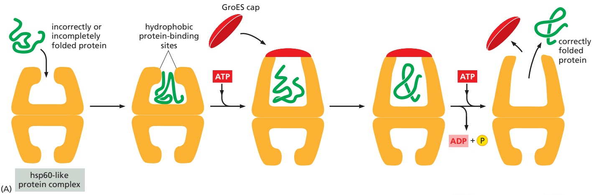
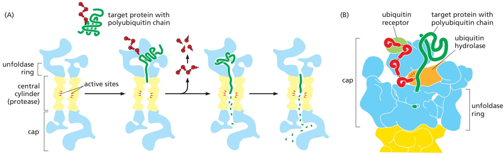
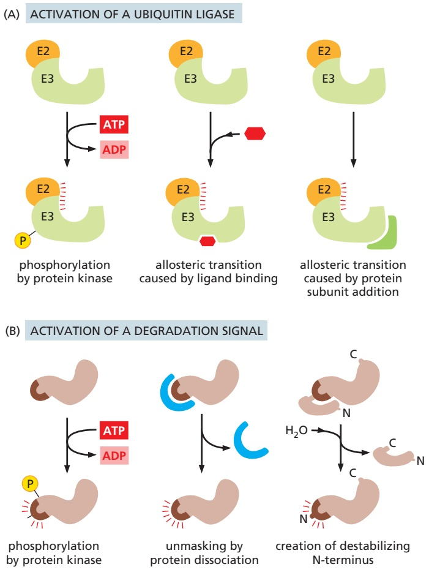
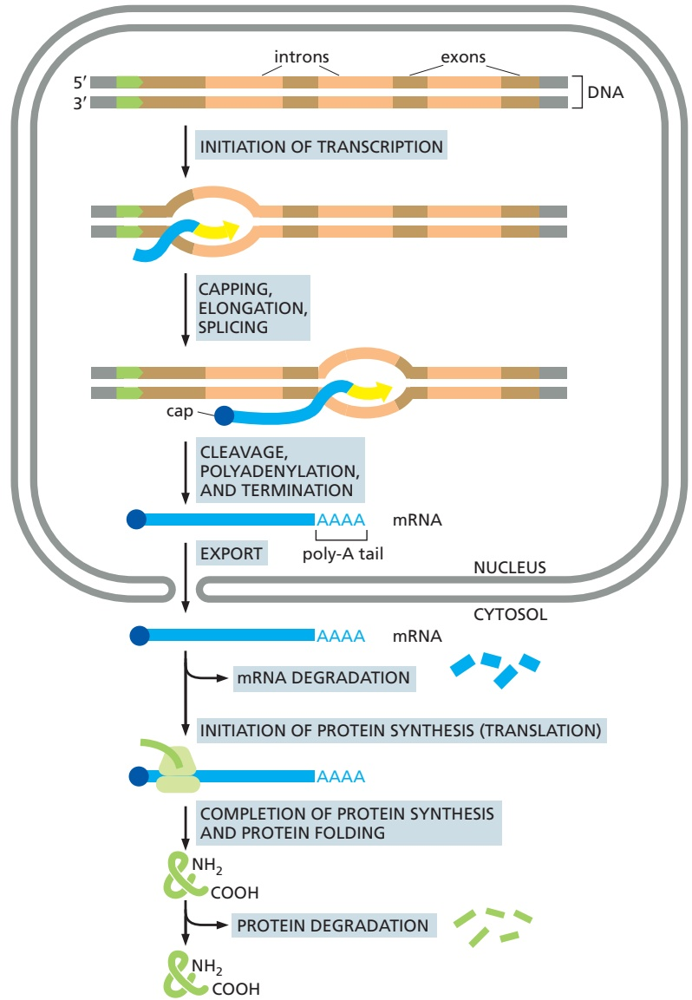
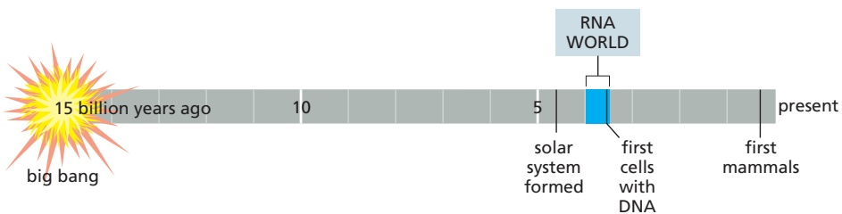
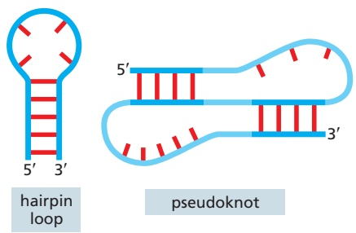
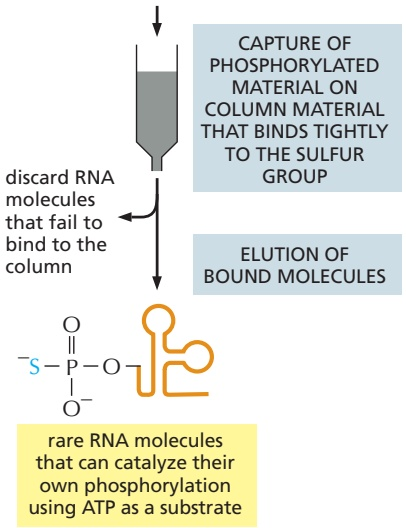

are so abundant that all proteins should be considered to be embedded in a rich soup of these molecules.

There are several major families of molecular chaperones, including the hsp60 and hsp70 proteins, with different family members functioning in different organelles. Thus, as discussed in Chapter 12, mitochondria contain their own hsp60 and hsp70 molecules that are distinct from those that function in the cytosol, and a special hsp70 (called BiP) helps to fold proteins in the endoplasmic reticulum.

In all, humans have thirteen hsp70 proteins, including a group that associates with the ribosome and helps nearly all emerging proteins fold correctly. They do this by rapidly binding and releasing short sequences (approximately five amino acids each) as a new protein is pushed through the ribosome exit tunnel. When one of these chaperones encounters a sequence rich in hydrophobic amino acids, which typically form the core of folded proteins, it clamps down on it, thereby delaying the folding of the emerging protein until enough of it has been made to begin to fold correctly. Hydrophobic stretches that emerge early from the ribosome are thereby prevented from aggregating with other hydrophobic surfaces until they can be properly folded into the core of the nascent protein. The hsp70 clamping and release reactions required are regulated by ATP hydrolysis catalyzed by the nucleotide-binding domain of hsp70 (**Figure 6–83**).

Most proteins are at least partially folded when they are released from the ribosome, but the final folding for many occurs as additional hsp70 molecules associate with them away from the ribosome. By undergoing multiple cycles of ATP hydrolysis, these hsp70 molecules allow proteins to complete their folding.

Figure 6–83 The hsp70 family of molecular chaperones. These are among the most abundant of all proteins, constituting several percent of total cell protein, and they thus play prominent roles inside the cell. (A) Short stretches of hydrophobic amino acids that are abnormally exposed in misfolded proteins (green) trigger the hydrolysis of ATP to ADP, causing hsp70 to close down on its substrate, trapping it in an extended conformation. The rebinding of another molecule of ATP will open the hsp70 “clamp,” releasing the substrate in its extended form. Repeated cycles of hsp70 clamping and release, often involving multiple hsp70 molecules on the same target, help fold the target protein by keeping its hydrophobic regions from aggregating. This can continue until these regions are assimilated into the core of the properly folded protein. (B) The threedimensional structures of hsp70 that produce the mechanism schematically illustrated in A. (C) Some hsp70 family members bind to the ribosome and act early in the life of a newly synthesized protein. Aided by other proteins (not shown), ATP-bound hsp70 molecules rapidly bind and release the nascent protein as it emerges from the ribosome. (B, PDB codes: 2KHO and 4JNE.)

Figure 6–84 The structure and function of the hsp60 family of molecular chaperones. (A) A misfolded protein is initially captured by hydrophobic interactions with the exposed surface of the opening. This initial binding often helps to unfold a misfolded protein. The subsequent binding of ATP and a cap releases the substrate protein into an enclosed space, where it has a new opportunity to fold. After about 10 seconds, ATP hydrolysis occurs, weakening the binding of the cap. Subsequent binding of additional ATP molecules ejects the cap, and the protein is released. As indicated, only half of the symmetric barrel operates on a client protein at any one time. This hsp type of chaperone, known also as a chaperonin, is designated as hsp60 in mitochondria, TRiC in the cytosol of vertebrate cells, and GroEL in bacteria. (B) The structure of GroEL bound to its GroES cap, as determined by x-ray crystallography. On the left is shown the outside of the barrel-like structure, and on the right is a cross section through its center. (B, adapted from B. Bukau and A.L. Horwich, Cell 92:351–366, 1998. With permission from Elsevier.)

Some proteins produced by the cell cannot properly fold with help from the hsp70 proteins alone, and other types of chaperones are brought into play. An important class is exemplified by the hsp60 proteins. These form a large barrelshaped structure that acts after a protein has been fully synthesized but before it has folded correctly. This type of chaperone, sometimes called a chaperonin,MBoC7 m6.81/6.84 forms an “isolation chamber” for the folding process (**Figure 6–84**). As we have seen, incorrectly folded proteins are often characterized by exposed hydrophobic patches. The entrance to the hsp chamber is itself hydrophobic and attracts these patches. In conjunction with ATP binding, the lid to the chamber closes, forcing the incorrectly folded protein into the chamber interior and causing a twisting of the chamber subunits whereby some of the hydrophobic surfaces of the inner chamber are moved out of the way and replaced with hydrophilic surfaces. The substrate protein is thereby given a chance to fold into its final configuration (which generally favors hydrophilic amino acids on its outside) in the absence of any other proteins with which to aggregate. When ATP is hydrolyzed, the lid pops off, and the substrate protein, whether correctly folded or not, is released from the chamber.

Folding and maintaining the enormous diversity of proteins in cells require a wide range of chaperones with versatile surveillance and correction capabilities. Although our discussion has focused on only two types of chaperones, the cell has a variety of others. These include an hsp90 chaperone that can harness mechanical forces to help proteins fold as part of a collaborative chaperone network (**Figure 6–85**).

The hsp70, hsp60, and hsp90 chaperones often need many cycles of ATP binding and hydrolysis to fold a single polypeptide chain correctly. This energy is used to create movements in each of these chaperone “machines,” converting them back and forth between binding and releasing conformations. Thus, just as we saw for transcription, splicing, and translation, a great deal of free energy is used by cells to improve the accuracy of a biological process—in this case the correct folding of proteins (**Movie 6.11**).

Figure 6–85 Different chaperones cooperate to ensure correct protein folding. As illustrated here, many proteins require more help to fold correctly than hsp70 can provide. Detected by their exposed hydrophobic regions, these proteins can be passed—as a complex of the target protein with hsp70—to either hsp90 or a chaperonin, where they are subjected to an alternative type of folding catalysis.

## Proper Folding of Newly Synthesized Proteins Is Also Aided by Translation Speed and Subunit Assembly

In addition to the highly abundant chaperones, two additional mechanisms help to correctly fold newly synthesized proteins. First, translation is not a smooth process; the ribosome moves in fits and starts, translating some RNA sequences rapidly and pausing at others. The pauses are typically caused by a series of rare codons (which require extra time for the corresponding low-abundance charged tRNAs to enter the ribosome by diffusion) or by mRNA secondary structures thatMBoC7 n6.187/6.85 form ahead of the ribosome, slowing down or temporarily blocking its smooth passage. It is thought that many of these pauses are not accidental; rather, they are spaced to allow extra time for “problem” portions of newly synthesized proteins to fold as they exit the ribosome. If true, it means that an mRNA molecule, in addition to coding for a protein, specifies changes in the speed of translation matched to its protein’s folding characteristics.

A second mechanism reflects the fact that a protein molecule does not typically work on its own; instead, it usually assembles with other subunits to form multisubunit structures. As a protein emerges from the ribosome, it often begins assembling with one or more of its fully folded partner subunits, which, by acting as complementary surfaces, help the newly synthesized protein adopt its correct three-dimensional structure. We have seen in both bacteria and eukaryotes that a given mRNA molecule can be simultaneously translated by many ribosomes. For protein complexes made up of identical subunits, fully synthesized protein molecules will therefore always be in proximity to aid in the folding of those being synthesized. In bacteria, different proteins can be translated from the same mRNA, providing an opportunity for different subunits of a protein complex to efficiently help each other fold. In eukaryotes, where only a single protein is typically produced from each mRNA, it has been proposed that mRNAs that code for different subunits of a protein complex are held in proximity, perhaps by information in the untranslated portion of the message, providing a high local concentration of mature subunits to aid in the assembly and folding of newly synthesized subunits.

## Proteins That Ultimately Fail to Fold Correctly Are Marked for Destruction by Polyubiquitin

We have seen that the cell relies on many resources to ensure that a newly synthesized protein is folded properly. Yet occasionally, normal proteins simply fail to fold properly despite numerous attempts. In addition, errors in transcription, RNA splicing, and translation can produce aberrant proteins that will never fold properly. Finally, proteins that were once correctly folded can become damaged by chemical reactions (such as oxidation), which can cause their misfolding. In all these cases, the cell destroys the aberrant protein. Although the cell uses many cues to ascertain whether a given protein is misfolded, the most important is an exposed hydrophobic patch, the same signal that is recognized by chaperones. The continued presence of a chaperone is thus an indication that the protein has failed to fold. In this case, a series of specialized enzymes recognizes the hydrophobic patch (possibly with the aid of chaperones) and attaches the small protein ubiquitin to a nearby lysine (see Figure 3–65A). Additional ubiquitin molecules are subsequently added to build a polyubiquitin chain. As we saw in Chapter 3, ubiquitin modification of proteins is used for many purposes in the cell. The particular type of ubiquitin linkage that concerns us here is a chain of ubiquitin molecules linked together at lysine 48 (see Figure 3–65B), which is the distinguishing feature of the ubiquitin tag that marks a protein for destruction. This polyubiquitin chain delivers the protein to a protein-destruction machine, a complex protease known as the proteasome.

## The Proteasome Is a Compartmentalized Protease with Sequestered Active Sites

**Proteasomes** are very abundant, constituting approximately 1% of the total proteins in cells. They are dispersed throughout the cytosol and the nucleus, but the proteasome also destroys aberrant proteins that have entered the endoplasmic reticulum (ER). In this case, an ER-based surveillance system detects proteins that have failed either to fold or to be assembled properly after they enter the ER and retrotranslocates them back to the cytosol for degradation by the proteasome (discussed in Chapter 12).

Each proteasome consists of a central hollow cylinder (the 20S core proteasome) formed from multiple protein subunits that assemble as a stack of four heptameric rings. Some of the subunits are proteases whose active sites face the cylinder’s inner chamber, thus preventing them from running rampant through the cell. Each end of the cylinder is normally associated with a large protein complex (the 19S cap) that contains a six-subunit protein ring through which target proteins are threaded into the proteasome core, where they are degraded (**Figure 6–86**). The threading reaction, driven by ATP hydrolysis, unfolds the target

Figure 6–86 The proteasome. (A) A cutaway view of the structure of the central 20S cylinder, as determined by x-ray crystallography, with the active sites of the proteases indicated by red dots. (B) The entire proteasome, in which the central cylinder (yellow) is supplemented by a 19S cap (blue) at each end. The complex cap selectively binds proteins that are marked by ubiquitin for destruction; if the protein also contains a loosely structured region, the cap uses ATP hydrolysis to further unfold its polypeptide chain and feed it through the narrow channel (see Figure 6–87) into the inner chamber of the 20S cylinder for digestion to short peptides. (B, from W. Baumeister et al., Cell 92:367–380, 1998. With permission from Elsevier.)

Figure 6–87 Processive protein digestion by the proteasome. (A) The proteasome cap recognizes proteins marked by a polyubiquitin chain (see Figure 3–65B). Most of these proteins also contain an unfolded region, and the cap translocates these proteins into the proteasome core, where they are digested. Before moving through the proteasome cap, the ubiquitin is cleaved from the substrate protein and is recycled. Translocation into the core of the proteasome is mediated by a ring of ATPases that unfold the substrate protein as it is threaded through the ring and into the proteasome core. (B) Detailed structure of the proteasome cap. The cap includes a ubiquitin receptor, which holds a ubiquitylated protein in place while attempts are made to pull it into the proteasome core, and a ubiquitin hydrolase, which cleaves ubiquitin from the protein. (A, from S. Prakash and A. Matouschek, Trends Biochem. Sci. 29:593–600, 2004. With permission from Elsevier; B, adapted from G.C. Lander et al., Nature 482:186–191, 2012.)

proteins as they move through the cap, exposing them to the proteases lining the proteasome core (**Figure 6–87**). The proteins that make up the ring structure in the proteasome cap belong to a large class of protein “unfoldases” known as AAA. / . proteins. Many of them function as hexamers, and they share mechanistic features with the ATP-dependent DNA helicases that unwind DNA (**Figure 6–88**; see also Figure 5–14).

Figure 6–88 A hexameric protein unfoldase. (A) The proteasome cap includes a hexameric ring (blue) through which proteins to be destroyed are threaded. The hexameric ring (also called the unfoldase ring) is formed from six subunits, each belonging to the AAA family of proteins. (B) Model for the ATP-dependent unfoldase activity of AAA proteins. The ATP-bound form of a hexameric ring of AAA proteins grasps a substrate protein, and a conformational change, driven by ATP hydrolysis, further pulls the substrate and strains the ring structure. At this point, the substrate protein, which is being tugged upon, can partially unfold and enter further into the pore or it can maintain its structure and partially withdraw. Some protein substrates may require hundreds of cycles of ATP hydrolysis and dissociation before they are successfully pulled through the AAA protein ring; some proteins continue to resist these efforts and are ultimately de-ubiquitylated and released. (C) How the successive tilting of adjacent subunits (only two of which are shown), driven by ATP hydrolysis, is thought to pull the unfolded polypeptide chain through the hexameric ring into the proteasome. The motions of the ring subunits resemble a hand-over-hand pulling motion on the substrate protein, with the hands often slipping until the substrate is unfolded. Once unfolding occurs, the substrate protein moves relatively quickly through the ring by successive rounds of ATP hydrolysis. (A, adapted from G.C. Lander et al., Nature 482:186–191, published 2012 by Macmillan Publishers Ltd. Reproduced with permission of SNCSC; B, adapted from R.T. Sauer et al., Cell 119:9–18, 2004.)

A crucial property of the proteasome, and one reason for its complexity, is the processivity of its mechanism: in contrast to a “simple” protease that cleaves a substrate’s polypeptide chain just once before dissociating, the proteasome keeps the entire substrate bound until all of it is converted into short peptides. One would expect that a machine as efficient as the proteasome would be tightly regulated; in particular, it must be able to distinguish abnormal proteins from those that are properly folded. The 19S cap of the proteasome acts as a gate at the entrance to the inner proteolytic core, and only those proteins to be destroyed are threaded through the cap. We saw above that proteins marked for destruction are distinguished by carrying a particular type of polyubiquitin chain. This chain binds specifically to a receptor in the 19S cap of the proteasome, and here a second “check” is made by the cell to determine whether or not the protein will be destroyed. If the protein has, in addition to the ubiquitin mark, an unfolded region (which can span the mark), it is grasped tightly by the 19S cap, de-ubiquitylated, and pulled through the cap into the proteasome core. Ubiquitylated proteins that lack such a region are typically de-ubiquitylated and released back into solution.

As might be expected, there is competition for misfolded proteins between chaperones and the protein degradation machinery. Proteins that are folded quickly escape destruction (at least early in their life before they accumulate damage), whereas those that undergo many rounds of chaperone-assisted folding are more likely to be degraded. Some chaperones can directly hand off those proteins that remain improperly folded, after many attempts, to the protein destruction machinery. It is estimated that between 1 and 5% of all newly synthesized proteins fail to fold properly and are degraded by the proteasome.

## Many Proteins Are Controlled by Regulated Destruction

One function of intracellular proteolytic mechanisms is to recognize and eliminate misfolded or otherwise abnormal proteins, as just described. Indeed, every protein in the cell eventually accumulates damage and is probably degraded by the proteasome. Yet another function of these proteolytic pathways is to confer short lifetimes on specific normal proteins whose concentrations must change promptly with alterations in the state of a cell. Some of these short-lived proteins are degraded rapidly at all times, while many others are conditionally short-lived; that is, they are metabolically stable under some conditions but become unstable upon a change in the cell’s state. For example, mitotic cyclins are long-lived throughout the cell cycle until their sudden degradation at the end of mitosis, as explained in Chapter 17.

How is such a regulated destruction of a protein controlled? Many such proteins contain short, unfolded regions, and a key step in regulating their destruction is the addition of ubiquitin. Several general mechanisms for controlling this step are illustrated in Figure 6–89. Specific examples of each mechanism are discussed in later chapters. In one general class of mechanism (Figure 6–89A), the activity of a ubiquitin ligase is turned on either by E3 phosphorylation or by an allosteric transition in an E3 protein caused by its binding to a specific small or large molecule. For example, the anaphase-promoting complex/cyclosome (APC/C) is a multisubunit ubiquitin ligase that is activated by a cell-cycle-timed subunit addition at mitosis. The activated APC then recognizes specific amino acid sequences in mitotic cyclins and several other regulators of the metaphase–anaphase transition and ubiquitylates them, thereby sending them to the proteasome (see Figure 17–18). We saw another example of regulated destruction earlier in this chapter, where a nascent polypeptide extending from a stalled ribosome is ubiquitylated, targeting it for destruction. Here, the signal for bringing the ubiquitin ligase into proximity to its target is a “gummed up” large ribosome subunit (see Figure 6–81).

Alternatively, in response either to intracellular signals or to signals from the environment, a ubiquitylation site can be created in a protein (Figure 6–89B). One common way to create such a signal is by phosphorylation of a specific amino acid sequence, which completes a ubiquitin ligase recognition site on the protein. Another is preexisting degradation signals that are unmasked by the regulated dissociation of a protein subunit. Finally, powerful degradation signals can be created by cleaving a single peptide bond, provided that this cleavage creates a new N-terminus that is recognized by a specific E3 protein as a “destabilizing” N-terminal residue. This E3 protein recognizes only certain amino acids at the N-terminus of a protein; thus, not all protein-cleavage events will lead to degradation of the C-terminal fragment produced.

Figure 6–89 Two general ways of inducing the destruction of a specific protein. (A) Activation of a specific E3 molecule creates a new ubiquitin ligase. Eukaryotic cells have many different E3 molecules, each activated by a different signal. (B) Creation of an exposed destruction signal in the protein to be degraded. This signal binds a ubiquitin ligase, causing the addition of a polyubiquitin chain to a nearby lysine on the target protein. All six pathways shown are known to be used by cells to induce the movement of selected proteins into the proteasome for destruction.

In humans, nearly 70% of cytosolic proteins are acetylated on their N-terminal residue, and we now know that this modification is recognized by a specific E3 enzyme, which directs the ubiquitylation of the protein and sends it to the proteasome for degradation. Thus, the majority of human proteins carry their own signals for destruction. It has been proposed that when a protein is properly folded (and, before that, when it is in contact with a chaperone), this acetylated N-terminus is buried and therefore inaccessible to the E3. According to this idea, as a protein ages and becomes damaged (or if it fails to fold correctly from the start), this destruction signal becomes exposed, and the protein is destroyed.

## There Are Many Steps from DNA to Protein

We have seen in this chapter that many different types of chemical reactions are required to produce a properly folded protein from the information contained in a gene (**Figure 6–90**). The final level of a useful protein in a cell therefore depends on the efficiency with which each of the many steps is performed. We also now know that the cell devotes enormous resources to selectively degrading proteins, particularly those that fail to fold properly or accumulate damage as they age. It is the balance between the rates of synthesis and degradation that determines the final amount of every protein in the cell.

Figure 6–90 The production of a protein by a eukaryotic cell: a summary. The final level of each protein in a eukaryotic cell depends on the efficiency of each step depicted.

In the following chapter, we shall see that cells have the ability to change the levels of their proteins according to their needs. In principle, any or all of the steps in Figure 6–90 could be regulated for each individual pro-MBoC7 m6.87/6.90 tein. As we shall see, there are examples of regulation at each step from gene to protein.

## Summary

The translation of the nucleotide sequence of an mRNA molecule into protein takes place in the cytosol on a large ribonucleoprotein assembly called a ribosome. Each amino acid used for protein synthesis is first attached to a tRNA molecule that recognizes, by complementary base-pair interactions, a particular set of three nucleotides (codons) in the mRNA. As an mRNA is threaded through a ribosome, its sequence of nucleotides is then read from one end to the other in sets of three according to the genetic code.

To initiate translation, a small ribosomal subunit binds to the mRNA molecule at a start codon (AUG) that is recognized by a unique initiator tRNA molecule.

A large ribosomal subunit then binds to complete the ribosome and begin protein synthesis. During this phase, aminoacyl-tRNAs—each bearing a specific amino acid—bind sequentially to the appropriate codons in mRNA through complementary base-pairing between tRNA anticodons and mRNA codons. Each amino acid is added to the C-terminal end of the growing polypeptide in four sequential steps: aminoacyl-tRNA binding, followed by peptide bond formation, followed by two ribosome translocation steps. Elongation factors use GTP hydrolysis both to drive these reactions forward and to improve the accuracy of amino acid selection. The mRNA molecule progresses codon by codon through the ribosome in the 5′-to-3′ direction until it reaches one of three stop codons. A release factor then binds to the ribosome, terminating translation and releasing the completed polypeptide.

Eukaryotic and bacterial ribosomes are closely related, despite differences in the number and size of their rRNA and protein components. The rRNA has the dominant role in translation, determining the overall structure of the ribosome, forming the binding sites for the tRNAs, matching the tRNAs to codons in the mRNA, and creating the active site of the peptidyl transferase enzyme that links amino acids together during translation.

Several distinct types of molecular chaperones, including hsp60 and hsp70, illustrate how the energy of ATP hydrolysis is used to help newly synthesized proteins assume their correct three-dimensional conformations. This protein-folding process competes with a control mechanism that destroys proteins that are abnormally folded by recognizing exposed hydrophobic patches and other unstructured regions. In this case, ubiquitin is covalently added to a misfolded protein by a ubiquitin ligase, and the resulting polyubiquitin chain is recognized by the cap on a proteasome that unfolds the protein as it is threaded into the interior of the proteasome for proteolytic degradation. A closely related proteolytic mechanism, based on special degradation signals recognized by ubiquitin ligases, is used to determine the lifetimes of many normally folded proteins, as well as to remove selected proteins from the cell in response to specific signals.

## THE RNA WORLD AND THE ORIGINS OF LIFE

We have seen that the expression of hereditary information requires extraordinarily complex machinery and proceeds from DNA to protein through an RNA intermediate. This machinery presents a central paradox: if nucleic acids are required to synthesize proteins and proteins are required, in turn, to synthesize nucleic acids, how did such a system of interdependent components ever arise? A widely held view is that an **RNA world** existed on Earth before modern cells arose (**Figure 6–91**). According to this hypothesis, RNA not only stored genetic information but also directly catalyzed the chemical reactions in primitive cells— thus serving as enzymes (“ribozymes”). Only later in evolutionary time did DNA take over as the genetic material and proteins become the major catalysts and structural components of cells. But the transition out of the RNA world was never complete; as we have seen in this chapter, RNA still catalyzes several fundamental reactions in modern-day cells, which can be viewed as molecular holdovers from an earlier world.

Figure 6–91 Timeline for the universe, highlighting the possible early existence of an “RNA world” in the evolution of Earth’s living systems.

The RNA world hypothesis relies on the fact that, among present-day biological molecules, RNA is unique in being able to act as both a carrier of genetic information and as a catalyst for chemical reactions. In this section, we discuss these properties of RNA and how they may have been especially important in early cells.

## Single-Strand RNA Molecules Can Fold into Highly Elaborate Structures

We have seen in this chapter that RNA can carry genetic information in mRNAs, and we saw in Chapter 5 that the genomes of some viruses are composed solely of RNA. We have also seen that complementary base-pairing and other types of hydrogen bonds can occur between nucleotides in the same chain of RNA, causing an RNA molecule to fold up in a unique way that is determined by its nucleotide sequence (see, for example, Figures 6–54 and 6–71). Comparisons of many RNA structures have revealed conserved structural motifs, short elements that often appear as parts of larger structures (**Figure 6–92**).

Protein catalysts require a surface with unique contours and chemical properties on which a given set of substrates can react (discussed in Chapter 3). In exactly the same way, an RNA molecule with an appropriately folded shape can serve as a catalyst (**Figure 6–93**). Like some proteins, many of these ribozymes work by positioning metal ions at their active sites. This feature gives them a wider range of catalytic activities than can be provided by the limited chemical groups of a polynucleotide chain.

Figure 6–92 Some common elements of RNA structure. Conventional, complementary base-pairing interactions are indicated by red “rungs” in doublehelical portions of the RNA.

## Ribozymes Can Be Produced in the Laboratory

Much of our inference about the RNA world has come from experiments in which large pools of RNA molecules of random nucleotide sequences are generated in the laboratory. Those rare RNA molecules with a property specified by the experimenter are then selected out and studied (**Figure 6–94**). Experiments of this type have created RNAs that can catalyze a wide variety of biochemical reactions (**Table 6–5**), with reaction rate enhancements only a few orders of magnitude lower than those of the “fastest” protein enzymes. Given these findings, it is not clear why protein catalysts greatly outnumber ribozymes in modern cells. Experiments have shown, however, that RNA molecules may have more difficulty than proteins in binding to flexible, hydrophobic substrates and in forming pockets specific for different small molecules. The availability of 20 types of amino acids

Figure 6–93 The activity of a well-studied ribozyme. This simple RNA molecule catalyzes the cleavage of a second RNA at a specific site. This ribozyme is found embedded in larger RNA genomes called viroids, which infect plants. The cleavage, which occurs in nature at a distant location on the same RNA molecule that contains the ribozyme, is a step in the replication of the viroid genome. Although not shown in the figure, the reaction requires a magnesium ion positioned at the active site. (Adapted from T.R. Cech and O.C. Uhlenbeck, Nature 372:39–40, 1994.)

Figure 6–94 In vitro selection of a synthetic ribozyme. Beginning with a large pool of different nucleic acid molecules synthesized in the laboratory, those rare RNA molecules that possess a specified catalytic activity can be isolated and studied. Although only one specific example (that of an autophosphorylating ribozyme) is shown, variations of this procedure have been used to generate many of the ribozymes listed in Table 6–5. For the strategy shown here, the RNA molecules are kept sufficiently dilute during the phosphorylation step to prevent the “cross-phosphorylation” of other RNA molecules. In reality, several repetitions of this procedure are necessary to select the very rare RNA molecules with this catalytic activity. Thus, the material initially eluted from the column is converted back into DNA, amplified many-fold (using reverse transcriptase and PCR, as explained in Chapter 8), transcribed back into RNA, and subjected to repeated rounds of selection. (Adapted from J.R. Lorsch and J.W. Szostak, Nature 371:31–36, 1994.)

large pool of double-strand DNA molecules, each with a different, randomly generated nucleotide sequence

presumably provides proteins with a much greater number of binding and catalytic strategies.

## RNA Can Both Store Information and Catalyze Chemical Reactions

RNA molecules have one property that contrasts with those of proteins: they can directly guide the formation of copies of their own sequence. This capacity depends on complementary base-pairing of their nucleotide subunits, which enables one RNA to act as a template for the formation of another. As we have seen in this and the preceding chapter, these complementary templating mechanisms lie at the heart of DNA replication and transcription in modern-day cells. But the efficient synthesis of RNA by such complementary templating mechanisms requires catalysts to promote the polymerization reaction: without catalysts, polymer formation would be slow, error-prone, and inefficient.

<table><tbody><tr><td colspan="2">TABLE 6-5 Some Biochemical Reactions That Can Be Catalyzed by Ribozymes</td></tr><tr><td>Activity</td><td>Ribozymes</td></tr><tr><td>Peptide bond formation in protein synthesis</td><td>Ribosomal RNA</td></tr><tr><td>RNA cleavage, RNA ligation</td><td>Self-splicing RNAs; RNase P; also in vitro selected RNA</td></tr><tr><td>DNA cleavage</td><td>Self-splicing RNAs</td></tr><tr><td>RNA splicing</td><td>Self-splicing RNAs; RNAs of the spliceosome</td></tr><tr><td>RNA polymerization</td><td>In vitro selected RNA</td></tr><tr><td>RNA and DNA phosphorylation</td><td>In vitro selected RNA</td></tr><tr><td>RNA aminoacylation</td><td>In vitro selected RNA</td></tr><tr><td>RNA alkylation</td><td>In vitro selected RNA</td></tr><tr><td>Amide bond formation</td><td>In vitro selected RNA</td></tr><tr><td>Glycosidic bond formation</td><td>In vitro selected RNA</td></tr><tr><td>Oxidation-reduction reactions</td><td>In vitro selected RNA</td></tr><tr><td>Carbon-carbon bond formation</td><td>In vitro selected RNA</td></tr><tr><td>Phosphoamide bond formation</td><td>In vitro selected RNA</td></tr><tr><td>Disulfide exchange</td><td>In vitro selected RNA</td></tr></tbody></table>

large pool of single-strand RNA molecules, each with a different, randomly generated nucleotide sequence

only the rare RNA molecules able to phosphorylate themselves incorporate sulfur

discard RNA molecules that fail to bind to the column

CAPTURE OF PHOSPHORYLATED MATERIAL ON COLUMN MATERIAL THAT BINDS TIGHTLY TO THE SULFUR GROUP

ELUTION OF BOUND MOLECULES

rare RNA molecules that can catalyze their own phosphorylation using ATP as a substrate

Figure 6–95 An RNA molecule that can catalyze its own synthesis. This hypothetical process would require synthesis of a second RNA strand complementary to the original strand (not shown) and the use of this second RNA molecule as a template to synthesize many molecules of RNA possessing the original sequence. The red rays represent the active site of this hypothetical RNA enzyme (ribozyme).

Because RNA has all the properties required of a molecule that could catalyze a variety of chemical reactions, including those that lead to its own synthesis (**Figure 6–95**), it has been proposed that RNAs served long ago as the catalysts for their own template-dependent RNA synthesis. Although self-replicating systems of RNA molecules have not been found in nature, scientists have made progress toward constructing such systems in the laboratory. Experiments of this type cannot prove that self-replicating RNA molecules were central to the origin of life on Earth, but they can help establish whether such a scenario is plausible.

Today, there is a widespread interest in investigating the exciting possibility that a primitive form of life once existed, or may even still exist, in some water-containing regions below the surface of Mars. Vehicles are being sent to promising sites on that planet to collect subterranean samples for eventual return to Earth, with the hope that their analysis will allow scientists to refine scenarios like that just described.

## How Did Protein Synthesis Evolve?

The molecular processes underlying protein synthesis in present-day cells seem inextricably complex. Although we understand most of them, they do not make conceptual sense in the way that DNA transcription, DNA repair, and DNA replication do. It is especially difficult to imagine how protein synthesis evolved because it is now performed by a complex interlocking system of protein and RNA molecules; obviously, the proteins could not have existed until an early version of the translation apparatus was already in place. As attractive as the RNA world idea is for envisioning early life, it does not explain how the modern-day system of protein synthesis arose.

In modern cells, some short peptides (such as antibiotics) are synthesized without the ribosome; peptide synthetase enzymes assemble these peptides, with their proper sequence of amino acids, without mRNAs to guide their synthesis. It is plausible that this noncoded, primitive version of protein synthesis first developed in the RNA world, where it would have been catalyzed by RNA molecules. This idea presents no conceptual difficulties because, as we have seen, rRNA catalyzes peptide bond formation in present-day cells. Moreover, short simple peptides (for example, polylysine) have been shown to enhance the function of ribozymes created in the laboratory, raising the possibility that the first peptides were “selected” for their ability to help RNA molecules fold, assemble with each other, and catalyze reactions. These ideas, however, leave unexplained how the genetic code—which lies at the core of protein synthesis in today’s cells—might have arisen. We know that ribozymes created in the laboratory can perform specific aminoacylation reactions; that is, they can match specific amino acids to specific tRNAs. It is therefore possible that tRNA-like adaptors, each matched to a specific amino acid, could have arisen in the RNA world, marking the beginnings