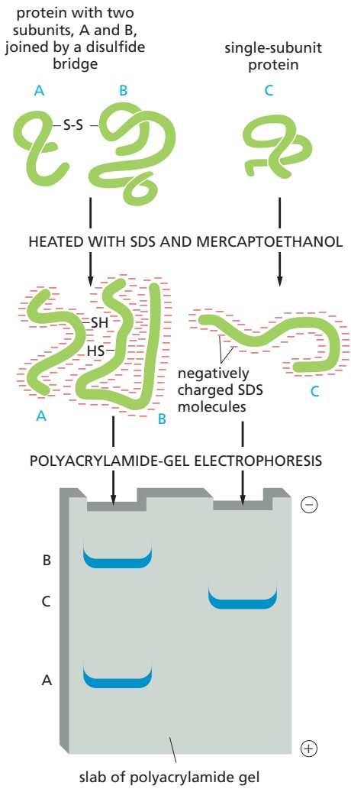
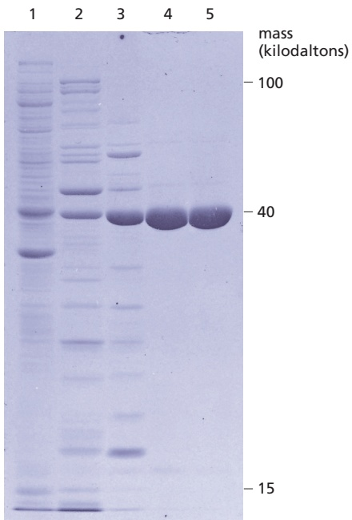
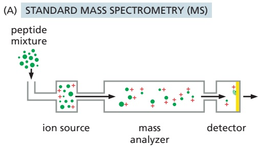
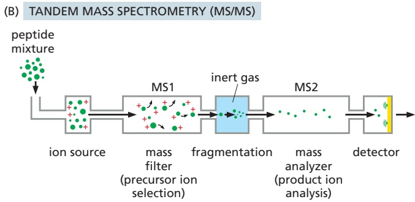
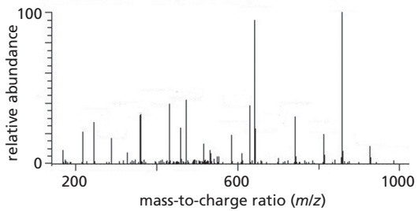
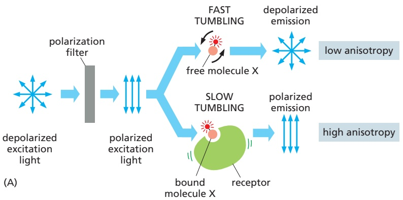
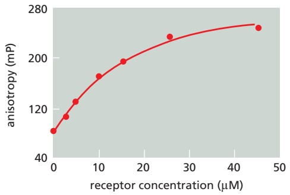
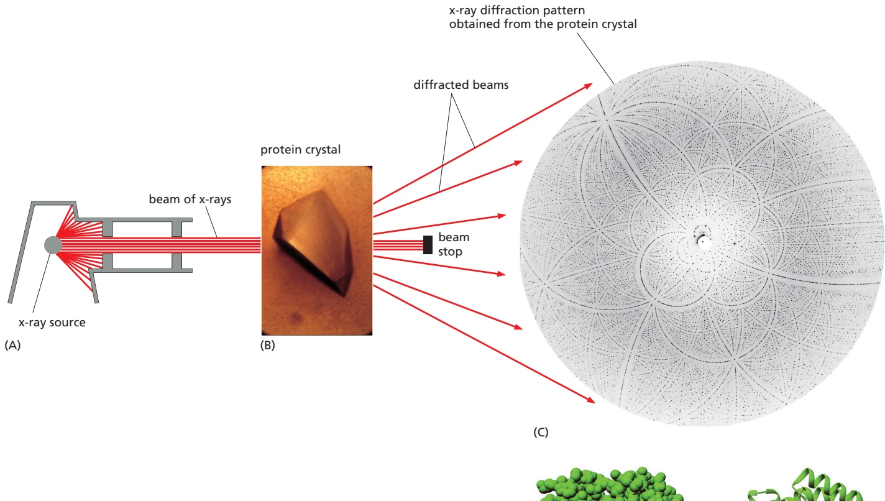
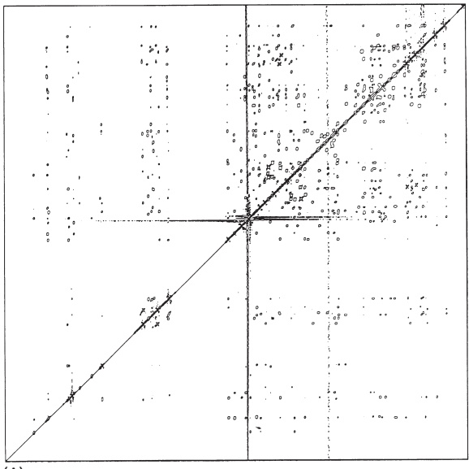

ANALYZING PROTEINS

487

individual macromolecules that are needed to catalyze a biological process of interest. For example, the experiments to decipher the mechanisms of protein synthesis began with a cell homogenate that could translate RNA molecules to produce proteins. Fractionation of this homogenate, step by step, produced in turn the ribosomes, tRNAs, and various enzymes that together constitute the protein-synthetic machinery. Once individual pure components were available, each could be added or withheld separately to define its exact role in the overall process.

A major goal for cell biologists is the reconstitution of every biological process in a purified cell-free system. Only in this way can we define all of the components needed for the process and control their concentrations, which is required to work out their precise mechanism of action. Although much remains to be done, a great deal of what we know today about the molecular biology of the cell has been discovered by studies in such cell-free systems. They have been used, for example, to decipher the molecular details of DNA replication and DNA transcription, RNA splicing, protein translation, muscle contraction, particle transport along microtubules, and many other processes that occur in cells.

## Summary

Populations of cells can be analyzed biochemically by disrupting them and fractionating their contents, allowing functional cell-free systems to be developed. Highly purified cell-free systems are needed for determining the molecular details of complex cell processes, and the development of such systems requires extensive purification of all the proteins and other components involved. The proteins in soluble cell extracts can be purified by column chromatography; depending on the type of column matrix, biologically active proteins can be separated on the basis of their molecular weight, hydrophobicity, charge characteristics, or affinity for other molecules. In a typical purification, the sample is passed through several different columns in turn, with the enriched fractions obtained from one column being applied to the next. Recombinant DNA techniques (described later) allow special recognition tags to be attached to proteins, thereby greatly simplifying their purification.

## ANALYZING PROTEINS

Proteins perform most cellular processes: they catalyze metabolic reactions, use nucleotide hydrolysis to do mechanical work, and serve as the major structural elements of the cell. The great variety of protein structures and functions has stimulated the development of a multitude of techniques to study them.

## Proteins Can Be Separated by SDS Polyacrylamide-Gel Electrophoresis

Proteins usually possess a net positive or negative charge, depending on the mixture of charged amino acids they contain. An electric field applied to a solution containing a protein molecule causes the protein to migrate at a rate that depends on its net charge and on its size and shape. The most useful application of this property is **sodium dodecyl sulfate polyacrylamide-gel electrophoresis (SDS-PAGE)**. It uses a highly cross-linked gel of polyacrylamide as the inert matrix through which the proteins migrate. The gel is prepared by polymerization of monomers; the pore size of the gel can be adjusted so that it is small enough to retard the migration of the protein molecules of interest. The proteins are dissolved in a solution that includes a powerful negatively charged detergent, sodium dodecyl sulfate, or SDS (**Figure 8–12**). Because this detergent binds to hydrophobic regions of the protein molecules, causing them to unfold into extended polypeptide chains, the individual protein molecules are released from their associations with other proteins or lipid molecules and rendered freely soluble in the detergent solution. In addition, a reducing agent such as β-mercaptoethanol


Figure 8–12 The detergent sodium dodecyl sulfate (SDS) and the reducing agent b-mercaptoethanol. These two chemicals are used to solubilize proteins for SDS polyacrylamide-gel electrophoresis. The SDS is shown here in its ionized form.

---

488

Chapter 8: Analyzing Cells, Molecules, and Systems

(see Figure 8–12) is usually added to break any disulfide linkages in the proteins, so that all of the constituent polypeptides in multisubunit proteins can be analyzed separately.

What happens when a mixture of SDS-solubilized proteins is run through a slab of polyacrylamide gel? Each protein molecule binds large numbers of the negatively charged detergent molecules, which mask the protein’s intrinsic charge and cause it to migrate toward the positive electrode when a voltage is applied. Proteins of the same size tend to move through the gel with similar speeds because (1) their native structure is completely unfolded by the SDS, so that their shapes are the same, and (2) they bind the same amount of SDS and therefore have the same amount of negative charge. Larger proteins, with more charge, are subjected to larger electrical forces but also to a larger drag. In free solution, the two effects would cancel out, but, in the mesh of the polyacrylamide gel, which acts as a molecular sieve, large proteins are retarded much more than small ones. As a result, a complex mixture of proteins is fractionated into a series of discrete protein bands mostly according to their mass (**Figure 8–13**). The major proteins are readily detected by staining the proteins in the gel with a dye such as Coomassie blue. When small amounts of protein are present and more sensitive methods are required, gels can be treated with a silver stain, which will detect as little as 10 ng of protein in a band. For some purposes, specific proteins can also be labeled with a radioactive isotope tag; exposure of the gel to film or a radiation detector results in an autoradiograph on which the labeled proteins are visible (see Figure 8–16).

SDS-PAGE is widely used because it can separate all types of proteins, including those that are normally insoluble in water—such as the many proteins in


Figure 8–13 SDS polyacrylamide-gel electrophoresis (SDS-PAGE). (A) An electrophoresis apparatus, in which a polyacrylamide gel is sandwiched between two glass plates, with each end of the gel immersed in a buffer connected to an electrode. (B) Individual polypeptide chains form a complex with negatively charged molecules of sodium dodecyl sulfate (SDS) and therefore migrate as a negatively charged SDS–protein complex through a porous gel of polyacrylamide. Because smaller polypeptides move more quickly through the gel, this technique can be used to determine the approximate mass of a polypeptide chain as well as the subunit composition of a protein complex. If the protein contains a large amount of carbohydrate, however, it will move anomalously on the gel, and its apparent mass estimated by SDS-PAGE will be misleading. Other modifications, such as phosphorylation, can also cause small changes in a protein’s migration in the gel.

(B)



---

ANALYZING PROTEINS

489

Figure 8–14 Analysis of protein samples by SDS polyacrylamide-gel electrophoresis. The photograph shows a Coomassie blue–stained gel that has been used to detect the proteins present at successive stages in the purification of an enzyme. The leftmost lane (lane 1) contains the complex mixture of proteins in the starting cell extract, and each succeeding lane analyzes the proteins obtained after a chromatographic fractionation of the protein sample analyzed in the previous lane (see Figure 8–10). The same total amount of protein (10 μg) was loaded onto the gel at the top of each lane. Individual proteins normally appear as sharp, dye-stained bands; a band broadens, however, when it contains a large amount of protein. (From T. Formosa and B.M. Alberts, J. Biol. Chem. 261:6107–6118, 1986.)

membranes. And because the method separates polypeptides by size, it provides information about the mass and subunit composition of proteins. **Figure 8–14** presents a photograph of a gel that has been used to analyze each of the successive stages in the purification of a protein.

## Two-dimensional Gel Electrophoresis Provides Greater Protein Separation

Because different proteins can have similar sizes, shapes, masses, and overall charges, most separation techniques such as SDS polyacrylamide-gel electrophoresis or ion-exchange chromatography cannot typically separate all the proteins in a cell or even in an organelle. In contrast, **two-dimensional gel electrophoresis**, which combines two different separation procedures, can resolve up to 2000 proteins in the form of a two-dimensional protein map.



In the first step, the proteins are separated by their intrinsic charges. The sample is dissolved in a small volume of a solution containing a nonionic (uncharged) detergent, together with β-mercaptoethanol and the denaturing reagent urea. This solution solubilizes, denatures, and dissociates all the polypeptide chains but leaves their intrinsic charge unchanged. The polypeptide chains are then separated in a pH gradient by a procedure called isoelectric focusing, which takes advantage of the variation in the net charge on a protein molecule with the pH of its surrounding solution. Every protein has a characteristic isoelectric point, the pH at which the protein has no net charge and therefore does not migrate in an electric field. In isoelectric focusing, proteins are separated electrophoretically in a narrow tube of polyacrylamide gel in which a gradient of pH is established by a mixture of special buffers. Each protein moves to a position in the gradient that corresponds to its isoelectric point and remains there (**Figure 8–15**). This is the first dimension of two-dimensional polyacrylamide-gel electrophoresis.

In the second step, the narrow tube of gel containing the separated proteins is soaked in SDS and placed along the top edge of an SDS polyacrylamide-gel slab. Electrophoresis is then carried out as in one-dimensional SDS-PAGE, and each polypeptide chain migrates into the gel to form a discrete spot. The only proteins left unresolved are those that have both identical sizes and identical isoelectric points, a relatively rare situation. Even trace amounts of each polypeptide chain


Figure 8–15 Separation of protein molecules by isoelectric focusing. At low pH (high H+ concentration), the carboxylic acid groups of proteins tend to be uncharged (–COOH) and their nitrogencontaining basic groups fully charged (for example, –NH<sub>3</sub>+), giving most proteins a net positive charge. At high pH, the carboxylic acid groups are negatively charged (–COO–) and the basic groups tend to be uncharged (for example, –NH<sub>2</sub>), giving most proteins a net negative charge. At its isoelectric point, a protein has no net charge because the positive and negative charges balance. Thus, when a tube containing a fixed pH gradient is subjected to a strong electric field in the appropriate direction, each protein species migrates until it forms a sharp band at its isoelectric point, as shown.

---

490

Chapter 8: Analyzing Cells, Molecules, and Systems


Figure 8–16 Two-dimensional polyacrylamide-gel electrophoresis. All the proteins in an Escherichia coli bacterial cell are separated in this gel, in which each spot corresponds to a different polypeptide chain. The proteins were first separated on the basis of their isoelectric points by isoelectric focusing in the horizontal dimension. They were then further fractionated according to their mass by electrophoresis from top to bottom in the presence of SDS. Note that different proteins are present in very different amounts. The bacteria were fed with a mixture of radioisotope-labeled amino acids so that all of their proteins were radioactive and could be detected by autoradiography. (Courtesy of Patrick O’Farrell.)

can be detected on the gel by various staining procedures—or by autoradiography if the protein sample was initially labeled with a radioisotope (**Figure 8–16**). The technique has such great resolving power that it can distinguish between two proteins that differ in only a single charged amino acid or a single negatively charged phosphorylation site.

## Specific Proteins Can Be Detected by Blotting with Antibodies

A specific protein can be identified after its fractionation on a polyacrylamide gel by exposing all the proteins on the gel to a specific antibody that has been labeled with a radioactive isotope or a fluorescent dye. This procedure is normally carried out after transferring all of the separated proteins in the gel onto a sheet of nitrocellulose paper or nylon membrane. Placing the membrane against the gel and driving the proteins out of the gel with a strong electric current transfers the protein onto the membrane. The membrane is then soaked in a solution of labeled antibody to reveal the protein of interest. This method of detecting proteins is called **Western blotting**, or **immunoblotting** (**Figure 8–17**). Sensitive Westernblotting methods can detect very small amounts of a specific protein (1 nanogram or less) in a total cell extract or some other heterogeneous protein mixture. The method can be very useful when assessing the amounts of a specific protein in the cell or when measuring changes in those amounts under various conditions.

## Hydrodynamic Measurements Reveal the Size and Shape of a Protein Complex

Most proteins in a cell are subunits of larger complexes, and knowledge of the size and shape of these complexes often leads to insights regarding their function. This information can be obtained in several ways. Sometimes, a complex can be directly visualized using electron microscopy, as described in Chapter 9. A complementary approach relies on the hydrodynamic properties of a complex; that is, its behavior as it moves through a liquid medium. Usually, two separate measurements are made. One measure is the velocity of a complex as it moves under the influence of a centrifugal field produced by an ultracentrifuge (see Figure 8–6A). The sedimentation coefficient (or S value) obtained depends on both the size and the shape of the complex and does not, by itself, convey especially useful information. However, once a second hydrodynamic measurement is performed—by charting the migration of a complex through a gel-filtration chromatography


Figure 8–17 Western blotting. In this experiment, proteins of the budding yeast Saccharomyces cerevisiae were separated MBoC7 n8.101/8.17on a polyacrylamide gel. In (A), the gel was stained with Coomassie blue to reveal the most abundant proteins. In (B), the proteins in the gel were transferred to a membrane and exposed to antibodies directed against a specific protein. Unbound antibodies were washed away, and antibodies bound to the protein were detected with a fluorescent label. By this sensitive Western blotting method, small amounts of a single rare protein can be detected in a complex mixture of other proteins. (Courtesy of Jonathan Asfaha.)

---

ANALYZING PROTEINS

491

column (see Figure 8–9B)—both the approximate shape of a complex and its mass can be calculated.

The mass of a protein complex can also be determined more directly by using an analytical ultracentrifuge, a complex device that allows protein absorbance measurements to be made on a sample while it is subjected to centrifugal forces. In this approach, the sample is centrifuged until it reaches equilibrium, where the centrifugal force on a protein complex exactly balances its tendency to diffuse away. Because this balancing point is dependent on a complex’s mass but not on its particular shape, the mass can be directly calculated.

## Mass Spectrometry Provides a Highly Sensitive Method for Identifying Unknown Proteins

A frequent problem in cell biology and biochemistry is the identification of a protein or collection of proteins that has been obtained by one of the purification procedures discussed in the preceding pages. Because the genome sequences of most experimental organisms are known, catalogs of all the proteins produced in those organisms are available. The task of identifying an unknown protein (or collection of unknown proteins) thus reduces to matching some of the amino acid sequences present in the unknown sample with known cataloged genes. This task is now performed almost exclusively by mass spectrometry in conjunction with computer searches of databases.

Charged particles have very precise dynamics when subjected to electric and magnetic fields in a vacuum. Mass spectrometry exploits this principle to separate ions according to their mass-to-charge (m/z) ratio. It is an enormously sensitive technique. It requires very little material and is capable of determining the pre-cise mass of intact proteins and of peptides derived from them by enzymatic or chemical cleavage. Masses can be obtained with great accuracy, often with an error of less than one part in a million.

Mass spectrometry is performed using complex instruments with three major components (**Figure 8–18A**). The first is the ion source, which transforms tiny amounts of a peptide sample into a gas containing individual charged peptide molecules. These ions are accelerated by an electric field into the second component, the mass analyzer, where electric or magnetic fields are used to separate the ions on the basis of their mass-to-charge ratios. Finally, the separated ions collide with a detector, which generates a mass spectrum containing a series of peaks representing the masses of the molecules in the sample.

There are many different types of mass spectrometer, varying mainly in the nature of their ion sources and mass analyzers. One of the most common ion sources depends on a technique called matrix-assisted laser desorption ionization (MALDI). In this approach, the proteins in the sample are first cleaved into short peptides by a protease such as trypsin. These peptides are mixed with an organic acid and then dried onto a metal or ceramic slide. A brief laser burst is directed toward the sample, producing a gaseous puff of ionized peptides, each carrying one or more positive charges. In many cases, the MALDI ion source is coupled to a mass analyzer called a time-of-flight (TOF) analyzer, which is a long chamber through which the ionized peptides are accelerated by an electric field toward a detector. Their mass and charge determine the time it takes them to reach the detector: large peptides move more slowly, and more highly charged molecules move more quickly. By analyzing those ionized peptides that bear a single charge, the precise masses of peptides present in the original sample can be determined. This information is then used to search genomic databases, in which the masses of all proteins and of all their predicted peptide fragments have been tabulated from the genomic sequences of the organism. An unambiguous match to a particular open reading frame can often be made by knowing the mass of only a few peptides derived from a given protein.

By employing two mass analyzers in tandem (an arrangement known as tandem mass spectrometry, or MS/MS; **Figure 8–18B**), it is possible to directly determine the amino acid sequences of individual peptides in a complex mixture.

---

492

Chapter 8: Analyzing Cells, Molecules, and Systems








Figure 8–18 The mass spectrometer. (A) Mass spectrometers used in biology contain an ion source that generates gaseous peptides or other molecules under conditions that render most molecules positively charged. The two major types of ion source are MALDI and electrospray, as described in the text. Ions are accelerated into a mass analyzer, which separates the ions on the basis of their mass and charge by one of three major methods: (1) Time-of-flight (TOF) analyzers determine MBoC7 m8.18/8.18the mass-to-charge ratio of each ion in the mixture from the rate at which it travels from the ion source to the detector. (2) Quadrupole mass filters contain a long chamber lined by four electrodes that produce oscillating electric fields that govern the trajectory of ions; by varying the properties of the electric field over a wide range, a spectrum of ions with specific mass-to-charge ratios is allowed to pass through the chamber to the detector, while other ions are discarded. (3) Ion traps contain doughnut-shaped electrodes producing a three-dimensional electric field that traps all ions in a circular chamber; the properties of the electric field can be varied over a wide range to eject a spectrum of specific ions to a detector. (B) Tandem mass spectrometry typically involves two mass analyzers separated by a collision chamber containing an inert, high-energy gas. The electric field of the first mass analyzer is adjusted to select a specific peptide ion, called a precursor ion, which is then directed to the collision chamber. Collision of the peptide with gas molecules causes random peptide fragmentation, primarily at peptide bonds, resulting in a highly complex mixture of fragments containing one or more amino acids from throughout the original peptide. The second mass analyzer is then used to measure the masses of the fragments (called product or daughter ions). With computer assistance, the pattern of fragments can be used to deduce the amino acid sequence of the original peptide.

The MALDI-TOF instrument described above is not ideal for this method. Instead, MS/MS typically involves an electrospray ion source, which produces a continuous thin stream of peptides that are ionized and accelerated into the first mass analyzer. The mass analyzer is typically either a quadrupole or ion trap, which employs large electrodes to produce oscillating electric fields inside the chamber containing the ions. These instruments act as mass filters: the electric field is adjusted over a broad range to select a single peptide ion and discard all the others in the peptide mixture. In tandem mass spectrometry, this single ion is then exposed to an inert, high-energy gas, which collides with the peptide, resulting in fragmentation, primarily at peptide bonds. The second mass analyzer then determines the masses of the peptide fragments, which can be used by computational methods to determine the amino acid sequence of the original peptide and thereby identify the protein from which it came.

Tandem mass spectrometry is also useful for detecting and precisely mapping post-translational modifications of proteins, such as phosphorylation or acetylation. Because these modifications impart a characteristic mass increase to an amino acid, they are easily detected during the analysis of peptide fragments in the second mass analyzer, and the precise site of the modification can often be deduced from the spectrum of peptide fragments.

A powerful, “two-dimensional” mass spectrometry technique can be used to determine all of the proteins present in an organelle or another complex mixture of proteins. First, the mixture of proteins present is digested with trypsin to

---

ANALYZING PROTEINS

493

produce short peptides. Next, these peptides are separated by an automated highperformance form of liquid chromatography (LC). Every peptide fraction from the chromatographic column is injected directly into an electrospray ion source on a tandem mass spectrometer, providing the amino acid sequence and post-translational modifications for every peptide in the mixture. This method, often called LC-MS/MS, is used to identify hundreds or thousands of proteins in complex protein mixtures from specific organelles or from whole cells. It can also be used to map all of the phosphorylation sites in the cell, or all of the proteins targeted by other post-translational modifications such as acetylation or ubiquitylation.

## Sets of Interacting Proteins Can Be Identified by Biochemical Methods

Because most proteins in the cell function as part of complexes with other proteins, an important way to begin to characterize the biological role of an unknown protein is to identify all of the other proteins to which it specifically binds.

A key method for identifying proteins that bind to one another tightly is co-immunoprecipitation. A target protein is immunoprecipitated from a cell lysate using specific antibodies coupled to beads, as described earlier. If the target protein is associated tightly enough with another protein when it is captured by the antibody, the partner precipitates as well and can be identified by mass spectrometry. This method is useful for identifying proteins that are part of a complex inside cells, including those that interact only transiently; for example, when extracellular signal molecules stimulate cells (discussed in Chapter 15).

## Optical Methods Can Monitor Protein Interactions

Once two proteins—or a protein and a small molecule—are known to associate, it becomes important to characterize their interaction in more detail. Proteins can associate with each other more or less permanently (like the subunits of RNA polymerase or the proteasome), or engage in transient encounters that may last only a few milliseconds (like a protein kinase and its substrate). To understand how a protein functions inside a cell, we need to determine how tightly it binds to other proteins and how covalent modifications, small molecules, or other proteins influence these interactions.

As we discussed in Chapter 3 (see Figure 3–42), the extent to which two proteins interact is determined by the rates at which they associate and dissociate. These rates depend, respectively, on the association rate constant $( k _ { \mathrm { o n } } )$ and dissociation rate constant $( k _ { \mathrm { o f f } } )$ . The kinetic rate constant $k _ { \mathrm { o f f } }$ is a particularly useful number because it provides valuable information about how long two proteins remain bound to one another. The ratio of the two kinetic constants $\left( k _ { \mathrm { o n } } / k _ { \mathrm { o f f } } \right)$ yields another very useful number called the equilibrium constant (K, also known as $K _ { \mathrm { e q } }$ or $K _ { \mathrm { a } } ) _ { r }$ the inverse of which is the more commonly used dissociation constant, $K _ { \mathrm { d } } .$ The equilibrium constant is useful as a general indicator of the affinity of the interaction, and it can be used to estimate the amount of bound complex at different concentrations of the two protein partners—thereby providing insights into the importance of the interaction at the protein concentrations found inside the cell.

A wide range of methods can be used to determine binding constants for a two-protein complex. In a simple equilibrium binding experiment, two proteins are mixed at a range of concentrations, allowed to reach equilibrium, and the amount of bound complex is measured; half of the protein complex will be bound at a concentration that is equal to $K _ { \mathrm { d } } .$ Equilibrium experiments often involve the use of radioactive or fluorescent tags on one of the protein partners, coupled with biochemical or optical methods for measuring the amount of bound protein. In a more complex kinetic binding experiment, the kinetic rate constants are determined using rapid methods that allow real-time measurement of the formation of a bound complex over time (to determine $k _ { \mathrm { o n } } )$ or the dissociation of a bound complex over time (to determine $k _ { \mathrm { { o f f } } } )$

---

494

Chapter 8: Analyzing Cells, Molecules, and Systems





(B)

Optical techniques provide particularly rapid, convenient, and accurate binding measurements, and in some cases the proteins do not even need to be labeled. Certain amino acids (tryptophan, for example) exhibit weak fluorescence that can be detected with sensitive fluorimeters. In many cases, theMBoC6 m8.19/8.19 fluorescence intensity, or the emission spectrum of fluorescent amino acids located in a protein–protein interface, will change when two proteins associate. When this change can be detected by fluorimetry, it provides a simple and sensitive measure of protein binding that is useful in both equilibrium and kinetic binding experiments. A related but more widely useful optical binding technique is based on fluorescence anisotropy, a change in the polarized light that is emitted by a fluorescently tagged protein in the bound and free states (**Figure 8–19**).

Another optical method for probing protein interactions uses green fluorescent protein (discussed in detail later) and its derivatives of different colors. In this application, two proteins of interest are each labeled with a different fluorescent protein, such that the emission spectrum of one fluorescent protein overlaps the absorption spectrum of the second. If the two proteins come very close to each other (within about 1–5 nm), the energy of the absorbed light is transferred from one fluorescent protein to the other. The energy transfer, called fluorescence resonance energy transfer (FRET), is determined by illuminating the first fluorescent protein and measuring emission from the second (see Figure 9–19). When combined with fluorescence microscopy, this method can be used to characterize protein–protein interactions at specific locations inside living cells (discussed in Chapter 9).

## Protein Structure Can Be Determined Using X-ray Diffraction

A deep understanding of protein function in the cell requires knowledge of its three-dimensional structure at atomic resolution, revealing the precise position of every amino acid in the protein. Structural analysis provides powerful insights into the mechanisms underlying a protein’s enzymatic activity and its interactions with other proteins or small molecules. Numerous methods are used to unravel protein structure. In this chapter, we discuss well-established methods that depend on x-ray crystallography and nuclear magnetic resonance spectroscopy. Chapter 9 describes recently developed methods by which electron microscopy is being used to determine the high-resolution structures of larger proteins and protein complexes.

For many decades, the primary technique for protein structural analysis has been **x-ray crystallography**. X-rays, like light, are a form of electromagnetic radiation, but they have a much shorter wavelength, typically around 0.1 nm (the diameter of a hydrogen atom). If a narrow beam of parallel x-rays is directed at a sample of a pure protein, most of the x-rays pass straight through it. A small fraction, however, is scattered by the atoms in the sample. If the sample is a wellordered crystal, the scattered waves reinforce one another at certain points and appear as diffraction spots when recorded by a suitable detector (**Figure 8–20**).

The slowest step in this technique is likely to be the generation of suitable protein crystals. This step requires large amounts of very pure protein and often involves

Figure 8–19 Measurement of binding with fluorescence anisotropy. This method depends on a fluorescently tagged protein that is illuminated with polarized light at the appropriate wavelength for excitation; a fluorimeter is used to measure the intensity and polarization of the emitted light. If the fluorescent protein is fixed in position and therefore does not rotate during the brief period between excitation and emission, then the emitted light will be polarized at the same angle as the excitation light. This directional effect is called fluorescence anisotropy. Protein molecules in solution rotate or tumble rapidly, however, so that there is a decrease in the amount of anisotropic fluorescence. Larger molecules tumble at a slower rate and therefore have higher fluorescence anisotropy. (A) To measure the binding between a small molecule and a large receptor protein, the smaller molecule is labeled with a fluorophore. In the absence of its binding partner, the molecule tumbles rapidly, resulting in low fluorescence anisotropy (top). When the small molecule binds to its larger partner, however, it tumbles less rapidly, resulting in an increase in fluorescence anisotropy (bottom). (B) In the equilibrium binding experiment shown here, a small, fluorescent peptide ligand was present at a low concentration, and the amount of fluorescence anisotropy (in millipolarization units; mP) was measured after incubation with various concentrations of a larger protein receptor for the ligand. From the hyperbolic curve that fits the data, it can be seen that 50% binding occurred at about 10 μM, which is equal to the dissociation constant $K _ { \mathrm { d } }$ for the binding interaction.

---


ANALYZING PROTEINS

495



Figure 8–20 X-ray crystallography. (A) A narrow beam of x-rays is directed at a well-ordered crystal (B). Shown here is a protein crystal of ribulose 1,5-bisphosphate carboxylase/oxygenase (Rubisco), an enzyme with a central role in CO<sub>2</sub> fixation during photosynthesis. The atoms in the crystal scatter some of the beam, and the scattered waves reinforce one another at certain points and appear as a pattern of diffraction spots (C). This diffraction pattern, together with the amino acid sequence of the protein, can be used to produce an atomic model (D). A simplified version of the model (E) shows the protein’s main structural features more clearly (α helices, green; β strands, red). The components pictured in A–E are not shown to scale. (B, courtesy of C. Branden; C, courtesy of J. Hajdu and I. Andersson; D and E, PDB code: 1RBL.)

years of trial and error to discover the proper crystallization conditions; the pace has greatly accelerated with the use of recombinant DNA techniques to produce pure proteins and robotic techniques to test large numbers of crystallization conditions.

The position and intensity of each spot in the x-ray diffraction pattern contain information about the locations of the atoms in the crystal that gave rise to it. Computer-assisted computational methods process the diffraction pattern to generate a three-dimensional electron-density map. Interpreting this map—translating its contours into a three-dimensional structure—can be a laborious procedure. Largely by trial and error, the sequence and the electron-density map are correlated by computer to give the best possible fit. The reliability of the final atomic model depends on the resolution of the original crystallographic data: 0.5-nm resolution might produce a low-resolution map of the polypeptide backbone, whereas a resolution of 0.15 nm allows all of the non-hydrogen atoms in the molecule to be reliably positioned.

A complete atomic model is often too complex to appreciate directly, but simplified versions that show a protein’s essential structural features can be readily derived from it. The three-dimensional structures of tens of thousands of differentMBoC7 m8.21/8.20 proteins have been determined—enough to allow the grouping of common structures into families (**Movie 8.1**). These structures or protein folds often seem to be more conserved in evolution than are the amino acid sequences that form them (see Figure 3–13).

---

496

Chapter 8: Analyzing Cells, Molecules, and Systems

## NMR Can Be Used to Determine Protein Structure in Solution

**Nuclear magnetic resonance (NMR) spectroscopy** has been widely used for many years to analyze the structure of small molecules, small proteins, or protein domains. Unlike x-ray crystallography, NMR does not depend on having a crystalline sample. It simply requires a small volume of concentrated protein solution that is placed in a strong magnetic field; indeed, it is the main technique that yields detailed evidence about the three-dimensional structure of molecules in solution.

Certain atomic nuclei, particularly hydrogen nuclei, have a magnetic moment or spin; that is, they have an intrinsic magnetization, like a bar magnet. When exposed to a strong magnetic field in an NMR experiment, the spin of these nuclei aligns with the magnetic field, but it can be forced into a misaligned, excited state by radiofrequency (RF) pulses of electromagnetic radiation. As the excited hydrogen nuclei return to their aligned state, they emit RF radiation, which can be measured and displayed as a spectrum. The signal of the emitted radiation, called the chemical shift, depends on the environment of each hydrogen nucleus, such that every nucleus in a protein displays a slightly different chemical shift. Furthermore, if one nucleus is excited, it influences the absorption and emission of radiation by other nuclei that lie close to it. It is consequently possible, by an ingenious elaboration of the basic NMR technique known as two-dimensional (2D) NMR, to distinguish the signals from hydrogen nuclei in different amino acid residues and to identify and measure the small changes in these signals that occur when these hydrogen nuclei lie close enough together to interact. Because the size of such a change reveals the distance between the interacting pair of hydrogen atoms, NMR can provide information about the distances between the parts of the protein molecule. Additional information can be gained by heteronuclear 2D NMR, which analyzes hydrogen nuclei in parallel with the nuclei of a nitrogen isotope. By combining this information with a knowledge of the amino acid sequence, it is possible in principle to compute the threedimensional structure of the protein (**Figure 8–21**). For technical reasons, NMR spectroscopy is used primarily to determine the structure of small proteins of about 30,000 daltons or less.

Because NMR studies are performed in solution, this method also offers a convenient means of monitoring changes in protein structure; for example, during protein folding or when the protein binds to another molecule. NMR is also used widely to investigate molecules other than proteins and is valuable, for example, as a method to determine the three-dimensional structures of RNA molecules and the complex carbohydrate side chains of glycoproteins.

(A)




(B)

Figure 8–21 NMR spectroscopy. (A) An example of the data from an NMR machine. This NMR spectrum, displaying chemical shifts of hydrogen nuclei in two dimensions, is derived from the C-terminal domain of the enzyme cellulase. The spots away from the diagonal represent interactions between hydrogen atoms that are near neighbors in the protein; their positions reflect the distance that separates them. Complex computing methods, in conjunction with the known amino acid sequence, enable possible compatible structures to be derived. (B) Ten structures of the enzyme, all of which satisfy the distance constraints equally well, are shown superimposed on one another, giving a good indication of the probable three-dimensional structure. (Courtesy of P. Kraulis.)

---

ANALYZING PROTEINS

497

A major problem in structural biology is the analysis of large protein complexes, which are difficult to crystallize and too large for NMR analysis. Singleparticle analysis by cryo-electron microscopy provides a relatively straightforward approach to the analysis of large macromolecular assemblies, as we describe in Chapter 9.

## Protein Sequence and Structure Provide Clues About Protein Function

Having discussed methods for purifying and analyzing proteins, we now turn to a common situation in cell and molecular biology: an investigator has identified a gene important for a biological process but has no direct knowledge of the biochemical properties of its protein product.

Thanks to the proliferation of protein and nucleic acid sequences that are cataloged in genome databases, the function of a gene—and its encoded protein—can often be predicted by simply comparing its sequence with those of previously characterized genes. Because amino acid sequence determines protein structure, and structure dictates biochemical function, proteins that share a similar amino acid sequence usually have the same structure and usually perform similar biochemical functions, even when they are found in distantly related organisms. Thus, the study of a newly discovered protein usually begins with a search for previously characterized proteins that are similar in their amino acid sequences.

Searching a collection of known sequences for similar genes or proteins simply involves selecting a database and entering the desired sequence. A sequencealignment program—the most popular is BLAST (Basic Local Alignment Search Tool)—scans the database for similar sequences by sliding the submitted sequence along the archived sequences until a cluster of residues falls into full or partial alignment (**Figure 8–22**).

As was explained in Chapter 3, many proteins that adopt the same conformation and have related functions are too distantly related to be identified from a comparison of their amino acid sequences alone (see Figure 3–13). Thus, an ability to reliably predict the three-dimensional structure of a protein from its amino acid sequence would improve our ability to infer protein function from the sequence information in genomic databases. In recent years, major progress has been made in predicting the precise structure of a protein. These predictions are based, in part, on our knowledge of the thousands of protein structures that have already been determined by x-ray crystallography and NMR spectroscopy and, in part, on computations using our knowledge of the physical forces acting on the atoms. However, it remains a substantial and important challenge to predict

```txt
Score = 399 bits (1025), Expect = e-111
Identities = 198/290 (68%), Positives = 241/290 (82%), Gaps = 1/290

Query: 57 MENFQKVEKIGEGTYGVVYKARNKLTGEVVALKKIRLDTETEGVPSTAIRESILLKELNH 116
ME ++KVEKIGEGTYGVVYKA +K T E +ALKKIRL+ E EGVPSTAIRESILLKE+NH
Sbjct: 1 MEQYEKVEKIGEGTYGVVYKALDKATNETIALKKIRLEQEDEGVPSTAIRESILLKEMNH 60

Query: 117 PNIVKLLDVIHTENKLYLVFEFLHQDLKKFMDASALTGIPLPLIKSYLFQLLOGLAFCHS 176
NIV+L DV+H+E ++YLVFE+L DLKKFMD+ LIKSYL+Q+L G+A+CHS
Sbjct: 61 GNIVRLHDVVHSEKRIYLVFEYLDLDLKFFMDSCPEFAKNPTLIKSYLYQILHGVAYCHS 120

Query: 177 HRVLHRDLKPQNLLINTE-GAIKLADFGLARAFGVPVRTYTHEVVTLWYRAPEILLGCKY 235
HRVLHRDLKPQNLLI+ A+KLADFGLARAFG+PVRT+THEVVTLWYRAPEILLG +
Sbjct: 121 HRVLHRDLKPQNLLIDRRTNALKLADFGLARAFGIPVRTFTHEVVTLWYRAPEILLGARQ 180

Query: 236 YSTAVDIWSLGCIFAEMVTRRALFPGDSEIDQLFRIFRTLGTPDEVVWPGVTSMPDYKPS 295
YST VD+WS+GCIFAEMV ++ LFPGDSEID+LF+IFR LGTP+E WPGV+ +PD+K +
Sbjct: 181 YSTPVDVWSVGCIFAEMVNQKPLFPGDSEIDELFKIFRILGTPNEQSWPGVSCLPDFKTA 240

Query: 296 FPKWARQDFSKVVPLDEDGRSLLSQMLHYDPNKRISAKAALAHPFFQDV 345
FP+W QD + VVP LD G LLS+ML Y+P+KRI+A+ AL H +F+D+
Sbjct: 241 FPRWQAQDLATVVPNLDPAGLDLLSKMLRYEPSKRITARQALEHEYFKDL 290
```

Figure 8–22 Results of a BLAST search. Sequence databases can be searched to find similar amino acid or nucleic acid sequences. Here, a search for proteins similar to the human cell-cycle regulatory protein Cdk1 (Query) locates maize Cdk1 (Sbjct), which is 68% identical to human Cdk1 in its amino acid sequence. The alignment begins at residue 57 of the Query protein, suggesting that the human protein has an N-terminal region that is absent from the maize protein. The green blocks indicate differences in sequence, and the yellow bars summarize the similarities: when the two amino acid sequences are identical, the residue is shown; similar amino acid substitutions are indicated by a plus sign (+). Only one small gap has been introduced—indicated by the red arrowhead at position 194 in the Query sequence—to align the two sequences maximally. The alignment score (Score), which is expressed in two different types of units, takes into account penalties for substitutions and gaps; the higher the alignment score, the better the match. The significance of the alignment is reflected in the Expectation (E) value, which specifies how often a match this good would be expected to occur by chance. The lower the E value, the more significant the match; the extremely low value here (e–111) indicates certain significance. E values much higher than 0.1 are unlikely to reflect true relatedness. For example, an E value of 0.1 means there is a 1 in 10 likelihood that such a match would arise solely by chance.

---

498

Chapter 8: Analyzing Cells, Molecules, and Systems

the structures of proteins that are large or have multiple domains or to predict structures at the very high levels of resolution needed to assist in computer-based drug discovery.

While finding related sequences and structures for a new protein will provide many clues about its function, it is usually necessary to test these insights through direct experimentation. However, the clues generated from sequence comparisons typically point the investigator in the correct experimental direction, and their use has therefore become one of the most important strategies in modern cell biology.

## Summary

Many methods exist for identifying proteins and analyzing their biochemical properties, structures, and interactions with other proteins. The most powerful and commonly used methods include protein separation by polyacrylamide gel electrophoresis, protein analysis by mass spectrometry, and high-resolution structural determination. Because proteins with similar structures often have similar functions, the biochemical activity of a protein can often be predicted by searching databases for previously characterized proteins that are similar in their amino acid sequences.

## ANALYZING AND MANIPULATING DNA

Until the early 1970s, DNA was the most difficult biological molecule for the biochemist to analyze. Enormously long and chemically monotonous, the string of nucleotides that forms the genetic material of an organism could be determined only indirectly, from protein sequence or by genetic analysis. Today, the situation has changed entirely. From being the most difficult macromolecule of the cell to analyze, DNA has become the easiest. It is now possible to determine the entire nucleotide sequence of a bacterial or fungal genome in a matter of hours and the sequence of an individual human genome in less than a day. Once the nucleotide sequence of a genome is known, any individual gene can be easily isolated, and large quantities of the gene product (be it RNA or protein) can be made either by introducing the gene into bacteria or animal cells and coaxing these cells to overexpress the foreign gene or by synthesizing the gene product in vitro. In this way, proteins and RNA molecules that might be present in only tiny amounts in living cells can be produced in large quantities for biochemical and structural analyses. And this approach can also be used to produce large quantities of human proteins (such as insulin, or interferon, or blood-clotting proteins) for use as human pharmaceuticals. As we will see later in this chapter, it is also possible for scientists to alter an isolated gene and transfer it back into the germ line of an animal or plant, so as to become a functional and heritable part of the organism’s genome. In this way, the biological roles of any gene can be assessed by observing—in the whole organism—the results of modifying it.

The ability to manipulate DNA with precision in a test tube or an organism, known as **recombinant DNA technology**, has had a dramatic impact on all aspects of cell and molecular biology. We now describe the key features of these techniques.

## Restriction Nucleases Cut Large DNA Molecules into Specific Fragments

Unlike a protein, a gene does not exist as a discrete entity in cells, but rather as a small region of a much longer DNA molecule. Although the DNA molecules in a cell can be randomly broken into small pieces by mechanical force, a fragment containing a single gene in a mammalian genome would still be only one among a hundred thousand or more DNA fragments, indistinguishable in their average size. How could such a gene be separated from all the others? Because all DNA molecules consist of an approximately equal mixture of the same four