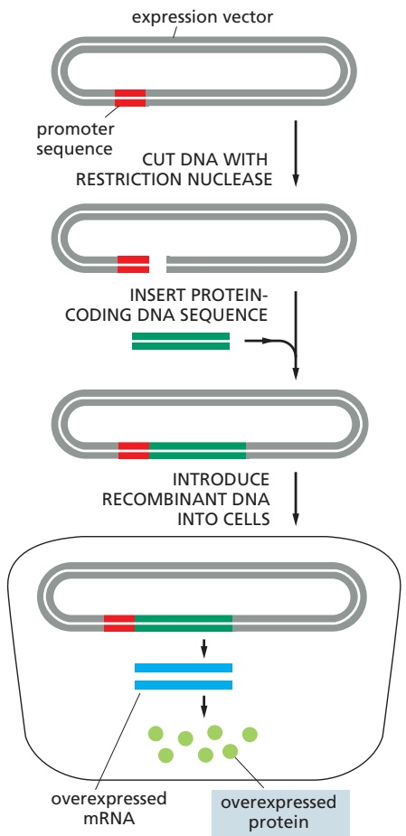
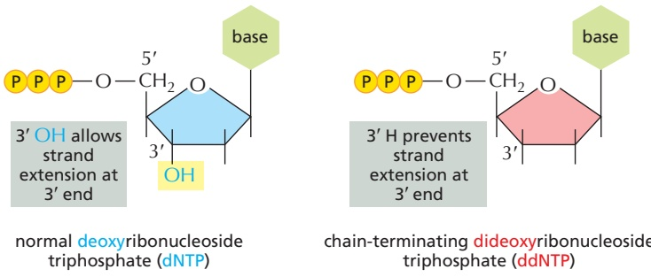
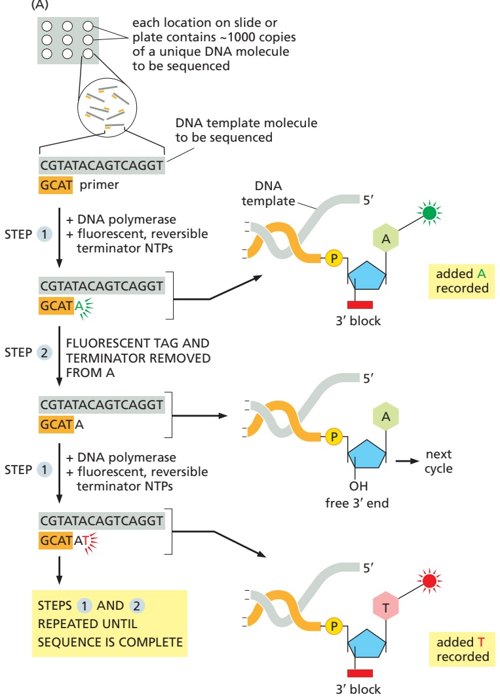
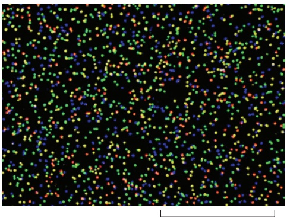
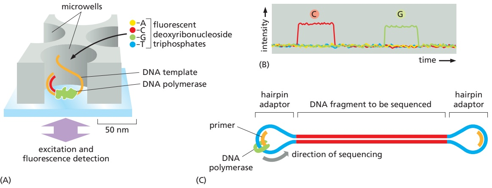
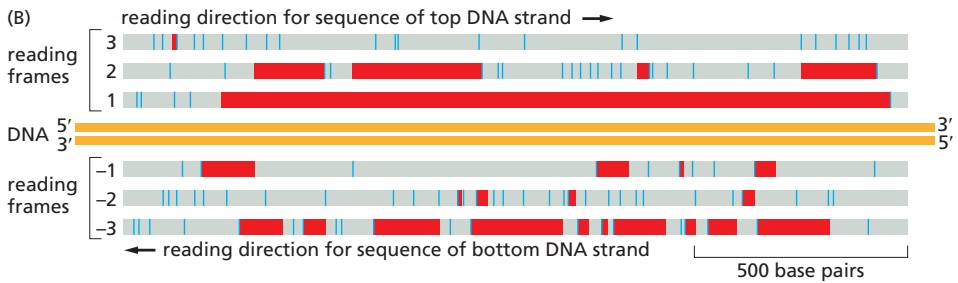
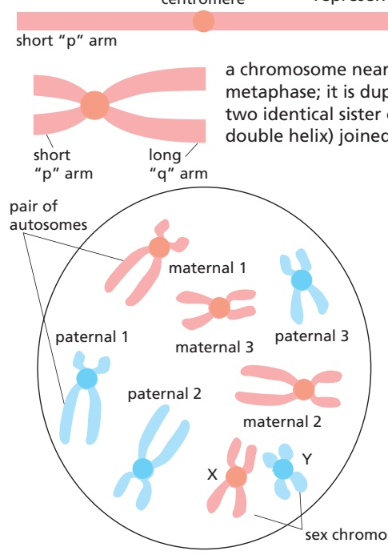
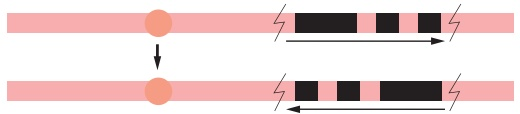
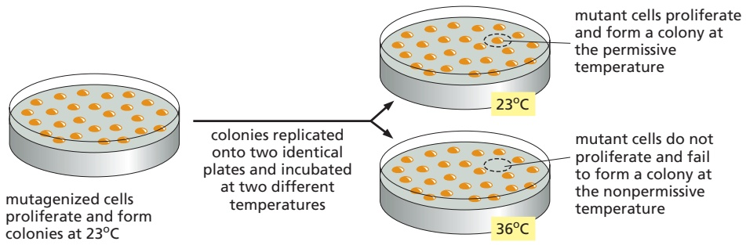
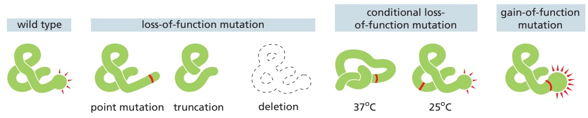

ANALYZING AND MANIPULATING DNA

511

molecules, called oligonucleotides, are cheap to make and have been used for decades as probes and primers for PCR and other methods. Recently, it has become possible to cheaply synthesize much larger double-strand DNA molecules up to a few thousand base pairs in length. Thus, for many purposes, it is easier to order the desired DNA fragment from a DNA synthesis company than it is to produce it by PCR. If the ends of the synthetic DNA fragment are identical to those of a cut plasmid, then it is straightforward to insert the synthetic DNA in a plasmid by Gibson assembly (see Figure 8–38). Using multiple synthetic DNA fragments with interlocking ends, it is possible to assemble very large stretches of DNA (approaching the size of small genomes) from purely synthetic DNA.

We will see later in this chapter that the study of gene and protein function often requires methods to produce a mutant gene or protein that carries specific point mutations that alter its function. In molecular biology, the production of a mutant DNA sequence, called site-directed mutagenesis, is readily achieved through the clever application of PCR and synthetic DNA. If the goal is a single point mutation, then one of the two PCR primers can be designed to include the mutation while still having sufficient flanking sequence to hybridize to the non-mutant source DNA. PCR then generates a DNA product with the mutation near one end. This mutant DNA fragment can be assembled in a plasmid with other portions of the gene. If multiple mutations in a DNA sequence are needed, then the simplest approach is to purchase a synthetic DNA containing the mutations and insert that into the desired plasmid.

## DNA Cloning Allows Any Protein to Be Produced in Large Amounts

Using the genetic code (and assuming all intron and exon boundaries are known), the amino acid sequence of any protein coded in a genome can be deduced. As was discussed earlier, this sequence can often provide an important clue to the protein’s function if found to be similar to the amino acid sequence of a protein that has already been studied (see Figure 8–22). Although this strategy is often successful, it typically provides only the likely biochemical function of the protein; for example, whether the protein resembles a kinase or a protease. It usually remains for the experimenter to verify (or refute) this assignment and, most important, to discover the protein’s biological function in the whole organism.

An important approach in determining gene function is to alter the gene (or in some cases, its expression pattern), place the altered copy back into the organism, and deduce the function of the normal gene by the changes caused by its alteration. Various techniques to implement this strategy are discussed in the next section of this chapter. But it is equally important to study the biochemical and structural properties of a gene product, as outlined earlier in this chapter. One of the most important contributions of DNA cloning to cell and molecular biology is the ability to produce any protein, even the rare ones, in nearly unlimited amounts. Such high-level production is usually carried out in living cells using expression vectors (**Figure 8–39**). These are generally plasmids that have been designed to produce a large amount of stable mRNA that can be efficiently translated into protein when the plasmid is introduced into bacterial, yeast, insect, or

<small>Figure 8–39 Production of large amounts of a protein from a protein-coding DNA sequence cloned into an expression vector and introduced into cells. A plasmid vector has been engineered to contain a highly active promoter, which causes unusually large amounts of mRNA to be produced from an adjacent protein-coding gene inserted into the plasmid vector. Depending on the characteristics of the cloning vector, the plasmid is introduced into bacterial, yeast, insect, or mammalian cells, where the inserted gene is efficiently transcribed and translated into protein. If the gene to be overexpressed has no introns (typical for genes from bacteria, archaea, and simple eukaryotes), it can simply be cloned from genomic DNA by PCR. For cloned animal and plant genes, it is often more convenient to obtain the gene as cDNA, either from a cDNA library (see Figure 8–30) or cloned directly by PCR from RNA isolated from the organism (see Figure 8–35). Alternatively, the DNA coding for the protein can be made by chemical synthesis.</small>

---

512

Chapter 8: Analyzing Cells, Molecules, and Systems

Figure 8–40 Production of large amounts of a protein by using a plasmid expression vector. In this example, an expression vector that overproduces a DNA helicase has been introduced into bacteria. In this expression vector, transcription from this coding sequence is under the control of a viral promoter that becomes active only at a temperature of 37°C or higher. The total cell protein, either from bacteria grown at 25°C (no helicase protein made) or after a shift of the same bacteria to 42°C for up to 2 hours (helicase protein has become the most abundant protein species in the lysate), has been analyzed by SDS polyacrylamide-gel electrophoresis. (Courtesy of Kevin Hacker.)

mammalian cells. To prevent the high level of the foreign protein from interfering with the cell’s growth, the expression vector is often designed to delay the synthesis of the foreign mRNA and protein until shortly before the cells are harvested and lysed (**Figure 8–40**).

Because the desired protein made from an expression vector is produced inside a cell, it must be purified away from the host-cell proteins by chromatography after cell lysis. However, because the protein is such a plentiful species in the cell (often 1–10% of the total cell protein), the purification is usually easy to accomplish in only a few steps. As we saw earlier, it is also possible to fuse a molecular tag—a cluster of histidine residues or a small marker protein—to the expressed protein to facilitate easy purification by affinity chromatography (see Figure 8–11). A variety of expression vectors is available, each engineered to function in the type of cell in which the protein is to be made.

This technology is also used to make large amounts of many medically useful proteins, including hormones (such as insulin and growth factors) used as pharmaceuticals, and viral proteins for use in vaccines. Expression vectors also allow scientists to produce many proteins of biological interest in large enough amounts for detailed structural studies. Nearly all three-dimensional protein structures depicted in this book are of proteins produced in this way. Recombinant DNA techniques thus allow scientists to move with ease from protein to gene, and vice versa, so that the functions of both can be explored on multiple fronts (**Figure 8–41**).

## DNA Can Be Sequenced Rapidly by Dideoxy Sequencing

Most current methods of manipulating DNA, RNA, and proteins rely on prior knowledge of the nucleotide sequence of the genome of interest. But how are these sequences determined in the first place? In the late 1970s, researchers developed several strategies for determining the nucleotide sequence of any purified DNA fragment. The method that became the most widely used is called **dideoxy sequencing** or **Sanger sequencing** (named after the scientist who

Figure 8–41 Recombinant DNA techniques make it possible to move experimentally from gene to protein and from protein to gene. If a gene has been identified (right), its protein-coding sequence can be inserted into an expression vector to produce large quantities of the protein (see Figure 8–39), which can then be studied biochemically or structurally. If a protein has been purified on the basis of its biochemical properties, mass spectrometry (see Figure 8–18) can be used to obtain a partial amino acid sequence, which is used to search a genome sequence for the corresponding nucleotide sequence. The complete gene can then be cloned by PCR from a sequenced genome (see Figure 8–35). The gene can also be manipulated and introduced into cells or organisms to study its function, a topic covered in the next section of this chapter. MBoC7 e10.35/8.41

---

ANALYZING AND MANIPULATING DNA

513

Figure 8–42 The dideoxy method of sequencing DNA relies on chain-terminating dideoxyribonucleoside triphosphates (ddNTPs). These ddNTPs are derivatives of the normal deoxyribonucleoside triphosphates (dNTPs) that lack the 3′-hydroxyl group. When incorporated into a growing DNA strand, they block further elongation of that strand.

invented it). This method uses DNA polymerase, along with special chain-terminating nucleotides called dideoxyribonucleoside triphosphates (**Figure 8–42**). Dideoxy sequencing reactions produce a collection of different DNA copies that terminate at every position in the original DNA sequence. In the original form of the method, four separate sequencing reactions were performed, each with a different dideoxyribonucleotide; the DNA copies were labeled with radioactivity. / . and separated on polyacrylamide gels, which were then exposed to film to produce four ladders of bands that were read manually to reveal the sequence (see Figure 8–24C). This laborious method was replaced, beginning in the late 1980s, with technologies that are simpler, safer, and fully automated: robotic devices mix the reagents—including the four different chain-terminating dideoxyribonucleotides, each tagged with a different-colored fluorescent dye—and load the reaction samples onto long, thin capillary gels, which separate the reaction products into a series of distinct bands. A detector then records the color of each band, and a computer translates the information into a nucleotide sequence (**Figure 8–43**).

Figure 8–43 Automated dideoxy sequencing relies on a set of four ddNTPs, each bearing a uniquely colored fluorescent tag. (A) To determine the complete sequence of a single-strand fragment of DNA (gray), the DNA is first hybridized with a short DNA primer (orange). The DNA is then mixed with DNA polymerase (not shown), an excess amount of normal dNTPs, and a mixture containing small amounts of all four chain-terminating ddNTPs, each of which is labeled with a fluorescent tag of a different color. Because the chain-terminating ddNTPs will be incorporated only occasionally, each reaction produces a diverse set of DNA copies that terminate at different points in the sequence. The reaction products are loaded onto a long, thin capillary gel and separated by electrophoresis. A camera reads the color of each band on the gel and feeds the data to a computer that assembles the sequence (not shown). The sequence read from the gel will be complementary to the sequence of the original DNA molecule. (B) A tiny part of the data from such an automated sequencing run. Each colored peak represents a nucleotide in the DNA sequence.

---

514

Chapter 8: Analyzing Cells, Molecules, and Systems

## Next-Generation Sequencing Methods Have Revolutionized DNA and RNA Analysis

Automated dideoxy sequencing was used in the late 1990s and early 2000s to determine the nucleotide sequences of many genomes, including those of E. coli, yeast, fruit flies, nematode worms, and humans. It continues to be used today as a low-cost approach to small-scale sequencing. But newer methods, developed since 2005, are now used for most large-scale genomic analysis. With these so-called second-generation sequencing technologies, the cost of sequencing DNA has decreased dramatically, and the number of sequenced genomes has increased enormously. These rapid methods allow multiple genomes to be sequenced in a matter of weeks, enabling investigators to examine thousands of individual human genomes, catalog the variation in nucleotide sequences from people around the world, and uncover the mutations that increase the risk of various diseases, from cancer to autism. These methods have also made it possible to determine the genome sequence of extinct species, including Neanderthal man and the woolly mammoth (**Movie 8.3**). By sequencing genomes from many closely related species, they have also helped us understand the molecular basis of key evolutionary events in the tree of life. The ability to rapidly sequence DNA has had major effects on all branches of biology, agriculture, and medicine; it is almost impossible to imagine where we would be without it.

Several second-generation sequencing methods are now in wide use. The most common is Illumina sequencing, named for the company that manufactures the equipment and reagents. This approach begins with the construction of libraries of small DNA fragments that represent the DNA of the entire genome. Instead of using bacterial cells to generate these libraries, they are made using PCR amplification of billions of DNA fragments, each attached to the glass surface of a flow cell. The amplification is carried out so that the PCR-generated copies of an original DNA fragment, instead of floating away in solution, remain bound in proximity to that original DNA fragment—resulting in a cluster of about 1000 identical copies of that small bit of the genome. These clusters—a billion of which can fit in a single flow cell—are then sequenced at the same time; that is, in parallel.

Sequencing is achieved using chain-terminating nucleotides with uniquely colored fluorescent tags. Unlike conventional dideoxy sequencing, however, the fluorescent tag and the chemical group that blocks elongation are both removable. Once DNA polymerase has added the fluorescent, chain-terminating nucleotide, a photo of the reaction records the color to reveal the identity of the nucleotide that was added. The colored label and the chain-terminating group are then removed, allowing DNA polymerase to add the next nucleotide (**Figure 8–44**). This cycle is repeated hundreds of times to provide the sequence of the DNA in each cluster. Billions of these clusters are sequenced in parallel. The full genome sequence is then reconstructed in the computer by stitching together the sequences of all fragments, using the overlaps between fragments as a guide.

Illumina sequencing provides short DNA sequences of a few hundred nucleotides, which can sometimes be difficult to assemble into a complete genome sequence because of the many repeated sequences that are often found in genomes. Recently developed third-generation sequencing methods are capable of sequencing much longer DNA molecules. Two methods are particularly promising. The first is single-molecule real-time (SMRT) sequencing, which is carried out in an array of tiny wells, each containing a single DNA polymerase anchored to its bottom surface. The key to SMRT sequencing is that it uses deoxyribonucleoside triphosphates in which the fluorescent dye is attached to the terminal phosphate. As the DNA polymerase copies the template DNA, the binding of a fluorescent nucleotide generates a color signal that reveals its identity. The signal disappears when the fluorescent terminal phosphate is released during incorporation of the nucleotide into the growing DNA chain (see Figure 5–4). The sequence of the DNA is thus revealed by the colors of the brief fluorescent pulses that appear as

---

ANALYZING AND MANIPULATING DNA

515

(A)

each nucleotide binds (**Figure 8–45**). Because very long DNA fragments (tens of kilobases) can be read by this method, and tens of thousands of reactions can be analyzed in parallel, complete genome sequences are well within reach in a short period of time. It is also possible to use circular DNA templates that are sequenced repeatedly on both strands, greatly improving the accuracy of the resulting sequence (see Figure 8–45C).

Another third-generation sequencing method, called nanopore sequencing, does not require DNA synthesis at all, but instead involves the transport of a single-strand DNA molecule through a tiny protein pore in a membrane. Volt-MBoC7 e10.21/8.44 age is applied across the membrane, resulting in current through the pore. The passage of nucleotides through the pore generates tiny shifts in electric current across the membrane, and the unique shape of each nucleotide base results in a slightly different disruption of the current. Measurement of these tiny current changes reveals the identity of each nucleotide as it passes through the pore. As in SMRT sequencing, extremely long DNAs can be sequenced in this manner. Another advantage is that modified nucleotides (such as 5-methylcytosine, depicted in Figure 7–46) can be identified because their effect on the current differs slightly from that of the unmodified nucleotide. Efforts are under way to allow direct sequencing of RNA by this approach as well. A major advantage of this method is that it can be performed with portable, handheld instruments that can be taken into the field, opening up exciting possibilities for DNA and RNA sequence analysis in global health and biology.

The development of cheaper and faster DNA sequencing methods has led to vast improvements in our ability to obtain and analyze genomic information. The

(B)

100 µm

Figure 8–44 Principles of Illumina sequencing. (A) A genome or other large DNA sample is broken into millions of short fragments. These fragments are attached to the surface of a flow cell and amplified by PCR to generate DNA clusters, each containing about a thousand copies of a single DNA fragment. The large number of clusters provides complete coverage of the genome. In the first step, the anchored DNA clusters are incubated with DNA polymerase and a special set of all four nucleoside triphosphates (NTPs), each with two reversible chemical modifications: a uniquely colored fluorescent marker and a 3′ chemical group that terminates DNA synthesis. Normal dNTPs are not present. After a nucleotide is added by DNA polymerase, a high-resolution digital camera records the color of the fluorescence at each DNA cluster. In the second step, the DNA is chemically treated to remove the fluorescent markers and chemical blockers. A new batch of fluorescent, reversible terminator NTPs is then added to initiate another round of DNA synthesis. These steps are repeated until the sequence is complete. The snapshots of each round of synthesis are compiled by computer to yield the sequence of each DNA fragment. The sequence of the millions of overlapping DNA fragments can then be used to reconstruct the complete genome sequence. (B) An image of the surface of the Illumina flow cell, showing individual DNA clusters after a round of DNA synthesis with colored NTPs. (B, courtesy of Illumina, Inc.)

---

516

Chapter 8: Analyzing Cells, Molecules, and Systems

Figure 8–45 Single-molecule real-time (SMRT) sequencing. (A) SMRT sequencing uses a flow cell with thousands of tiny wells, each containing a single DNA polymerase, a single DNA template, and four fluorescently tagged deoxyribonucleoside triphosphates. Initial binding of a nucleotide to the template generates a local fluorescent signal that disappears when the terminal phosphates are removed during incorporation of the nucleotide into the DNA. To reduce background fluorescence from unbound nucleotides, only the bottom 30 nm of the well is illuminated, so that fluorescence is detected in a tiny volume (20 zeptoliters, or 20 × 10–21 liters). (B) Detection of fluorescent signals in the well reveals transient pulses of a single color, indicating the nucleotide that has been incorporated. (C) SMRT sequencing is often performed with a circular DNA template that is constructed by attaching hairpin adaptor DNAs to each end of the DNA to be sequenced. Using a primer that matches the adaptor, DNA polymerase can then replicate the template as shown in panel A. The enzyme used in this method is a strand-displacing polymerase that separates double-stranded DNA as it moves along the template, allowing it to continue around the entire circular molecule many times. Thus, both strands of the DNA are repeatedly sequenced, allowing the experimenter to eliminate sequence errors that arise from random mistakes made by the polymerase.

original “reference” sequence of the human genome, completed in 2003, cost more than \$1 billion and required many scientists from around the world working together for 13 years. The enormous progress made in the past 15 years has madeMBoC7 n8.103/8.45 it possible for a single person to complete the sequence of an individual human genome in less than a day, at a cost of less than \$1000.

As mentioned above, next-generation sequencing methods are being developed for the direct sequencing of RNA. Currently, however, RNA sequencing is typically carried out by converting the RNA to cDNA (using reverse transcriptase) and using one of the methods described above for DNA sequencing. It is important to keep in mind that although genomes remain the same from cell to cell and from tissue to tissue, the RNA produced from the genome can vary enormously. We will see later in this chapter that sequencing the entire repertoire of RNA from a cell or tissue (known as **deep RNA sequencing**, or **RNA-seq**) is a powerful way to understand how the information present in the genome is used by different cells under different circumstances. RNA-seq is also a valuable tool for annotating genomes, as we discuss next.

## To Be Useful, Genome Sequences Must Be Annotated

Long strings of nucleotides, at first glance, reveal nothing about how this genetic information directs the development of a living organism—or even what types of DNA, protein, and RNA molecules are produced by a genome. The process of **genome annotation** attempts to mark out all the genes (both protein-coding and noncoding) in a genome and ascribe a role to each. It also seeks to understand more subtle types of genome information, such as the cis-regulatory sequences that specify the time and place that a given gene is expressed and whether its mRNA undergoes alternative splicing to produce different protein isotypes. Clearly, this is a daunting task, and we are far short of completing it for any form of life, even the simplest bacterium. For many organisms, we know the approximate number of genes, and, for very simple organisms, we understand the functions of about half their genes.

How does one begin to make sense of a genome sequence? The first step is usually to translate in silico the entire genome into protein. There are six different

---

ANALYZING AND MANIPULATING DNA

517

Figure 8–46 Finding the regions in a DNA sequence that encode a protein. (A) Any region of the DNA sequence can, in principle, code for six different amino acid sequences, because any one of three different reading frames can be used to interpret the nucleotide sequence on each strand. Note that a nucleotide sequence is always read in the 5′-to-3′ direction and encodes a polypeptide from the N-terminus to the C-terminus. For a random nucleotide sequence read in a particular frame, a stop signal for protein synthesis is encountered, on average, about once every 20 amino acids. In this sample sequence of 48 base pairs, each such signal (stop codon) is colored blue, and only reading frame 2 lacks a stop signal. (B) Search of a 1700-base-pair DNA sequence for a possible protein-encoding sequence. The information is displayed as in panel A, with each stop signal for protein synthesis denoted by a blue line. In addition, all of the regions between possible start and stop signals for protein synthesis are displayed as red bars. Only reading frame 1 actually encodes a protein, which is 475 amino acid residues long.

reading frames for any piece of double-stranded DNA (three on each strand). We saw in Chapter 6 that a random sequence of nucleotides, read in frame, will contain a stop codon about every 20 amino acids. In contrast, protein-coding regions will usually contain much longer stretches without stop codons (**Figure 8–46**). Known as **open reading frames (ORFs)**, these usually signify bona fide proteincoding genes. This assignment is often “double-checked” by comparing the ORF amino acid sequence to the many databases of documented proteins from other species. If a match is found, even an imperfect one, it is very likely that the ORF will code for a functional protein (see Figure 8–22).

This strategy works very well for compact genomes, where intron sequences are rare and ORFs often extend for many hundreds of amino acids. However, in many animals and plants, the average exon size is 150–200 nucleotide pairs, and additional information is usually required to unambiguously locate all the exons of a gene. Although it is possible to search genomes for splicing signals and other features that help to identify exons (codon bias, for example), one of the most powerful methods is simply to sequence the total RNA produced from the genome in living cells. As can be seen in Figure 7–3, this RNA-seq information, when mapped onto the genome sequence, can be used to accurately locate all the introns and exons of even complex genes. By sequencing total RNA from different cell types, it is also possible to identify cases of alternative splicing.

RNA-seq also identifies noncoding RNAs produced by a genome. Although the function of some of them can be readily recognized (tRNAs or snoRNAs, for example), many have unknown functions and still others probably have no function at all. The existence of the many noncoding RNAs and our relative ignorance

---

518

Chapter 8: Analyzing Cells, Molecules, and Systems

of their function is the main reason that we know only the approximate number of genes in the human genome.

But even for protein-coding genes that have been unambiguously identified, we still have much to learn. Thousands of genomes have been sequenced, and we know from comparative genomics that many organisms share the same basic set of proteins. However, the functions of a very large number of identified proteins remain unknown. Depending on the organism, approximately one-third of the proteins encoded by a sequenced genome do not clearly resemble any protein that has been studied biochemically. This observation underscores a limitation of the emerging field of genomics: although comparative analysis of genomes reveals a great deal of information about the relationships between genes and organisms, it often does not provide immediate information about how these genes function or what roles they have in the physiology of an organism. Comparison of the full gene complement of several thermophilic bacteria, for example, does not reveal why these bacteria thrive at temperatures exceeding 70°C. And examination of the genome of the incredibly radiation-resistant bacterium Deinococcus radiodurans does not explain how this organism can survive a blast of radiation that can shatter glass. Further biochemical and genetic studies, like those described in the other sections of this chapter, are required to determine how genes, and the proteins they produce, function in the context of living organisms.

## Summary

DNA cloning allows a copy of any specific part of a DNA or RNA sequence to be selected from the millions of other sequences in a cell and produced in unlimited amounts in pure form. DNA sequences can be amplified by inserting the desired DNA fragment into a self-replicating genetic element such as a bacterial plasmid. Bypassing cloning vectors and bacterial cells altogether, the polymerase chain reaction (PCR) allows DNA cloning to be performed directly with a DNA polymerase and DNA primers—provided that the DNA sequence of interest is already known.

The procedures used to obtain DNA clones that correspond in sequence to mRNA molecules are the same, except that a DNA copy of the mRNA sequence, called cDNA, is first made. Unlike genomic DNA clones, cDNA clones lack intron sequences, making them the clones of choice for analyzing the protein product of a gene.

Nucleic acid hybridization reactions provide a sensitive means of detecting any nucleotide sequence of interest. The enormous specificity of this hybridization reaction allows any single-strand sequence of nucleotides to be labeled with a radioisotope or chemical and used as a probe to find a complementary partner strand, even in a cell or cell extract that contains millions of different DNA and RNA sequences. DNA hybridization also makes it possible to use PCR to amplify any section of any genome once its sequence is known.

The nucleotide sequence of any genome can be determined rapidly and simply by using highly automated techniques that are based on several different strategies. Comparison of the genome sequences of different organisms allows us to trace the evolutionary relationships among genes and organisms, and it has proved valuable for discovering new genes and predicting their functions.

## STUDYING GENE FUNCTION AND EXPRESSION

Ultimately, our goal is to understand how genes—and the proteins they encode— function in the intact organism. Although it may seem counterintuitive, one of the most direct ways to find out what a gene does is to see what happens to the organism when that gene is missing. Studying mutant organisms that have acquired changes or deletions in their nucleotide sequences is a time-honored practice in biology and forms the basis of the important field of **genetics**. Because mutations can disrupt cell processes, mutants often hold the key to understanding gene function. In the classical genetic approach, one begins by isolating mutants

---

STUDYING GENE FUNCTION AND EXPRESSION

519

that have an interesting or unusual appearance: fruit flies with white eyes or curly wings, for example. Working backward from the **phenotype**—the appearance or behavior of the individual—one then determines the organism’s **genotype**, the form of the gene responsible for that characteristic (**Panel 8–1**).

Today, with numerous genome sequences available, the exploration of gene function often begins with a DNA sequence. Here, the challenge is to translate sequence into function. One approach, discussed earlier in the chapter, is to search databases for well-characterized proteins that have similar amino acid sequences to the protein encoded by a new gene. From there, the protein can be overexpressed and purified, and the methods described earlier in this chapter can be employed to study its biochemical properties and three-dimensional structure. But to determine directly a gene’s function in a cell or organism, the most effective approach involves studying mutants that either lack the gene or express an altered version of it. Determining which cell processes have been disrupted or compromised in such mutants will usually shed light on a gene’s biological role.

In this section, we describe several approaches to determining a gene’s function, starting either from an individual with an interesting phenotype or from a DNA sequence. We begin with the classical genetic approach, which starts with a genetic screen for isolating mutants of interest and then proceeds toward identification of the gene or genes responsible for the observed phenotype. We then describe the set of techniques that are sometimes called reverse genetics, in which one begins with a gene or gene sequence and attempts to determine its function. This approach often involves some intelligent guesswork—searching for similar sequences in other organisms or determining when and where a gene is expressed—as well as generating mutant organisms and characterizing their phenotype.

## Classical Genetic Screens Identify Random Mutants with Specific Abnormalities

Before the advent of gene cloning technology, most genes were identified by the abnormalities produced when the gene was mutated. Indeed, the very concept of the gene was deduced from the heritability of such abnormalities. This classical genetic approach—identifying the genes responsible for mutant phenotypes—is most easily performed in organisms that reproduce rapidly and are amenable to genetic manipulation, such as bacteria, yeasts, nematode worms, and fruit flies. Although spontaneous mutants can sometimes be found by examining extremely large populations—thousands or tens of thousands of individual organisms—isolating mutant individuals is much more efficient if one generates mutations with chemicals or radiation that damage DNA. By treating organisms with such mutagens, very large numbers of mutant individuals can be created quickly and then screened for a particular defect of interest.

An alternative approach to chemical or radiation mutagenesis is called insertional mutagenesis. This method relies on the fact that exogenous DNA inserted randomly into the genome can produce mutations if the inserted fragment interrupts a gene or its regulatory sequences. The inserted DNA, whose sequence is known, then serves as a molecular tag that aids in the subsequent identification and cloning of the disrupted gene (**Figure 8–47**). In Drosophila, the use of the transposable P element to inactivate genes has revolutionized the study of gene function in the fly. Transposable elements (see Table 5–4, p. 308) have also been used to generate mutations in bacteria, yeast, mice, and the flowering plant Arabidopsis.

Once a collection of mutants in a model organism has been produced, one generally must examine thousands of individuals to find the altered phenotype of interest. Such a search is called a **genetic screen**, and the larger the genome, the less likely it is that any particular gene will be mutated. Therefore, the larger the genome of an organism, the bigger the screening task becomes. The phenotype being screened for can be simple or complex. Simple phenotypes are easiest to detect: one can screen many organisms rapidly, for example, for mutations

Figure 8–47 Insertional mutant of the snapdragon, Antirrhinum. A mutation in a single gene coding for a regulatory protein causes leafy shoots (left) to develop in place of flowers, which occur in the MBoC7 m8.44/8.47normal plant (right). The mutation causes cells to adopt a character that would be appropriate to a different part of the normal plant, so instead of a flower, the cells produce a leafy shoot. (Courtesy of Enrico Coen and Rosemary Carpenter.)

---

For simplicity, the cycle is shown for only one chromosome/chromosome pair.

520

PANEL 8–1: Review of Classical Genetics

## GENES AND PHENOTYPES

In the example above, the phenotype of the heterozygote is the same as that of one of the homozygotes; in cases where it is different from both, the two alleles are said to be codominant.

## CHROMOSOMES

a chromosome at the beginning of the cell cycle, in G1 phase; the single long bar represents one long double helix of DNA

## long “q” arm

a chromosome near the end of the cell cycle, in metaphase; it is duplicated and condensed, consisting of two identical sister chromatids (each containing one DNA double helix) joined at the centromere.

A normal diploid chromosome set, as seen in a metaphase spread, prepared by bursting open a cell at metaphase and staining the scattered chromosomes. In the example shown schematically here, there are three pairs of autosomes (chromosomes inherited symmetrically from both parents, regardless of sex) and two sex chromosomes—an X from the mother and a Y from the father. The numbers and types of sex chromosomes and their role in sex determination are variable from one class of organisms to another, as is the number of pairs of autosomes.

## THE HAPLOID–DIPLOID CYCLE OF SEXUAL REPRODUCTION

## MEIOSIS AND GENETIC RECOMBINATION

The greater the distance between two loci on a single chromosome, the greater is the chance that they will be separated by crossing-over occurring at a site between them. If two genes are thus reassorted in x% of gametes, they are said to be separated on a chromosome by a genetic map distance of x map units (or x centimorgans).

---

521

## TYPES OF MUTATIONS

POINT MUTATION: maps to a single site in the genome, corresponding to a single nucleotide pair or a very small part of a single gene

INVERSION: inverts a segment of a chromosome

lethal mutation: causes the developing organism to die prematurely.

conditional mutation: produces its phenotypic effect only under certain conditions, called the restrictive conditions. Under other conditions—the permissive conditions—the effect is not seen. For a temperature-sensitive mutation, the restrictive condition typically is high temperature, while the permissive condition is low temperature.

loss-of-function mutation: either reduces or abolishes the activity of the gene. These are the most common class of mutations. Loss-of-function mutations are usually recessive—the organism can usually function normally as long as it retains at least one normal copy of the affected gene. null mutation: a loss-of-function mutation that completely abolishes the activity of the gene.

## TWO GENES OR ONE?

Given two mutations that produce the same phenotype, how can we tell whether they are mutations in the same gene? If the mutations are recessive (as they most often are), the answer can be found by a complementation test.

COMPLEMENTATION: MUTATIONS IN TWO DIFFERENT GENES

hybrid offspring shows normal phenotype: one normal copy of each gene is present

DELETION: deletes a segment of a chromosome

TRANSLOCATION: breaks off a segment from one chromosome and attaches it to another

gain-of-function mutation: increases the activity of the gene or makes it active in inappropriate circumstances; these mutations are usually dominant.

dominant-negative mutation: dominant-acting mutation that blocks gene activity, causing a loss-of-function phenotype even in the presence of a normal copy of the gene. This phenomenon occurs when the mutant gene product interferes with the function of the normal gene product. suppressor mutation: suppresses the phenotypic effect of another mutation, so that the double mutant seems normal. An intragenic suppressor mutation lies within the gene affected by the first mutation; an extragenic suppressor mutation lies in a second gene—often one whose product interacts directly with the product of the first.

In the simplest type of complementation test, an individual who is homozygous for one mutation is mated with an individual who is homozygous for the other. The phenotype of the offspring gives the answer to the question.

NONCOMPLEMENTATION: TWO INDEPENDENT MUTATIONS IN THE SAME GENE

hybrid offspring shows mutant phenotype: no normal copies of the mutated gene are present

---

522

Chapter 8: Analyzing Cells, Molecules, and Systems

mutagenized cells proliferate and form colonies at 23oC

that make it impossible for the organism to survive in the absence of a particular amino acid or nutrient.

Because defects in genes that are required for fundamental cell processes— RNA synthesis and processing or cell-cycle control, for example—are usually lethal, the functions of these genes are often studied in individuals with **conditional mutations**. The mutant individuals function normally as long as permissive conditions prevail but demonstrate abnormal gene function when subjected to restrictive (nonpermissive) conditions. In organisms with temperature-sensitive mutations, for example, the abnormality can be switched on and off experimentally simply by changing the ambient temperature; thus, a cell containing a temperature-sensitive mutation in a gene essential for survival will die at aMB C7 8.46/8.48 restrictive temperature but proliferate normally at a permissive temperature (**Figure 8–48**). The temperature-sensitive gene in such a mutant usually contains a point mutation that causes a subtle change in its protein product; for example, the mutant protein may function normally at low temperatures but unfold at higher temperatures.

Temperature-sensitive mutations were crucial to find the bacterial genes that encode the proteins required for DNA replication. The mutants were identified by screening populations of mutagen-treated bacteria for cells that stop making DNA when they are warmed from 30°C to 42°C. These mutants were later used to identify and characterize the corresponding DNA replication proteins (discussed in Chapter 5). Similarly, screens for temperature-sensitive mutations in yeast led to the identification of many proteins involved in regulating the cell cycle, as well as many proteins involved in moving proteins through the secretory pathway. Related screening approaches demonstrated the function of enzymes involved in the principal metabolic pathways of bacteria and yeast (discussed in Chapter 2) and identified many of the gene products responsible for the orderly development of the Drosophila embryo (discussed in Chapter 21).

## Mutations Can Cause Loss or Gain of Protein Function

Gene mutations are generally classed as loss of function or gain of function. A lossof-function mutation results in a gene product that either does not work or works too little; thus, it can reveal the normal function of the gene. A gain-of-function mutation results in a gene product that works too much, works at the wrong time or place, or works in a new way (**Figure 8–49**).

An important early step in the genetic analysis of any mutant cell or organism is to determine whether the mutation causes a loss or a gain of function. A standard test is to determine whether the mutation is dominant or recessive. A

Figure 8–48 Screening for temperaturesensitive bacterial or yeast mutants. Mutagenized cells are plated out at the permissive temperature. They divide and form colonies, which are transferred to two identical Petri dishes by replica plating. One of these plates is incubated at the permissive temperature, the other at the restrictive temperature. Cells containing a temperature-sensitive mutation in a gene essential for proliferation can divide at the normal (permissive) temperature but fail to divide at the elevated (restrictive) temperature.

point mutation

truncation

conditional lossof-function mutation

deletion

37oC

Figure 8–49 Gene mutations that affect their protein product in different ways. In this example, the wild-type protein has a specific cell function denoted by the red rays. Mutations that eliminate this function or inactivate it at higher temperatures are shown. The conditional mutant protein carries an amino acid substitution (red) that prevents its proper folding at 37ºC but allows the protein to fold and function normally at 25ºC. Such temperature-sensitive conditional mutations are especially useful for studying essential genes (see Figure 8–48). In some cases, a mutation increases the activity of the mutant protein.