dominant mutation is one that still causes the mutant phenotype in the presence of a single copy of the wild-type gene. A recessive mutation is one that is no longer able to cause the mutant phenotype in the presence of a single wild-type copy of the gene. In the majority of cases, recessive mutations are loss of function and dominant mutations are gain of function—although cases have been described in which a loss-of-function mutation is dominant or a gain-of-function mutation is recessive. It is easy to determine if a mutation is dominant or recessive. One simply mates a mutant with a wild type to obtain diploid cells or organisms. The progeny from the mating will be heterozygous for the mutation. If the mutant phenotype is no longer observed, one can conclude that the mutation is recessive and is very likely to be a loss-of-function mutation (see Panel 8–1).

## Complementation Tests Reveal Whether Two Mutations Are in the Same Gene or Different Genes

A large-scale genetic screen can turn up many different mutations that show the same phenotype. These defects might lie in different genes that function in the same process or they might represent different mutations in the same gene. Alternative forms of the same gene are known as **alleles**. The most common difference between alleles is a substitution of a single nucleotide pair, but different alleles can also bear deletions, substitutions, and duplications. How can we tell, then, whether two mutations that produce the same phenotype occur in the same gene or in different genes? If the mutations are recessive—if, for example, they represent a loss of function of a particular gene—a **complementation test** can be used to ascertain whether the mutations fall in the same gene or in different genes. To test complementation in a diploid organism, an individual that is homozygous for one mutation—that is, it possesses two identical alleles of the mutant gene in question—is mated with an individual that is homozygous for the other mutation. If the two mutations are in the same gene, the offspring show the mutant phenotype, because they still will have no normal copies of the gene in question. If, in contrast, the mutations fall in different genes, the resulting offspring show a normal phenotype, because they retain one normal copy (and one mutant copy) of each gene; the mutations thereby complement one another and restore a normal phenotype (**Figure 8–50**). Complementation testing of mutants identified during genetic screens has revealed, for example, that 5 different genes are required for yeast to digest the sugar galactose, 20 genes are needed for E. coli to build a functional flagellum, 48 genes are involved in assembling bacteriophage T4 viral particles, and hundreds of genes are involved in the development of an adult nematode worm from a fertilized egg.

## Gene Products Can Be Ordered in Pathways by Epistasis Analysis

Once a set of genes involved in a particular biological process has been identified, it is helpful to determine the order in which the genes function. Gene order is perhaps easiest to explain for metabolic pathways, where, for example, enzyme A is necessary to produce the substrate for enzyme B. In this case, we would say that the gene encoding enzyme A acts before (upstream of) the gene encoding enzyme B in the pathway. Similarly, where one protein regulates the activity of another protein, we would say that the former gene acts before the latter. Gene order can, in many cases, be determined purely by genetic analysis without any knowledge of the mechanism of action of the gene products involved.

Suppose we have a biosynthetic process consisting of a sequence of steps, such that performance of step B requires completion of the preceding step A; and suppose gene A is required for step A, and gene B is required for step B. Then a null mutation (a mutation that abolishes function) in gene A will arrest the process at step A, regardless of whether gene B is functional or not, whereas a null mutation in gene B will cause arrest at step B only if gene A is still active. In such a case, gene A is said to be epistatic to gene B. By comparing the phenotypes of different combinations of mutations, we can therefore discover the order in which the genes act. This type of analysis is called **epistasis analysis**. As an example, the pathway of protein secretion in yeast has been analyzed in this way. Different mutations in this pathway cause proteins to accumulate aberrantly in the endoplasmic reticulum (ER) or in the Golgi apparatus. When a yeast cell is engineered to carry both a mutation that blocks protein processing in the ER and a mutation that blocks processing in the Golgi apparatus, proteins accumulate in the ER. This indicates that proteins must pass through the ER before being sent to the Golgi before secretion (**Figure 8–51**). Strictly speaking, an epistasis analysis can only provide information about gene order in a pathway when both mutations are null alleles. When the mutations retain partial function, their epistasis interactionsMBoC7 m8.49/8.51 can be difficult to interpret.

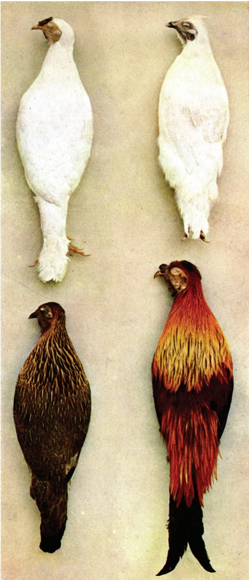

Figure 8–50 A complementation test can reveal that mutations in two different genes are responsible for the same MBoC7 m8.48/8.50abnormal phenotype. When an albino (white) bird from one strain is bred with an albino from a different strain, the resulting offspring (bottom) have normal coloration. This restoration of the wild-type plumage indicates that the two white breeds lack color because of recessive mutations in different genes. (From W. Bateson, Mendel’s Principles of Heredity, 1st ed. Cambridge, UK: Cambridge University Press, 1913.)

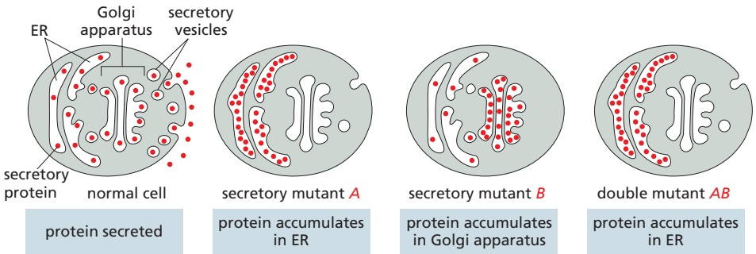

Figure 8–51 Using genetics to determine the order of function of genes. In normal cells, secretory proteins are loaded into vesicles, which fuse with the plasma membrane to secrete their contents into the extracellular medium. Two mutants, A and B, fail to secrete proteins. In mutant A, secretory proteins accumulate in the ER. In mutant B, secretory proteins accumulate in the Golgi. In the double mutant AB, proteins accumulate in the ER; this indicates that the gene defective in mutant A acts before the gene defective in mutant B in the secretory pathway.

Sometimes, a double mutant will show a new or more severe phenotype than either single mutant alone. This type of genetic interaction is called a synthetic phenotype, and if the phenotype is death of the organism, it is called synthetic lethality. In most cases, a synthetic phenotype indicates that the two genes act in two different parallel pathways, either of which is capable of mediating the same cell process. Thus, when both pathways are disrupted in the double mutant, the process fails altogether, and the synthetic phenotype is observed.

## Mutations Responsible for a Phenotype Can Be Identified Through DNA Analysis

Once a collection of mutant organisms with interesting phenotypes has been obtained, the next task is to identify the gene or genes responsible for the altered phenotype. If the phenotype has been produced by insertional mutagenesis, locating the disrupted gene is fairly simple. DNA fragments containing the insertion (a transposon or a retrovirus, for example) are amplified by PCR, and the nucleotide sequence of the flanking DNA is determined. The gene affected by the insertion can then be identified by a computer-aided search of the complete genome sequence of the organism.

If a DNA-damaging chemical was used to generate the mutations, identifying the inactivated gene is often more laborious, but there are several powerful strategies available. With recent advances in DNA sequencing technology, it is possible to simply determine the genome sequence of the mutant organism and identify the affected gene by comparison with the wild-type sequence. Because of the continual accumulation of neutral mutations, there will probably be differences between the two genome sequences in addition to the mutation responsible for the phenotype. One way of proving that a mutation is causative is to introduce the putative mutation back into a normal organism and determine whether or not it causes the mutant phenotype. We will discuss how this is accomplished later in the chapter.

## Rapid and Cheap DNA Sequencing Has Revolutionized Human Genetic Studies

Genetic screens in model experimental organisms have been spectacularly successful in identifying genes and relating them to various phenotypes, including many that are conserved between these organisms and humans. But how can we study humans directly? They do not reproduce rapidly, cannot be treated with mutagens, and, if they have a defect in an essential process such as DNA replication, would die long before birth.

Despite their limitations compared to model organisms, humans are becoming increasingly attractive subjects for genetic studies. Because the human population is so large, spontaneous nonlethal mutations have arisen many times in all human genes. A substantial proportion of these mutations remains in the genomes of present-day humans. Deleterious mutations are discovered when the mutant individuals call attention to themselves by seeking medical help.

With the recent advances that have enabled the sequencing of entire human genomes cheaply and quickly, we can now identify such mutations and study their evolution and inheritance in ways that were impossible even a few years ago. By comparing the sequences of thousands of human genomes from all around the world, we can begin to identify directly the DNA differences that distinguish one individual from another. These differences hold clues to our evolutionary origins and can be used to explore the roots of disease.

## Linked Blocks of Polymorphisms Have Been Passed Down from Our Ancestors

When we compare the sequences of multiple human genomes, we find that any two individuals will differ in roughly 1 nucleotide pair in 1000. As described in Chapter 4, most sequence variation results from substitution of a single nucleotide, called a single-nucleotide variant (SNV), while other variation is due to structural chromosome changes such as deletions and rearrangements. Human genetic studies have benefited greatly from a particularly common type of sequence variants, present in more than 1% of the population, that are called **polymorphisms**—most of which are **single-nucleotide polymorphisms**, or **SNPs** (**Figure 8–52**). Although these common variants can be found throughout the genome, they are not scattered randomly—or even independently. Instead, they tend to travel in groups called **haplotype blocks**—combinations of polymorphisms that are inherited as a unit.

To understand why such haplotype blocks exist, we need to consider our evolutionary history. It is thought that modern humans expanded from a relatively small population—perhaps around 10,000 individuals—that existed in Africa about 200,000 years ago. Among that small group of our ancestors, some individuals will have carried one set of genetic variants, others a different set. The chromosomes of a present-day human represent a shuffled combination of chromosome segments from different members of this small ancestral group of people. Because only about 2000 generations separate us from them, large segments of these ancestral chromosomes have passed from parent to child, unbroken by the crossover events that occur during meiosis. As described in Chapter 5, only a few crossovers occur between each set of homologous chromosomes during each meiosis (see Figure 5–52).

Figure 8–52 Single-nucleotide polymorphisms (SNPs) are sites in the genome where two or more alternative choices of a nucleotide are common in the population. Most such variations in the human genome occur at locations where they do not significantly affect a gene’s function.

As a result, certain sets of DNA sequences—and their associated polymorphisms—have been inherited in linked groups, with little genetic rearrangement across the generations. These are the haplotype blocks. Like genes that exist in different allelic forms, haplotype blocks also come in a limited number of variants that are common in the human population, each representing a combination of DNA polymorphisms passed down from a particular ancestor long ago.

## Sequence Variants Can Aid the Search for Mutations Associated with Disease

Mutations that give rise, in a reproducible way, to rare but clearly defined differences, such as albinism, hemophilia, or congenital deafness, can often be identified by studies of affected families. Such single-gene, or monogenic, disorders are referred to as Mendelian because their pattern of inheritance is easy to track. Moreover, individuals who inherit the causative mutation will exhibit the disorder irrespective of environmental factors such as diet or exercise. But for many common disorders, the genetic roots are more complex. Instead of a single allele of a single gene, such disorders stem from a combination of contributions from multiple genes. And often, environmental factors have strong influences on the severity of the disorder. For these multigenic conditions, such as diabetes or arthritis, population studies are often helpful in tracking down the genes that increase the risk of getting the disease.

In population studies, investigators collect DNA samples from a large number of people who have the disease and compare them to samples from a group of people who do not have the disease. They look for variants—SNPs, for example— that are more common among the people who have the disease. Because DNA sequences that are close together on a chromosome tend to be inherited together, the presence of such SNPs could indicate that an allele that increases the risk of the disease might lie nearby (**Figure 8–53**). Although, in principle, the disease could be caused by the SNP itself, the culprit is much more likely to be a change that is merely linked to the SNP as part of a haplotype block.

Such genome-wide association studies have been used to search for genes that predispose individuals to common diseases, including diabetes, coronary artery disease, rheumatoid arthritis, and even depression. For many of these conditions, the DNA polymorphisms identified increase the risk of disease only slightly. Moreover, environmental factors (diet and exercise, for example) play an important role in the onset and severity of the disease. Nonetheless, the identification of potential disease genes linked to polymorphisms is leading to a mechanistic understanding of some of our most common disorders.

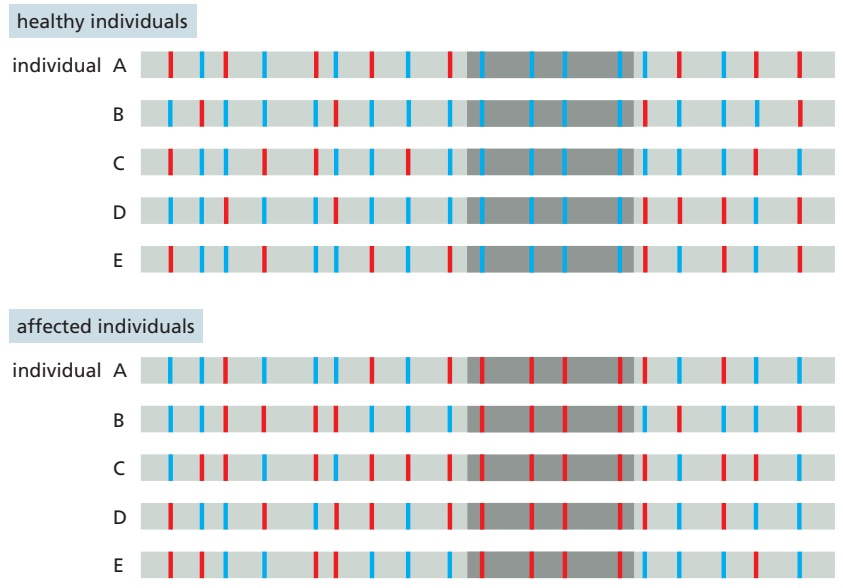

Figure 8–53 Genes that affect the risk of developing a common disease can often be tracked down through linkage to SNPs. Here, the patterns of SNPs are compared between two sets of individuals—a set of healthy controls and a set affected by a particular common disease. A segment of a typical chromosome is shown. For most polymorphic sites in this segment, it is a random matter whether an individual has one SNP variant (red vertical bars) or another (blue vertical bars); this same randomness is seen both for the control group and for the affected individuals. However, in the part of the chromosome that is shaded in dark gray, a bias is seen: most healthy individuals have the blue SNP variants, whereas most affected individuals have the red SNP variants. This suggests that this region contains or is close to a gene that is genetically linked to these red SNP variants and which predisposes individuals to the disease. Using carefully selected controls and thousands of affected individuals, this approach can help track down disease-related genes, even when they confer only a slight increase in the risk of developing the disease.

## Genomics Is Accelerating the Discovery of Rare Mutations That Predispose Us to Serious Disease

The polymorphisms that have allowed us to identify some of the genes that increase our risk of disease are common. They arose long ago in our evolutionary past and are now present, in one form or another, in a substantial portion of the population. Such polymorphisms are thought to account for about 90% of the differences between one person’s genome and another. But when we try to tie these common variants to differences in disease susceptibility or other heritable traits, such as height, we find that they do not have as much predictive power as we had anticipated: thus, for example, most confer relatively small increases—less than twofold—in the risk of developing a common disease.

Part of the problem is that many of the mutations that are directly responsible for complex human diseases appeared more recently in our evolutionary history—during a period when the human population expanded from the few million individuals who existed 10,000 years ago to the more than 7 billion who exist today. Because recent mutations occur more rarely than the ancient polymorphisms that are common in the human population, they could slip through the genome-wide association studies just described.

In contrast to polymorphisms, rare DNA variants—those much less frequent in humans than SNPs—can have large effects on the risk of developing some common diseases. For example, numerous loss-of-function mutations, each individually rare, have been found to increase greatly the predisposition to autism and schizophrenia. Many of these are de novo mutations, which arose spontaneously in the germ-line cells of one or the other parent. The fact that these mutations arise spontaneously with some frequency could help explain why these common disorders—each observed in about 1% of the population—remain with us, even though the affected individuals might leave few or no descendants. These rare mutations can arise in any one of hundreds of different genes, which could explain much of the clinical variability of autism and schizophrenia.

Now that DNA sequencing has become fast and inexpensive, the most efficient way to identify these rare, large-effect mutations is by comparing the genomes of large numbers of affected individuals with those of unaffected controls. When the key variants are identified, the major challenge is then to determine how they affect the individuals who carry them and how small variations in multiple genes produce the disease phenotype.

## The Cellular Functions of a Known Gene Can Be Studied with Genome Engineering

As we have seen, classical genetics starts with a mutant phenotype and identifies the mutations, and consequently the genes, responsible for it. Recombinant DNA technology has made possible a different type of genetic approach that is used widely in a variety of species. Instead of beginning with a mutant organism and using it to identify a gene and its protein, an investigator can start with a particular gene and proceed to make mutations in it, creating mutant cells or organisms so as to analyze the gene’s function. Because this approach reverses the traditional direction of genetic discovery—proceeding from genes to mutations, rather than vice versa—it is sometimes referred to as reverse genetics. And because the genome of the organism is deliberately altered in a particular way, this approach is also called genome engineering or genome editing. We shall see in this chapter that this approach can be scaled up so that whole collections of organisms can be created, each of which has a different gene altered.

There are several ways a gene of interest can be altered. In the simplest, the gene can simply be deleted from the genome, although in a diploid organism, this requires that both copies—one on each chromosome homolog—be deleted. Such gene knockouts are especially useful if the gene is not essential. The gene in question (even if it is essential) can also be replaced by one that is expressed in the wrong tissue or at the wrong time in development; this type of manipulation often provides important clues to the gene’s normal function. In a particularly powerful approach, a gene of interest can be modified to be expressed at will by the experimenter (**Figure 8–54**). Finally, genes can also be engineered so that they are expressed normally in most cell types and tissues but deleted in certain cell types or tissues selected by the experimenter (see Figure 5–66). This approach is especially useful when a gene has different roles in different tissues.

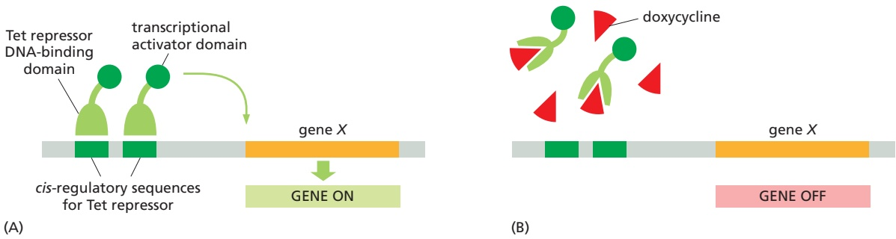

Figure 8–54 Engineered genes can be turned on and off with small molecules. Here, the DNA-binding portion of a bacterial protein (the tetracycline, Tet, repressor) has been fused to a portion of a mammalian transcriptional activator and expressed in cultured mammalian cells. The engineered gene X, present in place of the normal gene, has its usual gene control region replaced by cis-regulatory sequences recognized by the tetracycline repressor. In the absence of doxycycline (a particularly stable version of tetracycline), the engineered gene is expressed; in the presence of doxycycline, the gene is MBoC7 m8.52/8.54turned off because the drug causes the tetracycline repressor to dissociate from the DNA. This strategy can also be used in mice by incorporating the engineered genes into the germ line. In many tissues, the gene can be turned on and off simply by adding doxycycline to or removing it from the animal’s water. If the tetracycline repressor construct is placed under the control of a tissue-specific gene control region, the engineered gene will be turned on and off only in that tissue.

It is also possible to make subtler changes to a gene. It is sometimes useful to make slight changes in a protein’s structure so that one can begin to dissect which portions of a protein are important for its function. The activity of an enzyme, for example, can be studied by changing a single amino acid in its active site. It is also possible, through genome engineering, to create new types of proteins in an animal. For example, a gene can be fused to the gene for a fluorescent protein. When this altered gene is introduced into the genome, the protein can be tracked in the living organism by monitoring its fluorescence.

Altered genes can be created in several ways. Perhaps the simplest is to chemically synthesize the DNA that makes up the gene. In this way, the investigator can specify any type of variant of the normal gene. It is also possible to construct altered genes using recombinant DNA technology, as described earlier in this chapter. Once obtained, altered genes can be introduced into cells in a variety of ways. DNA can be microinjected into mammalian cells with a glass micropipette or introduced by a virus that has been engineered to carry foreign genes. In plant cells, genes can be introduced by a technique called particle bombardment: DNA samples are painted onto tiny gold beads and then literally shot through the cell wall with a specially modified gun. Electroporation is sometimes used for introducing DNA into bacteria and some other cells. In this technique, a brief electric shock renders the cell membrane temporarily permeable, allowing foreign DNA to enter the cytoplasm.

To be most useful to experimenters, the altered gene, once it is introduced into a cell, must recombine with the cell’s genome so that the normal gene is replaced. In simple organisms such as bacteria and yeasts, this process occurs with high frequency using the cell’s own homologous recombination machinery, as described in Chapter 5. In more complex organisms that have elaborate developmental programs, the procedure is more complicated because the altered gene must be introduced into the germ line, as we next describe.

## Animals and Plants Can Be Genetically Altered

Animals and plants that have been genetically engineered by gene deletion or gene replacement are called **transgenic organisms**, and any foreign or modified genes that are added are called **transgenes**. We discuss transgenic plants later

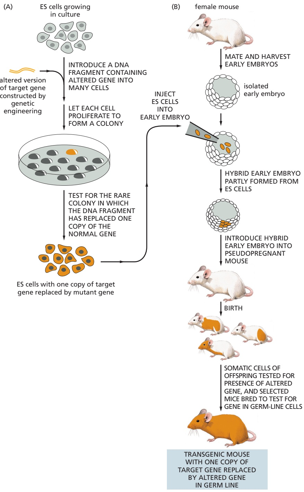

Figure 8–55 Summary of the procedures used for making gene replacements in mice. (A) In the first step, an altered version of the gene is introduced into cultured embryonic stem (ES) cells (described in Chapter 22). Only a few ES cells will have their corresponding normal genes replaced by the altered gene through a homologous recombination event. These cells can be identified by PCR and cultured to produce many descendants, each of which carries an altered gene in place of one of its two normal corresponding genes. (B) In the next step of the procedure, these altered ES cells are injected into a very early mouse embryo; the cells are incorporated into the growing embryo, and a mouse produced by such an embryo will contain some somatic cells (indicated by orange) that carry the altered gene. Some of these mice will also contain germ-line cells that contain the altered gene; when bred with a normal mouse, some of the progeny of these mice will contain one copy of the altered gene in all of their cells.

The mice with the transgene in their germ line are then bred to produce both a male and a female animal, each heterozygous for the gene replacement (that is, they have one normal and one mutant copy of the gene). When these two mice are mated (not shown), one-fourth of their progeny will be homozygous for the altered gene.

in this chapter and, for now, concentrate our discussion on transgenic mice. If a DNA molecule carrying a mutated mouse gene is transferred into a mouse cell, it is possible to direct the mutant gene to replace the normal gene by homologous recombination. By exploiting these gene-targeting events, any specific gene can be altered or inactivated in a mouse cell by a direct gene replacement. In the case in which both copies of the gene of interest are completely inactivated or deleted, the resulting animal is called a knockout mouse. The technique is summarized in **Figure 8–55**.

The ability to prepare transgenic mice lacking a known normal gene was a major advance, and the technique has been used to determine the functions of many mouse genes (**Figure 8–56**). If the gene functions in early development, a knockout mouse will usually die before it reaches adulthood. These lethal defectsMBoC7 m8.53/8.55 can be carefully analyzed to help determine the function of the missing gene.

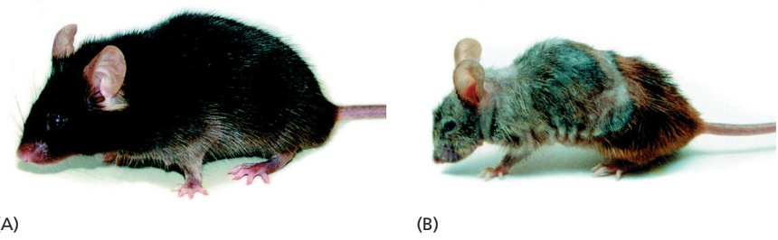

(A)

As described in Chapter 5, an especially useful type of transgenic animal takes advantage of a site-specific recombination system to excise—and thus disable— the target gene in a particular place or at a particular time (see Figure 5–66). In this case, the target gene in embryonic stem (ES) cells is replaced by a fully functional version of the gene that is flanked by a pair of the short DNA sequences, called lox sites, that are recognized by the Cre recombinase protein. The transgenicMBoC7 m8.54/8.56 mice that result are phenotypically normal. They are then mated with transgenic mice that express the Cre recombinase gene under the control of an inducible promoter. In the specific cells or tissues in which Cre is switched on, it catalyzes recombination between the lox sequences—excising a target gene and eliminating its activity (see Figure 22–7).

Figure 8–56 Transgenic mice engineered to express a mutant DNA helicase show premature aging. The helicase, encoded by the Xpd gene, is involved in both transcription and DNA repair. Compared with a wild-type mouse of the same age (A), a transgenic mouse that expresses a defective version of Xpd (B) exhibits many of the symptoms of premature aging, including osteoporosis, emaciation, early graying, infertility, and reduced life span. The mutation in Xpd used here impairs the activity of the helicase and mimics a mutation that in humans causes trichothiodystrophy, a disorder characterized by brittle hair, skeletal abnormalities, and a very reduced life expectancy. These results indicate that an accumulation of DNA damage can contribute to the aging process in both humans and mice. (From J. de Boer et al., Science 296:1276–1279, 2002. With permission from AAAS.)

## The Bacterial CRISPR System Has Been Adapted to Edit Genomes in a Wide Variety of Species

One of the difficulties in making transgenic mice by the procedure just described is that the introduced DNA molecule (bearing the experimentally altered gene) often inserts at random in the genome, and many ES cells must therefore be screened individually to find one that has the correct gene replacement.

Creative use of the CRISPR system, discovered in bacteria as a defense against viruses, has largely solved this problem. As described in Chapter 7, the CRISPR system uses a guide RNA sequence to target (through complementary base-pairing) double-stranded DNA, which it then cleaves (see Figure 7–81). The gene coding for the key component of this system, the bacterial Cas9 protein, has been transferred into a variety of organisms, where it greatly simplifies the process of making transgenic organisms (**Figure 8–57A and B**). The basic strategy is as follows: Cas9 protein is expressed in cultured cells along with a guide RNA designed by the experimenter to target a particular location on the genome. The Cas9 and guide RNA associate, the complex is brought to the matching sequence on the genome, and the Cas9 protein makes a double-strand break. As we saw in Chapter 5, these breaks are usually repaired by nonhomologous end joining, which often results in small sequence errors or deletions that disrupt gene function. In many cases, this repair process is sufficient to inactivate the gene, particularly if it produces a frameshift near the beginning of the coding sequence. If the goal is a precise gene knockout or replacement, then Cas9 and guide RNA can be co-expressed in ES cells with an altered homologous gene sequence, which the cell uses to repair the double-strand break by homologous recombination. In this way, the normal gene can be selectively damaged by the CRISPR system and replaced at high efficiency by an experimentally altered gene.

The CRISPR system has a variety of other uses. Its particular power lies with its ability to target Cas9 to thousands of different positions across a genome through the simple rules of complementary base-pairing. Thus, if a catalytically inactive Cas9 protein is fused to a transcription activator or repressor, it is possible, in principle, to turn any gene on or off by providing a guide RNA that matches a unique sequence in the gene promoter (**Figure 8–57C and D**; **Movie 8.4**).

The CRISPR system has several advantages over other strategies for experimentally manipulating gene expression. First, it is relatively easy for the experimenter to design the guide RNA: it simply follows standard base-pairing convention. Second, the gene to be controlled does not have to be modified; the CRISPR strategy exploits DNA sequences already present in the genome. Third, numerous genes can be controlled simultaneously. Cas9 has to be expressed only once, but many guide RNAs can be expressed in the same cell; this strategy allows the experimenter to turn on or off a whole set of genes at once.

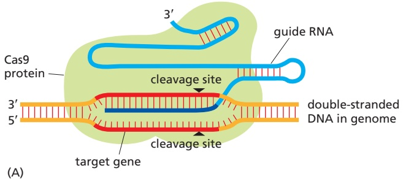

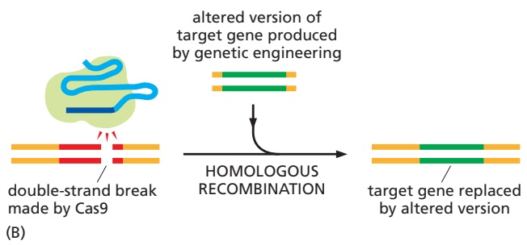

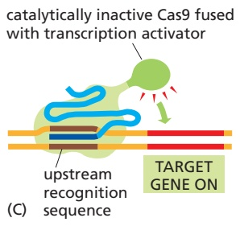

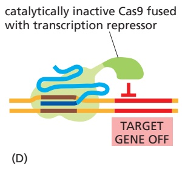

The export of the CRISPR system from bacteria to virtually all other experimental organisms (including mice, zebrafish, worms, flies, rice, and wheat) has revolutionized the study of gene function. Like the earlier discovery of restriction nucleases, this breakthrough came from scientists studying a fascinating phenomenon in bacteria without—at first—realizing the enormous impact theseMBoC7 e10.31/8.57 discoveries would have on all aspects of biology.

## Large Collections of Engineered Mutations Provide a Tool for Examining the Function of Every Gene in an Organism

Extensive collaborative efforts have produced comprehensive libraries of mutations in a variety of model organisms, including S. cerevisiae, Caenorhabditis elegans, Drosophila, Arabidopsis, and even the mouse. The ultimate aim in each case is to produce a collection of mutant strains in which every gene in the organism—one at a time—has been systematically deleted or altered in such a way that it can be conditionally disrupted. Collections of this type provide an invaluable resource for investigating gene function on a genomic scale. For example, a large collection of mutant organisms can be screened for a particular phenotype. Like the classic genetic approaches described earlier, this is one of the most powerful ways to identify the genes responsible for a particular phenotype. Unlike the classical genetic approach, however, the set of mutants is “pre-engineered,” so that there is no need to rely on chance events such as

Figure 8–57 Use of CRISPR to study gene function in a wide variety of species. (A) The Cas9 protein (artificially expressed in the species of interest) binds to a guide RNA, designed by the experimenter and also expressed. The portion of RNA in light blue is needed for associations with Cas9; that in dark blue is specified by the experimenter to match a position on the genome. The only other requirement is that the adjacent genome sequence includes a short PAM (protospacer adjacent motif, not shown) that is needed for Cas9 to cleave. As described in Chapter 7, this sequence allows the CRISPR system in a bacterium to distinguish its own genome from that of invading viruses. (B) When Cas9 is directed to make a double-strand break in a gene, the break is generally repaired by nonhomologous end joining (not shown), which introduces local sequence errors that can disrupt gene function. A more precise mutation can be made as shown here, where the double-strand break is repaired by homologous recombination with an altered gene provided by the experimenter. (C, D) By using a mutant form of Cas9 that can no longer cleave DNA, Cas9 can be used to activate a normally dormant gene (C) or turn off an actively expressed gene (D). (Adapted from P. Mali et al., Nat. Methods 10:957–963, 2013.)

target gene X replaced by selectable marker gene and associated “bar-code” sequence

spontaneous mutations or transposon insertions. In addition, each of the individual mutations within the collection is often engineered to contain a distinct molecular “bar code”—in the form of a unique DNA sequence—designed to make identification of the altered gene rapid and routine (**Figure 8–58**).

In S. cerevisiae, the task of generating a complete set of 6000 mutants, each. / . missing only one gene, was accomplished in the early 2000s. Because each mutant strain has an individual bar-code sequence embedded in its genome, a large mixture of engineered strains can be grown under various selective test conditions—such as nutritional deprivation, a temperature shift, or the presence of various drugs—and the cells that survive can be rapidly identified by the unique sequence tags present in their genomes. By assessing how well each mutant in the mixture fares, one can begin to discern which genes are essential, useful, or irrelevant for growth under the various conditions (**Figure 8–59**).

Similar methods can be applied to human cells using the CRISPR system described earlier. Using viral expression vectors, a large library of different guide RNAs can be expressed in a cell population, such that only one guide RNA is expressed in each cell, along with Cas9. After growth of the cells under various conditions, surviving cells are subjected to genomic sequencing to measure the abundance of guide RNAs in the population. Guide RNAs that target genes essential for survival will disappear from the population, whereas those that enhance survival will be enriched—providing important clues about the function of those genes under the conditions tested.

The insights generated by examining mutant libraries can be considerable. For example, studies of an extensive collection of mutants in Mycoplasma genitalium—the organism with the smallest known genome—have identified the minimum complement of genes essential for cellular life. Growth under laboratory conditions requires about three-quarters of the 480 protein-coding genes in M. genitalium. Approximately 100 of these essential genes are of unknown function, which suggests that a surprising number of the basic molecular mechanisms that underlie life have yet to be discovered.

Figure 8–59 Genome-wide screens for fitness using a large pool of bar-coded yeast deletion mutants. A large pool of yeast mutants, each with a different gene deleted and present in equal amounts, is grown under conditions selected by the experimenter. Some mutants (blue) grow normally, but others show reduced growth (orange and green) or no growth at all (red). The fitness of each mutant is experimentally determined in the following way. After the growth phase is completed, genomic DNA (isolated from the mixture of strains) is purified, and the relative abundance of each mutant is determined by quantifying the level of the DNA bar code matched to each deletion. This can be done by sequencing the pooled genomic DNA. In this way, the contribution of every gene to growth under the specified condition can be rapidly ascertained. This type of study has revealed that of the approximately 6000 coding genes in yeast, only about 1000 are essential under standard growth conditions.

Figure 8–58 Making bar-coded collections of mutant organisms. A deletion construct for use in yeast contains DNA sequences (red) homologous to each end of a target gene X, a selectable marker gene (blue), and a unique “bar-code” sequence approximately 20 nucleotide pairs in length (green). This DNA is introduced into yeast cells, where it readily replaces the target gene by homologous recombination. Cells that carry a successful gene replacement are identified by expression of the selectable marker gene, typically a gene that provides resistance to a drug. By using a collection of such constructs, each specific for one gene, a library of yeast mutants was constructed containing a mutant for every gene. Essential genes cannot be studied this way, as their deletion from the genome causes the cells to die. In this case, the target gene is replaced by a version of the gene that can be regulated by the experimenter (see Figure 8–54). The gene can then be turned off, and the effect of this can be monitored before the cells die.

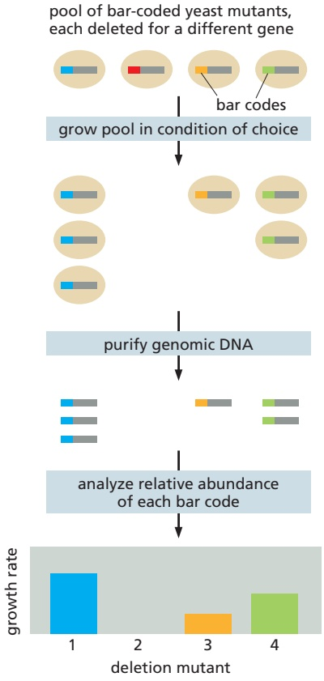

Collections of mutant organisms are also available for many animal and plant species. For example, it is possible to “order,” by phone or e-mail from a consortium of investigators, a deletion or insertion mutant for almost all coding genes in Drosophila. Likewise, a nearly complete set of mutants exists for the model plant Arabidopsis. And the adaptation of the CRISPR system for use in mice means that, in the near future, we can expect to be able to turn on or off—at will— each gene in the mouse genome at different stages of development. Although we are still ignorant about the function of most genes in most organisms, these technologies allow an exploration of gene function on a scale that was unimaginable a decade ago.

## RNA Interference Is a Simple and Rapid Way to Test Gene Function

Although knocking out (or conditionally expressing) a gene in an organism and studying the consequences is the most powerful approach for understanding the functions of the gene, RNA interference (RNAi, for short) is an alternative, particularly convenient approach. As discussed in Chapter 7, this method exploits a natural mechanism used in many plants, animals, and fungi to protect themselves against viruses and transposable elements. The technique introduces into a cell or organism a double-strand RNA molecule whose nucleotide sequence matches that of part of the gene to be inactivated. After the RNA is processed, it hybridizes with the target-gene RNA (either mRNA or noncoding RNA) and reduces its expression by the mechanisms shown in Figure 7–78.

RNAi is frequently used to inactivate genes in Drosophila and mammalian cell culture lines. Indeed, a set of 15,000 Drosophila RNAi molecules (one for every coding gene) allows researchers, in several months, to test the role of every fly gene in any process that can be monitored using cultured cells. RNAi has also been widely used to study gene function in whole organisms, including the nematode C. elegans. When working with worms, introducing the double-stranded RNA is quite simple: either the RNA can be injected directly into the intestine of the worm or the worm can be fed with E. coli engineered to produce the RNA (**Figure 8–60**). The RNA is amplified and distributed throughout the body of the worm, where it inhibits expression of the target gene in different tissue types. RNAi is being used to help in assigning functions to the entire complement of worm genes (**Figure 8–61**).

A related technique has also been applied to mice. In this case, the RNAi molecules are not injected or fed to the mouse; rather, recombinant DNA techniques are used to make transgenic animals that express the RNAi under the control of an inducible promoter. Often this is a specially designed RNA that can fold back on itself and, through base-pairing, produce a double-strand region that is recognized by the RNAi machinery. In the simplest cases, the process inactivates only the genes that exactly match the RNAi sequence. Depending on the

20 µm

(A)

Figure 8–60 Gene function can be tested by RNA interference. (A) Doublestranded RNA (dsRNA) can be introduced into C. elegans by feeding the worms E. coli that express the dsRNA. (B) In a wild-type worm embryo, the egg and sperm pronuclei (red arrowheads) come together in the posterior half of the embryo shortly after fertilization. (C) In an embryo in which a particular gene has been inactivated by RNAi, the pronuclei fail to migrate. This experiment revealed an important but previously unknown function of this gene in embryonic development. (B and C, from P. Gönczy et al., Nature 408:331–336, 2000. Reproduced with permission of SNCSC.)

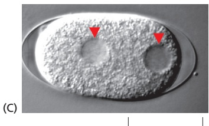

Figure 8–61 RNA interference provides a convenient method for conducting genome-wide genetic screens. In this experiment, each well in this 96-well plate is filled with E. coli that produce a different double-stranded RNA than that produced by E. coli in other wells. Each interfering RNA matches the nucleotide sequence of a single C. elegans gene, thereby inactivating it. About 10 worms are added to each well, where they ingest the genetically modified bacteria. The plate is incubated for several days, which gives the RNAs time to inactivate their target genes—and the worms time to grow, mate, and produce offspring. The plate is then examined in a microscope, which can be controlled robotically, to screen for genes that affect the worms’ ability to survive, reproduce, develop, and behave. Shown here are normal worms alongside worms that show an impaired ability to reproduce because of inactivation of a particular “fertility” gene. (From B. Lehner et al., Nat. Genet. 38:896–903, 2006. With permission from Nature.)

inducible promoter used, the RNAi can be produced only in a specified tissue or only at a particular time in development, allowing the functions of the target genes to be analyzed in elaborate detail.

RNAi is a simple and efficient tool for analysis of gene function in many organisms, but it has several potential limitations compared with true genetic knockouts. For unknown reasons, RNAi does not efficiently inactivate all genes. Moreover, within whole organisms, certain tissues may be resistant to the action of RNAi (for example, neurons in nematodes). Another problem arises because many organisms contain large gene families, the members of which exhibit sequence similarity. RNAi therefore sometimes produces “off-target” effects, inactivating related genes in addition to the targeted gene. One strategy to avoid such problems is to use multiple small RNA molecules matched to different regions of the same gene. Ultimately, the results of any RNAi experiment must be viewed as a strong clue to, but not necessarily a proof of, normal gene function.

## Reporter Genes Reveal When and Where a Gene Is Expressed

We have just discussed some of the approaches that can be used to assess a gene’s function in cultured cells or, even better, in the intact organism. Although this information is crucial to understanding gene function, it does not generally reveal the molecular mechanisms through which the gene product works in the cell. For example, genetics on its own rarely tells us all the places in the organism where the gene is expressed or how its expression is controlled. It does not necessarily reveal whether the gene acts in the nucleus, the cytosol, on the cell surface, or in one of the numerous other compartments of the cell. And it does not reveal how a gene product might change its location or its expression pattern when the external environment of the cell changes. Key insights into gene function can be obtained by simply observing when and where a gene is expressed. A variety of approaches, most involving some form of genetic engineering, can easily provide this critical information.

As discussed in detail in Chapter 7, cis-regulatory DNA sequences, located upstream or downstream of the coding region, control gene transcription. These regulatory sequences, which determine precisely when and where the gene is