MATHEMATICAL ANALYSIS OF CELL FUNCTION

547

transcription rate = β $\frac{K[A]}{1 + K[A]}$
protein production rate = β·m $\frac{K[A]}{1 + K[A]}$
protein degradation rate = $\frac{[X]}{\tau_X}$

(A)

$\frac{d[X]}{dt} =$ protein production rate - protein degradation rate
$\frac{d[X]}{dt} = \beta \cdot m \frac{K[A]}{1 + K[A]} - \frac{[X]}{\tau_X}$ Equation 8-5

(B)

at steady state:
$[X_{st}] = \beta \cdot m \frac{K[A]}{1 + K[A]} \cdot \tau_X$ Equation 8-6

(C)

$[X](t) = [X_{st}](1 - \exp(-t/\tau_X))$

(D)

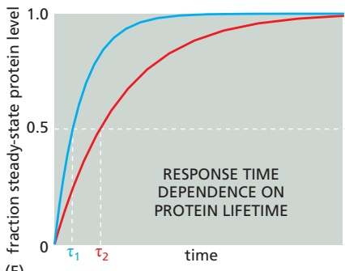

Figure 8–76 Effect of protein lifetime on the timing of the response. (A) Equations for calculation of the rates of gene X transcription, protein X production, and protein X degradation, as explained in the text. (B) Equation 8–5 is an ordinary differential equation for calculating the rate of change in protein X in response to changes in other components. (C) When the rate of change in protein X is zero (steady state), its concentration can be calculated with Equation 8–6, revealing a direct relationship with protein lifetime (τ). (D) The solution of Equation 8–5 specifies the concentration of protein X over time as it approaches its steady-state concentration. (E) Response time depends on protein lifetime. As described in the text, the time that it takes a protein to reach a new steady state is greater when the protein is more stable. Here, the blue line corresponds to a protein with a lifetime that is 2.5-fold shorter than the lifetime of the protein in red.

steps that lead to production of mRNA and protein (**Figure 8–76A**). If each mRNA molecule produces, on average, m molecules of protein product, then we can determine the protein production rate by multiplying the transcription rate by m (Figure 8–76A).

Now let us consider the factors that influence protein X degradation and its dilution due to cell growth. Degradation generally results in an exponential decline in protein levels, and the average time required for a specific protein to be degraded is defined as its mean lifetime, τ. In our current example, the rate of degradation of protein X depends on its mean lifetime $\tau _ { X } ,$ which takes into account active degradation as well as its dilution as the cell grows. The degradation rate depends on the concentration of protein X and is calculated by dividing this concentration by the lifetime (see Figure 8–76A).

With equations for rates of production and degradation in hand, we can now generate a differential equation to determine the rate of change of protein X as a function of time (Equation 8–5; **Figure 8–76B**). This equation can be solved by the numerical methods mentioned earlier. According to the solution of this equation, when transcription begins, the concentration of protein X rises to a steady-state level at which the concentration of X is not changing anymore; that is, its rate of change is zero. When this occurs, rearrangement of Equation 8–5 yields an equation that can be used to determine the steady-state value of X, $\left[ X _ { s t } \right]$ (Equation 8–6; **Figure 8–76C**). An important concept emerges from the mathematics: the steadystate concentration of a gene product is directly proportional to its lifetime. If lifetime doubles, protein concentration doubles as well.

## The Time Required to Reach Steady State Depends on Protein Lifetime

We can see from Equation 8–6 (see Figure 8–76C) that when the concentration of protein A rises, protein X increases to a new steady-state value, $\left[ X _ { s t } \right]$ . But this cannot happen instantaneously. Instead, X changes dynamically according to the solution of its differential rate equation (Equation 8–5). The solution of this equation reveals that the concentration of X over time is related to its steady-state

---

548

Chapter 8: Analyzing Cells, Molecules, and Systems

concentration according to the equation in **Figure 8–76D**. Once again, mathematics uncovers a simple but important concept that is not intuitively obvious: after a sudden increase in [A], [X] rises to a new steady state at an exponential rate that is inversely related to its lifetime; the faster X is degraded, the less time it takes it to reach its new steady-state value (**Figure 8–76E**). The faster response time comes at a higher metabolic cost, however, because proteins with a rapid response time must be produced and degraded at a high rate. For proteins that are not rapidly turned over, the response time is very long, and protein concentration is determined primarily by the dilution that results from cell growth and division.

## Quantitative Methods Are Similar for Transcription Repressors and Activators

Positive control is not the only mechanism that cells use to regulate the expression of their genes. As we discussed in Chapter $^ { 7 , }$ cells also actively shut off genes, often by employing transcription repressor proteins that bind to specific sites on target genes, thereby blocking access to RNA polymerase. We can analyze the function of these repressors by the same quantitative methods described above for transcription activators. If a repressor protein R binds to the regulatory region of gene X and represses its transcription, then the fraction of gene-binding sites occupied by the repressor is specified by the same equation we used earlier for the transcription activator (**Figure 8–77A**). In this case, however, it is only when the DNA is free that RNA polymerase can bind to the promoter and transcribe the gene. Thus, the quantity of interest is the unbound fraction, which can be viewed as the probability that the site is free, averaged over multiple binding and unbinding events. When the repressor concentration is zero, the unbound fraction is 1 and the promoter is fully active; when the repressor concentration greatly exceeds 1/K, the unbound fraction approaches zero. **Figure 8–77B** and **Figure 8–77C** compare these relationships for a transcription activator and a transcription repressor.

$$
\begin{array}{l} \text {bound fraction} = \frac {K [ R ]}{1 + K [ R ]} \\ \text {unbound fraction} = 1 - \text {bound fraction} = \frac {1}{1 + K [ R ]} \end{array}
$$

(A)

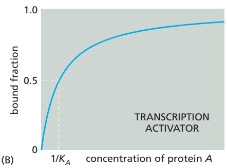

$$
\text {protein production rate} = \beta \cdot m \frac {1}{1 + K [ R ]}
$$

$$
\frac {d [ X ]}{d t} = \beta \cdot m \frac {1}{1 + K [ R ]} - \frac {[ X ]}{\tau_ {X}}
$$

(D)

$$
[ X _ {s t} ] = \beta \cdot m \frac {1}{1 + K [ R ]} \cdot \tau_ {X}
$$

Figure 8–77 How promoter occupancy depends on the binding affinity of a transcription regulator protein. (A) The fraction of a binding site that is occupied by a transcription repressor R is determined by an equation that is similar to the one we used for a transcription activator (see Figure 8–74E), except that in the case of a repressor we are interested primarily in the unbound fraction. (B) For a transcription activator A, half of the promoters are occupied when $[ A ] = 1 / K _ { A } .$ Gene activity is proportional to this bound fraction. $( \complement )$ For a transcription repressor $R ,$ gene activity is proportional to the unbound fraction of promoters. As indicated, this fraction is reduced to half of its maximal value when $[ { \cal R } ] = 1 / K _ { R } .$ (D) As in the case of the transcription activator A (see Figure 8–76), we can derive equations to assess the timing of protein $X$ production as a function of repressor concentrations.

---

MATHEMATICAL ANALYSIS OF CELL FUNCTION

549

We can create a differential equation that provides the rate of change in protein X when repressor concentrations change (Equation 8–7; **Figure 8–77D**). As in the case of the transcription activator, the steady-state concentration of protein X increases as its lifetime increases, but it decreases as the concentration of the transcription repressor increases.

## Negative Feedback Is a Powerful Strategy in Cell Regulation

Thus far, we have considered simple regulatory systems of just a few components. In most of the complex regulatory systems that govern cell behaviors, multiple modules are linked to produce larger circuits that we call network motifs, which can produce surprisingly complex and biologically useful responses whose properties become apparent only through mathematical analysis. A particularly common and important network motif is the negative feedback loop, which can have dramatically different functions depending on how it is structured.

We take as a first example a network motif consisting of two linked modules (**Figure 8–78A**). Here, an input signal initiates the transcription of gene A, which produces a transcription activator protein A. This activates gene R, which synthesizes a transcription repressor protein R. Protein R in turn binds to the promoter of gene A to inhibit its expression. This cyclical organization creates a negative feedback loop that one can intuitively understand as a mechanism to prevent proteins from accumulating to high levels. But what can we learn about negative feedback loops, and their value in biology, by using mathematics to model them?

The negative feedback loop in Figure 8–78A can be modeled using Equation 8–7 (see Figure 8–77D) for the repression of gene A and Equation 8–5 (see Figure 8–76B) for the activation of gene R. Thus, for proteins A and R, we use the set of differential equations (Equation set 8–8) shown in **Figure 8–78B**. The two equations in this set are coupled, which means that they must be solved together to describe the behavior of A and R over time for any value of the input. As before, we plug in values for the parameters $\left( \beta _ { R } ,   \tau _ { R } ,   \mathrm { e t c . } \right)$ and then use a computer to determine the values of [A] and [R] as a function of time after a sudden input activates gene A.

The results reveal several important properties of negative feedback. First, rather surprisingly, negative feedback increases the speed of the response to the activating input. As shown in **Figure 8–78C**, the system with negative feedback reaches its new steady state faster than the system with no feedback.

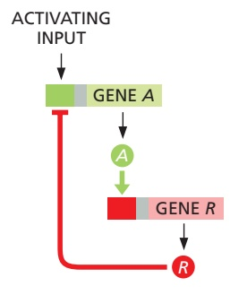

Second, negative feedback is useful for protecting cells from perturbations that continually arise in the cell’s internal environment—due either to random variations in the birth and death of molecules or to fluctuations in environmental variables such as temperature and nutritional supplies. Let us imagine, for example, that $\beta _ { A } ,$ the transcription rate constant for gene A, fluctuates by 25% of its value and ask whether and how much the levels of protein R are affected. The results, shown in **Figure 8–79**, reveal that a change in $\beta _ { A }$ causes a smaller change in the steady-state value of R when the network has negative feedback.

## Delayed Negative Feedback Can Induce Oscillations

A beautiful thing happens when a negative feedback loop contains some delay mechanism that slows the feedback signal through the loop: rather than generating a new stable state as in a rapid negative feedback loop, a delayed loop

(A)

(B)

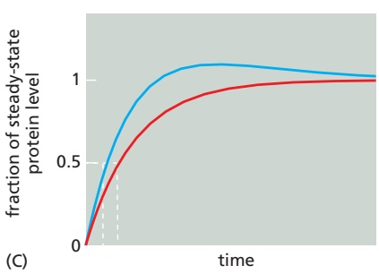

<small>Figure 8–78 A simple negative feedback motif. (A) Gene A negatively regulates its own expression by activating gene R. The product of gene R is a transcription repressor that inhibits gene A. (B) Equation set 8–8 can be solved to determine the dynamics of system components over time. (C) A system with negative feedback (blue) reaches its steady state faster than a system with no feedback (red). The plots indicate the levels of protein A, expressed as a fraction of the steadystate level. The blue line reflects the solution of Equation set 8–8, which includes negative feedback of gene A by the repressor R. The red line represents the solution when the rate of synthesis of A was set to a constant value that is unaffected by the repressor R.</small>

---

550

Chapter 8: Analyzing Cells, Molecules, and Systems

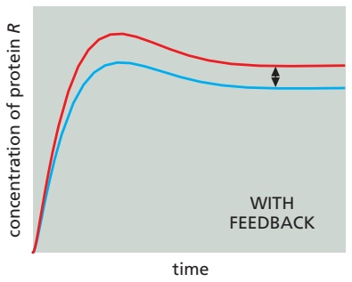

Figure 8–79 The effect of fluctuations in kinetic rate constants on a system with negative feedback compared to one without feedback. The plot at left represents the levels of protein R after a sudden activating stimulus, according to the regulatory scheme in Figure 8–78A and determined by the solution of Equation set 8–8 (see Figure 8–78B). A perturbation was induced by changing βA from 4 M/min (red line) to 3 M/min (blue line). The plot at right shows the results when negative feedback was removed. The system with negative feedback deviates less from its normal operation as β changes than does the system with no feedback. Notice that, as in Figure 8–78C, the system with negative feedback also reaches its steady state more rapidly.

generates pulses, or oscillations, in the levels of its components. This can be seen, for example, if the number of components in a negative feedback loop increases,MBoC7 m8.77/8.79 which leads to delays in the amount of time required for the cycle of signals to be completed. **Figure 8–80** compares the behavior of two network motifs—one with a three-stage and one with a five-stage negative feedback loop. Using the same kinetic parameters at each stage in the two loops, one finds that stable oscillations arise in the longer loop, while in the shorter loop the same parameters lead to relatively rapid convergence to a stable steady state.

Changes in the parameters of a delayed negative feedback loop—binding affinities, transcription rates, or protein stabilities, for example—can change the amplitude and period of the oscillations, providing a remarkably versatile mechanism for generating all sorts of oscillators that can be used for various purposes in the cell. Indeed, many naturally occurring oscillators, including the calcium oscillators described in Chapter 15 and the cell-cycle network described in Chapter 17, use delayed negative feedback as the basis for biologically important oscillations. Not all of the oscillations observed in cells are thought to have a function, however. Oscillations become inevitable in a highly complex, multicomponent biochemical pathway such as glycolysis, due simply to the large number of feedback loops that appear to be required for its regulation.

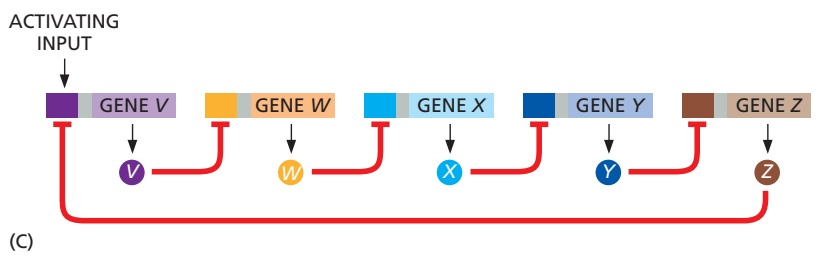

Figure 8–80 Oscillations arising from delayed negative feedback. A transcriptional circuit with three components (A, B) is less likely to oscillate than a transcriptional circuit with five components (C, D). The X (light blue), Y (dark blue), and Z (brown) here represent transcription regulatory proteins. For the simulations in panels B and D, the system was initiated from random initial conditions for X, Y, and Z. Oscillations are produced by a delay induced as the signal propagates through the loop.

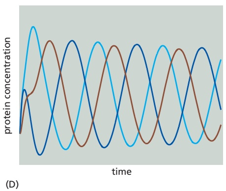

---

(B)

MATHEMATICAL ANALYSIS OF CELL FUNCTION

551

$$
\text {bound fraction} = \frac {(K _ {A} [ A ]) ^ {h}}{1 + (K _ {A} [ A ]) ^ {h}} \text {for activators, or} \frac {(K _ {R} [ R ]) ^ {h}}{1 + (K _ {R} [ R ]) ^ {h}} \text {for repressors}
$$

(A)

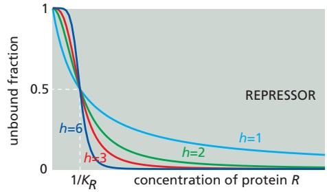

Figure 8–81 How the cooperative binding of transcription regulatory proteins affects the fraction of promoters bound. (A) Cooperativity is incorporated into our mathematical models by including a Hill coefficient (h) in the equations used previously to determine the fraction of bound promoter (see Figures 8–74E and 8–77A). When h is 1, the equations shown here become identical to the equations used previously, and there is no cooperativity. (B) The left panel depicts a cooperatively bound transcription activator, and the right panel depicts a cooperatively bound transcription repressor. Recall from Figure 8–77B that gene activity is proportional to bound activator (left panel) or unbound repressor (right panel). Note that the plots get steeper as the Hill coefficient increases.

## DNA Binding by a Repressor or an Activator Can Be Cooperative

We have focused thus far on the binding of a single transcription regulator to a single site in a gene promoter. Many promoters, however, contain multiple adjacent binding sites for the same transcription regulator, and it is not uncommon for these regulators to interact with each other on the DNA to form dimers or larger oligomers. These interactions can result in a cooperative form of DNA binding, such that DNA-binding affinity increases at higher concentrations of the transcription regulator. Cooperativity produces a steeper transcriptional responseMBoC7 m8.79/8.81 to increasing regulator concentration than the response that can be generated by the binding of a monomeric protein to a single site. A steep transcriptional response of this sort, when present in conjunction with positive feedback, is an important ingredient for producing systems with the ability to switch between different discrete phenotypic states. To begin to understand how this occurs, we need to modify our equations to include cooperativity.

Cooperative binding events can produce steep S-shaped (or sigmoidal) relationships between the concentration of regulatory protein and the amount bound on the DNA (see Figure 7–11 and Figure 15–17). In this case, a number called the Hill coefficient (h) describes the degree of cooperativity, and we can include this coefficient in our equations for calculating the bound fraction of promoter (**Figure 8–81A**). As the Hill coefficient increases, the dependence of binding on protein concentration becomes steeper (**Figure 8–81B**). In principle, the Hill coefficient is similar to the number of molecules that must come together to generate a reaction. In practice, however, cooperativity is rarely complete, and the Hill coefficient does not reach this number.

## Positive Feedback Is Important for Switchlike Responses and Bistability

We turn now to positive feedback and its very important consequences. First and foremost, positive feedback can make a system bistable, enabling it to persist in either of two (or more) alternative steady states. The idea is simple and can be conveyed by drawing an analogy with a candle, which can exist either in a burning state or in an unlit state. The burning state is maintained by positive feedback: the heat generated by burning keeps the flame alight. The unlit state is maintained by the absence of this feedback signal: so long as sufficient heat has never been applied, the candle will stay unlit.

For the biological system, as for the candle, bistability has an important corollary: it means that the system has a memory, such that its present state depends on its history. If we start with the system in an Off state and gradually rack up the concentration of the activator protein, there will come a point where autostimulation becomes self-sustaining (the candle lights), and the system moves rapidly to an On state. If we now intervene to decrease the level of activator, there will come a point where the same thing happens in reverse, and the system moves rapidly

---

552

Chapter 8: Analyzing Cells, Molecules, and Systems

back to an Off state. But the transition points for switching on and switching off are different, and so the current state of the system depends on the route by which it has been taken in the past—a phenomenon called hysteresis.

A simple case of positive feedback can be seen in a regulatory system in which a transcription regulator activates (directly or indirectly) its own expression, as in **Figure 8–82A**. Positive feedback can also arise in a circuit with many intervening repressors or activators, so long as the net overall effect of the interactions is activation (**Figure 8–82B and C**).

To illustrate how positive feedback can generate stable states, let us focus on a simple positive feedback loop containing two repressors, X and $Y _ { r }$ each of which inhibits expression of the other (**Figure 8–83A**). As we saw with Equation set 8–8 (Figure 8–78B) earlier, we can create differential equations describing the rate of change of [X] and [Y] (Equation set 8–9; **Figure 8–83B**). We can further modify these equations to include cooperativity by adding Hill coefficients. As we did earlier, we can then create equations for calculating the concentrations of [X] and [Y] when the system reaches a steady state—that is, when $( d [ X ] / d t ) = 0$ and $( d [ Y ] / d t ) = 0$ (Equations 8–10 and 8–11, **Figure 8–83C**).

Equations 8–10 and 8–11 can be used to carry out an intriguing mathematical procedure called a nullcline analysis. These equations define the relationships between the concentration of X at steady state, $\left[ \bar { X _ { s t } } \right] _ { i }$ , and the concentration of Y at steady state, [Yst], which must be simultaneously satisfied. We can plug in different values for $\left[ Y _ { s t } \right]$ in Equation 8–10 and calculate the corresponding $\left[ X _ { s t } \right]$ for each of these values. We can then graph $\left[ X _ { s t } \right]$ as a function of $\left[ Y _ { s t } \right]$ . Next, we repeat the process by varying [Xst] in Equation 8–11 to graph the resulting [Yst]. The intersections of these two graphs determine the theoretically possible steady states of the system. For systems in which the Hill coefficients $h _ { X }$ and $h _ { Y }$ are much larger than 1, the lines in the two graphs intersect at three locations (**Figure 8–83D**). In other systems that have the same arrangement of regulators but different parameters, there might only be one intersection, indicating the presence of only a single

Figure 8–82 Positive feedback of a gene onto itself through serially connected interactions. A sequence of activators and repressors of any length can be connected to produce a positive feedback loop, as long as the overall sign is positive. Because the negative of a negative is positive, not only circuit (A) and (B) but also circuit (C) create positive feedback.

(B)

(C)

(A)

(E)

Figure 8–83 A graphical nullcline analysis. (A) X inhibits Y and Y inhibits X, resulting in a positive feedback loop. (B) Equation set 8–9 can be used to determine the rate of change in the concentrations of proteins X and Y. (C) Equations 8–10 and 8–11 provide the concentrations of proteins X and $Y ,$ respectively, when these concentrations reach a steady state. (D, E) Blue curves (called nullclines) are plots of $[ X _ { s t } ]$ calculated from Equation 8–10 over a range of concentrations of [Yst]. Red curves are nullclines that indicate values of $[ Y _ { s t } ]$ calculated from Equation 8–11 over a range of concentrations of [Xst]. At an intersection of the two lines, both [X] and [Y] are at steady state. For plot D, the binding of both proteins to their target gene promoters was cooperative $( h _ { X }$ and hY much larger than 1), resulting in the presence of multiple intersections of the nullclines–– suggesting that the system can assume multiple discrete steady states. In plot E, the binding of protein X to the promoter of gene Y was not cooperative $( h _ { X }$ close to 1), resulting in only one nullcline intersection and thus just one likely steady state.

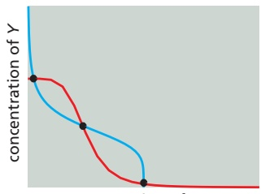

(D)

---

(B)

concentration of X

MATHEMATICAL ANALYSIS OF CELL FUNCTION

553

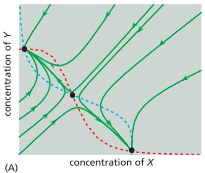

steady state. For example, when there is a low cooperativity of protein X binding to the promoter of gene Y (that $\mathbf { i } \mathbf { s } ,$ a small Hill coefficient, $h _ { X } ,$ in Equation 8–11), the plot of [Y] is less curved (**Figure 8–83E**), and it is less likely that there will be multiple intersections of the two curves.

We emphasized earlier that positive feedback typically generates a bistable sys-MBoC7 m8.82/8.84 tem with two stable steady states. Why does the system modeled in Figure 8–83D have three? This conundrum can be explained by solving the reaction rate equations (Equation set 8–9; Figure 8–83B) for various different starting conditions of [X] and $[ Y ] ,$ determining all values of [X] and [Y] as a function of time. Starting with each set of initial concentrations of [X] and [Y], these calculations produce a socalled trajectory of points, each indicated by a curved green line on **Figure 8–84A**. A fascinating pattern emerges: each trajectory moves across the plot and settles in one of two steady states, but never in the third (middle steady state). We conclude that the middle steady state is unstable because it cannot “attract” any trajectories. The system therefore has only two stable steady states. Thus, the number of stable steady states in a system need not be equal to the total number of its theoretically possible steady states. In fact, stable steady states are usually separated by unstable ones, as in our example.

Figure 8–84 Analysis of the stability of a system’s steady states. (A) The dotted lines are the nullclines for the system shown in Figure 8–83. Also shown are dynamic trajectories (green) that show the changes over time in [X] and [Y], starting at a variety of different initial concentrations (determined by solution of Equation set 8–9; see Figure 8–83B). By plotting [X] versus [Y] at each time point, we find that, although there are three possible steady states in this system, the dynamic trajectories converge on only two of them. The middle steady state is avoided: it is unstable, being unable to attract any trajectories. (B) Imagine that the system is at the upper-left steady state and experiences a perturbation (black arrows), such as a random fluctuation in the production rates of X and/or Y. If the perturbation is small (arrow 1), the system will return to the same steady state. On the other hand, a perturbation that drives the system beyond the unstable (middle) steady state (arrow 2) causes it to switch to the lower-right steady state. The set of perturbations that a system can withstand without switching from one steady state to the other is known as the region of attraction of that steady state.

Once this system adopts a fate by settling in one of the two steady states, does it have the ability to switch to the other state? The numerical solution of Equation set 8–9 can again provide an answer. In **Figure 8–84B**, we show the solution of this equation set for two perturbations from the upper-left steady state. For a small perturbation, the system returns to its original steady state. But the larger perturbation causes the system to switch to the alternate steady state. Thus, this system can be switched from one stable steady state to the other by subjecting it to an input (or a perturbation) that is large enough to make the other steady state more attractive. More generally, every stable steady state has a corresponding region of attraction, which can be intuitively thought of as the range of perturbations (of [X] or [Y] in this example) for which the dynamic trajectories converge back to that particular steady state, rather than switch to the other one.

The concept of a region of attraction has interesting implications for the heritability of transcriptional states and the transition rates between them. If the region of attraction around one steady state is large, for example, then most cells in the population will assume this particular state. Furthermore, this state is likely to be inherited by daughter cells, because minor perturbations, like those ensuing from an asymmetric distribution of molecules during cell division, will rarely be sufficient to induce switching to the other steady state. We should expect that the use of positive feedback, coupled to cooperativity, will quite often be associated with systems requiring stable cell memory.

## Robustness Is an Important Characteristic of Biological Networks

Biological regulatory systems are exposed to frequent and sometimes extreme variations in external conditions or the concentrations or activities of key components. The ability of these systems to function normally in the face of such perturbations is called **robustness**. If we understand a complex system to the extent that we can reproduce its behavior with a computational model, then the

---

554

Chapter 8: Analyzing Cells, Molecules, and Systems

robustness of the system can be assessed by determining how well its normal function persists after changes in various parameters, such as rate constants and component concentrations. We have already seen, for example, how the presence of negative feedback reduces the sensitivity of the steady state to changes in the values of the system’s parameters (see Figure 8–79). Considerations of robustness also apply to dynamic behaviors. Thus, for example, when discussing negative feedback, we described how the behavior of a system tends to become more oscillatory as the number of components that constitute the feedback loop increases. If we use different values of the parameters in models derived for systems like those in Figure 8–80, we find that the system with the longer loop tends to exhibit stable oscillations within a much broader range of parameters, indicating that this system provides a more robust oscillator. We can perform similar calculations to determine the ability of different systems to achieve robust bistability arising from positive feedback. Thus, one benefit of computational models is that they allow us to probe the robustness of biological networks in a systematic and rigorous way.

## Two Transcription Regulators That Bind to the Same Gene Promoter Can Exert Combinatorial Control

Thus far, we have discussed how one transcription regulator can modulate the expression level of a gene. Most genes, however, are controlled by more than one type of transcription regulator, providing combinatorial control that allows two or more inputs to influence the expression of one gene. We can use computational methods to unveil some of the important regulatory features of combinatorial control systems.

Consider a gene whose promoter contains binding sites for two regulatory proteins, A and R, which bind to their individual sites independently. There are four possible binding configurations (**Figure 8–85A**). Suppose that A is a transcription activator, R is a transcription repressor, and the gene is only active when A is bound and R is not bound. We learned earlier that the probability that A is bound and the probability that R is not bound can be determined by the equations in **Figure 8–86A**. The product of these two probabilities gives us the probability of gene activation.

This example illustrates an AND NOT logic function (A and not R) (see Figure 8–85A). Maximal activation of this gene is accomplished when [A] is high and [R] is zero. However, intermediate levels of gene activation are also possible depending on the levels of A and R and also on the binding affinities of A and R for their respective sites (that is, $K _ { A }$ and $K _ { R } )$ . When $K _ { A }   >   K _ { R } ,$ a small concentration of A is capable of overcoming repression by R. Conversely, if $K _ { A } < K _ { R }$ then much more A is needed to activate the gene (**Figure 8–86B and C**).

Many other logic functions can govern combinatorial gene regulation. For example, an AND logic gate results when two activators, A1 and A2, are both required for a gene to be transcribed (**Figure 8–85B** and **Figure 8–86D**). In E. coli cells, the AraJ gene controls some aspects of arabinose sugar metabolism: its

Figure 8–85 Combinatorial control of gene expression. There are many ways in which gene expression can be controlled by two transcription regulators. To define precisely the relationship between the two inputs and the gene expression output, a regulatory circuit is often described as a specific type of logic gate, a term borrowed from electronic circuit design. A simple example is the OR logic gate (not shown here), in which a gene is controlled by two transcription activators, and one or the other can activate gene expression. (A) In a system with an activator A and repressor R, if transcription is turned on only when A is bound and R is not, then the result is an AND NOT logic gate. We saw an example of this logic in Chapter 7 (Figure 7–18). (B) An AND gate results when two transcription activators, A1 and A2, are both required to turn on a gene.

---

MATHEMATICAL ANALYSIS OF CELL FUNCTION

555

(A)

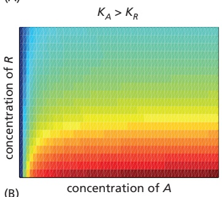

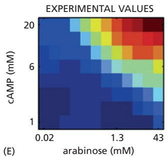

expression requires two transcription regulators, one activated by arabinose and the other activated by the small molecule cAMP (Figure 8–86E).

Figure 8–86 How the quantitative output of a gene depends on both its combinatorial logic and the affinities of transcription regulators. (A) In a combinatorial gene regulatory system like that illustrated in Figure 8–85A, the fraction of promoters bound by activator A and the fraction not bound by repressor R are each determined as shown here. The product of these probabilities provides the probability, P(A, R), that a gene promoter is active. (B–E) In these four panels, red indicates high gene expression and blue indicates low gene expression. (B, C) Depictions of gene expression from the system described in panel A. The two panels demonstrate how the system behaves when the relative affinities of the two transcription regulators change as indicated above each panel. (D) Gene expression in a case where the gene turns on only at high levels of both activating inputs (A1 and A2), as shown in Figure 8–85B. (E) Experimental data showing measured expression of a gene in E. coli that is combinatorially regulated by two inputs: arabinose and cAMP. Note the close resemblance to panel D. (E, adapted from S. Kaplan et al., Mol. Cell 29:786–792, 2008. With permission from Elsevier.)

## An Incoherent Feed-forward Interaction Generates PulsesMBoC7 m8.84/8.86

Imagine that a sudden input signal immediately activates a transcription activator A and that the same input signal induces the much slower synthesis of a transcription repressor protein R that acts on the same gene X. If A and R control gene expression by an AND NOT logic function like that described above, our intuition tells us that this system should be able to generate a pulse of transcription: when A is activated (and R is absent), the transcription of gene X will begin and cause an increase in the concentration of protein X, but then transcription will shut off when the concentration of R increases to a sufficiently high value.

Arrangements of this type are common in the cell. In E. coli, for example, galactose metabolic genes are positively regulated by the catabolite activator protein (CAP), which is activated at high levels of cAMP. The same genes are repressed by the GalS repressor protein, which is encoded by a gene whose transcription is likewise activated by CAP. Thus, an increase in input (cAMP) activates A (CAP), and transcription of the galactose genes begins. But activation of A also causes a subsequent buildup of R (GalS), which causes the same genes to be repressed after a delay. This results in an incoherent feed-forward motif (**Figure 8–87A**).

The response of the incoherent feed-forward motif will vary, depending on the parameters of the system. Suppose, for example, that the transcription activator protein A binds more weakly to the gene regulatory region than does the transcription repressor protein $R \left( K _ { A } < < K _ { R } \right)$ . In this case, there will be a transient burst of protein synthesized by the affected gene (gene X) in response to a sudden activating input (**Figure 8–87B**). In contrast, the output will be more sustained if $K _ { A }$ is much larger than $K _ { R } ,$ because the repression will be too weak to overcome

---

556

Chapter 8: Analyzing Cells, Molecules, and Systems

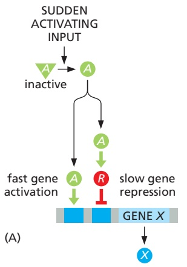

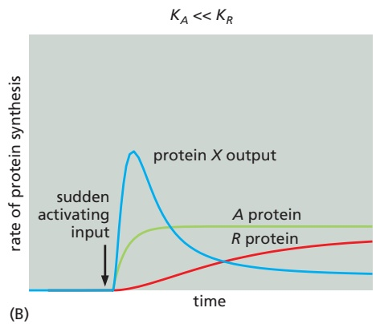

the gene activation (Figure 8–87C). Other properties of this network, such as the dependence of the amplitude of the pulse on the various rate constants in the system, can be explored with the same computational tools. Thus, our intuitive guess about how this system would behave was only partially correct; even the simplest of networks depends on precise interaction strengths, demonstrating yet again why mathematics is needed to complement cartoon drawings.

Figure 8–87 How an incoherent feedforward motif can generate a brief pulse of gene activation in response to a sustained input. (A) Diagram of an incoherent feed-forward motif in which the transcription activator A and the repressor R control the expression of gene X using the AND NOT logic of Figure 8–85A. (B) When $K _ { A } < < K _ { B } ,$ this motif generates a pulse of protein X expression, such that the output goes back down even if the input remains high. (C) When $K _ { A } > > K _ { B } ,$ the same motif responds to a sustained input by generating a sustained output.

## A Coherent Feed-forward Interaction Detects Persistent Inputs

In the bacterium E. coli, the sugar arabinose is only consumed when the pre-ferred sugar, glucose, is scarce. The strategy that cells use to assess the presence of arabinose and absence of glucose involves a feed-forward arrangement that is different from the one just described. In this case, depletion of glucose causes an increase of cAMP, which is sensed by the CAP transcription activator protein, as described previously. In this case, however, CAP also induces the synthesis of a second transcription activator, AraC. Both activator proteins are necessary to activate arabinose metabolic genes (the AND logic function in Figure 8–85B).

This arrangement, known as a coherent feed-forward motif, has the interesting characteristics illustrated in **Figure 8–88**. Imagine that two activators, A1 and A2, are both required to initiate transcription of a gene. The input to the network activates A1 directly, but only activates A2 through this A1 activation. Thus, for a protein to be synthesized from this gene, long-term inputs are required that allow both A1 and A2 to be produced in active form. Brief input pulses are either ignored or produce small outputs. The requirement for a long input is important if assurances about a signal are needed before a costly cellular program is triggered. For example, glucose is the sugar on which E. coli cells grow best. Before cells trigger arabinose metabolism in the example above, it might be beneficial to be sure that glucose has been depleted (a sustained CAP pulse), rather than inducing the arabinose program during a transient glucose fluctuation.

Figure 8–88 How a coherent feedforward motif responds to various inputs. (A) Diagram of a coherent feedforward motif in which the transcription activators A1 and A2 together activate expression of gene X using the AND logic of Figure 8–85B. (B) The response to a brief input can be either weak (as shown) or nonexistent. This allows the motif to ignore random fluctuations in the concentration of signaling molecules. (C) A prolonged input produces a strong response that can turn off rapidly.

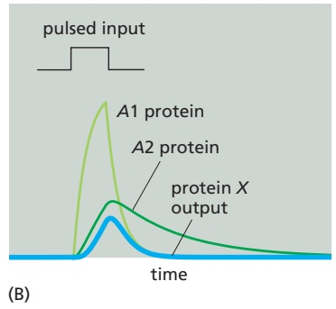

---

MATHEMATICAL ANALYSIS OF CELL FUNCTION

557

## The Same Network Can Behave Differently in Different Cells Because of Stochastic Effects

Up to this point, we have assumed that all cells in a population produce identical behaviors if they contain the same network. It is important, however, to account for the fact that cells often show considerable individuality in their responses. Consider a situation in which a single mother cell divides into two daughter cells of equal volume. If the mother cell has only one molecule of a given protein, then only one daughter will inherit it. The daughters, though genetically identical, are already different. This variability is most pronounced for molecules that are present in small numbers. Nevertheless, even when there are many copies of a particular protein (or RNA), it is very unlikely that both daughter cells will end up with exactly the same number of molecules.

Figure 8–89 Different levels of gene expression in individual cells within a population of E. coli bacteria. For this experiment, two different reporter proteins (one fluorescing green, the other red), controlled by a copy of the same promoter, have been introduced into all of the bacteria. Some cells express only one gene copy, and so appear either red or green, while others express both gene copies, and so appear yellow. This experiment reveals variable levels of fluorescence, indicating variable levels of gene expression within an apparently uniform population of cells. (From M.B. Elowitz et al., Science MBoC7 m8.87/8.89297:1183–1186, 2002. With permission from AAAS.)

This is just one illustration of a universal feature of cells: their behaviors are often **stochastic**, meaning that they display variability in their protein content and therefore exhibit variations in phenotypes. In addition to the asymmetric partitioning of molecules after cell division, variability can originate from many chemical reactions. Imagine, for example, that our mother cell contains a simple gene regulatory circuit with a positive feedback loop like that shown in Figure 8–82B. Even if both daughter cells receive a copy of this circuit, including one copy of the initial transcription activator protein, there will be variability in the time required for promoter binding—and it will be statistically nearly impossible for the genes in the two daughter cells to become activated at precisely the same time. If the system is bistable and poised near a switching point, then variability in the response might flip the switch in only one daughter cell. Two daughter cells that were born identical can thereby acquire, by chance, a dramatic difference in phenotype.

More generally, isogenic populations of cells grown in the same environment display diversity in size, shape, cell-cycle position, and gene expression. These differences arise because biochemical reactions require probabilistic collisions between randomly moving molecules, with each event resulting in changes in the number of molecular species by integer amounts. The amplified effect of fluctuations in a molecular reactant, or the compounded effects of fluctuations across many molecular reactants, often accumulates as an observable phenotype. This can endow a cell with individuality and generate nongenetic cell-to-cell variability in a population.

Nongenetic variability can be studied in the laboratory by single-cell measurements of fluorescent proteins expressed from genes under the control of a specific promoter. Live cells can be mounted on a slide and viewed through a fluorescence microscope, revealing the striking variability in protein expression levels (**Figure 8–89**). Another approach is to use flow cytometry, which works by streaming a dilute suspension of cells past an illuminator and measuring the fluorescence of individual cells as they flow past the detector. Fluorescence values can be used to build histograms that reveal the variability in a process across a population of cells, with a broad histogram indicating higher variability.

## Several Computational Approaches Can Be Used to Mode the Reactions in Cells

We have focused primarily on the use of ordinary differential equations to model the dynamics of simple regulatory circuits. These models are called deterministic, because they do not incorporate stochastic variability and will always produce the same result from a specific set of parameters. As we have seen, such models can provide useful insights, particularly in the detailed mechanistic analysis of small regulatory circuits. However, other types of computational approaches are also needed to comprehend the great complexity of cell behavior. Stochastic models, for example, attempt to account for the very important problem of random variability in molecular networks. These models do not provide deterministic predictions about the behavior of molecules; instead, they incorporate random

---

558

Chapter 8: Analyzing Cells, Molecules, and Systems

variation into molecule numbers and interactions, and the purpose of these models is to obtain a better understanding of the probability that a system will exist in a certain state over time.

Numerous other modeling strategies have been or are being developed. Boolean networks are used for the qualitative analysis of complex gene regulatory networks containing large numbers of interacting components. In these models, each molecule is a node that can exist in either the active or inactive state, thereby affecting the state of the nodes it is linked to. Models of this sort provide insights into the flow of information through a network, and they were useful in helping us understand the complex gene regulatory network that controls the early development of the sea urchin (see Figure 7–45). Boolean networks therefore reduce complex networks to a highly simplified (and potentially inaccurate) form. At the other extreme are agent-based simulations, in which thousands of molecules (or “agents”) in a system are modeled individually, and their probable behaviors and interactions with each other over time are calculated on the basis of predicted physical and chemical behaviors, often while taking stochastic variation into account. Agent-based approaches are computationally demanding but have the potential to generate highly life-like simulations of real biological systems.

## Statistical Methods Are Critical for the Analysis of Biological Data

Dynamics, differential equations, and theoretical modeling are not the be-all and end-all of mathematics. Other branches of the subject are no less important for biologists. Statistics—the mathematics of probabilistic processes and noisy data sets—is an inescapable part of every biologist’s life.

This is true in two main ways. First, imperfect measurement devices and other errors generate experimental noise in our data. Second, all cell-biological processes depend on the stochastic behavior of individual molecules, as we just discussed, and this results in biological noise in our results. How, in the face of all this noise, do we come to conclusions about the truth of hypotheses? The answer is statistical analysis, which shows how to move from one level of description to another: from a set of erratic individual data points to a simpler description of the key features of the data.

Statistics teaches us that the more times we repeat our measurements, the better and more refined the conclusions we can draw from them. Given many repetitions, it becomes possible to describe our data in terms of variables that summarize the features that matter: the mean value of the measured variable, taken over the set of data points; the magnitude of the noise (the standard deviation of the set of data points); the likely error in our estimate of the mean value (the standard error of the mean); and, for specialists, the details of the probability distribution describing the likelihood that an individual measurement will yield a given value. For all these things, statistics provides recipes and quantitative formulas that biologists must understand if they are to make rigorous conclusions on the basis of variable results.

## Summary

Quantitative mathematical analysis can provide a powerful extra dimension in our understanding of cell regulation and function. Cell regulatory systems often depend on macromolecular interactions, and mathematical analysis of the dynamics of these interactions can unveil important insights into the importance of binding affinities and protein stability in the generation of transcriptional or other signals. Regulatory systems often employ network motifs that generate useful behaviors: a rapid negative feedback loop dampens the response to input signals; a delayed negative feedback loop creates a biochemical oscillator; positive feedback yields a system that alternates between two stable states; and feed-forward motifs provide systems that generate transient signal pulses or respond only to sustained inputs. The dynamic behavior of these network motifs can be dissected in detail with deterministic and stochastic mathematical modeling.