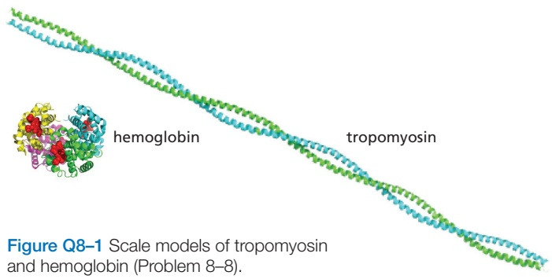
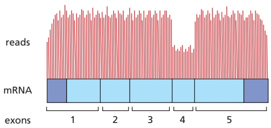
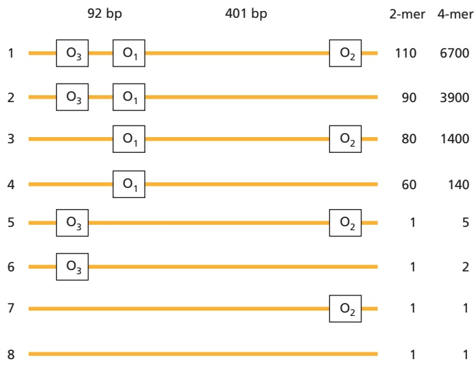

PROBLEMS

559

## PROBLEMS

Which statements are true? Explain why or why not.

8–1 Because a monoclonal antibody recognizes a specific antigenic site (epitope), it binds only to the specific protein against which it was made.

8–2 Given the inexorable march of technology, it seems inevitable that the sensitivity of detection of molecules will ultimately be pushed beyond the yoctomole level (10–24 mole).

8–3 If each cycle of PCR doubles the amount of DNA synthesized in the previous cycle, then 10 cycles will give a 103-fold amplification, 20 cycles will give a 106-fold amplification, and 30 cycles will give a 109-fold amplification.

8–4 To judge the biological importance of an interaction between protein A and protein B, we need to know quantitative details about their concentrations, affinities, and kinetic behaviors.

8–5 The rate of change in the concentration of any molecular species X is given by the balance between its rate of appearance and its rate of disappearance.

8–6 After a sudden increase in its rate of synthesis, a protein with a slow rate of degradation will reach a new steady-state level more quickly than a protein with a rapid rate of degradation.

## Discuss the following problems.

8–7 A common step in the isolation of cells from a sample of animal tissue is to treat the tissue with trypsin, collagenase, and EDTA. Why is such a treatment necessary, and what does each component accomplish? And why does this treatment not kill the cells?

8–8 Tropomyosin, at 93 kilodaltons, sediments at 2.6S, whereas the 65-kilodalton protein, hemoglobin, sediments at 4.3S. (The sedimentation coefficient S is a linear measure of the rate of sedimentation.) These two proteins are drawn to scale in **Figure Q8–1**. Why does the bigger protein sediment more slowly than the smaller one? Can you think of an analogy from everyday experience that might help you with this problem?

8–9 Hybridoma technology allows one to generate monoclonal antibodies to virtually any protein. Why is it, then, that genetically tagging proteins with epitopes is such a commonly used technique, especially as an epitope tag has the potential to interfere with the function of the protein?

8–10 How many copies of a protein need to be present in a cell in order for it to be visible as a band on an SDS gel? Assume that you can load 100 μg of cell extract onto a gel and that you can detect 10 ng in a single band by silver staining the gel. The concentration of protein in cells is about 200 mg/mL, and a typical mammalian cell has a volume of about 1000 μm3 and a typical bacterium a volume of about 1 μm3. Given these parameters, calculate the number of copies of a 120-kilodalton protein that would need to be present in a mammalian cell and in a bacterium in order to give a detectable band on a gel.

8–11 You have isolated the proteins from two adjacent spots after two-dimensional polyacrylamide-gel electrophoresis and digested them with trypsin. When the masses of the peptides were measured by MALDI-TOF mass spectrometry, the peptides from the two proteins were found to be identical except for one (**Figure Q8–2**). For this peptide, the mass-to-charge (m/z) values differed by 80, a value that does not correspond to a difference in amino acid sequence. (For example, glutamic acid instead of valine at one position would give an m/z difference of around 30.) Can you suggest a possible difference between the two peptides that might account for the observed m/z difference?

Figure Q8–2 Masses of peptides measured by MALDI-TOF mass spectrometry (Problem 8–11). Only the numbered peaks differ between the two protein samples.

---

560

Chapter 8: Analyzing Cells, Molecules, and Systems

8–12 You want to amplify the DNA between the two stretches of sequence shown in **Figure Q8–3**. Of the listed primers, choose the pair that will allow you to amplify the DNA by PCR.

Figure Q8–3 DNA to be amplified and potential PCR primers (Problem 8–12).

8–13 In the very first round of PCR using genomic DNA, the DNA primers prime synthesis that terminates only when the cycle ends (or when a random end of DNAMB C7 P bl 8.03/ 8.03 is encountered). Yet, by the end of 20–30 cycles—a typical amplification—the only visible product is defined pre-cisely by the ends of the DNA primers. In what cycle is a double-strand fragment of the correct size first generated?

8–14 Explain the difference between a gain-of-function mutation and a dominant-negative mutation. Why are both these types of mutation usually dominant?

8–15 Discuss the following statement: “We would have no idea today of the importance of insulin as a regulatory hormone if its absence were not associated with the human disease diabetes. It is the dramatic consequences of its absence that focused early efforts on the identification of insulin and the study of its normal role in physiology.”

8–16 You have received the results from an RNA-seq analysis of mRNAs from liver. You had anticipated counting the number of reads of each mRNA to determine the relative abundance of different mRNAs. But you are puzzled because many of the mRNAs have given you results like those shown in **Figure Q8–4**. How is it that different parts of an mRNA can be represented at different levels?

Figure Q8–4 RNA-seq reads for a liver mRNA (Problem 8–16). The exon structure of the mRNA is indicated, with protein-coding segments indicated in light blue and untranslated regions in dark blue. The numbers of sequencing reads are indicated by the heights of the vertical lines above the mRNA.

8–17 Examine the network motifs in **Figure Q8–5**. Decide which ones are negative feedback loops and which are positive. Explain your reasoning.

Figure Q8–5 Network motifs composed of transcription activators and repressors (Problem 8–17).

8–18 Imagine that a random perturbation positions a bistable system precisely at the boundary between two stable states (at the orange dot in **Figure Q8–6**). How would the system respond?

Figure Q8–6 Perturbations of a bistable system (Problem 8–18). As shown by the green lines, after perturbation 1 the system returns to its original stable state (green dot at left), and after perturbation 2, the system moves to the other stable state (green dot at right). Perturbation 3 moves the system to the precise boundary between the two stable states (orange dot).

---

REFERENCES

561

8–19 Detailed analysis of the regulatory region of the Lac operon has revealed surprising complexity. Instead of a single binding site for the Lac repressor, as might be expected, there are three sites termed operators $\left( \mathrm { O _ { 1 } ,   \mathrm O _ { 2 } } , \right.$ and $\mathrm { O _ { 3 } } \big )$ arrayed along the DNA as shown in **Figure Q8–7**.

Figure Q8–7 Repression of β-galactosidase by promoter regions that contain different combinations of Lac repressor binding sites (Problem 8–19). The base-pair (bp) separation of the three operator sites is shown. Numbers at right refer to the level of repression, with higher numbers indicating more effective repression by dimeric (2-mer) or tetrameric (4-mer) repressors. (From S. Oehler et al., EMBO J. 9:973–979, 1990. With permission from John Wiley & Sons.)

Greenfield E (2014) Antibodies: A Laboratory Manual, 2nd ed. Cold Spring Harbor, NY: Cold Spring Harbor Laboratory Press.

Sherr CJ & DePinho RA (2000) Cellular senescence: mitotic clock or culture shock? Cell 102, 407–410.

## Isolating Cells and Growing Them in Culture

## REFERENCES

Spector DL, Goldman RD & Leinwand LA (eds.) (1998) Cells: A Laboratory Manual. Cold Spring Harbor, NY: Cold Spring Harbor Laboratory Press.

Todaro GJ & Green H (1963) Quantitative studies of the growth of mouse embryo cells in culture and their development into established lines. J. Cell Biol. 17, 299–313.

Burgess R & Deutcher MP (eds.) (2009) Guide to Protein Purification, 2nd ed. Methods in Enzymology, Vol. 463. Cambridge, MA: Academic Press.

De Duve C & Beaufay H (1981) A short history of tissue fractionation. J. Cell Biol. 91, 293s–299s.

B. Do combinations of operator sites (Figure Q8–7, constructs 1, 2, 3, and 5) substantially increase repression by the dimeric repressor? Do combinations of operator sites substantially increase repression by the tetrameric repressor? If the two repressors behave differently, offer an explanation for the difference.

Scopes RK (1994) Protein Purification: Principles and Practice, 3rd ed. New York: Springer-Verlag.

C. The wild-type repressor binds $\mathrm { O } _ { 3 }$ very weakly when it is by itself on a segment of DNA. However, if $\mathrm { O _ { 1 } }$ is included on the same segment of DNA, the repressor binds $\mathrm { O } _ { 3 }$ quite well. How can that be?

## Purifying Proteins

Simpson RJ, Adams PD & Golemis EA (2008) Basic Methods in Protein Purification and Analysis: A Laboratory Manual. Cold Spring Harbor, NY: Cold Spring Harbor Laboratory Press.

A. Which single operator site is the most important for repression? How can you tell?

To probe the functions of these three sites, you make a series of constructs in which various combinations of operator sites are present. You examine their ability to repress expression of β-galactosidase, using either tetrameric (wild type) or dimeric (mutant) forms of the Lac repressor. The dimeric form of the repressor can bind to a single operator (with the same affinity as the tetramer) with each monomer binding to half the site. The tetramer, the form normally expressed in cells, can bind to two sites simultaneously. When you measure repression of β-galactosidase expression, you find the results shown in Figure Q8–7, with higher numbers indicating more effective repression.

Wood DW (2014) New trends and affinity tag designs for recombinant protein purification. Curr. Opin. Struct. Biol. 26, 54–61.

Aebersold R & Mann M (2016) Mass-spectrometric exploration of proteome structure and function. Nature 537, 347–355.

## Analyzing Proteins

Baxevanis AD, Bader GD & Wishart DS (eds.) (2020) Bioinformatics: A Practical Guide to the Analysis of Genes and Proteins, 4th ed. Hoboken, NJ: Wiley.

Goodrich JA & Kugel JF (2007) Binding and Kinetics for Molecular Biologists. Cold Spring Harbor, NY: Cold Spring Harbor Laboratory Press.

Mehmood S, Allison TM & Robinson CV (2015) Mass spectrometry of protein complexes: from origins to applications. Annu. Rev. Phys. Chem. 66, 453–474.

O’Connell MR, Gamsjaeger R & Mackay JP (2009) The structural analysis of protein-protein interactions by NMR spectroscopy. Proteomics 9, 5224–5232.

Pollard TD (2010) A guide to simple and informative binding assays. Mol. Biol. Cell 21, 4061–4067.

Wuthrich K (2003) NMR studies of structure and function of biological macromolecules (Nobel Lecture). J. Biomol. NMR 27, 13–39.

## Analyzing and Manipulating DNA

Gibson DG, Young L, Chuang RY . . . Smith HO (2009) Enzymatic assembly of DNA molecules up to several hundred kilobases. Nat. Methods 6, 343–345.

Green MR & Sambrook J (2012) Molecular Cloning: A Laboratory Manual, 4th ed. Cold Spring Harbor, NY: Cold Spring Harbor Laboratory Press.

Kosuri S & Church GM (2014) Large-scale de novo DNA synthesis: technologies and applications. Nat. Methods 11, 499–507.

Metzker ML (2010) Sequencing technologies—the next generation. Nat. Rev. Genet. 11, 31–46.

---

562

Chapter 8: Analyzing Cells, Molecules, and Systems

Mullis K, Faloona F, Scharf S . . . Erlich H (1986) Specific enzymatic amplification of DNA in vitro: the polymerase chain reaction. Cold Spring Harb. Symp. Quant. Biol. 51 Pt 1, 263–273.

Mullis KB (1990) The unusual origin of the polymerase chain reaction. Sci. Am. 262, 56–61, 64–55.

Nathans D & Smith HO (1975) Restriction endonucleases in the analysis and restructuring of DNA molecules. Annu. Rev. Biochem. 44, 273–293.

Sanger F, Nicklen S & Coulson AR (1977) DNA sequencing with chainterminating inhibitors. Proc. Natl. Acad. Sci. USA 74, 5463–5467.

Shendure J & Lieberman Aiden E (2012) The expanding scope of DNA sequencing. Nat. Biotechnol. 30, 1084–1094.

Watson JD, Myers RM & Caudy AA (2007) Recombinant DNA: Genes and Genomes—A Short Course, 3rd ed. Cold Spring Harbor, NY: Cold Spring Harbor Laboratory Press.

## Studying Gene Function and Expression

Agrotis A & Ketteler R (2015) A new age in functional genomics using CRISPR/Cas9 in arrayed library screening. Front. Genet. 6, 300.

D’Haeseleer P (2005) How does gene expression clustering work? Nat. Biotechnol. 23, 1499–1501.

Doudna JA (2020) The promise and challenge of therapeutic genome editing. Nature 578, 229–236.

Fellmann C & Lowe SW (2014) Stable RNA interference rules for silencing. Nat. Cell Biol. 16, 10–18.

Ingolia NT, Hussmann JA & Weissman JS (2019) Ribosome profiling: global views of translation. Cold Spring Harb. Perspect. Biol. 11.

Luecken MD & Theis FJ (2019) Current best practices in single-cell RNA-seq analysis: a tutorial. Mol. Syst. Biol. 15, e8746.

Mali P, Esvelt KM & Church GM (2013) Cas9 as a versatile tool for engineering biology. Nat. Methods 10, 957–963.

Rio DC, Ares M, Hannon GJ & Wilson TW (2011) RNA: A Laboratory Manual. Cold Spring Harbor, NY: Cold Spring Harbor Laboratory Press.

Stark R, Grzelak M & Hadfield J (2019) RNA sequencing: the teenage years. Nat. Rev. Genet. 20, 631–656.

Strachan T & Read AP (2018) Human Molecular Genetics, 5th ed. Boca Raton, FL: CRC Press.

Wilson RC & Doudna JA (2013) Molecular mechanisms of RNA interference. Annu. Rev. Biophys. 42, 217–239.

## Mathematical Analysis of Cell Function

Alon U (2007) Network motifs: theory and experimental approaches. Nat. Rev. Genet. 8, 450–461.

Alon U (2019) An Introduction to Systems Biology: Design Principles of Biological Circuits, 2nd ed. Boca Raton, FL: Chapman & Hall/CRC.

Ferrell JE, Jr. & Ha SH (2014) Ultrasensitivity part III: cascades, bistable switches, and oscillators. Trends Biochem. Sci. 39, 612–618.

Gunawardena J (2014) Models in biology: “accurate descriptions of our pathetic thinking.” BMC Biol. 12, 29.

Ingalis BP (2013) Mathematical Modeling in Systems Biology: An Introduction. Cambridge, MA: MIT Press.

Lewis J (2008) From signals to patterns: space, time, and mathematics in developmental biology. Science 322, 399–403.

Novak B & Tyson JJ (2008) Design principles of biochemical oscillators. Nat. Rev. Mol. Cell Biol. 9, 981–991.

Xia PF, Ling H, Foo JL & Chang MW (2019) Synthetic genetic circuits for programmable biological functionalities. Biotechnol. Adv. 37, 107393.