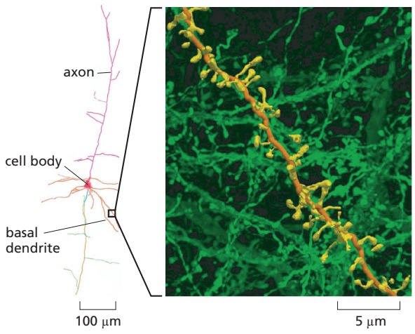

Figure 9–37 Light-sheet microscopy in the brain. A 1-mm-thick portion of a mouse brain has been prepared for expansion microscopy and then imaged with a light-sheet microscope. Reconstructions of thousands of optical sections allow the tracing of individual neurons and all their connections, such as this pyramidal neuron (left) from the visual cortex. On the right is shown the complex cellular context (green) for a short region of one of the neuron’s basal dendrites (orange dendrite with its spines shown in yellow). (From R. Gao et al., Science 363:245–261, 2019, doi 10.1126/science.aau8302. With permission from AAAS.)

(Figure 9–37 and Movie 9.1). Light-sheet microscopy can also be combined with other techniques. Coupled with STED imaging, for example, superresolution is attainable, and higher-resolution images can also be obtained by preparing the sample for expansion microscopy.

## Single Molecules Can Be Visualized by Total Internal Reflection Fluorescence Microscopy

As we have seen, the strong background fluorescence due to light emitted or scattered by out-of-focus molecules tends to blot out the fluorescence from any one particular molecule of interest. This problem can be solved by the use of a special optical technique called total internal reflection fluorescence (TIRF) microscopy. In a TIRF microscope, laser light shines onto the cover-slip surface at the precise critical angle at which total internal reflection occurs (**Figure 9–38A**). Because of total internal reflection, the light does not enter the sample, and the majority of fluorescent molecules are not, therefore, illuminated. However, electromagnetic energy does extend, as an evanescent field, for a very short distance beyond the surface of the cover slip and into the specimen, allowing just those molecules in the layer closest to the surface to become excited. When these molecules fluoresce, their emitted light is no longer competing with out-of-focus light from the overlying molecules and can now be detected. TIRF has allowed several dramatic experiments, for instance imaging of single motor proteins moving along microtubules or actin filaments. At present, the technique is restricted to a thin layer about 200 nm below the cell surface. Although not strictly TIRF, decreasing the angle of the incident light so that it is almost parallel to the cover slip can increase the depth into the cell that can be examined, albeit not so uniformly, a feature useful in cells with an outer wall, such as those of plants and fungi (**Figure 9–38B and C**).

## Figure 9–38 TIRF microscopy allows the detection of single fluorescent molecules near the cell surface.

(A) TIRF microscopy uses excitatory laser light to illuminate the cover-slip surface at the critical angle at which all the light is reflected by the glass–water interface. Some electromagnetic energy extends a short distance across the interface as an evanescent wave that excites just those molecules that are attached to the cover slip or are very close to its surface. (B) TIRF microscopy is used to follow the formation of an individual clathrin-coated pit and its subsequent endocytosis. In this image of the surface of the plasma membrane of an Arabidopsis root cell, a clathrin adaptor protein is tagged with GFP. Individual pits can be followed over time. (C) The pit ringed in B is shown at 1-second intervals, demonstrating that its appearance and its removal at the plasma membrane by endocytosis takes place in about 10 seconds. (B and C, from A. Johnson and G. Vert, Front. Plant Sci. 8:612, 2017, doi 10.3389 /fpls.2017.00612.)

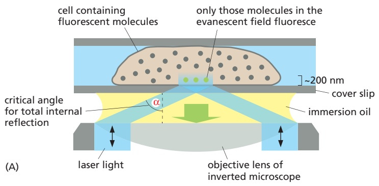

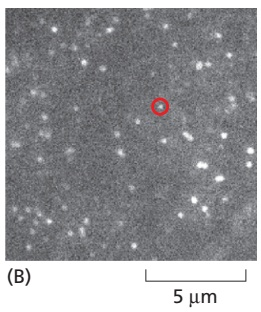

## Summary

Many light-microscope techniques are available for observing cells. Cells that have been fixed and stained can be studied in a conventional light microscope, whereas antibodies coupled to fluorescent dyes can be used to locate specific molecules in cells in a fluorescence microscope. Living cells can be seen with phasecontrast, differential-interference-contrast, dark-field, or bright-field microscopes. All forms of light microscopy are facilitated by digital image-processing techniques, which enhance sensitivity and refine the image. Confocal microscopy and image deconvolution both provide thin optical sections and can be used to reconstruct three-dimensional images.

Techniques are now available for detecting, measuring, and following almost any desired molecule in a living cell. Fluorescent labels can be introduced to measure the concentrations of specific ions or signaling molecules in individual cells or in different parts of a cell. Virtually any protein of interest can be genetically engineered as a fluorescent fusion protein and then imaged in living cells by fluorescence microscopy. The dynamic behavior and interactions of many molecules can be followed in living cells by variations on the use of fluorescent protein tags, in some cases at the level of single molecules. Various superresolution techniques can circumvent the diffraction limit in different ways and resolve molecules separated by distances as small as 20 nm.

## LOOKING AT CELLS AND MOLECULES IN THE ELECTRON MICROSCOPE

Light microscopy is limited in the fineness of detail that it can reveal. Microscopes using other types of radiation—in particular, electron microscopes—can resolve much smaller structures than is possible with visible light. This higher resolution comes at a cost: specimen preparation for electron microscopy is complex and it is harder to be sure that what we see in the image corresponds precisely to the original living structure. It is possible, however, to use very rapid freezing to preserve structures faithfully for electron microscopy. Digital image analysis can be used to reconstruct three-dimensional objects by combining information either from many individual particles or from multiple tilted views of a single object. Together, these approaches extend the resolution and scope of electron microscopy to the point at which we can faithfully image the detailed structures of individual macromolecules and the complexes they form, even inside cells.

## The Electron Microscope Resolves the Fine Structure of the Cell

The formal relationship between the diffraction limit to resolution and the wavelength of the illuminating radiation (see Figure 9–5) holds true for any form of radiation, whether it is a beam of light or a beam of electrons. With electrons, however, the limit of resolution is very small. The wavelength of an electron decreases as its velocity increases. In an **electron microscope** with an accelerating voltage of 100,000 V, the wavelength of an electron is 0.004 nm. In theory, the resolution of such a microscope should be about 0.002 nm, which is 100,000 times that of the conventional light microscope. Because the aberrations of an electron lens are considerably harder to correct than those of a glass lens, however, the practical resolving power of modern electron microscopes is, even with careful image processing to correct for lens aberrations, about 0.05 nm (0.5 Å) (**Figure 9–39**). This is because only the very center of the electron lenses can be used, and the effective numerical aperture is tiny. Furthermore, problems of specimen preparation, contrast, and radiation damage have generally limited the normal effective resolution for biological objects to 1 nm (10 Å). This is nonetheless about 200 times better than the resolution of the light microscope. Moreover, the performance of electron microscopes is improved by electron illumination sources called field-emission guns. These very bright and coherent sources substantially improve the resolution achieved.

Figure 9–39 The resolution of the electron microscope. This transmission electron micrograph of a monolayer of graphene resolves the individual carbon atoms as bright spots in a hexagonal lattice. Graphene is a single isolated atomic plane of graphite and forms the basis of carbon nanotubes. The distance MBoC7 m9.40/9.39between adjacent bonded carbon atoms is 0.14 nm (1.4 Å). Such resolution can only be obtained in a specially built transmission electron microscope in which all lens aberrations are carefully corrected, and with optimal specimens; it is rarely achieved with most conventional biological specimens. (From A. Dato et al., Chem. Commun. 40:6095–6097, 2009. With permission from the Royal Society of Chemistry.)

Figure 9–40 The principal features of an inverted light microscope and a transmission electron microscope. These drawings emphasize the similarities of overall design. Whereas the lenses in the light microscope are made of glass, those in the electron microscope are magnetic coils. The electron microscope requires that the specimen be placed in a vacuum. The inset shows a routine transmission electron microscope in use. (Photograph courtesy of Andrew Davis.)

In overall design, the transmission electron microscope (TEM) is similar to an inverted light microscope, albeit much larger (Figure 9–40). The source of illumination is a filament or cathode that emits electrons at the top of a cylindricalMBoC7 m9.41/9.40 column about 2 m high. Because electrons are scattered by collisions with air molecules, air must first be pumped out of the column to create a vacuum. The electrons are then accelerated from the filament by a nearby anode and allowed to pass through a tiny hole to form an electron beam that travels down the column. Magnetic coils placed at intervals along the column focus the electron beam, just as glass lenses focus the light in a light microscope. The specimen is put into the vacuum, through an airlock, into the path of the electron beam. As in light microscopy, the specimen can be stained—in this case, with electron-dense material. Some of the electrons passing through the specimen are scattered by structures stained with the electron-dense material; the remainder are focused to form an image. The image can be observed on a monitor or is typically recorded with a sensitive CMOS electron detector. Because the scattered electrons are lost from the beam, the dense regions of the specimen show up in the image as areas of reduced electron flux, which look dark.

## Biological Specimens Require Special Preparation for Electron Microscopy

In the early days of its application to biological materials, the electron microscope revealed many previously unimagined structures in cells. But before these discoveries could be made, electron microscopists had to develop new procedures for embedding, cutting, and staining tissues.

Because the specimen is exposed to a very high vacuum in the electron microscope, living tissue is usually killed and preserved by chemical fixation. As electrons have very limited penetrating power, the fixed tissues normally have to be cut into extremely thin sections (25–100 nm thick, about 1/200 the thickness of a single cell) before they are viewed. This is achieved by dehydrating the specimen, permeating it with a monomeric resin that polymerizes to form a solid block of plastic, then cutting the block with a fine glass or diamond knife on a special microtome. The resulting ultrathin sections, free of water and other volatile solvents, are supported on a small metal grid for viewing in the microscope (**Figure 9–41**).

Figure 9–41 Specimen support. The metal grid that supports the thin sections of a specimen in a transmission electron microscope.

Figure 9–42 Thin section of a cell. This thin section is of a yeast cell that has been very rapidly frozen and the vitreous ice replaced by organic solvents and then by plastic resin (freeze substitution). The nucleus, mitochondria, cell wall, Golgi stacks, and ribosomes can all be readily seen in a state that is presumed to be as lifelike as possible. (Courtesy of Andrew Staehelin.)

The steps required to prepare biological material for electron microscopy are challenging. How can we be sure that the image of the fixed, dehydrated, resinembedded specimen bears any relation to the delicate, aqueous biological system present in the living cell? The best current approaches to this problem depend on rapid freezing. If an aqueous system is cooled fast enough and to a low enough temperature, the water and other components in it do not have time to rearrange themselves or crystallize into ice. Instead, the water is supercooled into a rigid butMBoC7 m9.44/9.42 noncrystalline state—a “glass”—called vitreous ice. This rapid freezing is usually performed by plunging the sample into a coolant such as liquid ethane or by cooling it at very high pressure.

Some rapidly frozen specimens can be examined directly in the electron microscope using a special cooled specimen holder. In other cases, the frozen block can be fractured to reveal interior cell surfaces or the surrounding ice can be sublimed away to expose external surfaces. However, we often want to examine thin sections, and the frozen tissue can be sectioned directly in a cooled microtome. A compromise is to rapidly freeze the tissue, replace the water with organic solvents, embed the tissue in plastic resin, and finally cut sections. This approach, called freeze substitution, stabilizes and preserves the tissue in a condition very close to its original living state (**Figure 9–42**).

Molecules in all kinds of thin sections can be labeled to identify and localize them. We have seen earlier how antibodies can be used in conjunction with fluorescence microscopy to localize specific macromolecules. An analogous method—immunogold electron microscopy—can be used in the electron microscope. The usual procedure is to incubate a thin section first with a specific primary antibody, and then with a secondary antibody to which a colloidal gold particle has been attached. The gold particle is electron-dense and can be seen as a black dot in the electron microscope (**Figure 9–43**). Different antibodies can be conjugated to different-sized gold particles so multiple proteins can be localized in a single sample.

## Heavy Metals Can Provide Additional Contrast

Although phase contrast can make unstained specimens more visible, image clarity in an electron micrograph usually depends on having a range of electron densities to provide amplitude contrast within the specimen. Electron density in

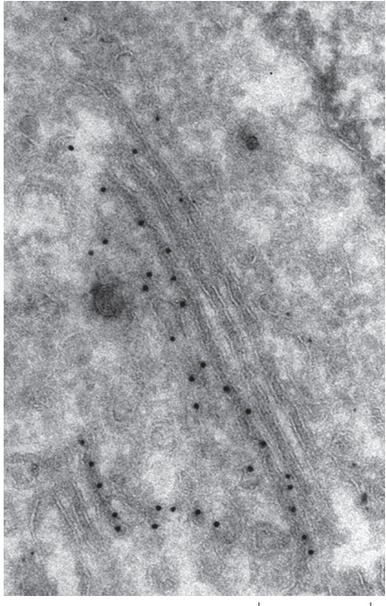

Figure 9–43 Localizing proteins in electron microscopy. Immunogold electron microscopy is used here to find the specific location of a protein that is targeted to the Golgi apparatus. The protein has been tagged with a genetically encoded fluorescent protein and is localized to the trans-Golgi network. The protein is seen in this thin section using an antibody to the fluorescent protein coupled to 10-nm colloidal gold particles, seen in the electron microscope as black dots. The cell has been frozen under high pressure and freeze substituted before embedding and sectioning. (Courtesy of Charlotta Funaya and M. Teresa Alonso.)

100 nm

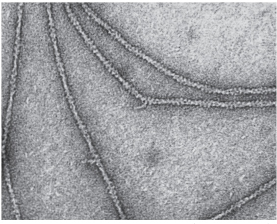

(A)

(B)

100 nm

Figure 9–44 Heavy metals provide contrast in the electron microscope. (A) This transmission electron micrograph shows RecA protein together with E. coli DNA adsorbed to flakes of mica, frozen, carefully dried, and then shadowed with evaporated platinum atoms. The RecA protein clearly forms tight, right-handed helices around the bacterial DNA molecules, some of which can be seen free at the top of the image (see also Figure 5–48). (B) In this transmission electron micrograph of actin filaments, negatively stained with uranyl acetate, each filament is about 8 nm in diameter and is seen, on close inspection, to be composed of a helical chain of globular actin molecules (see also Figure 16–8). (A, from J. Heuser, J. Electron Microsc. Tech. 13:244–263, 1989; B, courtesy of Roger Craig.)

turn depends on the atomic number of the atoms that are present: the higher the atomic number, the more electrons are scattered and the darker that part of the image. Biological tissues are composed mainly of atoms of very low atomic number (primarily carbon, oxygen, nitrogen, and hydrogen). To make them more readily visible, tissues are often impregnated (before or after sectioning) with the salts of heavy metals such as uranium, lead, and osmium. The degree of impregnation, or “staining,” with these salts will vary for different cell constituents. Lipids, for example, tend to stain darkly after osmium fixation, revealing the location of cell membranes (see, for example, Figure 12–2 or Figure 12–15).

Alternatively, if isolated molecules are “shadowed” by platinum or other heavy metals evaporated from a heated filament, macromolecules such as DNA or large proteins can be visualized with high contrast in the electron microscope (**Figure 9–44A**). **Negative staining** is a similar approach that also allows fine detail to be seen in isolated molecules or macromolecular machines. In this technique, the molecules are supported on the thin film of carbon on a grid and mixed with a solution of a heavy-metal salt such as uranyl formate or acetate. After the sample has dried, a very thin film of metal salt covers the carbon film everywhere except where it has been excluded by the presence of an adsorbed macromolecule. Because the macromolecule allows electrons to pass through it much more readily than does the surrounding heavy-metal stain, a reverse or negative image of the molecule is created. Negative staining is especially useful for quickly and cheaply viewing large macromolecular aggregates such as viruses or ribosomes and for seeing the subunit structure of protein filaments (**Figure 9–44B**). Shadowing and negative staining can provide high-contrast surface views of small macromolecular assemblies, but the size of the smallest metal particles in the shadow or stain limits the resolution of both techniques to about 2 nm.

## Images of Surfaces Can Be Obtained by Scanning Electron Microscopy

A **scanning electron microscope (SEM)** directly produces an image of the three-dimensional structure of the surface of a specimen. The SEM is usually smaller, simpler, and cheaper than a transmission electron microscope. Whereas the TEM uses the electrons that have passed through the specimen to form an image, the SEM uses electrons that are scattered or emitted from the specimen’s surface. The specimen to be examined is usually either fixed, dried, and coated with a thin layer of heavy metal or alternatively rapidly frozen and then transferred to a cooled specimen stage for coating and direct examination in the microscope (**Figure 9–45**). The specimen is scanned with a very narrow beam of electrons. The quantity of electrons scattered or emitted as this primary beam bombards each successive point of the metallic surface is measured and builds up an image on a computer screen. Often an entire plant part or small animal can be put into the microscope with very little preparation (**Figure 9–46**).

(B)

1 µm

Figure 9–45 The scanning electron microscope. In an SEM, the specimen is scanned by a beam of electrons brought to a focus on the specimen by the electromagnetic coils that act as lenses. The detector measures the quantity of electrons scattered or emitted as the beam bombards each successive point on the surface of the specimen and records the intensity of successive points in an image built up on a screen. The SEM creates striking images of three-dimensional objects with great depth of focus and a resolution between 0.5 nm and 10 nm depending on the kind of instrument. (Photograph courtesy of Andy Davis.)

The SEM technique provides great depth of field, thus objects both near and far in the field of view are imaged sharply. Moreover, because the amount of electron scattering depends on the angle of the surface relative to the beam, the image has highlights and shadows that give it a three-dimensional appearance

1 mm

50 µm

(C)

Figure 9–46 The scanning electron microscope produces surface images with great depth of field. SEM micrographs taken at a wide range of magnifications. (A) A developing wheat flower, or spike. This delicate flower spike was rapidly frozen, coated with a thin metal film, and examined in the frozen state with an SEM. This low-magnification micrograph demonstrates the large depth of focus of an SEM, even with a large specimen like this. (B) These pollen grains from a hellebore flower reveal their sculpted cell walls in the SEM. The shapes and patterns are specific for each species of pollen grain. (C) Chains of bacteria living in the blue veins of a Stilton cheese. (A, B, and C, courtesy of Kim Findlay.)

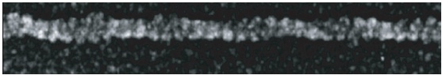

(A)

50 nm

(B)

100 nm

Figure 9–47 Higher-resolution SEM. Macromolecular assemblies, shadowed with a very thin coating of tungsten and imaged in an SEM equipped with a field-emission electron gun. (A) An actin filament showing the helical arrangement of actin monomers. (B) Clathrin-coated vesicles. [A and B, from R. Wepf et al., in Biological Field Emission Scanning Electron Microscopy (R. Fleck and B. Humbel, eds.), pp. 269–298. Hoboken, NJ: Wiley, 2019.]

(see Figure 9–46). Only surface features can be examined, however, and in most forms of SEM, the resolution attainable is not very high (about 10 nm). As a result, the technique is usually used to study whole cells and tissues rather than subcellular organelles (see Movie 21.3). However, very-high-resolution SEMs have been developed with a bright, coherent, field-emission gun as the electron source. As resolution in the SEM depends not on the wavelength of the electron beam but on the size of the electron spot that is scanned across the specimen, this type of SEM can produce images that rival the resolution possible with a negatively stained specimen in a TEM (**Figure 9–47**).

## Electron Microscope Tomography Allows the Molecular Architecture of Cells to Be Seen in Three Dimensions

The SEM can only provide a surface view of an object, which tells us little about the important three-dimensional relationships between macromolecules and organelles within a living cell. Moreover, thin sections viewed in a TEM also often fail to convey the three-dimensional arrangement of cellular components, and the images can be misleading. It is possible to reconstruct the third dimension from serial sections, but this is a lengthy and tedious process. But even thin sections have a significant depth compared with the resolution of the electron microscope, so the TEM image can also be misleading in an opposite way, through the superimposition of objects that lie at different depths.

Because of the large depth of field of electron microscopes, all the parts of the three-dimensional specimen are in focus, and the resulting image is a projection (a superimposition of layers) of the structure along the viewing direction. The lost information in the third dimension can be recovered if we have views of the same specimen but from many different directions. The computational methods for this technique are widely used in medical CT scans. In a CT scan, the imaging equipment is moved around the patient to generate the different views. In **electron microscope (EM) tomography**, the specimen holder is tilted in the microscope, which achieves the same result. The specimen is usually tilted to a maximum of 60° in every direction, and in this way we can arrive at a three-dimensional reconstruction, in a chosen standard orientation, by combining different views of a single object. Each individual view will be very noisy, but by combining them in three dimensions and taking an average, the noise can be significantly reduced. Thick plastic sections of embedded material have been used to create three-dimensional reconstructions, or tomograms (**Movie 9.2**), of cells, but increasingly microscopists are applying EM tomography to unstained, frozen, hydrated sections, and even to rapidly frozen whole cells or organelles. Individual macromolecular assemblies that

carbon film on EM grid

## SINGLE-PARTICLE RECONSTRUCTION BY CRYOEM

X-ray crystallography is one way to determine a protein structure. However, large macromolecular machines are often hard to crystallize, as are many integral membrane proteins, and for dynamic proteins and assemblies it is hard to access different conformations through crystallography alone. To get around these problems, investigators are increasingly turning to cryo-electron microscopy (cryoEM) to solve macromolecular structures.

In this technique, a droplet of the pure protein in water is placed on a small EM grid that is plunged into a vat of liquid ethane at −180ºC. This freezes the proteins in a thin film of ice and the rapid freezing ensures that the surrounding water molecules have no time to form ice crystals, which would damage the protein’s shape.

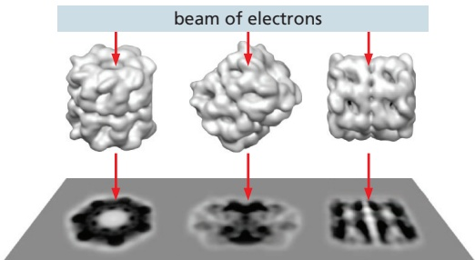

electron detector captures projected image of molecules

The sample is examined, still frozen, by high-voltage transmission electron microscopy. To avoid damage, it is important that only a few electrons pass through each part of the specimen. Sensitive detectors are therefore deployed to capture every electron that passes through the specimen. Much EM specimen preparation and data collection is now fully automated and many thousands of micrographs are typically captured, each of which will contain hundreds or thousands of individual molecules all arranged in random orientations within the ice.

Algorithms then sort the molecules into sets where each set contains molecules that are all oriented in the same direction. The thousands of images in each set are all then superimposed and averaged to improve the signal-to-noise ratio.

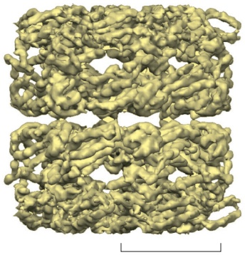

This crisper two-dimensional image set, which represents different views of the particle, are then combined and converted via a series of complex iterative steps into a high-resolution three-dimensional structure.

Model of GroEL (Courtesy of Gabriel Lander.)

## CRYOEM STRUCTURE OF THE RIBOSOME

Courtesy of Joachim Frank.

60S ribosomal subunits randomly oriented in a thin film of ice

100 nm

Although by no means routine, big improvements in image-processing algorithms, modeling tools and sheer computing power all mean that structures of macromolecular complexes are now becoming attainable with resolutions in the 0.2- to 0.3-nm range.

path of an rRNA loop fitted into the electron-density map

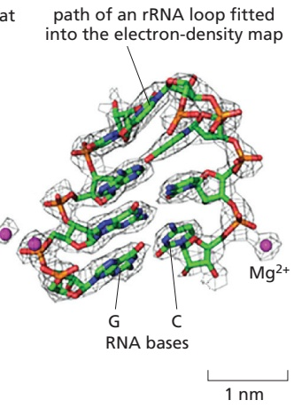

This resolving power now approaches that of x-ray crystallography, and the two techniques thrive together, each bootstrapping the other to obtain ever more useful and dynamic structural information. A good example is the structure of the ribosome shown here at a resolution of 0.25 nm.

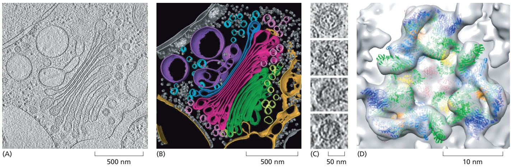

appear as multiple copies in the tomogram can be identified, and with a computational process called subtomogram averaging to reduce noise and gain structural information, molecular structures inside cells can now be obtained at a resolution of better than 2 nm (Figure 9–48). Electron microscopy now provides a robust bridge between the scale of the single molecule and that of its cellular environment.

Figure 9–48 EM tomography. The COP1 coat mediates vesicle traffic within the Golgi apparatus and retrograde traffic to the endoplasmic reticulum (ER) (see Figures 13–4 and 13–5). EM tomography has helped visualize the details of COP1 coats in situ on buds and vesicles in rapidly frozen Chlamydomonas cells. (A) One slice through a three-dimensional tomogram of a complete Golgi apparatus. (The tomogram can be seen in Movie 9.2.) (B) Using the information from several such tomograms, a portion of the Golgi is shown here, color coded to show ER dark yellow, the cis vesicles yellow, the four cis cisternae green, the four medial cisternae red, the trans cisterna blue, medial vesicles pink, trans vesicles light blue, and the trans Golgi network purple. Ribosomes can also be seen as small gray blobs. (C) Individual slices through COP1 vesicles in the tomogram; the bottom one is partially uncoated. (D) By identifying and averaging more than 10,000 COP1 subunits on vesicles in the tomograms, a molecular structure was obtained by subtomogram averaging at a resolution of 2 nm. Structures of the various proteins in the COP1 coat have been solved, and they can be fitted neatly into the electron-density envelope of the EM structure. A surface view of a triad of COP1 subunits on the surface of a vesicle is shown here together with the molecular structures (in color) of the individual components that have been fitted into the EM structure. (Adapted from Y.S. Bykov et al., eLife 6:e32493, 2017, doi 10.7554/eLife.32493.)

## Cryo-electron Microscopy Can Determine Molecular Structures at Atomic Resolution

As we saw earlier (p. 567), noise is important in light microscopy at low light levels, but it is a particularly severe problem for electron microscopy of unstained macromolecules. A protein molecule can tolerate a dose of only a few hundreds of electrons per square nanometer without damage, and this dose is orders of magnitude below what is needed to define an image at atomic resolution.

The solution is to obtain images of many identical molecules—perhaps hundreds of thousands of images of individual particles—and combine them to produce an averaged image, revealing structural details that are hidden by the noise in the original images. This procedure is called **single-particle reconstruction** (**Panel 9–1**). Before combining all the individual images, however, they must be aligned with each other. With the help of a computer, the digital images of randomly distributed and unaligned molecules can be processed and combined to yield high-resolution reconstructions (see Movie 13.1). Although structures that have some intrinsic symmetry, such as dimers or helical repeats, are somewhat easier to solve (**Figure 9–49**), this technique has also been used for huge macromolecular machines, such as ribosomes, that have no symmetry (see Panel 9–1).

Cryo-electron microscopy (cryoEM) depends crucially on very rapidly freezing the aqueous specimen to form vitreous ice, which does not allow ice crystals to form and therefore does not damage the specimen. A very thin (about 100 nm) film of an aqueous suspension of purified macromolecular complex is prepared on a microscope grid and is then rapidly frozen by being plunged into a coolant. A special sample holder keeps this hydrated specimen at –160°C in the vacuum of the microscope, where it can be viewed directly without fixation, staining, or drying. Unlike negative staining, in which what we see is the envelope of stain exclusion around the particle, cryoEM produces an image from the macromolecular structure itself. The specialized transmission electron microscopes required operate with much higher electron accelerating voltages than that of a routine TEM and typically run at 300,000 V. However, as very low electron doses are used to obtain cryoEM images, the intrinsic contrast in the images produced is very low, and to extract the maximum amount of structural information, special image-processing techniques must be used. Huge advances in direct electron detectors and faster, more efficient image-processing techniques that involve image alignment routines, motion correction, and contrast transfer function corrections mean that the structures of molecules as small as 100 kilodaltons can now be solved. The smaller the molecule, the noisier the image, and the main advantages of the method are best seen with large and sometimes flexible macromolecular complexes such as viruses, ribosomes, and large integral membrane proteins that are hard to crystallize (**Figure 9–50**).

Figure 9–49 CryoEM structure of microtubules. This cryoEM reconstruction of the structure of a microtubule was helped by the intrinsic symmetry of the microtubule itself (see Figure 16–37). This detailed model of the whole microtubule has allowed an examination of the way in which the protofilaments interact and the way in which the whole lattice and associated proteins are assembled. (A) CryoEM image of two intact microtubules embedded in vitreous ice. (B) A reconstruction of the surface lattice of a single microtubule at a resolution of 0.35 nm (3.5 Å). (C) The detailed electron-density map of the tubulin dimer extracted from the structure of the intact microtubule. α-Tubulin is darker green, and β-tubulin is lighter green. (From E. Nogales, Mol. Biol. MBoC7 n9.135/9.49Cell 27:3202–3204, 2016, doi 10.1091/mbc.E16-06-0372. With permission from Elsevier.)

A remarkable resolution of 0.12 nm (1.2 Å) has been achieved in a particularly stable protein by cryoEM, enough to see clearly the detailed atomic structure and to rival x-ray crystallography in resolution (**Figure 9–51**). Electron microscopy, however, also has some very clear additional advantages over x-ray crystallography (discussed in Chapter 8) as a method for macromolecular structure determination. First, it does not require crystalline specimens. Second, it can deal with extremely large complexes—structures that may be too large or too variable to crystallize satisfactorily; for example, membrane proteins. Third, it allows the rapid analysis of different conformations of protein machines; for example, the different states of the F1 ATPase proton pump shown in Figure 14–31. Fourth, the glycosylation patterns and mobile loops on the surface of proteins, which are often impossible to see in x-ray structures, are more readily resolved in cryoEM structures. And fifth, only a minute amount of sample is required compared with that needed to make crystals.

The analysis of large and complex macromolecular structures is helped considerably if the atomic structure of one or more of the subunits is known, for

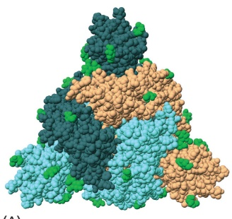

(B)

<small>Figure 9–50 The spike protein on the SARS-CoV-2 virus. The SARS-CoV-2 virus was responsible for the COVID-19 pandemic. Protruding from the viral membrane are many trimeric spike proteins that mediate binding of the virus to a receptor on cells in our respiratory tract and its subsequent entry into the cell. The trimeric spike protein is a target both of our immune system and of vaccine developers. The closed conformation of the trimeric spike protein shown here, both from the top (A) and from the side (B), was obtained from rapidly frozen intact virus particles. Spike proteins were identified by computer from multiple tilted images of the viruses and subtomogram averaging applied to them. The final electron-density map was determined to a resolution of 0.35 nm, good enough for the molecular model (shown here) to be accurately fitted within its envelope, although the details of the membrane-spanning portion of the trimeric spike protein are not revealed. The proteins are heavily N-glycosylated, and these surface glycans are shown in green, while the three spike proteins are shown in dark green, light blue, and light brown. (PDB code: 6ZWV.)</small>

example from x-ray crystallography (Figure 9–52). Molecular models can then be mathematically “fitted” or docked into the envelope of the structure determined at lower resolution using the electron microscope. X-ray and cryoEM approaches often combine profitably together to determine molecular structures.

## Light Microscopy and Electron Microscopy Are Mutually BeneficialMBoC7 n9.133/9.51

The interior of the cell is a confusing place, with molecules crowded together in the cytosol and intricate and complex membrane-bounded compartments. To discover which molecules are located exactly where and in which tiny vesicles or subcompartments of the cell is not straightforward, even with the genetically encoded labels that can target almost any protein. We have seen that superresolution light microscopy can be used to very accurately locate specific molecules within a cell. A major disadvantage, however, of all fluorescence imaging techniques is that it is only the tagged molecules that are imaged—their cellular context remains invisible. When fluorescence imaging is combined, however, with looking at the same specimen in the electron microscope, this correlative light microscopy and electron microscopy technique, or CLEM, can allow specific target molecules to be examined in their full cellular context. Although this can be achieved using fixed and sectioned material, most such approaches now use rapidly frozen material to co-localize target molecules both in the light and in the

Figure 9–51 Atomic resolution by cryoEM. Apoferritin is a cytosolic protein, present in almost all living organisms, that reversibly stores iron in a nontoxic form. It is a large (474 kilodaltons) and particularly stable molecule. Its hollow globular cage has 24 symmetrical subunits, which means that a structure can be determined with relatively few particles. (A) Cryo-electron micrograph of cage-like apoferritin particles. (B) By use of every possible new technical advance in single-particle reconstruction, the complete cryoEM structure shown here is at the remarkable resolution of 0.12 nm (1.2 Å). (C) When the known amino acid sequence is modeled into the electrondensity map, clear electron densities can be seen associated with hydrogen atoms in the three amino acid side chains. The molecular model is fitted into the final electron-density envelope that is shown as a gray cage. (A, from T. Nakane et al., Nature 587:152–156, 2020, doi 10.1038/s41586-020-2829-0; B, EMD-11668; C, adapted from K.M. Yip et al., Nature 587:157–161, 2020. With permission from Nature.)

## Figure 9–52 PRC2, a large

macromolecular machine. Polycomb repressive complex 2 (PRC2) is a large protein complex involved in establishing heterochromatin and the epigenetic regulation of gene expression (see Figure 4–40). PRC2 interacts with a nucleosome through the binding of the nucleosomal DNA by one of its subunits, EZH2, which also engages the extended tail of histone H3 to direct its lysine 27 (K27) to the active site for methylation. The density map of PRC2 and two essential cofactors bound to a single nucleosome was produced by single-particle cryoelectron microscopy reconstruction at a resolution of 0.35 nm. The long arm of histone H3 is shown in more detail with the protein backbone modeled into the density map. (Courtesy of Vignesh Kasinath and Eva Nogales and based on EMDB-21707. From V. Kasinath et al., Science 371:eabc3393, 2021. With permission from AAAS.)

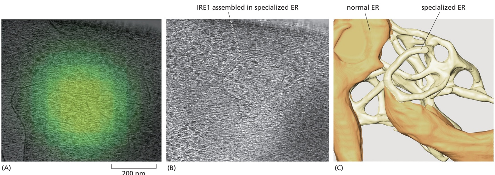

electron microscope, and of these two general approaches are common. The first is to freeze the cell or tissue, locate the positions of the target molecule with fluorescence light microscopy, and then, after transferring the frozen specimen to an electron microscope, tilting it, using EM tomography to find the exact point in theMBoC7 n9.139/9.53 tomogram that corresponds to the fluorescent signal (**Figure 9–53**).

A second approach, and a demanding one too, is again to rapidly freeze the cell and locate fluorescent molecules at high resolution by single-molecule localization microscopy. The frozen cell is then transferred to a modified SEM that incorporates a separate focused ion beam, usually of gallium ions, that can be scanned across the frozen block face like a miniature milling machine, removing about 10 nm of the sample at a time. The SEM records a two-dimensional image of the scattered electrons from the surface of the block face at each step, and a three-dimensional image of the cell is gradually built up that can be correlated with the original localization data, all with a final resolution of about 5 nm (**Figure 9–54**). The technique is called focused ion beam–scanning electron microscopy, or FIB–SEM for short. The same technique, but without the fluorescent labels, can be used on much larger specimens that have been conventionally fixed, stained with heavy-metal salts, and embedded in plastic. Although the structural preservation may not be so good as with frozen specimens, the approach, although very time consuming, is proving useful in analyzing complex cellular interactions; for example, in mapping the neural connections in brain tissue (see Movie 9.1).

## Using Microscopy to Study Cells Always Involves Trade-Offs

The history of cell biology has been tightly interlinked with that of microscopy. What we now know about the structure and function of cells has depended crucially on being able to image cells, organelles, and the molecules they contain—seeing is indeed believing. But for the young biologist today, there is, as we have seen, a bewildering variety of imaging technologies from which to choose, and knowing which is best suited to solve the problem at hand is not easy. All imaging approaches have trade-offs to consider. At an obvious level, the dynamics of cells are only accessible with certain kinds of light microscopies and with living cells. If higher resolution is required, with either electron microscopes or light microscopes, then that comes with increasing cost and complexity. Single-molecule localization microscopy also requires elaborate hardware and also takes many minutes to acquire each image. The cryoEM-derived structures of large protein complexes require the use of high-voltage machines that cost many millions of dollars. Such resources are usually confined to large centralized microscopy facilities that can be shared by many users. The precise localization of molecules within the cell requires the use of fluorescent labels, but, because only the labels themselves can be detected in a fluorescence microscope, the cellular

Figure 9–53 Correlated light and electron microscopy (CLEM). The correct folding of proteins in the endoplasmic reticulum (ER) is sensed by a major transmembrane protein called IRE1 (see Figures 12–36 and 12–37). If IRE1 is activated, it forms oligomers that are visible in fluorescence microscopy as bright foci. Here, stressed cells, expressing fluorescent IRE1 and growing on an EM grid, are rapidly frozen and subsequently imaged by EM tomography. The resulting tomograms can be directly correlated with the light micrographs. (A) A fluorescent spot of labeled IRE1 is shown here precisely superimposed on a slice through its corresponding EM tomogram that contains a network of ER. (B) Another slice through the tomogram at a different level shows IRE1 is localized as aggregates in a complex network of specialized, narrow ER tubules. (C) The outlines of the ER membranes in each slice of the tomogram are manually defined (in a process called segmentation), and the drawing here shows that the oligomers of IRE1 are concentrated in this convoluted network of specialized ER tubules. (A, B, and C, adapted from S.D. Carter et al., 2021, doi 10.1101/2021.02.24.432779.)