MEMBRANE PROTEINS

615

cholesterol, and glycolipids. Because of their different backbone structure, phospholipids fall into two subclasses—glycerophospholipids and sphingolipids. The lipid compositions of the inner and outer monolayers are different, reflecting the different functions of the two faces of a cell membrane. Different mixtures of lipids are found in the membranes of cells of different types, as well as in the various membranes of a single eukaryotic cell. Inositol phospholipids are a minor class of phospholipids, which in the cytosolic leaflet of the plasma membrane lipid bilayer play an important part in cell signaling: in response to extracellular signals, specific lipid kinases phosphorylate the head groups of these lipids to form docking sites for cytosolic signaling proteins, whereas specific phospholipases cleave certain inositol phospholipids to generate small intracellular signaling molecules.

## MEMBRANE PROTEINS

Although the lipid bilayer provides the basic structure of biological membranes, the membrane proteins perform most of the membrane’s specific tasks and therefore give each type of cell membrane its characteristic functional properties. Accordingly, the amounts and types of proteins in a membrane are highly variable. In the myelin membrane, which serves mainly as electrical insulation for nerve-cell axons, less than 25% of the membrane mass is protein. By contrast, in the membranes involved in ATP production (such as the internal membranes of mitochondria and chloroplasts), approximately 75% is protein. A typical plasma membrane is somewhere in between, with protein accounting for about half of its mass. Because lipid molecules are small compared with protein molecules, however, there are always many more lipid molecules than protein molecules in cell membranes—about 50 lipid molecules for each protein molecule in cell membranes that are 50% protein by mass. Membrane proteins vary widely in structure and in the way they associate with the lipid bilayer, which reflects their diverse functions.

## Membrane Proteins Can Be Associated with the Lipid Bilayer in Various Ways

**Figure 10–17** shows the different ways in which proteins can associate with the membrane. Like their lipid neighbors, **membrane proteins** are amphiphilic, having hydrophobic and hydrophilic regions. Many membrane proteins extend through the lipid bilayer, and hence are called **transmembrane proteins**, with part of their mass extruding from the membrane on both sides (Figure 10–17, examples 1, 2, and 5). Other transmembrane proteins are inserted with the bulk of their mass exposed almost exclusively on one or the other side of the membrane (Figure 10–17, examples 3 and 4). In all cases their hydrophobic regions pass through the membrane and interact with the hydrophobic tails of the lipid molecules in the interior of the bilayer, where they are sequestered away from water. Their hydrophilic regions are exposed to water on either side of the membrane.

Figure 10–17 Various ways in which proteins associate with the lipid bilayer. Most membrane proteins are thought to extend across the bilayer as (1) a single α helix, (2) as multiple α helices, or (5) as a rolled-up β sheet (a β barrel). Some of these single-pass and multipass proteins have a covalently attached fatty acid chain inserted in the cytosolic lipid monolayer (1). Other membrane proteins are exposed at only one side of the membrane (3, 4). These classes include glycosyltransferases that carry out glycosylation reactions in the Golgi apparatus (3) and SNARE proteins that catalyze membrane fusion (4), both discussed in Chapter 13. (6) Some of these are anchored to the cytosolic surface by an amphiphilic α helix that partitions into the cytosolic monolayer of the lipid bilayer through the hydrophobic face of the helix. (7) Others are attached to the bilayer solely by a covalently bound lipid chain—either a fatty acid chain or a prenyl group (see Figure 10–18)—in the cytosolic monolayer or, (8) via an oligosaccharide linker, to phosphatidylinositol in the noncytosolic monolayer—called a GPI anchor. (9, 10) Finally, membrane-associated proteins are attached to the membrane only by noncovalent interactions with other membrane proteins. The way in which the structure in (7) is formed is illustrated in Figure 10–18, while the way in which the GPI anchor shown in (8) is formed is illustrated in Figure 12–30. The details of how membrane proteins become associated with the lipid bilayer are discussed in Chapter 12.

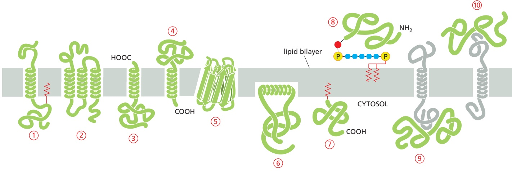

---

616

Chapter 10: Membrane Structure

Other membrane proteins are located entirely in the cytosol and are attached to the cytosolic monolayer of the lipid bilayer, either by an amphiphilic α helix exposed on the surface of the protein (Figure 10–17, example 6) or by one or more covalently attached lipid chains (Figure 10–17, example 7). The lipid-linked proteins in example 7 in Figure 10–17 are made as soluble proteins in the cytosol and are subsequently anchored to the membrane by the covalent attachment of the lipid group. Lipids can also be attached to the cytosolic facing domains of transmembrane proteins as an additional means of anchoring them to the membrane (see Figure 10–17, example 1).

Yet other membrane proteins are entirely exposed at the external cell surface, being attached to the lipid bilayer only by a covalent linkage (via a specific oligosaccharide) to a lipid anchor in the outer monolayer of the plasma membrane (Figure 10–17, example 8). These proteins are initially made and inserted into the endoplasmic reticulum (ER) by a single transmembrane segment at the C-terminus (similar to example 4 in Figure 10-17). While still in the ER, the transmembrane segment of the protein is cleaved off and a glycosylphosphatidylinositol (GPI) anchor is added, leaving the protein bound to the noncytosolic surface of the ER membrane solely by this anchor (discussed in Chapter 12); transport vesicles eventually deliver the protein to the plasma membrane (discussed in Chapter 13).

By contrast to these examples, **membrane-associated proteins** do not extend into the hydrophobic interior of the lipid bilayer at all; they are instead bound to either face of the membrane by noncovalent interactions with other membrane proteins (Figure 10–17, examples 9 and 10). Many of the proteins of this type can be released from the membrane by relatively gentle extraction procedures, such as exposure to solutions of very high or low ionic strength or of extreme pH, which interfere with protein–protein interactions but leave the lipid bilayer intact; these proteins are often referred to as peripheral membrane proteins, and their association with membranes is often regulated by the cell as we discuss next. Transmembrane proteins and many proteins held in the bilayer by lipid groups or hydrophobic polypeptide regions that insert into the hydrophobic core of the lipid bilayer cannot be released in these ways.

## Lipid Anchors Control the Membrane Localization of Some Signaling Proteins

How a membrane protein is associated with the lipid bilayer reflects the function of the protein. Only transmembrane proteins can function on both sides of the bilayer or transport molecules across it. Cell-surface receptors, for example, are usually transmembrane proteins that bind signal molecules in the extracellular space and generate different intracellular signals on the opposite side of the plasma membrane, as we discuss in Chapter 15. To transfer small hydrophilic molecules across a membrane, a membrane transport protein must provide a path for the molecules to cross the hydrophobic permeability barrier of the lipid bilayer; the molecular architecture of multipass transmembrane proteins (Figure 10–17, examples 2 and 5) is ideally suited for this task, as we discuss in Chapter 11.

Proteins that function on only one side of the lipid bilayer, by contrast, are often associated exclusively with either the lipid monolayer or a protein domain on that side. Some intracellular signaling proteins, for example, that help relay extracellular signals into the cell interior are bound to the cytosolic half of the plasma membrane by one or more covalently attached lipid groups, which can be fatty acid chains or prenyl groups (Figure 10–18). In some cases, myristic acid is added to the N-terminal amino group of the protein during its synthesis on a ribosome. All members of the Src family of cytoplasmic protein tyrosine kinases (discussed in Chapter 15) are myristoylated in this way. Membrane attachment through a single lipid anchor is not very strong, however, and a second lipid group is often added to anchor proteins more firmly to a membrane. For most Src kinases, the second lipid modification is the attachment of palmitic acid to a cysteine side chain of the protein. This modification occurs in response to

---

MEMBRANE PROTEINS

617

an extracellular signal and helps recruit the kinases to the plasma membrane. When the signaling pathway is turned off, the palmitic acid is removed, allowing the kinase to return to the cytosol. Other intracellular signaling proteins, such as the Ras family small GTPases (discussed in Chapter 15), use a combination of prenyl group and palmitic acid attachment to recruit the proteins to the plasma membrane.

Many proteins attach to membranes transiently. Some are classical peripheral membrane proteins that associate with membranes by regulated protein–protein interactions. Others undergo a transition from soluble to membrane protein by a conformational change that exposes a hydrophobic peptide or covalently attached lipid anchor. Many of the small GTPases of the Rab protein family that regulate intracellular membrane traffic (discussed in Chapter 13), for example, switch depending on the nucleotide that is bound to the protein. In their GDP-bound state they are soluble in the cytosol, often stabilized by binding to a GDP dissociation inhibitor, or GDI, whereas in their GTP-bound state their lipid anchor is exposed and tethers them to membranes. They are membrane proteins at one moment and soluble proteins at the next. Such highly dynamic interactions greatly expand the repertoire of membrane functions.

## In Most Transmembrane Proteins, the Polypeptide Chain Crosses the Lipid Bilayer in an α-Helical Conformation

A transmembrane protein always has a unique orientation in the membrane. This reflects both the asymmetric manner in which it is inserted into the lipid bilayer in the ER during its biosynthesis (discussed in Chapter 12) and the different functions of its cytosolic and noncytosolic domains. These domains are separated by the membrane-spanning segments of the polypeptide chain, which contact the hydrophobic environment of the lipid bilayer and are composed largely of amino acids with nonpolar side chains. Because the peptide bonds themselves are polar and because water is absent in the bilayer, all peptide bonds in the membranespanning segments of a polypeptide are driven to form hydrogen bonds with one another (discussed in Chapter 3).

There are two ways that hydrogen-bonding between peptide bonds can be maximized. The most common way, found in the majority of transmembrane

attachment by a fatty acid chain or a prenyl group. The covalent attachment of either type of lipid can help localize a water-soluble protein to a membrane after its synthesis in the cytosol. (A) A fatty acid chain (myristic acid) is attached via an amide linkage to an N-terminal glycine. (B) A fatty acid chain (palmitic acid) is attached via a thioester linkage to a cysteine. (C) A prenyl chain (either farnesyl or a longer geranylgeranyl chain) is attached via a thioether linkage to a cysteine residue that is initially located four residues from the protein’s C-terminus. After prenylation, the terminal three amino acids are cleaved off, and the new C-terminus is methylated before insertion of the anchor into the membrane (not shown). The structures of the lipid anchors are shown below: (D) a myristoyl anchor (derived from a 14-carbon saturated fatty acid chain), (E) a palmitoyl anchor (a 16-carbon saturated fatty acid chain), and (F) a farnesyl anchor (a 15-carbon unsaturated hydrocarbon chain composed of three 5-carbon isoprenoid repeats).

---

618

Chapter 10: Membrane Structure

Figure 10–19 A segment of a membrane-spanning polypeptide chain crossing the lipid bilayer as an a helix. Only the α-carbon backbone of the polypeptide chain is shown, with the hydrophobic amino acids in green and the hydrophilic amino acids in yellow. The polypeptide segment shown is part of the single membrane-spanning protein glycophorin, which is found abundantly in the red blood cell plasma membrane. Glycophorin normally is a dimer of two identical subunits whose transmembrane segments cross in the hydrophobic interior of the bilayer. Only a single transmembrane segment is shown. (PDB code: 5EH4.)

proteins, is if the polypeptide chain forms a regular α helix as it crosses the bilayer (**Figure 10–19**). In **single-pass transmembrane proteins**, the polypeptide chain crosses only once (see Figure 10–17, example 1), whereas in **multipass transmembrane proteins**, the polypeptide chain crosses multiple times (see Figure 10–17, example 2). An alternative way for the peptide bonds in the lipid bilayer to satisfy their hydrogen-bonding requirements is for multiple transmembrane strands of a polypeptide chain to be arranged as a β sheet that is rolled up into a cylinder (a so-called b barrel; see Figure 10–17, example 5, and Figure 3–7). This protein architecture is seen in the porin proteins that we discuss later.

Progress in x-ray crystallography and single-particle cryo-electron microscopy of membrane proteins has enabled the determination of the three-dimensional structure of many of them. The structures confirm that it is often possible to pre-dict from the protein’s amino acid sequence which parts of the polypeptide chain extend across the lipid bilayer. Segments containing about 20–30 amino acids, with a high degree of hydrophobicity, are long enough to span a lipid bilayer as an α helix, and they can often be identified in hydropathy plots (**Figure 10–20**). From such plots, it is estimated that about 30% of an organism’s proteins are transmembrane proteins, emphasizing their importance. Hydropathy plots cannot identify the membrane-spanning segments of a β barrel, as 10 amino acids or fewer are sufficient to traverse a lipid bilayer as an extended β strand, and only every other amino acid side chain is hydrophobic.

The strong drive to maximize hydrogen-bonding in the absence of water means that most transmembrane helices span the membrane completely. But multipass transmembrane proteins can also contain regions that fold into the membrane from either side, squeezing into spaces between transmembrane α helices without contacting the hydrophobic core of the lipid bilayer. Because such regions interact only with other polypeptide regions, they do not need to maximize hydrogen-bonding; they can therefore have a variety of secondary structures, including helices that extend only partway across the lipid bilayer (**Figure 10–21**). Such regions are important for the function of some membrane proteins, including water channel and ion channel proteins, in which the regions contribute to the walls of the pores traversing the membrane and confer substrate specificity on the channels, as we discuss in Chapter 11. These regions cannot be identified

(A) GLYCOPHORIN

(B) BACTERIORHODOPSIN

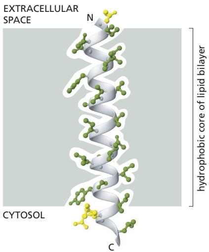

Figure 10–20 Using hydropathy plots to localize potential a-helical membranespanning segments in a polypeptide chain. The free energy needed to transfer successive segments of a polypeptide chain from a nonpolar solvent to water is calculated from the amino acid composition of each segment using data obtained from model compounds. This calculation is made for segments of a fixed size (usually around 10–20 amino acids), beginning with each successive amino acid in the chain. The hydropathy index of the segment is plotted on the Y axis as a function of its location in the chain. A positive value indicates that free energy is required for transfer to water (that is, the segment is hydrophobic), and the value assigned is an index of the amount of energy needed. Peaks in the hydropathy index appear at the positions of hydrophobic segments in the amino acid sequence. (A and B) Hydropathy plots for two membrane proteins that are discussed later in this chapter. Glycophorin (A) has a single membrane-spanning α helix and one corresponding peak in the hydropathy plot. Bacteriorhodopsin (B) has seven membrane-spanning α helices and seven corresponding peaks in the hydropathy plot. (A, adapted from D. Eisenberg, Annu. Rev. Biochem. 53:595–624, 1984.)

---

MEMBRANE PROTEINS

619

in hydropathy plots and are only revealed by determining the protein’s threedimensional structure or by sequence alignment with homologous proteins whose structures are known.

## Transmembrane α Helices Often Interact with One Another

The transmembrane α helices of many single-pass membrane proteins do not contribute to the folding of the protein domains on either side of the membrane. As a consequence, it is often possible to engineer cells to produce just the cytosolic or extracellular domains of these proteins as water-soluble molecules. This approach has been invaluable for studying the structure and function of these domains, especially the domains of transmembrane receptor proteins (discussed in Chapter 15). A transmembrane α helix, even in a single-pass membrane protein, however, often does more than just anchor the protein to the lipid bilayer. Many single-pass membrane proteins form homodimers or heterodimers that are held together by noncovalent, but strong and highly specific, interactions between the two transmembrane α helices; the sequence of the amino acids of these helices contains the information that directs the protein–protein interaction.

Figure 10–21 Two short a helices in the aquaporin water channel, each of which spans only halfway through the lipid bilayer. In the plasma membrane, four monomers, one of which is shown here, form a tetramer. Each monomer has a hydrophilic pore at its center, which allows water molecules to cross the membrane in single file (see Figure 11–20 and Movie 11.6). The two short, colored helices are buried at an interface formed by protein–protein interactions. The mechanism by which the channel allows the passage of water molecules is discussed in more detail in Chapter 11. (PDB code: 1H6I.)

Similarly, the transmembrane α helices in multipass membrane proteins occupy specific positions in the folded protein structure that are determined by interactions between the neighboring helices (**Figure 10–22**). These interactions are crucial for the structure and function of the many receptors, channels, and transporters that communicate or move molecules across cell membranes. In these proteins, each transmembrane helix shields regions of neighboring transmembrane helices from membrane lipids. When all the helices are packed together into the final folded structure, the outer surface of the helical bundle that is exposed to lipids is composed primarily of hydrophobic amino acids. By contrast, the interior of the helical bundle, which is not exposed directly to lipids, can contain polar and even charged amino acids that would ordinarily be disfavored in the membrane. The ability to accommodate hydrophilic amino acids within a bundle of transmembrane helices means that multipass membrane proteins can contain binding sites and channels across the membrane for hydrophilic molecules. This property affords multipass membrane proteins considerable functional diversity and probably explains why they represent the majority of membrane proteins.

## Some β Barrels Form Large Channels

Unlike a bundle of α helices that can be arranged in numerous ways, β-barrel membrane proteins are always arranged as a cylinder. This is because all hydrogen bonds must be satisfied, so a sheet that exposes an edge is energetically

Figure 10–22 Steps in the folding of a multipass transmembrane protein. Polar and charged amino acids contained in transmembrane helices are energetically disfavored in the hydrophobic environment of the lipid bilayer. They become buried in the interface between spatially adjacent helices in folded membrane proteins. In membrane protein complexes, these contacts can occur between helices from different protein subunits, as is the case for many ion channels as discussed MBoC7 m10.22/10.22in Chapter 11. In this way, multipass membrane proteins can provide a hydrophilic path across the hydrophobic barrier of the bilayer.

---

620

Chapter 10: Membrane Structure

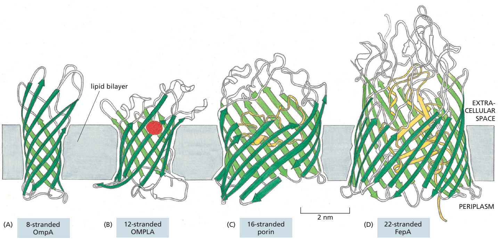

disfavored in the membrane. This means that β barrels all share the same overall architecture in which the amino acids facing the outside of the cylinder are hydrophobic. By contrast, the size of the barrel, and the content inside the barrel, are highly variable and suited to the function of each β-barrel membrane protein. For example, the number of β strands in a β barrel varies widely, from as few as 8 strands to as many as 22 (**Figure 10–23**).

β-Barrel proteins are abundant in the outer membranes of bacteria, mitochon-MBoC7 m10.23/10.23 dria, and chloroplasts. Some are pore-forming proteins, which create water-filled channels that allow selected small hydrophilic molecules to cross the membrane. The porins are well-studied examples (Figure 10–23C). Many porin barrels are formed from a 16-strand, antiparallel β sheet rolled up into a cylindrical structure. Polar amino acid side chains line the aqueous channel on the inside, while nonpolar side chains project from the outside of the barrel to interact with the hydrophobic core of the lipid bilayer. Loops of the polypeptide chain often protrude into the **lumen** of the channel, narrowing it so that only certain solutes can pass. Some porins are therefore highly selective: maltoporin, for example, preferentially allows maltose and maltose oligomers to cross the outer membrane of E. coli.

The FepA protein is a more complex example of a β-barrel transport protein (Figure 10–23D). It transports iron ions across the bacterial outer membrane. It is constructed from 22 β strands, and a large globular domain completely fills the inside of the barrel. Iron ions bind to this domain, which changes its conformation to transfer the iron across the membrane.

Not all β-barrel proteins are transporters. Some form smaller barrels that are completely filled by amino acid side chains that project into the center of the barrel. These proteins function as receptors or enzymes (Figure 10–23A and B); the barrel serves as a rigid anchor, which holds the protein in the membrane and orients the cytosolic loops that form binding sites for specific intracellular molecules.

Figure 10–23 b barrels formed from different numbers of b strands. (A) The Escherichia coli OmpA protein serves as a receptor for a bacterial virus. (B) The E. coli OMPLA protein is an enzyme (a lipase) that hydrolyzes lipid molecules. The amino acids that catalyze the enzymatic reaction (indicated in red) protrude from the outside surface of the barrel. (C) A porin from the bacterium Rhodobacter capsulatus forms a water-filled pore across the outer membrane. The diameter of the channel is restricted by loops (shown in yellow) that protrude into the channel. (D) The E. coli FepA protein transports iron ions. The inside of the barrel is completely filled by a globular protein domain (shown in yellow) that contains an iron-binding site (not shown).

Most multipass membrane proteins in eukaryotic cells and in the bacterial plasma membrane are constructed from transmembrane α helices. The helices can slide against each other, allowing conformational changes in the protein that can open and shut ion channels, transport solutes, or transduce extracellular signals into intracellular ones. In β-barrel proteins, by contrast, hydrogen bonds bind each β strand rigidly to its neighbors, making conformational changes within the wall of the barrel unlikely. This rigidity makes $\beta$ barrels remarkably

---

MEMBRANE PROTEINS

621

stable, allowing them to be more easily purified and crystallized than α-helical membrane proteins. This is one reason why β-barrel proteins were among the first multipass proteins whose structures were determined.

## Many Membrane Proteins Are Glycosylated

The plasma membrane of a cell is exposed to the often harsh and constantly changing extracellular environment. How are the membrane and its embedded proteins protected from damage? One answer is that many cells have a layer of oligosaccharide and polysaccharide chains that are attached to the lipids and protein domains facing the outside. Most transmembrane proteins in animal cells are glycosylated. As in glycolipids, the sugar residues are added in the lumen of the endoplasmic reticulum and the Golgi apparatus (discussed in Chapters 12 and 13). For this reason, the oligosaccharide chains are always present on the noncytosolic side of the membrane. Another important difference between proteins (or parts of proteins) on the two sides of the membrane results from the reducing environment of the cytosol. This environment decreases the likelihood that intrachain or interchain disulfide (S–S) bonds will form between cysteines on the cytosolic side of membranes. These bonds form on the noncytosolic side, where they can help stabilize either the folded structure of the polypeptide chain or its association with other polypeptide chains (**Figure 10–24**).

Because the extracellular parts of most plasma membrane proteins are glycosylated, carbohydrates extensively coat the surface of all eukaryotic cells. These carbohydrates occur as oligosaccharide chains covalently bound to membrane proteins (glycoproteins) and lipids (glycolipids). They also occur as the polysaccharide chains of integral membrane proteoglycan molecules. Proteoglycans, which consist of long polysaccharide chains linked covalently to a protein core, are found mainly outside the cell, as part of the extracellular matrix (discussed in Chapter 19). But, for some proteoglycans, the protein core either extends across the lipid bilayer or is attached to the bilayer by a glycosylphosphatidylinositol (GPI) anchor.

The terms cell coat or glycocalyx are sometimes used to describe the carbohydrate-rich zone on the cell surface. This **carbohydrate layer** can be visualized by various stains, such as ruthenium red (**Figure 10–25A**), as well as by its affinity for carbohydrate-binding proteins called **lectins**, which can be labeled with a fluorescent dye or some other visible marker. Although most of the sugar groups are attached to intrinsic plasma membrane molecules, the carbohydrate layer also contains both glycoproteins and proteoglycans that have been secreted into the extracellular space and then adsorbed onto the cell surface (**Figure 10–25B**). Many of these adsorbed macromolecules are components of the extracellular matrix, so that the boundary between the plasma membrane and the extracellular matrix is often not sharply defined. One of the many functions of a slippery carbohydrate layer is to protect cells against mechanical and chemical damage; it also keeps various other cells at a distance, preventing unwanted cell–cell interactions.

The oligosaccharide side chains of glycoproteins and glycolipids are enormously diverse in their arrangement of sugars. Although they usually contain fewer than 15 sugars, the chains are often branched, and the sugars can be bonded together by various kinds of covalent linkages—unlike the amino acids in a polypeptide chain, which are all linked by identical peptide bonds. Even three sugars can be put together to form hundreds of different trisaccharides. How sugars can form such a vast variety of different structures is discussed in Chapter 2. Both the diversity and the exposed position of the oligosaccharides on the cell surface make them especially well suited to function in specific cell-recognition processes. Plasma-membrane-bound lectins that recognize specific oligosaccharides on cell-surface glycolipids and glycoproteins mediate a variety of transient cell–cell adhesion processes, including those occurring in lymphocyte recirculation and inflammatory responses (see Figure 19–28).

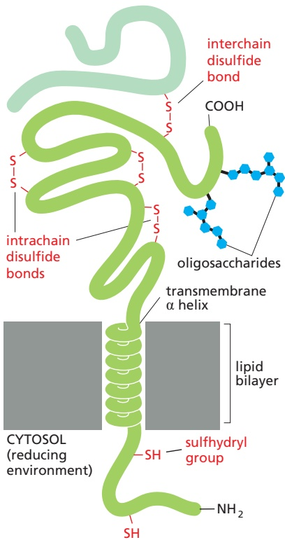

Figure 10–24 A single-pass

transmembrane protein. Note that the polypeptide chain traverses the lipid bilayer as a right-handed α helix and that the oligosaccharide chains and disulfide bonds MBoC7 m10.24/10.24are all on the noncytosolic surface of the membrane. As shown, sulfhydryl groups within a transmembrane protein can form either intrachain disulfide bonds with each other or interchain disulfide bonds with sulfhydryl groups in other proteins. The sulfhydryl groups in the cytosolic domain of the protein do not normally form disulfide bonds because the reducing environment in the cytosol maintains these groups in their reduced (–SH) form.

---

622

Chapter 10: Membrane Structure

(A)

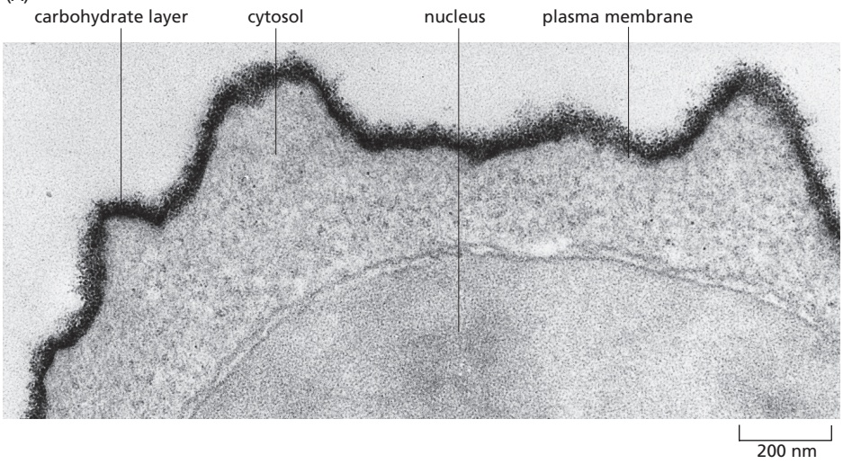

Figure 10–25 The carbohydrate layer on the cell surface. (A) This electron micrograph of the surface of a lymphocyte stained with ruthenium red emphasizes the thick carbohydrate-rich layer surrounding the cell. (B) The carbohydrate layer is made up of the oligosaccharide side chains of membrane glycolipids and membrane glycoproteins and the polysaccharide chains on membrane proteoglycans. In addition, adsorbed glycoproteins, and adsorbed proteoglycans (not shown), contribute to the carbohydrate layer in many cells. Note that all of the carbohydrate is on the extracellular surface of the membrane. (A, courtesy of Audrey M. Gluaert and G.M.W. Cook.)

(B)

## Membrane Proteins Can Be Solubilized and Purified in Detergents

In general, only agents that disrupt hydrophobic associations and disassemble the lipid bilayer can liberate membrane proteins in a soluble form. The most useful of these for the membrane biochemist are **detergents**, which are small amphiphilic molecules of variable structure (**Movie 10.4**). Detergents are much more soluble in water than in lipids. Their polar (hydrophilic) ends can be either charged (ionic), as in sodium dodecyl sulfate (SDS), or uncharged (nonionic), as in b-octylglucoside and Triton X-100 (**Figure 10–26A**). At low concentration, detergents are monomeric in solution, but when their concentration is increased above a threshold, called the critical micelle concentration (CMC), they aggregate to form micelles (**Figure 10–26B, C, and D**). Above the CMC, detergent molecules rapidly diffuse in and out of micelles, keeping the concentration of monomer in the solution constant, no matter how many micelles are present. Because of this dynamic behavior, the structure of a micelle changes constantly: at any moment most, but not all, of the hydrophilic ends of the detergent molecules will be external facing the water phase and most, but not all, of the hydrophobic ends will be internal to the micelle. Both the CMC and the average number of detergent molecules in a micelle are characteristic properties of each detergent, but they also depend on the temperature, pH, and salt concentration. Detergent solutions are therefore complex systems and are difficult to study.

---

MEMBRANE PROTEINS

623

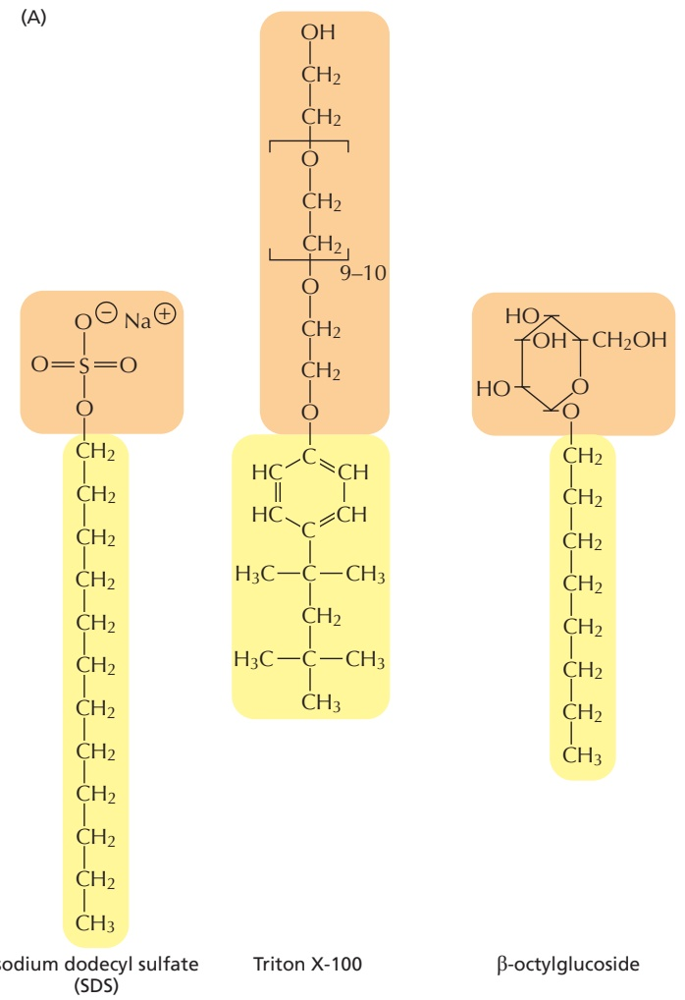

(B)

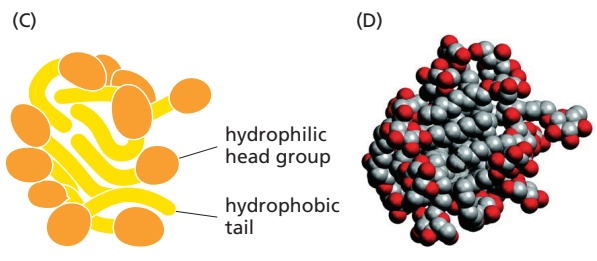

Figure 10–26 The structure and function of detergents. (A) Three commonly used detergents are sodium dodecyl sulfate (SDS), an anionic detergent, and Triton X-100 and β-octylglucoside, two nonionic detergents. Triton X-100 is a mixture of compounds in which the region in brackets is repeated between 9 and 10 times. The hydrophobic portion of each detergent is shown in yellow, and the hydrophilic portion is shown in orange. (B) At low concentration, detergent molecules are monomeric in solution. As their concentration is increased beyond the critical micelle concentration (CMC), some of the detergent molecules form micelles. Note that the concentration of detergent monomer stays constant above the CMC. (C) Because they have both polar and nonpolar ends, detergent molecules are amphiphilic; and because they are coneshaped, they form micelles rather than bilayers (see Figure 10–7). Detergent micelles are thought to have constantly changing, irregular shapes. Because of packing constraints, the hydrophobic tails are partially exposed to water. (D) The space-filling model shows a snapshot in time of a micelle composed of 20 β-octylglucoside molecules, predicted by molecular dynamics calculations. The head groups are shown in red and the hydrophobic tails in gray. Note that the hydrophobic regions are MBoC7 m10.26/10.26transiently exposed. (B, adapted with permission from G. Gunnarsson, B. Jönsson, and H. Wennerström, J. Phys. Chem. A 84:3114–3121, 1980. Copyright 1980 American Chemical Society; C, from S. Bogusz, R.M. Venable, and R.W. Pastor, J. Phys. Chem. B 104:5462–5470, 2000.)

When mixed with membranes, the hydrophobic ends of detergents bind to the hydrophobic regions of the membrane proteins, where they displace lipid molecules with a collar of detergent molecules. Because the other end of the detergent molecule is polar, this binding tends to bring the membrane proteins into solution as detergent–protein complexes (**Figure 10–27**). Usually, some lipid molecules also remain attached to the protein.

Strong ionic detergents, such as SDS, can solubilize even the most hydrophobic membrane proteins. This allows the proteins to be analyzed by SDS polyacrylamidegel electrophoresis (discussed in Chapter 8). Such strong detergents, however, unfold (denature) proteins by disrupting their internal hydrophobic cores, thereby rendering the proteins inactive and unusable for functional studies. Nonetheless, proteins can be readily separated and purified in their SDS-denatured form. In

---

624

Chapter 10: Membrane Structure

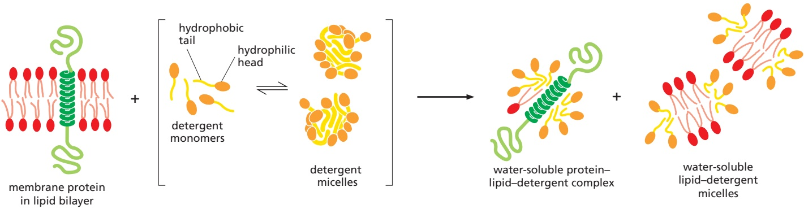

some cases, removal of the SDS allows the purified protein to renature, with recovery of functional activity.

Many membrane proteins can be solubilized and then purified in an active form by the use of mild detergents. These detergents cover the hydrophobic MBoC7 m10.27/10.27regions on membrane-spanning segments that become exposed after lipid removal but do not unfold the protein. Especially when working with multipass membrane proteins, it is often important to maintain a thin layer of lipids upon detergent extraction to retain the protein’s activity. If the detergent concentration

Figure 10–27 Solubilizing a membrane protein with a mild nonionic detergent. The detergent disrupts the lipid bilayer and brings the protein into solution as protein–lipid–detergent complexes. The phospholipids in the membrane are also solubilized by the detergent, as lipid–detergent micelles.

Figure 10–28 The use of mild nonionic detergents for solubilizing, purifying, and reconstituting functional membrane protein systems. In this example, functional Na+-K+ pump molecules are purified and incorporated into phospholipid vesicles. This pump is present in the plasma membrane of most animal cells, where it uses the energy of ATP hydrolysis to pump Na+ out of the cell and K+ in, as discussed in Chapter 11. The phospholipids that are newly added in the reconstitution experiments are shown with white polar head groups.

---

MEMBRANE PROTEINS

625

Figure 10–29 Model of a membrane protein reconstituted into a nanodisc. When detergent is removed from a solution containing a multipass membrane protein, lipids, and a protein subunit of the highdensity lipoprotein (HDL), the membrane protein becomes embedded in a small patch of lipid bilayer, which is surrounded by a belt of the HDL protein. In such nanodiscs, the hydrophobic edges of the bilayer patch are shielded by the protein belt, which renders the assembly watersoluble.

of a solution of solubilized membrane proteins is reduced (by dilution, for example), membrane proteins do not remain soluble. In the presence of an excess of phospholipid molecules in such a solution, however, membrane proteins incorporate into small liposomes that form spontaneously. In this way, functionally active membrane protein systems can be reconstituted from purified components, providing a powerful means of analyzing the activities of membrane transporters, ion channels, signaling receptors, and so on (**Figure 10–28**). Such functional reconstitution can determine which proteins are both necessary and sufficient for a particular cell function. For example, the approach provided proof for the hypothesis that the enzymes that make ATP (ATP synthases) use H gradients in mitochondrial, chloroplast, and bacterial membranes to produce ATP.

Membrane proteins can also be reconstituted from detergent solution into nanodiscs, which are small, uniformly sized patches of membrane that are surrounded by a belt of a specially designed protein, which covers the exposed edge of the bilayer to keep the patch in solution (**Figure 10–29**). The belt protein is derived from high-density lipoproteins (HDLs), whose normal function is to keep lipids soluble for transport in the blood. In nanodiscs the membrane protein of interest can be studied in its native lipid environment and is experimentally accessible from both sides of the bilayer, which is useful, for example, for ligand-binding experiments. Proteins contained in nanodiscs can also be analyzed by single-particle electron microscopy techniques to determine their structure. By this technique (discussed in Chapter 9), the structure of a membrane protein can be determined to high resolution without a requirement of the protein of interest to crystallize into a regular lattice, which is often hard to achieve for membrane proteins. These developments have led to a rapid increase in the number of three-dimensional structures of membrane proteins and protein complexes that are known, although they are still few compared to the known structures of water-soluble proteins and protein complexes.

## Bacteriorhodopsin Is a Light-driven Proton (H+) Pump That Traverses the Lipid Bilayer as Seven α Helices

In Chapter 11, we consider how multipass transmembrane proteins mediate the selective transport of small hydrophilic molecules across cell membranes. But a detailed understanding of how such a membrane transport protein works requires precise information about its three-dimensional structure in the bilayer. Bacteriorhodopsin was the first membrane transport protein whose structure was determined, and it emerged as the prototype of many multipass membrane proteins that have a similar structure.

---

50 nm

626

Chapter 10: Membrane Structure

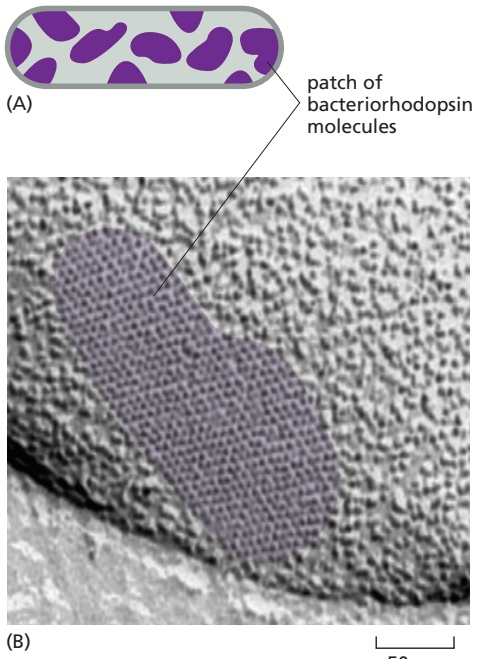

patch of bacteriorhodopsin molecules

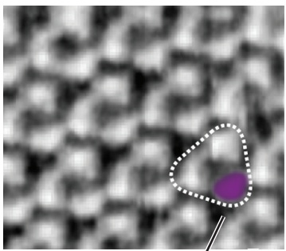

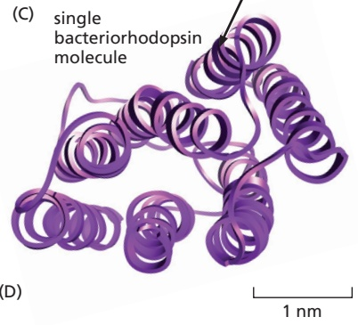

The “purple membrane” of the archaeon Halobacterium salinarum is a specialized patch in the plasma membrane that contains a single species of protein molecule, **bacteriorhodopsin** (**Figure 10–30A**). The protein functions as a light-activated $\mathrm { H } ^ { + }$ pump that transfers $\mathrm { H } ^ { + }$ out of the archaeal cell. The ability of bacteriorhodopsin molecules to tightly pack with each other into a planar twodimensional crystal (**Figure 10–30B,** $\mathrm { C } _ { r }$ **and D**) facilitated the determination of its three-dimensional structure.

Each bacteriorhodopsin molecule is folded into seven closely packed trans-MB C7 10.30/10.30 membrane α helices and contains a single light-absorbing group, or chromophore (in this case, retinal), which gives the protein its purple color. Retinal is vitamin A in its aldehyde form and is identical to the chromophore found in rhodopsin of the photoreceptor cells of the vertebrate eye (discussed in Chapter 15). Retinal is covalently linked to a lysine side chain of the bacteriorhodopsin protein. When activated by a single photon of light, the excited chromophore changes its shape and causes a series of small conformational changes in the protein, resulting in the transfer of one $\mathrm { H } ^ { + }$ from the inside to the outside of the cell (**Figure 10–31A**). In bright light, each bacteriorhodopsin molecule can pump several hundred protons per second. The light-driven proton transfer establishes an $\mathrm { H } ^ { + }$ gradient across the plasma membrane, which in turn drives the production of ATP by a second protein in the cell’s plasma membrane. The energy stored in the

Figure 10–30 Patches of purple membrane, which contain bacteriorhodopsin in the archaeon Halobacterium salinarum. (A) These archaea live in saltwater pools, where they are exposed to sunlight. They have evolved a variety of light-activated proteins, including bacteriorhodopsin, which is a light-activated $\mathsf { H } ^ { + }$ pump in the plasma membrane. (B) The bacteriorhodopsin molecules in the purple membrane patches are tightly packed into two-dimensional crystalline arrays. (C) Details of the molecular surface visualized by atomic force microscopy. With this technique, individual bacteriorhodopsin molecules can be seen. (D) Outline of the approximate location of the bacteriorhodopsin monomer and the individual α helices in the image shown in C. (B–C, courtesy of Dieter Oesterhelt; D, PDB code: 2BRD.)

Figure 10–31 The three-dimensional structure of a bacteriorhodopsin molecule. (Movie 10.5) (A) The polypeptide chain crosses the lipid bilayer seven times as α helices. The location of the retinal chromophore (purple) and the probable pathway taken by H+ during the light-activated pumping cycle (red arrows) are shown. The first and key step is the passing of an $\mathsf { H } ^ { + }$ from the chromophore to the side chain of aspartic acid 85 (red, located next to the chromophore) that occurs upon absorption of a photon by the chromophore. Subsequently, other H+ transfer steps—in the numerical order indicated and utilizing the hydrophilic amino acid side chains that line a path through the membrane—complete the pumping cycle and return the enzyme to its starting state. (Movie 10.5 explains how the individual transfer steps are linked mechanistically.) Color code: glutamic acid (orange), aspartic acid (red), arginine (blue). (B) The high-resolution crystal structure of bacteriorhodopsin shows many lipid molecules (yellow with red head groups) that are tightly bound to specific places on the surface of the protein. (A, adapted from H. Luecke et al., Science 286:255–261, 1999. B, from H. Luecke et al., J. Mol. Biol. 291:899–911, 1999. With permission from Elsevier.)