MEMBRANE PROTEINS

627

H+ gradient also drives other energy-requiring processes in the cell. Thus, bacteriorhodopsin converts solar energy into an $\widetilde { \mathrm { H } ^ { + } }$ gradient, which provides energy to the archaeal cell.

The high-resolution crystal structure of bacteriorhodopsin reveals many lipid molecules bound in specific places on the protein surface (**Figure 10–31B**). Interactions with specific lipids are thought to help stabilize many membrane proteins, which work best and sometimes crystallize more readily if some of the lipids remain bound during detergent extraction or if specific lipids are added back to the proteins in detergent solutions. The specificity of these lipid–protein interactions helps explain why eukaryotic membranes contain such a variety of lipids, with head groups that differ in size, shape, and charge. This layer of lipids also helps to fill gaps between the jagged hydrophobic surface of the membrane protein and the hydrophobic core of the lipid bilayer and to maintain the permeability barrier of the membrane for ions and other solutes. These lipids are in dynamic association with the protein surface, binding and dissociating at a millisecond time scale. We can think of the membrane lipids as constituting a two-dimensional solvent for the proteins in the membrane, just as water constitutes a three-dimensional solvent for proteins in an aqueous solution: some membrane proteins can function only in the presence of specific lipid head groups, just as many enzymes in aqueous solution require a particular ion for activity.

Bacteriorhodopsin is a member of a large superfamily of membrane proteins with similar structures but different functions. For example, rhodopsin in rod cells of the vertebrate retina and many cell-surface receptor proteins that bind extracellular signal molecules are also built from seven transmembrane α helices. These proteins function as signal transducers rather than as transporters: each responds to an extracellular signal by activating a GTP-binding protein (G protein) inside the cell, and they are therefore called G-protein-coupled receptors (GPCRs), as we discuss in Chapter 15 (see Figure 15–6B). Although the structures of bacteriorhodopsins and GPCRs are strikingly similar, they show no sequence similarity and thus probably belong to two evolutionarily distant branches of an ancient protein family. A related class of membrane proteins, the channelrhodopsins that green algae use to detect light, form ion channels when they absorb a photon. When engineered so that they are expressed in animal brains, these proteins have become invaluable tools in neurobiology because they allow specific neurons to be stimulated experimentally by shining light on them, as we discuss in Chapter 11 (Figure 11–47).

## Membrane Proteins Often Function as Large Complexes

Many membrane proteins function as part of multicomponent complexes. One is a bacterial photosynthetic reaction center, which was the first membrane protein complex to be crystallized and analyzed by x-ray diffraction. In Chapter 14, we discuss how such photosynthetic complexes function to capture light energy and use it to pump H+ across the membrane. Many of the membrane protein complexes involved in photosynthesis, proton pumping, and electron transport are even larger than the photosynthetic reaction center. The enormous photosystem II complex from cyanobacteria, for example, contains 19 protein subunits and well over 60 transmembrane helices (see Figure 14–49). Membrane proteins are often arranged in large complexes, not only for harvesting various forms of energy but also for transducing extracellular signals into intracellular ones (discussed in Chapter 15).

## Many Membrane Proteins Diffuse in the Plane of the Membrane

Like most membrane lipids, membrane proteins do not tumble (flip-flop) across the lipid bilayer. Tumbling would require large hydrophilic domains to pass through the membrane’s hydrophobic core, which is energetically prohibitive. But just like membrane lipids, proteins can rotate rapidly about an axis perpendicular to the plane of the bilayer (rotational diffusion) and move laterally within the membrane (lateral diffusion). An experiment in which mouse cells were

---

628

Chapter 10: Membrane Structure

Figure 10–32 An experiment demonstrating the diffusion of proteins in the plasma membrane of mouse– human hybrid cells. In this experiment, a mouse and a human cell were fused to create a hybrid cell, which was then stained with two fluorescently labeled antibodies. One antibody (labeled with a green dye) detects mouse plasma membrane proteins, the other antibody (labeled with a red dye) detects human plasma membrane proteins. When cells are stained immediately after fusion, mouse and human plasma membrane proteins are still found in the membrane domains originating from the mouse and human cell, respectively. After a short time, however, the plasma membrane proteins diffuse over the entire cell surface and completely intermix. (From L.D. Frye and M. Edidin, J. Cell Sci. 7:319–335, 1970. With permission from the Company of Biologists.)

artificially fused with human cells to produce hybrid cells (heterokaryons) provided the first direct evidence that some plasma membrane proteins are mobile in the plane of the membrane. Two differently labeled antibodies were used toMBoC7 m10.32/10.32 distinguish selected mouse and human plasma membrane proteins. Although at first the mouse and human proteins were confined to their own halves of the newly formed heterokaryon, the two sets of proteins diffused and mixed over the entire cell surface in about half an hour (Figure 10–32). Lateral membrane protein mobility is important as it allows many cell signaling proteins to assemble and disassemble into protein complexes in response to extracellular ligands, turning their signaling functions on and off.

The lateral diffusion rates of membrane proteins and lipids can be measured by using the technique of fluorescence recovery after photobleaching (FRAP). The method usually involves marking the membrane protein of interest with a specific fluorescent group. This can be done either with a fluorescent ligand such as a fluorophore-labeled antibody that binds to the protein or with recombinant DNA technology to express the protein fused to a fluorescent protein such as green fluorescent protein (GFP; discussed in Chapter 9). The fluorescent group is then bleached in a small area of membrane by a laser beam, and the time taken for adjacent membrane proteins carrying unbleached ligand or GFP to diffuse into the bleached area is measured (**Figure 10–33**). From FRAP measurements, we can estimate the diffusion coefficient for the marked cell-surface protein. The values of the diffusion coefficients for different membrane proteins in different cells are highly variable, because interactions with other proteins impede the diffusion of the proteins to varying degrees. Measurements of proteins that are minimally impeded in this way indicate that cell membranes have a viscosity comparable to that of olive oil.

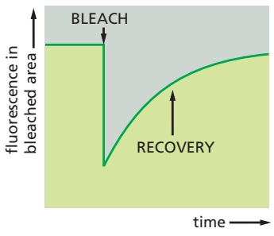

Figure 10–33 Measuring the rate of lateral diffusion of a membrane protein by fluorescence recovery after photobleaching. A specific protein of interest can be expressed as a fusion protein with green fluorescent protein (GFP), which is intrinsically fluorescent. The fluorescent molecules are bleached in a small area using a laser beam. The fluorescence intensity recovers as the bleached molecules diffuse away and unbleached molecules diffuse into the irradiated area (shown here in side and top views). The diffusion coefficient is calculated from a graph of the rate of recovery: the greater the diffusion coefficient of the membrane protein, the faster the recovery (see Figure 9–20 and Movie 10.6).

---

MEMBRANE PROTEINS

629

One drawback to the FRAP technique is that it monitors the movement of large populations of molecules in a relatively large area of membrane; one cannot follow individual protein molecules. If a protein fails to migrate into a bleached area, for example, one cannot tell whether the molecule is truly immobile or just restricted in its movement to a very small region of membrane—perhaps by cytoskeletal proteins. Single-particle tracking techniques overcome this problem by labeling individual membrane molecules with antibodies coupled to fluorescent dyes or tiny gold particles and tracking their movement by video microscopy. Using single-particle tracking, one can record the diffusion path of a single membrane protein molecule over time. Results from all of these techniques indicate that plasma membrane proteins differ widely in their diffusion characteristics, as we now discuss.

## Cells Can Confine Proteins and Lipids to Specific Domains Within a Membrane

The recognition that biological membranes are two-dimensional fluids was a major advance in understanding membrane structure and function. It has become clear, however, that the picture of a membrane as a lipid sea in which all proteins float freely is greatly oversimplified. Most cells confine membrane proteins to specific regions in a continuous lipid bilayer. We have already discussed how bacteriorhodopsin molecules in the purple membrane of Halobacterium assemble into large two-dimensional crystals, in which individual protein molecules are relatively fixed in relationship to one another (see Figure 10–30). ATP synthase complexes in the inner mitochondrial membrane associate into long double rows, as we discuss in Chapter 14 (see Figure 14–33). Large aggregates of this kind diffuse very slowly.

In epithelial cells, such as those that line the gut or the tubules of the kidney, certain plasma membrane enzymes and transport proteins are confined to the apical surface of the cells, whereas others are confined to the basal and lateral surfaces (**Figure 10–34**). This asymmetric distribution of membrane proteins is often essential for the function of the epithelium, as we discuss in Chapter 11 (see Figure 11–11). The lipid compositions of these two membrane domains are also different, demonstrating that epithelial cells can prevent the diffusion of lipid as well as protein molecules between the domains. The barriers set up by a specific type of intercellular junction (called a tight junction, discussed in Chapter 19; see Figure 19–18) maintain the separation of both protein and lipid molecules.

A cell can also create membrane domains without using intercellular junctions. As we already discussed, regulated protein–protein interactions in membranes can create nanometer-scale raft domains that are thought to function in signaling and membrane trafficking. A more extreme example is seen in the mammalian spermatozoon, a single cell that consists of several structurally and functionally distinct parts covered by a continuous plasma membrane. When a sperm cell is examined

Figure 10–34 How membrane molecules can be restricted to a particular membrane domain. In this drawing of an epithelial cell, protein A (in the apical domain of the plasma membrane) and protein B (in the basal and lateral domains) can diffuse laterally in their own domains but are prevented from entering the other domain, at least partly by the specialized cell–cell junction called a tight junction. Lipid molecules in the outer (extracellular) monolayer of the plasma membrane are likewise unable to diffuse between the two domains; lipids in the inner (cytosolic) monolayer, however, are able to do so (not shown). The basal lamina is a thin mat of extracellular matrix that separates epithelial sheets from other tissues (discussed in Chapter 19).

---

630

Chapter 10: Membrane Structure

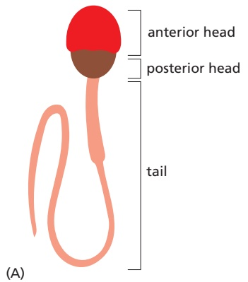

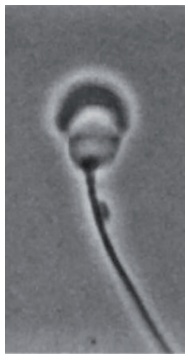

(B)

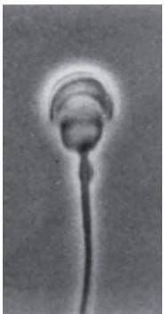

10 µm

Figure 10–35 Three domains in the plasma membrane of a guinea pig sperm. (A) A drawing of a guinea pig sperm. (B–D) In the three pairs of micrographs, phase-contrast micrographs are on the left, and the same cell is shown with cell-surface immunofluorescence staining on the right. Different monoclonal antibodies selectively label cell-surface molecules on (B) the anterior head, (C) the posterior head, and (D) the tail. (From D.G. Myles, P. Primakoff, and A.R. Belvé, Cell 23:433–439, 1981. With permission from Elsevier.)

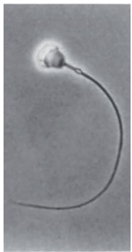

10 µm

(C)

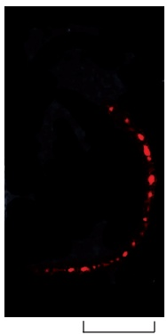

(D)

20 µm

by immunofluorescence microscopy with a variety of antibodies, each of which reacts with a specific cell-surface molecule, the plasma membrane is found to consist of at least three distinct domains (Figure 10–35). Some of the membrane molecules can diffuse freely within the confines of their own domain. While the molecular nature of most “fences” that prevent the molecules from leaving theirMBoC7 m10.35/10.35 domain is not known, some molecular mechanisms for restricting membrane protein movements are understood. The plasma membrane of nerve cells, for example, contains a domain enclosing the cell body and dendrites, and another enclosing the axon; in this case a belt of actin filaments tightly associates with the plasma membrane at the cell-body–axon junction and forms part of the barrier.

**Figure 10–36** shows four common ways of immobilizing specific membrane proteins through protein–protein interactions.

## The Cortical Cytoskeleton Gives Membranes Mechanical Strength and Restricts Membrane Protein Diffusion

As shown in Figure 10–36B and $\mathrm { C } ,$ a common way in which a cell restricts the lateral mobility of specific membrane proteins is to tether them to macromolecular assemblies on either side of the membrane. The characteristic biconcave shape of a red blood cell (**Figure 10–37**), for example, results from interactions of its plasma membrane proteins with an underlying cytoskeleton, which consists mainly of a meshwork of the filamentous protein **spectrin**. Spectrin is a long, thin, flexible rod about 100 nm in length. As the principal component of the red blood cell cytoskeleton, it maintains the structural integrity and shape of the plasma membrane, which is the cell’s only membrane, as the cell has no nucleus or other organelles. The spectrin cytoskeleton is attached to the membrane through various membrane proteins. The final result is a deformable, netlike meshwork that covers the entire cytosolic surface of the cell membrane (**Figure 10–38**). This spectrin-based cytoskeleton enables the red blood cell to withstand the stress on its membrane as it is forced through narrow capillaries. Mice and humans with genetic abnormalities in spectrin are anemic and have red blood cells that are

(A)

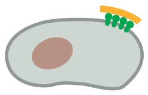

(B)

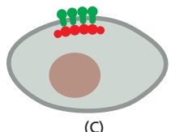

(C)

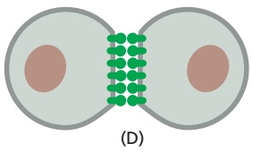

Figure 10–36 Four ways of restricting the lateral mobility of specific plasma membrane proteins. (A) The proteins can self-assemble into large aggregates (as seen for bacteriorhodopsin in the purple membrane of Halobacterium salinarum); they can be tethered by interactions with assemblies of macromolecules (B) outside or (C) inside the cell; or (D) they can interactMBoC7 m10.36/10.36 with proteins on the surface of another cell.

---

MEMBRANE PROTEINS

631

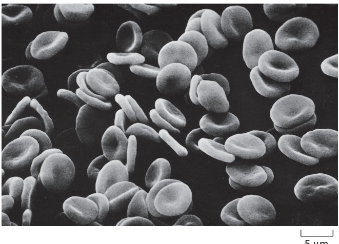

Figure 10–37 A scanning electron micrograph of human red blood cells. The cells have a biconcave shape and lack a nucleus and other organelles (Movie 10.7). (Courtesy of Bernadette Chailley.)

spherical (instead of concave) and fragile; the severity of the anemia increases with the degree of spectrin deficiency.

An analogous but much more elaborate and highly dynamic cytoskeletal network exists beneath the plasma membrane of most other cells in our body. This network, which constitutes the **cortex** of the cell, is rich in actin filaments, which are attached to the plasma membrane in numerous ways. The dynamic

Figure 10–38 The spectrin-based cytoskeleton on the cytosolic side of the human red blood cell plasma membrane. (A) The arrangement shown in the drawing has been deduced mainly from studies on the interactions of purified proteins in vitro. Spectrin heterodimers (enlarged in the drawing on the right) are linked together into a netlike meshwork by junctional complexes (enlarged in the drawing on the left). Each spectrin heterodimer consists of two antiparallel, loosely intertwined, flexible polypeptide chains called α and β. The two spectrin chains are attached noncovalently to each other at multiple points, including at both ends. Both the α and β chains are composed largely of repeating domains. Two spectrin heterodimers join end-to-end to form tetramers.

The junctional complexes are composed of short actin filaments (containing 13 actin monomers) and the proteins band 4.1 and adducin, as well as a tropomyosin molecule that probably determines the length of the actin filaments. The cytoskeleton is linked to the membrane through two transmembrane proteins: a multipass protein called band 3 and a single-pass protein called glycophorin. The spectrin tetramers bind to some band 3 proteins via ankyrin molecules, and to glycophorin and band 3 (not shown) via band 4.1 proteins.

(B) The electron micrograph shows the cytoskeleton on the cytosolic side of a red blood cell membrane after fixation and negative staining. The spectrin meshwork has been purposely stretched out to allow the details of its structure to be seen. In a normal cell, the meshwork shown would be much more crowded and occupy only about one-tenth of this area. (B, courtesy of T. Byers and D. Branton, Proc. Natl. Acad. Sci. USA 82:6153–6157, 1985.)

---

632

Chapter 10: Membrane Structure

Figure 10–39 Corralling plasma membrane proteins by cortical cytoskeletal filaments. (A) The filaments are thought to provide diffusion barriers that divide the membrane into small domains, or corrals. (B) High-speed, single-particle tracking was used to follow the path of a single fluorescently labeled membrane protein of one type over time. The trace shows that an individual protein molecule diffuses within tightly delimited membrane domains and only infrequently escapes into a neighboring domain (highlighted by a switch of color). (Adapted from A. Kusumi et al., Annu. Rev. Biophys. Biomol. Struct. 34:351–378, 2005. With permission from Annual Reviews.)

remodeling of the cortical actin network provides a driving force for many essential cell functions, including cell movement, endocytosis, and the formation of transient, mobile plasma membrane structures such as filopodia and lamellipodia discussed in Chapter 16. The cortex of nucleated cells also contains proteins that are structurally homologous to spectrin and the other components of the red cell cytoskeleton. We discuss the cortical cytoskeleton in nucleated cells and its interactions with the plasma membrane in Chapter 16.

The cortical cytoskeletal network restricts diffusion of plasma membrane proteins beyond those that are directly anchored to it. Because the cytoskeletal filaments are often closely apposed to the cytosolic surface of the plasma membrane, they can form mechanical barriers that obstruct the free diffusion of proteins in the membrane. These barriers partition the membrane into small domains, or corrals (**Figure 10–39A**), which can be either permanent, as in the sperm (see Figure 10–35), or transient. The barriers can be detected when the diffusion of individual membrane proteins is followed by high-speed, single-particle tracking. The proteins diffuse rapidly but are confined within an individual corral (**Figure 10–39B**); occasionally, however, thermal motions cause a few cortical filaments to detach transiently from the membrane, allowing the protein to escape into an adjacent corral.

The extent to which a transmembrane protein is confined within a corral depends on its association with other proteins and the size of its cytoplasmic domain; proteins with a large cytosolic domain will have a harder time passing through cytoskeletal barriers. When a cell-surface receptor binds its extracellular signal molecules, for example, large protein complexes build up on the cytosolic domain of the receptor, making it more difficult for the receptor to escape from its corral. It is thought that corralling helps concentrate such signaling complexes, increasing the speed and efficiency of the signaling process (discussed in Chapter 15).

## Membrane-bending Proteins Deform Bilayers

Cell membranes assume many different shapes, as illustrated by the elaborate and varied structures of cell-surface protrusions and membrane-enclosed organelles in eukaryotic cells. Flat sheets, narrow tubules, round vesicles, fenestrated sheets, and pita-bread–shaped cisternae are all part of the repertoire. Often, a variety of shapes will be present in different regions of the same continuous bilayer. Membrane shape is controlled dynamically, as many essential cell processes—including vesicle budding, cell movement, and cell division—require elaborate transient membrane deformations. In many cases, membrane shape is influenced by dynamic pushing and pulling forces exerted by cytoskeletal or extracellular structures, as we discuss in Chapters 13 and 16. A crucial part in producing these deformations is played by **membrane-bending proteins**, which control local membrane curvature. Often, cytoskeletal dynamics and membranebending-protein forces work together. Membrane-bending proteins attach to

---

MEMBRANE PROTEINS

633

specific membrane regions as needed and act by one or more of three principal mechanisms (**Figure 10–40**):

1. Some insert hydrophobic protein domains or attached lipid anchors into one of the leaflets of a lipid bilayer. Increasing the area of only one leaflet causes the membrane to bend (Figure 10–40B). The proteins that shape the convoluted network of narrow endoplasmic reticulum tubules work in this way (discussed in Chapter 12).

2. Some membrane-bending proteins form rigid scaffolds that deform theMB0C7 m10.40/10.40 membrane or stabilize an already bent membrane (Figure 10–40C). The coat proteins that shape the budding vesicles in intracellular transport fall into this class (discussed in Chapter 13).

Figure 10–40 Three ways in which membrane-bending proteins shape membranes. Lipid bilayers are gray and proteins are green. (A) Bilayer without protein bound. (B) A hydrophobic region of the protein can insert as a wedge into one monolayer to pry lipid head groups apart. Such regions can either be amphiphilic helices as shown or hydrophobic hairpins. (C) The curved surface of the protein can bind to lipid head groups and deform the membrane or stabilize its curvature. (D) A protein can bind to and cluster lipids that have large head groups and thereby bend the membrane. (Adapted from W.A. Prinz and J.E. Hinshaw, Crit. Rev. Biochem. Mol. Biol. 44:278–291, 2009.)

3. Asymmetric distribution of cone-shaped and inverted cone-shaped lipids in the inner or outer leaflets can cause membrane bending. Some membrane-bending proteins cause particular membrane lipids to cluster together, thereby inducing membrane curvature. The ability of a lipid to induce positive or negative membrane curvature is determined by the relative cross-sectional areas of its head group and its hydrocarbon tails. For example, the large head group of phosphoinositides make these lipid molecules wedge-shaped, and their accumulation in a domain of one leaflet of a bilayer therefore induces positive curvature (Figure 10–40D). By contrast, phospholipases that remove lipid head groups produce inversely shaped lipid molecules that induce negative curvature.

Often, different membrane-bending proteins collaborate to achieve a particular curvature, as in shaping a budding transport vesicle, as we discuss in Chapter 13.

## Summary

Whereas the lipid bilayer determines the basic structure of biological membranes, proteins are responsible for most membrane functions, serving as specific receptors, enzymes, transporters, and so on. Transmembrane proteins extend across the lipid bilayer. Some of these membrane proteins are single-pass proteins, in which the polypeptide chain crosses the bilayer as a single a helix. Others are multipass proteins, in which the polypeptide chain crosses the bilayer multiple times—either as a series of a helices or as a b sheet rolled up into the shape of a barrel. All proteins responsible for the transport of ions and other small water-soluble molecules through the membrane are multipass proteins. Some membrane proteins do not span the bilayer but instead are attached to either side of the membrane: some are attached to the cytosolic side by an amphipathic a helix on the protein surface or by the covalent attachment of one or more lipid chains, others are attached to the non-cytosolic side by a GPI anchor. Some membrane-associated proteins are bound by noncovalent interactions with transmembrane proteins. In the plasma membrane of all eukaryotic cells, most of the proteins exposed on the cell surface and some of the lipid molecules in the outer lipid monolayer have oligosaccharide chains covalently attached to them. Like the lipid molecules in the bilayer, many membrane proteins are able to diffuse rapidly in the plane of the membrane. However, cells have ways of immobilizing specific membrane proteins, as well as ways of confining both membrane protein and lipid molecules to particular domains in a continuous lipid bilayer. The dynamic association of membrane-bending proteins confers on membranes their characteristic three-dimensional shapes.

---

634

Chapter 10: Membrane Structure

## PROBLEMS

Which statements are true? Explain why or why not.

10–1 It is estimated that about 30% of the proteins encoded in an animal’s genome are membrane proteins that are required for a cell to function and interact with its environment.

10–2 All of the common phospholipids—phosphatidylcholine, phosphatidylethanolamine, phosphatidylserine, and sphingomyelin—carry a positively charged moiety on their head group, but none carry a net positive charge.

10–3 Although phospholipid molecules are free to diffuse in the plane of the bilayer, they cannot flip-flop across the bilayer unless enzyme catalysts called phospholipid translocators are present in the membrane.

10–4 Whereas all the carbohydrate in the plasma membrane faces outward on the external surface of the cell, all the carbohydrate on internal membranes faces toward the cytosol.

10–5 Although membrane domains with different protein compositions are well known, there are at present no examples of membrane domains that differ in lipid composition.

Discuss the following problems.

10–6 When a lipid bilayer is torn, why does it not seal itself by forming a “hemi-micelle” cap at the edges, as shown in **Figure Q10–1**?

Figure Q10–1 A torn lipid bilayer sealed with a hypothetical “hemimicelle” cap (Problem 10–6).

10–7 Which one of the following changes is energetically favorable and occurs spontaneously in an aqueous solution? A. Conversion of a membrane vesicle to a flat bilayer B. Dispersion of one oil droplet into many small ones C. Formation of a bilayer from phospholipid moleculesMBoC7 Q10.01 D. Formation of a long tear in a phospholipid bilayer

10–8 Hydrophobic solutes are said to “force the adjacent water molecules to reorganize into icelike cages” (**Figure Q10–2**). It seems paradoxical that water molecules do not interact with hydrophobic solutes, yet they seem to “know” about the presence of a hydrophobic solute and change their behavior to interact differently with one another. Why would such an icelike cage be energetically unfavorable relative to pure water?

A. An icelike cage gives water a higher temperature.

B. An icelike cage is less organized than pure water.

C. An icelike cage is unstable and easily breaks down.

D. An icelike cage reduces the entropy of the system.

Figure Q10–2 An icelike cage of water molecules around a hydrophobic solute (Problem 10–8).

10–9 Margarine is made from vegetable oil by a chemical process. Do you suppose this process converts saturated fatty acids to unsaturated ones or vice versa? Explain your answer.

10–10 If a lipid raft is typically 70 nm in diameter and each lipid molecule has a diameter of 0.5 nm, about howMBoC7 Q10.02 many lipid molecules would there be in a lipid raft composed entirely of lipid?

10-11 Each of the following lipid anchors is used to attach intracellular proteins to membranes except:

A. A farnesyl anchor

B. A GPI anchor

C. A myristoyl anchor

D. A palmitoyl anchor

10–12 Monomeric single-pass transmembrane proteins span a membrane with a single α helix that has characteristic chemical properties in the region of the bilayer. Which of the three 19-amino-acid sequences listed below is the most likely candidate for such a transmembrane segment? Explain the reasons for your choice. (See back of book for one-letter amino acid code; FAMILY VW is a convenient mnemonic for hydrophobic amino acids.)

A. I T E I Y F G R M A G V I G T D L I S B. I T L I Y F G V M A G V I G T I L I S C. I T P I Y F G P M A G V I G T P L I S

---

REFERENCES

635

10–13 You are studying the binding of proteins to the cytoplasmic face of cultured neuroblastoma cells and have found a method that gives a good yield of inside-out vesicles from the plasma membrane. Unfortunately, your preparations are contaminated with variable amounts of right-side-out vesicles. Nothing you have tried avoids this problem. A friend suggests that you pass your vesicles over an affinity column made of lectin coupled to solid beads. What is the point of your friend’s suggestion?

10–14 Glycophorin, a protein in the plasma membrane of red blood cells, normally exists as a homodimer that is held together entirely by interactions between its transmembrane domains. As transmembrane domains are hydrophobic, how is it that they can associate with one another so specifically?

10–15 Three mechanisms by which membrane-binding proteins bend a membrane are illustrated in **Figure Q10–3A, B, and C**. As shown, each of these cytosolic membrane-bending proteins would induce an invagination of the plasma membrane. Could similar kinds of cytosolic proteins induce a protrusion of the plasma membrane (**Figure Q10–3D**)? Which ones? Explain how they might work.

(C)

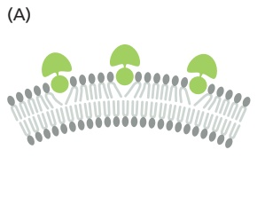

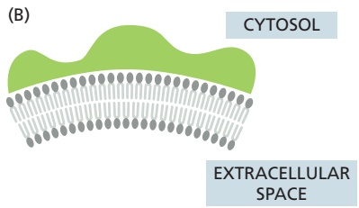

(D)

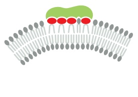

Figure Q10–3 Bending of the plasma membrane by cytosolic proteins (Problem 10–15). (A) Insertion of a protein “finger” into the cytosolic leaflet of the membrane. (B) Binding of lipids to the curved surface of a membrane-binding protein. (C) Binding of membrane proteins to membrane lipids with large head groups. (D) A segment of the plasma membrane showing a protrusion.

## REFERENCES

## General

Bretscher MS (1973) Membrane structure: some general principles. Science 181, 622–629.

Edidin M (2003) Lipids on the frontier: a century of cell-membrane bilayers. Nat. Rev. Mol. Cell Biol. 4, 414–418.

Goñi FM (2014) The basic structure and dynamics of cell membranes: an update of the Singer-Nicolson model. Biochim. Biophys. Acta 1838, 1467–1476.

Langmuir I (1917) The constitution and fundamental properties of solids and liquids II: liquids. J. Am. Chem. Soc. 39, 1848–1906.

Pockets A (1891) Surface tension. Nature 43, 437–439.

Singer SJ & Nicolson GL (1972) The fluid mosaic model of the structure of cell membranes. Science 175, 720–731.

Tanford C (1980) The Hydrophobic Effect: Formation of Micelles and Biological Membranes. New York: Wiley.

Tanford C (2004) Ben Franklin Stilled the Waves. New York: Oxford University Press.

## The Lipid Bilayer

Antonny B, Vanni S, Shindou H & Ferreira T (2016) From zero to six double bonds: phospholipid unsaturation and organelle function. Trends Cell Biol. 25, 427–436.

Brügger B (2014) Lipidomics: analysis of the lipid composition of cells and subcellular organelles by electrospray ionization mass spectrometry. Annu. Rev. Biochem. 83, 79–98.

Chung J, Wu X, Lambert TJ . . . Farese RV, Jr (2019) LDAF1 and seipin form a lipid droplet assembly complex. Dev. Cell 51, 551–563.

Clarke RJ, Hossain KR & Cao K (2020) Physiological roles of transverse lipid asymmetry of animal membranes. Biochim. Biophys. Acta Biomembr. 1862, 183382.

Cornell CE, Mileant A, Thakkar N . . . Keller SL (2020) Direct imaging of liquid domains in membranes by cryo-electron tomography. Proc. Natl. Acad. Sci. USA 117, 19713–19719.

Hakomori SI (2002) The glycosynapse. Proc. Natl. Acad. Sci. USA 99, 225–232.

Harayama T & Riezman H (2018) Understanding the diversity of membrane lipid composition. Nat. Rev. Mol. Cell Biol. 19, 281–296.

Heberle FA, Doktorova M, Scott HL . . . Levental I (2020) Direct label-free imaging of nanodomains in biomimetic and biological membranes by cryogenic electron microscopy. Proc. Natl. Acad. Sci. USA 117, 19943–19952.

Ichikawa S & Hirabayashi Y (1998) Glucosylceramide synthase and glycosphingolipid synthesis. Trends Cell Biol. 8, 198–202.

Kornberg RD & McConnell HM (1971) Lateral diffusion of phospholipids in a vesicle membrane. Proc. Natl. Acad. Sci. USA 68, 2564–2568.

Lingwood D & Simons K (2010) Lipid rafts as a membrane-organizing principle. Science 327, 46–50.

Mansilla MC, Cybulski LE, Albanesi D & de Mendoza D (2004) Control of membrane lipid fluidity by molecular thermosensors. J. Bacteriol. 186, 6681–6688.

Maxfield FR & van Meer G (2010) Cholesterol, the central lipid of mammalian cells. Curr. Opin. Cell Biol. 22, 422–429.

Munro S (2003) Lipid rafts: elusive or illusive? Cell 115, 377–388.

Pomorski TG & Menon AK (2016) Lipid somersaults: uncovering the mechanisms of protein-mediated lipid flipping. Prog. Lipid Res. 64, 69–84.

Rothman JE & Lenard J (1977) Membrane asymmetry. Science 195, 743–753.

Walther TC & Farese RV, Jr (2017) Lipid droplet biogenesis. Annu. Rev. Cell Dev. Biol. 33, 491–510.

## Membrane Proteins

Agasid MT & Robinson CV (2021) Probing membrane protein-lipid interactions. Curr. Opin. Struct. Biol. 69, 78–85.

---

636

Chapter 10: Membrane Structure

Bennett V & Baines AJ (2001) Spectrin and ankyrin-based pathways: metazoan inventions for integrating cells into tissues. Physiol. Rev. 81, 1353–1392.

Bijlmakers MJ & Marsh M (2003) The on-off story of protein palmitoylation. Trends Cell Biol. 13, 32–42.

Bretscher MS & Raff MC (1975) Mammalian plasma membranes. Nature 258, 43–49.

Buchanan SK (1999) Beta-barrel proteins from bacterial outer membranes: structure, function and refolding. Curr. Opin. Struct. Biol. 9, 455–461.

Chen Y, Lagerholm BC, Yang B & Jacobson K (2006) Methods to measure the lateral diffusion of membrane lipids and proteins. Methods 39, 147–153.

Corin K & Bowie JU (2020) How bilayer properties influence membrane protein folding. Protein Sci. 29(12), 2348–2362.

Curran AR & Engelman DM (2003) Sequence motifs, polar interactions and conformational changes in helical membrane proteins. Curr. Opin. Struct. Biol. 13, 412–417.

Deisenhofer J & Michel H (1991) Structures of bacterial photosynthetic reaction centers. Annu. Rev. Cell Biol. 7, 1–23.

Drickamer K & Taylor ME (1998) Evolving views of protein glycosylation. Trends Biochem. Sci. 23, 321–324.

Giménez-Andrés M, Copi č A & Antonny B (2018) The many faces of ˇ amphipathic helices. Biomolecules 8, 45.

Helenius A & Simons K (1975) Solubilization of membranes by detergents. Biochim. Biophys. Acta 415, 29–79.

Henderson R & Unwin PN (1975) Three-dimensional model of purple membrane obtained by electron microscopy. Nature 257, 28–32.

Hite RK, Gonen T, Harrison SC & Walz T (2008) Interactions of lipids with aquaporin-0 and other membrane proteins. Pflugers Arch. 456, 651–661.

Kyte J & Doolittle RF (1982) A simple method for displaying the hydropathic character of a protein. J. Mol. Biol. 157, 105–132.

Lee AG (2003) Lipid-protein interactions in biological membranes: a structural perspective. Biochim. Biophys. Acta 1612, 1–40.

Marchesi VT, Furthmayr H & Tomita M (1976) The red cell membrane. Annu. Rev. Biochem. 45, 667–698.

Nakada C, Ritchie K, Oba Y . . . Kusumi A (2003) Accumulation of anchored proteins forms membrane diffusion barriers during neuronal polarization. Nat. Cell Biol. 5, 626–632.

Oesterhelt D (1998) The structure and mechanism of the family of retinal proteins from halophilic archaea. Curr. Opin. Struct. Biol. 8, 489–500.

Popot J-L (2010) Amphipols, nanodiscs, and fluorinated surfactants: three nonconventional approaches to studying membrane proteins in aqueous solution. Annu. Rev. Biochem. 79, 737–775.

Prinz WA & Hinshaw JE (2009) Membrane-bending proteins. Crit. Rev. Biochem. Mol. Biol. 44, 278–291.

Sezgin E, Levental I, Mayor S & Eggeling C (2017) The mystery of membrane organization: composition, regulation and roles of lipid rafts. Nat. Rev. Mol. Cell Biol. 18, 361–374.

Sharon N & Lis H (2004) History of lectins: from hemagglutinins to biological recognition molecules. Glycobiology 14, 53R–62R.

Sheetz MP (2001) Cell control by membrane-cytoskeleton adhesion. Nat. Rev. Mol. Cell Biol. 2, 392–396.

Shibata Y, Hu J, Kozlov MM & Rapoport TA (2009) Mechanisms shaping the membranes of cellular organelles. Annu. Rev. Cell Dev. Biol. 25, 329–354.

Steck TL (1974) The organization of proteins in the human red blood cell membrane. A review. J. Cell Biol. 62, 1–19.

Subramaniam S (1999) The structure of bacteriorhodopsin: an emerging consensus. Curr. Opin. Struct. Biol. 9, 462–468.

Vinothkumar KR & Henderson R (2010) Structures of membrane proteins. Q. Rev. Biophys. 43, 65–158.

von Heijne G (2011) Membrane proteins: from bench to bits. Biochem. Soc. Trans. 39, 747–750.

White SH & Wimley WC (1999) Membrane protein folding and stability: physical principles. Annu. Rev. Biophys. Biomol. Struct. 28, 319–365.

Zhang Y, Daday C, Gu RX . . . Walz T (2021) Visualization of the mechanosensitive ion channel MscS under membrane tension. Nature 590, 509–514.