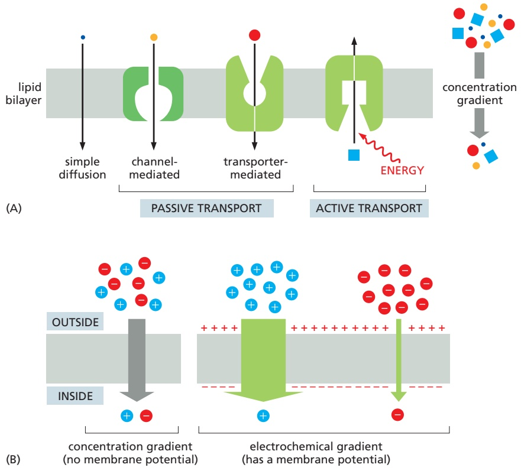
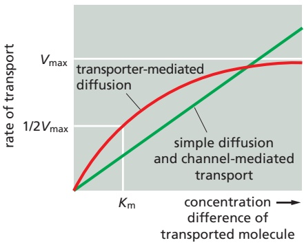
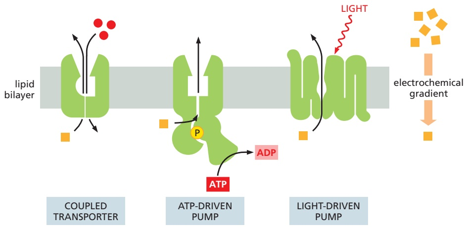
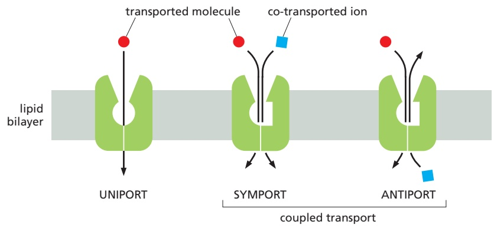
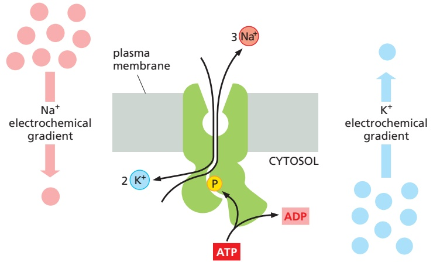

637

# Small-Molecule Transport and Electrical Properties of Membranes

Because of its hydrophobic interior, the lipid bilayer of cell membranes restricts the passage of most polar molecules. This barrier function allows the cell to maintain concentrations of solutes in its cytosol that differ from those in the extracellular fluid and in each of the intracellular membrane-enclosed compartments. To benefit from this barrier, however, cells have had to evolve ways of transferring specific water-soluble molecules and ions across their membranes in order to ingest essential nutrients, excrete metabolic waste products, and regulate intracellular ion concentrations. Cells use specialized membrane transport proteins to accomplish this goal. The importance of such small-molecule transport is reflected in the large number of genes in all organisms that code for the transmembrane transport proteins involved, which make up 15–30% of the membrane proteins in all cells. Some mammalian cells, such as nerve and kidney cells, devote up to two-thirds of their total metabolic energy consumption to such transport processes.

Cells can also transfer macromolecules and even large particles, such as cell debris, viruses, and bacteria, across their membranes, but the mechanisms involved in most of these cases differ from those used for transferring small molecules, and they are discussed in Chapters 12 and 13.

We begin this chapter by describing some general principles of how small water-soluble molecules traverse cell membranes. We then consider, in turn, the two main classes of membrane proteins that mediate this transmembrane traffic: transporters, which undergo sequential conformational changes to transport specific small molecules across membranes, and channels, which form narrow pores, allowing passive transmembrane movement, primarily of water and small inorganic ions. Transporters can be coupled to a source of energy to catalyze active transport, which, together with selective passive permeability, creates large differences in the composition of the cytosol compared with that of either the extracellular fluid (**Table 11–1**) or the fluid within membrane-enclosed organelles. By generating inorganic ion–concentration differences across the lipid bilayer, cell membranes can store potential energy in the form of electrochemical gradients, which drive various transport processes, convey electrical signals in electrically excitable cells, and (in mitochondria, chloroplasts, and bacteria) are harnessed to make most of the cell’s ATP. We focus our discussion mainly on transport across the plasma membrane, but similar mechanisms operate across the other membranes of the eukaryotic cell, as discussed in later chapters.

In the last part of the chapter, we concentrate mainly on the functions of ion channels in neurons (nerve cells). In these cells, channel proteins perform at their highest level of sophistication, enabling networks of neurons to carry out all the astonishing feats your brain is capable of.

## PRINCIPLES OF MEMBRANE TRANSPORT

We begin this section by describing the permeability properties of an artificial membrane—a synthetic lipid bilayer made solely from lipids without proteins present. We then introduce some of the terms used to describe the various forms of membrane transport and some strategies for characterizing the proteins and processes involved.

C HAP T E R

11

IN THIS CHAPTER

Principles of Membrane Transport

Transporters and Active Membrane Transport

Channels and the Electrical Properties of Membranes

---

638

Chapter 11: Small-Molecule Transport and Electrical Properties of Membranes

TABLE 11–1 A Comparison of Inorganic Ion Concentrations Inside and Outside a Typical Mammalian Cell\*

<table><tbody><tr><td colspan="3">a Typical Mammalian Cell*</td></tr><tr><td>Component</td><td>Cytoplasmic concentration (mM)</td><td>Extracellular concentration (mM)</td></tr><tr><td colspan="3">Cations</td></tr><tr><td>Na+</td><td>5-15</td><td>145</td></tr><tr><td>K+</td><td>140</td><td>5</td></tr><tr><td>Mg2+</td><td>0.5</td><td>1-2</td></tr><tr><td>Ca2+</td><td>10-4</td><td>1-2</td></tr><tr><td>H+</td><td>7 × 10-5 (10-7.2 M or pH 7.2)</td><td>4 × 10-5 (10-7.4 M or pH 7.4)</td></tr><tr><td colspan="3">Anions</td></tr><tr><td>Cl-</td><td>5-15</td><td>110</td></tr><tr><td colspan="3">*The cell must contain equal quantities of positive and negative charges (that is, it must be electrically neutral). Thus, in addition to Cl-, the cell contains many other anions not listed in this table; in fact, most cell constituents are negatively charged (HCO3-, PO43-, nucleic acids, metabolites carrying phosphate and carboxyl groups, etc.). The concentrations of Ca2+ and Mg2+ given are for the free ions: although there is a total of about 20 mM Mg2+ and 1-2 mM Ca2+ in cells, both ions are mostly bound to other substances (such as proteins, free nucleotides, RNA, etc.) and, for Ca2+, stored within various organelles (such as the endoplasmic reticulum and mitochondria).</td></tr></tbody></table>

## Protein-free Lipid Bilayers Are Impermeable to Ions

Given enough time, virtually any molecule will diffuse down its concentration gradient across a protein-free lipid bilayer. The rate of diffusion, however, varies enormously, depending partly on the size of the molecule but mostly on its relative hydrophobicity (solubility in oil). In general, the smaller the molecule and the more hydrophobic, or nonpolar, it is, the more easily it will diffuse across a lipid bilayer. Small nonpolar molecules, such as $\mathrm { O } _ { 2 }$ and $\mathrm { C O _ { 2 } } ,$ readily dissolve in lipid bilayers and therefore diffuse rapidly across them. Small uncharged polar molecules, such as water or urea, also diffuse across a bilayer, albeit much more slowly (**Figure 11–1** and see Movie 10.3). By contrast, lipid bilayers are essentially impermeable to charged molecules (ions), no matter how small: the charge and high degree of hydration of such molecules prevent them from entering the hydrocarbon phase of the bilayer (**Figure 11–2**).

## There Are Two Main Classes of Membrane Transport Proteins: Transporters and Channels

Like synthetic lipid bilayers, cell membranes allow small nonpolar molecules to permeate by diffusion. Cell membranes, however, also have to allow the passage of various polar molecules, such as ions, sugars, amino acids, nucleotides, water, and many cell metabolites that cross synthetic lipid bilayers only very slowly. Special **membrane transport proteins** transfer such solutes across cell membranes. These proteins occur in many forms and in all types of biological membranes. Each protein often transports only a specific molecular species or sometimes a class of molecules (such as ions, sugars, or amino acids). Early studies found that bacteria with a single-gene mutation were unable to transport a particular class of sugars across their plasma membrane, thereby demonstrating the specificity of membrane transport proteins. We now know that humans with similar mutations suffer from various inherited diseases that hinder the transport of a specific solute or solute class in the kidney, intestine, or other cell type. Individuals with the inherited disease cystinuria, for example, cannot transport certain amino acids

Figure 11–1 The relative permeability of a synthetic lipid bilayer to different classes of molecules. The smaller the MBoC7 m11.01/11.01molecule and, more important, the less strongly it associates with water, the more rapidly the molecule diffuses across the bilayer.

---

PRINCIPLES OF MEMBRANE TRANSPORT

639

Figure 11–2 Permeability coefficients for the passage of various molecules through synthetic, protein-free lipid bilayers. The rate of flow of a solute across the bilayer is directly proportional to the difference in its concentration on the two sides of the membrane. Multiplying this concentration difference (in mol/cm3) by the permeability coefficient (in cm/sec), which is an experimentally determined constant characteristic of each solute, gives the flow of solute in moles per second per square centimeter of bilayer. A concentration difference of tryptophan of 10–4 mol/ cm3 (10–4 mol/10–3 L = 0.1 M), for example, would cause a flow of 10–4 mol/cm3 × 10–7 cm/ $\mathtt { s e c } = 1 0 ^ { - 1 \top }$ mol/sec through 1 $\mathrm { c m ^ { 2 } }$ of bilayer, o $\mathsf { r }   6 \times 1 0 ^ { 4 }$ molecules/sec through 1 $\mu m ^ { 2 }$ of bilayer.

(including cystine, the disulfide-linked dimer of cysteine) from either the urine or the intestine into the blood; the resulting accumulation of cystine in the urine leads to the formation of cystine stones in the kidneys.

All membrane transport proteins that have been studied in detail are multipass transmembrane proteins; that is, their polypeptide chains traverse the lipid bilayer two or more times. By forming a protein-lined pathway across the membrane, these proteins enable specific hydrophilic solutes to cross the membrane without coming into direct contact with the hydrophobic interior of the lipid bilayer.

Transporters and channels are the two major classes of membrane transport proteins (**Figure 11–3**). **Transporters** (sometimes called carriers or permeases) bind the specific solute to be transported and undergo a series of conformational changes that alternately expose solute-binding sites on one side of the membrane and then on the other side to transfer the solute across it. **Channels**, by contrast, interact much more transiently with the solute to be transported. When opened by conformational changes, channels form continuous pores that extend across the lipid bilayer. The pores allow specific solutes (such as inorganic ions of appropriate size and charge, and in some cases small molecules, including water, glycerol, and ammonia) to pass through them and thereby cross the membrane. Because no stepwise conformational changes are required once a channel is opened, it is not surprising that transport through channels occurs at a much faster rate than transport mediated by transporters. Although water can slowly diffuse across synthetic lipid bilayers, cells use dedicated channel proteins (called water channels, or aquaporins) that greatly increase the permeability of their membranes to water, as we discuss later.

## Active Transport Is Mediated by Transporters Coupled to an Energy Source

All channels and some transporters allow solutes to cross the membrane only passively (“downhill”), a process called **passive transport**. In the case of transport of a single uncharged molecule, the difference in the concentration on the two sides of the membrane—its concentration gradient—drives passive transport and determines its direction (**Figure 11–4A**). If the solute carries a net charge, however, both its concentration gradient and the electrical potential difference across the membrane, the membrane potential, influence its transport. The concentration gradient and the electrical gradient combine to form a net driving force, the **electrochemical gradient**, for each charged solute (**Figure 11–4B**). We discuss electrochemical gradients in more detail later and in Chapter 14. In fact, almost all plasma membranes have an electrical potential difference (that is, a voltage) across them, with the inside usually negative with respect to the outside. This

Figure 11–3 Transporters and channel proteins. (A) A transporter alternates between two conformations, so that the solute-binding site of the transporter is sequentially accessible on one side of the bilayer and then on the other. (B) In contrast, a channel protein forms a pore across the bilayer through which specific solutes can passively diffuse.

---

640

Chapter 11: Small-Molecule Transport and Electrical Properties of Membranes

Figure 11–4 Different forms of membrane transport and the influence of the membrane. (A) Passive transport down a concentration gradient (or an electrochemical gradient—see panel B) occurs spontaneously, by diffusion, either through the lipid bilayer directly or through channels or passive transporters. By contrast, active transport involves movement of the solute against its concentration or electrochemical gradient and hence requires an input of metabolic energy. (B) The electrochemical gradient of a charged solute (an ion) affects its transport. This gradient (green) combines the membrane potential and the concentration gradient of the solute. The electrical and chemical gradients can work additively to increase the driving force on an ion across the membrane (middle) or they can work against each other (right).

potential favors the entry of positively charged ions into the cell but opposes the entry of negatively charged ions (see Figure 11–4B); it also opposes the efflux of positively charged ions.

In addition to passive transport, cells need to be able to actively pump certain solutes across the membrane “uphill,” against their electrochemical gradients. Such **active transport** is mediated by transporters whose pumping activity is directional because it is tightly coupled to a source of metabolic energy, such as an ion gradient or ATP hydrolysis, as discussed later. Transmembrane movement of small molecules mediated by transporters can be either active or passive, whereas that mediated by channels is always passive (see Figure 11–4A).

## Summary

Lipid bilayers are virtually impermeable to most polar molecules. To transport small water-soluble molecules into or out of cells or intracellular membraneenclosed compartments, cell membranes contain various membrane transport proteins, each of which is responsible for transferring a particular solute or class of solutes across the membrane. There are two types of membrane transport proteins— transporters and channels. Both form protein pathways across the lipid bilayer. Whereas transmembrane movement mediated by transporters can be either active or passive, solute flow through channel proteins is always passive. Ion transport across the membrane is influenced by the ion’s concentration gradient and the membrane potential; that is, its electrochemical gradient.

## TRANSPORTERS AND ACTIVE MEMBRANE TRANSPORT

The process by which a transporter transfers a solute molecule across the lipid bilayer resembles an enzyme–substrate reaction, and in many ways transporters behave like enzymes. In contrast to ordinary enzyme–substrate reactions, however, the transporter does not modify the transported solute but instead delivers it unchanged to the other side of the membrane.

---

TRANSPORTERS AND ACTIVE MEMBRANE TRANSPORT

641

Each type of transporter has one or more specific binding sites for its solute (substrate). It transfers the solute across the lipid bilayer by undergoing reversible conformational changes that alternately expose the solute-binding site firstMB C7 11.05/11.05 on one side of the membrane and then on the other side—but never on both sides at the same time. The transition occurs through an intermediate state in which the solute is inaccessible, or occluded, from either side of the membrane (**Figure 11–5**). When the transporter is saturated (that is, when all solute-binding sites are occupied), the rate of transport is maximal. This rate, referred to as $V _ { \mathrm { m a x } }$ (V for velocity), is characteristic of the specific carrier. $V _ { \mathrm { m a x } }$ is the maximal rate at which the carrier can flip between its conformational states. In addition, each transporter has a characteristic affinity for its solute, reflected in the $K _ { \mathrm { m } }$ of the reaction, which is equal to the concentration of solute when the transport rate is half its maximum value (**Figure 11–6**). As with enzymes, the binding of solute can be blocked by either competitive inhibitors (which compete for the same binding site and may or may not be transported) or noncompetitive inhibitors (which bind elsewhere and alter the structure of the transporter).

As we discuss shortly, conceptually it requires only a relatively minor modification of the mechanism shown in Figure 11–5 to link a transporter to a source of energy in order to pump a solute uphill against its electrochemical gradient. Cells carry out such active transport in three main ways (**Figure 11–7**):

1. Coupled transporters harness the energy stored in concentration gradients to couple the uphill transport of one solute across the membrane to the downhill transport of another.

2. ATP-driven pumps couple uphill transport to the hydrolysis of ATP.

3. Light- or redox-driven pumps, which are known in bacteria, archaea, mitochondria, and chloroplasts, couple uphill transport to an input of energy from light, as with bacteriorhodopsin and photosystem II (discussed in Chapters 10 and 14, respectively), or from a redox reaction, as with cytochrome c oxidase (discussed in Chapter 14).

Comparisons of amino acid sequences and three-dimensional structures suggest that, in many cases, there are strong similarities in structure between transporters that mediate active transport and those that mediate passive transport. Some bacterial transporters, for example, that use the energy stored in the $\mathrm { \bar { H } ^ { + } }$ gradient across the plasma membrane to drive the active uptake of various sugars are structurally similar to the transporters that mediate passive glucose transport into most animal cells. There is thus a clear evolutionary relationship between various transporters. Given the cell’s essential need to transport small metabolites across membranes, it comes as no surprise that the superfamily of transporters is a large and ancient one.

We begin our discussion of active membrane transport by considering a class of coupled transporters that are driven by ion-concentration gradients. These proteins have a crucial role in the transport of small metabolites across membranes in all cells. We then discuss ATP-driven pumps, including the $\mathrm { { N a } ^ { + } \mathrm { { \cdot } K ^ { + } } }$ pump that is found in the plasma membrane of most animal cells. Examples of the third class of active transport—light- or redox-driven pumps—are discussed in Chapter 14.

Figure 11–5 A model of how a conformational change in a transporter mediates the passive movement of a solute. The transporter is shown in three conformational states: in the outwardopen state, the binding sites for solute are exposed on the outside; in the occluded state, the same sites are not accessible from either side; and in the inward-open state, the sites are exposed on the inside. The transitions between the states occur randomly. They are completely reversible and do not depend on whether the solutebinding site is occupied. Therefore, if the solute concentration is higher on the outside of the bilayer, more solute binds to the transporter in the outward-open conformation than in the inward-open conformation, and there is a net transport of solute down its concentration gradient (or, if the solute is an ion, down its electrochemical gradient).

Figure 11–6 The kinetics of simple diffusion compared with transportermediated diffusion. Whereas the rate of simple diffusion and of channel-mediated transport is directly proportional to the solute concentration (within the physical limits imposed by total surface area or total MBoC7 m11.06/11.06channels available), the rate of transportermediated diffusion approaches a maximum $( V _ { \mathsf { m a x } } )$ as the transporter reaches saturation. The solute concentration when the transport rate is at half its maximal value is termed its $K _ { \mathrm { m } }$ and is analogous to the $K _ { \mathrm { m } }$ of an enzyme for its substrate. Note that, while the graph illustrates the shape of the curves, their absolute scale on the Y axis is very different. A typical channel conducts water or ions at rates of up to 108 per second, whereas a typical transporter moves solutes at rates between 102 and 104 molecules per second.

---

642

Chapter 11: Small-Molecule Transport and Electrical Properties of Membranes

Figure 11–7 Three ways of driving active transport. The actively transported molecule is shown in orange, and the energy source is shown in red. Redoxdriven active transport is discussed in Chapter 14 (see Figures 14–18 and 14–19).

Active Transport Can Be Driven by Ion-Concentration Gradients

Some transporters simply facilitate the passive movement of a single solute from one side of the membrane to the other at a rate determined by their $V _ { \mathrm { m a x } }$ and $K _ { \mathrm { m } } ;$ they are called **uniporters**. Others function as coupled transporters, in which the transfer of one solute strictly depends on the transport of a second. CoupledMBoC7 m11.07/11.07 transport involves either the intimately coupled transfer of a second solute in the same direction, performed by **symporters** (also called co-transporters), or the transfer of a second solute in the opposite direction, performed by **antiporters** (also called exchangers) (**Figure 11–8**).

The tight coupling between the transfer of two solutes allows the coupled transporters to harvest the energy stored in the electrochemical gradient of one solute, typically an inorganic ion, to transport the other. In this way, the free energy released during the movement of an inorganic ion or $\mathrm { H } ^ { + }$ down an electrochemical gradient is used as the driving force to pump other solutes uphill, against their electrochemical gradient. This strategy can work in either direction; some coupled transporters function as symporters, others as antiporters. In the plasma membrane of animal cells, $\mathrm { { N a } ^ { + } }$ is the usual co-transported ion because its electrochemical gradient provides a large driving force for the active transport of a second molecule. Such ion-driven coupled transporters are said to mediate secondary active transport. The $\mathrm { N a } ^ { + }$ that enters the cell during coupled transport is subsequently pumped out by an ATP-driven $\mathrm { { N a } ^ { + } \mathrm { { \cdot } K ^ { + } } }$ pump in the plasma membrane (as we discuss later), which, by exchanging $\mathrm { K } ^ { + }$ for $\mathrm { N a } ^ { + }$ , maintains the $\mathrm { N a } ^ { + }$ gradient, indirectly driving the coupled transport. Such ATP-driven pumps are therefore said to mediate primary active transport because in these the free energy of ATP hydrolysis is used to directly drive the transport of a solute against its electrochemical gradient. The energy stored in the gradient is then used to fuel the secondary active transport processes.

Intestinal and kidney epithelial cells contain a variety of symporters that are driven by the $\mathrm { N a } ^ { + }$ gradient across the plasma membrane. Each $\mathrm { { N a } ^ { + } }$ -driven

Figure 11–8 This schematic diagram shows transporters functioning as uniporters, symporters, and antiporters (Movie 11.1).

---

TRANSPORTERS AND ACTIVE MEMBRANE TRANSPORT

643

Figure 11–9 Mechanism of glucose transport fueled by an Na+ gradient. As in the model shown in Figure 11–5, the transporter alternates between inward-open and outward-open states via occluded intermediate states. Binding of Na+ and glucose is cooperative; that is, the binding of either solute increases the protein’s affinity for the other. Because the Na+ concentration is much higher in the extracellular space than in the cytosol, glucose is more likely to bind to the transporter in the outward-facing state. The transition to the occluded state occurs only when both Na+ and glucose are bound; their precise interactions in the solute-binding sites slightly stabilize the occluded state and thereby make this transition energetically favorable. Stochastic fluctuations caused by thermal energy drive the transporter randomly into the inward-open or outward-open conformation. If it opens outwardly, nothing is achieved, and the process starts all over. However, whenever it opens inwardly, Na+ dissociates quickly in the low-Na+-concentration environment of the cytosol. Glucose dissociation is likewise enhanced when Na+ is lost, because of cooperativity in binding of the two solutes. The overall MBoC7 m11.09/11.09result is the net transport of both Na+ and glucose into the cell. Because the occluded state is not formed when only one of the solutes is bound, the transporter switches conformation only when it is fully occupied or fully empty, thereby ensuring strict coupling of the transport of Na+ and glucose.

symporter is specific for importing a small group of related sugars or amino acids into the cell. Because the Na+ tends to move into the cell down its electrochemical gradient, the sugar or amino acid is, in a sense, “dragged” into the cell with it. The greater the electrochemical gradient for Na+, the more solute is transported into the cell (**Figure 11–9**). Neurotransmitters (released by nerve cells to signal at synapses—as we discuss later) are taken up again by Na+ symporters after their release. This both terminates their signaling to postsynaptic cells and recycles them for reuse. These neurotransmitter transporters are important drug targets: stimulants, such as cocaine and antidepressants, inhibit them and thereby prolong signaling by the neurotransmitters because they are not cleared efficiently.

Despite their great variety, transporters share structural features that can explain how they function and how they evolved. Transporters are typically built from bundles of 10 or more α helices that span the membrane. Solute- and ionbinding sites are located midway through the membrane, where some helices are broken or distorted and amino acid side chains and polypeptide backbone atoms form ion- and solute-binding sites. In the inward-open and outward-open conformations, these binding sites are accessible by passageways from one side of the membrane but not the other. In switching between the two conformations, the transporter protein transiently adopts an occluded conformation, in which both passageways are closed; this prevents the driving ion and the transported solute from crossing the membrane unaccompanied, which would deplete the cell’s energy store to no purpose. Because only transporters with both types of binding sites appropriately filled change their conformation, tight coupling between ion and solute transport is ensured.

Like enzymes, transporters can work in the reverse direction if ion and solute gradients are appropriately adjusted experimentally. This chemical symmetry is mirrored in their physical structure. Protein structural analyses have revealed that many transporters are built from inverted repeats: the packing of the transmembrane α helices in one half of the helix bundle is structurally similar to the packing in the other half, but the two halves are inverted in the membrane relative to each other. Transporters are therefore said to be pseudosymmetric, and the

---

644

Chapter 11: Small-Molecule Transport and Electrical Properties of Membranes

Figure 11–10 Transporters are built from inverted repeats. (A) LeuT, a bacterial Na+/leucine symporter related to human neurotransmitter transporters, such as the serotonin transporter, is shown. The core of the transporter is built from two bundles, each composed of six α helices (blue and yellow). The helices shown in light gray are additions to the conserved core structure and differ among members of this transporter family. They are thought to play regulatory roles that are specific to a particular transporter. (B) Both core helix bundles are packed in a similar arrangement, but the second bundle is inverted with respect to the first (shown as two right hands, with the broken helices as the thumbs). The transporter’s structural pseudosymmetry reflects its functional symmetry: the transporter can work in either direction, depending on the direction of the ion gradient. (A, PDB code: 3F3E.)

passageways that open and close on either side of the membrane have closely similar geometries, allowing alternating access to the ion- and solute-binding sites in the center (**Figure 11–10**). It is thought that the two halves evolved by gene duplication of a smaller ancestor protein.

Some other types of important membrane transport proteins are also built from inverted repeats. Examples even include channel proteins such as the aquaporinMBoC7 m11.10/11.10 water channel (discussed later) and the Sec61 channel through which nascent polypeptides move into the endoplasmic reticulum (discussed in Chapter 12). It is thought that these channels evolved from coupled transporters in which the gating functions were lost, allowing them to open toward both sides of the membrane simultaneously to provide a continuous path across the membrane.

In bacteria, yeasts, and plants, as well as in many membrane-enclosed organelles of animal cells, most ion-driven active transport systems depend on $\mathrm { H } ^ { + }$ rather than $\mathrm { N a } ^ { + }$ gradients, reflecting the predominance of $\mathrm { H } ^ { + }$ pumps in these membranes. An electrochemical $\tilde { \mathrm { H } ^ { + } }$ gradient across the bacterial plasma membrane, for example, drives the inward active transport of many sugars and amino acids.

## Transporters in the Plasma Membrane Regulate Cytosolic pH

Most proteins operate optimally at a particular pH. Lysosomal enzymes, for example, function best at the low $pH  \left( \sim 5 \right)$ found in lysosomes, whereas cytosolic enzymes function best at the close-to-neutral pH $\dot { ( - 7 . 2 ) }$ found in the cytosol. It is therefore crucial that cells control the pH of their intracellular compartments.

Most cells have one or more types of $\mathrm { N a } ^ { + }$ -driven antiporters in their plasma membrane that help to maintain the cytosolic pH at about 7.2. These transporters use the energy stored in the $\mathrm { N a } ^ { + }$ gradient to pump out excess $\mathrm { H } ^ { + }$ , which either leaks in or is produced in the cell by acid-forming reactions. Two mechanisms are used: either $\mathrm { H } ^ { + }$ is directly transported out of the cell or $\mathrm{HCO_{3}^{-}}$ is brought into the cell to neutralize $\mathrm { H } ^ { + }$ in the cytosol (according to the reaction $HCO _{3}^{-}+$ $\mathrm { H } ^ { + } \rightarrow \mathrm { H } _ { 2 } \mathrm { O }   +   \mathrm { C O } _ { 2 } )$ . One of the antiporters that uses the first mechanism is an $N a ^ { + } { - } H ^ { + }$ exchanger, which couples an influx of $\mathrm { { N a } ^ { + } }$ to an efflux of $\mathrm { H } ^ { + }$ . Another, which uses a combination of the two mechanisms, is an $N   a ^ { + }$ -driven $Cl^{-}{-}HCO_{3}$ exchanger that couples an influx of $\mathrm { { N a } ^ { + } }$ and $\mathrm { H C O _ { 3 } } ^ { - }$ to an efflux of Cl– and $\mathrm { H } ^ { + }$ (so that Na $\mathrm { I C O _ { 3 } }$ comes in and HCl goes out). The $\mathrm { { N a } ^ { + } }$ -driven $\mathrm{Cl^{-}{-}HCO_{3}^{-}}$ exchanger is twice as effective as the $\mathrm { N a ^ { + } \mathrm { - } \tilde { H } ^ { + } }$ exchanger: it pumps out one $\mathrm { H } ^ { + }$ and neutralizes another for each $\mathrm { N a } ^ { + }$ that enters the cell. If $\mathrm { H C O _ { 3 } } ^ { - }$ is available, as is usually the case, this antiporter is the most important transporter regulating the cytosolic pH. The pH inside the cell regulates both exchangers; when the pH in the cytosol falls, both exchangers sense the change and increase their activity.

An $N a ^ { + } .$ -independent $Cl^{-}{-}HCO_{3}^{-}$ exchanger adjusts the cytosolic pH in the reverse direction. Like the $\mathrm { N a } ^ { + }$ -dependent transporters, pH regulates the $\mathrm { { N a } ^ { + } } \mathrm { { } ^ { - } }$ independent $\mathrm{Cl^{-}{-}HCO_{3}^{-}}$ exchanger, but the exchanger’s activity increases as the cytosol becomes too alkaline. The movement of $\mathrm { H C O _ { 3 } } ^ { - }$ in this case is normally

---

TRANSPORTERS AND ACTIVE MEMBRANE TRANSPORT

645

out of the cell, down its electrochemical gradient, which decreases the pH of the cytosol. An $\mathrm { N a } ^ { + }$ -independent $\mathrm{Cl^{-}{-}HCO_{3}^{-}}$ exchanger in the membrane of red blood cells (called band 3 protein—see Figure 10–38) facilitates the quick discharge of $\mathrm { C O _ { 2 } }$ (as $\mathrm { H C O _ { 3 } ^ { - ) } }$ as the cells pass through capillaries in the lung.

The intracellular $\mathrm { p H }$ is not entirely regulated by transporters in the plasma membrane: ATP-driven $\mathrm { H } ^ { + }$ pumps are used to control the $\mathrm { p H }$ of many intracellular compartments. As discussed in Chapter 13, $\mathrm { H } ^ { + }$ pumps maintain the low pH in lysosomes, as well as in endosomes and secretory vesicles. These $\mathrm { H } ^ { + }$ pumps use the energy of ATP hydrolysis to pump $\mathrm { H } ^ { + }$ into these acidic organelles from the cytosol. An advantage of using electrochemical $\mathrm { H } ^ { + }$ gradients to power intracellular transport events is that they can dissipate and regenerate quickly, thus affording more opportunity to switch transport reactions on and off. To create an electrochemical $\mathrm { H } ^ { + }$ gradient of similar energy to that of the $\mathrm { N a } ^ { + }$ gradient at the plasma membrane requires the movement of far fewer $\mathrm { H } ^ { + }$ . This is because the $\mathrm { H } ^ { + }$ concentration is many orders of magnitude smaller (0.1 μM at pH 7) than that of $\mathrm { { N a } ^ { + } }$ and $\mathrm { K } ^ { + }$ (∼100 mM).

## An Asymmetric Distribution of Transporters in Epithelial Cells Underlies the Transcellular Transport of Solutes

In epithelial cells, such as those that absorb nutrients from the gut, transporters are distributed nonuniformly between the apical and basolateral plasma membranes and thereby contribute to the transcellular transport of absorbed solutes. By the actions of the transporters in these cells, solutes are moved across the epithelial-cell layer into the extracellular fluid from where they pass into the blood. As shown in Figure 11–11, $\mathrm { N a } ^ { + }$ -linked symporters located in the apical (absorptive) domain of the plasma membrane actively transport nutrients into the cell, building up substantial concentration gradients for these solutes across the plasma membrane. Uniporters in the basal and lateral (basolateral) domain allow the nutrients to leave the cell passively down these concentration gradients to enter the bloodstream for use in the rest of the body.

Figure 11–11 Transcellular transport. The transcellular transport of glucose across an intestinal epithelial cell depends on the nonuniform distribution of transporters in the cell’s plasma membrane. The process shown here results in the transport of glucose from the intestinal lumen to the extracellular fluid (from where it passes into the blood). Glucose is pumped into the cell through the apical domain of the membrane by an Na+-powered glucose symporter (see Figure 11–9). Glucose passes out of the cell (down its concentration gradient) by passive movement through a glucose uniporter in the basal and lateral membrane domains. The Na+ gradient driving the glucose symport is maintained by the $\tilde { \mathsf { N a } } ^ { + } \cdot \mathsf { K } ^ { + }$ pump in the basal and lateral plasma membrane domains, which keeps the internal concentration of $\mathrm { N a } ^ { + }$ low (Movie 11.2). Adjacent cells are connected by impermeable tight junctions, which have a dual function in the transport process illustrated: they prevent solutes from crossing the epithelium between cells, allowing a concentration gradient of glucose to be maintained across the cell sheet (see Figure 19–19). They also serve as diffusion barriers (fences) within the plasma membrane, which help confine the various transporters to their respective membrane domains (see Figure 10–34). (Micrograph from Dennis Kunkel/Science Source.)

---

646

Chapter 11: Small-Molecule Transport and Electrical Properties of Membranes

In many of these epithelial cells, the plasma membrane area is greatly increased by the formation of thousands of microvilli, which extend as thin, fingerlike projections from the apical surface of each cell. Such microvilli can increase the total absorptive area of a cell as much as 25-fold, thereby enhancing its transport capabilities.

As we have seen, ion gradients have a crucial role in driving many essential transport processes in cells. Ion pumps that use the energy of ATP hydrolysis establish and maintain these gradients, as we discuss next.

## There Are Three Classes of ATP-driven Pumps

ATP-driven pumps are often called transport ATPases because they hydrolyze ATP to ADP and phosphate and use the energy released to pump ions or other solutes across a membrane. There are three principal classes of ATP-driven pumps (**Figure 11–12**), and representatives of each are found in all prokaryotic and eukaryotic cells.

1. **P-type pumps** are structurally and functionally related multipass transmembrane proteins. They are called “P-type” because they phosphorylate themselves during the pumping cycle. This class includes many of the ion pumps that are responsible for setting up and maintaining gradients of Na+, K+, H+, and $\dot { \mathrm { C a } ^ { 2 + } }$ across cell membranes.

2. **ABC transporters** (ATP-binding cassette transporters) differ structurally from P-type ATPases and primarily pump small organic molecules across cell membranes.

3. **V-type pumps** are turbine-like protein machines constructed from multiple different subunits. The V-type proton pump transfers H+ into organelles, such as lysosomes, synaptic vesicles, and plant or yeast vacuoles $\mathrm { ( V = }$ vacuolar), to acidify the interior of these organelles (see Figures 13–46 and 13–47).

Structurally related to the V-type pumps is a distinct subclass of F-type ATPases, more commonly called ATP synthases because they normally work in reverse: instead of using ATP hydrolysis to drive H+ transport, they use the H+ gradient across the membrane to drive the synthesis of ATP from ADP and phosphate (see Figure 14–31). ATP synthases are found in the plasma membrane of bacteria, the inner membrane of mitochondria, and the thylakoid membrane of chloroplasts. The H+ gradient is generated either during the electron-transport steps of oxidative phosphorylation (in aerobic bacteria and mitochondria), during photosynthesis (in chloroplasts), or by the light-driven H pump (bacteriorhodopsin) in Halobacterium. We discuss some of these proteins in detail in Chapter 14.

For the remainder of this section, we focus on P-type pumps and ABC transporters.

Figure 11–12 Three types of ATP-driven pumps. Like any enzyme, all ATP-driven pumps can work in either direction, depending on the electrochemical gradients of their solutes and the ATP/ADP ratio. When the ATP/ADP ratio is high, they hydrolyze ATP; when the ATP/ADP ratio is low, they can synthesize ATP. The F-type ATPases in mitochondria and chloroplasts normally work in this “reverse” mode to make most of the cell’s ATP.

---

TRANSPORTERS AND ACTIVE MEMBRANE TRANSPORT

647

## A P-type ATPase Pumps $\mathbb { C } \mathbb { a } ^ { 2 + }$ into the Sarcoplasmic Reticulum in Muscle Cells

Eukaryotic cells maintain very low concentrations of free $\mathrm { C a ^ { 2 + } }$ in their cytosol $( \sim 1 0 ^ { - 7 }$ M) in the face of a very much higher extracellular $\mathrm { C a ^ { 2 + } }$ concentration $( { \sim } 1 0 ^ { - 3 } \mathrm { ~ M } )$ . Therefore, even a small influx of $\mathrm { C a ^ { 2 + } }$ significantly increases the concentration of free $\mathrm { C a ^ { 2 + } }$ in the cytosol, and the flow of $\mathrm { C a ^ { 2 + } }$ down its steep concentration gradient in response to extracellular signals is one means of transmitting these signals rapidly across the plasma membrane (discussed in Chapter 15). It is thus important that the cell maintains a steep $\dot { \mathrm { C a } } ^ { 2 + }$ gradient across its plasma membrane. $\mathrm { C a ^ { 2 + } }$ transporters that actively pump $\mathrm { C a } ^ { 2 + }$ out of the cytosol help maintain the gradient. One of these is a P-type $\mathrm { C a ^ { 2 ^ { + } } }$ ATPase; the other is an antiporter (called an $Na^{+}{-}Ca^{2+}$ exchanger) that is driven by the $\mathrm { N a } ^ { + }$ electrochemical gradient (discussed in Chapter 15).

The $\mathbf { C a } ^ { 2 + }$ pump, or $\mathbf { C a } ^ { 2 + }$ ATPase, in the sarcoplasmic reticulum (SR) membrane of skeletal muscle cells is a well-understood P-type transport ATPase. The SR is a specialized type of endoplasmic reticulum that forms a network of tubular sacs in the muscle-cell cytoplasm, and it serves as an intracellular store of $\mathrm { C a ^ { 2 + } }$ When an action potential depolarizes the muscle-cell plasma membrane, $\mathrm { C a ^ { 2 + } }$ is released into the cytosol from the SR through $C a ^ { 2 + }$ -release channels, stimulating the muscle to contract (discussed in Chapters 15 and 16). The $\mathrm { C a ^ { 2 + } }$ pump, which accounts for about 90% of the membrane protein of the SR, moves $\mathrm { C a ^ { 2 + } }$ from the cytosol back into the SR. The endoplasmic reticulum of non-muscle cells also stores $\mathrm { C a ^ { 2 + } }$ using a closely homologous $\mathrm { C a ^ { 2 + } }$ pump and $\mathrm { C a ^ { 2 + } }$ -release channels.

Enzymatic studies and analyses of the three-dimensional structures of transport intermediates of the SR $\dot { \mathrm { C a } ^ { 2 + } }$ pump and related pumps have revealed the molecular mechanism of P-type transport ATPases in great detail. They all have similar structures, containing 10 transmembrane α helices connected to three cytosolic domains (Figure 11–13). In the $\mathrm { C a ^ { 2 + } }$ pump, amino acid side chains protruding from the transmembrane helices form two centrally positioned binding sites for $\mathrm { C a ^ { 2 + } }$ . As shown in Figure 11–14, in the pump’s ATP-bound nonphosphorylated state, these binding sites are accessible only from the cytosolic side of the SR membrane. $\mathrm { C a ^ { 2 + } }$ binding triggers a series of conformational changes that close the passageway to the cytosol and activate a phosphotransfer reaction in which the terminal phosphate of the ATP is transferred to an aspartate that is conserved among all P-type ATPases. The ADP then dissociates and is replaced with a fresh ATP, causing another conformational change that opens a passageway to the SR lumen through which the two $\mathrm { C a ^ { 2 + } }$ ions exit. They are replaced by two $\mathrm { H } ^ { + }$ ions and water molecules that stabilize the empty $\mathrm { C a ^ { 2 + } }$ -binding sites and close the passageway to the SR lumen, switching the pump to the occluded conformation. Hydrolysis of the labile phosphoryl–aspartate bond opens the passageway to the cytosol. H+ is released as the pump opens the passageway to the cytosol,

Figure 11–13 The structure of the sarcoplasmic reticulum $\mathbf { C } \mathbf { a } ^ { 2 + }$ pump. The ribbon model (left), derived from x-ray crystallographic analyses, shows the pump in its phosphorylated, ATP-bound state. The three globular cytosolic domains of the pump—the nucleotide-binding domain (dark green), the actuator domain (blue), and the phosphorylation domain (pink), also shown schematically on the right—change conformation dramatically during the pumping cycle. These changes in turn alter the arrangement of the transmembrane helices, which allows the $\mathrm { C a ^ { 2 + } }$ to be released from its binding cavity into the SR lumen (Movie 11.3). (PDB code: 3B9B.)

---

648

Chapter 11: Small-Molecule Transport and Electrical Properties of Membranes

Figure 11–14 The pumping cycle of the sarcoplasmic reticulum $\mathbf { \tilde { C a } } ^ { 2 + }$ pump. Ion pumping proceeds by a series of stepwise conformational changes in which movements of the pump’s three cytosolic domains [the nucleotide-binding domain (N), the phosphorylation domain $( \mathsf { P } ) ,$ and the actuator domain (A)] are mechanically coupled to movements of the transmembrane α helices. Helix movement opens and closes passageways through which $\mathrm { C a ^ { 2 + } }$ enters from the cytosol and binds to the two centrally located $\mathsf { C a } ^ { 2 + } \cdot$ binding sites. The two $\dot { \mathrm { C a } ^ { 2 + } }$ then exit into the SR lumen and are replaced by two H+, which are transported in the opposite direction. The ion-dependent $\dot { ( \mathrm { C a } ^ { 2 + } }$ and H+ in the case of the SR $\mathrm { C a ^ { 2 + } }$ pump) phosphorylation and dephosphorylation of an aspartate are universally conserved steps in the reaction cycle of all P-type pumps: they cause the conformational transitions to occur in an orderly manner, enabling the proteins to do useful work. (Adapted from C. Toyoshima et al., Nature 432:361–368, 2004; and J.V. Møller et al., Q. Rev. Biophys. 43:501–566, 2010.)

returning it to the initial conformation, and the cycle starts again. The transient self-phosphorylation of the pump during its cycle is an essential characteristic of all P-type pumps.

## The Plasma Membrane $N a ^ { + } - K ^ { + }$ Pump Establishes $\mathbb { N } \mathbb { a } ^ { + }$ and $\mathsf { K } ^ { + }$ Gradients Across the Plasma Membrane

The concentration of $\mathrm { K } ^ { + }$ is typically 10–30 times higher inside cells than outside, whereas the reverse is true of $\mathrm { N a } ^ { + }$ (see Table 11–1, p. 638). An $\mathbf { N a } ^ { + } \mathbf { \cdot } \mathbf { K } ^ { + }$ **pump**, or $\mathbf { N a ^ { + } \mathbf { \cdot } K ^ { + } }$ **ATPase**, found in the plasma membrane of virtually all animal cells, maintains these concentration differences. Like the $\mathrm { C a ^ { 2 + } }$ pump, the $\mathrm { N a ^ { + } \mathrm { - K ^ { + } } }$ pump belongs to the family of P-type ATPases and operates as an ATP-driven antiporter, actively pumping $\mathrm { N a } ^ { + }$ out of the cell against its steep electrochemical gradient and pumping $\mathrm { K } ^ { + }$ in (**Figure 11–15**).

We mentioned earlier that the $\mathrm { { N a } ^ { + } }$ gradient produced by the $\mathrm { N a ^ { + } \mathrm { - K ^ { + } } }$ pump drives the transport of most nutrients into animal cells and also has a crucial role in regulating cytosolic pH. A typical animal cell devotes almost one-third of its energy to fueling this pump, and the pump consumes even more energy in nerve

Figure 11–15 The function of the $\mathsf { N a ^ { + } \cdot K ^ { + } }$ pump. This P-type ATPase actively pumps Na+ out of and $\dot { \mathsf { K } } ^ { + }$ into a cell against their electrochemical gradients. It is structurally closely related to the $\mathrm { C a ^ { 2 + } }$ ATPase but differs in its selectivity for ions: for every molecule of $\mathbb { A P }$ hydrolyzed by the pump, three $\mathrm { N a } ^ { + }$ are pumped out and two K+ are pumped in. As in the $\mathrm { C a ^ { 2 + } }$ pump, an aspartate is phosphorylated and dephosphorylated during the pumping cycle (Movie 11.4).