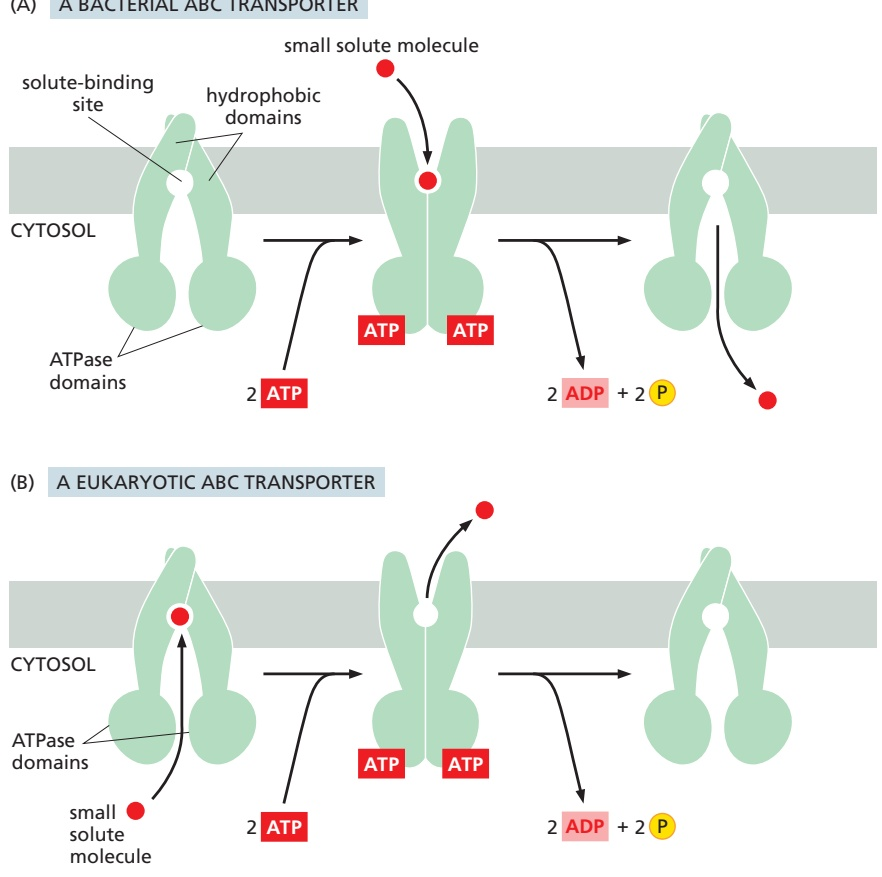
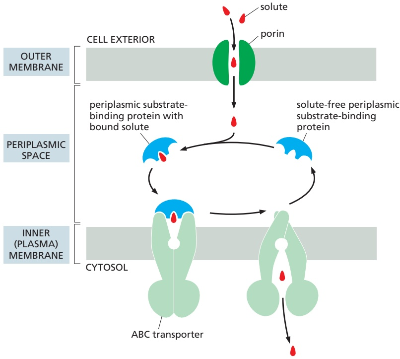
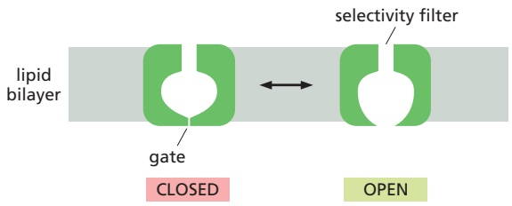
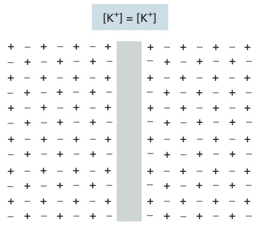
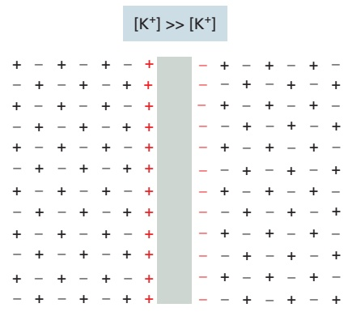
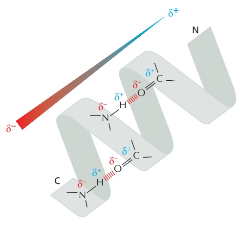
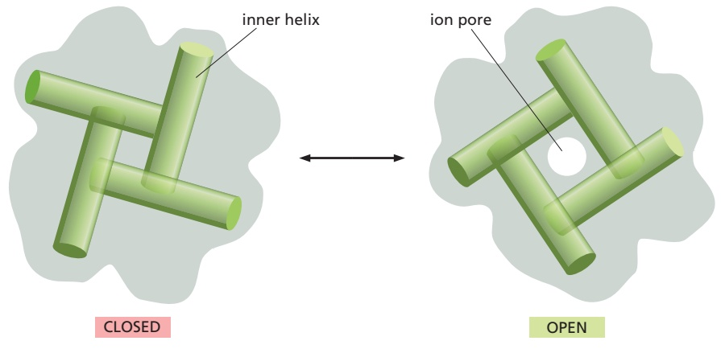
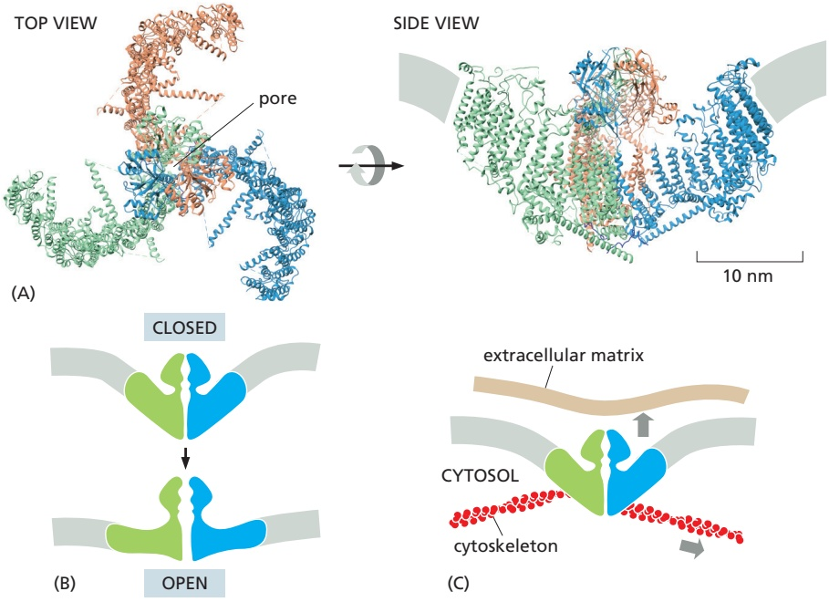

cells and in cells that are dedicated to transport processes, such as those forming kidney tubules.

Because the $\mathrm { N a ^ { + } \mathrm { - K ^ { + } } }$ pump drives three positively charged ions out of the cell for every two it pumps in, it is electrogenic: it drives a net electric current across the membrane, tending to create an electrical potential, with the cell’s inside being negative relative to the outside. This electrogenic effect of the pump, however, seldom directly contributes more than 10% to the membrane potential. The remaining 90%, as we discuss later, depends only indirectly on the $\dot { \mathrm { N a } } ^ { + } \mathrm { { \cdot } K ^ { + } }$ pump.

## ABC Transporters Constitute the Largest Family of Membrane Transport Proteins

The last type of transport ATPase that we discuss here is the family of ABC transporters, so named because each member contains two highly conserved ATPase domains, or ATP-binding “cassettes,” on the cytosolic side of the membrane. ATP binding brings together the two ATPase domains, and ATP hydrolysis leads to their dissociation (**Figure 11–16**). These movements of the cytosolic domains are transmitted to the transmembrane segments, driving cycles of conformational changes that alternately expose solute-binding sites on one side of the membrane and then on the other side, as we have seen for other transporters. In this way, ABC transporters harvest the energy released upon ATP binding and hydrolysis to drive transport of solutes across the bilayer. The transport is directional toward the inside or toward the outside, depending on the particular conformational change in the solute-binding site that is linked to ATP hydrolysis (see Figure 11–16).

ABC transporters constitute the largest family of membrane transport proteins and are of great clinical importance. The first of these proteins to be characterized was found in bacteria. We have already mentioned that the plasma membranes of all bacteria contain transporters that use the H gradient across the membrane to actively transport a variety of nutrients into the cell. In addition, bacteria use ABC transporters to import certain small molecules. In Gram-negative bacteria, such as Escherichia coli, that have double membranes (**Figure 11–17**), the ABC transporters are located in the inner membrane, and auxiliary proteins in the periplasm typically capture the nutrients and deliver them to the transporters (**Figure 11–18**).

Figure 11–16 Small-molecule transport by typical ABC transporters. ABC transporters consist of multiple domains. Typically, two hydrophobic domains, each built of six membrane-spanning α helices, together form the translocation pathway and provide substrate specificity. Two ATPase domains protrude into the cytosol. In some cases, the two halves of the transporter are formed by a single polypeptide, whereas in other cases they are formed by two or more separate polypeptides that assemble into a similar structure. Without ATP bound, the transporter exposes a substrate-binding site on one side of the membrane. ATP binding induces a conformational change that exposes the substrate-binding site on the opposite side; ATP hydrolysis followed by ADP dissociation returns the transporter to its original conformation. Most individual ABC transporters are unidirectional. (A) Both importing and exporting ABC transporters are found in bacteria; an ABC importer is shown in this diagram. (B) In eukaryotes, most ABC transporters export substances—either from the cytosol to the extracellular space or from the cytosol to a membrane-bound intracellular compartment such as the endoplasmic reticulum—or from the mitochondrial matrix to the intermembrane space.

In E. coli, 78 genes (an amazing 5% of the bacterium’s genes) encode ABC transporters, and animal genomes encode an even larger number. Although each. / . transporter is thought to be specific for a particular molecule or class of molecules, the variety of substrates transported by this superfamily is great and includes inorganic ions, amino acids, monosaccharides and polysaccharides, peptides, lipids, drugs, and, in some cases, even proteins that can be larger than the transporter itself.

The first eukaryotic ABC transporters identified were discovered because they pump hydrophobic drugs out of the cytosol. One of these transporters is the **multidrug resistance (MDR) protein**, also called P-glycoprotein. It is present at elevated levels in many human cancer cells and makes the cells simultaneously resistant to a variety of chemically unrelated cytotoxic drugs that are widely used in cancer chemotherapy. Treatment with any one of these drugs can result in the selective survival and overgrowth of those cancer cells that express an especially large amount of the MDR transporter. These cells pump drugs out of the cell very efficiently and are therefore relatively resistant to the drugs’ toxic effects (**Movie 11.5**). Selection for cancer cells with resistance to one drug can thereby lead to resistance to a wide variety of anticancer drugs. Some studies indicate that up to 40% of human cancers develop multidrug resistance, making it a major hurdle in the battle against cancer.

Figure 11–17 A small section of the double membrane of an E. coli bacterium. The inner membrane is the cell’s plasma membrane. Between the inner and outer membranes is a highly porous, rigid peptidoglycan layer, composed of protein and polysaccharide that constitute the bacterial cell wall. It is attached to lipoprotein molecules in the outer membrane and fills the periplasmic space (only a little of the peptidoglycan layer is shown). This space also contains a variety of soluble protein molecules. The dashed threads (shown in green) at the top represent the polysaccharide chains of the special lipopolysaccharide molecules that form the external monolayer of the outer membrane; for clarity, only a few of these chains are shown. Bacteria with double membranes are called Gram negative because they do not retain the dark blue dye used in Gram staining. Bacteria with single membranes (but thicker peptidoglycan cell walls), such as staphylococci and streptococci, retain the dark blue dye and are therefore called Gram positive; their single membrane is analogous to the inner (plasma) membrane of Gram-negative bacteria.

Figure 11–18 The auxiliary transport system associated with transport ATPases in bacteria with double membranes. The solute diffuses through channel proteins (porins) in the outer membrane and binds to a periplasmic substrate-binding protein that delivers it to the ABC transporter, which pumps it across the plasma membrane. The peptidoglycan layer is omitted for simplicity; its porous structure allows the substrate-binding proteins and water-soluble solutes to move freely through it by diffusion.

A related and equally sinister phenomenon occurs in the protist Plasmodium falciparum, which causes malaria. More than 200 million people are infected worldwide with this parasite, which remains a major cause of human death, killing almost a million people every year. The development of resistance to the antimalarial drug chloroquine has hampered the control of malaria. The resistant P. falciparum have amplified a gene encoding an ABC transporter that pumps out the chloroquine.

In most vertebrate cells, an ABC transporter in the endoplasmic reticulum (ER) membrane (named transporter associated with antigen processing, or TAP transporter) actively pumps a wide variety of peptides from the cytosol into the ER lumen. These peptides are produced by protein degradation in proteasomes (discussed in Chapter 6). They are carried from the ER to the cell surface, where they are displayed for scrutiny by cytotoxic T lymphocytes, which kill the cell if the peptides are derived from a virus or other microorganism lurking in the cytosol of an infected cell (discussed in Chapter 24).

Yet another member of the ABC transporter family is the cystic fibrosis transmembrane conductance regulator (CFTR) protein, which was discovered through studies of the common genetic disease cystic fibrosis. This disease is caused by a mutation in the gene encoding CFTR, a Cl– transport protein in the plasma membrane of epithelial cells. CFTR regulates ion concentrations in the extracellular fluid, especially in the lung. One in 27 Caucasians carries a gene encoding a mutant form of this protein; in 1 in 2900, both copies of the gene are mutated, causing the disease. In contrast to other ABC transporters, ATP binding and hydrolysis in the CFTR protein do not drive the transport process. Instead, they control the opening and closing of a continuous channel, which provides a passive conduit for Cl– to move down its electrochemical gradient. Thus, some ABC proteins can function as transporters and others as gated channels. Even though we treat transporters and channels as distinct in this chapter, the border is not absolute as this example illustrates. Indeed, the structure of some other Cl– channels reveals that they also resemble transporters more than they resemble most other ion channels.

## Summary

Transporters bind specific solutes and transfer them across the lipid bilayer by undergoing conformational changes that alternately expose the solute-binding site on one side of the membrane and then on the other side. Some transporters move a single solute “downhill,” whereas others can act as pumps to move a solute “uphill” against its electrochemical gradient, by using energy provided by ATP hydrolysis, by a downhill flow of another solute (such as Na1 or H1), or by light to drive the requisite series of conformational changes in an orderly manner. Transporters belong to a small number of protein families. Each family evolved from a common ancestral protein, and its members all operate by a similar mechanism. The family of P-type transport ATPases, which includes Ca21 and Na1-K1 pumps, is an important example; each of these ATPases sequentially phosphorylates and dephosphorylates itself during the pumping cycle. The superfamily of ABC transporters is the largest family of membrane transport proteins and is especially important clinically. It includes proteins that are responsible for drug resistance in both cancer cells and cells infected with malaria-causing parasites and for pumping pathogen-derived peptides into the ER for cytotoxic lymphocytes to reorganize on the surface of infected cells, and mutations in an ABC transporter cause cystic fibrosis.

## CHANNELS AND THE ELECTRICAL PROPERTIES OF MEMBRANES

Unlike transporters, channels form pores across membranes. One class of channel proteins found in virtually all animals forms gap junctions between adjacent cells; each plasma membrane contributes equally to the formation of the channel, which connects the cytoplasm of the two cells. In plants, plasmodesmata fulfill many of the same functions. These channels are discussed in Chapter 19 and will not be considered further here. Both gap junctions and porins, the channels in the outer membranes of bacteria, mitochondria, and chloroplasts (discussed in Chapter 10), have relatively large and permissive pores, and it would be disastrous if they directly connected the inside of a cell to an extracellular space. Indeed, many bacterial toxins do exactly that to kill other cells (discussed in Chapter 24).

In contrast, most channels in the plasma membrane of animal and plant cells that connect the cytosol to the cell exterior necessarily have narrow, highly selective pores that can open and close rapidly. Because these proteins are concerned specifically with inorganic ion transport, they are referred to as **ion channels**. For transport efficiency, ion channels have an advantage over transporters, in that they can pass up to 100 million ions through one open channel each second—a rate $1 0 ^ { 5 }$ times greater than even the fastest transporter. As discussed earlier, however, channels cannot be coupled to an energy source to perform active transport, so the conductance they mediate is always passive (downhill). Thus, the function of ion channels is to allow specific inorganic ions—primarily $\mathrm { N a ^ { + } , K ^ { + } , C a ^ { 2 + } }$ or Cl–—to diffuse rapidly down their electrochemical gradients across the lipid bilayer. In this section, we will see that the ability to control ion fluxes through these channels is essential for many cell functions. Nerve cells (neurons), in particular, have made a specialty of using ion channels, and we will consider how they use many different ion channels to receive, conduct, and transmit signals. Before we discuss ion channels, however, we briefly consider the aquaporin water channels that we mentioned earlier.

## Aquaporins Are Permeable to Water but Impermeable to Ions

Because cells are mostly water (typically ∼70% by weight), water movement across cell membranes is fundamentally important for life. Cells also contain a high concentration of solutes, including numerous negatively charged organic molecules that are confined inside the cell (the so-called fixed anions) and their accompanying cations that are required for charge balance. This creates an osmotic gradient, which mostly is balanced by an opposite osmotic gradient due to a high concentration of inorganic ions—chiefly Na+ and Cl–—in the extracellular fluid. The small remaining osmotic force tends to “pull” water into the cell, causing it to swell until the forces are balanced. Because all biological membranes are moderately permeable to water (see Figure 11–2), cell volume equilibrates in minutes or less in response to an osmotic gradient. For most animal cells, however, osmosis has only a minor role in regulating cell volume. This is because most of the cytoplasm is in a gel-like state and resists large changes in its volume in response to changes in osmolarity.

In addition to the direct diffusion of water across the lipid bilayer, some prokaryotic and eukaryotic cells have **water channels**, or **aquaporins**, embedded in their plasma membranes to allow water to move more rapidly. Aquaporins are particularly abundant in animal cells that must transport water at high rates, such as the epithelial cells of the kidney or exocrine cells that must transport or secrete large volumes of fluids (**Figure 11–19**). Water flow is highly regulated in these tissues. In the kidney, hormones such as antidiuretic hormone (vasopressin) regulate the concentration of aquaporin in the plasma membrane.

Figure 11–19 The role of aquaporins in fluid secretion. Cells lining the ducts of exocrine glands (as found, for example, in the pancreas and liver, and in mammary, sweat, and salivary glands) secrete large volumes of body fluids. These cells are organized into epithelial sheets in which their apical plasma membrane faces the lumen of the duct. Ion pumps and channels situated in the basolateral and apical plasma membranes move ions (mostly Na+ and Cl–) into the ductal lumen, creating an osmotic gradient between the surrounding tissue and the duct. Water molecules rapidly follow the osmotic gradient through aquaporins that are present in high concentrations in both the apical and basolateral plasma membranes.

(B)

water molecule

(C)

(D)

Aquaporins must solve a problem that is opposite to that facing ion channels. To avoid disrupting ion gradients across membranes, they have to allow the rapid passage of water molecules while completely blocking the passage of ions. The three-dimensional structure of an aquaporin reveals how it achieves this remarkable selectivity. The channels have a narrow pore that allows water molecules to traverse the membrane in single file, following the path of carbonyl oxygens that line one side of the pore (Figure 11–20A and B). Hydrophobic amino acids line the other side of the pore. The pore is too narrow for any hydrated ion to enter, and the energy cost of dehydrating an ion would be enormous because the hydrophobic wall of the pore cannot interact with a dehydrated ion to compensate for the loss of water. This design readily explains why the aquaporins cannot conduct $\mathrm { K } ^ { + }$ , Na+, $\mathrm { C a ^ { 2 + } }$ , or $\mathrm { C l ^ { - } }$ ions. These channels are also impermeable to $\mathrm { H } ^ { + }$ , which is mainly present in cells as $\mathrm { H _ { 3 } O ^ { + } }$ . These hydronium ions diffuse through water extremely rapidly, using a molecular relay mechanism that requires the making and breaking of hydrogen bonds between adjacent water molecules (Figure 11–20C). Aquaporins contain two strategically placed asparagines, which bind to the oxygen atom of the central water molecule in the line of water molecules traversing the pore, imposing a bipolarity on the entire single-file column of water molecules (Figure 11–20C and D). Because both valences of this central oxygen are unavailable for hydrogen-bonding, the central water molecule cannot participate in an $\mathrm { H } ^ { + }$ relay. This makes it impossible for the “making and breaking” sequence of hydrogen bonds (shown in Figure 11–20C) to get past the central asparaginebonded water molecule, and the pore is therefore impermeable to H+.

We now turn to ion channels, the subject of the rest of the chapter.

Figure 11–20 The structure of aquaporins. (A) A ribbon diagram of an aquaporin monomer. In the membrane, aquaporins form tetramers, with each monomer containing an aqueous pore in its center (not shown). Each individual aquaporin channel passes about $1 0 ^ { 9 }$ water molecules per second. (B) A longitudinal cross section through one aquaporin monomer, in the plane of the central pore. One face of the pore is lined with hydrophilic amino acids, which provide transient hydrogen bonds to water molecules; these bonds help line up the transiting water molecules in a single row and orient them as they traverse the pore. (C and D) A model explaining why aquaporins are impermeable to $\mathsf { H } ^ { \check { + } }$ (C) In water, $\mathsf { H } ^ { + }$ diffuses extremely rapidly by being relayed from one water molecule to the next. (D) Carbonyl groups $( C { = } 0 )$ lining the hydrophilic face of the pore align water molecules, and two strategically placed asparagines in the center are thought to tether a central water molecule such that both valences on its oxygen are occupied. This arrangement bipolarizes the entire column of water molecules, with each water molecule acting as a hydrogenbond acceptor from its inner neighbor (Movie 11.6). (PDB code: 3GD8.)

## Ion Channels Are Ion-selective and Fluctuate Between Open and Closed States

Two important properties distinguish ion channels from aqueous pores. First, they show ion selectivity, permitting some inorganic ions to pass, but not others. This suggests that their pores must be narrow enough in places to force permeating ions into intimate contact with the walls of the channel so that only ions of appropriate size and charge can pass. In some cases permeating ions have to shed most or all of their associated water molecules to pass, whereas in other cases hydrated or partially hydrated ions pass through the channel. Passage occurs in single file, through the narrowest part of the channel, which is called the selectivity filter, and limits the channel’s rate of ion movement and determines which ions can pass through (**Figure 11–21**). Thus, as the ion concentration increases, the flux of the ion through a channel increases proportionally but then levels off (saturates) at a maximum rate.

Figure 11–21 A typical ion channel, which fluctuates between closed and open conformations. The ion channel shown here in cross section forms a pore across the lipid bilayer only in the “open” conformational state. The pore narrows to atomic dimensions in one region (the selectivity filter), where the ion selectivity of the channel is largely determined. Another region of the channel forms the gate.

The second important distinction between ion channels and aqueous pores is that ion channels are not continually open. Instead, they are gated, which allows them to open briefly and then close again. Moreover, with prolonged (chemical or electrical) stimulation, most ion channels go into a closed “desensitized,” or “inactivated,” state, in which they are refractory to further opening until the stimulus has been removed, as we discuss later. In most cases, the gate opens in response to a specific stimulus. As shown in **Figure 11–22**, the main types of stimuli that are known to cause ion channels to open are a change in the voltage across the membrane (voltage-gated channels), a mechanical stress (mechanically gated channels), or the binding of a ligand (ligand-gated channels). The ligand can be either an extracellular mediator—specifically, a neurotransmitter (transmitter-gated channels)—or an intracellular mediator such as an ion (ion-gated channels) or a nucleotide (nucleotidegated channels). In addition, protein phosphorylation and dephosphorylation regulate the activity of many ion channels; this type of channel regulation is discussed, together with nucleotide-gated ion channels, in Chapter 15.

More than 200 types of ion channels have been identified thus far, and new ones are still being discovered, each characterized by the ions it conducts, the mechanism by which it is gated, and its abundance and localization in the cell and in specific cells. Ion channels are responsible for the electrical excitability of muscle cells, and they mediate most forms of electrical signaling in the nervous system. A single neuron typically contains 10 or more kinds of ion channels, located in different domains of its plasma membrane. But ion channels are not restricted to electrically excitable cells. They are present in all animal cells and are found in plant cells and microorganisms: they propagate the leaf-closing response of the mimosa plant, for example (**Movie 11.7**), and allow the single-celled motile Paramecium to reverse direction after a collision.

Figure 11–22 The gating of ion channels. This schematic drawing shows several kinds of stimuli that open ion channels. Mechanically gated channels often have cytoplasmic extensions (not shown) that link the channel to the cytoskeleton.

Ion channels that are permeable to $\mathrm { K } ^ { + }$ are found in the plasma membrane of almost all cells. An important subset of $\mathrm { K } ^ { + }$ channels opens even in an unstimulated or “resting” cell, and hence these are called $\mathbf { K } ^ { + }$ **leak channels**. Although this term applies to many different $\mathrm { K } ^ { + }$ channels, depending on the cell type, they serve a common purpose: by making the plasma membrane much more permeable to $\mathrm { K } ^ { + }$ than to other ions, they have a crucial role in maintaining the membrane potential across all plasma membranes, as we discuss next.

## The Membrane Potential in Animal Cells Depends Mainly on $\mathsf { K } ^ { + }$ Leak Channels and the $\mathsf { K } ^ { + }$ Gradient Across the Plasma Membrane

A **membrane potential** arises when there is a difference in the electrical charge on the two sides of a membrane because of a minute excess of positive ions over negative ones on one side and a minute deficit on the other side. Such charge differences can result both from active electrogenic pumping (see p. 648) and from passive ion diffusion in channels. As we discuss in Chapter 14, electrogenic $\mathrm { H } ^ { + }$ pumps in the mitochondrial inner membrane generate most of the membrane potential across this membrane. Electrogenic pumps also generate most of the electrical potential across the plasma membrane of plants and fungi. In typical animal cells, however, passive ion movements make the largest contribution to the electrical potential across the plasma membrane.

As explained earlier, because of the action of the $\mathrm { { N a } ^ { + } \mathrm { { \cdot } K ^ { + } } }$ pump, there is little $\mathrm { { N a } ^ { + } }$ inside the cell, and other intracellular inorganic cations have to be plentiful enough to balance the charge carried by the cell’s fixed anions—the negatively charged organic molecules that are confined inside the cell. This balancing role is performed largely by $\mathrm { K } ^ { + }$ , which is actively pumped into the cell by the $\widetilde { \mathrm { N a } ^ { + } } \mathrm { - K ^ { + } }$ pump and can also move in or out through the $\bar { K } ^ { + }$ leak channels in the plasma membrane. Because of the presence of these channels, $\mathrm { K } ^ { + }$ comes almost to equilibrium, where an electrical force exerted by an excess of negative charges attracting $\mathrm { K } ^ { + }$ into the cell balances the tendency of $\mathrm { K } ^ { + }$ to leak out down its concentration gradient. The membrane potential (of the plasma membrane) is the manifestation of this electrical force, and we can calculate its equilibrium value from the steepness of the $\mathrm { K } ^ { + }$ concentration gradient. The following argument may help to make this clear.

Suppose that initially there is no voltage gradient across the plasma membrane (the membrane potential is zero), but the concentration of $\mathrm { ^ { \circ } K ^ { + } }$ is high inside the cell and low outside. $\mathrm { K } ^ { + }$ will tend to leave the cell through the $\mathrm { K } ^ { + }$ leak channels, driven solely by its concentration gradient. As $\mathrm { K } ^ { + }$ begins to move out, each ion leaves behind an unbalanced negative charge, thereby creating an electrical field, or membrane potential, which will tend to oppose the further efflux of $\mathrm { K } ^ { + }$ The net efflux of $\mathrm { K } ^ { + }$ halts when the membrane potential reaches a value at which this electrical driving force on $\mathrm { K } ^ { + }$ exactly balances the effect of its concentration gradient; that is, when the electrochemical gradient for $\mathrm { K } ^ { + }$ is zero.

The equilibrium condition, in which there is no net flow of ions across the plasma membrane, defines the **resting membrane potential** for this idealized cell. A simple but very important formula, the **Nernst equation**, quantifies the equilibrium condition and, as explained in **Panel 11–1** (p. 656), makes it possible to calculate the theoretical resting membrane potential if we know the ratio of internal and external ion concentrations. As the plasma membrane of a real cell is not exclusively permeable to $\mathrm { K } ^ { + }$ , however, the actual resting membrane potential is usually not exactly equal to that predicted by the Nernst equation for $\mathrm { K } ^ { + }$

## The Resting Potential Decays Only Slowly When the $N a ^ { + } - K ^ { + }$ Pump Is Stopped

Movement of only a minute number of inorganic ions across the plasma membrane through ion channels suffices to set up the membrane potential. Thus, we can think of the membrane potential as arising from movements of charge that

## THE NERNST EQUATION AND ION FLOW

The flow of any inorganic ion through a membrane channel is driven by the electrochemical gradient for that ion. This gradient represents the combination of two influences: the voltage gradient and the concentration gradient of the ion across the membrane. When these two influences just balance each other, the electrochemical gradient for the ion is zero, and there is no net flow of the ion through the channel. The voltage gradient (membrane potential) at which this equilibrium is reached is called the equilibrium potential for the ion. It can be calculated from an equation that will be derived below, called the Nernst equation.

The Nernst equation is

$$
V = \frac {R T}{z F} \ln \frac {C _ {\mathrm{o}}}{C _ {\mathrm{i}}}
$$

where

$V   =$ the equilibrium potential in volts (internal potential minus external potential)

$C _ { \mathrm { o } }$ and Ci = outside and inside concentrations of the ion, respectively

$$
R = \text {the gas constant (8.3 J mol} ^{-1}\mathrm{K}^{-1})
$$

$$
T = \text {the absolute temperature (K)}
$$

$$
F = \text { Faraday's   constant } (9. 6 \times 10^4 \text { J } \text { V } ^{-1} \text { mol } ^{-1})
$$

z = the valence (charge) of the ion

In = logarithm to the base e

## The Nernst equation is derived as follows:

A molecule in solution (a solute) tends to move from a region of high concentration to a region of low concentration simply due to the random movement of molecules, which results in their equilibrium. Consequently, movement down a concentration gradient is accompanied by a favorable free-energy change $( \Delta G < 0 ) ,$ , whereas movement up a concentration gradient is accompanied by an unfavorable free-energy change $\left( \Delta G > 0 \right)$ . (Free energy is introduced in Chapter 2 and discussed in the context of redox reactions in Panel 14–1, p. 825.)

The free-energy change per mole of solute moved across the plasma membrane $( \Delta \mathsf { G } _ { \mathsf { c o n c } } )$ is equal $\mathsf { t o - } R T \mathsf { I n } ( C _ { 0 } / C _ { \mathsf { i } } )$

If the solute is an ion, moving it into a cell across a membrane whose inside is at a voltage V relative to the outside will cause an additional free-energy change (per mole of solute moved) of $\Delta G _ { \mathrm { v o l t } } = z F V .$

At the point where the concentration and voltage gradients just balance,

$$
\Delta G _ {\text {conc}} + \Delta G _ {\text {volt}} = 0
$$

and the ion distribution is at equilibrium across the membrane.

Thus,

$$
z F V - R T \ln \frac {C _ {\mathrm{o}}}{C _ {\mathrm{i}}} = 0
$$

and, therefore,

$$
V = \frac {R T}{z F} \ln \frac {C _ {\mathrm{o}}}{C _ {\mathrm{i}}}
$$

or, using the constant that converts natural logarithms to base 10,

$$
V = 2. 3 \frac {R T}{z F} \log_ {1 0} \frac {C _ {\mathrm{o}}}{C _ {\mathrm{i}}}
$$

For a univalent cation,

$$
2. 3 \frac {R T}{F} = 5 8 \mathrm{mVat} 2 0 ^ {\circ} \mathrm{C} \quad \text {and} \quad 6 1. 5 \mathrm{mVat} 3 7 ^ {\circ} \mathrm{C}
$$

Thus, for such an ion at $3 7 ^ { \circ } \mathsf { C } ,$

$$
V = + 6 1. 5 \mathrm{mV} \text { when } C _ {\mathrm{o}} / C _ {\mathrm{i}} = 1 0
$$

whereas

$$
V = 0 \text {when} C _ {\mathrm{o}} / C _ {\mathrm{i}} = 1
$$

The $\mathsf { K } ^ { + }$ equilibrium potential $( V _ { \mathsf { K } } ) ,$ for example, is

$$
61.5\log_{10}([K^{+}]_{o} / [K^{+}]_{i})\text{millivolts}
$$

(–89 mV for a typical cell, where $\left[ \mathsf { K } ^ { + } \right] _ { 0 } = 5$ mM and $\left[ \mathsf { K } ^ { + } \right] _ { \mathsf { i } } =$ 140 mM).

At $V _ { \mathsf { K } } ,$ there is no net flow of $\mathsf { K } ^ { + }$ across the membrane.

Similarly, when the membrane potential has a value of

$$
6 1. 5 \log_ {1 0} ([ \mathrm{Na} ^ {+} ] _ {o} / [ \mathrm{Na} ^ {+} ] _ {i})
$$

which is the Na+ equilibrium potential $( V _ { \mathsf { N a } } ) ,$ there is no net flow of $\mathsf { N a ^ { + } }$

For any particular membrane potential, $V _ { M } ,$ the net force tending to drive a particular type of ion out of the cell is proportional to the difference between $V _ { M }$ and the equilibrium potential for the ion; hence,

$$
\begin{array}{c} \text {for K^{+} it is V_{M} - V_{K}} \\ \text {and for Na^{+} it is V_{M} - V_{Na}} \end{array}
$$

When there is a voltage gradient across the membrane, the ions responsible for it—the excess positive ions on one side and the excess negative ions on the other— are concentrated in thin layers on either side of the membrane because of the attraction between positive and negative electric charges. The number of ions that go to form the layer of charge adjacent to the membrane is minute compared with the total number inside the cell. For example, the movement of 6000 Na+ ions across 1 $\mu \mathsf { m } ^ { 2 }$ of membrane will carry sufficient charge to shift the membrane potential by about 100 mV.

Because there are about $6 \times 1 0 ^ { 6 }   \mathsf { N a ^ { + } }$ ions in $1 ~ \mu \mathsf { m } ^ { 3 }$ of bulk cytoplasm, such a movement of charge will generally have a negligible effect on the ion concentration gradients across the membrane.

exact balance of charges on each side of the membrane; membrane potential = 0

a few of the positive ions (red) cross the membrane from right to left, leaving their negative counterions (red) behind; this sets up a nonzero membrane potential

leave ion concentrations practically unaffected and result in only a very slight discrepancy in the number of positive and negative ions on the two sides of the membrane (**Figure 11–23**). Moreover, these movements of charge are generally rapid, taking only a few milliseconds or less.

Consider the change in the membrane potential in a real cell after the sudden inactivation of the $\widetilde { \mathrm { N a ^ { + } } } \mathrm { - K ^ { + } }$ pump. A slight drop in the membrane potential mayMBoC7 m11.23/11.23 occur immediately. This is because the pump is electrogenic and, when active, makes a small direct contribution to the membrane potential by pumping out three $\mathrm { { N a } ^ { + } }$ for every two $\mathrm { K } ^ { + }$ that it pumps in (see Figure 11–15). However, switching off the pump does not abolish the major component of the resting potential, which is generated by the $\mathrm { K } ^ { + }$ equilibrium mechanism just described. This component of the membrane potential persists as long as the $\mathrm { { N a } ^ { + } }$ concentration inside the cell stays low and the $\mathrm { K } ^ { + }$ ion concentration high—typically for many minutes. But the plasma membrane is somewhat permeable to all small ions, including $\mathrm { { N a } ^ { + } }$ . Therefore, without the $\mathrm { N a ^ { + } \mathrm { - K ^ { + } } }$ pump, the ion gradients set up by the pump will eventually run down, and the membrane potential established by diffusion through the $\dot { \mathrm { K } } ^ { + }$ leak channels will fall as well. As $\mathrm { N a } ^ { + }$ enters, the cell eventually comes to a new resting state where $\mathrm { N a ^ { + } , K ^ { + } }$ , and Cl– are all at equilibrium across the membrane. The membrane potential in this state is much less than it was in the normal cell with an active $\mathrm { { N } \dot { \dot { a } ^ { + } } \mathrm { { - } K ^ { + } } }$ pump.

The resting potential of an animal cell varies between –20 mV and –120 mV, depending on the organism and cell type. Although the $\mathrm { K } ^ { + }$ gradient always has a major influence on this potential, the gradients of other ions (and the disequilibrating effects of ion pumps) also have a significant effect: the more permeable the membrane for a given ion, the more strongly the membrane potential tends to be driven toward the equilibrium value for that ion. Consequently, changes in a membrane’s relative permeability to different ions can cause significant changes in the membrane potential. This is one of the key principles relating the electrical excitability of cells to the activities of ion channels.

To understand how ion channels select their ions and how they open and close, we need to know their three-dimensional molecular structure. The first ion channel to be crystallized and studied by x-ray diffraction was a bacterial $\mathrm { K } ^ { + }$ channel. The details of its structure revolutionized our understanding of ion channels.

## The Three-dimensional Structure of a Bacterial $\mathsf { K } ^ { + }$ Channel Shows How an Ion Channel Can Work

Scientists were puzzled by the remarkable ability of ion channels to combine exquisite ion selectivity with a high conductance. $\mathrm { K } ^ { + }$ leak channels, for example, conduct $\mathrm { K } ^ { + }$ 10,000-fold faster than $\mathrm { { N a } ^ { + } }$ , yet the two ions are both featureless spheres and have similar radii (0.133 nm and 0.095 nm, respectively). A single amino acid substitution in the pore of an animal cell $\mathrm { K } ^ { + }$ channel can result in a loss

Figure 11–23 The ionic basis of a membrane potential. A small flow of inorganic ions through an ion channel carries sufficient charge to cause a large change in the membrane potential. The ions that give rise to the membrane potential lie in a thin (<1 nm) surface layer close to the membrane, held there by their electrical attraction to their oppositely charged counterparts (counterions) on the other side of the membrane. For a typical cell, 1 microcoulomb of charge $\stackrel { \leftrightarrow } { ( 6 \times 1 0 ^ { 1 2 } }$ monovalent ions) per square centimeter of membrane, transferred from one side of the membrane to the other side, changes the membrane potential by roughly 1 V. This means, for example, that in a spherical cell of diameter 10 μm, the number of $\mathsf { K } ^ { + }$ ions that have to flow out to alter the membrane potential by 100 mV is only about 1/100,000 of the total number of $\mathsf { K } ^ { + }$ ions in the cytosol. This amount is so minute that the intracellular $\mathsf { K } ^ { + }$ concentration remains virtually unchanged.

(B)

Figure 11–24 The structure of a bacterial ${ \sf K } ^ { + }$ channel. $( \mathsf { A } )$ The transmembrane α helices from only two of the four identical subunits are shown. From the cytosolic side, the pore (schematically shaded in blue) opens up into a vestibule in the middle of the membrane. The pore vestibule facilitates transport by allowing the $\mathsf { K } ^ { + }$ ions to remain hydrated even though they are more than halfway across the membrane. The narrow selectivity filter of the pore links the vestibule to the outside of the cell. Carbonyl oxygens line the walls of the selectivity filter and form transient binding sites for partially dehydrated $\mathsf { K } ^ { + }$ ions. Two $\mathsf { K } ^ { + }$ ions occupy different sites in the selectivity filter, while a third $\mathsf { K } ^ { + }$ ion is located in the center of the vestibule, where it is stabilized by electrical interactions including those contributed by the more negatively charged ends of the pore helices. The. / . ends of the four short “pore helices” (only two of which are shown) point precisely toward the center of the vestibule, thereby guiding $\mathsf { K } ^ { + }$ ions into the selectivity filter (Movie 11.8). (B) Peptide bonds have an electric dipole, with more negative charge accumulated at the oxygen of the $C { = } 0$ bond and at the nitrogen of the N¬H bond. In an α helix, hydrogen bonds (red) align the dipoles. As a consequence, every α helix has an electric dipole along its axis, resulting from summation of the dipoles of the individual peptide bonds, with a more negatively charged C-terminal end (δ–) and a more positively charged N-terminal end (δ+). (A, adapted from D.A. Doyle et al., Science 280:69–77, 1998.)

of ion selectivity and cell death. We cannot explain the normal $\mathrm { K } ^ { + }$ selectivity by pore size alone, because $\mathrm { N a } ^ { + }$ is smaller than $\mathrm { K } ^ { + }$ . Moreover, its high conductance rate is incompatible with the channel having selective, high-affinity $\mathrm { K } ^ { + }$ -binding sites, as the binding of $\mathrm { K } ^ { + }$ ions to such sites would greatly slow their passage.

The puzzle was solved when the structure of a bacterial $K ^ { + }$ channel was determined by x-ray crystallography. The channel is made from four identical transmembrane subunits, which together form a central pore through the membrane. Each subunit contributes two transmembrane α helices, which are tilted outward in the membrane and together form a cone, with its wide end facing the outside of the cell where $\mathrm { K } ^ { + }$ ions exit from the channel (**Figure 11–24**). The polypeptide chain that connects the two transmembrane helices forms a short α helix (the pore helix) and a crucial loop that protrudes into the wide section of the cone to form the **selectivity filter**. The selectivity loops from the four subunits form a short, rigid, narrow pore, which is lined by the carbonyl oxygen atoms of their polypeptide backbones. Because the selectivity loops of all known $\mathrm { K } ^ { + }$ channels have similar amino acid sequences, it is likely that they form a closely similar structure.

The structure of the selectivity filter explains the ion selectivity of the channel. $\mathrm { A   K ^ { + } }$ ion must lose almost all of its bound water molecules to enter the filter, where it interacts instead with the carbonyl oxygens lining the filter; the oxygens are rigidly spaced at the exact distance to accommodate a $\mathrm { K } ^ { + }$ ion. An $\mathrm { { N a } ^ { + } }$ ion, in contrast, cannot enter the filter because the carbonyl oxygens are too far away from the smaller $\mathrm { N a } ^ { + }$ ion to compensate for the high energy expense associated with the loss of water molecules required for entry (**Figure 11–25**).

Structural studies of $\mathrm { K } ^ { + }$ channels and other ion channels have also indicated some general principles of how these channels open and close. The gating involves movement of the helices in the membrane so that they either obstruct or open the path for ion movement. Depending on the particular type of channel, helices tilt, rotate, or bend during gating. The structure of a closed $\mathrm { K } ^ { + }$ channel shows that by tilting the inner helices, the pore constricts like a diaphragm at its cytosolic end (**Figure 11–26**). Bulky hydrophobic amino acid side chains block the small opening that remains, preventing the entry of ions.

Figure 11–25 ${ \mathsf { K } } ^ { + }$ specificity of the selectivity filter in a ${ \sf K } ^ { + }$ channel. The drawings show $\mathsf { K } ^ { + }$ and Na+ ions (A) in the vestibule and (B) in the selectivity filter of the pore, viewed in cross section. In the vestibule, the ions are hydrated. In the selectivity filter, they have lost their water, and the carbonyl oxygens are placed to accommodate a dehydrated $\dot { \mathsf { K } } ^ { + }$ ion. The dehydration of the $\mathsf { K } ^ { \dot { + } }$ ion requires energy, which is precisely balanced by the energy regained by the interaction of the ion with all of the carbonyl oxygens that serve as surrogate water molecules. Because the Na+ ion is too small to interact with all the oxygens, it can enter the selectivity filter only at a great energetic expense. The filter therefore selects $\mathsf { K } ^ { + }$ ions with high specificity. $( \mathsf { A } ,$ adapted from Y. Zhou et al., Nature 414:43–48, 2001.)

Many other ion channels operate on similar principles: the channel’s pore helices are allosterically coupled to sensor domains that in response, say, to ligand binding or altered membrane potential bring about conformational change in the ion-conducting pathway, either opening it or blocking it off.

## Mechanosensitive Channels Allow Cells to Sense Their Physical Environment

All organisms, from single-cell bacteria to multicellular animals and plants, must sense and respond to mechanical forces both in their external environment (such as sound, touch, pressure, shear forces, and gravity) and in their internal environment (such as osmotic pressure and membrane bending). Numerous proteins are known to be capable of responding to such mechanical forces, and a large subset of those proteins has been identified as possible **mechanosensitive channels**, but very few of the candidate proteins have been shown directly to be mechanically activated ion channels. One reason for this dearth in our knowledge is that most such channels are extremely rare. Auditory hair cells in the human cochlea, for example, contain extraordinarily sensitive mechanically gated ion channels, but each of the approximately 15,000 individual hair cells is thought to have a total of only 50–100 of them (**Movie 11.9** and **Movie 11.10**). Additional difficulties arise because the gating mechanisms of many mechanosensitive channel types require the channels to be embedded in complex architectures that require attachment to the extracellular matrix or to the cytoskeleton, and this is difficult to reconstitute in the test tube.

Figure 11–26 A model for the gating of a bacterial K1 channel. The channel is viewed in cross section. To adopt the closed conformation, the four inner transmembrane helices that line the pore on the cytosolic side of the selectivity filter (see Figure 11–24) rearrange to close the cytosolic entrance to the channel. (Adapted from E. Perozo et al., Science 285:73–78, 1999.)

Figure 11–27 Stretch-activated Piezo channels. (A) The structure of Piezo1. Three identical subunits surround the central pore (left). The three large arm domains extend from the center and bend the membrane into a dome (right). (B) When the membrane is stretched, the dome-like protrusion flattens and the central pore opens. (C) By coupling Piezo channels to tethers on either side of the membrane (for example, to the extracellular matrix or the cytoskeleton), Piezo channels can be opened in response to extracellular or intracellular mechanical forces (arrows). (A, PDB code: 6B3R. Adapted from Y.R. Guo and R. MacKinnon, eLife 6:e33660, 2017. This article is distributed under the terms of the Creative Commons Attribution License.)

To fill this gap in our knowledge, scientists used patch clamping to identify cell lines that would open an ion channel when mechanical pressure was applied toMBoC7 n11.333-11.27 them. They then reasoned that a mechanosensitive channel would need to contain at least two membrane-spanning helices and proceeded to systematically disrupt expression of genes encoding such proteins. One such disruption caused the cells to lose their response to mechanical stimuli and identified two genes that code for related proteins. Each of these proteins contains more than 30 membrane-spanning helices, but neither shows any sequence similarity to other known ion channels. Three identical copies of either of these proteins can assemble into a mechanosensitive Piezo ion channel that lies in the plasma membranes of numerous types of animal cells (**Figure 11–27**). Each of the three subunits of a Piezo channel contains a large arm built from 36 transmembrane helices. The arms extend outward from a central hub that contains the channel’s ion-conducting pore. The particular packing of the wing helices deforms the membrane into a dome. In this resting state, the Piezo channel is closed. When the membrane becomes stretched by mechanically pushing on the plasma membrane elsewhere, the resulting membrane tension pulls the deformation flat, which opens the channel’s central pore.

Piezo channels in skin cells are required for touch sensation, and in bladder cells they detect when the bladder is full. But their importance is far greater than that. Animals that lack Piezo channels die in development because many developmental processes, such as formation of the vasculature, rely on mechanical stretching cues. Piezo channels also provide second-to-second control of blood pressure. Nerve cells in the aortic arch and carotid artery contain Piezo channels and are highly sensitive to stretch that results from increased blood pressure. In response, they signal to immediately slow the heart rate. In this way, the blood pressure falls, preventing life-threatening consequences from vessel damage or rupture. Conversely, acutely reduced blood pressure, as might occur upon getting up or bending over, stops the firing of these same nerve cells and increases the heart rate and peripheral vasoconstriction, which in turn prevents loss of consciousness by increasing blood flow to the brain.

Another well-studied class of mechanosensitive channels is found in the bacterial plasma membrane. These channels open in response to mechanical stretching of the lipid bilayer in which they are embedded. When a bacterium experiences a low-ionic-strength external environment (hypotonic conditions), such as rainwater, the cell swells as water seeps in due to the increased osmotic