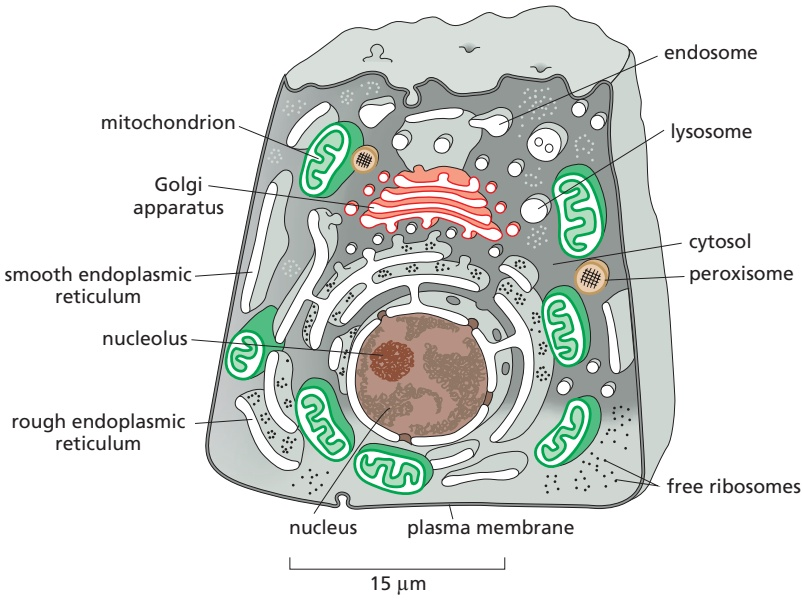
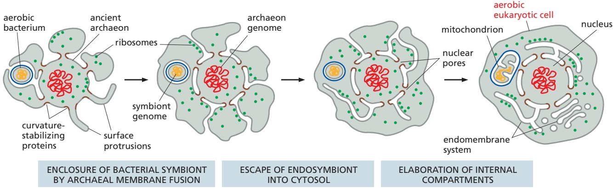
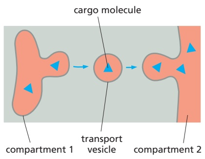
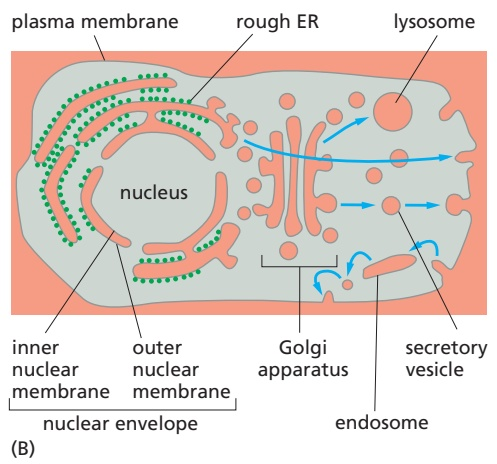
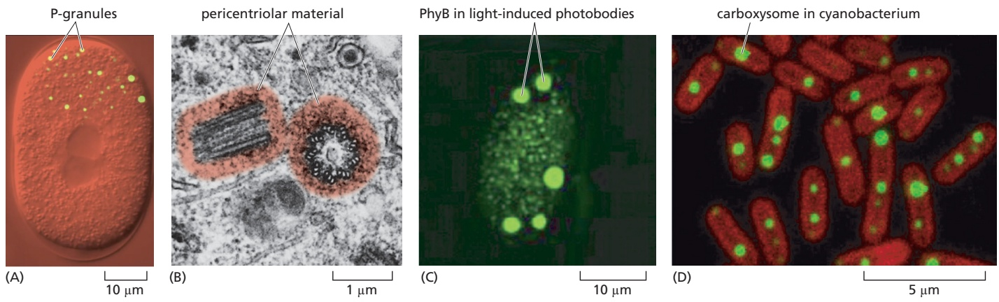
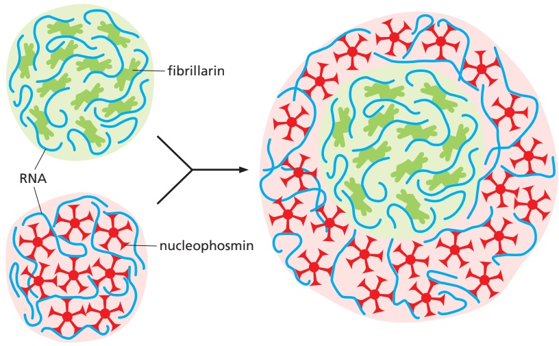
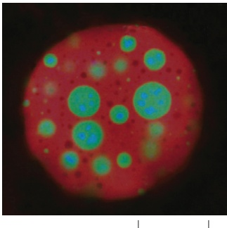
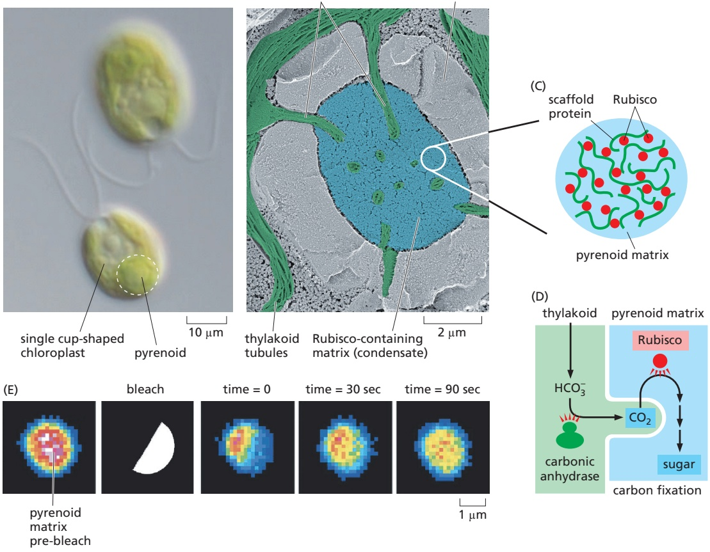
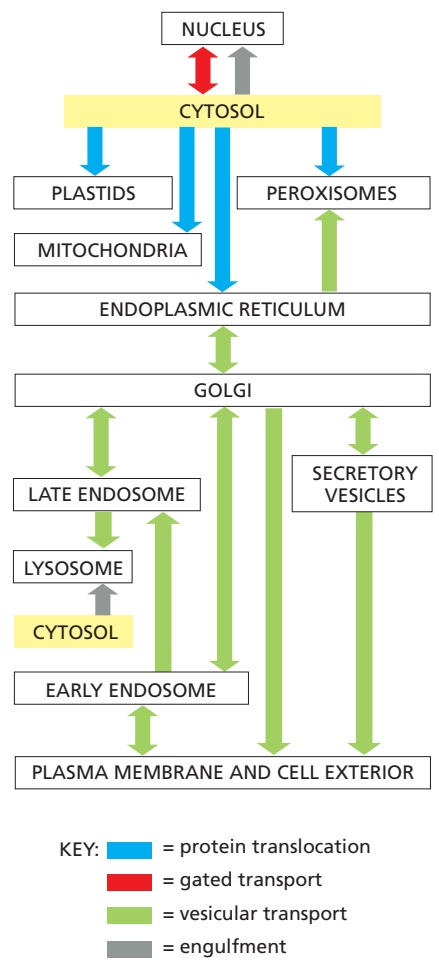

# Intracellular Organization and Protein Sorting

The many thousands of macromolecules and their associated biochemical activities inside a cell are spatially segregated to different regions. Intracellular organization is a particularly prominent feature of eukaryotic cells, which unlike bacteria are elaborately subdivided into functionally distinct, membrane-enclosed compartments. Many of these compartments define the cell’s major **organelles** such as the endoplasmic reticulum, Golgi apparatus, lysosome, plastid, and mitochondrion, the last two of which are still further subcompartmentalized by internal membranes. Other subsets of the cell’s macromolecules can organize into dynamic and reversible assemblies, called **biomolecular condensates**, that can serve as specialized biochemical factories or temporary storage depots. To understand the eukaryotic cell, it is essential to know how the cell creates and maintains its complex intracellular organization.

An animal cell contains about 10 billion (1010) protein molecules of perhaps 10,000 kinds, and the synthesis of almost all of them begins in the **cytosol**, the space of the cytoplasm outside the membrane-enclosed organelles. Each newly synthesized protein is then delivered specifically to the organelle that requires it. The unique protein and lipid composition on the surface of each organelle is used as a cue to direct new deliveries of proteins and lipids to sustain that organelle’s identity. The characteristic set of proteins and other specialized molecules define each organelle’s structural and functional properties. They catalyze the reactions that occur there and selectively transport molecules into and out of the organelle. The intracellular transport of proteins is the central theme of both this chapter and the next. By tracing the protein traffic from one part of the cell to another, one can begin to make sense of the otherwise bewildering maze of intracellular membranes and other subcellular structures.

## THE COMPARTMENTALIZATION OF CELLS

In this brief overview of the compartments of the cell and the relationships between them, we organize the cell’s organelles conceptually into a small number of discrete families, discuss how proteins are directed to specific organelles, and explain how proteins cross organelle membranes.

## All Eukaryotic Cells Have the Same Basic Set of Membrane-enclosed Organelles

Many vital biochemical processes take place in membranes or on their surfaces. Membrane-bound enzymes, for example, catalyze lipid metabolism, and oxidative phosphorylation and photosynthesis both require a membrane to couple the transport of $\dot { \mathrm { H } ^ { + } }$ to the synthesis of ATP. In addition to providing increased membrane area to host biochemical reactions, intracellular membrane systems form enclosed compartments that are separate from the cytosolic compartment, thus creating functionally specialized aqueous spaces within the cell. In these spaces, subsets of molecules (proteins, reactants, ions) are concentrated to optimize the biochemical reactions in which they participate. By having multiple types of compartments inside the same cell, biochemical reactions that require very different conditions, or would compete with each other, can nevertheless occur simultaneously. Because the lipid bilayer of cell membranes is impermeable to most

C HAP T E R

12

IN THIS CHAPTER

The Compartmentalization of Cells

The Endoplasmic Reticulum

Peroxisomes

The Transport of Proteins into Mitochondria and Chloroplasts

The Transport of Molecules Between the Nucleus and the Cytosol

Figure 12–1 The major intracellular compartments of an animal cell. The cytosol (gray), rough endoplasmic reticulum, smooth endoplasmic reticulum, Golgi apparatus, nucleus, mitochondrion, endosome, lysosome, and peroxisome are distinct compartments isolated from the rest of the cell by at least one selectively permeable membrane (see Movie 9.2). By contrast, the nucleolus is not enclosed by a membrane and represents one example of a biomolecular condensate.

hydrophilic molecules, the membrane of an organelle must contain membrane transport proteins to import and export specific metabolites. Each organellar membrane must also have a mechanism for importing, and incorporating into the organelle, the specific proteins that make the organelle unique.

**Figure 12–1** illustrates the major intracellular compartments common to eukaryotic cells. The nucleus contains the genome (aside from mitochondrial and chloroplast DNA), and it is the principal site of DNA and RNA synthesis. The surrounding **cytoplasm** consists of the cytosol and the cytoplasmic organelles suspended in it. The cytosol constitutes a little more than half the total volume of the cell, and it is the main site of protein synthesis and degradation. It also performs most of the cell’s intermediary metabolism; that is, the many reactions that degrade some small molecules and synthesize others to provide the building blocks for macromolecules (discussed in Chapter 2).

About half the total area of membrane in a eukaryotic cell encloses the labyrinthine spaces of the endoplasmic reticulum (ER). Most soluble and integral membrane proteins destined for the cell exterior or for other organelles are initially assembled at the ER. These proteins are transported into the ER as they are synthesized by ribosomes. The distinctive appearance in electron micrographs of ribosomes studding the surface of these regions of the ER is the reason they are termed the rough ER. The ER also produces most of the lipid and sterols for the rest of the cell and functions as a store for Ca2+ ions. These regions of the ER typically lack bound ribosomes and are called smooth ER.

The ER sends many of its proteins and lipids to the Golgi apparatus, which often consists of organized stacks of disc-like compartments called Golgi cisternae. The Golgi apparatus receives lipids and proteins from the ER and dispatches them to various destinations, usually covalently modifying them en route. Lysosomes contain digestive enzymes that degrade defunct intracellular organelles, as well as macromolecules and particles taken in from outside the cell by endocytosis. On the way to lysosomes, endocytosed material must first pass through a series of organelles called endosomes. As we will see, the ER, Golgi apparatus, lysosomes, endosomes, and plasma membrane are linked by the cell’s major pathways of membrane traffic.

Mitochondria and chloroplasts generate most of the ATP that cells use to drive reactions requiring an input of free energy; chloroplasts are a specialized version of plastids (present in plants, algae, and some protozoa), which can also have other functions, such as the storage of food or pigment molecules. Finally, peroxisomes are small vesicular compartments that contain enzymes used in various oxidative reactions.

On average, the membrane-enclosed compartments together occupy nearly half the volume of a cell (**Table 12–1**), and a large amount of intracellular membrane is required to make them. In liver and pancreatic cells, for example, the endoplasmic reticulum has a total membrane surface area that is, respectively, 25 times and 12 times that of the plasma membrane (**Table 12–2**). The membraneenclosed organelles are packed tightly in the cytoplasm, and, in terms of area and mass, the plasma membrane is only a minor membrane in most eukaryotic cells (**Figure 12–2**).

TABLE 12–1 Relative Volumes Occupied by the Major Intracellular Compartments in a Liver Cell (Hepatocyte)

| Intracellular compartment | Percentage of total cell volume |
| --- | --- |
| Cytosol | 54 |
| Mitochondria | 22 |
| Rough ER cisternae | 9 |
| Smooth ER cisternae | 5 |
| Golgi cisternae | 1 |
| Nucleus | 6 |
| Peroxisomes | 1 |
| Lysosomes | 1 |
| Endosomes | 1 |

<table><tbody><tr><td colspan="3">TABLE 12-2 Relative Amounts of Membrane Types in Two Kinds of Eukaryotic Cells</td></tr><tr><td rowspan="2">Membrane type</td><td colspan="2">Percentage of total cell membrane</td></tr><tr><td>Liver hepatocyte*</td><td>Pancreatic exocrine cell*</td></tr><tr><td>Plasma membrane</td><td>2</td><td>5</td></tr><tr><td>Rough ER membrane</td><td>35</td><td>60</td></tr><tr><td>Smooth ER membrane</td><td>16</td><td>&lt;1</td></tr><tr><td>Golgi apparatus membrane</td><td>7</td><td>10</td></tr><tr><td>Mitochondria Outer membrane Inner membrane</td><td>732</td><td>417</td></tr><tr><td>Nucleus Inner membrane**</td><td>0.2</td><td>0.7</td></tr><tr><td>Secretory vesicle membrane</td><td>Not determined</td><td>3</td></tr><tr><td>Lysosome membrane</td><td>0.4</td><td>Not determined</td></tr><tr><td>Peroxisome membrane</td><td>0.4</td><td>Not determined</td></tr><tr><td>Endosome membrane</td><td>0.4</td><td>Not determined</td></tr></tbody></table>

\*These two cells are of very different sizes: the average hepatocyte has a volume of about 5000 $\mu \mathrm { m } ^ { 3 }$ compared with 1000 $\mu \mathsf { m } _ { \alpha } ^ { 3 }$ for the pancreatic exocrine cell. Total cell membrane areas are estimated at about 110,000 μm2 and $1 3 \dot { , } 0 0 0   \mu \mathsf { m } ^ { 2 }$ , respectively. \*\*The outer nuclear membrane is included in the measurement of the rough ER and is roughly equal to the inner membrane.

Figure 12–2 An electron micrograph of part of a liver cell seen in cross section. Examples of most of the major intracellular organelles are indicated. (Reused by permission of E.L. Bearer and Daniel S. Friend.)

In general, each membrane-enclosed organelle performs the same set of basic functions in all cell types. But to serve the specialized functions of cells, these organelles vary in abundance and can have additional properties that differ from cell type to cell type. This is particularly apparent in cells that are highly specialized and therefore disproportionately rely on specific organelles. Plasma cells, for example, which daily secrete their own weight in antibody molecules into the bloodstream, contain vastly amplified amounts of rough ER, which is found in large, flat sheets. Cardiac muscle cells instead expand and specialize their smooth ER for $\mathrm { C a ^ { 2 + } }$ storage and proliferate their mitochondria for energy production. Moreover, membrane-enclosed organelles are often found in characteristic positions in the cytoplasm. In most cells, for example, the Golgi apparatus is located close to the nucleus, whereas the network of ER tubules extends from the nucleus throughout the entire cytosol. These characteristic distributions depend on interactions of the organelles with the cytoskeleton (discussed in Chapter 16).

## Evolutionary Origins Explain the Topological Relationships of Organelles

To understand the relationships between the compartments of the cell, it is helpful to consider how they might have originated. The precursors of the first eukaryotic cells are thought to have been relatively simple cells that—like most bacterial and archaeal cells—had a plasma membrane but no internal membranes. The plasma membrane in such cells provided all membrane-dependent functions, including the pumping of ions, ATP synthesis, protein secretion, and lipid synthesis. These ancestral precursors, like their modern-day prokaryotic counterparts,probably had a 1000- to 10,000-fold smaller volume than present-day eukaryotic cells. To increase in volume, the ancestral cells would have needed to maintain their surface area to volume ratio to sustain the many vital functions that membranes perform.

On the basis of the appearance of modern-day archaeal cells (see Figure 1–26), the membrane surface area might have initially increased by plasma membrane protrusions. The increased capacity to exchange metabolites with the surrounding environment via these protrusions would have facilitated symbiotic relationships with other organisms. Increased resource availability due to a combination of symbioses and membrane expansion may have allowed the evolution of progressively larger cells (**Figure 12–3**). Ultimately, the network of spaces between the numerous expanded protrusions would have become sealed off from the surrounding environment because of membrane fusion between protrusions. The consequences of this fusion are threefold and help to explain the major distinguishing features of eukaryotic cells.

First, the cell now has a set of internal membranes that are derived from an ancestral prokaryotic plasma membrane. These internal membranes enclose interior spaces that are said to be topologically equivalent to each other and to the exterior of the cell (**Figure 12–4**), because they can communicate with one another, in the sense that molecules can get from one to the other without having to cross a membrane. We shall see that this topological relationship holds for all of the organelles involved in the secretory and endocytic pathways, including the ER, Golgi apparatus, endosomes, lysosomes, and peroxisomes. As we discuss in detail in the next chapter, their interiors communicate extensively with one another and with the outside of the cell via transport vesicles, which bud off from one organelle and fuse with another. In this way, proteins that enter the **lumen** of the ER can be secreted outside the cell.

Second, the ancestral plasma membrane that surrounded the genome is now an internal membrane that becomes the inner nuclear membrane. Because of how it originated, the inner nuclear membrane is continuous with other plasma membrane–derived internal membranes, including the outer nuclear membrane. Specialized structures, the nuclear pore complexes, are located at points where the inner and outer nuclear membranes connect and provide a conduit for communication between the nucleus and cytosol. Segregation of an organism’s genetic material into a nucleus separate from the plasma membrane probably afforded greater protection from the environment. Furthermore, an expanded cytosol segregated from the nucleus would have facilitated the spatial separation of transcription from translation, thereby allowing greater regulation of gene expression by several mechanisms distinctive to eukaryotic cells.

Figure 12–3 Evolutionary origins of the major internal membrane systems of a eukaryotic cell. As discussed in Chapter 1, there is evidence that the first eukaryotic cells arose when an ancient anaerobic archaeon joined forces with an aerobic bacterium roughly 1.6 billion years ago. An early step in this process was expansion of the archaeon’s plasma membrane, probably through protrusions and blebs. The highly curved membrane at the necks of these protrusions might have been stabilized by proteins that eventually became part of the nuclear pore. The added surface area of these protrusions facilitated metabolite exchange with the environment and with neighboring cells. A fruitful symbiotic relationship with an aerobic bacterium might have allowed the archaeon to increase in volume. These protrusions eventually fused with each other to pinch off internal membrane-enclosed compartments, some of which contained the symbiotic bacteria. This intermediate now begins to resemble modern-day eukaryotes, with a primordial nucleus and nuclear pores, internal compartments, and an endosymbiont destined to become the mitochondrion. The lumen of the internal compartments is topologically equivalent to the extracellular space (see Figure 12–4). The membrane-enclosed endosymbiont subsequently escaped the enclosing membrane into the cytosol where it evolved into modern-day mitochondria. The internal compartments expanded and became progressively specialized to form the major intracellular compartments of a eukaryotic cell. Their common origin from. / . a primordial intracellular compartment explains why all of these compartments can exchange material with each other through vesicular transport. The nucleus was formerly the cytosol in the ancient archaeon, explaining why the cytosol and nucleus are topologically equivalent compartments that can intermix during mitosis. (Adapted from J. Martijn and T.J.G. Ettema, Biochem. Soc. Trans. 41:451–457, 2013; D. Baum and B. Baum, BMC Biol. 12:76, 2014.)

Third, symbionts that were originally outside the cell were trapped inside the cell and became endosymbionts. At some point, endosymbionts escaped from their membrane enclosure into the cytosol where they eventually became mitochondria and plastids that contain their own genomes. The nature of these genomes and the close resemblance of the proteins in these organelles to those in some present-day bacteria provide strong evidence for their endosymbiont origins (see Figure 14–55). Like the bacteria from which they were derived, both mitochondria and plastids are enclosed by a double membrane, and they remain isolated from the extensive vesicular traffic that connects the interiors of most of the other membrane-enclosed organelles to each other and to the outside of the cell.

(A)

Figure 12–4 Topologically equivalent compartments in the secretory and endocytic pathways in a eukaryotic cell. Topologically equivalent spaces are shown in red. (A) Molecules can be carried from one compartment to another topologically equivalent compartment by transport vesicles that bud from one and fuse with the other. (B) In principle, cycles of membrane budding and fusion permit the lumen of any of the organelles shown to communicate with any other and with the cell exterior by means of transport vesicles. Blue arrows indicate the extensive outbound and inbound vesicular traffic (discussed in Chapter 13). Some organelles, most notably mitochondria and (in plant cells) plastids, do not take part in this communication and are isolated from the vesicular traffic between organelles shown here.

The evolutionary schemes we have outlined for the origins of eukaryotic organelles are most strongly supported by the striking similarities of the protein transport machinery of modern-day prokaryotes and eukaryotic organelles. The ability to transport proteins across and into membranes is a fundamental and essential feature of all living organisms. Thus, machinery that carries out these processes would have arisen in the earliest life-forms and been retained throughout evolution. The presence and orientation of these transport components therefore allow us to trace the origins and topology of the membranes within which they now reside. Consistent with the model for evolution of the endomembrane system of eukaryotic cells, the components that mediate protein import into the ER are homologous to the proteins that mediate export across the archaeal plasma membrane. Similarly, membrane protein insertion machinery in the outer and inner membranes of mitochondria and plastids contains homologous components found in the outer and inner membranes of various modern-day bacteria.

The major intracellular compartments in eukaryotic cells can therefore be categorized into three distinct families: (1) the nucleus and the cytosol, which are topologically equivalent (although functionally distinct) and connected by nuclear pore complexes; (2) all organelles that function in the secretory and endocytic pathways—including the ER, Golgi apparatus, endosomes, lysosomes, and the transport vesicles that move between them—and peroxisomes; (3) the endosymbiont-derived organelles: mitochondria and the plastids (in plants only).

## Macromolecules Can Be Segregated Without a Surrounding Membrane

A membrane barrier is not the only way subsets of macromolecules can selectively segregate within cells. As we discussed in Chapter 3, one or more interacting proteins or nucleic acids can serve as scaffolds in biomolecular condensates (see Figure 3–77). These scaffold macromolecules create the condensate through multiple weak, fluctuating binding interactions among themselves; in addition, they recruit specific proteins and nucleic acids into the condensate as client macromolecules (**Figure 12–5**). Once recruited, the clients typically remain within the condensate because the local concentration of its binding sites on the interacting scaffold molecule is very high. Thus, when the client dissociates from a scaffold molecule, it is more likely to re-bind to another site on the scaffold molecule or to a neighboring one within the condensate than to diffuse away altogether. In this way, a specific set of proteins and nucleic acids can be concentrated into a cellular structure that excludes other surrounding macromolecules.

The largest and most conspicuous condensate in eukaryotic cells is the nucleolus, the structure within the nucleus where ribosomes are assembled (**Movie 12.1**). The central scaffolding component of the nucleolus is nascent pre-rRNA that is actively transcribed from arrays of rRNA genes. Nascent pre-rRNA recruits numerous proteins and small nucleolar RNAs (snoRNAs) required for pre-rRNA processing. These macromolecules further recruit other scaffold proteins—plus clients that include ribosomal proteins, assembly chaperones, and modification enzymes. In total, more than 400 proteins and RNAs contribute to the formation of this enormous condensate.

Biomolecular condensates can be found in all organisms (**Figure 12–6**), and eukaryotic cells contain a dozen or more different types (**Table 12–3**). The sizes of the known condensates range from ∼50 nm in diameter (slightly bigger than ribosomes) to a micrometer or more in the case of nucleoli. These structures include many different types of ribonucleoprotein condensates (some in the nucleus and others in the cytoplasm), a variety of different signaling protein clusters that can form tethered to the plasma membrane, and the “biochemical factories” that form as needed to catalyze DNA repair, DNA replication, and DNA transcription in the nucleus.

Figure 12–5 Biomolecular condensates formed by scaffold macromolecules recruit clients. As described in Chapter 3 (see Figure 3–77), a set of macromolecules that participate in weak, dynamic, and multivalent interactions (shown in red) with each other can form a biomolecular condensate (Movie 12.1). The macromolecules that directly participate in formation of the condensate are termed “scaffolds.” The scaffold proteins and RNA can recruit other macromolecules, termed “clients,” via specific interactions. Condensate formation does not depend on these clients, but they are part of the condensate because of their specific scaffold interactions.

Figure 12–6 Examples of biomolecular condensates in different organisms. (A) Fluorescent image of the nematode Caenorhabditis elegans at the single-cell stage showing P-granules that are asymmetrically distributed and inherited at cell division. P-granules contain certain mRNAs and other macromolecules. (B) The pericentriolar material in the centrosome that nucleates the assembly of microtubules in an animal cell as seen by electron microscopy. (C) Green fluorescent protein (GFP)-labeled PhyB concentrates in condensates known as photobodies in the plant nucleus when the cells are exposed to bright light. Photobodies might be sites of light-mediated signaling and gene regulation. (D) Rubisco and carbonic anhydrase are concentrated in carboxysomes (green) in photosynthetic bacteria (cyanobacteria). Chlorophyll is shown in red. Carboxysomes are analogous to the pyrenoids of algae and facilitate carbon fixation. (A, from P. Brangwynne et al., Science 324:1729–1732, 2009. B, from M. McGill et al., J. Ultrastruct. Res. 57:43–53, 1976. C, from E.K. Van Buskirk et al., MBoC7 n12.116/12.06Plant Physiol. 158:52–60, 2012. D, from Y. Fang et al., Front. Plant Sci. 9:article 739, 2018. Courtesy of Liu Luning.)

As illustrated by the nucleolus, each type of condensate is enriched for a characteristic complement of proteins (and in many cases, nucleic acids) that interact with each other to maintain the condensate’s identity and integrity. The specificity of at least a subset of macromolecular interactions within the condensate ensures that it remains distinct in its composition and function. Thus, biomolecular condensates and membrane-enclosed compartments represent two different mechanisms that are used by eukaryotic cells to segregate subsets of macromolecules that execute specialized biochemistry (see Table 3–3). Because of this conceptual similarity, condensates are sometimes referred to as **membraneless** **organelles**. Historically, organelles were intracellular structures that could be directly visualized in the light or electron microscope. This is why the nucleolus and centrosome are called organelles. Most condensates are not organelles by this historical definition; nevertheless, they are cellular structures that segregate and concentrate specific macromolecules.

TABLE 12–3 Examples of Eukaryotic Biomolecular Condensates

| Biomolecular condensate | Location | Proposed associated function(s) |
| --- | --- | --- |
| Nucleolus | Nucleus | rRNA transcription and ribosome assembly |
| Pyrenoid | Chloroplast | Carbon fixation from CO2 in algae |
| Stress granules | Cytosol | Temporary storage, particularly of translation-related components |
| P-granules | Cytosol | RNA metabolism and inheritance |
| Balbiani body | Cytosol | Localization and inheritance of mRNAs and organelles |
| Cajal body | Nucleus | mRNA processing |
| Paraspeckles | Nucleus | Regulation of gene expression |
| RNA transport granule | Neuron | RNA localization to subcellular locations in development and in neurons |
| PML body | Nucleus | Storage of nuclear factors; regulation of gene expression |
| Postsynaptic density | Dendrite | Organization of macromolecules needed for neuronal transmission |

## Multivalent Interactions Mediate Formation of Biomolecular Condensates

The formation of a biomolecular condensate requires that at least one of its constituent macromolecules engage in a set of weak, multivalent interactions with either itself or other constituents (see Figure 3–77A). The sites of these interactions are often separated by flexible and unstructured regions of the macromolecule. For example, nascent pre-rRNA in the nucleolus is a flexible molecule that binds a variety of clients and other scaffold molecules at numerous points along its length. Similarly, the scaffolding proteins that generate condensates of signaling proteins under the plasma membrane typically contain multiple protein–protein interaction domains separated by flexible intrinsically disordered regions that lack secondary structure. Experiments with artificial multivalent proteins have shown that this is the minimal element needed to drive condensate formation in a test tube and in cells.

Each individual interaction within a condensate is often very weak, allowing the macromolecules to rapidly exchange their relative positions. These dynamic and frequent rearrangements, together with the structural flexibility of many condensate constituents, means that the molecules within the condensate are highly mobile and do not have fixed positions relative to each other. This property causes the condensate to behave as a liquid. As discussed in Chapter 3 (pp. 171–173), despite this liquidlike property, the condensate does not dissolve into its surroundings because the interaction energy within the condensate offsets the entropy that would be gained if the molecules were dispersed. This is how the condensate can remain a liquid that stably resides within another liquid (the cytosol), a phenomenon termed “liquid–liquid phase separation.”

Different noncovalent chemical bonds can form the weak interactions between macromolecules that drive condensate formation. Cation–pi interactions, pi–pi interactions, charge–charge interactions, short regions of crossed β sheets, and short stretches of nucleic acid base-pairing can all contribute to condensate formation. The key requirement is that the interactions have sufficient binding energy to offset the loss of entropy caused by association, while being sufficiently dynamic to give the condensate a liquid character. When these requirements are met, condensates have a spherical shape, deform and flow under shear force, and can undergo fusion and fission.

If the interactions in a condensate become less dynamic as incrementally more stable interactions form over time, its properties can change to that of a gel and eventually a solid where the binding interactions remain fixed. There is a continuum across the spectrum of physical properties that characterize different condensates. Cells can exploit such differences by forming a condensate within a condensate. This can occur if a subset of macromolecules within a condensate has slightly higher affinity among its macromolecules than for other macromolecules of the condensate. This subset then forms a new condensate with distinct physical properties (**Figure 12–7**). This is how the nucleolus is thought to be segregated into morphologically different concentric shells, each of which is enriched for subsets of nucleolar proteins dedicated to different aspects of ribosome assembly.

## Biomolecular Condensates Create Biochemical Factories

The fluctuating network of interactions among the macromolecules inside of a condensate excludes other macromolecules from the surrounding environment. By contrast, nucleotides, metabolites, cofactors, and other small molecules can rapidly diffuse into the condensate where they can engage with the enzymes that reside there. The product of these enzymes within the condensate can be used by other enzymes that are coresident in the condensate before the product diffuses away. In this way, multistep reactions can be accelerated to rates beyond that possible without co-segregation of the enzymes inside a condensate.

(A)

(B)

20 µm

Figure 12–7 Condensates with different properties can coexist as part of a larger structure. The nucleolus is a condensate that is composed of three morphologically and functionally distinct regions, one inside the other, each formed by a different set of scaffold macromolecules. (A) In the experiment shown, the scaffolds from two nucleolar substructures have been purified—fibrillarin from the nucleolus’s fibrillar component and nucleophosmin from its granular component. Both of these scaffold proteins contain binding sites for RNA, and when mixed with RNA in a test MBoC7 n12.109/12.07tube, each purified scaffold will assemble into an RNA–protein condensate, as illustrated at left. However, as illustrated at right, when mixed together they instead form a multilayered structure that has one type of condensate encased inside the other type of condensate. (B) The condensates, formed either separately or together, viewed by fluorescence microscopy; fibrillarin is green and nucleophosmin is red. (Adapted from M. Feric et al., Cell 165:1686–1697, 2016.)

Consider for example, the pyrenoid, a complex structure found in many algae that contains a condensate enriched in the enzyme ribulose 1,5-bisphosphate carboxylase/oxygenase (Rubisco) and a pyrenoid-specific scaffolding protein. The Rubisco-containing condensate is interwoven with membrane tubules. Carbonic anhydrase inside the membrane tubule converts bicarbonate $\left(  HCO _3^{-} \right)$ into $\mathrm { C O _ { 2 } } ,$ which Rubisco uses to carboxylate ribulose 1,5-bisphosphate (**Figure 12–8**). This carboxylation reaction is a critical early step in carbon fixation during photosynthesis (discussed in Chapter 14). If Rubisco were not in a condensate in close proximity to carbonic anhydrase, the low free $\mathrm { C O _ { 2 } }$ concentration combined with a competition by oxygen for Rubisco’s active site would favor reaction with oxygen (termed “photorespiration”; see Chapter 14, p. 847) over carbon fixation. Land plants do not need a pyrenoid to fix carbon because $\mathrm { C O _ { 2 } }$ in the air is more plentiful than the very low concentration of dissolved $\mathrm { C O _ { 2 } }$ available as $\mathrm { H C O _ { 3 } } ^ { - }$ to algae living in aquatic environments. The pyrenoid illustrates how the segregation of sequential biochemical reactions into a condensate can both speed reactions and minimize alternate off-pathway outcomes. In the same way, carrying out the highly complex and ordered process of ribosome assembly within the nucleolus prevents unwanted side reactions while promoting the desired ones.

(B)

thylakoids

(A)

Figure 12–8 The pyrenoid contains a condensate of Rubisco that exploits locally generated $\mathsf { C O } _ { 2 ^ { \cdot } }   ( \mathsf { A } )$ The pyrenoid as seen by light microscopy of the single-celled alga Chlamydomonas reinhardtii. (B) Scanning electron micrograph of the C. reinhardtii pyrenoid showing how the Rubisco-containing condensate is penetrated by tubules from the surrounding thylakoid. (C) Simplified depiction of the condensate containing the enzyme Rubisco and the multivalent scaffold protein $\mathsf { E P Y \dot { C } 1 }$ (D) The tubules of thylakoid membranes in the pyrenoid contain the enzyme carbonic anhydrase.MB C7 12.113/12.08 $\mathsf { H C O _ { 3 } } ^ { - }$ is used by carbonic anhydrase to generate $CO_{2}_{:}$ which is used by the surrounding Rubisco in the pyrenoid matrix. The use of locally generated $\mathrm { C O } _ { 2 }$ is thought to favor the carboxylation reaction performed by Rubisco rather than the competing oxygenation reaction that would be favored when $\mathrm { O } _ { 2 }$ is used by Rubisco instead of $CO_{2}.$ (E) Experiment demonstrating that the contents inside the pyrenoid matrix are highly dynamic. Shown is a pseudocolored fluorescence image of a pyrenoid containing a Rubisco subunit tagged with a fluorescent protein. Red and white indicate the areas of brightest fluorescence, and blue indicates areas of dim fluorescence. The right half of the pyrenoid was photobleached, after which fluorescence was monitored over time. Fluorescent molecules from the non-bleached half intermix with the bleached molecules within 90 seconds. (A, from Carnegie Institution for Science. B, courtesy of Ursula Goodenough. E, adapted from E.S. Freeman Rosenzweig et al., Cell 171:148–162, 2017.)

Scientists can produce artificial condensates that contain a desired set of macromolecules by engineering them with multivalent interaction domains. This approach can be used to experimentally enhance the efficiency of an otherwise unfavorable reaction. In one experiment, all of the factors required to misread a UAG stop codon as a sense codon were engineered with artificial multivalent interaction modules to generate a condensate inside the cell. The UAG codon of the mRNA within this condensate was efficiently interpreted as a sense codon, while other mRNAs in the surrounding cytosol terminated at UAG codons. This experiment illustrates the minimal features needed to produce a condensate-based biochemical factory within a cell and that such features can be rationally designed and engineered.

## Biomolecular Condensates Form and Disassemble in Response to Need

As we have seen, the formation and stability of a biomolecular condensate rely on weak interactions among its constituents overcoming the entropy of a well-mixed system. This means that even small changes in the strength of interactions can influence the formation and physical properties of the condensate. The formation and dissolution of a condensate can therefore be readily controlled by changing the strength of the multivalent interactions that mediate its assembly. This is often accomplished by post-translational modifications, such as phosphorylation, and this mechanism is commonly used to rapidly form and disassemble large signaling clusters at the plasma membrane (**Figure 12–9**). Condensate formation and disassembly can also be induced by a change in a cellular condition such as temperature, pH, or osmolarity. The reversibility of condensate formation is used by cells to regulate condensates in response to need, and it affords the cell flexibility and speed in adapting to changing needs.

For example, the condensates called stress granules only form during certain types of cellular stress, and they dissolve when the stress is alleviated. These condensates are enriched in translationally inactive mRNAs, various translation factors, ribosomal subunits, and various RNA-binding proteins. They form when a block in translation initiation exposes mRNA regions that would normally be covered by translating ribosomes. When these mRNAs become exposed, they can interact with each other and with RNA-binding proteins to nucleate a condensate. It is thought that the resulting condensates serve as a storage depot for these mRNAs and factors when they are not being actively used. By temporarily sequestering these macromolecules during stress rather than degrading them, the cell can avoid the need to produce them de novo once the stress has been resolved.

Figure 12–9 Phosphorylation regulates the formation and dissolution of condensates during signaling. When a receptor at the plasma membrane is engaged by its ligand, its cytosolic tail and associated proteins become phosphorylated. This modification, along with surrounding amino acids, forms a specific binding site for various cytosolic and membrane proteins, many of which are multivalent. The multivalent proteins interact with each other to drive the formation of a condensate that has distinctive signaling properties. When the key sites become dephosphorylated, the condensate disassembles and signaling stops. Examples of signaling clusters that form and disassemble in response to ligand are discussed in Chapter 15.

## Proteins Can Move Between Compartments in Different Ways

Nearly all proteins, except a few inside mitochondria and plastids, begin their synthesis on ribosomes in the cytosol. The final location of each protein depends on its amino acid sequence, which can contain one or more **sorting signals** that direct its delivery to different parts of the cell. The sorting signals in the transported protein are recognized by complementary **sorting receptors** that mediate movement between compartments. By contrast, proteins that do not have any sorting signals remain in the cytosol as permanent residents. There are four fundamentally different ways a protein is moved from one compartment to another. These four mechanisms are described below, and the transport steps at which they operate are outlined in **Figure 12–10**. We discuss protein translocation and gated transport in this chapter, vesicular transport in Chapter 13, and engulfment in both this chapter and the next.

1. In **protein translocation**, transmembrane protein translocators directly transport specific proteins from the cytosol into a space that is topologically distinct: either the other side of a membrane or within the lipid bilayer in the case of integral membrane proteins. The transported protein molecule usually must unfold to snake through the translocator. The initial transport of selected proteins from the cytosol into the ER lumen, the ER membrane, or mitochondria occurs in this way.

2. In **gated transport**, proteins and RNA molecules move between the cytosol and the nucleus through nuclear pore complexes in the nuclear envelope. The nuclear pore complexes function as selective gates that support the active transport of specific macromolecules and macromolecular assemblies between the two topologically equivalent spaces.

3. In **vesicular transport**, membrane-enclosed transport intermediates— which may be small, spherical transport vesicles, elongated tubules, or larger, irregularly shaped fragments of organelles—ferry proteins from one topologically equivalent compartment to another. The transport intermediate becomes loaded with a cargo of molecules derived from the lumen and membrane of the originating compartment as it buds and pinches off. At the destination compartment, the transport intermediate fuses with the compartment’s enclosing membrane to discharge its cargo

<small>Figure 12–10 A simplified “road map” of protein traffic within a eukaryotic cell. Proteins can move from one compartment to another by protein translocation (blue), gated transport (red), vesicular transport (green), or engulfment (gray). The sorting signals that direct a given protein’s movement through the system, and thereby determine its eventual location in the cell, are contained in each protein’s amino acid sequence. The journey begins with the synthesis of a protein on a ribosome in the cytosol and, for many proteins, terminates when the protein reaches its final destination. Other proteins shuttle back and forth between the nucleus and cytosol. At each intermediate station (boxes), a decision is made as to whether the protein is to be retained in that compartment or transported further. A sorting signal may direct either retention in or exit from a compartment. A special transport process termed “engulfment” is used to move proteins from the cytosol into the lysosome in autophagy or used to enclose chromosomes inside the nucleus during nuclear envelope re-formation after mitosis. The movement of macromolecules into and out of a condensate is not shown here. This process does not involve crossing a membrane barrier and is mediated by direct physical interactions among the macromolecules that form the condensate. We shall refer to this figure often as a guide in this chapter and the next, highlighting in color the particular pathway being discussed.</small>