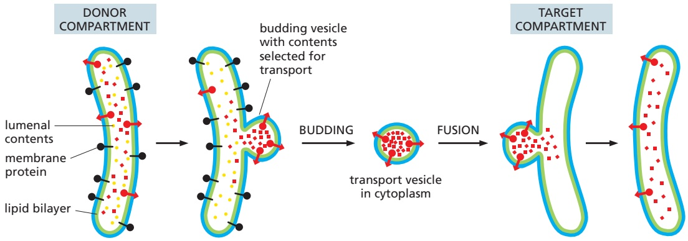
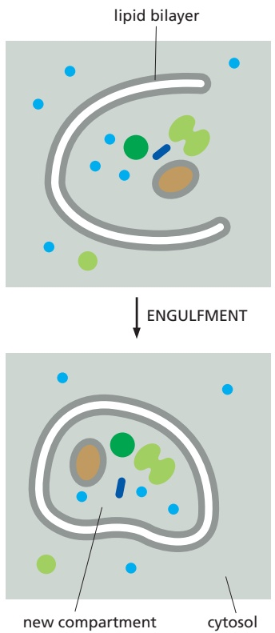
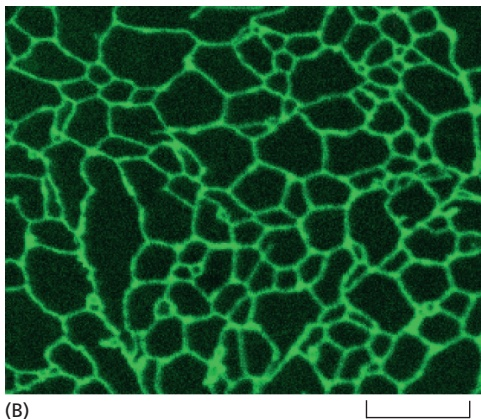
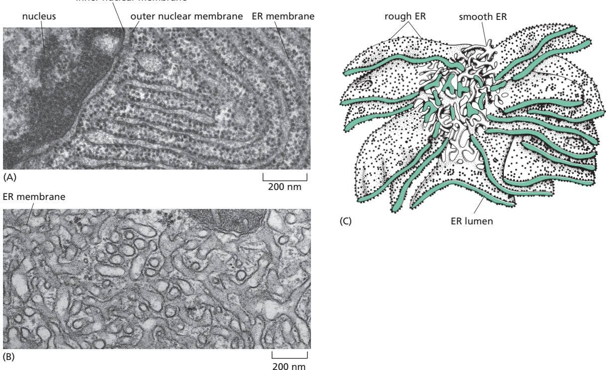
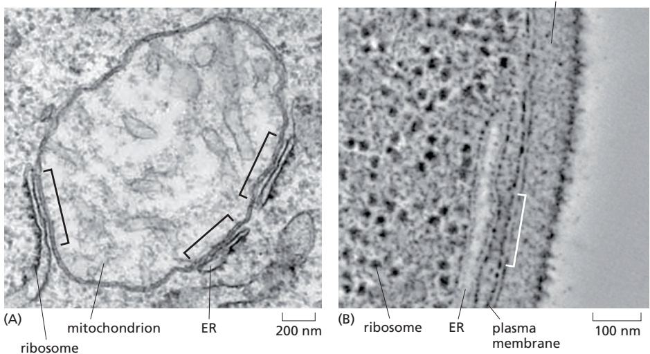
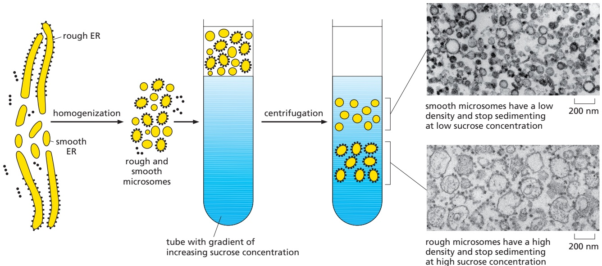

THE COMPARTMENTALIZATION OF CELLS

695

(**Figure 12–11**). The transfer of soluble and membrane-embedded proteins from the ER to the Golgi apparatus, for example, occurs in this way. The proteins transported by vesicular transport never cross a membrane during the process, and therefore retain their topological relationships within the cell.

4. In **engulfment**, such as autophagy (discussed in Chapter 13), doublemembrane sheets wrap around portions of the cytoplasm often including fragments of organelles or even entire organelles (**Figure 12–12**). This membrane structure then seals by membrane fusion to enclose a separate compartment, the autophagosome. The re-formation of the nuclear envelope after mitosis (discussed later in this chapter) follows a conceptually similar process. ER tubes and sheets wrap around decondensing chromosomes and then fuse laterally with one another to form a sealed double-membrane envelope only traversed by the nuclear pores.

In addition to these mechanisms for protein movement into and betweenMBoC7 m12.06/12.11 membrane-enclosed compartments, a simpler mechanism based on direct physical binding is used by macromolecules to enter biomolecular condensates. In this mechanism, the macromolecule specifically binds to another protein or RNA that is already part of the condensate to which it is specifically recruited. Once recruited, the macromolecule remains within the condensate because of persistent and repeated interactions with its partner. The interaction between a macromolecule and its binding partner in the condensate is analogous to the interaction between a sorting signal and its cognate sorting receptor; in both cases, the interaction specifies the macromolecule’s destination.

## Sorting Signals and Sorting Receptors Direct Proteins to the Correct Cell Address

Sorting signals are usually composed of amino acid side chains in a protein and come in two general varieties: a linear sequence of amino acids (called a signal sequence) or a specific three-dimensional arrangement of amino acids (called a signal patch). Sorting signals for protein translocation into organelles are linear **signal sequences**, while examples of linear signals and **signal patches** are known for nuclear and vesicular transport. The linear signal sequences for protein translocation are often found at the N-terminus of the polypeptide chain. These N-terminal signal sequences are usually removed from the finished protein by specialized **signal peptidases** once the sorting process is complete. Other types of signal sequences are not removed and remain part of the final mature protein.

Each signal sequence specifies a particular destination in the cell. The signal sequence for initial transfer to the ER usually includes a linear sequence of about 5–10 predominantly hydrophobic amino acids. Many of these proteins will in turn pass from the ER to the Golgi apparatus, but those with a specific signal sequence

Figure 12–11 Vesicle budding and fusion during vesicular transport. Transport vesicles bud from one compartment (donor) and fuse with another topologically equivalent (target) compartment. In the process, a subset of soluble components (red dots) are transferred from lumen to lumen. Note that membrane is also transferred and that the original orientation of both proteins and lipids in the donor compartment membrane is preserved in the target compartment membrane. Thus, membrane proteins retain their asymmetrical orientation, with the same domains always facing the cytosol.

Figure 12–12 Formation of a new compartment by engulfment of contents inside of a membrane.

---

696

Chapter 12: Intracellular Organization and Protein Sorting

of four amino acids at their C-terminus are recognized as ER residents and are returned to the ER. Proteins destined for mitochondria have signal sequences of yet another type, in which positively charged amino acids alternate with hydrophobic ones. The signal for protein import into the nucleus is composed primarily of positively charged amino acids. Finally, many proteins destined for peroxisomes have a signal sequence of three characteristic amino acids at their C-terminus. A sorting signal for any particular destination needs to be sufficiently distinctive from all other sequences to permit its selective recognition by the appropriate sorting receptor.

**Figure 12–13** presents some specific signal sequences. Experiments in which the peptide is transferred from one protein to another by genetic engineering techniques have demonstrated the importance of each of these signal sequences for protein targeting. Placing the N-terminal ER signal sequence at the beginning of a cytosolic protein, for example, redirects the protein to the ER; removing or mutating the signal sequence of an ER protein causes its retention in the cytosol. Signal sequences are therefore both necessary and sufficient for protein targeting. Even though their amino acid sequences can vary greatly, the signal sequences of proteins having the same destination are often functionally interchangeable; in these instances, physical properties, such as hydrophobicity, are more important in the signal-recognition process than the exact amino acid sequence.

import into nucleus

– Pro – Pro – Lys – Lys – Lys – Arg – Lys – Val –

export from nucleus

– Met – Glu – Glu – Leu – Ser – Gln – Ala – Leu – Ala – Ser – Ser – Phe –

import into mitochondria

N – Met – Leu – Ser – Leu – Arg – Gln – Ser – Ile – Arg – Phe – Phe – Lys – Pro – Ala – Thr – Arg – Thr –

Leu – Cys – Ser – Ser – Arg – Tyr – Leu – Leu –

import into plastids

$$
\begin{array}{l} \text {N - Met - Val - Ala - Met - Ala - Met - Ala - Ser - Leu - Gln - Ser - Ser - Met - Ser - Ser - Leu - Ser - } \\ \text {Leu - Ser - Ser - Asn - Ser - Phe - Leu - Gly - Gln - Pro - Leu - Ser - Pro - Ile - Thr - Leu - Ser - Pro - } \\ \text {Phe - Leu - Gln - Gly -} \end{array}
$$

import into peroxisomes

Ser – Lys – Leu – C

import into ER

N – Met – Met – Ser – Phe – Val – Ser – Leu – Leu – Leu – Val – Gly – Ile – Leu – Phe – Trp – Ala – Thr –

Glu – Ala – Glu – Gln – Leu – Thr – Lys – Cys – Glu – Val – Phe – Gln –

return to ER

Lys – Asp – Glu – Leu – C

Figure 12–13 Examples of signal sequences that direct proteins to different intracellular locations. The primary characteristic features of each type of signal sequence are highlighted in color. Where they are known to be important for the function of the signal sequence, negatively charged amino acids are shown in blue and positively charged amino acids are shown in red. Similarly, important hydrophobic amino acids are shown in green and important uncharged polar amino acids are shown in yellow. N– indicates the N-terminus of a protein; –C indicates the C-terminus.

---

THE COMPARTMENTALIZATION OF CELLS

697

Sorting signals are recognized by complementary sorting receptors that guide proteins to their appropriate destination, where the receptors unload their cargo. The receptors function catalytically: after completing one round of targeting, they return to their point of origin to be reused. Most sorting receptors recognize classes of proteins rather than an individual protein species. They can therefore be viewed as public transportation systems, dedicated to delivering numerous different components to their correct locations in the cell.

## Construction of Most Organelles Requires Information in the Organelle Itself

When a cell reproduces by division, it has to duplicate its chromosomes, its enclosing plasma membrane, and its organelles. In general, cells do this by expanding the plasma membrane and organelles with new proteins and lipids before division and segregation to the two daughter cells. The delivery of new proteins for growth of the ER, mitochondria, and plastids requires preexisting organelle-specific protein translocators. Because the incorporation of new protein translocators requires a preexisting protein translocator, a cell must already have at least some functional ER to make more ER; the same applies to mitochondria and plastids. Thus, two types of information are required to construct these organelles: the DNA that specifies an organelle’s proteins and preexisting protein translocator(s) in the organellar membrane for incorporating new deliveries of protein. Both types of information are passed from parent cell to daughter cells to maintain the cell’s compartmental organization.

Some organelles, such as lysosomes, acquire all of their proteins and membrane by vesicular transport from other organelles (see Chapter 13). Because it is possible, in principle, to construct such organelles de novo, they do not necessarily have to be inherited at cell division. Similarly, biomolecular condensates can be constructed de novo by self-assembly of the constituent proteins and nucleic acids. Thus, during cell division, a condensate can be disassembled, its constituents distributed stochastically among the two daughter cells, then reassembled into a condensate. This is how the nucleolus is acquired by daughter cells.

## Summary

Eukaryotic cells contain intracellular membrane-enclosed organelles that make up nearly half the cell’s total volume. The main ones present in all eukaryotic cells are the endoplasmic reticulum, Golgi apparatus, nucleus, mitochondria, lysosomes, endosomes, and peroxisomes; plant cells also contain plastids such as chloroplasts. All organelles contain distinct sets of proteins, which mediate each organelle’s unique function.

Cells can also segregate subsets of their macromolecules into biomolecular condensates such as the nucleolus. The components inside these condensates can work together to carry out specialized biochemical reactions. The cell contains a dozen or more condensates that vary widely in size and can assemble and disassemble in response to need.

Each newly synthesized organellar protein must find its way from a ribosome in the cytosol, where the protein is made, to the organelle where it functions. It does so by using sorting signals in its amino acid sequence that are recognized by complementary sorting receptors, which deliver the protein to the appropriate target organelle. Proteins that function in the cytosol do not contain sorting signals and therefore remain there after they are synthesized.

During cell division, organelles such as the ER and mitochondria are distributed to each daughter cell. These organelles contain information that is required for their construction, and so they cannot be made de novo. Biomolecular condensates can be constructed de novo because they self-assemble from components that are encoded genetically.

---

698

Chapter 12: Intracellular Organization and Protein Sorting

ER tubules

ER sheets

10 µm

Figure 12–14 Fluorescence micrographs of the endoplasmic reticulum. (A) An animal cell in tissue culture that was genetically engineered to express an ER membrane protein fused to a fluorescent protein. The ER extends as a network of tubules and sheets throughout the entire cytosol, so that all regions of the cytosol are close to some portion of the ER membrane. The outer nuclear membrane, which is continuous with the ER, is also stained. (B) Part of an ER network in a living plant cell that was genetically engineered to express a fluorescent protein in the ER. (A, courtesy of Patrick Chitwood and Gia Voeltz. B, courtesy of Petra Boevink and Chris Hawes.)

## THE ENDOPLASMIC RETICULUM

The membrane of the **endoplasmic reticulum (ER)** typically constitutes more than half of the total membrane of an average animal cell (see Table 12–2). The ER is organized into a netlike labyrinth of branching tubules and flattened sacs that extends throughout the cytosol (**Figure 12–14** and **Movie 12.2**). The tubules and sacs interconnect, and their membrane is continuous with the outer nuclear membrane. This membrane system encloses a single internal space, called the **ER lumen**, which is continuous with the space between the inner and outerMBoC7 m12.31/12.14 nuclear membranes. The ER often occupies more than 10% of the total cell volume (see Table 12–1).

The ER has a central role in the biosynthesis of both lipids and proteins, and the ER lumen stores intracellular $\mathrm { C a ^ { 2 + } }$ that is mobilized in many cell signaling responses (discussed in Chapter 15). The ER membrane is the site of production of many of the transmembrane proteins and lipids of the cell’s organelles, including the ER itself, the Golgi apparatus, lysosomes, endosomes, secretory vesicles, peroxisomes, and the plasma membrane. The ER membrane is also the site at which most of the lipids for mitochondrial and plastid membranes are made. In addition, almost all of the proteins that will be secreted to the cell exterior— plus those destined for the lumen of the ER, Golgi apparatus, or lysosomes—are initially delivered to the ER lumen.

## The ER Is Structurally and Functionally Diverse

While the various functions of the ER are essential to every cell, their relative importance varies greatly between individual cell types. To meet different functional demands, distinct regions of the ER become highly specialized. Functional specialization entails dramatic changes in the proportional abundance of different parts of the ER. These changes are observed as characteristically different types of ER membrane in different types of cells. The most visually remarkable specializations are the **rough ER** and **smooth ER** (**Figure 12–15**). The rough appearance is due to the abundance of ribosomes engaged in protein synthesis bound to the surface of this part of the ER. By contrast, regions of smooth ER lack ribosomes and are dedicated to other ER functions such as the biosynthesis and metabolism of lipids. All cells have both rough and smooth ER, but their relative abundance can vary enormously in specialized cells.

Most secreted proteins are synthesized by the ribosomes that stud the surface of the rough ER. Thus, cells specialized to secrete vast amounts of protein are packed with an abundance of rough ER. For example, exocrine cells of the pancreas secrete their own weight in digestive enzymes every day, explaining why the rough ER makes up 60% of these cells’ membranes (see Table 12–2). Similarly, antibody-secreting plasma cells and insulin-secreting β cells also contain a markedly expanded rough ER. This correlation between highly secretory cells and an

---

THE ENDOPLASMIC RETICULUM

699

Figure 12–15 The rough and smooth ER. (A) An electron micrograph of the rough ER in a pancreatic exocrine cell that makes and secretes large amounts of digestive enzymes every day. The cytosol is filled with closely packed sheets of ER membrane that are studded with ribosomes. At the top left is a portion of the nucleus and its nuclear envelope; note that the outer nuclear membrane, which is continuous with the ER, is also studded with ribosomes. (B) Abundant smooth ER in a cell that secretes steroid hormone. This electron micrograph is of a testosterone-secreting Leydig cell in the human testis. (C) A three-dimensional reconstruction of a region of smooth ER and rough ER in a liver cell. The rough ER forms oriented stacks of flattened cisternae, each having a lumenal space 20–30 nm wide. The smooth ER membrane is connected to these cisternae and forms a fine network of tubules 30–60 nm in diameter. The ER lumen is colored green. (A, courtesy of Lelio Orci. B, courtesy of Daniel S. Friend, by permission of E.L. Bearer. C, after R.V. Kristi ć, Ultrastructure of the Mammalian Cell. New York: Springer-Verlag, 1979. With permission from Springer Nature.)

abundance of rough ER provided biologists the first clue that the ER is responsible for the synthesis and assembly of secreted proteins.7 1

In contrast to rough ER, functions for the smooth ER are more diverse and can become highly specialized. A type of smooth ER found in all cells is called transitional ER, from which transport vesicles carrying newly synthesized proteins and lipids bud off for transport to the Golgi apparatus. In certain specialized cells, the smooth ER has additional functions that warrant its expansion. For example, cells that synthesize steroid hormones contain prominent smooth ER to accommodate the enzymes that make cholesterol and modify it to form a variety of steroid hormones (see Figure 12–15B).

The main cell type in the liver, the hepatocyte, also has expanded amounts of smooth ER (see Table 12–2) serving two separate purposes. The hepatocyte is the principal site of production of lipoprotein particles, which carry lipids via the bloodstream to other parts of the body. The enzymes that synthesize the lipid components of the particles are enriched in the membrane of the smooth ER. In addition, these membranes contain enzymes that catalyze a series of reactions to detoxify drugs and various harmful compounds produced by metabolism. The most extensively studied of these detoxification reactions are carried out by the cytochrome P450 family of enzymes. They catalyze a series of reactions in which water-insoluble drugs or metabolites that would otherwise accumulate to toxic levels in cell membranes are rendered sufficiently water soluble to leave the cell and be excreted in the urine or bile.

Another crucially important function of the ER in most eukaryotic cells is to sequester $\mathrm { C a ^ { 2 + } }$ from the cytosol. The release of $\mathrm { C a ^ { 2 + } }$ into the cytosol from the

---

700

Chapter 12: Intracellular Organization and Protein Sorting

cell wall

Figure 12–16 The ER makes close contacts with the mitochondria and plasma membrane. Electron micrographs of organelle contact sites between the ER and other membranes. (A) Region of a mouse embryonic fibroblast showing a mitochondrion that is closely apposed by sections of ER (black brackets). (B) Yeast cell showing a section of the ER that is closely juxtaposed with the plasma membrane (white bracket). [A, from P. Cosson et al., PLOS ONE 7(9):e46293, 2012. Courtesy of Pierre Cosson. B, courtesy of Wanda Kukulski.]MBoC7 n12.102/12.1

ER, and its subsequent reuptake, occur in many rapid responses to extracellular signals, as discussed in Chapter 15. $\mathrm { A   C a ^ { 2 + } }$ pump transports $\mathrm { C a ^ { 2 + } }$ from the cytosol into the ER lumen. A high concentration of $\mathbf { \bar { C } } \mathbf { a } ^ { 2 + }$ -binding proteins in the ER facilitates $\mathrm { C a ^ { 2 + } }$ storage. In some cell types, specific regions of the ER are specialized for $\mathrm { C a ^ { 2 + } }$ storage. Muscle cells have an abundant, modified smooth ER called the sarcoplasmic reticulum. The release and reuptake of $\mathrm { C a ^ { 2 + } }$ by the sarcoplasmic reticulum trigger myofibril contraction and relaxation, respectively, during each round of muscle contraction (discussed in Chapter 16).

Finally, the smooth ER can be specialized in regions that make intimate contacts with other organelles, most notably the mitochondria, plastids, endosomes, and the plasma membrane (**Figure 12–16**). These **organelle contact sites** are enriched for proteins involved in communication or transport of key metabolites between the juxtaposed membranes. For example, the transport of lipids from their site of synthesis in the ER to the mitochondrion is thought to occur at ER– mitochondria contact sites. Contact of ER with the plasma membrane modulates levels of plasma membrane phosphoinositides, which are lipids that participate in numerous signaling pathways (discussed in Chapters 13 and 15). Contacts between other combinations of organelles have also been observed, and it is likely that these are also involved in the selective transfer of lipids and other metabolites.

To study the functions and biochemistry of the ER, it is necessary to isolate it. This may seem to be a hopeless task because the ER is intricately interleaved with other components of the cytoplasm. Fortunately, when tissues or cells are disrupted by homogenization, the ER breaks into fragments, which reseal to form small (∼100–200 nm in diameter) closed vesicles called **microsomes** (**Figure 12–17**). To the biochemist, microsomes represent small authentic versions of the ER, still capable of protein translocation, protein glycosylation (discussed later), $\mathrm { C a ^ { 2 + } }$ uptake and release, and lipid synthesis. Rough microsomes, derived from rough ER, contain ribosomes on their outside surface and enclose a small part of the ER lumen. Smooth microsomes, which lack ribosomes, are derived from vesiculated fragments of the smooth ER, plasma membrane, Golgi apparatus, endosomes, and mitochondria. The ribosomes attached to rough microsomes make them denser than smooth microsomes. As a result, scientists use equilibrium density centrifugation to separate the rough and smooth microsomes (Figure 12–17). Smooth microsomes derived from different organelles can

---

THE ENDOPLASMIC RETICULUM

701

Figure 12–17 The isolation of purified rough and smooth microsomes from the ER. When an intact cell or tissue is homogenized, many of its membrane-enclosed compartments form small sealed vesicles called microsomes. When this mixture of vesicles is sedimented to equilibrium through a gradient of sucrose, the two types of microsomes separate from each other on the basis of their different densities. Note that the smooth fraction contains non-ER–derived material. Thin section electron micrographs of the purified smooth and rough microsome fractions show an abundance of ribosomestudded vesicles in the rough microsome fraction that originated from the rough ER. These are not seen in the smooth microsome fraction, which primarily contains ribosome-free vesicles originating from the smooth ER, Golgi cisternae, and other organelles. (Electron micrographs courtesy of George Palade.)

be further separated on the basis of differences in their protein content. Microsomes have been invaluable in elucidating the molecular aspects of ER function, as we discuss next.

## Signal Sequences Were First Discovered in Proteins Imported into the Rough ER

The ER captures selected proteins from the cytosol as they are being synthesized. These proteins are of two types: transmembrane proteins, which become embedded in the ER membrane, and water-soluble proteins, which are fully translocated across the ER membrane into the ER lumen. Some of these proteins function in the ER, but many are destined to reside in another organelle, to reside in the plasma membrane, or to be secreted outside the cell. All of these proteins, regardless of their subsequent fate, are initially directed to the ER membrane by an **ER signal sequence**.

Signal sequences (and the signal sequence strategy of protein sorting) were discovered in secreted water-soluble proteins that are first translocated across the ER membrane. In the key experiment, the mRNA encoding a secreted protein was added to cytosol extracted from cells. In this cell-free reaction, ribosomes in the cytosol translated the mRNA into a protein that was slightly larger than the normal secreted protein (**Figure 12–18**). When the reaction was repeated in the presence of microsomes derived from the rough ER, a protein of the correct size was produced and located inside the microsomes (Figure 12–18). By contrast, mRNA encoding a cytosolic protein produced the correctly sized product regardless of the presence or absence of rough microsomes. The signal hypothesis was formulated to explain these observations. According to this model, the mRNA for the secretory protein codes for a protein that is bigger than the protein that is eventually secreted. It was proposed that the extra polypeptide is a signal sequence that directs the secreted protein to the ER membrane. After the signal sequence has served its function, it is cleaved off by a signal peptidase in the ER membrane before the polypeptide chain has been completed.

---

702

Chapter 12: Intracellular Organization and Protein Sorting

Figure 12–18 Experimental basis for the signal hypothesis. In a test tube, cytosol is mixed with mRNA that codes for a secreted protein. Two versions of this reaction are performed: one lacking and the other containing rough microsomes derived from the ER (see Figure 12–17). In both reactions, ribosomes in the cytosol translate the mRNA to produce a protein. The protein produced in the reaction lacking microsomes was observed to be slightly larger than the protein produced in the reaction containing microsomes. This difference in size was shown to be due to a small segment of protein at the N-terminus that was selectively removed only in the reaction containing microsomes. Additional analysis showed that the protein produced in the presence of microsomes was located in the microsome lumen. This collection of results was used to formulate the signal hypothesis. This sequence at the N-terminus was postulated to represent a signal sequence. When the ER signal sequence emerges from the ribosome, it directs the ribosome to a translocator on the ER membrane that forms a pore in the membrane through which the polypeptide is translocated. A signal peptidase is closely associated with the translocator and clips off the signal sequence during translation, and the mature protein is released into the lumen of the ER immediately after its synthesis is completed. The translocator is closed until the ribosome has bound, so that the permeability barrier of the ER membrane is maintained at all times.

These experiments highlight how a complex cellular process such as ER import can be reconstituted in a cell-free system by mixing together requisite cellular components such as mRNA, cytosol, and microsomes. By combining the constituent parts in different ways, the existence of signal sequencesMBoC7 m12.35/12.18 on secreted proteins was deduced long before it became possible to directly sequence their mRNAs. The ease with which this cell-free system could be manipulated proved indispensable for identifying, purifying, and studying the various components of the molecular machinery responsible for ER import. Similar systems were later established to dissect protein transport into and out of the nucleus, protein import into mitochondria and chloroplasts, and vesicular transport.

## A Signal-Recognition Particle (SRP) Directs the ER Signal Sequence to a Specific Receptor at the ER

The ER signal sequence is guided to the ER membrane by at least two components: a **signal-recognition particle (SRP)**, which binds to the signal sequence, and an **SRP receptor** in the ER membrane. SRP is a large complex; in animal cells, it consists of six different polypeptide chains bound to a single RNA molecule (**Figure 12–19A**). While SRP and SRP receptor have fewer subunits in bacteria, homologs of both components are present in all living organisms.

---

THE ENDOPLASMIC RETICULUM

703

Figure 12–19 The signal-recognition particle (SRP). (A) A mammalian SRP is a rodlike ribonucleoprotein complex containing six protein subunits (brown) and one RNA molecule (blue). The SRP RNA forms a backbone that links the protein domain containing the signal sequence–binding pocket to the domain responsible for slowing translation. (B) Structure of the signal sequence–binding domain of SRP bound to the hydrophobic region of a signal sequence (red cylinder). The surfaces of SRP that are hydrophobic are depicted in yellow. (C) The three-dimensional outline of the SRP bound to a ribosome was determined by cryo-electron microscopy. SRP binds to the large ribosomal subunit so that its signal sequence–binding pocket is positioned near the growing polypeptide chain exit site. Its translational pause domain is positioned at the interface between the ribosomal subunits, where it interferes with elongation factor binding. (D) As a signal sequence emerges from the ribosome and binds to the SRP, a conformational change in the SRP exposes a binding site for the SRP receptor. (C, adapted from M. Halic et al., Nature 427:808–814, 2004.)

This protein-targeting mechanism therefore arose early in evolution and has been conserved.

ER signal sequences vary greatly in amino acid sequence, but each has eight or more nonpolar amino acids at its center (see Figure 12–13). How can SRP bind specifically to so many different sequences? The answer has come from structures of one of the SRP proteins, which shows that the signal sequence–binding site is a large hydrophobic pocket enriched in methionines (**Figure 12–19B**). Because methionines have unbranched, flexible side chains, the pocket is sufficiently plastic to accommodate different hydrophobic signal sequences of various sizes and shapes.

In eukaryotic cells, SRP is a hinged rodlike structure that can wrap along the large ribosomal subunit (**Figure 12–19C**). The end of SRP that contains the signal sequence–binding pocket is positioned near the ribosomal tunnel through which newly made polypeptides emerge. This allows SRP to engage a signal sequence as it emerges from the ribosome. Once SRP engages a signal sequence, the other end of SRP can bind at the interface between the large and small ribosomal subunits (**Figure 12–19D**). This is the same site where translation elongation factors bind, so a ribosome engaged by SRP will translate proteins more slowly than normal. Slower translation presumably gives the ribosome enough time to bind to the ER membrane before completion of the polypeptide

---

704

Chapter 12: Intracellular Organization and Protein Sorting

chain, thereby ensuring that the protein is not released into the cytosol. This safety device may be especially important for secreted and lysosomal hydrolases, which could wreak havoc in the cytosol; cells that secrete large amounts of hydrolases, however, take the added precaution of having high concentrations of hydrolase inhibitors in their cytosol.

When a signal sequence binds, SRP exposes a binding site for an SRP receptor (see Figure 12–19D), which is a transmembrane protein complex in the rough ER membrane. The binding of SRP to its receptor brings the SRP–ribosome complex to an unoccupied **protein translocator** in the ER membrane. The part of SRP bound near the ribosomal tunnel moves to a different site, allowing the translocator to occupy this position. SRP and SRP receptor are then released, and protein synthesis resumes at full speed. The translocator, which is now tightly bound to the translating ribosome, transfers the growing polypeptide chain across the membrane (**Figure 12–20**).

This **co-translational** transfer process creates two spatially separate populations of ribosomes. **Membrane-bound ribosomes**, attached to the cytosolic side of the ER membrane, are engaged in the synthesis of proteins that are being concurrently translocated across the ER membrane. **Free ribosomes**, unattached to any membrane, synthesize all other proteins encoded by the nuclear genome. Membrane-bound and free ribosomes are structurally and functionally identical. They differ only in the proteins they are making at any given time.

Because many ribosomes can engage with a single mRNA molecule, a **polyribosome** is usually formed. If the mRNA encodes a protein with an ER signal sequence, the polyribosome becomes attached to the ER membrane, directed there by the signal sequences on multiple growing polypeptide chains. The individual ribosomes associated with such an mRNA molecule can return to the cytosol when they finish translation and intermix with the pool of free ribosomes. The mRNA itself, however, remains attached to the ER membrane by a

Figure 12–20 How ER signal sequences and SRP direct ribosomes to the ER membrane. The SRP and its receptor act in concert. The SRP binds to both the exposed ER signal sequence and the ribosome, thereby causing translation to slow. The SRP receptor in the ER membrane, which in animal cells is composed of two different polypeptide chains, binds the SRP–ribosome complex and directs it to the translocator. The SRP (in complex with SRP receptor) then moves away from its binding site on the ribosome, which is then occupied by the translocator in the ER membrane. SRP then releases the signal sequence, which inserts into the translocator to initiate polypeptide7 12.37/12.20 chain transfer across the lipid bilayer. The SRP and SRP receptor dissociate from each other and are recycled for the next round of protein targeting. Although not shown in the figure, one of the SRP proteins and both chains of the SRP receptor contain GTP-binding domains. Conformational changes that occur during cycles of GTP binding and hydrolysis (discussed in Chapter 15) ensure that SRP preferentially binds a signal sequence in the cytosol and releases it only after SRP successfully engages the SRP receptor at the ER membrane. The energy of GTP hydrolysis is therefore used to impart directionality to the cycle of SRP-mediated protein targeting.

---

(B)

(A)

THE ENDOPLASMIC RETICULUM

705

Figure 12–21 Free and membrane-bound polyribosomes. (A) A common pool of ribosomes synthesizes the proteins that stay in the cytosol and those that are transported into the ER. The ER signal sequence on a newly formed polypeptide chain binds to SRP, which directs the translating ribosome to the ER membrane. The mRNA molecule remains bound to the ER as part of a polyribosome, while the ribosomes that move along it are recycled; at the end of each round of protein synthesis, the ribosomal subunits are released and rejoin the common pool in the cytosol. (B) A thin section electron micrograph of polyribosomes attached to the ER membrane. The plane of the section in some places cuts through the ER roughly parallel to the membrane, giving a face-on view of the circular or spiral pattern of the polyribosomes. (B, courtesy of George Palade.)

changing population of ribosomes, each transiently held at the membrane by the translocator (**Figure 12–21**).

## The Polypeptide Chain Passes Through a Signal Sequence–gated Aqueous Channel in the Translocator

It had long been debated whether polypeptide chains are transferred across the ER membrane in direct contact with the lipid bilayer or through a channel in a protein translocator. The debate ended with the identification of the translocator, which was shown to form a water-filled channel across the membrane through which the polypeptide chain passes. The core of the translocator, called the **Sec61 complex**, is built from three subunits that are highly conserved from bacteria to eukaryotic cells. The structure of the Sec61 translocator revealed that 10 α helices surround a central channel (**Figure 12–22**). The channel is plugged by a short α helix that keeps the translocator closed when it is idle. It is important to keep the channel closed to prevent ions, such as $\mathrm { C a ^ { 2 + } }$ , from leaking out of the ER. During translocation, the plug moves out of the way so the polypeptide can pass through the channel.

The Sec61 translocator only opens for proteins containing a signal sequence. The ability of the Sec61 translocator to recognize signal sequences provides a proofreading step to ensure that only proteins truly intended for the ER are

---

allowed to enter. Cryo-electron microscopy structures of the Sec61 translocator before and after signal sequence recognition show that the signal sequence wedges into a lateral gate, or seam, in Sec61 with its N-terminus facing the cytosol (Figure 12–23A). Insertion of the signal sequence at this lateral gate widens the central channel and releases the plug. The open translocator then readily accommodates the segment of polypeptide following the signal sequence inside the channel. The signal sequence, which is hydrophobic, laterally exits the gate into the membrane where it is cleaved off by signal peptidase and then rapidly degraded to amino acids by other proteases in the ER membrane and cytosol. As this mechanism illustrates, the lateral gate in the Sec61 translocator provides theMBoC7 m12.39/12.22 access route from Sec61’s central channel into the hydrophobic core of the membrane. In addition to its role in recognition of signal sequences, the lateral gate guides the integration of transmembrane proteins into the ER, as we discuss later.

706

Chapter 12: Intracellular Organization and Protein Sorting

Figure 12–22 Structure of the Sec61 translocator. (A) A side view (left, seen from the membrane) and a top view (right, seen from the cytosol) of the structure of the Sec61 translocator of the archaeon Methanococcus jannaschii (where it is called the SecY translocator). The Sec61 α subunit has an inverted repeat structure (see Figure 11–10) and is shown in blue and orange to indicate this pseudosymmetry; the two smaller β and γ subunits are shown in gray. Some regions of the Sec61 α subunit that protrude into the cytosol bind to the ribosome during protein translocation. The purple short helix forms a plug that seals the pore when the translocator is closed. When the translocator is open, the plug helix moves out of the way. The Sec61/ SecY translocator can also open sideways toward the membrane at a lateral gate. (B) Models of the closed and functionally active states of the Sec61/SecY translocator. In the active state, a protein chain can either translocate across the membrane through the central channel in the translocator or move sideways into the lipid bilayer through the lateral gate. (A, PDB code: 1RH5.)

Once the signal sequence has opened the Sec61 translocator and threaded the ensuing polypeptide into the channel, translocation occurs concurrently with continued translation. During translocation, the polypeptide tunnel inside the ribosomal large subunit is aligned with the channel within the Sec61 translocator (**Figure 12–23B**). This configuration provides a continuous path for the polypeptide from the peptidyl-transferase center in the ribosome, where new amino acids are added to the growing protein chain, to the ER lumen 15 nm away. In this way, the energy used for polypeptide elongation is indirectly harnessed to also drive translocation across the ER membrane.

When translation terminates, the C-terminus of the polypeptide is released from the ribosome and slips through the Sec61 translocator, whose plug returns to close the channel. Thus, the entire process of ER import, from signal sequence recognition by SRP to translocation through the Sec61 translocator, occurs co-translationally before the polypeptide has a chance to fold. This pathway provides one solution