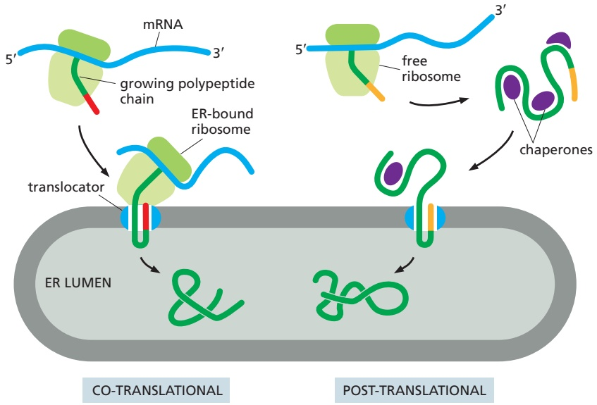
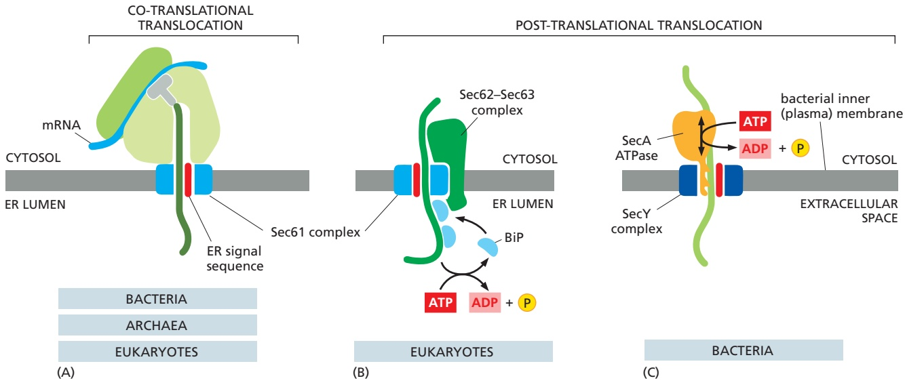
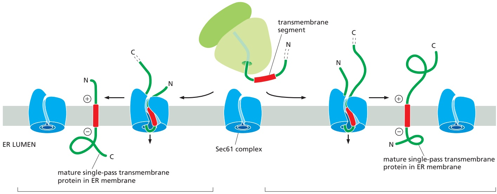
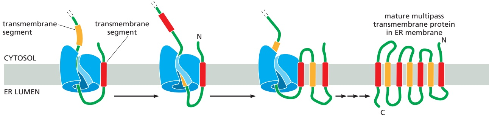
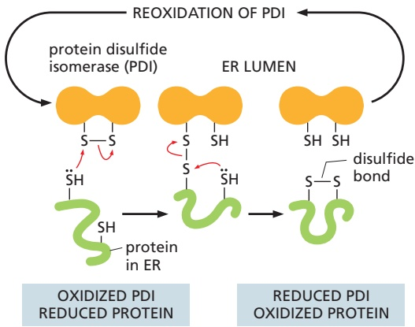
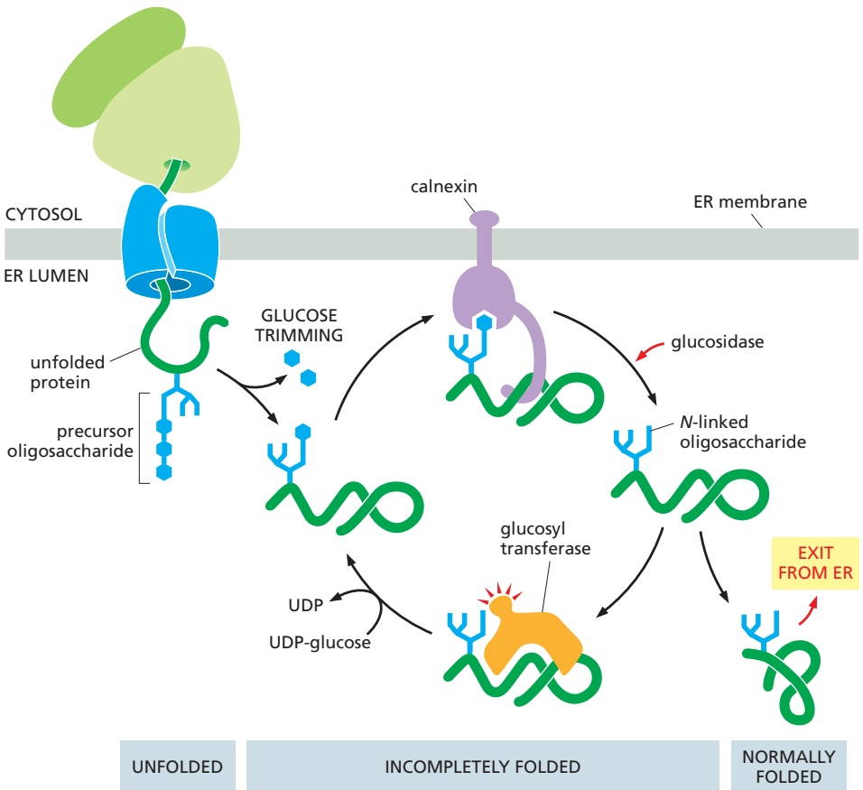
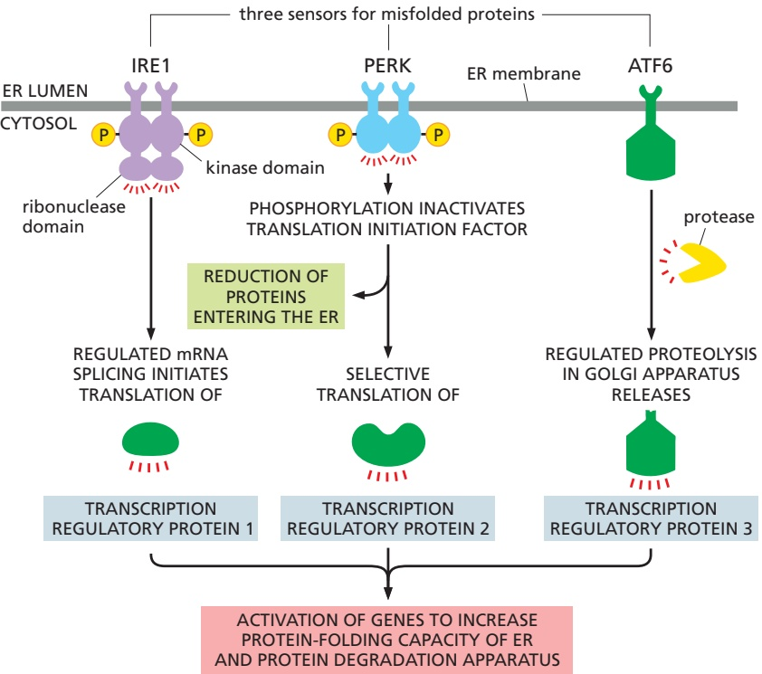

Figure 12–23 A signal sequence opens the Sec61 translocator. (A) Cross section through the Sec61 translocator before and after a signal sequence has inserted into the lateral gate. Insertion of the signal sequence causes the central channel in the translocator to widen and the plug to move out of this channel; hence, a continuous path across the membrane is now apparent (dashed line). (B) Cross section through the structure of a translating ribosome (green) bound to a Sec61 translocator (blue) that has been opened by a signal sequence (red). A translocating polypeptide is shown passing through the tunnel within the large ribosomal subunit and the Sec61 translocator. (A, PDB codes: 3J7Q and 3JC2; B, PDB code: 3JC2.)

to the problem of how to move a large protein across a membrane barrier without leakage of much smaller ions and metabolites during the process.

Translocation Across the ER Membrane Does Not Always Require Ongoing Polypeptide Chain ElongationMBoC7 m12.40/12.23

Some proteins are completely synthesized in the cytosol as precursors before they are imported into the ER, demonstrating that translocation does not always require ongoing translation (**Figure 12–24**). This is termed **post-translational** translocation. Post-translational protein translocation is more common across the yeast ER membrane and the evolutionarily related bacterial plasma membrane. In both cases, the Sec61 translocator (called SecY in bacteria) is used as the translocator; its narrow channel means that precursors can only be translocated as unfolded polypeptides. Thus, precursor proteins do not fold after their initial synthesis in the cytosol. Instead, they interact with other cytosolic proteins that prevent precursor folding or aggregation before they engage the Sec61 translocator. These interacting proteins typically are general chaperone proteins, such as those of the hsp70 family (discussed in Chapter 6), and must dissociate as the unfolded polypeptide is threaded through the translocator.

Figure 12–24 Co-translational and post-translational protein translocation. Ribosomes bind to the ER membrane during co-translational translocation. By contrast, cytosolic ribosomes complete the synthesis of a protein and release it prior to post-translational translocation. The released protein is kept unfolded in the cytosol by chaperones that dissociate before the protein is translocated across the membrane. In both cases, the protein is directed to the ER by an ER signal sequence (red and orange). See Movie 12.3.

Figure 12–25 Three ways in which protein translocation can be driven through structurally similar translocators. (A) Co-translational translocation. The ribosome is brought to the membrane by the SRP and SRP receptor and then engages with the Sec61 translocator. The growing polypeptide chain is threaded across the membrane as it is made. No additional energy is needed, as the only path available to the growing chain is to cross the membrane. (B) Post-translational translocation in eukaryotic cells requires an additional complex composed of Sec62 and Sec63 proteins. This complex is attached to the Sec61 translocator and positions BiP molecules where they can bind to the translocating chain as it emerges from the translocator in the lumen of the ER. ATP-driven cycles of BiP binding and release pull the protein into the lumen. (C) Post-translational translocation in bacteria. The completed polypeptide chain is fed from the cytosolic side into the bacterial homolog of the Sec61 translocator (called SecY) in the plasma membrane by the SecA ATPase. ATP hydrolysis– driven conformational changes drive a pistonlike motion in SecA. The piston not only pushes several amino acids of the protein chain through the pore of the translocator but also prevents backsliding of the chain into the cytosol. Whereas the Sec61 translocator, SRP, and SRP receptor are found in all organisms, SecA is found exclusively in bacteria, and the Sec62–Sec63 complex is found exclusively in eukaryotic cells. (Adapted from P. Walter and A.E. Johnson, Annu. Rev. Cell Biol. 10:87–119, 1994.)

Just as in co-translational translocation discussed earlier, the signal peptide of a precursor directly engages the Sec61 translocator to open the channel. However, the next step of translocation across the membrane occurs differently and relies on accessory proteins that use cellular energy to either pull the polypeptide across the channel from the lumenal side or feed it into the channel from the cytosol (**Figure 12–25**). To pull proteins into the ER lumen, eukaryotic cells use accessory proteins called Sec62 and Sec63 that associate with the Sec61 translocator and position an hsp70-like chaperone protein (called BiP, for binding protein) adjacent to the lumenal opening of the translocation channel. Like its cytosolic cousin, BiP has a high affinity for unfolded polypeptide chains, and it binds tightly to an imported protein chain as soon as it emerges from the Sec61 translocator in the ER lumen. Tight binding by BiP prevents the protein chain from sliding backwards, favoring more of the chain to emerge into the lumen where it can bind another molecule of BiP. ATP hydrolysis by BiP causes it to release the polypeptide, making it available to bind again to any newly emerged segments of the translocating polypeptide. This energy-driven cycle of binding and release serves as a molecular ratchet that provides the driving force for protein import after a precursor has initially inserted into the Sec61 translocator.

Because bacteria transport proteins directly to the extracellular space, where energy is not available, they use a cytosolic accessory protein called the SecA

(A)

(B)

ATPase. SecA binds to the precursor polypeptide and attaches to the cytosolic side of the translocator, where it undergoes cyclic conformational changes fueled by ATP hydrolysis. Each time an ATP is hydrolyzed, a portion of the SecA protein inserts into the pore of the translocator, pushing a short segment of the precursor protein with it. As a result of this pistonlike ratchet mechanism, the SecA ATPase progressively pushes the polypeptide chain of the transported protein across the membrane.

## Transmembrane Proteins Contain Hydrophobic Segments That Are Recognized Like Signal Sequences

All of the transmembrane proteins that populate the ER, Golgi apparatus, lysosomes, endosomes, secretory vesicles, and plasma membrane are inserted into the ER membrane before moving to their final destination. Transmembrane proteins made at the ER span the lipid bilayer via one or more α-helical hydrophobic **transmembrane segments** (see Figure 10–17). Thus, the biosynthesis of membrane proteins requires some parts of the polypeptide chain to be translocated across the lipid bilayer, other parts to remain in the cytosol, and the transmembrane segments to be integrated into the membrane. Despite this additional complexity, the same factors (SRP, SRP receptor, and the Sec61 translocator) just described for transferring a soluble protein into the ER lumen also mediate transmembrane protein integration into the ER membrane. The same factors can be used because the transmembrane segments that define a transmembrane protein resemble the hydrophobic ER signal sequences that direct soluble protein translocation.

In the simplest case, a transmembrane protein contains a single transmembrane segment that will ultimately be embedded in the lipid bilayer as a membrane-spanning α helix. When this transmembrane segment emerges from the ribosome during synthesis, SRP recognizes its hydrophobic α-helical features as a signal sequence and brings this ribosome to the Sec61 translocator at the ER membrane. The transmembrane segment then inserts into the lateral gate of the Sec61 translocator, which is the same site where signal sequences bind. The orientation in which the transmembrane segment inserts into the lateral gate determines whether the protein segment preceding or the one following the transmembrane segment is moved across the membrane into the ER lumen (**Figure 12–26**). If the N-terminus is short and unfolded, orientation of the transmembrane segment depends on features of the polypeptide chain such as the distribution of nearby charged amino acids and the length of the transmembrane segment. If the preceding N-terminal segment is long and stably folded, it does not cross the membrane through the narrow Sec61 channel. In this case, the C-terminal segment that is still being synthesized, and therefore unfolded, is translocated across the membrane.

Figure 12–26 A transmembrane segment directs membrane protein insertion into the ER membrane. Many single-pass membrane proteins use their transmembrane segment to direct insertion into the ER membrane (Movie 12.3). The transmembrane segment is recognized by SRP (not shown) and delivered via the SRP receptor (not shown) to the Sec61 translocator at the ER membrane. The transmembrane segment then inserts into the lateral gate of the Sec61 translocator in one of two orientations. (A) Some transmembrane segments insert into the lateral gate such that the N-terminal domain is retained on the cytosolic side of Sec61. This orientation is favored for proteins whose N-terminal domains are very long or folded, and for transmembrane segments whose flanking amino acids have a net positive charge on the N-terminal side. (B) Some transmembrane segments insert into the lateral gate such that the C-terminal flanking region is retained on the cytosolic side of Sec61. In this case, the N-terminal flanking region is thought to translocate across the membrane through the Sec61 channel. This orientation is favored for transmembrane segments whose flanking amino acids have a net positive charge on the C-terminal side.

Figure 12–27 Sequential use of a cleaved ER signal sequence and transmembrane segment during membrane protein insertion. Membrane proteins that contain a relatively large N-terminal domain on the lumenal side of the ER utilize both a cleaved ER signal sequence and a transmembrane segment. Targeting to the ER membrane, initiation of translocation through Sec61, and cleavage of the signal sequence all occur exactly as for a secretory protein (see Figure 12–20). However, when the transmembrane segment enters the Sec61 translocator, translocation stops and the transmembrane segment moves through the lateral gate into the lipid bilayer. The remainder of the protein continues to be synthesized on the cytosolic side of the membrane until translation terminates.

Many transmembrane proteins contain large N-terminal lumenal domains. In this case, an N-terminal signal sequence is used to initiate translocation, just as for a soluble protein. In this way, the N-terminus of the mature polypeptide is committed to the ER lumen by the signal sequence, and the remainder of the polypeptide begins translocation through the Sec61 translocator. When a hydrophobic segment in the polypeptide emerges from the ribosome, it inserts into the lateral gate to gain access to the lipid bilayer. Because the hydrophobic segment is more stable in the membrane than in the aqueous channel, it exits the channel laterally, translocation stops, and the rest of the protein is synthesized on the cytosolic side of the ER membrane (**Figure 12–27**).

## Hydrophobic Segments of Multipass Transmembrane Proteins Are Interpreted Contextually to Determine Their Orientation

In multipass transmembrane proteins, the polypeptide chain passes back and forth repeatedly across the lipid bilayer as hydrophobic α helices (see Figure 10–17). Synthesis of multipass transmembrane proteins up to the first transmembrane segment occurs as we have just described for single-pass transmembrane proteins. Hence, SRP will deliver the protein to the translocator, where the first transmembrane segment will insert into the lateral gate of the Sec61 translocator in an orientation dictated by features of the preceding N-terminal domain and nearby charged amino acids. In this way, insertion of the first transmembrane segment into the membrane effectively locks in the topology for the rest of the protein to come. From this point onward, each successive hydrophobic segment is interpreted by the Sec61 translocator on the basis of the topology and properties of the preceding parts of the protein.

Because of the tight coupling between the ribosome and Sec61 translocator, each hydrophobic segment emerges very close to the lateral gate that provides access to the lipid bilayer. In the simplest cases, the newly emerged hydrophobic segment engages the lateral gate in an orientation opposite to the most recently inserted transmembrane segment and inserts into the lipid bilayer (**Figure 12–28**). Some transmembrane segments of multipass proteins are only partially hydrophobic and would not be stable in the lipid bilayer on their own. These can nevertheless insert into the membrane if they are able to interact with one of the preceding transmembrane segments that is near the lateral gate of Sec61. This cooperation makes it possible to produce multipass transmembrane proteins that contain hydrophilic parts within the lipid bilayer, which is crucial for many important proteins such as transporters and channels (discussed in Chapter 11). The hydrophilic sequences between the transmembrane segments are either synthesized into the cytosol or threaded through the Sec61 translocator, depending on the orientation of the preceding transmembrane segment. In thisMBoC7 m12.44/12.28 way, a multipass protein is woven into the membrane with successive hydrophobic segments achieving opposite orientations until all of them have been inserted into the membrane as transmembrane α helices.

Figure 12–28 The insertion of a multipass transmembrane protein into the ER membrane. The events up to the insertion of the first transmembrane segment follow the steps for single-pass membrane proteins (see Figures 12–26 and 12–27). The orientation of this first transmembrane segment depends on the characteristics of the transmembrane segment and flanking regions just as for single-pass membrane proteins. When the next transmembrane segment emerges from the ribosome, it inserts into the lateral gate of Sec61 in an orientation opposite to that of the first transmembrane segment, then moves into the lipid bilayer. Each successive transmembrane segment is similarly inserted into the membrane via the lateral gate in an orientation opposite to that of the transmembrane segment that immediately preceded it. This proceeds until all transmembrane segments have been inserted into the membrane.

Because membrane proteins are always inserted from the cytosolic side of the ER in this programmed manner, all copies of the same polypeptide chain will have the same orientation in the lipid bilayer. This generates an asymmetrical ER membrane in which the protein domains exposed on one side are different from those exposed on the other side. This asymmetry is maintained during the many membrane budding and fusion events that transport the proteins made in the ER to other cell membranes (discussed in Chapter 13). Thus, the way in which a newly synthesized protein is inserted into the ER membrane determines the orientation of the protein in all of the other membranes as well.

## Some Proteins Are Integrated into the ER Membrane by a Post-translational Mechanism

Many important cytosol-facing membrane proteins are anchored in the membrane by a single transmembrane α helix very close to the C-terminus. These **tail-anchored proteins** include a large number of SNARE protein subunits that guide vesicular traffic (discussed in Chapter 13). When a tail-anchored protein is translated, the ribosome reaches the termination codon while the polypeptide sequence destined to become a transmembrane α helix is still inside the ribosome exit tunnel. Recognition by SRP is therefore not possible, and the protein is released from the ribosome into the cytosol. The hydrophobic segment is recognized by a specialized chaperone complex that transfers it to a targeting factor called Get3 (**Figure 12–29**). Although unrelated to SRP, Get3 also contains a hydrophobic pocket lined by many methionine side chains to help it recognize diverse hydrophobic segments independent of their exact sequence. Two proteins at the ER membrane called Get1 and Get2 serve not only as the receptor for Get3 but also as the translocator that inserts the hydrophobic segment of the tail-anchored protein into the lipid bilayer. This post-translational targeting mechanism is therefore conceptually similar to SRP-dependent protein targeting (see Figure 12–20). Some tail-anchored proteins are targeted to mitochondria or peroxisomes instead of the ER, but the mechanism of their targeting is not known.

Figure 12–29 The insertion mechanism for tail-anchored proteins. (A) In this post-translational pathway for the insertion of tail-anchored membrane proteins into the ER, a soluble pre-targeting complex captures the hydrophobic C-terminal transmembrane segment (red) after it emerges from the ribosomal exit tunnel and loads it onto the Get3 targeting factor. The resulting complex is targeted to the ER membrane by interaction with the Get1–Get2 receptor complex, which functions as a membrane protein insertion machine. After the tail-anchored protein is released from Get3 and inserted into the ER membrane, Get3 is recycled back to the cytosol. This targeting cycle is conceptually similar to protein targeting by SRP (see Figure 12–20). Although not shown in the figures, both Get3 and SRP bind and hydrolyze nucleoside triphosphates to provide directionality to the targeting cycle. ATP is used by Get3, and GTP is used by SRP. (B) Crystal structure of the Get3 targeting MBOC7 m12.46/12.29 factor bound to a transmembrane segment (red helix). The hydrophobic transmembrane segment binds to a deep groove in Get3 lined by hydrophobic amino acids (yellow), including many flexible methionines. (PDB code: 4XTR.)

## Some Membrane Proteins Acquire a Covalently Attached Glycosylphosphatidylinositol (GPI) Anchor

Another way that proteins are attached to the membrane is by a **glycosylphosphatidylinositol (GPI) anchor** that is covalently linked to the C-terminus of some proteins destined for the plasma membrane. GPI-anchored proteins are initially made with an N-terminal signal sequence to direct them to the ER and a hydrophobic segment very close to the C-terminus. This hydrophobic segment is selectively recognized by a transamidase enzyme in the ER membrane that simultaneously cleaves off the hydrophobic segment and attaches a preformed GPI anchor to the rest of the protein (**Figure 12–30**). Many plasma membrane proteins are modified in this way. Because they are attached to the exterior of the plasma membrane only by their GPI anchors, they can be released from cells in soluble form in response to signals that activate a specific phospholipase in the plasma membrane. Trypanosome parasites, for example, use this mechanism to shed their coat of GPI-anchored surface proteins when attacked by the immune system. GPI anchors also participate in directing some plasma membrane proteins into specialized domains, such as lipid rafts, thus laterally segregating them from other membrane proteins (see Figure 10–13).

## Translocated Polypeptide Chains Fold and Assemble in the Lumen of the Rough ER

Proteins enter the ER lumen as unfolded polypeptides. They must therefore fold and assemble into their correct three-dimensional structures just as newly made proteins in the cytosol must fold (discussed in Chapter 3). To meet this demand, the lumen of the ER contains a high concentration of resident chaperones and other protein-folding catalysts. These **ER resident proteins** contain an **ER retention signal** of four amino acids at their C-terminus that is responsible for retaining the protein in the ER (see Figure 12–13; discussed in Chapter 13, p. 768).

Figure 12–30 The attachment of a GPI anchor to a protein in the ER. GPI-anchored proteins are targeted to the ER membrane by an N-terminal signal sequence (not shown), integrated into the membrane, and processed by signal peptidase similarly to a single-pass transmembrane protein (see Figure 12–27). Immediately after the completion of protein synthesis, the precursor protein remains anchored in the ER membrane by a hydrophobic C-terminal sequence of 15–20 amino acids; the rest of the protein is in the ER lumen. Within less than a minute, a transamidase enzyme in the ER cleaves the protein from its membrane-bound C-terminus and simultaneously attaches the new C-terminus to an amino group on a preassembled. / . GPI intermediate. The sugar chain contains an inositol attached to the lipid from which the GPI anchor derives its name. It is followed by a glucosamine and three mannoses. The terminal mannose links to a phosphoethanolamine that provides the amino group to attach the protein through an amide bond. The signal that specifies this modification is contained within the hydrophobic C-terminal sequence and a few amino acids adjacent to it on the lumenal side of the ER membrane; if this signal is added to other proteins, they too become modified in this way. Because of the covalently linked lipid anchor, the protein remains membrane-bound, with all of its amino acids exposed initially on the lumenal side of the ER and eventually on the exterior of the plasma membrane.

The protein **BiP**, a member of the hsp70 family of chaperone proteins, is a major component of the ER folding machinery. We have already discussed how BiP pulls proteins post-translationally into the ER through the Sec61 ER translocator. Like other chaperones (discussed in Chapter 6), BiP recognizes incorrectly folded proteins, as well as protein subunits that have not yet assembled into their final oligomeric complexes. It does so by binding to exposed hydrophobic amino acid sequences that would normally be buried in the interior of correctly folded or assembled polypeptide chains. The bound BiP both prevents the protein from aggregating and helps keep it in the ER (and thus out of the Golgi apparatus and later parts of the secretory pathway). BiP hydrolyzes ATP to shuttle between highand low-affinity polypeptide-binding states. In this way, BiP periodically lets go of its substrate proteins to allow them an opportunity to fold, and then re-binds them if folding is not yet achieved.

The ER resident protein protein disulfide isomerase (PDI) catalyzes the oxidation of free sulfhydryl (SH) groups on cysteines to form disulfide (S}S) bonds (**Figure 12–31**). Almost all cysteines in protein domains exposed to either the

Figure 12–31 The formation of disulfide bonds in the ER. Proteins that contain free sulfhydryl (SH) groups on cysteines are oxidized during protein folding to incorporate disulfide (S}S) bonds. Protein disulfide isomerase (PDI) contains an intramolecular disulfide bond that accepts electrons from a free sulfhydryl group in the substrate protein to be oxidized. This leads to the formation of an intermolecular mixed disulfide bond between PDI and its substrate. A second free sulfhydryl group in the substrate then donates its electrons to the mixed disulfide bond, resulting in an oxidized substrate and reduced PDI. Reoxidation of PDI is carried out by other ER enzymes (not shown).

extracellular space or the lumen of organelles in the secretory and endocytic pathways are disulfide bonded. Disulfide bonds stabilize the folded state of a protein, enabling it to better withstand a harsh, variable, and chaperone-free extracellular environment. Because proteins often contain multiple cysteines, they sometimes pair incorrectly. PDI resolves this problem by rearranging the disulfide bonds in a protein until it is correctly folded. This is possible because PDI enzymes are capable of operating in reverse to reduce incorrectly paired disulfides of immature proteins. The ER lumen contains multiple members of the PDI family, some of which are specialized for reducing disulfide bonds to fully unfold misfolded proteins that need to be translocated back to the cytosol for degradation (discussed later). All PDI enzymes are therefore oxidoreductases that can catalyze either the formation or breakage of disulfide bonds in their client proteins. The formation of disulfide bonds relies on maintaining an oxidizing environment in the ER lumen. Disulfide bonds form only very rarely in domains exposed to the cytosol because of the reducing environment there.

## Most Proteins Synthesized in the Rough ER Are Glycosylated by the Addition of a Common N-Linked Oligosaccharide

The covalent addition of oligosaccharides to proteins is one of the major biosynthetic functions of the ER. About half of the soluble and membrane-bound proteins that are processed in the ER—including those destined for transport to the Golgi apparatus, lysosomes, plasma membrane, or extracellular space—are **glycoproteins** that are modified in this way. Some proteins in the cytosol and nucleus are also glycosylated, but not with large oligosaccharides: they instead carry a much simpler sugar modification, in which a single N-acetylglucosamine group is added to a serine or threonine of the protein.

During the most common form of **protein glycosylation** in the ER, a preformed precursor oligosaccharide (containing 14 sugars composed of 2 Nacetylglucosamines, 9 mannoses, and 3 glucoses) is transferred as a complete unit to proteins. Because this oligosaccharide is transferred to the side-chain NH2 group of an asparagine in the protein, it is said to be N-linked, or asparagine-linked (**Figure 12–32A**). A special lipid molecule called **dolichol** (see Panel 2–5, pp. 102–103) anchors the precursor oligosaccharide in the ER membrane. The pre-cursor oligosaccharide is transferred to the target asparagine in a single enzymatic step by an **oligosaccharyl transferase**. This membrane-bound enzyme associates with the Sec61 translocator and has its active site exposed on the lumenal side

## Figure 12–32 N-linked protein glycosylation in the rough ER.

(A) Almost as soon as a polypeptide chain enters the ER lumen, it is glycosylated on target asparagine amino acids. The precursor oligosaccharide (shown in color) is attached only to asparagine side chains in the sequences Asn-X-Ser and Asn-X-Thr (where X is any amino acid except proline). These sequences occur much less frequently in glycoproteins than in nonglycosylated cytosolic proteins. Evidently there has been selective pressure against these sequences during protein evolution, presumably because glycosylation at inappropriate sites would interfere with protein folding. The five sugars in the gray box form the core region of this oligosaccharide. For many glycoproteins, only the core sugars survive the extensive oligosaccharide trimming that takes place in the Golgi apparatus (Movie 13.4). (B) The precursor oligosaccharide is transferred from a dolichol lipid anchor to the asparagine as an intact unit in a reaction catalyzed by a transmembrane oligosaccharyl transferase enzyme complex. One copy of this enzyme is associated with each protein translocator in the ER membrane. Oligosaccharyl transferase contains 13 transmembrane α helices and a large ER lumenal domain that contains binding sites for the nascent protein and dolichol–oligosaccharide. The asparagine binds a tunnel that penetrates the enzyme interior. There, the amino group of the asparagine is twisted out of the plane that stabilizes the otherwise poorly reactive amide bond, activating it for reaction with the dolichol–oligosaccharide.

Figure 12–33 Synthesis of the lipidlinked precursor oligosaccharide in the rough ER membrane. The oligosaccharide is assembled sugar by sugar onto the carrier lipid dolichol (a polyisoprenoid; see Panel 2–5, pp. 102–103). Dolichol is long and very hydrophobic: its 22 fivecarbon units can span the thickness of a lipid bilayer more than three times, so that the attached oligosaccharide is firmly anchored in the membrane. The first sugar is linked to dolichol by a pyrophosphate bridge. This high-energy bond activates the oligosaccharide for its eventual transfer from the lipid to an asparagine side chain of a growing polypeptide on the lumenal side of the rough ER. As indicated, the synthesis of the oligosaccharide starts on the cytosolic side of the ER membrane and continues on the lumenal face after the (Man)5(GlcNAc)2 lipid intermediate is flipped across the bilayer by a transporter (which is not shown). All the subsequent glycosyl transfer reactions on the lumenal side of the ER involve transfers from dolichol-P-glucose and dolichol-Pmannose; these activated, lipid-linked monosaccharides are synthesized from dolichol phosphate and UDP-glucose or GDP-mannose (as appropriate) on the cytosolic side of the ER and are then flipped across the ER membrane. GlcNAc = N-acetylglucosamine; Man = mannose; Glc = glucose.

of the ER membrane. This allows the oligosaccharyl transferase to modify newly made proteins immediately after the target asparagine enters the ER lumen during protein translocation (**Figure 12–32B**).

The precursor oligosaccharide is built up sugar by sugar on the membranebound dolichol lipid. The sugars are first activated in the cytosol by the formation of nucleotide (UDP or GDP)-sugar intermediates, which then donate their sugarMBoC7 m12.48/12.33 first to the dolichol lipid and then to the partially assembled oligosaccharide tree in an orderly sequence. Partway through this process, the lipid-linked oligosaccharide is flipped, with the help of a transporter, from the cytosolic to the lumenal side of the ER membrane (**Figure 12–33**).

The N-linked oligosaccharides are by far the most common oligosaccharides, being found on 90% of all glycoproteins. Less frequently, oligosaccharides are linked to the hydroxyl group on the side chain of a serine, threonine, hydroxylysine, or hydroxyproline amino acid. The first sugar of these O-linked oligosaccharides is added in the ER. N-linked and O-linked oligosaccharides undergo extensive processing, modification, and extension in the Golgi apparatus (Chapter 13), producing the diversity of oligosaccharide structures observed on mature glycoproteins.

## Oligosaccharides Are Used as Tags to Mark the State of Protein Folding

It has long been debated why glycosylation is such a common modification of proteins that enter the ER. One particularly puzzling observation has been that some proteins require N-linked glycosylation for proper folding in the ER, yet the precise location of the oligosaccharides attached to the protein’s surface does not seem to matter. A clue to the role of glycosylation in protein folding came from studies of two ER chaperone proteins, which are called **calnexin** and **calreticulin** because they require $\mathrm { C a ^ { 2 + } }$ for their activities. These chaperones are carbohydrate-binding proteins, or lectins, which bind to oligosaccharides on incompletely folded proteins and retain them in the ER. Like other chaperones, they prevent incompletely folded proteins from irreversibly aggregating. Both calnexin and calreticulin also promote the association of incompletely folded proteins with another ER chaper-. / . one, which binds to cysteines that have not yet formed disulfide bonds.

How do calnexin and calreticulin distinguish properly folded from incompletely folded proteins? The answer lies in the structure of the oligosaccharide attached to the protein. Shortly after a newly made protein acquires an N-linked precursor oligosaccharide, ER glucosidases rapidly remove two glucoses, leaving behind a single terminal glucose. This singly glucosylated oligosaccharide is recognized by calnexin and calreticulin, ensuring that all newly made (and hence, likely to be not yet folded) glycoproteins bind to one of these chaperones. This last glucose is removed over time, leaving a de-glucosylated glycoprotein that no longer binds to calnexin or calreticulin. If the glycoprotein is folded, it can leave the ER. However, yet another ER enzyme, a glucosyl transferase, re-adds the terminal glucose selectively to glycoproteins that have not yet folded completely. The terminal glucose then causes re-association of the unfolded protein with calnexin or calreticulin. Thus, glucose trimming (by glucosidases) and glucose addition (by the glucosyl transferase) drive cycles of dissociation and re-association with calnexin and calreticulin until a newly made unfolded protein has achieved its fully folded state (**Figure 12–34**).

## Improperly Folded Proteins Are Exported from the ER and Degraded in the Cytosol

Despite all the help from chaperones, many protein molecules translocated into the ER fail to achieve their properly folded or oligomeric state. Such proteins are exported from the ER back into the cytosol, where they are degraded in proteasomes (discussed in Chapter 6). In many ways, the mechanism of such retrotranslocation is similar to other post-translational modes of translocation.

Figure 12–34 The role of N-linked glycosylation in ER protein folding. The ER membrane–bound chaperone protein calnexin binds to incompletely folded proteins containing one terminal glucose on N-linked oligosaccharides, trapping the protein in the ER. Removal of the terminal glucose by a glucosidase releases the protein from calnexin. A glucosyl transferase is the crucial enzyme that determines whether the protein is folded properly or not: if the protein is still incompletely folded, the enzyme transfers a new glucose from UDP-glucose to the N-linked oligosaccharide, renewing the protein’s affinity for calnexin and retaining it in the ER. The cycle repeats until the protein has folded completely. Calreticulin functions similarly, except that it is a soluble ER resident protein. Another ER chaperone, ERp57 (not shown), collaborates with calnexin and calreticulin in retaining an incompletely folded protein in the ER. ERp57 recognizes free sulfhydryl groups, which are a sign of incomplete disulfide bond formation. The longer a protein spends in this cycle without folding correctly, the more likely it is that ER-resident mannosidase enzymes (not shown) remove the terminal mannoses from the N-linked oligosaccharide. The trimmed oligosaccharide with reduced mannoses is recognized by other ER lectins that route the polypeptide for degradation. Thus, only proteins that fold promptly and exit the ER avoid trimming by mannosidases and escape degradation.

For example, like post-translational import into the ER, chaperone proteins are necessary to keep the polypeptide chain in an unfolded state prior to and during translocation. Similarly, a source of energy is required to provide directionalityMBOC7 m12.50/12.35 to the transport and to pull the protein into the cytosol. Finally, a translocator is necessary.

Selecting proteins from the ER for degradation is a challenging process: misfolded proteins or unassembled protein subunits should be degraded, but folding intermediates of newly made proteins should not. Help in making this distinction comes from the N-linked oligosaccharides, which serve as timers that measure how long a protein has spent in the ER. The slow trimming of a particular mannose on the core oligosaccharide tree by an enzyme (a mannosidase) in the ER creates a new oligosaccharide structure that ER-lumenal lectins of the retrotranslocation apparatus recognize. A protein that folds and exits from the ER faster than the mannosidase can remove its target mannose therefore escapes degradation.

In addition to the lectins in the ER that recognize the oligosaccharides, chaperones and protein disulfide isomerases associate with the proteins that must be degraded. The chaperones prevent the unfolded proteins from aggregating, and the disulfide isomerases break disulfide bonds that may have formed incorrectly, so that a linear polypeptide chain can be translocated back into the cytosol.

Multiple translocator complexes move different proteins from the ER membrane or lumen into the cytosol. Translocator complexes always contain an E3 ubiquitin ligase enzyme (Chapter 6), which attaches polyubiquitin tags to the unfolded proteins as they emerge into the cytosol, marking them for destruction. Fueled by the energy derived from ATP hydrolysis, a hexameric ATPase of the family of AAA-ATPases (see Figure 6–88) pulls the unfolded protein through the translocator into the cytosol. An N-glycanase removes en bloc any oligosaccharide chains attached to the retrotranslocated protein. Guided by its ubiquitin tag, the de-glycosylated polypeptide is rapidly fed into proteasomes, where it is degraded (**Figure 12–35**).

## Misfolded Proteins in the ER Activate an Unfolded Protein Response

Cells carefully monitor the amount of misfolded protein in various compartments. An accumulation of misfolded proteins in the cytosol, for example, triggers a heat-shock response (discussed in Chapter 6), which stimulates the transcription of genes encoding cytosolic chaperones that help to refold the proteins. Similarly, an accumulation of misfolded proteins in the ER triggers an **unfolded**

Figure 12–35 The export and degradation of misfolded ER proteins. Misfolded soluble proteins in the ER lumen are recognized and targeted to a translocator complex in the ER membrane. They first interact in the ER lumen with chaperones, disulfide isomerases, and lectins. The chaperones maintain the misfolded protein in an unfolded conformation and prevent their aggregation. The disulfide isomerases reduce disulfide bonds to fully unfold the protein. The lectins selectively recognize trimmed N-linked oligosaccharides that are generated when a protein spends too long in the ER. The lectins have binding sites on a membrane-embedded protein translocator built around an E3 ubiquitin ligase. The unfolded protein is then exported into the cytosol through the translocator. The E3 ubiquitin ligase ubiquitylates the unfolded protein as it emerges on the cytosolic side of the translocator. The ubiquitin prevents backsliding of the protein into the ER and provides a molecular handle for an AAA-ATPase that completes the extraction reaction. The unfolded protein is then de-glycosylated and degraded in proteasomes. Misfolded membrane proteins follow a similar pathway but are thought to engage the translocator sideways within the lipid bilayer. Multiple translocator complexes containing different E3 ubiquitin ligases reside in the ER. They are thought to handle different subsets of proteins that are misfolded in different ways.

Figure 12–36 The unfolded protein response. Three parallel intracellular signaling pathways sense misfolded proteins in the ER lumen and lead to the activation of transcription in the nucleus. Each pathway begins with an ER-resident sensor of misfolded proteins. When these sensors are activated, they initiate different downstream signaling pathways. Although the downstream mechanisms are very different from each other, all of them culminate with the production of an active transcription factor. The overlapping targets of the transcription factors produce gene products that improve the proteinprocessing capacity of the ER and increase the protein degradation capacity of the cell.

**protein response**, which stimulates transcription of genes that collectively improve the protein-folding capacity of the ER. The stimulated genes code for ER chaperones, the machinery for protein retrotranslocation and degradation, factors for protein transport out of the ER, and factors for expansion of the ER. This multipronged response operates by coupling the detection of misfolded proteins in the ER lumen to the production of transcription regulatory proteins that enter the nucleus to tune the transcription of hundreds of genes.

How do misfolded proteins in the ER signal to the nucleus? There are three parallel pathways that execute the unfolded protein response (**Figure 12–36**). The first pathway, which was initially discovered in yeast cells, is conserved in all eukaryotic cells and is particularly remarkable. Misfolded proteins in the ER cause IRE1, a transmembrane protein kinase in the ER, to oligomerize and phosphorylate itself. This mechanism of activation is similar to how some cell-surface receptor kinases in the plasma membrane are activated (discussed in Chapter 15). Oligomeric and phosphorylated IRE1 enables its cytosolic endoribonuclease domain to remove an intron from a specific cytosolic mRNA molecule. IRE1 accomplishes this task by cleaving the mRNA at two positions that are then joined together by an RNA ligase. The mRNA produced by this splicing reaction is translated to produce an active transcription regulatory protein that increases expression of a subset of the genes of the unfolded protein response (**Figure 12–37**). The regulated splicing of a cytosolic mRNA by IRE1 is a unique exception to the rule that all mRNA splicing occurs in the nucleus and is catalyzed by the spliceosome.

Misfolded proteins also activate a second transmembrane kinase in the ER, PERK. The target of activated PERK is a translation initiation protein whose phosphorylation has two consequences. First, translation of new proteins is reduced throughout the cell, thereby reducing the load of proteins that need to be folded in the ER. Second, some proteins are preferentially translated when translation initiation factors are scarce, and one of these is a transcription regulator that helps activate the transcription of the genes that execute the unfolded protein response.

Finally, a third transcription regulator, ATF6, is initially synthesized as a transmembrane ER protein. Because it is embedded in the ER membrane, it cannot