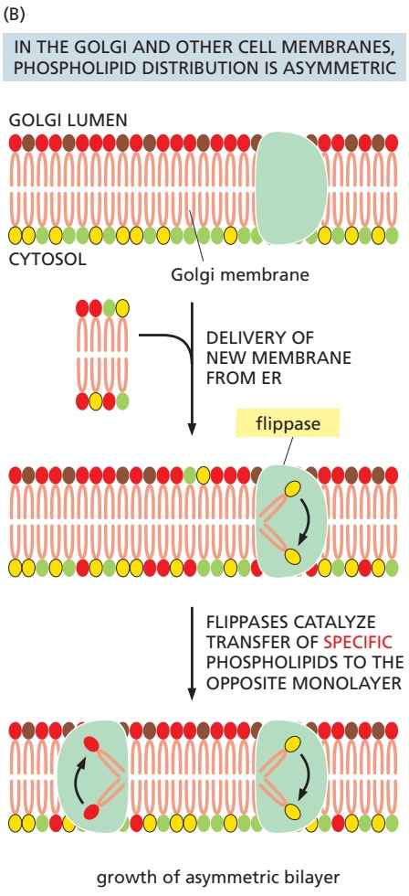
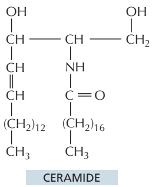
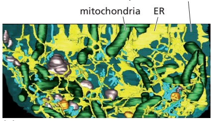
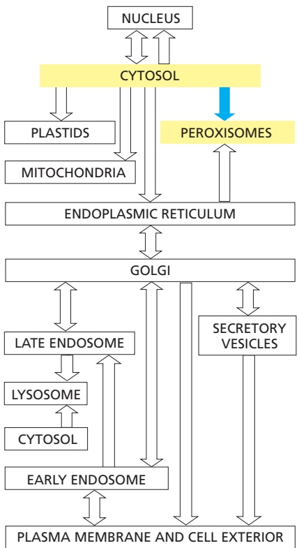
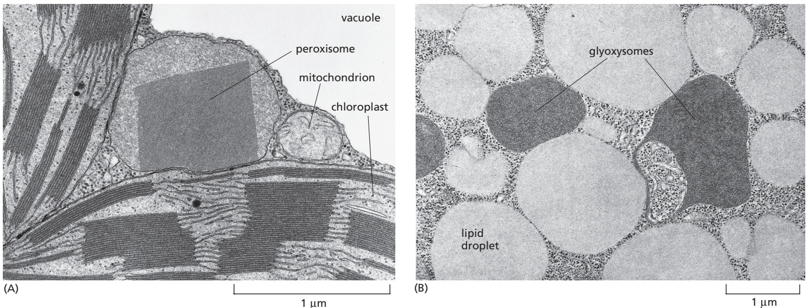
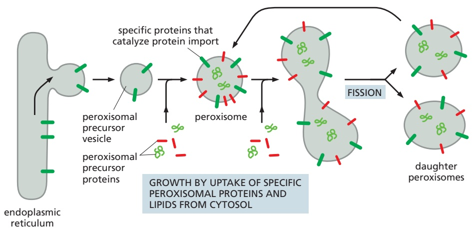
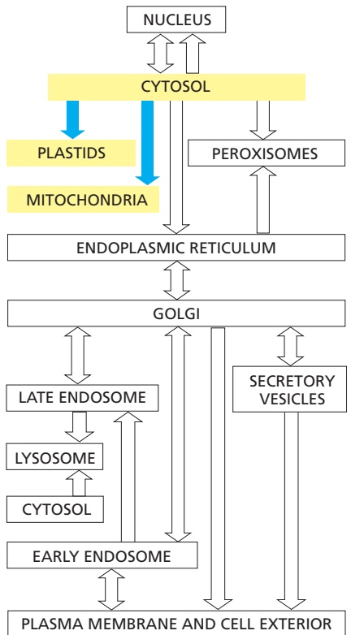
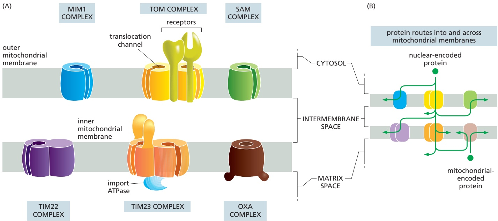
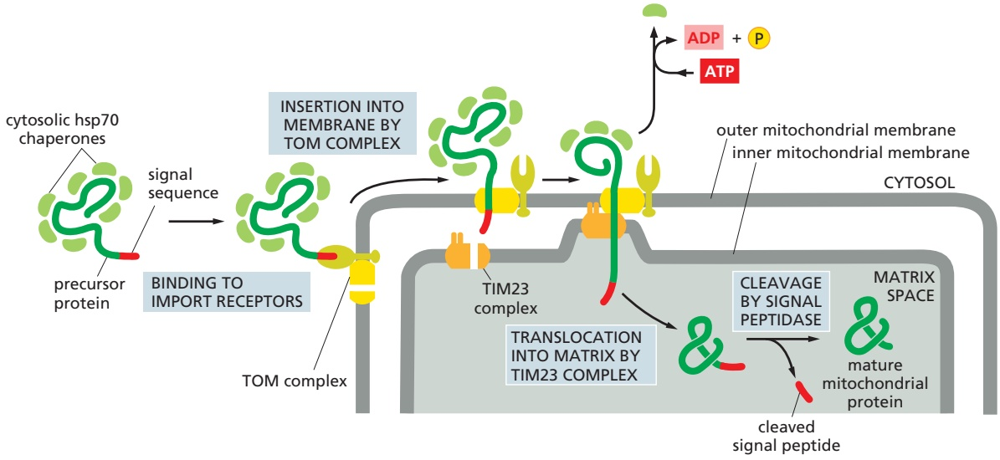

Figure 12–37 The IRE1 limb of the unfolded protein response. Regulated RNA splicing is a key regulatory switch in the unfolded protein response pathway initiated by IRE1 (Movie 12.4). During normal conditions, IRE1 is maintained in an inactive state by its association with the ER-lumenal chaperone BiP. Elevated levels of misfolded proteins activate IRE1 by a combination of two mechanisms. First, BiP dissociates from IRE1 to bind and protect misfolded proteins from aggregation. Second, misfolded proteins bind to the lumenal domain of IRE1 facilitating the formation of IRE1 oligomers. The oligomerized IRE1 phosphorylates itself on the cytosolic side, activating its ribonuclease domain. The activated ribonuclease catalyzes the splicing of a pre-mRNA that codes for a transcription factor that ultimately activates numerous genes in the nucleus including those coding for chaperones. Elevated chaperones help reduce the level of misfolded proteins in the ER lumen, eventually turning off IRE1 signaling.

activate the transcription of genes in the nucleus. When misfolded proteins accumulate in the ER, the ATF6 protein is transported to the Golgi apparatus. Resident proteases in the Golgi apparatus membrane cleave off the cytosolic domain of ATF6, which can now migrate to the nucleus and help activate the transcrip-MBoC7 m12.51b/12.37 tion of genes encoding proteins involved in the unfolded protein response. This mechanism of activation of a latent membrane-embedded transcription factor is similar to how the transcription regulator that controls cholesterol biosynthesis is activated (discussed later in this chapter). The relative importance of each of these three pathways in the unfolded protein response differs in different cell types, enabling each cell type to tailor the unfolded protein response to its particular needs.

The signaling pathways that execute the unfolded protein response are used during normal physiological conditions to adjust ER capacity to closely match demand for the ER. For example, insulin production increases substantially in pancreatic β cells in response to eating a meal. The elevated demand for the processing capacity of the ER, where insulin is initially assembled, partially activates PERK so cells can adjust insulin synthesis rates to avoid overburdening the ER. In another example, IRE1 is activated when B cells begin differentiating into antibody-secreting plasma cells. IRE1 activation dramatically expands the ER content of the cell in preparation for the very high levels of immunoglobulins that will soon be assembled there.

The unfolded protein response ultimately increases the production of proteins that improve protein processing in the ER and reduce the burden of misfolded proteins. As homeostasis is restored, the activities of IRE1, PERK, and ATF6 abate. If homeostasis cannot be restored, persistently active signaling from the ER, particularly via PERK, activates genes that initiate apoptosis. In multicellular organisms, it is often less detrimental to eliminate a persistently dysfunctional cell than risk its aberrant interactions with neighboring cells.

Figure 12–38 The synthesis of phospholipids at the ER membrane. As illustrated, fatty acids delivered to the ER by a cytosolic fatty acid binding protein are linked to glycerol 3-phosphate to produce phosphatidic acid, which serves as a precursor to make other phospholipids that differ in the structures of their polar head groups.

## The ER Assembles Most Lipid Bilayers

The ER membrane is the site of synthesis of nearly all of the cell’s major classes of lipids, including both phospholipids and cholesterol, required for the production of new cell membranes. The major phospholipid made is phosphatidylcholine, which can be formed in three steps from choline, two fatty acids, and glycerol phosphate (**Figure 12–38**). Each step is catalyzed by enzymes in the ER membrane, which have their active sites facing the cytosol, where all of the required metabolites are found. Thus, phospholipid synthesis occurs exclusively in the cytosolic leaflet of the ER membrane. Because fatty acids are not soluble in water, they are shepherded from their sites of synthesis in the cytosol to the ER by a fatty acid binding protein. After arrival in the ER membrane and activation with CoA, acyl transferases successively add two fatty acids to glycerol phosphate to produce phosphatidic acid. Phosphatidic acid is sufficiently water-insoluble to remain in the lipid bilayer; it cannot be extracted from the bilayer by the fatty acid binding proteins. It is therefore this first step that enlarges the ER lipid bilayer. The later steps determine the head group of a newly formed lipid molecule and therefore the chemical nature of the bilayer, but they do not result in net membrane growth. The two other major membrane phospholipids—phosphatidylethanolamine and phosphatidylserine (see Figure 10–3)—as well as the minor phospholipid phosphatidylinositol (PI), are all synthesized in this way.

Because phospholipid synthesis takes place in the cytosolic leaflet of the ER lipid bilayer, there needs to be a mechanism that transfers some of the newly formed phospholipid molecules to the lumenal leaflet of the bilayer. In synthetic lipid bilayers, lipids do not “flip-flop” in this way (see Figure 10–10). In the ER, however, phospholipids equilibrate across the membrane within minutes, which is almost 100,000 times faster than can be accounted for by spontaneous “flipflop.” This rapid trans-bilayer movement is mediated by a poorly characterized phospholipid translocator called a scramblase, which nonselectively equilibrates

symmetric growth of bilayer

growth of asymmetric bilayer

Figure 12–39 The role of phospholipid translocators in lipid bilayer synthesis. (A) Because new lipid molecules are added only to the cytosolic half of the ER membrane bilayer and lipid molecules do not flip spontaneously from one monolayer to the other, a transmembrane phospholipid translocator (called a scramblase) is required to transfer lipid molecules from the cytosolic half to the lumenal half so that the membrane grows as a bilayer. The scramblase is not specific for particular phospholipid head groups and therefore equilibrates the different phospholipids between the two monolayers. Scramblases do not need energy to catalyze phospholipid flipping and probably function by providing a hydrophilic path for passive movement of the phospholipid head group through the hydrophobic interior of the membrane. (B) The membranes of the Golgi apparatus, cell surface, and other compartments of the secretory and endocytic pathways are asymmetric. When new membrane is delivered via transport vesicles, the incoming lipids must be segregated to the appropriate side of the lipid bilayer to maintain its asymmetry. This is accomplished by enzymes called flippases, which move selective phospholipids unidirectionally from one side of the bilayer to the other. Flippases typically couple the transport of their substrate (the phospholipid head group) to ATP hydrolysis, and are therefore considered active transporters (see Chapter 11).

phospholipids between the two leaflets of the lipid bilayer (**Figure 12–39**). Thus, the different types of phospholipids are thought to be equally distributed between the two leaflets of the ER membrane.MBoC7 m12.

The ER also produces cholesterol and ceramide (**Figure 12–40**). Ceramide is made by condensing the amino acid serine with a fatty acid to form the amino alcohol sphingosine (see Figure 10–3); a second fatty acid is then covalently added to form ceramide. The ceramide is exported to the Golgi apparatus, where it serves as a precursor for the synthesis of two types of lipids. Glycosphingolipids (glycolipids; see Figure 10–16) are formed when oligosaccharides are added to ceramide, while sphingomyelin (discussed in Chapter 10) results from the addition of phosphocholine. Because glycolipids and sphingomyelin are both produced by enzymes that have their active sites exposed to the lumen of the Golgi apparatus, they are restricted to the noncytosolic leaflet of the lipid bilayers that contain them.

As discussed in Chapter 13, the plasma membrane and the membranes of the Golgi apparatus, lysosomes, and endosomes all form part of a membrane system that communicates with the ER by means of transport vesicles. A large proportion of the lipids that compose the membranes of these organelles is acquired via the membranes delivered by transport vesicles. Despite exchange of membrane lipids through vesicular transport, the lipid composition of each organellar membrane is distinct and contributes to its unique identity and functional properties. This specialization is achieved by a combination of three mechanisms. First, a transport vesicle can have a different lipid composition than the organelle it is departing, thereby delivering only a subset of lipids to its destination. Second, proteins in an organelle’s membrane can modify the head groups of certain lipids to change their identity (such as production of sphingomyelin from ceramide) or use flippases to move certain phospholipids from one leaflet of the membrane to the other (Figure 12–39B). Third, specific lipids can be selectively transferred from one membrane to another by nonvesicular transport routes as discussed next.

Figure 12–40 The structure of ceramide.

Figure 12–41 The spatial relationships between the ER and several organelles within a mouse neuron. A section of the cell body of a neuron in the mouse brain was analyzed by focused ion beam-scanning electron microscopy. (A) The three-dimensional positions of the major organelles reconstructed from the serial electron microscopy images and shown in different colors. The ER (yellow) makes close contacts with all major organelles and the plasma membrane. (B) The mitochondria (green) from the reconstruction are shown with the areas that contact the ER (red). (A and B, from Y. Wu et al., Proc. Natl. Acad. Sci. USA 114:E4859–E4867, 2017.)

## Membrane Contact Sites Between the ER and Other Organelles Facilitate Selective Lipid Transfer

Mitochondria and plastids do not communicate with the ER by vesicular transport, so they require different mechanisms to import many of their lipids from the ER for growth. Carrier proteins in the cytosol called lipid transfer proteins ferry individual lipid molecules between membranes, functioning much like fatty acid binding proteins that shepherd fatty acids through the cytosol (see Figure 12–38). In many cases, lipid transfer proteins function at organelle contact sites where the originating and destination membranes are held within ∼10–30 nm of each other by specific junction complexes. Different lipid transfer proteins shuttle phosphatidylcholine and phosphatidylserine from the ER to mitochondria at contact sites. Disruption of the junctional complexes or the lipid transfer proteins impairs lipid import into mitochondria and causes their dysfunction.

The extensive network of the ER participates in contact sites with most other cellular organelles (**Figure 12–41**). As with the ER–mitochondria contact sites (see Figure 12–16), one of the main functions of these other organelle contact sites is to exchange lipids (**Figure 12–42**). Cells contain several families of lipid transfer proteins. Each of these can typically bind one molecule of a specific lipid (or in some cases multiple related lipids) and has additional domains that can interact with specific cellular membranes. In this manner, they serve as shuttling proteins that have distinctive specificities for the donor and acceptor membranes and the lipid they transport. Contact sites between two organellar membranes favor recruitment of the lipid transfer protein that binds these membranes, thereby enhancing the efficiency of lipid exchange. Cholesterol uses a specialized transport system from lysosomes, where it is delivered as cholesterol esters in lipoproteins, to the plasma membrane and other locations in the cell (as we discuss in Chapter 13).

Figure 12–42 The transfer of lipids at organelle contact sites. (A) Proteins anchored to two different membranes (the ER and mitochondrion in the depicted example) interact with each other to hold the membranes 10–30 nm apart. Specialized lipid transfer proteins are recruited to these contact sites or in some cases are part of the junction complex. These transfer proteins have cavities that can bind lipids and facilitate their movement from one membrane to the other. (B) The structure of one such transfer protein is shown with lipid-like molecules bound inside its cavity. (PDB code: 4P42.)

## Summary

The extensive ER network serves as a factory for the production of almost all of the cell’s lipids. In addition, a major portion of the cell’s protein synthesis occurs on the cytosolic surface of the rough ER: virtually all proteins destined for secretion or for the ER itself, the Golgi apparatus, the lysosomes, the endosomes, and the plasma membrane are first imported into the ER from the cytosol. In the ER lumen, the proteins fold and oligomerize, disulfide bonds are formed, and N-linked oligosaccharides are added. The pattern of N-linked glycosylation is used to indicate the extent of protein folding, so that proteins leave the ER only when they are properly folded. Proteins that do not fold or oligomerize correctly are translocated back into the cytosol, where they are de-glycosylated, polyubiquitylated, and degraded in proteasomes. If misfolded proteins accumulate in excess in the ER, they trigger an unfolded protein response, which activates appropriate genes in the nucleus to help the ER cope.

Only proteins that carry a special ER signal sequence are imported into the ER. The signal sequence is recognized by a signal-recognition particle (SRP), which binds both the growing polypeptide chain and the ribosome and directs them to a receptor protein on the cytosolic surface of the rough ER membrane. This binding to the ER membrane initiates the translocation process that threads a loop of polypeptide chain across the ER membrane through the hydrophilic pore of a protein translocator.

Soluble proteins—destined for the ER lumen, for secretion, or for transfer to the lumen of other organelles—pass completely into the ER lumen. Transmembrane proteins destined for the ER or for other cell membranes become anchored in the ER membrane by one or more membrane-spanning α-helical segments in their polypeptide chains. As these hydrophobic portions of the protein emerge from the ribosome, they are recognized by the protein translocator, which provides a passageway into the membrane. When a polypeptide contains multiple hydrophobic segments, it will pass back and forth across the bilayer multiple times as a multi-pass transmembrane protein.

The asymmetry of protein insertion and glycosylation in the ER establishes the sidedness of the membranes of all the other organelles that the ER supplies with membrane proteins. Lipids are synthesized at the cytosolic face of the ER, equilibrate between both leaflets of the lipid bilayer, and are transported to other organelles often at interorganelle junctions by lipid transfer proteins localized there. Specific flippases establish and maintain lipid asymmetry in the plasma membrane, further contributing to its sidedness.

## PEROXISOMES

**Peroxisomes** are major sites of oxygen utilization and are found in virtually all eukaryotic cells. They contain oxidative enzymes, such as catalase and urate oxidase, at such high concentrations that, in some cells, the peroxisomes stand out in electron micrographs because of the presence of a crystalloid protein core (**Figure 12–43**). The evolutionary origin of peroxisomes is not firmly established, but they are generally thought to represent a specialized offshoot of the membrane system that composes the secretory and endocytic pathways. One hypothesis is that peroxisomes are a vestige of an ancient organelle that performed all the oxygen metabolism in the primitive ancestors of eukaryotic cells. When the oxygen produced by photosynthetic bacteria first accumulated in the atmosphere, it would have been highly toxic to most cells. Peroxisomes might have lowered the intracellular concentration of oxygen, while also exploiting its chemical reactivity to perform useful oxidation reactions. According to this view, the later development of mitochondria rendered peroxisomes less critical for cellular metabolism because many of the same biochemical reactions—which had formerly been carried out in peroxisomes without producing energy—were now coupled to ATP formation by means of oxidative phosphorylation. The oxidation reactions performed by peroxisomes in present-day cells could therefore partly be those whose functions were not taken over by mitochondria.

200 nm

Figure 12–43 An electron micrograph of three peroxisomes in a rat liver cell. The paracrystalline, electron-dense inclusions are composed primarily of the enzyme urate oxidase. (Courtesy of Daniel S. Friend, by permission of E.L. Bearer.)

## Peroxisomes Use Molecular Oxygen and Hydrogen Peroxide to Perform Oxidation Reactions

Peroxisomes are so named because they usually contain one or more enzymes that use molecular oxygen to remove hydrogen atoms from specific organic substrates (designated here as R) in an oxidation reaction that produces hydrogen peroxide $\left( H _ { 2 } O _ { 2 } \right)$

$$
\mathrm{RH} _ {2} + \mathrm{O} _ {2} \rightarrow \mathrm{R} + \mathrm{H} _ {2} \mathrm{O} _ {2}
$$

Catalase uses the $\mathrm { H _ { 2 } O _ { 2 } }$ generated by other enzymes in the organelle to oxidize a variety of substrates—including formic acid, formaldehyde, and alcohol—by the “peroxidation” reaction: $\mathrm{H_{2}O_{2}^{-}+R^{\prime}H_{2}\rightarrow R^{\prime}+2H_{2}O}$ . This type of oxidation reaction is particularly important in liver and kidney cells, where the peroxisomes detoxify various harmful molecules that enter the bloodstream. About 25% of the ethanol we drink is oxidized to acetaldehyde in this way. In addition, when excess $\mathrm { H _ { 2 } O _ { 2 } }$ accumulates in the cell, catalase converts it to $\mathrm { H _ { 2 } O }$ through the reaction

$$
2 \mathrm{H} _ {2} \mathrm{O} _ {2} \rightarrow 2 \mathrm{H} _ {2} \mathrm{O} + \mathrm{O} _ {2}
$$

A major function of the oxidation reactions performed in peroxisomes is the breakdown of fatty acid molecules. The process, called $\beta$ oxidation, shortens the alkyl chains of fatty acids sequentially in blocks of two carbon atoms at a time, thereby converting the fatty acids to acetyl CoA. The peroxisomes then export the acetyl CoA to the cytosol for use in biosynthetic reactions. In mammalian cells, β oxidation occurs in both mitochondria and peroxisomes; in fungi and plant cells, however, this essential reaction occurs exclusively in peroxisomes.

An essential biosynthetic function of animal peroxisomes is to catalyze the first reactions in the formation of plasmalogens. This abundant class of phospholipids is found in all human cells but is particularly enriched in brain, where it is a major constituent of myelin (**Figure 12–44**). Plasmalogen deficiencies cause profound abnormalities in the myelination of nerve-cell axons, which is one reason why many peroxisomal disorders lead to neurological disease.

Peroxisomes are unusually diverse organelles, and even in the various cell types of a single organism they may contain different sets of enzymes. For example, most plants have two major types of peroxisomes (**Figure 12–45**). One is present in leaves, where it participates in photorespiration (discussed in Chapter 14). The other type of peroxisome is present in germinating seeds, where it converts the fatty acids stored in seed lipids into the sugars needed for the growth of the young plant. Because this conversion of fats to sugars is accomplished by a series of reactions known as the glyoxylate cycle, these peroxisomes are also called glyoxysomes. In the glyoxylate cycle, two molecules of acetyl CoA produced by fatty acid breakdown in the peroxisome are used to make succinic acid, which then leaves the peroxisome and is converted into glucose in the cytosol. The glyoxylate cycle does not occur in animal cells, and animals are therefore unable to convert fats into carbohydrates.

In addition to diversification across different cell types or organisms, peroxisomes can adapt to changing conditions within a cell. Yeasts grown on sugar, for example, have a few small peroxisomes. But when some yeasts are grown on methanol, numerous large peroxisomes are formed that oxidize methanol; and when grown on fatty acids, they develop numerous large peroxisomes that break down fatty acids to acetyl CoA by β oxidation.

## Short Signal Sequences Direct the Import of Proteins into Peroxisomes

The proteins that compose peroxisomes are delivered by two different routes (**Figure 12–46**). In the first route, some of the integral membrane proteins of the peroxisomal membrane are first inserted into the ER using the ER-resident Sec61 protein translocator. These peroxisome-destined proteins are then packaged into specialized peroxisomal precursor vesicles. New precursor vesicles then fuse with one another to form a new peroxisome or fuse with an existingMBoC7 m12.29/12.45 peroxisome to facilitate its growth. In the second route, peroxisomal proteins can be imported into preexisting peroxisomes directly from the cytosol. A specific sequence of three amino acids (Ser-Lys-Leu) located at the C-terminus of many peroxisomal proteins functions as an import signal (see Figure 12–13). Other peroxisomal proteins contain a slightly longer and partially hydrophobic signal sequence near the N-terminus. If either sequence is attached to a cytosolic protein, the protein is imported into peroxisomes.

Figure 12–44 The structure of a plasmalogen. Plasmalogens are very abundant in the myelin sheaths that insulate the axons of nerve cells. They make up some 80–90% of the myelinMBoC7 m12.28/12. membrane phospholipids. In addition to an ethanolamine head group and a longchain fatty acid attached to the same glycerol phosphate backbone used for phospholipids, plasmalogens contain an unusual fatty alcohol that is attached through an ether linkage highlighted in yellow (bottom left).

Figure 12–45 Electron micrographs of two types of peroxisomes found in plant cells. (A) A peroxisome with a paracrystalline core in a tobacco leaf mesophyll cell. Its close association with chloroplasts is thought to facilitate the exchange of materials between these organelles during photorespiration. The vacuole in plant cells is equivalent to the lysosome in animal cells. (B) Peroxisomes in a fat-storing cotyledon cell of a tomato seed 4 days after germination. Here the peroxisomes (glyoxysomes) are associated with the lipid droplets that store fat, reflecting their central role in fat mobilization and gluconeogenesis during seed germination. (A, © 1969 S.E. Frederick and E.H. Newcomb. Originally published in J. Cell Biol. https://doi.org/10.1083/jcb.43.2.343. With permission from Rockefeller University Press. B, from W.P. Wergin et al., J. Ultrastruct. Res. 30:533–557, 1970. With permission from Elsevier.)

Peroxisomal protein import is driven by ATP hydrolysis and utilizes a collection of proteins, called **peroxins**, that catalyze the import cycle. C-terminal peroxisomal sorting signals are recognized by the peroxin Pex5 in the cytosol. This import receptor accompanies its cargo all the way into a protein translocator in the peroxisomal membrane. After cargo release inside the peroxisome, Pex5 is recycled back to the cytosol. This recycling step requires modification of Pex5 with ubiquitin, which is used as a handle by an ATPase complex composed of Pex1 and Pex6. The Pex1–Pex6 complex harnesses the energy of ATP hydrolysis to release Pex5 from peroxisomes so it can pick up the next cargo molecule.

Figure 12–46 A model that explains how peroxisomes proliferate and how new peroxisomes arise. Peroxisomal precursor vesicles bud from the ER. At least two peroxisomal membrane proteins, Pex3 and Pex15, follow this route. The machinery that drives the budding reaction and that selects only peroxisomal proteins for packaging into these vesicles depends on Pex19 and other cytosolic proteins that are still unknown. Peroxisomal precursor vesicles may then fuse with one another or with preexisting peroxisomes. The peroxisomal membrane contains import receptors and protein translocators that are required for the import of peroxisomal proteins made on cytosolic ribosomes, including new copies of the import receptors and translocator components. Presumably, the lipids required for growth are also imported, although some may derive directly from the ER in the membrane of peroxisomal precursor vesicles.

N-terminal peroxisomal signal sequences are recognized by the peroxin Pex7. The Pex7–cargo complex, together with additional accessory peroxins, appear to participate in an import cycle similar to that mediated by Pex5.

The protein translocator in the peroxisomal membrane is composed of at least six different peroxins. Unlike protein translocators in the ER, the peroxisomal translocator can transport fully folded and even oligomeric proteins across the membrane. To allow the passage of large and variably sized cargo molecules, the transporter is thought to dynamically adapt in size to the particular cargo molecules to be transported. It is not known how such a large pore can be utilized for transport without leakage of contents between the cytosol and peroxisome.

The importance of protein import into peroxisomes is demonstrated by the inherited human disease Zellweger syndrome. Mutations in any of a dozen different peroxins, the most common being Pex1, cause an impairment in peroxisomal protein import. These individuals, whose cells contain “empty” peroxisomes, accumulate very-long-chain and branched-chain fatty acids that are normally broken down in peroxisomes. Furthermore, they are deficient in plasmalogens. These metabolic impairments cause severe abnormalities in the brain, liver, and kidneys of individuals, and they die soon after birth.

## Summary

Peroxisomes are specialized for carrying out oxidation reactions using molecular oxygen. They generate hydrogen peroxide, which they employ for oxidative purposes—and contain catalase to destroy the excess. All peroxisomal proteins are encoded in the cell nucleus. Some of these proteins are conveyed to peroxisomes via peroxisomal precursor vesicles that bud from the ER, but most are synthesized in the cytosol and directly imported. A specific sequence of three amino acids near the C-terminus of many of the latter proteins functions as a peroxisomal import signal that is recognized by a complementary import receptor in the cytosol. Import proceeds through a protein translocator in the peroxisomal membrane, which differs from the protein translocators in the ER in that large and fully folded proteins are imported from the cytosol without unfolding.

## THE TRANSPORT OF PROTEINS INTO MITOCHONDRIA AND CHLOROPLASTS

Mitochondria and chloroplasts (a specialized form of plastids in green algae and plant cells) are double membrane–enclosed organelles. They specialize in ATP synthesis, using energy derived from electron transport and oxidative phosphorylation in mitochondria and from photosynthesis in chloroplasts (discussed in Chapter 14). Although both organelles contain their own DNA, ribosomes, and other components required for protein synthesis, almost all of their proteins are encoded in the cell nucleus and imported from the cytosol. Each imported protein must reach the particular organelle subcompartment in which it functions.

The different subcompartments in **mitochondria** are formed by the two concentric mitochondrial membranes (**Figure 12–47A**): the **inner mitochondrial membrane**, which encloses the **matrix space** and forms extensive invaginations called cristae, and the **outer mitochondrial membrane**, which is in contact with the cytosol. The space between the inner and outer membranes is subdivided into the crista space and **intermembrane space**, with protein complexes at the junctions where the cristae invaginate. Chloroplasts have an outer and inner membrane, which enclose an intermembrane space, and a stroma, which is the chloroplast equivalent of the mitochondrial matrix space (**Figure 12–47B**). They have an additional subcompartment, the thylakoid space, which is surrounded by the thylakoid membrane. The thylakoid membrane derives from the inner membrane during plastid development and is pinched off to become discontinuous with it. Each of the subcompartments in mitochondria and chloroplasts contains a distinct set of proteins.

Figure 12–47 The subcompartments of mitochondria and chloroplasts. In contrast to the cristae of mitochondria (A), the thylakoids of chloroplasts (B) are not connected to the inner membrane and therefore form a sealed continuous compartment with a separate internal space.

New mitochondria and chloroplasts are produced by the growth of preexisting organelles, followed by fission (discussed in Chapter 14). The growth depends mainly on the import of proteins from the cytosol. Many of the core principles of protein import into mitochondria and chloroplasts are similar to the analogous process of protein import into the ER we discussed earlier. However, the presence of multiple membranes and subcompartments adds to the complexity of7 12.19/12.47 delivering newly imported proteins to the correct location. This section explains how it occurs.

## Translocation into Mitochondria Depends on Signal Sequences and Protein Translocators

One or more signal sequences direct all mitochondrial precursor proteins to their appropriate mitochondrial subcompartment. Many proteins entering the matrix space contain a signal sequence at their N-terminus that a signal peptidase rapidly removes after import. Other imported proteins, including all outer membrane and many inner membrane and intermembrane-space proteins, have internal signal sequences that are not removed. The signal sequences are both necessary and sufficient for the import and correct localization of the proteins: when genetic engineering techniques are used to link these signals to a cytosolic protein, the signals direct the protein to the correct mitochondrial subcompartment. Thus, the principles of the signal hypothesis, conceived to explain how proteins are segregated to the ER, also apply to mitochondria.

Multisubunit protein complexes that function as protein translocators mediate protein movement across or into mitochondrial membranes (**Figure 12–48A**). To provide access to each mitochondrial subcompartment, protein translocator complexes are located in both the inner and outer mitochondrial membranes. In general, each translocator has the capacity to recognize particular types of signals and serves as a conduit across or into the membrane within which it resides. Together, these translocators direct ∼1500 different precursor proteins from the cytosol to the appropriate subcompartment of mitochondria: the outer membrane, the intermembrane space and crista space, the inner membrane, and the matrix space.

The organization of signals in a precursor protein ultimately controls which translocator(s) the precursor protein engages and the order in which the signals are used to reach the protein’s final destination inside mitochondria. This combinatorial system means that there is sometimes more than one route to reach a particular destination, the same way that different subway lines can take you from Brooklyn to Times Square in New York City. For example, membrane proteins residing in the inner mitochondrial membrane use at least three routes to arrive there. **Figure 12–48B** shows the possible routes to each mitochondrial subcompartment and the translocator complexes that direct proteins there.

The **TOM complex** is required for the import of nearly all nucleus-encoded mitochondrial proteins. It initially recognizes their signal sequences and transports them from the cytosol into the intermembrane space. From here, different mitochondrial proteins follow different itineraries depending on sequence features encoded in the protein. β-Barrel proteins, which are particularly abundant in the outer membrane, are passed to the **SAM complex** for insertion and folding in the outer membrane. Two different **TIM complexes** mediate protein transport at the inner membrane. Matrix proteins use the TIM23 complex for transport, while inner membrane proteins use the TIM22 complex, the TIM23 complex, or the **OXA complex** for insertion. The remainder of proteins stay in the intermembrane space where they function.

Figure 12–48 The protein translocators in the mitochondrial membranes. (A) The TOM, TIM, SAM, MIM, and OXA complexes are multimeric membrane protein assemblies that catalyze protein translocation across mitochondrial membranes. The protein components of the TIM22 and TIM23 complexes that line the import channel are structurally related, suggesting a common evolutionary origin of both TIM complexes. On the matrix side, the TIM23 complex is bound to a multimeric protein complex containing mitochondrial hsp70, which acts as an import ATPase, using ATP hydrolysis to pull proteins through the pore. In animal cells, subtle variations exist in the subunit composition of the translocator complexes to adapt the mitochondrial import machinery to the particular needs of specialized cell types. (B) Newly made proteins synthesized in the cytosol can use multiple routes to arrive at their final destination. The known routes via the different protein complexes are shown as green lines. There are multiple routes for a protein to become embedded into the inner and outer mitochondrial membranes, including one route for mitochondrially encoded proteins synthesized in the matrix space. SAM = sorting and assembly machinery; OXA = cytochrome oxidase activity; TIM = translocator of the inner mitochondrial membrane; TOM = translocator of the outer membrane; MIM = mitochondrial import machinery.

In addition to the ∼99% of mitochondrial proteins that must be imported from the cytosol, a handful of membrane proteins are encoded by the mitochondrial genome in all eukaryotes. These proteins are synthesized by mitochondrial ribosomes and inserted into the inner membrane by the OXA complex. Mitochondrially encoded membrane proteins are assembled with nuclear-encoded membrane proteins imported from the cytosol to form functional protein complexes such as the respiratory-chain complexes used for energy production (see Chapter 14). How cells communicate between the mitochondria and nucleus to ensure equal expression of the proteins that build inner membrane complexes is not understood.

## Mitochondrial Proteins Are Imported Post-translationally as Unfolded Polypeptide Chains

As we learned in an earlier section, protein translocation into the ER usually occurs as the protein is being synthesized by ribosomes that are tightly coupled to the ER protein translocator. The binding of ribosomes to the translocator during protein import is what gives the rough ER its characteristic appearance.

In contrast, the protein translocators in the mitochondrial outer membrane do not bind to ribosomes, and most mitochondrial proteins are imported by a post-translational mechanism. This is why very few ribosomes are observed on the surface of mitochondria.

As with ER translocation, mitochondrial protein import can be reconstituted in a cell-free reaction in the test tube. In such experiments, a radioactively labeled mitochondrial precursor protein is mixed with purified mitochondria to permit import into the organelle. By changing the conditions in the test tube, it is possible to establish the biochemical requirements for import, to trap intermediates in the process, and to identify which translocators are used. Most of our knowledge about the molecular mechanism of mitochondrial import comes from analysis in cell-free reactions.

Mitochondrial precursor proteins do not immediately fold into their native structures after they are synthesized; instead, they remain unfolded in the cytosol through interactions with other proteins. Some of these interacting proteins are general chaperones of the hsp70 family (discussed in Chapter 6), whereas others are dedicated to mitochondrial precursor proteins and bind directly to their signal sequences. All the interacting proteins help to prevent the precursor proteins from aggregating or folding up spontaneously before they engage with the TOM complex in the outer mitochondrial membrane. As a first step in the import process, the import receptors of the TOM complex bind the signal sequence of the mitochondrial precursor protein. The unfolded polypeptide chain is then fed— signal sequence first—into the translocation channel within the TOM complex as the cytosolic interacting proteins are stripped off.

Once the translocating protein protrudes into the intermembrane space, sequences within the polypeptide chain determine what happens next. For example, proteins destined for the matrix or inner membrane engage one of the TIM complexes and are either translocated across or inserted into the inner membrane. It is possible to rapidly cool a cell-free mitochondrial import reaction to arrest the proteins at an intermediate step during translocation. Experiments examining an arrested protein destined for the matrix show that it spans both the inner and outer mitochondrial membranes: its N-terminal signal sequence has been removed by the signal peptidase located in the matrix, while the C-terminal part of the protein is still exposed outside the mitochondria. We can therefore conclude that precursor proteins can pass through both mitochondrial membranes at once to enter the matrix space (**Figure 12–49**).

Figure 12–49 Protein import by mitochondria. The N-terminal signal sequence of the mitochondrial precursor protein is recognized by receptors of the TOM complex while the remainder of the protein is kept unfolded by cytosolic hsp70 chaperones. The protein is then translocated through the TIM23 complex so that it transiently spans both mitochondrial membranes (Movie 12.5). The signal sequence is cleaved off by a signal peptidase in the matrix space to form the mature protein. The free signal sequence is then rapidly degraded (not shown).

Although the TOM and TIM complexes usually work together to translocate precursor proteins across both membranes at the same time, they are capable of operating independently. In isolated outer membranes, for example, the TOM complex can translocate the signal sequence of precursor proteins across the membrane. Similarly, if the outer membrane is experimentally removed from isolated mitochondria, the exposed TIM23 complex can efficiently import precursor proteins into the matrix space. The experimental uncoupling of ordinarily linked processes allows each step and translocator system to be studied and understood in greater detail.

## Protein Import Is Powered by ATP Hydrolysis, a Membrane Potential, and Redox Potential

Directional transport of proteins requires energy (**Figure 12–50**). Mitochondrial protein import utilizes three different sources of energy at four discrete sites. ATP, a common fuel in most biological systems, is used at two of these sites: outside the mitochondria and inside the matrix. The other two energy sources are contributed by the membrane potential across the inner mitochondrial membrane and the redox potential of the electron-transport chain. Not all mitochondrial precursor proteins need each of these energy sources to arrive at their final destination.

The initial use of energy, needed by most mitochondrial precursor proteins at the initial stage of the translocation process, serves to maintain the polypeptide in an unfolded state prior to import (see Figure 12–49). As discussed in Chapter 6,

Figure 12–50 The role of energy in protein import into mitochondria. Three different sources of energy are used to import protein into the mitochondria. (A) After initial insertion of the signal sequence and of adjacent portions of the polypeptide chain into the TOM complex translocation channel (not shown), the signal sequence interacts with a TIM23 complex (orange). The signal sequence is then translocated into the matrix space in a process that requires the energy in the membrane potential across the inner membrane. Positively charged amino acids in the signal sequence facilitate this membrane potential–dependent translocation reaction. (B) Mitochondrial hsp70, which is part of an import ATPase complex, binds to regions of the polypeptide chain as they become exposed in the matrix space, pulling the protein through the translocation channel, using the energy of ATP hydrolysis. (C) Polypeptides with multiple cysteines can sample the intermembrane space via partial translocation through the TOM complex. In the intermembrane space, these cysteines are oxidized to disulfide bonds by the enzyme Mia40, which becomes reduced in the process. The oxidized polypeptide is now partially folded, preventing it from sliding back into the cytosol. Reduced Mia40 is reoxidized by electrons provided by the respiratory chain so it can function again in the import reaction.