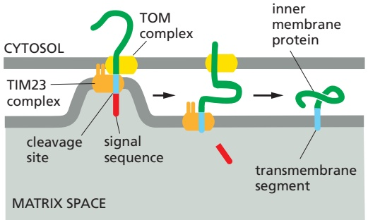
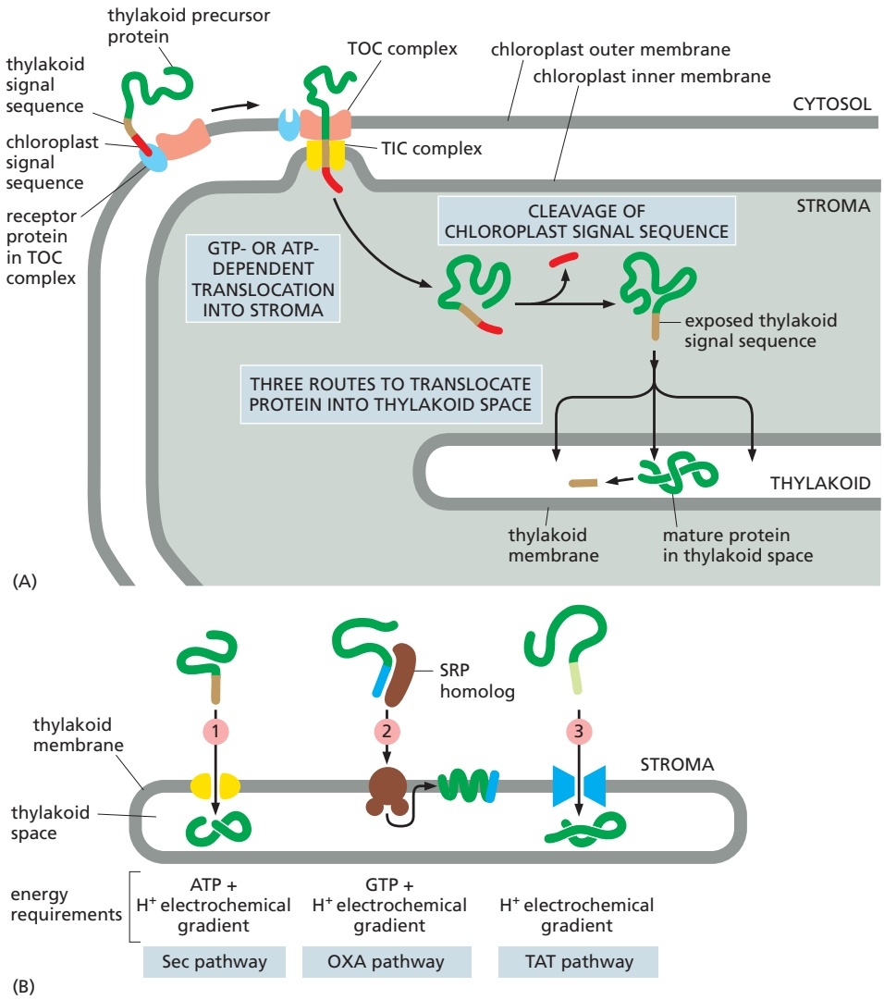
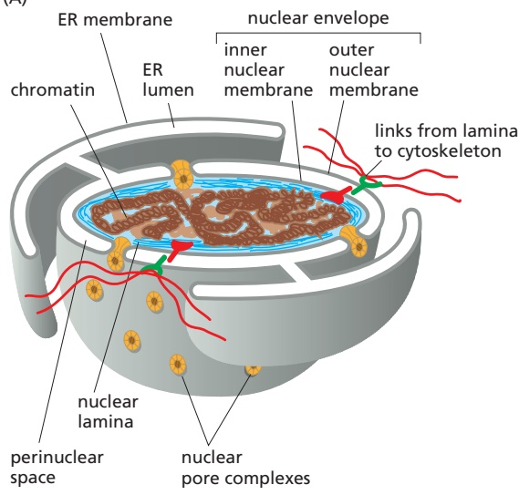
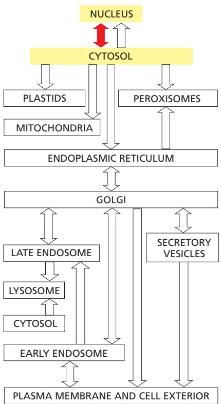
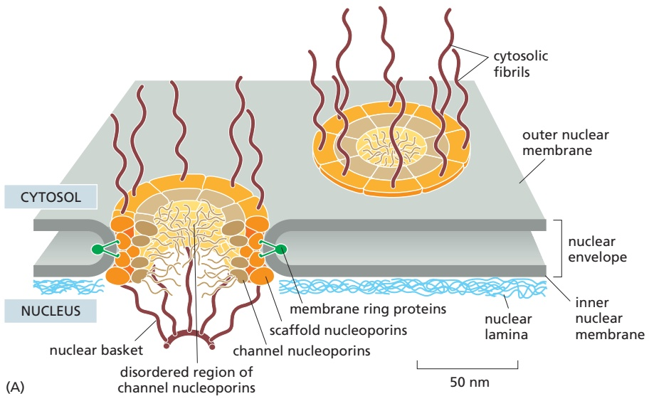
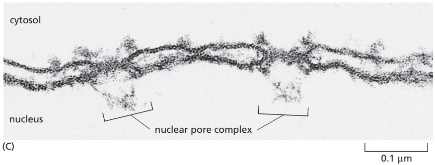
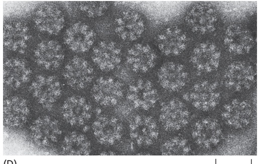
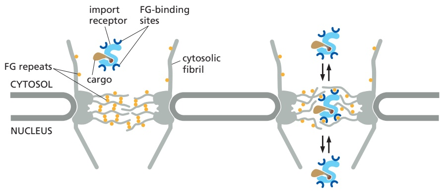

THE TRANSPORT OF PROTEINS INTO MITOCHONDRIA AND CHLOROPLASTS

731

the chaperones that carry out this task use cycles of ATP binding and hydrolysis to control their interactions with newly synthesized polypeptides. Chaperone interaction is required to prevent premature folding in the cytosol, while chaperone dissociation is needed to permit transport through the TOM complex.

Once the signal sequence has passed through the TOM complex and is bound to a TIM complex, further translocation through the TIM translocation channel requires the membrane potential (Figure 12–50A), which is the electrical component of the electrochemical H+ gradient across the inner membrane (see Figure 11–4). Pumping of H+ from the matrix space to the intermembrane space, driven by electron-transport processes in the inner membrane (discussed in Chapter 14), maintains the electrochemical gradient. The energy in the electrochemical H+ gradient across the inner membrane drives the translocation of the positively charged signal sequences through the TIM complexes by electrophoresis. The same H+ gradient also powers most of the cell’s ATP synthesis by ATP synthase complexes in the inner mitochondrial membrane.

Once the initial segment of a precursor protein reaches the matrix, **mitochondrial hsp70** is crucial for completing the import process similar to how BiP is needed for post-translation protein import into the ER. The mitochondrial hsp70 is bound to the matrix side of the TIM23 complex and acts as a motor to pull the precursor protein into the matrix space. Like its cytosolic cousin, mitochondrial hsp70 has a high affinity for unfolded polypeptide chains, and it binds tightly to an imported protein chain as soon as the chain emerges from the TIM translocator in the matrix space. The hsp70 then undergoes an ATP-dependent conformational change that exerts a pulling force on the protein being imported before releasing it. This energy-driven cycle of binding, pulling, and release continues until the protein has completed import through the TIM23 complex (Figure 12–50B). Many imported matrix proteins are passed on to another chaperone protein, mitochondrial hsp60, to assist their folding through cycles of ATP hydrolysis (see Chapter 6).

Certain intermembrane-space proteins that contain cysteine motifs use the difference in redox potential between the cytosol and mitochondria as a source of energy. When a portion of these proteins initially emerges into the intermembrane space, they form a transient covalent disulfide bond to the Mia40 protein (Figure 12–50C). This interaction prevents backsliding of the protein through the TOM complex into the cytosol. The imported proteins are eventually released from Mia40 in an oxidized form containing intrachain disulfide bonds, resulting in a folded protein that is now trapped in the intermembrane space. Mia40 becomes reduced in the process and is then reoxidized by passing electrons to the electron-transport chain in the inner mitochondrial membrane. In this way, the energy stored in the redox potential in the mitochondrial electron-transport chain is tapped to drive protein import.

## Transport into the Inner Mitochondrial Membrane Occurs Via Several Routes

The three different translocators in the inner mitochondrial membrane (see Figure 12–48) are all capable of membrane protein insertion. Different subsets of inner mitochondrial membrane proteins take different routes to reach one of these translocators for insertion into the membrane.

In the most common translocation route, a precursor that begins in the cytosol uses the TOM and TIM23 complexes to begin import into the matrix. However, only the N-terminal signal sequence of the transported protein actually enters the matrix space (**Figure 12–51A**). A hydrophobic amino acid sequence, strategically located after the N-terminal signal sequence, is recognized as a transmembrane domain by the TIM23 complex. This allows insertion of the transmembrane domain into the inner membrane and prevents further translocation into the matrix, perhaps through a lateral gate analogous to that found in the ER-resident Sec61 translocator. The remainder of the protein enters the intermembrane space through the TOM complex, and the signal sequence is cleaved off in the matrix.

---

732

Chapter 12: Intracellular Organization and Protein Sorting

(A)

(B)

Figure 12–51 Routes for the production of inner mitochondrial membrane proteins. (A) The N-terminal signal sequence (red) initiates import into the matrix space (see Figure 12–49). A hydrophobic transmembrane segment (blue) that follows the matrix-targeting signal sequence binds to the TIM23 translocator (orange) in the inner membrane and stops translocation. The remainder of the protein is then pulled into the intermembrane space through the TOM translocator in the outer membrane, and the transmembrane segment is released into the inner membrane, anchoring the protein there. (B) Multipass inner. / . membrane proteins that function as metabolite transporters contain internal signal sequences and snake through the TOM complex as a loop. They then bind to the chaperones in the intermembrane space, which guide the proteins to the TIM22 complex. The TIM22 complex is specialized for the insertion of multipass inner membrane proteins. (C) The OXA complex mediates membrane protein insertion into the inner membrane for proteins that are encoded by the mitochondrial genome and translated in the matrix space. (D) The OXA complex in the inner membrane can mediate protein insertion from the matrix space. To access this route, nuclear-encoded proteins must first translocate completely into the matrix space via the TOM and TIM23 complexes. Cleavage of the signal sequence (red) used for the initial translocation unmasks an adjacent hydrophobic signal sequence (blue) at the new N-terminus. This signal then directs the protein into the inner membrane.

The second transport route to the inner membrane is specialized for a family of metabolite-specific transporters that transfer a vast number of small molecules across the inner membrane. These transporters supply substrates for metabolic enzymes in the mitochondrial matrix, such as those of the citric acid cycle, and export their products back to the cytosol. These multipass transmembrane proteins use internal signal sequences to enter the intermembrane space through the TOM complex. They engage intermembrane-space chaperones that guide them to the TIM22 complex, where hydrophobic transmembrane regions partition into the inner membrane. This insertion process requires the membrane potential to ensure that appropriate regions of the protein are transported to the matrix side so that the transporter acquires the correct topology (**Figure 12–51B**).

The final insertion route into the inner membrane uses the OXA complex. As mentioned earlier, the OXA complex also inserts the few membrane proteins that are encoded and translated in the mitochondrial matrix (**Figure 12–51C**). Thus, the OXA complex can only be accessed from the matrix side of the membrane. For this reason, nuclear-encoded membrane proteins that rely on the OXA complex for insertion must first use TIM23 to translocate into the matrix (**Figure 12–51D**). Here, the N-terminal signal sequence is removed to expose a hydrophobic signal sequence that is then used by the OXA complex for insertion into the inner membrane.

---

THE TRANSPORT OF PROTEINS INTO MITOCHONDRIA AND CHLOROPLASTS

733

Figure 12–52 Integration of porins into the outer mitochondrial and bacterial membranes. (A) After translocation through the TOM complex in the outer mitochondrial membrane, β-barrel proteins bind to chaperones in the intermembrane space. The SAM complex then inserts the unfolded polypeptide chain into the outer membrane and helps the chain fold. (B) A structurally related BAM complex in the outer membrane of Gram-negative bacteria catalyzes β-barrel protein insertion and folding (see Figure 11–17).

## Bacteria and Mitochondria Use Similar Mechanisms to Insert β Barrels into Their Outer Membrane

As discussed earlier in this chapter, mitochondria evolved from an ancestral endosymbiont bacterium inside the primordial eukaryotic cell. The outer mitochondrial membrane is therefore evolutionarily related to the outer membrane of Gram-negative bacteria (see Figure 11–17). Both membranes contain **porins**, abundant pore-forming β-barrel proteins that are permeable to inorganic ions and metabolites (but not to most proteins). The TOM complex only allows proteins containing hydrophobic α helices to exit laterally and thus cannot integrate porins or other β-barrel proteins into the lipid bilayer. Instead, they are first transported through the TOM complex as unfolded proteins into the intermembrane space. Specialized chaperone proteins in the intermembrane space keep theMBoC7 m12.24/12.52 β-barrel proteins from aggregating (**Figure 12–52A**) until they are inserted and folded by the SAM complex in the outer membrane.

One of the central subunits of the SAM complex is homologous to a bacterial outer membrane protein that helps insert β-barrel proteins into the bacterial outer membrane. In bacteria, β-barrel proteins are inserted from the periplasmic space, which is the topological equivalent of the intermembrane space in mitochondria (**Figure 12–52B**). This conserved pathway for inserting β-barrel proteins further underscores the endosymbiotic origin of mitochondria. Notably, the central subunits of the TOM and SAM complexes are themselves β-barrel proteins. Thus, preexisting TOM and SAM complexes are required to make more copies of these essential protein translocators.

## Two Signal Sequences Direct Proteins to the Thylakoid Membrane in Chloroplasts

Protein transport into **chloroplasts** resembles transport into mitochondria. Both processes occur post-translationally, use separate translocation complexes in each membrane, require energy, and use multiple types of signal sequences to direct a precursor to the appropriate organelle subcompartment. However, many of the protein components that form the translocation complexes differ. Moreover, whereas mitochondria harness the electrochemical H+ gradient across their inner membrane to drive transport, chloroplasts, which have an electrochemical H+ gradient across their thylakoid membrane but not their inner membrane, use GTP and ATP hydrolysis to power import across their double-membrane envelope. The functional similarities thus result from convergent evolution, reflecting the common requirements for translocation across a double membrane.

Although the signal sequences for import into chloroplasts superficially resemble those for import into mitochondria, a plant cell can have both mitochondria and chloroplasts, so proteins must partition appropriately between the

---

734

Chapter 12: Intracellular Organization and Protein Sorting

two organelles. Experiments have shown that a cytosolic protein can be directed specifically to a plant cell’s mitochondria if it is experimentally joined to an N-terminal signal sequence of a mitochondrial protein; the same protein joined to an N-terminal signal sequence of a chloroplast protein ends up in chloroplasts. Thus, the import receptors on each organelle distinguish between the different signal sequences.

The same compartments that are found in mitochondria are also in chloroplasts, and each has its distinctive complement of proteins that are selectively delivered there using mechanisms analogous to the mitochondrial systems. However, chloroplasts have an extra membrane-enclosed compartment, the **thylakoid**. Many chloroplast proteins, including the protein subunits of the photosynthetic system and of the ATP synthase (discussed in Chapter 14), are located in the thylakoid membrane. Many of the components of these vital complexes are encoded in the nuclear genome, and those residing in the thylakoid lumen therefore have to be imported across three membranes. The precursors of these proteins are translocated from the cytosol to their final destination in two steps using bipartite signal sequences. First, they pass across the outer and inner membranes into the **stroma** guided by an N-terminal chloroplast signal sequence. There, a stromal signal peptidase removes the N-terminal chloroplast signal sequence, unmasking a thylakoid signal sequence that follows it in the sequence of the precursor protein. The thylakoid signal sequence initiates integration into the thylakoid membrane or translocation into the thylakoid space (**Figure 12–53A**).

Figure 12–53 Translocation of chloroplast precursor proteins into the thylakoid space. (A) The precursor protein contains an N-terminal chloroplast signal sequence (red), followed immediately by a thylakoid signal sequence (brown). The chloroplast signal sequence initiates translocation into the stroma by a mechanism similar to that used for the translocation of mitochondrial precursor proteins into the matrix space, although the translocator complexes, named TOC and TIC (for translocator in the outer and inner chloroplast membrane, respectively), are different. The signal sequence is then cleaved off, unmasking the thylakoid signal sequence, which initiates translocation across the thylakoid membrane. (B) Translocation into the thylakoid space or thylakoid membrane can occur by any one of at least three routes: (1) a Sec pathway, so called because it uses components that are homologs of Sec proteins, which mediate protein translocation across the ER and bacterial plasma membrane; (2) an OXA-like pathway, so called because it uses a chloroplast homolog of the OXA translocase; (3) a TAT (twin arginine translocation) pathway, so called because two arginines are critical in the signal sequences that direct proteins into this pathway, which depends on the H+ gradient across the thylakoid membrane. The OXA-like pathway makes use of a chloroplast SRP that lacks an RNA subunit. This specialized SRP located in the stroma recognizes a thylakoid-directed signal sequence and functions exclusively post-translationally because it is found in a separate compartment from the ribosome that made the thylakoid precursor protein.

---

THE TRANSPORT OF MOLECULES BETWEEN THE NUCLEUS AND THE CYTOSOL

735

There are three different protein translocators in the thylakoid membrane, each of which recognizes a different type of signal sequence, handles a different subset of thylakoid precursors, and uses energy in different ways (**Figure 12–53B**). As we saw earlier, the thylakoid membrane is developmentally derived from the inner chloroplast membrane, which is evolutionarily related to the bacterial inner membrane. It is therefore not surprising that each of the three translocators in the thylakoid membrane has homologs that are used for translocation or membrane insertion in bacteria.

## Summary

Although mitochondria and chloroplasts have their own genetic systems, they produce less than 1% of their own proteins. Instead, the two organelles import most of their proteins from the cytosol, using similar mechanisms. In both cases, multiple protein translocator complexes in the outer and inner membranes recognize different types of signal sequences to direct a precursor to the correct organelle subcompartment. Proteins are transported in an unfolded state by a post-translational mechanism. Chaperone proteins of the cytosolic hsp70 family maintain the precursor proteins in an unfolded state prior to translocation, and a second set of hsp70 proteins in the matrix space or stroma pulls the polypeptide chain across the inner membrane. Translocation into mitochondria is powered by ATP hydrolysis, a membrane potential across the inner membrane, and the redox potential of the electron-transport chain. Translocation into chloroplasts is powered by GTP and ATP hydrolysis and a membrane potential across the thylakoid membrane. In chloroplasts, import from the stroma into the thylakoid can occur by several routes, distinguished by the protein translocator complex and energy source used.

## THE TRANSPORT OF MOLECULES BETWEEN THE NUCLEUS AND THE CYTOSOL

The **nuclear envelope** encloses the DNA and defines the nuclear compartment. This envelope consists of two concentric membranes, which are perforated by nuclear pore complexes (**Figure 12–54**). Although the inner and outer nuclear membranes are continuous, they maintain distinct protein compositions. The **inner nuclear membrane** contains proteins that act as binding sites for the **nuclear lamina**, a meshwork of polymerized protein subunits called **nuclear lamins**. The lamin proteins are members of the intermediate filament family of cytoskeletal proteins (see Chapter 16). The lamina provides structural support for

(A)

(B)

Figure 12–54 The nuclear envelope. (A) The double membrane of the nuclear envelope is penetrated by nuclear pore complexes. Transmembrane proteins in the inner and outer nuclear membranes link the nuclear lamina to the cytosolic cytoskeleton. The outer nuclear membrane is continuous with the endoplasmic reticulum (ER). The ribosomes that are normally bound to the cytosolic surface of the ER membrane and outer nuclear membrane are not shown. (B) The nuclear lamina is a fibrous protein meshwork underlying the inner membrane. Nuclear pores are seen in light brown. (B, from Y. Turgay et al., Nature 543:261–264, 2017.)

---

736

Chapter 12: Intracellular Organization and Protein Sorting

the nuclear envelope and acts as an anchoring site for chromosomes and nuclear pore complexes. The lamina is also connected to the cytoplasmic cytoskeleton via protein complexes that span the nuclear envelope, thereby providing structural links between the DNA, nuclear envelope, and cytoskeleton. The **outer nuclear membrane** is continuous with the membrane of the ER and is studded with ribosomes engaged in protein synthesis (see Figure 12–15). The proteins made on these ribosomes are transported into the space between the inner and outer nuclear membranes (the perinuclear space), which is continuous with the ER lumen.

Nuclear pores conduct extensive bidirectional traffic between the cytosol and the nucleus. The many proteins that function in the nucleus—including histones, DNA polymerases, RNA polymerases, transcriptional regulators, and RNA-processing proteins—are selectively imported into the nuclear compartment from the cytosol, where they are made. At the same time, all RNAs that function in the cytosol—including mRNAs, rRNAs, tRNAs, and miRNAs—are exported after they are synthesized and processed in the nucleus. Like the import process, the export process is selective; mRNAs, for example, are exported only after they have been properly modified by RNA-processing reactions in the nucleus. In some cases, multiple selective transport steps are needed to assemble a complex structure. Ribosomes, for instance, are made from proteins that are synthesized in the cytosol, imported into the nucleus, and exported back to the cytosol only after their assembly with newly made ribosomal RNA. These pre-ribosomal particles then complete their assembly into functional ribosomes in the cytosol, with certain assembly and transport factors returning to the nucleus to help assemble the next ribosome.

## Nuclear Pore Complexes Perforate the Nuclear Envelope

Large and elaborate **nuclear pore complexes (NPCs)** perforate the nuclear envelope in all eukaryotes. Each NPC is composed of a set of approximately 30 different proteins, or **nucleoporins**. NPCs display eightfold rotational symmetry, with axial symmetry of the central core. Hence, each nucleoporin is present in multiple copies, resulting in 500–1000 protein molecules in the fully assembled NPC, with an estimated mass of 66 million daltons in yeast and 125 million daltons in vertebrates (**Figure 12–55**). Most nucleoporins are composed of repetitive protein domains of only a few different types, which have evolved through extensive gene duplication. Some of the scaffold nucleoporins that abut the membrane (see Figure 12–55) are evolutionarily and structurally related to vesicle coat protein complexes, such as clathrin and the COPII coat (discussed in Chapter 13), which shape transport vesicles. One protein is even used as a common building block in both NPCs and vesicle coats. It appears that an ancestral membrane-bending protein that helped shape the elaborate membrane systems of eukaryotic cells evolved into a family of proteins that stabilize the sharp membrane bends at nuclear pores and budding transport vesicles.

The nuclear envelope of a typical mammalian cell contains 3000–4000 NPCs, although that number varies widely, from a few hundred in glial cells to almost 20,000 in Purkinje neurons. Each NPC can transport a staggering 1000 macromolecules per second and can transport in both directions at the same time. The internal diameter of each NPC is ∼40 nm, large enough to accommodate ribosomal subunits and even viral particles. However, this enormous pore is not empty; instead, it is filled with unstructured protein regions contributed by the channel nucleoporins.

These unstructured domains contain numerous repeats of phenylalanine– glycine (FG) motifs whose weak affinity for each other creates a gel-like mesh inside the NPC. This mesh acts as a sieve that restricts the diffusion of large macromolecules while allowing smaller molecules to pass. Researchers have determined the effective size of the sieve by injecting labeled water-soluble molecules of different sizes into the cytosol and then measuring their rate of diffusion into the nucleus. Small molecules (5000 daltons or less) diffuse in so fast that we

---

THE TRANSPORT OF MOLECULES BETWEEN THE NUCLEUS AND THE CYTOSOL

737

(B)

0.1 µm

(D)

Figure 12–55 The arrangement of NPCs in the nuclear envelope. (A) In a vertebrate NPC, nucleoporins are arranged with striking eightfold rotational symmetry. In addition, immunoelectron microscope studies show that the proteins that make up the central portion of the NPC are oriented symmetrically across the nuclear envelope, so that the nuclear and cytosolic sides look identical. The eightfold rotational and twofold transverse symmetry explains how such a huge structure can be formed from only about 30 different proteins: many of the nucleoporins are present in 8, 16, or 32 copies. On the basis of their approximate localization in the central portion of the NPC, nucleoporins can be classified into (1) transmembrane ring proteins that span the nuclear envelope and anchor the NPC to the envelope; (2) scaffold nucleoporins that form layered ring structures (some scaffold nucleoporins are membrane-bending proteins that stabilize the sharp membrane curvature where the nuclear envelope is penetrated); and (3) channel nucleoporins that line a central pore. In addition to folded domains that anchor the proteins in specific places, many channel nucleoporins contain extensive unstructured regions, where the polypeptide chains are intrinsically disordered. The central pore is filled with a high concentration of these disordered domains whose weak interactions with each other form a gel that blocks the passive diffusion of large macromolecules. The disordered regions contain a large number of phenylalanine–glycine (FG) repeats. Fibrils protrude from both the cytosolic and the nuclear sides of the NPC. By contrast to the twofold transverse symmetry of the NPC core, the fibrils facing the cytosol and nucleus are different: on the nuclear side, the fibrils converge at their distal end to form a basketlike structure. The precise arrangement of individual nucleoporins in the assembled NPC is still a matter of intense debate, because atomic resolution analyses have been hindered by the sheer size and flexible nature of the NPC and by difficulties in purifying sufficient amounts of homogeneous material. A combination of electron microscopy, computational analyses, and crystal structures of nucleoporin subcomplexes has been used to develop the current models of the NPC architecture. (B) A scanning electron micrograph of the nuclear side of the nuclear envelope of an oocyte, showing NPCs with their basketlike fibrils. (C) An electron micrograph showing a side view of two NPCs (brackets); note that the inner and outer nuclear membranes are continuous at the edges of the pore. (D) An electron micrograph showing face-on views of negatively stained NPCs. The membrane has been removed by detergent extraction. Note that some of the NPCs contain material in their center, which is thought to be trapped macromolecules in transit through these NPCs. (A, adapted from A. Hoelz et al., Annu. Rev. Biochem. 80:613–643, 2011. B, © 1992 M.W. Goldberg and T.D. Allen. Originally published in J. Cell Biol. https://doi.org/10.1083/jcb.119.6.1429. With permission from Rockefeller University Press. $\mathrm { C } ,$ courtesy of Werner Franke and Ulrich Scheer. D, courtesy of Ron Milligan.)

can consider the nuclear envelope freely permeable to them. The barrier is progressively restrictive to larger molecules such that proteins greater than ∼40,000 daltons or ∼5 nm in diameter cannot enter by passive diffusion.

Because many cell proteins are too large to diffuse passively through the NPCs, the nuclear compartment and the cytosol can maintain different protein compositions. Mature cytosolic ribosomes, for example, are about 30 nm in diameter and

---

738

Chapter 12: Intracellular Organization and Protein Sorting

Figure 12–56 The function of a nuclear localization signal. Immunofluorescence micrographs showing the cell location of SV40 virus T-antigen containing or lacking a short sequence that serves as a nuclear localization signal. (A) The normal T-antigen protein contains the lysinerich sequence indicated and is imported to its site of action in the nucleus, as indicated by immunofluorescence staining with antibodies against the T-antigen. (B) T-antigen with an altered nuclear localization signal (a threonine replacing a lysine) remains in the cytosol. (From D. Kalderon et al., Cell 39:499–509, 1984. With permission from Elsevier.)

thus cannot diffuse through the NPC, confining protein synthesis to the cytosol. But how does the nucleus export newly made ribosomal subunits or import large molecules, such as DNA polymerases and RNA polymerases, which have subunitMBoC7 m12.09/12.56 molecular masses of 100,000–200,000 daltons? As we discuss next, these and most other transported protein and RNA molecules bind to specific receptor proteins that ferry large molecules through NPCs. Even small proteins such as histones frequently use receptor-mediated mechanisms to cross the NPC, thereby increasing transport efficiency.

## Nuclear Localization Signals Direct Proteins to the Nucleus

When proteins are experimentally extracted from the nucleus and reintroduced into the cytosol, even the very large ones reaccumulate efficiently in the nucleus. Sorting signals called **nuclear localization signals (NLSs)** are responsible for the selectivity of this active nuclear import process. The signals have been precisely defined by using recombinant DNA technology for numerous proteins that are imported into the nucleus (**Figure 12–56**). The most commonly used signal consists of one or two short sequences that are rich in the positively charged amino acids lysine and arginine (see Figure 12–13), with the precise sequence varying for different proteins. Some nuclear proteins contain different types of signals, some of which are not yet characterized.

NLSs can be located almost anywhere in the amino acid sequence and are thought to form loops or patches on the protein surface. Many NLSs function even when linked as short peptides to the surface of a cytosolic protein, suggesting that the precise location of the signal within the amino acid sequence of a nuclear protein is not important. Moreover, as long as one of the protein subunits of a multicomponent complex displays a nuclear localization signal, the entire complex will be imported into the nucleus.

Macromolecular transport across NPCs differs fundamentally from the transport of proteins across the membranes of other organelles: NPC transport occurs through a large, constitutively open, mesh-filled pore, rather than through a much smaller protein translocator whose aqueous pore is typically gated by the protein being transported. For this reason, fully folded proteins and large multiprotein complexes can be transported in either direction through the nuclear pore. By contrast, transport through organellar protein translocators of the ER, mitochondria, and chloroplasts is unidirectional and usually requires the protein to be extensively unfolded.

One can visualize the transport of nuclear proteins through NPCs by coating tiny colloidal gold particles with a nuclear localization signal, injecting the particles into the cytosol, and then following their fate by electron microscopy (**Figure 12–57**). The particles first arrive at the tentacle-like fibrils that extend from the scaffold nucleoporins at the rim of the NPC into the cytosol, and then proceed through the center of the NPC. This observation illustrates that NLSs impart the ability of large particles to navigate through the otherwise impermeable diffusion barrier posed by the disordered mesh inside the nuclear pore.

Figure 12–57 Visualizing active import through NPCs. This series of electron micrographs shows 5- to 10-nm-diameter colloidal gold spheres (arrowheads) coated with peptides containing nuclear localization signals entering the nucleus through NPCs. The gold particles were injected into the cytosol of living cells, which then were fixed and prepared for electron microscopy at various times after injection. (A) Gold particles are first seen in proximity to the cytosolic fibrils of the NPCs. (B, C) They are then seen at the center of the NPCs, exclusively on the cytosolic face. (D) They then appear on the nuclear face. These gold particles have much larger diameters than those of the diffusion channels in the NPC and are imported by active transport. (From N. Panté and U. Aebi, Science 273:1729–1732, 1996. With permission from AAAS.)

---

THE TRANSPORT OF MOLECULES BETWEEN THE NUCLEUS AND THE CYTOSOL

739

Figure 12–58 Nuclear import receptors. (A) Different nuclear import receptors bind different nuclear localization signals and thereby different cargo proteins. (B) Cargo protein 4 requires an adaptor protein to bind to its nuclear import receptor. The adaptors are structurally related to nuclear import receptors and recognize nuclear localization signals on cargo proteins. They also contain a nuclear localization signal that binds them to an import receptor, but this signal only becomes exposed when they are loaded with a cargo protein.

## Nuclear Import Receptors Bind to Both Nuclear Localization Signals and NPC Proteins

To initiate nuclear import, nuclear localization signals must be recognized by **nuclear transport receptors**. Most of these receptors are part of a largeMBoC7 m12.11/12.58 family of proteins called karyopherins. In yeast, there are 14 genes encoding karyopherins; in animal cells, the number is significantly larger. Karyopherin family members that mediate nuclear import are called **nuclear import receptors**, while those for nuclear export (discussed later) are called **nuclear export receptors**. Each import receptor can bind and transport the subset of cargo proteins containing the appropriate nuclear localization signal (**Figure 12–58A**). Nuclear import receptors sometimes use adaptor proteins that form a bridge between the import receptors and the nuclear localization signals on the proteins to be transported (**Figure 12–58B**). Some adaptor proteins are structurally related to nuclear import receptors, suggesting a common evolutionary origin. By using a variety of import receptors and adaptors, cells are able to recognize the broad repertoire of nuclear localization signals that are displayed on nuclear proteins.

The import receptors are soluble cytosolic proteins that contain multiple low-affinity binding sites for the FG repeats found in the unstructured domains of several nucleoporins. The FG repeats in the fibrils of cytosol-facing nucleoporins serve to initially recruit import receptors and their bound cargo proteins to NPCs. The import receptors can then bind the FG repeats that form the mesh inside the nuclear pore to disrupt interactions between the repeats. In this way, the receptor–cargo complex locally dissolves the gel-like mesh and can diffuse into and within the NPC pore (**Figure 12–59**).

It is possible to re-create in a test tube a gel consisting of unstructured polypeptides containing FG repeats. This gel displays restricted diffusion of inert cargoes in a size-dependent manner similar to diffusion through NPCs. Diffusion into this artificial gel is more than 1000-fold faster for cargoes bound to an import receptor. At this rate, a cargo in complex with an import receptor could traverse the distance across an NPC in a few milliseconds, consistent with the rate

Figure 12–59 Interaction of nuclear import receptors with FG repeats. Left: Nuclear import receptors contain various low-affinity FG repeat–binding sites on their surface. This facilitates their initial recruitment to NPCs because of interactions with FG repeats found on the cytosolic fibrils of the NPCs. The interior of the NPC is filled with a mesh of FG repeat–containing proteins whose weak interactions with each other restrict nonspecific diffusion of proteins and other macromolecules through the pore. Right: Cargo receptors can rapidly partition into the FG repeat mesh by interacting with the FG repeats and locally melting the mesh. This partitioning into and out of the mesh substantially accelerates diffusion of the cargo receptor (and its bound cargo) through the NPC. Proteins without surface FG repeat–binding sites cannot melt the mesh, and their diffusion through the NPC is comparatively slow.

---

740

Chapter 12: Intracellular Organization and Protein Sorting

of transport observed in cells. It is important to realize that in this model, diffusion is not directional; instead, the import receptor simply accelerates diffusion to provide cargo access to the nuclear compartment. As we will see, it is the selective dissociation of cargo only on the nuclear side of the NPC that confers directionality to the import process. The import receptor then returns back to the cytosol for transport of the next cargo.

## The Ran GTPase Imposes Directionality on Nuclear Import Through NPCs

The import of nuclear proteins through NPCs concentrates specific proteins in the nucleus and thereby increases order in the cell. The cell fuels this ordering process by harnessing the energy of GTP hydrolysis by the GTPase **Ran**, which is required for both nuclear import and export.

Like other GTPases, Ran is a molecular switch that can exist in two conformational states, depending on whether GDP or GTP is bound (Figure 3–63). Two Ran-specific regulatory proteins trigger the conversion between the two states: a cytosolic GTPase-activating protein (GAP) triggers GTP hydrolysis and thus converts Ran-GTP to Ran-GDP, and a nuclear guanine nucleotide exchange factor (GEF) promotes the exchange of GDP for GTP and thus converts Ran-GDP to Ran-GTP. Because Ran GAP is located in the cytosol and Ran GEF is located in the nucleus, the cytosol contains mainly Ran-GDP, and the nucleus contains mainly Ran-GTP (**Figure 12–60A**). The partitioning of the GAP and GEF between the cytosol and nucleus in a cell is due to their preferential association with the cytosolic cytoskeleton and nuclear chromatin, respectively.

The gradient of the two conformational forms of Ran drives nuclear transport in the appropriate direction. Import receptors, facilitated by FG-repeat binding, accelerate diffusion through the mesh inside the NPC channel. When an import receptor reaches the nuclear side of the pore complex, Ran-GTP binds to it and causes the receptor to release its cargo (**Figure 12–60B**). Because this occurs only

(A)

Figure 12–60 The compartmentalization of Ran-GDP and Ran-GTP provides directionality to nuclear transport. (A) Localization $\cot \mathsf { R a n - } \dot { \mathsf { G D P } }$ in the cytosol and Ran-GTP in the nucleus results from the localization of two Ran regulatory proteins: Ran GTPase-activating protein (Ran GAP) is located in the cytosol, and Ran guanine nucleotide exchange factor (Ran GEF) binds to chromatin and is therefore located in the nucleus. Ran-GDP is imported into the nucleus by its own import receptor (not shown), which is specific for the GDP-bound conformation of Ran. The Ran-GDP receptor is structurally unrelated to the main family of nuclear transport receptors. However, it also binds to FG repeats in NPC channel nucleoporins. (B) The interaction between a nuclear import receptor and its cargo is reversed by Ran-GTP. This means the receptor–cargo interaction is favored in the cytosol but disfavored in the nucleus. This results in net cargo transport from the cytosol to the nucleus.

---

THE TRANSPORT OF MOLECULES BETWEEN THE NUCLEUS AND THE CYTOSOL

741

on the nuclear side of the pore where the Ran-GTP concentration is high, the import process becomes rectified (that is, unidirectional), even though diffusion of the cargo–import receptor complex through the pore is governed by random back-and-forth diffusion.

Having discharged its cargo in the nucleus, the empty import receptor with Ran-GTP bound is transported back through the pore complex by the same mechanism of facilitated diffusion. When the complex of Ran-GTP and the import receptor reaches the cytosol, Ran GAP triggers Ran-GTP to hydrolyze its bound GTP. The resulting Ran-GDP lacks affinity for the import receptor, releasing it for another cycle of nuclear import. Thus, Ran-GDP permits cargo binding in the cytosol, while Ran-GTP stimulates cargo discharge in the nucleus, thereby imparting directionality to the import process.

## Nuclear Export Works Like Nuclear Import, but in Reverse

The nuclear export of large molecules, such as new ribosomal subunits and RNA molecules, occurs through NPCs and also depends on a selective transport system. The transport system relies on **nuclear export signals** on the macromolecules to be exported. Export receptors bind to both the export signal, either directly or via an adaptor, and to NPC proteins to guide their cargo to the cytosol. As might be expected from the structural and evolutionary similarity of import receptors and export receptors, the import and export transport systems work in similar ways but in opposite directions: the import receptors bind their cargo molecules in the cytosol, release them in the nucleus, and are then exported to the cytosol for reuse, while the export receptors function in the opposite fashion (**Figure 12–61**).

Figure 12–61 Nuclear import and nuclear export both use the Ran GTPase cycle. Movement through the NPC of loaded nuclear transport receptors occurs along the FG repeats displayed by certain NPC proteins. The differential localization of Ran-GTP in the nucleus and Ran-GDP in the cytosol provides directionality (red arrows) to both nuclear import (A) and nuclear export (B). Ran GAP stimulates the hydrolysis of GTP to produce Ran-GDP on the cytosolic side of the NPC (see Figure 12–60A). The critical difference between Ran-mediated nuclear import and nuclear export is the nature of cargoMBoC7 m12.13/12.61 binding by the cargo receptor. In nuclear import, cargo binding is mutually exclusive of Ran-GTP; in nuclear export, cargo binding requires Ran-GTP. Thus, the locations where cargo is picked up and released are exactly reversed in nuclear export compared to nuclear import.

---

742

Chapter 12: Intracellular Organization and Protein Sorting

The ability of export receptors to work in reverse derives from the way they interact with the Ran GTPase. Ran-GTP in the nucleus promotes cargo binding to the export receptor, rather than promoting cargo dissociation as in the case of import receptors. Once the export receptor moves through the pore to the cytosol, it encounters Ran GAP, which induces the receptor to hydrolyze its GTP to GDP. As a result, the export receptor flips its conformation and releases both its cargo and Ran-GDP in the cytosol. Free export receptors and free Ran-GDP use the nuclear import pathway to enter the nucleus and complete the cycle.

As we discuss in detail in Chapter 6, cells control the export of RNAs from the nucleus. snRNAs, miRNAs, and tRNAs bind to nuclear export receptors, and they use the Ran-GTP gradient to fuel the transport process. By contrast, the export of mRNAs out of the nucleus uses a different mechanism that does not use export receptors or the Ran GTPase system. Instead, the spliced and processed mRNA is assembled with several nuclear RNA-binding proteins, some of which can bind the nuclear side of NPCs and others that bind FG repeats (see Figure 6–40). This export-competent mRNA ribonucleoprotein (mRNP) complex can then navigate through the FG repeat mesh within the NPC. A helicase complex that resides on the cytosolic side of NPCs uses the energy of ATP hydrolysis to strip several proteins from the mRNP, including the FG repeat–binding protein. This prevents the exported mRNA from reentering the NPC, making the export process unidirectional. The stripped RNA-binding proteins are rapidly imported back to the nucleus (using the import receptor and Ran GTPase system) for another round of transport.

## Transport Through NPCs Can Be Regulated by Controlling Access to the Transport Machinery

Some proteins continually shuttle back and forth between the nucleus and the cytosol. This can happen if a protein is small enough to diffuse through the nuclear pore but contains an import or export signal that constantly retrieves it to the nucleus or cytosol. Other proteins contain both nuclear localization signals and nuclear export signals. The relative rates of their import and export determine the steady-state localization of such shuttling proteins: if the rate of import exceeds the rate of export, a protein will be located mainly in the nucleus; conversely, if the rate of export exceeds the rate of import, a protein will be located mainly in the cytosol. Thus, changing the rate of import, export, or both, can change the location of a protein.

As discussed in Chapter 7, cells control the activity of some transcription regulators by keeping them out of the nucleus until they are needed there (**Figure 12–62**); similarly, cells can control the translation of certain mRNAs by retaining them in the nucleus until their protein products are needed. In many cases, cells control transport by regulating nuclear localization and export signals—turning them on or off, often by phosphorylation of amino acids close to the signal sequences (**Figure 12–63**). Other transcription regulators are bound to inhibitory cytosolic proteins that either anchor them in the cytosol (through interactions with the cytoskeleton or specific organelles) or mask their nuclear localization signals so that they cannot interact with nuclear import receptors. An appropriate stimulus releases the transcription regulatory protein from its cytosolic anchor or mask, and it is then transported into the nucleus.

One important example is the latent transcription regulatory protein that controls the transcription of genes involved in cholesterol metabolism. The protein is made and stored in an inactive form as a transmembrane protein in the ER. When a cell is deprived of cholesterol, the protein is transported from the ER to the Golgi apparatus where it encounters specific proteases that cleave off the cytosolic domain, releasing it into the cytosol. This domain is then imported into the nucleus, where it activates the transcription of genes required for both cholesterol uptake and synthesis (**Figure 12–64**). Earlier in this chapter, we discussed a similar mechanism that controls the activation of the ATF6 arm of the unfolded protein response (see Figure 12–36).

Figure 12–62 The control of nuclear transport in the early Drosophila embryo. The embryo at this stage is a syncytium, shown here in cross section, with many nuclei in a common cytoplasm, arranged around the periphery, just beneath the plasma membrane. The transcription regulatory protein Dorsal is produced uniformly throughout the peripheral cytoplasm, but it can act only when inside the nuclei. The Dorsal protein has been stained with an enzyme-coupled antibody that yields a brown product, MBoC7 m12.14/12.62revealing that Dorsal is excluded from the nuclei at the dorsal side (top) of the embryo but is concentrated in the nuclei toward the ventral side (bottom) of the embryo. The regulated traffic of Dorsal into the nuclei controls the differential development between the back and belly of the animal. (Courtesy of Siegfried Roth.)