MECHANISMS OF MEMBRANE TRANSPORT AND COMPARTMENT IDENTITY

761

Through one or more of these mechanisms, a Rab protein selectively activated on a transport vesicle guides and docks it at the correct target membrane. Some Rab proteins, such as Rab7 discussed earlier, also function as coat-recruitment GTPases that initiate new budding events as organelles mature, as we discuss next.

## Rab Proteins Create and Change the Identity of an Organelle

In addition to acting on vesicles, Rab proteins also function on organelle membranes. As on vesicles, a specific Rab GEF at the organelle catalyzes Rab protein activation and insertion at the membrane surface. Many of the effector proteins recruited by an activated Rab protein help give the organelle its identity by directly controlling incoming and outgoing transport vesicles. These effectors include tethering proteins mentioned previously, SNAREs that mediate membrane fusion of incoming vesicles, and enzymes that generate or modify specific phosphoinositides.

The assembly of Rab proteins and their effectors on an organelle membrane can be cooperative and results in the formation of large, specialized membrane patches that define the identity of that organelle. Active Rab5 on the endosome membrane, for example, recruits more copies of the same Rab5 GEF that initially activated Rab5. This stimulates the recruitment of more Rab5 to the same site. At the same time, active Rab5 activates a PI 3-kinase, which locally converts PI to PI(3)P, which in turn binds some of the Rab effectors including tethering proteins and stabilizes their local membrane attachment (**Figure 13–18**). This type of positive feedback greatly amplifies the assembly process and helps to establish functionally distinct membrane domains within a continuous organelle membrane.

Figure 13–17 Tethering of a transport vesicle to a target membrane. Rab effector proteins interact with active Rab proteins (Rab-GTPs, brown) located on the target membrane, vesicle membrane, or both, to establish the first connection between the two membranes that are going to fuse. In the example shown here, the Rab effector is a filamentous tethering protein (dark green). Next, SNARE proteins on the two membranes (red and blue) pair, docking the vesicle to the target membrane and catalyzing the fusion of the two apposed lipid bilayers. During docking and fusion, a Rab GAP (not shown) induces the Rab protein to hydrolyze its bound GTP to GDP, causing the Rab to dissociate from the membrane and return to the cytosol as Rab-GDP, where it is bound by a GDP dissociation inhibitor (GDI) protein that keeps the Rab soluble and inactive.

Figure 13–18 The formation of a Rab5- associated patch on the endosome membrane. A Rab5 GEF on the endosome membrane binds a Rab5 protein and induces it to exchange GDP for GTP. GDI is lost, and GTP binding alters the conformation of the Rab protein to expose a covalently attached lipid group, which anchors the Rab5-GTP to the membrane. Active Rab5 activates PI 3-kinase, which converts PI into PI(3)P. PI(3)P and active Rab5 together bind a variety of Rab effector proteins that contain PI(3)P-binding sites, including filamentous tethering proteins that catch incoming clathrin-coated endocytic vesicles from the plasma membrane. With the help of another effector, active Rab5 also recruits more Rab5 GEF, further enhancing the assembly of the Rab5-associated patch on the membrane. Controlled cycles of GTP hydrolysis and GDP–GTP exchange dynamically regulate the size and activity of such Rab-associated membrane patches. Unlike SNAREs, which are integral membrane proteins, the GDP– GTP cycle, coupled to the membrane– cytosol translocation cycle, endows the Rab machinery with the ability to undergo assembly and disassembly on the membrane. (Adapted from M. Zerial and H. McBride, Nat. Rev. Mol. Cell Biol. 2:107–117, 2001.)

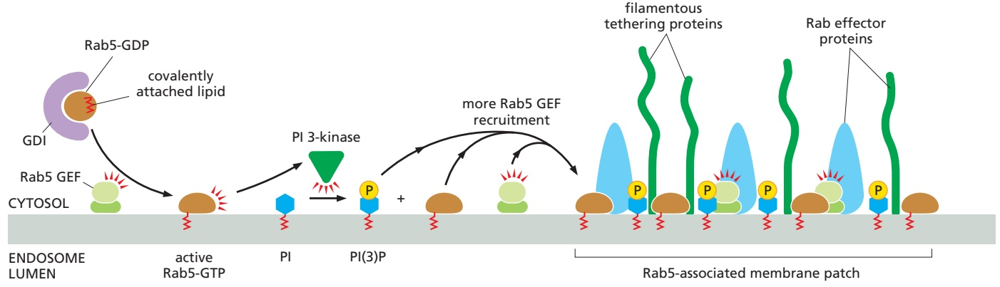

---

762

Chapter 13: Intracellular Membrane Traffic

It is thought that different Rab proteins and their effectors help to create multiple specialized membrane domains, each fulfilling a particular set of functions. Thus, while the Rab5-associated membrane patch receives incoming endocytic vesicles from the plasma membrane, distinct Rab11- and Rab4-associated patches. / . in the same endosome organize the budding of recycling vesicles that return proteins from the endosome to the plasma membrane. As we have already discussed, Rab7 on the endosome membrane serves as a coat-recruitment GTPase for retromer, initiating the formation of transport vesicles destined for the Golgi.

One Rab protein can be replaced by a different Rab protein, and this can change the identity of its associated organelle. This is accomplished by one Rab protein selectively recruiting and activating a different Rab protein whose complement of effectors includes proteins that inactivate the first Rab protein and thereby disassemble its associated membrane patch. Such ordered recruitment of sequentially acting Rab proteins is called a **Rab cascade** (**Figure 13–19**). Over time, for example, Rab5-associated membrane patches are replaced by Rab7- associated membrane patches on endosomal membranes. This converts an early endosome, marked by Rab5, into a late endosome, marked by Rab7. Because the set of Rab effectors recruited by Rab7 is different from that recruited by Rab5, this change reprograms the compartment including the incoming and outgoing traffic and repositions the organelle away from the plasma membrane toward the cell interior. All of the cargo contained in the early endosome that has not been recycled to the plasma membrane is now part of a late endosome. This process is also referred to as endosome maturation. The self-amplifying nature of the Rab-associated membrane patches renders the process of endosome maturation unidirectional and irreversible.

## SNAREs Mediate Membrane Fusion

Once a transport vesicle has budded from its originating compartment and shed its coat, membrane fusion allows it to unload its cargo at its destination compartment. Membrane fusion requires bringing the lipid bilayers of two membranes to within 1.5 nm of each other so that they can merge. When the membranes are in such close proximity, lipids can flow from one bilayer to the other. For this close approach, water must be displaced from the hydrophilic surface of the membrane—a process that is highly energetically unfavorable and requires specialized fusion proteins that overcome this energy barrier. We have already discussed the role of dynamin in the related task of squeezing membranes close together during the pinching off of clathrin-coated vesicles (see Figure 13–14).

The **SNARE proteins** (also called **SNAREs**, for short) catalyze the membrane fusion reactions in vesicle transport. There are at least 35 different SNAREs in an animal cell, each associated with a particular organelle in the secretory or endocytic pathway. These transmembrane proteins exist as complementary sets, with **v-SNAREs** usually found on vesicle membranes and **t-SNAREs** usually found on target membranes (see Figure 13–17). A v-SNARE is a single polypeptide chain, whereas a t-SNARE is usually composed of three proteins. The v-SNAREs and t-SNAREs have characteristic helical domains that are mostly unstructured in isolation. When a v-SNARE interacts with a t-SNARE, the helical domains of one zipper up with the helical domains of the other to form a very stable four-helix

Figure 13–19 A model for a generic Rab cascade. The local activation of a RabA GEF leads to assembly of a RabAassociated membrane patch (sometimes called a “Rab domain”) on the membrane. Active RabA recruits its effector proteins, one of which is a GEF for RabB. The RabB GEF then recruits RabB to the membrane, which in turn begins to recruit its effectors, among them a GAP for RabA. The RabA GAP activates RabA-GTP hydrolysis leading to the inactivation of the RabA and the disassembly of the RabA-associated membrane patch as the RabB-associated membrane patch grows. In this way, the RabA-associated membrane patch is irreversibly replaced by the RabB-associated membrane patch. In principle, this sequence can be continued by the recruitment of a next GEF by RabB. (Adapted from A.H. Hutagalung and P.J. Novick, Physiol. Rev. 91:119–149, 2011.)

---

MECHANISMS OF MEMBRANE TRANSPORT AND COMPARTMENT IDENTITY

763

Figure 13–20 A model for how SNARE proteins catalyze membrane fusion. Bilayer fusion occurs in multiple steps. A tight pairing between v- and t-SNAREs forces lipid bilayers into close apposition and expels water molecules from the interface. Lipid molecules in the two interacting (cytosolic) leaflets of the bilayers then flow between the membranes to form a connecting stalk. Lipids of the two noncytosolic leaflets then contact each other, forming a new bilayer, which widens the fusion zone (hemifusion, or half-fusion). Rupture of the new bilayer completes the fusion reaction.

bundle. The resulting trans-SNARE complex locks the two membranes together. Biochemical membrane fusion assays with all different SNARE combinations show that v- and t-SNARE pairing is highly specific. The SNAREs thus provide an additional layer of specificity in the transport process by helping to ensure that vesicles fuse only with their correct target membrane.

The extremely high stability of the trans-SNARE complex means that its assembly from initially unstructured v- and t-SNAREs is energetically favorable. This energy is exploited to pull the membrane faces together, simultaneously squeezing out water molecules from the interface to initiate lipid bilayer fusion (**Figure 13–20**). When liposomes containing purified v-SNAREs are mixed with liposomes containing complementary t-SNAREs, their membranes fuse, albeit slowly. In the cell, fusion is greatly accelerated by factors that interact with v-SNARE and t-SNARE pairs to align them precisely so they can initiate zippering. Fusion does not always follow immediately after v-SNAREs and t-SNAREs pair. As we discuss later, in the process of regulated exocytosis, zippering of the last part of the trans-SNARE complex is delayed until secretion is triggered by a specific extracellular signal.

## Interacting SNAREs Need to Be Pried Apart Before They Can Function Again

After SNARE proteins have participated in membrane fusion, the highly stable trans-SNARE complexes have to disassemble before the SNAREs can mediate new rounds of transport. A crucial protein called **NSF** cycles between membranes and the cytosol and catalyzes the disassembly process. NSF is a hexameric ATPase of the family of AAA-proteins (see Figure 6–88) that uses the energy of ATP hydrolysis to unravel the intimate interactions between the helical domains of paired SNARE proteins (**Figure 13–21**). After disassembly, the SNARE proteins can again exploit the energy gained by their assembly to drive another fusion reaction. Thus, the energy for SNARE-mediated fusion reactions ultimately comes from the ATP consumed by NSF to pry them apart. After trans-SNARE complex disassembly at the destination compartment, v-SNAREs are selectively retrieved and returned to their compartment of origin so that they can be reused in newly formed transport vesicles. Such selective retrieval pathways (discussed later) are critical for maintaining the identity of each compartment in the face of constant outgoing traffic.

Membrane fusion is important in other processes besides vesicle transport. The plasma membranes of a sperm and an egg fuse during fertilization, myoblasts fuse with one another during the development of multinucleate muscle fibers (discussed in Chapter 22), and the epithelial cells in the human placenta fuse into a giant syncytium that separates the mother from the fetus. Likewise, the ER network and mitochondria fuse and fragment in a dynamic way (discussed in Chapters 12 and 14). All cell membrane fusions require special proteins and are tightly regulated to ensure that only appropriate membranes fuse. The controls

Figure 13–21 Dissociation of SNARE pairs by NSF after a membrane fusion cycle. After a v-SNARE and t-SNARE have effected the fusion of a transport vesicle with a target membrane, NSF binds to the SNARE complex and, with the help of accessory proteins, hydrolyzes ATP to pry the SNAREs apart.

---

764

Chapter 13: Intracellular Membrane Traffic

are crucial for maintaining both the identity of cells and the individuality of each type of intracellular compartment.

## Viruses Encode Specialized Membrane Fusion Proteins Needed for Cell Entry

Enveloped viruses, which have a lipid bilayer–based membrane coat, enter the cells that they infect when the viral membrane fuses with a cell’s membrane (discussed in Chapters 5 and 23). For example, viruses such as the human immunodeficiency virus (HIV), which causes AIDS, bind to cell-surface receptors and then fuse with the plasma membrane of the target cell (**Figure 13–22**). This fusion event allows the viral nucleic acid inside the nucleocapsid to enter the cytosol, where it replicates. Other viruses, such as the influenza virus, first enter the cell by receptor-mediated endocytosis (discussed later) and are delivered to endosomes; the low pH in endosomes activates a fusion protein in the viral envelope that catalyzes the fusion of the viral and endosomal membranes, releasing the viral nucleic acid into the cytosol. In the case of the severe acute respiratory syndrome coronavirus 2 (SARS-CoV-2), which causes COVID-19, the fusion reaction requires host proteases that cleave the virus surface protein to activate its fusion activity.

The membrane fusion reactions catalyzed by viral fusion proteins are well understood. Unlike SNARE-mediated fusion, which involves proteins in both membranes, viral fusion typically requires only the viral protein. These viral fusion proteins unfurl in the appropriate environment and insert a partially hydrophobic patch into the host membrane. The fusion protein then undergoes compaction to bring the two membranes close together to drive their fusion in a reaction analogous to SNARE-mediated fusion.

## Summary

Directed and selective transport of particular membrane components from one membrane-enclosed compartment to another in a eukaryotic cell maintains the differences between those compartments. Transport vesicles, which can be spherical, tubular, or irregularly shaped, bud from specialized coated regions of the donor membrane. The assembly of the coat helps to collect specific membrane and soluble cargo molecules for transport and to drive the formation of the vesicle.

There are various types of coated vesicles. Clathrin-coated vesicles mediate transport from the plasma membrane, endosomes, and the trans Golgi network. COPI-coated and COPII-coated vesicles mediate transport between Golgi cisternae and between the ER and the Golgi apparatus. Retromer forms a coat at the endosome membrane for transport to the Golgi. Coats have a common two-layered structure: an inner layer formed of adaptor proteins traps specific cargo molecules for packaging into the vesicle and an outer layer that forms a cage and helps deform the membrane into a vesicle. The coat is shed before the vesicle fuses with its appropriate target membrane.

The specificity of membrane transport is mediated by several types of molecular markers that determine where transport vesicles originate and where they deliver their cargo. Local synthesis of specific phosphoinositides creates binding sites that trigger clathrin coat assembly and vesicle budding. In addition, the coat-recruitment GTPases, including Sar1 and the ARF proteins, regulate coat assembly and disassembly. Rab proteins are a large family of GTPases that function on both transport vesicles and target membranes to control the specificity of membrane transport. Active Rab proteins recruit Rab effectors, such as motor proteins, which transport vesicles along actin filaments or microtubules, and filamentous tethering proteins, which help ensure that the vesicles deliver their contents only to the appropriate target membrane. Specialized membrane domains that help determine an organelle’s identity can be generated and changed in a dynamic manner by the assembly and disassembly of Rab proteins and their effectors. Complementary v-SNARE proteins on transport vesicles and t-SNARE proteins on the target membrane form stable trans-SNARE complexes,

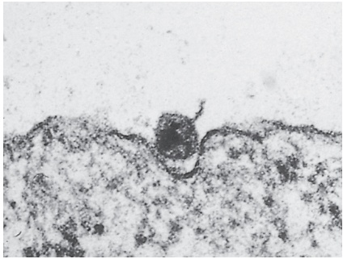

200 nm

Figure 13–22 The entry of enveloped viruses into cells. Electron micrographs showing how HIV enters a cell by fusing its membrane with the plasma membrane of the cell. (From B.S. Stein et al., Cell 49:659–668, 1987. With permission from Elsevier.)

---

TRANSPORT FROM THE ENDOPLASMIC RETICULUM THROUGH THE GOLGI APPARATUS

765

which force the two membranes into close apposition so that their lipid bilayers can fuse.

## TRANSPORT FROM THE ENDOPLASMIC RETICULUM THROUGH THE GOLGI APPARATUS

As discussed in Chapter 12, newly synthesized proteins cross the endoplasmic reticulum (ER) membrane from the cytosol to enter the secretory pathway. These proteins are successively modified as they pass through a series of compartments from the ER to the Golgi apparatus and from the Golgi apparatus to the cell surface and elsewhere. Transfer from one compartment to the next involves a delicate balance between forward and backward (retrieval) transport pathways. Some transport vesicles select cargo molecules and move them to the next compartment in the pathway, while others retrieve escaped proteins and return them to a previous compartment where they normally function. Thus, the pathway from the ER to the cell surface consists of many sorting steps, which continually select membrane and soluble lumenal proteins for packaging and transport.

In this section, we focus mainly on the **Golgi apparatus** (also called the Golgi complex). It is a major site of carbohydrate synthesis, as well as a sorting and dispatching station for products delivered to it from the ER. The cell makes many polysaccharides in the Golgi apparatus, including the pectin and hemicellulose of the cell wall in plants and most of the glycosaminoglycans of the extracellular matrix in animals (discussed in Chapter 19). The Golgi apparatus also builds and attaches oligosaccharide chains to the many proteins and lipids that the ER sends to it. Some of these oligosaccharides serve as tags to direct specific proteins carrying them into vesicles that are then transported to endosomes for eventual delivery to lysosomes. But most proteins and lipids, once they have acquired their appropriate oligosaccharides in the Golgi apparatus, are recognized in other ways for targeting into the transport vesicles going to the cell surface and other destinations.

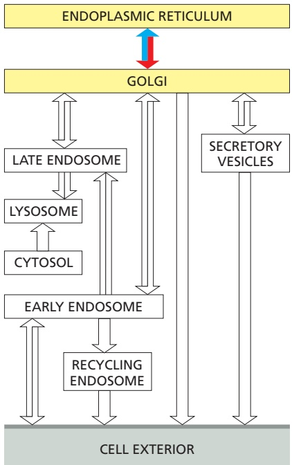

## Proteins Leave the ER in COPII-coated Transport Vesicles

To initiate their journey along the secretory pathway, proteins that have entered the ER and are destined for the Golgi apparatus or beyond are first packaged into COPII-coated transport vesicles. These vesicles bud from specialized regions of the ER called ER exit sites, whose membrane lacks bound ribosomes. Most animal cells have ER exit sites dispersed throughout the ER network.

Entry into vesicles that leave the ER can be a selective process or can happen by default. Many transmembrane proteins are actively recruited into such vesicles, where they become concentrated. These transmembrane proteins display exit (transport) signals on their cytosolic surface that adaptor proteins of the inner COPII coat recognize (**Figure 13–23**). Soluble cargo proteins in the ER lumen have exit signals that are recognized by some of these transmembrane proteins, which serve as cargo receptors. These receptors are recycled back to the ER after they have delivered their cargo to the Golgi apparatus. Proteins without exit signals can also enter transport vesicles, including protein molecules that normally function in the ER (so-called ER resident proteins). These resident proteins slowly leak out of the ER and need retrieval pathways to bring them back from the Golgi apparatus. Different cargo proteins enter the transport vesicles with substantially different rates and efficiencies. These differences can be due to their folding and oligomerization efficiencies and kinetics, as well as their different capacities to engage cargo receptors and the COPII coat. The exit step from the ER is a major checkpoint at which quality control is exerted on the proteins that a cell secretes or displays on its surface, as we discussed in Chapter 12.

The exit signals that direct soluble proteins out of the ER for transport to the Golgi apparatus and beyond are not well understood. Some transmembrane proteins that serve as cargo receptors for packaging some secretory proteins into COPII-coated vesicles are lectins that bind to oligosaccharides on the secreted

---

766

Chapter 13: Intracellular Membrane Traffic

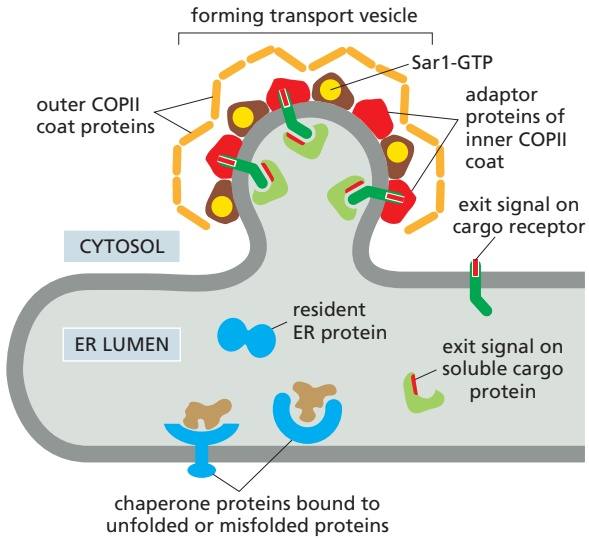

Figure 13–23 The recruitment of membrane and soluble cargo molecules into ER transport vesicles. Transmembrane proteins are packaged into budding transport vesicles through interactions of exit signals on their cytosolic tails with adaptor proteins of the inner COPII coat. Some of these transmembrane proteins function as cargo receptors, binding soluble proteins in the ER lumen and helping to package them into vesicles. Other proteins may enter the vesicle by bulk flow. A typical 50-nm transport vesicle contains about 200 transmembrane proteins, which can be of many different types. As indicated, unfolded or incompletely assembled proteins are bound to chaperones and transiently retained in the ER compartment.

proteins. One such lectin, for example, binds to mannose on two secreted blood-clotting factors (Factor V and Factor VIII), thereby packaging the proteins into transport vesicles in the ER; its role in protein transport was identifiedMBoC7 m13.22/13.23 because humans who lack it owing to an inherited mutation have lowered serum levels of Factors V and VIII, and they therefore bleed excessively.

## Only Proteins That Are Properly Folded and Assembled Can Leave the ER

To exit from the ER, proteins must be properly folded, and, if they are subunits of multiprotein complexes, they need to be completely assembled. Those that are misfolded or incompletely assembled transiently remain in the ER, where they are bound to chaperone proteins (discussed in Chapter 6) such as BiP or calnexin. The chaperones may cover up the exit signals or somehow anchor the proteins in the ER. Such failed proteins are eventually transported back into the cytosol, where they are degraded by proteasomes (discussed in Chapters 6 and 12). This quality-control step prevents the onward transport of misfolded or misassembled proteins that could potentially interfere with the functions of normal proteins. Such failures are surprisingly common. Most of the newly synthesized subunits of the T cell receptor (discussed in Chapter 24) and of the acetylcholine receptor (discussed in Chapter 11), for example, are normally degraded without ever reaching the cell surface where they function. Thus, cells must make a large excess of some protein molecules to produce a select few that fold, assemble, and function properly.

Sometimes, however, there are drawbacks to the stringent quality-control mechanism. The predominant mutations that cause cystic fibrosis, a common inherited disease, result in the production of a slightly misfolded form of a plasma membrane protein important for Cl– transport. Although the mutant protein would function almost normally if it reached the plasma membrane, it is retained in the ER and then is degraded by cytosolic proteasomes. This devastating disease thus results not because the mutation inactivates the protein but because potentially active protein is discarded before it reaches the plasma membrane.

## Vesicular Tubular Clusters Mediate Transport from the ER to the Golgi Apparatus

After transport vesicles have budded from ER exit sites and have shed their coat, they begin to fuse with one another. The fusion of membranes from the same compartment is called homotypic fusion, to distinguish it from heterotypic fusion, in which a membrane from one compartment fuses with the membrane of a different compartment. As with heterotypic fusion, homotypic fusion requires a set

---

TRANSPORT FROM THE ENDOPLASMIC RETICULUM THROUGH THE GOLGI APPARATUS

767

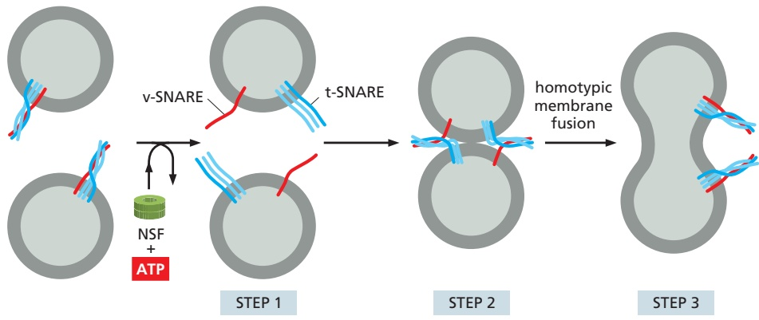

of matching SNAREs. In this case, however, the interaction is symmetrical, with both membranes contributing v-SNAREs and t-SNAREs (**Figure 13–24**).

The structures formed when ER-derived vesicles fuse with one another are called vesicular tubular clusters, because they have a convoluted appearance in the electron microscope (**Figure 13–25A**). These clusters constitute a compartment that is separate from the ER and lacks many of the proteins that function in the ER. They are generated continually and function as transport containers that bring material from the ER to the Golgi apparatus. The clusters move quickly along microtubules to the Golgi apparatus with which they fuse (**Figure 13–25B**MBoC7 m13.23/13.24 and **Movie 13.3**).

As soon as vesicular tubular clusters form, they begin to bud off transport vesicles of their own. Unlike the COPII-coated vesicles that bud from the ER, these vesicles are COPI-coated (see Figure 13–25B). COPI-coated vesicles are unique in that the components that make up the inner and outer coat layers are recruited as a preassembled complex, called coatomer. They function as a retrieval pathway, carrying back ER resident proteins that have escaped, as well as proteins such as cargo receptors and SNAREs that participated in the ER budding and vesicle fusion reactions. This retrieval process demonstrates the exquisite control mechanisms that regulate coat assembly reactions. The COPI coat assembly begins only seconds after the COPII coats have been shed; it remains a mystery how this switch in coat assembly is controlled.

The retrieval (or retrograde) transport continues as the vesicular tubular clusters move toward the Golgi apparatus. Thus, the clusters continually mature, gradually changing their composition as selected proteins are returned to the ER.

Figure 13–24 Homotypic membrane fusion. In step 1, NSF pries apart identical pairs of v-SNAREs and t-SNAREs in both membranes (see Figure 13–21). In steps 2 and 3, the separated matching SNAREs on adjacent identical membranes interact, which leads to membrane fusion and the formation of one continuous compartment. Subsequently, the compartment grows by further homotypic fusion with vesicles from the same kind of membrane, displaying matching SNAREs. Homotypic fusion occurs when ER-derived transport vesicles fuse with one another, but also when endosomes fuse to generate larger endosomes. Rab proteins help regulate the extent of homotypic fusion and hence the size of a cell’s compartments (not shown).

Figure 13–25 Vesicular tubular clusters. (A) An electron micrograph of vesicular tubular clusters forming around an exit site. Many of the vesicle-like structures seen in the micrograph are cross sections of tubules that extend above and below the plane of this thin section and are interconnected. (B) Vesicular tubular clusters move along microtubules to carry proteins from the ER to the Golgi apparatus. COPI coats mediate the budding of vesicles that return to the ER from these clusters (and from the Golgi apparatus). (A, courtesy of Judith Klumperman, from J.A. Martínez-Menárguez et al., Cell 98:81–90, 1999.)

(A)

ER

cis Golgi

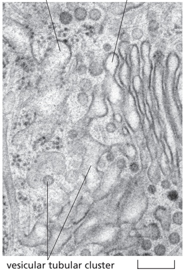

(B)

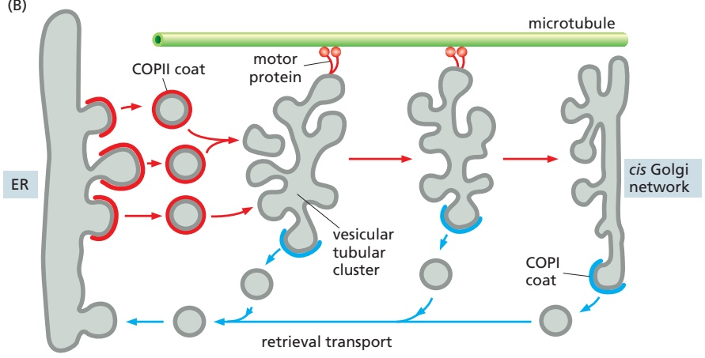

---

768

Chapter 13: Intracellular Membrane Traffic

The retrieval continues from the Golgi apparatus, after the vesicular tubular clusters have delivered their cargo.

## The Retrieval Pathway to the ER Uses Sorting Signals

The retrieval pathway for returning escaped proteins back to the ER depends on ER retrieval signals. Resident ER membrane proteins, for example, contain signals that bind directly to COPI coats and are thus packaged into COPI-coated transport vesicles for retrograde delivery to the ER. The best-characterized retrieval signal of this type consists of two lysines, followed by any two other amino acids, at the extreme C-terminal end of the ER membrane protein. It is called a KKXX sequence, based on the single-letter amino acid code. Most membrane proteins that function at the interface between the ER and Golgi apparatus, including v- and t-SNAREs and some cargo receptors, use this retrieval pathway to come back to the ER.

Soluble ER resident proteins, such as BiP, also contain a short ER retrieval signal at their C-terminal end, but it is different: it consists of a Lys-Asp-Glu-Leu or a similar sequence. If this signal (called the KDEL sequence) is removed from BiP by genetic engineering, the protein is slowly secreted from the cell. If the signal is transferred to a protein that is normally secreted, the protein is now efficiently returned to the ER, where it accumulates. Unlike the retrieval signals on ER membrane proteins, which can interact directly with the COPI coat, soluble ER resident proteins must bind to specialized receptor proteins such as the KDEL receptor—a multipass transmembrane protein that binds to the KDEL sequence and packages any protein displaying it into COPI-coated retrograde transport vesicles (**Figure 13–26**).

The KDEL receptor accomplishes this task by cycling between the ER and the Golgi apparatus, selectively binding proteins with the KDEL sequence in the Golgi apparatus and releasing them in the ER. The markedly different affinity between the receptor and the KDEL sequence in these two compartments is due to the lower pH in the Golgi apparatus, which is regulated by H+ pumps. A critical histidine in the KDEL receptor is protonated in the lower-pH environment of the Golgi apparatus, strongly favoring its interaction with the KDEL sequence. As we discuss later, pH-sensitive protein–protein interactions form the basis for many of the protein-sorting steps in the cell.

## Many Proteins Are Selectively Retained in the Compartments in Which They Function

The KDEL retrieval pathway only partly explains how ER resident proteins are maintained in the ER. As mentioned, cells that express genetically modified ER resident proteins, from which the KDEL sequence has been experimentally removed, secrete these proteins. But the rate of secretion is much slower than that

Figure 13–26 Retrieval of soluble ER resident proteins. ER resident proteins that escape from the ER are returned by vesicle transport. (A) The KDEL receptor present in both vesicular tubular clusters and the Golgi apparatus captures the soluble ER resident proteins and carries them in COPI-coated transport vesicles back to the ER. (Recall that the COPI-coated vesicles shed their coats as soon as they are formed.) Upon binding its ligands in the tubular cluster or Golgi apparatus, the KDEL receptor may change conformation, so as to facilitate its recruitment into budding COPI-coated vesicles. (B) The retrieval of ER proteins begins in vesicular tubular clusters and continues in later parts of the Golgi apparatus. In the environment of the ER, the ER resident proteins dissociate from the KDEL receptor, which is then returned to the Golgi apparatus for reuse. We discuss the different compartments of the Golgi apparatus shortly.

(A)

(B)

---

TRANSPORT FROM THE ENDOPLASMIC RETICULUM THROUGH THE GOLGI APPARATUS

769

for a normal secretory protein. It seems that a mechanism that is independent of their KDEL signal normally retains ER resident proteins and that only those proteins that escape this retention mechanism are captured and returned via the KDEL receptor.

A suggested retention mechanism is that ER resident proteins bind to one another, thus forming complexes that are too big to enter transport vesicles efficiently. Because ER resident proteins are present in the ER at very high concentrations (estimated to be millimolar), relatively low-affinity interactions would suffice to retain most of the proteins in such complexes. Aggregation of proteins that function in the same compartment is a general mechanism that compartments use to organize and retain their resident proteins. Golgi enzymes that function together, for example, also bind to each other and are thereby restrained from entering transport vesicles leaving the Golgi apparatus.

## The Golgi Apparatus Consists of an Ordered Series of Compartments

Because it could be selectively visualized by silver stains, the Golgi apparatus was one of the first organelles described by early light microscopists. It consists of a collection of flattened, membrane-enclosed compartments called cisternae, that somewhat resemble a stack of pita breads. Each Golgi stack typically consists of four to six cisternae (**Figure 13–27**), although some unicellular flagellates can have more than 20. In animal cells, tubular connections between corresponding cisternae link many stacks, thus forming a single complex, which is usually located near the cell nucleus and close to the centrosome (**Figure 13–28A**). This localization depends on microtubules. If microtubules are experimentally depolymerized, the Golgi apparatus reorganizes into individual stacks that are found throughout the cytoplasm, adjacent to ER exit sites. Some cells, including most plant cells, have hundreds of individual Golgi stacks

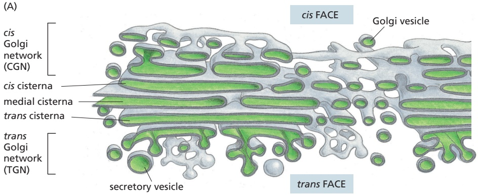

(B)

1 µm

Figure 13–27 The Golgi apparatus. (A) Three-dimensional reconstruction from electron micrographs of the Golgi apparatus in a secretory animal cell. The cis face of the Golgi stack is that closest to the ER. (B) A thin-section electron micrograph of an animal cell. In plant cells, the Golgi apparatus is generally more distinct and more clearly separated from other intracellular membranes than in animal cells. (A, redrawn from A. Rambourg and Y. Clermont, Eur. J. Cell Biol. 51:189–200, 1990; B, courtesy of Brij J. Gupta.)

---

770

Chapter 13: Intracellular Membrane Traffic

(A)

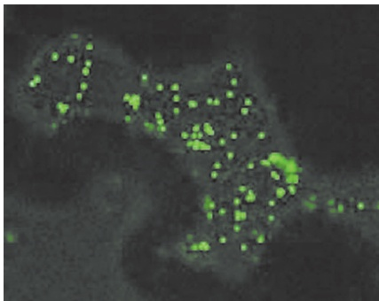

(B)

Figure 13–28 Localization of the Golgi apparatus in animal and plant cells. (A) The Golgi apparatus in a cultured fibroblast stained with a fluorescent antibody that recognizes a Golgi resident protein (bright orange). The Golgi apparatus is polarized, facing the direction in which the cell was crawling before fixation. (B) The Golgi apparatus in a plant cell that is expressing a fusion protein consisting of a resident Golgi enzyme fused to green fluorescent protein. (A, courtesy of John Henley and Mark McNiven; B, courtesy of Chris Hawes.)

dispersed throughout the cytoplasm where they are typically found adjacent to ER exit sites (**Figure 13–28B**).

During their passage through the Golgi apparatus, many transported molecules undergo an ordered series of covalent modifications. Each Golgi stack has two distinct faces: a **cis face** (or entry face) and a **trans face** (or exit face). Both cis and trans faces are closely associated with special compartments, each composed of aMBoC7 m13.27/13.28 network of interconnected tubular and cisternal structures: the **cis Golgi network (CGN)** and the **trans Golgi network (TGN)**, respectively. The CGN is a collection of fused vesicular tubular clusters arriving from the ER. Proteins and lipids enter the cis Golgi network and exit from the trans Golgi network, bound for the cell surface or another compartment. Both networks are important for protein sorting: proteins entering the CGN can either move onward in the Golgi apparatus or be returned to the ER. Similarly, proteins exiting from the TGN move onward and are sorted according to their next destination: endosomes, secretory vesicles, or the cell surface. They also can be returned to an earlier compartment. Some membrane proteins are retained in the part of the Golgi apparatus where they function.

As described in Chapter 12, a single species of N-linked oligosaccharide is attached en bloc to many proteins in the ER and then trimmed while the protein is still in the ER. The oligosaccharide intermediates created by the trimming reactions serve to help proteins fold and to help transport misfolded proteins to the cytosol for degradation in proteasomes. Thus, they play an important role in controlling the quality of proteins exiting from the ER. Once these ER functions have been fulfilled, the cell reutilizes the oligosaccharides for new functions. This begins in the Golgi apparatus, which generates the heterogeneous oligosaccharide structures seen in mature proteins. After arrival in the CGN, proteins enter the first of the Golgi processing compartments (the cis Golgi cisterna). They then move to the next compartment (the medial cisterna) and finally to the trans cisterna, where glycosylation is completed. The lumen of the trans cisterna is thought to be continuous with the TGN, the place where proteins are segregated into different transport packages and dispatched to their next destinations.

The oligosaccharide-processing steps occur in an organized sequence in the Golgi apparatus, with each cisterna containing a characteristic mixture of processing enzymes. Proteins are modified in successive stages as they move from cisterna to cisterna across the stack, so that the stack forms a multistage processing unit.

Investigators discovered the functional differences between the cis, medial, and trans subdivisions of the Golgi apparatus by localizing the enzymes involved in processing N-linked oligosaccharides in distinct regions of the organelle, both by physical fractionation of the organelle and by labeling the enzymes in electron microscope sections with antibodies (**Figure 13–29**). The removal of mannose and

(A)

(B)

(C)

<small>Figure 13–29 Molecular compartmentalization of the Golgi apparatus. A series of electron micrographs shows the Golgi apparatus (A) unstained, (B) stained with osmium, which preferentially labels the cisternae of the cis compartment, and (C and D) stained to reveal the location of specific enzymes. Nucleoside diphosphatase is found in the trans Golgi cisternae (C), while acid phosphatase is found in the trans Golgi network (D). Note that usually more than one cisterna is stained. The enzymes are therefore thought to be highly enriched rather than precisely localized to a specific cisterna. (Courtesy of Daniel S. Friend, by permission of E.L. Bearer.)</small>

1 µm

---

TRANSPORT FROM THE ENDOPLASMIC RETICULUM THROUGH THE GOLGI APPARATUS

771

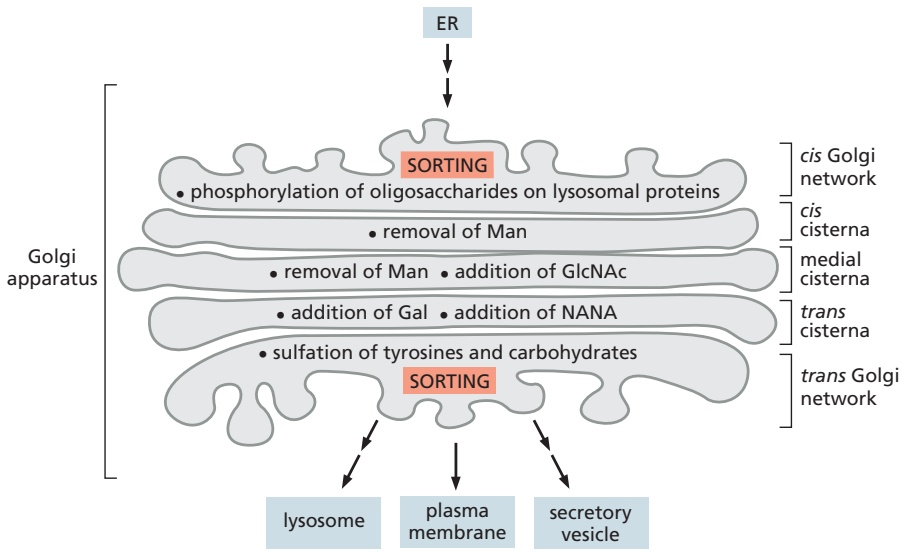

the addition of N-acetylglucosamine, for example, occur in the cis and medial cisternae, while the addition of galactose and sialic acid occurs in the trans cisterna and trans Golgi network. Figure 13–30 summarizes the functional compartmentalization of the Golgi apparatus.

processing in Golgi compartments. The localization of each processing step shown was determined by a combination of techniques, including biochemical subfractionation of the Golgi apparatus membranes and electron microscopy after staining with antibodies specific for some of the processing enzymes. Processing enzymes are not restricted to a particular cisterna; instead, their distribution is graded across the stack, such that early-acting enzymes are present mostly in the cis Golgi cisternae and later-acting enzymes are mostly in the trans Golgi cisternae. Man, mannose; GlcNAc, N-acetylglucosamine; Gal, galactose; NANA, N-acetylneuraminic acid (sialic acid).

## Oligosaccharide Chains Are Processed in the Golgi Apparatus

Whereas the ER lumen is full of soluble resident proteins and enzymes, the resident proteins in the Golgi apparatus are all membrane bound. All of the Golgi glycosidases and glycosyl transferases, for example, are single-pass transmembrane proteins, many of which are organized in multienzyme complexes.

Two broad classes of N-linked oligosaccharides, the **complex oligosaccharides** and the **high-mannose oligosaccharides**, are attached to mammalian glycoproteins. Sometimes, both types are attached (in different places) to the same polypeptide chain. Complex oligosaccharides are generated when the original N-linked oligosaccharide added in the ER is trimmed and further sugars are added; by contrast, high-mannose oligosaccharides are trimmed but have no new sugars added to them in the Golgi apparatus (**Figure 13–31**). The sialic acids

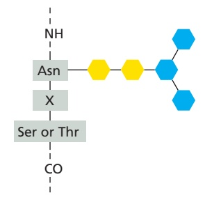

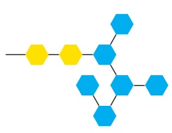

Figure 13–31 The two main classes of asparagine-linked (N-linked) oligosaccharides found in mature mammalian glycoproteins. (A) Both complex oligosaccharides and high-mannose oligosaccharides share a common core region derived by trimming the original N-linked oligosaccharide added in the ER (see Figure 12–32) and typically containing two N-acetylglucosamines (GlcNAc) and three mannoses (Man). The three amino acids constitute the sequence recognized by the oligosaccharyl transferase enzyme that adds the initial oligosaccharide to the protein. Asn, asparagine; Ser, serine; Thr, threonine; X, any amino acid, except proline. (B) Each complex oligosaccharide consists of a core region, together with a terminal region that contains a variable number of copies of a special trisaccharide unit (N-acetylglucosamine–galactose–sialic acid) linked to the three core mannoses. Frequently, the terminal region is truncated and contains only GlcNAc and galactose (Gal) or just GlcNAc. In addition, a fucose may be added, usually to the core GlcNAc attached to the asparagine (Asn). Thus, although the steps of processing and subsequent sugar addition are rigidly ordered, complex oligosaccharides can be heterogeneous. Moreover, although the complex oligosaccharide shown has three terminal branches, two and four branches are also common, depending on the glycoprotein and the cell in which it is made (Movie 13.4). (C) Highmannose oligosaccharides are not trimmed back all the way to the core region and contain additional mannoses. Hybrid oligosaccharides with one Man branch and one GlcNAc and Gal branch are also found (not shown).

---

772

Chapter 13: Intracellular Membrane Traffic

Figure 13–32 Oligosaccharide processing in the ER and the Golgi apparatus. The processing pathway is highly ordered, so that each step shown depends on the previous one. Step 1: Processing begins in the ER with the removal of the glucoses from the oligosaccharide initially transferred to the protein. Then a mannosidase in the ER membrane removes a specific mannose. The remaining steps occur in the Golgi stack. Step 2: Golgi mannosidase I removes three more mannoses. Step 3: N-acetylglucosamine transferase I then adds an N-acetylglucosamine. Step 4: Golgi mannosidase II then removes two additional mannoses. This yields the final core of three mannoses that is present in a complex oligosaccharide. At this stage, the bond between the two N-acetylglucosamines in the core becomes resistant to attack by a highly specific endoglycosidase (Endo H). Because all later structures in the pathway are also Endo H–resistant, treatment with this enzyme is widely used to distinguish complex from high-mannose oligosaccharides. Step 5: Finally, as shown in Figure 13–31, additional N-acetylglucosamines, galactoses, and sialic acids are added. These final steps in the synthesis of a complex oligosaccharide occur in the cisternal compartments of the Golgi apparatus: three types of glycosyl transferase enzymes act sequentially, using sugar substrates that have been activated by linkage to the indicated nucleotide; the membranes of the Golgi cisternae contain specific carrier proteins that allow each sugar nucleotide to enter in exchange for the nucleoside phosphates that are released after the sugar is attached to the protein on the lumenal face.

MBoC7 m13.31/13.32Note that, as a biosynthetic organelle, the Golgi apparatus differs from the ER: all sugars in the Golgi are assembled inside the lumen from sugar nucleotides, whereas in the ER, the N-linked precursor oligosaccharide is assembled partly in the cytosol and partly in the lumen, and most lumenal reactions use dolichol-linked sugars as their substrates (see Figure 12–33).

in the complex oligosaccharides are of special importance because they bear a negative charge. Whether a given oligosaccharide remains high-mannose or is processed depends largely on its position in the protein. If the oligosaccharide is accessible to the processing enzymes in the Golgi apparatus, it is likely to be converted to a complex form; if it is inaccessible because its sugars are tightly held to the protein’s surface, it is likely to remain in a high-mannose form. The processing that generates complex oligosaccharide chains follows the highly ordered pathway shown in **Figure 13–32**.

Beyond these commonalities in oligosaccharide processing that are shared among most cells, the products of the carbohydrate modifications carried out in the Golgi apparatus are highly complex and have given rise to a field of study called glycobiology. The human genome, for example, encodes hundreds of different Golgi glycosyl transferases and many glycosidases. These enzymes are expressed differently from one cell type to another and at different times during development, resulting in a variety of glycosylated forms of a given protein or lipid in different cell types and at varying stages of differentiation. The complexity of modifications is not limited to N-linked oligosaccharides but also occurs on O-linked sugars, as we discuss next.

## Proteoglycans Are Assembled in the Golgi Apparatus

In addition to the N-linked oligosaccharide alterations, many proteins are modified in the Golgi apparatus in other ways as they pass through the Golgi cisternae en route from the ER to their final destinations. Some proteins have sugars added