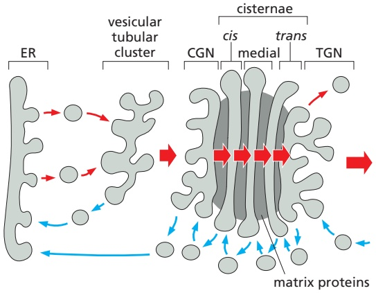
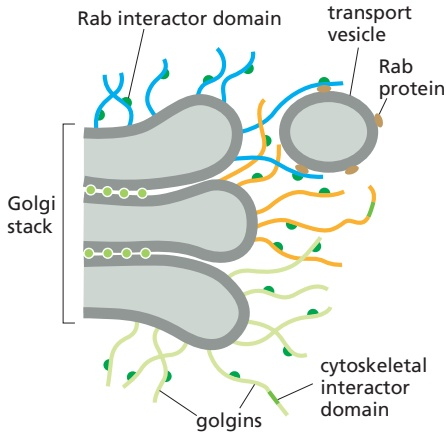
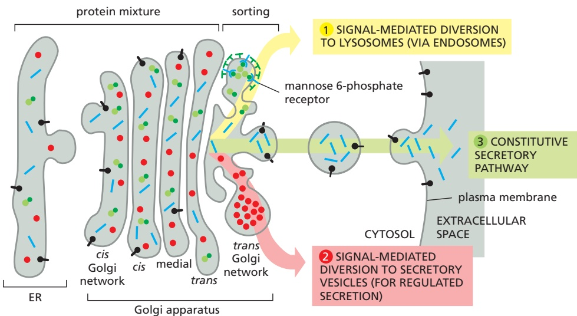
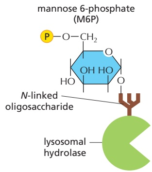
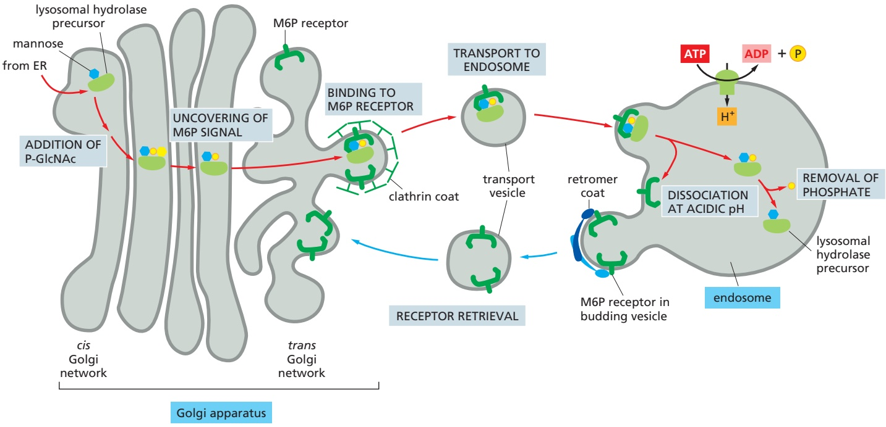
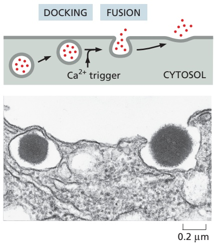
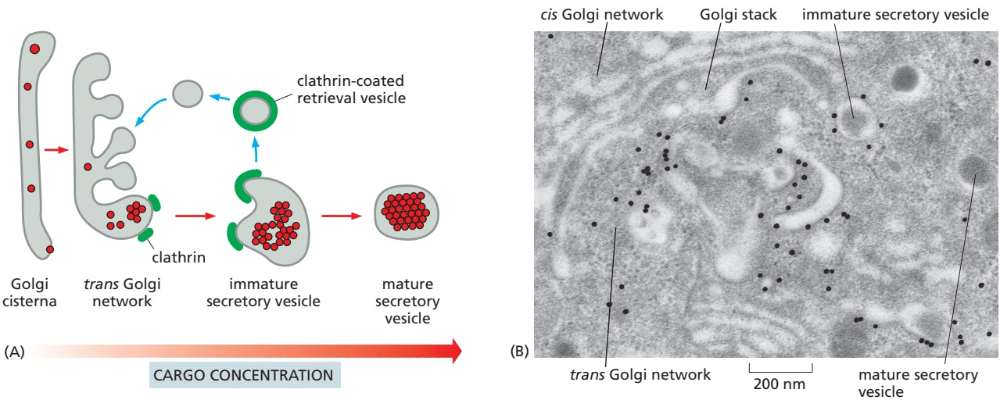
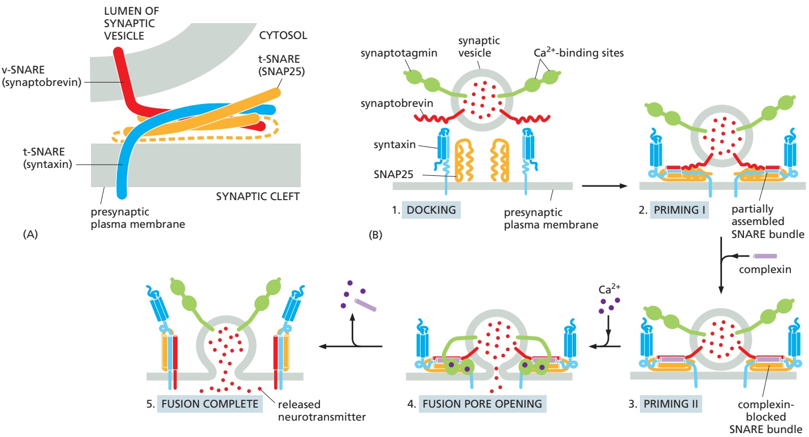

TRANSPORT FROM THE ENDOPLASMIC RETICULUM THROUGH THE GOLGI APPARATUS

773

Figure 13–33 N- and O-linked glycosylation. In each case, only the single sugar group that is directly attached to the protein chain is shown.

to the hydroxyl groups of selected serines or threonines or, in some cases (suchMBoC7 m13.32/13.33 as collagens), to hydroxylated proline and lysine side chains. This **O-linked glycosylation** (**Figure 13–33**), like the extension of N-linked oligosaccharide chains, is catalyzed by a series of glycosyl transferase enzymes that use the sugar nucleotides in the lumen of the Golgi apparatus to add sugars to a protein one at a time. Usually, N-acetylgalactosamine is added first, followed by a variable number of additional sugars, ranging from just a few to 10 or more.

The Golgi apparatus confers the heaviest O-linked glycosylation of all on mucins, the glycoproteins in mucus secretions, and on proteoglycan core proteins, which it modifies to produce **proteoglycans**. As discussed in Chapter 19, this process involves the polymerization of one or more glycosaminoglycan chains (long, unbranched polymers composed of repeating disaccharide units; see Figure 19–35) onto serines on a core protein. Many proteoglycans are secreted and become components of the extracellular matrix, while others remain anchored to the extracellular face of the plasma membrane. Still others form a major component of slimy materials, such as the mucus that is secreted to form a protective coating on the surface of many epithelia.

The sugars incorporated into glycosaminoglycans are heavily sulfated in the Golgi apparatus immediately after these polymers are made, thus adding a significant portion of their characteristically large negative charge. Some tyrosines in proteins also become sulfated shortly before they exit from the Golgi apparatus. In both cases, the sulfation depends on the sulfate donor 3′-phosphoadenosine-5′-phosphosulfate (PAPS) (**Figure 13–34**), which is transported from the cytosol into the lumen of the trans Golgi network.

## What Is the Purpose of Glycosylation?

There is an important difference between the construction of an oligosaccharide and the synthesis of other macromolecules such as DNA, RNA, and protein. Whereas nucleic acids and proteins are copied from a template in a repeated series of identical steps using the same enzyme or set of enzymes, complex carbohydrates require a different enzyme at each step. The product of each enzyme is recognized as the exclusive substrate for the next enzyme in the series. The vast abundance of glycoproteins and the complicated pathways that have evolved to synthesize them emphasize that the oligosaccharides on glycoproteins and glycosphingolipids have very important functions. A large family of genetic human diseases known as congenital disorders of glycosylation is caused by inherited mutations in individual enzymes involved in glycan modification of proteins and lipids.

3′-phosphoadenosine-5′-phosphosulfate (PAPS)

Figure 13–34 The structure of PAPS.

---

774

Chapter 13: Intracellular Membrane Traffic

Figure 13–35 The three-dimensional structure of a high-mannose N-linked oligosaccharide. The structure was determined by x-ray crystallographic analysis of a glycoprotein. This oligosaccharide contains only 9 sugars, whereas there are 14 sugars in the N-linked oligosaccharide that is initially transferred to proteins in the ER (see Figure 12–32). Left: a backbone model showing all atoms except hydrogens; only the asparagine side chain of the protein is shown. Right: a space-filling model, with the asparagine and sugars indicated using the same color scheme as at left. (PDB code: 5KZC.)

N-linked glycosylation, for example, is prevalent in all eukaryotes, including yeasts. N-linked oligosaccharides also occur in a very similar form in archaeal cell-wall proteins, suggesting that the whole machinery required for their synthesis is evolutionarily ancient. N-linked glycosylation promotes protein folding inMBoC7 m13.34/13.35 two ways. First, it has a direct role in making folding intermediates more soluble, thereby preventing their aggregation. Second, the sequential modifications of the N-linked oligosaccharide establish a “glyco-code” that marks the progression of protein folding. This glyco-code is used by chaperones and lectins in the ER to guide protein folding and degradation (discussed in Chapter 12) and by other lectins that guide ER-to-Golgi transport. As we discuss later, oligosaccharides also participate in protein sorting in the trans Golgi network.

Because chains of sugars have limited flexibility, even a small N-linked oligosaccharide protruding from the surface of a glycoprotein (**Figure 13–35**) can limit the approach of other macromolecules to the protein surface. In this way, for example, the presence of oligosaccharides tends to make a glycoprotein more resistant to digestion by proteolytic enzymes. It may be that the oligosaccharides on cell-surface proteins originally provided an ancestral cell with a protective coat; compared to the rigid bacterial cell wall, such a sugar coat has the advantage that it leaves the cell with the freedom to change shape and move.

The sugar chains have since been adapted to serve other purposes as well. The mucus coat of lung and intestinal cells, for example, protects against many pathogens. The recognition of sugar chains by lectins in the extracellular space is important in many developmental processes and in cell–cell recognition: selectins, for example, are transmembrane lectins that function in cell–cell adhesion during blood-cell migration, as discussed in Chapter 19. The presence of oligosaccharides may modify a protein’s antigenic and functional properties, making glycosylation an important factor in the production of proteins for pharmaceutical purposes.

Glycosylation can also have important regulatory roles. Signaling through the cell-surface signaling receptor Notch, for example, is an important factor in determining the cell’s fate in development (discussed in Chapter 21). Notch is a transmembrane protein that is O-glycosylated by addition of a single fucose to some serines, threonines, and hydroxylysines. Some cell types express an additional glycosyl transferase that adds an N-acetylglucosamine to each of these fucoses in the Golgi apparatus. This addition changes the specificity of Notch for the cell-surface signal proteins that activate it.

## Transport Through the Golgi Apparatus Occurs by Multiple Mechanisms

In order to function, the Golgi apparatus must maintain its polarized multi-cisternal structure while facilitating the transit of a large number of diverse molecules. It is likely that multiple mechanisms are used to transport cargo molecules through the Golgi cisternae while efficiently retaining Golgi resident proteins. One mechanism involves the movement of cargo in transport vesicles from one compartment to the next while retrieving any escaped resident

---

TRANSPORT FROM THE ENDOPLASMIC RETICULUM THROUGH THE GOLGI APPARATUS

775

(A) VESICLE TRANSPORT MECHANISM

(B) CISTERNAL MATURATION MECHANISM

proteins using different transport vesicles (**Figure 13–36A**). This vesicle transport mechanism is conceptually similar to how proteins and lipids are transported from the ER to the Golgi, except that only COPI-coated vesicles are used. Although both forward- and backward-moving vesicles would likely be COPI-coated, the coats may contain different adaptor proteins that confer selectivity on the packaging of cargo molecules.

A different way for cargo to move through the Golgi apparatus involves the **cisternal maturation mechanism**. According to this view, new cis cisternae continually form as vesicular tubular clusters arrive from the ER and fuse with transport vesicles containing Golgi resident proteins and enzymes. As the cargo within a cis cisterna is modified, the enzymes leave in transport vesicles that will fuse with newly arriving vesicular tubular clusters. At the same time, the cisterna accepts transport vesicles containing enzymes from later Golgi cisternae, converting it into a medial cisterna. In this way, a cisterna full of cargo moves through the Golgi stack while different subsets of Golgi resident proteins transit backwards in COPI-coated vesicles from later to earlier cisternae (**Figure 13–36B**). When a cisterna finally moves forward to become part of the trans Golgi network, various types of coated vesicles bud off it until this network disappears, to be replaced by a maturing cisterna just behind. At the same time, other transport vesicles are continually retrieving membrane from post-Golgi compartments and returning it to the trans Golgi network.

It is likely that aspects of both mechanisms are used to varying degrees depending on the type of cell and the nature of cargo molecules that need to be transported. A stable core of long-lasting cisternae might exist in the center of each Golgi cisterna, while regions at the rim may undergo continual maturation, perhaps utilizing Rab cascades that change their identity. As matured pieces of the cisternae are formed, they might break off and fuse with downstream cisternae by homotypic fusion mechanisms, taking large cargo molecules such as procollagen rods and lipoprotein particles with them. In addition, COPI-coated vesicles might transport small cargo in the forward direction and retrieve escaped Golgi enzymes to their appropriate upstream cisternae.

Figure 13–36 Two mechanisms explaining the organization of the Golgi apparatus and how proteins move through it. It is likely that transport of cargo molecules through the Golgi apparatus in the forward direction (red arrows) involves elements of both mechanisms. (A) In the vesicle transport mechanism, Golgi cisternae are static compartments, which contain a characteristic complement of resident enzymes. The passing of molecules from cis to trans through the Golgi is accomplished by forward-moving transport vesicles, which bud from one cisterna and fuse with the next in a cisto-trans direction. (B) In the cisternal maturation mechanism, each Golgi cisterna matures as it migrates outward through the stack. At each stage, the Golgi resident proteins that are carried forward in a maturing cisterna are moved backwards (blue arrows) to an earlier compartment in COPI-coated vesicles. When a newly formed cisterna moves to a medial position, for example, “leftover” cis Golgi enzymes would be extracted and transported retrogradely to a new cis cisterna behind. Likewise, the medial enzymes would be received by retrograde transport from the cisternae just ahead. In this way, a cis cisterna would mature to a medial and then trans cisterna as it moves outward.

## Golgi Matrix Proteins Help Organize the Stack

The unique architecture of the Golgi apparatus depends on both the microtubule cytoskeleton, as already mentioned, and cytoplasmic Golgi matrix proteins. The Golgi reassembly and stacking proteins (called GRASPs) form a scaffold between adjacent cisternae and give the Golgi stack its structural integrity. Other matrix proteins, called golgins, form long tethers composed of stiff coiled-coil domains with interspersed hinge regions. Golgins form a forest of tentacles that can extend 100–400 nm from the surface of the Golgi stack. Different members of the golgin family are found in different regions of the Golgi stack and contain binding

---

776

Chapter 13: Intracellular Membrane Traffic

sites for different Rab proteins. Because transport vesicles arriving from different locations have their characteristic Rab proteins on them, golgins are thought to function as tethers that initially select which part of the Golgi stack a transport vesicle engages (**Figure 13–37**).

When the cell prepares to divide, mitotic protein kinases phosphorylate the Golgi matrix proteins, causing the Golgi apparatus to fragment and disperse throughout the cytosol. The Golgi fragments are then distributed evenly to the two daughter cells, where the matrix proteins are dephosphorylated, leading to the reassembly of the Golgi stack. Similarly, during apoptosis, proteolytic cleavage of golgins by caspases (discussed in Chapter 18) leads to fragmentation of the Golgi apparatus as the cell self-destructs.

## Summary

Correctly folded and assembled proteins in the ER are packaged into COPII-coated transport vesicles that pinch off from the ER membrane. Shortly thereafter, the vesicles shed their coat and fuse with one another to form vesicular tubular clusters. In animal cells, the clusters then move on microtubule tracks to the Golgi apparatus, where they fuse with one another to form the cis Golgi network. Any resident ER proteins that escape from the ER are returned there from the vesicular tubular clusters and Golgi apparatus by retrograde transport in COPI-coated vesicles.

The Golgi apparatus, unlike the ER, contains many sugar nucleotides, which glycosyl transferase enzymes use to glycosylate lipid and protein molecules as they pass through the Golgi apparatus. The mannoses on the N-linked oligosaccharides that are added to proteins in the ER are often initially removed, and further sugars are added. Moreover, the Golgi apparatus is the site where O-linked glycosylation occurs and where glycosaminoglycan chains are added to core proteins to form proteoglycans. Sulfation of the sugars in proteoglycans and of selected tyrosines on proteins also occurs in a late Golgi compartment.

The Golgi apparatus modifies the many proteins and lipids that it receives from the ER and then distributes them to the plasma membrane, endosomes, and secretory vesicles. The Golgi apparatus is a polarized organelle, consisting of one or more stacks of disc-shaped cisternae. Each stack is organized as a series of at least three functionally distinct compartments, termed cis, medial, and trans cisternae. The cis and trans cisternae are each connected to special sorting stations, called the cis Golgi network and the trans Golgi network, respectively. Proteins and lipids move through the Golgi stack in the cis-to-trans direction. This movement may occur by vesicle transport, by progressive maturation of the cis cisternae as they migrate continuously through the stack, or by a combination of these two mechanisms. Continual retrograde vesicle transport from later to earlier cisternae keeps the enzymes concentrated in the cisternae where they are needed. The finished new proteins end up in the trans Golgi network, which packages them in transport vesicles and dispatches them to their specific destinations in the cell.

## TRANSPORT FROM THE TRANS GOLGI NETWORK TO THE CELL EXTERIOR AND ENDOSOMES

After transiting the Golgi cisternae, cargo molecules that arrive at the trans Golgi network (TGN) are sorted and packaged into transport vesicles that depart for different destinations. Transport vesicles destined for the cell surface normally leave the TGN in a steady stream as irregularly shaped tubules. The membrane proteins and the lipids in these vesicles provide new components for the cell’s plasma membrane, while the soluble proteins inside the vesicles are secreted to the extracellular space. The fusion of the vesicles with the plasma membrane is called **exocytosis**. This is the route, for example, by which cells secrete most of the proteoglycans and glycoproteins of the extracellular matrix, as discussed in Chapter 19.

All cells require this **constitutive secretory pathway**, which operates continually (**Movie 13.5**). Specialized secretory cells, however, have a second secretory pathway in which soluble proteins and other substances are destined to be

Figure 13–37 A model of golgin function. Filamentous golgins anchored to Golgi membranes capture transport vesicles by binding to Rab proteins on the vesicle surface. Different members of the golgin family of proteins are localized to different regions of the Golgi apparatus. GRASPs are shown tethering adjacent cisternae to each other.

---

TRANSPORT FROM THE TRANS GOLGI NETWORK TO THE CELL EXTERIOR AND ENDOSOMES

777

Figure 13–38 The three best-understood pathways of protein sorting in the trans Golgi network. (1) Proteins with the mannose 6-phosphate (M6P) marker (see Figure 13–40) are diverted to lysosomes (via endosomes) in clathrin-coated transport vesicles. (2) Proteins with signals directing them to secretory vesicles are concentrated in such vesicles as part of a regulated secretory pathway that is present only in specialized secretory cells. (3) In unpolarized cells, a constitutive secretory pathway delivers proteins with no special features to the cell surface. In polarized cells, such as epithelial cells, however, secreted and plasma membrane proteins are selectively directed to either the apical or the basolateral plasma membrane domain, so a specific signal must mediate at least one of these two pathways, as we discuss later.

initially stored in secretory vesicles for later release by exocytosis. This is the **regulated secretory pathway**, found mainly in cells specialized for secreting products rapidly on demand—such as hormones, neurotransmitters, or digestive enzymes.

The third major destination from the TGN is endosomes. Hydrolases that function in the lumen of lysosomes use this pathway to first arrive at endosomes, which progressively mature into lysosomes (discussed later). The sorting mechanism at the TGN for lysosomal hydrolase proteins is especially well understood and provides an example of how cargo molecules in the TGN are segregated among different types of transport vesicles. In this section, we consider the role of the Golgi apparatus in sorting proteins between these three pathways and compare the mechanisms of constitutive and regulated secretion.

## Many Proteins and Lipids Are Carried Automatically from the Trans Golgi Network to the Cell Surface

A cell capable of regulated secretion must separate at least three classes of proteins before they leave the TGN—those destined for lysosomes (via endosomes), those destined for secretory vesicles, and those destined for immediate delivery to the cell surface (**Figure 13–38**). Specific signals are needed to direct secretory proteins into secretory vesicles and lysosomal proteins into different specialized transport vesicles. The nonselective constitutive secretory pathway transports most other proteins directly to the cell surface. Because entry into this pathway does not require a particular signal, it is also called the **default pathway**. Thus, in an unpolarized cell such as a white blood cell or a fibroblast, it seems that any protein in the lumen of the Golgi apparatus is automatically carried by the constitutive pathway to the cell surface unless it is specifically returned to the ER, retained as a resident protein in the Golgi apparatus itself, or selected for the pathways that lead to regulated secretion or to endosomes. In polarized cells, where different products have to be delivered to different domains of the cell surface, we shall see that the options are more complex.

## A Mannose 6-Phosphate Receptor Sorts Lysosomal Hydrolases in the Trans Golgi Network

The best-understood mechanism for sorting of cargo molecules at the TGN operates on lysosomal hydrolases. Lysosomes are membrane-enclosed organelles filled with about 40 hydrolytic enzymes responsible for digesting all the macromolecules delivered there. Lysosomes are therefore a major site for degradation and recycling of proteins, nucleic acids, lipids, and even whole organelles. The function of lysosomes and the various transport routes leading to this organelle are considered later. For now, we address the pathway that selectively packages

---

778

Chapter 13: Intracellular Membrane Traffic

lysosomal hydrolases at the TGN into transport vesicles destined for endosomes. The vesicles that leave the TGN for endosomes incorporate the lysosomal proteins and exclude the many other proteins being packaged into different transport vesicles for delivery elsewhere.

How are lysosomal hydrolases recognized and selected in the TGN with the required accuracy? In animal cells they carry a unique marker in the form of mannose 6-phosphate (M6P) groups, which are added exclusively to the N-linked oligosaccharides of these soluble lysosomal enzymes as they pass through the lumen of the cis Golgi network (**Figure 13–39**). Transmembrane **M6P receptor proteins**, which are present in the TGN, recognize the M6P groups and bind to the lysosomal hydrolases on the lumenal side of the membrane and to adaptor proteins in assembling clathrin coats on the cytosolic side. In this way, the receptors help package the hydrolases into clathrin-coated vesicles that bud from the TGN and deliver their contents to early endosomes.

Figure 13–39 The structure of mannose 6-phosphate on a lysosomal hydrolase.

The M6P receptor protein binds to M6P at pH 6.5–6.7 in the TGN lumen and releases it at pH 6, which is the pH in the lumen of endosomes. Thus, after the receptor is delivered, the lysosomal hydrolases dissociate from the M6P receptors, which are retrieved into transport vesicles that bud from endosomes. These vesicles are coated with retromer, a coat protein complex specialized for endosome-to-TGN transport, which returns the receptors to the TGN for reuse (**Figure 13–40**).

Transport in either direction requires signals in the cytoplasmic tail of the M6P receptor that direct this protein to the endosome or back to the TGN. An adaptor protein of the clathrin coat recognizes the tail at the TGN, while retromer recognizes it at the endosome. The assembly of different coats at different membranes for the same receptor is ensured by organelle-specific markers, such as Rab7 and PI(3)P at the endosome. The recycling of the M6P receptor resembles the recycling of the KDEL receptor discussed earlier, although it differs in the type of coated vesicles that mediate the transport.

Figure 13–40 The transport of newly synthesized lysosomal hydrolases to endosomes. The sequential action of two enzymes in the cis and trans Golgi network adds mannose 6-phosphate (M6P) groups to the precursors of lysosomal enzymes (see Figure 13–41). The M6P-tagged hydrolases then segregate from all other types of proteins in the TGN because adaptor proteins (not shown) in the clathrin coat bind the M6P receptors, which, in turn, bind the M6P-modified lysosomal hydrolases. The clathrin-coated vesicles bud off from the TGN, shed their coat, and fuse with early endosomes. At the lower pH of the endosome, the hydrolases dissociate from the M6P receptors, and the empty receptors are retrieved in retromercoated vesicles to the TGN for further rounds of transport. In the endosomes, the phosphate is removed from the M6P attached to the hydrolases, which may further ensure that the hydrolases do not return to the TGN with the receptor.

---

TRANSPORT FROM THE TRANS GOLGI NETWORK TO THE CELL EXTERIOR AND ENDOSOMES

779

Figure 13–41 The recognition of a lysosomal hydrolase. A GlcNAc phosphotransferase recognizes lysosomal hydrolases in the Golgi apparatus. The enzyme has separate catalytic and recognition sites. The catalytic site binds both high-mannose N-linked oligosaccharides and UDP-GlcNAc. The recognition site binds to a signal patch that is present only on the surface of lysosomal hydrolases. A second enzyme cleaves off the GlcNAc, leaving the mannose 6-phosphate exposed.

Not all the hydrolase molecules that are tagged with M6P get to lysosomes. Some escape the normal packaging process in the trans Golgi network and are transported by the constitutive secretory pathway to the cell surface, where they are secreted into the extracellular fluid. Some M6P receptors, however, also take a detour to the plasma membrane, where they recapture the escaped lysosomal hydrolases and return them by receptor-mediated endocytosis (discussed later) to lysosomes via early and late endosomes. As lysosomal hydrolases require an acidic milieu to work, they can do little harm in the extracellular fluid, which usually has a neutral pH of 7.4.

For the sorting system that segregates lysosomal hydrolases and dispatchesMBoC7 m13.46/13.41 them to endosomes to work, the M6P groups must be added only to the appropriate glycoproteins in the Golgi apparatus. This requires specific recognition of the hydrolases by the Golgi enzymes responsible for adding M6P. Because all glycoproteins leave the ER with identical N-linked oligosaccharide chains, the signal for adding the M6P units to oligosaccharides must reside somewhere in the polypeptide chain of each hydrolase. Genetic engineering experiments have revealed that the recognition signal is a cluster of neighboring amino acids on each protein’s surface, known as a signal patch (**Figure 13–41**). Because most lysosomal hydrolases contain multiple oligosaccharides, they acquire many M6P groups, providing a high-affinity signal for the M6P receptor.

## Defects in the GlcNAc Phosphotransferase Cause a Lysosomal Storage Disease in Humans

Genetic defects that affect one or more of the lysosomal hydrolases cause a number of human **lysosomal storage diseases**. The defects result in an accumulation of undigested substrates in lysosomes, with severe pathological consequences, most often in the nervous system. In most cases, there is a mutation in a structural gene that codes for an individual lysosomal hydrolase. This occurs in Hurler’s disease, for example, in which the enzyme required for the breakdown of certain types of glycosaminoglycan chains is defective or missing. The most severe form of lysosomal storage disease, however, is a very rare inherited metabolic disorder called inclusion-cell disease (I-cell disease). In this condition, almost all of the hydrolytic enzymes are missing from the lysosomes of many cell types, and their undigested substrates accumulate in these lysosomes, which consequently form large inclusions in the cells. The consequent pathology is complex, affecting all organ systems, skeletal integrity, and mental development; individuals rarely live beyond 6 or 7 years.

---

780

Chapter 13: Intracellular Membrane Traffic

I-cell disease is due to a single gene defect and, like most genetic enzyme deficiencies, it is recessive; that is, it occurs only in individuals having two copies of the defective gene. In individuals with I-cell disease, all the hydrolases missing from lysosomes are found in the blood: because they fail to sort properly in the Golgi apparatus, they are secreted rather than transported to lysosomes. The mis-sorting has been traced to a defective or missing GlcNAc phosphotransferase. Because lysosomal enzymes are not phosphorylated in the cis Golgi network, the M6P receptors do not segregate them into the appropriate transport vesicles in the TGN. Instead, the lysosomal hydrolases are carried to the cell surface and secreted.

In I-cell disease, the lysosomes in some cell types, such as hepatocytes, contain a normal complement of lysosomal enzymes, implying that there is another pathway for directing hydrolases to lysosomes that is used by some cell types but not others. Alternative sorting receptors function in these M6P-independent pathways. Similarly, an M6P-independent pathway in all cells sorts the membrane proteins of lysosomes from the TGN for transport to late endosomes, and those proteins are therefore normal in I-cell disease.

## Secretory Vesicles Bud from the Trans Golgi Network

Cells that are specialized for secreting some of their products rapidly on demand concentrate and store these products in **secretory vesicles** (often called densecore secretory granules because they have dense cores when viewed in the electron microscope). As we discussed (see Figure 13–38), secretory vesicles form from the TGN, and they release their contents to the cell exterior by exocytosis in response to specific signals. The secreted product can be either a small molecule (such as histamine or a neuropeptide) or a protein (such as a hormone or digestive enzyme).

Proteins destined for secretory vesicles (called secretory proteins) are packaged into appropriate vesicles in the TGN by a mechanism that involves the selective aggregation of the secretory proteins. Clumps of aggregated, electrondense material can be detected by electron microscopy in the lumen of the TGN. The signals that direct secretory proteins into such aggregates are not well defined and may be quite diverse. When a gene encoding a secretory protein is artificially expressed in a secretory cell that normally does not make the protein, the foreign protein is appropriately packaged into secretory vesicles. This observation shows that, although the proteins that an individual cell expresses and packages in secretory vesicles differ, they contain common sorting signals, which function properly even when the proteins are expressed in cells that do not normally make them.

It is unclear how the aggregates of secretory proteins are segregated into secretory vesicles. Secretory vesicles have unique proteins in their membrane, some of which might serve as receptors for aggregated protein in the TGN. The aggregates are much too big, however, for each molecule of the secreted protein to be bound by its own cargo receptor, as occurs for transport of the lysosomal enzymes. Instead, the aggregate might cause the membrane region containing the cargo receptor to zipper up around the aggregate, thereby enclosing it within the budding vesicle.

Initially, the membrane of the secretory vesicles that leave the TGN is only loosely wrapped around the clusters of aggregated secretory proteins. Morphologically, these immature secretory vesicles resemble dilated trans Golgi cisternae that have pinched off from the Golgi stack. As immature secretory vesicles mature, clathrin-coated transport vesicles bud from them and go back to the TGN (**Figure 13–42**). This recycling process not only returns Golgi components to the Golgi apparatus, but also serves to concentrate the contents of secretory vesicles. The sum of all the retrieval pathways during the transit of a secretory protein from the ER through the Golgi cisternae to a mature secretory vesicle results in a 200- to 400-fold increase in net concentration.

---

TRANSPORT FROM THE TRANS GOLGI NETWORK TO THE CELL EXTERIOR AND ENDOSOMES

781

Figure 13–42 The formation of secretory vesicles. (A) Secretory proteins become segregated and highly concentrated in secretory vesicles by two mechanisms. First, they aggregate in the ionic environment of the TGN; often, the aggregates become more condensed as a secretory vesicle matures and its lumen becomes more acidic. Second, clathrin-coated vesicles retrieve excess membrane and lumenal content present in immature secretory vesicles as the secretory vesicles mature. (B) This electron micrograph shows secretory vesicles forming from the TGN in an insulin-secreting β cell of the pancreas. Anti-clathrin antibodies conjugated to gold spheres (black dots) have been used to locate clathrin molecules. The immature secretory vesicles, which contain insulin precursor protein (proinsulin), contain clathrin patches, which are no longer seen on the mature secretory vesicle. (B, courtesy of Lelio Orci.)

Immature secretory vesicles also fuse with one another, and the lumens become progressively more acidic from the increasing concentration of V-type ATPases in the vesicle membrane. Acidification of the lumen further condenses the secretory protein aggregate within a vesicle whose excess membrane has now been retrieved back to the TGN. Because the final mature secretory vesicles are so densely filled with contents, the secretory cell can disgorge large amounts of material promptly by exocytosis when triggered to do so (**Figure 13–43**).

## Precursors of Secretory Proteins Are Proteolytically Processed During the Formation of Secretory Vesicles

Concentration is not the only process to which secretory proteins are subjected as the secretory vesicles mature. Many protein hormones and small neuropeptides, as well as many secreted hydrolytic enzymes, are synthesized as inactive precursors. Proteolysis is necessary to liberate the active molecules from these precursor proteins. The cleavages occur in the secretory vesicles and sometimes in the extracellular fluid after secretion. Additionally, many of the precursor proteins exit the ER with an N-terminal propeptide that is cleaved off only later in the secretory pathway to yield the mature protein. These proteins are initially synthesized as pre-pro-proteins, with the ER signal peptide (sometimes referred to as a pre-peptide) cleaved off earlier as the protein enters the rough ER (see Figure 12–18). In other cases, peptide signaling molecules are made as polyproteins that contain multiple copies of the same amino acid sequence. In still more complex cases, a variety of peptide signaling molecules are synthesized as parts of a single polyprotein that acts as a precursor for multiple end products, which are individually cleaved from the initial polypeptide chain. The same polyprotein may be processed in various ways to produce different peptides in different cell types (**Figure 13–44**).

Why is proteolytic processing so common in the secretory pathway? Some of the peptides produced in this way, such as the enkephalins (five-aminoacid neuropeptides with morphine-like activity), are undoubtedly too short in their mature forms to be co-translationally transported into the ER lumen or to

Figure 13–43 Exocytosis of secretory vesicles. The process is illustrated schematically (top) and in an electron micrograph that shows the release of MBoC7 m13.65/13.4insulin from a secretory vesicle of a pancreatic β cell. (Courtesy of Lelio Orci, from L. Orci et al., Sci. Am. 259:85–94, 1988.)

---

782

Chapter 13: Intracellular Membrane Traffic

include the necessary signal for packaging into secretory vesicles. In addition, for secreted hydrolytic enzymes—or any other protein whose activity could be harmful inside the cell that makes it—delaying activation of the protein until it reaches a secretory vesicle or until after it has been secreted has a clear advantage: the delay prevents the protein from acting prematurely inside the cell in which it is synthesized.

Figure 13–44 Processing pathways for the prohormone polyprotein proopiomelanocortin. The initial cleavages are made by proteases that cut next to pairs of positively charged amino acids (Lys-Arg, Lys-Lys, Arg-Lys, or Arg-Arg pairs). Trimming reactions then produce the final secreted products. Different cell types produce different concentrations of individual processing enzymes, so that the same prohormone precursor is cleaved to produce different peptide hormones. In the anterior lobe of the pituitary gland, for example, only corticotropin (ACTH) and β-lipotropin are produced from proopiomelanocortin, whereas in the intermediate lobe of the pituitary gland, mainly α-melanocyte stimulating hormone (α-MSH), γ-lipotropin, β-MSH, and β-endorphin are produced—α-MSH from ACTH and the other three from β-lipotropin, as shown.

## Secretory Vesicles Wait Near the Plasma Membrane Until Signaled to Release Their Contents

Once loaded, a secretory vesicle has to reach the site of secretion, which in some cells is far away from the TGN. Nerve cells are the most extreme example. Secretory proteins, such as peptide neurotransmitters (neuropeptides), which will be released from nerve terminals at the end of the axon, are made and packaged into secretory vesicles in the cell body. They then travel along the axon to the nerve terminals, which can be a meter or more away. As discussed in Chapter 16, motor proteins propel the vesicles along axonal microtubules, whose uniform orientation guides the vesicles in the proper direction. Microtubules also guide transport vesicles to the cell surface for constitutive exocytosis.

Whereas transport vesicles containing materials for constitutive release fuse with the plasma membrane once they arrive there, secretory vesicles in the regulated pathway wait at the membrane until the cell receives a signal for the vesicles to secrete their cargo. The signal can be an electrical nerve impulse (an action potential) or an extracellular signal molecule, such as a hormone. In either case, it leads to a transient increase in the concentration of free $\mathrm { C a ^ { 2 + } }$ in the cytosol, which is the trigger for secretory vesicle fusion.

## For Rapid Exocytosis, Synaptic Vesicles Are Primed at the Presynaptic Plasma Membrane

Nerve cells (and some endocrine cells) contain two types of secretory vesicles. As for all secretory cells, these cells package proteins and neuropeptides in densecored secretory vesicles in the standard way for release by the regulated secretory pathway. In addition, however, they use another specialized class of tiny (∼50 nm diameter) secretory vesicles called **synaptic vesicles**. These vesicles store small neurotransmitter molecules, such as acetylcholine, glutamate, glycine, and γ-aminobutyric acid (GABA), which mediate rapid signaling from a nerve cell to its target cell at chemical synapses as we discussed in Chapter 11. When an action potential arrives at a nerve terminal, it causes an influx of $\mathrm { C a ^ { 2 + } }$ through voltage-gated $\mathrm { C a ^ { 2 + } }$ channels, which triggers the synaptic vesicles to fuse with the plasma membrane and release their contents to the extracellular space (see Figure 11–38). Some neurons fire more than 1000 times per second, releasing neurotransmitters each time.

The speed of transmitter release (taking only milliseconds) indicates that the proteins mediating the fusion reaction do not undergo complex, multistep

---

TRANSPORT FROM THE TRANS GOLGI NETWORK TO THE CELL EXTERIOR AND ENDOSOMES

783

Figure 13–45 Exocytosis of synaptic vesicles. For orientation at a synapse, see Figure 11–38. (A) The trans-SNARE complex responsible for docking synaptic vesicles at the plasma membrane of nerve terminals consists of three proteins. The v-SNARE synaptobrevin and the t-SNARE syntaxin are both transmembrane proteins, and each contributes one α helix to MBoC7 m13.67/13.45the complex. By contrast to other SNAREs discussed earlier, the t-SNARE SNAP25 is a peripheral membrane protein that contributes two α helices to the four-helix bundle; the two helices are connected by a loop (dashed line) that lies parallel to the membrane and has fatty acyl chains (not shown) attached to anchor it there. The four α helices are shown as rods for simplicity. (B) At the synapse, the basic SNARE machinery is modulated by the Ca2+ sensor synaptotagmin and an additional protein called complexin. Synaptic vesicles first dock at the membrane (step 1), and the SNARE bundle partially assembles (step $2 ) ,$ resulting in a “primed vesicle” that is already drawn close to the membrane. The SNARE bundle assembles further, but the additional binding of complexin prevents fusion (step 3). Upon arrival of an action potential, $\mathrm { C a ^ { 2 + } }$ enters the cell and binds to synaptotagmin, which releases the block and opens a fusion pore (step 4). Further rearrangements complete the fusion reaction (step 5) and release the fusion machinery, which now can be reused. This elaborate arrangement allows the fusion machinery to respond on the millisecond time scale essential for rapid and repetitive synaptic signaling. (A, adapted from R.B. Sutton et al., Nature 395:347–353, 1998; B, adapted from J. Tang et al., Cell 126:1175–1187, 2006. With permission from Elsevier.)

rearrangements. Rather, after vesicles have been docked at the presynaptic plasma membrane, they undergo a priming step, which prepares them for rapid fusion. In the primed state, the SNAREs are partly paired but their helices are not fully wound into the final four-helix bundle required for fusion (**Figure 13–45**). Proteins called complexins freeze the SNARE complexes in this metastable state. The brake imposed by the complexins is released by another synaptic vesicle protein, synaptotagmin, which contains $\mathrm { C a ^ { 2 + } }$ -binding domains. A rise in cytosolic $\mathrm { C a ^ { 2 + } }$ triggers binding of synaptotagmin to the SNAREs, displacing the complexins. As the SNARE bundle zippers up completely, a fusion pore opens and the neurotransmitters are released. At a typical synapse, only a small number of the docked vesicles are primed and ready for exocytosis. The use of only a small fraction of primed vesicles at a time allows each synapse to fire over and over again in quick succession. With each firing, new synaptic vesicles dock and become primed to replace those that have fused and released their contents.

## Synaptic Vesicles Can Be Recycled Locally After Exocytosis

For the nerve terminal to respond rapidly and repeatedly, synaptic vesicles need to be replenished very quickly after they discharge. This is achieved by local recycling of synaptic vesicles from the presynaptic plasma membrane in the

---

nerve terminals (Figure 13–46). In this process, membrane components of synaptic vesicles are removed from the surface by endocytosis almost as fast as they are added by exocytosis. Similarly, newly made membrane components of the synaptic vesicles are initially delivered to the plasma membrane by the constitutive secretory pathway and then retrieved by endocytosis. The membrane components of a synaptic vesicle include transporters specialized for the uptakeMBoC7 m13.68/13.46 of neurotransmitter from the cytosol, where the small-molecule neurotransmitters that mediate fast synaptic signaling are synthesized (Figure 13–47). Most of the endocytic vesicles immediately fill with neurotransmitter to become synaptic vesicles. Once filled with neurotransmitter, the synaptic vesicles can be used again (see Figure 13–46).

784

Chapter 13: Intracellular Membrane Traffic

1 DELIVERY OF SYNAPTIC VESICLE MEMBRANE COMPONENTS TO PRESYNAPTIC PLASMA MEMBRANE

2 ENDOCYTOSIS OF SYNAPTIC VESICLE MEMBRANE COMPONENTS TO FORM NEW SYNAPTIC VESICLES DIRECTLY

3 ENDOCYTOSIS OF SYNAPTIC VESICLE MEMBRANE COMPONENTS AND DELIVERY TO ENDOSOME

4 BUDDING OF SYNAPTIC VESICLE FROM ENDOSOME

5 LOADING OF NEUROTRANSMITTER INTO SYNAPTIC VESICLE

6 SECRETION OF NEUROTRANSMITTER BY EXOCYTOSIS IN RESPONSE TO AN ACTION POTENTIAL

Control of membrane traffic thus has a major role in maintaining the composition of the various membranes of the cell. To maintain each membrane-enclosed compartment in the secretory and endocytic pathways at a constant size, the balance between the outward and inward flows of membrane needs to be precisely regulated. For cells to grow, however, the forward flow needs to be greater than the retrograde flow, so that the membrane can increase in area. For cells to maintain a constant size, the forward and retrograde flows must be equal. We still know very little about the mechanisms that coordinate these flows.

Figure 13–46 The formation of synaptic vesicles in a nerve cell. These tiny uniform vesicles are found only in nerve cells and in some endocrine cells, where they store and secrete small-molecule neurotransmitters. The import of neurotransmitter directly into the small endocytic vesicles that form from the plasma membrane is mediated by membrane transporters that function as antiports and are driven by an H+ gradient maintained by V-type ATPase H+ pumps in the vesicle membrane (discussed in Chapter 11).

## Secretory Vesicle Membrane Components Are Quickly Removed from the Plasma Membrane

When a secretory vesicle fuses with the plasma membrane, its contents are discharged from the cell by exocytosis and its membrane becomes part of the plasma membrane. Although this should increase the surface area of the plasma membrane, it does so only transiently, because an equivalent amount of membrane is removed from the surface by endocytosis almost as fast as it is added by exocytosis, a process reminiscent of the endocytic–exocytic cycle discussed later. The proteins of the secretory vesicle membrane that are endocytosed from the plasma membrane are either recycled or shuttled to lysosomes for degradation through mechanisms discussed later. The amount of secretory vesicle membrane that is temporarily added to the plasma membrane can be enormous: in a pancreatic acinar cell discharging digestive enzymes for delivery to the gut lumen, about 900 $\mu \mathrm { m } ^ { 2 }$ of vesicle membrane is inserted into the apical plasma membrane (whose area is only $3 0 \; \mu \mathrm { m } ^ { 2 } )$ when the cell is stimulated to secrete.