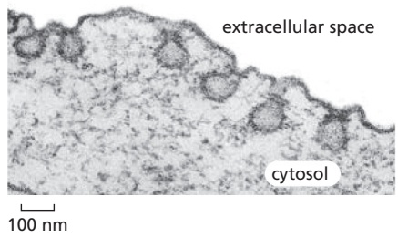
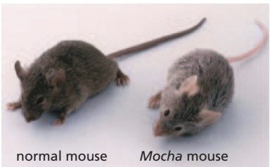

active alkaline phosphatase, but when extracts of the strains are mixed, vesicle fusion generates active alkaline phosphatase, which can be easily measured.

Now you delete the genes for the vacuolar v-SNARE, t-SNARE, or both, in each of the two yeast strains. You prepare vacuolar vesicles from each and test them for their ability to fuse, as measured by the alkaline phosphatase assay (**Figure Q13–2B**).

What do these data say about the requirements for v-SNAREs and t-SNAREs in the fusion of vacuolar vesicles? Does it matter which kind of SNARE is on which vesicle?

13–9 Enveloped viruses, which have a membrane coat, gain access to the cytosol by fusing with a cell membrane. Why do you suppose that these viruses carry their own special fusion protein, rather than making use of a cell’s SNAREs?

13–10 If you were to remove the ER retrieval signal from protein disulfide isomerase (PDI), which is normally a soluble resident of the ER lumen, where would you expect the modified PDI to be located?

13–11 The KDEL receptor must shuttle back and forth between the ER and the Golgi apparatus to accomplish its task of ensuring that soluble ER proteins are retained in the ER lumen. In which compartment does the KDEL receptor bind its ligands more tightly? In which compartment does it bind its ligands more weakly? What is thought to be the basis for its different binding affinities in the two compartments? If you were designing the system, in which compartment would you have the highest concentration of KDEL receptor? Would you predict that the KDEL receptor, which is a transmembrane protein, would itself possess an ER retrieval signal?

13–12 Drosophila shibire mutants, which carry a temperature-sensitive mutation in the dynamin gene, are rapidly paralyzed when the temperature is elevated. They recover quickly once the temperature is lowered. The complete paralysis at the elevated temperature suggests that synaptic transmission between nerve and muscle cells is blocked. Electron micrographs of nerve terminals from the paralyzed flies showed a loss of synaptic vesicles and a tremendously increased number of coated pits relative to normal synapses (**Figure Q13–3**). What step in synaptic transmission is defective in shibire mutants at high temperature?

Figure Q13–3 Electron micrograph of a nerve terminal from a shibire mutant fly at elevated temperature (Problem 13–12). (From J.H. Koenig and K. Ikeda, J. Neurosci. 9:3844–3860, 1989. With permission from the Society of Neuroscience.)

13–13 A macrophage ingests the equivalent of 100% of its plasma membrane each half hour by endocytosis. What is the rate at which membrane is returned by exocytosis?

13–14 The recycling of transferrin receptors has been studied by covalently attaching radioactive iodine $\mathrm { ( ^ { 1 2 5 } I ) }$ to the receptors on the cell surface at $0 ^ { \circ } \mathrm { C }$ and then following their fate at $0 ^ { \circ } \mathrm { C }$ and $3 7 ^ { \circ } \mathrm { C } ,$ If the labeled cells were kept at $\mathrm { { \bf \bar { 0 } } ^ { \circ } C }$ and treated with trypsin to digest the receptors on the cell surface, all the labeled transferrin receptors were completely degraded. If the cells were first warmed to $3 7 ^ { \circ } \mathrm { C }$ for 1 hour, then cooled back to $0 ^ { \circ } \mathrm { C }$ and treated with trypsin, about 70% of the labeled receptors were resistant to trypsin. Why did the transferrin receptors respond differently to trypsin digestion depending on whether they were kept at $\mathrm { \widetilde { 0 ^ { \circ } C } }$ or first warmed to $3 7 ^ { \circ } \tilde { \mathrm { C } }$ before they were returned to 0°C?

13–15 How does the low pH of lysosomes protect the rest of the cell from lysosomal enzymes in case the lysosome breaks?

13–16 Melanosomes are specialized lysosomes that store pigments for eventual release by exocytosis. Various cells such as skin and hair cells then take up the pigment, which accounts for their characteristic pigmentation. Mouse mutants that have defective melanosomes often have pale or unusual coat colors. One such light-colored mouse, the Mocha mouse (**Figure Q13–4**), has a defect in the gene for one of the subunits of the adaptor protein complex AP3, which is associated with coated vesicles budding from the trans Golgi network. How might the loss of AP3 cause a defect in melanosomes?

Figure Q13–4 A normal mouse and the Mocha mouse (Problem 13–16). In addition to its light coat color, the Mocha mouse has a poor sense of balance. (Courtesy of Margit Burmeister.)

## REFERENCES

## General

Harrison SC & Kirchhausen T (2010) Structural biology: conservation in vesicle coats. Nature 466, 1048–1049.

Hernandez-Gonzalez M, Larocque G & Way M (2021) Viral use and subversion of membrane organization and trafficking. J. Cell Sci. 134(5), jcs252676.

Pfeffer SR (2013) A prize for membrane magic. Cell 155, 1203–1206.

Thor F, Gautschi M, Geiger R & Helenius A (2009) Bulk flow revisited: transport of a soluble protein in the secretory pathway. Traffic 10, 1819–1830.

## Mechanisms of Membrane Transport and Compartment Identity

Antonny B (2011) Mechanisms of membrane curvature sensing. Annu. Rev. Biochem. 80, 101–123.

Burd C & Cullen PJ (2014) Retromer: a master conductor of endosome sorting. Cold Spring Harb. Perspect. Biol. 6(2), a016774.

Faini M, Beck R, Weiland FT & Briggs JAG (2013) Vesicle coats: structure, function, and general principles of assembly. Trends Cell Biol. 23(6), 279-288.

Ferguson SM & De Camilli P (2012) Dynamin, a membrane-remodelling GTPase. Nat. Rev. Mol. Cell Biol. 13, 75–88.

Frost A, Unger VM & De Camilli P (2009) The BAR domain superfamily: membrane-molding macromolecules. Cell 137, 191–196.

Grosshans BL, Ortiz D & Novick P (2006) Rabs and their effectors: achieving specificity in membrane traffic. Proc. Natl. Acad. Sci. USA 103, 11821–11827.

Jackson LP, Kelly BT, McCoy AJ . . . Owen DJ (2010) A large-scale conformational change couples membrane recruitment to cargo binding in the AP2 clathrin adaptor complex. Cell 141, 1220–1229.

Jahn R & Scheller RH (2006) SNAREs—engines for membrane fusion. Nat. Rev. Mol. Cell Biol. 7, 631–643.

Jean S & Kiger AA (2012) Coordination between RAB GTPase and phosphoinositide regulation and functions. Nat. Rev. Mol. Cell Biol. 13, 463–470.

Jin L, Pahuja KB, Wickliffe KE . . . Rape M (2012) Ubiquitin-dependent regulation of COPII coat size and function. Nature 482, 495–500.

Martens S & McMahon HT (2008) Mechanisms of membrane fusion: disparate players and common principles. Nat. Rev. Mol. Cell Biol. 9, 543–556.

McNew JA, Parlati F, Fukuda R . . . Rothman JE (2000) Compartmental specificity of cellular membrane fusion encoded in SNARE proteins. Nature 407, 153–159.

Miller EA & Schekman R (2013) COPII—a flexible vesicle formation system. Curr. Opin. Cell Biol. 25, 420–427.

Müller MP & Goody RS (2018) Molecular control of Rab activity by GEFs, GAPs and GDI. Small GTPases 9(1–2), 5–21.

Pfeffer SR (2013) Rab GTPase regulation of membrane identity. Curr. Opin. Cell Biol. 25, 414–419.

Saito K, Chen M, Bard F . . . Malhotra V (2009) TANGO1 facilitates cargo loading at endoplasmic reticulum exit sites. Cell 136, 891–902.

## Transport from the Endoplasmic Reticulum Through the Golgi Apparatus

Ellgaard L & Helenius A (2003) Quality control in the endoplasmic reticulum. Nat. Rev. Mol. Cell Biol. 4, 181–191.

Emr S, Glick BS, Linstedt AD . . . Wieland FT (2009) Journeys through the Golgi—taking stock in a new era. J. Cell Biol. 187, 449–453.

Farquhar MG & Palade GE (1998) The Golgi apparatus: 100 years of progress and controversy. Trends Cell Biol. 8, 2–10.

Gillingham AK & Munro S (2016) Finding the Golgi: golgin coiled-coil proteins show the way. Trends Cell Biol. 26(6), 399–408.

Ladinsky MS, Mastronarde DN, McIntosh JR . . . Staehelin LA (1999) Golgi structure in three dimensions: functional insights from the normal rat kidney cell. J. Cell Biol. 144, 1135–1149.

Pfeffer S (2010) How the Golgi works: a cisternal progenitor model. Proc. Natl. Acad. Sci. USA 107, 19614–19618.

Varki A (2011) Evolutionary forces shaping the Golgi glycosylation machinery: why cell surface glycans are universal to living cells. Cold Spring Harb. Perspect. Biol. 3, a005462.

## Transport From the Trans Golgi Network to the Cell Exterior and Endosomes

Burgess TL & Kelly RB (1987) Constitutive and regulated secretion of proteins. Annu. Rev. Cell Biol. 3, 243–293.

Martin TF (1997) Stages of regulated exocytosis. Trends Cell Biol. 7, 271–276.

Mellman I & Nelson WJ (2008) Coordinated protein sorting, targeting and distribution in polarized cells. Nat. Rev. Mol. Cell Biol. 9, 833–845.

Mostov K, Su T & ter Beest M (2003) Polarized epithelial membrane traffic: conservation and plasticity. Nat. Cell Biol. 5, 287–293.

Pang ZP & Südhof TC (2010) Cell biology of Ca2+-triggered exocytosis. Curr. Opin. Cell Biol. 22, 496–505.

Rizo J & Xu J (2015) The synaptic vesicle release machinery. Annu. Rev. Biophys. 44, 339–367.

Schuck S & Simons K (2004) Polarized sorting in epithelial cells: raft clustering and the biogenesis of the apical membrane. J. Cell Sci. 117, 5955–5964.

## Transport Into the Cell from the Plasma Membrane: Endocytosis

Bonifacino JS & Traub LM (2003) Signals for sorting of transmembrane proteins to endosomes and lysosomes. Annu. Rev. Biochem. 72, 395–447.

Brown MS & Goldstein JL (1986) A receptor-mediated pathway for cholesterol homeostasis. Science 232, 34–47.

Conner SD & Schmid SL (2003) Regulated portals of entry into the cell. Nature 422, 37–44.

Henne WM, Stenmark H & Emr SD (2013) Molecular mechanisms of the membrane sculpting ESCRT pathway. Cold Spring Harb. Perspect. Biol. 5(9), a016766.

Howes MT, Mayor S & Parton RG (2010) Molecules, mechanisms, and cellular roles of clathrin-independent endocytosis. Curr. Opin. Cell Biol. 22, 519–527.

Huotari J & Helenius A (2011) Endosome maturation. EMBO J. 30, 3481–3500.

Kelly BT & Owen DJ (2011) Endocytic sorting of transmembrane protein cargo. Curr. Opin. Cell Biol. 23, 404–412.

Maxfield FR & McGraw TE (2004) Endocytic recycling. Nat. Rev. Mol. Cell Biol. 5, 121–132.

McMahon HT & Boucrot E (2011) Molecular mechanism and physiological functions of clathrin-mediated endocytosis. Nat. Rev. Mol. Cell Biol. 12, 517–533.

Schöneberg J, Lee I-H, Iwasa JH & Hurley JH (2017) Reverse-topology membrane scission by the ESCRT proteins. Nat. Rev. Mol. Cell Biol. 18(1), 5–17.

Sorkin A & von Zastrow M (2009) Endocytosis and signalling: intertwining molecular networks. Nat. Rev. Mol. Cell Biol. 10, 609–622.

## The Degradation and Recycling of Macromolecules in Lysosomes

Andrews NW (2000) Regulated secretion of conventional lysosomes. Trends Cell Biol. 10, 316–321.

Bloomfield A & Kay RR (2016) Uses and abuses of micropinocytosis. J. Cell Sci. 129(14), 2697–2705.

de Duve C (2005) The lysosome turns fifty. Nat. Cell Biol. 7, 847–849.

Flannagan RS, Jaumouillé V & Grinstein S (2012) The cell biology of phagocytosis Annu. Rev. Pathol. 7, 61–98.

Futerman AH & van Meer G (2004) The cell biology of lysosomal storage disorders. Nat. Rev. Mol. Cell Biol. 5, 554–565.

Levine B & Kroemer G (2019) Biological functions of autophagy genes: a disease perspective. Cell 176(1–2), 11–42.

Mizushima N, Yoshimori T & Ohsumi Y (2011) The role of Atg proteins in autophagosome formation. Annu. Rev. Cell Dev. Biol. 27, 107–132.