0.6 pH units (each ΔpH of 1 pH unit is equivalent to a membrane potential of about 60 mV). The electrochemical gradient drives not only ATP synthesis but also the energetically unfavorable transport of selected molecules across the inner mitochondrial membrane, including the import of nuclear-encoded proteins from the cytosol (discussed in Chapter 12).

## Summary

The mitochondrion performs most cellular oxidations and produces the bulk of an animal cell’s ATP. A mitochondrion has two separate membranes: the outer membrane and the inner membrane. The inner membrane surrounds the innermost space (the matrix) of the mitochondrion, and it forms the cristae that project into the matrix and contain the electron-transport chain (the respiratory chain). The mitochondrial matrix and the inner membrane crista are the major sites of mitochondrial metabolism.

The mitochondrial matrix contains a large variety of enzymes, including those that convert pyruvate and fatty acids to acetyl CoA and those that oxidize this acetyl CoA to CO2 through the citric acid cycle. These oxidation reactions produce large amounts of NADH, whose high-energy electrons are passed to the respiratory chain. The respiratory chain then uses the energy derived from transporting electrons from NADH to molecular oxygen to pump H+ out of the matrix. This produces a large electrochemical proton gradient across the inner mitochondrial membrane, which is composed of contributions from both a membrane potential and a pH difference. This electrochemical gradient exerts a force to drive H+ back into the matrix. This proton-motive force is harnessed both to produce ATP and to drive the selective transport of metabolites across the inner mitochondrial membrane.

## THE PROTON PUMPS OF THE ELECTRON-TRANSPORT CHAIN

Having considered in general terms how a mitochondrion uses electron transport to generate a proton-motive force, we now turn to the molecular mechanisms that underlie this membrane-based energy-conversion process. In describing the respiratory chain of mitochondria, we accomplish the larger purpose of explaining how an electron-transport process can pump protons across a membrane. As stated at the beginning of this chapter, mitochondria, chloroplasts, archaea, and bacteria use very similar chemiosmotic mechanisms. In fact, these mechanisms underlie the function of all living organisms—including anaerobes that derive all their energy from electron transfers between two inorganic molecules, as we shall see later.

We start with some of the basic principles on which all of these processes depend.

## The Redox Potential Is a Measure of Electron Affinities

In chemical reactions, any electrons removed from one molecule are always passed to another, so that whenever one molecule is oxidized, another is reduced. As with any other chemical reaction, the tendency of such **redox reactions** to proceed spontaneously depends on the free-energy change (ΔG) for the electron transfer, which in turn depends on the relative affinities of the two molecules for electrons.

Because electron transfers provide most of the energy for life, it is worth taking the time to understand them. As discussed in Chapter 2, acids donate protons and bases accept them (see Panel 2–2, pp. 96–97). Acids and bases exist in conjugate acid–base pairs, in which the acid is readily converted into the base by the loss of a proton. For example, acetic acid $\left(  CH _{3} COOH  \right)$ is converted into its conjugate base, the acetate ion (CH3COO–), in the reaction:

$$
\mathrm{CH} _ {3} \mathrm{COOH} \rightleftharpoons \mathrm{CH} _ {3} \mathrm{COO} ^ {-} + \mathrm{H} ^ {+}
$$

In an exactly analogous way, pairs of compounds such as NADH and $\mathrm { N A D ^ { + } }$ are called redox pairs, as NADH is converted to $\mathrm { N A D ^ { + } }$ by the loss of electrons in the reaction:

$$
\mathrm{NADH} \rightleftharpoons \mathrm{NAD} ^ {+} + \mathrm{H} ^ {+} + 2 e ^ {-}
$$

NADH is a strong electron donor: because two of its electrons are engaged in a covalent bond, which releases energy when broken, the free-energy change for passing these electrons to many other molecules is favorable. Energy is required to form this bond from $\mathrm { N A D ^ { + } } ]$ , two electrons, and a proton (the same amount of energy that is released when the bond is broken). Therefore NAD+, the redox partner of NADH, is of necessity a weak electron acceptor.

We can measure the tendency to transfer electrons from any redox pair experimentally. All that is required is the formation of an electrical circuit linking a 1:1 (equimolar) mixture of the redox pair to a second redox pair that has been arbitrarily selected as a reference standard, so that we can measure the voltage difference between them (see Panel 14–1). This voltage difference is defined as the redox potential; electrons move spontaneously from a redox pair like NADH/ $\mathrm { N A D ^ { + } }$ with a lower redox potential (a lower affinity for electrons) to a redox pair like $\mathrm { O _ { 2 } / H _ { 2 } O }$ with a higher redox potential (a higher affinity for electrons). Thus, NADH is a good molecule for donating electrons to the respiratory chain, while $\mathrm { O } _ { 2 }$ is well suited to act as the “sink” for electrons at the end of the chain. As explained in Panel 14–1, the difference in redox potential, $\Delta E ^ { \prime } { } _ { 0 } ,$ is a direct measure of the standard free-energy change (ΔG°) for the transfer of an electron from one molecule to another.

While the standard redox potential is a useful tool to understand redox reactions, the true redox potential is also influenced by environmental factors in a cell such as pH, temperature, and electrostatic influences, which are often different from standardized conditions in cells. This issue is of particular relevance when the redox pair is embedded within a protein, where the environment is heavily influenced by nearby amino acid residues.

## Electron Transfers Release Large Amounts of Energy

As just discussed, those pairs of compounds that have the most negative redox potentials have the weakest affinity for electrons and therefore are useful as carriers with a strong tendency to donate electrons. Conversely, those pairs that have the most positive redox potentials have the greatest affinity for electrons and therefore are useful as carriers for accepting electrons. A 1:1 mixture of NADH and $\mathrm { N A D ^ { + } }$ has a redox potential of –320 mV, indicating that NADH has a strong tendency to donate electrons; a 1:1 mixture of $\mathrm { H _ { 2 } O }$ and $\frac { 1 } { 2 } \mathrm { O } _ { 2 }$ has a redox potential of +820 mV, indicating that $\mathrm { O } _ { 2 }$ has a strong tendency to accept electrons. The difference in redox potential is 1140 mV, which means that the transfer of each electron from NADH to $\mathrm { O } _ { 2 }$ under these standard conditions is enormously favorable, with $\Delta G ^ { \circ } = - 1 0 9$ kJ/mole. Twice this amount of energy is gained for the two electrons transferred per NADH molecule (see Panel 14–1). If we compare this free-energy change with that for the formation of the phosphoanhydride bonds in ATP, where $\Delta G ^ { \circ } = 3 0 . 6$ kJ/mole (see Figure 2–49), we see that, under standard conditions, the oxidation of one NADH molecule releases more than enough energy to synthesize seven molecules of ATP from ADP and phosphate. (In the cell, the number of ATP molecules generated will be lower because the standard conditions are far from the physiological ones; in addition, energy is inevitably dissipated as heat due to imperfect efficiency in energy transfers.)

## Transition Metal Ions and Quinones Accept and Release Electrons Readily

The electron-transport properties of the membrane protein complexes in the respiratory chain depend on electron-carrying cofactors, most of which utilize transition metals such as Fe, Cu, Ni, and Mn bound to proteins in the complexes.

## HOW REDOX POTENTIALS ARE MEASURED

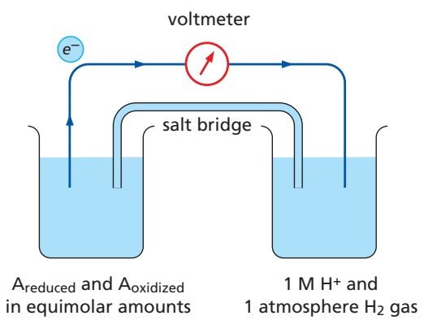

## THE STANDARD REDOX POTENTIAL, $E _ { 0 } ^ { \prime }$

The standard redox potential for a redox pair, defined as $E _ { 0 }   ,$ is measured for a standard state where all of the reactants are at a concentration of 1 M, including H+. Since biological reactions occur at pH 7, biologists instead define the standard state as Areduced = Aoxidized and $\mathsf { H } ^ { + } = 1 0 ^ { - 7 }$ M. This standard redox potential is designated by the symbol $E _ { 0 } ^ { \prime } ,$ in place of $E _ { 0 } .$

One beaker (left) contains substance A with an equimolar mixture of the reduced $( \mathsf { A _ { r e d u c e d } } )$ and oxidized (Aoxidized) members of its redox pair. The other beaker contains the hydrogen reference standard $( 2 \mathsf{H}^{+} + 2 \mathsf{e}^{-} \rightleftharpoons \mathsf{H}_{2} )$ , whose redox potential is arbitrarily assigned as zero by international agreement. (A salt bridge formed from a concentrated KCl solution allows K+ and Cl– to move between the beakers, as required to neutralize the charges when electrons flow between the beakers.) The metal wire (dark blue) provides a resistance-free path for electrons, and a voltmeter then measures the redox potential of substance A. If electrons flow from $\mathsf { A _ { r e d u c e d } }$ to H+, as indicated here, the redox pair formed by substance A is said to have a negative redox potential. If they instead flow from H2 to Aoxidized, the redox pair is said to have a positive redox potential.

| examples of redox reactions | stapnodteanrdtia reld Eo'0x |
| --- | --- |
| c c |  |

## CALCULATION OF $\Delta \mathcal { G } ^ { \circ }$ FROM REDOX POTENTIALS

To determine the energy change for an electron transfer, the $\Delta \boldsymbol { G } ^ { \circ }$ of the reaction (kJ/mole) is calculated as follows:

$\Delta G ^ { \circ } = - n ( 0 . 0 9 6 ) \Delta E _ { 0 } ^ { \prime } ,$ where n is the number of electrons transferred across a redox potential change of $\Delta E _ { 0 } ^ { \prime }$ millivolts (mV), and $\Delta \bar { E } _ { 0 } ^ { \prime } = \bar { E } _ { 0 } ^ { \prime }$ (acceptor) $- E _ { 0 } ^ { \prime }$ (donor)

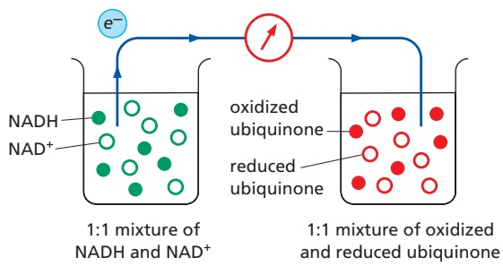

For the transfer of one electron from NADH to ubiquinone:

$$
\Delta E _ {0} ^ {\prime} = + 3 0 - (- 3 2 0) = + 3 5 0 \mathrm{mV}
$$

$$
\Delta G ^ {\circ} = - n (0. 0 9 6) \Delta E _ {0} ^ {\prime} = - 1 (0. 0 9 6) (3 5 0) = - 3 4 \mathrm{kJ/mole}
$$

The same calculation reveals that the transfer of one electron from ubiquinone to oxygen has an even more favorable $\Delta G ^ { \circ } \circ f - 7 6$ kJ/mole. The $\Delta G ^ { \circ }$ value for the transfer of one electron from NADH to oxygen is the sum of these two values, –110 kJ/mole.

## EFFECT OF CONCENTRATION CHANGES

As explained in Chapter 2, the actual free-energy change for a reaction, ΔG, depends on the concentration of the reactants and generally will be different from the standard free-energy change, $\Delta \pmb { G } ^ { \circ }$ . The standard redox potentials are for a 1:1 mixture of the redox pair. For example, the standard redox potential of –320 mV is for a 1:1 mixture of NADH and NAD+. But when there is an excess of NADH over NAD+, electron transfer from NADH to an electron acceptor becomes more favorable. This is reflected by a more negative redox potential and a more negative ΔG for electron transfer.

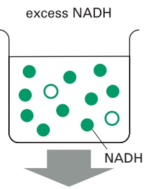

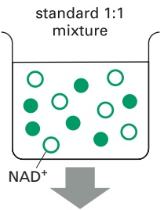

stronger electron donation (more negative E')

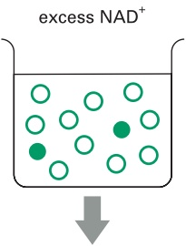

standard redox potential of -320 mV

weaker electron donation (more positive E')

Figure 14–15 The structure of the heme group attached covalently to cytochrome c. The porphyrin ring of the heme is shown in light red. There are six different cytochromes in the respiratory chain. Because the hemes in different cytochromes have slightly different structures and are kept in different local environments by their respective proteins, each has a different affinity for an electron and a slightly different spectroscopic signature. Note that many heme-containing proteins, including others in the electron-transport chain, bind to heme noncovalently unlike the heme in cytochrome c shown here. They do so through noncovalent interactions of the protein with the porphyrin ring and the heme iron.

These metals have special properties that allow them to promote both enzyme catalysis and electron-transfer reactions. Most relevant here is the fact that their ions exist in several different oxidation states with closely spaced redox potentials, which enables them to accept or give up electrons readily; this property is exploited by the membrane protein complexes in the respiratory chain to move electrons both within and between complexes.

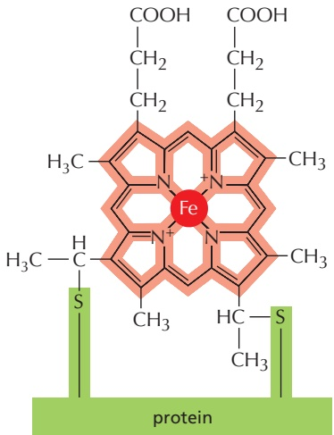

Unlike the colorless atoms H, C, N, and O that constitute the bulk of biological molecules, transition metal ions are often brightly colored, which makes the proteins that contain them easy to study by spectroscopic methods using visible light. One family of such colored proteins, the **cytochromes**, contains a bound heme group, in which an iron atom is tightly held by four nitrogen atoms at the corners of a square in a porphyrin ring (**Figure 14–15**). Similar porphyrin rings are responsible both for the red color of blood and for the green color of leaves, binding an iron in hemoglobin or a magnesium in chlorophyll, respectively.

Iron–sulfur proteins contain a second major family of electron-transfer cofactors. In this case, either two or four iron atoms are bound to an equal number of sulfur atoms and to cysteine side chains, forming iron–sulfur clusters in the protein (**Figure 14–16**). Like the cytochrome hemes, these clusters carry one electron at a time through redox reactions with the iron atoms.

The simplest of the electron-transfer cofactors in the respiratory chain—and the only one that is not always bound to a protein—is a **quinone** (called ubiquinone, or coenzyme Q). A quinone (Q) is a small hydrophobic molecule that is freely mobile in the lipid bilayer. This electron carrier can accept or donate either one or two electrons. Upon reduction (note that reduced quinones are called quinols), it picks up a proton from water along with each electron (**Figure 14–17**).

In the mitochondrial electron-transport chain, six different cytochrome hemes, eight iron–sulfur clusters, three copper atoms, a flavin mononucleotide (another electron-transfer cofactor), and ubiquinone work in a defined sequence to carry electrons from NADH to O2. In total, this pathway involves more than 60 different polypeptides; these are arranged in three large membrane protein complexes, each of which binds several of the above electron-carrying cofactors (**Figure 14–18**).

As we will discuss later, there is an unusual additional respiratory chain complex that is an important component of the citric acid cycle, where it is known as succinate dehydrogenase. This membrane-embedded enzyme captures electrons during the conversion of succinate to fumarate (see Panel 2–9, pp. 110–111). It passes these electrons directly into the electron-transport chain via a flavin electron carrier (flavin adenine dinucleotide; FAD), instead of utilizing NAD+, and it does not pump protons (see Figure 14–18).

As we would expect, the electron-transfer cofactors have increasing affinities for electrons (higher redox potentials) as the electrons move along the respiratory chain. The redox potentials have been fine-tuned during evolution by the protein environment of each cofactor, which alters the cofactor’s normal affinity for electrons. Because iron–sulfur clusters have a relatively low affinity for electrons,

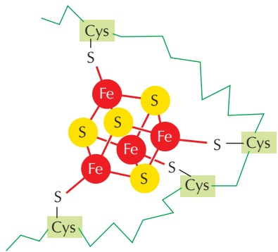

<small>Figure 14–16 The structure of an iron–sulfur cluster. Iron–sulfur clusters consist either of four iron and four sulfur atoms, as shown here, or of two irons and two sulfurs linked to cysteines in the polypeptide chain via covalent sulfur bridges; alternatively they may be linked to histidines. Although they contain several iron atoms, each iron–sulfur cluster can carry only one electron at a time. Nine different iron–sulfur clusters participate in electron transport in the respiratory chain.</small>

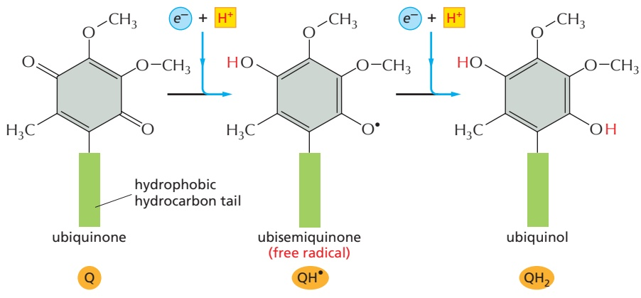

they predominate in the first half of the respiratory chain; in contrast, the heme cytochromes predominate further down the chain, where a higher electron affinity is required.

Figure 14–17 Quinone electron carriers. Ubiquinone in the lipid bilayer picks up one H+ (red) from the aqueous environment for each electron (blue) it accepts from respiratory-chain complexes. The first step in this process involves the acquisition of a proton and an electron and converts the ubiquinone into an unstable ubisemiquinone radical. With the transfer of the second electron, it becomes a fully reduced ubiquinone (called ubiquinol), which is freely mobile as an electron carrier in the lipid bilayer of the membrane. When the ubiquinol donates its electrons to the next complex in the chain, the two protons are released. The long hydrophobic tail (green) that confines ubiquinone to the membrane consists of 6 to 10 five-carbon isoprene units, depending on the organism. The corresponding electron carrier in the photosynthetic membranes of chloroplasts is plastoquinone, which has almost the same structure and works in the same way. For simplicity, we refer to both ubiquinone and plastoquinone in this chapter as quinone (abbreviated as Q).

## NADH Transfers Its Electrons to Oxygen Through Three Large Enzyme Complexes Embedded in the Inner Membrane

Membrane proteins are difficult to purify because they are insoluble in aqueous solutions, and they are easily disrupted by the detergents that are required to solubilize them. But by using mild nonionic detergents, such as digitonin or dodecyl maltoside, they can be solubilized and purified in their native form. The three large, detergent-solubilized respiratory complexes can be reinserted into artificial lipid bilayer vesicles, and each protein complex can be shown to pump protons across the membrane as electrons pass through it.

In the mitochondrion, the three complexes are linked in series, serving as electron transport–driven H+ pumps that pump protons out of the matrix to acidify the crista space (see Figure 14–18):

1. The **NADH dehydrogenase complex** (typically called Complex I) is the largest of these respiratory enzyme complexes. It accepts electrons from NADH and passes them through a flavin mononucleotide and eight iron– sulfur clusters to ubiquinone. The reduced ubiquinol then transfers its electrons to cytochrome c reductase.

2. The **cytochrome c reductase** (also called the cytochrome b-c1 complex and typically called Complex III) is a large membrane protein assembly that functions as a dimer. Each monomer contains three cytochrome hemes and an iron–sulfur cluster. The complex accepts electrons from ubiquinol

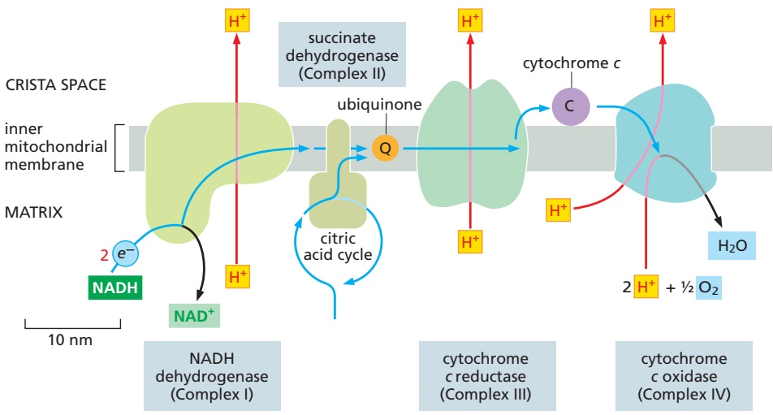

Figure 14–18 The path of electrons through the three respiratory-chain proton pumps (Movie 14.5). The approximate size and shape of each protein complex are shown. During the transfer of electrons from NADH to oxygen (blue arrows), ubiquinone and cytochrome c serve as mobile carriers that ferry electrons from one complex to the next. During the electron-transfer reactions, protons are pumped across the membrane by each of the respiratory enzyme complexes, as indicated (red arrows).

The three proton pumps in the respiratory chain are typically denoted as Complex I, Complex III, and Complex IV, according to the order in which electrons pass through them from NADH. Electrons from the oxidation of succinate by succinate dehydrogenase (designated as Complex II) are fed into the electron-transport chain in the form of reduced ubiquinone. Although embedded in the crista membrane, succinate dehydrogenase does not pump protons and thus does not contribute to the protonmotive force.

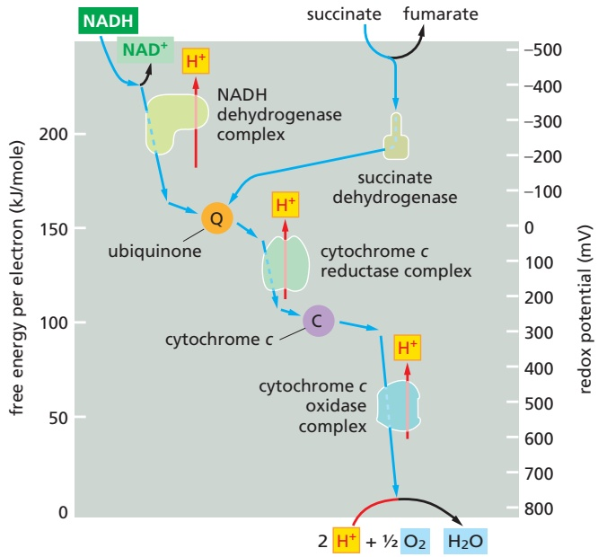

and passes them on to the small, soluble protein cytochrome $c _ { r }$ which is located in the crista space and carries electrons one at a time to cytochrome c oxidase.

3. The **cytochrome c oxidase complex** (typically called Complex IV) contains two cytochrome hemes and three copper atoms. The complex acceptsMBoC7 m14.19/14.19 electrons one at a time from cytochrome c and passes them to molecular oxygen. In total, four electrons and four protons are needed to convert one molecule of oxygen to water.

We have previously discussed how the redox potential reflects electron affinities. **Figure 14–19** presents an outline of the redox potentials measured along the respiratory chain. These potentials change in three large steps, one across each proton-translocating respiratory complex. The change in redox potential between any two electron carriers is directly proportional to the free energy released when an electron transfers between them. Each complex acts as an energy-conversion device by harnessing some of this free-energy change to pump $\hat { \mathrm { H } } ^ { + }$ across the inner membrane, thereby creating an electrochemical proton gradient as electrons pass along the chain. In addition to these proton-pumping complexes, the succinate dehydrogenase complex, which catalyzes the oxidation of succinate to fumarate in the citric acid cycle, is often also considered to be a component of the electron-transport chain. It is typically called Complex II because, like Complex I, it passes electrons to ubiquinone.

The assembly of each of these four protein complexes requires a precisely managed program because of their number of subunits and reactive cofactors. This is accomplished through the function of dedicated assembly factors that chaperone particular steps in the assembly and activation process. Loss of these assembly factors through mutation leads to human diseases; their loss mimics mutations that directly affect the complex subunits themselves.

X-ray crystallography (and, more recently, cryo-electron microscopy, or cryoEM) has elucidated the final structures of each of the respiratory-chain complexes in great detail, and we next examine each of them in turn to see how they work.

## The NADH Dehydrogenase Complex Contains Separate Modules for Electron Transport and Proton Pumping

The NADH dehydrogenase complex is a massive assembly of proteins, some integral to the membrane and others not, that receives electrons from NADH and passes them to ubiquinone. In animal mitochondria, it consists of more than

Figure 14–19 Redox potential changes along the mitochondrial electrontransport chain. The redox potential (designated $\Delta E ^ { \prime } { } _ { 0 } )$ increases as electrons flow down the respiratory chain to oxygen. The standard free-energy change in kilojoules, $\Delta { G ^ { \circ } } _ { i }$ for the transfer of each of the two electrons donated by an NADH molecule can be obtained from the left-hand ordinate $\scriptstyle { \left[ \Delta { \boldsymbol { G } } ^ { \circ } = - { \boldsymbol { n } } \left( 0 . 0 9 6 \right) \right. }$ $\Delta E ^ { \prime } { } _ { 0 } ,$ where n is the number of electrons transferred across a redox potential change of $\Delta E _ { \mathrm { ~ 0 ~ } } ^ { \prime }$ mV]. Electrons flow through a respiratory enzyme complex by passing in sequence through the multiple electron carriers in each complex (dotted portion of blue arrows). As indicated, part of the favorable free-energy change is harnessed by each enzyme complex to pump H+ across the inner mitochondrial membrane (red arrows). The NADH dehydrogenase pumps up to four H+ per electron, the cytochrome c reductase complex pumps two per electron, whereas the cytochrome c oxidase complex pumps one per electron.

Succinate dehydrogenase (Complex II) also passes electrons into the ubiquinone pool by oxidizing succinate and passing those electrons through a stably bound FAD+/FADH2 redox pair. Fatty acid oxidation (see Figure 2–57) also leads to the generation of FADH2, which also passes its two electrons directly to ubiquinone, bypassing NADH dehydrogenase. No proton pumping accompanies these electron transfers.

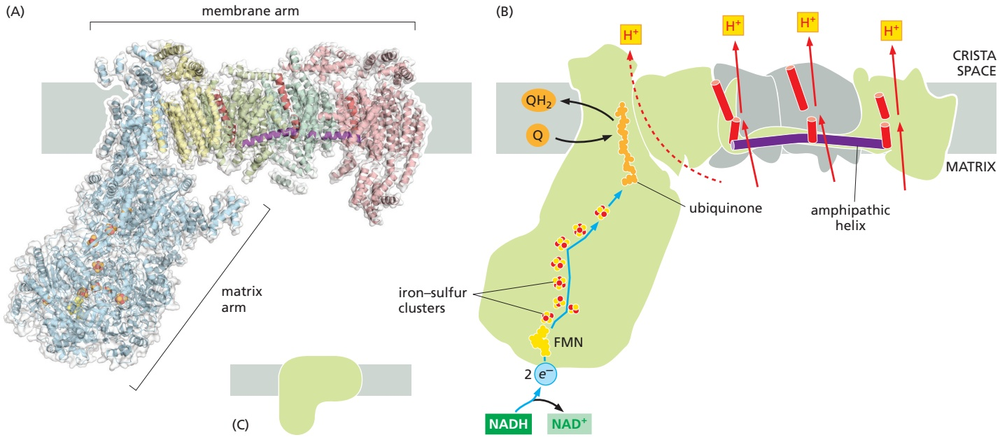

40 different protein subunits, with a molecular mass of nearly a million daltons. The x-ray crystallography and cryoEM structures of the NADH dehydrogenase complex show that it is L-shaped, with both a hydrophobic membrane arm and a hydrophilic arm that projects into the mitochondrial matrix (**Figure 14–20**).

Electron transfer and proton pumping are physically separated in the NADH dehydrogenase complex, with electron transfer occurring in the matrix arm and proton pumping in the membrane arm. The NADH docks near the tip of the matrix arm, where it transfers its electrons via a bound flavin mononucleotide to a string of iron–sulfur clusters that runs down the arm, acting like a wire to carry electronsMBoC7 m14.20/14.20 to a protein-bound molecule of ubiquinone. Electron transfer to the quinone is thought to trigger proton translocation in a set of proton pumps in the membrane arm, and for this to happen the two processes must be energetically and mechanically linked. One hypothesized mechanism is for this link to be provided by a 6-nm-long, amphipathic α helix that runs parallel to the membrane surface on the matrix side of the membrane arm. This helix may act like the connecting rod in a steam engine to generate a mechanical, energy-transducing power stroke that links the quinone-binding site to the proton-translocating modules in the membrane (see Figure 14–20).

The reduction of each quinone by the transfer of its two electrons, followed by its release from the complex into the membrane, can cause four protons to be pumped out of the matrix into the crista space. In this way, NADH dehydrogenase generates roughly half of the total proton-motive force in mitochondria.

## Cytochrome c Reductase Takes Up and Releases Protons on Opposite Sides of the Crista Membrane, Thereby Pumping Protons

As described previously, when a quinone molecule (Q) accepts its two electrons, it also takes up two protons to form a quinol (QH2; see Figure 14–17). In the respiratory chain, ubiquinol transfers electrons to cytochrome c reductase, after picking them up from either NADH dehydrogenase or succinate dehydrogenase. Because the protons in this QH2 molecule are obtained from the matrix and released on the opposite side of the crista membrane, two protons are transferred from the matrix into the crista space per pair of electrons transferred (**Figure 14–21**). This simple vectorial transfer of protons supplements the electrochemical proton gradient that is created by the NADH dehydrogenase proton pumping just discussed.

Figure 14–20 The structure of NADH dehydrogenase (also known as Complex I). (A) The structure of Complex I is shown. The matrix arm of NADH dehydrogenase contains one flavin mononucleotide (FMN) and eight iron–sulfur (FeS) clusters that appear to participate in electron transport. The membrane contains more than 70 transmembrane helices, forming three distinct protonpumping modules. (B) Schematic of NADH dehydrogenase electron transport–coupled proton pumping. NADH donates two electrons, via a bound FMN (yellow), to a chain of seven iron–sulfur clusters (red and yellow spheres). From the terminal iron–sulfur cluster, the electrons pass to ubiquinone (orange). Electron transfer results in conformational changes that are thought to be transmitted to a long amphipathic α helix (purple) on the matrix side of the membrane arm, which pulls on discontinuous transmembrane helices (red) in three membrane subunits, each of which resembles an antiporter (see Chapter 11). This movement is thought to change the conformation of charged residues in the three proton channels, resulting in the translocation of three protons out of the matrix. A fourth proton may be translocated at the interface of the two arms (dotted line). (C) This shows the symbol for NADH dehydrogenase used throughout this chapter. (A, adapted from R.G. Efremov et al., Nature 465:441–445, 2010. PDB code: 3M9S.)

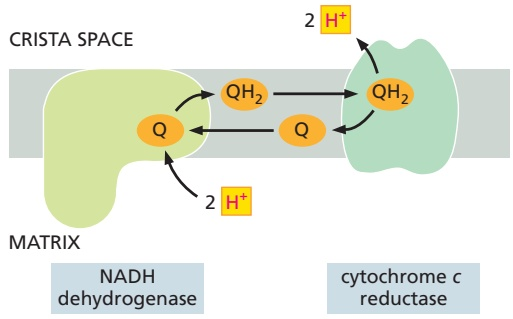

Figure 14–21 How a directional release and uptake of protons by a quinone pumps protons across a membrane. Two protons are picked up on the matrix side of the inner mitochondrial membrane when the reaction $\mathsf { Q } + 2 \mathsf { e } ^ { - } + 2 \mathsf { H } ^ { + } \to \mathsf { Q } \mathsf { H } _ { 2 }$ is catalyzed by the NADH dehydrogenase complex. This molecule of ubiquinol (QH2) then binds to the crista side of cytochrome c reductase. When its oxidation by cytochrome c reductase generates two protons and two electrons (see Figure 14–17), the two protons are released into the crista space. The flow of electrons is not shown in this diagram.

Cytochrome c reductase is a large assembly of membrane protein subunits. Three subunits form a catalytic core that passes electrons from ubiquinol to cytochrome $c _ { r }$ with a structure that has been highly conserved from bacterial ancestors (**Figure 14–22**). It pumps protons by a vectorial transfer that is more complex than the mechanism in Figure 14–21, thereby doubling the amountMBoC7 m14.21/14.21 of useful energy harvested. This involves a binding site for a second molecule of ubiquinone; the elaborate redox loop mechanism used is called the Q cycle because one of the electrons received from each $\mathrm { Q H _ { 2 } }$ molecule is transferred from

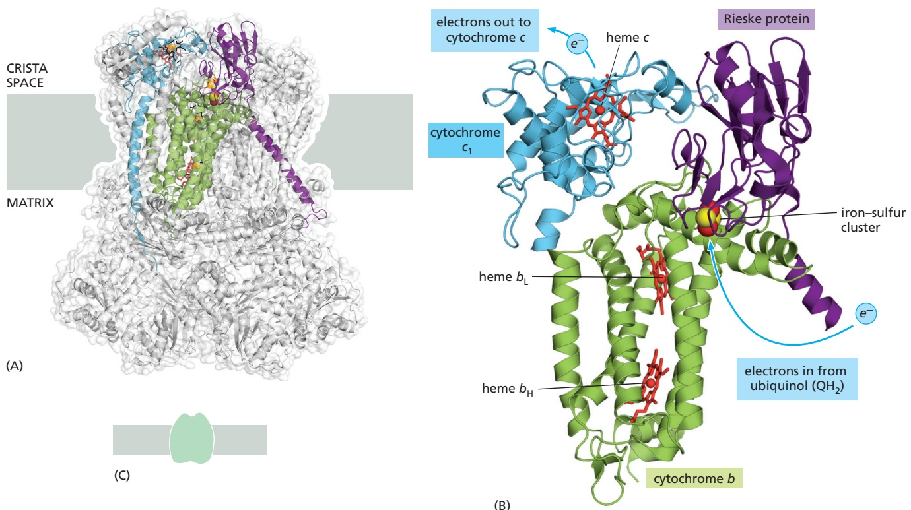

Figure 14–22 The structure of cytochrome c reductase. Cytochrome c reductase (also known as the cytochrome b-c1 complex) is a dimer of two identical 240,000-dalton halves, each composed of 11 different protein molecules in mammals. (A) A structural model of the entire dimer based on x-ray crystallography, showing in color the three proteins that form the functional core of the enzyme complex: cytochrome b (green) and cytochrome $C _ { 1 }$ (blue) are colored in one half, and the Rieske protein (purple) containing an Fe2S2 iron–sulfur cluster (red and yellow) is colored in the other. These three protein subunits interact across the two halves. (B) Transfer of electrons through cytochrome c reductase to the small, soluble carrier protein cytochrome c. Electrons entering from ubiquinol near the matrix side of the membrane are captured by the iron–sulfur cluster of the Rieske protein, which moves its iron–sulfur group back and forth to transfer these electrons to heme c (red). Heme c then transfers them to the carrier molecule cytochrome c.

MBoC7 m14.22/14.22As detailed in Figure 14–23, only one of the two electrons from each ubiquinol is transferred through this path. To increase proton pumping, the second ubiquinol electron is passed to a molecule of ubiquinone bound to cytochrome c reductase on the opposite side of the membrane—near the matrix. (C) This shows the symbol for cytochrome c reductase used throughout this chapter. (A and B, PDB code: 1EZV.)

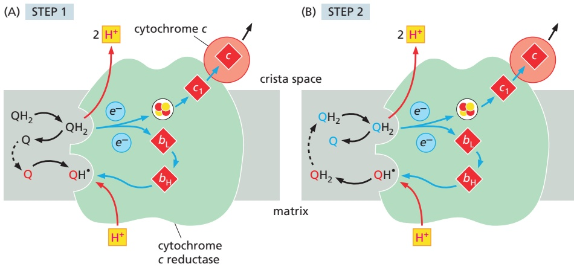

Figure 14–23 The two-step mechanism of the cytochrome c reductase Q cycle. A clear grasp of the processes illustrated here can be obtained from the step-by-step video provided in Movie 14.6. (A) In step 1, ubiquinol reduced by NADH dehydrogenase docks to the cytochrome c reductase complex. Oxidation of the quinol produces two protons and two electrons. The protons are released into the crista space. One electron passes via an iron–sulfur cluster to heme $C _ { 1 } ,$ and then to the soluble electron carrier protein cytochrome c on the membrane surface. The second electron passes via hemes bL and bH to a ubiquinone (red Q) bound at a separate site near the matrix side of the protein. Uptake of a proton from the matrix produces a ubisemiquinone radical (see Figure 14–17), which remains bound to this site (red QH•).

(B) In step 2, a second ubiquinol (blue $\mathsf { Q H } _ { 2 } )$ docks and releases two protons and two electrons, as described for step 1. One electron is passed to a second molecule of cytochrome c, whereas the other electron is accepted by the ubisemiquinone. The ubisemiquinone then takes up a proton from the matrix and is released into the lipid bilayer as fully reduced ubiquinol (red QH2), from whence it can subsequently rebind to the complex and donate electrons and protons as in step 1.

On balance, the oxidation of one ubiquinol in the Q cycle pumps two protons through the membrane by a directional release and uptake of protons (see Figure 14–18), while releasing another two into the crista space. In addition, in each of the two steps (A and B), one electron is transferred to a cytochrome c carrier protein.

ubiquinone through the complex to the carrier protein cytochrome c while the other electron is recycled back into the quinone pool. Through the mechanism illustrated in **Figure 14–23** and **Movie 14.6**, the **Q cycle** increases the total amount of redox energy that can be stored in the electrochemical proton gradient: for every electron that is transferred from NADH dehydrogenase to cytochrome c, two protons are pumped across the crista membrane into the crista space.

## The Cytochrome c Oxidase Complex Pumps Protons and Reduces $\mathrm { O } _ { 2 }$ Using a Catalytic Iron–Copper Center

The final link in the mitochondrial electron-transport chain is cytochrome c oxidase, or Complex IV. The cytochrome c oxidase complex accepts electrons from the soluble electron carrier cytochrome c, and it uses yet a different, third mechanism to pump protons across the inner mitochondrial membrane. The structure of the mammalian complex is illustrated in **Figure 14–24**.

Because oxygen has a high affinity for electrons, it can release a large amount of free energy when it is reduced to form water. Thus, the evolution of cellular respiration, in which $\mathrm { O } _ { 2 }$ is converted to water, enabled organisms to harness much more energy than can be derived from anaerobic metabolism. As we discuss later, the availability of the large amount of energy released by the reduction of molecular oxygen to form water is thought to have been essential to the emergence of multicellular life, thereby explaining why all large organisms respire. The ability of biological systems to use $\mathrm { O } _ { 2 }$ in this way, however, requires sophisticated chemistry. Once a molecule of $\mathrm { O } _ { 2 }$ has picked up one electron, it forms a superoxide radical anion $\mathrm { ( O _ { 2 } { ^ { \bullet - } } ) }$ that is dangerously reactive and rapidly takes up an additional three electrons wherever it can get them, with destructive effects on its immediate environment. We can tolerate oxygen in the air we breathe only because the uptake of the first electron by a free $\mathrm { O } _ { 2 }$ molecule is slow and inefficient, allowing cells to use enzymes to control electron uptake by oxygen. Thus, cytochrome c oxidase holds on to oxygen at a special bimetallic center, where it remains clamped between a heme-linked iron atom and a copper ion until it has picked up a total of four electrons. Only then are the two oxygen atoms of the oxygen molecule safely released as two molecules of water (**Figure 14–25**).

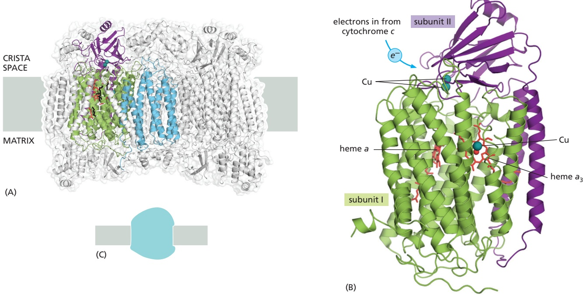

Figure 14–24 The structure of cytochrome c oxidase. The final complex in the human mitochondrial electron-transfer chain consists of ∼13 different protein subunits, depending on the cell type, with a total mass of approximately 204,000 daltons. (A) The entire dimeric complex is shown, positioned in the crista membrane. The highly conserved subunits I (green), II (purple), and III (blue) are encoded by the mitochondrial genome, and they form the functional core of the enzyme. (B) The functional core of the complex. Electrons pass through this structure from cytochrome c via bound copper ions (blue spheres) and hemes (red) to an O2 molecule bound between heme a3 and a copper ion. The four protons needed to reduce O2 to water are taken up from the matrix; see also Figure 14–25. (C) This shows the symbol for cytochrome c oxidase used throughout this chapter. (A and B, PDB code: 2OCC.)

The cytochrome c oxidase reaction accounts for about 90% of the total oxygen uptake in most cells. This protein complex is therefore crucial for all aerobic life. Oxygen limitation is life-threatening to obligate aerobic organisms because of an impaired activity of cytochrome c oxidase and these organisms respond rapidly to low oxygen levels to decrease their dependence on mitochondrial respiration. Cyanide is extremely toxic because it binds to the heme iron atoms in cytochrome c oxidase much more tightly than does oxygen, thereby greatly reducing mitochondrial ATP production.

## Succinate Dehydrogenase Acts in Both the Electron-Transport Chain and the Citric Acid Cycle

In addition to the three proton pumps just discussed, one of the enzymes in the citric acid cycle, succinate dehydrogenase (**Figure 14–26**), is embedded in the mitochondrial crista membrane. In the course of oxidizing succinate to fumarate in the matrix, this enzyme complex captures electrons in the form of a tightly bound $\mathrm { F A D H _ { 2 } }$ molecule (see Panel 2–9, pp. 110–111) and passes them through three iron–sulfur clusters to a molecule of ubiquinone. The reduced ubiquinol then enters the pool of ubiquinol generated by Complex I and passes its two electrons to cytochrome c reductase in the respiratory chain (see Figure 14–18). Succinate dehydrogenase is not a proton pump, and it does not contribute directly to the electrochemical potential utilized for ATP production in mitochondria. Its dual action in the citric acid cycle and in electron transport has implications for human disease that are different from those of the other three respiratory complexes. For example, mutations that cause a decreased activity of Complex II contribute to specific forms of cancer.

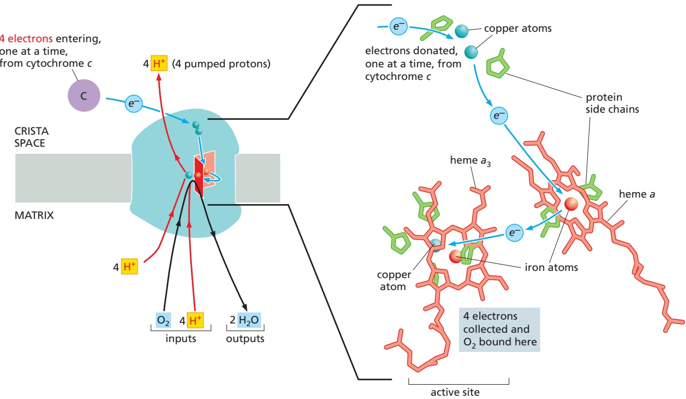

Figure 14–25 The reaction of $\mathsf { O } _ { 2 }$ with electrons in cytochrome c oxidase. Electrons from cytochrome c pass through the complex via bound copper ions (blue spheres) and hemes (red) to an O2 molecule bound between heme $a _ { 3 }$ and a copper ion. Iron ions are shown as red spheres. The iron atom in heme a serves as an electron queuing point where electrons are held so that they can be released to an O2 molecule (not shown) that is held at the bimetallic center active site, which is formed by the central iron of the other heme (heme a3) and a closely apposed copper atom. The four protons needed to reduce O2 to water are removed from the matrix. For each $\mathrm { O } _ { 2 }$ molecule that undergoes the reaction 4e– $\dot { + 4 } \mathsf { H } ^ { + } + \mathsf { O } _ { 2 } \rightarrow 2 \mathsf { H } _ { 2 } \mathsf { O } ,$ an additional four protons are pumped out of the matrix by mechanisms driven by allosteric changes in protein conformation (see Figure 14–29).

## The Respiratory Chain Forms a Supercomplex in the Crista Membrane

When the three large mitochondrial respiratory complexes that pump protons in the electron-transport chain are gently isolated, they are found in even larger supercomplexes. Such observations support the hypothesis that this massive structure in the crista membrane helps the mobile electron carriers ubiquinone (in the crista membrane) and cytochrome c (in the crista space) transfer electrons more efficiently than could be accomplished with dissociated, freely diffusing electron carriers (**Figure 14–27**). The supercomplex allows a cell to capture as much of the free energy of electron transfer from NADH to $\mathrm { O } _ { 2 }$ as possible and to avoid potentially damaging, redox side reactions. The formation of this structure depends on the presence of the mitochondrial lipid cardiolipin (see Figure 14–11) and on special proteins that are thought to hold the components together.

Figure 14–26 The structure of succinate dehydrogenase. (A) This membrane-embedded enzyme is composed of four subunits. One subunit, Sdh1, contains a covalently bound FAD cofactor (green) that receives an electron directly from succinate oxidation and passes it successively through the three iron–sulfur clusters (red and yellow) contained within Shd2 to ubiquinone. The membrane component of this complex, formed by the other two subunits, has a bound heme of unknown function (orange). (B) This shows the symbol for succinate dehydrogenase used throughout this chapter. $( \mathsf { A } ,$ PDB code: 1NEK.)

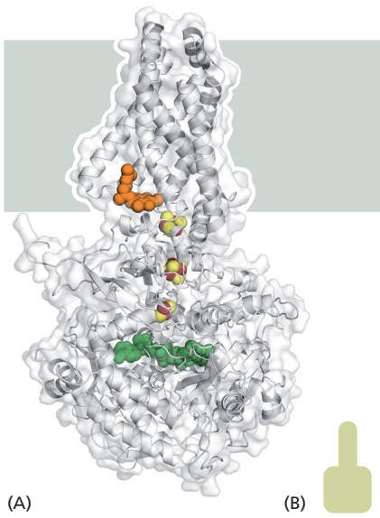

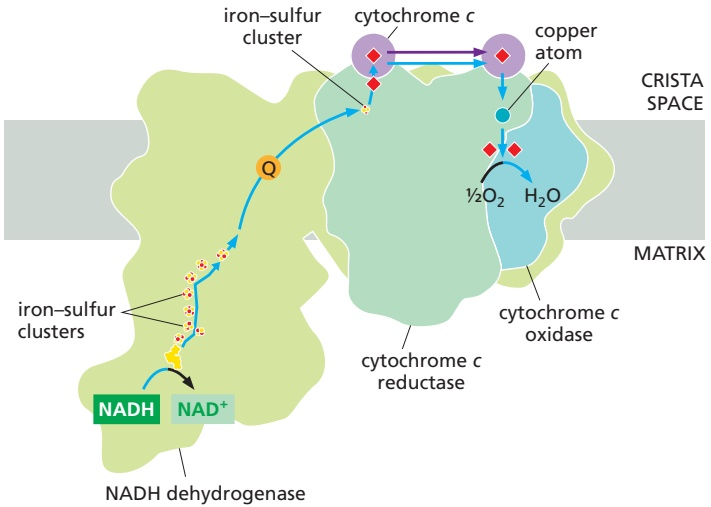

Figure 14–27 The respiratory-chain supercomplex from bovine heart mitochondria. The three proton-pumping complexes of the mitochondrial respiratory chain of mammalian mitochondria assemble into large supercomplexes in the crista membrane. Supercomplexes can be isolated by mild detergent treatment of mitochondria, and their structure has been deciphered by single-particle cryoelectron microscopy. The bovine heart supercomplex has a total mass of 1.7 megadaltons. Shown is a schematic of such a complex that consists of NADH dehydrogenase, cytochrome c reductase, and cytochrome c oxidase, as indicated. The facing quinol-binding sites of NADH dehydrogenase MB C7 14.26/14.27and cytochrome c reductase, plus the short distance between the cytochrome c–binding sites in cytochrome c reductase and cytochrome c oxidase, facilitate fast, efficient electron transfer. Cofactors active in electron transport are marked as a yellow icon (flavin mononucleotide), red and yellow spheres (iron–sulfur clusters), Q (quinone), red diamonds (hemes), and a blue sphere (copper atom). Only cofactors participating in the linear flow of electrons from NADH to water are shown. Blue arrows indicate the path of the electrons through the supercomplex. (Adapted from T. Athoff et al., EMBO J. 30:4652–4664, 2011.)

## Protons Can Move Rapidly Through Proteins Along Predefined Pathways

The protons in water are highly mobile: by rapidly dissociating from one water molecule and associating with its neighbor, they can rapidly flit through a hydrogen-bonded network of water molecules (see Figure 2–5). But how can a proton move through the hydrophobic interior of a protein embedded in the lipid bilayer? Proton-translocating proteins contain so-called proton wires, which are rows of polar or ionic side chains or water molecules spaced at short distances, so that the protons can jump from one to the next (**Figure 14–28**). Along such predefined pathways, protons move up to 40 times faster than through bulk water.

How does electron transport cause allosteric changes in protein conformations that pump protons? From the most basic point of view, if electron transport drives sequential allosteric changes in protein conformation that alter the redox state of the components, these conformational changes can be connected to protein wires that allow the protein to pump $\mathrm { H } ^ { + }$ across the crista membrane. This type of $\mathrm { H } ^ { + }$ pumping requires at least three distinct conformations for the pump protein, as schematically illustrated in **Figure 14–29**. Atomic-resolution structures, combined with the effects of specific amino acid changes introduced into the proteins by genetic engineering, are helping to reveal the detailed mechanisms of the proton pumping driven by electron transfer, but how these

<small>, H3O+</small>

<small>( )</small>

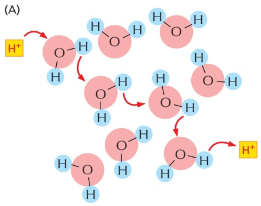

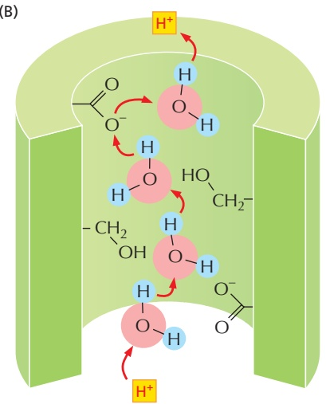

<small>Figure 14–28 Proton movement through water and proteins. A Protons move rapidly through water, hopping from one H2O molecule to the next by the continuous formation and dissociation of hydronium ions (see Chapter 2). In this diagram, proton jumps are indicated by red arrows. (B) Protons can move even more rapidly through a protein along proton wires. These are predefined proton paths consisting of suitably spaced amino acid side chains that accept and release protons easily (Asp, Glu) or carry a water-like hydroxyl group (Ser, Thr), along with water molecules trapped in the protein interior.</small>