ATP PRODUCTION IN MITOCHONDRIA

835

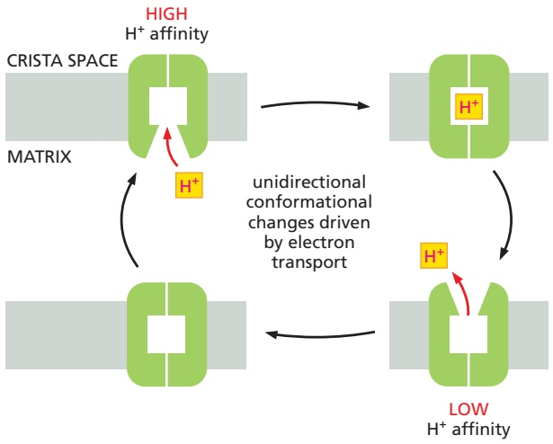

conformations are formed and regulated in the respiratory complexes remain incompletely understood.

Figure 14–29 A general model for H+ pumping coupled to electron transport. This type of mechanism for H+ pumping by a transmembrane protein is thought to be used by NADH dehydrogenase and cytochrome c oxidase, and by many other proton pumps. The protein is driven through a cycle of three conformations. In one of these conformations, the protein has a high affinity for H+, causing it to pick up an H+ on the inside of the membrane. In another conformation, the protein has a low affinity for H+, causing it to release an H+ on the outside of the membrane. As indicated, the transitions from one conformation to another occur only in one direction, because they are driven by being allosterically coupled to an energetically favorable process—in this case by the free energy released by electron transport (see also Chapter 11).

## Summary

The respiratory chain is embedded in the crista membrane portion of the inner mitochondrial membrane. It contains three respiratory enzyme complexes through which electrons pass on their way from NADH to O<sub>2</sub>. Within these large protein complexes, electrons are transferred along a series of protein-bound electron carriers that include hemes and iron–sulfur clusters. The energy released as the electrons move to lower and lower energy levels is used by each protein complex to pump protons out of the mitochondrial matrix, coupling lateral electron transport to vectorial proton transport across the membrane. Electrons are shuttled between the enzyme complexes by the mobile electron carriers ubiquinone and cytochrome c to complete the electron-transport chain. The path of electron flow from NADH is as follows: NADH → NADH dehydrogenase complex → ubiquinone → cytochrome c reductase → cytochrome c → cytochrome c oxidase complex → molecular oxygen (O<sub>2</sub>). In addition, electrons derived from a citric acid cycle intermediate, succinate, enter this pathway by flowing through a fourth membrane-embedded, respiratory enzyme complex, succinate dehydrogenase, to ubiquinone.

## ATP PRODUCTION IN MITOCHONDRIA

As we have just discussed, the three proton pumps of the respiratory chain each contribute to the formation of an electrochemical proton gradient across the inner mitochondrial membrane. This gradient drives ATP synthesis by ATP synthase, a large membrane-embedded protein complex that performs the extraordinary feat of converting the energy contained in this electrochemical gradient into biologically useful, chemical-bond energy in the form of ATP (see Figure 14–10). Protons flow down their electrochemical gradient through the membrane part of this proton turbine, and this drives the synthesis of ATP from ADP and phosphate in the part of the complex that protrudes into the mitochondrial matrix. As discussed in Chapter 2, the formation of ATP from ADP and phosphate is highly unfavorable energetically. As we shall see, ATP synthase can produce ATP only because of allosteric shape changes in this protein complex that directly couple ATP synthesis to the energetically favorable flow of protons across the membrane.

## The Large Negative Value of ΔG for ATP Hydrolysis Makes ATP Useful to the Cell

An average person turns over roughly 50 kg of ATP per day. In athletes running a marathon, this figure can go up to several hundred kilograms. The ATP produced in mitochondria is derived from the energy available in the intermediates NADH,

---

836

Chapter 14: Energy Conversion and Metabolic Compartmentation: Mitochondria and Chloroplasts

```txt
TABLE 14–3 Product Yields from the Oxidation of Sugars and Fats

A. Net products from oxidation of one molecule of glucose

In cytosol (glycolysis)
    1 glucose → 2 pyruvate + 2 NADH + 2 ATP
In mitochondrion (pyruvate dehydrogenase and citric acid cycle)
    2 pyruvate → 2 acetyl CoA + 2 NADH
    2 acetyl CoA → 6 NADH + 2 FADH₂ + 2 GTP

Net result in mitochondrion
    2 pyruvate → 8 NADH + 2 FADH₂ + 2 GTP

B. Net products from oxidation of one molecule of palmitoyl CoA (activated form of palmitate, a fatty acid)

In mitochondrion (fatty acid oxidation and citric acid cycle)
    1 palmitoyl CoA → 8 acetyl CoA + 7 NADH + 7 FADH₂
    8 acetyl CoA → 24 NADH + 8 FADH₂ + 8 GTP

Net result in mitochondrion
    1 palmitoyl CoA → 31 NADH + 15 FADH₂ + 8 GTP
```

$\mathrm { F A D H _ { 2 } } ,$ and GTP. These three energy-rich compounds are produced by the oxidation of glucose (**Table 14–3**, part A), fats (Table 14–3, part B), and other fuels.

Glycolysis alone can produce only two molecules of ATP for every molecule of glucose that is metabolized, and this is the total energy yield for the fermentation processes that occur in the absence of $\mathrm { O } _ { 2 }$ (discussed in Chapter 2). In oxidative phosphorylation, each pair of electrons donated by the NADH produced in mitochondria can provide energy for the formation of about 2.5 molecules of ATP. Oxidative phosphorylation also produces about 1.5 ATP molecules per electron pair from the $\mathrm { \hat { F A D H _ { 2 } } }$ produced by succinate dehydrogenase in the mitochondrial matrix and from the NADH molecules produced by glycolysis in the cytosol. Combining this information with the product yields of glycolysis and the citric acid cycle, we can calculate that the complete oxidation of one molecule of glucose—starting with glycolysis and ending with oxidative phosphorylation— gives a net yield of about 30 molecules of ATP. Nearly all of this ATP is produced by the mitochondrial ATP synthase.

In Chapter 2, we introduced the concept of free energy (G). The free-energy change for a reaction, ΔG, determines whether that reaction will occur in a cell. We showed on pages 67–69 that the $\Delta G$ for a given reaction can be written as the sum of two parts: the first, called the standard free-energy change, $\Delta G ^ { \circ } ,$ depends only on the intrinsic characters of the reacting molecules; the second depends only on their concentrations. For the simple reaction $\mathrm { A }   \rightarrow   \mathrm { B } ,$

$$
\Delta G = \Delta G ^ {\circ} + R T \ln \frac {[ \mathrm{B} ]}{[ \mathrm{A} ]}
$$

where [A] and [B] denote the concentrations of A and B, and ln is the natural logarithm. $\Delta G ^ { \circ }$ is the standard reference value, which can be seen to be equal to the value of ΔG when the molar concentrations of A and B are equal (as ln 1 = 0).

In Chapter $^ { 2 , }$ we discussed how the large, favorable free-energy change (large negative ΔG) for ATP hydrolysis is used, through coupled reactions, to drive many other chemical reactions in the cell that would otherwise not occur (see pp. 71–73). The ATP hydrolysis reaction produces two products, ADP and phosphate; it is therefore of the type $\mathrm { A   \rightarrow   B   +   C } ,$ where, as demonstrated in **Figure 14–30**,

$$
\Delta G = \Delta G^\circ +RT\ln \frac{[B][C]}{[A]}
$$

When ATP is hydrolyzed to ADP and phosphate under the conditions that normally exist in a cell, the free-energy change is roughly –46 to –54 kJ/mole

---

ATP PRODUCTION IN MITOCHONDRIA

837

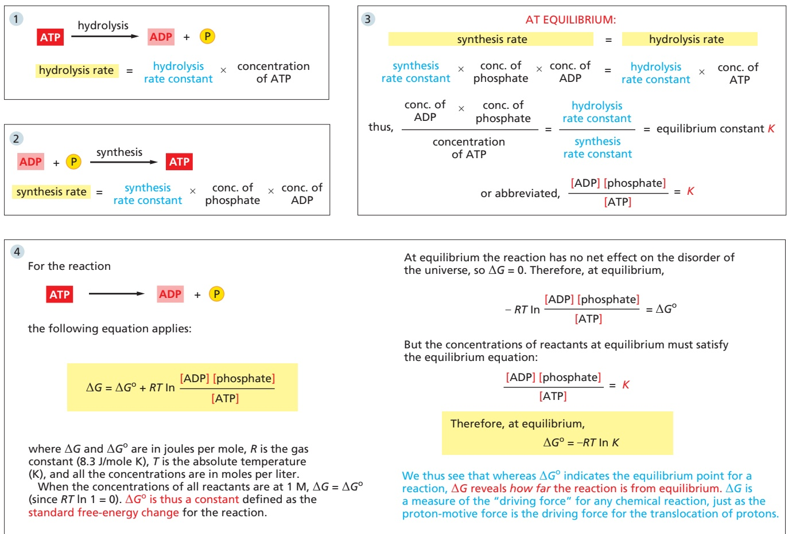

(–11 to –13 kcal/mole). This extremely favorable ΔG depends on maintaining a high concentration of ATP compared with the concentrations of ADP and phosphate. When ATP, ADP, and phosphate are all present at the same concentration of 1 mole/liter (so-called standard conditions), the ΔG for ATP hydrolysis drops to the standard free-energy change (ΔG°), which is only –30.5 kJ/mole (–7.3 kcal/mole). At much lower concentrations of ATP relative to ADP and phosphate, ΔG becomes zero. At this point, the rate at which ADP and phosphate will join to form ATP will be equal to the rate at which ATP hydrolyzes to form ADP and phosphate. In other words, when ΔG = 0, the reaction is at equilibriumMBoC7 m14.29/14.30 (see Figure 14–30).

## Figure 14–30 The basic relationship between free-energy changes and equilibrium in the ATP hydrolysis

reaction. The rate constants in boxes 1 and 2 are determined from experiments in which product accumulation is measured as a function of time (conc., concentration). The equilibrium constant shown here, K, is in units of moles per liter. (See Panel 2–7, pp. 106–107, for a discussion of free energy, and see Figure 3–42 for a discussion of the equilibrium constant.)

It is ΔG, not ΔG°, that indicates how far a reaction is from equilibrium and determines whether it can drive other reactions. Because the efficient conversion of ADP to ATP in mitochondria maintains such a high concentration of ATP relative to ADP and phosphate, the ATP hydrolysis reaction in cells is kept very far from equilibrium, and ΔG is correspondingly very negative. Without this large disequilibrium, ATP hydrolysis could not be used to drive the reactions of the cell. At low ATP concentrations, many essential reactions would become energetically unfavorable, run backward, and the cell would die.

## The ATP Synthase Is a Nanomachine That Produces ATP by Rotary Catalysis

The **ATP synthase** is a finely tuned nanomachine composed of 23 or more separate protein subunits, with a total mass of about 600,000 daltons. The ATP synthase can work both in the forward direction, producing ATP from ADP and phosphate by consuming an electrochemical gradient, or in reverse, generating an electrochemical gradient by ATP hydrolysis. To distinguish it from other enzymes that hydrolyze ATP, it is also called an $\mathrm { F _ { 1 } F _ { 0 } }$ ATP synthase or F-type ATPase.

---

838

Chapter 14: Energy Conversion and Metabolic Compartmentation: Mitochondria and Chloroplasts

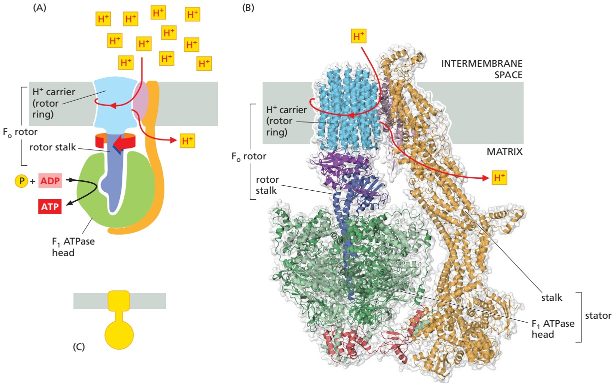

Resembling a turbine, ATP synthase is composed of both a rotor and a stator (Figure 14–31). To prevent the catalytic head from rotating, a stalk at the periphery of the complex (the stator stalk) connects the head to stator subunits embedded in the membrane. A second stalk in the center of the assembly (the rotor stalk) is connected to the rotor ring in the membrane, which turns as protons flow through it, driven by the electrochemical gradient across the membrane. As a result, proton flow makes the rotor stalk rotate inside the stationary head, where the catalytic sites that assemble ATP from ADP and phosphate are located. Three α and three β subunits of similar structure alternate to form the head. Each ofMBoC7 e14.16/14.31 the three $\beta$ subunits has a catalytic nucleotide-binding site at the α–β interface. These catalytic sites are all in different conformations, depending on their interaction with the rotor stalk. This stalk acts like a camshaft, the device that opens and closes the valves in a combustion engine. As it rotates within the head, the stalk changes the conformations of the β subunits sequentially. One of the possible conformations of the catalytic sites has high affinity for ADP and phosphate, and as the rotor stalk pushes the binding site into a different conformation, these two substrates are driven to form ATP. As the rotor stalk continues to rotate, the binding site releases ATP, allowing the ATP-producing cycle to restart. In this way, the mechanical force exerted by the central rotor stalk is directly converted into the chemical energy of the ATP phosphate bond.

Serving as a proton-driven turbine, the ATP synthase is driven by $\mathrm { H } ^ { + }$ flow into the matrix to spin at about 8000 revolutions per minute, generating three molecules of ATP per turn. In this way, each ATP synthase can produce roughly 400 molecules of ATP per second.

The closely related ATP synthases of mitochondria, chloroplasts, and bacteria synthesize ATP by harnessing the proton-motive force across a membrane. This powers the rotation of the rotor against the stator in a counterclockwise direction, as seen from the $\mathrm { F _ { 1 } }$ head. The same enzyme complex can also pump protons against their electrochemical gradient by hydrolyzing ATP, which then drives the clockwise rotation of the rotor. The direction of operation depends on the net free-energy change (ΔG) for the coupled processes of $\mathrm { H } ^ { + }$ translocation across the membrane and the synthesis of ATP from ADP and phosphate (**Movie 14.7** and

Figure 14–31 ATP synthase. The three-dimensional structure of the $\mathsf { F } _ { 1 } \mathsf { F } _ { 0 }$ ATP synthase determined by x-ray crystallography. Also known as an F-type ATPase, it consists of an $\mathsf { F } _ { \mathsf { O } }$ part (from “oligomycin-sensitive factor”) in the membrane and the large, catalytic F<sub>1</sub> head extending into the matrix. (A) Diagram of the enzyme complex showing how its globular head portion (green) is kept stationary as proton flow across the membrane drives a rotor (light blue) that turns the rotor stalk (dark blue) inside the head. (B) In bovine heart mitochondria, the $\mathsf{F}_{\mathsf{O}}$ rotor ring in the membrane (light blue) has eight c subunits. It is attached to the γ subunit of the rotor stalk (dark blue) by the ε subunit (purple). The catalytic $\mathbb{F}_{1}$ head consists of a ring of three α and three β subunits (light and dark green), and it directly converts mechanical energy into chemical-bond energy in ATP, as described in the text. The elongated peripheral stalk of the stator (orange) is connected to the $\mathbb { F } _ { 1 }$ head by the small δ subunit (red) at one end and to the a subunit in the membrane at the other. Together with the c subunits of the ring rotating past it, the a subunit creates a path for protons through the membrane. (C) The symbol for ATP synthase used throughout this book. (B, PDB codes: 2WPD, 2CLY, 2WSS, 2BO5.)

---

(A)

10 nm

ATP PRODUCTION IN MITOCHONDRIA

839

**Movie 14.8**). Measurement of the torque that the ATP synthase can produce by ATP hydrolysis reveals that the ATP synthase is 60 times more powerful than a diesel engine of equal size.

## Proton-driven Turbines Are Ancient and Critical for Energy Conversion

The membrane-embedded rotors of ATP synthases consist of a ring of identical c subunits (**Figure 14–32**). Each c subunit is a hairpin of two membrane-spanning α helices that contain a proton-binding site defined by a glutamate or aspartate in the middle of the lipid bilayer. The a subunit, which is part of the stator (see Figure 14–31), makes two narrow channels at the interface between the rotor and stator, each spanning half of the membrane and converging on the protonbinding site at the middle of the rotor subunit. Protons flow through the two half-channels down their electrochemical gradient from the crista space back into the matrix. The negatively charged glutamate or aspartate side chain in the binding site accepts a proton arriving from the crista space through the first halfchannel, as it rotates past the a subunit. The bound proton then rides around in the ring for a full cycle, whereupon it is thought to be displaced by a positively charged arginine in the a subunit to escape through the second half-channel into the matrix. This directional proton flow causes the rotor ring to spin against the stator like a proton-driven turbine.

The mitochondrial ATP synthase is of ancient origin: essentially the same enzyme exists in plant chloroplasts and in the plasma membrane of bacteria or archaea. The main difference between them is the number of c subunits in the rotor ring. In mammalian mitochondria, the ring has 8 subunits. In yeast mitochondria, the number is 10; in bacteria and archaea, it ranges from 11 to 13; in plant chloroplasts, there are 14; and the rings of some cyanobacteria contain 15 c subunits.

The number of c subunits in the ring determines how many protons need to pass through this marvelous device to make each molecule of ATP. These subunits can be thought of as cogs in the gear wheels of a bicycle. A high gear, with a small number of cogs in the wheel, is advantageous when the supply of protons is limited, as in mitochondria, but a low gear, with a large number of cogs in the wheel, is preferable when the proton gradient is high. This is the case in chloroplasts and cyanobacteria, where protons produced through the action of sunlight are plentiful. Because each rotation produces three molecules of ATP in the head, the synthesis of one ATP requires around three protons in mitochondria but up to five in photosynthetic organisms—allowing the latter organisms to create a higher ratio of ATP to ADP and thus to maintain a greater ΔG for ATP hydrolysis.

Even under scenarios where mitochondrial ATP production is not possible or necessary, mitochondria must maintain a proton gradient to power the proper import of essential proteins and metabolites. In such a situation, ATP synthase can also run in reverse as an ATP-powered proton pump that converts the energy of ATP back into a proton gradient across the membrane. Moreover, in many bacteria, the rotor of the ATP synthase in the plasma membrane changes direction routinely, from ATP synthesis mode in aerobic respiration to ATP hydrolysis mode in anaerobic metabolism. In this latter case, ATP hydrolysis serves to maintain the proton gradient across the plasma membrane, which is used to power many other essential cell functions including nutrient transport and the rotation of bacterial flagella. The V-type ATPases that acidify certain cellular organelles are

<small><span class="docvortex-page-footnote" data-block-type="page_footnote" style="color:#6b7280">Fo</span></small>

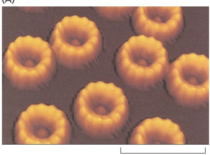

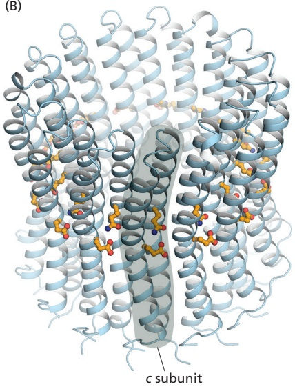

<small><span class="docvortex-page-footnote" data-block-type="page_footnote" style="color:#6b7280">Figure 14–32 ATP synthase rotor rings. (A) Atomic force microscopy image of ATP synthase rotors from the cyanobacterium Synechococcus elongatus in a lipid bilayer. Whereas 8 c subunits form the rotor in Figure 14–31, there are 13 c subunits in this ring. (B) The x-ray structure of the F<sub>o</sub> ring of the ATP synthase from Spirulina platensis, another cyanobacterium, shows that this rotor has 15 c subunits. In all ATP synthases, the c subunits are hairpins of two membrane-spanning α helices (one subunit is highlighted in gray). The helices are highly hydrophobic, except for glutamine and glutamate side chains (yellow) that create proton-binding sites in the membrane. (A, courtesy of Thomas Meier and Denys Pogoryelov; B, PDB code: 2WIE.)</span></small>

---

840

Chapter 14: Energy Conversion and Metabolic Compartmentation: Mitochondria and Chloroplasts

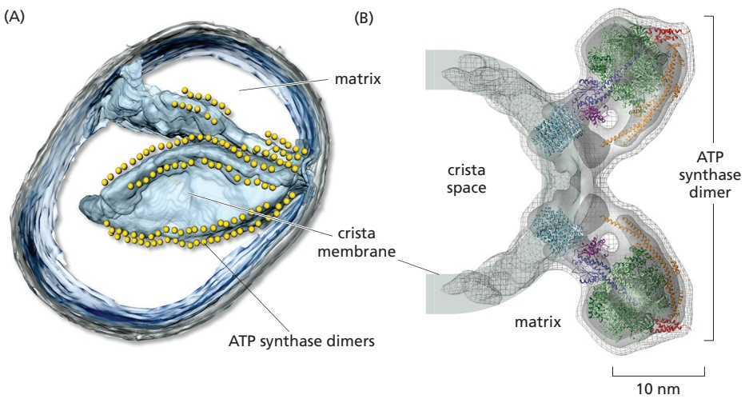

architecturally similar to the F-type ATP synthases, but they normally function in this ATP-dependent proton-pumping mode (see Figure 13–62).

Figure 14–33 Dimers of mitochondrial ATP synthase in cristae membranes. (A) A three-dimensional map of a small mitochondrion obtained by electron microscope tomography shows that ATP synthases form long paired rows along cristae ridges. The outer membrane is gray, and the inner membrane and cristae membranes have been colored light blue. Each head of an ATP synthase is indicated by a yellow sphere. (B) A three-dimensional map of a mitochondrial ATP synthase dimer in the crista membrane obtained by sub-tomogram averaging, with fitted x-ray structures (Movie 14.9). (A, from K. Davies et al., Proc. Natl. Acad. Sci. USA 108:14121–14126, 2011. With permission from the National Academy of Sciences. B, from K. Davies et al., Proc. Natl. Acad. Sci. USA 109:13602–13607, 2012. With permission from the National Academy of Sciences.)

## Mitochondrial Cristae Help to Make ATP Synthesis Efficient

In the electron microscope, the mitochondrial ATP synthase complexes can be seenMBoC7 m14.32/14.33 to project like lollipops on the matrix side of cristae membranes. Recent studies by cryo-electron microscopy and tomography have shown that this large complex is not distributed randomly in the membrane, but forms long rows of dimers along the cristae ridges (**Figure 14–33**). The dimer rows induce or stabilize these regions of high membrane curvature, which are otherwise energetically unfavorable. Indeed, the formation of ATP synthase dimers and their assembly into rows are required for cristae formation and have far-reaching consequences for cellular fitness. By contrast with bacterial or chloroplast ATP synthases, which do not form dimers, the mitochondrial complex contains additional subunits, located mostly near the membrane end of the stator stalk. If these dimer-specific subunits are mutated in yeast, the ATP synthase in the membrane remains monomeric, the mitochondria have no cristae, cellular respiration drops by half, and the cells grow more slowly.

Electron tomography suggests that the respiratory enzyme complexes that pump protons are located in the crista membrane at either side of the dimer rows. Protons pumped into the crista space by these respiratory-chain complexes are thought to diffuse very rapidly along the membrane surface, with the ATP synthase rows creating a proton “sink” at the cristae tips (**Figure 14–34**). In vitro studies suggest that the ATP synthase needs a proton gradient of about 2 pH units

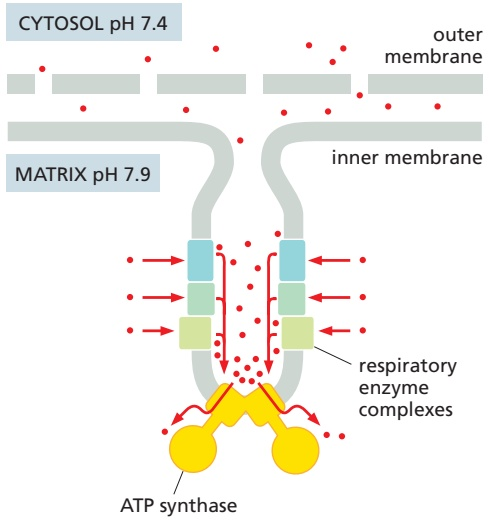

Figure 14–34 ATP synthase dimers at cristae ridges and ATP production. At the cristae ridges, the ATP synthases (yellow) form a sink for protons (red). The proton pumps of the electron-transport chain (blue and green) are located in the membrane regions on either side of the crista. As illustrated, protons tend to be enriched in the crista space and diffuse along the membrane from their source to the proton sink created by the ATP synthase. This allows efficient ATP production despite the small overall H+ gradient between the cytosol and matrix. Red arrows show the direction of the proton flow.

---

ATP PRODUCTION IN MITOCHONDRIA

841

to produce ATP at the rate required by the cell, irrespective of the membrane potential. The $\mathrm { H } ^ { + }$ gradient across the inner mitochondrial membrane is only 0.5–0.6 pH units. The cristae thus seem to work as proton traps that enable the ATP synthase to make efficient use of the protons pumped out of the mitochondrial matrix. As we shall see in the next part of this chapter, this elaborate arrangement of membrane protein complexes is absent in chloroplasts, where the $\mathrm { H } ^ { \check { + } }$ gradient is much larger.

## Special Transport Proteins Move Solutes Through the Inner Membrane

Like all biological membranes, the inner mitochondrial membrane contains numerous specific transport proteins that allow particular substances to pass through. More than 50 of these transporters are members of a single protein family, known as mitochondrial carriers. One of the most abundant of these family members is the $\mathit { A D P / A T P }$ carrier protein (Figure 14–35). This carrier shuttles the ATP produced in the matrix through the inner membrane to the intermembrane space, from where it diffuses through the outer mitochondrial membrane to the cytosol. In exchange, ADP passes from the cytosol into the matrix for recycling into ATP. $\mathrm { A T P ^ { 4 - } }$ has one more negative charge than $\mathrm { A D P ^ { 3 - } }$ and the exchange of ATP and ADP is driven by the electrochemical gradient across the inner membrane, so that the more negatively charged ATP is pushed out of the matrix, and the less negatively charged ADP is pulled in. Indeed, most of these carriers utilize the electrochemical proton gradient to drive directional transport of solutes across the inner membrane (see Chapter 11). In addition to members of the mitochondrial carrier family, all of which share significant sequence and structural similarity, several unrelated proteins transport pyruvate, calcium, serine, and other critical solutes.

In some specialized fat cells, mitochondrial respiration is uncoupled from ATP synthesis by the uncoupling protein, another member of the mitochondrial carrier family. In these cells, known as brown or beige fat cells, most of the energy of oxidation is dissipated as heat rather than being converted into ATP. In the inner

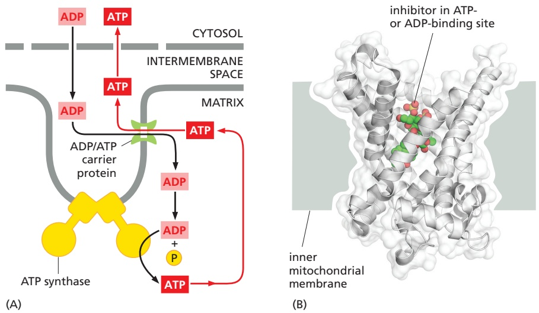

Figure 14–35 The ADP/ATP carrier protein. (A) The ADP/ATP carrier protein is a small membrane protein that carries the ATP produced on the matrix side of the inner membrane to the intermembrane space and carries the ADP that is needed for ATP synthesis into the matrix. (B) In the ADP/ATP carrier, six transmembrane α helices define a cavity that binds either ADP or ATP. In this x-ray structure, the substrate is replaced by a tightly bound inhibitor instead (colored). When $\mathsf { A D P }$ binds from outside the inner membrane, it triggers a conformational change and is released into the matrix. In exchange, a molecule of ATP quickly binds to the matrix side of the carrier and is transported to the intermembrane space. From there the ATP diffuses through the outer mitochondrial membrane to the cytoplasm, where it powers the energy-requiring processes in the cell. (PDB code: 1OKC.)

---

842

Chapter 14: Energy Conversion and Metabolic Compartmentation: Mitochondria and Chloroplasts

membranes of the large mitochondria in these cells, the uncoupling protein allows protons to move down their electrochemical gradient without passing through ATP synthase. This process is switched on when heat generation is required, causing the cells to oxidize their fat stores at a rapid rate and produce heat rather than ATP. Activating this uncoupling process protects newborn human babies against the cold and has been shown to protect against obesity and diabetes in genetically engineered mice.

## Chemiosmotic Mechanisms First Arose in Bacteria

Bacteria use enormously diverse energy sources. Some, like animal cells, are aerobic; they synthesize ATP from sugars they oxidize to $\mathrm { C O _ { 2 } }$ and $\mathrm { H _ { 2 } O }$ by glycolysis, the citric acid cycle, and a respiratory chain in their plasma membrane that is similar to the one in the inner mitochondrial membrane. Others are strict anaerobes, deriving their energy either from glycolysis alone (by fermentation, see Figure 2–50) or from an electron-transport chain that employs a molecule other than oxygen as the final electron acceptor. The alternative electron acceptor can be a nitrogen compound (nitrate or nitrite), a sulfur compound (sulfate or sulfite), or a carbon compound (fumarate or carbonate), as examples. A series of electron carriers in the plasma membrane that are comparable to those in mitochondrial respiratory chains transfers the electrons to these acceptors.

Despite this diversity, the plasma membrane of the vast majority of bacteria contains an ATP synthase that is very similar to the one in mitochondria. In bacteria that use an electron-transport chain to harvest energy, the electron-transport chain pumps $\mathrm { H } ^ { + }$ out of the cell and thereby establishes a proton-motive force across the plasma membrane that drives the ATP synthase to make ATP. In other bacteria, the ATP synthase works in reverse, using the ATP produced by glycolysis to pump $\mathrm { H } ^ { + }$ and establish a proton gradient across the plasma membrane.

Bacteria, including the strict anaerobes, maintain a proton gradient across their plasma membrane that is harnessed to drive many other processes. It can be used to drive a flagellar motor, for example. The gradient is also harnessed to pump $\mathrm { { N a } ^ { + } }$ out of the bacterium via an $\bar { \mathrm { N a } ^ { + } } \mathrm { - H ^ { + } }$ antiporter that takes the place of the $\mathrm { { N a } ^ { + } \mathrm { { \cdot } K ^ { + } } }$ pump of eukaryotic cells. In addition, the gradient is used for the active inward transport of nutrients, such as most amino acids and many sugars: each nutrient is dragged into the cell along with one or more protons through a specific symporter (**Figure 14–36**; see also Chapter 11). In animal cells, by contrast, most inward transport across the plasma membrane is driven by the $\mathrm { { N a } ^ { + } }$ gradient (high $\mathrm { N a } ^ { + }$ outside, low $\mathrm { N a } ^ { + }$ inside) that is established by the $\mathrm { N a ^ { + } \mathrm { - K ^ { + } } }$ pump (see Figure 11–15).

Some unusual bacteria have adapted to live in a very alkaline environment and yet must maintain their cytoplasm at a physiological pH. For these cells, any attempt to generate an electrochemical $\mathrm { H } ^ { + }$ gradient would be opposed by a large $\mathrm { H } ^ { + }$ concentration gradient in the wrong direction $\mathrm { ( H ^ { + } }$ higher inside than outside). Presumably for this reason, some of these bacteria substitute $\mathrm { N a } ^ { + }$ for $\mathrm { H } ^ { + }$ in all of their chemiosmotic mechanisms. The respiratory chain pumps $\mathrm { N a } ^ { + }$ out of the cell, the transport systems and flagellar motor are driven by an inward flux of $\mathrm { N a } ^ { + }$ , and an $\mathbf { N a } ^ { + } .$ -driven ATP synthase synthesizes ATP. The existence of such bacteria demonstrates a critical point: the principle of chemiosmosis is more fundamental than the proton-motive force on which it is normally based.

As we discuss in the next part of this chapter, an ATP synthase coupled to chemiosmotic processes is also a central feature of plants, where it plays critical roles in both mitochondria and chloroplasts.

## Summary

The large amount of free energy released when $H ^ { + }$ flows back into the matrix from the cristae provides the basis for ATP production on the matrix side of mitochondrial cristae membranes by a remarkable protein machine—the ATP synthase. The ATP synthase functions like a miniature turbine, and it is a reversible device that

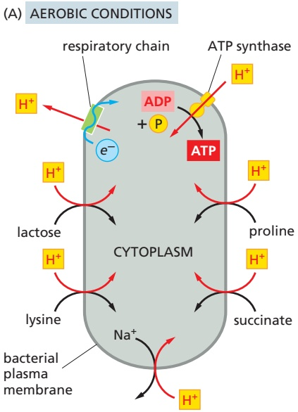

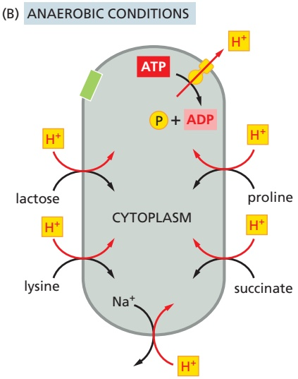

Figure 14–36 Bacteria use a protonmotive force across the plasma membrane to pump nutrients into the cell and expel $[ \mathsf { M a } ^ { + } ]$ (A) In an aerobic bacterium, a respiratory chain fed by the oxidation of substrates produces an electrochemical proton gradient across the plasma membrane. This gradient is then harnessed to make ATP and to transport nutrients (proline, succinate, lactose, and lysine) into the cell and to pump Na+ out of the cell. (B) When the same bacterium grows under anaerobic conditions, it derives its ATP from glycolysis. As indicated, the ATP synthase in the plasma membrane then hydrolyzes some of this ATP to establish an electrochemical proton gradient that drives the same transport processes that depend on respiratory chain proton-pumping in A.

---

CHLOROPLASTS AND PHOTOSYNTHESIS

843

can couple proton flow to either ATP synthesis or ATP hydrolysis. The transmembrane electrochemical gradient that drives ATP production in mitochondria also drives the active transport of selected metabolites across the inner mitochondrial membrane, including an efficient ADP/ATP exchange between the mitochondrion and the cytosol that keeps the cell’s ATP pool highly charged. The resulting high concentration of ATP inside the cell makes the free-energy change for ATP hydrolysis extremely favorable, allowing this hydrolysis reaction to drive a large number of energy-requiring processes throughout the cell. The universal presence of an ATP synthase in bacteria, mitochondria, and chloroplasts testifies to the central importance of chemiosmotic mechanisms for life.

## CHLOROPLASTS AND PHOTOSYNTHESIS

All animals and most microorganisms rely on the continual uptake of large amounts of organic compounds from their environment. These compounds provide both the carbon-rich building blocks for biosynthesis and the metabolic energy for life. It has been proposed that the first organisms on the primitive Earth had access to an abundance of organic compounds produced by geochemical processes, but these would have been used up early in life’s evolution. Since then, the vast majority of the organic materials required by living cells has been produced by photosynthetic organisms, including plants and photosynthetic bacteria. The core machinery that drives all photosynthesis appears to have evolved more than 3 billion years ago in the ancestors of present-day bacteria; today it provides the major solar energy storage mechanism on Earth.

The most advanced photosynthetic bacteria are the cyanobacteria, which have minimal nutrient requirements. They use electrons from water and the energy of sunlight to convert atmospheric $\mathrm { C O _ { 2 } }$ into organic compounds—a process called carbon fixation. In the course of the overall reaction

$$
n \mathrm{H} _ {2} \mathrm{O} + n \mathrm{CO} _ {2} \xrightarrow {\text {Light}} (\mathrm{CH} _ {2} \mathrm{O}) _ {n} + n \mathrm{O} _ {2}
$$

they also liberate into the atmosphere the molecular oxygen needed for oxidative phosphorylation. In this way, it is thought that the evolution of an organism similar to modern cyanobacteria from more primitive photosynthetic bacteria eventually made possible the development of the many different aerobic lifeforms that populate Earth today.

## Chloroplasts Resemble Mitochondria but Have a Separate Thylakoid Compartment

Plants (including algae) developed much later than cyanobacteria, and their photosynthesis occurs in a specialized intracellular organelle—the **chloroplast** (**Figure 14–37**). There is good evidence that the chloroplast evolved after an endosymbiotic event between a eukaryotic cell and a photosynthetic

Figure 14–37 Chloroplasts in a plant cell. (A) Schematic cross section through the leaf of a green plant. (B) Light microscopy of a plant leaf cell—here, a mesophyll cell from Zinnia elegans—shows chloroplasts as bright green bodies, measuring several micrometers across, in the transparent cell interior. (C) An electron micrograph of a thin, stained section through a wheat leaf cell shows a thin rim of cytoplasm— containing chloroplasts, the nucleus, and mitochondria—surrounding a large, water-filled vacuole. (D) At higher magnification, electron microscopy reveals the chloroplast envelope membrane and the thylakoid membrane within the chloroplast that is highly folded into grana stacks (Movie 14.10 and Movie 14.11). (B, courtesy of Preeti Dahiya; C and D, courtesy of K. Plaskitt.)

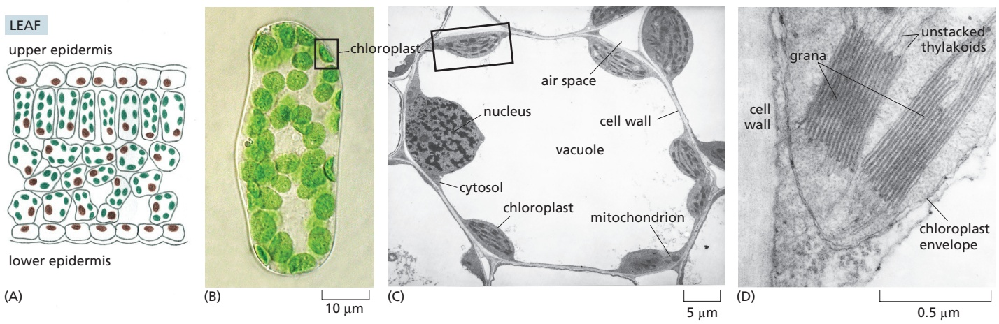

---

844

Chapter 14: Energy Conversion and Metabolic Compartmentation: Mitochondria and Chloroplasts

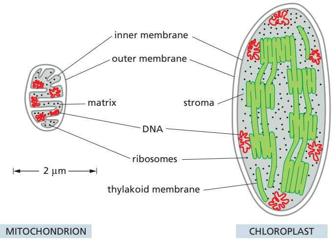

Figure 14–38 A mitochondrion and chloroplast compared. Chloroplasts are generally larger than mitochondria. In addition to an outer and inner envelope membrane, they contain the thylakoid membrane with its internal thylakoid lumen. The chloroplast thylakoid membrane, which is the site of solar energy conversion in plants and algae, corresponds to the mitochondrial cristae, which are the sites of energy conversion by cellular respiration. Unlike the crista membrane, which is continuous with the inner mitochondrial membrane at cristae junctions, the thylakoid membrane is not connected to the inner chloroplast membrane at any point.

cyanobacteria-like organism. Chloroplasts use chemiosmotic mechanisms to carry out their energy interconversions in much the same way that mitochondria do. Although much larger than mitochondria, they are organized on the same principles. They have a highly permeable outer membrane; a much less permeable inner membrane, in which membrane transport proteins are embedded; and a narrow intermembrane space in between. Together, these two membranes form the chloroplast envelope (Figure 14–37D). The inner chloroplast membrane surrounds a large space called the **stroma**, which is analogous to the mitochondrial matrix and to the bacterial cytoplasm. The stroma contains many metabolic enzymes, and, as for the mitochondrial matrix, it is the place where ATP is made by the heads of ATP synthase protein machines. Like the mitochondrion, the chloroplast has its own genome and genetic system. The stroma therefore also contains a special set of ribosomes, RNAs, and the chloroplast DNA.

An important difference between the organization of mitochondria and chloroplasts is highlighted in **Figure 14–38**. The inner membrane of the chloroplast is not folded into cristae and does not contain electron-transport chains. Instead, the electron-transport chains, photosynthetic light-capturing systems, and ATP synthase are all contained in the **thylakoid membrane**, a separate, distinct membrane that forms a set of flattened, disc-like sacs, the thylakoids. The thylakoid membrane is highly folded into numerous local stacks of flattened vesicles called grana, interconnected by nonstacked thylakoids. The lumen of each thylakoid is connected with the lumen of other thylakoids, thereby defining a third internal compartment called the thylakoid lumen. This space represents a separate compartment in each chloroplast that is not connected to either the intermembrane space or the stroma. In addition to serving an analogous function, the thylakoid membrane has other similarities to the mitochondrial crista membrane, including a very high protein density and a unique lipid composition.

## Chloroplasts Capture Energy from Sunlight and Use It to Fix Carbon

We can group the reactions that occur during photosynthesis in chloroplasts into two broad categories:

1. The **photosynthetic electron-transfer reactions** (also called the “light reactions”) occur in two large protein complexes, called reaction centers, embedded in the thylakoid membrane (**Figure 14–39**). A photon (a quantum of light) knocks an electron out of the green pigment molecule chlorophyll in the first reaction center, creating a positively charged chlorophyll ion. This high-energy electron then moves along an electron-transport chain and through a second reaction center in much the same way that an electron moves along the respiratory chain in mitochondria. During the electron-transport process, part of the energy released by electron transfer

---

CHLOROPLASTS AND PHOTOSYNTHESIS

845

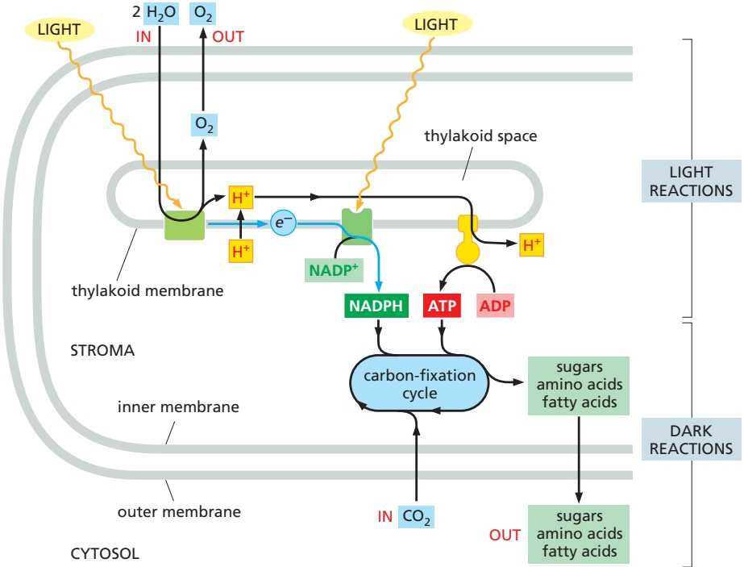

is harnessed to pump $\mathrm { H } ^ { + }$ ions (protons) across the thylakoid membrane. The resulting electrochemical proton gradient is then used by ATP synthase to drive the synthesis of ATP in the stroma. As the final step in this series of reactions, electrons are loaded (together with H+) onto NADP+,MBoC7 m14.39/14.39 converting it to the energy-rich NADPH molecule. Because the positively charged chlorophyll in the first reaction center quickly regains its electrons from water $\mathrm { ( H _ { 2 } \bar { O } ) , H ^ { + } }$ and $\mathrm { O } _ { 2 }$ gas are produced as by-products. All of these reactions are confined to the chloroplast.

2. The **carbon-fixation reactions** (also called the “dark reactions”) do not require sunlight. Here the ATP and NADPH generated by the above light reactions serve as the source of energy and reducing power, respectively, to drive the conversion of $\mathrm { C O _ { 2 } }$ to carbohydrate. These carbon-fixation reactions occur in the chloroplast stroma, where they generate the three-carbon sugar glyceraldehyde 3-phosphate. This simple sugar is an intermediate in the glycolysis and gluconeogenesis pathways. Upon export to the cytosol, it is used to produce sucrose and many other organic metabolites in the leaves of the plant. The sucrose is then exported to meet the metabolic needs of the nonphotosynthetic plant tissues, serving as a source of both carbon skeletons and energy for growth.

Thus, the formation of ATP, NADPH, and $\mathrm { O } _ { 2 }$ (which requires light energy directly) and the conversion of $\mathrm { C O _ { 2 } }$ to carbohydrate (which requires light energy only indirectly) are separate processes (Figure 14–39). But, they are linked by elaborate feedback mechanisms that allow a plant to manufacture sugars only when it is appropriate to do so. Several of the chloroplast enzymes required for carbon fixation, for example, are inactive in the dark and reactivated by lightstimulated electron-transport processes.

## Carbon Fixation Uses ATP and NADPH to Convert $\mathrm { C O } _ { 2 }$ into Sugars

We have seen earlier in this chapter how mitochondria in eukaryotic cells produce ATP by using the large amount of free energy released when carbohydrates are oxidized to $\mathrm { C O _ { 2 } }$ and H2O. The reverse reaction, in which plants make carbohydrate from $\mathrm { C O _ { 2 } }$ and $\mathrm { H _ { 2 } O }$ , takes place in the chloroplast stroma. The large amounts

Figure 14–39 A summary of the energyconverting metabolism in chloroplasts. Chloroplasts require only water and carbon dioxide as inputs for their lightdriven photosynthesis reactions, and they produce the nutrients for most other organisms on the planet. Each oxidation of two water molecules by a photochemical reaction center in the thylakoid membrane produces one molecule of oxygen, which is released into the atmosphere. At the same time, protons are concentrated in the thylakoid space. These protons create a large electrochemical gradient across the thylakoid membrane, which is utilized by the chloroplast ATP synthase to produce ATP from ADP and phosphate. The electrons withdrawn from water are transferred to a second type of photochemical reaction center to produce NADPH from $\mathsf { N A D P ^ { + } }$ As indicated, the NADPH and ATP are fed into the carbonfixation cycle to reduce carbon dioxide, thereby producing the precursors for sugars, amino acids, and fatty acids. The CO<sub>2</sub> that is taken up from the atmosphere here is the source of the carbon atoms for most organic molecules on Earth.

In a plant cell, a variety of metabolites produced in the chloroplast are exported to the cytoplasm for biosyntheses. Some of the sugar produced is stored in the form of starch granules in the chloroplast, but the rest is transported throughout the plant as sucrose or converted to starch in special storage tissues. These storage tissues serve as a major food source for animals.

---

846

Chapter 14: Energy Conversion and Metabolic Compartmentation: Mitochondria and Chloroplasts


Figure 14–40 The initial reaction in carbon fixation. This carboxylation reaction allows one molecule each of carbon dioxide and water to be incorporated into organic carbon molecules. It is catalyzed in the chloroplast stroma by the abundant enzyme ribulose 1,5-bisphosphate carboxylase/oxygenase, or Rubisco. As indicated, the product is two molecules of 3-phosphoglycerate.

of ATP and NADPH produced by the photosynthetic electron-transfer reactions are required to drive this energetically unfavorable reaction.

**Figure 14–40** illustrates the central reaction of carbon fixation, in which an atom of inorganic carbon is converted to organic carbon: $\mathrm { C O _ { 2 } }$ from the atmosphere combines with the five-carbon compound ribulose 1,5-bisphosphate plus water to yield two molecules of the three-carbon compound 3-phosphoglycerate. This carboxylation reaction is catalyzed in the chloroplast stroma by a large enzyme called ribulose 1,5-bisphosphate carboxylase/oxygenase, or Rubisco. Because the reaction is so slow (each Rubisco molecule turns over only about 3 molecules of substrate per second, compared to 1000 molecules per second for a typical enzyme), a very large number of enzyme molecules are needed. Rubisco constitutes up to 50% of the chloroplast protein mass, and it is one of the most abundant proteins on Earth. Of great importance to the global environment, Rubisco also helps to reduce the amount of the greenhouse gas $\mathrm { C O _ { 2 } }$ in the atmosphere.

Although the production of carbohydrates from $\mathrm { C O _ { 2 } }$ and $\mathrm { H _ { 2 } O }$ is energetically unfavorable, the fixation of $\mathrm { C O _ { 2 } }$ catalyzed by Rubisco is an energetically favorable reaction. Carbon fixation is energetically favorable because a continuous supply of the energy-rich ribulose 1,5-bisphosphate is fed into the process via the carbon-fixation cycle described below. This compound is consumed by the addition of $\mathrm { C O _ { 2 } } ,$ and it must be replenished. As we describe next, the energy and reducing power needed to regenerate ribulose 1,5-bisphosphate come from the ATP and NADPH produced by the photosynthetic light reactions.

The elaborate series of reactions in which $\mathrm { C O _ { 2 } }$ combines with ribulose 1,5-bisphosphate to produce a simple sugar—a portion of which is used to regenerate ribulose 1,5-bisphosphate—forms a cycle, called the carbon-fixation cycle, or the Calvin–Benson–Bassham cycle (**Figure 14–41**). This cycle was one of the first metabolic pathways to be defined by applying radioisotopes as tracers in biochemistry. As indicated, each turn of the cycle converts six molecules of 3-phosphoglycerate to three molecules of ribulose 1,5-bisphosphate plus one molecule of glyceraldehyde 3-phosphate. The net result of each turn of the cycle is that 9 ATP and 6 NADPH molecules are used to power the conversion of $3   \mathrm { C O _ { 2 } }$ molecules into one molecule of glyceraldehyde 3-phosphate.

Glyceraldehyde 3-phosphate, the three-carbon sugar produced by the cycle, occupies a pivotal point in carbohydrate biochemistry as an intermediate in glycolysis and gluconeogenesis, enabling it to serve as the starting material for the synthesis of many other sugars and all of the other organic molecules that form the plant.

## Carbon Fixation in Some Plants Is Compartmentalized to Facilitate Growth at Low $\mathrm { C O } _ { 2 }$ Concentrations

Although ribulose 1,5-bisphosphate carboxylase/oxygenase preferentially adds $\mathrm { C O _ { 2 } }$ to ribulose 1,5-bisphosphate, it can also use $\mathrm { O } _ { 2 }$ as a substrate in place of $\mathrm { C O _ { 2 } } ,$ and if the concentration of $\mathrm { C O _ { 2 } }$ is low, it will add $\mathrm { O } _ { 2 }$ to ribulose 1,5-bisphosphate