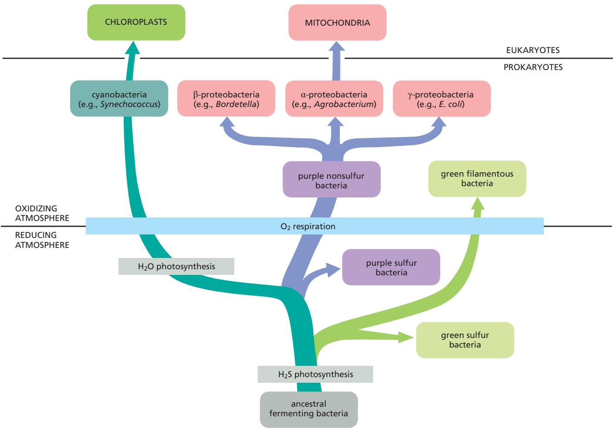
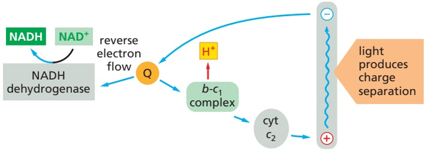
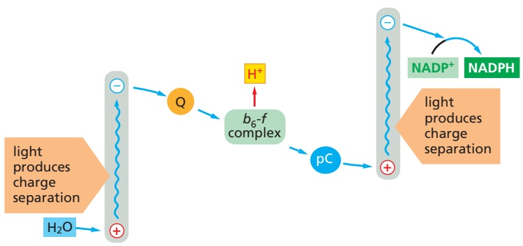
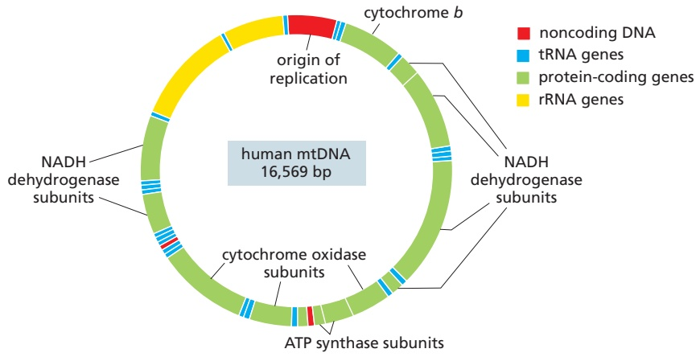
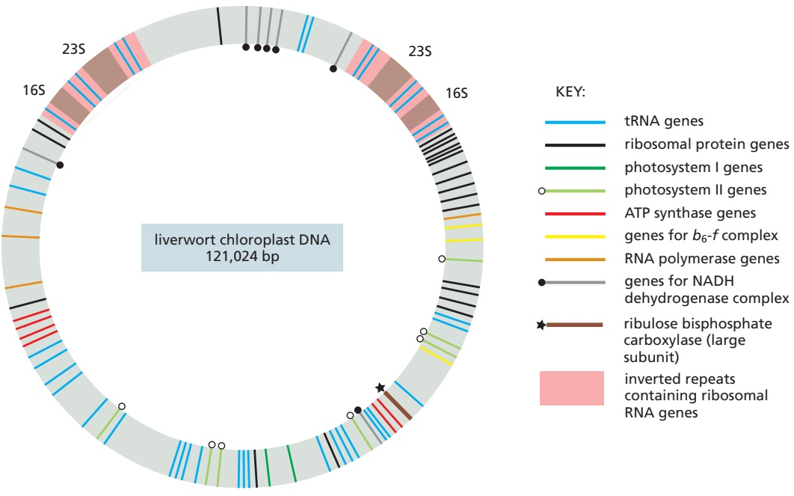
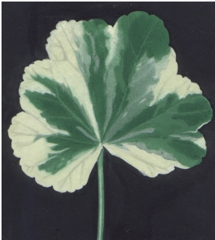
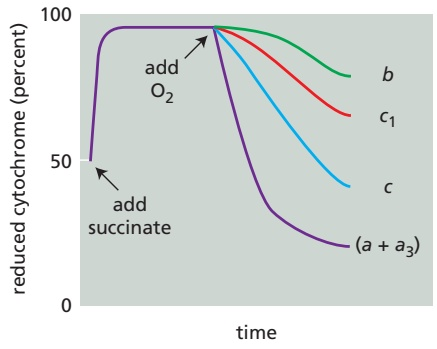
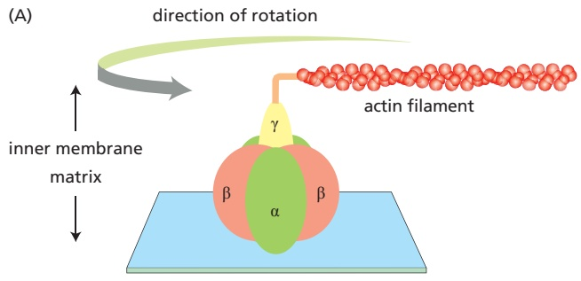

CHLOROPLASTS AND PHOTOSYNTHESIS

859

Figure 14–55 Evolutionary scheme showing the postulated origins of mitochondria and chloroplasts and their bacterial ancestors. The consumption of oxygen by respiration is thought to have first developed about 2 billion years ago. Nucleotide-sequence analyses suggest that an endosymbiotic oxygen-evolving cyanobacterium gave rise to chloroplasts (green), while mitochondria (pink) arose from an α-proteobacterium. The nearest relatives of mitochondria are members of three closely related groups of α-proteobacteria—the rhizobacteria, agrobacteria, and rickettsias—known to form intimate associations with present-day eukaryotic cells. Proteobacteria are pink, purple photosynthetic bacteria are purple, and other photosynthetic bacteria are light green.

large amount of energy released by breaking down carbohydrates and other reduced organic molecules all the way to $\mathrm { C O _ { 2 } }$ and $\mathrm { H _ { 2 } O } ,$ as explained when we discussed mitochondria. Components of preexisting electron-transport complexes were modified to produce a cytochrome oxidase, so that the electrons obtained from organic or inorganic substrates could be transported to $\mathrm { O } _ { 2 }$ as the terminal electron acceptor. Some present-day purple photosynthetic bacteria can switch between photosynthesis and respiration depending on the availability of light and $\mathrm { O } _ { 2 } ,$ with only relatively minor reorganizations of their electron-transport chains.

In **Figure 14–55**, we relate these postulated evolutionary pathways to different types of bacteria. By necessity, evolution is always conservative, taking parts of the old and building on them to create something new. Thus, parts of the electron-transport chains that were derived to service anaerobic bacteria 3–4 billion years ago survive today, in altered form, in the mitochondria and chloroplasts of higher eukaryotes. A good example is the overall similarity in structure and function between the cytochrome c reductase that pumps $\mathrm { H } ^ { + }$ in the central segment of the mitochondrial respiratory chain and the analogous cytochrome $b _ { 6 } { - } f$ complex in the electron-transport chains of both bacteria and chloroplasts, revealing their common evolutionary origin (**Figure 14–56**).

---

860

Chapter 14: Energy Conversion and Metabolic Compartmentation: Mitochondria and Chloroplasts

Figure 14–56 A comparison of three electron-transport chains discussed in this chapter. Bacteria, chloroplasts, and mitochondria all contain a membranebound enzyme complex that resembles the cytochrome c reductase of mitochondria. These complexes all accept electrons from a quinone carrier (Q) and pump H+ across their respective membranes. Moreover, in reconstituted in vitro systems, the different complexes can substitute for one another, and the structures of their protein components reveal that they are evolutionarily related. Note that the purple nonsulfur bacteria use a cyclic flow of electrons to produce a large electrochemical proton gradient that drives a reverse electron flow through NADH dehydrogenase to produce NADH from $\mathsf { N A D ^ { + } + H ^ { + } + e ^ { - } }$

## Summary

Chloroplasts and photosynthetic bacteria have the unique ability to harness the energy of sunlight to produce energy-rich compounds. This is achieved by the photosystems, in which chlorophyll molecules attached to proteins are excited when hitMBoC7 m14.58/14.56 by a photon. Photosystems are composed of light-harvesting antennae that collect solar energy and a photochemical reaction center, in which the collected energy is funneled to a chlorophyll molecule held in a special position, enabling it to withdraw electrons from an electron donor. Chloroplasts and cyanobacteria contain two distinct photosystems. The two photosystems are normally linked in series in the Z scheme, and they transfer electrons from water to $N A D \dot { P } ^ { + }$ to form NADPH, while also generating a transmembrane electrochemical potential. One of the two photosystems—photosystem II—can split water by removing electrons from this ubiquitous, low-energy compound. It is believed that essentially all of the molecular oxygen $( O _ { 2 } )$ in our atmosphere is a by-product of the water-splitting reaction in this photosystem. The three-dimensional structures of photosystems I and II are strikingly similar to those of the photosystems of purple photosynthetic bacteria, demonstrating a remarkable degree of conservation over billions of years of evolution.

The two photosystems and the cytochrome b6-f complex reside in the thylakoid membrane, a separate membrane system in the central stroma compartment of the chloroplast that is differentiated into stacked grana and unstacked stroma thylakoids. Electron-transport processes in the thylakoid membrane cause protons to be released

---

THE GENETIC SYSTEMS OF MITOCHONDRIA AND CHLOROPLASTS

861

into the thylakoid space. The backflow of protons through the chloroplast ATP synthase then generates ATP. This ATP is used in conjunction with the NADPH produced by photosynthesis to drive many biosynthetic reactions in the chloroplast stroma, including the carbon-fixation cycle, which generates large amounts of carbohydrates from CO2.

In the early evolution of life, cyanobacteria overcame a major obstacle by devising a way to use solar energy to split water and fix carbon dioxide. By proliferating widely on Earth, the cyanobacteria eventually produced both abundant organic nutrients and the molecular oxygen that enabled the rise of a multitude of aerobic life-forms. The chloroplasts in plants have evolved from a cyanobacterium that was endocytosed long ago by an aerobic eukaryotic host organism.

## THE GENETIC SYSTEMS OF MITOCHONDRIA AND CHLOROPLASTS

As we discussed in Chapter 1, mitochondria and chloroplasts are thought to have evolved from endosymbiotic bacteria (see Figures 1–27 and 1–29). Both types of organelles still contain their own genomes (**Figure 14–57**). As we will discuss shortly, they also retain their own machinery for transcribing that DNA into RNA and for translating mRNAs into organelle proteins.

Like bacteria, mitochondria and chloroplasts proliferate by growth and division of an existing organelle. In actively dividing cells, each type of organelle must double in mass in each cell generation and then be distributed into each daughter cell. In addition, nondividing cells must replenish organelles that are degraded as part of the continual process of organelle turnover or produce additional organelles as the need arises. Organelle growth and proliferation are therefore carefully controlled. The process is complicated because mitochondrial and chloroplast proteins are encoded in two places: the nuclear genome and the separate genomes harbored in the organelles themselves. The biogenesis of mitochondria and chloroplasts thus requires contributions from two separate genetic systems, which must be closely coordinated (see pp. 867–868).

Most organellar proteins are encoded by the nuclear DNA. The organelle imports these proteins from the cytosol, after they have been synthesized on cytosolic ribosomes. In Chapter 12, we discuss how this process is catalyzed by mitochondrial protein translocase complexes of the outer and inner mitochondrial membrane. Here, we describe the organellar genomes and genetic systems and consider the consequences of separate organelle genomes for the cell and the organism as a whole.

## The Genetic Systems of Mitochondria and Chloroplasts Resemble Those of Prokaryotes

As discussed in Chapter 12, it is thought that eukaryotic cells originated through a symbiotic relationship between an archaeon and an aerobic bacterium (an α-proteobacterium). The two organisms are postulated to have merged to form the ancestor of all nucleated cells, with the archaeon providing the nucleus and the proteobacterium serving as a respiring, ATP-producing endosymbiont—one that would eventually evolve into the mitochondrion (see Figure 12–3). This most likely occurred roughly 1.6 billion years ago, when oxygen had entered the atmosphere in substantial amounts (see Figure 14–54). The chloroplast was derived later, after the plant and animal lineages diverged, through endocytosis of an oxygen-producing cyanobacterium.

This endosymbiont hypothesis of organelle development receives strong support from the observation that the genetic systems of mitochondria and chloroplasts are similar to those of present-day bacteria. For example, bacterial, chloroplast, and mitochondrial genomes are typically circular and share many features of genome organization. In addition, chloroplast ribosomes are very similar to bacterial ribosomes, both in their structure and in their sensitivity to various antibiotics (such as chloramphenicol, streptomycin, erythromycin, and tetracycline). In addition, protein synthesis in chloroplasts starts with N-formylmethionine, as in bacteria, and

5 μm

Figure 14–57 Staining of nuclear and mitochondrial DNA. In this confocal micrograph of a single fibroblast cell, the nuclear DNA is stained with a fluorescent dye (blue) while the mitochondrial DNA is visualized indirectly using a tagged mitochondrial transcription factor (green). The mitochondrial network is stained with a fluorescent mitochondrial matrixMBoC7 m14.59/14.57 marker (red). The image was acquired using a structured illumination microscope (SIM), which yields approximately double the resolution of a confocal microscope. Numerous copies of the mitochondrial genome can be seen distributed in distinct nucleoids throughout the mitochondria that snake through the cytoplasm. [From C. Kukat et al., Proc. Natl. Acad. Sci. USA 108(33):13534–13539, 2011. Copyright 2011 National Academy of Sciences, USA. With permission from National Academy of Sciences.]

---

862

Chapter 14: Energy Conversion and Metabolic Compartmentation: Mitochondria and Chloroplasts

not with methionine, as in the cytosol of eukaryotic cells. Although mitochondrial genetic systems are much less similar to those of present-day bacteria than are the genetic systems of chloroplasts, their ribosomes are also structurally similar and are sensitive to antibacterial antibiotics, and the transcriptional system of mitochondria is reminiscent of bacterial and bacteriophage systems.

The processes of organellar DNA transcription, protein synthesis, and DNA replication take place where the genome is located: in the matrix of mitochondria or the stroma of chloroplasts. The enzymes that mediate these genetic processes are unique to the organelle and resemble those of bacteria (or even of bacterial viruses) rather than their eukaryotic analogs. In spite of the complexity of the system required to maintain independent organellar genomes, the nuclear genome encodes the vast majority of mitochondrial proteins, including the enzymes required for genome expression in most species. The chloroplast genome is larger than that of mitochondria and encodes several enzymes involved in transcription and translation, but even so more than 95% of chloroplast proteins are typically encoded in the nuclear genome.

## Over Time, Mitochondria and Chloroplasts Have Exported Most of Their Genes to the Nucleus by Gene Transfer

The nature of the organellar genes located in the nucleus of the cell reveals that, over the course of eukaryotic evolution, an extensive transfer of genes from organelle to nuclear DNA has occurred. Each such successful gene transfer is expected to be very difficult, because any gene moved from the organelle needs to adapt to both nuclear transcription and cytoplasmic translation requirements. In addition, the protein produced needs to acquire a signal sequence that directs it to the correct organelle after its synthesis in the cytosol (see Chapter 12).

By comparing the genes in the mitochondria from different organisms, we can infer that some of the gene transfers to the nucleus occurred relatively recently. The smallest and presumably most highly evolved mitochondrial genomes, for example, encode only a few hydrophobic inner-membrane proteins of the electron-transport chain, plus ribosomal RNAs (rRNAs) and transfer RNAs (tRNAs). Other mitochondrial genomes that have remained more complex tend to contain this same subset of genes along with others (**Figure 14–58**). The

Figure 14–58 Comparison of mitochondrial genomes. Less complex mitochondrial genomes contain subsets of the genes found in larger mitochondrial genomes. Even the smallest mitochondrial genomes contain genes encoding respiratory-chain proteins and ribosomal RNAs. In the comparison shown, there are only five genes that are shared by all six mitochondrial genomes; these encode ribosomal RNAs (rns and rnl), cytochrome b (cob), and two cytochrome oxidase subunits (cox1 and cox3). Blue indicates ribosomal RNAs; green, ribosomal proteins; and brown, components of the respiratory chain and other proteins. (Adapted from M.W. Gray et al., Science 283:1476–1481, 1999.)

---

THE GENETIC SYSTEMS OF MITOCHONDRIA AND CHLOROPLASTS

863

Figure 14–59 The organization of the human mitochondrial genome. The human mitochondrial genome of ∼16,600 nucleotide pairs contains 2 rRNA genes, 22 tRNA genes, and 13 protein-coding sequences. There are two transcriptional promoters, one for each strand of the mitochondrial DNA (mtDNA). The DNAs of many other animal mitochondrial genomes have been completely sequenced. Most of these animal mitochondrial DNAs contain precisely the same genes as those contained in the mitochondrial DNA of humans, with the gene order being identical for animals ranging from fish to mammals.

most complex mitochondrial genomes include genes that encode components of the mitochondrial genetic system, such as RNA polymerase subunits and ribosomal proteins; these same genes are found in the cell nucleus in yeast and all animal cells. There are only 13 protein-coding genes in human mitochondrial DNA (**Figure 14–59**).

The proteins that are encoded by genes in the organellar DNA are synthesized on ribosomes within the organelle, using organelle-produced messengerMBoC7 m14.65/14.59 RNA (mRNA) to specify their amino acid sequence (**Figure 14–60**). The protein traffic between the cytosol and these organelles seems to be almost exclusively unidirectional: protein export from mitochondria or chloroplasts to the cytosol is rare. An important exception occurs when a cell is about to undergo apoptosis. As will be discussed in detail in Chapter 18, during apoptosis the mitochondrion releases proteins (most notably cytochrome c) from the crista space through its outer mitochondrial membrane as part of an elaborate signaling pathway that is triggered to cause cells to undergo programmed cell death.

Figure 14–60 Biogenesis of the respiratory-chain proteins in human mitochondria. Most of the protein components of the mitochondrial respiratory chain are encoded by nuclear DNA (dark green dots), with only a small number (orange dots) encoded by mitochondrial DNA (mtDNA). The mtDNAencoded subunits assemble together with the nuclear-encoded subunits to form a functional oxidative phosphorylation system.

Transcription of mtDNA produces 13 mRNAs, all of which encode subunits of the oxidative phosphorylation system, and 24 of the RNAs (22 transfer RNAs and 2 ribosomal RNAs) needed for translation of these mRNAs on the mitochondrial ribosomes. The mRNAs produced by transcription of nuclear genes are translated on cytoplasmic ribosomes (light green), which are distinct from the mitochondrial ribosomes (brown). The nuclear-encoded mitochondrial proteins are imported into mitochondria through protein translocases called TOM and TIM (see Figure 12–49), and they constitute the vast majority of the approximately 1200–1600 different protein species present in mammalian mitochondria. These nuclear-encoded mitochondrial proteins in humans include the majority of the oxidative phosphorylation system subunits, all proteins needed for expression and maintenance of mtDNA, and the proteins of the mitochondrial ribosomes. (Adapted from N.G. Larsson, Annu. Rev. Biochem. 79:683–706, 2010.)

---

864

Chapter 14: Energy Conversion and Metabolic Compartmentation: Mitochondria and Chloroplasts

## Mitochondria Have a Relaxed Codon Usage and Can Have a Variant Genetic Code

The human mitochondrial genome has several surprising features that distinguish it from nuclear, chloroplast, and bacterial genomes:

1. Dense gene packing. Unlike other genomes, the human mitochondrial genome seems to contain almost no noncoding DNA: nearly every nucleotide seems to be part of a coding sequence, either for a protein or for one of the rRNAs or tRNAs. Because these coding sequences run directly into each other, there is very little room left for regulatory DNA sequences. The little noncoding DNA present in the human mitochondrial genome is primarily at the origin of replication, which has essential functions in guiding replication and controlling transcription.

2. Relaxed codon usage. Whereas 30 or more tRNAs specify amino acids in the cytosol and in chloroplasts, only 22 tRNAs are required for mitochondrial protein synthesis. The normal codon–anticodon pairing rules are relaxed in mitochondria, so that many tRNA molecules recognize any one of the four nucleotides in the third (wobble) position. Such “2 out of 3” pairing allows one tRNA to pair with any one of four codons and permits protein synthesis with fewer tRNA molecules.

3. Variant genetic code. Perhaps most surprising, comparisons of mitochondrial gene sequences and the amino acid sequences of the corresponding proteins indicate that the genetic code is different: 4 of the 64 codons have different “meanings” from those of the same codons in other genomes (**Table 14–4**).

The close similarity of the genetic code in all organisms provides strong evidence that they all have evolved from a common ancestor. How, then, do we explain the differences in the genetic code in many mitochondria? A hint comes from the finding that the mitochondrial genetic code in different organisms is not the same. In the mitochondrion with the largest number of genes in Figure 14–58, that of the protozoan Reclinomonas, the genetic code is unchanged from the standard genetic code of the cell nucleus. Yet UGA, which is a stop codon elsewhere, is read as tryptophan in the mitochondria of mammals, fungi, and invertebrates. Similarly, the codon AGG normally codes for arginine, but it codes for stop in the mitochondria of mammals and codes for serine in the mitochondria of Drosophila (see Table 14–4). Such variation suggests that a random drift has occurred over evolutionary time in the genetic code in mitochondria. Presumably, the unusually small number of proteins encoded by the mitochondrial genome makes an occasional change in the meaning of a rare codon tolerable, whereas such a change in a larger genome would alter the function of many proteins and thereby destroy the cell.

TABLE 14–4 Some Differences Between the “Universal” Code and Mitochondrial Genetic Codes\*

<table><tbody><tr><td rowspan="2">Codon</td><td rowspan="2">"Universal" code</td><td colspan="4">Mitochondrial codes</td></tr><tr><td>Mammals</td><td>Invertebrates</td><td>Fungi</td><td>Plants</td></tr><tr><td>UGA</td><td>STOP</td><td>Trp</td><td>Trp</td><td>Trp</td><td>STOP</td></tr><tr><td>AUA</td><td>Ile</td><td>Met</td><td>Met</td><td>Met</td><td>Ile</td></tr><tr><td>CUA</td><td>Leu</td><td>Leu</td><td>Leu</td><td>Thr</td><td>Leu</td></tr><tr><td>AGA AGG</td><td>Arg</td><td>STOP</td><td>Ser</td><td>Arg</td><td>Arg</td></tr></tbody></table>

\*Red italics indicate that the code differs from the “universal” code.

---

THE GENETIC SYSTEMS OF MITOCHONDRIA AND CHLOROPLASTS

865

Notably, in many species, one or two tRNAs for mitochondrial protein synthesis are encoded in the nucleus. Some parasites, for example trypanosomes, have not retained any tRNA genes in their mitochondrial DNA. Instead, the required tRNAs are all produced in the cytosol and are thought to be imported into the mitochondrion by special tRNA translocases that are poorly characterized but are distinct from the mitochondrial protein import system.

## Chloroplasts and Bacteria Share Many Striking Similarities

The chloroplast genomes of land plants range in size from 70,000 to 200,000 nucleotide pairs. Of the hundreds of chloroplast genomes that have now been sequenced, many are surprisingly similar, even in distantly related plants (such as tobacco and liverwort), and even those of green algae are closely related (**Figure 14–61**). Chloroplast genes are involved in three main processes: transcription, translation, and photosynthesis. Plant chloroplast genomes typically encode 80–90 proteins and around 45 RNAs, including 37 or more tRNAs. As in mitochondria, most of the organelle-encoded proteins are part of larger protein complexes that also contain one or more subunits encoded in the nucleus and imported from the cytosol.

The genomes of chloroplasts and bacteria have striking similarities. Basic regulatory sequences, such as transcription promoters and terminators, are virtually identical. The amino acid sequences of the proteins encoded in chloroplasts are clearly recognizable as bacterial, and several clusters of genes with related functions (such as those encoding ribosomal proteins) are organized in the same way in the genomes of chloroplasts, the bacterium E. coli, and cyanobacteria.

The mechanisms by which chloroplasts and bacteria divide are also similar. Both utilize FtsZ proteins, which are self-assembling GTPases related to tubulins (see Chapter 16). Bacterial FtsZ is a soluble protein that assembles into a dynamic ring of membrane-attached protofilaments beneath the plasma membrane in the middle of the dividing cell. The FtsZ ring acts as a scaffold for recruitment of other cell-division proteins and generates a contractile force that results in membrane constriction and eventually in cell division. Presumably, chloroplasts divide in very much the same way.

Although both employ membrane-interacting\GTPases, the mechanisms by which mitochondria and chloroplasts divide are fundamentally different. The machinery for chloroplast division acts from the inside, as in bacteria,

Figure 14–61 The organization of the liverwort chloroplast genome. The chloroplast genome organization is similar in all higher plants, although the size varies from species to species—depending on how much of the DNA surrounding the genes encoding the chloroplast’s 16S and 23S ribosomal RNAs is present in two copies.

---

866

Chapter 14: Energy Conversion and Metabolic Compartmentation: Mitochondria and Chloroplasts

while the dynamin-like GTPases divide mitochondria from the outside (see Figure 14–8). The chloroplasts have remained closer to their bacterial origins than have mitochondria, inasmuch as the eukaryotic mechanisms of membrane constriction and vesicle formation have been adapted for mitochondrial fission.

The RNA editing and RNA processing that is prevalent in chloroplasts owes everything to their eukaryotic hosts. This RNA processing includes the generation of transcript 5′ and 3′ termini and the cleavage of polycistronic transcripts. In addition, an RNA editing process converts specific C residues to U and can change the amino acid specified by the edited codon. These and other RNA-based processes are catalyzed by protein families that are not found in prokaryotes.

## Organellar Genes Are Maternally Inherited in Animals and Plants

In Saccharomyces cerevisiae (baker’s yeast), when two haploid cells mate, they are equal in size and contribute equal amounts of mitochondrial DNA to the diploid zygote. Mitochondrial inheritance in yeasts is therefore biparental: both parents contribute equally to the mitochondrial gene pool of the progeny. However, during the course of the subsequent asexual, vegetative growth, the mitochondria become distributed more or less randomly to daughter cells. After a few generations, the mitochondria of any given cell contain only the DNA from one or the other parent cell, because only a small sample of the mitochondrial DNA passes from the mother cell to the bud of the daughter cell. This process is known as mitotic segregation, and it gives rise to a distinct form of inheritance that is called non-Mendelian, or cytoplasmic inheritance, in contrast to the Mendelian inheritance of nuclear genes.

The inheritance of mitochondria in animals and plants is quite different. In these organisms, the egg cell contributes much more cytoplasm to the zygote than does the male gamete (sperm in animals, pollen in plants). For example, a typical human oocyte contains about 100,000 copies of maternal mitochondrial DNA, whereas a sperm cell contains only a few. In addition, two active processes ensure that the sperm mitochondria do not compete with those in the egg. First, as sperm mature, the DNA in their mitochondria is degraded. Sperm mitochondria are also specifically recognized and eliminated from the fertilized egg cell by autophagy in very much the same way that damaged mitochondria are removed (by ubiquitylation followed by delivery to lysosomes, as discussed in Chapter 13). Because of both processes, the mitochondrial inheritance in both animals and plants is uniparental. More precisely, the mitochondrial DNA passes from one generation to the next by **maternal inheritance**.

In about two-thirds of higher plants, the chloroplast precursors from the male parent (contained in pollen grains) fail to enter the zygote, so that chloroplast as well as mitochondrial DNA is maternally inherited. In other plants, the chloroplast precursors from the pollen grains enter the zygote, making chloroplast inheritance biparental. In such plants, defective chloroplasts are a cause of variegation: a mixture of normal and defective chloroplasts in a zygote may sort out by mitotic segregation during plant growth and development, thereby producing alternating green and white patches in leaves. Leaf cells in the green patches contain normal chloroplasts, while those in the white patches contain defective chloroplasts (**Figure 14–62**).

## Mutations in Mitochondrial DNA Can Cause Severe Inherited Diseases

Mitochondria are marvels of efficiency in energy conversion, and they supply the cells of our body with a readily available source of ATP and perform other critical metabolic and signaling functions. But the same marvelous mechanisms that enable these essential functions also are the main source of reactive oxygen species (ROS) such as $\mathrm { H _ { 2 } O _ { 2 } } ,$ superoxide, or hydroxyl radicals. These damaging species contribute to the inevitable accumulation of deletions and point mutations in mitochondrial DNA, which are often observed.

Figure 14–62 A variegated leaf. In the white patches, the plant cells have inherited a defective chloroplast. (Courtesy of John Innes Foundation.)

---

THE GENETIC SYSTEMS OF MITOCHONDRIA AND CHLOROPLASTS

867

Figure 14–63 Mitochondrial DNA mutations and inheritance. When a primordial germ cell carries a mixed population of normal and mutated mtDNA, those genomes are distributed randomly to primary oocytes, where they are replicated during the oocyte maturation process. Those oocytes that inherit a higher load of mutant mtDNA lead to offspring that are more likely to be afflicted with mitochondrial disease. Those that inherit a lower fraction of mutated mtDNA are more likely to be unaffected. [Adapted from R.W. Taylor and D.M. Turnbull, Nat. Rev. Genet. 6(5):389–402, 2005. With permission from Nature.]

The less complex DNA replication and repair systems in mitochondria mean that such accidents are corrected less efficiently. This results in a 100-fold higher occurrence of deletions and point mutations than in nuclear DNA. Mathematical modeling suggests that most of these mutations and lesions are acquired in childhood or early adult life and then proliferate by clonal expansion in later life. Because of mitotic segregation, some cells will accumulate higher levels of faulty mitochondrial DNA than others and will exhibit impaired metabolic function. In rare cases, these mutations are passed to progeny.

In humans, as we have explained, all the mitochondrial DNA in a fertilized egg cell is inherited from the mother. Some mothers carry a mixed population of both mutant and normal mitochondrial genomes (**Figure 14–63**). Their daughters and sons typically inherit this mixture of normal and mutant mitochondrial DNAs, although oocytes (and therefore children) frequently have a higher or lower fraction of mutant mitochondrial DNA. If the child receives a low fraction of mutant DNA, she or he will be healthy unless the process of mitotic segregation results in enrichment of defective mitochondria in a particular tissue.

Diseases caused by mutations in mitochondrial DNA are clinically recognized by their passage from affected mothers to both their daughters and their sons, with the daughters but not the sons producing children with the disease. As expected from the random nature of mitotic segregation, the symptoms of these diseases vary greatly between different family members—including not only the severity and age of onset, but also which tissue is affected. Muscle and the nervous system are the most common body systems to be affected by mitochondrial disease, likely because of their particularly high demand for ATP. There are also mitochondrial diseases that are caused by mutations in nuclear-encoded mitochondrial proteins; these diseases are inherited in the regular, Mendelian fashion.

## Why Do Mitochondria and Chloroplasts Maintain a Costly Separate System for DNA Transcription and Translation?

Why do mitochondria and chloroplasts require their own separate genetic systems, when other organelles that share the same cytoplasm, such as peroxisomes and lysosomes, do not? The question is not trivial, because maintaining a separate genetic system is costly: more than 90 proteins—including many ribosomal

---

868

Chapter 14: Energy Conversion and Metabolic Compartmentation: Mitochondria and Chloroplasts

proteins, aminoacyl-tRNA synthetases, DNA polymerase, RNA polymerase, and RNA-processing and RNA-modifying enzymes—must be encoded by nuclear genes specifically for this purpose. As we have seen, the mitochondrial genetic system also entails the risk of disease.

The nature of the proteins encoded by the organellar genomes provides an additional layer of complexity in the maintenance of distinct genomes. The vast majority of organelle-encoded proteins act as components of large complexes that also contain proteins encoded in the nuclear genome, which must be translated in and imported from the cytosol. This creates a substantial need for coordination among the gene expression systems of the two genomes, and presumably also creates a substantial burden of quality control when protein abundance is not perfectly matched. For this and other reasons, signaling systems have evolved that regulate transcription of nuclear genes in response to damage and/or other perturbations in the function of mitochondria or chloroplasts.

Several possible reasons have been proposed for maintaining this costly and potentially hazardous arrangement. (1) The nonribosomal proteins encoded by the organellar genome are typically highly hydrophobic. This may make their production in and import from the cytoplasm simply too difficult and energyconsuming; however, several very hydrophobic proteins are synthesized in the cytosol and imported. (2) The current genome organization could be a remnant of an ancient endosymbiotic conflict. In the current arrangement, organelle function is completely dependent on the coordinated expression of both genomes. Neither the nucleus nor the organelle can control these critical functions without the concomitant response from the other. (3) It is also possible that the evolution (and eventual elimination) of the organellar genetic systems is still ongoing, but for now there is no alternative for the cell than to maintain separate genetic systems for its nuclear, mitochondrial, and chloroplast genes. As of now, the reason for the maintenance of distinct organellar genomes remains one of the most interesting and important unanswered questions in evolutionary biology.

## Summary

Mitochondria are organelles that allow eukaryotes to carry out oxidative phosphorylation, while chloroplasts are organelles that allow plants to carry out photosynthesis. As a result of their prokaryotic origins, each organelle maintains and reproduces itself in a highly coordinated process that requires the contribution of two separate genetic systems—one in the organelle and the other in the cell nucleus. The vast majority of the proteins in these organelles are encoded by nuclear DNA, synthesized in the cytosol, and then imported individually into the organelle. Other organellar proteins, as well as organellar ribosomal and transfer RNAs, are encoded by the organellar DNA; these are synthesized in the organelle itself.

The ribosomes of chloroplasts closely resemble bacterial ribosomes, while the origin of mitochondrial ribosomes is more difficult to trace. Extensive protein similarities, however, suggest that both organelles originated from bacteria: the mitochondrion when a proto-eukaryotic archaeal cell entered into a stable endosymbiotic relationship with a respiratory bacterium, and the chloroplast when a distant descendant of this first eukaryotic cell entered into a stable endosymbiotic relationship with a cyanobacterium. Although some of the genes of these former bacteria still function to make organellar proteins and RNA, most of them have been transferred into the nuclear genome, where they encode bacteria-like enzymes that are synthesized on cytosolic ribosomes and then imported into the organelle. This situation creates substantial challenges for the inter-genome coordination of gene expression, as well as producing an increased risk of mutation and disease.

---

PROBLEMS

869

## PROBLEMS

Which statements are true? Explain why or why not.

14–1 The three respiratory enzyme complexes in the mitochondrial inner membrane tend to associate with each other in ways that facilitate the correct transfer of electrons between appropriate complexes.

14–2 The number of c subunits in the rotor ring of ATP synthase defines how many protons need to pass through the turbine to make each molecule of ATP.

14–3 Mutations that are inherited according to Mendelian rules affect nuclear genes; mutations whose inheritance violates Mendelian rules are likely to affect organellar genes.

## Discuss the following problems.

14–4 Heart muscle gets most of the ATP needed to power its continual contractions through oxidative phosphorylation. When oxidizing glucose to $\mathrm { C O _ { 2 } } ,$ heart muscle consumes $\mathrm { O } _ { 2 }$ at a rate of 10 μmol/min per gram of tissue, in order to replace the ATP used in contraction and give a steady-state ATP concentration of 5 μmol/g of tissue. At this rate, how many seconds would it take the heart to consume an amount of ATP equal to its steady-state levels? (Complete oxidation of one molecule of glucose to $\mathrm { C O _ { 2 } }$ yields 30 ATP, 26 of which are derived by oxidative phosphorylation using the 12 pairs of electrons captured in the electron carriers NADH and FADH2. One pair of electrons is used to reduce each atom of oxygen.)

14–5 The transport of ions and small molecules across the inner mitochondrial membrane is often affected by the electrochemical gradient, whose components—the pH gradient and the membrane potential—may either oppose or drive the transport. How would the components of the electrochemical gradient affect the simultaneous transport of phosphate and protons into the matrix (**Figure Q14–1**)?

Figure Q14–1 Coupled transport of phosphate and protons across the inner mitochondrial membrane into the matrix (Problem 14–5).

14–6 If isolated mitochondria are incubated with a source of electrons such as succinate, but without oxygen, electrons enter the respiratory chain, reducing each of theMBoC7 nQ14.101/Q14.1 electron carriers almost completely. When oxygen is then

introduced, the carriers become oxidized at different rates (**Figure Q14–2**). How does this result allow you to order the electron carriers in the respiratory chain? What is their order?

Figure Q14–2 Rapid spectrophotometric analysis of the rates of oxidation of electron carriers in the respiratory chain (Problem 14–6). Cytochromes a and a3 cannot be distinguished and thus are listed as cytochrome (a + a3).

14–7 Both $\mathrm { H } ^ { + }$ and $\mathrm { C a ^ { 2 + } }$ are ions that move through the cytosol. Why is the movement of $\mathrm { H } ^ { + }$ ions so much faster than that of $\mathrm { { ^ { \circ } C a ^ { 2 + } } }$ ions? How do you suppose the speed of these two ions would be affected by freezing the solution? Would you expect them to move faster or slower? Explain your answer.

14–8 In the 1860s, Louis Pasteur noticed that when he added $\mathrm { O } _ { 2 }$ to a culture of yeast growing anaerobically on glucose, the rate of glucose consumption declined dramatically. Explain the basis for this result, which is known as the Pasteur effect.

14–9 ATP synthase is the world’s smallest rotary motor. Passage of H+ ions through the membrane-embedded portion of ATP synthase (the $\mathrm { F _ { 0 } }$ component) causes rotation of the single, central, axle-like γ subunit (the rotor stalk) inside the head group (the $\mathrm { F } _ { 1 }$ ATPase head). The tripartite head is composed of the three $\alpha \beta$ dimers, the β subunits of which are responsible for synthesis of ATP. The rotation of the $\gamma$ subunit induces conformational changes in the αβ dimers that allow ADP and phosphate to be converted into ATP. A variety of indirect evidence had suggested rotary catalysis by ATP synthase, but seeing is believing.

To demonstrate rotary motion, a modified form of the $\alpha _ { 3 } \beta _ { 3 } \gamma$ complex was used. The β subunits were modified so they could be firmly anchored to a solid support, and the γ subunit was modified (on the end that normally inserts into the $\mathrm { F _ { 0 } }$ component in the inner membrane) so that a fluorescently tagged, readily visible filament of actin could be attached (**Figure Q14–3A**). This arrangement allows rotations of the $\gamma$ subunit to be visualized as revolutions of the long actin filament. In these experiments, ATP synthase was studied in the reverse of its normal mechanism by allowing it to hydrolyze ATP. At low ATP concentrations, the actin filament was observed to revolve in steps of 120° and then pause for variable lengths of time, as shown in **Figure Q14–3B**.

---

870

Chapter 14: Energy Conversion and Metabolic Compartmentation: Mitochondria and Chloroplasts

(B)

Figure Q14–3 Experimental setup for observing rotation of the γ subunit of ATP synthase (Problem 14–9). (A) The β subunits are anchored to a solid support, and a fluorescent actin filament is attached to the γ subunit. (B) The indicated trace is a typical example from one experiment. The inset shows the positions in the revolution at which the actin filament paused. (B, from R. Yasuda et al., Cell 93:1117–1124, 1998. With permission from Elsevier.)

A. Why does the actin filament revolve in steps with pauses in between? What does this rotation correspond to in terms of the structure of the α3β3γ complex?

B. In its normal mode of operation inside the cell, how many ATP molecules do you suppose would be synthesized for each complete $\dot{360^{\circ}}$ rotation of the γ subunit? Explain your answer.

14–10 In actively respiring liver mitochondria, the pH in the matrix is about half a pH unit higher than it is in the cytosol. Assuming that the cytosol is at pH 7 and the matrix is a sphere with a diameter of 1 μm $\bar { [ V = ( 4 / 3 ) \pi r ^ { 3 } ] } ,$ , calculate the total number of protons in the matrix of a respiring liver mitochondrion. If the matrix began at pH 7 (equal to that in the cytosol), how many protons would have to be pumped out to establish a matrix pH of 7.5 (a difference of 0.5 pH units)?

14–11 Normally, the flow of electrons to $\mathrm { O } _ { 2 }$ is tightly linked to the production of ATP via the electrochemical gradient. If ATP synthase is inhibited, for example, electrons do not flow down the electron-transport chain and respiration ceases. Since the 1940s, several substances— such as $^ { 2 , 4 }$ -dinitrophenol—have been known to uncouple electron flow from ATP synthesis. Dinitrophenol was once prescribed as a diet drug to aid in weight loss. How would an uncoupler of oxidative phosphorylation promote weight loss? Why do you suppose dinitrophenol is no longer prescribed?

14–12 How much energy is available in visible light? How much energy does sunlight deliver to Earth? How efficient are plants at converting light energy into chemical energy? The answers to these questions provide an important backdrop to the subject of photosynthesis.

Each quantum or photon of light has energy hν, where h is Planck’s constant $( 6 . 6 \times 1 0 ^ { \widetilde { - 3 7 } }$ kJ sec/photon), and ν is the frequency in seconds–1. The frequency of light is equal to c/λ, where c is the speed of light $\bar { ( 3 . 0   \times   1 0 ^ { 1 7 } }$ nm/sec), and λ is the wavelength in nanometers. Thus, the energy (E) of a photon is

$$
E = h \nu = h c / \lambda
$$

A. Calculate the energy of a mole of photons $( 6 \times 1 0 ^ { 2 3 }$ photons/mole) at 400 nm (violet light), at 680 nm (red light), and at 800 nm (near-infrared light).

B. Bright sunlight strikes Earth at the rate of about 1.3 kJ/sec per square meter. Assuming for the sake of calculation that sunlight consists of monochromatic light of wavelength 680 nm, how many seconds would it take for a mole of photons to strike a square meter?

C. Assuming that it takes eight photons to fix one molecule of $\mathrm { C O _ { 2 } }$ as carbohydrate under optimal conditions, calculate how long it would take a tomato plant with a leaf area of 1 square meter to make a mole of glucose from $\mathrm { C O _ { 2 } }$ . Assume that photons strike the leaf at the rate calculated above and, furthermore, that all the photons are absorbed and used to fix $\mathrm { C O _ { 2 } } .$

D. If it takes 468 kJ/mole to fix a mole of $\mathrm { C O _ { 2 } }$ into carbohydrate, what is the efficiency of conversion of light energy into chemical energy after photon capture? Assume again that eight photons of red light (680 nm) are required to fix one molecule of $\mathrm { C O _ { 2 } } .$

14–13 Why are plants green? (“They contain chlorophyll” is not a sufficient answer.)

14–14 Examine the variegated leaf shown in **Figure Q14–4**. Yellow patches surrounded by green are common, but there are no green patches surrounded by yellow. Propose an explanation for this phenomenon.

Figure Q14–4 A variegated leaf of Aucuba japonica with green and yellow patches (Problem 14–14).