873

# Cell Signaling

C HAP T E R

When things change, cells respond. Every cell, from the humble bacterium to the most sophisticated eukaryotic cell, monitors its intracellular and extracellular environment, processes the information it gathers, and responds accordingly. Unicellular organisms, for example, modify their behavior in response to changes in environmental nutrients or toxins. The cells of multicellular organisms detect and respond to countless internal and extracellular signals that control their growth, division, and differentiation during development, as well as their behavior in adult tissues. At the heart of all these communication systems are regulatory proteins that produce chemical signals, which are sent from one place to another in the body or within a cell, and other proteins that recognize the signals and respond to them, often integrating the signals and passing them on to produce an appropriate cell response.

## PRINCIPLES OF CELL SIGNALING

The study of cell signaling has traditionally focused on the mechanisms by which eukaryotic cells communicate with one another using extracellular signal molecules such as hormones and growth factors. In this chapter, we describe the features of some of these cell–cell communication systems, and we use them to illustrate the general principles by which any regulatory system, inside or outside the cell, is able to generate, process, and respond to signals. Our main focus is on animal cells, but we end by considering the special features of cell signaling in plants.

Long before multicellular creatures roamed the Earth, unicellular organisms had developed mechanisms for responding to physical and chemical changes in their environment. These almost certainly included mechanisms for responding to the presence of other cells. Evidence comes from studies of present-day unicellular organisms such as bacteria and yeasts. Although these cells lead mostly independent lives, they can communicate and influence one another’s behavior. Many bacteria, for example, respond to chemical signals that are secreted by their neighbors and accumulate at higher population density. This process, called quorum sensing, allows bacteria to coordinate their behavior, including their motility, antibiotic production, spore formation, and sexual conjugation. Similarly, yeast cells communicate with one another in preparation for mating. The budding yeast Saccharomyces cerevisiae provides a well-studied example: when a haploid individual is ready to mate, it secretes a peptide mating factor that signals cells of the opposite mating type to stop proliferating and prepare to mate. The subsequent fusion of two haploid cells of opposite mating type produces a diploid zygote.

15

Intercellular communication achieved an astonishing level of complexity during the evolution of multicellular organisms. These organisms are tightly knit societies of cells, in which the well-being of the individual cell is often set aside for the benefit of the organism as a whole. Complex systems of intercellular communication have evolved to allow the collaboration and coordination of different tissues and cell types. Bewildering arrays of signaling systems govern every conceivable feature of cell and tissue function during development and in the adult.

IN THIS CHAPTER

Principles of Cell Signaling

Signaling Through G-Proteincoupled Receptors

Signaling Through Enzymecoupled Receptors

Alternative Signaling Routes in Gene Regulation

Signaling in Plants

---

874

Chapter 15: Cell Signaling

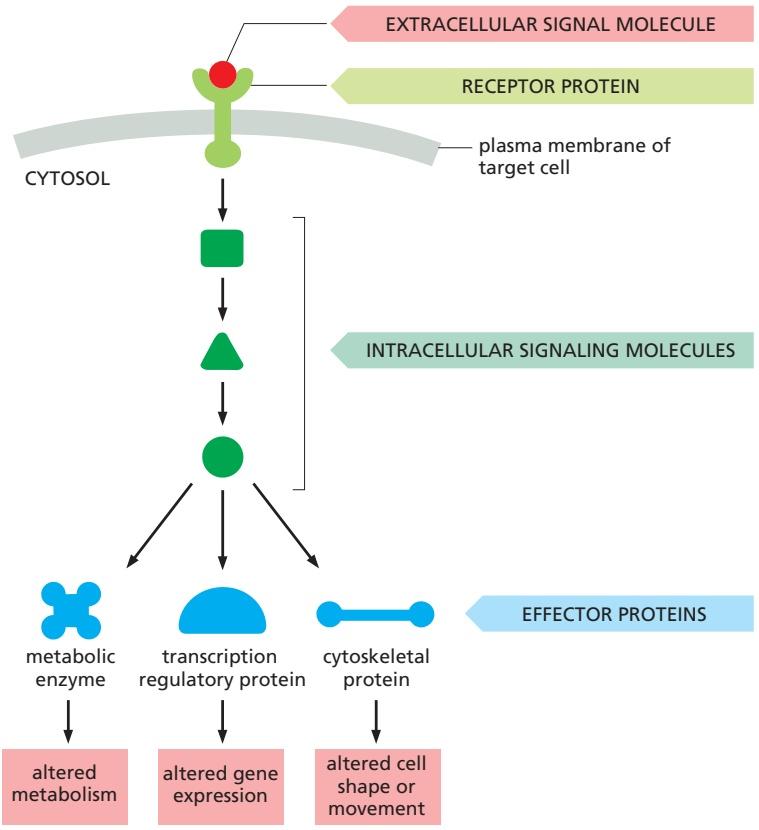

Figure 15–1 A simple intracellular signaling pathway activated by an extracellular signal molecule. The signal molecule usually binds to a receptor protein that is embedded in the plasma membrane of the target cell. The receptor activates one or more intracellular signaling pathways, involving a series of signaling proteins and small chemical messengers. Finally, one or more of the intracellular signaling molecules alters the activity of effector proteins and thereby the behavior of the cell.

Communication between cells in multicellular organisms is mediated mainly by **extracellular signal molecules**. Some of these operate over long distances, signaling to cells far away; others signal only to immediate neighbors. Most cells in multicellular organisms both emit and receive signals. Reception of the signals depends on receptor proteins, usually (but not always) at the cell surface, which bind the signal molecule. The binding activates the receptor, which in turn activates one or more intracellular signaling pathways or systems. These systems depend on intracellular signaling proteins, which process the signal inside the receiving cell and distribute it to the appropriate intracellular targets. Some of these proteins produce small chemical messengers called second messengers, which carry the signal to other signaling proteins. The targets that lie at the end of signaling pathways are generally called effector proteins, which are altered in some way by the incoming signal and implement the appropriate change in cell behavior. Depending on the signal and the type and state of the receiving cell, these effectors can be transcription regulators, ion channels, components of a metabolic pathway, or parts of the cytoskeleton (**Figure 15–1**).

The fundamental features of cell signaling have been conserved throughout the evolution of the eukaryotes. In budding yeast, for example, the response to mating factor depends on cell-surface receptor proteins, intracellular GTP-binding proteins, and protein kinases that are clearly related to functionally similar proteins in animal cells. Through gene duplication and divergence, however, the signaling systems in animals have become much more elaborate than those in yeasts; the human genome, for example, contains more than 1500 genes that encode receptor proteins, and the number of different receptor proteins is further increased by alternative RNA splicing and post-translational modifications.

## Extracellular Signals Can Act Over Short or Long Distances

Many extracellular signal molecules remain bound to the surface of the signaling cell and influence only cells that contact it (**Figure 15–2A**). Such **contact-dependent signaling** is especially important during development and in immune responses.

---

PRINCIPLES OF CELL SIGNALING

875

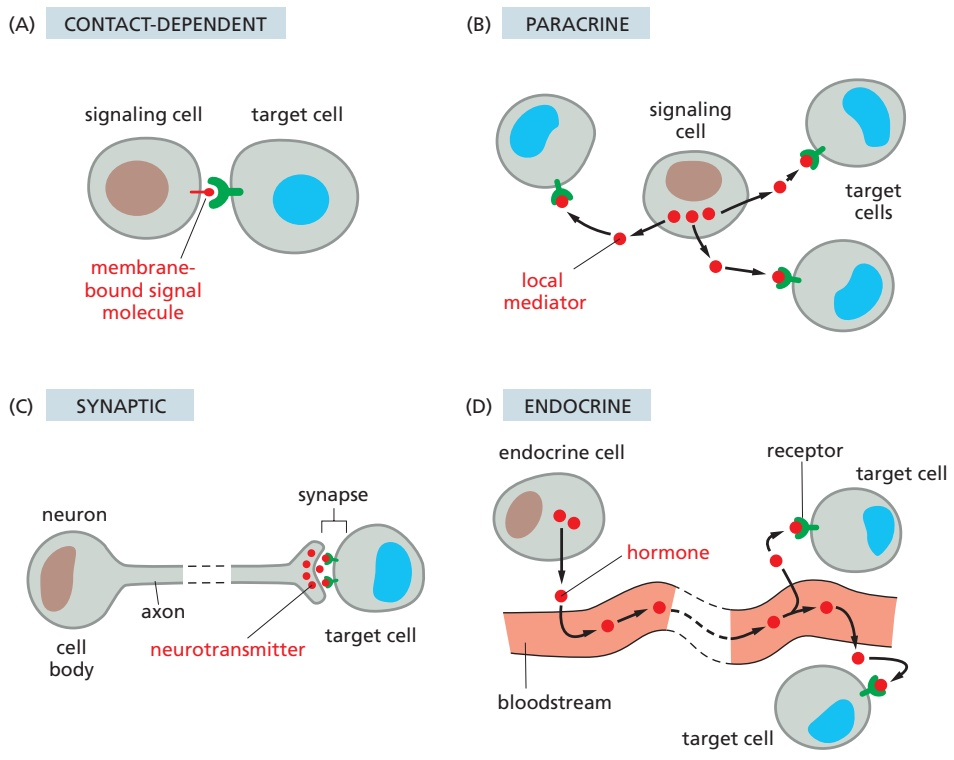

Figure 15–2 Four forms of intercellular signaling. (A) Contact-dependent signaling requires cells to be in direct membrane– membrane contact. (B) Paracrine signaling depends on local mediators that are released into the extracellular space and act on neighboring cells. (C) Synaptic signaling is performed by neurons that transmit signals electrically along their axons and release neurotransmitters at chemical synapses, which are often located far away from the neuronal cell body. (D) Endocrine signaling depends on endocrine cells, which secrete hormones into the bloodstream for distribution throughout the body. Many of the same types of signaling molecules are used in paracrine, synaptic, and endocrine signaling; the crucial differences lie in the speed and selectivity with which the signals are delivered to their targets.

Contact-dependent signaling during development can sometimes operate over relatively large distances if the communicating cells extend long, thin processes to make contact with one another.

In most cases, however, signaling cells secrete signal molecules into the extracellular fluid. Often, the secreted molecules are **local mediators**, which act only on cells in the local environment of the signaling cell. This is called **paracrine signaling** (**Figure 15–2B**). Usually, the signaling and target cells in paracrine signaling are of different cell types, but cells may also produce signals that they themselves respond to: this is referred to as autocrine signaling. Cancer cells, for example, often produce extracellular signals that stimulate their own survival and proliferation.

Large multicellular organisms like us also need long-range signaling mechanisms to coordinate the behavior of cells in remote parts of the body. Thus, they have evolved cell types specialized for intercellular communication over large distances. The most sophisticated of these are nerve cells, or neurons, which typically extend long, branching processes (axons) that enable them to contact target cells far away, where the processes terminate at the specialized sites of signal transmission known as chemical synapses. When a neuron is activated by stimuli from other nerve cells, it sends electrical impulses (action potentials) rapidly along its axon; when the impulse reaches the synapse at the end of the axon, it triggers secretion of a chemical signal that acts as a **neurotransmitter**. The tightly organized structure of the synapse ensures that the neurotransmitter is delivered specifically to receptors on the postsynaptic target cell (**Figure 15–2C**). The details of this **synaptic signaling** process are discussed in Chapter 11.

A quite different strategy for signaling over long distances makes use of **endocrine cells**, which secrete their signal molecules, called **hormones**, into the bloodstream. The blood carries the molecules far and wide, allowing them to act on target cells that may lie almost anywhere in the body (**Figure 15–2D**).

## Extracellular Signal Molecules Bind to Specific Receptors

Cells in multicellular animals communicate by means of hundreds of kinds of extracellular signal molecules. These include proteins, small peptides, amino acids, nucleotides, steroids, retinoids, fatty acid derivatives, and even dissolved

---

876

Chapter 15: Cell Signaling

Figure 15–3 The binding of extracellular signal molecules to either cell-surface or intracellular receptors. (A) Most signal molecules are hydrophilic and are therefore unable to cross the target cell’s plasma membrane directly; instead, they bind to cell-surface receptors, which in turn generate signals inside the target cell (see Figure 15–1). (B) Some small signal molecules, by contrast, diffuse across the plasma membrane and bind to receptor proteins inside the target cell—either in the cytosol or in the nucleus (as shown here). Many of these small signal molecules are hydrophobic and poorly soluble in aqueous solutions; they are therefore transported in the bloodstream and other extracellular fluids bound to carrier proteins, from which they dissociate before entering the target cell.

gases such as nitric oxide and carbon monoxide. Most of these signal molecules are released into the extracellular space by exocytosis from the signaling cell, as discussed in Chapter 13. Some, however, are emitted by diffusion through the signaling cell’s plasma membrane, whereas others are displayed on the external surface of the cell and remain attached to it, signaling to target cells only upon contact. Transmembrane signal proteins may operate in this way, although in some cases their extracellular domains are released from the signaling cell’s surface by proteolytic cleavage and then act at a distance.

Regardless of the nature of the signal, the target cell responds by means of a **receptor**, which binds the signal molecule and then initiates a response in the target cell. The binding site of the receptor has a complex structure that is shaped to recognize the signal molecule with high specificity, helping to ensure that the receptor responds only to the appropriate signal and not to the many other signaling molecules the cell is exposed to. Many signal molecules act at very low concentrations $\mathrm { ( t y p i c a l l y \leq 1 0 ^ { - 8 }   M ) }$ , and their receptors usually bind them with high affinity (dissociation constant $K _ { \mathrm { d } } \leq 1 0 ^ { - 8 }   \mathrm { M } ;$ see Figure 3–42).

In most cases, receptors are transmembrane proteins on the target-cell surface. When these proteins bind an extracellular signal molecule (a ligand), they become activated and generate various intracellular signals that alter the behavior of the cell. In other cases, the receptor proteins are inside the target cell, and the signal molecule has to enter the cell to bind to them: this requires that the signal molecule be sufficiently small and hydrophobic to diffuse across the target cell’s plasma membrane (**Figure 15–3**). This chapter focuses primarily on signaling through cell-surface receptors, but we will briefly describe signaling through intracellular receptors later in the chapter.

## Each Cell Is Programmed to Respond to Specific Combinations of Extracellular Signals

A typical cell in a multicellular organism is exposed to hundreds of different signal molecules in its environment. The molecules can be soluble, bound to the extracellular matrix, or bound to the surface of a neighboring cell; they can be stimulatory or inhibitory; they can act in innumerable different combinations; and they can influence almost any aspect of cell behavior. The cell responds to this blizzard of signals selectively, in large part by expressing only those receptors and intracellular signaling systems that respond to the signals that are required for the regulation of that cell.

Most cells respond to many different signals in the environment, and some of these signals may influence the response to other signals. One of the key challenges in cell biology is to determine how a cell integrates all of this signaling information in order to make decisions—to divide, to move, to differentiate, and so on. Many cells, for example, require a specific combination of extracellular survival factors to allow the cell to continue living; when deprived of these signals, the cell activates a suicide program and kills itself—usually by apoptosis, as discussed in Chapter 18. Cell proliferation often depends on a combination of signals that promote both cell division and survival, as well as signals that stimulate cell growth (**Figure 15–4**). On the other hand, differentiation into a nondividing state (called terminal differentiation) frequently requires a different combination of survival and differentiation signals that must override any signal to divide.

---

PRINCIPLES OF CELL SIGNALING

877

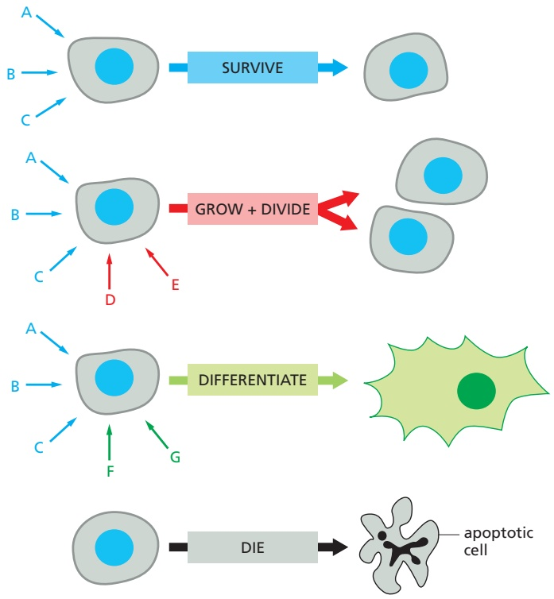

Figure 15–4 An animal cell’s dependence on multiple extracellular signal molecules. Each cell type displays a set of receptors that enables it to respond to a corresponding set of signal molecules produced by other cells. These signal molecules work in various combinations to regulate the behavior of the cell. As shown here, an individual cell often requires multiple signals to survive (blue arrows) and additional signals to grow and divide (red arrows) or differentiate (green arrows). If deprived of appropriate survival signals, a cell will undergo a form of cell suicide known as apoptosis. The actual situation is even more complex. Although not shown, some extracellular signal molecules act to inhibit these and other cell behaviors or even to induce apoptosis.

A signal molecule often has different effects on different types of target cells. The neurotransmitter acetylcholine (**Figure 15–5A**), for example, decreases the rate of action potential firing in heart pacemaker cells (**Figure 15–5B**) and stimulates the production of saliva by salivary gland cells (**Figure 15–5C**), even though the acetylcholine receptors are the same on both cell types. In skeletal muscle, acetylcholine causes the cells to contract by binding to a different type of acetylcholine receptor (**Figure 15–5D**). The different effects of acetylcholine in these cell types result from differences in the intracellular signaling proteins, effector proteins, and genes that are activated. Thus, an extracellular signal itself has little information content; it simply induces the cell to respond according to its pre-determined state, which depends on the cell’s developmental history and the specific genes it expresses.

(A) acetylcholine

(B) heart pacemaker cell

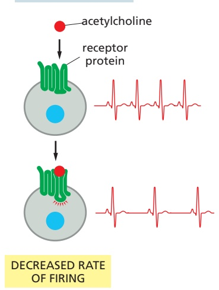

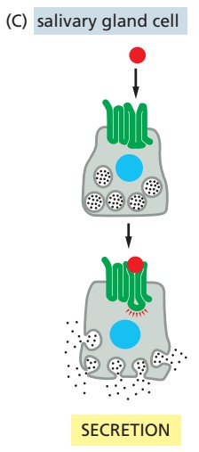

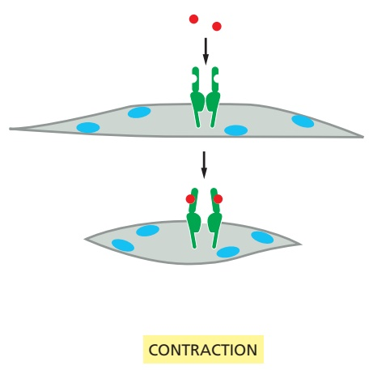

Figure 15–5 Various responses induced by the neurotransmitter acetylcholine. (A) The chemical structure of acetylcholine. (B–D) Different cell types are specialized to respond to acetylcholine in different ways. In some cases (B and C), acetylcholine binds to the same type of acetylcholine receptor (a G-protein-coupled receptor; see Figure 15–6), but the intracellular signals produced are interpreted differently in cells specialized for different functions. In other cases (D), the acetylcholine receptor protein is different (an ion-channel-coupled receptor; see Figure 15–6).

---

878

Chapter 15: Cell Signaling

## There Are Three Major Classes of Cell-Surface Receptor Proteins

Most extracellular signal molecules bind to specific receptor proteins on the surface of the target cells they influence and do not enter the cytosol or nucleus. These cell-surface receptors act as signal transducers by converting an extracellular ligand-binding event into intracellular signals that alter the behavior of the target cell.

Most cell-surface receptor proteins belong to one of three classes, defined by their transduction mechanism. Ion-channel-coupled receptors, also known as transmitter-gated ion channels or ionotropic receptors, are involved in rapid synaptic signaling between nerve cells and other electrically excitable target cells such as muscle cells (**Figure 15–6A**). This type of signaling is mediated by a small number of neurotransmitters that transiently open or close an ion channel formed by the protein to which they bind, briefly changing the ion permeability of the plasma membrane and thereby changing the excitability of the postsynaptic target cell. Most ion-channel-coupled receptors belong to a large family of homologous, multipass transmembrane proteins. Because they are discussed in detail in Chapter 11, we will not consider them further here.

G-protein-coupled receptors act by indirectly regulating the activity of a separate plasma-membrane-bound target protein, which is generally either an enzyme or an ion channel. A heterotrimeric GTP-binding protein (G protein) mediates the interaction between the activated receptor and this target protein (**Figure 15–6B**). The activation of the target protein can change the concentration of one or more small intracellular signaling molecules (if the target protein is an

Figure 15–6 Three classes of cellsurface receptors. (A) Ion-channelcoupled receptors (also called transmittergated ion channels), (B) G-protein-coupled receptors, and (C) enzyme-coupled receptors. Although many enzyme-coupled receptors have intrinsic enzymatic activity, as shown on the left in C, many others rely on associated enzymes, as shown on the right in C. Ligands activate many enzymecoupled receptors by promoting their dimerization, which results in the interaction and activation of the cytoplasmic domains.

---

PRINCIPLES OF CELL SIGNALING

879

enzyme) or it can change the ion permeability of the plasma membrane (if the target protein is an ion channel). The small intracellular signaling molecules act in turn to alter the behavior of yet other signaling proteins in the cell.

Enzyme-coupled receptors either function as enzymes or associate directly with enzymes that they activate (**Figure 15–6C**). They are usually single-pass transmembrane proteins that have their ligand-binding site outside the cell and their catalytic or enzyme-binding site inside. Enzyme-coupled receptors are heterogeneous in structure compared with the other two classes; the great majority, however, are either protein kinases or associate with protein kinases, which phosphorylate specific sets of proteins in the target cell when activated.

There are also some types of cell-surface receptors that do not fit easily into any of these classes but have important functions in controlling the specialization of different cell types during development and in tissue renewal and repair in adults. We discuss these in a later section, after we explain how G-proteincoupled receptors and enzyme-coupled receptors operate. First, we continue our general discussion of the principles of signaling via cell-surface receptors.

## Cell-Surface Receptors Relay Signals Via Intracellular Signaling Molecules

Numerous intracellular signaling molecules relay signals received by cell-surface receptors into the cell interior. The resulting chain of intracellular signaling events ultimately alters effector proteins that are responsible for modifying the behavior of the cell (see Figure 15–1).

Some intracellular signaling molecules are small chemicals, which are often called **second messengers** (the “first messengers” being the extracellular signals). They are generated in large amounts in response to receptor activation and diffuse away from their source, spreading the signal to other parts of the cell. Some, such as cyclic AMP and $C a ^ { 2 + }$ , are water soluble and diffuse in the cytosol, while others, such as diacylglycerol, are lipid soluble and diffuse in the plane of the plasma membrane. In either case, they pass the signal on by binding to and altering the behavior of selected signaling or effector proteins.

Most intracellular signaling molecules are proteins, which help relay the signal into the cell by either generating second messengers or activating the next signaling or effector protein in the pathway. Many of these proteins behave like molecular switches. When they receive a signal, they switch from an inactive to an active state, until another process switches them off, returning them to their inactive state. The switching off can be just as important as the switching on. If a signaling pathway is to recover after transmitting a signal so that it can be ready to transmit another, every activated molecule in the pathway must return to its original, unactivated state.

The largest class of molecular switches consists of proteins that are activated or inactivated by **phosphorylation** (discussed in Chapter 3). For these proteins, the switch is thrown in one direction by a **protein kinase**, which covalently adds one or more phosphate groups to specific amino acids on the signaling protein, and in the other direction by a **protein phosphatase**, which removes the phosphate groups (**Figure 15–7A**). The activity of any protein regulated by phosphorylation depends on the balance between the activities of the kinases that phosphorylate it and of the phosphatases that dephosphorylate it. About 30–50% of human proteins contain covalently attached phosphate, and the human genome encodes about 520 protein kinases and about 150 protein phosphatases. A typical mammalian cell makes use of hundreds of distinct types of protein kinases at any moment.

Protein kinases attach phosphate to the hydroxyl group of specific amino acids on the target protein. There are two main types of protein kinase in eukaryotic cells. The great majority are **serine/threonine kinases**, which phosphorylate the hydroxyl groups of serines and threonines in their targets. Others are **tyrosine kinases**, which phosphorylate proteins on tyrosines. Tyrosine kinases are found

---

880

Chapter 15: Cell Signaling

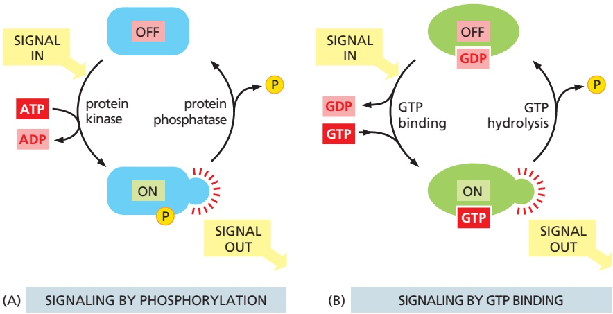

Figure 15–7 Two types of intracellular signaling proteins that act as molecular switches. (A) A protein kinase covalently adds a phosphate from ATP to the signaling protein, and a protein phosphatase removes the phosphate. Although not shown, many signaling proteins are activated by dephosphorylation rather than by phosphorylation. (B) A GTP-binding protein is induced to exchange its bound GDP for GTP, which activates the protein; the protein then inactivates itself by hydrolyzing its bound GTP to GDP.

primarily in multicellular animals; these kinases are not present, for example, in yeast.

Many intracellular signaling proteins controlled by phosphorylation are themselves protein kinases, and these are often organized into **kinase cascades**. In such a cascade, one protein kinase, activated by phosphorylation, phosphorylates the next protein kinase in the sequence, and so on, relaying the signal onward and, in. / . some cases, amplifying it or spreading it to other signaling pathways.

Like the protein kinases, the protein phosphatases are categorized by their specificity for serine/threonine phosphate or tyrosine phosphate. There are about 100 **protein tyrosine phosphatases** encoded in the human genome, including some dual-specificity phosphatases that also dephosphorylate serines and threonines.

The other important class of molecular switches consists of **GTP-binding proteins** (discussed in Chapter 3). These proteins switch between two distinct structural conformations: an “on” state when GTP is bound and an “off” state when GDP is bound. In the “on” state, they bind and thereby activate specific signaling proteins. GTP-binding proteins usually have intrinsic GTPase activity and shut themselves off by hydrolyzing their bound GTP to GDP (**Figure 15–7B**). The inactive protein then returns to the “on” state when GDP dissociates, allowing a new GTP to bind. There are two major types of GTP-binding proteins. Large, heterotrimeric GTP-binding proteins (also called G proteins) help relay signals from G-protein-coupled receptors that activate them (see Figure 15–6B). Small **monomeric GTPases** (also called monomeric GTP-binding proteins) help relay signals from many classes of cell-surface receptors.

For most GTP-binding proteins, the inactivation process (GTP hydrolysis to GDP) and the activation process (GDP dissociation) are slow in the absence of other proteins. Inside the cell, regulatory proteins are used to accelerate one or the other process, thereby governing the activation state of the GTP-binding protein. **GTPase-activating proteins (GAPs)** drive the proteins into an “off” state by increasing the rate of hydrolysis of bound GTP. Conversely, **guanine nucleotide exchange factors (GEFs)** activate GTP-binding proteins by promoting the release of bound GDP, which allows a new GTP to bind. In the case of heterotrimeric G proteins, the activated receptor serves as the GEF. **Figure 15–8** illustrates the regulation of monomeric GTPases.

Not all molecular switches in signaling systems depend on phosphorylation or GTP binding. We see later that some signaling proteins are switched on or off by the binding of another signaling protein or a second messenger, such as cyclic AMP or Ca2+, or by covalent modifications other than phosphorylation or dephosphorylation, such as ubiquitylation (discussed in Chapter 3).

For simplicity, we often portray a signaling pathway as a series of activation steps (see Figure 15–1). It is important to note, however, that most signaling pathways contain inhibitory steps, and a sequence of two inhibitory steps can

Figure 15–8 The regulation of a monomeric GTPase. GTPase-activating proteins (GAPs) inactivate the protein by stimulating it to hydrolyze its bound GTP to GDP, which remains tightly bound to the inactivated GTPase. Guanine nucleotide exchange factors (GEFs) activate the inactive protein by stimulating it to release. / . its GDP; because the concentration of GTP in the cytosol is 10 times greater than the concentration of GDP, the protein rapidly binds GTP and is thereby activated.

---

PRINCIPLES OF CELL SIGNALING

881

Figure 15–9 A sequence of two inhibitory signals produces a positive signal. (A) In this simple signaling system, a transcription regulator is kept in an inactive state by a bound inhibitor protein. In response to some upstream signal, a protein kinase is activated and phosphorylates the inhibitor, causing its dissociation from the transcription regulator, which can now activate gene expression. (B) The signaling pathway consists of a sequence of four steps, including two sequential inhibitory steps that are equivalent to a single activating step.

have the same effect as one activating step (Figure 15–9). This activation scheme is very common in signaling systems, as we will see when we describe specific pathways later in this chapter.

## Intracellular Signals Must Be Specific and Robust in a Noisy Cytoplasm

In an idealized signaling pathway like that shown in Figure 15–1, each intracellular signaling molecule interacts only with the appropriate downstream target. Similarly, the target is activated only by the appropriate upstream signal. In reality, however, the cell is crowded with closely related signaling molecules that control a diverse array of cellular processes. It is inevitable that a signaling molecule will sometimes interact with molecules in other signaling pathways, potentially creating unwanted cross-talk and interference between signaling systems. How does a signal remain strong and specific under these noisy conditions?

A key to signaling specificity is the high affinity and specificity of the interactions between intracellular signaling molecules and their correct partners. The binding of a signaling molecule to its target is determined by precise and complex interactions between complementary surfaces on the two molecules. Some protein kinases, for example, contain active sites that recognize a specific amino acid sequence around the phosphorylation site on the correct target protein, and many signaling enzymes employ additional docking sites, outside their active site, that promote a specific, high-affinity interaction with a complementary site on the target. These and related mechanisms provide a strong and persistent interaction between the correct partners, thereby enhancing the likelihood that a signal is passed to the appropriate target.

The specificity of signaling systems also depends on noise filters that reduce or remove undesirable background signals. Consider a signaling pathway, for example, in which a response is triggered by phosphorylation of several sites on a target protein. Inside the cell, we can generally assume that a constant low level of phosphatase activity is present to remove these phosphorylations. As a result, a strong response is possible only if the appropriate protein kinase reaches a high and persistent level of activity that is sufficient to overcome the opposing phosphatase activity. If by some random accident another protein kinase interacts briefly with the target protein and catalyzes phosphorylation on one or two sites, these will be removed by the opposing phosphatase and no response will occur. The weak background signal is thereby ignored.

Cells in a population often exhibit random variations in the concentration or activity of their intracellular signaling molecules. Similarly, individual molecules in a large population of molecules vary in their activity or interactions with other molecules. This signal variability introduces another form of noise that can interfere with the precision and efficiency of signaling. Most signaling systems, however, generate remarkably robust and precise responses even when upstream signals are variable or some components of the system are disabled. In some cases, this robustness depends on the presence of parallel mechanisms; for example, a signal might employ two parallel pathways to activate a single common downstream target protein, allowing the response to occur even if one pathway is crippled.

---

882

Chapter 15: Cell Signaling

## Intracellular Signaling Complexes Form at Activated Cell-Surface Receptors

One simple and effective strategy for enhancing the specificity of interactions between intracellular signaling molecules and reducing background noise is to localize the molecules in the same part of the cell, often within large protein complexes, thereby promoting their interaction with one another and not with inappropriate partners. Such mechanisms often involve **scaffold proteins**, which bring together groups of interacting signaling proteins into signaling complexes, often before a signal has been received (**Figure 15–10A**). Because the

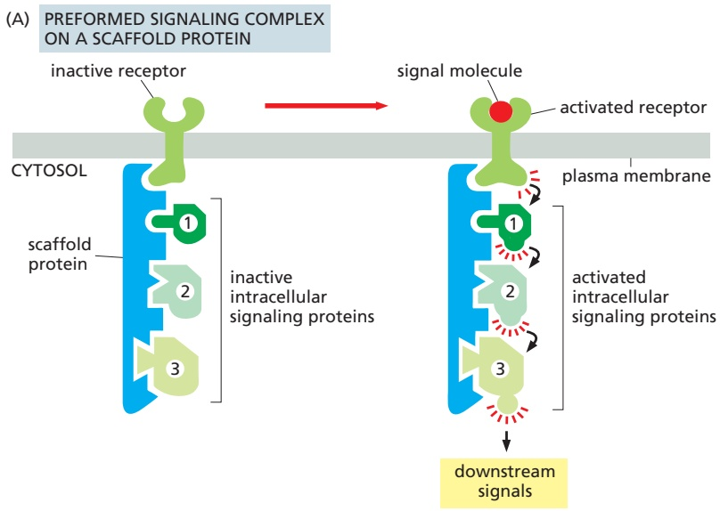

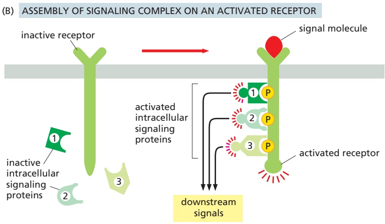

Figure 15–10 Three types of intracellular signaling complexes. (A) A receptor and some of the intracellular signaling proteins it activates in sequence are preassembled into a signaling complex on the inactive receptor by a large scaffold protein. (B) A signaling complex assembles transiently on a receptor only after the binding of an extracellular signal molecule has activated the receptor; here, the activated receptor phosphorylates itself at multiple sites, which then act as docking sites for intracellular signaling proteins. (C) Activation of a receptor leads to the increased phosphorylation of specific phospholipids (phosphoinositides) in the adjacent plasma membrane; these then serve as docking sites for specific intracellular signaling proteins, which can now interact with each other.

---

PRINCIPLES OF CELL SIGNALING

883

scaffold holds the proteins in close proximity, they can interact at high local concentrations and be activated rapidly, efficiently, and selectively in response to an appropriate extracellular signal, avoiding unwanted cross-talk with other signaling pathways.

In other cases, such signaling complexes form transiently in response to an extracellular signal and rapidly disassemble when the signal is gone. They often assemble around a cell-surface receptor after an extracellular signal molecule has activated it. In many of these cases, the cytoplasmic tail of an activated enzyme-coupled receptor is phosphorylated during the activation process, and the phosphorylated amino acids then serve as docking sites for the assembly of other signaling proteins (**Figure 15–10B**). In yet other cases, receptor activation leads to the production of modified phospholipid molecules (called phosphoinositides) in the adjacent plasma membrane, which then recruit specific intracellular signaling proteins to this region of membrane, where they are activated (**Figure 15–10C**).

## Modular Interaction Domains Mediate Interactions Between Intracellular Signaling Proteins

Simply bringing intracellular signaling proteins together into close proximity is sometimes sufficient to activate them. Thus, induced proximity, where a signal triggers assembly of a signaling complex, is commonly used to relay signals from protein to protein along a signaling pathway. The assembly of such signaling complexes depends on various highly conserved, small **interaction domains**, which are found in many intracellular signaling proteins. Each of these compact protein modules binds to a particular structural motif in another protein or lipid. The recognized motif in the interacting protein can be a short peptide sequence, a covalent modification (such as a phosphorylated amino acid), or another protein domain. The use of modular interaction domains pre-sumably facilitated the evolution of new signaling pathways. Because it can be inserted at many locations in a protein without disturbing the protein’s folding or function, a new interaction domain can connect the protein to additional signaling pathways.

There are many types of interaction domains in signaling proteins. Src homology 2 (SH2) domains and phosphotyrosine-binding (PTB) domains, for example, bind to phosphorylated tyrosines in a particular peptide sequence on activated receptors or intracellular signaling proteins. Src homology 3 (SH3) domains bind to short, proline-rich amino acid sequences. Some pleckstrin homology (PH) domains bind to the charged head groups of specific phosphoinositides that are produced in the plasma membrane in response to an extracellular signal; they enable the protein they are part of to dock on the membrane and interact with other similarly recruited signaling proteins (see Figure 15–10C). Some signaling proteins consist solely of two or more interaction domains and function only as **adaptors** to link two other proteins together in a signaling pathway. Some adaptor proteins have multiple interaction domains as well as their own signal-propagation activity (see Figure 15–12).

Interaction domains enable signaling proteins to bind to one another in multiple specific combinations. Like Lego bricks, the proteins can form linear or branching chains or three-dimensional networks, which determine the route followed by the signaling pathway. As an example, **Figure 15–11** illustrates how some interaction domains mediate the formation of a large signaling complex around the receptor for the hormone insulin.

Modular interaction domains are generally located in flexible, unstructured regions of signaling proteins, arrayed along the polypeptide-like beads on a string. Proteins with multiple interaction domains can therefore nucleate the formation of large, cross-linked protein matrices around clusters of activated receptors (**Figure 15–12**). These protein matrices behave like gels or biomolecular condensates, thereby creating a local microenvironment that is distinct in composition from the surrounding cytosol (discussed in Chapter 3).

---

884

Chapter 15: Cell Signaling

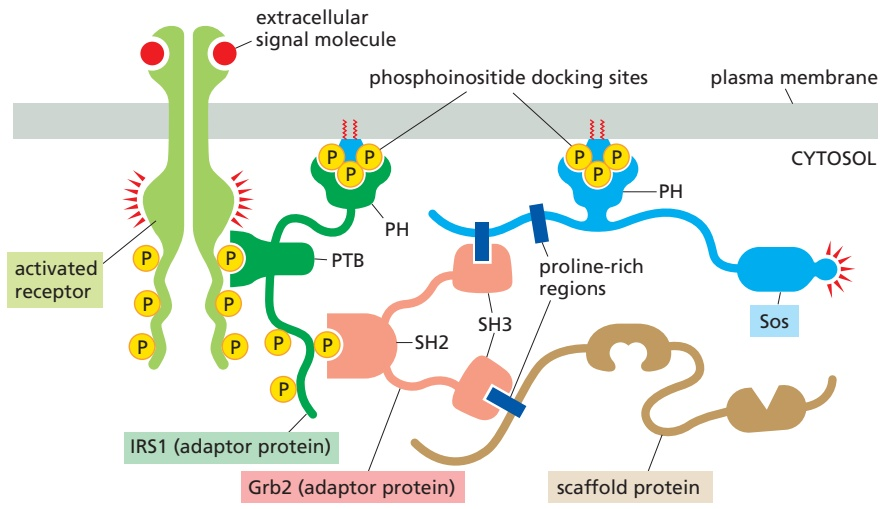

Concentration of activated receptors and specific signaling proteins in these matrices is thought to enhance the strength and specificity of the receptor signal while reducing interference from other pathways.

Another way of bringing receptors and intracellular signaling proteins togetherMBoC7 n15.100/15.11 is to locate them in a specific region of the cell. An important example is the primary cilium that projects like an antenna from the surface of most vertebrate cells (discussed in Chapter 16). A number of surface receptors and signaling proteins are concentrated there—particularly the components of the Hedgehog signaling system, as we discuss later. Light and smell receptors are also concentrated in specialized cilia.

Figure 15–11 A specific signaling complex formed using modular interaction domains. This example is based on the insulin receptor, which is a dimeric enzyme-coupled receptor (a receptor tyrosine kinase, discussed later). First, the activated receptor phosphorylates itself on tyrosines, and one of the phosphotyrosines then recruits an adaptor protein called insulin receptor substrate-1 (IRS1) via a PTB domain of IRS1; the PH domain of IRS1 also binds to specific phosphoinositides on the inner surface of the plasma membrane. Then, the activated receptor phosphorylates IRS1 on tyrosines, and one of these phosphotyrosines binds the SH2 domain of the adaptor protein Grb2. Next, Grb2 uses one of its two SH3 domains to bind to a proline-rich region of a protein called Sos, which is thereby brought to the membrane to relay the signal downstream by acting as a GEF (see Figure 15–8) to activate a monomeric GTPase called Ras (not shown). Sos also binds to phosphoinositides in the plasma membrane via its PH domain. Grb2 uses its other SH3 domain to bind to a proline-rich sequence in a scaffold protein, which binds several other signaling proteins (not shown). The other phosphorylated tyrosines on IRS1 recruit additional signaling proteins that have SH2 domains (not shown).

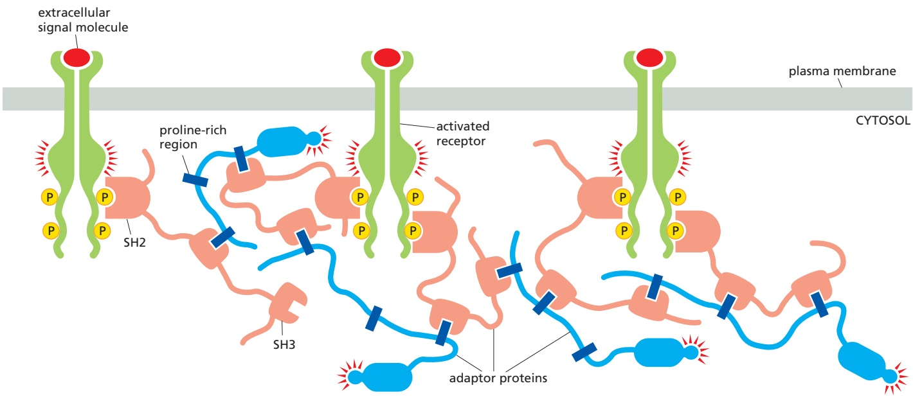

Figure 15–12 Formation of large receptor clusters by multivalent interactions among signaling proteins. The system pictured here contains activated receptor tyrosine kinases that are extensively phosphorylated on disordered regions in the receptor tails. The system also includes two adaptor proteins. One adaptor protein (pink) contains one SH2 domain, which binds phosphorylated tyrosines on the receptors, and two SH3 domains. The other adaptor protein (blue) contains three proline-rich regions that can bind to SH3 domains, plus a protein kinase domain. Numerous multivalent binding interactions can occur among the three components in this system, generating a cross-linked protein matrix or condensate in which the protein kinases of the receptor and adaptor protein are concentrated, potentially providing a more effective signal output. The cross-linking of the matrix can be enhanced further by including adaptor proteins with domains that interact with modified phospholipids in the membrane (see Figure 15–11).