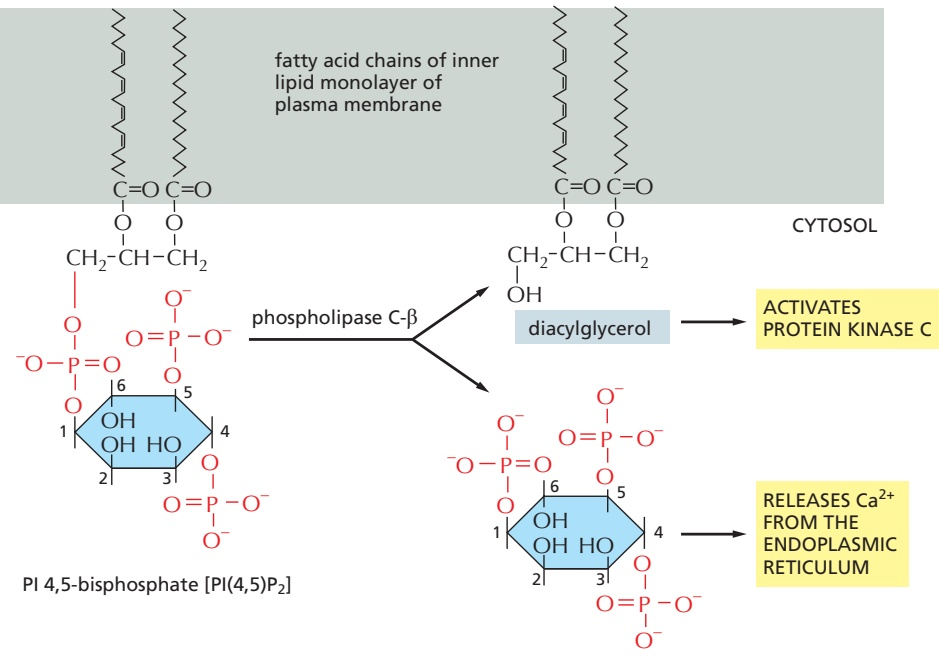
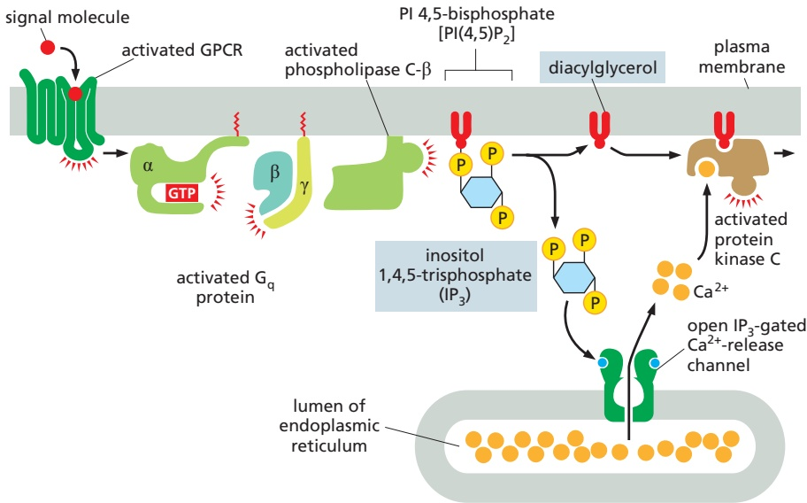
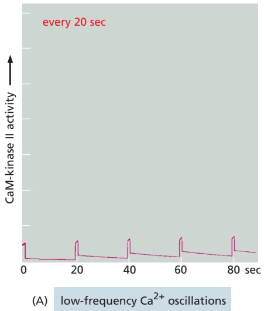
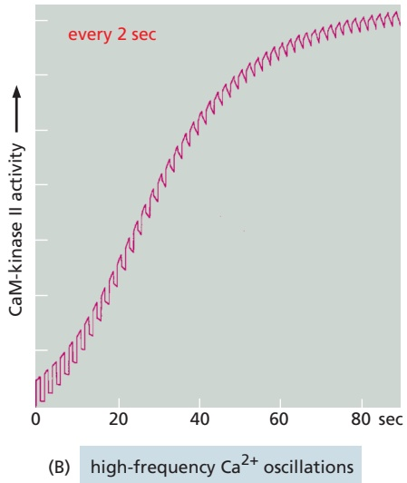
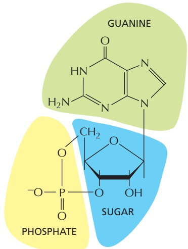
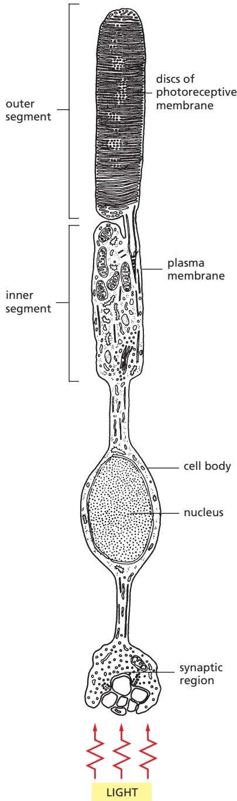
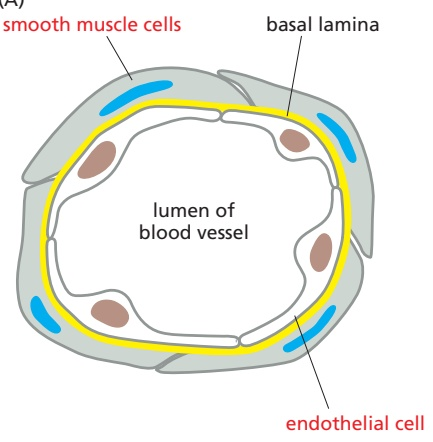

for example, binds both PKA and a phosphodiesterase that hydrolyzes cAMP. In unstimulated cells, the phosphodiesterase keeps the local cAMP concentration low, so that the bound PKA is inactive; in stimulated cells, cAMP concentration rapidly rises, overwhelming the phosphodiesterase and activating the PKA. Among the target proteins that PKA phosphorylates and activates in these cells is the adjacent phosphodiesterase, which rapidly lowers the cAMP concentration again. This negative feedback arrangement converts what might otherwise be a prolonged PKA response into a brief, local pulse of PKA activity.

Whereas some responses mediated by cAMP occur within seconds (see Figure 15–25), others depend on changes in the transcription of specific genes and take hours to develop fully. In cells that secrete the peptide hormone somatostatin, for example, cAMP activates the gene that encodes this hormone. The regulatory region of the somatostatin gene contains a short cis-regulatory sequence, called the cyclic AMP response element (CRE), which is also found in the regulatory region of many other genes activated by cAMP. A specific transcription regulator called **CRE-binding (CREB) protein** recognizes this sequence. When PKA is activated by cAMP, it phosphorylates CREB on a single serine; phosphorylated CREB then recruits a transcription coactivator called CREB-binding protein (CBP), which stimulates the transcription of the target genes (**Figure 15–28**). Thus, CREB can transform a short cAMP signal into a long-term change in a cell, a process that, in the brain, is thought to play an important part in some forms of learning and memory.

Figure 15–28 How a rise in intracellular cyclic AMP concentration can alter gene transcription. The binding of an extracellular signal molecule to its GPCR activates adenylyl cyclase via $\mathbb { G } _ { \mathrm { S } }$ and thereby increases cAMP concentration in the cytosol. This rise activates PKA, and the released catalytic subunits of PKA can then enter the nucleus, where they phosphorylate the transcription regulatory protein CREB. Once phosphorylated, CREB recruits the coactivator CBP, which stimulates gene transcription. In some cases, the inactive CREB protein is bound to the cyclic AMP response element (CRE) in DNA before it is phosphorylated (not shown). See Movie 15.2.

<table><tbody><tr><td colspan="3">TABLE 15-2 Some Cell Responses in Which GPCRs Activate PLCβ</td></tr><tr><td>Target tissue</td><td>Signal molecule</td><td>Major response</td></tr><tr><td>Liver</td><td>Vasopressin</td><td>Glycogen breakdown</td></tr><tr><td>Pancreas</td><td>Acetylcholine</td><td>Amylase secretion</td></tr><tr><td>Smooth muscle</td><td>Acetylcholine</td><td>Muscle contraction</td></tr><tr><td>Blood platelets</td><td>Thrombin</td><td>Platelet aggregation</td></tr></tbody></table>

## Some G Proteins Signal Via Phospholipids

Many GPCRs exert their effects through G proteins that activate the plasmamembrane-bound enzyme **phospholipase C-b (PLCb)**. **Table** $1 5 { - } 2$ lists some examples of responses activated in this way. The phospholipase acts on a phosphorylated inositol phospholipid (a phosphoinositide) called **phosphatidylinositol 4,5-bisphosphate [PI(4,5)P**<strong>2</strong>**]**, which is present in small amounts in the inner half of the plasma membrane lipid bilayer (**Figure 15–29**). Receptors that activate this **inositol phospholipid signaling pathway** do so primarily through a G protein called $\mathbf { G } _ { \mathbf { q } } ,$ which activates phospholipase $C - \beta$ in much the same way that $\mathbf { G } _ { \mathrm { s } }$ activates adenylyl cyclase. The activated phospholipase then cleaves the $\mathrm { P I ( 4 , } 5 \mathrm { ) P _ { 2 } }$ to generate two products: **inositol** 1,4,5-trisphosphate $( \mathbf { I P _ { 3 } } )$ and **diacylglycerol**. At this step, the signaling pathway splits into two branches.

$\mathrm { I P _ { 3 } }$ is a water-soluble molecule that leaves the plasma membrane and diffuses through the cytosol to the endoplasmic reticulum (ER), where it binds $\mathbf { I P _ { 3 } }$ receptors in the ER membrane. The $\mathrm { I P } _ { 3 }$ receptor is a large transmembrane $\mathrm { C a ^ { 2 + } }$ channel that is closed in the absence of $\mathrm { I P _ { 3 } , I P _ { 3 } }$ binding triggers a conformational change that exposes a high-affinity $\mathrm { C a ^ { 2 + } }$ **-**binding site. Although the cytosolic $\mathrm { C a ^ { 2 + } }$ concentration in the unstimulated cell is low $( { \sim } 1 0 ^ { - 7 } \mathrm { ~ M } ) _ { , }$ , it is sufficient to promote $\mathrm { C a ^ { 2 + } }$ binding to some $\mathrm { I P _ { 3 } }$ receptors. The simultaneous binding of $\mathrm { I P _ { 3 } }$ and $\mathrm { C a ^ { 2 + } }$ to an $\mathrm { I P _ { 3 } }$ receptor opens the recep**tor** $\mathrm { C a ^ { 2 + } }$ channel. $\mathrm { C a ^ { 2 + } }$ stored in the ER is released and binds to other $\mathrm { I P _ { 3 } }$ -bound receptors to cause widespread channel opening. As

inositol 1,4,5-trisphosphate (IP3)

Figure 15–29 The hydrolysis of PI(4,5)P2 by phospholipase C-b. Two second messengers are produced directly from the hydrolysis of PI(4,5)P2: inositol $^ { 1 , 4 }$ ,5-trisphosphate (IP3), which diffuses through the cytosol and releases $\mathrm { C a ^ { 2 + } }$ from the endoplasmic reticulum, and diacylglycerol, which remains in the membrane and helps to activate protein kinase C (PKC; see Figure 15–30). There are several classes of phospholipase C: these include the β class, which is activated by GPCRs; as we see later, the γ class is activated by a class of enzymecoupled receptors called receptor tyrosine kinases (RTKs).

a result, the concentration of cytosolic $\mathrm { C a ^ { 2 + } }$ rises 10- to 20-fold (**Figure 15–30**). The increase in cytosolic $\mathrm { C a ^ { 2 + } }$ propagates the signal by influencing the activity of $\mathrm { C a ^ { 2 + } }$ -sensitive intracellular proteins, as we describe shortly.

At the same time that the $\mathrm { I P _ { 3 } }$ produced by the hydrolysis of $\mathrm { P I ( 4 , } 5 \mathrm { ) P _ { 2 } }$ is increasing the concentration of $\mathrm { C a ^ { 2 + } }$ in the cytosol, the other cleavage product of the $\mathrm { P I } ( 4 , 5 ) \mathrm { P _ { 2 } } ,$ diacylglycerol, is exerting different effects. It also acts as a second messenger, but it remains embedded in the plasma membrane, where it has several potential signaling roles. One of its major functions is to activate a proteinMBoC7 m15.29/15.30 kinase called protein kinase C (PKC), so named because it is $\mathrm { C a ^ { 2 + } }$ -dependent. The initial rise in cytosolic $\mathrm { C a ^ { 2 + } }$ induced by $\mathrm { I P _ { 3 } }$ alters the PKC so that it translocates from the cytosol to the cytoplasmic face of the plasma membrane. There it is activated by the combination of $\mathbf { \bar { C } } \mathbf { a } ^ { 2 + }$ , diacylglycerol, and the negatively charged membrane phospholipid phosphatidylserine (see Figure 15–30). Once activated, PKC phosphorylates target proteins that vary depending on the cell type. The principles are the same as discussed earlier for PKA, although most of the target proteins are different.

Diacylglycerol can be further cleaved to release arachidonic acid, which can either act as a signal in its own right or be used in the synthesis of other small lipid signal molecules called eicosanoids. Most vertebrate cell types make eicosanoids, including prostaglandins, which have many biological activities. They participate in pain and inflammatory responses, for example, and many anti-inflammatory drugs (such as aspirin, ibuprofen, and cortisone) act in part by inhibiting their synthesis.

## $\mathbb { C } \mathbb { a } ^ { 2 + }$ Functions as a Ubiquitous Intracellular Mediator

Many extracellular signals, and not just those that work via $\mathrm { G }$ proteins, trigger an increase in cytosolic $\mathbf { \tilde { C } } \mathbf { a } ^ { 2 + }$ concentration. In muscle cells, $\mathrm { C a ^ { \hat { 2 + } } }$ triggers contraction, and in many secretory cells, including nerve cells, it triggers secretion. $\mathrm { C a ^ { 2 + } }$ has numerous other functions in a variety of cell types. $\mathrm { C a ^ { 2 ^ { + } } }$ is such an effective signaling mediator because its concentration in the cytosol is normally very low $( \bar { \sim } 1 0 ^ { - 7 }   \mathrm { \bar { M } } )$ , whereas its concentration in the extracellular fluid $( { \sim } 1 0 ^ { - 3 }   \mathrm { M } )$ and in the lumen of the ER [and sarcoplasmic reticulum (SR) in muscle] is high. Thus, there is a large gradient tending to drive $\mathrm { C a ^ { 2 + } }$ into the cytosol across both the plasma membrane and the ER or SR membrane. When a signal transiently opens $\bar { \mathrm { C a } } ^ { 2 + }$ channels in these membranes, $\mathrm { C a ^ { 2 + } }$ rushes into the cytosol, and the resulting increase in the local $\mathrm { C a ^ { 2 + } }$ concentration activates $\mathrm { C a ^ { 2 + } }$ -responsive proteins in the cell.

Some stimuli, including membrane depolarization, membrane stretch, and certain extracellular signals, activate $\mathrm { C a ^ { 2 + } }$ channels in the plasma membrane, resulting in $\mathrm { C a ^ { 2 + } }$ influx from outside the cell. Other signals, including the GPCR-mediated

Figure 15–30 How GPCRs increase cytosolic $\mathbf { C a } ^ { 2 + }$ and activate protein kinase C. The activated GPCR stimulates the plasma-membrane-bound phospholipase C-β (PLCβ) via a G protein called $\mathbb { G } _ { \mathbb { Q } } .$ The α subunit and βγ complex of $\mathsf { G } _ { \mathsf { Q } }$ are both involved in this activation. Two second messengers are produced when $\mathsf { P } | ( 4 { , } 5 ) \mathsf { P } _ { 2 }$ is hydrolyzed by activated PLC. Inositol 1,4,5-trisphosphate (IP3) diffuses through the cytosol and releases $\mathrm { C a ^ { 2 + } }$ from the ER by binding to and opening IP3-gated $\dot { \mathrm { C a } } ^ { 2 - }$ -release channels $\mathbb { ( P _ { 3 } }$ receptors) in the ER membrane (opening of these channels also requires binding of $\mathrm { C a ^ { 2 + } }$ , not shown). The large electrochemical gradient for $\mathrm { C a ^ { 2 + } }$ across this membrane causes $\mathrm { C a ^ { 2 + } }$ to escape into the cytosol when the release channels are opened. Diacylglycerol remains in the plasma membrane and, together with phosphatidylserine (not shown) and $\mathsf { C a } ^ { 2 + }$ helps to activate protein kinase $$\textsf { C } ( \mathsf { P K C } ) ,$$ which is recruited from the cytosol to the cytosolic face of the plasma membrane. Of the 10 or more distinct isoforms of PKC in humans, at least 4 are activated by diacylglycerol (Movie 15.3).

signals described earlier, act primarily through $\mathrm { I P _ { 3 } }$ receptors to stimulate $\mathrm { C a ^ { 2 + } }$ release from intracellular stores in the ER (see Figure 15–30). The ER membrane also contains a second type of regulated $\mathrm { C a ^ { \vec { 2 + } } }$ channel called the ryanodine recep**tor** (so called because it is sensitive to the plant alkaloid ryanodine), which opens in response to rising $\mathrm { C a ^ { 2 + } }$ levels and thereby amplifies the $\mathrm { C a ^ { 2 + } }$ signal.

Several mechanisms rapidly terminate the $\bar { \mathrm { C a } } ^ { 2 + }$ signal and are also responsible for keeping the concentration of $\mathrm { C a ^ { 2 + } }$ in the cytosol low in resting cells. Most important, there are $\mathrm { C a ^ { 2 + } }$ -pumps in the plasma membrane and the ER membrane that use the energy of ATP hydrolysis to pump $\mathrm { C a ^ { 2 + } }$ out of the cytosol. Cells such as muscle and nerve cells, which make extensive use of $\mathrm { C a ^ { 2 + } }$ signaling, have an additional $\mathrm { C a ^ { 2 + } }$ transporter (an $\mathrm { N a } ^ { + }$ -driven $\mathrm { C a ^ { 2 + } }$ exchanger) in their plasma membrane that couples the efflux of $\mathrm { C a ^ { 2 + } }$ to the influx of $\mathrm { { N a } ^ { + } }$

## Feedback Generates $\mathbb { C } \mathbb { a } ^ { 2 + }$ Waves and Oscillations

The $\mathrm { I P _ { 3 } }$ receptors and ryanodine receptors of the ER membrane have an important feature: they are both stimulated by low to moderate cytoplasmic $\mathrm { C a ^ { 2 + } }$ concentrations. This $C a ^ { 2 + }$ -induced calcium release (CICR) results in positive feedback, which has a major impact on the properties of the $\mathrm { C a ^ { 2 + } }$ signal. The importance of this feedback is seen clearly in studies with $\mathrm { C a ^ { 2 + } }$ -sensitive fluorescent indicators, such as aequorin or fura-2, which allow researchers to monitor cytosolic $\mathrm { C a ^ { 2 + } }$ in individual cells under a microscope (**Figure 15–31** and **Movie 15.4**).

When cells carrying a $\mathrm { C a ^ { 2 + } }$ indicator are treated with a small amount of an extracellular signal molecule that stimulates a small increase in the concentration of cytosolic $\mathrm { I P _ { 3 } } ,$ tiny bursts of $\mathrm { C a ^ { 2 + } }$ are seen in one or more discrete regions of the cell. These $\mathrm { C a ^ { 2 + } }$ puffs or sparks reflect the local opening of small numbers of $\mathrm { I P _ { 3 } }$ receptors in the ER membrane that have bound both $\mathrm { I P _ { 3 } }$ and $\mathrm { C a ^ { 2 + } }$ , the concentrations of which are too low to bind to all of these receptors. Because various $\mathrm { C a ^ { 2 + } }$ -binding proteins and $\mathrm { C a ^ { 2 + } }$ -pumps restrict the diffusion of $\mathrm { C a ^ { 2 + } }$ , the $\mathrm { C a ^ { 2 + } }$ signal often remains localized to the site where the $\mathrm { C a ^ { 2 + } }$ entered the cytosol. If the extracellular signal is stronger, however, $\mathrm { I P _ { 3 } }$ rises to a higher concentration and binds many of its receptors, although the low $\mathrm { C a ^ { 2 + } }$ concentration still limits the activation of these receptors to some extent. Nevertheless, a local burst of $\mathrm { C a ^ { 2 + } }$ release can now spread more easily to neighboring $\mathrm { I P _ { 3 1 } }$ -bound receptors and activate them, resulting in a regenerative wave of $\mathrm { C a ^ { 2 + } }$ release that moves through the cytosol (**Figure 15–32**), much like the spreading of an action potential along the membrane of an axon (see Figure 11–33). The presence of $\bar { \mathrm { C a } ^ { 2 + } }$ -stimulated ryanodine receptors in the ER membrane further enhances the positive feedback.

In addition to being regulated by positive feedback, $\mathrm { I P _ { 3 } }$ receptors and ryanodine receptors are also regulated by negative feedback, in that they are inhibited by high $\hat { \mathrm { C a } } ^ { 2 + }$ concentrations. Thus, the rise in $\mathrm { C a ^ { 2 + } }$ in a stimulated cell leads eventually to inhibition of $\mathrm { C a ^ { 2 + } }$ release. Because $\mathrm { C a ^ { 2 + } }$ -pumps remove the $\mathrm { C a ^ { 2 + } }$ the $\mathrm { C a ^ { 2 + } }$ concentration in the cytosol falls (see Figure $^ { 1 5 - 3 2 ) }$ . The decline in $\mathrm { C a ^ { 2 + } }$ eventually relieves the negative feedback, allowing cytosolic $\mathrm { C a ^ { 2 + } }$ to rise again. As in other cases of delayed negative feedback (see Figure 15–19), this sequence of events leads to oscillations in the $\mathrm { C a ^ { 2 + } }$ concentration, which persist as long as cell-surface receptors are activated. The frequency of the oscillations reflects the

10 sec

time 0 sec

Figure 15–31 The fertilization of an egg by a sperm triggers a wave of cytosolic $\dot { \mathsf { C a } ^ { 2 + } }$ . This sea star egg was injected with o $\mathsf { a }   \mathsf { C a } ^ { 2 + }$ -sensitive fluorescent dye before it was fertilized. A wave of cytosolic $\mathrm { C a ^ { 2 + } }$ (red and yellow), caused by $\mathrm { { \tilde { C } } a ^ { 2 + } }$ release from the ER, sweeps across the egg from the site of sperm entry (arrow). This $\mathrm { C a ^ { 2 + } }$ wave changes the egg cell surface, preventing the entry of other sperm, and it also initiates embryonic development (Movie 15.5). The initial increase in $\mathrm { C a ^ { 2 + } }$ is thought to be caused by a sperm-specific form of PLC (PLCζ) that the sperm brings into the egg cytoplasm when it fuses with the egg; the PL $\textcircled { C } \zeta$ cleaves PI(4,5)P2 to produce $\mathbb { P } _ { 3 } ,$ which releases $\dot { \mathrm { C a } ^ { 2 - } }$ from the egg ER. The released $\mathrm { C a ^ { 2 + } }$ stimulates further $\mathrm { C a ^ { 2 + } }$ release from the ER, producing the spreading wave, as we explain in Figure 15–32. (Courtesy of Stephen Stricker.)

strength of the extracellular stimulus (**Figure 15–33**). The frequency and amplitude of oscillations can also be modulated by other signaling mechanisms, such as phosphorylation, which influence the $\dot { \mathrm { C a } ^ { 2 + } }$ sensitivity of $\mathrm { C a ^ { 2 + } }$ channels or affect other components in the signaling system.MBoC7 m15.31/15.32

The frequency of $\mathrm { C a ^ { 2 + } }$ oscillations can be translated into a frequencydependent cell response. In some cases, the frequency-dependent response itself is also oscillatory: in hormone-secreting pituitary cells, for example, stimulation by an extracellular signal induces repeated $\dot { \mathrm { C a } ^ { 2 + } }$ spikes, each of which

Figure 15–32 Positive and negative feedback produce cytosolic $\mathbf { \bar { C } } \mathbf { a } ^ { 2 + }$ waves and oscillations. This diagram shows $\mathbb { P } _ { 3 }$ receptors on a portion of the ER membrane: active receptors are shown in green, inactive receptors in red, $\mathrm { C a ^ { 2 + } }$ in orange, and $\mathbb { P } _ { 3 }$ in blue. When cytosolic $\mathbb { P } _ { 3 }$ rises to high levels in response to a strong extracellular signal, it occupies most $\mathbb { P } _ { 3 }$ receptors on the ER membrane. A few $\mathbb { P } _ { 3 ^ { - } }$ bound receptors are then activated by the low amount of cytosolic $\mathrm { C a ^ { 2 + } }$ that is present in the unstimulated cell. The local release of $\mathrm { C a ^ { 2 + } }$ by an activated receptor cluster (top) promotes the opening of nearby $\overline { { \mathbb { P } _ { 3 } ^ { \prime } } }$ receptors (and ryanodine receptors, not shown), resulting in more $\mathrm { C a ^ { 2 + } }$ release. This positive feedback (indicated by positive signs) produces a regenerative wave of $\tilde { \mathrm { C a } ^ { 2 + } }$ release that spreads across the cell (see Figure 15–31). These waves of $\mathrm { C a ^ { 2 + } }$ release move more quickly across the cell than would be possible by simple diffusion. Also, unlike a diffusing burst of $\mathrm { C a ^ { 2 + } }$ ions, which will become more dilute as it spreads, the regenerative wave produces a high $\mathrm { C a ^ { 2 + } }$ concentration across the entire cell. When it reaches high concentrations, $\mathrm { C a ^ { 2 + } }$ inactivates $\dot { \mathrm { { | \bar { P } _ { 3 } } } }$ receptors and ryanodine receptors (middle; indicated by red negative signs), shutting down the $\mathrm { C a ^ { 2 + } }$ release. $\mathrm { C a ^ { 2 - } }$ +-pumps reduce the local cytosolic $\mathrm { C a ^ { 2 + } }$ concentration to its low resting levels. The result is a cytosolic $\mathrm { C a ^ { 2 + } }$ pulse: positive feedback drives a rapid rise in cytosolic $\mathrm { C a ^ { 2 + } }$ , and negative feedback sends it back down again. The $\mathrm { C a ^ { 2 + } }$ channels remain refractory to further stimulation for some period of time, delaying the generation of another $\mathrm { C a ^ { 2 + } }$ spike (bottom). Eventually, however, the negative feedback wears off, allowing $\mathbb { P } _ { 3 }$ to trigger another $\mathrm { C a ^ { 2 + } }$ wave. The end result is repeated $\mathsf { C a } ^ { 2 + }$ oscillations (see Figure 15–33). Under some conditions, these oscillations can be seen as repeating narrow waves of $\mathrm { C a ^ { 2 + } }$ moving across the cell.

Figure 15–33 Vasopressin-induced cytosolic $\mathbf { C a } ^ { 2 + }$ oscillations in a liver cell. The cell was loaded with the $\mathsf { C a } ^ { 2 + } \cdot$ sensitive protein aequorin and then exposed to increasing concentrations of the peptide signal molecule vasopressin, which activates a GPCR and thereby PLCβ (see Table 15–2). Note that the frequency of the $\mathrm { C a ^ { 2 + } }$ spikes increases with an increasing concentration of vasopressin but that the amplitude of the spikes is not affected. Each spike lasts about 7 seconds. (Adapted from N.M. Woods et al., Nature 319:600–602, published 1986 by Nature Publishing Group. Reproduced with permission of SNCSC.)

is associated with a burst of hormone secretion. In other cases, the frequency-dependent response is non-oscillatory: in some types of cells, for instance, one frequency of $\mathrm { C a ^ { 2 + } }$ spikes activates the transcription of one set of genes, while a higher frequency activates the transcription of a different set. How do cells sense the frequency of $\mathrm { C a ^ { 2 + } }$ spikes and change their response accordingly? The mechanism presumably depends on $\mathrm { C a ^ { 2 + } }$ -sensitive proteins that change their activity as a function of $\dot { \mathrm { C a } ^ { 2 - } }$ +-spike frequency. A protein kinase that acts as a molecular memory device seems to have this remarkable property, as we discuss next.

## Ca2+/Calmodulin-dependent Protein Kinases Mediate Many Responses to $\mathbb { C } \mathbb { a } ^ { 2 + }$ Signals

Various $\mathrm { C a ^ { 2 + } }$ -binding proteins help to relay the cytosolic $\mathrm { C a ^ { 2 + } }$ signal. The most important is **calmodulin**, which is found in all eukaryotic cells and can constitute as much as 1% of a cell’s total protein mass. Calmodulin functions as a multi-purpose intracellular $\mathrm { C a ^ { 2 + } }$ receptor, governing many $\mathrm { C a ^ { 2 + } }$ -regulated processes. It consists of a highly conserved, single polypeptide chain with four high-affinity $\mathrm { C a ^ { 2 + } }$ -binding sites (Figure 15–34A). When it binds to $\mathrm { C a ^ { 2 + } }$ , it undergoes an activating conformational change. Because two or more $\mathrm { C a ^ { 2 + } }$ ions must bind before calmodulin adopts its active conformation, the protein displays a sigmoidal response to increasing concentrations of $\mathrm { C a ^ { 2 + } }$ (see Figure 15–17).

The allosteric activation of calmodulin by $\mathrm { C a ^ { 2 + } }$ is analogous to the activation of PKA by cyclic AMP, except that the active $\mathrm { C a ^ { 2 + } }$ /calmodulin complex has no enzymatic activity itself but instead acts by binding to and activating other proteins. In some cases, calmodulin serves as a permanent regulatory subunit of an enzyme complex, but usually the binding of $\mathbf { \bar { C } } \mathbf { a } ^ { 2 + }$ instead enables calmodulin to bind to various target proteins in the cell to alter their activity.

When $\mathrm { C a ^ { 2 + } }$ /calmodulin binds to its target protein, the calmodulin further changes its conformation, the nature of which depends on the specific target protein (Figure 15–34B). Among the many targets calmodulin regulates are enzymes and membrane transport proteins. As one example, $\mathrm { C a ^ { 2 + } }$ /calmodulin binds to and activates the plasma membrane $\mathrm { C a ^ { 2 + } }$ -pump that uses ATP hydrolysis to pump $\mathrm { C a ^ { 2 + } }$ out of cells. Thus, whenever the concentration of $\mathrm { C a ^ { 2 + } }$ in the cytosol rises, the pump is activated, which helps to return the cytosolic $\mathrm { C a ^ { 2 + } }$ level to resting levels.

Many effects of $\mathrm { C a ^ { 2 + } }$ , however, are more indirect and are mediated by protein phosphorylations catalyzed by a family of protein kinases called $\mathbf { C a } ^ { 2 + }$ /calmodulin**dependent kinases (CaM-kinases)**. Some CaM-kinases phosphorylate transcription regulators, such as the CREB protein (see Figure 15–28), and in this way activate or inhibit the transcription of specific genes.

Figure 15–34 The structure of $\mathbf { C a } ^ { 2 + } /$ calmodulin. (A) The molecule has a dumbbell shape, with two globular ends, which can bind to many different target proteins. The globular ends are connected by a long, exposed α helix, which allows the protein to adopt a number of different conformations, depending on the target protein it interacts with. Each globular head has two $\mathrm { C a ^ { 2 + } }$ -binding sites (Movie 15.6). (B) Shown is the major structural change that occurs in $\mathrm { C a ^ { 2 + } }$ /calmodulin when it binds to a target protein (in this example, a peptide that consists of the $\mathsf { C a } ^ { 2 + } /$ calmodulin-binding domain of a $\mathsf { C a ^ { 2 + } } /$ calmodulin-dependent protein kinase). Note that the $\dot { \mathrm { C } } \mathrm { a } ^ { 2 + } /$ calmodulin has folded to surround the peptide. When it binds to other targets, it can adopt different conformations. (A, PDB code: 1CLL; B, PDB codes: 1CDL and 2BBM.)

One of the best-studied CaM-kinases is **CaM-kinase II**, which is found in most animal cells but is especially enriched in the nervous system. It constitutes up to 2% of the total protein mass in some regions of the brain, and it is highly concentrated in synapses. CaM-kinase II has several remarkable properties. To begin with, it has a spectacular quaternary structure: twelve copies of the enzyme are assembled into a stacked pair of rings, with kinase domains on the outside linked to a central hub (**Figure 15–35**). This structure helps the enzyme function as a

Figure 15–35 The stepwise activation of CaM-kinase II. (A) Each CaM-kinase II protein has two major domains: an amino-terminal kinase domain (green) and a carboxyl-terminal hub domain (blue), linked by a regulatory segment. Six CaM-kinase II proteins are assembled into a giant ring in which the hub domains interact tightly to produce a central structure that is surrounded by kinase domains. The complete enzyme contains two stacked rings, for a total of 12 kinase proteins, but only one ring is shown here for clarity. When the enzyme is inactive, the ring exists in a dynamic equilibrium between two states. The first (upper left) is a compact state, in which the kinase domains interact with the hub domains, so that the regulatory segments are buried in the kinase active sites and thereby block catalytic activity. In the second inactive state (upper middle), a MBoC7 m15.34/1kinase domain has popped out and is linked to its hub domain by its $r _ { \mathrm { { } } } { } _ { \mathrm { { } } } \mathrm { { } } _ { \mathrm { { } } } \mathrm { { } } _ { \mathrm { { } } }$ ulatory segment, which continues to inhibit the kinase domain but is now accessible to $\mathrm { C a ^ { 2 + } }$ /calmodulin. If present, $\mathrm { C a ^ { 2 + } }$ /calmodulin will bind the regulatory segment and prevent it from inhibiting the kinase, thereby locking the kinase in an active state (upper right). If the adjacent kinase domain also pops out from the hub, it will also be activated by $\mathrm { C a ^ { 2 + } }$ /calmodulin, and the two kinase domains will then phosphorylate each other on their regulatory segments (lower right). This autophosphorylation further activates the enzyme. It also prolongs the activity of the enzyme in two ways. First, it traps the bound $\dot { \mathrm { C a } } ^ { 2 + }$ /calmodulin so that it does not dissociate from the enzyme until cytosolic $\mathrm { C a } ^ { \tilde { 2 } + }$ levels return to basal values for at least 10 seconds (not shown). Second, it converts the enzyme to a $\mathrm { C a ^ { 2 + } }$ -independent form, so that the kinase remains active even after the $\mathrm { C a ^ { 2 + } }$ /calmodulin dissociates from it (lower left). This activity continues until the action of a protein phosphatase overrides the autophosphorylation activity of CaM-kinase II. (B) This model of the enzyme is based on x-ray crystallography analysis of the CaM-kinase II dodecamer.

The remarkable dodecameric structure of the enzyme allows it to achieve a broad range of intermediate activity states in response to different $\mathrm { C a ^ { 2 + } }$ oscillation frequencies: higher frequencies tend to cause more subunits in the enzyme to reach the phosphorylated active state (see Figure 15–36). The behavior of CaM-kinase II is also controlled by the length of the linker segment between the kinase and hub domains. The linker is longer in some isoforms of the enzyme; in these isoforms, the kinase domains tend to pop out of the ring more frequently, making it more sensitive to $\mathrm { C a ^ { 2 + } }$ . These and other mechanisms allow the cell to tailor the responsiveness of the enzyme to the needs of different types of neurons. $( \mathsf { A } ,$ adapted from L.H. Chao et al., Cell 146:732–745, 2011; B, PDB code: 3SOA.)

molecular memory device, switching to an active state when exposed to $\mathrm { C a ^ { 2 + } / }$ calmodulin and then remaining active even after the $\mathrm { C a ^ { 2 + } }$ signal has decayed. This is because adjacent kinase subunits can phosphorylate each other (a process called autophosphorylation) when $\mathrm { C a ^ { 2 + } }$ /calmodulin activates them (Figure 15–35). Once a kinase subunit is autophosphorylated, it remains activeMBoC7 m15.35/15.36 even in the absence of $\mathrm { C a ^ { 2 + } }$ , thereby prolonging the duration of the kinase activity beyond that of the initial activating $\hat { \mathrm { C a } } ^ { 2 + }$ signal. The enzyme maintains this activity until a protein phosphatase removes the autophosphorylation and shuts the kinase off. CaM-kinase II activation can thereby serve as a memory trace of a prior $\mathrm { C a ^ { 2 + } }$ pulse, and it seems to have a role in some types of memory and learning in the vertebrate brain. Mutant mice that lack a brain-specific form of the enzyme have specific defects in their ability to remember where things are.

## Some G Proteins Directly Regulate Ion Channels

Another remarkable property of CaM-kinase II is that the enzyme can use its intrinsic memory mechanism to decode the frequency of $\mathrm { C a ^ { 2 + } }$ oscillations. When CaM-kinase II is exposed to both a protein phosphatase and repetitive pulses of $\mathrm { C a ^ { 2 + } }$ /calmodulin at different frequencies that mimic those observed in stimulated cells, the enzyme’s activity increases steeply as a function of pulse frequency (**Figure 15–36**). This property is thought to be especially important at a nerve cell synapse, where changes in intracellular $\mathrm { C a ^ { 2 + } }$ levels in a postsynaptic cell as a result of neural activity can lead to long-term changes in the subsequent effectiveness of that synapse (discussed in Chapter 11).

G proteins do not act exclusively by regulating the activity of membrane-bound enzymes that alter the concentration of cyclic AMP or $\dot { \mathrm { C a } ^ { 2 + } }$ in the cytosol. The α subunit of one type of G protein (called $G _ { I 2 } )$ , for example, activates a guanine nucleotide exchange factor that activates a monomeric GTPase of the Rho family (discussed later and in Chapter 16), which regulates the actin cytoskeleton.

In some other cases, G proteins directly activate or inactivate ion channels in the plasma membrane of the target cell, thereby altering the membrane’s ion permeability, and hence its electrical excitability. As an example, acetylcholine released by the vagus nerve reduces the heart rate (see Figure 15–5B). This effect is mediated by a special class of acetylcholine receptors that activate the $\mathrm { G _ { i } }$ protein discussed earlier. Once activated, the α subunit of $\mathrm { G _ { i } }$ inhibits adenylyl cyclase (as described previously), while the $\beta \gamma$ subunits bind to $\mathrm { K } ^ { + }$ channels in the plasma membrane of the heart muscle cell and open them. The opening of these $\mathrm { K } ^ { + }$ channels makes it harder to depolarize the cell and thereby contributes to the inhibitory effect of acetylcholine on the heart. (These acetylcholine receptors, which can be activated by the fungal alkaloid muscarine, are called

Figure 15–36 CaM-kinase II as a frequency decoder of $\mathbf { C } \mathbf { a } ^ { 2 + }$ oscillations. (A) At low frequencies of $^ { \ast } \mathsf { C a } ^ { 2 + }$ spikes, the enzyme becomes inactive after each spike, as the autophosphorylation induced by $\mathrm { C a ^ { 2 + } }$ /calmodulin binding does not maintain the enzyme’s activity long enough for the enzyme to remain active until the next $\mathrm { C a ^ { 2 + } }$ spike arrives. (B) At higher spike frequencies, however, the enzyme fails to inactivate completely between $\mathrm { C a ^ { 2 + } }$ spikes, so its activity ratchets up with each spike. If the spike frequency is high enough, this progressive increase in enzyme activity will continue until the enzyme is autophosphorylated on all subunits and is therefore maximally activated. Although not shown, once enough of its subunits are autophosphorylated, the enzyme can be maintained in a highly active state even with a relatively low frequency of $\mathrm { C a ^ { 2 + } }$ spikes—a form of cell memory. The binding of $\mathsf { C a } ^ { 2 + } ,$ /calmodulin to the enzyme is enhanced by the CaM-kinase II autophosphorylation (an additional form of positive feedback), helping to generate a more switchlike response to repeated $\mathrm { C a ^ { 2 + } }$ spikes. (From P.I. Hanson et al., Neuron 12:943–956, 1994. With permission from Elsevier.)

(A)

3 µm

Figure 15–37 Olfactory receptor neurons. (A) A simplified drawing of a section of olfactory epithelium in the nose. Olfactory receptor neurons possess modified cilia, which project from the surface of the epithelium and contain the olfactory receptors, as well as the signal transduction machinery. The axon, which extends from the opposite end of the receptor neuron, conveys electrical signals to the brain when an odorant activates the cell to produce an action potential. In rodents, at least, the basal cells act as stem cells, producing new receptor neurons throughout life, to replace the neurons that die. (B) A scanning electron micrograph of the cilia on the surface of a human olfactory neuron. (B, from E.E. Morrison and R.M. Costanzo, J. Comp. Neurol. 297:1–13, 1990. With permission from Wiley-Liss.)

muscarinic acetylcholine receptors to distinguish them from the very different nicotinic acetylcholine receptors, which are ion-channel-coupled receptors on skeletal muscle and nerve cells that can be activated by the binding of nicotine, as well as by acetylcholine.)

Other G proteins regulate the activity of ion channels less directly, either by stimulating channel phosphorylation (by PKA, PKC, or CaM-kinase, for example)MBoC5 m15.36/15.37 or by causing the production or destruction of cyclic nucleotides that directly activate or inactivate ion channels. These cyclic-nucleotide-gated ion channels have a crucial role in both smell (olfaction) and vision, as we now discuss.

## Smell and Vision Depend on GPCRs That Regulate Ion Channels

Humans can distinguish more than 10,000 distinct smells, which they detect using specialized olfactory receptor neurons in the lining of the nose. These cells use specific GPCRs called **olfactory receptors** to recognize odors; the receptors are displayed on the surface of the modified cilia that extend from each olfactory neuron (**Figure 15–37**). The receptors act by increasing cAMP; when stimulated by odorant binding, they activate an olfactory-specific G protein (known as Golf), which in turn activates adenylyl cyclase. The resulting increase in cAMP opens cyclic-AMP-gated cation channels, thereby allowing an influx of Na+, which depolarizes the plasma membrane of the olfactory receptor neuron and initiates a nerve impulse that travels along its axon to the brain.

There are about 1000 different olfactory receptors in a mouse and about 350 in a human, each encoded by a different gene and each recognizing a different set of odorants. Each olfactory receptor neuron produces only one of these receptors; the neuron responds to a specific set of odorants by means of the specific receptor it displays, and each odorant activates its own characteristic set of olfactory receptor neurons. The same receptor also helps direct the elongating axon of each developing olfactory neuron to the specific target neurons that it will connect to in the brain. A different set of GPCRs acts in a similar way in some vertebrates to mediate responses to pheromones, chemical signals detected in a different part of the nose that are used in communication between members of the same species. Humans, however, are thought to lack functional pheromone receptors.

Vertebrate vision employs a similarly elaborate, highly sensitive, signaldetection mechanism that uses cyclic-nucleotide-gated cation channels, but the crucial cyclic nucleotide is **cyclic GMP** (**Figure 15–38**) rather than cAMP. As with cAMP, continual rapid synthesis (by guanylyl cyclase) and rapid degradation (by cyclic GMP phosphodiesterase) control the concentration of cyclic GMP. However, the light-activated GPCR in this system does not stimulate guanylyl cyclase and raise cyclic GMP levels; instead, it stimulates cyclic GMP phosphodiesterase, resulting in decreased cyclic GMP levels and thus decreased cation channel opening.

The visual signaling system has been especially well studied in **rod photoreceptors (rods)** in the vertebrate retina. Rods are responsible for noncolor vision in dim light, whereas **cone photoreceptors (cones)** are responsible for color vision in bright light. Both types of photoreceptors are highly specialized cells with outer and inner segments, a cell body, and a synaptic region where the photoreceptor passes a chemical signal to a retinal neuron (**Figure 15–39**). After a network of retinal neurons processes the signals, the axons of a subset of the neurons transmit the signals to the brain.

Figure 15-38 Cyclic GMP.

The phototransduction apparatus is in the outer segment of the rod, which contains a stack of discs, each formed by a closed sac of membrane that is densely packed with a photosensitive GPCR called **rhodopsin**. The plasma membrane surrounding the outer segment contains cyclic-GMP-gated cation channels. Cyclic GMP bound to these channels keeps them open in the dark. Lightinduced activation of rhodopsin molecules in the disc membrane decreases the cytosolic cyclic GMP concentration and closes the cation channels in the plasma membrane (**Figure 15–40**). Thus, light causes hyperpolarization (a more negative membrane potential—discussed in Chapter 11), which inhibits synaptic signaling.

Rhodopsin is a member of the GPCR family, but the extracellular signal that activates it is not a molecule but a photon of light. Each rhodopsin molecule contains a covalently attached chromophore, 11-cis retinal, which isomerizes almost instantaneously to all-trans retinal when it absorbs a single photon. The isomerization alters the shape of the retinal, forcing a conformational change in the rhodopsin protein. The activated rhodopsin molecule then alters the conformation of the G protein transducin $( G _ { t } )$ , causing the transducin α subunit to activate **cyclic GMP phosphodiesterase**. The phosphodiesterase then hydrolyzes cytosolic cyclic GMP, causing its concentration to fall. As a result, the amount of cyclic GMP bound to the plasma membrane cation channels declines, allowing more of these channels to close. In this way, the signal passes quickly from the disc membrane to the plasma membrane, and a light signal is converted into an electrical one, through a hyperpolarization of the plasma membrane.

Rods use several negative feedback loops to allow the cells to revert quickly to a resting, dark state in the aftermath of a flash of light—a requirement for perceiving the shortness of the flash. A rhodopsin-specific protein kinase called rhodopsin kinase (RK) phosphorylates the cytosolic tail of activated rhodopsin on multiple serines, partially inhibiting the ability of the rhodopsin to activate transducin. An inhibitory protein called arrestin (discussed later) then binds to the phosphorylated rhodopsin, further inhibiting rhodopsin’s activity. Mice or humans with a mutation that inactivates the gene encoding RK have a prolonged light response.

At the same time as arrestin shuts off rhodopsin, an RGS protein (discussed earlier) binds to activated transducin, stimulating the transducin to hydrolyze its bound GTP to GDP, which returns transducin to its inactive state. In addition, the cation channels that close in response to light are permeable to $\mathrm { C a ^ { 2 + } }$ , as well as to $\mathrm { N a } ^ { + }$ , so that when they close, the normal influx of $\mathrm { C a ^ { 2 + } }$ is inhibited, causing the $\mathrm { C a ^ { 2 + } }$ concentration in the cytosol to fall. The decrease in $\mathrm { C a ^ { 2 + } }$ concentration stimulates guanylyl cyclase to replenish the cyclic GMP, rapidly returning its level to where it was before the light was switched on. A specific $\mathbf { \dot { C a ^ { 2 + } } }$ -sensitive protein mediates the activation of guanylyl cyclase in response to the fall in $\mathrm { C a ^ { 2 + } }$ levels. In contrast to calmodulin, this protein is inactive when $\mathrm { C a ^ { 2 + } }$ is bound to it and active when it is $\mathrm { C a ^ { 2 + } }$ -free. It therefore stimulates the cyclase when $\mathrm { C a ^ { 2 + } }$ levels fall after a light response.

Negative feedback mechanisms do more than just return the rod to its resting state after a transient light flash; they also help the rod adapt, by stepping down the response when the rod is exposed to light continually. Adaptation, as we discussed earlier, allows the receptor cell to function as a sensitive detector of changes in stimulus intensity over an enormously wide range of baseline levels of stimulation. It is why we can see faint stars in a dark sky or a camera flash in bright sunlight.

The various heterotrimeric G proteins we have discussed in this chapter fall into four major families, as summarized in **Table 15–3**.

Figure 15–39 A rod photoreceptor cell. There are about 1000 discs in the outer segment. The disc membranes are not connected to the plasma membrane. The inner and outer segments are specialized parts of a primary cilium (discussed in Chapter 16). A primary cilium extends from the surface of most vertebrate cells, where it serves as a signaling compartment.

Figure 15–40 The response of a rod photoreceptor cell to light. Rhodopsin molecules in the outer-segment discs absorb photons. Photon absorption closes cation channels in the plasma membrane, which hyperpolarizes the membrane and reduces the rate of neurotransmitter release from the synaptic region. Because the neurotransmitter inhibits many of the postsynaptic retinal neurons in the absence of light, illumination serves to free the neurons from inhibition and thus, in effect, excites them. The neural connections of the retina lie between the light source and the outer segment, and so light must pass through the synapses and rod cell nucleus to reach the light sensors.

<table><tbody><tr><td colspan="4">TABLE 15-3 Four Major Families of Heterotrimeric G Proteins*</td></tr><tr><td>Family</td><td>Some family members</td><td>SubunMiBtsoC th7at m15.3 mediate action</td><td>9/15.40Some functions</td></tr><tr><td rowspan="2">I</td><td>Gs</td><td>α</td><td>Activates adenylyl cyclase; activates Ca2+ channels</td></tr><tr><td>Golf</td><td>α</td><td>Activates adenylyl cyclase in olfactory sensory neurons</td></tr><tr><td rowspan="5">II</td><td rowspan="2">Gi</td><td>α</td><td>Inhibits adenylyl cyclase</td></tr><tr><td>βγ</td><td>Activates K+ channels</td></tr><tr><td rowspan="2">Go</td><td>βγ</td><td>Activates K+ channels; inactivates Ca2+ channels</td></tr><tr><td>α and βγ</td><td>Activates phospholipase C-β</td></tr><tr><td>Gt (transducin)</td><td>α</td><td>Activates cyclic GMP phosphodiesterase in vertebrate rod photoreceptors</td></tr><tr><td>III</td><td>Gq</td><td>α</td><td>Activates phospholipase C-β</td></tr><tr><td>IV</td><td>G12/13</td><td>α</td><td>Activates Rho family monomeric GTPases (via Rho GEF) to regulate the actin cytoskeleton</td></tr><tr><td colspan="4">*Families are determined by amino acid sequence relatedness of the α subunits. Only selected examples are included. About 20 α subunits and at least 6 β subunits and 11 γ subunits have been described in humans.</td></tr></tbody></table>

## Nitric Oxide Gas Can Mediate Signaling Between Cells

Small signaling molecules like cyclic nucleotides and $\mathrm { C a ^ { 2 + } }$ are hydrophilic small molecules that act within the cell where they are produced. Some small signaling molecules, however, are hydrophobic enough to cross the plasma membrane and thereby affect nearby cells. An important and remarkable example is the gas **nitric oxide (NO)**, which acts as a signaling molecule in many tissues of both animals and plants.

In mammals, one of NO’s many functions is to relax smooth muscle in the walls of blood vessels. The neurotransmitter acetylcholine stimulates NO synthesis by activating a GPCR on the membranes of the endothelial cells that line the interior of the vessel. The activated receptor triggers $\mathrm { I P _ { 3 } }$ synthesis and $\mathrm { C a ^ { 2 + } }$ release (see Figure 15–30), leading to stimulation of an enzyme that synthesizes NO. Because dissolved NO passes readily across membranes, it diffuses out of the cell where it is produced and into neighboring smooth muscle cells, where it causes muscle relaxation and thereby vessel dilation (**Figure 15–41**). It acts only locally because it has a short half-life—about 5–10 seconds—in the extracellular space before oxygen and water convert it to nitrates and nitrites.

The effect of NO on blood vessels provides an explanation for the mechanism of action of nitroglycerine, which has been used for about 100 years to treat people with angina (pain resulting from inadequate blood flow to the heart muscle). The nitroglycerine is converted to NO, which relaxes blood vessels. This reduces the workload on the heart and, as a consequence, reduces the oxygen requirement of the heart muscle.

NO is made by the deamination of the amino acid arginine, catalyzed by enzymes called **NO synthases (NOS**; see Figure 15–41). The NOS in endothelial cells is called eNOS, while that in nerve and muscle cells is called nNOS. Both eNOS and nNOS are stimulated by an increase in cytosolic $\mathrm { C a ^ { 2 + } }$ . Macrophages, by contrast, make yet another NOS, called inducible NOS (iNOS), that is constitutively active but synthesized only when the cells are activated, usually in response to an infection.

In some target cells, including smooth muscle cells, NO binds reversibly to iron in the active site of guanylyl cyclase, stimulating synthesis of cyclic GMP. NO

(A)

Figure 15–41 The role of nitric oxide (NO) in smooth muscle relaxation in a blood vessel wall. (A) Drawing of a cross section of a small blood vessel, showing the endothelial cells lining the lumen, the smooth muscle cells around them, and the basal lamina separating the two. (B) The neurotransmitter acetylcholine stimulates blood vessel dilation by activating a GPCR—the muscarinic acetylcholine receptor—on the surface of endothelial cells. This receptor activates a G protein, $\mathbb { G } _ { \mathbb { Q } } ,$ thereby stimulating IP3 synthesis and Ca2+ release from the ER by the mechanisms illustrated in Figure 15–30. Increased $\mathrm { C a ^ { 2 + } }$ activates nitric oxide synthase, causing the endothelial cells to produce NO from arginine. The NO diffuses out of the endothelial cells and into the neighboring smooth muscle cells, where it activates guanylyl cyclase to produce cyclic GMP. The cyclic GMP triggers a response that causes the smooth muscle cells to relax, increasing blood flow through the vessel.