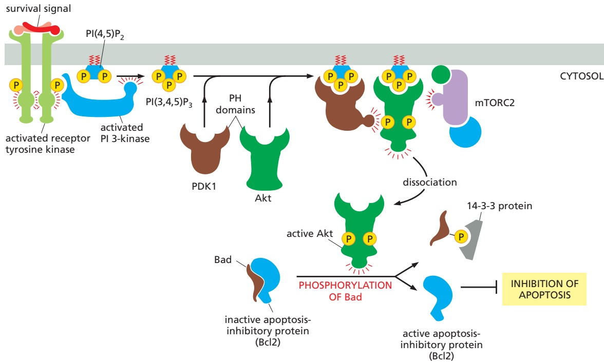
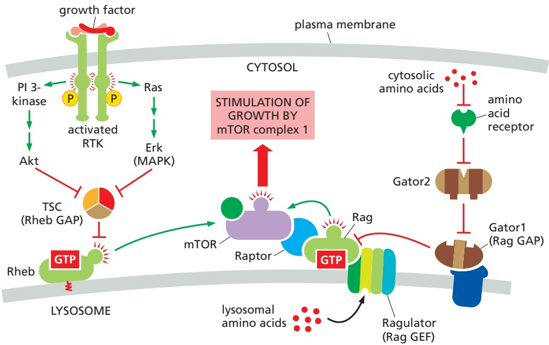
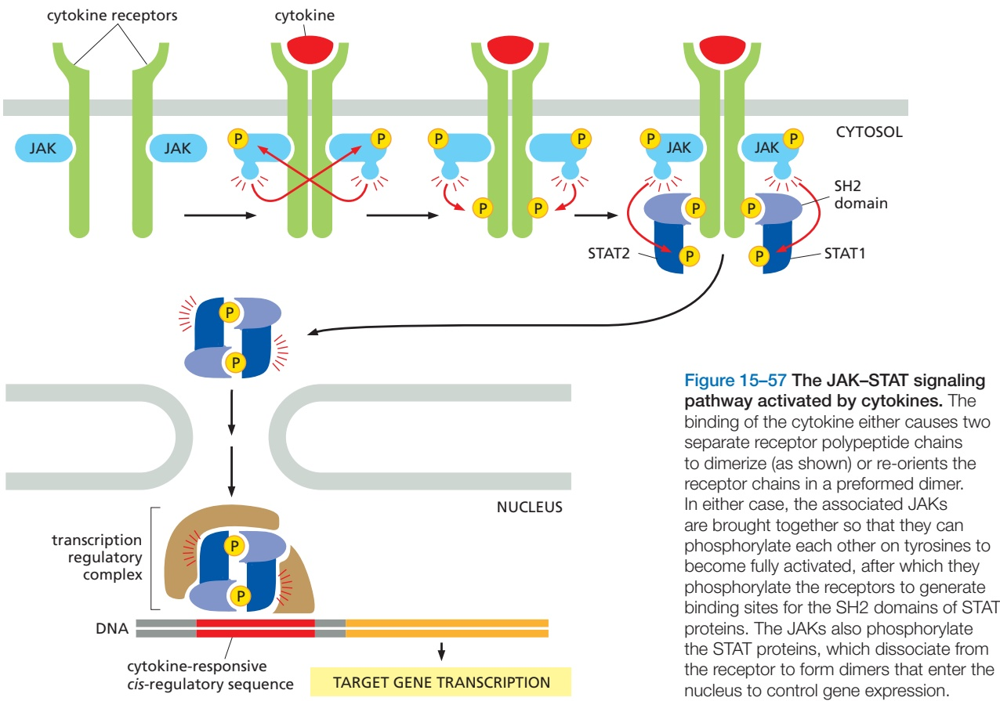
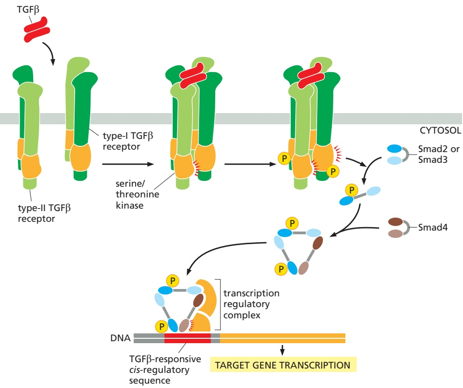
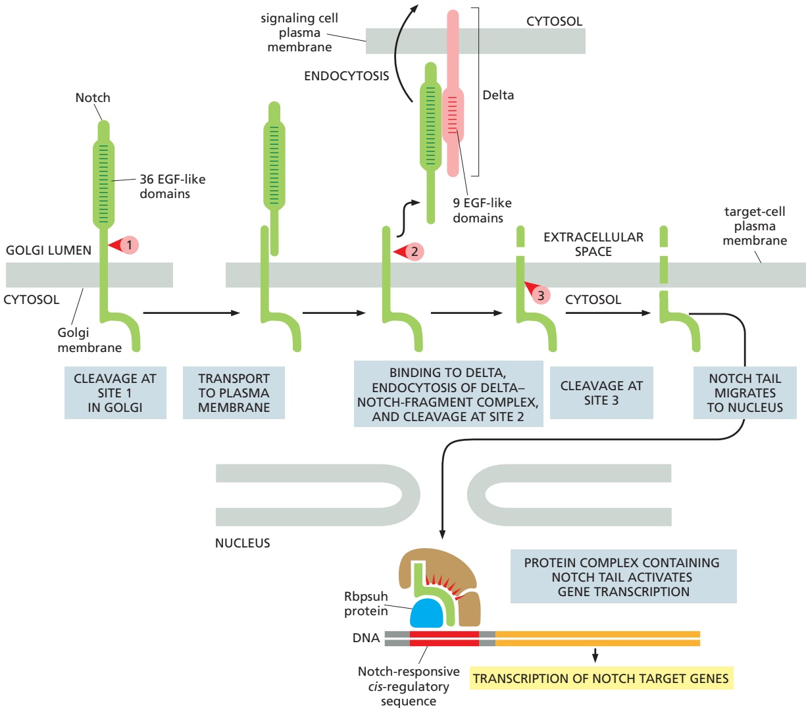

SIGNALING THROUGH ENZYME-COUPLED RECEPTORS

921

on activated RTKs through its two SH2 domains (see Figure 15–47A). GPCRs activate class Ib PI 3-kinases, which have a regulatory subunit that binds to the βγ complex of an activated heterotrimeric G protein $( \mathrm { G } _ { \mathrm { q } } )$ when GPCRs are activated by their extracellular ligand. The direct binding of activated Ras can also activate the common class I catalytic subunit.

Intracellular signaling proteins bind to $\mathrm { P I ( 3 , } 4 \mathrm { , } 5 \mathrm { ) P _ { 3 } }$ produced by activated PI 3-kinase via a specific interaction domain, such as a **pleckstrin homology (PH) domain**, first identified in the platelet protein pleckstrin. PH domains function mainly as protein–protein interaction domains, and it is only a small subset of them that bind to $\mathrm { P I } ( 3 , 4 , 5 ) \mathrm { P } _ { 3 } ;$ at least some of these also recognize a specific membrane-bound protein as well as the $\mathrm { P I } ( 3 ,   4 ,   5 ) \mathrm { P } _ { 3 } ,$ which greatly increases the specificity of the binding and helps explain why the signaling proteins with $\mathrm { P I ( 3 , } 4 \mathrm { , } 5 \mathrm { ) P _ { 3 } }$ -binding PH domains do not all dock at all $\mathrm { P I ( 3 , } 4 \mathrm { , } 5 \mathrm { ) P _ { 3 } }$ sites. PH domains occur in about 200 human proteins, including the Ras GEF Sos discussed earlier (see Figure 15–48).

One especially important PH-domain-containing protein is the serine/ threonine protein kinase Akt. The PI-3-kinase–Akt signaling pathway is the major pathway activated by the hormone insulin. It also plays a key part in promoting the survival and growth of many cell types in both invertebrates and vertebrates, as we now discuss.

## The PI-3-Kinase–Akt Signaling Pathway Stimulates Animal Cells to Survive and Grow

As discussed earlier, extracellular signals are usually required for animal cells to grow and divide, as well as to survive (see Figure 15–4). Members of the insulin-like growth factor (IGF) family of signal proteins, for example, stimulate many types of animal cells to survive and grow. Like insulin, they bind to specific RTKs (see Figure 15–44), which activate PI 3-kinase to produce $\mathrm { P I } ( 3 ,   4 ,   5 ) \mathrm { P } _ { 3 } .$ The $\mathrm { P I ( 3 , } 4 \mathrm { , } 5 \mathrm { ) P _ { 3 } }$ recruits two protein kinases to the plasma membrane via their PH domains—**Akt** (also called protein kinase B, or PKB) and phosphoinositide-dependent protein kinase 1 (PDK1)—and this leads to the activation of Akt (**Figure 15–54**). Once activated, Akt phosphorylates various target proteins at the plasma membrane, as well as in the cytosol and nucleus. The effect on most of the known targets is to inactivate them, but the targets are such that these actions of Akt all conspire

Figure 15–54 One way in which signaling through PI 3-kinase can promote cell survival. An extracellular survival signal activates an RTK, which recruits and activates PI 3-kinase. The PI 3-kinase produces $\mathsf { P } | ( 3 { , } 4 { , } 5 ) \mathsf { P } _ { 3 } ,$ which serves as a docking site for two serine/threonine kinases with PH domains—Akt and the phosphoinositide-dependent kinase PDK1—and brings them into proximity at the plasma membrane. The Akt is phosphorylated on a serine by a third membrane-associated kinase (mTOR in complex 2, or mTORC2), which alters the conformation of the Akt so that it can be phosphorylated on a threonine by PDK1, which activates the Akt. The activated Akt now dissociates from the plasma membrane and phosphorylates various target proteins, including the Bad protein. When unphosphorylated, Bad holds the apoptosis-inhibitory Bcl2 in an inactive state (Bad and Bcl2 are both members of a family of proteins that regulates apoptosis, as discussed in Chapter 18). Once phosphorylated, Bad releases Bcl2, which now can block apoptosis and thereby promote cell survival. The phosphorylated Bad binds to a ubiquitous cytosolic protein called 14-3-3, which keeps the protein out of action, as shown.

---

922

Chapter 15: Cell Signaling

to enhance cell survival and growth, as illustrated for one cell survival pathway in Figure 15–54.

The control of cell growth by the **PI-3-kinase–Akt pathway** depends in part on a protein kinase called **TOR**, named as the target of rapamycin, a bacterial toxin that inactivates some forms of the kinase and is used clinically as both an immunosuppressant and anticancer drug. In mammalian cells, it is called **mTOR** and exists in cells in two functionally distinct multiprotein complexes. mTOR complex 1 (mTORC1) contains the protein raptor; this complex is sensitive to rapamycin, and it stimulates cell growth. mTOR complex 2 (mTORC2) contains the protein rictor and is insensitive to rapamycin; it helps to promote cell survival by activating Akt (see Figure 15–54) and also regulates the actin cytoskeleton via Rho family GTPases.

mTORC1 is a key regulator of cell physiology, which integrates inputs from multiple sources. The two best understood activators of mTORC1 are extracellular signal proteins referred to as growth factors and nutrients such as amino acids, both of which activate mTORC1 and thereby promote cell growth. The complex signaling network that governs mTORC1 activity includes examples of many of the classes of signaling molecules we have discussed in this chapter (**Figure 15–55**). We discuss in Chapter 17 how activated mTORC1 stimulates cell growth (see Figure 17–61).

Figure 15–55 Activation of mTOR complex 1 (mTORC1) by growth factors and amino acids. mTORC1 activity depends on binding to the GTP-bound forms of two Ras-related GTPases, Rag and Rheb. In the presence of abundant cytosolic amino acids, Rag-GTP recruits mTORC1 to the surface of lysosomes. Full activation of mTORC1 then requires interaction with Rheb-GTP, which is activated in response to growth factor signaling. In both cases, enhanced GTP binding is driven primarily by inhibition of specific GTPase-activating proteins (GAPs). In the case of Rag, the GAP is a protein complex called Gator1, which is anchored on the lysosome and is regulated by a series of inhibitory interactions: cytosolic amino acids bind receptor proteins, MBoC7 n15.121/15.55thereby removing their inhibitory effect on Gator2, which is then free to inhibit the GAP activity of Gator1—resulting in Rag activation and binding to mTORC1. The interaction of Rag with the lysosome depends on a large protein complex, the Ragulator, that serves as an activating GEF for Rag; this GEF activity is stimulated by amino acids in the lysosome, further promoting mTORC1 activation. On the left side of the diagram are the mechanisms leading to activation of the Rheb GTPase by growth factors. As described earlier in the chapter, activation of RTKs by growth factor binding initiates various signaling pathways, including activation of PI 3-kinase (see Figure 15–54) and the GTPase Ras (see Figure 15–48), resulting in activation of the protein kinases Akt and Erk, respectively. One target of these kinases is a trimeric protein complex called TSC, which is a GAP for Rheb. Its phosphorylation inhibits TSC, allowing Rheb-GTP to accumulate and stimulate mTORC1.

TSC is short for tuberous sclerosis complex. Mutations in the genes that encode two of its three subunits, Tsc1 and Tsc2, cause the genetic disease tuberous sclerosis, which is associated with benign tumors that contain abnormally large cells.

---

SIGNALING THROUGH ENZYME-COUPLED RECEPTORS

923

Figure 15–56 Five parallel intracellular signaling pathways activated by GPCRs, RTKs, or both. In this simplified example, the five kinases (shaded gray) at the end of each signaling pathway phosphorylate target proteins (shaded red), many of which are phosphorylated by more than one of the kinases. The phospholipase C activated by the two types of receptors is different: GPCRs activate PLCβ, whereas RTKs activate PLCγ (not shown). Although not shown, some GPCRs can also activate Ras, but they do so independently of Grb2, via a Ras GEF that is activated by Ca2+ and diacylglycerol.

## RTKs and GPCRs Activate Overlapping Signaling Pathways

As mentioned earlier, RTKs and GPCRs activate some of the same intracellular signaling pathways. Both, for example, can activate the inositol phospholipid pathway triggered by phospholipase C. Moreover, even whenMBoC7 m15.55/15.56 they activate different pathways, the different pathways can converge on the same target proteins. **Figure 15–56** illustrates both of these types of signaling overlaps: it summarizes five parallel intracellular signaling pathways that we have discussed so far—one triggered by GPCRs, two triggered by RTKs, and two triggered by both kinds of receptors. Interactions among these pathways allow different extracellular signal molecules to modulate and coordinate each other’s effects.

## Some Enzyme-coupled Receptors Associate with Cytoplasmic Tyrosine Kinases

Many cell-surface receptors depend on tyrosine phosphorylation for their activity and yet lack a tyrosine kinase domain. These receptors act through **cytoplasmic tyrosine kinases**, which are associated with the receptors and phosphorylate various target proteins, often including the receptors themselves, when the receptors bind their ligand. These **tyrosine-kinase-associated receptors** thus function in much the same way as RTKs, except that their kinase domain is encoded by a separate gene and is noncovalently associated with the receptor polypeptide chain. A variety of receptor classes belong in this category, including the receptors for antigen and interleukins on lymphocytes (discussed in Chapter 24), integrins (discussed in Chapter 19), and receptors for various cytokines and some hormones. As with RTKs, many of these receptors depend on dimerization for their activation.

Some of these receptors work with members of the largest family of mammalian cytoplasmic tyrosine kinases, the **Src family**, which includes Src, Yes, Fgr, Fyn,

---

924

Chapter 15: Cell Signaling

Lck, Lyn, Hck, and Blk. These protein kinases all contain SH2 and SH3 domains and are located on the cytoplasmic side of the plasma membrane, held there partly by their interaction with transmembrane receptor proteins and partly by covalently attached lipid chains (discussed in Chapter 3). Different family members are associated with different receptors and phosphorylate overlapping but distinct sets of intracellular signaling proteins. Lyn, Fyn, and Lck, for example, are each associated with different sets of receptors on lymphocytes. In each case, the kinase is activated when an extracellular ligand binds to the appropriate receptor protein. Src itself, as well as several other family members, can also bind to activated RTKs; in these cases, the receptor and cytoplasmic kinases mutually stimulate each other’s catalytic activity, thereby strengthening and prolonging the signal (see Figure 15–52). There are even some G proteins $( \mathrm { G } _ { \mathrm { s } }$ and Gi) that can activate Src, which is one way that the activation of GPCRs can lead to tyrosine phosphorylation of intracellular signaling proteins and effector proteins.

Another type of cytoplasmic tyrosine kinase associates with integrins, the main receptors that cells use to bind to the extracellular matrix (discussed in Chapter 19). The binding of matrix components to integrins activates intracellular signaling pathways that influence the behavior of the cell. When integrins cluster at sites of contact with the extracellular matrix, they help trigger the assembly of cell–matrix junctions called focal adhesions. Among the many proteins recruited into these junctions is the cytoplasmic tyrosine kinase called **focal adhesion kinase (FAK)**, which binds to the cytosolic tail of one of the integrin subunits with the assistance of other proteins. The clustered FAK molecules phosphorylate each other, creating phosphotyrosine docking sites where the Src kinase can bind. Src and FAK then phosphorylate each other and other proteins that assemble in the junction, including many of the signaling proteins used by RTKs. In this way, the two tyrosine kinases signal to the cell that it has adhered to a suitable substratum, where the cell can now survive, grow, divide, migrate, and so on.

The largest and most diverse class of receptors that rely on cytoplasmic tyrosine kinases is the cytokine receptors, which we consider next.

## Cytokine Receptors Activate the JAK–STAT Signaling Pathway

The large family of **cytokine receptors** includes receptors for many kinds of local mediators (collectively called cytokines), as well as receptors for some hormones, such as growth hormone and prolactin (**Movie 15.9**). These receptors are stably associated with cytoplasmic tyrosine kinases called **Janus kinases** (**JAKs**; after the two-faced Roman god), which phosphorylate and activate transcription regulators called STATs (signal transducers and activators of transcription). STAT proteins are located in the cytosol and are referred to as latent transcription regulators because they migrate into the nucleus and regulate gene transcription only after they are activated.

Although many intracellular signaling pathways lead from cell-surface receptors to the nucleus, where they alter gene transcription (see Figure 15–56), the **JAK–STAT signaling pathway** provides one of the more direct routes. Cytokine receptors are dimers or trimers and are stably associated with one or two of the four known JAKs (JAK1, JAK2, JAK3, and Tyk2). Cytokine binding alters the arrangement so as to bring two JAKs into close proximity so that they phosphorylate each other, thereby increasing the activity of their tyrosine kinase domains. The JAKs then phosphorylate tyrosines on the cytoplasmic tails of cytokine receptors, creating phosphotyrosine docking sites for STATs (**Figure 15–57**). Some adaptor proteins can also bind to some of these sites and couple cytokine receptors to the Ras–MAP-kinase signaling pathway discussed earlier, but these will not be discussed here.

There are at least six STATs in mammals. Each has an SH2 domain that performs two functions. First, it mediates the binding of the STAT protein to a phosphotyrosine docking site on an activated cytokine receptor. Once bound, the JAKs phosphorylate the STAT on tyrosines, causing the STAT to dissociate from the receptor. Second, the SH2 domain on the released STAT now mediates its binding to a phosphotyrosine on another STAT molecule, forming either a STAT homodimer

---

SIGNALING THROUGH ENZYME-COUPLED RECEPTORS

925

Figure 15–57 The JAK–STAT signaling pathway activated by cytokines. The binding of the cytokine either causes two separate receptor polypeptide chains to dimerize (as shown) or re-orients the receptor chains in a preformed dimer. In either case, the associated JAKs are brought together so that they can phosphorylate each other on tyrosines to become fully activated, after which they phosphorylate the receptors to generate binding sites for the SH2 domains of STAT proteins. The JAKs also phosphorylate the STAT proteins, which dissociate from the receptor to form dimers that enter the nucleus to control gene expression.

or a heterodimer. The STAT dimer then translocates to the nucleus, where, in combination with other transcription regulators, it binds to a specific cis-regulatory sequence in various genes and stimulates their transcription (see Figure 15–57). In response to the hormone prolactin, for example, which stimulates breast cells to produce milk, activated STAT5 stimulates the transcription of genes that encode milk proteins. **Table 15–6** lists some of the more than 30 cytokines and hormones that activate the JAK–STAT pathway by binding to cytokine receptors.

Negative feedback regulates the responses mediated by the JAK–STAT pathway. In addition to activating genes that encode proteins mediating the cytokine-induced response, the STAT dimers can also activate genes that encode inhibitory proteins that help shut off the response. Some of these proteins bindMBoC7 m15.56/15.57 to and inactivate phosphorylated JAKs and their associated phosphorylated

TABLE 15–6 Some Extracellular Signal Proteins That Act Through Cytokine Receptors and the JAK–STAT Signaling Pathway

| Signal protein | Receptor-associated JAKs | STATs activated | Some responses |
| --- | --- | --- | --- |
| Interferon-γ (IFNγ) | JAK1 and JAK2 | STAT1 | Activates macrophages |
| Interferon-α (IFNα) | Tyk2 and JAK2 | STAT1 and STAT2 | Increases cell resistance to viral infection |
| Erythropoietin | JAK2 | STAT5 | Stimulates production of erythrocytes |
| Prolactin | JAK1 and JAK2 | STAT5 | Stimulates milk production |
| Growth hormone | JAK2 | STAT1 and STAT5 | Stimulates growth by inducing IGF1 production |
| Granulocyte-macrophage- | JAK2 | STAT5 | Stimulates production of granulocytes and |
| colony-stimulating factor |  |  | macrophages |
| (GMCSF) |  |  |  |

---

926

Chapter 15: Cell Signaling

receptors; others bind to phosphorylated STAT dimers and prevent them from binding to their DNA targets. Such negative feedback mechanisms, however, are not enough on their own to turn off the response. Inactivation of the activated JAKs and STATs requires dephosphorylation of their phosphotyrosines.

## Extracellular Signal Proteins of the TGFβ Superfamily Act Through Receptor Serine/Threonine Kinases and Smads

The **transforming growth factor-b (TGFb) superfamily** consists of a large number (33 in humans) of structurally related, secreted, dimeric proteins. They act either as hormones or, more commonly, as local mediators to regulate a wide range of biological functions in all animals. During development, they regulate pattern formation and influence various cell behaviors, including proliferation, specification and differentiation, extracellular matrix production, and cell death. In adults, they are involved in tissue repair and in immune regulation, as well as in many other processes. The superfamily consists of the TGFβ/activin family and the larger bone morphogenetic protein (BMP) family.

All of these proteins act through receptors that are single-pass transmembrane proteins with a serine/threonine kinase domain on the cytosolic side of the plasma membrane. There are two classes of these receptor serine/threonine kinases—type I and type II. Signaling begins when a TGFβ dimer interacts with the extracellular domains of two type-I receptors and two type-II receptors, bringing the kinase domains together so that the type-II receptors can phosphorylate and activate the type-I receptors, forming an active tetrameric receptor complex.

Once activated, the receptor complex uses a strategy for rapidly relaying the signal to the nucleus that is very similar to the JAK–STAT strategy used by cytokine receptors. The activated type-I receptor directly binds and phosphorylates a latent transcription regulator of the **Smad family** (named after the first two proteins identified, Sma in Caenorhabditis elegans and Mad in Drosophila). Activated TGFβ/activin receptors phosphorylate Smad2 or Smad3, while activated BMP receptors phosphorylate Smad1, Smad5, or Smad8. Once one of these receptor-activated Smads (R-Smads) has been phosphorylated, it binds to Smad4 (called a co-Smad), which can form a complex with any of the five R-Smads. The Smad complex then translocates into the nucleus, where it associates with other transcription regulators and controls the transcription of specific target genes (**Figure 15–58**). Because the partner proteins in the nucleus vary depending on the cell type and state of the cell, the genes affected vary.

Activated TGFβ receptors and their bound ligand are endocytosed by two distinct routes, one leading to further activation and the other leading to inactivation. The activation route depends on clathrin-coated vesicles and leads to early endosomes (discussed in Chapter 13), where most of the Smad activation occurs. An anchoring protein called SARA (for Smad anchor for receptor activation) has an important role in this pathway; it is concentrated in early endosomes and binds to both activated TGFβ receptors and Smads, increasing the efficiency of receptor-mediated Smad phosphorylation. The inactivation route depends on caveolae (discussed in Chapter 13) and leads to receptor ubiquitylation and degradation in proteasomes.

During the signaling response, the Smads shuttle continually between the cytoplasm and the nucleus: they are dephosphorylated in the nucleus and exported to the cytoplasm, where they can be rephosphorylated by activated receptors. In this way, the effect exerted on the target genes reflects both the concentration of the extracellular signal and the time the signal continues to act on the cell-surface receptors (often several hours). Cells exposed to a morphogen at high concentration, or for a long time, or both, will switch on one set of genes, whereas cells receiving a lower or more transient exposure will switch on another set.

As in other signaling systems, negative feedback regulates the Smad pathway. Among the target genes activated by Smad complexes are those that encode inhibitory Smads, either Smad6 or Smad7. Smad7 (and possibly Smad6) binds to the cytosolic tail of the activated receptor and inhibits its signaling ability in at least three ways: (1) it competes with R-Smads for binding sites on the receptor,

---

SIGNALING THROUGH ENZYME-COUPLED RECEPTORS

927

Figure 15–58 The Smad-dependent signaling pathway activated by TGFb. The TGFβ dimer promotes the assembly of a tetrameric receptor complex containing two copies each of the type-I and type-II receptors. The type-II receptors phosphorylate specific sites on the type-I receptors, thereby activating their kinase domains and leading to phosphorylation of R-Smads such as Smad2 and Smad3. Smads open up to expose a binding surface when they are phosphorylated, leading to the formation of a trimeric Smad complex containing two R-Smads and the co-Smad, Smad4. The phosphorylated Smad complex enters the nucleus and collaborates with other transcription regulators to control the transcription of specific target genes.

decreasing R-Smad phosphorylation; (2) it recruits a ubiquitin ligase called Smurf, which ubiquitylates the receptor, leading to receptor internalization and degradation (it is because Smurfs also ubiquitylate and promote the degradation of Smads that they are called Smad ubiquitylation regulatory factors, or Smurfs); and (3) itMBoC7 m15.57/15.58 recruits a protein phosphatase that dephosphorylates and inactivates the receptor. In addition, the inhibitory Smads bind to the co-Smad, Smad4, and inhibit it, either by preventing its binding to R-Smads or by promoting its ubiquitylation and degradation.

## Summary

There are various classes of enzyme-coupled receptors, the most common of which are receptor tyrosine kinases (RTKs), tyrosine-kinase-associated receptors, and receptor serine/threonine kinases.

Ligand binding to RTKs causes their dimerization, which leads to activation of their kinase domains. These activated kinase domains phosphorylate multiple tyrosines on the receptors, producing a set of phosphotyrosines that serve as docking sites for a set of intracellular signaling proteins, which bind via their SH2 (or PTB) domains. One such signaling protein serves as an adaptor to couple some activated receptors to a Ras GEF (Sos), which activates the monomeric GTPase Ras; Ras, in turn, activates a three-component MAP kinase signaling module, which relays the signal to the nucleus by phosphorylating transcription regulators. Another important signaling protein that can dock on activated RTKs is PI 3-kinase, which phosphorylates specific phosphoinositides to produce lipid docking sites in the plasma membrane for signaling proteins with phosphoinositide-binding PH domains, including the serine/ threonine protein kinase Akt, which plays a key part in the control of cell survival and cell growth. Many receptor classes, including some RTKs, activate Rho family monomeric GTPases, which functionally couple the receptors to the cytoskeleton.

Tyrosine-kinase-associated receptors depend on various cytoplasmic tyrosine kinases for their action. These kinases include members of the Src family, which associate with many kinds of receptors, and the focal adhesion kinase (FAK), which associates with integrins at focal adhesions. The cytoplasmic tyrosine kinases then phosphorylate a variety of signaling proteins to relay the signal onward. The largest

---

928

Chapter 15: Cell Signaling

family of tyrosine-kinase-associated receptors is the cytokine receptor family. When stimulated by ligand binding, these receptors activate JAK cytoplasmic tyrosine kinases, which phosphorylate STATs. The STATs then dimerize, translocate to the nucleus, and activate the transcription of specific genes. Receptor serine/threonine kinases, which are activated by signal proteins of the TGFb superfamily, act similarly: they directly phosphorylate and activate Smads, which then oligomerize with another Smad, translocate to the nucleus, and regulate gene transcription.

## ALTERNATIVE SIGNALING ROUTES IN GENE REGULATION

Major changes in the behavior of a cell tend to depend on changes in the expression of numerous genes. Thus, many extracellular signaling molecules carry out their effects, in whole or in part, by initiating signaling pathways that change the activities of transcription regulators. There are numerous examples of gene regulation in both GPCR and enzyme-coupled receptor pathways (see Figures 15–28 and 15–50). In this section, we describe some of the less common signaling mechanisms by which gene expression can be controlled by extracellular signals. We begin with several pathways that depend on regulated proteolysis to control the activity and location of latent transcription regulators. We then turn to a class of extracellular signal molecules that do not employ cell-surface receptors but enter the cell and interact directly with transcription regulators to perform their functions. Finally, we briefly discuss some of the mechanisms by which gene expression is controlled by the circadian rhythm: the daily cycle of light and dark.

## The Receptor Notch Is a Latent Transcription Regulator

Signaling through the **Notch** protein is used widely in animal development. As discussed in Chapter 21, it has a general role in controlling cell-fate choices and regulating pattern formation during the development of most tissues, as well as in the continual cell renewal in tissues such as the lining of the gut. It is best known, however, for its role in the production of Drosophila neural cells, which usually arise as isolated single cells within an epithelial sheet of precursor cells. During this process, when a precursor cell commits to becoming a neural cell, it signals to its immediate neighbors not to do the same; the inhibited cells develop into epidermal cells instead. This process, called lateral inhibition, depends on a contact-dependent signaling mechanism that is activated by a single-pass transmembrane signal protein called **Delta**, displayed on the surface of the future neural cell. By binding to its receptor, the Notch protein, on a neighboring cell, Delta signals to the neighbor not to become neural (**Figure 15–59**). When this signaling process is defective, a huge excess of neural cells is produced at the expense of epidermal cells, which is lethal.

Notch is a single-pass transmembrane protein that requires proteolytic processing to function. It acts as a latent transcription regulator and provides the

Figure 15–59 Lateral inhibition mediated by Notch and Delta during neural cell development in Drosophila. When individual cells in the epithelium begin to develop as neural cells, they signal to their neighbors not to do the same. This inhibitory, contact-dependent signaling is mediated by the ligand Delta, which appears on the surface of the future neural cell and binds to Notch protein on the neighboring cells. In many tissues, all the cells in a cluster initially express both Delta and Notch, and a competition occurs, with one cell emerging as winner, expressing Delta strongly and inhibiting its neighbors from doing likewise. In other cases, additional factors interact with Delta or Notch to make some cells susceptible to the lateral inhibition signal and others unresponsive to it.

---

ALTERNATIVE SIGNALING ROUTES IN GENE REGULATION

929

simplest and most direct signaling pathway known from a cell-surface receptor to the nucleus. When activated by the binding of Delta on another cell, a plasma-membrane-bound protease cleaves off the cytoplasmic tail of Notch, and the released tail translocates into the nucleus to activate the transcription of a set of Notch-response genes. The Notch tail fragment acts by binding to a DNA-binding protein, converting it from a transcription repressor into a transcription activator.

Notch undergoes three successive proteolytic cleavage steps, but only the last two depend on Delta binding. As part of its normal biosynthesis, it is cleaved in the Golgi apparatus to form a heterodimer, which is then transported to the cell surface as the mature receptor. The binding of Delta to Notch induces a second cleavage in the extracellular domain, mediated by an extracellular protease. A final cleavage quickly follows, cutting free the cytoplasmic tail of the activated Notch (**Figure 15–60**). Note that, unlike most receptors, the activation of Notch is irreversible; once activated by ligand binding, the protein cannot be used again.

This final cleavage of the Notch tail occurs just within the transmembrane segment, and it is mediated by a protease complex called g-secretase, which is also

Figure 15–60 The processing and activation of Notch by proteolytic cleavage. The numbered red arrowheads indicate the sites of proteolytic cleavage. The first proteolytic processing step occurs within the trans Golgi network to generate mature heterodimeric Notch, which is then displayed on the cell surface. The binding to Delta on a neighboring cell triggers the next two proteolytic steps: the complex of Delta and the Notch fragment to which it is bound is endocytosed by the Delta-expressing cell, exposing the extracellular cleavage site in the transmembrane Notch subunit. Note that Notch and Delta interact through their repeated EGF-like domains. The released Notch tail migrates into the nucleus, where it binds to the Rbpsuh protein, which it converts from a transcription repressor to a transcription activator.

---

930

Chapter 15: Cell Signaling

responsible for the intramembrane cleavage of various other single-pass transmembrane proteins. One of its essential subunits is Presenilin, so called because mutations in the gene encoding it are a frequent cause of early-onset familial Alzheimer’s disease, a form of presenile dementia. The protease complex is thought to contribute to this and other forms of Alzheimer’s disease by generating extracellular peptide fragments from a transmembrane neuronal protein; the fragments accumulate in excessive amounts and form aggregates of misfolded protein called amyloid plaques, which may injure nerve cells and contribute to their degeneration and loss.

## Wnt Proteins Activate Frizzled and Thereby Inhibit β-Catenin Degradation

**Wnt proteins** are secreted signal molecules that control various aspects of animal development. They were discovered independently in flies and in mice: in Drosophila, the Wingless (Wg) gene originally came to light because of its role in wing development, while in mice, the Int1 gene was found because it promoted the formation of breast tumors when activated by the integration of a virus next to it. Both of these genes encode Wnt proteins. There are 19 Wnts in humans, each having distinct, but often overlapping, functions.

Wnts are unusual extracellular signaling proteins in that they are covalently attached to a fatty acid chain after their synthesis in the endoplasmic reticulum. Wnts are therefore hydrophobic molecules that tend to associate with cell membranes and do not diffuse rapidly in the extracellular environment. They are thought to act primarily as local (paracrine) signaling molecules (see Figure 15–2B).

Wnts have been implicated in several signaling pathways. The best understood, and our primary focus here, is the Wnt/b-catenin pathway (also known as the canonical Wnt pathway), which centers on a protein called **b-catenin**. β-catenin is an intriguing example of a signaling protein with two seemingly unconnected functions in the same cell. A portion of the cell’s β-catenin is located at cell–cell junctions and thereby contributes to the control of cell–cell adhesion; this function is discussed in Chapter 19 and does not concern us here. Wnt signaling acts primarily on cytoplasmic β-catenin, a latent transcription regulator that is degraded rapidly in unstimulated cells but stabilized by Wnt signaling.

In the absence of Wnt signaling, cytoplasmic β-catenin is degraded by a process that depends on a large protein degradation complex, which binds β-catenin, keeps it out of the nucleus, and promotes its destruction. The complex contains at least four other proteins, including a protein kinase called casein kinase 1 (CK1), which phosphorylates the β-catenin on a serine, priming it for further phosphorylation by another protein kinase called glycogen synthase kinase 3 (GSK3). This final phosphorylation marks the protein for ubiquitylation and rapid degradation in proteasomes. Two scaffold proteins called axin and Adenomatous polyposis coli (APC) hold the protein complex together (Figure 15–61A). APC gets its name from the finding that the gene encoding it is often mutated in a type of benign tumor (an adenoma) of the colon; the tumor projects into the lumen as a polyp and can eventually become malignant. (This APC should not be confused with the anaphase-promoting complex, or APC/C, that plays a central part in selective protein degradation during the cell cycle—discussed in Chapter 17.)

Wnt proteins regulate β-catenin proteolysis by interacting with two cell-surface co-receptors, **Frizzled** and **LDL-receptor-related protein (LRP)**. Frizzled is a seven-pass transmembrane protein that resembles GPCRs in structure but does not generally work through the activation of G proteins. LRP is a relatively simple singlepass transmembrane protein. Frizzled contains an extracellular domain that binds with high affinity to Wnt, due in part to a hydrophobic pocket on the receptor domain that interacts with the lipid modification on Wnt; this lipid is therefore required for Wnt signaling. LRP interacts with a different site on Wnt. Thus, as in so many other signaling pathways, the Wnt ligand drives formation of a co-receptor dimer.

Formation of the activated receptor complex promotes phosphorylation of the LRP receptor by the two protein kinases, CK1 and GSK3. Receptor activation also leads to recruitment of the scaffold protein **Dishevelled**. Axin is brought to the

---

ALTERNATIVE SIGNALING ROUTES IN GENE REGULATION

931

Figure 15– Wnt/b-catenin signaling pathway. (A) In the absence of a Wnt signal, β-catenin that is not bound to cell–cell adherens junctions (not shown— discussed in Chapter 19) interacts with a degradation complex containing APC, axin, GSK3, and CK1. In this complex, β-catenin is phosphorylated by CK1 and then by GSK3, triggering its ubiquitylation and degradation in proteasomes. Wntresponsive genes are kept inactive by the Groucho co-repressor protein bound to the transcription regulator LEF1/TCF. (B) Wnt binding to Frizzled and LRP brings the two co-receptors together, and the cytosolic tail of LRP is phosphorylated by CK1 and GSK3. The scaffold protein Dishevelled is recruited to the activated Frizzled protein. Axin binds to Dishevelled and the phosphorylated LRP and is inactivated, resulting in disassembly of the degradation complex. The phosphorylation of β-catenin is thereby prevented, and unphosphorylated β-catenin accumulates and translocates to the nucleus, where it binds to LEF1/TCF, displaces the co-repressor Groucho, and acts as a coactivator to stimulate the transcription of Wnt target genes. The scaffold protein Dishevelled is required for the signaling pathway to operate; it binds to Frizzled and becomes phosphorylated (not shown), but its precise role is unknown.

receptor complex and inactivated, thereby disrupting the β-catenin degradation complex in the cytoplasm. In this way, the phosphorylation and degradation of β-catenin are prevented, enabling β-catenin to accumulate and translocate to the nucleus, where it alters the pattern of gene transcription (**Figure 15–61B**).

In the absence of Wnt signaling, Wnt-responsive genes are kept silent by an inhibitory complex of transcription regulators. The complex includes proteins of the LEF1/TCF family bound to a co-repressor protein of the Groucho family (see Figure 15–61A). In response to a Wnt signal, β-catenin enters the nucleus and binds to the LEF1/TCF proteins, displacing Groucho. The β-catenin now functions as a coactivator, inducing the transcription of the Wnt target genes (see Figure 15–61B). Thus, as in the case of Notch signaling, Wnt/β-catenin signaling triggers a switch from transcriptional repression to transcriptional activation.

Among the genes activated by β-catenin is Myc, which encodes a proteinMB C7 15.60/15.61 (Myc) that is an important regulator of cell growth and proliferation (discussed in Chapter 17). Mutations of the Apc gene occur in 80% of human colon cancers (discussed in Chapter 20). These mutations inhibit the protein’s ability to bind β-catenin, so that β-catenin accumulates in the nucleus and stimulates the transcription of c-Myc and other Wnt target genes, even in the absence of Wnt signaling. The resulting uncontrolled cell growth and proliferation promote the development of cancer.

The Wnt signaling pathway shown in Figure 15–61 is supplemented with additional regulatory inputs that fine-tune the strength of the Wnt signal. Some Wnt-stimulated genes, for example, suppress the Wnt signal, resulting in negative feedback. One of these genes encodes a secreted enzyme called Notum, which removes the fatty acid modification from Wnt, thereby inactivating it. Another Wnt-stimulated gene encodes a cell-surface transmembrane protein, Rnf43, which is a ubiquitin ligase that targets the Frizzled protein for degradation. This negative feedback mechanism can be suppressed by extracellular signaling molecules from other cells: a signaling protein called R-spondin, for example, binds to a GPCR called Lgr, which inactivates Rnf43, thereby enhancing the Wnt signal. Through these and a variety of other mechanisms, the localization and strength of the Wnt signal can be fine-tuned in different tissues.

---

932

Chapter 15: Cell Signaling

Hedgehog Proteins Initiate a Complex Signaling Pathway in the Primary Cilium

Hedgehog proteins and Wnt proteins act in similar ways. Both are secreted signal molecules, which act as local mediators in many developing invertebrate and vertebrate tissues. Both proteins are modified by covalently attached lipids, and both trigger a switch from transcriptional repression to transcriptional activation. Excessive signaling along either pathway in adult cells can lead to cancer.

The first **Hedgehog protein** was discovered in Drosophila, where mutation of the Hedgehog gene produces a larva covered with spiky processes (denticles), like a hedgehog. At least three genes encode Hedgehog proteins in vertebrates— Sonic, Desert, and Indian hedgehog. The active forms of all Hedgehog proteins are covalently coupled to cholesterol, as well as to a fatty acid chain. The cholesterol is added during an unusual processing step in which a precursor protein cleaves itself to produce a smaller, cholesterol-containing signal protein.

The signaling proteins activated by Hedgehog were also first identified in Drosophila and are conserved in vertebrates and other animals. The vertebrate pathway, which we focus on here, provides a striking example of an important concept: the sensitivity and efficiency of a signaling system can be enhanced by concentrating its components in a small volume or compartment. Most of the signaling proteins of the vertebrate Hedgehog pathway are located within the **primary cilium**, a small membrane protrusion that is present in one copy on the surface of most vertebrate cell types. As we discuss in Chapter 16, the primary cilium contains a microtubule array along its central axis, but it is not motile like other microtubule-based cilia or flagella; instead, its microtubules are used as tracks for the transport of various signaling proteins to and from the tip. All the early signaling steps in the Hedgehog pathway occur in the cilium, and signaling is lost in cells with defects in primary cilium formation or function. Thus, the primary cilium serves as an antenna for the extracellular Hedgehog signal.

Hedgehog signaling begins at a cell-surface receptor called **Patched**, which employs a convoluted mechanism to activate a group of transcription regulators called Gli proteins, thereby increasing the expression of genes that drive changes in the target cell’s proliferation or developmental fate. In the absence of Hedgehog ligand, the unoccupied Patched protein resides in the ciliary membrane and inhibits the activity of another transmembrane protein called Smoothened, which is located outside the cilium (Figure 15–62A). Smoothened is a GPCR-like protein that resembles the Wnt receptor Frizzled; like Frizzled, it has an external domain that serves as a lipid-binding activation domain, and its activation requires binding of this domain to cholesterol in the cell membrane. Patched, in contrast, is a large transmembrane protein that transports cholesterol out of the membrane. It has been proposed that Patched inhibits **Smoothened** by reducing the amount of cholesterol in the ciliary membrane, and Hedgehog inhibits Patched by blocking its cholesterol transport channel.

In cells lacking the Hedgehog signal, expression of Hedgehog-responsive genes is blocked by two mechanisms. First, an inhibitory protein called SuFu holds the Gli transcription regulators in an inactive state within the cilium. Second, one member of the family, Gli3, is proteolytically processed to form a smaller fragment that acts as a transcription repressor, helping to keep Hedgehog-responsive genes silent. This processing of the Gli3 protein depends on a signaling pathway that begins with a GPCR called Gpr161, which is found in the cilium membrane and stimulates adenylyl cyclase to produce cyclic AMP; cyclic AMP then stimulates PKA, which phosphorylates Gli3 to promote its partial processing into a transcription repressor (see Figure 15–62A).

The binding of Hedgehog to the Patched protein promotes the transport of Patched out of the cilium and removes its inhibitory effects on Smoothened, which moves into the cilium. Gpr161 is removed from the cilium, thereby reducing formation of the Gli3 transcription repressor. Inactive complexes of Gli proteins and SuFu are transported to the tip of the cilium, where the activated Smoothened