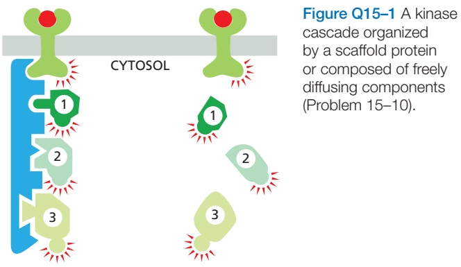
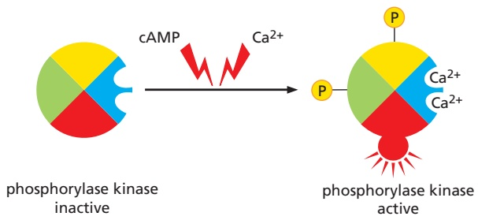
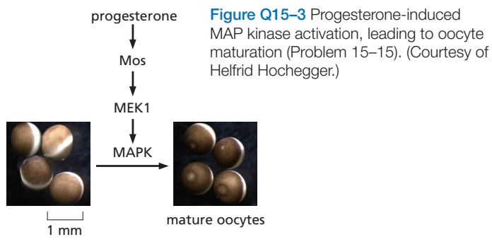
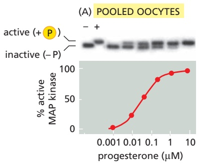
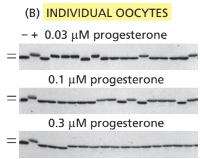
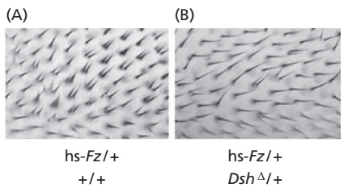
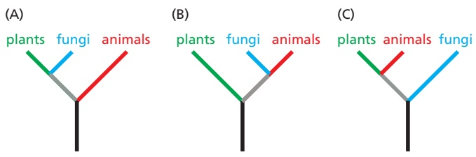

Figure 15–74 One way in which phytochromes mediate a light response in plant cells. When activated by red light, the phytochrome, which is a dimeric protein kinase, phosphorylates itself and then moves into the nucleus, where it activates transcription regulatory proteins to stimulate the transcription of red-lightresponsive genes.

and then to phosphorylate one or more other proteins in the cell. In some light responses, the activated phytochrome translocates into the nucleus, where it activates transcription regulators to alter gene transcription (**Figure 15–74**). In other cases, the activated phytochrome activates a latent transcription regulator in the cytoplasm, which then translocates into the nucleus to regulate gene transcription. In still other cases, the activated phytochrome triggers signaling pathways in the cytosol that alter the cell’s behavior without involving the nucleus.

Plants sense blue light using photoproteins of two other sorts, phototropin and cryptochromes. **Phototropin** is associated with the plasma membrane and is partly responsible for phototropism, the tendency of plants to grow toward light.MBoC7 m15.73/15.74 Phototropism occurs by directional cell elongation, which is stimulated by auxin, but the links between phototropin and auxin are unknown.

**Cryptochromes** are flavoproteins that are sensitive to blue light. They are structurally related to blue-light-sensitive enzymes called photolyases, which are involved in the repair of ultraviolet-induced DNA damage in all organisms, except most mammals. Unlike phytochromes, cryptochromes are also found in animals, where they have an important role in circadian clocks (see Figure 15–67). Although cryptochromes are thought to have evolved from the photolyases, they do not have a role in DNA repair.

## Summary

The mechanisms used to signal between cells in animals and in plants have both similarities and differences. Whereas animals rely heavily on GPCRs and RTKs, plants rely mainly on enzyme-coupled receptors of the receptor serine/threonine kinase type, especially those with extracellular leucine-rich repeats. Various plant hormones, or growth regulators, including ethylene and auxin, help coordinate plant development. Ethylene acts through intracellular receptors to stop the degradation of specific nuclear transcription regulators, which can then activate the transcription of ethylene-responsive genes. The receptors for some other plant hormones, including auxin, also regulate the degradation of specific transcription regulators, although the details vary. Auxin signaling is unusual in that it has its own highly regulated transport system, in which the dynamic positioning of plasmamembrane-bound auxin transporters controls the direction of auxin flow and thereby the direction of plant growth. Light has an important role in regulating plant development. These light responses are mediated by a variety of light-sensitive photoproteins, including phytochromes, which are responsive to red light, and cryptochromes and phototropin, which are sensitive to blue light.

## PROBLEMS

Which statements are true? Explain why or why not.

15–1 All second messengers are water soluble and diffuse freely through the cytosol.

15–2 In the regulation of molecular switches, protein kinases and guanine nucleotide exchange factors (GEFs) always turn proteins on, whereas protein phosphatases and GTPase-activating proteins (GAPs) always turn proteins off.

15–3 Most intracellular signaling pathways provide numerous opportunities for amplifying the responses to extracellular signals.

15–4 Binding of extracellular ligands to receptor tyrosine kinases (RTKs) activates the intracellular catalytic domain by propagating a conformational change across the lipid bilayer through a single transmembrane α helix.

15–5 Even though plants and animals independently evolved multicellularity, they use virtually all the same signaling proteins and second messengers for cell–cell communication.

## Discuss the following problems.

15–6 Cells communicate in ways that resemble human communication. Decide which of the following forms of human communication are analogous to autocrine, paracrine, endocrine, and synaptic signaling by cells.

A. A telephone conversation

B. Talking to people at a cocktail party

C. A radio announcement

D. Talking to yourself

15–7 Suppose that the circulating concentration of hormone is $\bar { 1 } 0 ^ { - 1 0 }   \mathrm { M }$ and the $K _ { \mathrm { d } }$ for binding to its receptor is $1 0 ^ { - 8 }$ M. What fraction of the receptors will have hormone bound? If a meaningful physiological response occurs when 50% of the receptors have bound a hormone molecule, how much will the concentration of hormone have to rise to elicit a response? The fraction of receptors (R) bound to hormone (H) to form a receptor–hormone complex (R–H) is $\left[ \mathrm{R} - \mathrm{H} \right] / \left( \left[ \mathrm{R} \right] + \left[ \mathrm{R} - \mathrm{H} \right] \right) = \left[ \mathrm{R} - \mathrm{H} \right] / \left[ \mathrm{R} \right]_{\mathrm{TOT}} =$ $\mathrm { [ H ] } / ( \mathrm { [ H ] } + K _ { \mathrm { d } } )$

15–8 How is it that different cells can respond in different ways to exactly the same signaling molecule even when they have identical receptors?

15–9 Why do you suppose that phosphorylation/ dephosphorylation, as opposed to allosteric binding of small molecules, for example, has evolved to play such a prominent role in switching proteins on and off in signaling pathways?

15–10 Consider a signaling pathway that proceeds through three protein kinases that are sequentially activated by phosphorylation. In one case, the kinases are held in a signaling complex by a scaffold protein; in the other, the kinases are freely diffusible (**Figure Q15–1**). Discuss the properties of these two types of organization in terms of signal amplification, speed, and potential for cross-talk between signaling pathways.

15–11 Describe three ways in which a gradual increase in an extracellular signal can be sharpened by the target cell to produce an abrupt or nearly all-or-none response.

15–12 Why do signaling responses that involve changesMBoC7 Q15.01/Q15.01 in proteins already present in the cell occur in milliseconds to seconds, whereas responses that require changes in gene expression require minutes to hours?

15–13 Propose a specific type of mutation in the gene for the regulatory subunit of cyclic-AMP-dependent protein kinase (PKA) that could lead to a permanently active PKA.

15–14 Phosphorylase kinase integrates signals from the cyclic-AMP-dependent and $\mathrm { C a ^ { 2 ^ { + } } }$ -dependent signaling pathways that control glycogen breakdown in liver and muscle cells (**Figure Q15–2**). Phosphorylase kinase is composed of four subunits. One subunit is the protein kinase that catalyzes the addition of phosphate to glycogen phosphorylase to activate it for glycogen breakdown. The other three subunits are regulatory proteins that control the activity of the catalytic subunit. Two contain sites for phosphorylation by PKA, which is activated by cyclic AMP. The remaining subunit is calmodulin, which binds $\mathrm { C a ^ { 2 + } }$ when the cytosolic $\mathrm { C a ^ { 2 + } }$ concentration rises. The regulatory subunits control the equilibrium between the active and inactive conformations of the catalytic subunit, with each phosphate and $\mathrm { C a ^ { 2 + } }$ nudging the equilibrium toward the active conformation. How does this arrangement allow phosphorylase kinase to serve its role as an integrator protein for the two pathways that stimulate glycogen breakdown?

Figure Q15–2 Integration of cyclic-AMP-dependent and $\mathrm { C a ^ { 2 + } }$ dependent signaling pathways by phosphorylase kinase in liver and muscle cells (Problem 15–14).

15–15 Activation (“maturation”) of frog oocytes is signaled through a MAP kinase signaling module. An increase in the hormone progesterone triggers the module by stimulating the translation of mRNA encoding Mos, which is the frog’s MAP kinase kinase kinase (**Figure Q15–3**). Maturation is easy to score visually by the presence of a white spot in the middle of the brown surface of the oocyte (see Figure Q15–3). To determine the dose–response curve for progesterone-induced activation of MAP kinase, you place 16 oocytes in each of six plastic dishes and add various concentrations of progesterone. After an overnight incubation, you crush the oocytes, prepare an extract, and determine the state of MAP kinase phosphorylation (hence, activation) by SDS polyacrylamide-gel electrophoresis (**Figure Q15–4A**). This analysis shows a graded increase in MAP kinase activity with increasing concentrations of progesterone.

Figure Q15–3 Progesterone-induced MAP kinase activation, leading to oocyte maturation (Problem 15–15). (Courtesy of Helfrid Hochegger.)

Figure Q15–4 Activation of frog oocytes (Problem 15–15). (A) Phosphorylation of MAP kinase in pooled oocytes. (B) Phosphorylation of MAP kinase in individual oocytes. MAP kinase was detected by immunoblotting using a MAP-kinase-specific antibody. The first two lanes in each gel contain nonphosphorylated, inactive MAP kinase (–) and phosphorylated, active MAP kinase (+), respectively. (From J.E. Ferrell, Jr., and E.M. Machleder, Science 280:895–898, 1998. With permission from AAAS.)

Before you crushed the oocytes, you noticed that not all the oocytes in individual dishes had white spots. Had some oocytes undergone partial activation and not yet reached the white-spot stage? To answer this question, you repeat the experiment, but this time you analyze MAP kinase activation in individual oocytes. You are surprised to find that each oocyte has either a fully activated or a completely inactive MAP kinase (**Figure Q15–4B**). How can an all-or-none response in individual oocytes give rise to a graded response in the population?

15–16 The Wnt planar polarity signaling pathway normally ensures that each wing cell in Drosophila has a single hair. Overexpression of the Frizzled gene from a heat-shock promoter (hs-Fz) causes multiple hairs to grow from many cells (**Figure Q15–5A**). This phenotype is suppressed if hs-Fz is combined with a heterozygous deletion (DshΔ) of the Dishevelled gene (**Figure Q15–5B**). Do these results allow you to order the action of Frizzled and Dishevelled in the signaling pathway? If so, what is the order? Explain your reasoning.

Figure Q15–5 Pattern of hair growth on wing cells in genetically different Drosophila (Problem 15–16). (From C.G. Winter et al., Cell 105:81–91, 2001. With permission from Elsevier.)

15–17 The last common ancestor to plants and ani-MBoC7 Q15.05/Q15.05 mals was a unicellular eukaryote. Thus, it is thought that multicellularity and the attendant demands for cell communication arose independently in these two lineages. This evolutionary viewpoint accounts nicely for the vastly different mechanisms that plants and animals use for cell communication. Fungi use signaling mechanisms and components that are very similar to those used in animals. Which of the phylogenetic trees shown in **Figure Q15–6** do these observations support?

Figure Q15–6 Three possible phylogenetic relationships among plants, animals, and fungi (Problem 15–17).

## REFERENCES

## General

Ferrell, JE (2022) Systems Biology of Cell Signaling: Recurring Themes and Quantitative Models. Boca Raton, FL: Garland Science.

Lim W, Mayer B & Pawson T (2015) Cell Signaling: Principles and Mechanisms. New York: Garland Science.

Marks F, Klingmüller U & Müller-Decker K (2017) Cellular Signal Processing: An Introduction to the Molecular Mechanisms of Signal Transduction, 2nd ed. New York: Garland Science.

## Principles of Cell Signaling

Alon U (2007) Network motifs: theory and experimental approaches. Nat. Rev. Genet. 8, 450–461.

Case LB, Ditlev JA & Rosen MK (2019) Regulation of transmembrane signaling by phase separation. Annu. Rev. Biophys. 48, 465–494.

Ferrell JE, Jr (2016) Perfect and near-perfect adaptation in cell signaling. Cell Syst. 2, 62–67.

Ferrell JE, Jr & Ha SH (2014) Ultrasensitivity part III: cascades, bistable switches, and oscillators. Trends Biochem. Sci. 39, 612–618.

Ladbury JE & Arold ST (2012) Noise in cellular signaling pathways: causes and effects. Trends Biochem. Sci. 37, 173–178.

Langeberg LK & Scott JD (2015) Signalling scaffolds and local organization of cellular behaviour. Nat. Rev. Mol. Cell Biol. 16, 232–244.

Needham EJ, Parker BL, Burykin T, James DE & Humphrey SJ (2019) Illuminating the dark phosphoproteome. Sci. Signal. 12, eaau8645.

Rosse C, Linch M, Kermorgant S, Cameron AJ, Boeckeler K & Parker PJ (2010) PKC and the control of localized signal dynamics. Nat. Rev. Mol. Cell Biol. 11, 103–112.

Shi Y (2009) Serine/threonine phosphatases: mechanism through structure. Cell 139, 468–484.

Taylor SS, Meharena HS & Kornev AP (2019) Evolution of a dynamic molecular switch. IUBMB Life 71, 672–684.

Tenner B, Mehta S & Zhang J (2016) Optical sensors to gain mechanistic insights into signaling assemblies. Curr. Opin. Struct. Biol. 41, 203–210.

## Signaling Through G-Protein-coupled Receptors

Barnes CL, Malhotra H & Calvert PD (2021) Compartmentalization of photoreceptor sensory cilia. Front. Cell Dev. Biol. 9, 636737.

Bhattacharyya M, Karandur D & Kuriyan J (2020) Structural insights into the regulation of Ca(2+)/calmodulin-dependent protein kinase II (CaMKII). Cold Spring Harb. Perspect. Biol. 12, a035147.

Carafoli E & Krebs J (2016) Why calcium? How calcium became the best communicator. J. Biol. Chem. 291, 20849–20857.

Hilger D, Masureel M & Kobilka BK (2018) Structure and dynamics of GPCR signaling complexes. Nat. Struct. Mol. Biol. 25, 4–12.

Kadamur G & Ross EM (2013) Mammalian phospholipase C. Annu. Rev. Physiol. 75, 127–154.

Lobingier BT & von Zastrow M (2019) When trafficking and signaling mix: how subcellular location shapes G protein-coupled receptor activation of heterotrimeric G proteins. Traffic 20, 130–136.

Newton AC, Bootman MD & Scott JD (2016) Second messengers. Cold Spring Harb. Perspect. Biol. 8, a005926.

Prole DL & Taylor CW (2019) Structure and function of IP3 receptors. Cold Spring Harb. Perspect. Biol. 11, a035063.

Rajagopal S & Shenoy SK (2018) GPCR desensitization: acute and prolonged phases. Cell. Signal. 41, 9–16.

Sung CH & Chuang JZ (2010) The cell biology of vision. J. Cell Biol. 190, 953–963.

## Signaling Through Enzyme-coupled Receptors

Balla T (2013) Phosphoinositides: tiny lipids with giant impact on cell regulation. Physiol. Rev. 93, 1019–1137.

Burke JE (2018) Structural basis for regulation of phosphoinositide kinases and their involvement in human disease. Mol. Cell 71, 653–673.

Kovacs E, Zorn JA, Huang Y, Barros T & Kuriyan J (2015) A structural perspective on the regulation of the epidermal growth factor receptor. Annu. Rev. Biochem. 84, 739–764.

Madsen RR & Vanhaesebroeck B (2020) Cracking the context-specific PI3K signaling code. Sci. Signal. 13, eaay2940.

Manning BD & Toker A (2017) AKT/PKB signaling: navigating the network. Cell 169, 381–405.

Saxton RA & Sabatini DM (2017) mTOR signaling in growth, metabolism, and disease. Cell 168, 960–976.

Terrell EM & Morrison DK (2019) Ras-mediated activation of the Raf family kinases. Cold Spring Harb. Perspect. Med. 9, a033746.

Villarino AV, Kanno Y & O’Shea JJ (2017) Mechanisms and consequences of Jak-STAT signaling in the immune system. Nat. Immunol. 18, 374–384.

## Alternative Signaling Routes in Gene Regulation

Bangs F & Anderson KV (2017) Primary cilia and mammalian hedgehog signaling. Cold Spring Harb. Perspect. Biol. 9, a028175.

Bray SJ (2016) Notch signalling in context. Nat. Rev. Mol. Cell Biol. 17, 722–735.

Nusse R & Clevers H (2017) Wnt/beta-catenin signaling, disease, and emerging therapeutic modalities. Cell 169, 985–999.

Radhakrishnan A, Rohatgi R & Siebold C (2020) Cholesterol access in cellular membranes controls Hedgehog signaling. Nat. Chem. Biol. 16, 1303–1313.

Siebel C & Lendahl U (2017) Notch signaling in development, tissue homeostasis, and disease. Physiol. Rev. 97, 1235–1294.

Swan JA, Golden SS, LiWang A & Partch CL (2018) Structure, function, and mechanism of the core circadian clock in cyanobacteria. J. Biol. Chem. 293, 5026–5034.

## Signaling in Plants

Belkhadir Y & Jaillais Y (2015) The molecular circuitry of brassinosteroid signaling. New Phytol. 206, 522–540.

Binder BM (2020) Ethylene signaling in plants. J. Biol. Chem. 295, 7710–7725.

Fiorucci AS & Fankhauser C (2017) Plant strategies for enhancing access to sunlight. Curr. Biol. 27, R931–R940.

Leyser O (2018) Auxin signaling. Plant Physiol. 176, 465–479.

Su SH, Gibbs NM, Jancewicz AL & Masson PH (2017) Molecular mechanisms of root gravitropism. Curr. Biol. 27, R964–R972.