(B)

# The Cytoskeleton

For cells to function properly, they must organize themselves in space and interact mechanically with each other and with their environment. They have to be correctly shaped, physically robust, and properly structured internally. Many have to change their shape and move from place to place. All cells have to be able to rearrange their internal components as they grow, divide, and adapt to changing circumstances. These spatial and mechanical functions depend on a remarkable system of filaments called the **cytoskeleton** (**Figure 16–1**).

The cytoskeleton’s varied functions depend on the behavior of three main families of protein filaments—actin filaments, microtubules, and intermediate filaments. Each type of filament has distinct mechanical properties, dynamics, and biological roles, but all share certain fundamental features. Just as we require our ligaments, bones, and muscles to work together, so all three cytoskeletal filament systems must normally function collectively to give a cell its strength, its shape, and its ability to divide and move around.

In this chapter, we describe the function and evolutionary conservation of cellular filament systems. We explain the basic principles underlying filament assembly and disassembly and how other proteins interact with the filaments to alter their dynamics and direct their organization. Finally, we discuss how cytoskeletal systems work together with other cellular components to generate cell polarity, which is essential for many aspects of cell behavior and function.

## FUNCTION AND DYNAMICS OF THE CYTOSKELETON

The three major cytoskeletal filaments are responsible for different aspects of the cell’s spatial organization and mechanical properties. Actin filaments determine the shape of the cell’s surface and are necessary for whole-cell locomotion; they also drive the pinching of one cell into two. Microtubules determine the positions of organelles, direct intracellular transport, and form the mitotic spindle that segregates chromosomes during cell division. Intermediate filaments provide mechanical strength. All of these cytoskeletal filaments interact with hundreds of accessory proteins that regulate and link the filaments to other cell components, as well as to each other. The accessory proteins are essential for the controlled assembly of the cytoskeletal filaments in particular locations, and they include the motor proteins, remarkable molecular machines that convert the energy of ATP hydrolysis into mechanical force that can either move organelles along the filaments or move the filaments themselves.

In this part of the chapter, we discuss the general features of the proteins that make up the filaments of the cytoskeleton. We focus on their ability to form intrinsically polarized and self-organized structures that are highly dynamic, allowing the cell to rapidly modify cytoskeletal structure and function when conditions change.

Figure 16–1 The cytoskeleton. (A) A cell in culture has been fixed and labeled to show its cytoplasmic arrays of microtubules (green) and actin filaments (red). (B) This dividing cell has been labeled to show its spindle microtubules (green) and surrounding cage of intermediate filaments (red). The DNA in both cells is labeled in blue. (A, courtesy of Albert Tousson, High Resolution Imaging Facility, University of Alabama at Birmingham; B, courtesy of Conly Rieder.)

C HAP T E R

16

## IN THIS CHAPTER

Function and Dynamics of the Cytoskeleton

Actin

Myosin and Actin

Microtubules

Intermediate Filaments and Other Cytoskeletal Polymers

Cell Polarity and Coordination of the Cytoskeleton

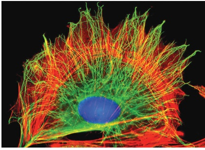

(A)

10 µm

20 µm

## ACTIN FILAMENTS

Actin filaments (also known as microfilaments) are helical polymers of the protein actin. They are flexible structures with a diameter of 8 nm that organize into a variety of linear bundles, two-dimensional networks, and three-dimensional gels. Although actin filaments are dispersed throughout the cell, they are most highly concentrated in the cortex, just beneath the plasma membrane. (i) Single actin filament; (ii) microvilli; (iii) stress fibers (red) terminating in focal adhesions (green); (iv) striated muscle.

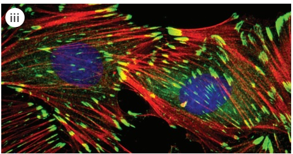

Micrographs courtesy of R. Craig (i and iv); P.T. Matsudaira and D.R. Burgess (ii); K. Burridge (iii).

## MICROTUBULES

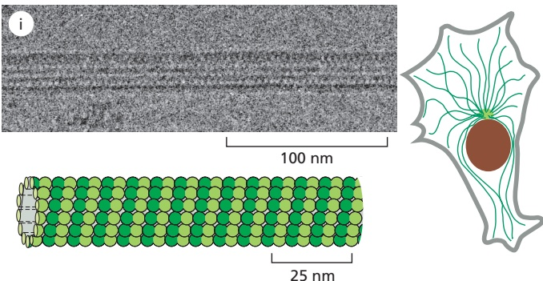

Microtubules are long, hollow cylinders made of the protein tubulin. With an outer diameter of 25 nm, they are much more rigid than actin filaments. Microtubules are long and straight and frequently have one end attached to a microtubule-organizing center (MTOC) called a centrosome. (i) Single microtubule; (ii) cross section at the base of three cilia showing triplet microtubules; (iii) interphase microtubule array (green) and organelles (red); (iv) ciliated protozoan.

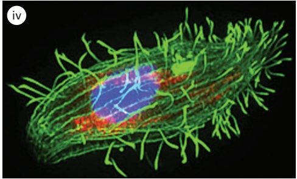

Micrographs courtesy of R. Wade (i); D.T. Woodrow and R.W. Linck (ii); J. Seemann (iii); D. Burnette (iv).

## INTERMEDIATE FILAMENTS

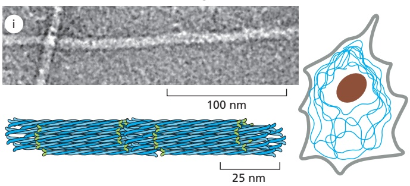

Intermediate filaments are ropelike fibers with a diameter of about 10 nm; they are made of intermediate filament proteins, which constitute a large and heterogeneous family. One type of intermediate filament forms a meshwork called the nuclear lamina just beneath the inner nuclear membrane. Other types extend across the cytoplasm, giving cells mechanical strength. In an epithelial tissue, they span the cytoplasm from one cell–cell junction to another, thereby strengthening the entire epithelium. (i) Individual intermediate filaments; (ii) intermediate filaments (blue) in neurons and (iii) epithelial cell; (iv) nuclear lamina.

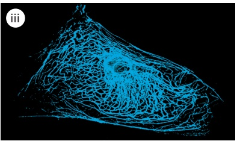

(i) From K.N. Goldie et al., J. Struct. Biol. 158:378–385, 2007; (ii) N. Kedersha; (iii) Alvin Tesler/Science Source; (iv) from U. Aebi et al., Nature 323:560–564, published 1986 by Nature Publishing Group. Reproduced with permission of SNCSC.

## Cytoskeletal Filaments Are Dynamic, but Can Nevertheless Form Stable Structures

Cytoskeletal systems are dynamic and adaptable, organized more like ant trails than interstate highways. A single trail of ants may persist for many hours, extending from the ant nest to a delectable picnic site, but the individual ants within the trail are anything but static. If the ant scouts find a new and better source of food or if the picnickers clean up and leave, the dynamic structure adapts with astonishing rapidity. In a similar way, large-scale cytoskeletal structures can change or persist, according to need, lasting for lengths of time ranging from less than a minute up to the cell’s lifetime. But the individual macromolecular components that make up these structures are in a constant state of flux. As a result, like the alteration of an ant trail, a structural rearrangement in a cell requires little extra energy when conditions change.

Regulation of the dynamic behavior and assembly of cytoskeletal filaments allows eukaryotic cells to build an enormous range of structures from the three basic filament systems. The micrographs in **Panel 16–1** illustrate some of these structures. Actin filaments underlie the plasma membrane of animal cells in a layer called the cell cortex, providing strength and shape to the thin lipid bilayer. They also form many types of cell-surface projections. Some of these are dynamic structures, such as the filopodia, lamellipodia, and pseudopodia that cells use to explore territory and move around. More stable arrays allow cells to brace themselves against an underlying substratum and enable muscle to contract. The regular bundles of stereocilia on the surface of hair cells in the inner ear contain stable bundles of actin filaments that tilt as rigid rods in response to sound, and the microvilli on the surface of intestinal epithelial cells vastly increase the apical cell-surface area to enhance nutrient absorption. In plants, actin filaments drive rapid streaming of the cytoplasm inside cells.

Microtubules, which are frequently found in a cytoplasmic array that extends to the cell periphery, can quickly rearrange themselves to form a bipolar mitotic spindle during cell division. They can also form cilia, which function as motile whips or sensory devices on the surface of the cell, or tightly aligned bundles that serve as tracks for the transport of materials down long neuronal axons. In plant cells, organized arrays of microtubules help to direct the pattern of cell-wall synthesis, and in many protozoans they form the framework upon which the entire cell is built.

Intermediate filaments line the inner face of the nuclear envelope, forming a protective cage for the cell’s DNA; in the cytosol, they are twisted into strong cables that can hold epithelial cell sheets together or help nerve cells to extend long and robust axons, and they allow us to form tough appendages such as hair and fingernails.

An important and dramatic example of rapid reorganization of the cytoskeleton occurs during cell division, as shown in **Figure 16–2** for a fibroblast growing in a tissue-culture dish. After the chromosomes have replicated, the interphase microtubule array that spreads throughout the cytoplasm is reconfigured into the bipolar mitotic spindle, which transfers the two copies of each chromosome into separate daughter nuclei. At the same time, the specialized actin structures that enable the fibroblast to crawl across the surface of the dish rearrange so that the cell stops moving and assumes a more spherical shape. Actin and its associated motor protein myosin then form a belt around the middle of the cell, the contractile ring, which constricts like a tiny muscle to pinch the cell in two. When division is complete, the cytoskeletons of the two daughter fibroblasts recreate their interphase structures, thereby converting the two rounded-up daughter cells into smaller versions of the flattened, crawling mother cell.

Many cells require rapid cytoskeletal rearrangements for their normal functioning during interphase as well. For example, the neutrophil, a type of white blood cell, chases and engulfs bacterial and fungal cells that accidentally gain access to the normally sterile parts of the body, as through a cut in the skin. Like most crawling cells, neutrophils advance by extending a protrusive structure filled with newly polymerized actin filaments. When the elusive bacterial prey moves in a different direction, the neutrophil can reorganize its polarized protrusive structures within seconds (**Figure 16–3**).

## The Cytoskeleton Determines Cellular Organization and Polarity

In cells that have achieved a stable, differentiated morphology—such as mature neurons or epithelial cells—the dynamic elements of the cytoskeleton produce stable, large-scale structures for cellular organization. For example, on the specialized epithelial cells that line organs such as the intestine and the lung, cytoskeletal-based cell-surface protrusions including microvilli and cilia are able to maintain a constant location, length, and diameter over the entire lifetime of the cell. For the actin bundles at the cores of microvilli on intestinal epithelial cells, this is only a few days. But the actin bundles at the cores of stereocilia on the hair cells of the inner ear must maintain their stable organization for the entire lifetime of the animal, because these cells do not turn over. Remarkably, the actin filaments in stereocilia are very stable, and polymerization and depolymerization have been observed only at their tips. We do not understand how these actin structures are maintained at a constant length for decades.

time

0 min

1 min

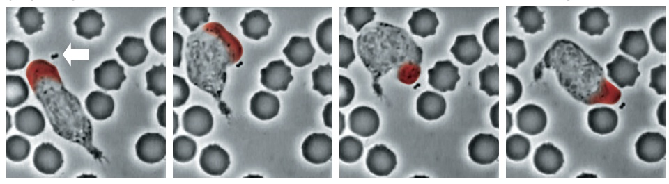

2 min

3 min

15 µm

Figure 16–2 Diagram of changes in cytoskeletal organization associated with cell division. The crawling fibroblast drawn here has a polarized, dynamic actin cytoskeleton (shown in red) that assembles lamellipodia and filopodia to push its leading edge toward the right. The polarization of the actin cytoskeleton is assisted by the microtubule cytoskeleton (green), consisting of long microtubules that emanate from a microtubule-organizing center located in front of the nucleus. When the cell divides, actin filaments are reorganized and the cell assumes a spherical shape. The polarized microtubule array rearranges to form a bipolar mitotic spindle, which is responsible for aligning and then segregating the duplicated chromosomes (brown). After chromosome segregation, the actin filaments form a contractile ring at the center of the cell that pinches the cell in two. Then the two daughter cells reorganize their microtubule and actin cytoskeletons into smaller versions of those that were present in the mother cell, enabling them to crawl their separate ways.

Figure 16–3 A neutrophil in pursuit of bacteria. In this preparation of human blood, a small clump of bacteria (white arrow) is about to be captured by a neutrophil. As the bacteria move, the neutrophil quickly reassembles the dense actin network within a pseudopod (“false foot”) at its leading edge (highlighted in red) to push toward the location of the bacteria (Movie 16.1). Rapid disassembly and reassembly of the actin cytoskeleton in this cell enable it to change its orientation and direction of movement within a few minutes. (From a video recorded by David Rogers.)

Figure 16–4 Organization of the cytoskeleton in polarized epithelial cells. All the components of the cytoskeleton cooperate to produce the characteristic shapes of specialized cells, including the epithelial cells that line the small intestine, diagrammed here. At the apical (upper) surface, facing the intestinal lumen, bundled actin filaments (red) form microvilli that increase the cell-surface area available for absorbing nutrients from food. Below the microvilli, a circumferential band of actin filaments is connected to cell–cell adherens junctions that anchor the cells to each other. Intermediate filaments (blue) are anchored to other kinds of adhesive structures, including desmosomes and hemidesmosomes, that connect the epithelial cells into a sturdy sheet and attach them to the underlying extracellular matrix; these structures are discussed in Chapter 19. Microtubules (green) run vertically from the top of the cell to the bottom and provide a global coordinate system that enables the cell to direct newly synthesized components to their proper locations.

Besides forming stable, specialized cell-surface protrusions, the cytoskeleton is also responsible for large-scale cellular polarity, enabling cells to tell the difference between top and bottom or front and back. The polarity information conveyed by cytoskeletal organization is often maintained over the lifetime of the cell. For example, polarized epithelial cells use organized arrays of microtubules, actin filaments, and intermediate filaments to maintain the critical differences between the apical surface and the basolateral surface. They also must maintain strong adhesive contacts with one another to enable this single layer of cells to serve as an effective physical barrier (**Figure 16–4**). How cell polarity is established is discussed in the last part of this chapter.

## Filaments Assemble from Protein Subunits That Impart Specific Physical and Dynamic Properties

Cytoskeletal filaments can reach from one end of the cell to the other, spanning tens or even hundreds of micrometers. Yet the individual protein molecules that form the filaments are only a few nanometers in size. The cell builds the filaments by assembling large numbers of the small subunits, like building a skyscraper out of bricks. Because these subunits are small, they can diffuse rapidly in the cytosol, whereas the assembled filaments cannot. In this way, cells can undergo rapid structural reorganizations, disassembling filaments at one site and reassembling them at another site far away.

Actin filaments and microtubules are built from subunits that are compact and globular—actin subunits for actin filaments and tubulin subunits for microtubules—whereas intermediate filaments are made up of subunits that are themselves elongated and fibrous. All three major types of cytoskeletal filaments form as polymeric assemblies of subunits that self-associate, using a combination of end-to-end and side-to-side protein contacts. Whereas covalent linkages between their subunits hold together the backbones of many biological polymers—including DNA, RNA, and proteins—it is weak noncovalent interactions that hold together the three types of cytoskeletal polymers. Because covalent bonds are not being formed or broken, assembly and disassembly can occur rapidly. Differences in the structures of the subunits and how they associate with one another produce important differences in the stability and mechanical properties of each type of filament.

The subunits of actin filaments and microtubules are asymmetrical and bind to one another head-to-tail so that they all point in one direction. This subunit polarity gives the filaments structural polarity along their length and makes the two ends of each polymer behave differently. In addition, the actin and tubulin subunits are enzymes that catalyze the hydrolysis of a nucleoside triphosphate (NTP)—ATP and GTP, respectively. As we discuss later, the energy derived from NTP hydrolysis helps the filaments to remodel rapidly. It allows the cell to harness the polar and dynamic properties of these filaments to generate force in a specific direction to move the leading edge of a migrating cell forward, for example, or to pull chromosomes apart during cell division. In contrast, the subunits of intermediate filaments are symmetrical and thus do not form polarized filaments with two different ends. Intermediate filament subunits also do not catalyze the hydrolysis of ATP or GTP. Nevertheless, intermediate filaments can be disassembled rapidly when required. In mitosis, for example, kinases phosphorylate the subunits, leading to their dissociation.

Cytoskeletal filaments in living cells are not built by simply stringing subunits together in single file. A thousand tubulin subunits lined up end-to-end, for example, would span the diameter of a small eukaryotic cell, but a filament formed in this way would lack the strength to avoid breakage by ambient thermal energy, unless each subunit in the filament was bound extremely tightly to its two neighbors. Such tight binding would limit the rate at which the filaments could disassemble, making the cytoskeleton a static and less useful

Figure 16–5 The thermal stability of cytoskeletal filaments with dynamic ends. A protofilament consisting of a single strand of subunits is thermally unstable, because breakage of a single bond between subunits is sufficient to break the filament. In contrast, formation of a cytoskeletal filament from more than one protofilament allows the ends to be dynamic, while enabling the filaments themselves to resist thermal breakage. In a microtubule, for example, removing a single subunit dimer from the end of the filament requires breaking noncovalent bonds with a maximum of three other subunits, whereas fracturing the filament in the middle requires breaking noncovalent bonds in all 13 protofilaments.

Figure 16–6 Flexibility and stretch in an intermediate filament. Intermediate filaments are formed from elongated fibrous subunits with strong lateral contacts, resulting in resistance to stretching forces. In this experiment, a tiny mechanical probe was used to rapidly scan across a surface to which intermediate filaments were adhered, providing a measurement of the height and contour of the filaments as shown in shades of gray to white. Along a single scan line (arrow) the applied force of the probe was increased from less than 1 nN to 30–40 nN. At this position one of the filaments stretched to more than three times its length before breaking, as illustrated in the micrographs. This technique is called atomic force microscopy. (Adapted from L. Kreplak et al., J. Mol. Biol. 354:569–577, 2005. With permission from Elsevier.)

structure. To provide both strength and adaptability, microtubules are built of 13 **protofilaments**—linear strings of subunits joined end to end—that associate with one another laterally to form a hollow cylinder. The addition or loss of a subunit at the end of one protofilament makes or breaks a small number of bonds. In contrast, loss of a subunit from the middle of a protofilament requires breaking many more bonds, while breaking it in two requires breaking bondsMBoC7 m16.06/16.06 in multiple protofilaments all at the same time (**Figure 16–5**). The greater energy required to break multiple noncovalent bonds simultaneously allows microtubules to resist thermal breakage, while allowing rapid subunit addition and loss at the filament ends. Although made up of only two strands instead of 13, helical actin filament subunits also make both end-to-end and side-to-side contacts, allowing for rapid dynamics at filament ends while providing sufficient strength along the length of the filament. However, the tubular geometry of a microtubule makes it much stiffer than a two-stranded actin filament.

As with other specific protein–protein interactions, many hydrophobic interactions and noncovalent bonds hold the subunits in a cytoskeletal filament together (see Figure 3–4). The locations and types of subunit–subunit contacts differ for the different filaments. Intermediate filaments, for example, assemble by forming strong lateral contacts between α-helical coiled-coils, which extend over most of the length of each elongated fibrous subunit. Because the individual subunits are staggered in the filament, intermediate filaments form strong, ropelike structures that tolerate stretching and bending to a greater extent than do either actin filaments or microtubules (**Figure 16–6**).

## Accessory Proteins and Motors Act on Cytoskeletal Filaments

The cell regulates the length and stability of its cytoskeletal filaments, their number and geometry, and their attachments to one another and to other components of the cell. Filaments can thereby form a wide variety of higher-order structures. Direct covalent modification of the filament subunits regulates some filament properties, but most of the regulation is performed by hundreds of accessory proteins that determine the spatial distribution and the dynamic behavior of the filaments, converting information received through signaling pathways into cytoskeletal action. These accessory proteins bind to the filaments or their subunits to determine the sites of assembly of new filaments, to regulate the partitioning of polymer proteins between filament and subunit forms, to change the kinetics of filament assembly and disassembly, to harness energy to generate force, and to link filaments to one another or to other cell structures such as organelles and the plasma membrane. In these processes, the accessory proteins bring cytoskeletal structure under the control of extracellular and intracellular signals, including those that trigger the dramatic transformations of the cytoskeleton that occur during each cell cycle. Acting in groups, the accessory proteins enable cells to maintain a highly organized but flexible internal structure and, in many cases, to move.

Among the most fascinating proteins that associate with the cytoskeleton are the motor proteins. These proteins bind to a polarized cytoskeletal filament and use the energy derived from repeated cycles of ATP hydrolysis to move along it. Dozens of different motor proteins coexist in every eukaryotic cell. They differ in the type of filament they bind to (either actin or microtubules), the direction in which they move along the filament, and the “cargo” they carry. Many motor proteins carry membrane-enclosed organelles—such as mitochondria, Golgi stacks, or secretory vesicles—to their appropriate locations in the cell. Other motor proteins cause cytoskeletal filaments to exert tension or to slide against each other, generating the force that drives such phenomena as muscle contraction, ciliary beating, and cell division.

Cytoskeletal motor proteins that move unidirectionally along an oriented polymer track are reminiscent of some other proteins and protein complexes discussed elsewhere in this book, such as DNA and RNA polymerases, helicases, and ribosomes. All of these proteins have the ability to use chemical energy to propel themselves along a linear track, with the direction of sliding dependent on the structural polarity of the track. All of them generate motion by coupling nucleoside triphosphate hydrolysis to a large-scale conformational change (see Figure 3–71).

## Molecular Motors Operate in a Cellular Environment Dominated by Brownian Motion

Because of the microscopic size of cells, motor-based movements occur in an environment that is highly dynamic due to random thermal fluctuations called Brownian motion. As introduced in Chapter 1 (see p. 9), Brownian motion drives the diffusion of all of the molecules inside cells, and it is thereby critical for the rate of biochemical reactions, which require molecular collisions. Another important effect is its generation of viscous drag forces at small scales. For example, a motor protein moving along a cytoskeletal filament is constantly buffeted by random collisions with water and other molecules. As soon as its motor activity ceases, the motor protein will stop dead in its tracks due to the viscous drag forces generated by these collisions.

The stopping distance for any object moving through a fluid is determined by the **Reynolds number**, which is the ratio of inertial to viscous forces acting on that object. This ratio depends on the size of the object and the velocity of its movement through the fluid. For example, whereas both a bacterium and a fish can propel themselves through water, the size and speed of the fish provide it with significant inertia, such that when it stops swimming it continues to glide through the water for some distance. In contrast, with its much smaller size and slow speed of movement, a bacterium that stops propelling itself will come to an immediate halt (**Figure 16–7**). For a fish to behave similarly, it would need to be placed in an extremely viscous medium, such as roofing tar. Inside the cell, the tiny size and slow speeds of moving molecules result in extremely low Reynolds numbers, because viscous forces are far greater than inertial forces. Thus, there is no “gliding” inside a cell.

Random Brownian motion can also be harnessed to control movement at small scales, even in the absence of motor proteins. As we describe later in this chapter, some intracellular pathogens such as the bacterium Listeria monocytogenes use the force of actin polymerization to move around inside a cell. This movement does not involve motor proteins. Instead, actin filaments are induced to polymerize adjacent to the bacterial surface at one end. When the bacterium randomly moves in the forward direction due to Brownian motion, actin quickly fills in the gap so that the bacterium cannot slip back to its original position. In this way, actin polymerization generates a force that pushes the bacterium through the cytoplasm (see Figure 16–17). A similar process drives forward movement of the plasma membrane at the leading edge of a migrating animal cell (see Figure 1–7). This phenomenon, in which random thermal motions are harnessed in a directed way, creates a Brownian ratchet.

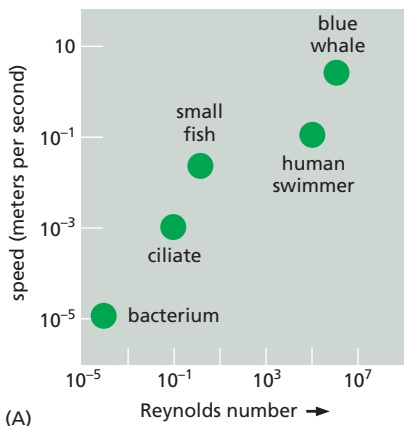

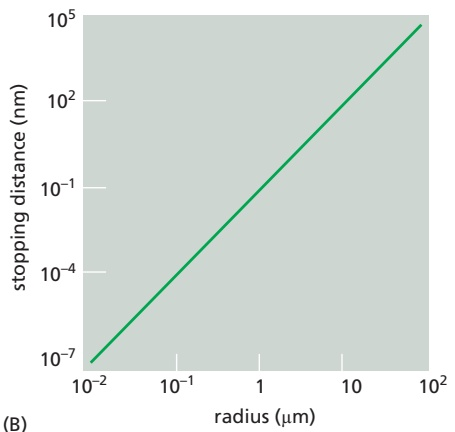

(B)

Figure 16–7 Cellular life occurs at a low Reynolds number. (A) The inertia of a swimming organism is counteracted by the viscous drag of water, and the ratio of these two forces is the Reynolds number, which is dimensionless. As illustrated in the graph, the Reynolds number is in the range of $1 0 ^ { 6 }$ for a blue whale traveling at about 10 meters per second. For a tiny swimming MBoC7 n1.111/1.07bacterium moving at 10–5 meters per second, the viscosity of the water dominates and the Reynolds number decreases to about 10–4. (B) The Reynolds number indicates the extent to which an object will continue to coast or glide through a fluid after the motive force has stopped. The stopping distance in water for a sphere that has an initial velocity equal to its diameter per second is plotted. Thus, a one micron–diameter organelle would come to a halt within just a few angstroms once its forward motion ceases.

## Summary

The cytoplasm of eukaryotic cells is spatially organized by a network of protein filaments known as the cytoskeleton. This network contains three principal types of filaments: actin filaments, microtubules, and intermediate filaments. All three types of filaments form from assemblies of subunits that self-associate using a combination of end-to-end and side-to-side protein contacts. Differences in the structure of the subunits and the manner of their self-assembly give the filaments different mechanical properties. Subunit assembly and disassembly constantly remodel all three types of cytoskeletal filaments. Actin and tubulin (the subunits of actin filaments and microtubules, respectively) bind and hydrolyze nucleoside triphosphates (ATP and GTP, respectively) and assemble head-to-tail to generate polarized filaments capable of generating force. In living cells, accessory proteins including molecular motors modulate the dynamics and organization of cytoskeletal filaments, resulting in complex events such as cell division, migration, or muscle contraction, and generating elaborate cellular architecture to form polarized tissues such as epithelia.

## ACTIN

The actin cytoskeleton performs a wide range of functions in diverse cell types. Each actin subunit, sometimes called globular or G-actin, is a 375-amino-acid polypeptide carrying a tightly associated molecule of ATP or ADP (**Figure 16–8A**). Actin is extraordinarily well conserved among eukaryotes. The amino acid sequences of actins from different eukaryotic species are usually about 90% identical. Small variations in actin amino acid sequence can cause significant functional differences: In vertebrates, for example, there are three isoforms of actin, termed α, β, and γ, that differ slightly in their amino acid sequences and have distinct functions. α-Actin is expressed only in muscle cells, while β- and γ-actins are found together in almost all non-muscle cells.

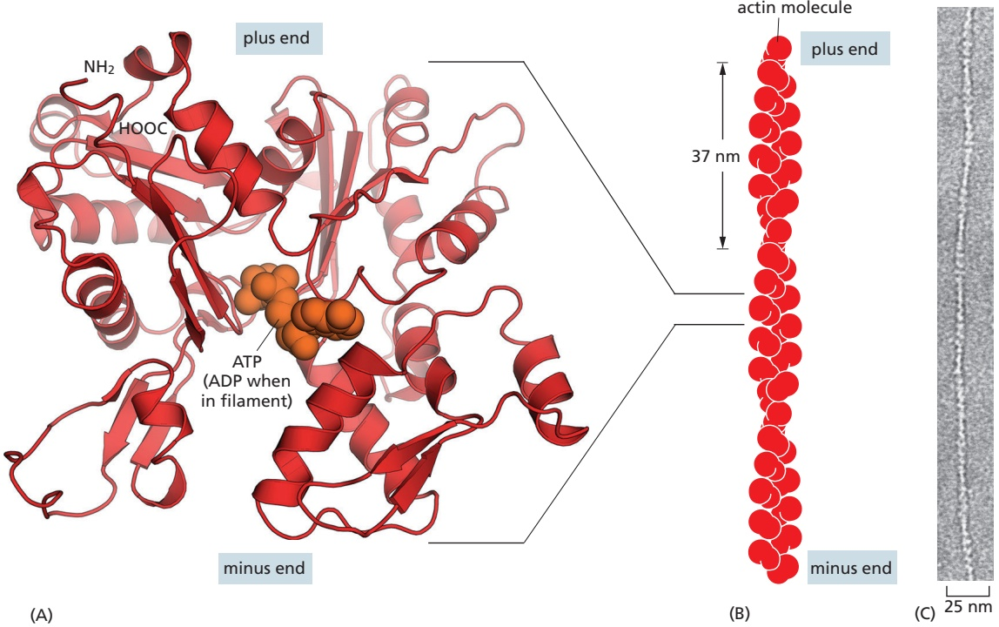

Figure 16–8 The structures of an actin monomer and actin filament. (A) The actin monomer has either ATP or ADP bound in a deep cleft in the center of the molecule. (B) Arrangement of monomers in a filament consisting of two protofilaments, held together by lateral contacts, which wind around each other as two parallel strands of a helix, with a twist repeating every 37 nm. All the subunits within the filament have the same orientation. (C) Electron micrograph of negatively stained actin filament. (C, courtesy of Roger Craig.)

## Actin Subunits Assemble Head-to-Tail to Create Flexible, Polar Filaments

Actin subunits assemble head-to-tail to form a tight, right-handed helix, forming a structure about 8 nm wide called filamentous or F-actin (**Figure 16–8B and C**). Because the asymmetrical actin subunits of a filament all point in the same direction, filaments are polar and have structurally different ends: a slowergrowing minus end and a faster-growing plus end. The minus end is also referred to as the pointed end and the plus end as the barbed end because of the arrowhead appearance of the complex formed between actin filaments and the motor protein myosin visible in electron micrographs (**Figure 16–9**). Within the filament, the subunits are positioned with their ATP-binding cleft directed toward the minus end.

Individual actin filaments are quite flexible. The stiffness of a filament can be characterized by its persistence length, the minimum filament length at which random thermal fluctuations are likely to cause it to bend. The persistence length of an actin filament is only a few tens of micrometers. In a living cell, however, accessory proteins frequently cross-link and bundle the filaments together, making largescale actin structures that are much more rigid than an individual actin filament.

## Nucleation Is the Rate-limiting Step in the Formation of Actin Filaments

The regulation of actin filament formation is an important mechanism by which cells control their shape and movement. Actin subunits can spontaneously bind one another, but the association is unstable until subunits assemble into an initial oligomer, or nucleus, that is stabilized by multiple subunit–subunit contacts and can then elongate rapidly by addition of more subunits. This process is called filament nucleation.

Figure 16–9 Structural polarity of the actin filament. (A) This electron micrograph shows an actin filament polymerized from a short actin filament seed that was decorated with myosin motor domains, resulting in an arrowhead pattern. The filament has grown much faster at the barbed (plus) end than at the pointed (minus) end. (B) Enlarged image and model showing the arrowhead pattern. (A, courtesy of Tom Pollard; B, adapted from M. Whittaker et al., Ultramicroscopy 58:245–259, 1995. With permission from Elsevier.)

Many features of actin nucleation and polymerization have been studied with purified actin in a test tube (**Figure 16–10**). The instability of smaller actinMBoC7 m16.12/16.09 oligomers makes nucleation inefficient. When polymerization is initiated, this results in a lag phase during which no filaments are observed. During this lag phase, however, the small, unstable oligomers gradually succeed in making the transition to a more stable form that resembles an actin filament. This leads to a phase of rapid filament elongation during which subunits are added quickly to the ends of the nucleated filaments (Figure 16–10A). Finally, as the concentration of actin monomers declines, the system approaches a steady state at which the rate of addition of new subunits to the filament ends exactly balances the rate of subunit dissociation. The concentration of free subunits left in solution at this point is called the critical concentration, $C _ { \mathrm { { C } } } .$ As explained in **Panel 16–2**, the

Figure 16–10 The time course of actin polymerization. Purified actin subunits were induced to polymerize in a test tube. (A) Polymerization of actin subunits into filaments occurs after a lag phase. (B) Polymerization occurs more rapidly in the presence of preformed fragments of actin filaments, which act as nuclei for filament growth. The percent (%) free subunits after polymerization reflects the critical concentration $( C _ { \complement } ) ,$ at which there is no net change in polymer. The $C _ { \mathrm { C } }$ has a constant value of ∼0.1 $\mu \mathsf { M } ,$ but the percent of actin subunits in filaments varies depending on how much actin is present in the reaction. Actin polymerization is often studied by observing the change in the light emission from a fluorescent probe, called pyrene, that has been covalently attached to the actin. Pyrene-actin fluoresces more brightly when it is incorporated into actin filaments.

## ON RATES AND OFF RATES

A linear polymer of protein molecules, such as an actin filament or a microtubule, assembles (polymerizes) and disassembles (depolymerizes) by the addition and removal of subunits at the ends of the polymer. The rate of addition of these subunits (called monomers) is given by the rate constant $k _ { \mathrm { o n } } ,$ which has units of $\mathsf { M } ^ { - 1 }   \mathsf { s e c } ^ { - 1 }$ . The rate of loss is given by $k _ { \mathrm { o f f } }$ (units of sec–1).

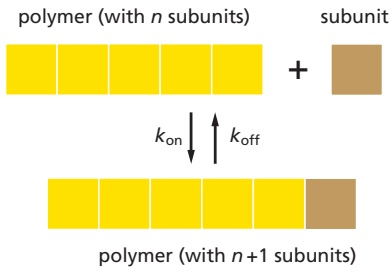

## THE CRITICAL CONCENTRATION

The number of monomers that add to the polymer (actin filament or microtubule) per second will be proportional to the concentration of the free subunit $( k _ { \mathrm { o n } } C ) ,$ but the subunits will leave the polymer end at a constant rate $( k _ { \mathrm { o f f } } )$ that does not depend on C. As the polymer grows, subunits are used up, and C is observed to drop until it reaches a constant value, called the critical concentration (C ). At this concentration, the rate of subunit addition equals the rate of subunit loss.

At this equilibrium,

$$
k _ {\text {on}} C = k _ {\text {off}}
$$

so that

$$
C _ {c} = \frac {k _ {\text {off}}}{k _ {\text {on}}} = K _ {d}
$$

where $K _ { \mathrm { d } }$ is the dissociation constant.

## PLUS AND MINUS ENDS

The two ends of an actin filament or microtubule polymerize at different rates. The fast-growing end is called the plus end, whereas the slow-growing end is called the minus end. The difference in the rates of growth at the two ends is made possible by changes in the conformation of each subunit as it enters the polymer.

This conformational change affects the rates at which subunits add to the two ends.

Even though $k _ { \mathrm { o n } }$ and $k _ { \mathrm { o f f } }$ will have different values for the plus and minus ends of the polymer, their ratio $k _ { \mathrm { o f f } } / k _ { \mathrm { o n } ^ { - } }$ —and hence $C_{c} — \mathsf{m}\mathsf{u}\mathsf{s}\mathsf{t}$ be the same at both ends for a simple polymerization reaction (no ATP or GTP hydrolysis). This is because exactly the same subunit interactions are broken when a subunit is lost at either end, and the final state of the subunit after dissociation is identical. Therefore, the ΔG for subunit

## NUCLEATION

A helical polymer is stabilized by multiple contacts between adjacent subunits. In the case of actin, two actin molecules bind relatively weakly to each other, but addition of a third actin monomer to form a trimer makes the entire group more stable.

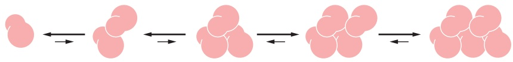

Further monomer addition can take place onto this trimer, which therefore acts as a nucleus for polymerization. For tubulin, the nucleus is larger and has a more complicated structure (possibly a ring of 13 or more tubulin molecules)—but the principle is the same.

The assembly of a nucleus is relatively slow, which explains the lag phase seen during polymerization. The lag phase can be reduced or abolished entirely by adding premade nuclei, such as fragments of already polymerized microtubules or actin filaments.

## TIME COURSE OF POLYMERIZATION

The in vitro assembly of a protein into a long polymer such as a cytoskeletal filament typically shows the following time course:

The lag phase corresponds to time taken for nucleation.

The growth phase occurs as monomers add to the exposed ends of the growing filament, causing filament elongation.

The equilibrium phase, or steady state, is reached when the growth of the polymer due to monomer addition precisely balances the shrinkage of the polymer due to disassembly back to monomers.

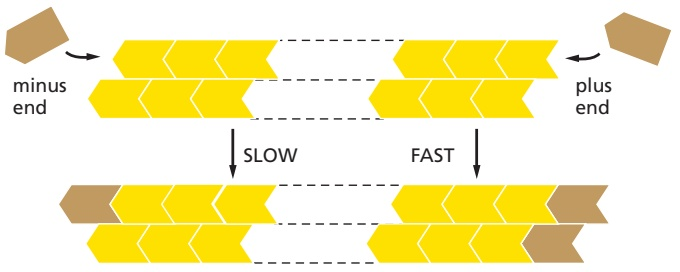

loss, which determines the equilibrium constant for its association with the end, is identical at both ends: if the plus end grows four times faster than the minus end, it must also shrink four times faster. Thus, for $C > C _ { c r }$ both ends grow; for $C < C _ { c r }$ both ends shrink.

The nucleoside triphosphate hydrolysis that accompanies actin and tubulin polymerization removes this constraint.