ACTIN

973

the innate immune response. Osteoclasts tunnel into bone, forming channels that are filled in by the osteoblasts that follow them, in a continual process of bone remodeling and renewal. Similarly, fibroblasts migrate through connective tissues, remodeling them where necessary and helping to rebuild damaged structures at sites of injury. In an ordered procession, the cells in the epithelial lining of the intestine travel up the sides of the intestinal villi, replacing absorptive cells lost at the tip of the villus. Cell migration also has a role in many cancers, when cells in a primary tumor invade neighboring tissues and crawl into blood vessels or lymph vessels and then emerge at other sites in the body to form metastases.

Cell migration depends on the actin-rich cortex that lies beneath the plasma membrane. **Figure 16–19** illustrates distinct modes of cell migration on the basis of how the actin is organized. All migration is characterized by protrusion, in which the plasma membrane is pushed out at the front of the cell. In **mesenchymal cell migration**, characteristic of fibroblasts or epithelial cells grown on glass surfaces, the Arp2/3 complex mediates actin filament

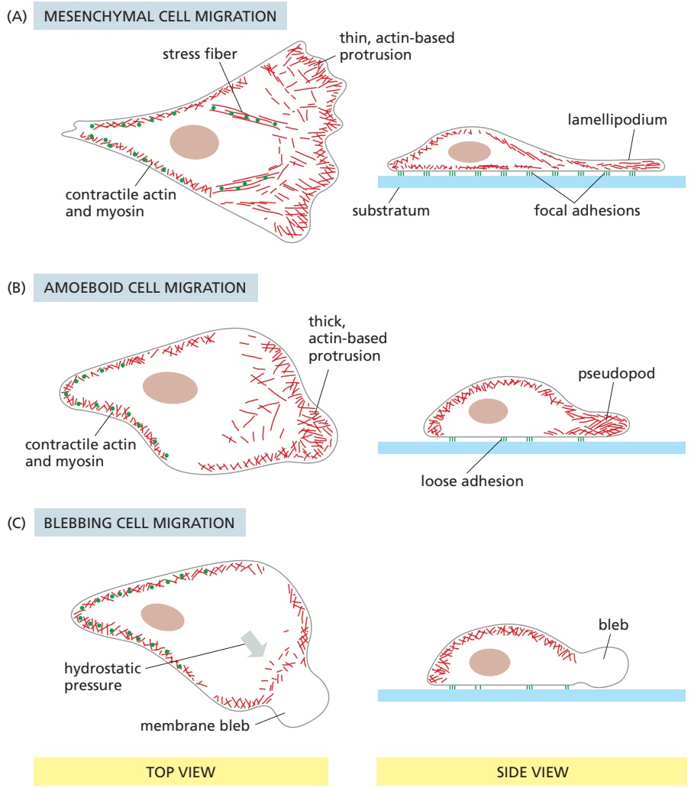

Figure 16–19 Modes of cell migration. (A) In the mesenchymal mode of cell migration, focal adhesions form behind protruding lamellipodia that connect to contractile stress fibers, bracing the cell against the surface (substratum) across which it is migrating. (B) In amoeboid cell migration, a three-dimensional pseudopod is formed by explosive actin polymerization at the leading edge. Cells MBoC7 n16.204-16.19maintain traction even though adhesion to the substratum is reduced, enabling much more rapid cell movement. (C) Leading edge protrusion can also occur through the formation of a bleb if the plasma membrane detaches from the underlying cortex and is pushed out by hydrostatic pressure. In all three modes of migration, contraction of cortical actin and myosin II at the rear of the cell drives locomotion of the cell body.

---

974

Chapter 16: The Cytoskeleton

nucleation at the leading edge of the cell, thereby generating a lamellipodium (see Figure 16–18). Behind the leading edge, cofilin (see Figure 16–16) disassembles the older (ADP-bound) actin filaments. The actin network is therefore assembling at the front and disassembling at the back, reminiscent of the treadmilling that occurs in individual actin filaments as discussed previously (see Figure 16–11). Mesenchymal cell migration requires firm attachment to the underlying substratum, which allows the cell body to generate traction and propel itself forward. The actin cytoskeleton braces itself using stress fibers connected to integrin-based focal adhesions on the bottom surface of the cell (see Figure 19–56). Contraction of bundles of actin filaments and myosin II motors at the rear of the cell, coordinated with disassembly of attachment sites, enables the cell body to translocate.

Mesenchymal cell migration is slow, with movement rates of less than 1 μm per minute. In contrast, a second mode of cell migration, **amoeboid cell migration**, resembles the rapid movement and shape changes typical of amoebae and can be hundreds of times faster (**Movie 16.2**). This mode of movement is typical of white blood cells such as neutrophils and is characterized by the explosive extension of cell protrusions by local activation of the Arp2/3 complex. The protrusions are much thicker than lamellipodia and are called **pseudopodia** (or pseudopods). In contrast to mesenchymal cell migration, amoeboid-type movement does not rely as heavily on integrin-based attachments to the underlying surface. Traction nevertheless occurs through a weaker association to the substratum, and migrating cells appear more rounded. Locomotion is accompanied by a combination of protrusion at the front of the cell and contraction at the rear.

Protrusion of pseudopodia is driven by the same principles of actin filament polymerization and depolymerization that operate in lamellipodia, with cycles of actin nucleation, polymerization, and disassembly at the leading edge of the cell, but generating a three-dimensional rather than a two-dimensional structure. A distinct type of three-dimensional membrane protrusion can also result from a process called **blebbing**. In this case, the plasma membrane detaches locally from the underlying actin cortex, thereby allowing cytoplasmic flow to push the membrane outward. The formation of a membrane bleb depends on hydrostatic pressure, which is generated by the contraction of actin and myosin assemblies in the rear of the cell. Once blebs have extended, actin filaments reassemble on the inside surface of the blebbed membrane to form a new actin cortex.

Thus, leading-edge protrusion, adhesion to the surface, and contraction at the cell cortex underlie all modes of cell migration. These migration modes can interconvert depending on cell state, the extracellular environment, and the activation of different signaling pathways.

## Cells Migrating in Three Dimensions Can Navigate Around Barriers

Studying the movement of cells on two-dimensional surfaces reveals important principles of cell migration. Most migrating cells in the body, however, must negotiate their way through a complex, three-dimensional environment. Surrounded by other cells and extracellular matrix, migrating cells are confined in space and must navigate around physical barriers separating them from their destination. During immune surveillance, for example, white blood cells called dendritic cells migrate between sites of infection and lymph nodes to initiate a systemic immune response (see Chapter 24). Dendritic cell migration can be mimicked by embedding them in a three-dimensional collagen gel matrix, in which they undergo rapid amoeboid migration toward a chemotactic signal, extending a large number of actin-rich protrusions (**Figure 16–20A and B**). When introduced into a microchamber containing different-sized channels, a cell will choose the widest path (**Figure 16–20C**). Later in this chapter, we discuss how chemotactic cues induce cell polarization and guide a migrating cell in the right direction.

---

ACTIN

975

Figure 16–20 A dendritic cell migrating in three dimensions. (A) Schematic of a cell introduced into a collagen gel matrix. Images at right show that a chemotactic signal gradient induces polarized extension of pseudopodia that explore the environment, seeking out a path through gaps in the gel matrix that are typically smaller than the cell diameter. The nucleus is stained with a blue dye. (B) Three-dimensional image of a dendritic cell and its many pseudopodia (outlined in red) that is based on fluorescence microscopy. A portion of the collagen matrix surrounding the cell is shown in gray. (C) In this experiment, a dendritic cell was introduced into a microchannel that contains a decision point with four different pore sizes. Using the nucleus as a gauge, the cell ultimately chooses a path through the largest pore (Movie 16.3). (Courtesy of Michael Sixt.)

Some cells use specialized adhesion structures called **podosomes** that areMBoC7 n16.205/16.20 important for cells to cross tissue barriers, for example during embryonic development. **Invadopodia** are related structures that contribute to the migration of metastatic cancer cells invading a tissue. Podosomes and invadopodia contain many of the same actin-regulatory components as other protrusions. They also secrete proteases that degrade the extracellular matrix, allowing them to carve through matrix barriers in their path.

## Summary

Actin is a highly conserved cytoskeletal protein that is present in high concentrations in nearly all eukaryotic cells. Nucleation presents a kinetic barrier to actin polymerization, but once formed, actin filaments undergo dynamic behavior due to hydrolysis of the bound ATP. Actin filaments are polarized and can undergo treadmilling when a filament assembles at the plus end while simultaneously depolymerizing at the minus end. In cells, actin filament dynamics are regulated at every step, and the varied forms and functions of actin depend on a versatile repertoire of accessory proteins. Approximately half of the actin is kept in a monomeric form through association with proteins such as profilin. Nucleation factors such as the Arp2/3 complex and formins promote formation of branched and parallel filaments, respectively. Interplay between proteins that bind or cap actin filaments and those that promote filament severing or depolymerization can slow or accelerate the kinetics of filament assembly and disassembly. Another class of accessory proteins assembles the filaments into larger ordered structures by cross-linking them to one another in geometrically defined ways. Connections between these actin arrays and the plasma membrane of cells give an animal cell mechanical strength and permit the elaboration of cortical cellular structures such as lamellipodia, filopodia, pseudopodia, and microvilli. By inducing actin filament polymerization at their surface, intracellular pathogens can hijack the host-cell cytoskeleton and move around inside the cell. Cell migration depends on the formation of protrusions at the leading edge by assembly of new actin filaments or membrane blebbing, traction against the underlying substratum, and contractile forces generated by myosin motors to bring the cell body forward.

---

976

Chapter 16: The Cytoskeleton

Figure 16–21 Myosin II. (A) The two globular heads and long tail of a myosin II molecule shadowed with platinum can be seen in this electron micrograph. (B) A myosin II molecule is composed of two heavy chains (each about 2000 amino acids long; green) and four light chains (blue). The light chains are of two distinct types, and one copy of each type is present on each myosin head. Dimerization occurs when the two α helices of the heavy chains wrap around each other to form a coiledcoil, driven by the association of regularly spaced hydrophobic amino acids (see Figure 3–8). The coiled-coil arrangement makes an extended rod in solution, and this part of the molecule forms the tail. (A, courtesy of David Shotton.)

## MYOSIN AND ACTIN

A crucial feature of the actin cytoskeleton is that it can form contractile structures that cross-link and slide actin filaments relative to one another through the action of **myosin** motor proteins. Actin–myosin assemblies perform important functions in all eukaryotic cells, such as in cell migration as described earlier. In addition, actin and myosin drive muscle contraction.

## Actin-based Motor Proteins Are Members of the Myosin Superfamily

The first motor protein to be identified was skeletal muscle myosin, which gen-MBoC7 m16.26/16.21 erates the force for muscle contraction. This protein, now called myosin II, is an elongated protein formed from two heavy chains and two copies of each of two light chains. Each heavy chain has a globular head domain at its N-terminus that contains the force-generating machinery, followed by a very long α-helical amino acid sequence that forms an extended coiled-coil to mediate heavy-chain dimerization (**Figure 16–21**). The two light chains bind close to the N-terminal head domain, while the long coiled-coil tail bundles itself with the tails of other myosin molecules. In skeletal muscle, these tail–tail interactions form large, bipolar thick filaments that have several hundred myosin heads, oriented in opposite directions at the two ends of the thick filament (**Figure 16–22**).

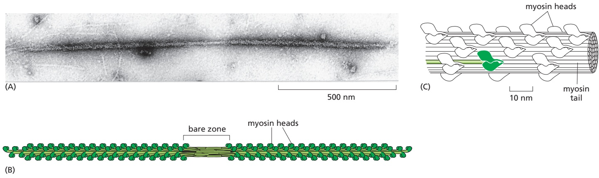

Figure 16–22 The myosin II bipolar thick filament in muscle. (A) Electron micrograph of a myosin II thick filament isolated from frog muscle. Note the central bare zone, which is free of head domains. (B) Schematic diagram, not drawn to scale. The myosin II molecules aggregate by means of their tail regions, with their heads projecting to the outside of the filament. The bare zone in the center of the filament consists entirely of myosin II tails. (C) A small section of a myosin II filament as reconstructed from electron micrographs. In the relaxed (noncontracting) state, the two heads of a myosin molecule are bent backward and sterically interfere with each other to switch off their activity. An individual myosin molecule in the inactive state is highlighted in green. The cytoplasmic myosin II filaments in non-muscle cells are much smaller, although similarly organized (see Figure 16–34). (A, from M. Stewart and R.W. Kensler, J. Mol. Biol. 192:831–851, 1986. With permission from Elsevier; C, based on R.A. Crowther et al., J. Mol. Biol. 184:429–439, 1985.)

---

MYOSIN AND ACTIN

977

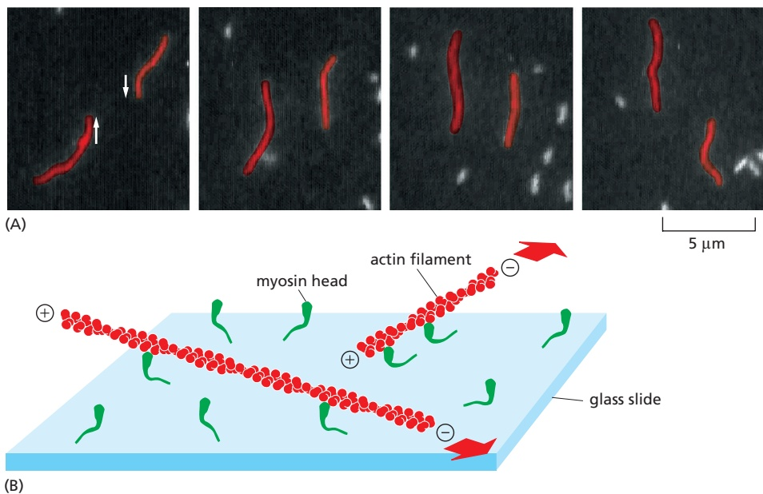

Figure 16–23 Direct evidence for the motor activity of the myosin head. In this experiment, purified myosin heads were attached to a glass slide, and then actin filaments labeled with fluorescent phalloidin were added and allowed to bind to the myosin heads. (A) When ATP was added, the actin filaments began to glide along the surface, owing to the many individual steps taken by each of the dozens of myosin heads bound to each filament. The video frames shown in this sequence were recorded about 0.6 second apart; the two actin filaments shown (red) were moving in opposite directions at a rate of about 4 μm/sec. (B) Diagram of the experiment. The large red arrows indicate the direction of actin filament movement (Movie 16.4). (A, courtesy of James Spudich.)

Each myosin head binds and hydrolyzes ATP, using the energy of ATP hydrolysis to walk toward the plus end of an actin filament (**Figure 16–23**). The opposing orientation of the heads in the thick filament makes the filament efficient at sliding pairs of oppositely oriented actin filaments toward each other, shortening the muscle. In skeletal muscle, in which carefully arranged actin filaments are aligned in thin filament arrays surrounding the myosin thick filaments, the ATP-driven sliding of actin filaments results in a powerful contraction. Cardiac and smooth muscle contain myosin II molecules that are similarly arranged, although different genes encode them.

## Myosin Generates Force by Coupling ATP Hydrolysis to Conformational Changes

Motor proteins use structural changes in their ATP-binding sites to produce cyclic interactions with a cytoskeletal filament. Each cycle of ATP binding, hydrolysis, and release propels them forward in a single direction to a new binding site along the filament. For myosin II, each step of the movement along actin is generated by the swinging of an 8.5-nm-long α helix, or lever arm, which is structurally stabilized by the binding of light chains. At the base of this lever arm next to the head, there is a pistonlike helix that connects movements at the ATP-binding cleft in the head to small rotations of the so-called converter domain. A small change at this point can swing the helix like a long lever, causing the far end of the helix to move by about 5.0 nm.

These changes in the conformation of the myosin are coupled to changes in its binding affinity for actin, allowing the myosin head to release its grip on the actin filament at one point and snatch hold of it again at another. The full mechanochemical cycle of ATP binding, ATP hydrolysis, and phosphate release (which causes the power stroke) produces a single step of movement (**Figure 16–24**). At low ATP concentrations, the interval between the force-producing step and the binding of the next ATP is long enough that single steps can be observed (**Figure 16–25**).

## Sliding of Myosin II Along Actin Filaments Causes Muscles to Contract

Muscle contraction is the most familiar and best-understood form of movement in animals. In vertebrates, running, walking, swimming, and flying all depend on the rapid contraction of skeletal muscle on its scaffolding of bone, while

---

978

Chapter 16: The Cytoskeleton

**ATTACHED** At the start of the cycle shown in this figure, a myosin head lacking a bound nucleotide is locked tightly onto an actin filament in a rigor configuration (so named because it is responsible for rigor mortis, the rigidity of death). In an actively contracting muscle, this state is very short-lived, being rapidly terminated by the binding of a molecule of ATP.

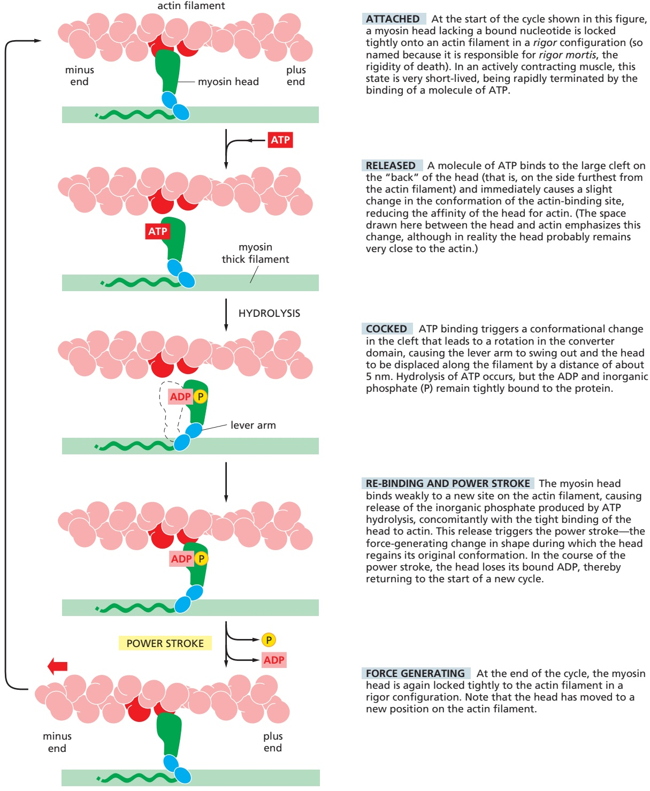

**RELEASED** A molecule of ATP binds to the large cleft on the “back” of the head (that is, on the side furthest from the actin filament) and immediately causes a slight change in the conformation of the actin-binding site, reducing the affinity of the head for actin. (The space drawn here between the head and actin emphasizes this change, although in reality the head probably remains very close to the actin.)

**COCKED** ATP binding triggers a conformational change in the cleft that leads to a rotation in the converter domain, causing the lever arm to swing out and the head to be displaced along the filament by a distance of about 5 nm. Hydrolysis of ATP occurs, but the ADP and inorganic phosphate (P) remain tightly bound to the protein.

**RE-BINDING AND POWER STROKE** The myosin head binds weakly to a new site on the actin filament, causing release of the inorganic phosphate produced by ATP hydrolysis, concomitantly with the tight binding of the head to actin. This release triggers the power stroke—the force-generating change in shape during which the head regains its original conformation. In the course of the power stroke, the head loses its bound ADP, thereby returning to the start of a new cycle.

**FORCE GENERATING** At the end of the cycle, the myosin head is again locked tightly to the actin filament in a rigor configuration. Note that the head has moved to a new position on the actin filament.

Figure 16–24 The cycle of structural changes used by myosin II to walk along an actin filament. In the myosin II cycle, the head remains bound to the actin filament for only about 5% of the entire cycle time, allowing many myosins to work together to move a single actin filament (Movie 16.5). (Based on I. Rayment et al., Science 261:58–65, 1993.)

involuntary movements such as heart pumping and gut peristalsis depend on theMBoC7 m16.29/16.24 contraction of cardiac muscle and smooth muscle, respectively. All these forms of muscle contraction depend on the ATP-driven sliding of highly organized arrays of actin filaments against arrays of myosin II filaments.

Skeletal muscle was a relatively late evolutionary development, and muscle cells are highly specialized for rapid and efficient contraction. The long, thin muscle fibers of skeletal muscle are actually huge single cells that form during

---

MYOSIN AND ACTIN

979

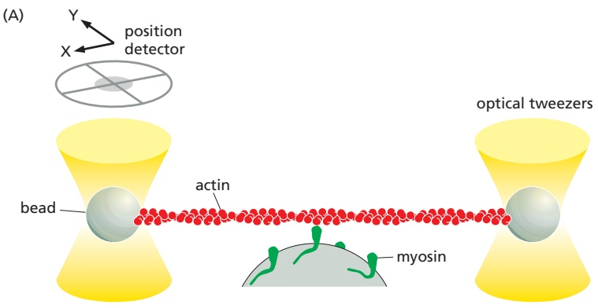

development by the fusion of many separate cells. The large muscle cell retains the many nuclei of the contributing cells. These nuclei lie just beneath the plasma membrane (**Figure 16–26**). The bulk of the cytoplasm inside is made up of myofibrils, which is the name given to the basic contractile elements of the muscle cell. A **myofibril** is a cylindrical structure 1–2 μm in diameter that is often as long as the muscle cell itself. It consists of a long, repeated chain of tiny contractile units—called sarcomeres, each about 2.2 μm long—which give the vertebrate myofibril its striated appearance (**Figure 16–27**).

Figure 16–25 The force of a single myosin molecule moving along an actin filament measured using an optical trap. (A) Schematic of the experiment, showing an actin filament with beads attached at both ends and held in place by focused beams of light called optical tweezers (Movie 16.6). The tweezers trap and move the bead and can also be used to measure the force exerted on the bead through the filament. In this experiment, the filament was positioned over another bead to which myosin II motors were attached, and the optical tweezers were used to determine the effects of myosin binding on movement of the actin filament. (B) These traces show filament movement in two separate experiments. Initially, when the actin filament is unattached to myosin, thermal motion of the filament produces noisy fluctuations in filament position. When a single myosin binds to the actin filament, thermal motion decreases abruptly, and a roughly 10-nm displacement results from movement of the filament by the motor. The motor then releases the filament. Because the ATP concentration is very low in this experiment, the myosin remains attached to the actin filament for much longer than it would in a muscle cell. (Adapted from C. Rüegg et al., News Physiol. Sci. 17:213–218, 2002. With permission from the American Physiological Society.)

Each sarcomere is formed from a miniature, precisely ordered array of parallel and partly overlapping thin and thick filaments. The thin filaments are composed of actin and associated proteins, and they are attached at their plus ends to a Z disc at each end of the sarcomere. The capped minus ends of the actin filaments extend in toward the middle of the sarcomere, where they overlap with thick filaments, the bipolar assemblies formed from specific muscle isoforms of myosin II (see Figure 16–22). When this region of overlap is examined in cross section by electron microscopy, the myosin filaments are arranged

Figure 16–26 Skeletal muscle cells (also called muscle fibers). (A) These huge multinucleated cells form by the fusion of many muscle cell precursors, called myoblasts. Here, a single muscle cell is depicted. In an adult human, a muscle cell is typically 50 μm in diameter and can be up to several centimeters long. (B) Fluorescence micrograph of rat muscle, showing the peripherally located nuclei (blue) in these giant cells. Myofibrils are stained red. (B, courtesy of Nancy L. Kedersha.)

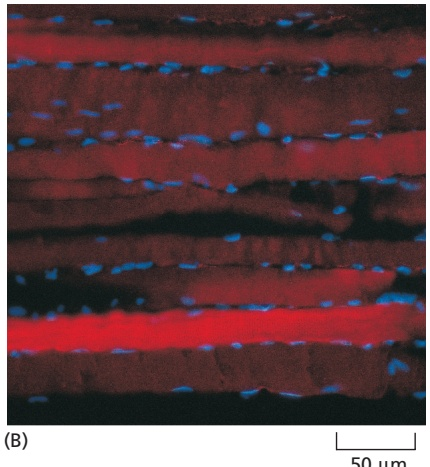

---

980

Chapter 16: The Cytoskeleton

Figure 16–27 Skeletal muscle myofibrils. (A) Low-magnification electron micrograph of a longitudinal section through a skeletal muscle cell of a rabbit, showing the regular pattern of cross-striations. The cell contains many myofibrils aligned in parallel (see Figure 16–26). (B) Detail of the skeletal muscle shown in A, showing portions of two adjacent myofibrils and the definition of a sarcomere (black arrow). (C) Schematic diagram of a single sarcomere, showing the origin of the dark and light bands seen in the electron micrographs. The Z discs, at each end of the sarcomere, are attachment sites for the plus ends of actin filaments (thin filaments); the M line, or midline, is the location of proteins that link adjacent myosin II filaments (thick filaments) to one another. (D) When the sarcomere contracts, the actin and myosin filaments slide past one another without shortening. (A and B, courtesy of Roger Craig.)

in a regular hexagonal lattice, with the actin filaments evenly spaced between them (**Figure 16–28**).

Sarcomere shortening is caused by the myosin filaments sliding past the actin thin filaments, with no change in the length of either type of filament (see Figure 16–27C and D). Bipolar thick filaments walk toward the plus ends of two sets of thin filaments of opposite orientations, driven by dozens of independent myosin heads that are positioned to interact with each thin filament. Because there is no coordination among the movements of the myosin heads, it is critical that they remain tightly bound to the actin filament for only a small fraction of each ATPase cycle so that they do not hold one another back. Each myosin thick filament has about 300 heads (294 in frog muscle), and each head cycles about five times per second in the course of a rapid contraction—sliding the myosin and actin filaments past one another at rates of up to 15 μm/sec and enabling the sarcomere to shorten by 10% of its length in less than one-fiftieth of a second. The rapid synchronized shortening of the thousands of sarcomeres lying end-to-end in each myofibril enables skeletal muscle to contract rapidly enough for running and flying or for playing the piano.

Accessory proteins produce the remarkable uniformity in filament organization, length, and spacing in the sarcomere and enable it to withstand the constant wear-and-tear of contraction (**Figure 16–29**). The actin filament plus ends are anchored in the Z disc, which is built from CapZ and α-actinin; CapZ in the Z disc caps the filaments (preventing depolymerization), while α-actinin holds them together in a regularly spaced bundle. Actin filaments are stabilized along their length by tropomyosin and also by a protein of enormous size, called nebulin, which consists almost entirely of a repeating 35-amino-acid actin-binding motif. Nebulin stretches from the Z disc toward the minus end of each thin filament, which is capped and stabilized by tropomodulin. Although there is some slow exchange of actin subunits at both ends of the muscle thin filament, such that the components of the thin filament turn over with a half-life of several days, the actin filaments in sarcomeres are remarkably stable compared with those found

(C)

1 µm

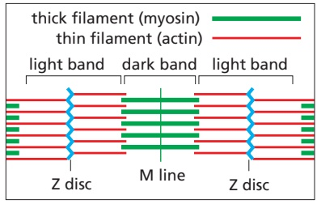

Figure 16–28 Electron micrographs of an insect flight muscle viewed in cross section. The myosin and actin filaments are packed together with almost crystalline regularity. Unlike their vertebrate counterparts, these myosin filaments have a hollow center, as seen in the enlargement on the right. The geometry of the hexagonal lattice is slightly different in vertebrate muscle. (From J. Auber and R. Couteaux, J. Microsc. 2:309–324, 1963. With permission from Société Française de Microscopie Électronique.)

---

MYOSIN AND ACTIN

981

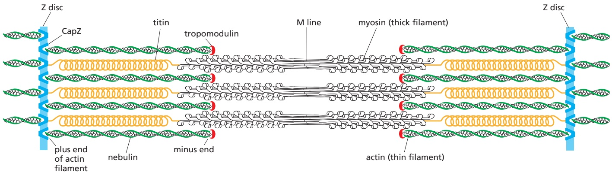

in most other cell types, whose dynamic actin filaments turn over with half-lives of a few minutes or less.

Opposing pairs of an even longer protein, called titin, position the thick filaments midway between the Z discs. Titin acts as a molecular spring, with a long series of immunoglobulin-like domains that can unfold one by one as stress is applied to the protein. A springlike unfolding and refolding of these domainsMBoC7 m16.34/16.29 keeps the thick filaments poised in the middle of the sarcomere and allows the muscle fiber to recover after being overstretched. In Caenorhabditis elegans, whose sarcomeres are longer than those in vertebrates, titin is longer as well, suggesting that it serves also as a molecular ruler, determining in this case the overall length of each sarcomere.

## A Sudden Rise in Cytosolic $\mathbb { C } \mathbb { a } ^ { 2 + }$ Concentration Initiates Muscle Contraction

The force-generating molecular interaction between myosin thick filaments and actin thin filaments takes place only when a signal passes to the skeletal muscle from the nerve that stimulates it. Immediately upon arrival of the signal, the muscle cell needs to be able to contract very rapidly, with all the sarcomeres shortening simultaneously. Two major features of the muscle cell make extremely rapid contraction possible. First, as previously discussed, the individual myosin motor heads in each thick filament spend only a small fraction of the ATP cycle time bound to the filament and actively generating force, so many myosin heads can act in rapid succession on the same thin filament without interfering with one another. Second, a specialized membrane system relays the incoming signal rapidly throughout the entire cell. The signal from the nerve triggers an action potential in the muscle cell plasma membrane (discussed in Chapter 11), and this electrical excitation spreads swiftly into a series of membranous folds—the transverse tubules, or T tubules—that extend inward from the plasma membrane around each myofibril. The signal is then relayed across a small gap to the sarcoplasmic reticulum, an adjacent weblike sheath of modified endoplasmic reticulum that surrounds each myofibril like a net stocking (**Figure 16–30A and B**).

Figure 16–29 Organization of accessory proteins in a sarcomere. Each giant titin molecule extends from the Z disc to the M line—a distance of more than 1 μm. Part of each titin molecule is closely associated with a myosin thick filament (which switches polarity at the M line); the rest of the titin molecule is elastic and changes length as the sarcomere contracts and relaxes. Each nebulin molecule is exactly the length of a thin filament. The actin filaments are also coated with tropomyosin and bound intermittently by troponin (not shown; see Figure 16–31) and are capped at both ends. Tropomodulin caps the minus end of the actin filaments, and CapZ anchors the plus end at the Z disc, which also contains α-actinin (not shown).

When the incoming action potential activates a $\mathrm { C a ^ { 2 + } }$ channel in the T-tubule membrane, it triggers the opening of a $\mathrm { C a ^ { 2 + } }$ -release channel in the closely associated sarcoplasmic reticulum membrane (**Figure 16–30C**). $\mathrm { C a ^ { 2 + } }$ flooding into the cytosol then initiates the contraction of each myofibril. Because the signal from the muscle cell plasma membrane is passed within milliseconds (via the T tubules and sarcoplasmic reticulum) to every sarcomere in the cell, all of the myofibrils in the cell contract at once. The increase in $\mathrm { C a ^ { 2 + } }$ concentration is transient because the $\mathrm { C a ^ { 2 + } }$ is rapidly pumped back into the sarcoplasmic reticulum by an abundant, ATP-dependent $\mathrm { C a ^ { \hat { 2 } + } }$ -pump (also called a $\mathbf { \bar { C } } \mathbf { a } ^ { 2 + }$ -ATPase) in its membrane (see Figure 11–14). Typically, the cytoplasmic $\mathrm { C a ^ { 2 + } }$ concentration is restored to resting levels within 30 milliseconds, allowing the myofibrils to relax. Thus, muscle contraction depends

---

982

Chapter 16: The Cytoskeleton

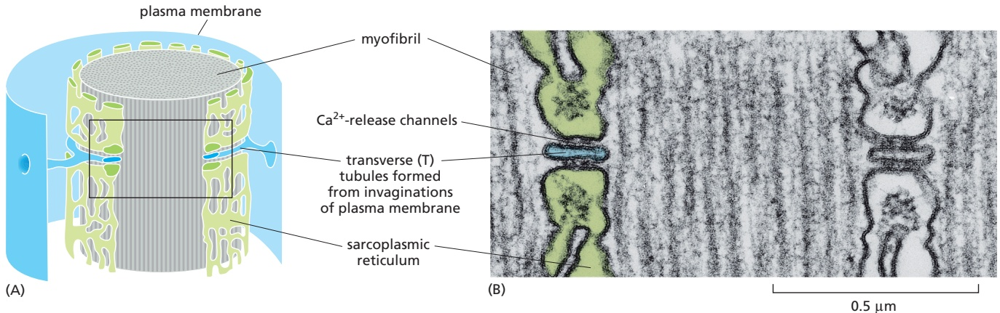

on two processes that consume enormous amounts of ATP: filament sliding, driven by the ATPase of the myosin motor domain, and $\mathrm { C a ^ { 2 + } }$ pumping, driven by the $\dot { \mathrm { C a } ^ { 2 + } }$ -pump.

The $\mathrm { C a ^ { 2 + } }$ dependence of vertebrate skeletal muscle contraction, and hence its dependence on commands transmitted via nerves, is due entirely to a set of specialized accessory proteins that are closely associated with the actin thin filaments. One of these accessory proteins is a muscle form of tropomyosin, the elongated protein that binds along the groove of the actin filament helix.MBoC7 e17.44,45/16.30 The other is troponin, a complex of three polypeptides, troponins T, I, and C (named for their tropomyosin-binding, inhibitory, and $\mathbf { C a } ^ { 2 + } .$ -binding activities, respectively). Troponin I binds to actin as well as to troponin T. In a resting muscle, the troponin I–T complex pulls the tropomyosin out of its normal binding groove into a position along the actin filament that interferes with the binding of myosin heads, thereby preventing any force-generating interaction. When the level of $\mathrm { C a ^ { 2 + } }$ is raised, troponin C—which binds up to four molecules of $\mathrm { { C a ^ { 2 + } } }$ —causes troponin I to release its hold on actin. This allows the tropomyosin molecules to slip back into their normal position so that the myosin heads can walk along the actin filaments (Figure 16–31). Troponin C is closely related to the ubiquitous $\mathrm { C a ^ { 2 + } }$ -binding protein calmodulin (see Figure 15–34); it can be thought of as a specialized form of calmodulin that has acquired binding sites for troponin I and troponin T, thereby ensuring that the myofibril responds extremely rapidly to an increase in $\mathrm { C a ^ { 2 + } }$ concentration.

Figure 16–30 T tubules and the sarcoplasmic reticulum. (A) Drawing of the two membrane systems that relay the signal to contract from the muscle cell plasma membrane to all of the myofibrils in the cell. (B) Electron micrograph showing a cross section of a T tubule. Note the position of the large $\mathrm { C a ^ { 2 + } }$ -release channels in the sarcoplasmic reticulum membrane that connect to the adjacent T-tubule membrane. (C) Schematic diagram showing how a $\mathrm { C a ^ { 2 - } }$ -release channel in the sarcoplasmic reticulum membrane is thought to be opened by the activation of a voltage-gated $\mathrm { C a ^ { 2 + } }$ channel in the membrane of the T tubule (Movie 16.7). (B, courtesy of Clara Franzini-Armstrong.)

---

MYOSIN AND ACTIN

983

Figure 16–31 The control of skeletal muscle contraction by troponin. (A) A thin filament of a skeletal muscle cell, showing the positions of tropomyosin and troponin along the actin filament. Each tropomyosin molecule has seven evenly spaced regions with similar amino acid sequences, each of which is thought to bind to an actin subunit in the filament. (B) Reconstructed cryo-electron microscopy image of an actin filament showing the relative position of a superimposed tropomyosin strand in the presence (dark purple) or absence (light purple) of calcium. (A, adapted from G.N. Phillips et al., J. Mol. Biol. 192:111–131, 1986; B, adapted from C. Xu et al., Biophys. J. 77:985–992, 1999. With permission from the Biophysical Society.)

In smooth muscle cells, so called because they lack the regular striations of skeletal muscle, contraction is also triggered by an influx of calcium ions, but the regulatory mechanism is different. Smooth muscle forms the contractile portion of the stomach, intestine, and uterus, as well as the walls of arteries and many other structures requiring slow and sustained contractions. Smooth muscle is composed of sheets of highly elongated spindle-shaped cells, each with a single nucleus. Smooth muscle cells do not express the troponins. Instead, elevated intracellular $\mathrm { C a ^ { 2 + } }$ levels regulate contraction by a mechanism that depends on calmodulin (**Figure 16–32**). $\mathrm { C a ^ { 2 + } }$ -bound calmodulin activates myosin

(B)

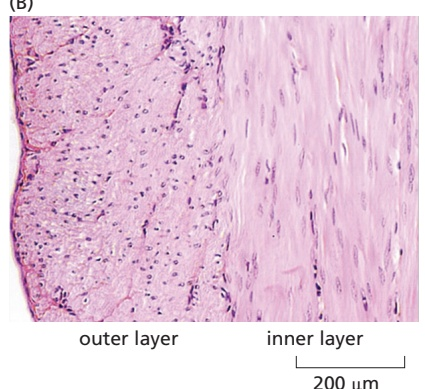

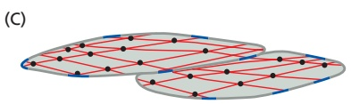

gur sc e contraction. (A) Upon muscle stimulation by activation of cell-surface receptors, Ca2+ released into the cytoplasm from the sarcoplasmic reticulum (SR) binds to calmodulin (see Figure 15–34). Ca2+-bound calmodulin then binds myosin light-chain kinase (MLCK), which phosphorylates myosin light chain, stimulating myosin activity. Non-muscle myosin is regulated by the same mechanism (see Figure 16–34). (B) Smooth muscle cells in a cross section of cat intestinal wall. The outer layer of smooth muscle is oriented with the long axis of its cells extending parallel along the length of the intestine, and upon contraction will shorten the intestine. The inner layer is oriented circularly around the intestine and when contracted will cause the intestine to become narrower. Contraction of both layers squeezes material through the intestine, much like squeezing toothpaste out of a tube. (C) A model for the contractile apparatus in a smooth muscle cell, with bundles of contractile filaments containing actin and myosin (red) oriented obliquely to the long axis of the cell. Their contraction greatly shortens the cell. In this diagram, the bundle angles are exaggerated to schematically illustrate the effect of contraction. In addition, only a few of the many bundles are shown. (B, courtesy of Gwen V. Childs.)

---

984

Chapter 16: The Cytoskeleton

light-chain kinase (MLCK), thereby inducing the phosphorylation of smooth muscle myosin on one of its two light chains. When the light chain is phosphorylated, the myosin head can interact with actin filaments and cause contraction; when it is dephosphorylated, the myosin head tends to dissociate from actin and becomes inactive.

The phosphorylation events that regulate contraction in smooth muscle cells occur relatively slowly, so that maximum contraction often requires nearly a second (compared with the few milliseconds required for contraction of a skeletal muscle cell). But rapid activation of contraction is not important in smooth muscle: its myosin II hydrolyzes ATP about 10 times more slowly than does skeletal muscle myosin, producing a slow cycle of myosin conformational changes that results in slow contraction.

## Heart Muscle Is a Precisely Engineered Machine

The heart is the most heavily worked muscle in the body, contracting about 3 billion $( 3 \times 1 0 ^ { 9 } )$ times during the course of a human lifetime (Movie 16.8). Heart cells express several specific isoforms of cardiac muscle myosin and cardiac muscle actin. Even subtle changes in these cardiac-specific contractile proteins— changes that would not cause any noticeable consequences in other tissues—can cause serious heart disease (**Figure 16–33**).

The normal cardiac contractile apparatus is such a highly tuned machine that a tiny abnormality anywhere in the works can be enough to gradually wear it down over years of repetitive motion. Familial hypertrophic cardiomyopathy is a common cause of sudden death in young athletes. It is a genetically dominant inherited condition that affects about two out of every thousand people, and it is associated with heart enlargement, abnormally small coronary vessels, and disturbances in heart rhythm (cardiac arrhythmias). The cause of this condition is either any one of more than 40 subtle point mutations in the genes encoding cardiac β-myosin heavy chain (almost all causing changes in or near the motor domain) or one of about a dozen mutations in other genes encoding contractile proteins—including myosin light chains, cardiac troponin, and tropomyosin. Minor missense mutations in the cardiac actin gene cause another type of heart condition, called dilated cardiomyopathy, which can also result in early heart failure.

## Actin and Myosin Perform a Variety of Functions in Non-Muscle Cells

Most non-muscle cells contain contractile actin–myosin II assemblies that form transiently, enabling dynamic changes in cell morphology. Non-muscle contractile bundles are regulated by myosin phosphorylation rather than by troponin (**Figure 16–34A**). Contractile actin and myosin just beneath the plasma membrane in the cell cortex creates tension, and gradients in this tension lead to cell-shape changes. Actin–myosin II bundles also provide mechanical support by assembling into **stress fibers** that connect the cell to the extracellular matrix through focal adhesions or by forming a circumferential belt in an epithelial cell, connecting it to adjacent cells through adherens junctions (discussed in Chapter 19). As described in Chapter 17, actin and myosin II in the contractile ring generate the force for cytokinesis, the final stage in cell division. Finally, as discussed previously, contractile bundles also contribute to the adhesion and forward motion of migrating cells. Organization of contractile bundles is somewhat similar to the periodic organization of sarcomeres and involves many of the same proteins. However, non-muscle myosin II filaments are about sevenfold shorter than the thick filaments of skeletal muscle, and their formation is highly dynamic (**Figure 16–34B and C**).

Non-muscle cells also express a large family of other myosin proteins, which have diverse structures and functions in the cell. After the discovery of conventional muscle myosin, a second member of the family was found in the freshwater

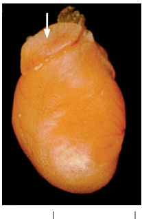

2 mm

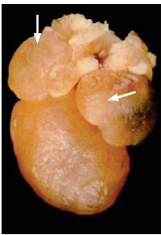

Figure 16–33 Effect on the heart of a subtle mutation in cardiac myosin. Left, normal heart from a 6-day-old mouse pup. Right, heart from a pup with a point mutation in both copies of its cardiac myosin gene, changing Arg403 to Gln. The arrows indicate the atria. In the heart from the pup with the cardiac myosin mutation, both atria are greatly enlarged (hypertrophic), and the mice die within aMBoC7 m16.38/16.33 few weeks of birth. (From D. Fatkin et al., J. Clin. Invest. 103:147–153, 1999. With permission from the American Society for Clinical Investigation.)