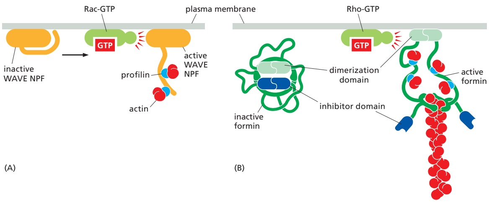
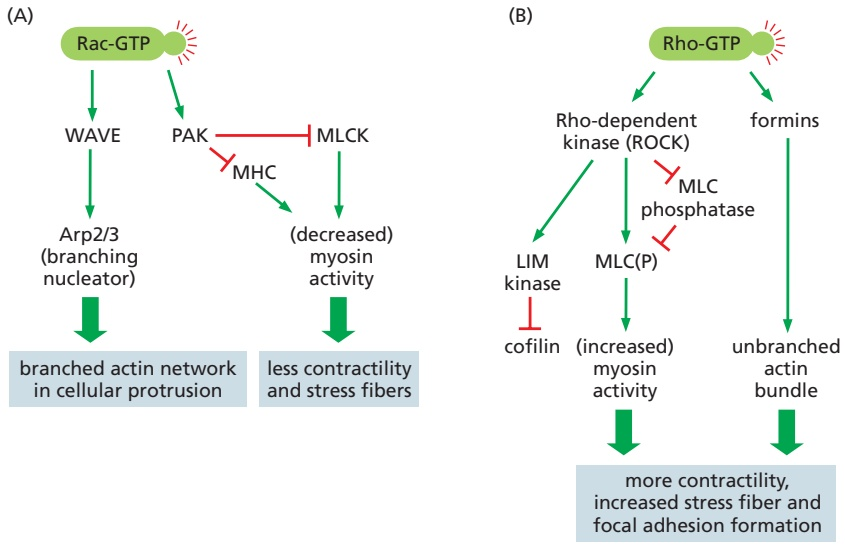
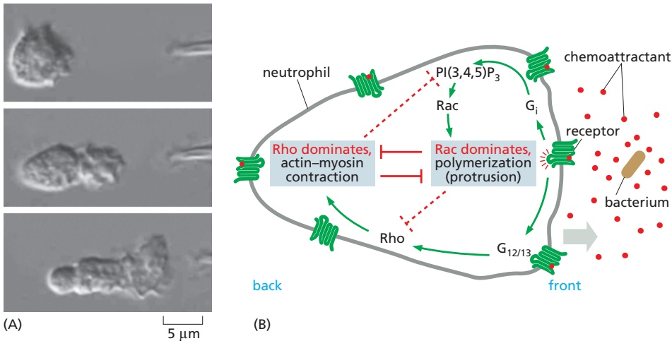
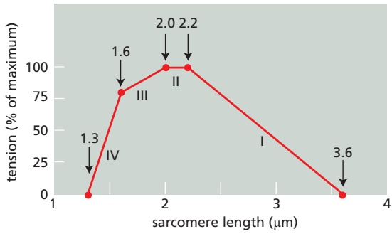
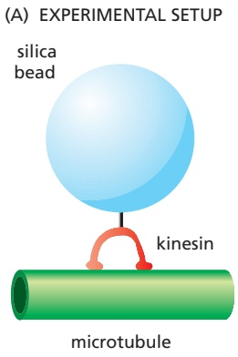
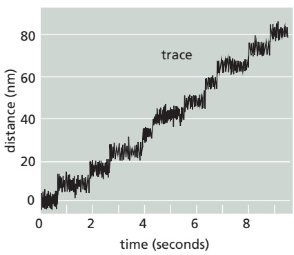
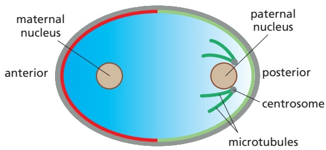

the cytoskeleton is responsible for coordinating cell shape, organization, and mechanical properties along its entire length, a distance that is typically tens of micrometers for animal cells. As we shall see, the Rho family GTPases and several cell-polarity proteins that we have already introduced are central to this process.

Cell locomotion requires an initial polarization of the cell to propel it in a particular direction. Once again, Cdc42 appears to be critical, as it sets up the overallMBoC7 n16.210/16.79 polarity of a migrating cell. The downstream effectors of Cdc42-GTP include the polarity protein Par-3, and Cdc42 is also thought to stimulate extension of filopodia (see Figure 16–75) that help sense and respond to extracellular cues. Once polarized, protrusion of the leading edge of the cell is driven through nucleation of branched actin filaments by the Arp2/3 complex (see Figure 16–12). This process depends on Rac-GTP, which stimulates members of the WAVE family of actin nucleation-promoting factors (NPFs). A WAVE protein, present in a large regulatory complex, can exist in an inactive folded conformation and an activated open conformation. Association with Rac-GTP recruits WAVE to the plasma membrane and stabilizes the open conformation (**Figure 16–79A**). Active WAVE then stimulates nucleation of new actin filaments by Arp2/3 along the sides of existing filaments (see Figures 16–12 and 16–14A). In this way, Rac-GTP–dependent WAVE promotes the formation of branched actin networks that drive lamellipod formation at the leading edge of migrating cells (**Figure 16–80A**).

Figure 16–79 Regulation of nucleationpromoting factors and formins by Rho family GTPases. (A) Members of the WAVE family of nucleation-promoting factors are activated upon binding to Rac-GTP at the plasma membrane. A conformational change in WAVE opens up the protein, allowing domains that were previously inaccessible to interact with both the Arp2/3 complex and profilinbound actin subunits. For clarity, the WAVE regulatory complex is not shown. (B) The activity of some formin proteins is inhibited by an autoinhibitory interaction in the absence of an active GTPase. Binding to Rho-GTP exposes a binding site for the plus end of an actin filament, as well as profilin–actin binding domains.

Rho-GTP is equally important for cell migration and has a very different set of targets. Instead of activating the Arp2/3 complex to build branched actin networks, Rho-GTP induces formin proteins to construct parallel actin bundles. Similar to the effects of Rac-GTP on WAVE, association of formins with Rho-GTP stabilizes an open, active conformation (**Figure 16–79B**). As discussed previously, formins stimulate both the nucleation and elongation of straight actin filaments (see Figures 16–13 and 16–14B). At the same time, Rho-GTP activates the Rho-associated kinase (ROCK), which stimulates another kinase called LIM, which phosphorylates and inhibits the activity of the actin-destabilizing protein cofilin. The resulting stable, unbranched actin filaments are ideal for interacting with myosin II. Furthermore, ROCK activates myosin II by inhibiting a phosphatase acting on myosin light chains (see Figure 16–34). The consequent increase in the net amount of myosin light-chain phosphorylation increases the level of contractile myosin motor-protein activity in the cell, enhancing the formation of tension-dependent structures such as stress fibers and focal adhesions (**Figure 16–80B**).

Spatial and temporal separation between the Rac and Rho pathways is thought to facilitate maintenance of the large-scale differences between the cell front and the cell rear during migration. Whereas Rac is activated exclusively at the leading edge of the cell, Rho activation predominates at the rear. Furthermore, the two pathways are mutually antagonistic. For example, Rac inhibits Rho activity through one of its effectors, the kinase PAK, which inhibits myosin II and therefore contractility. Rac and Rho also modulate the activities of the other’s GEFs, GAPs, or GDIs to reinforce spatial separation of their activities.

## External Signals Can Dictate the Direction of Cell Migration

**Chemotaxis** is the movement of a cell toward or away from a source of some diffusible chemical. These external signals act through cell surface receptors that trigger Rho family proteins to polarize and orient the cell motility apparatus,MBoC7 m16.85/16.80 enabling directed cell migration. One well-studied example is the chemotactic movement of a class of white blood cells, called neutrophils, toward a source of bacterial infection. Receptor proteins on the surface of neutrophils enable them to detect very low concentrations of N-formylated peptides that are derived from bacterial proteins (only prokaryotes begin protein synthesis with N-formylmethionine). Using these receptors, neutrophils are guided to bacterial targets by their ability to detect a difference of only 1% in the concentration of these diffusible peptides on one side of the cell versus the other (**Figure 16–81A**).

In this case, and in the chemotaxis of Dictyostelium amoebae toward a source of cyclic AMP, binding of the chemoattractant to its G-protein-coupled receptor activates phosphoinositide 3-kinases (PI3Ks) (see Figure 15–53), which generate a signaling molecule $\mathrm { [ P I ( 3 , } 4 \mathrm { , } 5 \mathrm { ) P _ { 3 } ] }$ that in turn activates the Rac GTPase. Rac then activates the $\mathrm { A r p 2 } / 3$ complex leading to lamellipodial protrusion. Through an unknown mechanism, accumulation of the polarized actin network at the leading edge causes further local enhancement of PI3K activity in a positive feedback loop, strengthening the induction of protrusion. The $\mathrm { P I ( 3 , } 4 \mathrm { , } 5 \mathrm { ) P _ { 3 } }$ that activates Rac cannot diffuse far from its site of synthesis, because it is rapidly converted back into $\mathrm { P I ( 4 , } 5 \mathrm { ) P _ { 2 } }$ by a constitutively active lipid phosphatase. At the same time, binding of the chemoattractant ligand to its receptor activates another signaling pathway that turns on Rho and enhances myosin-based contractility. As described in the previous section, these two pathways directly inhibit each other, such that Rac activation dominates in the front of the cell and Rho activation dominates in the rear (**Figure 16–81B**). This enables the cell to maintain its functional polarity with protrusion at the leading edge and contraction at the back.

Nondiffusible chemical cues attached to the extracellular matrix or to the surface of cells can also influence the direction of cell migration. When these signals activate receptors, they can cause increased cell adhesion and directed actin polymerization. Most long-distance cell migrations in animals, including neural-crest-cell migration and the travels of neuronal growth cones, depend on a combination of diffusible and nondiffusible signals to steer the locomoting cells or growth cones to their proper destinations.

Figure 16–80 The contrasting effects of Rac and Rho activation on actin organization. (A) Activation of the small GTPase Rac leads to alterations in actin accessory proteins that promote the formation of protrusive actin networks in lamellipodia and pseudopodia. Several different pathways contribute independently. Rac-GTP activates members of the WAVE protein family, which in turn activate actin nucleation and branched network formation by the Arp2/3 complex. In a parallel pathway, Rac-GTP activates the protein kinase PAK, which has several targets including the myosin light-chain kinase (MLCK), which is inhibited by phosphorylation. Inhibition of MLCK results in decreased phosphorylation of the myosin regulatory light chain and leads to myosin II filament disassembly and a decrease in contractile activity. In some cells, PAK also directly inhibits myosin II activity by phosphorylation of the myosin heavy chain (MHC). (B) Activation of the related GTPase Rho leads to nucleation of actin filaments by formins and increases contraction by myosin II, promoting the formation of contractile actin bundles at the rear of the cell and assembly of stress fibers. Activation of myosin II by Rho requires a Rho-associated kinase called ROCK. This kinase inhibits the phosphatase that removes the activating phosphate groups from myosin II light chains (MLC); it may also directly phosphorylate the myosin light chains in some cell types. ROCK also activates other protein kinases, such as LIM kinase, which in turn contributes to the formation of stable contractile actin filament bundles by inhibiting the actindepolymerizing factor cofilin. A similar signaling pathway is important for forming the contractile ring necessary for cytokinesis (see Figure 17–45).

## Communication Among Cytoskeletal Elements Supports Whole-Cell Polarity and Locomotion

The interconnected cytoskeleton is crucial for cell polarity and migration. Although polarity signals are frequently transduced by Rho family GTPases that act primarily on the actin cytoskeleton and myosin contractility, microtubules, septins, and intermediate filaments also participate. For example, vimentin intermediate filament networks associate with integrins at focal adhesions, and vimentin-deficient fibroblasts display impaired mechanical stability, migration, and contractile capacity. Furthermore, disruption of linker proteins that connect different cytoskeletal elements, including several plakins and KASH proteins, leads to defects in cell polarization and migration. Thus, interactions among cytoplasmic filament systems, as well as mechanical linkage to the nucleus, are required for complex, whole-cell behaviors such as migration.

Cells also use microtubules to support cell polarity and to organize persistent movement in a specific direction. Cross-linking proteins connect microtubule minus and plus ends to actin at the apical and basal cortex of epithelial cells, respectively. They also link the plus ends of microtubules and actin at the front of migrating cells. An example of such a cross-linker is the formin proteins, a subset of which binds to microtubules in addition to regulating actin filament assembly. These interactions enable microtubules to influence actin rearrangements and cell adhesion. By extending from the centrosome into the protrusive region of a migrating cell, microtubules can also serve as a compass to aid in directed cell migration. Microtubules also influence actin and focal adhesions by serving as tracks for motor-dependent transport of cargoes to and from the cell periphery. They can also deliver regulatory proteins, such as Rac GEFs, which bind to the +TIPs traveling on growing microtubule ends. Thus, microtubules reinforce the polarity information that the actin cytoskeleton receives from the outside world, allowing a sensitive response to weak signals and enabling motility to persist in the same direction for a prolonged period.

## Summary

Cell polarity and migration require large-scale shaping and structuring of cells. This involves the coordinated activities of all three basic filament systems along with a large variety of regulatory and motor proteins. Rho family proteins work together with cell-polarity proteins to establish stable cytoskeletal structures necessary to generate higher levels of polarity within an organism or to maintain epithelial tissues. These same factors also operate during the dynamic polarization required for directed cell migration—a widespread behavior important in embryonic development and also in wound healing, tissue maintenance, and immune system function in the adult animal—providing a prime example of complex, coordinated cytoskeletal action influenced by external cues.

Figure 16–81 Neutrophil polarization and chemotaxis. (A) The pipette tip at the right is leaking a small amount of the bacterial peptide formyl-Met-Leu-Phe, which is recognized by the human neutrophil as the product of a foreign invader. The neutrophil quickly extends a new lamellipodium toward the source of the chemoattractant peptide (top). It then extends this lamellipodium and polarizes its cytoskeleton so that contractile myosin II is located primarily at the rear, opposite the position of the lamellipodium (middle). Finally, the cell crawls toward the source of the peptide (bottom). If a real bacterium were the source of the peptide, rather than an investigator’s pipette, the neutrophil would engulf the bacterium and destroy it (see also Figure 16–3 and Movie 16.17). (B) Binding of bacterial molecules to G-protein-coupled receptors on the neutrophil stimulates directed motility. These receptors are found all over the surface of the cell, but are more likely to be bound to the bacterial ligand at the front. Two distinct signaling pathways contribute to the cell’s polarization. At the front of the cell, stimulation of the Rac pathway leads, via the trimeric G protein Gi, to growth of protrusive actin networks. Second messengers within this pathway are short-lived, so protrusion is limited to the region of the cell closest to the stimulant. The same receptor also stimulates a second signaling pathway, via the trimeric G proteins $\mathsf { G } _ { 1 2 }$ and $\mathsf { G } _ { 1 3 } ,$ that triggers the activation of Rho. The two pathways are mutually antagonistic. Because Rac-based protrusion is active at the front of the cell, Rho is activated only at the rear of the cell, stimulating contraction of the cell rear and assisting directed movement. (A, from O.D. Weiner et al., Nat. Cell Biol. 1:75–81, published 1999 by Macmillan Magazines Ltd. Reproduced with permission of SNCSC.)

## PROBLEMS

Which statements are true? Explain why or why not.

16–1 The role of ATP hydrolysis in actin polymerization is similar to the role of GTP hydrolysis in tubulin polymerization: both serve to weaken subunit bonds in the polymer and thereby promote depolymerization.

16–2 Motor neurons trigger action potentials in muscle cell membranes that open voltage-gated $\mathrm { C a ^ { 2 + } }$ channels in T tubules, allowing extracellular $\mathrm { \tilde { C a ^ { 2 + } } }$ to enter the cytosol, bind to troponin C, and initiate rapid muscle contraction.

16–3 In most animal cells, minus end–directed microtubule motors deliver their cargo to the periphery of the cell, whereas plus end–directed microtubule motors deliver their cargo to the interior of the cell.

16–4 Because bacteria are very small and lack the elaborate networks of intracellular membrane-enclosed organelles typical of eukaryotic cells, they do not require cytoskeletal filaments.

## Discuss the following problems.

16–5 A scallop is a hinged bivalve that swims by slowly opening its two-part shell and then rapidly closing it, forcing a jet of water out the back and propelling itself forward. Imagine a bacterium constructed analogously. Could it swim in its low-Reynolds-number environment using the same mechanism as the scallop? Why or why not?

16–6 The plus and minus ends of actin filaments grow at different rates and have different critical concentrations (Cc). Between these critical concentrations, the filaments grow at their plus ends but shrink at their minus ends, a property termed treadmilling (**Figure Q16–1**). Is there any concentration of actin subunits at which the filament length does not change? If so, describe the concentration at which it occurs.

Figure Q16–1 Treadmilling at intermediate concentrations of free actin subunits (Problem 16–6).

16–7 Cofilin preferentially binds to older actin filaments and promotes their disassembly. How does cofilinFigure nQ16-101/Q16-1 distinguish old filaments from new ones?

16–8 How is the unidirectional motion of a lamellipodium maintained?

16–9 Detailed measurements of sarcomere length and tension during isometric contraction in striated muscle provided crucial early support for the sliding-filament model of muscle contraction. On the basis of your understanding of the sliding-filament model and the structure of a sarcomere, propose a molecular explanation for the relationship of tension to sarcomere length in the portions of **Figure Q16–2** marked I, II, III, and IV. (In this muscle, the length of the myosin filament is 1.6 μm, and the lengths of the actin thin filaments that project from the Z discs are 1.0 μm.)

Figure Q16–2 Tension as a function of sarcomere length during isometric contraction (Problem 16–9).

16–10 At 1.4 mg/mL pure tubulin, microtubules grow at a rate of about 2 μm/min. At this growth rate, how many αβ-tubulin dimers (8 nm in length) are added to the ends of a microtubule each second?

16–11 The movements of single motor-protein molecules can be analyzed directly. Using polarized laser light, it is possible to create interference patterns that exert a centrally directed force, ranging from zero at the center to a few piconewtons at the periphery (about 200 nm from the center). Individual molecules that enter the interference pattern are rapidly pushed to the center, allowing them to be captured and moved at the experimenter’s discretion.

These so-called optical tweezers can be used to position single kinesin molecules on a microtubule that is fixed to a coverslip. Although a single kinesin molecule cannot be seen optically, it can be tagged with a silica bead and tracked indirectly by following the bead (**Figure Q16–3A**). In the absence of ATP, the kinesin molecule remains at the center of the interference pattern, but with ATP it moves toward the plus end of the microtubule. As kinesin moves along the microtubule, it encounters the force of the interference pattern, which simulates the load kinesin carries during its actual function in the cell. Moreover, the pressure against the silica bead counters the effects of Brownian (thermal) motion, so that the position of the bead more accurately reflects the position of the kinesin molecule on the microtubule.

A trace of the movements of a kinesin molecule along a microtubule is shown in **Figure Q16–3B**.

(A) EXPERIMENTAL SETUP

(B) POSITION OF KINESIN

Figure Q16–3 Movement of kinesin along a microtubule (Problem 16–11). (A) Experimental setup, with kinesin linked to a silica bead, moving along a microtubule. (B) Position of kinesin (as visualized by the position of the silica bead) relative to the center of the interference pattern, as a function Fi 16-3/ 16-3of time of movement along the microtubule. The jagged nature of the trace results from Brownian motion of the bead.

A. As shown in Figure Q16–3B, all movement of kinesin is in one direction (toward the plus end of the microtubule). What supplies the free energy needed to ensure a unidirectional movement along the microtubule?

B. What is the average rate of movement of kinesin along the microtubule?

C. What is the length of each step that kinesin takes as it moves along the microtubule?

D. Kinesin has two globular domains that can each bind to β-tubulin, and it moves along a single protofilament in a microtubule. In each protofilament, the β-tubulin subunit repeats at 8-nm intervals. Given the step length and the interval between β-tubulin subunits, how do you suppose a kinesin molecule moves along a microtubule?

E. Is there anything in the data in Figure Q16–3 that tells you how many ATP molecules are hydrolyzed per step?

16–12 A mitochondrion 1 μm long can travel the 1-meter length of the axon from the spinal cord to the big toe in a day. The Olympic men’s freestyle swimming record for 200 meters is 1.72 minutes. In terms of body lengths per day, who is moving faster: the mitochondrion or the Olympic record holder? (Assume that the swimmer is 2 meters tall.)

16–13 Why is it that intermediate filaments have identical ends and lack polarity, whereas actin filaments and microtubules each have two distinct ends with a defined polarity?

16–14 Once cell polarity has been established in the fertilized egg of C. elegans (**Figure Q16–4**), the female pronucleus migrates along the microtubules emanating from the centrosomes adjacent to the paternal nucleus, which leads to fusion of the haploid genomes. What motor is likely involved in nuclear migration?

Figure Q16–4 Polarity establishment in a fertilized C. elegans egg prior to nuclear fusion (Problem 16–14).

## REFERENCES

## General

Pollard TD & Goldman RD (2017) The Cytoskeleton. Cold Spring Harbor, NY: Cold Spring Harbor Laboratory Press.

## Function and Dynamics of the Cytoskeleton

Hill TL & Kirschner MW (1982) Bioenergetics and kinetics of microtubule and actin filament assembly-disassembly. Int. Rev. Cytol. 78, 1–125.

Luby-Phelps K (2000) Cytoarchitecture and physical properties of cytoplasm: volume, viscosity, diffusion, intracellular surface area. Int. Rev. Cytol. 192, 189–221.

Oosawa F & Asakura S (1975) Thermodynamics of the Polymerization of Protein, pp. 41–55, 90–108. New York: Academic Press.

Pauling L (1953) Aggregation of globular proteins. Discuss. Faraday Soc. 13, 170–176.

Purcell EM (1977) Life at low Reynolds number. Am. J. Phys. 45, 3–11.

## Actin

Loisel TP, Boujemaa R, Pantaloni D & Carlier MF (1999) Reconstitution of actin-based motility of Listeria and Shigella using pure proteins. Nature 401, 613–616.

Mullins RD, Heuser JA & Pollard TD (1998) The interaction of Arp2/3 complex with actin: nucleation, high affinity pointed end capping, and formation of branching networks of filaments. Proc. Natl. Acad. Sci. USA 95, 6181–6186.

Pelaseyed T & Bretscher A (2018) Regulation of actin-based apical structures on epithelial cells. J. Cell Sci. 131, jcs221853.

Renkawitz J, Kopf A, Stopp J . . . Sixt M (2019) Nuclear positioning facilitates amoeboid migration along the path of least resistance. Nature 568, 546–550.

Rottner K & Schaks M (2019) Assembling actin filaments for protrusion. Curr. Opin. Cell Biol. 56, 53–63.

Skau CT & Waterman CW (2015) Specification of architecture and function of actin structures by actin nucleation factors. Annu. Rev. Biophys. 44, 285–310.

Svitkina T (2018) The actin cytoskeleton and actin-based motility. Cold Spring Harb. Perspect. Biol. 10(1), a018267.

Yamada KM & Sixt M (2019) Mechanisms of 3D cell migration. Nat. Rev. Mol. Cell Biol. 20, 738–752.

## Myosin and Actin

Cooke R (2004) The sliding filament model: 1972–2004. J. Gen. Physiol. 123, 643–656.

Hammer JA III & Sellers JR (2011) Walking to work: roles for class V myosins as cargo transporters. Nat. Rev. Mol. Cell Biol. 13, 13–26.

Hartman MA, Finan D, Sivaramakrishnan S & Spudich JA (2011) Principles of unconventional myosin function and targeting. Annu. Rev. Cell Dev. Biol. 27, 133–155.

Hu S, Dasbiswas K, Guo Z . . . Bershadsky AD (2017) Long-range self-organization of cytoskeletal myosin II filament stacks. Nat. Cell Biol. 19, 133–141.

Walklate J, Ujfalusi Z & Greeves MA (2016) Myosin isoforms and the mechanochemical cross-bridge cycle. J. Exp. Biol. 219, 168–174.

Yildiz A, Forkey JN, McKinney SA . . . Selvin PR (2003) Myosin V walks hand-over-hand: single fluorophore imaging with 1.5-nm localization. Science 300, 2061–2065.

## Microtubules

Brouhard GJ, Stear JH, Noetzel TL . . . Hyman AA (2008) XMAP215 is a processive microtubule polymerase. Cell 132, 79–88.

Dogterom M & Yurke B (1997) Measurement of the force-velocity relation for growing microtubules. Science 278, 856–860.

Goodson HV & Jonasson EM (2018) Microtubules and microtubuleassociated proteins. Cold Spring Harb. Perspect. Biol. 10(6), a022608.

Hotani H & Horio T (1988) Dynamics of microtubules visualized by darkfield microscopy: treadmilling and dynamic instability. Cell Motil. Cytoskeleton 10, 229–236.

Howard J, Hudspeth AJ & Vale RD (1989) Movement of microtubules by single kinesin molecules. Nature 342, 154–158.

Kuo Y-W & Howard J (2020) Cutting, amplifying, and aligning microtubules with severing enzymes. Trends Cell Biol. 31, 50–61.

Lin J & Nicastro D (2018) Asymmetric distribution and spatial switching of dynein activity generates ciliary motility. Science 360, eaar1968.

Mitchison T & Kirschner M (1984) Dynamic instability of microtubule growth. Nature 312, 237–242.

Reck-Peterson SL, Redwine WB, Vale RD & Carter AP (2018) The cytoplasmic dynein transport machinery and its many cargoes. Nat. Rev. Mol. Cell Biol. 19, 382–398.

Reiter JF & Leroux MR (2017) Genes and molecular pathways underpinning ciliopathies. Nat. Rev. Mol. Cell Biol. 18, 533–547.

Rice S, Lin AW, Safer D . . . Milligan RA & Vale RD (1999) A structural change in the kinesin motor protein that drives motility. Nature 402, 778–784.

Stearns T & Kirschner M (1994) In vitro reconstitution of centrosome assembly and function: the central role of gamma-tubulin. Cell 76, 623–637.

Svoboda K, Schmidt CF, Schnapp BJ & Block SM (1993) Direct observation of kinesin stepping by optical trapping interferometry. Nature 365, 721–727.

Théry M & Blanchoin L (2021) Microtubule self-repair. Curr. Opin. Cell Biol. 68, 144–154.

Woodruff JB, Ferreira Gomes B, Widlund PO . . . Hyman AA (2017) The centrosome is a selective condensate that nucleates microtubules by concentrating tubulin. Cell 169, 1066–1077.

Wu J & Akhmanova A (2017) Microtubule-organizing centers. Annu. Rev. Cell Dev. Biol. 33, 51–75.

## Intermediate Filaments and Other Cytoskeletal Polymers

Garner EC, Bernard R, Wang W . . . Mitchison T (2011) Coupled, circumferential motions of the cell wall synthesis machinery and MreB filaments in B. subtilis. Science 333, 222–225.

Garner EC, Campbell CS & Mullins RD (2004) Dynamic instability in a DNA-segregating prokaryotic actin homolog. Science 306, 1021–1025.

Herrmann H & Aebi U (2016) Intermediate filaments: structure and assembly. Cold Spring Harb. Perspect. Biol. 8(11), a018242.

Isermann P & Lammerding J (2013) Nuclear mechanics and mechanotransduction in health and disease. Curr. Biol. 23, R1113–R1121.

Köster S, Weitz DA, Goldman RD, Aebi U & Herrmann H (2015) Intermediate filament networks in vitro and in vivo: from coiled-coils to filaments, fibers and networks. Curr. Opin. Cell Biol. 32, 82–91.

Wagstaff J & Lowe J (2018) Prokaryotic cytoskeletons: protein filaments organizing small cells. Nat. Rev. Microbiol. 16, 187–201.

Woods BL & Gladfelter AS (2021) The state of the septin cytoskeleton from assembly to function. Curr. Opin. Cell Biol. 68, 105–112.

## Cell Polarity and Coordination of the Cytoskeleton

Bilder D, Li M & Perrimon N (2000) Cooperative regulation of cell polarity and growth by Drosophila tumour suppressors. Science 289, 113–116.

Devreotes P & Horwitz AR (2015) Signaling networks that regulate cell migration. Cold Spring Harb. Perspect. Biol. 7(8), a005959.

Dogterom M & Koenderink GH (2019) Actin-microtubule crosstalk in cell biology. Nat. Rev. Mol. Cell Biol. 20, 38–54.

Chiou J, Balasubramanian MK & Lew D (2017) Cell polarity in yeast. Annu. Rev. Cell Dev. Biol. 33, 77–101.

Lawson CD & Ridley AJ (2017) Rho GTPase signalling complexes in cell migration and invasion. J. Cell Biol. 217, 447–457.

Munro E, Nance J & Priess JR (2004) Cortical flows powered by asymmetrical contraction transport PAR proteins to establish and maintain anterior-posterior polarity in the early C. elegans embryo. Dev. Cell 7, 413–424.

Schaks M, Giannone G & Rottner K (2019) Actin dynamics in cell migration. Essays Biochem. 63, 483–495.

St. Johnston D (2018) Establishing and transducing cell polarity: common themes and variations. Curr. Opin. Cell Biol. 51, 33–41.