# The Cell Cycle

The only way to make a new cell is to duplicate a cell that already exists. This simple fact, first established in the middle of the nineteenth century, carries with it a profound message for the continuity of life. All living organisms, from the unicellular bacterium to the multicellular mammal, are products of repeated rounds of cell growth and division extending back in time to the beginnings of life on Earth more than 3 billion years ago.

A cell reproduces by performing an orderly sequence of events in which it duplicates its contents and then divides in two. This cycle of duplication and division, known as the **cell cycle**, is the essential mechanism by which all living things reproduce. In unicellular species, such as bacteria and yeasts, each cell division produces a complete new organism. In multicellular species, long and complex sequences of cell divisions are required to produce a functioning organism. Even in the adult body, cell division is usually needed to replace cells that die. In fact, each of us must manufacture many millions of cells every second simply to survive: if all cell division were stopped—by exposure to a very large dose of x-rays, for example—we would die within a few days.

The details of the cell cycle vary from organism to organism and at different times in an organism’s life. Certain characteristics, however, are universal. At a minimum, the cell must accomplish its most fundamental task: the passing on of its genetic information to the next generation of cells. To produce two genetically identical daughter cells, the DNA in each chromosome is replicated faithfully to produce two complete copies. The replicated chromosomes are then distributed (segregated) to the two daughter cells, so that each receives a copy of the entire genome (**Figure 17–1**). In addition to duplicating their genome, most cells also duplicate their other organelles and macromolecules; otherwise, daughter cells would get smaller with each division. To maintain their size, dividing cells coordinate their growth (that is, their increase in cell mass) with their division.

This chapter describes the events of the eukaryotic cell cycle and how they are controlled and coordinated. We begin with a brief overview of the cell cycle. We then describe the cell-cycle control system, a complex network of regulatory proteins that triggers the different events of the cycle. We next consider in detail the major stages of the cell cycle, in which the chromosomes are duplicated and then segregated into the two daughter cells. Finally, we consider how extracellular signals govern the rates of cell growth and division and how these two processes are coordinated.

## OVERVIEW OF THE CELL CYCLE

The most basic function of the cell cycle is to duplicate the vast amount of DNA in the chromosomes and then segregate the copies into two genetically identical daughter cells. These processes define the two major phases of the cell cycle. Chromosome duplication occurs during S phase (S for DNA synthesis), which requires 10–12 hours and occupies about half of the cell-cycle time in a typical mammalian cell. After S phase, chromosome segregation and cell division occur

C HAP T E R

17

IN THIS CHAPTER

Overview of the Cell Cycle

The Cell-Cycle Control System

S Phase

Mitosis

Cytokinesis

Meiosis

Control of Cell Division and Cell Growth

Figure 17–1 The cell cycle. The division of a hypothetical eukaryotic cell with two chromosomes (one red, and one black) is shown to illustrate how two genetically identical daughter cells are produced in each cycle. Each of the daughter cells will often continue to divide by going through additional cell cycles.

in M phase (M for mitosis), which requires much less time (less than an hour in a mammalian cell). M phase comprises two major events: nuclear division, or mitosis, during which the copied chromosomes are distributed into a pair of daughter nuclei; and cytoplasmic division, or cytokinesis, when the cell itself divides in two (**Figure 17–2**).

At the end of S phase, the DNA molecules in each pair of duplicated chromosomes remain intertwined and held tightly together by specialized protein linkages. Early in mitosis, at a stage called prophase, the two DNA molecules are disentangled and condensed into pairs of rigid, compact rods called **sister chromatids**, which remain linked by sister-chromatid cohesion. When the nuclear envelope then disassembles, the sister-chromatid pairs become attached to the mitotic spindle, a giant bipolar array of microtubules (discussed in Chapter 16). Sister chromatids are attached to opposite poles of the spindle and, eventually, align at the spindle equator in a stage called metaphase. The destruction of sister-chromatid cohesion at the start of anaphase separates the sister chromatids, which are pulled to opposite poles of the spindle. The spindle is then disassembled, and the segregated chromosomes are packaged into separate nuclei at telophase. Cytokinesis then cleaves the cell in two, so that each daughter cell inherits one of the two nuclei (**Figure 17–3**).

## The Eukaryotic Cell Cycle Usually Consists of Four Phases

Most cells require much more time to grow and double their mass of proteins and organelles than they require to duplicate their chromosomes and divide. Partly to allow time for growth, most cell cycles have gap phases—a $\mathbf { G _ { 1 } }$ **phase** between M phase and S phase and a $\mathbf { G _ { 2 } }$ **phase** between S phase and mitosis. Thus, the eukaryotic cell cycle is traditionally divided into four sequential phases: $\mathbf { G } _ { 1 } ,$ S, G2, and M. G1, S, and $\mathrm { G } _ { 2 }$ together are called **interphase** (**Figure 17–4**, and see Figure 17–3). In a typical human cell proliferating in culture, interphase might occupy 23 hours of a 24-hour cycle, with 1 hour for M phase. Cell growth occurs throughout the cell cycle.

<small>Figure 17–2 The major events of the cell cycle. The major chromosomal events of the cell cycle occur in S phase, when the chromosomes are duplicated, and M phase, when the duplicated chromosomes are segregated into a pair of daughter nuclei (in mitosis), after which the cell itself divides into two (cytokinesis).</small>

Figure 17–3 The events of eukaryotic cell division as seen under a microscope. The easily visible processes of nuclear division (mitosis) and cell division (cytokinesis), collectively called M phase, typically occupy only a small fraction of the cell cycle. The other, much longer, part of the cycle is known as interphase, which includes S phase and the gap phases.

The two gap phases are more than simple time delays to allow cell growth. They also provide time for the cell to monitor the internal and external environment to ensure that conditions are suitable and preparations are complete before the cell commits itself to the complex events of S phase and mitosis. The $\mathrm { G _ { 1 } }$ phase is especially important in this respect. Its length can vary greatly depending on external conditions and extracellular signals from other cells. If extracellular conditions are unfavorable, for example, cells delay progress through $\mathrm { G _ { 1 } }$ and may even enter a specialized resting state known as $G _ { 0 }$ (G zero), in which they can remain for days, weeks, or even years. Indeed, many cells remain permanently in $\mathsf { G } _ { 0 }$ until the organism dies. If extracellular conditions become favorable or signals to grow and divide are introduced, cells in $\mathrm { G _ { 0 } }$ progress through a commitment point in $\mathrm { G _ { 1 } }$ known as **Start** (in yeasts) or the **restriction point** (in mammalian cells). We will use the term “Start” for both yeast and animal cells. After passing this point, cells are committed to DNA replication, even if the extracellular signals that stimulate cell growth and division are removed.

Not all cells undergo the conventional four-phase cell cycle. The early cleavage divisions of vertebrate embryos, for example, are not accompanied by cell growth, and these rapid divisions simply include alternating $\mathrm { S }$ and M phases without intervening gaps. Another important and common variation is the **endocycle**, also known as endoreduplication, in which multiple rounds of S phase occur without intervening M phases, resulting in cells with many copies of the genome—thereby enabling rapid increases in the production of numerous gene products. Finally, as we describe later, some cell types undergo mitosis without cytokinesis, resulting in large cells with multiple nuclei.

Figure 17–4 The four phases of the cell cycle. In most cells, gap phases separate the major events of S phase and M phase. $\mathbb { G } _ { 1 }$ is the gap between M phase and S phase, while G2 is the gap between S phase and M phase.

## Cell-Cycle Control Is Similar in All Eukaryotes

Some features of the cell cycle, including the time required to complete certain events, vary greatly from one cell type to another, even in the same organism. The basic organization of the cycle, however, is essentially the same in all eukaryotic cells, and all eukaryotes appear to use similar machinery and control mechanisms to drive and regulate cell-cycle events. The proteins of the cell-cycle control system, for example, first appeared more than a billion years ago. Remarkably, they have been so well conserved over the course of evolution that many of them function perfectly when transferred from a human cell to a yeast cell. We can therefore study the cell cycle and its regulation in a variety of organisms and use the findings from all of them to assemble a unified picture of how eukaryotic cells divide.

Several model organisms are used in the analysis of the eukaryotic cell cycle. The budding yeast Saccharomyces cerevisiae and the fission yeast Schizosaccharomyces pombe are simple eukaryotes in which powerful molecular and genetic approaches can be used to identify and characterize the genes and proteins that govern the fundamental features of cell division. The early embryos of certain animals, particularly those of the frog Xenopus laevis, are excellent tools for biochemical dissection of cell-cycle control mechanisms, while the fruit fly Drosophila melanogaster is useful for the genetic analysis of mechanisms underlying the control and coordination of cell growth and division in multi-cellular organisms. Cultured human cells provide an excellent system for the molecular and microscopic exploration of the complex processes by which our own cells divide.

## Cell-Cycle Progression Can Be Studied in Various Ways

How can we tell what stage a cell has reached in the cell cycle? One way is simply to look at living cells with a microscope. A glance at a population of mammalian cells proliferating in culture reveals that a fraction of the cells have rounded up and are in mitosis (cell rounding allows the mitotic spindle to function more effectively). Other cells can be observed in the process of cytokinesis. We can gain additional clues about cell-cycle position by staining cells with DNA-binding fluorescent dyes (which reveal the condensation of chromosomes in mitosis) or with antibodies that recognize specific cell components such as the microtubules (revealing the mitotic spindle). S-phase cells can be identified in the microscope by supplying them with visualizable molecules that are incorporated into newly synthesized DNA, such as the artificial thymidine analog 5-ethynyl-2′-deoxyuridine (EdU); cell nuclei that have incorporated EdU are then revealed by treatment with a fluorescent dye that attaches covalently to EdU (**Figure 17–5**).

Typically, in a population of cultured mammalian cells that are all proliferating rapidly but asynchronously, about 30–40% will be in S phase at any instant and become labeled by a brief pulse of EdU. From the proportion of cells in such a population that are labeled, we can estimate the duration of S phase as a fraction of the whole cell-cycle duration. Similarly, from the proportion of cells in mitosis (the mitotic index), we can estimate the duration of M phase. The timing of cell-cycle phases can also be measured in living cells using fluorescently labeled proteins that appear and disappear at specific stages (**Figure 17–6**).

100 µm

<small>Figure 17–5 Labeling S-phase cells. A fluorescence micrograph of EdU-labeled cells of the mouse small intestine, showing intestinal villi in transverse section. The mouse was injected with a single brief dose of EdU, which then became incorporated into the newly synthesized DNA of any cell that was progressing through S phase at the time of injection. Ninety-six hours later, the tissue was fixed and labeled with a fluorescent dye that attaches to EdU (red), thereby labeling cells that were in S phase 96 hours earlier. All the cell nuclei are stained with a blue fluorescent dye. (From A. Salic and T.J. Mitchison, Proc. Natl. Acad. Sci. USA 105:2415–2420, 2008. With permission from National Academy of Sciences.)</small>

Figure 17–6 Measuring cell-cycle timing in live cells. (A) The method shown here depends on fluorescent proteins that are present only at specific cell-cycle stages, as illustrated in the diagram. First, a protein called geminin is labeled with a green fluorescent protein. This protein is targeted for degradation by the APC/C, a ubiquitin ligase that is active from metaphase to the end of G1 (as discussed later). Thus, the green fluorescence of this protein is seen from early S phase to mid-mitosis. A second protein, called Cdt1, is tagged with a red fluorescent protein. This protein is targeted for ubiquitylation and destruction from late $\mathbb { G } _ { 1 }$ to telophase of mitosis. Cells therefore glow red from the end of mitosis to the end of G1. (B) Fluorescence microscopy of a single mammalian cell expressing these two proteins reveals alternating red and green fluorescence as the cell progresses through the cell cycle. These images were obtained every hour over a 30-hour period. The cell was in late mitosis and cytokinesis at the 16- and 17-hour time points, and only one of the daughter cells is shown in subsequent images. This method is called Fucci (fluorescent ubiquitylation-based cell-cycle indicator). (From A. Sakaue-Sawano et al., Cell 132:487–498, 2008. With permission from Elsevier.)

Another way to assess the stage that a cell has reached in the cell cycle is by measuring its DNA content, which doubles during S phase. This approach is greatly facilitated by the use of fluorescent DNA-binding dyes and a flow cytometer, which allows the rapid and automatic analysis of large numbers of cellsMBoC7 n17.101/17.06 (**Figure 17–7**). We can use flow cytometry to determine the fraction of cells in $\mathrm { G _ { 1 } }$ $\mathsf { S } _ { r }$ and $\mathbf { G } _ { 2 } + \mathbf { M }$ phases by measuring DNA content in a cell population.

## Summary

Cell division usually begins with duplication of the cell’s contents, followed by distribution of those contents into two daughter cells. Chromosome duplication occurs during S phase of the cell cycle, whereas most other cell components are duplicated continually throughout the cycle. During M phase, the replicated chromosomes are segregated into individual nuclei (mitosis), and the cell then splits in two (cytokinesis). S phase and M phase are usually separated by gap phases called $G _ { I }$ and $G _ { 2 } ,$ when various intracellular and extracellular signals regulate cell-cycle progression. Cell-cycle organization and control have been highly conserved during evolution, and studies in a wide range of organisms have led to a unified view of eukaryotic cell-cycle control.

## THE CELL-CYCLE CONTROL SYSTEM

For many years, cell biologists watched the puppet show of DNA synthesis, mitosis, and cytokinesis but had no idea of what lay behind the curtain controlling these events. It was not even clear whether there was a separate control system or whether the processes of DNA synthesis, mitosis, and cytokinesis somehow controlled themselves. A major breakthrough came in the late 1980s with the identification of the key proteins of the control system, along with the realization that they are distinct from the proteins that perform the processes of DNA replication, chromosome segregation, and so on.

In this section, we first consider the basic principles upon which the cell-cycle control system operates. We then discuss the protein components of the system and how they work together to time and coordinate the events of the cell cycle.

Figure 17–7 Analysis of DNA content with a flow cytometer. This graph shows typical results obtained for a proliferating cell population when the DNA content of its individual cells is determined in a flow cytometer. (A flow cytometer, also called a fluorescence-activated cell sorter,MBoC7 m17.08/17.07 or FACS, can also be used to sort cells according to their fluorescence.) The cells analyzed here were stained with a dye that becomes fluorescent when it binds to DNA, so that the amount of fluorescence is directly proportional to the amount of DNA in each cell. The cells fall into three categories: those that have an unreplicated complement of DNA and are therefore in $\mathbb { G } _ { 1 }$ , those that have a fully replicated complement of DNA (twice the $\mathbb { G } _ { 1 }$ DNA content) and are in G2 or M phase, and those that have an intermediate amount of DNA and are in S phase. The distribution of cells indicates that there are greater numbers of cells in $\mathbb { G } _ { 1 }$ than in $\mathsf { G } _ { 2 } + \mathsf { M }$ phase, showing that $\mathbb { G } _ { 1 }$ is longer than $\mathsf { G } _ { 2 } +$ M in this population.

Figure 17–8 The control of the cell cycle. A cell-cycle control system triggers the essential processes of the cycle—such as DNA replication, mitosis, and cytokinesis. The control system is represented here as a central arm—the controller—that rotates clockwise, triggering essential processes when it reaches specific transitions on the outer dial (yellow boxes). Information about the completion of cell-cycle events, as well as signals from the environment, can cause the control system to arrest the cycle at these transitions.

## The Cell-Cycle Control System Triggers the Major Events of the Cell Cycle

The **cell-cycle control system** operates much like a timer that triggers the events of the cell cycle in a set sequence (**Figure 17–8**). In its simplest form—as seen inMBoC7 m17.09/17.08 the stripped-down cell cycles of early animal embryos, for example—the control system is rigidly programmed to provide a fixed amount of time for the completion of each cell-cycle event. The control system in these early embryonic divisions is independent of the events it controls, so that its timing mechanisms continue to operate even if those events fail. In most cells, however, the control system does respond to information received back from the processes it controls. If some malfunction prevents the successful completion of DNA synthesis, for example, signals are sent to the control system to delay progression to M phase. Such delays provide time for the machinery to be repaired and also prevent the disaster that might result if the cycle progressed prematurely to the next stage—and segregated incompletely replicated chromosomes, for example.

The cell-cycle control system is based on a connected series of biochemical switches, each of which initiates a specific cell-cycle event. This system of switches possesses many important features that increase the accuracy and reliability of cell-cycle progression. First, the switches are generally binary (on/off ) and launch events in a complete, irreversible fashion. It would clearly be disastrous, for example, if events such as chromosome condensation or nuclear-envelope breakdown were only partially begun but not completed. Second, the cell-cycle control system is remarkably robust and reliable, allowing the system to operate effectively under a variety of conditions and even if some components fail. Finally, the control system is highly adaptable and can be modified to suit specific cell types or to respond to specific intracellular or extracellular signals.

In most eukaryotic cells, the cell-cycle control system governs cell-cycle progression at three major regulatory transitions (see Figure 17–8). The first is Start (or the restriction point) in late $\mathbf { G } _ { 1 } ,$ when the cell commits to cell-cycle entry and chromosome duplication. The second is the $\mathbf { G } _ { 2 } / \mathbf { M }$ **transition**, when the control system triggers the early mitotic events that lead to chromosome alignment on the mitotic spindle in metaphase. The third is the **metaphase-to-anaphase transition**, when the control system stimulates sister-chromatid separation, leading to the completion of mitosis and cytokinesis. The control system blocks progression through each of these transitions if it detects problems inside or outside the cell. If the control system senses problems in the completion of DNA replication, for example, it will hold the cell at the $\mathrm { G _ { 2 } / M }$ transition until those problems are solved. Similarly, if extracellular conditions are not appropriate for cell proliferation, the control system blocks progression through Start, thereby preventing cell division until conditions become favorable.

## The Cell-Cycle Control System Depends on Cyclically Activated Cyclin-dependent Protein Kinases

Central components of the cell-cycle control system are members of a family of protein kinases known as **cyclin-dependent kinases (Cdks)**. The activities of these kinases rise and fall as the cell progresses through the cycle, leading to cyclical changes in the phosphorylation of intracellular proteins that initiate or regulate the major events of the cell cycle. An increase in Cdk activity at the $\mathrm { G _ { 2 } / M }$ transition, for example, increases the phosphorylation of proteins that control chromosome condensation, nuclear-envelope breakdown, spindle assembly, and other events that occur in early mitosis.

Figure 17–9 Two key components of the cell-cycle control system. When cyclin forms a complex with Cdk, the protein kinase is activated to trigger specific cell-cycle events. Without cyclin, Cdk is inactive.

Cyclical changes in Cdk activity are controlled by a complex array of other proteins. The most important of these Cdk regulators are proteins known as **cyclins**. Cdks, as their name implies, depend on cyclins for their activity: unless they are bound tightly to a cyclin, they have no protein kinase activity (**Figure 17–9**). Cyclins were originally named because they undergo a cycle of synthesis and degradation in each cell cycle. The levels of the Cdk proteins, by contrast, are constant. Cyclical changes in cyclin protein levels result in the cyclic assembly and activation of **cyclin–Cdk complexes** at specific stages of the cell cycle.

There are three major classes of cyclins, each defined by the stage of the cell cycle at which they bind Cdks and carry out their functions (**Figure 17–10**):

1. **G**<strong>1</strong>**/S-cyclins** activate Cdks in late $\mathrm { G _ { 1 } }$ and thereby help trigger progression through Start, resulting in a commitment to cell-cycle entry. Their levels fall in S phase.

2. **S-cyclins** bind Cdks soon after progression through Start and help stimulate chromosome duplication. S-cyclin levels remain elevated until mitosis, and these cyclins also contribute to the control of some early mitotic events.

3. **M-cyclins** activate Cdks that stimulate entry into mitosis at the $\mathrm { G _ { 2 } / M }$ transition. M-cyclin levels fall in mid-mitosis.

Figure 17–10 Cyclin–Cdk complexes of the cell-cycle control system. The concentrations of the three major cyclin types oscillate during the cell cycle, while the concentrations of Cdks (not shown) exceed cyclin amounts and do not change. In late $\mathbb { G } _ { 1 } ,$ rising G1/S-cyclin levels lead to the formation of $G _ { 1 } / S \text { - } C d 1$ k complexes that trigger progression through the Start transition. S-Cdk complexes form later in $\mathbb { G } _ { 1 }$ and trigger DNA replication, as well as some early mitotic events. M-Cdk complexes form during $\mathbb { G } _ { 2 }$ but are held in an inactive state; they are activated at the end of $\mathbb { G } _ { 2 }$ and trigger entry into mitosis at the $\mathrm { G } _ { 2 } / \mathrm { M }$ transition. A separate regulatory protein complex, the $\mathsf { A P C / C } ,$ initiates the metaphase-to-anaphase transition, as we discuss later.

Figure 17–11 The structural basis of Cdk activation. These drawings are based on threedimensional structures of human Cdk2 and cyclin A, as determined by x-ray crystallography. The location of the bound ATP is indicated. The enzyme is shown in three states. (A) In the inactive state, without cyclin bound, the active site is blocked by a region of the protein called the T-loop (red). (B) The binding of cyclin causes the T-loop to move out of the active site, resulting in partial activation of Cdk2. (C) Phosphorylation of Cdk2 (by CAK) at a threonine residue in the T-loop further activates the enzyme by changing the shape of the T-loop, improving the ability of the enzyme to bind its protein substrates (Movie 17.1).

In most cells, a fourth class of cyclins, the G1-cyclins, helps govern the activities of the $\mathbf { G } _ { 1 } / \mathbf { S }$ -cyclins, thereby controlling progression through Start in late. / . $\mathbf { G } _ { 1 } .$ Extracellular signals that stimulate cell proliferation act in part by increasing the production of $\mathrm { G _ { 1 } }$ -cyclins, as we discuss later in the chapter.

In yeast cells, a single Cdk protein binds all classes of cyclins and triggers different cell-cycle events by changing cyclin partners at different stages of the cycle. In vertebrate cells, by contrast, there are four Cdks. Two interact with G1-cyclins, one with $\mathbf { G } _ { 1 } / \mathbf { S } \cdot$ and S-cyclins, and one with S- and M-cyclins. In this chapter, we simply refer to the different cyclin–Cdk complexes as $\mathbf { G _ { l } } \mathbf { - C d k }$ , $\mathbf { G _ { 1 } } / \mathbf { S } \cdot$ Cdk, S-Cdk, and **M-Cdk**. **Table 17–1** lists the names of the individual Cdks and cyclins.

Cyclin binding alone does not fully activate the associated Cdk. Complete activation requires a separate kinase, the Cdk-activating kinase (CAK), which phosphorylates an amino acid near the entrance of the Cdk active site. This causes a conformational change that greatly increases the activity of the Cdk subunit (**Figure 17–11**). CAK activity is constant through the cell cycle, and this modification therefore occurs constitutively throughout the cycle.

At certain cell-cycle stages, phosphorylation at a pair of amino acids near the kinase active site, by a protein kinase known as **Wee1**, inhibits Cdk activity. Dephosphorylation of these sites by a phosphatase known as **Cdc25** increases Cdk activity (**Figure 17–12**). This regulatory mechanism is particularly important for generating the rapid activation of M-Cdk activity at the onset of mitosis, as we discuss later.

TABLE 17–1 The Major Cyclins and Cdks of Vertebrates and Budding Yeast

|  |  | Vertebrates | Buddi | ng yeast |
| --- | --- | --- | --- | --- |
| Cyclin-Cdk |  |  |  |  |
| complex | Cyclin | Cdk partner | Cyclin | Cdk partner |
| G1-Cdk | Cyclin D* | Cdk4, Cdk6 | Cln3 | Cdk1** |
| G1/S-Cdk | Cyclin E | Cdk2 | Cln1, 2 | Cdk1 |
| S-Cdk | Cyclin A | Cdk2, Cdk1** | Clb5, 6 | Cdk1 |
| M-Cdk | Cyclin B | Cdk1 | Clb1, 2, 3, 4 | Cdk1 |

Figure 17–12 The regulation of Cdk activity by inhibitory phosphorylation. The active cyclin–Cdk complex is turned off when the kinase Wee1 phosphorylates two closely spaced sites above the active site. Removal of these phosphates by the phosphatase Cdc25 activates the cyclin– Cdk complex. For simplicity, only one inhibitory phosphate is shown. CAK adds the activating phosphate, as shownMBoC7 m17.13/17.12 in Figure 17–11.

Figure 17–13 The inhibition of a cyclin– Cdk complex by a CKI. This drawing is based on the three-dimensional structure of the human cyclin A–Cdk2 complex bound to the CKI p27, as determined by x-ray crystallography. The p27 binds to both the cyclin and Cdk in the complex, distorting the active site of the Cdk. It also inserts into the ATP-binding site, further inhibiting the enzyme activity.

The activities of $[ \mathrm { G _ { 1 } } / \mathrm { S } ]$ and S-Cdks early in the cell cycle are governed in part by **Cdk inhibitor proteins (CKIs)**. These small proteins wrap around the cyclin–Cdk complex, promoting a rearrangement in the Cdk active site that renders it inactive (**Figure 17–13**).

## Protein Phosphatases Reverse the Effects of Cdks

As we learned in Chapters 3 and 15, protein phosphorylation is not controlled simply by the protein kinases that attach phosphate but also by the protein phosphatases that remove it. Phosphatases that reverse the effects of Cdks and other kinases are therefore key players in the cell-cycle control system.

We can think about the level of protein phosphorylation like the level of water in a sink, which depends on the rate of water flow in through the tap (protein kinase activity) and the rate of flow out of the drain (phosphatase activity). The fastest way to raise the water level is to plug the drain at the same time as you increase the flow through the tap. Indeed, we will see that the activity of phosphatases tends to decline when Cdk activity increases, resulting in a more robust increase in the protein phosphorylation state.

**Protein phosphatase 2A (PP2A)** is a particularly critical regulator of Cdk substrates during the cell cycle. This three-subunit enzyme comes in multiple forms, depending on the identity of a subunit called the regulatory subunit, or B subunit (**Figure 17–14**). The B subunit influences the substrate selectivity, localization, and regulation of the enzyme. Two B subunits, B55 and B56, are the most important.

The cell-cycle regulation of PP2A associated with the B55 subunit is particularly well understood and illustrates how opposing Cdk and phosphatase activities are coordinated during the cell cycle. PP2A-B55 activity is high during interphase but inhibited during early mitosis when M-Cdk activity rises. The underlying mechanism is conceptually simple: M-Cdk turns off PP2A-B55 via the phosphorylation of an intermediary protein kinase called Greatwall (**Figure 17–15**). As a result, the kinase activity of M-Cdk goes relatively unopposed in early mitosis, contributing to the rapid phosphorylation of M-Cdk substrates. When anaphase is initiated and M-Cdk activity declines after cyclin destruction, the system works in reverse: PP2A-B55 is reactivated to promote rapid dephosphorylation of Cdk substrates during anaphase and telophase.

## Hundreds of Cdk Substrates Are Phosphorylated in a Defined Order

Cdks catalyze the phosphorylation of hundreds of different proteins in the cell. Clearly, however, these proteins are not all phosphorylated at the same time: proteins that trigger DNA replication in early S phase, for example, are phosphorylated much earlier than proteins that promote spindle assembly in early mitosis. How is the correct ordering of substrate phosphorylation achieved?

The answer is only partly understood. First, it is clear that cyclins do not simply activate the Cdk partner but also direct it to specific target proteins. The surface of each cyclin contains a binding site for short amino acid sequences that are found on certain Cdk substrates. As a result, each cyclin–Cdk complex interacts more tightly with specific targets: S-Cdk, for example, has a high affinity for DNA replication proteins and therefore phosphorylates those proteins at a high rate while essentially ignoring low-affinity mitotic targets. It is likely, therefore, that the ordering of substrate phosphorylation depends in part on the activation timing of each cyclin–Cdk complex.

Figure 17–14 Structure of the phosphatase PP2A. PP2A is composed of three subunits. The two core subunits include the small catalytic subunit and a large structural subunit called the scaffold. This dimer associates with one of several different regulatory subunits, which are positioned next to the active site of the. / . catalytic subunit and can influence its interaction with substrates.

Figure 17–15 Control of PP2A-B55 activity in mitosis. Prior to mitosis, PP2A-B55 is active, helping to reduce the phosphorylation of M-Cdk targets. When M-Cdk activity begins to rise at the beginning of mitosis, it phosphorylates and thereby activates another protein kinase called Greatwall. This kinase in turn phosphorylates a small protein called Ensa, which binds tightly to PP2A-B55 and inhibits phosphatase activity. M-Cdk thereby inactivates its opponent. As an added twist, PP2A-B55 can dephosphorylate Greatwall (dashed line), thereby inhibiting its own inhibitor—a form of positive feedback. We discuss the implications of this feedback in a later section.

Cyclin specificity is not the whole story, however. Even the same cyclin–Cdk complex can induce different effects at different times in the cycle, indicating that a single enzyme phosphorylates different targets in a specific order. This ordering is likely to result from differences in the affinities of the interactions between the Cdk active site and the substrate: high-affinity substrates are phosphorylated earlier. The total amount of enzyme activity is also important: M-Cdk activity, for example, continues to rise as the cell progresses through mitosis, and higher activity might be required for the phosphorylation of certain low-affinity targets that are phosphorylated later in mitosis.

Finally, we must not forget that the timing of protein phosphorylation also depends on the opposing phosphatases, each of which will have differing activation times, localization, and affinities for specific targets. With all these factors at play, it is easy to see that a combination of mechanisms is likely to generate the perfectly timed choreography of protein phosphorylation during the cell cycle. Disentangling these mechanisms is a major goal of current research.

## Positive Feedback Generates the Switchlike Behavior of Cell-Cycle Transitions

As mentioned earlier, a key feature of the cell-cycle control system is its ability to generate switchlike, binary decisions: progression through each major cell-cycle transition is a complete, irreversible commitment. The cell-cycle control system achieves this behavior through the use of positive feedback. As we discussed in Chapters 8 and $1 5 ,$ positive feedback is used frequently in cell regulation to generate robust, all-or-none regulatory effects, and this mechanism is well suited for generating the switchlike behavior that is so critical in cell-cycle progression.

The activation of M-Cdk at the $\mathrm { G _ { 2 } / M }$ transition provides the best-understood example of positive feedback in cell-cycle control. M-Cdk activation begins with the accumulation of M-cyclin during $\mathrm { G } _ { 2 } ,$ which leads to a corresponding accumulation of M-Cdk complexes as the cell approaches mitosis. Although the Cdk subunit in these complexes is phosphorylated at an activating site by the Cdk-activating kinase (CAK), as discussed earlier, the protein kinase Wee1 holds it in an inactive state by inhibitory phosphorylation at two neighboring sites (see Figure 17–12). Thus, by the time the cell reaches the end of $\mathbf { G } _ { 2 } ,$ it contains an abundant stockpile of M-Cdk that is primed and ready to act but is suppressed by phosphates that block the kinase active site.

What, then, causes the activation of the M-Cdk stockpile? The crucial event is activation of the protein phosphatase Cdc25, which removes the inhibitory phosphates that restrain M-Cdk (**Figure 17–16**). At the same time, the inhibitory activity of the kinase Wee1 is suppressed, further ensuring that M-Cdk activity increases. Notably, Cdc25 is activated, at least in part, by its target, M-Cdk. M-Cdk also inhibits the inhibitory kinase Wee1. The ability of M-Cdk to activate its own activator (Cdc25) and inhibit its own inhibitor (Wee1) results in positive feedback (see Figure 17–16). The result is that all M-Cdk complexes in the cell are rapidly and irreversibly activated, leading to rapid phosphorylation of the many proteins that drive the early events of mitosis.

Figure 17–16 Positive feedback in the activation of M-Cdk. Cdk1 associates with M-cyclin as the levels of M-cyclin gradually rise. The resulting M-Cdk complex is phosphorylated on an activating site by Cdk-activating kinase (CAK) and on a pair of inhibitory sites by Wee1 kinase (for simplicity, only one inhibitory phosphate is shown). The resulting inactive M-Cdk complex is then activated at the end of G2 by the phosphatase Cdc25. Cdc25 is further stimulated by active M-Cdk, resulting in positive feedback. This feedback is enhanced by the ability of M-Cdk to inhibit Wee1. The phosphorylation of both Cdc25 and Wee1 is reversed by the phosphatase PP2A-B55. As described earlier, this phosphatase is inactivated by M-Cdk (see Figure 17–15), providingMB 7 17.20/17.16 another mechanism by which M-Cdk activates itself.

Figure 17–17 The mitotic regulatory circuit. This diagram summarizes the interactions described in Figures 17–15 and 17–16. M-Cdk and PP2A-B55 are each activated by positive feedback (green). They also inhibit each other (red). The result is an integrated system of multiple positive feedback loops. Much remains to be learned about other mechanisms and molecules that feed into this system in early and late mitosis.

positive feedback by dephosphorylation of Greatwall kinase

As in all positive feedback systems, there must be some external trigger mechanism that first unleashes the feedback loop, in this case by causing a small increase in Cdc25 activity. The mitotic trigger is not well understood, but a likely possibility is that the S-Cdks that are active in $\mathrm { G _ { 2 } }$ and early prophase help initiate Cdc25 activation.

As we discussed earlier, increased protein phosphorylation in early mitosis also depends on the ability of M-Cdk to inhibit the phosphatase PP2A-B55 through the protein kinase Greatwall (see Figure 17–15). Notably, PP2A-B55 can fight back by dephosphorylating and thereby inhibiting its inhibitor, Greatwall. This mutual antagonism is essentially a form of positive feedback: when a small amount of Greatwall activation is triggered by increasing M-Cdk, the resulting inhibition of PP2A-B55 increases Greatwall phosphorylation and activation, and the system switches abruptly to a state of low PP2A-B55 activity.

A fascinating feature of this system is that PP2A-B55 is also an inhibitor of M-Cdk activation, because it dephosphorylates Cdc25 (causing its inactivation) and Wee1 (causing its activation) (see Figure 17–16). M-Cdk and PP2A-B55 are thus mutual antagonists, producing yet another layer of positive feedback. The overall result is a remarkable regulatory circuit in which two positive feedback loops are themselves linked by positive feedback (**Figure 17–17**). Highly integrated feedback systems of this sort generate a robust biochemical switch that can operate even when some components fail.

Dephosphorylation of M-Cdk substrates is crucial for the completion of mitosis and cytokinesis. The positive feedback loops that promote phosphorylation in early mitosis can be flipped to the alternate dephosphorylation state in anaphase, when M-Cdk is abruptly inactivated by destruction of cyclins. We discuss the mechanisms of cyclin destruction next.

## The Anaphase-promoting Complex/Cyclosome (APC/C) Triggers the Metaphase-to-Anaphase Transition

Whereas activation of specific cyclin–Cdk complexes drives progression through the Start and $\mathrm { G _ { 2 } / M }$ transitions (see Figure 17–10), progression through the metaphase-to-anaphase transition is triggered not by protein phosphorylation but by protein destruction, leading to the final stages of cell division.

Figure 17–18 The control of proteolysis by the APC/C. The APC/C is activated in metaphase by association with Cdc20, which recognizes specific amino acid sequences on M-cyclin and other target proteins. With the help of two additional proteins called E1 and E2 (see Chapter 3), the APC/C assembles polyubiquitin chains on the target protein. The polyubiquitylated target is then recognized and degraded in a proteasome.

The key regulator of the metaphase-to-anaphase transition is the **anaphasepromoting complex, or cyclosome (APC/C)**, a member of the ubiquitin ligase family of enzymes. As discussed in Chapter 3, ubiquitin ligases are used in numerous cell processes to stimulate the proteolytic destruction of specific regulatory proteins. They polyubiquitylate specific target proteins, resulting in their destruction in proteasomes. Other ubiquitin ligases mark proteins for purposes other than destruction (discussed in Chapter 3).

The APC/C catalyzes the ubiquitylation and destruction of two major proteins.MB C7 17.15 /17.18 The first is securin; its destruction in metaphase activates a protease that separates the sister-chromatid pairs and unleashes anaphase, as described later. The S- and M-cyclins are the second major targets of the APC/C. Destroying these cyclins inactivates most Cdks in the cell (see Figure 17–10). As a result, the many proteins phosphorylated by Cdks from S phase to early mitosis are dephosphorylated by PP2A and other phosphatases in the anaphase cell. This dephosphorylation of Cdk targets is required for the completion of M phase, including the final steps in mitosis and then cytokinesis.

APC/C activity increases in mid-mitosis and remains high through $\mathrm { G _ { 1 } }$ . Activation depends primarily on association with one of two activating subunits, **Cdc20** or **Cdh1**. These subunits are essential for APC/C activity for two reasons. First, their binding causes a conformational change that enhances enzyme activity. Second, they provide the main binding site for the enzyme’s protein substrates. Activators interact with short amino acid sequences on APC/C substrates, holding them in place while the APC/C builds polyubiquitin chains on the target (**Figure 17–18**).

The two APC/C activator subunits interact sequentially with the APC/C. Cdc20 acts first, in metaphase, to trigger the destruction of securin and cyclins, resulting in chromosome segregation in anaphase. Cdc20 is then replaced by Cdh1, which maintains APC/C activity through late mitosis and $\mathbf { G _ { 1 , i } }$ , ensuring that cyclins and other proteins are kept at low levels until the following cell cycle.

Sequential activation of the APC/C by Cdc20 and Cdh1 is based on the opposing effects of M-Cdk: phosphorylation activates APC/C–Cdc20 and inhibits APC/C–Cdh1. As a result, APC/C–Cdc20 is turned on when M-Cdk levels rise in early mitosis, whereas APC/C–Cdh1 activation occurs only after M-Cdk activity declines due to cyclin destruction in anaphase (**Figure 17–19**).

The cell-cycle control system also employs another ubiquitin ligase called **SCF** (see Figure 3–67). Its major role in the cell cycle is to ubiquitylate certain CKI proteins in late $\mathrm { G } _ { 1 } ,$ thereby helping to control the activation of S-Cdks and DNA replication. SCF is also responsible for the destruction of $\mathbf { G } _ { 1 } / \mathbf { S } _ { 1 }$ -cyclins in early S phase. SCF activity depends on substrate-binding subunits called F-box proteins. Unlike APC/C activity, however, SCF activity is constant during the cell

cycle. Ubiquitylation by SCF is controlled instead by changes in the phosphorylation state of its target proteins, as F-box subunits recognize only specifically phosphorylated proteins.

## The $\mathbb { G } _ { 1 }$ Phase Is a Stable State of Cdk InactivityMBoC7 n17.105/17.19

A key regulatory event in late M phase is the inactivation of Cdks, which resets the cell-cycle control system as the cell prepares to enter a new cell cycle. In most cells, this state of Cdk inactivity generates a stable $\mathbf { G } _ { 1 }$ gap phase, during which the cell grows and monitors its environment before committing to a new cell cycle.

Cells employ several mechanisms to suppress Cdk activity after mitosis. One mechanism, as we have just seen, depends on the late mitotic activation of APC/C–Cdh1, which ensures that cyclin destruction continues throughout $\mathrm { G _ { 1 } , A }$ second mechanism for Cdk suppression depends on the increased production of CKIs, the Cdk inhibitor proteins discussed earlier. Budding yeast cells, in which this mechanism is best understood, contain a CKI protein called Sic1, which binds to and inactivates M-Cdk in late mitosis and $\mathrm { G _ { 1 } } .$ Like Cdh1, Sic1 is inhibited by M-Cdk, which phosphorylates Sic1 during mitosis and thereby promotes its ubiquitylation by SCF. Thus, Sic1 and M-Cdk, like Cdh1 and M-Cdk, inhibit each other, resulting in more examples of positive feedback. As a result, the decline in M-Cdk activity that occurs in late mitosis causes the Sic1 protein to accumulate, and this CKI helps keep M-Cdk activity low after mitosis. A CKI protein called p27 may serve similar functions in animal cells.

In many cells, decreased transcription of M-cyclin genes helps reduce M-Cdk activity in late mitosis. In budding yeast, for example, M-Cdk promotes the expression of these genes, resulting in another positive feedback loop. This loop is turned off as cells exit from mitosis: the inactivation of M-Cdk by Cdh1 and Sic1 leads to decreased M-cyclin gene transcription and thus decreased M-cyclin synthesis. Gene regulatory proteins that promote the expression of $\mathbf { G } _ { 1 } / \mathbf { S } \cdot$ and S-cyclins are also inhibited during $\mathrm { G _ { 1 } }$

Thus, APC/C–Cdh1 activity, CKI accumulation, and decreased cyclin gene expression act together to ensure that $\mathrm { G _ { 1 } }$ phase is a time when most Cdk activity is suppressed. As in many other aspects of cell-cycle control, the use of multiple regulatory mechanisms allows the system to operate with reasonable efficiency even if one mechanism is defective. So how does the cell escape from this stable $\mathrm { G _ { 1 } }$ state to initiate a new cell cycle? The answer is that $\mathbf { G } _ { 1 } / \mathbf { S } \cdot$ Cdk activity, which rises in late $\mathrm { G _ { L } }$ releases all of the braking mechanisms that suppress Cdk activity, as we describe later in this chapter when we discuss the control of cell proliferation.

Figure 17–19 Sequential activation of APC/C by Cdc20 and Cdh1. M-Cdk phosphorylates the APC/C, thereby enhancing its association with Cdc20. Thus, M-Cdk not only triggers the early mitotic events leading up to metaphase, but it also sets the stage for progression into anaphase and the destruction of cyclins. This creates a negative feedback loop: M-Cdk sets in motion a regulatory process that leads to its own inactivation. More negative feedback then follows: APC/C–Cdc20 also turns itself off by inactivating Cdks, which allows APC/C dephosphorylation. APC/C–Cdc20 is thereby inactivated in anaphase. The APC/C remains active through mitosis and beyond because the second activator, Cdh1, is regulated in a completely different fashion: Cdh1 phosphorylation by Cdks inhibits its binding to the APC/C, keeping it inactive from late G1 to anaphase. When cyclins are destroyed in anaphase, Cdk inactivation allows Cdh1 dephosphorylation, which activates Cdh1 and thereby stimulates formation of APC/C–Cdh1. APC/C–Cdh1 remains active until Cdh1 is phosphorylated and thereby inactivated by G1/S- and S-Cdks at the beginning of the next cell cycle.

## The Cell-Cycle Control System Functions as a Linked Series of Biochemical Switches

**Table 17–2** summarizes some of the major components of the cell-cycle control system. These proteins are functionally linked to form a robust network, which operates essentially autonomously to activate a series of biochemical switches, each of which triggers specific cell-cycle events.

When conditions for cell proliferation are right, various external and internal signals stimulate the activation of $\mathbf { \dot { G } } _ { 1 } \mathbf { - } \mathbf { C } \mathbf { d } \mathbf { k } ,$ which in turn stimulates the expression of genes encoding $\mathbf { G } _ { 1 } / \mathbf { S } \cdot$ and S-cyclins (**Figure 17–20**). The resulting activation of $\tilde { \mathrm { G _ { 1 } / S } }$ -Cdk then drives progression through the Start transition, in part by releasing many of the inhibitory mechanisms, discussed above, that restrain Cdk activity in $\mathrm { G _ { 1 } } .$ By mechanisms we discuss later, $\mathrm { G _ { 1 } / S } \cdot$ Cdks also unleash a wave of S-Cdk

<table><tbody><tr><td colspan="2">TABLE 17-2 Summary of the Major Cell-Cycle Regulatory Proteins</td></tr><tr><td>General name</td><td>Functions and comments</td></tr><tr><td colspan="2">Protein kinases and protein phosphatases that modify Cdks</td></tr><tr><td>Cdk-activating kinase (CAK)</td><td>Phosphorylates an activating site in Cdks</td></tr><tr><td>Wee1 kinase</td><td>Phosphorylates inhibitory sites in Cdks; primarily involved in suppressing Cdk1 activity before mitosis; animals also contain a related kinase, Myt1, with similar functions</td></tr><tr><td>Cdc25 phosphatase</td><td>Removes inhibitory phosphates from Cdks; three family members (Cdc25A, B, C) in mammals; primarily involved in controlling Cdk1 activation at the onset of mitosis</td></tr><tr><td colspan="2">Protein phosphatases that dephosphorylate substrates of Cdks and other cell-cycle kinases</td></tr><tr><td>PP2A-B55</td><td>One of two major forms of PP2A involved in Cdk substrate regulation</td></tr><tr><td>PP2A-B56</td><td>Second of two major forms of PP2A involved in Cdk substrate regulation</td></tr><tr><td>PP1</td><td>Second major class of phosphatase involved in Cdk substrate regulation</td></tr><tr><td colspan="2">Cdk inhibitor proteins (CKIs)</td></tr><tr><td>Sic1 (budding yeast)</td><td>Suppresses Cdk1 activity in G1; phosphorylation by Cdk1 at the end of G1 triggers its destruction</td></tr><tr><td>p27 (mammals)</td><td>Suppresses G1/S-Cdk and S-Cdk activities in G1; helps cells withdraw from cell cycle when they terminally differentiate; phosphorylation by Cdk2 triggers its ubiquitylation by SCF</td></tr><tr><td>p21 (mammals)</td><td>Suppresses G1/S-Cdk and S-Cdk activities after DNA damage</td></tr><tr><td>p16 (mammals)</td><td>Suppresses G1-Cdk activity in G1; frequently inactivated in cancer</td></tr><tr><td colspan="2">Ubiquitin ligases and their activators</td></tr><tr><td>APC/C</td><td>Catalyzes ubiquitylation of regulatory proteins involved primarily in exit from mitosis, including securin and S-cyclins and M-cyclins; regulated by association with activating subunits Cdc20 or Cdh1</td></tr><tr><td>Cdc20</td><td>APC/C-activating subunit in all cells; triggers initial activation of APC/C at metaphase-to-anaphase transition; stimulated by M-Cdk activity</td></tr><tr><td>Cdh1</td><td>APC/C-activating subunit that maintains APC/C activity after anaphase and throughout G1; inhibited by Cdk activity</td></tr><tr><td>SCF</td><td>Employs various substrate-binding (F-box) subunits to catalyze ubiquitylation of regulatory proteins involved in G1 control, including some CKIs (Sic1 in budding yeast, p27 in mammals); phosphorylation of target protein usually required for this activity</td></tr><tr><td>CRL4-Cdt2</td><td>Related to SCF: catalyzes ubiquitylation of the replication regulator Cdt1 during S phase, thereby suppressing further loading of Mcm helicase at origin; target recognition depends on association with proteins at the replication fork</td></tr></tbody></table>

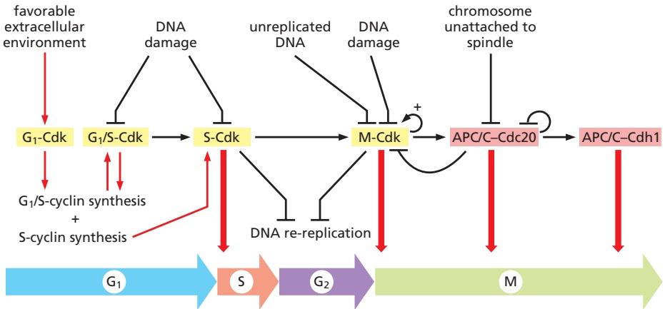

Figure 17–20 Sequential activation of Cdks during the cell cycle. The core of the cellcycle control system consists of a series of cyclin–Cdk complexes (yellow). The activity of each complex is also influenced by various inhibitory mechanisms, which provide information about the extracellular environment, DNA damage, and spindle assembly (top). We will discuss the mechanisms underlying these inhibitory effects later in this chapter.

activity, which initiates chromosome duplication in S phase and also contributes to M-Cdk activation and some early events of mitosis. M-Cdk then triggers progression through the G2/M transition and the events of early mitosis, leading to the alignment of sister-chromatid pairs on the mitotic spindle. Finally, M-Cdk also activates APC/C–Cdc20, thereby triggering the destruction of securin and cyclins—leading to sister-chromatid segregation and late mitotic events. Cdk inactivation also leads to activation of APC/C–Cdh1 and other mechanisms that suppress Cdk activity, resulting in a stable G1 phase. We are now ready to discuss these cell-cycle stages in more detail, starting with S phase.

## Summary

The cell-cycle control system triggers the events of the cell cycle and ensures that they are properly timed and coordinated with each other. Central components of the control system are the cyclin-dependent protein kinases (Cdks), which depend on cyclin subunits for their activity. Oscillations in the activities of different cyclin–Cdk complexes control various cell-cycle events. Thus, activation of S-phase cyclin–Cdk complexes (S-Cdk) initiates S phase, whereas activation of M-phase cyclin–Cdk complexes (M-Cdk) triggers mitosis. The mechanisms that control the activities of cyclin–Cdk complexes include phosphorylation of the Cdk subunit and binding of Cdk inhibitor proteins (CKIs). Protein phosphatases, including PP2A, oppose the actions of Cdks and thereby help control Cdk substrate phosphorylation and thus cell-cycle progression. The cell-cycle control system also depends crucially on a ubiquitin ligase called the APC/C, which catalyzes the ubiquitylation and consequent destruction of cyclins and other regulatory proteins that control progression through late mitosis. Together, the many components of the cell-cycle control system are assembled into a complex regulatory system containing a linked series of biochemical switches that drive stepwise progression through the phases of the cell cycle.

## S PHASE

The linear chromosomes of eukaryotic cells are vast and dynamic assemblies of DNA and protein, and their duplication is a complex process that takes up a major fraction of the cell cycle. Not only must the long DNA molecule of each chromosome be duplicated accurately—a remarkable feat in itself—but the chromatin proteins in each region of that DNA must also be reproduced, ensuring that the daughter cells inherit all features of chromosome structure.

The central event of chromosome duplication—DNA replication—poses two problems for the cell. First, replication must occur with extreme accuracy to minimize the risk of mutations in the next cell generation. Second, every nucleotide in the genome must be copied once, but only once, to prevent the damaging effects of gene amplification. In Chapter 5, we discuss the sophisticated protein machinery that performs DNA replication with astonishing speed and accuracy. In this section, we consider the elegant mechanisms by which the cell-cycle control system initiates the replication process and, at the same time, prevents it from happening more than once per cycle.

## S-Cdk Initiates DNA Replication Once Per Cell Cycle

As we discussed in Chapter 5, DNA replication in eukaryotic cells begins at origins of replication, which are scattered at numerous locations in every chromosome. During S phase, DNA replication is initiated at these origins when a DNA helicase unwinds the double helix and DNA replication enzymes are loaded onto the two single-stranded templates. This leads to the elongation phase of replication, when the replication machinery moves outward from the origin at two replication forks.

To ensure that chromosome duplication occurs only once per cell cycle, the initiation of DNA replication is divided into two distinct steps that occur at different times in the cell cycle (**Figure 17–21**). The first step occurs only in late mitosis or early G1, when two inactive DNA helicases, called **Mcm helicases**, are loaded onto the DNA at the replication origin. This step is sometimes called licensing of replication origins because initiation of DNA synthesis is permitted only at origins that are preloaded with Mcm helicases. The second step occurs in S phase, when the Mcm helicases are activated, primarily by S-Cdks, resulting in DNA unwinding and the initiation of DNA synthesis. Once a replication origin has been activated in this way, it cannot be reused until new Mcm helicases are loaded at that origin, which can occur only when the cell reaches late mitosis or G1. As a result, origins can be activated only once per cell cycle, ensuring that the DNA is replicated once and only once.

Figure 17–21 Control of chromosome duplication. Preparations for DNA replication begin in late mitosis and G1, when inactive Mcm helicases (brown) are loaded at the replication origin (blue), which is also occupied by the origin recognition complex described in Figure 17–22. Entry into S phase leads to activation of the helicases, which unwind the DNA and recruit other proteins to initiate DNA replication. Two replication forks move out from each origin until the entire chromosome is duplicated (newly synthesized DNA in red). Duplicated chromosomes are then segregated in M phase, and new Mcm helicases are loaded as the cell enters the next G1. The key steps in the control of DNA synthesis are governed by oscillations in the activities of Cdks and the APC/C.

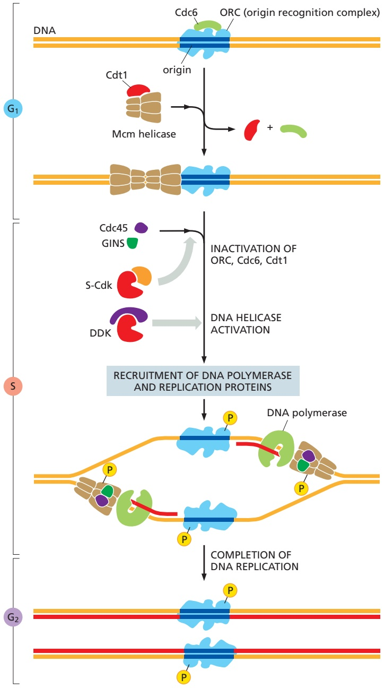

Figure 17–22 Control of the initiation of DNA replication. The replication origin is bound by the origin recognition complex (ORC) throughout the cell cycle, but ORC functions only in late mitosis and early G1 when it associates with Cdc6. ORC–Cdc6 binds the Mcm helicase, which contains six closely related subunits arranged in a barrel shape. The helicase also associates with a protein called Cdt1. Using energy provided by ATP hydrolysis, the ORC and Cdc6 proteins load two copies of the Mcm helicase around the DNA next to the origin. At the onset of S phase, S-Cdk stimulates the assembly of several accessory proteins, including Cdc45 and GINS, on each Mcm helicase. Another protein kinase, DDK, phosphorylates subunits of the Mcm helicase. The result is a large protein complex called the CMG helicase (for Cdc45–Mcm–GINS), which unwinds the DNA at the origin. DNA polymerase and other replication proteins arrive at the origin, and DNA replication begins. For clarity, this diagram does not show synthesis of the lagging strand (discussed in Chapter 5). The ORC is displaced by the replication machinery, but new ORCs bind to both replication origins after their replication. S-Cdk and other mechanisms also inactivate the loading factors ORC, Cdc6, and Cdt1, thereby preventing loading of new Mcm helicases at the origins until the end of mitosis.

**Figure 17–22** illustrates some of the molecular details underlying the control of the two steps in the initiation of DNA replication. A key player is a large multiprotein complex called the **origin recognition complex (ORC)**, which binds to replication origins. In late mitosis and early. $\mathbf { G } _ { 1 } ,$ the proteins **Cdc6** and **Cdt1** collaborate with the ORC to load the Mcm helicases around the DNA next to the origin. The origin is now licensed for replication.

At the onset of S phase, S-Cdk triggers origin activation by phosphorylating specific accessory proteins, which bind and thereby activate the Mcm helicases at the origin. The two DNA strands are separated, and an active helicase is loaded around each strand. The DNA synthesis machinery is recruited to the origin and DNA synthesis begins. Another protein kinase called DDK is also activated in S phase and helps drive origin activation by phosphorylating specific subunits of the Mcm helicase.

At the same time as S-Cdk initiates DNA replication, it employs several mechanisms to prevent the loading of new Mcm helicases at origins. S-Cdk phosphorylates and thereby inhibits the ORC and Cdc6 proteins. Inactivation of

APC/C–Cdh1 in late $\mathrm { G _ { 1 } }$ also helps prevent Mcm helicase loading, as follows. In late mitosis and early $\mathrm { G } _ { 1 } ,$ APC/C–Cdh1 triggers the destruction of a Cdt1 inhibitor called **geminin**, thereby allowing Cdt1 to be active. When APC/C–Cdh1 is turned off in late $\mathbf { G _ { l } } ,$ geminin accumulates and inhibits the Cdt1 that is not associated with DNA. Also, the association of Cdt1 with a protein at active replication forks stimulates Cdt1 ubiquitylation by a ubiquitin ligase called CRL4–Cdt2, leading to Cdt1 degradation. In these various ways, Mcm complex loading is blocked from S phase to mid-mitosis. Thus, once an origin is used, it cannot be reloaded with a new Mcm complex in the same cell cycle.

How, then, is the cell-cycle control system reset to allow replication in the next cell cycle? In late mitosis, APC/C activation leads to the inactivation of Cdks and the destruction of geminin. ORC and Cdc6 are dephosphorylated and Cdt1 is activated, allowing Mcm helicase loading to prepare the cell for the next S phase.

## Chromosome Duplication Requires Duplication of Chromatin Structure

The DNA of the chromosomes is complexed with a variety of protein components, including histones and various regulatory proteins involved in the control of gene expression (discussed in Chapter 4). Thus, duplication of a chromosome is not simply a matter of replicating the DNA at its core but also requires the duplication of these chromatin proteins and their proper assembly on the DNA.

The production of chromatin proteins increases during S phase to provide the raw materials needed to package the newly synthesized DNA. Most important, S-Cdks stimulate a large increase in the synthesis of the four histone subunits that form the histone octamers at the core of each nucleosome. These subunits are assembled into nucleosomes on the DNA by nucleosome assembly factors, which typically associate with the replication fork and distribute nucleosomes on both strands of the DNA as they emerge from the DNA synthesis machinery.

Chromatin packaging helps to control gene expression. In some parts of the chromosome, the chromatin is highly condensed and is called heterochromatin, whereas in other regions it has a more open structure called euchromatin (discussed in Chapter 4). These differences in chromatin structure depend on a variety of mechanisms, including modification of histone tails and the presence of non-histone proteins. Because these differences are important in gene regulation, it is crucial that chromatin structure, like the DNA within, is reproduced accurately during S phase. How chromatin structure is reproduced is not well understood, however. During DNA synthesis, histone-modifying enzymes and various non-histone proteins are probably deposited onto the two new DNA strands as they emerge from the replication fork, and these proteins are thought to reproduce the local chromatin structure of the parent chromosome (see Figure 4–44).

## Cohesins Hold Sister Chromatids Together

At the end of S phase, each replicated chromosome consists of a pair of identical sister chromatids glued together along their length. This sister-chromatid cohesion sets the stage for a successful mitosis because it greatly facilitates the attachment of the two sister chromatids to opposite poles of the mitotic spindle. Imagine how difficult it would be to achieve bipolar spindle attachment if sister chromatids were allowed to drift apart after S phase. Indeed, defects in sister-chromatid cohesion—in yeast mutants, for example—lead inevitably to major errors in chromosome segregation.

Sister-chromatid cohesion depends on a large protein complex called **cohesin**, which forms a ring structure that surrounds the two chromatids (**Figure 17–23**). Cohesin is first loaded around unduplicated chromosomes before S phase, with assistance from a specialized loading complex. During S phase, by mechanisms that remain obscure, the cohesin ring is held in place during passage of the replication fork, such that the cohesin ring encircles the pair of new sister chromatids as they are being synthesized. Also during S phase, an acetyltransferase modifies a subpopulation of cohesins, locking them around the sisters to provide the stable sister-chromatid cohesion that is required to hold the sisters together until mitosis.

Sister-chromatid cohesion also results, at least in part, from the intertwining of sister DNA molecules that occurs when two replication forks meet during DNA synthesis. The enzyme topoisomerase II gradually disentangles the sister DNAs between S phase and early mitosis by cutting one DNA molecule, passing the other through the break, and then resealing the cut DNA (see Figure 5–23). Once the intertwining has been removed, sister-chromatid cohesion depends on cohesin. The loss of sister cohesion at the metaphase-to-anaphase transition therefore depends primarily on disruption of these complexes, as we describe later.

## Summary

Duplication of the chromosomes in S phase involves the accurate replication of the entire DNA molecule in each chromosome, as well as the duplication of the chromatin proteins that associate with the DNA and govern various aspects of chromosome function. Chromosome duplication is triggered by the activation of S-Cdk, which activates proteins that unwind the DNA and initiate its replication at replication origins. Once a replication origin is activated, S-Cdk also inhibits proteins that are required to allow that origin to initiate DNA replication again. Thus, each origin is fired once and only once in each S phase and cannot be reused until the next cell cycle. During S phase, the duplicated chromosomes are linked together by cohesin, which provides the sister-chromatid cohesion that is required for alignment of the sister-chromatid pairs on the bipolar spindle in mitosis.

## MITOSIS

Following the completion of S phase and transition through $\mathrm { G } _ { 2 } ,$ the cell undergoes the dramatic changes of M phase. This begins with mitosis, during which the sister chromatids are separated and distributed (segregated) to a pair of identical daughter nuclei, each with its own copy of the genome. Mitosis is traditionally divided into five stages—prophase, prometaphase, metaphase, anaphase, and telophase—defined primarily on the basis of chromosome behavior as seen in a microscope. As mitosis is completed, the second major event of M phase—cytokinesis—divides the cell into two halves, each with an identical nucleus. **Panel 17–1** summarizes the major events of M phase (**Movie 17.2**, **Movie 17.3**, **Movie 17.4**, and **Movie 17.5**).

From a regulatory point of view, mitosis can be divided into two major parts, each governed by distinct components of the cell-cycle control system. First, an increase in M-Cdk activity at the $\mathrm { G _ { 2 } / M }$ transition triggers the events of early

Figure 17–23 Cohesin. Cohesin is a protein complex with four subunits. (A) Two subunits of cohesin are members of a large family of proteins called SMC proteins (for structural maintenance of chromosomes). These subunits, Smc1 and Smc3, are coiled-coil proteins whose N- and C-terminal regions fold together to form a globular ATPase domain. (B) The Scc1 subunit contains two globular domains separated by a long disordered region that binds an additional subunit called Scc3. Binding of the globular domains of Scc1 to the Smc1 and Smc3 subunits results in a ring structure that encircles the sister chromatids as shown in (C). ATP binding promotes the interaction of the ATPase domains as shown here, while ATP hydrolysis dissociates the ATPase domains. Loading and unloading of cohesin on DNA requires ATP hydrolysis and is expected to involve the opening of one of the three intersubunit gates, but this process remains poorly understood. During S phase, acetylation of the ATPase domain of Smc3 (not shown) prevents the opening of the ring, thereby locking the cohesin ring around the sister chromatids. In metaphase, proteolytic cleavage of sites in the disordered region of Scc1 triggers sister-chromatid separation, as discussed later.

mitosis (prophase, prometaphase, and metaphase). M-Cdk and other mitotic protein kinases phosphorylate a variety of proteins, leading to the assembly of the mitotic spindle and its attachment to the sister-chromatid pairs. The second major part of mitosis begins at the metaphase-to-anaphase transition, when the APC/C triggers the destruction of securin, liberating a protease that cleaves cohesin and thereby initiates separation of the sister chromatids. The APC/C also promotes the destruction of cyclins, which leads to Cdk inactivation and the dephosphorylation of Cdk targets, which is required for the events of late M phase, including the completion of anaphase, the disassembly of the mitotic spindle, and the division of the cell by cytokinesis.

## M-Cdk and Other Protein Kinases Drive Entry into Mitosis

One of the most remarkable features of cell-cycle control is that a single protein kinase, M-Cdk, brings about so many of the diverse and complex cell rearrangements that occur in the early stages of mitosis. At a minimum, M-Cdk must induce the assembly of the mitotic spindle and ensure that each sister chromatid in a pair is attached to the opposite pole of the spindle. It also triggers chromosome condensation, the large-scale reorganization of the intertwined sister chromatids into compact, rodlike structures. In animal cells, M-Cdk also promotes the breakdown of the nuclear envelope and rearrangements of the actin cytoskeleton and the Golgi apparatus. Each of these processes is initiated when M-Cdk phosphorylates specific proteins involved in the process. Many of these Cdk substrates have been identified, and in many cases we understand in considerable detail how their phosphorylation alters their function.

M-Cdk directly phosphorylates many of the proteins involved in mitotic processes, but it also acts indirectly by phosphorylating and thereby activating other protein kinases that carry out some mitotic functions. Two families of protein kinases, the Polo-like kinases and the Aurora kinases, make particularly important contributions to the control of early mitotic events. The Polo-like kinase Plk1, for example, is required for the normal assembly of a bipolar mitotic spindle, in part because it phosphorylates proteins involved in separation of the spindle poles early in mitosis. The Aurora kinase Aurora-A also helps control proteins that govern the assembly and stability of the spindle, whereas Aurora-B controls attachment of sister chromatids to the spindle, as we discuss later.

## Condensin Helps Configure Duplicated Chromosomes for Separation

At the end of S phase, the immensely long DNA molecules of the sister chromatids are tangled in a mass of partially intertwined DNA and proteins. Any attempt to pull the sisters apart in this state would undoubtedly lead to breaks in the chromosomes. To avoid this disaster, the cell devotes a great deal of time and energy in early mitosis to reorganizing the sister chromatids into relatively short, distinct structures that can be pulled apart more easily in anaphase. These chromosomal changes involve two overlapping processes: chromosome condensation, in which the chromatids are dramatically compacted; and sister-chromatid resolution, whereby the two sisters are resolved into distinct, separable units (**Figure 17–24A**). Resolution results from the disentangling of the sister DNAs, accompanied by the partial removal of cohesin molecules along the chromosome arms. As a result, when the cell reaches metaphase, the sister chromatids appear in the microscope as compact, rodlike structures that are joined tightly at their centromeric regions and only loosely along their arms.

The condensation and resolution of sister chromatids depend, at least in part, on a five-subunit protein complex called **condensin**, which is concentrated along the central axes of mitotic chromosomes (**Figure 17–24B**). Condensin structure is related to that of the cohesin complex that holds sister chromatids together (see Figure 17–23). It contains two SMC subunits like those of cohesin, plus

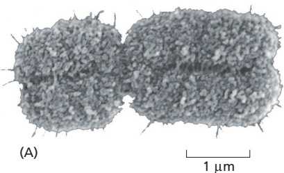

Figure 17–24 The mitotic chromosome. (A) Scanning electron micrograph of a human mitotic chromosome, consisting of two sister chromatids joined along their length. The constricted regions are the centromeres. (B) An electron micrograph of a duplicated mitotic chromosome in which condensin is labeled with antibodies attached to tiny gold particles (dark dots), showing that condensin is found mainly in the central core of the chromosome. (A, courtesy of Terry D. Allen; B, from N. Kireeva et al., J. Cell Biol. 166:775–785, 2004. With permission from Rockefeller MBoC7 e1University Press.)

## 1 PROPHASE

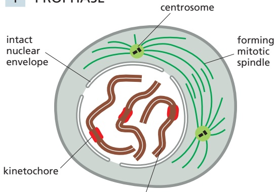

condensing replicated chromosome, consisting of two sister chromatids held together along their length

At prophase, the replicated chromosomes, each consisting of two closely associated sister chromatids, condense. Outside the nucleus, the mitotic spindle assembles between the two centrosomes, which have replicated and moved apart. For simplicity, only three chromosomes are shown. In diploid cells, there would be two copies of each chromosome present. In the fluorescence micrograph, chromosomes are stained orange and microtubules are green.

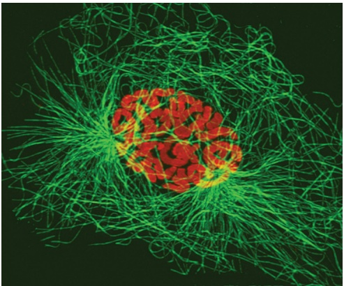

10 µm

## 2 PROMETAPHASE

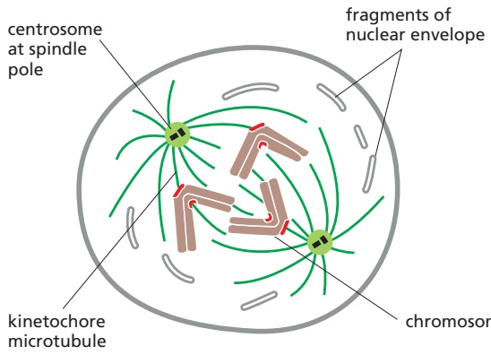

Prometaphase starts abruptly with the breakdown of the nuclear envelope. Chromosomes can now attach to spindle microtubules via their kinetochores and undergo active movement.

chromosome in active motion

## 3 METAPHASE

centrosome at spindle pole

kinetochore microtubule

At metaphase, the chromosomes are aligned at the equator of the spindle, midway between the spindle poles. The kinetochore microtubules attach sister chromatids to opposite poles of the spindle.

centrosome

## ANAPHASE

shortening kinetochore microtubule

spindle pole moving outward

At anaphase , the sister chromatids synchronously separate to form two daughter chromosomes, and each is pulled slowly toward the spindle pole it faces. The kinetochore microtubules get shorter, and the spindle poles also move apart; both processes contribute to chromosome segregation.

## TELOPHASE

During telophase, the two sets of daughter chromosomes arrive at the poles of the spindle and decondense. A new nuclear envelope reassembles around each set, completing the formation of two nuclei and marking the end of mitosis. The division of the cytoplasm begins with contraction of the contractile ring.

nuclear envelope reassembling around chromosomes

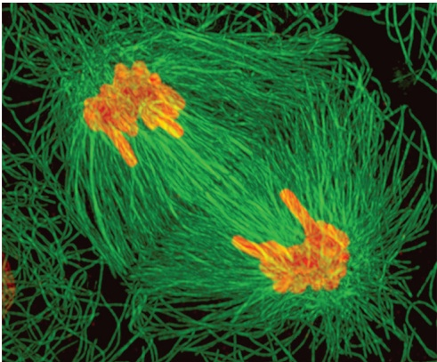

## CYTOKINESIS

contractile ring creating cleavage furrow

During cytokinesis, the cytoplasm is divided in two by a contractile ring of actin and myosin filaments, which pinches the cell in two to create two daughters, each with one nucleus.

re-formation of interphase array of microtubules nucleated by the centrosome

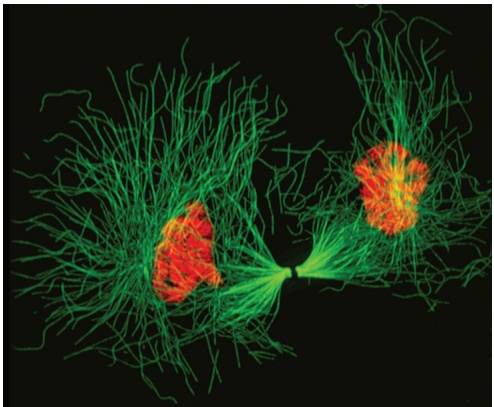

condensin non-SMC subunits bind DNA tightly

Figure 17–25 Condensin. (A) Condensin is a five-subunit protein complex that resembles cohesin (see Figure 17–23). The ATPase head domains of its two major subunits, Smc2 and Smc4, are held together by a linker protein called Brn1, which is associated with two additional proteins called Ycs4 and Ycg1. (B) These diagrams illustrate a mechanism by which condensin might generate DNA loops, thereby promoting the compaction of a chromosome. For an alternative model, see Figure 4–56. In the model shown here, the process begins when the Ycg1 subunit interacts tightly with a strand of chromosome DNA, anchoring the condensin firmly in place on the DNA. The nearby DNA curls around to interact with the hinge domain. By mechanisms that remain unclear, the hinge and ATPase domains work together, using energy from ATP hydrolysis, to move leftward along the top DNA strand (red arrow), thereby generating a chromosome loop. Such loops are common structural elements in chromosome packaging (discussed in Chapter 4).

three non-SMC subunits (**Figure 17–25A**). Like cohesin, condensin forms a ring that encircles DNA. In addition, condensin has the ability to use energy provided by ATP hydrolysis to promote the compaction of sister chromatids. There is evidence that the ATPase domains of condensin act as a motor that moves DNA through the ring, thereby allowing it to create chromosome loops (**Figure 17–25B**). Much remains to be learned, however, before we understand how the local coordination of condensin, cohesin, and histone proteins is choreographed by M-Cdk to generate the efficient packaging and resolution of the sister chromatids.

## The Mitotic Spindle Is a Dynamic Microtubule-based Machine

The central event of mitosis—chromosome segregation—depends in all eukaryotes on a complex and beautiful machine called the **mitotic spindle** (see Panel 17–1). The spindle is a bipolar array of microtubules, which pulls sister chromatids apart in anaphase, thereby segregating the two sets of chromosomes to opposite ends of the cell, where they are packaged into daughter nuclei (**Movie 17.6**). M-Cdk triggers the assembly of the spindle early in mitosis, in parallel with the chromosome restructuring just described. Before we consider how the spindle assembles and how its microtubules attach to sister chromatids, we briefly review the key features of metaphase spindle structure.

As we discussed in Chapter 16, microtubules are dynamic polar polymers with plus and minus ends that display distinct behaviors. The metaphase spindle of an animal cell contains many thousands of microtubules radiating from two spindle poles, with minus ends oriented toward the pole and plus ends directed outward (**Figure 17–26**). The **kinetochore microtubules** are the central players in chromosome segregation: their plus ends are attached to sister-chromatid pairs at large protein structures called kinetochores, which are located at the centromere of each sister chromatid. Each kinetochore binds large numbers of microtubules that are cross-linked to form thick microtubule bundles called K-fibers. These fibers are responsible for moving separated sister chromatids toward the poles in anaphase.

The second major type of spindle microtubule, and by far the most numerous, are the **non-kinetochore microtubules** (also known as interpolar microtubules). These relatively short and unstable microtubules are densely packed between the poles, cross-linked by various proteins to form a dynamic and adaptable scaffolding network that provides structural stability to the spindle. Some of these microtubules are embedded in the spindle poles, but many are found away from the poles, sometimes with minus ends attached to the sides of other microtubules. Near the spindle equator, they are often cross-linked with antiparallel microtubules oriented with minus ends directed toward the opposite spindle pole.

In most animal cells, spindles also contain **astral microtubules** that radiate outward from the poles and contact the cell cortex, helping to position the spindle in the cell. Each of the two poles in these spindles is focused at a large protein organelle called the **centrosome**. As described in Chapter 16 (see Figures 16–42 and 16–43), the centrosome consists of a cloud of amorphous material (called the pericentriolar material) that surrounds a pair of centrioles (**Figure 17–27**). The pericentriolar material nucleates a radial array of microtubules, with their dynamic plus ends projecting outward and their minus ends associated with

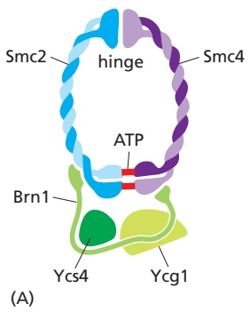

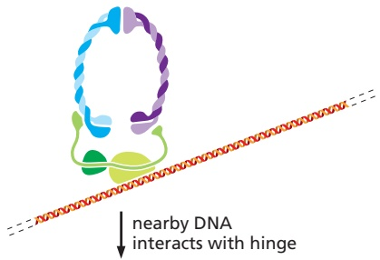

nearby DNA interacts with hinge

ATP-dependent motor activity extends DNA loop 2000000000

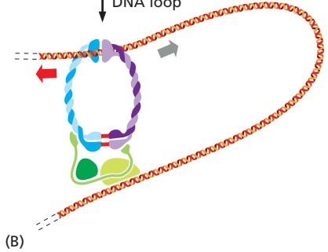

1 µm

(B)

the centrosome. Some cells—notably the cells of higher plants and the oocytes of many vertebrates—do not have centrosomes and therefore do not have astral microtubules. Thus, as we discuss later, centrosomes are not essential for spindle assembly.

Figure 17–26 The metaphase mitotic spindle in an animal cell. Bundles of parallel kinetochore microtubules (K-fibers) connect the spindle poles with the kinetochores of sister chromatids. Non-kinetochore microtubules are scattered throughout the spindle with their minus ends directed toward the nearest pole; these microtubules are cross-linked by various microtubule-associated proteins to form a dynamic, interconnected meshwork. Near the spindle equator, antiparallel microtubules are cross-linked by specific motor and other proteins (light purple dots). In other regions of the spindle, parallel microtubules are cross-linked (red dots). Some microtubules grow from nucleating factors in the centrosome, while others originate in nucleating factors on the sides of other microtubules (green dots), as we discuss later. Astral microtubules radiate out from the poles into the cytoplasm and are not present in spindles lacking centrosomes.

The assembly and function of a bipolar spindle depend on hundreds of dif-MBoC7 m17.23/17.26 ferent microtubule-associated proteins that can be placed in three general categories: nucleating factors that govern the formation of new microtubules, regulatory proteins that control rates of polymerization and depolymerization at both ends of the microtubules, and motor proteins that cross-link and move microtubules relative to each other. We briefly describe each of these important microtubule regulators in the following sections, after which we discuss how these components collaborate in the assembly of the spindle.

## Microtubules Are Nucleated in Multiple Regions of the Spindle

Microtubules are the building blocks of the spindle, and spindle assembly requires the synthesis of enormous numbers of new microtubules. Mature metaphase spindles contain tens or hundreds of thousands of microtubules, most of which are turning over rapidly, resulting in the need for a constant supply of new microtubules. To meet this need, the spindle contains large numbers of microtubule nucleating factors. By far the most important of these is the g-tubulin ring complex (g-TuRC; see Figure 16–41), which nucleates microtubule assembly from the minus end, leaving the plus end to grow rapidly.

Figure 17–27 The centrosome. (A) Electron micrograph of an S-phase mammalian cell in culture, showing a duplicated centrosome. Each centrosome contains a pair of centrioles; although the centrioles have duplicated, they remain together in a single complex, as shown in the drawing of the micrograph in (B). One centriole of each centriole pair has been cut in cross section, while the other is cut in longitudinal section, indicating that the two members of each pair are aligned at right angles to each other. The two halves of the replicated centrosome, each consisting of a centriole pair surrounded by pericentriolar material, will split and migrate apart to initiate the formation of the two poles of the mitotic spindle when the cell enters M phase (see Figures 16–42 and 16–43). (A, from M. McGill et al., J. Ultrastruct. Res. 57:43–53, 1976. With permission from Academic Press.)

In the many animal cell types that contain centrosomes, large numbers of γ-TuRCs are anchored and activated in the pericentriolar material and drive the formation of microtubules that radiate outward from the centrosome (see Figure 16-42). The number of γ-TuRCs in each centrosome increases greatly at the beginning of mitosis, in a process called centrosome maturation.

Microtubule formation also occurs within the metaphase spindle between the poles. A large protein complex called augmin anchors active γ-TuRC to the side of a microtubule, resulting in the nucleation of a new microtubule that branches off the other (see Figure 16-47). Augmin binds to the microtubule in such a way that it orients the new microtubule with its plus end pointing in the same direction as the microtubule to which it binds; as a result, the new microtubule has the correct orientation when it is released and repositioned in the spindle microtubule network.

Spindle assembly also depends on increased microtubule synthesis in the vicinity of the chromosomes. Mitotic chromosomes generate local signals that activate γ-TuRC and thereby promote microtubule formation. As we describe later, this mechanism, together with microtubule sorting by various motor proteins, allows chromosomes to make a major contribution to the formation of a bipolar spindle—particularly in the absence of centrosomes.

## Microtubule Instability Increases Greatly in Mitosis

As discussed in Chapter 16, microtubules are in a state of dynamic instability, in which individual microtubules are either growing or shrinking and stochastically switch between the two states. New microtubules are continually being created to balance the loss of those that disappear completely by depolymerization.

Entry into mitosis signals an abrupt change in the cell’s microtubules. During prophase, and particularly in prometaphase and metaphase (see Panel 17–1), the average lifetime of a microtubule decreases dramatically—particularly the lifetime of non-kinetochore microtubules, which exist for only 15–30 seconds. This increase in microtubule instability, coupled with the increased ability of the spindle to nucleate microtubules as mentioned above, results in a remarkably dense and dynamic array of spindle microtubules.

Microtubule dynamics are controlled in the cell by a variety of regulatory proteins, including microtubule-associated proteins (MAPs) that promote stability and depolymerization factors that destabilize microtubule plus ends. Changes in the activities of these proteins are responsible for the changes in microtubule dynamics that occur during mitosis. Many of these changes result from phosphorylation of specific proteins by M-Cdk and other mitotic protein kinases.

## Microtubule-based Motor Proteins Govern Spindle Assembly and Function

The assembly and function of the mitotic spindle depend on numerous microtubule-dependent motor proteins. As discussed in Chapter 16, these proteins belong to two families—the large family of kinesin-related proteins, which usually move toward the plus end of microtubules, and dyneins, which move toward the minus end. Two motor proteins—kinesin-5 and cytoplasmic dynein—are particularly important in spindle assembly and function, and many others, including kinesin-14 and kinesins-4/10, are also involved (**Figure 17–28**).

Kinesin-5 is a large tetramer containing two dimeric motor domains at each end. The motor domains both move toward the plus end of a microtubule but can be oriented in opposite directions; as a result, they can associate with two antiparallel microtubules and slide them in opposite directions. When this occurs near the center of the spindle, the result is that the minus ends of the microtubule are pushed toward the poles. This process is fundamentally important in generating bipolarity in the spindle.

Figure 17–28 Major motor proteins of the spindle. Microtubule-dependent motor proteins contribute to spindle assembly and function (see text). The colored arrows indicate the direction of motor protein movement along a microtubule—blue toward the minus end and light red toward the plus end. Because non-kinetochore microtubules are extensively cross-linked to each other in the spindle and at the poles, it is thought that microtubule sliding like that shown here can alter spindle length. (From D.O. Morgan, The Cell Cycle: Principles of Control, p. 117. London: New Science Press, 2007. With permission from Oxford University Press.)

Cytoplasmic dynein is a minus end–directed motor that, together with associ-MBoC7 m17.25/17.28 ated proteins, organizes microtubules at various locations in the cell. By attaching to the minus end of one microtubule and transporting it toward the minus end of a second microtubule, dynein functions to connect new microtubules formed in the body of the spindle to microtubules nucleated at a centrosome, and to focus the spindle poles. Dynein is also present on the plus ends of astral microtubules at the cell cortex. By moving toward the minus end of astral microtubules, dynein motors pull the spindle poles toward the cell cortex and away from each other.

Kinesin-14, unlike most kinesins, is a minus end–directed motor. It contains a dimeric motor domain and a second domain that can bind to a neighboring microtubule in a specific orientation, enabling it to cross-link antiparallel microtubules at the center of the spindle and pull the poles together. Kinesin-4 and kinesin-10 proteins, also called chromokinesins, are plus end–directed motors that associate with chromosome arms and push the attached chromosome away from the pole (or the pole away from the chromosome).

## Bipolar Spindle Assembly in Most Animal Cells Begins with Centrosome Duplication

The mitotic spindle must have two poles if it is to pull the two sets of sister chromatids to opposite ends of the cell in anaphase. In most animal cells, several mechanisms ensure the bipolarity of the spindle. One depends on centrosomes. A typical animal cell enters mitosis with a pair of centrosomes, each of which nucleates a radial array of microtubules. The two centrosomes provide prefabricated spindle poles that greatly facilitate bipolar spindle assembly. The other mechanisms depend on the ability of mitotic chromosomes to nucleate and stabilize microtubules and on the ability of motor proteins to organize microtubules into a bipolar array. We will discuss these “self-organization” mechanisms later in this section.

In interphase, most animal cells contain a single centrosome that nucleates most of the cell’s cytoplasmic microtubules. The centrosome duplicates when the cell enters the cell cycle, so that by the time the cell reaches mitosis there are two centrosomes. Centrosome duplication begins at about the same time as the cell enters S phase. The $G _{1}/ S-Cdk$ (a complex of cyclin E and Cdk2 in animal cells; see Table 17–1) that triggers cell-cycle entry also helps initiate centrosome duplication, together with another protein kinase called Plk4. Each of the two centrioles in the centrosome nucleates the formation of a new centriole, which is gradually constructed in S phase to generate a closely linked pair of centrosomes (**Figure 17–29**). This centrosome pair remains together on one side of the nucleus until the cell enters mitosis, when the two centrosomes undergo numerous changes to form the poles of the spindle.

There are interesting parallels between centrosome duplication and chromosome duplication. Both use a semiconservative mechanism of duplication, in which the two halves separate and serve as templates for construction of a new half. Centrosomes, like chromosomes, must replicate once and only once per cell cycle, to ensure that the cell enters mitosis with precisely two copies: an incorrect number of centrosomes can lead to defects in spindle assembly and thus errors in chromosome segregation.

We are beginning to unravel the complex mechanisms that limit centrosome duplication to once and only once per cell cycle. These mechanisms are reminiscent of those that restrict DNA replication to once per cell cycle: after duplication has occurred in S phase, passage through mitosis is required for the “licensing” of centrosome duplication in the next cell cycle (see Figure 17–29).

## Spindle Assembly in Animal Cells Requires Nuclear-Envelope Breakdown

In cells that contain centrosomes, spindle assembly begins when the two centrosomes move apart along the nuclear envelope in prophase, pulled by dynein motor proteins that link astral microtubules to the cell cortex (see Figure 17–28). The plus ends of the microtubules between the centrosomes interdigitate to form an array of antiparallel microtubules, and kinesin-5 motor proteins cross-link these microtubules and push the centrosomes apart.

Centrosomes and microtubules are located in the cytoplasm, where they have no access to the sister-chromatid pairs inside the nucleus. Thus, the attachment of the nascent spindle to sister-chromatid pairs requires the removal of the nuclear envelope. In addition, many of the motor proteins and microtubule regulators that promote spindle assembly are associated with the chromosomes inside the nucleus, and they require nuclear-envelope breakdown to carry out their functions.

Nuclear-envelope breakdown is a complex, multistep process, which is thought to begin when M-Cdk phosphorylates several subunits of the nuclear pore complexes in the nuclear envelope. This phosphorylation initiates the disassembly of nuclear pore complexes and their dissociation from the envelope. M-Cdk also phosphorylates components of the nuclear lamina, the structural framework beneath the envelope, resulting in nuclear lamina disassembly. In parallel, phosphorylation of several inner-nuclear-envelope proteins leads to detachment of

Figure 17–29 The centrosome cycle. In early $\mathbb { G } _ { 1 } ,$ the centrosome consists of two centrioles linked by a protein tether, as well as associated pericentriolar material for nucleation of microtubules (light green). One centriole, the mature parent, carries protein appendages required for certain centrosome functions. Upon entry into the cell cycle, G1/S-Cdk and Plk4 initiate centriole duplication, whereby a new centriole (procentriole) is assembled at a single site on the side of each parent centriole (yellow dots). The elongation of the procentrioles is usually completed in G2. The two centriole pairs remain close together in a single centrosomal complex until entry into mitosis, when the protein kinases M-Cdk, Plk1, and other regulators trigger numerous changes: the tether between centrosomes is removed, the immature parent centriole acquires appendages (centriole maturation), the pericentriolar material expands to enable more microtubule nucleation (centrosome maturation), and the centrosomes separate, forming a new spindle between them. After the completion of mitosis, the two centrioles in each centrosome detach (centriole disengagement), and the new centriole acquires pericentriolar material (centriole-to-centrosome conversion). These two processes are required for centriole duplication in the subsequent cell cycle; thus, progression through mitosis is required for duplication, helping to ensure that centrioles (and centrosomes) duplicate only once per cell cycle.

Figure 17–30 Activation of the GTPase Ran around mitotic chromosomes. The Ran protein, like other members of the small GTPase family (discussed in Chapter 15), can exist in two conformations depending on whether it is bound to GDP (inactive state) or GTP (active state). The localization of active Ran in mitosis was determined using a protein that emits fluorescence at a specific wavelength when it is activated by Ran-GTP. In the metaphase human cell shown here, Ran activity (yellow and red) is highest around the chromosomes, between the poles of the mitotic spindle (indicated by asterisks). (From P. Kaláb et al., Nature 440:697–701, published 2006 by Nature Publishing Group. Reproduced with permission from SNCSC.)

lamin proteins and chromosomes from the nuclear envelope, which is then incorporated into the membranes of the endoplasmic reticulum.

10 µm

## Mitotic Chromosomes Promote Bipolar Spindle Assembly

When they are present, centrosomes drive spindle assembly. Centrosomes are very efficient microtubule nucleators that also act to organize the spindle poles, rapidly generating a bipolar microtubule array that rains down on the chromosomes when the nuclear envelope is removed. However, chromosomes are not just passive passengers in the process of spindle assembly. By creating a local environment that favors both microtubule nucleation and microtubule stabilization, they play an active part in spindle formation. The influence of the chromosomes can be demonstrated by using a fine glass needle to reposition them after the spindle has formed. For some cells in metaphase, if a single chromosome is tugged out of alignment, a mass of new spindle microtubules rapidly appears around the newly positioned chromosome, while the spindle microtubules at the chromosome’s former position depolymerize. This property of the chromosomes seems to depend, at least in part, on a guanine nucleotide exchange factor (GEF) that is bound to chromatin; the GEF stimulates a small GTPase in the cytosol called Ran to bind GTP in place of GDP. The activated Ran-GTP, which is also involved in nuclear transport (discussed in Chapter 12), releases microtubuleregulatory proteins from protein complexes in the cytosol, thereby stimulating the local nucleation and stabilization of microtubules around chromosomes (**Figure 17–30**). The best-understood mechanism depends on the release of a protein called TPX2, which then binds and activates the protein kinase Aurora-A. Aurora-A phosphorylates regulatory proteins that activate γ-TuRCs, leading to an increase in local formation of new microtubules. TPX2 might also activate augmin to promote the formation of new microtubule branches on the sides of existing microtubules. Local microtubule stabilization is also promoted by the protein kinase Aurora-B, which associates with mitotic chromosomes.

In the absence of centrosomes, spindle assembly is thought to begin with the formation of microtubules around the chromosomes. Various microtubuleassociated proteins then organize the microtubules into a bipolar spindle (**Figure 17–31**). Two motor proteins that we discussed earlier are particularly important. Kinesin-5, by cross-linking antiparallel microtubules and pushing their minus ends outward, is essential for the bipolar character of the spindle. Dynein, by transporting one microtubule minus end toward the minus end of another, is required for the focusing of minus ends in a discrete pole at each end of the bipolar array. Many other microtubule regulators, including other motor proteins and augmin, also contribute to spindle assembly.

Figure 17–31 Spindle self-organization by motor proteins. Mitotic chromosomes stimulate the local activation of proteins that promote the formation of microtubules in the vicinity of the chromosomes. Kinesin-5 motor proteins (see Figure 17–28) organize these microtubules into antiparallel bundles, while plus end–directed kinesin-4 and kinesin-10 link the microtubules to chromosome arms and push minus ends away from the chromosomes. Dynein, together with numerous other proteins, focuses these minus ends into a pair of spindle poles.

Cells that normally lack centrosomes, such as those of higher plants and many animal oocytes, use chromosome-based self-organization mechanisms to form spindles. These mechanisms also assemble spindles in experimental systems where centrosomes are removed—such as in certain animal embryos that have been induced to develop from eggs without fertilization (called parthenogenesis). As the sperm normally provides the centrosome when it fertilizes an egg, the mitotic spindles in these parthenogenetic embryos develop without centrosomes (**Figure 17–32**). Although the resulting acentrosomal spindle can segregate chromosomes normally, it lacks astral microtubules, which are responsible for positioning the spindle in animal cells; as a result, the spindle can be mispositioned in the cell.

## Kinetochores Attach Sister Chromatids to the Spindle

After the assembly of a bipolar microtubule array, the second major step in spindle formation is the attachment of the array to the sister-chromatid pairs. Spindle microtubules become attached to each chromatid at its **kinetochore**, a giant, multilayered protein structure that is built at the centromeric region of the chromatid (**Figure 17–33**; also see Chapter 4). In metaphase, the plus ends of kinetochore microtubules are embedded head-on in specialized microtubuleattachment sites within the outer region of the kinetochore, furthest from the DNA. The kinetochore of an animal cell can bind 10–40 microtubules, whereas a budding yeast kinetochore can bind only one. Attachment of each microtubule depends on multiple copies of a rod-shaped protein complex called the Ndc80 complex, which is anchored in the kinetochore at one end and interacts with the sides of the microtubule at the other, thereby linking the microtubule to the kinetochore while still allowing the addition or removal of tubulin subunits at this end (**Figure 17–34**). Regulation of plus-end polymerization and depolymerization at the kinetochore is critical for the control of chromosome movement on the spindle, as we discuss later.

Figure 17–32 Bipolar spindle assembly without centrosomes in parthenogenetic embryos of the insect Sciara (or fungus gnat). The microtubules are stained green, the chromosomes red. The top fluorescence micrograph shows a normal MBoC7 m17.29/17.32spindle formed with centrosomes in a normally fertilized Sciara embryo. The bottom micrograph shows a spindle formed without centrosomes in an embryo that initiated development without fertilization. Note that the spindle with centrosomes has an aster at each pole of the spindle, whereas the spindle formed without centrosomes does not. Both types of spindles are able to segregate the replicated chromosomes. (© 1998 B. de Saint Phalle and W. Sullivan. Originally published in J. Cell Biol. https://doi.org/10.1083/jcb.141.6.1383.With permission from Rockefeller University Press.)

(C)

Figure 17–33 The kinetochore. (A) A fluorescence micrograph of a metaphase chromosome stained with a DNA-binding fluorescent dye and with human autoantibodies that react with specific kinetochore proteins. The two kinetochores, one associated with each sister chromatid, are stained red. (B) A drawing of a metaphase chromosome showing its two sister chromatids attached to the plus ends of kinetochore microtubules. Each kinetochore forms a plaque on the surface of the centromere. (C) Electron micrograph of an anaphase chromatid with microtubules attached to its kinetochore. While most kinetochores have a trilaminar structure, the one shown here (from a green alga) has an unusually complex structure with additional layers. (A, © 1991 R.P. Zinkowski et al. Originally published in J. Cell Biol. https://doi.org/10.1083/jcb.113.5.1091.With permission from Rockefeller University Press. C, from J.D. Pickett-Heaps and L.C. Fowke, Aust. J. Biol. Sci. 23:71–92, 1970. With permission from CSIRO Publishing.)

(A)

100 nm

(B)

(C)

Figure 17–34 Microtubule attachment sites in the kinetochore. (A) In this electron micrograph of a mammalian kinetochore, the chromosome is on the right, and the plus ends of multiple microtubules are embedded in the outer kinetochore on the left. (B) Electron tomography (discussed in Chapter 9) was used to construct a low-resolution threedimensional image of the outer kinetochore in A. Several microtubules (in multiple colors) are embedded in fibrous material of the kinetochore, which is thought to be composed of the Ndc80 complex and other proteins. (C) Each microtubule is attached to the kinetochore by interactions with multiple copies of the Ndc80 complex (blue). This complex binds to theMBoC7 m17.31/17.34 sides of the microtubule near its plus end, allowing polymerization and depolymerization to occur while the microtubule remains attached to the kinetochore. The opposite end of the Ndc80 complex is attached through intermediary proteins to centromeric nucleosomes containing a specialized version of histone H3 called CENP-A (see Chapter 4). Budding yeast kinetochores contain a single centromeric nucleosome and thus a single microtubule-binding site like that shown here, while animal kinetochores (like those in B) contain large arrays of these binding sites distributed over large numbers of centromeric nucleosomes. (A and B, from Y. Dong et al., Nat. Cell Biol. 9:516–522, published 2007 by Nature Publishing Group. Reproduced with permission of SNCSC.)

Kinetochore attachment to the spindle occurs by a complex sequence of events. At the end of prophase in animal cells, the centrosomes of the growing spindle generally lie on opposite sides of the nuclear envelope. Thus, when the envelope breaks down, the sister-chromatid pairs are bombarded by dynamic microtubule plus ends coming from two directions. However, the kinetochores do not instantly achieve the correct “end-on” microtubule attachment to both spindle poles. Instead, detailed studies with light and electron microscopy show that most initial attachments are unstable lateral attachments, in which a kinetochore attaches to the side of a passing microtubule, with assistance from dynein motor proteins in the outer kinetochore. Eventually, microtubule plus ends are captured by one and then the other kinetochore in the correct end-on orientation.

Another attachment mechanism also plays a part, particularly in the absence of centrosomes. Short microtubules in the vicinity of the chromosomes become embedded in the plus end–binding sites of the kinetochore. Polymerization at these plus ends then results in growth of the microtubules away from the kinetochore. The minus ends of these kinetochore microtubules are eventually cross-linked to other minus ends and focused by dynein motor proteins at the spindle pole (see Figure 17–31).

## Bi-orientation Is Achieved by Trial and Error

The success of mitosis demands that sister chromatids in a pair attach to opposite poles of the mitotic spindle, so that they move to opposite ends of the cell when they separate in anaphase. How is this mode of attachment, called **bi-orientation**, achieved? What prevents the attachment of both kinetochores to the same spindle pole or the attachment of one kinetochore to both spindle poles? Part of the answer is that sister kinetochores are constructed in a back-to-back orientation that reduces the likelihood that both kinetochores can face the same spindle pole. Nevertheless, incorrect attachments do occur, and elegant regulatory mechanisms have evolved to correct them.

Figure 17–35 Alternative forms of kinetochore attachment to the spindle poles. (A) Initially, a single microtubule from a spindle pole binds to one kinetochore in a sister-chromatid pair. Additional microtubules can then bind to the chromosome in various ways. (B) A microtubule from the same spindle pole can attach to the other sister kinetochore, or (C) microtubules from both spindle poles can attach to the same kinetochore. These incorrect attachments are unstable, however, so that one of the two microtubules tends to dissociate. (D) When a microtubule from the opposite pole MBOC7 m17.33/17.35binds to the second kinetochore, the sister kinetochores are thought to sense tension across their microtubule-binding sites. This triggers an increase in microtubule binding affinity, thereby locking the correct attachment in place. Occasionally (not shown), attachments can form that are a combination of C and D; that is, the two sister kinetochores are attached to opposite poles and are under tension, but there is also an inappropriate microtubule link between one kinetochore and both spindle poles. This combination is stable, and cells that progress to anaphase with such an attachment risk moving both sister chromatids to the same daughter, which is usually lethal for the cell.

Incorrect attachments are corrected by a system of trial and error that is based on a simple principle: most incorrect attachments are highly unstable and do not last, whereas correct attachments are held in place. How does the kinetochore sense a correct attachment? The answer appears to be tension (**Figure 17–35**). When a sister-chromatid pair is properly bi-oriented on the spindle, the two kinetochores are pulled in opposite directions by strong poleward forces. Sister-chromatid cohesion resists these poleward forces, creating high levels of tension within the kinetochores. When chromosomes are incorrectly attached—when both sister chromatids are attached to the same spindle pole, for example—tension is low and the kinetochore generates an inhibitory signal that loosens the grip of its microtubule attachment site, allowing detachment to occur. When bi-orientation occurs, the high tension at the kinetochore shuts off the inhibitory signal, strengthening microtubule attachment. In animal cells, tension not only increases the affinity of the attachment site but also leads to the attachment of additional microtubules to the kinetochore. This results in the formation of a thick kinetochore fiber composed of multiple microtubules.

The tension-sensing mechanism depends on the protein kinase Aurora-B, which is associated with the kinetochore and is thought to generate the inhibitory signal that reduces the strength of microtubule attachment in the absence of tension. It phosphorylates several components of the microtubule attachment site, including the Ndc80 complex, decreasing the site’s affinity for a microtubule plus end. When bi-orientation occurs, the resulting tension reduces phosphorylation by Aurora-B, thereby increasing the affinity of the attachment site (**Figure 17–36**).

After their attachment to the two spindle poles, the chromosomes are tugged back and forth, eventually assuming a position equidistant between the two poles, a position called the **metaphase plate**. In vertebrate cells, the chromosomes then oscillate gently at the metaphase plate, awaiting the signal for the sister chromatids to separate. The signal is produced, with a predictable lag time, after the bi-oriented attachment of the last sister-chromatid pair.

## Multiple Forces Act on Chromosomes in the Spindle

The metaphase spindle, with the sister chromatids aligned at the metaphase plate, appears as a stable bipolar structure of a fixed length, but appearances can be deceiving. The spindle is a highly dynamic assembly that exists at a steady state that depends on the precise balance of numerous forces generated by various motor proteins and by microtubule polymerization and depolymerization. These forces move chromosomes once they are attached to the spindle and produce the tension that is so important for the stabilization of correct attachments. In anaphase, similar forces pull the separated chromatids to opposite ends of the spindle. Three major spindle forces are particularly critical, although their strength and importance vary at different stages of mitosis.

The first major force pulls the kinetochore and its associated chromatid along the kinetochore microtubule toward the spindle pole. This force is generated by depolymerization at the plus end of the microtubule. It pulls on chromosomes during prometaphase and metaphase but is particularly important for moving sister chromatids toward the poles after they separate in anaphase. Notably, this kinetochore-generated poleward force does not require ATP or motor proteins. This might seem implausible at first, but it has been shown that purified kinetochores in a test tube, with no ATP present, can remain attached to depolymerizing microtubules and thereby move. The energy that drives the movement is stored in the microtubule and is released when the microtubule depolymerizes; it ultimately comes from the hydrolysis of GTP that occurs after a tubulin subunit adds to the end of a microtubule (discussed in Chapter 16).

How does plus-end depolymerization drive the kinetochore toward the pole? As we discussed earlier (see Figure 17–34C), Ndc80 complexes in the kinetochore make multiple low-affinity attachments along the side of the microtubule. Because the attachments are constantly breaking and re-forming at new sites, the kinetochore remains attached to a microtubule even as the microtubule depolymerizes. In principle, this could move the kinetochore toward the spindle pole.

A second poleward force is provided in some cell types by **microtubule flux**, whereby the microtubules themselves are pulled toward the spindle poles and dismantled at their minus ends. The mechanism underlying this poleward movement is not clear, although it is likely to depend on forces generated by motor proteins and minus-end depolymerization at the spindle pole. In metaphase, the addition

Figure 17–36 How tension might increase microtubule attachment to the kinetochore. These diagrams illustrate one speculative mechanism by which bi-orientation might increase microtubule attachment to the kinetochore. A single kinetochore is shown for clarity; the spindle pole is on the right. (A) When a sisterchromatid pair is unattached to the spindle or attached to just one spindle pole, there is little tension between the outer and inner kinetochores. The protein kinase Aurora-B is tethered to the inner kinetochore and phosphorylates the microtubule attachment sites, including the Ndc80 complex (blue), in the outer kinetochore as shown, thereby reducing the affinity of microtubule binding. Microtubules therefore associate and dissociate rapidly, and attachment is unstable. (B) When bi-orientation is achieved, the forces pulling the kinetochore toward the spindle pole are resisted by forces pulling the other sister kinetochore toward the opposite pole, and the resulting tension pulls the outer kinetochore away from the inner kinetochore. As a result, Aurora-B is unable to reach the outer kinetochore, and microtubule attachment sites are not phosphorylated. Microtubule binding affinity is therefore increased, resulting in the stable attachment of multiple microtubules to both kinetochores. The dephosphorylation of outer kinetochore proteins depends on a phosphatase that is not shown here.

Figure 17–37 Microtubule flux in the metaphase spindle. (A) To observe microtubule flux, a small amount of fluorescent tubulin is injected into living cells or cell extracts so that individual microtubules form with a small proportion of fluorescent tubulin. Such microtubules have a speckled appearance when viewed by fluorescence microscopy. (B) Much of what we know about mitotic spindle behavior comes from studies in extracts of the eggs of the frog X. laevis. These extracts carry out many cell-cycle processes in a test tube, including mitotic spindle assembly. This image shows a fluorescence micrograph of a mitotic spindle in an extract mixed with a small amount of fluorescent tubulin. Because there are no centrosomes in these extracts, the spindle does not have astral microtubules. The chromosomes are colored brown, and the tubulin speckles are red. (C) The movement of individual speckles can be followed by time-lapse video microscopy. Images of the thin vertical boxed region (arrow) in B, taken every 10 seconds, are aligned here to show that individual speckles move toward the poles at a rate of about 0.75 μm/min, indicating that the microtubules are moving poleward. (D) The length of a kinetochore microtubule does not change significantly during this experiment because new tubulin subunits are added at the microtubule plus end at the same rate as tubulin subunits are removed from the minus end. (B and C, from T.J. Mitchison and E.D. Salmon, Nat. Cell Biol. 3:E17–21, published 2001 by Nature Publishing Group. Reproduced with permission of SNCSC.)

of new tubulin at the plus end of a microtubule compensates for the loss of tubulin at the minus end, so that microtubule length remains constant despite the movement of microtubules toward the spindle pole (**Figure 17–37**). Any kinetochore that is attached to a microtubule undergoing such flux experiences a poleward force, which contributes to the generation of tension at the kinetochore in metaphase. Together with the kinetochore-based forces discussed above, flux also contributes to the poleward forces that move sister chromatids after they separate in anaphase.

A third force acting on chromosomes is the polar ejection force, or polar wind. Plus end–directed kinesin-4 and kinesin-10 motors on chromosome arms interact with microtubules and transport the chromosomes away from the spindle poles (see Figure 17–28). This force is particularly important in prometaphase and metaphase, when it helps push chromosome arms out from the spindle. This force might also help align the sister-chromatid pairs at the metaphase plate.

## The APC/C Triggers Sister-Chromatid Separation and the Completion of Mitosis

The cell cycle reaches its most dramatic moment with the separation of the sister chromatids at the metaphase-to-anaphase transition (**Figure 17–38**). Although M-Cdk activity sets the stage for this event, the anaphase-promoting complex, or cyclosome (APC/C), discussed earlier throws the switch that initiates sister-chromatid separation by ubiquitylating several mitotic regulatory proteins and thereby triggering their destruction (see Figure 17–18).

As we discussed earlier, cohesins hold sister-chromatid pairs together after S phase. In early mitosis, the resolution of the sister chromatids is accompanied by the removal of most cohesin from the chromosome arms via a mechanism that depends on a protein that pulls open the cohesin ring at the junction of its Smc3 and Scc1 subunits (see Figure 17–23). When the cell reaches metaphase, cohesins remain primarily at the centromeric regions of the chromosomes, adjacent to the kinetochores, where they serve to resist the poleward forces that pull the sister chromatids apart. Anaphase begins with the abrupt removal of the remaining cohesin, which allows the sisters to separate and move to opposite poles of the spindle. The APC/C initiates the process by targeting the inhibitory protein **securin** for destruction. Before anaphase, securin binds to and inhibits the activity of a protease called **separase**. The destruction of securin in metaphase releasesMBoC7 m17.37/17.38 separase, which is then free to cleave the Scc1 subunit of cohesin (see Figure 17–23). The cohesins fall away, and the sister chromatids separate (**Figure 17–39**).

Figure 17–38 Sister-chromatid separation at anaphase. In the transition from metaphase (A) to anaphase (B), sister chromatids suddenly and synchronously separate and move toward opposite poles of the mitotic spindle—as shown in these light micrographs of Haemanthus (lily) endosperm cells that were stained with gold-labeled antibodies against tubulin (pink). (Courtesy of Andrew Bajer.)

We saw earlier that phosphorylation of various proteins by M-Cdk promotes spindle assembly, chromosome condensation, and nuclear-envelope breakdown in early mitosis. It is thus not surprising that the dephosphorylation of these same proteins is required for spindle disassembly and the re-formation of daughter nuclei in telophase. Dephosphorylation of Cdk targets depends in part on the inactivation of most Cdks in the cell, which results when the APC/C targets S- and M-cyclins for destruction. Protein dephosphorylation also results

Figure 17–39 The initiation of sisterchromatid separation by the APC/C. The activation of APC/C by Cdc20 leads to the ubiquitylation and destruction of securin, which normally holds separase in an inactive state. The destruction of securin allows separase to cleave Scc1, a subunit of the cohesin complex holding the sister chromatids together (see Figure 17–23). The forces of the mitotic spindle then pull the sister chromatids apart. In animal cells, phosphorylation by Cdks also inhibits separase (not shown). Thus, Cdk inactivation in anaphase (resulting from cyclin destruction) also promotes separase activation by allowing its dephosphorylation.

Figure 17–40 Mad2 protein on unattached kinetochores. This fluorescence micrograph shows a mammalian cell in prometaphase, with the mitotic spindle in green and the sister chromatids in blue. One sister-chromatid pair is attached to only one pole of the spindle. Staining with anti-Mad2 antibodies indicates that Mad2 is bound to the kinetochore of the unattached sister chromatid (red dot, indicated by red arrow). A small amount of Mad2 is associated with the kinetochore of the sister chromatid that is attached to the spindle pole (pale dot, indicated by white arrow). (© 1998 J. Waters et al. Originally published in J. Cell Biol. https://doi.org/10.1083/jcb.141.5.1181. With permission from Rockefeller University Press.)

from activation of phosphatases. Recall from our earlier discussions, for example, that the phosphatase PP2A-B55 is inactivated by M-Cdk (see Figures 17–15 and 17–17). When Cdk activity declines after cyclin destruction, PP2A and other phosphatases are activated, further driving protein dephosphorylation and the completion of mitosis.

## Unattached Chromosomes Block Sister-Chromatid Separation: The Spindle Assembly Checkpoint

Drugs that destabilize microtubules, such as colchicine or vinblastine (discussed in Chapter 16), arrest cells in mitosis for hours or even days. This observation led to the identification of a **spindle assembly checkpoint** mechanism that is activated by the drug treatment and blocks progression through the metaphase-to-anaphase transition. The checkpoint mechanism ensures that cells do not enter anaphase until all chromosomes are correctly bi-oriented on the mitotic spindle.

The spindle assembly checkpoint depends on a sensor mechanism that monitors microtubule attachment at the kinetochore. Any kinetochore that is not properly attached to microtubules sends out a diffusible negative signal that blocks APC/C–Cdc20 activation throughout the cell and thus blocks the metaphase-to-anaphase transition. When the last sister-chromatid pair is properly attached and bi-oriented, this block is removed, allowing sister-chromatid separation to occur.

The negative checkpoint signal depends on several proteins, including Mad2, which are recruited to unattached kinetochores (**Figure 17–40**). The unattached kinetochore acts as an enzyme that catalyzes a change in the conformation of Mad2, so that Mad2 then interacts with other proteins to form a large multiprotein complex that binds and thereby inhibits APC/C–Cdc20. When proper microtubule attachment is achieved, these inhibitory complexes are disassembled, and APC/C–Cdc20 inhibition is thereby relieved.

20 µm

In mammalian cells, the spindle assembly checkpoint determines the normal timing of anaphase. The destruction of securin in these cells begins moments after the last sister-chromatid pair becomes bi-oriented on the spindle, and anaphase begins about 20 minutes later. Experimental inhibition of the checkpoint mechanism causes premature sister-chromatid separation and anaphase.

## Chromosomes Segregate in Anaphase A and B

The sudden loss of sister-chromatid cohesion at the onset of anaphase leads to sister-chromatid separation, which allows the forces of the mitotic spindle to pull the sisters to opposite poles of the cell—called chromosome segregation. The chromosomes move by two independent and overlapping processes. The first, **anaphase A**, is the initial poleward movement of the chromosomes, which is accompanied by shortening of the kinetochore microtubules. The second, **anaphase B**, is the separation of the spindle poles themselves, which begins after the sister chromatids have separated and the daughter chromosomes have moved some distance apart (**Figure 17–41**).

Chromosome movement in anaphase A depends on a combination of the two major poleward forces described earlier. The first is the force generated by microtubule depolymerization at the kinetochore, which results in the loss of tubulin subunits at the plus end as the kinetochore moves toward the pole. The second is

Figure 17–41 The two processes of anaphase in mammalian cells. (A) Separated sister chromatids move toward the poles in anaphase A. (B) In anaphase B, the two spindle poles move apart.

provided by microtubule flux, which is the poleward movement of the microtubules toward the spindle pole (see Figure 17–37). The relative importance of these two forces during anaphase varies in different cell types: in embryonic cells, chromosome movement depends mainly on microtubule flux, for example, whereas movement in yeast and vertebrate somatic cells results primarily from forces generated at the kinetochore.

Spindle-pole separation during anaphase B depends on motor-driven mecha-MBoC7 m17.40/17.41 nisms similar to those that separate the two centrosomes in early mitosis. Dynein motor proteins that anchor astral microtubule plus ends to the cell cortex pull the poles apart. Kinesin-5, which cross-links antiparallel microtubules at the center of the spindle, pushes the poles apart (see Figure 17–28).

Although sister-chromatid separation initiates the chromosome movements of anaphase A, other mechanisms also ensure correct chromosome movements in anaphase A and spindle elongation in anaphase B. Most important, the completion of a normal anaphase depends on the dephosphorylation of Cdk substrates, which in most cells results from the APC/C-dependent destruction of cyclins. If M-cyclin destruction is prevented—by the production of a mutant form that is not recognized by the APC/C, for example—sister-chromatid separation generally occurs, but the chromosome movements and microtubule behavior of anaphase are abnormal.

The relative contributions of anaphase A and anaphase B to chromosome segregation vary greatly, depending on the cell type. In mammalian cells, anaphase B begins shortly after anaphase A and stops when the spindle is about twice its metaphase length; in contrast, the spindles of yeasts and certain protozoa primarily use anaphase B to separate the chromosomes at anaphase, and their spindles elongate to up to 15 times their metaphase length.

## Segregated Chromosomes Are Packaged in Daughter Nuclei at Telophase

By the end of anaphase, the daughter chromosomes have segregated into two equal groups at opposite ends of the cell. In **telophase**, the final stage of mitosis, the two sets of chromosomes are packaged into a pair of daughter nuclei. The first major event of telophase is the disassembly of the mitotic spindle, followed by the re-formation of the nuclear envelope. This process occurs in multiple stages. First, proteins on the surface of the chromosomes promote their interaction with each other, resulting in a compact cluster of all the chromosomes. Next, fragments of endoplasmic reticulum membrane containing inner nuclear-envelope proteins associate with the surface of the chromosome cluster, eventually fusing to re-form the complete nuclear envelope. Nuclear pore complexes are incorporated into the envelope, and the nuclear lamina re-forms. The pore complexes pump in nuclear proteins, the nucleus expands, and the mitotic chromosomes are reorganized into their less-condensed interphase state. A new nucleus has been created, and mitosis is complete. All that remains is for the cell to complete its division into two.

## Summary

M-Cdk triggers the events of early mitosis, including chromosome condensation, assembly of the mitotic spindle, and bipolar attachment of the sister-chromatid pairs to microtubules of the spindle. Spindle assembly in animal cells depends on the nucleation of microtubules at multiple locations. Centrosomes, which are duplicated before mitosis and then separated in early mitosis, nucleate microtubules to help form the poles of the spindle. Spindle formation also depends on the ability of mitotic chromosomes to stimulate local microtubule formation and the ability of motor proteins to organize microtubules into a bipolar array. Anaphase is triggered by the APC/C, which stimulates the destruction of the proteins that hold the sister chromatids together. The APC/C also promotes cyclin destruction and thus the inactivation of M-Cdk. The resulting dephosphorylation of Cdk targets is required for the events that complete mitosis, including the disassembly of the spindle and the re-formation of the nuclear envelope.

## CYTOKINESIS

The final step in the cell cycle is **cytokinesis**, the division of the cytoplasm in two. In most cells, cytokinesis follows every mitosis, although some cells, such as early Drosophila embryos and some mammalian hepatocytes and heart muscle cells, undergo mitosis without cytokinesis and thereby acquire multiple nuclei. In most animal cells, cytokinesis begins in anaphase and ends shortly after the completion of mitosis in telophase.

Cytokinesis begins in an animal cell with the appearance of a cleavage furrow on the cell surface. The furrow rapidly deepens and spreads around the cell until it completely divides the cell in two. The structure underlying this process is the contractile ring—a dynamic assembly composed of actin filaments, myosin II filaments, and many structural and regulatory proteins. During anaphase, the ring assembles just beneath the plasma membrane (**Figure 17–42**; see also Panel 17–1). The ring gradually contracts, and, at the same time, fusion of intracellular vesicles

Figure 17–42 Cytokinesis. (A) The actin– myosin bundles of the contractile ring are oriented as shown, so that their contraction pulls the membrane inward. (B) In this low-magnification scanning electron micrograph of a cleaving frog egg, the cleavage furrow is especially prominent, as the cell is unusually large. The furrowing of the cell membrane is caused by the activity of the contractile ring underneath it. (C) The surface of a furrow at higher magnification. (B and C, from H.W. Beams and R.G. Kessel, Am. Sci. 64:279–290, 1976. With permission from Sigma Xi.)

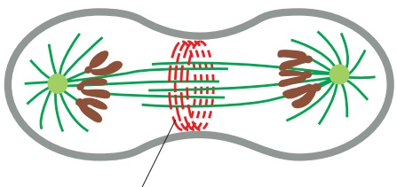

(A)

actin and myosin filaments of the contractile ring

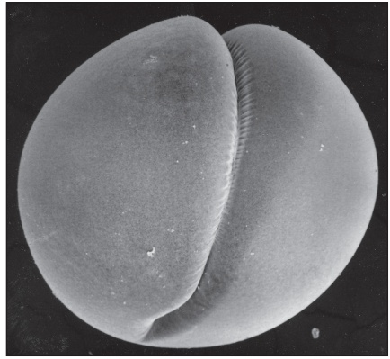

(B)

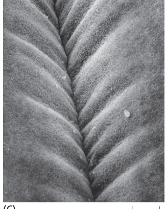

(C)

with the plasma membrane inserts new membrane. This addition of membrane compensates for the increase in surface area that accompanies cytoplasmic division. When ring contraction is completed, the contractile ring is disassembled, and the narrow membrane bridge between the daughter cells is severed.

Figure 17–43 The contractile ring. (A) A drawing of the cleavage furrow in a dividing cell. (B) An electron micrograph of the ingrowing edge of a cleavage furrow of a dividing animal cell. (C) Fluorescence micrographs of a dividing slime mold amoeba stained for actin (red) and myosin II (green). Whereas all of the visible myosin II has redistributed to the contractile ring, only some of the actin has done so; the rest remains in the cortex of the nascent daughter cells. (B, from H.W. Beams and R.G. Kessel, Am. Sci. 64:279–290, 1976. With permission from Sigma Xi. C, courtesy of Yoshio Fukui.)

## Actin and Myosin II in the Contractile Ring Guide the Process of Cytokinesis

In interphase cells, actin and myosin II filaments form a cortical network underlying the plasma membrane. In some cells, they also form large cytoplasmic bundles called stress fibers (discussed in Chapter 16). As cells enter mitosis, these arrays of actin and myosin disassemble; much of the actin reorganizes, andMBoC7 m17.42/17.43 myosin II filaments are released. As the sister chromatids separate in anaphase, actin and myosin II begin to accumulate in the rapidly assembling **contractile ring** (**Figure 17–43**), which also contains numerous other proteins that provide structural support or assist in ring assembly. Assembly of the contractile ring results in part from the local formation of new actin filaments, which depends on formin proteins that nucleate the assembly of parallel arrays of linear, unbranched actin filaments (discussed in Chapter 16). After anaphase, the overlapping arrays of actin and myosin II filaments contract to generate the force that divides the cytoplasm in two. Once contraction begins, the ring exerts a force large enough to bend a fine glass needle that is inserted in its path. As the ring constricts, it maintains the same thickness, suggesting that its total volume and the number of filaments it contains decrease steadily. Moreover, unlike actin in muscle, the actin filaments in the ring are highly dynamic, and their arrangement changes continually during cytokinesis.

The contractile ring is finally dispensed with altogether when cleavage ends and the plasma membrane of the cleavage furrow narrows to form the **midbody**. The midbody persists as a tether between the two daughter cells and contains the remains of the central spindle, a large protein structure derived from the antiparallel microtubules of the spindle midzone, packed tightly together within a dense matrix material (**Figure 17–44**). Cytokinesis is completed by a process called abscission: the membranes on both sides of the midbody are constricted and severed by filaments formed from a polymeric protein called ESCRT-III.

## Local Activation of RhoA Triggers Assembly and Contraction of the Contractile Ring

RhoA, a small GTPase of the Ras superfamily (see Table 15–5), controls the assembly and function of the contractile ring at the site of cleavage. RhoA is attached to the inner surface of the cell membrane at the future division site, where it promotes actin filament formation, myosin II assembly, and ring contraction. It stimulates actin filament formation by activating formins, and it promotes myosin II assembly and contractions by activating multiple protein kinases, including the Rho-associated kinase (ROCK) (**Figure 17–45**). These kinases phosphorylate the regulatory myosin light chain, a subunit of myosin II, thereby stimulating bipolar myosin II filament formation and motor activity.

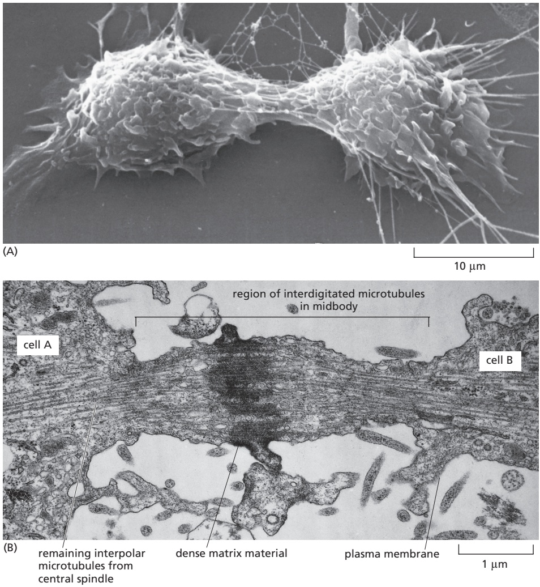

RhoA is activated by a guanine nucleotide exchange factor (GEF) called Ect2, which stimulates the release of GDP and binding of GTP to RhoA (see Figure 17–45). Ect2 is localized to the division site and activated by complex mechanisms involving spindle microtubules, as we discuss next.

## The Microtubules of the Mitotic Spindle Determine the Plane of Animal Cell Division

The central problem in cytokinesis is how to ensure that division occurs at the right time and in the right place. Cytokinesis must occur only after the two sets of chromosomes are fully segregated from each other, and the site of division must

Figure 17–45 Regulation of the contractile ring by the GTPase RhoA. Like other Rho family GTPases, RhoA is activated by a Rho GEF protein (called Ect2) and inactivated by a Rho GTPaseactivating protein (Rho GAP). By binding formins, activated RhoA promotes the assembly of actin filaments in the contractile ring. By activating Rho-associated protein kinases, such as ROCK, it stimulates myosin II filament formation and activity, thereby promoting contraction of the ring. Activation of RhoA at the future cleavage site depends on Ect2 activation by another protein complex called centralspindlin, discussed in the next section.

Figure 17–44 The midbody. (A) A scanning electron micrograph of a cultured animal cell dividing; the midbody still joins the two daughter cells. (B) A conventional electron micrograph of the midbody of a dividing animal cell. Cleavage is almost complete, but the daughter cells remain attached by this thin strand of cytoplasm containing the remains of the central spindle. Abscission results when the membranes on both sides of the dense midbody are constricted and severed. (A, courtesy of Guenter Albrecht-Buehler; B, courtesy of J.M. Mullins.)

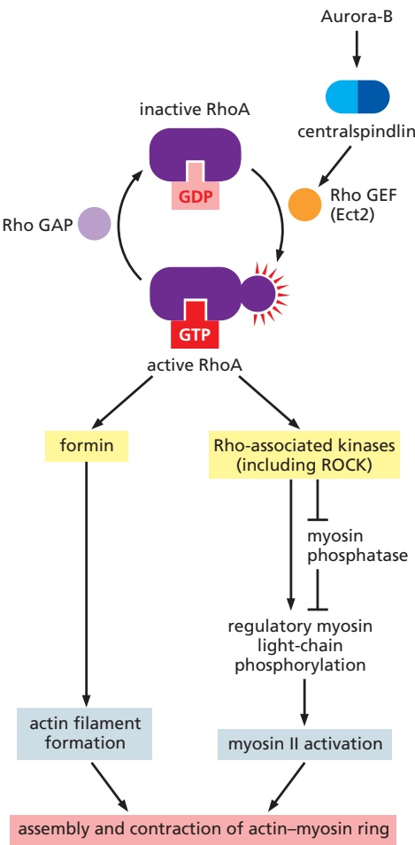

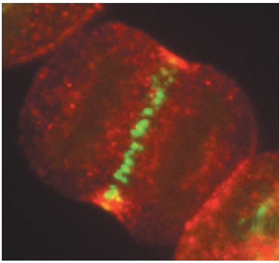

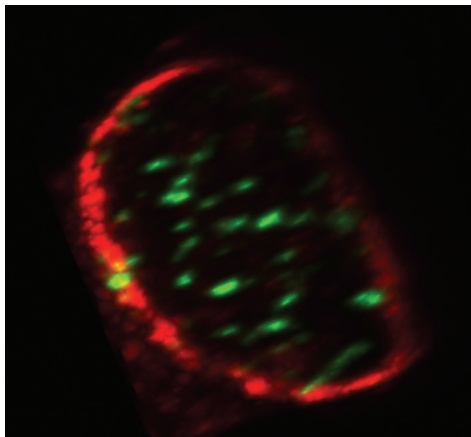

(A)

Figure 17–46 Localization of cytokinesis regulators at the central spindle of the human cell. (A) At center is a cultured human cell at the beginning of cytokinesis, showing the locations of the GTPase RhoA (red) and a protein called Cyk4 (green), which is one of two subunits of centralspindlin, a protein complex that is concentrated at the overlapping plus ends of antiparallel microtubules. (B) When the same three-dimensional image is viewed in the plane of the contractile ring, as shown here, RhoA (red) is seen as a ring beneath the cell surface, while the centralspindlin subunit Cyk4 (green) is associated with microtubule bundles scattered throughout the equatorial plane of the cell. Note that the small population of centralspindlin at the cell cortex is not readily detected in these images. (Courtesy of Alisa Piekny and Michael Glotzer.)

10 µm

(B)

be placed between the two sets of daughter chromosomes, thereby ensuring that each daughter cell receives a complete set. The correct timing and positioning of cytokinesis in animal cells are achieved by mechanisms that depend on the mitotic spindle. During anaphase, the spindle generates signals that initiate furrow formation at a position midway between the spindle poles, thereby ensuring that division occurs between the two sets of separated chromosomes. Because these signals originate in the anaphase spindle, this mechanism also contributesMBoC7 m17.47/17.46 to the correct timing of cytokinesis in late mitosis.

Studies of the fertilized eggs of marine invertebrates first revealed the importance of spindle microtubules in determining the placement of the contractile ring. After fertilization, these embryos cleave rapidly without intervening periods of growth. In this way, the original egg is progressively divided into smaller and smaller cells. Because the cytoplasm is clear, the spindle can be observed in real time with a microscope. If the spindle is tugged into a new position with a fine glass needle in early anaphase, the incipient cleavage furrow disappears, and a new one develops in accord with the new spindle site—supporting the idea that signals generated by the spindle induce local furrow formation.

How does the mitotic spindle specify the site of division? The key mechanism appears to be that the midzone of the anaphase spindle generates a signal that promotes furrow formation at the cell cortex. The central component of this regulatory system is a two-subunit protein complex called centralspindlin, which forms oligomeric assemblies that are concentrated primarily on the antiparallel microtubules at the spindle midzone (**Figure 17–46**). Centralspindlin assembly at the midzone is stimulated by the protein kinase Aurora-B, which also localizes to the spindle midzone in anaphase (see Figure 17–45). Aurora-B localization to the central spindle depends on dephosphorylation of Cdk substrates, providing one mechanism that delays cytokinesis until anaphase.

Centralspindlin interacts with the RhoA GEF, Ect2, to activate RhoA at the equatorial cell cortex, halfway between the spindle poles (**Figure 17–47**). In some cell types, small subpopulations of centralspindlin and Ect2 can be seen to migrate from the spindle midzone to the cell cortex, where Ect2 then interacts with RhoA to trigger furrow formation (see Figure 17–45). The focusing of centralspindlin and Ect2 at the equator depends in part on the ability of astral microtubules to somehow inhibit centralspindlin localization outside the equatorial region.

In some cell types, the site of ring assembly is chosen before mitosis. In budding yeasts, for example, a ring of proteins called septins assembles in late $\mathrm { G _ { 1 } }$ at the future division site. The septins are thought to form a scaffold onto which other components of the contractile ring, including myosin II, assemble. In plant cells, an organized band of microtubules and actin filaments, called the **preprophase band**, assembles just before mitosis and marks the site where the cell wall will assemble and divide the cell in two, as we now discuss.

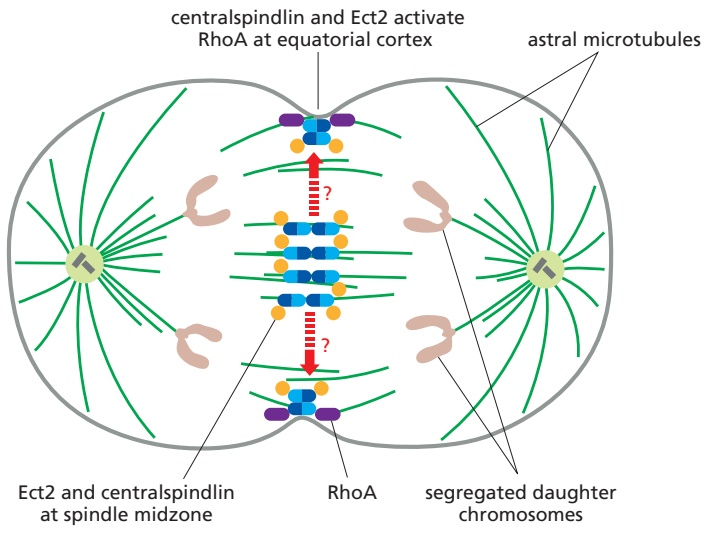

Figure 17–47 Activation of RhoA at the site of cleavage furrow formation. Centralspindlin multimers (blue) associate with the RhoA GEF, Ect2 (orange), at the spindle midzone. By uncertain mechanisms (dashed lines), some of these proteins move to the cortex at the equator of the cell, where they activate RhoA (purple) to trigger furrow formation. To focus the signal at the equator, the plus ends of astral microtubules use unknown mechanisms to inhibit the centralspindlin–Ect2 complex at other regions of the cortex.

## The Phragmoplast Guides Cytokinesis in Higher Plants

In most animal cells, the inward movement of the cleavage furrow depends on anMBoC7 n17.106/17.47 increase in the surface area of the plasma membrane. New membrane is added primarily at the cleavage furrow and is generally provided by small membrane vesicles that are transported on microtubules from the Golgi apparatus to the furrow.

Membrane deposition is particularly important for cytokinesis in higher-plant cells. These cells are enclosed by a semirigid cell wall. Rather than a contractile ring dividing the cytoplasm from the outside in, the cytoplasm of the plant cell is partitioned from the inside out by the construction of a new cell wall, called the **cell plate**, between the two daughter nuclei (**Figure 17–48**; **Figure 17–49**). The assembly of the cell plate begins in late anaphase and is guided by a structure called the **phragmoplast**, which contains microtubules derived from the mitotic

Figure 17–48 The special features of cytokinesis in a higher-plant cell. The division plane is established before M phase by a band of microtubules and actin filaments (the preprophase band) at the cell cortex. At the beginning of telophase, after the chromosomes have segregated, a new cell wall starts to assemble inside the cell at the equator of the old spindle. The microtubules of the mitotic spindle remaining at telophase form the phragmoplast. The plus ends of these microtubules no longer overlap but end at the cell equator. Golgi-derived vesicles, filled with cell-wall material, are transported along these microtubules and fuse to form the new cell wall, which grows outward to reach the plasma membrane and original cell wall. The plasma membrane and the membrane surrounding the new cell wall fuse, separating the two daughter cells.. / .

(A)

50 µm

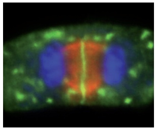

(B)

5 µm

Figure 17–49 Cytokinesis in plant cells during telophase. (A) In this light micrograph, the early cell plate (between the two arrowheads) has formed in a plane perpendicular to the plane of the page. The microtubules of the spindle are stained with gold-labeled antibodies against tubulin, and the DNA in the two sets of daughter chromosomes is stained with a dark blue dye. Note that there are no astral microtubules, because there are no centrosomes in higher-plant cells. (B) In this fluorescence micrograph of a plant cell, DNA is stained blue and microtubules are red. A protein called Syntaxin (green) lies along the cell plate at the cell equator, where it is responsible for stimulating the fusion of Golgi vesicles delivering cell-wall materials. (A, courtesy of Andrew Bajer; B, from C.-M.K. Ho et al., Plant Cell 23:2909–2923, 2011. Republished with permission of American Society of Plant Biologists.)

spindle. Motor proteins transport small vesicles along these microtubules from the Golgi apparatus to the cell center. These vesicles, filled with polysaccharide and glycoproteins required for the synthesis of the new cell wall, fuse to form a disc-like, membrane-enclosed structure called the early cell plate. The plate expands outward by further vesicle fusion until it reaches the plasma membraneMBoC7 m17.48/17.49 and the original cell wall and divides the cell in two. Later, cellulose microfibrils are laid down within the matrix of the cell plate to complete the construction of the new cell wall.

## Membrane-enclosed Organelles Must Be Distributed to Daughter Cells During Cytokinesis

The process of mitosis ensures that each daughter cell receives a full complement of chromosomes. When a eukaryotic cell divides, however, each daughter cell must also inherit all of the other essential cell components, including the membrane-enclosed organelles. As discussed in Chapter 12, organelles such as mitochondria and chloroplasts cannot be assembled de novo from their individual components; they can arise only by the growth and division of the preexisting organelles. Similarly, cells cannot make a new endoplasmic reticulum (ER) unless some part of it is already present.

How, then, do the various membrane-enclosed organelles segregate when a cell divides? Organelles such as mitochondria and chloroplasts are usually present in large enough numbers to be safely inherited if, on average, their numbers roughly double once each cycle. The ER in interphase cells is continuous with the nuclear membrane and is organized by the microtubule cytoskeleton. Upon entry into M phase, the reorganization of the microtubules and breakdown of the nuclear envelope releases the ER. In most cells, the ER remains largely intact and is cut in two during cytokinesis. The Golgi apparatus is reorganized and fragmented during mitosis. Golgi fragments associate with the spindle poles and are thereby distributed to opposite ends of the spindle, ensuring that each daughter cell inherits the materials needed to reconstruct the Golgi in telophase.

## Some Cells Reposition Their Spindle to Divide Asymmetrically

Most animal cells divide symmetrically: the contractile ring forms around the equator of the parent cell, producing two daughter cells of equal size and with the same components. This symmetry results from the placement of the mitotic spindle, which in most cases tends to center itself in the cytoplasm. Astral microtubules and motor proteins that either push or pull on these microtubules contribute to the centering process.

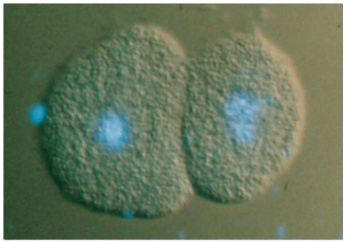

anterior

posterior

40 µm

Figure 17–50 An asymmetric cell division segregating cytoplasmic t t l d ht componen s o on y one aug er

There are many instances in development, however, when cells divide asymmetrically to produce two cells that differ in size, in the cytoplasmic contents they inherit, or in both. Usually, the two different daughter cells are destined to develop along different pathways. To create daughter cells with different fates in this way, the mother cell must first segregate certain components (called cell-fate determinants) to one side of the cell and then position the plane of division so that the appropriate daughter cell inherits these components (**Figure 17–50**). To position the plane of division asymmetrically, the spindle has to be moved in a controlled manner within the dividing cell. It seems likely that changes in local regions of the cell cortex direct such spindle movements and that motor proteins localized there pull one of the spindle poles, via its astral microtubules, to the appropriate region. Genetic analyses in Caenorhabditis elegans and Drosophila have identified some of the proteins required for such asymmetric divisions, and some of these proteins seem to have a similar role in vertebrates.

## Mitosis Can Occur Without Cytokinesis

Although nuclear division is usually followed by cytoplasmic division, there are exceptions. Some cells undergo multiple rounds of nuclear division without intervening cytoplasmic division. In the early Drosophila embryo, for example, the first 13 rounds of nuclear division occur without cytoplasmic division, resulting in the formation of a single large cell containing several thousand nuclei that are arranged in a monolayer near the surface. A cell in which multiple nuclei share the same cytoplasm is called a **syncytium**. This arrangement greatly speeds up early development, as the cells do not have to take the time to go through all the steps of cytokinesis for each division. After these rapid nuclear divisions, membranes are created around each nucleus in one round of coordinated cytokinesis called cellularization. The plasma membrane extends inward and, with the help of an actin–myosin ring, pinches off to enclose each nucleus (**Figure 17–51**).

Nuclear division without cytokinesis also occurs in some types of mammalian cells. Megakaryocytes, which produce blood platelets, and some hepatocytes and muscle cells, for example, become multinucleated in this way.

## Summary

After mitosis completes the formation of a pair of daughter nuclei, cytokinesis finishes the cell cycle by dividing the cell itself. Cytokinesis depends on a ring of actin and myosin filaments that contracts in late mitosis at a site midway between the segregated chromosomes. In animal cells, the positioning of the

cell. These light micrographs illustrate the controlled asymmetric segregation of specific cytoplasmic components to one daughter cell during the first division of a fertilized egg of the nematode C. elegans. The fertilized egg is shown in the left micrographs and the two daughter cells in the right micrographs. The cells above have been stained with a blue, DNA-binding, fluorescent dye to show the nucleus (and polar bodies); they are viewed by both differential-interference-contrast microscopy and fluorescence microscopy. The cells below are the same cells stained with an antibody against P-granules and viewed by fluorescence microscopy. These small granules are made of RNA and proteins and determine which cells become germ cells. They are distributed randomly throughout the cytoplasm of the unfertilized egg (not shown) but become segregated to the posterior pole of the fertilized egg. The cleavage plane is oriented to ensure that only the posterior daughter cell receives the P-granules when the egg divides. The same segregation process is repeated in several subsequent cell divisions, so that the P-granules end up only in cells that give rise to eggs and sperm. (Courtesy of Susan Strome.)

(A)

Figure 17–51 Mitosis without cytokinesis in the early Drosophila embryo. (A) The first 13 nuclear divisions occur synchronously and without cytoplasmic division to create a large syncytium. Most of the nuclei migrate to the cortex, and the plasma membrane extends inward and pinches off to surround each nucleus to form individual cells in a process called cellularization. (B) Fluorescence micrograph of multiple mitotic spindles in a Drosophila embryo before cellularization. The microtubules are stained green and the centrosomes red. Note that all the nuclei go through the cycle synchronously; here, they are all in metaphase, with the unlabeled chromosomes seen as a dark band at the spindle equator. (B, courtesy of Kristina Yu and William Sullivan.)

contractile ring is determined by proteins associated with the midzone microtubules of the anaphase spindle. Dephosphorylation of Cdk targets, which results from Cdk inactivation in anaphase, triggers cytokinesis at the correct time after anaphase.

## MEIOSIS

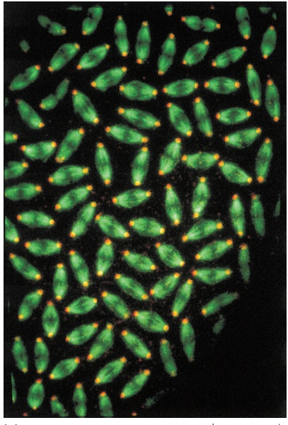

Most eukaryotic organisms reproduce sexually: the genomes of two parents mix to generate offspring that are genetically distinct from either parent. The cells of these organisms are generally diploid; that is, they contain two slightly different copies, or homologs, of each chromosome, one from each parent. Sexual reproduction depends on a specialized nuclear division process called meiosis, which produces haploid cells carrying only a single copy of each chromosome. In many organisms, the haploid cells differentiate into specialized reproductive cells called gametes—eggs and sperm in most species. In these species, the reproductive cycle ends when a sperm and egg fuse to form a diploid zygote, which has the MBoC6 m17.51/17.51potential to form a new individual. In this section, we consider the basic mechanisms and regulation of meiosis, with an emphasis on how they compare with those of mitosis.

(B)

## Meiosis Includes Two Rounds of Chromosome Segregation

Meiosis reduces the chromosome number by half using many of the same molecular machines and control systems that operate in mitosis. As in the mitotic cell cycle, the cell begins the meiotic program by duplicating its chromosomes in meiotic S phase, resulting in pairs of sister chromatids that are tightly linked along their entire lengths by cohesin complexes. Unlike mitosis, however, two successive rounds of chromosome segregation then occur (**Figure 17–52**). The first of these divisions (**meiosis I**) solves the problem, unique to meiosis, of segregating the homologs. The duplicated paternal and maternal homologs pair up alongside each other and become physically linked by the process of genetic recombination. These pairs of homologs, each containing a pair of sister chromatids, then line up on the first meiotic spindle. In the first meiotic anaphase, duplicated homologs rather than sister chromatids are pulled apart and segregated into the two daughter nuclei. Only in the second division (**meiosis II**), which occurs without further DNA replication, are the sister chromatids pulled apart and segregated (as in mitosis) to produce haploid daughter nuclei. In this way, each diploid nucleus that enters meiosis produces four haploid nuclei, each of which contains either the maternal or paternal copy of each chromosome, but not both (**Movie 17.7**).

Figure 17–52 Comparison of meiosis and mitosis. For clarity, only one pair of homologous chromosomes (homologs) is shown. (A) Meiosis is a form of nuclear division in which a single round of chromosome duplication (meiotic S phase) is followed by two rounds of chromosome segregation. The duplicated homologs, each consisting of tightly bound sister chromatids, pair up and are segregated into different daughter nuclei in meiosis I; the sister chromatids are segregated in meiosis II. As indicated by the formation of chromosomes that are partly red and partly blue, homolog pairing in meiosis leads to genetic recombination (crossing-over) during meiosis I. Each diploid cell that enters meiosis therefore produces four genetically different haploid nuclei, which are distributed by cytokinesis into haploid cells that differentiate into gametes. (B) In mitosis, by contrast, homologs do not pair up, and the sister chromatids are segregated during the single division. Thus, each diploid cell that divides by mitosis produces two genetically identical diploid daughter nuclei, which are distributed by cytokinesis into a pair of daughter cells.

## Duplicated Homologs Pair During Meiotic Prophase

During mitosis in most organisms, homologous chromosomes behave independently of each other. During meiosis I, however, it is crucial that homologs recognize each other and associate physically in order for the maternal and paternal homologs to be bi-oriented on the first meiotic spindle. Special mechanisms mediate these interactions.

The gradual juxtaposition of homologs occurs during a prolonged period called meiotic prophase (or prophase I), which can take hours in yeasts, days in mice, and weeks in higher plants. Like their mitotic counterparts, duplicated meiotic prophase chromosomes first appear as long threadlike structures, in which the sister chromatids are so tightly glued together that they appear as one. It is during early prophase I that the homologs begin to associate along their length in a process called **pairing**, which, in some organisms at least, begins with interactions between complementary DNA sequences (called pairing sites) in the two homologs. As prophase progresses, the homologs become more closely juxtaposed, forming a four-chromatid structure called a **bivalent** (**Figure 17–53A**). In most species, homolog pairs are then locked together by homologous recombination: DNA double-strand breaks are formed at several locations in each sister chromatid, resulting in large numbers of DNA recombination events between the homologs (as described in Chapter 5). Some of these events lead to reciprocal DNA exchanges called crossovers, where the DNA of a chromatid crosses over to become continuous with the DNA of a homologous chromatid (**Figure 17–53B**; also see Figure 5–53).

## Homolog Pairing Culminates in the Formation of a Synaptonemal Complex

The paired homologs are brought into close juxtaposition, with their structural axes (axial cores) about 400 nm apart, by a mechanism that depends in most species on the double-strand DNA breaks that occur in sister chromatids. What pulls the axes together? One possibility is that the large protein machine, called a recombination complex, which assembles on a double-strand break in a chromatid, binds the matching DNA sequence in the nearby homolog and helps reel in this partner. This so-called presynaptic alignment of the homologs is followed by synapsis, in which the axial core of a homolog becomes tightly linked to the axial core of its partner by a closely packed array of transverse filaments to create a **synaptonemal complex**, which bridges the gap, now only 100 nm, between the homologs (**Figure 17–54**). Although crossing-over begins before the synaptonemal complex assembles, the final steps occur while the DNA is held in the complex.

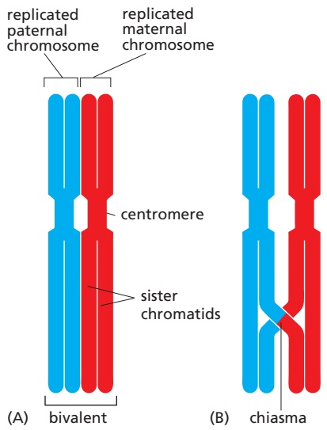

Figure 17–53 Homolog pairing and crossing-over. (A) The structure formed by two closely aligned duplicated homologs is called a bivalent. As in mitosis, the sister chromatids in each homolog are tightly connected along their entire lengths and at their centromeres. At this stage, the homologs are usually joined by a protein complex called the synaptonemal complex (not shown; see Figure 17–54).MBoC7 m17.54/17.53 (B) A later-stage bivalent in which a single crossover has occurred between nonsister chromatids. It is only when the synaptonemal complex disassembles and the paired homologs separate a little at the end of prophase I, as shown, that the crossover is seen microscopically as a thin connection between the homologs called a chiasma.

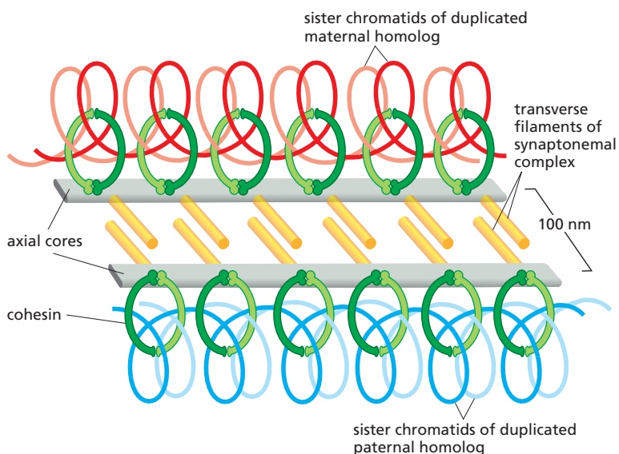

Figure 17–54 Simplified schematic drawing of a synaptonemal complex. Each homolog is organized around a protein axial core, and the synaptonemal complex forms when these homolog axes are linked by rod-shaped transverse filaments. The axial core of each homolog also interacts with the cohesin complexes that hold the sister chromatids together (see Figure 9–28). (Modified from K. Nasmyth, Annu. Rev. Genet. 35:673–745, 2001.)

Figure 17–55 Homolog synapsis and desynapsis during the different stages of prophase I. (A) A single bivalent is shown schematically. At leptotene, the two sister chromatids coalesce, and their chromatid loops extend out from a common axial core. Assembly of the synaptonemal complex begins in early zygotene and is complete in pachytene. The complex disassembles in diplotene. (B) An electron micrograph of a synaptonemal complex from a meiotic cell at pachytene in a lily flower. (C and D) Immunofluorescence micrographs of prophase I cells of the fungus Sordaria. Partially synapsed bivalents at zygotene are shown in C and fully synapsed bivalents are shown in D. Red arrowheads in C point to regions where synapsis is still incomplete. (B, courtesy of Brian Wells; C and D, from A. Storlazzi et al., Genes Dev. 17:2675–2687, MBoC7 m2003. With permission from Cold Spring Harbor Laboratory Press.)

The morphological changes that occur during homolog pairing are the basis for dividing meiotic prophase into five sequential stages—leptotene, zygotene, pachytene, diplotene, and diakinesis (**Figure 17–55**). Prophase starts with leptotene, when homologs condense and pair and genetic recombination begins. At zygotene, the synaptonemal complex begins to assemble at sites where the homologs are closely associated and recombination events are occurring. At pachytene, the assembly process is complete, and the homologs are synapsed along their entire lengths (see Figure 9–28). The pachytene stage can persist for days or longer, until desynapsis begins at diplotene with the disassembly of the synaptonemal complex and the concomitant condensation and shortening of the chromosomes. It is only at this stage, after the complex has disassembled, that the individual crossover events between nonsister chromatids can be seen as inter-homolog connections called **chiasmata** (singular, **chiasma**), which now play a crucial part in holding the compact homologs together (**Figure 17–56**). The homologs are now ready to begin the process of segregation.

(A)

(B)

<small>Figure 17–56 A bivalent with three chiasmata resulting from three crossover events. (A) Light micrograph of a grasshopper bivalent. (B) Schematic of the three crossovers shown in A. Each sister chromatid is numbered. Note how the combination of the chiasmata and the tight attachment of the sister chromatid arms to each other (mediated by cohesin complexes) holds the two homologs together after the synaptonemal complex has disassembled; if either the chiasmata or the sister-chromatid cohesion failed to form, the homologs would come apart at this stage and not be segregated properly in meiosis I. (A, courtesy of Bernard John.)</small>

## Homolog Segregation Depends on Several Unique Features of Meiosis I

A fundamental difference between meiosis I and mitosis (and meiosis II) is that in meiosis I, homologs rather than sister chromatids separate and then segregate (see Figure 17–52). This difference depends on three features of meiosis I that distinguish it from mitosis (**Figure 17–57**).

First, both sister kinetochores in a homolog must attach stably to the same spindle pole. This type of attachment is normally avoided during mitosis (see Figure 17–35). In meiosis I, however, the two sister kinetochores are fused into a single microtubule-binding unit that attaches to just one pole (see Figure 17–57A). The fusion of sister kinetochores is achieved by a complex of proteins that is localized at the kinetochores in meiosis I, but we do not know in any detail how these proteins work. They are removed from kinetochores after meiosis I, so that in meiosis II the sister-chromatid pairs can be bi-oriented on the spindle as they are in mitosis.

Second, crossovers generate a strong physical linkage between homologs, allowing their bi-orientation at the equator of the spindle—much like cohesion between sister chromatids is important for their bi-orientation in mitosis (and meiosis II). Crossovers hold homolog pairs together only because the arms of the sister chromatids are connected by sister-chromatid cohesion (see Figure 17–57A).

Figure 17–57 Comparison of chromosome behavior in meiosis I, meiosis II, and mitosis. Chromosomes behave similarly in mitosis and meiosis II, but they behave very differently in meiosis I. (A) In meiosis I, the two sister kinetochores are located side-by-side on each homolog and attach to microtubules from the same spindle pole. The proteolytic cleavage of cohesin along the sister-chromatid arms unglues the arms and resolves the crossovers, allowing the duplicated homologs to separate at anaphase I, while the residual cohesin at the centromeres keeps the sisters together. Cleavage of centromeric cohesin allows the sister chromatids to separate at anaphase II. (B) In mitosis, by contrast, the two sister kinetochores attach to microtubules from different spindle poles, and the two sister chromatids come apart at the start of anaphase and segregate into separate daughter nuclei.

Third, cohesin is removed in anaphase I only from chromosome arms and not from the regions near the centromeres, where the kinetochores are located. The loss of arm cohesion triggers homolog separation at the onset of anaphase I. This process depends on APC/C activation, which leads to securin destruction, separase activation, and cohesin cleavage along the arms (see Figure 17–39).

Cohesins near the centromeres are protected from separase in meiosis I by a kinetochore-associated protein called shugoshin (from the Japanese word for “guardian spirit”). Shugoshin acts by recruiting a protein phosphatase that removes phosphates from centromeric cohesins. Cohesin phosphorylation is normally required for separase to cleave cohesin; thus, removal of this phosphorylation near the centromere prevents cohesin cleavage. Sister-chromatid pairs therefore remain linked through meiosis I, allowing their correct bi-orientation on the spindle in meiosis II. Shugoshin is inactivated after meiosis I. At the onset of anaphase II, APC/C activation triggers centromeric cohesin cleavage and sister-chromatid separation—much as it does in mitosis. After anaphase II, nuclear envelopes form around the chromosomes to produce four haploid nuclei, after which cytokinesis and other differentiation processes lead to the production of haploid gametes.

## Crossing-Over Is Highly Regulated

Crossing-over has two distinct functions in meiosis: it helps hold homologs together so that they are properly segregated to the two daughter nuclei produced by meiosis I, and it contributes to the genetic diversification of the gametes that are eventually produced. As might be expected, therefore, crossing-over is highly regulated: the number and location of double-strand breaks along each chromosome are controlled, as is the likelihood that a break will be converted into a crossover. On average, the result of this regulation is that each pair of human homologs is linked by about two or three crossovers (**Figure 17–58**).

Although the double-strand breaks that occur in meiosis I can be located almost anywhere along the chromosome, they are not distributed uniformly: they cluster at “hot spots,” where the DNA is accessible, and occur only rarely in “cold spots,” such as the heterochromatin regions around centromeres and telomeres.

At least two kinds of regulation influence the location and number of cross-overs that form, neither of which is well understood. Both operate before the synaptonemal complex assembles. One ensures that at least one crossover forms between the members of each homolog pair, as is necessary for normal homolog segregation in meiosis I. In the other, called crossover interference, the presence of one crossover event inhibits another from forming close by, perhaps by locally depleting proteins required for converting a double-strand DNA break into a stable crossover.

10 µm

Figure 17–58 Crossovers between homologs in the human testis. In these immunofluorescence micrographs, antibodies were used to stain the synaptonemal complexes (red), the centromeres (blue), and the sites of crossing-over (green). Note that all of the bivalents have at least one crossover and none have more than four. (Modified from A. Lynn et al., Science 296:2222–2225, 2002. With permission from AAAS.)

## Meiosis Frequently Goes Wrong

The sorting of chromosomes that takes place during meiosis is a remarkable feat of intracellular bookkeeping. In humans, each meiosis requires that the starting cell keep track of 92 chromatids (46 chromosomes, each of which has duplicated), distributing one complete set of each type of autosome to each of the four haploid progeny. Not surprisingly, mistakes can occur in allocating the chromosomes during this elaborate process. Mistakes are especially common in human female meiosis, which arrests for years after diplotene: meiosis I is completed only at ovulation, and meiosis II only after the egg is fertilized. Indeed, such chromosome segregation errors during egg development are the most common cause of spontaneous abortion (miscarriage) and intellectual disability in humans.

When homologs fail to separate properly—a phenomenon called **nondisjunction**—the result is that some of the resulting haploid gametes lack a particular chromosome, while others have more than one copy of it. Upon fertilization, these gametes form abnormal embryos, most of which die. Some survive, however. Down syndrome in humans, for example, which is the leading cause of intellectual disability, is caused by an extra copy of chromosome 21, usually resulting from nondisjunction during meiosis I in the female ovary. Segregation errors during meiosis I increase greatly with advancing maternal age.

## Summary

Haploid gametes are produced by meiosis, in which a diploid nucleus undergoes two successive cell divisions after one round of DNA replication. Meiosis is dominated by a prolonged prophase. At the start of prophase, the chromosomes have replicated and consist of two tightly joined sister chromatids. Homologous chromosomes then pair up and become progressively more closely juxtaposed as prophase proceeds. The tightly aligned homologs undergo genetic recombination, forming crossovers that help hold each pair of homologs together during metaphase I. Meiosis-specific, kinetochore-associated proteins help ensure that both sister chromatids in a homolog attach to the same spindle pole; other kinetochore-associated proteins ensure that the homologs remain connected at their centromeres during anaphase I, so that homologs rather than sister chromatids are segregated in meiosis I. After meiosis I, meiosis II follows rapidly, without DNA replication, in a process that resembles mitosis, in that sister chromatids are pulled apart at anaphase.

## CONTROL OF CELL DIVISION AND CELL GROWTH

A fertilized mouse egg and a fertilized human egg are similar in size, yet they produce animals of very different sizes. What factors in the control of cell behavior in humans and mice are responsible for these size differences? The same fundamental question can be asked for each organ and tissue in an animal’s body. What factors determine the length of an elephant’s trunk or the size of its brain or its liver? These questions are largely unanswered, but it is nevertheless possible to say what the ingredients of an answer must be.

The size of an organ or organism depends on its total cell mass, which depends on both the total number of cells and their size. Cell number, in turn, depends on the rates of cell division and cell death. Organ and body size are therefore determined by three fundamental processes: cell growth, cell division, and cell survival. Each is tightly regulated—both by intracellular programs and by extracellular signal molecules that control these programs.

The extracellular signal molecules that regulate cell growth, division, and survival are generally soluble secreted proteins, proteins bound to the surface of cells, or components of the extracellular matrix. They can be divided operationally into three major classes:

1. Mitogens, which stimulate cell division, primarily by triggering a wave of $\mathbf { G } _ { 1 } / \mathbf { S } \cdot$ Cdk activity that relieves intracellular negative controls that otherwise block progress through the cell cycle.

2. Growth factors, which stimulate cell growth (an increase in cell mass) by promoting the synthesis of proteins and other macromolecules and by inhibiting their degradation.

3. Survival factors, which promote cell survival by suppressing the form of programmed cell death known as apoptosis.

Many extracellular signal molecules promote all of these processes, while others promote one or two of them. Indeed, the term “growth factor” is often used inappropriately to describe a factor that has any of these activities. Even worse, the term “cell growth” is often used to mean an increase in cell number, or cell proliferation.

In addition to these three classes of stimulating signals, there are extracellular signal molecules that suppress cell proliferation, cell growth, or both. There are also extracellular signal molecules that activate apoptosis.

In this section, we focus primarily on how mitogens and other factors, such as DNA damage, control the rate of cell division. We then turn to the important but poorly understood problem of how a proliferating cell coordinates its growth with cell division so as to maintain its appropriate size. We discuss the control of cell survival and cell death by apoptosis in Chapter 18.

## Mitogens Stimulate Cell Division

Unicellular organisms tend to grow and divide as fast as they can, and their rate of proliferation depends largely on the availability of nutrients in the environment. The cells of a multicellular organism, however, divide only when the organism needs more cells. Thus, for an animal cell to proliferate, it must receive stimulatory extracellular signals, in the form of **mitogens**, from other cells, usually its neighbors. Mitogens overcome intracellular braking mechanisms that block progress through the cell cycle.

More than 50 animal proteins are known to act as mitogens. Most of these proteins have a broad specificity. Platelet-derived growth factor (PDGF), for example, can stimulate many types of cells to divide, including fibroblasts, smooth muscle cells, and neuroglial cells. Similarly, epidermal growth factor (EGF) acts not only on epidermal cells but also on many other cell types, including both epithelial and nonepithelial cells. Some mitogens, however, have a narrow specificity: erythropoietin, for example, only induces the proliferation of red blood cell precursors. Many mitogens, including PDGF, also have actions other than the stimulation of cell division: they can stimulate cell growth, survival, differentiation, or migration, depending on the circumstances and the cell type.

In some tissues, inhibitory extracellular signal proteins oppose the positive regulators and thereby inhibit organ growth. The best-understood inhibitory signal proteins are transforming growth factor-β (TGFβ) and its relatives. TGFβ inhibits the proliferation of several cell types, mainly by blocking cell-cycle progression in $\mathrm { G _ { 1 } }$

## Cells Can Enter a Specialized Nondividing State

In the absence of a mitogenic signal to proliferate, Cdk inhibition in $\mathrm { G _ { 1 } }$ is maintained by the multiple mechanisms discussed earlier, and progression into a new cell cycle is blocked. In some cases, cells partly disassemble their cell-cycle control system and withdraw from the cycle to a specialized nondividing state called $\mathbf { G _ { 0 } } .$

Most cells in our body are in $\mathbf { G } _ { 0 } ,$ but the molecular basis and reversibility of this state vary in different cell types. Most of our neurons and skeletal muscle cells, for example, are in a terminally differentiated $\mathsf { G } _ { 0 }$ state, in which their cellcycle control system is completely dismantled: the expression of the genes encoding various Cdks and cyclins is permanently turned off, and cell division rarely occurs. Some cell types withdraw from the cell cycle only transiently and retain the ability to reassemble the cell-cycle control system quickly and reenter the cycle. Most liver cells, for example, are in $\mathbf { G } _ { 0 } ,$ but they can be stimulated to divide if the liver is damaged. Still other types of cells, including fibroblasts and some lymphocytes, withdraw from and reenter the cell cycle repeatedly throughout their lifetime.

Almost all the variation in cell-cycle length in the adult body occurs during the time the cell spends in $\mathrm { G _ { 1 } }$ or $\mathbf { G } _ { 0 } .$ By contrast, the time a cell takes to progress from the beginning of S phase through mitosis is usually brief (typically 12–24 hours in mammals) and relatively constant, regardless of the interval from one division to the next.

## Mitogens Stimulate $G _ { 1 } - C \Delta K$ and $\mathbb { G } _ { 1 } / \mathbb { S }$ -Cdk Activities

For the vast majority of animal cells, mitogens control the rate of cell division by acting in the $\mathrm { G _ { 1 } }$ phase of the cell cycle. As discussed earlier, multiple mechanisms act during $\mathrm { G _ { 1 } }$ to suppress Cdk activity. Mitogens release these brakes on Cdk activity, thereby allowing entry into a new cell cycle.

As we discuss in Chapter 15, mitogens interact with cell-surface receptors to trigger multiple intracellular signaling pathways. One major pathway acts through the monomeric GTPase **Ras**, which leads to the activation of a mitogenactivated protein kinase (MAP kinase) cascade (see Figure 15–50). This leads to an increase in the production of transcription regulatory proteins, including **Myc**. Myc is thought to promote cell-cycle entry by several mechanisms, one of which is to increase the expression of genes encoding $\mathrm { G _ { 1 } \mathrm { - } c y c l i n s }$ (D cyclins), thereby increasing $\mathrm{G_{1}} - \mathrm{Cdk}$ (cyclin D–Cdk4) activity. Myc also has a major role in stimulating the transcription of genes that increase cell growth.

The key function of $\mathrm{G_{1}} - \mathrm{Cd}\mathrm{k}$ complexes in animal cells is to activate a group of gene regulatory factors called the **E2F proteins**, which bind to specific DNA sequences in the promoters of a wide variety of genes that encode proteins required for S-phase entry, including $\mathbf { G } _ { 1 } / \mathbf { S } _ { 1 }$ -cyclins, S-cyclins, and proteins involved in DNA synthesis and chromosome duplication. In the absence of mitogenic stimulation, E2F-dependent gene expression is inhibited by an interaction between E2F and members of the **retinoblastoma protein (Rb)** family. When cells are stimulated to divide by mitogens, active $G _{1} -Cdk$ accumulates and phosphorylates Rb family members, reducing their binding to E2F. The liberated E2F proteins then activate expression of their target genes (**Figure 17–59**).

This transcriptional control system, like so many other control systems that regulate the cell cycle, includes feedback loops that ensure that entry into the cell cycle is complete and irreversible. The liberated E2F proteins, for example, increase the transcription of their own genes. In addition, E2F-dependent transcription of $\mathbf { G } _ { 1 } / \mathbf { S } _ { 1 }$ -cyclin (cyclin E) and S-cyclin (cyclin A) genes leads to increased $G _{1}/ S-Cdk$ and S-Cdk activities, which in turn increase Rb protein phosphorylation and promote further E2F release (see Figure 17–59).

The central member of the Rb family, the Rb protein itself, was identified originally through studies of an inherited form of eye cancer in children, known as retinoblastoma (discussed in Chapter 20). The loss of both copies of the Rb gene leads to excessive proliferation of some cells in the developing retina, suggesting that the Rb protein is particularly important for restraining cell division in this tissue. The complete loss of Rb does not immediately cause increased proliferation of retinal or other types of cells, in part because Cdh1 and CKIs also help inhibit progression through $\mathbf { G } _ { 1 }$ and in part because other cell types contain Rb-related proteins that provide backup support in the absence of Rb. It is also likely that other proteins, unrelated to Rb, help to regulate the activity of E2F.

Additional layers of control promote an overwhelming increase in S-Cdk activity at the beginning of S phase. We mentioned earlier that the APC/C

activator Cdh1 suppresses cyclin levels after mitosis. In animal cells, however, $\mathrm { G _ { 1 ^ { - } } }$ and $\mathbf { G } _ { 1 } / \mathbf { S } \cdot$ cyclins are resistant to APC/C–Cdh1 and can therefore act unopposed by the $\mathrm { A P C / C }$ to promote Rb protein phosphorylation and E2F-dependent gene expression. S-cyclin, by contrast, is not resistant, and its level is initially restrained by APC/C–Cdh1 activity. However,MBoC7 m17.61/17 $\mathrm { G _ { 1 } / S }$ -Cdk also phosphorylates and inactivates APC/C–Cdh1, thereby allowing the accumulation of S-cyclin, further promoting S-Cdk activation. $\dot { \bf G } _ { 1 } / \dot { \bf S } .$ -Cdk also inactivates CKI proteins that suppress S-Cdk activity. The overall effect of all these interactions is the rapid and complete activation of the S-Cdk complexes required for S-phase initiation.

## DNA Damage Blocks Cell Division

Progression through the cell cycle, and thus the rate of cell proliferation, is controlled not only by extracellular mitogens but also by other extracellular and intracellular signals. One of the most important influences is DNA damage,

Figure 17–59 Mitogen stimulation of cellcycle entry. As discussed in Chapter 15, mitogens bind to cell-surface receptors to initiate intracellular signaling pathways. One of the major pathways involves activation of the small GTPase Ras, which activates a MAP kinase cascade, leading to increased expression of numerous immediate early genes, including the gene encoding the transcription regulatory protein Myc. Myc increases the expression of many delayedresponse genes, including some that lead to increased $\mathbb { G } _ { 1 1 }$ Cdk activity (cyclin D– Cdk4), which triggers the phosphorylation of members of the Rb family of proteins. This inactivates the Rb proteins, freeing the gene regulatory protein E2F to activate the transcription of $\mathsf { G } _ { 1 } / \mathsf { S }$ genes, including the genes for a G1/S-cyclin (cyclin E) and S-cyclin (cyclin A). The resulting G1/S-Cdk and S-Cdk activities further enhance Rb protein phosphorylation, forming a positive feedback loop. E2F proteins also stimulate the transcription of their own genes, forming another positive feedback loop.

Figure 17–60 How DNA damage arrests the cell cycle in G1. When DNA is damaged, various protein kinases are recruited to the site of damage and initiate a signaling pathway that causes cell-cycle arrest. The first kinase at the damage site is either ATM or ATR, depending on the type of damage. Additional protein kinases, called Chk1 and Chk2, are then recruited and activated, resulting in the phosphorylation of the transcription regulatory protein p53. Mdm2 normally binds to p53 and promotes its ubiquitylation and destruction in proteasomes. Phosphorylation of p53 blocks its binding to Mdm2; as a result, p53 accumulates to high levels and stimulates transcription of numerous genes, including the gene that encodes the CKI protein p21. The p21 binds and inactivates G1/S-Cdk and S-Cdk complexes, arresting the cell in G1. In some cases, DNA damage also induces either the phosphorylation of Mdm2 or a decrease in Mdm2 production, which causes a further increase in p53 (not shown).

which can occur as a result of spontaneous chemical reactions in DNA, errors in DNA replication, or exposure to radiation or certain chemicals (discussed in Chapter 5). It is essential that damaged chromosomes are repaired before attempting to duplicate or segregate them. The cell-cycle control system can readily detect DNA damage and arrest the cycle at either of two transitions—one at Start, which prevents entry into the cell cycle and into S phase, and one at the $\mathrm { G _ { 2 } / M }$ transition, which prevents entry into mitosis (see Figure 17–20).

DNA damage initiates a signaling pathway by activating one of a pair of relatedMBoC7 m17.62/17.60 protein kinases called **ATM** and **ATR**, which associate with the site of damage and phosphorylate various target proteins, including two other protein kinases called Chk1 and Chk2. These various kinases phosphorylate other target proteins that lead to cell-cycle arrest. A major target is the gene regulatory protein **p53**, which stimulates transcription of the gene encoding p21, a CKI protein; p21 binds to $\mathbf { G } _ { 1 } / \mathbf { S } .$ -Cdk and S-Cdk complexes and inhibits their activities, thereby helping to block entry into the cell cycle (**Figure 17–60** and **Movie 17.8**).

DNA damage activates p53 by an indirect mechanism. In undamaged cells, p53 is highly unstable and is present at very low concentrations. This is largely because it interacts with another protein, Mdm2, which acts as a ubiquitin ligase that targets p53 for destruction by proteasomes. Phosphorylation of p53 after

DNA damage reduces its binding to Mdm2. This decreases p53 degradation, which results in a marked increase in p53 concentration in the cell. In addition, the decreased binding to Mdm2 enhances the ability of p53 to stimulate gene transcription (see Figure 17–60).

The protein kinases Chk1 and Chk2 also block cell-cycle progression by phosphorylating members of the Cdc25 family of protein phosphatases, thereby inhibiting their function. As described earlier, these phosphatases are particularly important in the activation of M-Cdk at the beginning of mitosis (see Figure 17–16). Chk1 and Chk2 phosphorylate Cdc25 at inhibitory sites that are distinct from the phosphorylation sites that stimulate Cdc25 activity. The inhibition of Cdc25 activity by DNA damage helps block entry into mitosis (see Figure 17–20).

The DNA damage response can also be activated by problems that arise when a replication fork fails during DNA replication. When nucleotides are depleted, for example, replication forks stall during the elongation phase of DNA synthesis. To prevent the cell from attempting to segregate partially replicated chromosomes, the same mechanisms that respond to DNA damage detect the stalled replication forks and block entry into mitosis until the problems are resolved.

A low level of DNA damage occurs in the normal life of any cell, and this damage accumulates in the cell’s progeny if the DNA damage response is not functioning. Over the long term, the accumulation of genetic damage in cells lacking the DNA damage response leads to an increased frequency of cancerpromoting mutations. Indeed, mutations in the p53 gene occur in at least half of all human cancers (discussed in Chapter 20). This loss of p53 function allows the cancer cell to accumulate mutations more readily. Similarly, a rare genetic disease known as ataxia telangiectasia is caused by a defect in ATM, one of the protein kinases that are activated in response to x-ray–induced DNA damage; people with this disease are very sensitive to x-rays and suffer from increased rates of cancer.

What happens if DNA damage is so severe that repair is not possible? The answer differs in different organisms. Unicellular organisms such as budding yeast arrest their cell cycle to try to repair the damage, but the cycle resumes even if the repair cannot be completed. For a single-celled organism, life with mutations is apparently better than no life at all. In multicellular organisms, however, the health of the organism takes precedence over the life of an individual cell. Cells that divide with severe DNA damage threaten the life of the organism, as genetic damage can often lead to cancer and other diseases. Thus, animal cells with severe DNA damage do not attempt to continue division, but instead commit suicide by undergoing apoptosis. Thus, unless the DNA damage is repaired, the DNA damage response can lead to either cell-cycle arrest or cell death. DNA damage–induced apoptosis often depends on the activation of p53.

## Many Human Cells Have a Built-In Limitation on the Number of Times They Can Divide

Many human cells divide a limited number of times before they stop and undergo a permanent cell-cycle arrest. Fibroblasts taken from normal human tissue, for example, go through only about 25–50 population doublings when cultured in a standard mitogenic medium. Toward the end of this time, proliferation slows down and finally halts, and the cells enter a nondividing state from which they never recover. This phenomenon is called **replicative cell senescence**.

Replicative cell senescence in human fibroblasts seems to be caused by changes in the structure of the **telomeres**, the repetitive DNA sequences and associated proteins at the ends of chromosomes. As discussed in Chapter 5, when a cell divides, telomeric DNA sequences are not replicated in the same manner as the rest of the genome but instead are synthesized by the enzyme **telomerase**. Telomerase also promotes the formation of protein cap structures that protect the chromosome ends. Because human fibroblasts, and many other human somatic cells, do not produce telomerase, their telomeres become shorter with every cell division, and their protective protein caps progressively deteriorate. Eventually, the exposed chromosome ends are sensed as DNA damage, which activates a p53-dependent cell-cycle arrest (see Figure 17–60). Rodent cells, by contrast, maintain telomerase activity when they proliferate in culture and therefore do not have such a telomere-dependent mechanism for limiting proliferation. The forced expression of telomerase in normal human fibroblasts, using genetic engineering techniques, blocks this form of senescence. Unfortunately, most cancer cells have regained the ability to produce telomerase and therefore maintain telomere function as they proliferate; as a result, they do not undergo replicative cell senescence.

## Cell Proliferation Is Accompanied by Cell Growth

If cells proliferated without growing, they would get progressively smaller and there would be no net increase in total cell mass. In most proliferating cell populations, therefore, cell growth accompanies cell division. In single-celled organisms such as yeasts, both cell growth and cell division require only nutrients. In animals, by contrast, both cell growth and cell proliferation depend on extracellular signal molecules, produced by other cells, which we call **growth factors** and mitogens, respectively.

Like mitogens, the extracellular growth factors that stimulate animal cell growth bind to receptors on the cell surface and activate intracellular signaling pathways. These pathways stimulate the accumulation of proteins and other macromolecules, and they do so by both increasing their rate of synthesis and decreasing their rate of degradation. They also trigger increased uptake of nutrients and production of the ATP required to fuel the increased protein synthesis. One of the most important intracellular signaling pathways activated by growth factor receptors involves the enzyme phosphoinositide 3-kinase (PI 3-kinase), which adds a phosphate from ATP to the 3′ position of inositol phospholipids in the plasma membrane (discussed in Chapter 15). The activation of PI 3-kinase leads to the activation of a protein kinase called mTORC1, which lies at the heart of cell growth regulatory pathways in all eukaryotes (see Figure 15–55). mTORC1 activates many targets in the cell that stimulate metabolic processes, including protein and lipid synthesis, or reduce protein turnover (**Figure 17–61**).

Figure 17–61 Stimulation of cell growth by extracellular growth factors and nutrients. The occupation of cell-surface receptors by growth factors leads to the activation of a complex signaling pathway that results in the activation of the multisubunit protein kinase mTORC1 (see Figure 15–55). Cytosolic amino acids also help activate mTORC1. mTORC1 phosphorylates multiple proteins, including 4EBP and the protein kinase S6 kinase 1 (S6K1), to stimulate the activity of the translation initiation factors eIF4E and eIF4B, thereby stimulating protein synthesis. mTORC1 also acts through S6K1, as well as another protein called Lipin, to activate a transcription regulator called SREBP, which increases the expression of genes involved in lipid synthesis. Finally, mTORC1 phosphorylates another protein kinase, Ulk1, reducing its ability to promote protein turnover.

Figure 17–62 Potential mechanisms for coordinating cell growth and division. In proliferating cells, cell size is maintained by mechanisms that coordinate rates of cell division and cell growth. Numerous alternative coupling mechanisms are thought to exist, and different cell types appear to employ different combinations of these mechanisms. (A) In many cell types—particularly yeast—the rate of cell division is governed by the rate of cell growth, so that division occurs only when growth rate achieves some minimal threshold; in yeasts, it is mainly the levels of extracellular nutrients that regulate the rate of cell growth and thereby the rate of cell division. (B) In some animal cell types, growth and division can each be controlled by separate extracellular factors (growth factors and mitogens, respectively), and cell size depends on the relative levels of the two types of factors. (C) Some extracellular factors can stimulate both cell growth and cell division by simultaneously activating signaling pathways that promote growth and other pathways that promote cell-cycle progression.

## Proliferating Cells Usually Coordinate Their Growth and Division

For proliferating cells to maintain a constant size, they must coordinate their growth with cell division to ensure that cell size doubles with each division: if cells grow too slowly, they will get smaller with each division, and if they grow too fast, they will get larger with each division. It is not clear how cells achieve this coordination, but it is likely to involve multiple mechanisms that vary in different organisms and even in different cell types of the same organism (**Figure 17–62**).

Animal cell growth and division are not always coordinated, however. In many cases, they are completely uncoupled to allow growth without division or division without growth. Muscle cells and nerve cells, for example, can grow dramatically after they have permanently withdrawn from the cell cycle. Similarly, the eggs of many animals grow to an extremely large size without dividing; after fertilization, however, this relationship is reversed, and many rounds of division occur without growth.

Compared to cell division, there has been surprisingly little study of how cell size is controlled in animals. As a result, it remains a mystery how cell size is determined and why different cell types in the same animal grow to be so different in size. One of the best-understood cases in mammals is the adult sympathetic neuron, which has permanently withdrawn from the cell cycle. Its size depends on the amount of nerve growth factor (NGF) secreted by the target cells it innervates; the greater the amount of NGF the neuron has access to, the larger it becomes. It seems likely that the genes a cell expresses set limits on the size it can be, while extracellular signal molecules and nutrients regulate the size within these limits. The challenge is to identify the relevant genes and signal molecules for each cell type.

## Summary

In multicellular animals, cell size, cell division, and cell survival are carefully controlled to ensure that the organism and its organs achieve and maintain an appropriate size. Mitogens stimulate the rate of cell division by removing intracellular molecular brakes that restrain cell-cycle progression in $G _ { I } .$ Growth factors promote cell growth (an increase in cell mass) by stimulating the synthesis and inhibiting the degradation of macromolecules. To maintain a constant cell size, proliferating cells employ multiple mechanisms to ensure that cell growth is coordinated with cell division.

## PROBLEMS

Which statements are true? Explain why or why not.

17–1 As there are about $1 0 ^ { 1 3 }$ cells in an adult human, and about $1 0 ^ { 1 0 }$ cells die and are replaced each day, we become new people every 3 years.

17–2 All three of the major cell-cycle transitions—Start, $\mathrm { G _ { 2 } / M , }$ and metaphase-to-anaphase—depend on the activity of Cdks.

17–3 Initiation of DNA synthesis is permitted only at origins of replication that are licensed by being loaded with Mcm complexes.

17–4 Chromosomes are positioned on the metaphase plate by equal and opposite forces that pull them toward the two poles of the spindle.

17–5 Meiosis segregates the paternal homologs into sperm and the maternal homologs into eggs.

17–6 If we could turn on telomerase activity in all our cells, we could prevent aging.

Discuss the following problems.

17–7 Some cell-cycle genes from human cells function perfectly well when expressed in yeast cells. Why do you suppose that is considered remarkable? After all, many human genes encoding enzymes for metabolic reactions also function in yeast, and no one thinks that is remarkable.

17–8 Hoechst 33342 is a membrane-permeant dye that fluoresces when it binds to DNA. When a population of cells is incubated briefly with the Hoechst dye and then sorted in a flow cytometer, which measures the fluorescence of each cell, the cells display various levels of fluorescence as shown in **Figure Q17–1**.

Figure Q17–1 Analysis of Hoechst 33342 fluorescence in a population of cells sorted in a flow cytometer (Problem 17–8).

A. Which cells in Figure Q17–1 are in the $\mathrm { G _ { 1 } ,   S ,   G _ { 2 } } ,$ and M phases of the cell cycle? Explain the basis for your answer.

B. Sketch the sorting distributions you would expect for cells that were treated with inhibitors that block the cell cycle in the $\mathbf { G } _ { 1 } , \mathbf { S } ,$ or M phase. Explain your reasoning.

17–9 A two-component Fucci (fluorescent ubiquitylation-based cell-cycle indicator) used in fruit flies gives different-colored cells at different points in the cell cycle, as shown in **Figure Q17–2**. If this result was obtained by tagging protein A with GFP (green) and protein B with RFP (red), when during the cell cycle are these proteins expressed?

Figure Q17–2 A two-component Fucci system in fruit flies (Problem 17–9). (From Figure 5a of N. Zielke and B.A. Edgar, Wiley Interdiscip. Rev. Dev. Biol. 4:469–487, 2015. With permission from Wiley.)

A. Protein A in $\mathbf { G } _ { 1 } , \mathbf { S } ,$ and $\mathrm { G } _ { 2 } ;$ protein B in $\mathbf { G } _ { 1 } , \mathbf { S } ,$ and $\mathrm { G } _ { 2 }$ B. Protein A in $\mathbf { G } _ { 2 } , \mathbf { M } ,$ and $\mathrm { G } _ { 1 } ;$ protein B in $\mathrm { S } , \mathrm { G _ { 2 } } ,$ and early M

C. Protein A in late M and $\mathbf { G } _ { 1 } ;$ protein B in S

D. Protein A in late $\begin{array} { r } { \mathrm { M } , \mathrm { G } _ { 1 } , } \end{array}$ and S; protein B in $\mathrm { G } _ { 2 }$ and early M

17–10 What specific event does the cell-cycle control system stimulate at the metaphase-to-anaphase transition?

17–11 Which one of the following combinations of activities of a protein kinase and a protein phosphatase would give the highest activity for a target protein that is most active when phosphorylated?

A. Kinase OFF; phosphatase OFF

B. Kinase OFF; phosphatase ON

C. Kinase ON; phosphatase OFF

D. Kinase ON; phosphatase ON

17–12 The yeast cohesin subunit Scc1, which is essential for sister-chromatid cohesion, can be artificially regulated for expression at any point in the cell cycle. If expression is turned on at the beginning of S phase, all the cells divide satisfactorily and survive. By contrast, if Scc1 expression is turned on only after S phase is completed, the cells fail to divide and they die, even though Scc1 accumulates in the nucleus and interacts efficiently with chromosomes. Why do you suppose that cohesin must be present during S phase for cells to divide normally?

17–13 A living cell from the lung epithelium of a newt is shown at different stages in M phase in **Figure Q17–3**. Order these light micrographs into the correct sequence and identify the stage in M phase that each represents.

(A)

(B)

(C)

(D)

(E)

(F)

Figure Q17–3 Light micrographs of a single cell at different stages of M phase (Problem 17–13). (Courtesy of Conly L. Rieder.)

17–14 How many kinetochores are there in a human cell at mitosis?

17–15 If a cell just entering mitosis is treated with nocodazole, which destabilizes microtubules, the nuclear envelope breaks down and chromosomes condense, but no spindle forms and the cell cycle arrests in mitosis. In contrast, if such a cell is treated with cytochalasin D, which destabilizes actin filaments, mitosis proceeds normally but generates a binucleate cell that proceeds into $\mathrm { G _ { 1 } }$ phase. Explain the basis for the different outcomes of these treatments with cytoskeleton inhibitors. What do these results tell you about cell-cycle checkpoints in M phase?

17–16 Early on in the study of recombination during meiosis, geneticists concluded that there was about one crossover per chromosome arm. Using fluorescent tags that stain the synaptonemal complex red, the centromeres blue, and the crossovers green, it is now possible to observe directly the distribution of crossovers in chromosomes.7 17.101/ 17.04 For the 13 complete bivalents shown in **Figure Q17–4**, how many have more than one crossover in the arm of a chromosome?

Figure Q17–4 Crossovers between homologs in human cells (Problem 17–16). (Modified from A. Lynn et al., Science 296:2222–2225, 2002. With permission from AAAS.)

17–17 Down syndrome (trisomy 21) and Edwards syndrome (trisomy 18) are the most common autosomal trisomies seen in human infants. Does this fact mean that these chromosomes are the most difficult to segregate properly during meiosis?

17–18 The human genome consists of 23 pairs of chromosomes (22 pairs of autosomes and one pair of sex chromosomes). During meiosis, the maternal and paternal sets of homologs pair, and then are separated into gametes, so that each contains 23 chromosomes. If you assume that the chromosomes in the paired homologs are randomly assorted to daughter cells, how many potential combinations of paternal and maternal homologs can be generated during meiosis? (For the purposes of this calculation, assume that no recombination occurs.)

17–19 High doses of caffeine interfere with the DNA damage response in mammalian cells. Why then do you suppose the Surgeon General has not yet issued an appropriate warning to heavy coffee and cola drinkers? A typical cup of coffee (150 mL) contains 100 mg of caffeine (196 g/mole). Assuming that the caffeine is not metabolized or excreted (but that all the liquid is), approximately how many cups of coffee would you have to drink to reach the dose (10 mM) required to interfere with the DNA damage response? (A typical adult contains about 40 liters of water.)

## REFERENCES

## General

Morgan DO (2007) The Cell Cycle: Principles of Control. London: New Science Press.

## The Cell-Cycle Control System

Alfieri C, Zhang S & Barford D (2017) Visualizing the complex functions and mechanisms of the anaphase promoting complex/cyclosome (APC/C). Open Biol. 7, 170204.

Echalier A, Endicott JA & Noble ME (2010) Recent developments in cyclin-dependent kinase biochemical and structural studies. Biochim. Biophys. Acta 1804, 511–519.

Evans T, Rosenthal ET, Youngblom J, Distel D & Hunt T (1983) Cyclin: a protein specified by maternal mRNA in sea urchin eggs that is destroyed at each cleavage division. Cell 33, 389–396.

Hartwell LH, Culotti J, Pringle JR & Reid BJ (1974) Genetic control of the cell division cycle in yeast. Science 183, 46–51.

Holder J, Poser E & Barr FA (2019) Getting out of mitosis: spatial and temporal control of mitotic exit and cytokinesis by PP1 and PP2A. FEBS Lett. 593, 2908–2924.

Holt LJ, Tuch BB, Villen J, Johnson AD, Gygi SP & Morgan DO (2009) Global analysis of Cdk1 substrate phosphorylation sites provides insights into evolution. Science 325, 1682–1686.

Kamenz J, Gelens L & Ferrell JE, Jr. (2021) Bistable, biphasic regulation of PP2A-B55 accounts for the dynamics of mitotic substrate phosphorylation. Curr. Biol. 31, 794–808.

Novak B & Tyson JJ (2021) Mechanisms of signalling-memory governing progression through the eukaryotic cell cycle. Curr. Opin. Cell Biol. 69, 7–16.

Nurse P, Thuriaux P & Nasmyth K (1976) Genetic control of the cell division cycle in the fission yeast Schizosaccharomyces pombe. Mol. Gen. Genet. 146, 167–178.

Örd M & Loog M (2019) How the cell cycle clock ticks. Mol. Biol. Cell 30, 169-172.

## S Phase

Arias EE & Walter JC (2007) Strength in numbers: preventing rereplication via multiple mechanisms in eukaryotic cells. Genes Dev. 21, 497–518.

Bell SP & Labib K (2016) Chromosome duplication in Saccharomyces cerevisiae. Genetics 203, 1027–1067.

Li H & O’Donnell ME (2018) The eukaryotic CMG helicase at the replication fork: emerging architecture reveals an unexpected mechanism. Bioessays 40(3).

Siddiqui K, On KF & Diffley JF (2013) Regulating DNA replication in eukarya. Cold Spring Harb. Perspect. Biol. 5, a012930.

Tanaka S & Araki H (2013) Helicase activation and establishment of replication forks at chromosomal origins of replication. Cold Spring Harb. Perspect. Biol. 5, a010371.

## Mitosis

Banterle N & Gonczy P (2017) Centriole biogenesis: from identifying the characters to understanding the plot. Annu. Rev. Cell Dev. Biol. 33, 23–49.

Champion L, Linder MI & Kutay U (2017) Cellular reorganization during mitotic entry. Trends Cell Biol. 27, 26–41.

Davidson IF & Peters JM (2021) Genome folding through loop extrusion by SMC complexes. Nat. Rev. Mol. Cell Biol. 22, 445–464.

Dey G & Baum B (2021) Nuclear envelope remodelling during mitosis. Curr. Opin. Cell Biol. 70, 67–74.

Hinshaw SM & Harrison SC (2018) Kinetochore function from the bottom up. Trends Cell Biol. 28, 22–33.

Lampson MA & Grishchuk EL (2017) Mechanisms to avoid and correct erroneous kinetochore-microtubule attachments. Biology (Basel) 6, 1.

McIntosh JR (2016) Mitosis. Cold Spring Harb. Perspect. Biol. 8, a023218.

Musacchio A (2015) The molecular biology of spindle assembly checkpoint signaling dynamics. Curr. Biol. 25, R1002–R1018.

Musacchio A & Desai A (2017) A molecular view of kinetochore assembly and function. Biology (Basel) 6, 5.

Nigg EA & Holland AJ (2018) Once and only once: mechanisms of centriole duplication and their deregulation in disease. Nat. Rev. Mol. Cell Biol. 19, 297–312.

Oriola D, Needleman DJ & Brugues J (2018) The physics of the metaphase spindle. Annu. Rev. Biophys. 47, 655–673.

Paulson JR, Hudson DF, Cisneros-Soberanis F & Earnshaw WC (2021) Mitotic chromosomes. Semin. Cell Dev. Biol. 117, 7–29.

Petry S (2016) Mechanisms of mitotic spindle assembly. Annu. Rev. Biochem. 85, 659–683.

Prosser SL & Pelletier L (2017) Mitotic spindle assembly in animal cells: a fine balancing act. Nat. Rev. Mol. Cell Biol. 18, 187–201.

Yatskevich S, Rhodes J & Nasmyth K (2019) Organization of chromosomal DNA by SMC complexes. Annu. Rev. Genet. 53, 445–482.

Yi P & Goshima G (2018) Microtubule nucleation and organization without centrosomes. Curr. Opin. Plant Biol. 46, 1–7.

## Cytokinesis

Basant A & Glotzer M (2018) Spatiotemporal regulation of RhoA during cytokinesis. Curr. Biol. 28, R570–R580.

Fremont S & Echard A (2018) Membrane traffic in the late steps of cytokinesis. Curr. Biol. 28, R458–R470.

Glotzer M (2017) Cytokinesis in metazoa and fungi. Cold Spring Harb. Perspect. Biol. 9, a022343.

Livanos P & Muller S (2019) Division plane establishment and cytokinesis. Annu. Rev. Plant Biol. 70, 239–267.

Pollard TD & O’Shaughnessy B (2019) Molecular mechanism of cytokinesis. Annu. Rev. Biochem. 88, 661–689.

Rappaport R (1986) Establishment of the mechanism of cytokinesis in animal cells. Int. Rev. Cytol. 105, 245–281.

## Meiosis

Gray S & Cohen PE (2016) Control of meiotic crossovers: from doublestrand break formation to designation. Annu. Rev. Genet. 50, 175–210.

Hughes SE & Hawley RS (2020) Alternative synaptonemal complex structures: too much of a good thing? Trends Genet. 36, 833–844.

Hunter N (2015) Meiotic recombination: the essence of heredity. Cold Spring Harb. Perspect. Biol. 7, a016618.

Petronczki M, Siomos MF & Nasmyth K (2003) Un ménage à quatre: the molecular biology of chromosome segregation in meiosis. Cell 112, 423–440.

Subramanian VV & Hochwagen A (2014) The meiotic checkpoint network: step-by-step through meiotic prophase. Cold Spring Harb. Perspect. Biol. 6, a016675.

Webster A & Schuh M (2017) Mechanisms of aneuploidy in human eggs. Trends Cell Biol. 27, 55–68.

Zickler D & Kleckner N (2015) Recombination, pairing, and synapsis of homologs during meiosis. Cold Spring Harb. Perspect. Biol. 7, a016626.

Zickler D & Kleckner N (2016) A few of our favorite things: pairing, the bouquet, crossover interference and evolution of meiosis. Semin. Cell Dev. Biol. 54, 135–148.

## Control of Cell Division and Cell Growth

Bertoli C, Skotheim JM & de Bruin RA (2013) Control of cell cycle transcription during G1 and S phases. Nat. Rev. Mol. Cell Biol. 14, 518–528.

Blackford AN & Jackson SP (2017) ATM, ATR, and DNA-PK: the trinity at the heart of the DNA damage response. Mol. Cell 66, 801–817.

Boutelle AM & Attardi LD (2021) p53 and tumor suppression: it takes a network. Trends Cell Biol. 31, 298–310.

Dick FA & Rubin SM (2013) Molecular mechanisms underlying RB protein function. Nat. Rev. Mol. Cell Biol. 14, 297–306.

Rubin SM, Sage J & Skotheim JM (2020) Integrating old and new paradigms of G1/S control. Mol. Cell 80, 183–192.

Saxton RA & Sabatini DM (2017) mTOR signaling in growth, metabolism, and disease. Cell 168, 960–976.

Sharpless NE & Sherr CJ (2015) Forging a signature of in vivo senescence. Nat. Rev. Cancer 15, 397–408.

Shimobayashi M & Hall MN (2014) Making new contacts: the mTOR network in metabolism and signalling crosstalk. Nat. Rev. Mol. Cell Biol. 15, 155–162.

Vollmer J, Casares F & Iber D (2017) Growth and size control during development. Open Biol. 7, 170190.

Zatulovskiy E & Skotheim JM (2020) On the molecular mechanisms regulating animal cell size homeostasis. Trends Genet. 36, 360–372.