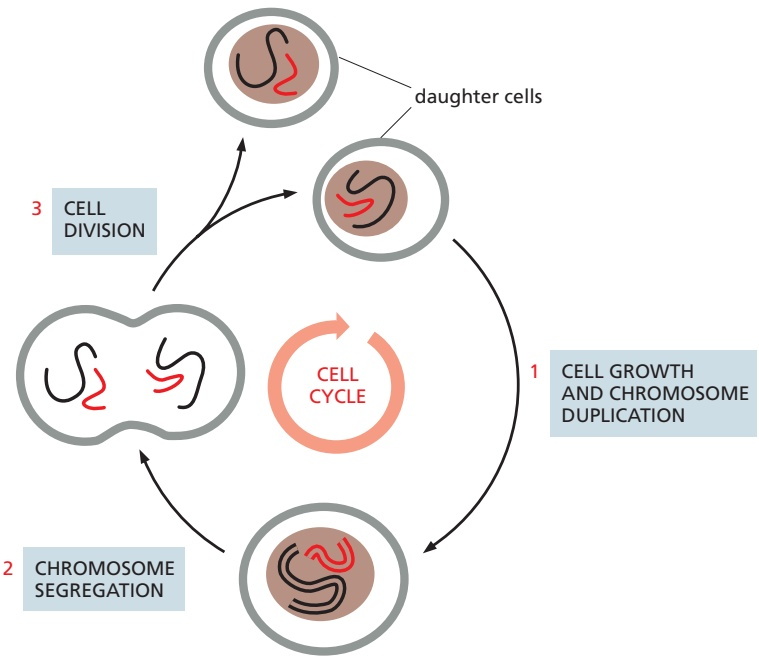
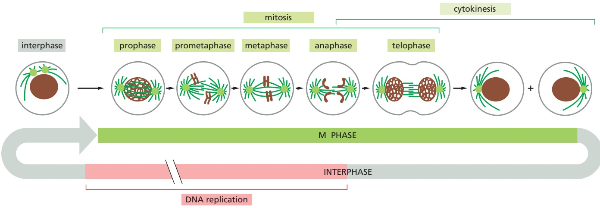
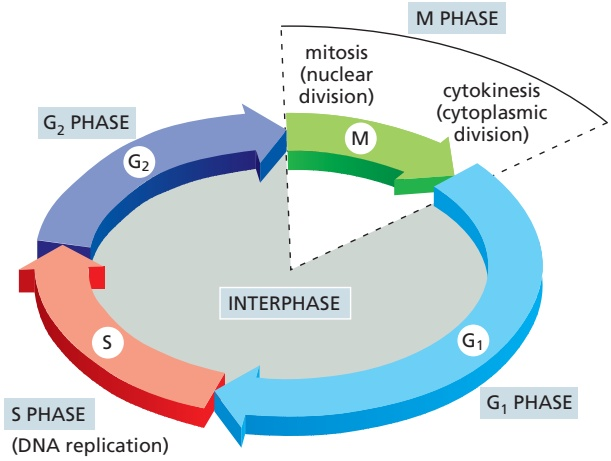
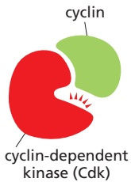
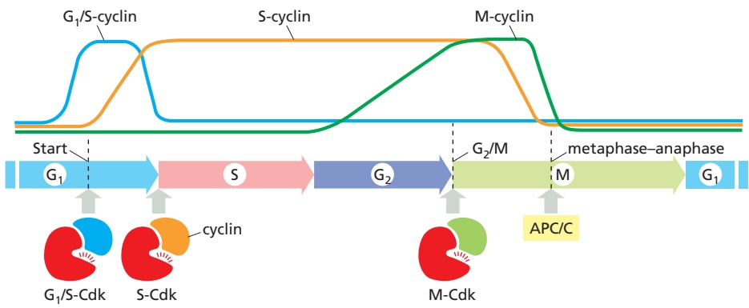
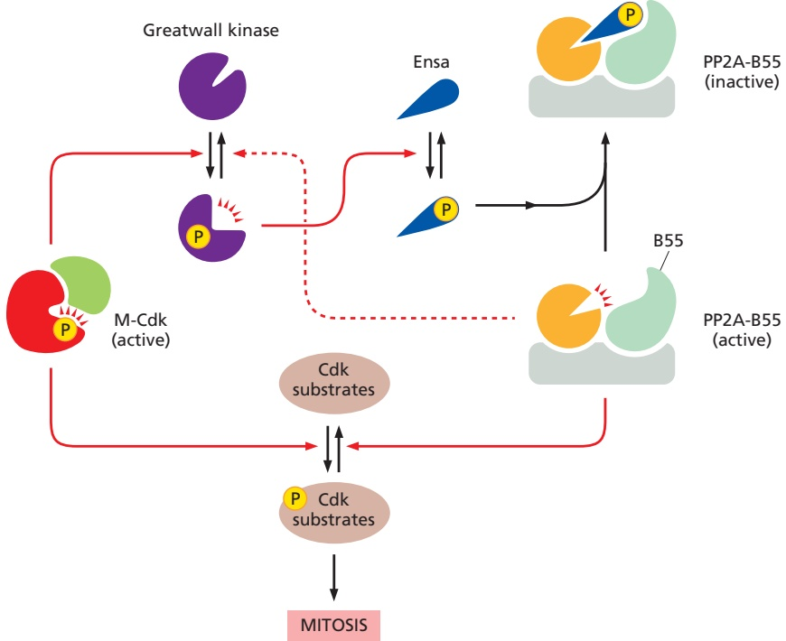
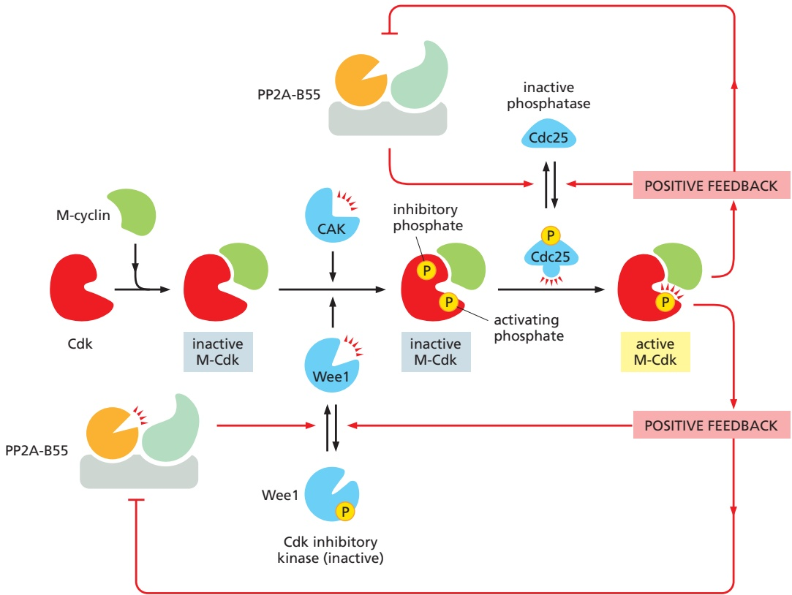

1027

# The Cell Cycle

The only way to make a new cell is to duplicate a cell that already exists. This simple fact, first established in the middle of the nineteenth century, carries with it a profound message for the continuity of life. All living organisms, from the unicellular bacterium to the multicellular mammal, are products of repeated rounds of cell growth and division extending back in time to the beginnings of life on Earth more than 3 billion years ago.

A cell reproduces by performing an orderly sequence of events in which it duplicates its contents and then divides in two. This cycle of duplication and division, known as the **cell cycle**, is the essential mechanism by which all living things reproduce. In unicellular species, such as bacteria and yeasts, each cell division produces a complete new organism. In multicellular species, long and complex sequences of cell divisions are required to produce a functioning organism. Even in the adult body, cell division is usually needed to replace cells that die. In fact, each of us must manufacture many millions of cells every second simply to survive: if all cell division were stopped—by exposure to a very large dose of x-rays, for example—we would die within a few days.

The details of the cell cycle vary from organism to organism and at different times in an organism’s life. Certain characteristics, however, are universal. At a minimum, the cell must accomplish its most fundamental task: the passing on of its genetic information to the next generation of cells. To produce two genetically identical daughter cells, the DNA in each chromosome is replicated faithfully to produce two complete copies. The replicated chromosomes are then distributed (segregated) to the two daughter cells, so that each receives a copy of the entire genome (**Figure 17–1**). In addition to duplicating their genome, most cells also duplicate their other organelles and macromolecules; otherwise, daughter cells would get smaller with each division. To maintain their size, dividing cells coordinate their growth (that is, their increase in cell mass) with their division.

This chapter describes the events of the eukaryotic cell cycle and how they are controlled and coordinated. We begin with a brief overview of the cell cycle. We then describe the cell-cycle control system, a complex network of regulatory proteins that triggers the different events of the cycle. We next consider in detail the major stages of the cell cycle, in which the chromosomes are duplicated and then segregated into the two daughter cells. Finally, we consider how extracellular signals govern the rates of cell growth and division and how these two processes are coordinated.

## OVERVIEW OF THE CELL CYCLE

The most basic function of the cell cycle is to duplicate the vast amount of DNA in the chromosomes and then segregate the copies into two genetically identical daughter cells. These processes define the two major phases of the cell cycle. Chromosome duplication occurs during S phase (S for DNA synthesis), which requires 10–12 hours and occupies about half of the cell-cycle time in a typical mammalian cell. After S phase, chromosome segregation and cell division occur

C HAP T E R

17

IN THIS CHAPTER

Overview of the Cell Cycle

The Cell-Cycle Control System

S Phase

Mitosis

Cytokinesis

Meiosis

Control of Cell Division and Cell Growth

---

1028

Chapter 17: The Cell Cycle

Figure 17–1 The cell cycle. The division of a hypothetical eukaryotic cell with two chromosomes (one red, and one black) is shown to illustrate how two genetically identical daughter cells are produced in each cycle. Each of the daughter cells will often continue to divide by going through additional cell cycles.

in M phase (M for mitosis), which requires much less time (less than an hour in a mammalian cell). M phase comprises two major events: nuclear division, or mitosis, during which the copied chromosomes are distributed into a pair of daughter nuclei; and cytoplasmic division, or cytokinesis, when the cell itself divides in two (**Figure 17–2**).

At the end of S phase, the DNA molecules in each pair of duplicated chromosomes remain intertwined and held tightly together by specialized protein linkages. Early in mitosis, at a stage called prophase, the two DNA molecules are disentangled and condensed into pairs of rigid, compact rods called **sister chromatids**, which remain linked by sister-chromatid cohesion. When the nuclear envelope then disassembles, the sister-chromatid pairs become attached to the mitotic spindle, a giant bipolar array of microtubules (discussed in Chapter 16). Sister chromatids are attached to opposite poles of the spindle and, eventually, align at the spindle equator in a stage called metaphase. The destruction of sister-chromatid cohesion at the start of anaphase separates the sister chromatids, which are pulled to opposite poles of the spindle. The spindle is then disassembled, and the segregated chromosomes are packaged into separate nuclei at telophase. Cytokinesis then cleaves the cell in two, so that each daughter cell inherits one of the two nuclei (**Figure 17–3**).

## The Eukaryotic Cell Cycle Usually Consists of Four Phases

Most cells require much more time to grow and double their mass of proteins and organelles than they require to duplicate their chromosomes and divide. Partly to allow time for growth, most cell cycles have gap phases—a $\mathbf { G _ { 1 } }$ **phase** between M phase and S phase and a $\mathbf { G _ { 2 } }$ **phase** between S phase and mitosis. Thus, the eukaryotic cell cycle is traditionally divided into four sequential phases: $\mathbf { G } _ { 1 } ,$ S, G2, and M. G1, S, and $\mathrm { G } _ { 2 }$ together are called **interphase** (**Figure 17–4**, and see Figure 17–3). In a typical human cell proliferating in culture, interphase might

<small>Figure 17–2 The major events of the cell cycle. The major chromosomal events of the cell cycle occur in S phase, when the chromosomes are duplicated, and M phase, when the duplicated chromosomes are segregated into a pair of daughter nuclei (in mitosis), after which the cell itself divides into two (cytokinesis).</small>

---

OVERVIEW OF THE CELL CYCLE

1029

Figure 17–3 The events of eukaryotic cell division as seen under a microscope. The easily visible processes of nuclear division (mitosis) and cell division (cytokinesis), collectively called M phase, typically occupy only a small fraction of the cell cycle. The other, much longer, part of the cycle is known as interphase, which includes S phase and the gap phases.

occupy 23 hours of a 24-hour cycle, with 1 hour for M phase. Cell growth occurs throughout the cell cycle.

The two gap phases are more than simple time delays to allow cell growth. They also provide time for the cell to monitor the internal and external environment to ensure that conditions are suitable and preparations are complete before the cell commits itself to the complex events of S phase and mitosis. The $\mathrm { G _ { 1 } }$ phase is especially important in this respect. Its length can vary greatly depending on external conditions and extracellular signals from other cells. If extracellular conditions are unfavorable, for example, cells delay progress through $\mathrm { G _ { 1 } }$ and may even enter a specialized resting state known as $G _ { 0 }$ (G zero), in which they can remain for days, weeks, or even years. Indeed, many cells remain permanently in $\mathsf { G } _ { 0 }$ until the organism dies. If extracellular conditions become favorable or signals to grow and divide are introduced, cells in $\mathrm { G _ { 0 } }$ progress through a commitment point in $\mathrm { G _ { 1 } }$ known as **Start** (in yeasts) or the **restriction point** (in mammalian cells). We will use the term “Start” for both yeast and animal cells. After passing this point, cells are committed to DNA replication, even if the extracellular signals that stimulate cell growth and division are removed.

Not all cells undergo the conventional four-phase cell cycle. The early cleavage divisions of vertebrate embryos, for example, are not accompanied by cell growth, and these rapid divisions simply include alternating $\mathrm { S }$ and M phases without intervening gaps. Another important and common variation is the **endocycle**, also known as endoreduplication, in which multiple rounds of S phase occur without intervening M phases, resulting in cells with many copies

Figure 17–4 The four phases of the cell cycle. In most cells, gap phases separate the major events of S phase and M phase. $\mathbb { G } _ { 1 }$ is the gap between M phase and S phase, while G2 is the gap between S phase and M phase.

---

1030

Chapter 17: The Cell Cycle

of the genome—thereby enabling rapid increases in the production of numerous gene products. Finally, as we describe later, some cell types undergo mitosis without cytokinesis, resulting in large cells with multiple nuclei.

## Cell-Cycle Control Is Similar in All Eukaryotes

Some features of the cell cycle, including the time required to complete certain events, vary greatly from one cell type to another, even in the same organism. The basic organization of the cycle, however, is essentially the same in all eukaryotic cells, and all eukaryotes appear to use similar machinery and control mechanisms to drive and regulate cell-cycle events. The proteins of the cell-cycle control system, for example, first appeared more than a billion years ago. Remarkably, they have been so well conserved over the course of evolution that many of them function perfectly when transferred from a human cell to a yeast cell. We can therefore study the cell cycle and its regulation in a variety of organisms and use the findings from all of them to assemble a unified picture of how eukaryotic cells divide.

Several model organisms are used in the analysis of the eukaryotic cell cycle. The budding yeast Saccharomyces cerevisiae and the fission yeast Schizosaccharomyces pombe are simple eukaryotes in which powerful molecular and genetic approaches can be used to identify and characterize the genes and proteins that govern the fundamental features of cell division. The early embryos of certain animals, particularly those of the frog Xenopus laevis, are excellent tools for biochemical dissection of cell-cycle control mechanisms, while the fruit fly Drosophila melanogaster is useful for the genetic analysis of mechanisms underlying the control and coordination of cell growth and division in multi-cellular organisms. Cultured human cells provide an excellent system for the molecular and microscopic exploration of the complex processes by which our own cells divide.

## Cell-Cycle Progression Can Be Studied in Various Ways

How can we tell what stage a cell has reached in the cell cycle? One way is simply to look at living cells with a microscope. A glance at a population of mammalian cells proliferating in culture reveals that a fraction of the cells have rounded up and are in mitosis (cell rounding allows the mitotic spindle to function more effectively). Other cells can be observed in the process of cytokinesis. We can gain additional clues about cell-cycle position by staining cells with DNA-binding fluorescent dyes (which reveal the condensation of chromosomes in mitosis) or with antibodies that recognize specific cell components such as the microtubules (revealing the mitotic spindle). S-phase cells can be identified in the microscope by supplying them with visualizable molecules that are incorporated into newly synthesized DNA, such as the artificial thymidine analog 5-ethynyl-2′-deoxyuridine (EdU); cell nuclei that have incorporated EdU are then revealed by treatment with a fluorescent dye that attaches covalently to EdU (**Figure 17–5**).

Typically, in a population of cultured mammalian cells that are all proliferating rapidly but asynchronously, about 30–40% will be in S phase at any instant and become labeled by a brief pulse of EdU. From the proportion of cells in such a population that are labeled, we can estimate the duration of S phase as a fraction of the whole cell-cycle duration. Similarly, from the proportion of cells in

100 µm

<small>Figure 17–5 Labeling S-phase cells. A fluorescence micrograph of EdU-labeled cells of the mouse small intestine, showing intestinal villi in transverse section. The mouse was injected with a single brief dose of EdU, which then became incorporated into the newly synthesized DNA of any cell that was progressing through S phase at the time of injection. Ninety-six hours later, the tissue was fixed and labeled with a fluorescent dye that attaches to EdU (red), thereby labeling cells that were in S phase 96 hours earlier. All the cell nuclei are stained with a blue fluorescent dye. (From A. Salic and T.J. Mitchison, Proc. Natl. Acad. Sci. USA 105:2415–2420, 2008. With permission from National Academy of Sciences.)</small>

---

THE CELL-CYCLE CONTROL SYSTEM

1031

Figure 17–6 Measuring cell-cycle timing in live cells. (A) The method shown here depends on fluorescent proteins that are present only at specific cell-cycle stages, as illustrated in the diagram. First, a protein called geminin is labeled with a green fluorescent protein. This protein is targeted for degradation by the APC/C, a ubiquitin ligase that is active from metaphase to the end of G1 (as discussed later). Thus, the green fluorescence of this protein is seen from early S phase to mid-mitosis. A second protein, called Cdt1, is tagged with a red fluorescent protein. This protein is targeted for ubiquitylation and destruction from late $\mathbb { G } _ { 1 }$ to telophase of mitosis. Cells therefore glow red from the end of mitosis to the end of G1. (B) Fluorescence microscopy of a single mammalian cell expressing these two proteins reveals alternating red and green fluorescence as the cell progresses through the cell cycle. These images were obtained every hour over a 30-hour period. The cell was in late mitosis and cytokinesis at the 16- and 17-hour time points, and only one of the daughter cells is shown in subsequent images. This method is called Fucci (fluorescent ubiquitylation-based cell-cycle indicator). (From A. Sakaue-Sawano et al., Cell 132:487–498, 2008. With permission from Elsevier.)

mitosis (the mitotic index), we can estimate the duration of M phase. The timing of cell-cycle phases can also be measured in living cells using fluorescently labeled proteins that appear and disappear at specific stages (**Figure 17–6**).

Another way to assess the stage that a cell has reached in the cell cycle is by measuring its DNA content, which doubles during S phase. This approach is greatly facilitated by the use of fluorescent DNA-binding dyes and a flow cytometer, which allows the rapid and automatic analysis of large numbers of cellsMBoC7 n17.101/17.06 (**Figure 17–7**). We can use flow cytometry to determine the fraction of cells in $\mathrm { G _ { 1 } }$ $\mathsf { S } _ { r }$ and $\mathbf { G } _ { 2 } + \mathbf { M }$ phases by measuring DNA content in a cell population.

## Summary

Cell division usually begins with duplication of the cell’s contents, followed by distribution of those contents into two daughter cells. Chromosome duplication occurs during S phase of the cell cycle, whereas most other cell components are duplicated continually throughout the cycle. During M phase, the replicated chromosomes are segregated into individual nuclei (mitosis), and the cell then splits in two (cytokinesis). S phase and M phase are usually separated by gap phases called $G _ { I }$ and $G _ { 2 } ,$ when various intracellular and extracellular signals regulate cell-cycle progression. Cell-cycle organization and control have been highly conserved during evolution, and studies in a wide range of organisms have led to a unified view of eukaryotic cell-cycle control.

## THE CELL-CYCLE CONTROL SYSTEM

For many years, cell biologists watched the puppet show of DNA synthesis, mitosis, and cytokinesis but had no idea of what lay behind the curtain controlling these events. It was not even clear whether there was a separate control system or whether the processes of DNA synthesis, mitosis, and cytokinesis somehow controlled themselves. A major breakthrough came in the late 1980s with the identification of the key proteins of the control system, along with the realization that they are distinct from the proteins that perform the processes of DNA replication, chromosome segregation, and so on.

In this section, we first consider the basic principles upon which the cell-cycle control system operates. We then discuss the protein components of the system and how they work together to time and coordinate the events of the cell cycle.

Figure 17–7 Analysis of DNA content with a flow cytometer. This graph shows typical results obtained for a proliferating cell population when the DNA content of its individual cells is determined in a flow cytometer. (A flow cytometer, also called a fluorescence-activated cell sorter,MBoC7 m17.08/17.07 or FACS, can also be used to sort cells according to their fluorescence.) The cells analyzed here were stained with a dye that becomes fluorescent when it binds to DNA, so that the amount of fluorescence is directly proportional to the amount of DNA in each cell. The cells fall into three categories: those that have an unreplicated complement of DNA and are therefore in $\mathbb { G } _ { 1 }$ , those that have a fully replicated complement of DNA (twice the $\mathbb { G } _ { 1 }$ DNA content) and are in G2 or M phase, and those that have an intermediate amount of DNA and are in S phase. The distribution of cells indicates that there are greater numbers of cells in $\mathbb { G } _ { 1 }$ than in $\mathsf { G } _ { 2 } + \mathsf { M }$ phase, showing that $\mathbb { G } _ { 1 }$ is longer than $\mathsf { G } _ { 2 } +$ M in this population.

---

1032

Chapter 17: The Cell Cycle

Figure 17–8 The control of the cell cycle. A cell-cycle control system triggers the essential processes of the cycle—such as DNA replication, mitosis, and cytokinesis. The control system is represented here as a central arm—the controller—that rotates clockwise, triggering essential processes when it reaches specific transitions on the outer dial (yellow boxes). Information about the completion of cell-cycle events, as well as signals from the environment, can cause the control system to arrest the cycle at these transitions.

## The Cell-Cycle Control System Triggers the Major Events of the Cell Cycle

The **cell-cycle control system** operates much like a timer that triggers the events of the cell cycle in a set sequence (**Figure 17–8**). In its simplest form—as seen inMBoC7 m17.09/17.08 the stripped-down cell cycles of early animal embryos, for example—the control system is rigidly programmed to provide a fixed amount of time for the completion of each cell-cycle event. The control system in these early embryonic divisions is independent of the events it controls, so that its timing mechanisms continue to operate even if those events fail. In most cells, however, the control system does respond to information received back from the processes it controls. If some malfunction prevents the successful completion of DNA synthesis, for example, signals are sent to the control system to delay progression to M phase. Such delays provide time for the machinery to be repaired and also prevent the disaster that might result if the cycle progressed prematurely to the next stage—and segregated incompletely replicated chromosomes, for example.

The cell-cycle control system is based on a connected series of biochemical switches, each of which initiates a specific cell-cycle event. This system of switches possesses many important features that increase the accuracy and reliability of cell-cycle progression. First, the switches are generally binary (on/off ) and launch events in a complete, irreversible fashion. It would clearly be disastrous, for example, if events such as chromosome condensation or nuclear-envelope breakdown were only partially begun but not completed. Second, the cell-cycle control system is remarkably robust and reliable, allowing the system to operate effectively under a variety of conditions and even if some components fail. Finally, the control system is highly adaptable and can be modified to suit specific cell types or to respond to specific intracellular or extracellular signals.

In most eukaryotic cells, the cell-cycle control system governs cell-cycle progression at three major regulatory transitions (see Figure 17–8). The first is Start (or the restriction point) in late $\mathbf { G } _ { 1 } ,$ when the cell commits to cell-cycle entry and chromosome duplication. The second is the $\mathbf { G } _ { 2 } / \mathbf { M }$ **transition**, when the control system triggers the early mitotic events that lead to chromosome alignment on the mitotic spindle in metaphase. The third is the **metaphase-to-anaphase transition**, when the control system stimulates sister-chromatid separation, leading to the completion of mitosis and cytokinesis. The control system blocks progression

---

THE CELL-CYCLE CONTROL SYSTEM

1033

through each of these transitions if it detects problems inside or outside the cell. If the control system senses problems in the completion of DNA replication, for example, it will hold the cell at the $\mathrm { G _ { 2 } / M }$ transition until those problems are solved. Similarly, if extracellular conditions are not appropriate for cell proliferation, the control system blocks progression through Start, thereby preventing cell division until conditions become favorable.

## The Cell-Cycle Control System Depends on Cyclically Activated Cyclin-dependent Protein Kinases

Central components of the cell-cycle control system are members of a family of protein kinases known as **cyclin-dependent kinases (Cdks)**. The activities of these kinases rise and fall as the cell progresses through the cycle, leading to cyclical changes in the phosphorylation of intracellular proteins that initiate or regulate the major events of the cell cycle. An increase in Cdk activity at the $\mathrm { G _ { 2 } / M }$ transition, for example, increases the phosphorylation of proteins that control chromosome condensation, nuclear-envelope breakdown, spindle assembly, and other events that occur in early mitosis.

Figure 17–9 Two key components of the cell-cycle control system. When cyclin forms a complex with Cdk, the protein kinase is activated to trigger specific cell-cycle events. Without cyclin, Cdk is inactive.

Cyclical changes in Cdk activity are controlled by a complex array of other proteins. The most important of these Cdk regulators are proteins known as **cyclins**. Cdks, as their name implies, depend on cyclins for their activity: unless they are bound tightly to a cyclin, they have no protein kinase activity (**Figure 17–9**). Cyclins were originally named because they undergo a cycle of synthesis and degradation in each cell cycle. The levels of the Cdk proteins, by contrast, are constant. Cyclical changes in cyclin protein levels result in the cyclic assembly and activation of **cyclin–Cdk complexes** at specific stages of the cell cycle.

There are three major classes of cyclins, each defined by the stage of the cell cycle at which they bind Cdks and carry out their functions (**Figure 17–10**):

1. **G**<strong>1</strong>**/S-cyclins** activate Cdks in late $\mathrm { G _ { 1 } }$ and thereby help trigger progression through Start, resulting in a commitment to cell-cycle entry. Their levels fall in S phase.

2. **S-cyclins** bind Cdks soon after progression through Start and help stimulate chromosome duplication. S-cyclin levels remain elevated until mitosis, and these cyclins also contribute to the control of some early mitotic events.

3. **M-cyclins** activate Cdks that stimulate entry into mitosis at the $\mathrm { G _ { 2 } / M }$ transition. M-cyclin levels fall in mid-mitosis.

Figure 17–10 Cyclin–Cdk complexes of the cell-cycle control system. The concentrations of the three major cyclin types oscillate during the cell cycle, while the concentrations of Cdks (not shown) exceed cyclin amounts and do not change. In late $\mathbb { G } _ { 1 } ,$ rising G1/S-cyclin levels lead to the formation of $G _ { 1 } / S \text { - } C d 1$ k complexes that trigger progression through the Start transition. S-Cdk complexes form later in $\mathbb { G } _ { 1 }$ and trigger DNA replication, as well as some early mitotic events. M-Cdk complexes form during $\mathbb { G } _ { 2 }$ but are held in an inactive state; they are activated at the end of $\mathbb { G } _ { 2 }$ and trigger entry into mitosis at the $\mathrm { G } _ { 2 } / \mathrm { M }$ transition. A separate regulatory protein complex, the $\mathsf { A P C / C } ,$ initiates the metaphase-to-anaphase transition, as we discuss later.

---

1034

Chapter 17: The Cell Cycle

Figure 17–11 The structural basis of Cdk activation. These drawings are based on threedimensional structures of human Cdk2 and cyclin A, as determined by x-ray crystallography. The location of the bound ATP is indicated. The enzyme is shown in three states. (A) In the inactive state, without cyclin bound, the active site is blocked by a region of the protein called the T-loop (red). (B) The binding of cyclin causes the T-loop to move out of the active site, resulting in partial activation of Cdk2. (C) Phosphorylation of Cdk2 (by CAK) at a threonine residue in the T-loop further activates the enzyme by changing the shape of the T-loop, improving the ability of the enzyme to bind its protein substrates (Movie 17.1).

In most cells, a fourth class of cyclins, the G1-cyclins, helps govern the activities of the $\mathbf { G } _ { 1 } / \mathbf { S }$ -cyclins, thereby controlling progression through Start in late. / . $\mathbf { G } _ { 1 } .$ Extracellular signals that stimulate cell proliferation act in part by increasing the production of $\mathrm { G _ { 1 } }$ -cyclins, as we discuss later in the chapter.

In yeast cells, a single Cdk protein binds all classes of cyclins and triggers different cell-cycle events by changing cyclin partners at different stages of the cycle. In vertebrate cells, by contrast, there are four Cdks. Two interact with G1-cyclins, one with $\mathbf { G } _ { 1 } / \mathbf { S } \cdot$ and S-cyclins, and one with S- and M-cyclins. In this chapter, we simply refer to the different cyclin–Cdk complexes as $\mathbf { G _ { l } } \mathbf { - C d k }$ , $\mathbf { G _ { 1 } } / \mathbf { S } \cdot$ Cdk, S-Cdk, and **M-Cdk**. **Table 17–1** lists the names of the individual Cdks and cyclins.

Cyclin binding alone does not fully activate the associated Cdk. Complete activation requires a separate kinase, the Cdk-activating kinase (CAK), which phosphorylates an amino acid near the entrance of the Cdk active site. This causes a conformational change that greatly increases the activity of the Cdk subunit (**Figure 17–11**). CAK activity is constant through the cell cycle, and this modification therefore occurs constitutively throughout the cycle.

At certain cell-cycle stages, phosphorylation at a pair of amino acids near the kinase active site, by a protein kinase known as **Wee1**, inhibits Cdk activity. Dephosphorylation of these sites by a phosphatase known as **Cdc25** increases Cdk activity (**Figure 17–12**). This regulatory mechanism is particularly important

TABLE 17–1 The Major Cyclins and Cdks of Vertebrates and Budding Yeast

|  |  | Vertebrates | Buddi | ng yeast |
| --- | --- | --- | --- | --- |
| Cyclin-Cdk |  |  |  |  |
| complex | Cyclin | Cdk partner | Cyclin | Cdk partner |
| G1-Cdk | Cyclin D* | Cdk4, Cdk6 | Cln3 | Cdk1** |
| G1/S-Cdk | Cyclin E | Cdk2 | Cln1, 2 | Cdk1 |
| S-Cdk | Cyclin A | Cdk2, Cdk1** | Clb5, 6 | Cdk1 |
| M-Cdk | Cyclin B | Cdk1 | Clb1, 2, 3, 4 | Cdk1 |

Figure 17–12 The regulation of Cdk activity by inhibitory phosphorylation. The active cyclin–Cdk complex is turned off when the kinase Wee1 phosphorylates two closely spaced sites above the active site. Removal of these phosphates by the phosphatase Cdc25 activates the cyclin– Cdk complex. For simplicity, only one inhibitory phosphate is shown. CAK adds the activating phosphate, as shownMBoC7 m17.13/17.12 in Figure 17–11.

---

THE CELL-CYCLE CONTROL SYSTEM

1035

Figure 17–13 The inhibition of a cyclin– Cdk complex by a CKI. This drawing is based on the three-dimensional structure of the human cyclin A–Cdk2 complex bound to the CKI p27, as determined by x-ray crystallography. The p27 binds to both the cyclin and Cdk in the complex, distorting the active site of the Cdk. It also inserts into the ATP-binding site, further inhibiting the enzyme activity.

for generating the rapid activation of M-Cdk activity at the onset of mitosis, as we discuss later.

The activities of $[ \mathrm { G _ { 1 } } / \mathrm { S } ]$ and S-Cdks early in the cell cycle are governed in part by **Cdk inhibitor proteins (CKIs)**. These small proteins wrap around the cyclin–Cdk complex, promoting a rearrangement in the Cdk active site that renders it inactive (**Figure 17–13**).

## Protein Phosphatases Reverse the Effects of Cdks

As we learned in Chapters 3 and 15, protein phosphorylation is not controlled simply by the protein kinases that attach phosphate but also by the protein phosphatases that remove it. Phosphatases that reverse the effects of Cdks and other kinases are therefore key players in the cell-cycle control system.

We can think about the level of protein phosphorylation like the level of water in a sink, which depends on the rate of water flow in through the tap (protein kinase activity) and the rate of flow out of the drain (phosphatase activity). The fastest way to raise the water level is to plug the drain at the same time as you increase the flow through the tap. Indeed, we will see that the activity of phosphatases tends to decline when Cdk activity increases, resulting in a more robust increase in the protein phosphorylation state.

**Protein phosphatase 2A (PP2A)** is a particularly critical regulator of Cdk substrates during the cell cycle. This three-subunit enzyme comes in multiple forms, depending on the identity of a subunit called the regulatory subunit, or B subunit (**Figure 17–14**). The B subunit influences the substrate selectivity, localization, and regulation of the enzyme. Two B subunits, B55 and B56, are the most important.

The cell-cycle regulation of PP2A associated with the B55 subunit is particularly well understood and illustrates how opposing Cdk and phosphatase activities are coordinated during the cell cycle. PP2A-B55 activity is high during interphase but inhibited during early mitosis when M-Cdk activity rises. The underlying mechanism is conceptually simple: M-Cdk turns off PP2A-B55 via the phosphorylation of an intermediary protein kinase called Greatwall (**Figure 17–15**). As a result, the kinase activity of M-Cdk goes relatively unopposed in early mitosis, contributing to the rapid phosphorylation of M-Cdk substrates. When anaphase is initiated and M-Cdk activity declines after cyclin destruction, the system works in reverse: PP2A-B55 is reactivated to promote rapid dephosphorylation of Cdk substrates during anaphase and telophase.

## Hundreds of Cdk Substrates Are Phosphorylated in a Defined Order

Cdks catalyze the phosphorylation of hundreds of different proteins in the cell. Clearly, however, these proteins are not all phosphorylated at the same time: proteins that trigger DNA replication in early S phase, for example, are phosphorylated much earlier than proteins that promote spindle assembly in early mitosis. How is the correct ordering of substrate phosphorylation achieved?

The answer is only partly understood. First, it is clear that cyclins do not simply activate the Cdk partner but also direct it to specific target proteins. The surface of each cyclin contains a binding site for short amino acid sequences that

Figure 17–14 Structure of the phosphatase PP2A. PP2A is composed of three subunits. The two core subunits include the small catalytic subunit and a large structural subunit called the scaffold. This dimer associates with one of several different regulatory subunits, which are positioned next to the active site of the. / . catalytic subunit and can influence its interaction with substrates.

---

1036

Chapter 17: The Cell Cycle

Figure 17–15 Control of PP2A-B55 activity in mitosis. Prior to mitosis, PP2A-B55 is active, helping to reduce the phosphorylation of M-Cdk targets. When M-Cdk activity begins to rise at the beginning of mitosis, it phosphorylates and thereby activates another protein kinase called Greatwall. This kinase in turn phosphorylates a small protein called Ensa, which binds tightly to PP2A-B55 and inhibits phosphatase activity. M-Cdk thereby inactivates its opponent. As an added twist, PP2A-B55 can dephosphorylate Greatwall (dashed line), thereby inhibiting its own inhibitor—a form of positive feedback. We discuss the implications of this feedback in a later section.

are found on certain Cdk substrates. As a result, each cyclin–Cdk complex interacts more tightly with specific targets: S-Cdk, for example, has a high affinity for DNA replication proteins and therefore phosphorylates those proteins at a high rate while essentially ignoring low-affinity mitotic targets. It is likely, therefore, that the ordering of substrate phosphorylation depends in part on the activation timing of each cyclin–Cdk complex.

Cyclin specificity is not the whole story, however. Even the same cyclin–Cdk complex can induce different effects at different times in the cycle, indicating that a single enzyme phosphorylates different targets in a specific order. This ordering is likely to result from differences in the affinities of the interactions between the Cdk active site and the substrate: high-affinity substrates are phosphorylated earlier. The total amount of enzyme activity is also important: M-Cdk activity, for example, continues to rise as the cell progresses through mitosis, and higher activity might be required for the phosphorylation of certain low-affinity targets that are phosphorylated later in mitosis.

Finally, we must not forget that the timing of protein phosphorylation also depends on the opposing phosphatases, each of which will have differing activation times, localization, and affinities for specific targets. With all these factors at play, it is easy to see that a combination of mechanisms is likely to generate the perfectly timed choreography of protein phosphorylation during the cell cycle. Disentangling these mechanisms is a major goal of current research.

## Positive Feedback Generates the Switchlike Behavior of Cell-Cycle Transitions

As mentioned earlier, a key feature of the cell-cycle control system is its ability to generate switchlike, binary decisions: progression through each major cell-cycle transition is a complete, irreversible commitment. The cell-cycle control system

---

THE CELL-CYCLE CONTROL SYSTEM

1037

achieves this behavior through the use of positive feedback. As we discussed in Chapters 8 and $1 5 ,$ positive feedback is used frequently in cell regulation to generate robust, all-or-none regulatory effects, and this mechanism is well suited for generating the switchlike behavior that is so critical in cell-cycle progression.

The activation of M-Cdk at the $\mathrm { G _ { 2 } / M }$ transition provides the best-understood example of positive feedback in cell-cycle control. M-Cdk activation begins with the accumulation of M-cyclin during $\mathrm { G } _ { 2 } ,$ which leads to a corresponding accumulation of M-Cdk complexes as the cell approaches mitosis. Although the Cdk subunit in these complexes is phosphorylated at an activating site by the Cdk-activating kinase (CAK), as discussed earlier, the protein kinase Wee1 holds it in an inactive state by inhibitory phosphorylation at two neighboring sites (see Figure 17–12). Thus, by the time the cell reaches the end of $\mathbf { G } _ { 2 } ,$ it contains an abundant stockpile of M-Cdk that is primed and ready to act but is suppressed by phosphates that block the kinase active site.

What, then, causes the activation of the M-Cdk stockpile? The crucial event is activation of the protein phosphatase Cdc25, which removes the inhibitory phosphates that restrain M-Cdk (**Figure 17–16**). At the same time, the inhibitory activity of the kinase Wee1 is suppressed, further ensuring that M-Cdk activity increases. Notably, Cdc25 is activated, at least in part, by its target, M-Cdk. M-Cdk also inhibits the inhibitory kinase Wee1. The ability of M-Cdk to activate its own activator (Cdc25) and inhibit its own inhibitor (Wee1) results in positive feedback (see Figure 17–16). The result is that all M-Cdk complexes in the cell are rapidly and irreversibly activated, leading to rapid phosphorylation of the many proteins that drive the early events of mitosis.

Figure 17–16 Positive feedback in the activation of M-Cdk. Cdk1 associates with M-cyclin as the levels of M-cyclin gradually rise. The resulting M-Cdk complex is phosphorylated on an activating site by Cdk-activating kinase (CAK) and on a pair of inhibitory sites by Wee1 kinase (for simplicity, only one inhibitory phosphate is shown). The resulting inactive M-Cdk complex is then activated at the end of G2 by the phosphatase Cdc25. Cdc25 is further stimulated by active M-Cdk, resulting in positive feedback. This feedback is enhanced by the ability of M-Cdk to inhibit Wee1. The phosphorylation of both Cdc25 and Wee1 is reversed by the phosphatase PP2A-B55. As described earlier, this phosphatase is inactivated by M-Cdk (see Figure 17–15), providingMB 7 17.20/17.16 another mechanism by which M-Cdk activates itself.

---

1038

Chapter 17: The Cell Cycle

Figure 17–17 The mitotic regulatory circuit. This diagram summarizes the interactions described in Figures 17–15 and 17–16. M-Cdk and PP2A-B55 are each activated by positive feedback (green). They also inhibit each other (red). The result is an integrated system of multiple positive feedback loops. Much remains to be learned about other mechanisms and molecules that feed into this system in early and late mitosis.

positive feedback by dephosphorylation of Greatwall kinase

As in all positive feedback systems, there must be some external trigger mechanism that first unleashes the feedback loop, in this case by causing a small increase in Cdc25 activity. The mitotic trigger is not well understood, but a likely possibility is that the S-Cdks that are active in $\mathrm { G _ { 2 } }$ and early prophase help initiate Cdc25 activation.

As we discussed earlier, increased protein phosphorylation in early mitosis also depends on the ability of M-Cdk to inhibit the phosphatase PP2A-B55 through the protein kinase Greatwall (see Figure 17–15). Notably, PP2A-B55 can fight back by dephosphorylating and thereby inhibiting its inhibitor, Greatwall. This mutual antagonism is essentially a form of positive feedback: when a small amount of Greatwall activation is triggered by increasing M-Cdk, the resulting inhibition of PP2A-B55 increases Greatwall phosphorylation and activation, and the system switches abruptly to a state of low PP2A-B55 activity.

A fascinating feature of this system is that PP2A-B55 is also an inhibitor of M-Cdk activation, because it dephosphorylates Cdc25 (causing its inactivation) and Wee1 (causing its activation) (see Figure 17–16). M-Cdk and PP2A-B55 are thus mutual antagonists, producing yet another layer of positive feedback. The overall result is a remarkable regulatory circuit in which two positive feedback loops are themselves linked by positive feedback (**Figure 17–17**). Highly integrated feedback systems of this sort generate a robust biochemical switch that can operate even when some components fail.

Dephosphorylation of M-Cdk substrates is crucial for the completion of mitosis and cytokinesis. The positive feedback loops that promote phosphorylation in early mitosis can be flipped to the alternate dephosphorylation state in anaphase, when M-Cdk is abruptly inactivated by destruction of cyclins. We discuss the mechanisms of cyclin destruction next.

## The Anaphase-promoting Complex/Cyclosome (APC/C) Triggers the Metaphase-to-Anaphase Transition

Whereas activation of specific cyclin–Cdk complexes drives progression through the Start and $\mathrm { G _ { 2 } / M }$ transitions (see Figure 17–10), progression through the metaphase-to-anaphase transition is triggered not by protein phosphorylation but by protein destruction, leading to the final stages of cell division.