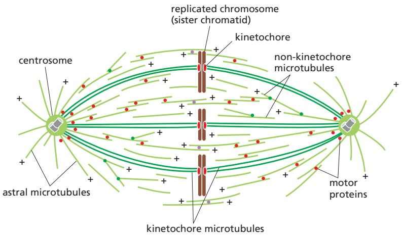
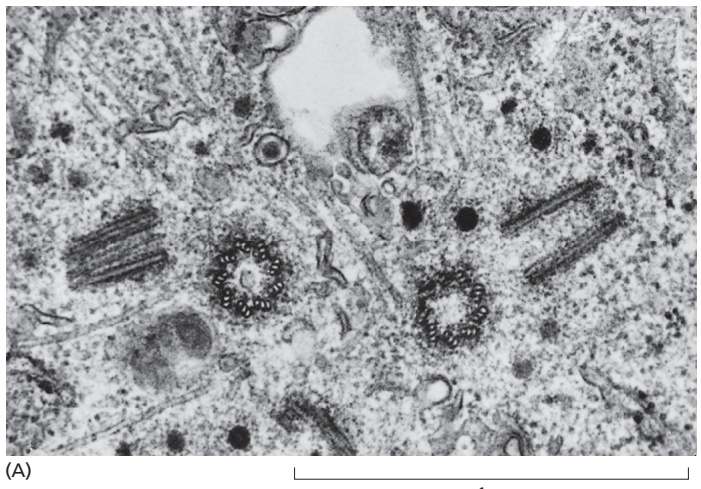
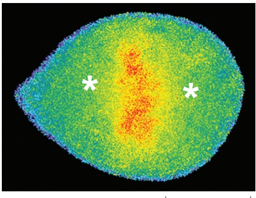
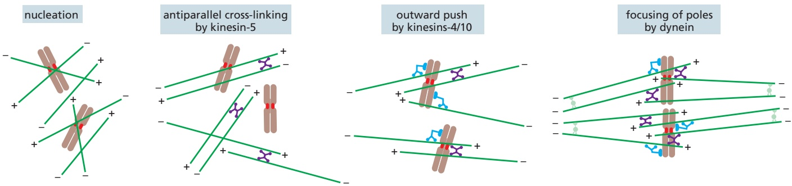
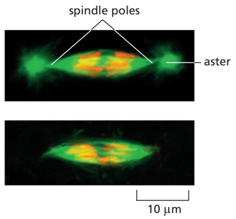
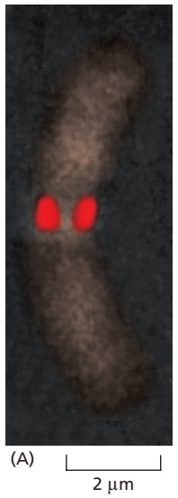
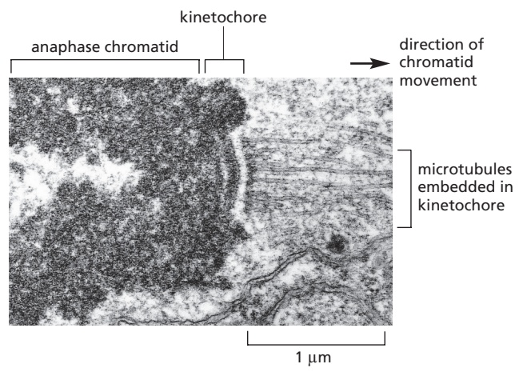
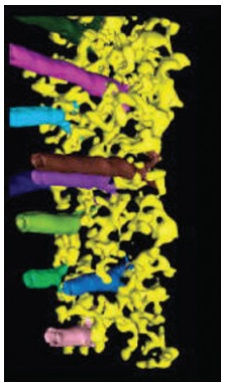
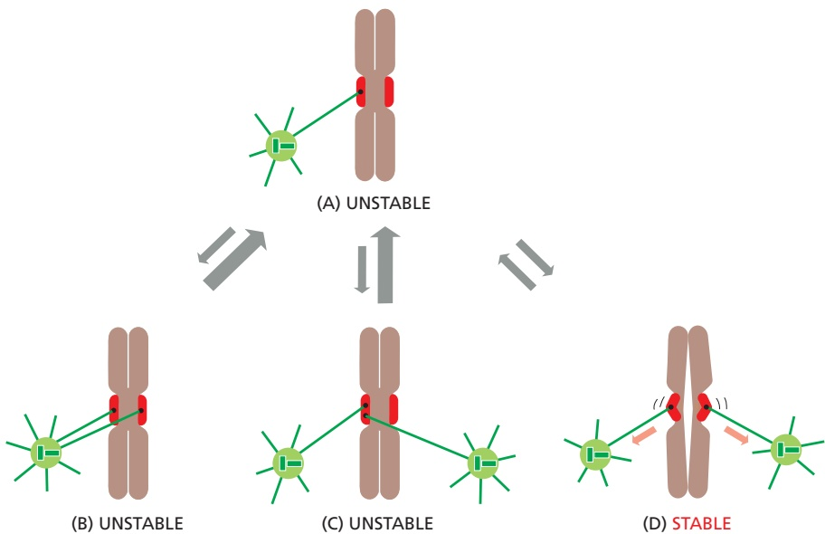

1 µm

(B)

the centrosome. Some cells—notably the cells of higher plants and the oocytes of many vertebrates—do not have centrosomes and therefore do not have astral microtubules. Thus, as we discuss later, centrosomes are not essential for spindle assembly.

Figure 17–26 The metaphase mitotic spindle in an animal cell. Bundles of parallel kinetochore microtubules (K-fibers) connect the spindle poles with the kinetochores of sister chromatids. Non-kinetochore microtubules are scattered throughout the spindle with their minus ends directed toward the nearest pole; these microtubules are cross-linked by various microtubule-associated proteins to form a dynamic, interconnected meshwork. Near the spindle equator, antiparallel microtubules are cross-linked by specific motor and other proteins (light purple dots). In other regions of the spindle, parallel microtubules are cross-linked (red dots). Some microtubules grow from nucleating factors in the centrosome, while others originate in nucleating factors on the sides of other microtubules (green dots), as we discuss later. Astral microtubules radiate out from the poles into the cytoplasm and are not present in spindles lacking centrosomes.

The assembly and function of a bipolar spindle depend on hundreds of dif-MBoC7 m17.23/17.26 ferent microtubule-associated proteins that can be placed in three general categories: nucleating factors that govern the formation of new microtubules, regulatory proteins that control rates of polymerization and depolymerization at both ends of the microtubules, and motor proteins that cross-link and move microtubules relative to each other. We briefly describe each of these important microtubule regulators in the following sections, after which we discuss how these components collaborate in the assembly of the spindle.

## Microtubules Are Nucleated in Multiple Regions of the Spindle

Microtubules are the building blocks of the spindle, and spindle assembly requires the synthesis of enormous numbers of new microtubules. Mature metaphase spindles contain tens or hundreds of thousands of microtubules, most of which are turning over rapidly, resulting in the need for a constant supply of new microtubules. To meet this need, the spindle contains large numbers of microtubule nucleating factors. By far the most important of these is the g-tubulin ring complex (g-TuRC; see Figure 16–41), which nucleates microtubule assembly from the minus end, leaving the plus end to grow rapidly.

Figure 17–27 The centrosome. (A) Electron micrograph of an S-phase mammalian cell in culture, showing a duplicated centrosome. Each centrosome contains a pair of centrioles; although the centrioles have duplicated, they remain together in a single complex, as shown in the drawing of the micrograph in (B). One centriole of each centriole pair has been cut in cross section, while the other is cut in longitudinal section, indicating that the two members of each pair are aligned at right angles to each other. The two halves of the replicated centrosome, each consisting of a centriole pair surrounded by pericentriolar material, will split and migrate apart to initiate the formation of the two poles of the mitotic spindle when the cell enters M phase (see Figures 16–42 and 16–43). (A, from M. McGill et al., J. Ultrastruct. Res. 57:43–53, 1976. With permission from Academic Press.)

In the many animal cell types that contain centrosomes, large numbers of γ-TuRCs are anchored and activated in the pericentriolar material and drive the formation of microtubules that radiate outward from the centrosome (see Figure 16-42). The number of γ-TuRCs in each centrosome increases greatly at the beginning of mitosis, in a process called centrosome maturation.

Microtubule formation also occurs within the metaphase spindle between the poles. A large protein complex called augmin anchors active γ-TuRC to the side of a microtubule, resulting in the nucleation of a new microtubule that branches off the other (see Figure 16-47). Augmin binds to the microtubule in such a way that it orients the new microtubule with its plus end pointing in the same direction as the microtubule to which it binds; as a result, the new microtubule has the correct orientation when it is released and repositioned in the spindle microtubule network.

Spindle assembly also depends on increased microtubule synthesis in the vicinity of the chromosomes. Mitotic chromosomes generate local signals that activate γ-TuRC and thereby promote microtubule formation. As we describe later, this mechanism, together with microtubule sorting by various motor proteins, allows chromosomes to make a major contribution to the formation of a bipolar spindle—particularly in the absence of centrosomes.

## Microtubule Instability Increases Greatly in Mitosis

As discussed in Chapter 16, microtubules are in a state of dynamic instability, in which individual microtubules are either growing or shrinking and stochastically switch between the two states. New microtubules are continually being created to balance the loss of those that disappear completely by depolymerization.

Entry into mitosis signals an abrupt change in the cell’s microtubules. During prophase, and particularly in prometaphase and metaphase (see Panel 17–1), the average lifetime of a microtubule decreases dramatically—particularly the lifetime of non-kinetochore microtubules, which exist for only 15–30 seconds. This increase in microtubule instability, coupled with the increased ability of the spindle to nucleate microtubules as mentioned above, results in a remarkably dense and dynamic array of spindle microtubules.

Microtubule dynamics are controlled in the cell by a variety of regulatory proteins, including microtubule-associated proteins (MAPs) that promote stability and depolymerization factors that destabilize microtubule plus ends. Changes in the activities of these proteins are responsible for the changes in microtubule dynamics that occur during mitosis. Many of these changes result from phosphorylation of specific proteins by M-Cdk and other mitotic protein kinases.

## Microtubule-based Motor Proteins Govern Spindle Assembly and Function

The assembly and function of the mitotic spindle depend on numerous microtubule-dependent motor proteins. As discussed in Chapter 16, these proteins belong to two families—the large family of kinesin-related proteins, which usually move toward the plus end of microtubules, and dyneins, which move toward the minus end. Two motor proteins—kinesin-5 and cytoplasmic dynein—are particularly important in spindle assembly and function, and many others, including kinesin-14 and kinesins-4/10, are also involved (**Figure 17–28**).

Kinesin-5 is a large tetramer containing two dimeric motor domains at each end. The motor domains both move toward the plus end of a microtubule but can be oriented in opposite directions; as a result, they can associate with two antiparallel microtubules and slide them in opposite directions. When this occurs near the center of the spindle, the result is that the minus ends of the microtubule are pushed toward the poles. This process is fundamentally important in generating bipolarity in the spindle.

Figure 17–28 Major motor proteins of the spindle. Microtubule-dependent motor proteins contribute to spindle assembly and function (see text). The colored arrows indicate the direction of motor protein movement along a microtubule—blue toward the minus end and light red toward the plus end. Because non-kinetochore microtubules are extensively cross-linked to each other in the spindle and at the poles, it is thought that microtubule sliding like that shown here can alter spindle length. (From D.O. Morgan, The Cell Cycle: Principles of Control, p. 117. London: New Science Press, 2007. With permission from Oxford University Press.)

Cytoplasmic dynein is a minus end–directed motor that, together with associ-MBoC7 m17.25/17.28 ated proteins, organizes microtubules at various locations in the cell. By attaching to the minus end of one microtubule and transporting it toward the minus end of a second microtubule, dynein functions to connect new microtubules formed in the body of the spindle to microtubules nucleated at a centrosome, and to focus the spindle poles. Dynein is also present on the plus ends of astral microtubules at the cell cortex. By moving toward the minus end of astral microtubules, dynein motors pull the spindle poles toward the cell cortex and away from each other.

Kinesin-14, unlike most kinesins, is a minus end–directed motor. It contains a dimeric motor domain and a second domain that can bind to a neighboring microtubule in a specific orientation, enabling it to cross-link antiparallel microtubules at the center of the spindle and pull the poles together. Kinesin-4 and kinesin-10 proteins, also called chromokinesins, are plus end–directed motors that associate with chromosome arms and push the attached chromosome away from the pole (or the pole away from the chromosome).

## Bipolar Spindle Assembly in Most Animal Cells Begins with Centrosome Duplication

The mitotic spindle must have two poles if it is to pull the two sets of sister chromatids to opposite ends of the cell in anaphase. In most animal cells, several mechanisms ensure the bipolarity of the spindle. One depends on centrosomes. A typical animal cell enters mitosis with a pair of centrosomes, each of which nucleates a radial array of microtubules. The two centrosomes provide prefabricated spindle poles that greatly facilitate bipolar spindle assembly. The other mechanisms depend on the ability of mitotic chromosomes to nucleate and stabilize microtubules and on the ability of motor proteins to organize microtubules into a bipolar array. We will discuss these “self-organization” mechanisms later in this section.

In interphase, most animal cells contain a single centrosome that nucleates most of the cell’s cytoplasmic microtubules. The centrosome duplicates when the cell enters the cell cycle, so that by the time the cell reaches mitosis there are two centrosomes. Centrosome duplication begins at about the same time as the cell enters S phase. The $G _{1}/ S-Cdk$ (a complex of cyclin E and Cdk2 in animal cells; see Table 17–1) that triggers cell-cycle entry also helps initiate centrosome duplication, together with another protein kinase called Plk4. Each of the two centrioles in the centrosome nucleates the formation of a new centriole, which is gradually constructed in S phase to generate a closely linked pair of centrosomes (**Figure 17–29**). This centrosome pair remains together on one side of the nucleus until the cell enters mitosis, when the two centrosomes undergo numerous changes to form the poles of the spindle.

There are interesting parallels between centrosome duplication and chromosome duplication. Both use a semiconservative mechanism of duplication, in which the two halves separate and serve as templates for construction of a new half. Centrosomes, like chromosomes, must replicate once and only once per cell cycle, to ensure that the cell enters mitosis with precisely two copies: an incorrect number of centrosomes can lead to defects in spindle assembly and thus errors in chromosome segregation.

We are beginning to unravel the complex mechanisms that limit centrosome duplication to once and only once per cell cycle. These mechanisms are reminiscent of those that restrict DNA replication to once per cell cycle: after duplication has occurred in S phase, passage through mitosis is required for the “licensing” of centrosome duplication in the next cell cycle (see Figure 17–29).

## Spindle Assembly in Animal Cells Requires Nuclear-Envelope Breakdown

In cells that contain centrosomes, spindle assembly begins when the two centrosomes move apart along the nuclear envelope in prophase, pulled by dynein motor proteins that link astral microtubules to the cell cortex (see Figure 17–28). The plus ends of the microtubules between the centrosomes interdigitate to form an array of antiparallel microtubules, and kinesin-5 motor proteins cross-link these microtubules and push the centrosomes apart.

Centrosomes and microtubules are located in the cytoplasm, where they have no access to the sister-chromatid pairs inside the nucleus. Thus, the attachment of the nascent spindle to sister-chromatid pairs requires the removal of the nuclear envelope. In addition, many of the motor proteins and microtubule regulators that promote spindle assembly are associated with the chromosomes inside the nucleus, and they require nuclear-envelope breakdown to carry out their functions.

Nuclear-envelope breakdown is a complex, multistep process, which is thought to begin when M-Cdk phosphorylates several subunits of the nuclear pore complexes in the nuclear envelope. This phosphorylation initiates the disassembly of nuclear pore complexes and their dissociation from the envelope. M-Cdk also phosphorylates components of the nuclear lamina, the structural framework beneath the envelope, resulting in nuclear lamina disassembly. In parallel, phosphorylation of several inner-nuclear-envelope proteins leads to detachment of

Figure 17–29 The centrosome cycle. In early $\mathbb { G } _ { 1 } ,$ the centrosome consists of two centrioles linked by a protein tether, as well as associated pericentriolar material for nucleation of microtubules (light green). One centriole, the mature parent, carries protein appendages required for certain centrosome functions. Upon entry into the cell cycle, G1/S-Cdk and Plk4 initiate centriole duplication, whereby a new centriole (procentriole) is assembled at a single site on the side of each parent centriole (yellow dots). The elongation of the procentrioles is usually completed in G2. The two centriole pairs remain close together in a single centrosomal complex until entry into mitosis, when the protein kinases M-Cdk, Plk1, and other regulators trigger numerous changes: the tether between centrosomes is removed, the immature parent centriole acquires appendages (centriole maturation), the pericentriolar material expands to enable more microtubule nucleation (centrosome maturation), and the centrosomes separate, forming a new spindle between them. After the completion of mitosis, the two centrioles in each centrosome detach (centriole disengagement), and the new centriole acquires pericentriolar material (centriole-to-centrosome conversion). These two processes are required for centriole duplication in the subsequent cell cycle; thus, progression through mitosis is required for duplication, helping to ensure that centrioles (and centrosomes) duplicate only once per cell cycle.

Figure 17–30 Activation of the GTPase Ran around mitotic chromosomes. The Ran protein, like other members of the small GTPase family (discussed in Chapter 15), can exist in two conformations depending on whether it is bound to GDP (inactive state) or GTP (active state). The localization of active Ran in mitosis was determined using a protein that emits fluorescence at a specific wavelength when it is activated by Ran-GTP. In the metaphase human cell shown here, Ran activity (yellow and red) is highest around the chromosomes, between the poles of the mitotic spindle (indicated by asterisks). (From P. Kaláb et al., Nature 440:697–701, published 2006 by Nature Publishing Group. Reproduced with permission from SNCSC.)

lamin proteins and chromosomes from the nuclear envelope, which is then incorporated into the membranes of the endoplasmic reticulum.

10 µm

## Mitotic Chromosomes Promote Bipolar Spindle Assembly

When they are present, centrosomes drive spindle assembly. Centrosomes are very efficient microtubule nucleators that also act to organize the spindle poles, rapidly generating a bipolar microtubule array that rains down on the chromosomes when the nuclear envelope is removed. However, chromosomes are not just passive passengers in the process of spindle assembly. By creating a local environment that favors both microtubule nucleation and microtubule stabilization, they play an active part in spindle formation. The influence of the chromosomes can be demonstrated by using a fine glass needle to reposition them after the spindle has formed. For some cells in metaphase, if a single chromosome is tugged out of alignment, a mass of new spindle microtubules rapidly appears around the newly positioned chromosome, while the spindle microtubules at the chromosome’s former position depolymerize. This property of the chromosomes seems to depend, at least in part, on a guanine nucleotide exchange factor (GEF) that is bound to chromatin; the GEF stimulates a small GTPase in the cytosol called Ran to bind GTP in place of GDP. The activated Ran-GTP, which is also involved in nuclear transport (discussed in Chapter 12), releases microtubuleregulatory proteins from protein complexes in the cytosol, thereby stimulating the local nucleation and stabilization of microtubules around chromosomes (**Figure 17–30**). The best-understood mechanism depends on the release of a protein called TPX2, which then binds and activates the protein kinase Aurora-A. Aurora-A phosphorylates regulatory proteins that activate γ-TuRCs, leading to an increase in local formation of new microtubules. TPX2 might also activate augmin to promote the formation of new microtubule branches on the sides of existing microtubules. Local microtubule stabilization is also promoted by the protein kinase Aurora-B, which associates with mitotic chromosomes.

In the absence of centrosomes, spindle assembly is thought to begin with the formation of microtubules around the chromosomes. Various microtubuleassociated proteins then organize the microtubules into a bipolar spindle (**Figure 17–31**). Two motor proteins that we discussed earlier are particularly important. Kinesin-5, by cross-linking antiparallel microtubules and pushing their minus ends outward, is essential for the bipolar character of the spindle. Dynein, by transporting one microtubule minus end toward the minus end of another, is required for the focusing of minus ends in a discrete pole at each end of the bipolar array. Many other microtubule regulators, including other motor proteins and augmin, also contribute to spindle assembly.

Figure 17–31 Spindle self-organization by motor proteins. Mitotic chromosomes stimulate the local activation of proteins that promote the formation of microtubules in the vicinity of the chromosomes. Kinesin-5 motor proteins (see Figure 17–28) organize these microtubules into antiparallel bundles, while plus end–directed kinesin-4 and kinesin-10 link the microtubules to chromosome arms and push minus ends away from the chromosomes. Dynein, together with numerous other proteins, focuses these minus ends into a pair of spindle poles.

Cells that normally lack centrosomes, such as those of higher plants and many animal oocytes, use chromosome-based self-organization mechanisms to form spindles. These mechanisms also assemble spindles in experimental systems where centrosomes are removed—such as in certain animal embryos that have been induced to develop from eggs without fertilization (called parthenogenesis). As the sperm normally provides the centrosome when it fertilizes an egg, the mitotic spindles in these parthenogenetic embryos develop without centrosomes (**Figure 17–32**). Although the resulting acentrosomal spindle can segregate chromosomes normally, it lacks astral microtubules, which are responsible for positioning the spindle in animal cells; as a result, the spindle can be mispositioned in the cell.

## Kinetochores Attach Sister Chromatids to the Spindle

After the assembly of a bipolar microtubule array, the second major step in spindle formation is the attachment of the array to the sister-chromatid pairs. Spindle microtubules become attached to each chromatid at its **kinetochore**, a giant, multilayered protein structure that is built at the centromeric region of the chromatid (**Figure 17–33**; also see Chapter 4). In metaphase, the plus ends of kinetochore microtubules are embedded head-on in specialized microtubuleattachment sites within the outer region of the kinetochore, furthest from the DNA. The kinetochore of an animal cell can bind 10–40 microtubules, whereas a budding yeast kinetochore can bind only one. Attachment of each microtubule depends on multiple copies of a rod-shaped protein complex called the Ndc80 complex, which is anchored in the kinetochore at one end and interacts with the sides of the microtubule at the other, thereby linking the microtubule to the kinetochore while still allowing the addition or removal of tubulin subunits at this end (**Figure 17–34**). Regulation of plus-end polymerization and depolymerization at the kinetochore is critical for the control of chromosome movement on the spindle, as we discuss later.

Figure 17–32 Bipolar spindle assembly without centrosomes in parthenogenetic embryos of the insect Sciara (or fungus gnat). The microtubules are stained green, the chromosomes red. The top fluorescence micrograph shows a normal MBoC7 m17.29/17.32spindle formed with centrosomes in a normally fertilized Sciara embryo. The bottom micrograph shows a spindle formed without centrosomes in an embryo that initiated development without fertilization. Note that the spindle with centrosomes has an aster at each pole of the spindle, whereas the spindle formed without centrosomes does not. Both types of spindles are able to segregate the replicated chromosomes. (© 1998 B. de Saint Phalle and W. Sullivan. Originally published in J. Cell Biol. https://doi.org/10.1083/jcb.141.6.1383.With permission from Rockefeller University Press.)

(C)

Figure 17–33 The kinetochore. (A) A fluorescence micrograph of a metaphase chromosome stained with a DNA-binding fluorescent dye and with human autoantibodies that react with specific kinetochore proteins. The two kinetochores, one associated with each sister chromatid, are stained red. (B) A drawing of a metaphase chromosome showing its two sister chromatids attached to the plus ends of kinetochore microtubules. Each kinetochore forms a plaque on the surface of the centromere. (C) Electron micrograph of an anaphase chromatid with microtubules attached to its kinetochore. While most kinetochores have a trilaminar structure, the one shown here (from a green alga) has an unusually complex structure with additional layers. (A, © 1991 R.P. Zinkowski et al. Originally published in J. Cell Biol. https://doi.org/10.1083/jcb.113.5.1091.With permission from Rockefeller University Press. C, from J.D. Pickett-Heaps and L.C. Fowke, Aust. J. Biol. Sci. 23:71–92, 1970. With permission from CSIRO Publishing.)

(A)

100 nm

(B)

(C)

Figure 17–34 Microtubule attachment sites in the kinetochore. (A) In this electron micrograph of a mammalian kinetochore, the chromosome is on the right, and the plus ends of multiple microtubules are embedded in the outer kinetochore on the left. (B) Electron tomography (discussed in Chapter 9) was used to construct a low-resolution threedimensional image of the outer kinetochore in A. Several microtubules (in multiple colors) are embedded in fibrous material of the kinetochore, which is thought to be composed of the Ndc80 complex and other proteins. (C) Each microtubule is attached to the kinetochore by interactions with multiple copies of the Ndc80 complex (blue). This complex binds to theMBoC7 m17.31/17.34 sides of the microtubule near its plus end, allowing polymerization and depolymerization to occur while the microtubule remains attached to the kinetochore. The opposite end of the Ndc80 complex is attached through intermediary proteins to centromeric nucleosomes containing a specialized version of histone H3 called CENP-A (see Chapter 4). Budding yeast kinetochores contain a single centromeric nucleosome and thus a single microtubule-binding site like that shown here, while animal kinetochores (like those in B) contain large arrays of these binding sites distributed over large numbers of centromeric nucleosomes. (A and B, from Y. Dong et al., Nat. Cell Biol. 9:516–522, published 2007 by Nature Publishing Group. Reproduced with permission of SNCSC.)

Kinetochore attachment to the spindle occurs by a complex sequence of events. At the end of prophase in animal cells, the centrosomes of the growing spindle generally lie on opposite sides of the nuclear envelope. Thus, when the envelope breaks down, the sister-chromatid pairs are bombarded by dynamic microtubule plus ends coming from two directions. However, the kinetochores do not instantly achieve the correct “end-on” microtubule attachment to both spindle poles. Instead, detailed studies with light and electron microscopy show that most initial attachments are unstable lateral attachments, in which a kinetochore attaches to the side of a passing microtubule, with assistance from dynein motor proteins in the outer kinetochore. Eventually, microtubule plus ends are captured by one and then the other kinetochore in the correct end-on orientation.

Another attachment mechanism also plays a part, particularly in the absence of centrosomes. Short microtubules in the vicinity of the chromosomes become embedded in the plus end–binding sites of the kinetochore. Polymerization at these plus ends then results in growth of the microtubules away from the kinetochore. The minus ends of these kinetochore microtubules are eventually cross-linked to other minus ends and focused by dynein motor proteins at the spindle pole (see Figure 17–31).

## Bi-orientation Is Achieved by Trial and Error

The success of mitosis demands that sister chromatids in a pair attach to opposite poles of the mitotic spindle, so that they move to opposite ends of the cell when they separate in anaphase. How is this mode of attachment, called **bi-orientation**, achieved? What prevents the attachment of both kinetochores to the same spindle pole or the attachment of one kinetochore to both spindle poles? Part of the answer is that sister kinetochores are constructed in a back-to-back orientation that reduces the likelihood that both kinetochores can face the same spindle pole. Nevertheless, incorrect attachments do occur, and elegant regulatory mechanisms have evolved to correct them.

Figure 17–35 Alternative forms of kinetochore attachment to the spindle poles. (A) Initially, a single microtubule from a spindle pole binds to one kinetochore in a sister-chromatid pair. Additional microtubules can then bind to the chromosome in various ways. (B) A microtubule from the same spindle pole can attach to the other sister kinetochore, or (C) microtubules from both spindle poles can attach to the same kinetochore. These incorrect attachments are unstable, however, so that one of the two microtubules tends to dissociate. (D) When a microtubule from the opposite pole MBOC7 m17.33/17.35binds to the second kinetochore, the sister kinetochores are thought to sense tension across their microtubule-binding sites. This triggers an increase in microtubule binding affinity, thereby locking the correct attachment in place. Occasionally (not shown), attachments can form that are a combination of C and D; that is, the two sister kinetochores are attached to opposite poles and are under tension, but there is also an inappropriate microtubule link between one kinetochore and both spindle poles. This combination is stable, and cells that progress to anaphase with such an attachment risk moving both sister chromatids to the same daughter, which is usually lethal for the cell.

Incorrect attachments are corrected by a system of trial and error that is based on a simple principle: most incorrect attachments are highly unstable and do not last, whereas correct attachments are held in place. How does the kinetochore sense a correct attachment? The answer appears to be tension (**Figure 17–35**). When a sister-chromatid pair is properly bi-oriented on the spindle, the two kinetochores are pulled in opposite directions by strong poleward forces. Sister-chromatid cohesion resists these poleward forces, creating high levels of tension within the kinetochores. When chromosomes are incorrectly attached—when both sister chromatids are attached to the same spindle pole, for example—tension is low and the kinetochore generates an inhibitory signal that loosens the grip of its microtubule attachment site, allowing detachment to occur. When bi-orientation occurs, the high tension at the kinetochore shuts off the inhibitory signal, strengthening microtubule attachment. In animal cells, tension not only increases the affinity of the attachment site but also leads to the attachment of additional microtubules to the kinetochore. This results in the formation of a thick kinetochore fiber composed of multiple microtubules.

The tension-sensing mechanism depends on the protein kinase Aurora-B, which is associated with the kinetochore and is thought to generate the inhibitory signal that reduces the strength of microtubule attachment in the absence of tension. It phosphorylates several components of the microtubule attachment site, including the Ndc80 complex, decreasing the site’s affinity for a microtubule plus end. When bi-orientation occurs, the resulting tension reduces phosphorylation by Aurora-B, thereby increasing the affinity of the attachment site (**Figure 17–36**).

After their attachment to the two spindle poles, the chromosomes are tugged back and forth, eventually assuming a position equidistant between the two poles, a position called the **metaphase plate**. In vertebrate cells, the chromosomes then oscillate gently at the metaphase plate, awaiting the signal for the sister chromatids to separate. The signal is produced, with a predictable lag time, after the bi-oriented attachment of the last sister-chromatid pair.

## Multiple Forces Act on Chromosomes in the Spindle

The metaphase spindle, with the sister chromatids aligned at the metaphase plate, appears as a stable bipolar structure of a fixed length, but appearances can be deceiving. The spindle is a highly dynamic assembly that exists at a steady state that depends on the precise balance of numerous forces generated by various motor proteins and by microtubule polymerization and depolymerization. These forces move chromosomes once they are attached to the spindle and produce the tension that is so important for the stabilization of correct attachments. In anaphase, similar forces pull the separated chromatids to opposite ends of the spindle. Three major spindle forces are particularly critical, although their strength and importance vary at different stages of mitosis.

The first major force pulls the kinetochore and its associated chromatid along the kinetochore microtubule toward the spindle pole. This force is generated by depolymerization at the plus end of the microtubule. It pulls on chromosomes during prometaphase and metaphase but is particularly important for moving sister chromatids toward the poles after they separate in anaphase. Notably, this kinetochore-generated poleward force does not require ATP or motor proteins. This might seem implausible at first, but it has been shown that purified kinetochores in a test tube, with no ATP present, can remain attached to depolymerizing microtubules and thereby move. The energy that drives the movement is stored in the microtubule and is released when the microtubule depolymerizes; it ultimately comes from the hydrolysis of GTP that occurs after a tubulin subunit adds to the end of a microtubule (discussed in Chapter 16).

How does plus-end depolymerization drive the kinetochore toward the pole? As we discussed earlier (see Figure 17–34C), Ndc80 complexes in the kinetochore make multiple low-affinity attachments along the side of the microtubule. Because the attachments are constantly breaking and re-forming at new sites, the kinetochore remains attached to a microtubule even as the microtubule depolymerizes. In principle, this could move the kinetochore toward the spindle pole.

A second poleward force is provided in some cell types by **microtubule flux**, whereby the microtubules themselves are pulled toward the spindle poles and dismantled at their minus ends. The mechanism underlying this poleward movement is not clear, although it is likely to depend on forces generated by motor proteins and minus-end depolymerization at the spindle pole. In metaphase, the addition

Figure 17–36 How tension might increase microtubule attachment to the kinetochore. These diagrams illustrate one speculative mechanism by which bi-orientation might increase microtubule attachment to the kinetochore. A single kinetochore is shown for clarity; the spindle pole is on the right. (A) When a sisterchromatid pair is unattached to the spindle or attached to just one spindle pole, there is little tension between the outer and inner kinetochores. The protein kinase Aurora-B is tethered to the inner kinetochore and phosphorylates the microtubule attachment sites, including the Ndc80 complex (blue), in the outer kinetochore as shown, thereby reducing the affinity of microtubule binding. Microtubules therefore associate and dissociate rapidly, and attachment is unstable. (B) When bi-orientation is achieved, the forces pulling the kinetochore toward the spindle pole are resisted by forces pulling the other sister kinetochore toward the opposite pole, and the resulting tension pulls the outer kinetochore away from the inner kinetochore. As a result, Aurora-B is unable to reach the outer kinetochore, and microtubule attachment sites are not phosphorylated. Microtubule binding affinity is therefore increased, resulting in the stable attachment of multiple microtubules to both kinetochores. The dephosphorylation of outer kinetochore proteins depends on a phosphatase that is not shown here.

Figure 17–37 Microtubule flux in the metaphase spindle. (A) To observe microtubule flux, a small amount of fluorescent tubulin is injected into living cells or cell extracts so that individual microtubules form with a small proportion of fluorescent tubulin. Such microtubules have a speckled appearance when viewed by fluorescence microscopy. (B) Much of what we know about mitotic spindle behavior comes from studies in extracts of the eggs of the frog X. laevis. These extracts carry out many cell-cycle processes in a test tube, including mitotic spindle assembly. This image shows a fluorescence micrograph of a mitotic spindle in an extract mixed with a small amount of fluorescent tubulin. Because there are no centrosomes in these extracts, the spindle does not have astral microtubules. The chromosomes are colored brown, and the tubulin speckles are red. (C) The movement of individual speckles can be followed by time-lapse video microscopy. Images of the thin vertical boxed region (arrow) in B, taken every 10 seconds, are aligned here to show that individual speckles move toward the poles at a rate of about 0.75 μm/min, indicating that the microtubules are moving poleward. (D) The length of a kinetochore microtubule does not change significantly during this experiment because new tubulin subunits are added at the microtubule plus end at the same rate as tubulin subunits are removed from the minus end. (B and C, from T.J. Mitchison and E.D. Salmon, Nat. Cell Biol. 3:E17–21, published 2001 by Nature Publishing Group. Reproduced with permission of SNCSC.)

of new tubulin at the plus end of a microtubule compensates for the loss of tubulin at the minus end, so that microtubule length remains constant despite the movement of microtubules toward the spindle pole (**Figure 17–37**). Any kinetochore that is attached to a microtubule undergoing such flux experiences a poleward force, which contributes to the generation of tension at the kinetochore in metaphase. Together with the kinetochore-based forces discussed above, flux also contributes to the poleward forces that move sister chromatids after they separate in anaphase.

A third force acting on chromosomes is the polar ejection force, or polar wind. Plus end–directed kinesin-4 and kinesin-10 motors on chromosome arms interact with microtubules and transport the chromosomes away from the spindle poles (see Figure 17–28). This force is particularly important in prometaphase and metaphase, when it helps push chromosome arms out from the spindle. This force might also help align the sister-chromatid pairs at the metaphase plate.

## The APC/C Triggers Sister-Chromatid Separation and the Completion of Mitosis

The cell cycle reaches its most dramatic moment with the separation of the sister chromatids at the metaphase-to-anaphase transition (**Figure 17–38**). Although M-Cdk activity sets the stage for this event, the anaphase-promoting complex, or cyclosome (APC/C), discussed earlier throws the switch that initiates sister-chromatid separation by ubiquitylating several mitotic regulatory proteins and thereby triggering their destruction (see Figure 17–18).

As we discussed earlier, cohesins hold sister-chromatid pairs together after S phase. In early mitosis, the resolution of the sister chromatids is accompanied by the removal of most cohesin from the chromosome arms via a mechanism that depends on a protein that pulls open the cohesin ring at the junction of its Smc3 and Scc1 subunits (see Figure 17–23). When the cell reaches metaphase, cohesins remain primarily at the centromeric regions of the chromosomes, adjacent to the kinetochores, where they serve to resist the poleward forces that pull the sister chromatids apart. Anaphase begins with the abrupt removal of the remaining cohesin, which allows the sisters to separate and move to opposite poles of the spindle. The APC/C initiates the process by targeting the inhibitory protein **securin** for destruction. Before anaphase, securin binds to and inhibits the activity of a protease called **separase**. The destruction of securin in metaphase releasesMBoC7 m17.37/17.38 separase, which is then free to cleave the Scc1 subunit of cohesin (see Figure 17–23). The cohesins fall away, and the sister chromatids separate (**Figure 17–39**).

Figure 17–38 Sister-chromatid separation at anaphase. In the transition from metaphase (A) to anaphase (B), sister chromatids suddenly and synchronously separate and move toward opposite poles of the mitotic spindle—as shown in these light micrographs of Haemanthus (lily) endosperm cells that were stained with gold-labeled antibodies against tubulin (pink). (Courtesy of Andrew Bajer.)

We saw earlier that phosphorylation of various proteins by M-Cdk promotes spindle assembly, chromosome condensation, and nuclear-envelope breakdown in early mitosis. It is thus not surprising that the dephosphorylation of these same proteins is required for spindle disassembly and the re-formation of daughter nuclei in telophase. Dephosphorylation of Cdk targets depends in part on the inactivation of most Cdks in the cell, which results when the APC/C targets S- and M-cyclins for destruction. Protein dephosphorylation also results

Figure 17–39 The initiation of sisterchromatid separation by the APC/C. The activation of APC/C by Cdc20 leads to the ubiquitylation and destruction of securin, which normally holds separase in an inactive state. The destruction of securin allows separase to cleave Scc1, a subunit of the cohesin complex holding the sister chromatids together (see Figure 17–23). The forces of the mitotic spindle then pull the sister chromatids apart. In animal cells, phosphorylation by Cdks also inhibits separase (not shown). Thus, Cdk inactivation in anaphase (resulting from cyclin destruction) also promotes separase activation by allowing its dephosphorylation.

Figure 17–40 Mad2 protein on unattached kinetochores. This fluorescence micrograph shows a mammalian cell in prometaphase, with the mitotic spindle in green and the sister chromatids in blue. One sister-chromatid pair is attached to only one pole of the spindle. Staining with anti-Mad2 antibodies indicates that Mad2 is bound to the kinetochore of the unattached sister chromatid (red dot, indicated by red arrow). A small amount of Mad2 is associated with the kinetochore of the sister chromatid that is attached to the spindle pole (pale dot, indicated by white arrow). (© 1998 J. Waters et al. Originally published in J. Cell Biol. https://doi.org/10.1083/jcb.141.5.1181. With permission from Rockefeller University Press.)

from activation of phosphatases. Recall from our earlier discussions, for example, that the phosphatase PP2A-B55 is inactivated by M-Cdk (see Figures 17–15 and 17–17). When Cdk activity declines after cyclin destruction, PP2A and other phosphatases are activated, further driving protein dephosphorylation and the completion of mitosis.

## Unattached Chromosomes Block Sister-Chromatid Separation: The Spindle Assembly Checkpoint

Drugs that destabilize microtubules, such as colchicine or vinblastine (discussed in Chapter 16), arrest cells in mitosis for hours or even days. This observation led to the identification of a **spindle assembly checkpoint** mechanism that is activated by the drug treatment and blocks progression through the metaphase-to-anaphase transition. The checkpoint mechanism ensures that cells do not enter anaphase until all chromosomes are correctly bi-oriented on the mitotic spindle.

The spindle assembly checkpoint depends on a sensor mechanism that monitors microtubule attachment at the kinetochore. Any kinetochore that is not properly attached to microtubules sends out a diffusible negative signal that blocks APC/C–Cdc20 activation throughout the cell and thus blocks the metaphase-to-anaphase transition. When the last sister-chromatid pair is properly attached and bi-oriented, this block is removed, allowing sister-chromatid separation to occur.

The negative checkpoint signal depends on several proteins, including Mad2, which are recruited to unattached kinetochores (**Figure 17–40**). The unattached kinetochore acts as an enzyme that catalyzes a change in the conformation of Mad2, so that Mad2 then interacts with other proteins to form a large multiprotein complex that binds and thereby inhibits APC/C–Cdc20. When proper microtubule attachment is achieved, these inhibitory complexes are disassembled, and APC/C–Cdc20 inhibition is thereby relieved.

20 µm

In mammalian cells, the spindle assembly checkpoint determines the normal timing of anaphase. The destruction of securin in these cells begins moments after the last sister-chromatid pair becomes bi-oriented on the spindle, and anaphase begins about 20 minutes later. Experimental inhibition of the checkpoint mechanism causes premature sister-chromatid separation and anaphase.

## Chromosomes Segregate in Anaphase A and B

The sudden loss of sister-chromatid cohesion at the onset of anaphase leads to sister-chromatid separation, which allows the forces of the mitotic spindle to pull the sisters to opposite poles of the cell—called chromosome segregation. The chromosomes move by two independent and overlapping processes. The first, **anaphase A**, is the initial poleward movement of the chromosomes, which is accompanied by shortening of the kinetochore microtubules. The second, **anaphase B**, is the separation of the spindle poles themselves, which begins after the sister chromatids have separated and the daughter chromosomes have moved some distance apart (**Figure 17–41**).

Chromosome movement in anaphase A depends on a combination of the two major poleward forces described earlier. The first is the force generated by microtubule depolymerization at the kinetochore, which results in the loss of tubulin subunits at the plus end as the kinetochore moves toward the pole. The second is