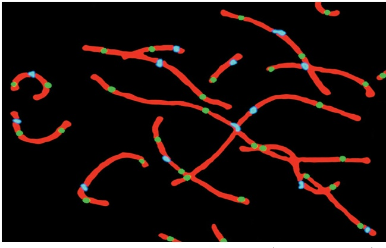
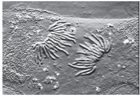
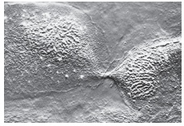
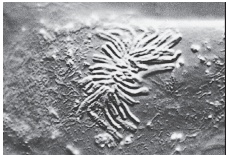
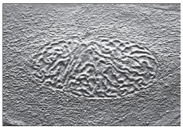
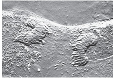
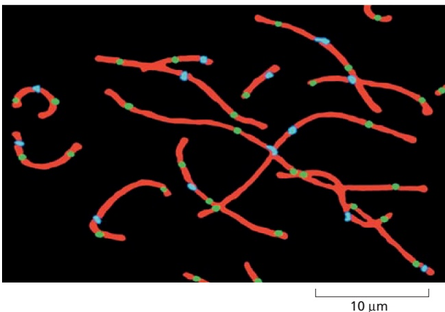

MEIOSIS

1075

## Homolog Segregation Depends on Several Unique Features of Meiosis I

A fundamental difference between meiosis I and mitosis (and meiosis II) is that in meiosis I, homologs rather than sister chromatids separate and then segregate (see Figure 17–52). This difference depends on three features of meiosis I that distinguish it from mitosis (**Figure 17–57**).

First, both sister kinetochores in a homolog must attach stably to the same spindle pole. This type of attachment is normally avoided during mitosis (see Figure 17–35). In meiosis I, however, the two sister kinetochores are fused into a single microtubule-binding unit that attaches to just one pole (see Figure 17–57A). The fusion of sister kinetochores is achieved by a complex of proteins that is localized at the kinetochores in meiosis I, but we do not know in any detail how these proteins work. They are removed from kinetochores after meiosis I, so that in meiosis II the sister-chromatid pairs can be bi-oriented on the spindle as they are in mitosis.

Second, crossovers generate a strong physical linkage between homologs, allowing their bi-orientation at the equator of the spindle—much like cohesion between sister chromatids is important for their bi-orientation in mitosis (and meiosis II). Crossovers hold homolog pairs together only because the

Figure 17–57 Comparison of chromosome behavior in meiosis I, meiosis II, and mitosis. Chromosomes behave similarly in mitosis and meiosis II, but they behave very differently in meiosis I. (A) In meiosis I, the two sister kinetochores are located side-by-side on each homolog and attach to microtubules from the same spindle pole. The proteolytic cleavage of cohesin along the sister-chromatid arms unglues the arms and resolves the crossovers, allowing the duplicated homologs to separate at anaphase I, while the residual cohesin at the centromeres keeps the sisters together. Cleavage of centromeric cohesin allows the sister chromatids to separate at anaphase II. (B) In mitosis, by contrast, the two sister kinetochores attach to microtubules from different spindle poles, and the two sister chromatids come apart at the start of anaphase and segregate into separate daughter nuclei.

---

1076

Chapter 17: The Cell Cycle

arms of the sister chromatids are connected by sister-chromatid cohesion (see Figure 17–57A).

Third, cohesin is removed in anaphase I only from chromosome arms and not from the regions near the centromeres, where the kinetochores are located. The loss of arm cohesion triggers homolog separation at the onset of anaphase I. This process depends on APC/C activation, which leads to securin destruction, separase activation, and cohesin cleavage along the arms (see Figure 17–39).

Cohesins near the centromeres are protected from separase in meiosis I by a kinetochore-associated protein called shugoshin (from the Japanese word for “guardian spirit”). Shugoshin acts by recruiting a protein phosphatase that removes phosphates from centromeric cohesins. Cohesin phosphorylation is normally required for separase to cleave cohesin; thus, removal of this phosphorylation near the centromere prevents cohesin cleavage. Sister-chromatid pairs therefore remain linked through meiosis I, allowing their correct bi-orientation on the spindle in meiosis II. Shugoshin is inactivated after meiosis I. At the onset of anaphase II, APC/C activation triggers centromeric cohesin cleavage and sister-chromatid separation—much as it does in mitosis. After anaphase II, nuclear envelopes form around the chromosomes to produce four haploid nuclei, after which cytokinesis and other differentiation processes lead to the production of haploid gametes.

## Crossing-Over Is Highly Regulated

Crossing-over has two distinct functions in meiosis: it helps hold homologs together so that they are properly segregated to the two daughter nuclei produced by meiosis I, and it contributes to the genetic diversification of the gametes that are eventually produced. As might be expected, therefore, crossing-over is highly regulated: the number and location of double-strand breaks along each chromosome are controlled, as is the likelihood that a break will be converted into a crossover. On average, the result of this regulation is that each pair of human homologs is linked by about two or three crossovers (**Figure 17–58**).

Although the double-strand breaks that occur in meiosis I can be located almost anywhere along the chromosome, they are not distributed uniformly: they cluster at “hot spots,” where the DNA is accessible, and occur only rarely in “cold spots,” such as the heterochromatin regions around centromeres and telomeres.

At least two kinds of regulation influence the location and number of cross-overs that form, neither of which is well understood. Both operate before the synaptonemal complex assembles. One ensures that at least one crossover forms between the members of each homolog pair, as is necessary for normal homolog

10 µm

Figure 17–58 Crossovers between homologs in the human testis. In these immunofluorescence micrographs, antibodies were used to stain the synaptonemal complexes (red), the centromeres (blue), and the sites of crossing-over (green). Note that all of the bivalents have at least one crossover and none have more than four. (Modified from A. Lynn et al., Science 296:2222–2225, 2002. With permission from AAAS.)

---

CONTROL OF CELL DIVISION AND CELL GROWTH

1077

segregation in meiosis I. In the other, called crossover interference, the presence of one crossover event inhibits another from forming close by, perhaps by locally depleting proteins required for converting a double-strand DNA break into a stable crossover.

## Meiosis Frequently Goes Wrong

The sorting of chromosomes that takes place during meiosis is a remarkable feat of intracellular bookkeeping. In humans, each meiosis requires that the starting cell keep track of 92 chromatids (46 chromosomes, each of which has duplicated), distributing one complete set of each type of autosome to each of the four haploid progeny. Not surprisingly, mistakes can occur in allocating the chromosomes during this elaborate process. Mistakes are especially common in human female meiosis, which arrests for years after diplotene: meiosis I is completed only at ovulation, and meiosis II only after the egg is fertilized. Indeed, such chromosome segregation errors during egg development are the most common cause of spontaneous abortion (miscarriage) and intellectual disability in humans.

When homologs fail to separate properly—a phenomenon called **nondisjunction**—the result is that some of the resulting haploid gametes lack a particular chromosome, while others have more than one copy of it. Upon fertilization, these gametes form abnormal embryos, most of which die. Some survive, however. Down syndrome in humans, for example, which is the leading cause of intellectual disability, is caused by an extra copy of chromosome 21, usually resulting from nondisjunction during meiosis I in the female ovary. Segregation errors during meiosis I increase greatly with advancing maternal age.

## Summary

Haploid gametes are produced by meiosis, in which a diploid nucleus undergoes two successive cell divisions after one round of DNA replication. Meiosis is dominated by a prolonged prophase. At the start of prophase, the chromosomes have replicated and consist of two tightly joined sister chromatids. Homologous chromosomes then pair up and become progressively more closely juxtaposed as prophase proceeds. The tightly aligned homologs undergo genetic recombination, forming crossovers that help hold each pair of homologs together during metaphase I. Meiosis-specific, kinetochore-associated proteins help ensure that both sister chromatids in a homolog attach to the same spindle pole; other kinetochore-associated proteins ensure that the homologs remain connected at their centromeres during anaphase I, so that homologs rather than sister chromatids are segregated in meiosis I. After meiosis I, meiosis II follows rapidly, without DNA replication, in a process that resembles mitosis, in that sister chromatids are pulled apart at anaphase.

## CONTROL OF CELL DIVISION AND CELL GROWTH

A fertilized mouse egg and a fertilized human egg are similar in size, yet they produce animals of very different sizes. What factors in the control of cell behavior in humans and mice are responsible for these size differences? The same fundamental question can be asked for each organ and tissue in an animal’s body. What factors determine the length of an elephant’s trunk or the size of its brain or its liver? These questions are largely unanswered, but it is nevertheless possible to say what the ingredients of an answer must be.

The size of an organ or organism depends on its total cell mass, which depends on both the total number of cells and their size. Cell number, in turn, depends on the rates of cell division and cell death. Organ and body size are therefore determined by three fundamental processes: cell growth, cell division, and cell survival. Each is tightly regulated—both by intracellular programs and by extracellular signal molecules that control these programs.

---

1078

Chapter 17: The Cell Cycle

The extracellular signal molecules that regulate cell growth, division, and survival are generally soluble secreted proteins, proteins bound to the surface of cells, or components of the extracellular matrix. They can be divided operationally into three major classes:

1. Mitogens, which stimulate cell division, primarily by triggering a wave of $\mathbf { G } _ { 1 } / \mathbf { S } \cdot$ Cdk activity that relieves intracellular negative controls that otherwise block progress through the cell cycle.

2. Growth factors, which stimulate cell growth (an increase in cell mass) by promoting the synthesis of proteins and other macromolecules and by inhibiting their degradation.

3. Survival factors, which promote cell survival by suppressing the form of programmed cell death known as apoptosis.

Many extracellular signal molecules promote all of these processes, while others promote one or two of them. Indeed, the term “growth factor” is often used inappropriately to describe a factor that has any of these activities. Even worse, the term “cell growth” is often used to mean an increase in cell number, or cell proliferation.

In addition to these three classes of stimulating signals, there are extracellular signal molecules that suppress cell proliferation, cell growth, or both. There are also extracellular signal molecules that activate apoptosis.

In this section, we focus primarily on how mitogens and other factors, such as DNA damage, control the rate of cell division. We then turn to the important but poorly understood problem of how a proliferating cell coordinates its growth with cell division so as to maintain its appropriate size. We discuss the control of cell survival and cell death by apoptosis in Chapter 18.

## Mitogens Stimulate Cell Division

Unicellular organisms tend to grow and divide as fast as they can, and their rate of proliferation depends largely on the availability of nutrients in the environment. The cells of a multicellular organism, however, divide only when the organism needs more cells. Thus, for an animal cell to proliferate, it must receive stimulatory extracellular signals, in the form of **mitogens**, from other cells, usually its neighbors. Mitogens overcome intracellular braking mechanisms that block progress through the cell cycle.

More than 50 animal proteins are known to act as mitogens. Most of these proteins have a broad specificity. Platelet-derived growth factor (PDGF), for example, can stimulate many types of cells to divide, including fibroblasts, smooth muscle cells, and neuroglial cells. Similarly, epidermal growth factor (EGF) acts not only on epidermal cells but also on many other cell types, including both epithelial and nonepithelial cells. Some mitogens, however, have a narrow specificity: erythropoietin, for example, only induces the proliferation of red blood cell precursors. Many mitogens, including PDGF, also have actions other than the stimulation of cell division: they can stimulate cell growth, survival, differentiation, or migration, depending on the circumstances and the cell type.

In some tissues, inhibitory extracellular signal proteins oppose the positive regulators and thereby inhibit organ growth. The best-understood inhibitory signal proteins are transforming growth factor-β (TGFβ) and its relatives. TGFβ inhibits the proliferation of several cell types, mainly by blocking cell-cycle progression in $\mathrm { G _ { 1 } }$

## Cells Can Enter a Specialized Nondividing State

In the absence of a mitogenic signal to proliferate, Cdk inhibition in $\mathrm { G _ { 1 } }$ is maintained by the multiple mechanisms discussed earlier, and progression into a new cell cycle is blocked. In some cases, cells partly disassemble their cell-cycle control system and withdraw from the cycle to a specialized nondividing state called $\mathbf { G _ { 0 } } .$

Most cells in our body are in $\mathbf { G } _ { 0 } ,$ but the molecular basis and reversibility of this state vary in different cell types. Most of our neurons and skeletal muscle

---

CONTROL OF CELL DIVISION AND CELL GROWTH

1079

cells, for example, are in a terminally differentiated $\mathsf { G } _ { 0 }$ state, in which their cellcycle control system is completely dismantled: the expression of the genes encoding various Cdks and cyclins is permanently turned off, and cell division rarely occurs. Some cell types withdraw from the cell cycle only transiently and retain the ability to reassemble the cell-cycle control system quickly and reenter the cycle. Most liver cells, for example, are in $\mathbf { G } _ { 0 } ,$ but they can be stimulated to divide if the liver is damaged. Still other types of cells, including fibroblasts and some lymphocytes, withdraw from and reenter the cell cycle repeatedly throughout their lifetime.

Almost all the variation in cell-cycle length in the adult body occurs during the time the cell spends in $\mathrm { G _ { 1 } }$ or $\mathbf { G } _ { 0 } .$ By contrast, the time a cell takes to progress from the beginning of S phase through mitosis is usually brief (typically 12–24 hours in mammals) and relatively constant, regardless of the interval from one division to the next.

## Mitogens Stimulate $G _ { 1 } - C \Delta K$ and $\mathbb { G } _ { 1 } / \mathbb { S }$ -Cdk Activities

For the vast majority of animal cells, mitogens control the rate of cell division by acting in the $\mathrm { G _ { 1 } }$ phase of the cell cycle. As discussed earlier, multiple mechanisms act during $\mathrm { G _ { 1 } }$ to suppress Cdk activity. Mitogens release these brakes on Cdk activity, thereby allowing entry into a new cell cycle.

As we discuss in Chapter 15, mitogens interact with cell-surface receptors to trigger multiple intracellular signaling pathways. One major pathway acts through the monomeric GTPase **Ras**, which leads to the activation of a mitogenactivated protein kinase (MAP kinase) cascade (see Figure 15–50). This leads to an increase in the production of transcription regulatory proteins, including **Myc**. Myc is thought to promote cell-cycle entry by several mechanisms, one of which is to increase the expression of genes encoding $\mathrm { G _ { 1 } \mathrm { - } c y c l i n s }$ (D cyclins), thereby increasing $\mathrm{G_{1}} - \mathrm{Cdk}$ (cyclin D–Cdk4) activity. Myc also has a major role in stimulating the transcription of genes that increase cell growth.

The key function of $\mathrm{G_{1}} - \mathrm{Cd}\mathrm{k}$ complexes in animal cells is to activate a group of gene regulatory factors called the **E2F proteins**, which bind to specific DNA sequences in the promoters of a wide variety of genes that encode proteins required for S-phase entry, including $\mathbf { G } _ { 1 } / \mathbf { S } _ { 1 }$ -cyclins, S-cyclins, and proteins involved in DNA synthesis and chromosome duplication. In the absence of mitogenic stimulation, E2F-dependent gene expression is inhibited by an interaction between E2F and members of the **retinoblastoma protein (Rb)** family. When cells are stimulated to divide by mitogens, active $G _{1} -Cdk$ accumulates and phosphorylates Rb family members, reducing their binding to E2F. The liberated E2F proteins then activate expression of their target genes (**Figure 17–59**).

This transcriptional control system, like so many other control systems that regulate the cell cycle, includes feedback loops that ensure that entry into the cell cycle is complete and irreversible. The liberated E2F proteins, for example, increase the transcription of their own genes. In addition, E2F-dependent transcription of $\mathbf { G } _ { 1 } / \mathbf { S } _ { 1 }$ -cyclin (cyclin E) and S-cyclin (cyclin A) genes leads to increased $G _{1}/ S-Cdk$ and S-Cdk activities, which in turn increase Rb protein phosphorylation and promote further E2F release (see Figure 17–59).

The central member of the Rb family, the Rb protein itself, was identified originally through studies of an inherited form of eye cancer in children, known as retinoblastoma (discussed in Chapter 20). The loss of both copies of the Rb gene leads to excessive proliferation of some cells in the developing retina, suggesting that the Rb protein is particularly important for restraining cell division in this tissue. The complete loss of Rb does not immediately cause increased proliferation of retinal or other types of cells, in part because Cdh1 and CKIs also help inhibit progression through $\mathbf { G } _ { 1 }$ and in part because other cell types contain Rb-related proteins that provide backup support in the absence of Rb. It is also likely that other proteins, unrelated to Rb, help to regulate the activity of E2F.

Additional layers of control promote an overwhelming increase in S-Cdk activity at the beginning of S phase. We mentioned earlier that the APC/C

---

1080

Chapter 17: The Cell Cycle

activator Cdh1 suppresses cyclin levels after mitosis. In animal cells, however, $\mathrm { G _ { 1 ^ { - } } }$ and $\mathbf { G } _ { 1 } / \mathbf { S } \cdot$ cyclins are resistant to APC/C–Cdh1 and can therefore act unopposed by the $\mathrm { A P C / C }$ to promote Rb protein phosphorylation and E2F-dependent gene expression. S-cyclin, by contrast, is not resistant, and its level is initially restrained by APC/C–Cdh1 activity. However,MBoC7 m17.61/17 $\mathrm { G _ { 1 } / S }$ -Cdk also phosphorylates and inactivates APC/C–Cdh1, thereby allowing the accumulation of S-cyclin, further promoting S-Cdk activation. $\dot { \bf G } _ { 1 } / \dot { \bf S } .$ -Cdk also inactivates CKI proteins that suppress S-Cdk activity. The overall effect of all these interactions is the rapid and complete activation of the S-Cdk complexes required for S-phase initiation.

## DNA Damage Blocks Cell Division

Progression through the cell cycle, and thus the rate of cell proliferation, is controlled not only by extracellular mitogens but also by other extracellular and intracellular signals. One of the most important influences is DNA damage,

Figure 17–59 Mitogen stimulation of cellcycle entry. As discussed in Chapter 15, mitogens bind to cell-surface receptors to initiate intracellular signaling pathways. One of the major pathways involves activation of the small GTPase Ras, which activates a MAP kinase cascade, leading to increased expression of numerous immediate early genes, including the gene encoding the transcription regulatory protein Myc. Myc increases the expression of many delayedresponse genes, including some that lead to increased $\mathbb { G } _ { 1 1 }$ Cdk activity (cyclin D– Cdk4), which triggers the phosphorylation of members of the Rb family of proteins. This inactivates the Rb proteins, freeing the gene regulatory protein E2F to activate the transcription of $\mathsf { G } _ { 1 } / \mathsf { S }$ genes, including the genes for a G1/S-cyclin (cyclin E) and S-cyclin (cyclin A). The resulting G1/S-Cdk and S-Cdk activities further enhance Rb protein phosphorylation, forming a positive feedback loop. E2F proteins also stimulate the transcription of their own genes, forming another positive feedback loop.

---

CONTROL OF CELL DIVISION AND CELL GROWTH

1081

Figure 17–60 How DNA damage arrests the cell cycle in G1. When DNA is damaged, various protein kinases are recruited to the site of damage and initiate a signaling pathway that causes cell-cycle arrest. The first kinase at the damage site is either ATM or ATR, depending on the type of damage. Additional protein kinases, called Chk1 and Chk2, are then recruited and activated, resulting in the phosphorylation of the transcription regulatory protein p53. Mdm2 normally binds to p53 and promotes its ubiquitylation and destruction in proteasomes. Phosphorylation of p53 blocks its binding to Mdm2; as a result, p53 accumulates to high levels and stimulates transcription of numerous genes, including the gene that encodes the CKI protein p21. The p21 binds and inactivates G1/S-Cdk and S-Cdk complexes, arresting the cell in G1. In some cases, DNA damage also induces either the phosphorylation of Mdm2 or a decrease in Mdm2 production, which causes a further increase in p53 (not shown).

which can occur as a result of spontaneous chemical reactions in DNA, errors in DNA replication, or exposure to radiation or certain chemicals (discussed in Chapter 5). It is essential that damaged chromosomes are repaired before attempting to duplicate or segregate them. The cell-cycle control system can readily detect DNA damage and arrest the cycle at either of two transitions—one at Start, which prevents entry into the cell cycle and into S phase, and one at the $\mathrm { G _ { 2 } / M }$ transition, which prevents entry into mitosis (see Figure 17–20).

DNA damage initiates a signaling pathway by activating one of a pair of relatedMBoC7 m17.62/17.60 protein kinases called **ATM** and **ATR**, which associate with the site of damage and phosphorylate various target proteins, including two other protein kinases called Chk1 and Chk2. These various kinases phosphorylate other target proteins that lead to cell-cycle arrest. A major target is the gene regulatory protein **p53**, which stimulates transcription of the gene encoding p21, a CKI protein; p21 binds to $\mathbf { G } _ { 1 } / \mathbf { S } .$ -Cdk and S-Cdk complexes and inhibits their activities, thereby helping to block entry into the cell cycle (**Figure 17–60** and **Movie 17.8**).

DNA damage activates p53 by an indirect mechanism. In undamaged cells, p53 is highly unstable and is present at very low concentrations. This is largely because it interacts with another protein, Mdm2, which acts as a ubiquitin ligase that targets p53 for destruction by proteasomes. Phosphorylation of p53 after

---

1082

Chapter 17: The Cell Cycle

DNA damage reduces its binding to Mdm2. This decreases p53 degradation, which results in a marked increase in p53 concentration in the cell. In addition, the decreased binding to Mdm2 enhances the ability of p53 to stimulate gene transcription (see Figure 17–60).

The protein kinases Chk1 and Chk2 also block cell-cycle progression by phosphorylating members of the Cdc25 family of protein phosphatases, thereby inhibiting their function. As described earlier, these phosphatases are particularly important in the activation of M-Cdk at the beginning of mitosis (see Figure 17–16). Chk1 and Chk2 phosphorylate Cdc25 at inhibitory sites that are distinct from the phosphorylation sites that stimulate Cdc25 activity. The inhibition of Cdc25 activity by DNA damage helps block entry into mitosis (see Figure 17–20).

The DNA damage response can also be activated by problems that arise when a replication fork fails during DNA replication. When nucleotides are depleted, for example, replication forks stall during the elongation phase of DNA synthesis. To prevent the cell from attempting to segregate partially replicated chromosomes, the same mechanisms that respond to DNA damage detect the stalled replication forks and block entry into mitosis until the problems are resolved.

A low level of DNA damage occurs in the normal life of any cell, and this damage accumulates in the cell’s progeny if the DNA damage response is not functioning. Over the long term, the accumulation of genetic damage in cells lacking the DNA damage response leads to an increased frequency of cancerpromoting mutations. Indeed, mutations in the p53 gene occur in at least half of all human cancers (discussed in Chapter 20). This loss of p53 function allows the cancer cell to accumulate mutations more readily. Similarly, a rare genetic disease known as ataxia telangiectasia is caused by a defect in ATM, one of the protein kinases that are activated in response to x-ray–induced DNA damage; people with this disease are very sensitive to x-rays and suffer from increased rates of cancer.

What happens if DNA damage is so severe that repair is not possible? The answer differs in different organisms. Unicellular organisms such as budding yeast arrest their cell cycle to try to repair the damage, but the cycle resumes even if the repair cannot be completed. For a single-celled organism, life with mutations is apparently better than no life at all. In multicellular organisms, however, the health of the organism takes precedence over the life of an individual cell. Cells that divide with severe DNA damage threaten the life of the organism, as genetic damage can often lead to cancer and other diseases. Thus, animal cells with severe DNA damage do not attempt to continue division, but instead commit suicide by undergoing apoptosis. Thus, unless the DNA damage is repaired, the DNA damage response can lead to either cell-cycle arrest or cell death. DNA damage–induced apoptosis often depends on the activation of p53.

## Many Human Cells Have a Built-In Limitation on the Number of Times They Can Divide

Many human cells divide a limited number of times before they stop and undergo a permanent cell-cycle arrest. Fibroblasts taken from normal human tissue, for example, go through only about 25–50 population doublings when cultured in a standard mitogenic medium. Toward the end of this time, proliferation slows down and finally halts, and the cells enter a nondividing state from which they never recover. This phenomenon is called **replicative cell senescence**.

Replicative cell senescence in human fibroblasts seems to be caused by changes in the structure of the **telomeres**, the repetitive DNA sequences and associated proteins at the ends of chromosomes. As discussed in Chapter 5, when a cell divides, telomeric DNA sequences are not replicated in the same manner as the rest of the genome but instead are synthesized by the enzyme **telomerase**. Telomerase also promotes the formation of protein cap structures that protect the chromosome ends. Because human fibroblasts, and many other human somatic cells, do not produce telomerase, their telomeres become shorter with every cell division, and their protective protein caps progressively deteriorate. Eventually,

---

CONTROL OF CELL DIVISION AND CELL GROWTH

1083

the exposed chromosome ends are sensed as DNA damage, which activates a p53-dependent cell-cycle arrest (see Figure 17–60). Rodent cells, by contrast, maintain telomerase activity when they proliferate in culture and therefore do not have such a telomere-dependent mechanism for limiting proliferation. The forced expression of telomerase in normal human fibroblasts, using genetic engineering techniques, blocks this form of senescence. Unfortunately, most cancer cells have regained the ability to produce telomerase and therefore maintain telomere function as they proliferate; as a result, they do not undergo replicative cell senescence.

## Cell Proliferation Is Accompanied by Cell Growth

If cells proliferated without growing, they would get progressively smaller and there would be no net increase in total cell mass. In most proliferating cell populations, therefore, cell growth accompanies cell division. In single-celled organisms such as yeasts, both cell growth and cell division require only nutrients. In animals, by contrast, both cell growth and cell proliferation depend on extracellular signal molecules, produced by other cells, which we call **growth factors** and mitogens, respectively.

Like mitogens, the extracellular growth factors that stimulate animal cell growth bind to receptors on the cell surface and activate intracellular signaling pathways. These pathways stimulate the accumulation of proteins and other macromolecules, and they do so by both increasing their rate of synthesis and decreasing their rate of degradation. They also trigger increased uptake of nutrients and production of the ATP required to fuel the increased protein synthesis. One of the most important intracellular signaling pathways activated by growth factor receptors involves the enzyme phosphoinositide 3-kinase (PI 3-kinase), which adds a phosphate from ATP to the 3′ position of inositol phospholipids in the plasma membrane (discussed in Chapter 15). The activation of PI 3-kinase leads to the activation of a protein kinase called mTORC1, which lies at the heart of cell growth regulatory pathways in all eukaryotes (see Figure 15–55). mTORC1 activates many targets in the cell that stimulate metabolic processes, including protein and lipid synthesis, or reduce protein turnover (**Figure 17–61**).

Figure 17–61 Stimulation of cell growth by extracellular growth factors and nutrients. The occupation of cell-surface receptors by growth factors leads to the activation of a complex signaling pathway that results in the activation of the multisubunit protein kinase mTORC1 (see Figure 15–55). Cytosolic amino acids also help activate mTORC1. mTORC1 phosphorylates multiple proteins, including 4EBP and the protein kinase S6 kinase 1 (S6K1), to stimulate the activity of the translation initiation factors eIF4E and eIF4B, thereby stimulating protein synthesis. mTORC1 also acts through S6K1, as well as another protein called Lipin, to activate a transcription regulator called SREBP, which increases the expression of genes involved in lipid synthesis. Finally, mTORC1 phosphorylates another protein kinase, Ulk1, reducing its ability to promote protein turnover.

---

1084

Chapter 17: The Cell Cycle

Figure 17–62 Potential mechanisms for coordinating cell growth and division. In proliferating cells, cell size is maintained by mechanisms that coordinate rates of cell division and cell growth. Numerous alternative coupling mechanisms are thought to exist, and different cell types appear to employ different combinations of these mechanisms. (A) In many cell types—particularly yeast—the rate of cell division is governed by the rate of cell growth, so that division occurs only when growth rate achieves some minimal threshold; in yeasts, it is mainly the levels of extracellular nutrients that regulate the rate of cell growth and thereby the rate of cell division. (B) In some animal cell types, growth and division can each be controlled by separate extracellular factors (growth factors and mitogens, respectively), and cell size depends on the relative levels of the two types of factors. (C) Some extracellular factors can stimulate both cell growth and cell division by simultaneously activating signaling pathways that promote growth and other pathways that promote cell-cycle progression.

## Proliferating Cells Usually Coordinate Their Growth and Division

For proliferating cells to maintain a constant size, they must coordinate their growth with cell division to ensure that cell size doubles with each division: if cells grow too slowly, they will get smaller with each division, and if they grow too fast, they will get larger with each division. It is not clear how cells achieve this coordination, but it is likely to involve multiple mechanisms that vary in different organisms and even in different cell types of the same organism (**Figure 17–62**).

Animal cell growth and division are not always coordinated, however. In many cases, they are completely uncoupled to allow growth without division or division without growth. Muscle cells and nerve cells, for example, can grow dramatically after they have permanently withdrawn from the cell cycle. Similarly, the eggs of many animals grow to an extremely large size without dividing; after fertilization, however, this relationship is reversed, and many rounds of division occur without growth.

Compared to cell division, there has been surprisingly little study of how cell size is controlled in animals. As a result, it remains a mystery how cell size is determined and why different cell types in the same animal grow to be so different in size. One of the best-understood cases in mammals is the adult sympathetic neuron, which has permanently withdrawn from the cell cycle. Its size depends on the amount of nerve growth factor (NGF) secreted by the target cells it innervates; the greater the amount of NGF the neuron has access to, the larger it becomes. It seems likely that the genes a cell expresses set limits on the size it can be, while extracellular signal molecules and nutrients regulate the size within these limits. The challenge is to identify the relevant genes and signal molecules for each cell type.

## Summary

In multicellular animals, cell size, cell division, and cell survival are carefully controlled to ensure that the organism and its organs achieve and maintain an appropriate size. Mitogens stimulate the rate of cell division by removing intracellular molecular brakes that restrain cell-cycle progression in $G _ { I } .$ Growth factors

---

PROBLEMS

1085

promote cell growth (an increase in cell mass) by stimulating the synthesis and inhibiting the degradation of macromolecules. To maintain a constant cell size, proliferating cells employ multiple mechanisms to ensure that cell growth is coordinated with cell division.

## PROBLEMS

Which statements are true? Explain why or why not.

17–1 As there are about $1 0 ^ { 1 3 }$ cells in an adult human, and about $1 0 ^ { 1 0 }$ cells die and are replaced each day, we become new people every 3 years.

17–2 All three of the major cell-cycle transitions—Start, $\mathrm { G _ { 2 } / M , }$ and metaphase-to-anaphase—depend on the activity of Cdks.

17–3 Initiation of DNA synthesis is permitted only at origins of replication that are licensed by being loaded with Mcm complexes.

17–4 Chromosomes are positioned on the metaphase plate by equal and opposite forces that pull them toward the two poles of the spindle.

17–5 Meiosis segregates the paternal homologs into sperm and the maternal homologs into eggs.

17–6 If we could turn on telomerase activity in all our cells, we could prevent aging.

Discuss the following problems.

17–7 Some cell-cycle genes from human cells function perfectly well when expressed in yeast cells. Why do you suppose that is considered remarkable? After all, many human genes encoding enzymes for metabolic reactions also function in yeast, and no one thinks that is remarkable.

17–8 Hoechst 33342 is a membrane-permeant dye that fluoresces when it binds to DNA. When a population of cells is incubated briefly with the Hoechst dye and then sorted in a flow cytometer, which measures the fluorescence of each cell, the cells display various levels of fluorescence as shown in **Figure Q17–1**.

Figure Q17–1 Analysis of Hoechst 33342 fluorescence in a population of cells sorted in a flow cytometer (Problem 17–8).

A. Which cells in Figure Q17–1 are in the $\mathrm { G _ { 1 } ,   S ,   G _ { 2 } } ,$ and M phases of the cell cycle? Explain the basis for your answer.

B. Sketch the sorting distributions you would expect for cells that were treated with inhibitors that block the cell cycle in the $\mathbf { G } _ { 1 } , \mathbf { S } ,$ or M phase. Explain your reasoning.

17–9 A two-component Fucci (fluorescent ubiquitylation-based cell-cycle indicator) used in fruit flies gives different-colored cells at different points in the cell cycle, as shown in **Figure Q17–2**. If this result was obtained by tagging protein A with GFP (green) and protein B with RFP (red), when during the cell cycle are these proteins expressed?

Figure Q17–2 A two-component Fucci system in fruit flies (Problem 17–9). (From Figure 5a of N. Zielke and B.A. Edgar, Wiley Interdiscip. Rev. Dev. Biol. 4:469–487, 2015. With permission from Wiley.)

A. Protein A in $\mathbf { G } _ { 1 } , \mathbf { S } ,$ and $\mathrm { G } _ { 2 } ;$ protein B in $\mathbf { G } _ { 1 } , \mathbf { S } ,$ and $\mathrm { G } _ { 2 }$ B. Protein A in $\mathbf { G } _ { 2 } , \mathbf { M } ,$ and $\mathrm { G } _ { 1 } ;$ protein B in $\mathrm { S } , \mathrm { G _ { 2 } } ,$ and early M

C. Protein A in late M and $\mathbf { G } _ { 1 } ;$ protein B in S

D. Protein A in late $\begin{array} { r } { \mathrm { M } , \mathrm { G } _ { 1 } , } \end{array}$ and S; protein B in $\mathrm { G } _ { 2 }$ and early M

17–10 What specific event does the cell-cycle control system stimulate at the metaphase-to-anaphase transition?

17–11 Which one of the following combinations of activities of a protein kinase and a protein phosphatase would give the highest activity for a target protein that is most active when phosphorylated?

A. Kinase OFF; phosphatase OFF

B. Kinase OFF; phosphatase ON

C. Kinase ON; phosphatase OFF

D. Kinase ON; phosphatase ON

---

1086

Chapter 17: The Cell Cycle

17–12 The yeast cohesin subunit Scc1, which is essential for sister-chromatid cohesion, can be artificially regulated for expression at any point in the cell cycle. If expression is turned on at the beginning of S phase, all the cells divide satisfactorily and survive. By contrast, if Scc1 expression is turned on only after S phase is completed, the cells fail to divide and they die, even though Scc1 accumulates in the nucleus and interacts efficiently with chromosomes. Why do you suppose that cohesin must be present during S phase for cells to divide normally?

17–13 A living cell from the lung epithelium of a newt is shown at different stages in M phase in **Figure Q17–3**. Order these light micrographs into the correct sequence and identify the stage in M phase that each represents.

(A)

(B)

(C)

(D)

(E)

(F)

Figure Q17–3 Light micrographs of a single cell at different stages of M phase (Problem 17–13). (Courtesy of Conly L. Rieder.)

17–14 How many kinetochores are there in a human cell at mitosis?

17–15 If a cell just entering mitosis is treated with nocodazole, which destabilizes microtubules, the nuclear envelope breaks down and chromosomes condense, but no spindle forms and the cell cycle arrests in mitosis. In contrast, if such a cell is treated with cytochalasin D, which destabilizes actin filaments, mitosis proceeds normally but generates a binucleate cell that proceeds into $\mathrm { G _ { 1 } }$ phase. Explain the basis for the different outcomes of these treatments with cytoskeleton inhibitors. What do these results tell you about cell-cycle checkpoints in M phase?

17–16 Early on in the study of recombination during meiosis, geneticists concluded that there was about one crossover per chromosome arm. Using fluorescent tags that stain the synaptonemal complex red, the centromeres blue, and the crossovers green, it is now possible to observe directly the distribution of crossovers in chromosomes.7 17.101/ 17.04 For the 13 complete bivalents shown in **Figure Q17–4**, how many have more than one crossover in the arm of a chromosome?

Figure Q17–4 Crossovers between homologs in human cells (Problem 17–16). (Modified from A. Lynn et al., Science 296:2222–2225, 2002. With permission from AAAS.)

17–17 Down syndrome (trisomy 21) and Edwards syndrome (trisomy 18) are the most common autosomal trisomies seen in human infants. Does this fact mean that these chromosomes are the most difficult to segregate properly during meiosis?

17–18 The human genome consists of 23 pairs of chromosomes (22 pairs of autosomes and one pair of sex chromosomes). During meiosis, the maternal and paternal sets of homologs pair, and then are separated into gametes, so that each contains 23 chromosomes. If you assume that the chromosomes in the paired homologs are randomly assorted to daughter cells, how many potential combinations of paternal and maternal homologs can be generated during meiosis? (For the purposes of this calculation, assume that no recombination occurs.)

17–19 High doses of caffeine interfere with the DNA damage response in mammalian cells. Why then do you suppose the Surgeon General has not yet issued an appropriate warning to heavy coffee and cola drinkers? A typical cup of coffee (150 mL) contains 100 mg of caffeine (196 g/mole). Assuming that the caffeine is not metabolized or excreted (but that all the liquid is), approximately how many cups of coffee would you have to drink to reach the dose (10 mM) required to interfere with the DNA damage response? (A typical adult contains about 40 liters of water.)