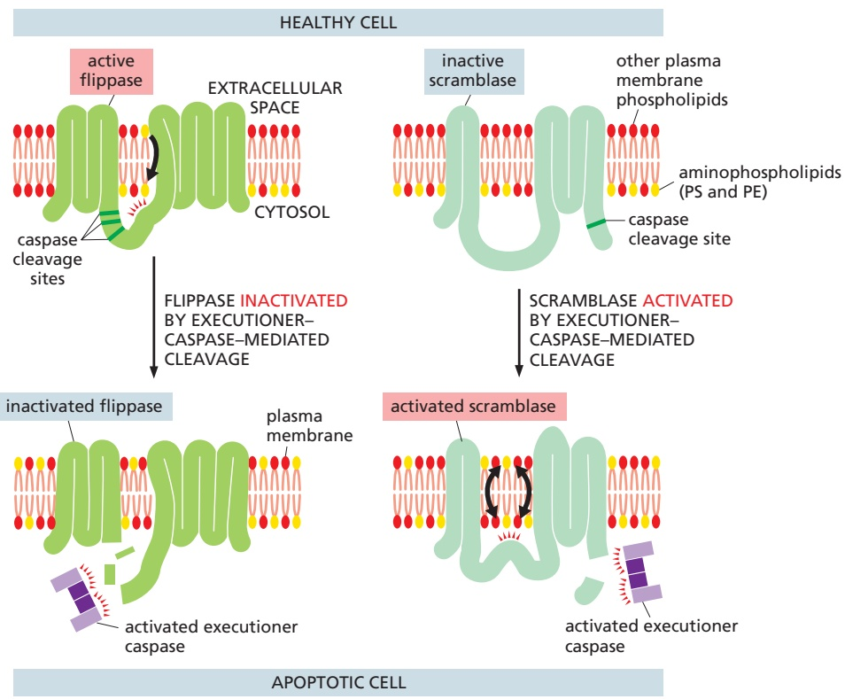
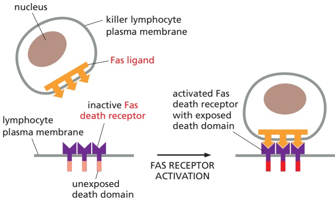
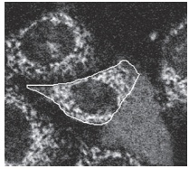
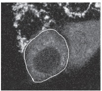

CELL DEATH

1101

Figure 18–14 The two caspase-dependent mechanisms responsible for the accumulation of phosphatidylserine on the surface of apoptotic cells. In healthy cells (top half of figure), an ATP-dependent aminophospholipid flippase (ATP11C) actively flips phosphatidylserine (PS) and phosphatidylethanolamine (PE) from the outer to the inner leaflet of the plasma membrane lipid bilayer, keeping these lipids mainly confined to the inner leaflet. During apoptosis (bottom half MBoC7 n18.104/18.14of figure), activated executioner caspases (caspase-3, caspase-7, or both) cleave and thereby inactivate the ATP11C flippase, preventing its lipid translocation activity; at the same time, the activated executioner caspases cleave and thereby activate a phospholipid scramblase (Xkr8) in the plasma membrane that nonspecifically flips phospholipids between the two lipid leaflets of the membrane, scrambling them between the leaflets. (Although not shown, the ATP11C flippase is tightly associated with a smaller transmembrane protein, CDC50, which is required to chaperone the flippase to the plasma membrane and possibly to assist in the lipid translocation process.)

With the flippase permanently inactivated and the scramblase permanently activated, PS and PE become rapidly and irreversibly exposed on the apoptotic cell surface, where the PS serves as an “eat me” signal to neighboring phagocytic cells. Both of these caspase-dependent mechanisms are required to create this rapid and effective “eat me” signal: if only the flippase were inactivated, it could take a very long time for PS to accumulate in effective amounts on the apoptotic cell surface, because phospholipids rarely flip spontaneously between the two leaflets of a lipid bilayer without an enzyme (such as the scramblase) catalyzing it (see Figure 10–10B). Similarly, if only the scramblase were activated, the active flippase would rapidly return any scrambled PS from the external leaflet to the internal one, thereby removing the PS from the cell surface. Figure 12–39 illustrates the actions of phospholipid scramblases in lipid bilayer synthesis in the ER membrane and of phospholipid scramblases in generating lipid bilayer asymmetry in some other intraceullar membranes. (Modified from S. Nagata et al., Cell Death Differ. 23:952–961, 2016.)

against the individual’s own tissues. The increase in lymphocytes can also lead to lymphocyte cancers called lymphomas.

Indeed, decreased apoptosis makes an important contribution to many types of cancer, because the normal inhibitory controls on apoptosis are often defective in cancer cells. The Bcl2 gene, for example, was first identified in a common form of human lymphoma, in which a chromosome translocation causes excessive production of the anti-apoptotic Bcl2 protein (as mentioned earlier, Bcl2 gets its name from this B cell lymphoma). The increased amount of Bcl2 protein in the lymphocytes that carry the translocation promotes the development of cancer by inhibiting apoptosis, thereby abnormally prolonging the cells’ survival and increasing their number; the increase in Bcl2 also decreases the cells’ sensitivity to anticancer drugs, which often work by causing cancer cells to undergo apoptosis (discussed in Chapter 20).

---

(A)

1102

Chapter 18: Cell Death

Similarly, the gene encoding the tumor suppressor protein p53 is mutated in about 50% of human cancers so that it no longer promotes apoptosis or cell-cycle arrest in response to DNA damage (as discussed in Chapters 17 and 20). The lack of p53 function, therefore, enables the cancer cells to survive and proliferate even when their DNA is damaged; in this way, the cells progressively accumulate more mutations, some of which make the cancer more malignant. As many anticancer drugs induce apoptosis (and cell-cycle arrest) by p53-dependent mechanisms, the loss of p53 function also makes cancer cells less sensitive to these drugs.

If decreased apoptosis contributes to a cancer, then we should be able to treat the cancer with drugs that promote apoptosis. This approach has recently led to the development of small chemicals that block the function of anti-apoptotic Bcl2 family proteins such as Bcl2 and BclxL, by binding with high affinity to the BH3-binding groove of these proteins, in much the same way that pro-apoptotic BH3-only proteins do (see Figure 18–10D). These BH3-mimetic drugs (**Figure 18–15**) activate the intrinsic pathway of apoptosis, increasing the amount of tumor cell death in certain cancers, especially those that depend on particular anti-apoptotic Bcl2 family proteins for their survival.

Most human cancers are carcinomas, which arise in epithelial tissues such as those in the lung, intestinal tract, breast, and prostate (discussed in Chapter 20). Such epithelial cancer cells display many abnormalities in their behavior, including a decreased ability to adhere to the extracellular matrix and to one another at specialized cell–cell junctions. In the next chapter, we discuss these vitally important structures, which are responsible for holding our cells in tissues and organs in their proper place.

## Summary

Animal cells can activate various intracellular death programs and kill themselves when they are seriously damaged or stressed, no longer needed, or are a threat to the organism. In most cases, these deaths occur by apoptosis, in which the cells shrink, the nucleus and cells condense and often fragment, and neighboring phagocytic cells rapidly engulf the cells or fragments before there is any leakage of cytoplasmic contents. Apoptosis is mediated by proteolytic enzymes called caspases, which cleave specific intracellular proteins to kill the cell quickly and neatly.

Apoptotic caspases are present as inactive precursors in almost all nucleated animal cells. The activation of initiator caspases occurs when an apoptotic stimulus activates adaptor proteins, which bring inactive initiator caspase monomers into proximity within large activation complexes, in which the monomers are activated by dimerization. The activated initiator caspase dimers cleave themselves and then activate downstream executioner caspase dimers by cleaving them; the activated executioner caspases then cleave hundreds of target proteins in the cell. The amplifying, irreversible caspase cascade is responsible for all the events of apoptosis, including those that collectively kill the cell and prepare it for being phagocytosed and rapidly digested by a neighboring cell.

Cells use two distinct pathways to activate initiator caspases to trigger apoptosis: the extrinsic pathway is activated by extracellular ligands binding to cell-surface death receptors; the intrinsic pathway is activated from within the cell by developmental signals or stress signals. Each pathway uses its own initiator caspases, adaptor proteins, and activation complexes. In the extrinsic pathway, the death receptors recruit caspase-8 via adaptor proteins to form the activation complex called the DISC. In the intrinsic pathway, intracellular signals induce mitochondrial outer membrane permeabilization (MOMP), which releases soluble proteins from the mitochondrial intermembrane space into the cytosol; released cytochrome c activates the adaptor protein Apaf1, which recruits caspase-9 monomers to form a large activation complex called an apoptosome. Anti-apoptotic and proapoptotic intracellular Bcl2 family proteins interact with one another to tightly control MOMP to ensure that the intrinsic pathway of apoptosis is normally only activated when the death of the cell benefits the animal.

Figure 18–15 A BH3-mimetic drug that specifically inhibits the Bcl2 anti-apoptotic Bcl2 family protein. As shown in Figure 18–10D, one way BH3-only proteins can promote apoptosis is by MBoC7 m18.13/18.15binding to the long BH3-binding groove in anti-apoptotic Bcl2 family proteins such as Bcl2 itself, thereby preventing the protein from blocking apoptosis. (A) The chemical structure of venetoclax, which was designed and synthesized to bind tightly and specifically in the BH3-binding groove of Bcl2. (B) Crystal structure of venetoclax (red) bound to the human Bcl2 protein (yellow). By inhibiting the activity of Bcl2, the drug promotes apoptosis in any cell that depends on this protein for survival, as is the case for cells of human chronic lymphocytic leukemia, for which this drug is in clinical use. (PDB code: 60OK.)

---

PROBLEMS

1103

## PROBLEMS

Which statements are true? Explain why or why not.

18–1 In normal adult tissues, cell death usually balances cell division.

18–2 Mammalian cells that do not have cytochrome c should be resistant to apoptosis induced by DNA damage.

Discuss the following problems.

18–3 Fas ligand is a homotrimeric plasma membrane protein on killer lymphocytes that binds to a homotrimeric death receptor, Fas, on the surface of target cells, including some lymphocytes (**Figure Q18–1**). The clustering of trimeric Fas by the binding of clusters of Fas ligand alters the conformation of Fas so that it binds an adaptor protein, which then recruits and activates caspase-8, triggering a caspase cascade that leads to apoptotic cell death.

Figure Q18–1 The binding of trimeric Fas ligand to Fas (Problem 18–3). Although not shown, at least two trimeric Fas ligands have to bind to and cluster at least two trimeric Fas receptors to activate the pathway; for clarity, only a single copy of the ligand and receptor is shown.

In humans, the autoimmune lymphoproliferative syndrome (ALPS) is associated with dominant mutations in Fas that include point mutations and C-terminal truncations. In individuals that are heterozygous for such mutations, some lymphocytes do not die at their normal rate and accumulate in abnormally large numbers, causing a variety of clinical problems. In contrast to these patients, individuals heterozygous for mutations that eliminate Fas expression entirely do not have these clinical problems.

Assuming that the normal and dominant forms of Fas are expressed to the same level and assemble randomly into trimers, what fraction of Fas–Fas ligand complexes on a lymphocyte from a heterozygous ALPS patient would be expected to be composed entirely of normal Fas subunits? Does your calculation suggest an explanation for why individuals heterozygous for expressed Fas mutants have clinical problems, whereas heterozygous individuals with unexpressed Fas mutants have no clinical problems?

18–4 In contrast to their similar brain abnormalities, newborn mice deficient in Apaf1 or caspase-9 have distinctive abnormalities in their paws. Apaf1-deficient mice fail to eliminate the webs between their developing digits, whereas caspase-9–deficient mice have normally formed digits (**Figure Q18–2**). If Apaf1 and caspase-9 function in the same apoptotic pathway, how is it possible for these deficient mice to differ in web-cell apoptosis?

Figure Q18–2 Appearance of paws in Apaf1–/– and Casp9–/– newborn mice relative to normal newborn mice (Problem 18–4). (From H. Yoshida et al., Cell 94:739–750, 1998. With permission from Elsevier.)

Apaf1

Casp9

18–5 When human cancer cells are exposed to ultraviolet (UV) light at 90 mJ/cm2, most of the cells undergo apoptosis within 24 hours. Release of cytochrome c from mitochondria can be detected as early as 6 hours after exposure of a population of such cells to UV light, and it continues to increase for more than 10 hours thereafter. Does this mean that individual cells slowly release their cytochrome c over this time period? Or, alternatively, do individual cells release their cytochrome c rapidly but with different cells being triggered at variable times?

To answer this fundamental question, you have fused the gene for green fluorescent protein (GFP) to the gene for cytochrome $c _ { r }$ so that you can observe the behavior of individual cells by confocal fluorescence microscopy. In cells that are expressing the cytochrome c– GFP fusion protein, fluorescence shows the punctate pattern typical of mitochondrial proteins. You then irradiate these cells with UV light and observe individual cells for changes in the punctate pattern. Two such cells (outlined in white) are shown in **Figure Q18–3A and B**. Release of

(A)

10:09

(B)

17:10

10:15

17:18

Figure Q18–3 Analysis of cytochrome c–GFP release from mitochondria of individual cells by time-lapse video fluorescence microscopy (Problem 18–5). (A) Cells observed for 6 minutes, 10 hours after UV irradiation. (B) Cells observed for 8 minutes, 17 hours after UV irradiation. One cell in A and one in B, each outlined in white, have released their cytochrome c–GFP during the time frame of the observation, which is shown as hours:minutes below each panel. (From J.C. Goldstein et al., Nat. Cell Biol. 2:156–162, published 2000 by. / . Nature Publishing Group. Reproduced with permission from SNCSC.)

---

1104 Chapter 18: Cell Death

cytochrome c–GFP is detected as a change from a punctate to a diffuse pattern of fluorescence characteristic of a cytosolic protein. Times after UV exposure are indicated as hours:minutes below the individual panels.

Which model for cytochrome c release do these observations support? Explain your reasoning.

18–6 Imagine that you could microinject cytochrome c into the cytosol of wild-type mammalian cells, or into the cytosol of cells that were defective for the process of mitochondrial outer membrane permeabilization (MOMP). Would you expect the injected wild-type cells or the injected MOMP-defective cells to undergo apoptosis? Explain your reasoning.

18–7 Which one of the following statements about Bcl2 family members is correct?

A. Bak is pro-apoptotic and Bax is anti-apoptotic.

B. Bax is pro-apoptotic and BclxL is anti-apoptotic.

C. Bcl2 is pro-apoptotic and Bak is anti-apoptotic.

18–8 One important role of Fas and Fas ligand is to mediate the elimination of tumor cells by killer lymphocytes. In a study of 35 primary lung and colon tumors, half the tumors were found to have amplified and overexpressed a gene for a secreted protein that binds to Fas ligand. How do you suppose that overexpression of this protein might contribute to the survival of these tumor cells? Explain your reasoning.

D. BclxL is pro-apoptotic and Bcl2 is anti-apoptotic.

## REFERENCES

Adams JM & Cory S (2017) The BCL-2 arbiters of apoptosis and their growing role as cancer targets. Cell Death Differ. 25, 27–36.

Birkinshaw RW & Czabotar PE (2017) The BCL-2 family of proteins and mitochondrial outer membrane permeabilization. Semin. Cell Dev. Biol. 72, 152–162.

Czabotar PE, Lessene G, Strasser A & Adams JM (2014) Control of apoptosis by the BCL-2 protein family: implications for physiology and therapy. Nat. Rev. Mol. Cell Biol. 5, 49–63.

Danial NN & Korsmeyer SJ (2004) Cell death: critical control points. Cell 116, 205–219.

Datta SR, Ranger AM, Lin MZ . . . Greenberg ME (2002) Survival factor-mediated BAD phosphorylation raises the mitochondrial threshold for apoptosis. Dev. Cell 3, 631–643.

Davies AM (1996) The neurotrophic hypothesis: where does it stand? Philos. Trans. R. Soc. Lond. B Biol. Sci. 351, 389–394.

Dorstyn L, Akey WA & Kumar S (2018) New insights into apoptosome structure and function. Cell Death Differ. 25, 1194–1208.

Ellis RE, Yuan JY & Horvitz HR (1991) Mechanisms and functions of cell death. Annu. Rev. Cell Biol. 7, 663–698.

Fu T-M, Li Y, Lu A . . . Wu H (2016) Cryo-EM structure of caspase-8 tandem DED filament reveals assembly and regulation mechanisms of the death-inducing signaling complex. Mol. Cell 64, 236–250.

Galluzzi L, Vitale I, Aaronson SA . . . Kroemer G (2018) Molecular mechanisms of cell death: recommendations of the Nomenclature Committee on Cell Death. Cell Death Differ. 25, 486–541.

Green DR (2018) Cell Death: Apoptosis and Other Means to an End, 2nd ed. Cold Spring Harbor, NY: Cold Spring Harbor Laboratory Press.

Ha HJ, Chun HL & Park HH (2020) Assembly of platforms for signal transduction in the new era: dimerization, helical filament assembly, and beyond. Exp. Mol. Med. 52, 356–366.

Jiang X & Wang X (2004) Cytochrome C-mediated apoptosis. Annu. Rev. Biochem. 73, 87–108.

Jost PJ, Grabow S, Gray D . . . Kaufmann T (2009) XIAP discriminates between type I and type II FAS-induced apoptosis. Nature 460, 1935–1039.

Julien O & Wells JA (2017) Caspases and their substrates. Cell Death Differ. 24, 1380–1389.

Jullien M, Gomez-Bougie, Chiron D & Touzeau C (2020) Restoring apoptosis with BH3 mimetics in mature B-cell malignancies. Cells 9, 717.

Kale J, Osterlund EJ & Andrews DW (2018) BCL-2 family proteins: changing partners in the dance towards death. Cell Death Differ. 25, 65–80.

Kalkavan H & Green DR (2018) MOMP, cell suicide as a BCL-2 family business. Cell Death Differ. 25, 46–55.

Kerr JF, Wylie AH & Currie AR (1972) Apoptosis: a basic biological phenomenon with wide-ranging implications in tissue kinetics. Br. J. Cancer 26, 239–257.

Mandal R, Barron JC, Kostova I . . . Strebhardt K (2020) Caspase-8: the double-edged sword. Biochim. Biophys. Acta Rev. Cancer 1873, 1–18.

Nagata S (2005) DNA degradation in development and programmed cell death. Annu. Rev. Immunol. 23, 853–875.

Nagata S, Suzuki J & Fujii T (2016) Exposure of phosphatidylserine on the cell surface. Cell Death Differ. 23, 952–961.

Silke J & Vince J (2017) IAPs and cell death. Curr. Top. Microbiol. Immunol. 403, 96–117.

Voss AK & Strasser A (2020) The essentials of developmental apoptosis. F1000Res. 9, F1000 Faculty Rev-148.