CELLS IN THEIR SOCIAL CONTEXT

# Cell Junctions and the Extracellular Matrix

Of all the social interactions between cells in a multicellular organism, the most fundamental are those that hold the cells together. Cells may be linked by direct interactions or they may be held together within the extracellular matrix, a complex network of proteins and polysaccharide chains that the cells secrete. By one means or another, cells must cohere if they are to form an organized multicellular structure that can withstand and respond to the various external forces that try to pull it apart.

Mechanisms of cell cohesion govern the architecture of tissues and organs— their shape, strength, and the arrangement of different cell types. The making and breaking of the attachments between cells and the modeling of the extracellular matrix govern the way cells move within the organism, guiding them as the body grows, develops, and repairs itself. Attachments to other cells and to the extracellular matrix control the orientation and behavior of the cell’s cytoskeleton, thereby allowing cells to sense and respond to changes in the mechanical features of their environment. Thus, the apparatus of cell junctions and the extracellular matrix is critical for every aspect of the organization, function, and dynamics of multicellular structures. Defects in this apparatus underlie an enormous variety of diseases.

The key features of cell junctions and the extracellular matrix are best illustrated by considering two broad categories of tissues that are found in all animals (**Figure 19–1**). **Connective tissues**, such as bone or tendon, are formed from an extracellular matrix produced by cells that are distributed sparsely in the matrix. It is the matrix—rather than the cells—that bears most of the mechanical stress to which the tissue is subjected. Cell–matrix junctions link connective tissue cells to the matrix, allowing the cells to move through the matrix and monitor changes in its mechanical properties.

In **epithelial tissues**, such as the lining of the gut or the epidermal covering of the skin, cells are tightly bound together into sheets called **epithelia**. The extracellular matrix is less pronounced, consisting mainly of a thin mat called the basal lamina (or basement membrane) underlying the sheet. Within the epithelium, cells are attached to each other directly by cell–cell junctions, where cytoskeletal filaments are anchored, transmitting stresses across the interiors of the cells, from

C HAP T E R

19

IN THIS CHAPTER

Cell–Cell Junctions

The Extracellular Matrix of Animals

Cell–Matrix Junctions

The Plant Cell Wall

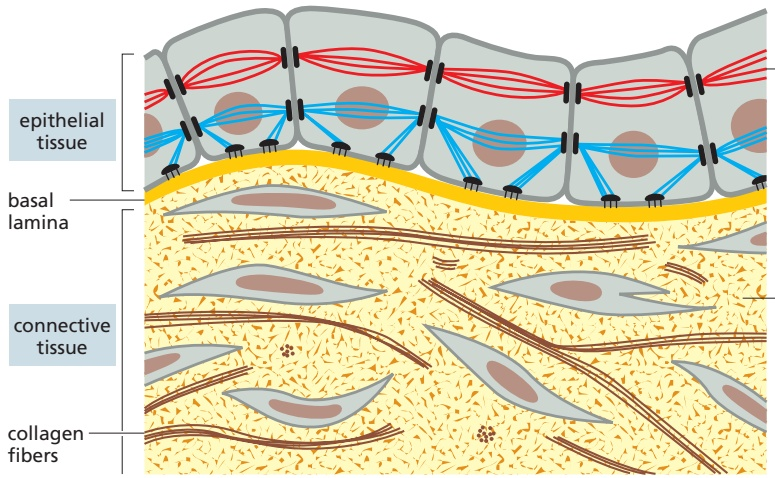

mechanical stresses are transmitted from cell to cell by cytoskeletal filaments anchored to cell–matrix and cell–cell adhesion sites

extracellular matrix directly bears mechanical stresses of tension and compression

adhesion site to adhesion site. The cytoskeletons of epithelial cells are also linked to the basal lamina through cell–matrix junctions.

**Figure 19–2** provides a closer view of epithelial cells to illustrate the major types of cell–cell and cell–matrix junctions that we will discuss in this chapter. The diagram shows the typical arrangement of junctions in a simple columnar epithelium such as the lining of the small intestine of a vertebrate. Here, a single layer of tall cells stands on a basal lamina, with the cells’ uppermost surface, orMBoC7 m19.01/19.01 **apical** surface, free and exposed to the extracellular medium. On their sides, or lateral surfaces, the cells make junctions with one another. Two types of cell–cell junctions link the cytoskeletons of adjacent cells: **adherens junctions** are connected to actin filaments, and **desmosomes** are linked to intermediate filaments. Because these junctions anchor the cells strongly to each other and thus help the tissue withstand mechanical stress, they are sometimes called **anchoring junctions**. At the **basal** surface of the cells, two additional types of anchoring junctions link the cytoskeleton of the epithelial cell to the basal lamina: actin-linked cell– matrix junctions anchor actin filaments to the matrix, while hemidesmosomes anchor intermediate filaments to it.

Figure 19–1 How animal cells are bound together in two major tissue types. In connective tissue, the extracellular matrix is the main stress-bearing component. In epithelial tissue, the cytoskeleton of the cell is the main stress-bearing component: the cytoskeletons of cells are linked from cell to cell by adhesive junctions and transmit mechanical stresses across the interiors of the cells. Cell–matrix attachments bond epithelial tissue to the connective tissue beneath it.

Figure 19–2 A summary of the various cell junctions found in a vertebrate epithelial cell. In the apical region of the cell, the relative positions of the junctions are the same in nearly all vertebrate epithelia. The tight junction occupies the most apical position, followed by the adherens junction (adhesion belt) and then by a special parallel row of desmosomes; together, these three junctions form a structure called a junctional complex. Gap junctions and additional desmosomes are less regularly organized. Two types of cell–matrix anchoring junctions tether the basal surface of the cell to the basal lamina. The drawing is based on epithelial cells of the small intestine.

Figure 19–3 Transmembrane adhesion proteins link the cytoskeleton to extracellular structures. The external linkage may be either to other cells (cell–cell junctions, mediated typically by cadherins) or to extracellular matrix (cell–matrix junctions, mediated typically by integrins). The internal linkage to the cytoskeleton is generally indirect, via intracellular adaptor proteins, to be discussed later.

Two other types of cell–cell junctions are shown in Figure 19–2. Tight junctions hold the cells closely together near the apical surface, sealing the gap between the cells and thereby preventing molecules from leaking across the epithelium. Near the basal end of the cells are channel-forming junctions, called gap junctions, that create passageways linking the cytoplasms of adjacent cells.

Each of the four major anchoring junction types depends on **transmembrane adhesion proteins** that span the plasma membrane, with one end linking to the cytoskeleton inside the cell and the other end linking to other structures outside it (**Figure 19–3**). These cytoskeleton-linked transmembrane proteins fall neatly into two superfamilies, corresponding to the two basic kinds of external attachment. Proteins of the **cadherin** superfamily chiefly mediate attachment of cell to cell (**Movie 19.1**). Proteins of the **integrin** superfamily chiefly mediate attachment of cells to matrix. There is specialization within each family: some cadherins link to actin and form adherens junctions, while others link to intermediate filaments and form desmosomes; likewise, some integrins link to actin and form actinlinked cell–matrix junctions, while others link to intermediate filaments and form hemidesmosomes (**Table 19–1**).

<table><tbody><tr><td colspan="5">TABLE 19-1 Anchoring Junctions</td></tr><tr><td>Junction</td><td>Transmembrane adhesion protein</td><td>Extracellular ligand</td><td>Intracellular cytoskeletal attachment</td><td>Intracellular adaptor proteins</td></tr><tr><td colspan="5">Cell-cell</td></tr><tr><td>Adherens junction</td><td>Classical cadherins</td><td>Classical cadherin on neighboring cell</td><td>Actin filaments</td><td>α-Catenin, β-catenin, p120-catenin, vinculin</td></tr><tr><td>Desmosome</td><td>Nonclassical cadherins (desmoglein, desmocollin)</td><td>Desmoglein and desmocollin on neighboring cell</td><td>Intermediate filaments</td><td>Plakoglobin, plakophilin, desmoplakin</td></tr><tr><td colspan="5">Cell-matrix</td></tr><tr><td>Actin-linked cell-matrix junction</td><td>Integrin</td><td>Extracellular matrix proteins</td><td>Actin filaments</td><td>Talin, kindlin, vinculin, paxillin, focal adhesion kinase (FAK), numerous others</td></tr><tr><td>Hemidesmosome</td><td>α6β4 integrin, type XVII collagen</td><td>Extracellular matrix proteins</td><td>Intermediate filaments</td><td>Plectin, BP230</td></tr></tbody></table>

There are some exceptions to these rules. Some integrins, for example, mediate cell–cell rather than cell–matrix attachment. Moreover, there are other types of cell adhesion molecules that can provide transient cell–cell attachments more flimsy than anchoring junctions but sufficient to stick cells together in special circumstances.

We begin the chapter with a discussion of the major forms of cell–cell junctions. We then consider in turn the extracellular matrix of animals, the structure and function of integrin-mediated cell–matrix junctions, and, finally, the plant cell wall, a special form of extracellular matrix.

## CELL–CELL JUNCTIONS

Cell–cell junctions come in many forms and can be regulated by a variety of mechanisms. The best understood and most common are the two types of cell– cell anchoring junctions, which employ cadherins to link the cytoskeleton of one cell with that of its neighbor. Their primary function is to resist the external forces that pull cells apart. The epithelial cells of your skin, for example, must remain tightly linked when they are stretched, pinched, or poked. Cell–cell anchoring junctions must also be dynamic and adaptable, so that they can be altered or rearranged when tissues are remodeled or repaired or when there are changes in the forces acting on them.

In this section, we focus primarily on the cadherin-based anchoring junctions. We then briefly describe tight junctions and gap junctions. Finally, we consider the more transient cell–cell adhesion mechanisms employed by some cells in the bloodstream.

## Cadherins Form a Diverse Family of Adhesion Molecules

Cadherins are present in all multicellular animals. They are also present in the choanoflagellates, which are closely related to animals but can exist either as free-living unicellular organisms or as multicellular colonies. Other eukaryotes, including fungi and plants, lack cadherins, and they are also absent from bacteria and archaea. Cadherins therefore seem to be part of the essence of what it is to be an animal.

The cadherins take their name from their dependence on $\mathrm { C a ^ { 2 + } }$ ions: removing $\mathrm { C a ^ { 2 + } }$ from the extracellular medium causes adhesions mediated by cadherins to come apart. The first three cadherins to be discovered were named according to the main tissues in which they were found: E-cadherin is present on many types of epithelial cells; N-cadherin on nerve, muscle, and lens cells; and P-cadherin on cells in the placenta and epidermis. All are also found in other tissues. These and other **classical cadherins** are closely related in sequence throughout their extracellular and intracellular domains.

There are also a large number of **nonclassical cadherins** that are more distantly related in sequence, with more than 50 expressed in the brain alone. The non-classical cadherins include proteins with known adhesive function, such as the diverse protocadherins found in the brain, and the desmocollins and desmogleins that form desmosomes (see Table 19–1). Together, the classical and nonclassical cadherin proteins constitute the **cadherin superfamily** (**Figure 19–4**), with more than 180 members in humans.

## Cadherins Mediate Homophilic Adhesion

Anchoring junctions between cells are usually symmetrical: if the linkage is to actin in the cell on one side of the junction, it will be to actin in the cell on the other side. In fact, the binding between cadherins is generally **homophilic** (liketo-like; **Figure 19–5**): cadherin molecules of a specific subtype on one cell bind to cadherin molecules of the same or closely related subtype on adjacent cells.

The spacing between the cell membranes at an anchoring junction is precisely defined and depends on the structure of the participating cadherin molecules. All the members of the superfamily, by definition, have an extracellular portion consisting of several copies of the extracellular cadherin (EC) domain. Homophilic binding occurs at the N-terminal tips of the cadherin molecules—the cadherin domains that lie farthest from the membrane. These terminal domains each form a knob and a nearby pocket, and the cadherin molecules protruding from oppo-MBoC7 m19.04/19.4 site cell membranes bind by insertion of the knob of one domain into the pocket of the other (**Figure 19–6A**).

HETEROPHILIC BINDING

Figure 19–4 The cadherin superfamily. The diagram shows some of the diversity among cadherin superfamily members. These proteins all have extracellular portions containing multiple copies of the extracellular cadherin domain (green ovals). In the classical cadherins of vertebrates there are 5 of these domains, and in desmogleins and desmocollins there are 4 or 5, but some nonclassical cadherins have more than 30. The intracellular portions are more varied, reflecting interactions with a wide variety of intracellular ligands, including signaling molecules and adaptor proteins that connect the cadherin to the cytoskeleton. In some cases, such as T-cadherin, a transmembrane domain is not present, and the protein is attached to the plasma membrane by a glycosylphosphatidylinositol (GPI) anchor. The differently colored motifs in Fat, Flamingo, and Ret represent conserved domains that are also found in other protein families.

Each cadherin domain forms a more-or-less rigid unit, joined to the next cadherin domain by a hinge. Ca2+ ions bind to sites near each hinge and prevent it from flexing, so that the whole string of cadherin domains behaves as a rigid and slightly curved rod. When Ca2+ is removed, the hinges can flex, and the structure becomes floppy (**Figure 19–6B**). At the same time, the conformation at the N-terminus is thought to change slightly, weakening the binding affinity for the matching cadherin molecule on the opposite cell.

Unlike receptors for soluble signaling molecules, which bind their specific ligand with high affinity, cadherins (and most other cell–cell adhesion proteins) typically bind to their partners with relatively low affinity. Strong attachments result from the formation of many such weak bonds in parallel. When binding to oppositely oriented partners on another cell, cadherin molecules are often clustered side-to-side with many other cadherin molecules on the same cell (**Figure 19–6C**). The strength of this junction is far greater than that of any individual intermolecular bond, and yet regulatory mechanisms can easily disassemble the junction by separating the molecules sequentially, just as two pieces of fabric can be joined strongly by Velcro and yet easily peeled apart from the sides. A similar “Velcro principle” also operates at cell–cell and cell–matrix adhesions formed by other types of transmembrane adhesion proteins.

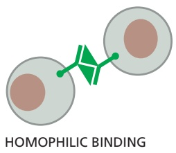

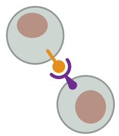

Figure 19–5 Homophilic versus heterophilic binding. Cadherins in general bind homophilically; some other cell adhesion molecules, discussed later, bind heterophilically.

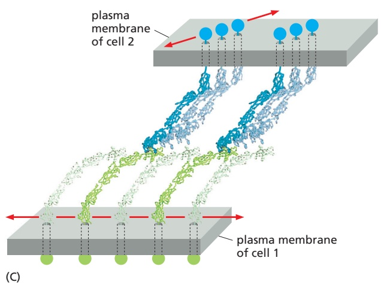

Figure 19–6 Cadherin structure and function. (A) The extracellular region of a classical cadherin contains five copies of the extracellular cadherin domain (see Figure 19–4) separated by flexible hinge regions. At a typical extracellular $\tilde { \mathrm { C a } ^ { 2 + } }$ concentration (>1 mM), $\mathrm { C a ^ { 2 + } }$ ions (red dots) bind in the neighborhood of each hinge, preventing it from flexing. To generate cell– cell adhesion, the cadherin domain at the N-terminal tip of one cadherin molecule binds the cadherin domain at the N-terminal tip of a cadherin molecule on another cell. The structure was determined by x-ray diffraction of the crystallized C-cadherin extracellular region. The two cadherins shown here, although identical, are colored differently for clarity. (B) If the extracellular $\mathrm { C a ^ { 2 + } }$ concentration is decreased artificially in an experiment, $\mathrm { C a ^ { 2 - } }$ + binding decreases. As a result, increased flexibility in the hinge regions results in a floppier molecule that is no longer oriented correctly to interact with a cadherin on another cell—and adhesion fails. (C) At a typical cell–cell junction, an organized array of cadherin molecules functions like Velcro to hold cells together. Cadherins on the same cell are thought to be coupled by side-to-side interactions between their N-terminal head regions, resulting in a linear array like the alternating green and light green cadherins on the lower cell shown here. These arrays are thought to interact with perpendicular arrays on an adjacent cell (blue cadherin molecules, top cell). Multiple perpendicular arrays on both cells interact to form a tight-knit mat of cadherin proteins. (A, based on T.J. Boggon et al., Science 296:1308–1313, 2002; C, based on O.J. Harrison et al., Structure 19:244–256, 2011.)

## Cadherin-dependent Cell–Cell Adhesion Guides the Organization of Developing Tissues

Cadherins form specific homophilic attachments, explaining why there are so many different family members. Cadherins are not like glue, making cell surfacesMB C7 19.06/19.06 generally sticky. Rather, they mediate highly selective recognition, enabling cells of a similar type to stick together and to stay segregated from other types of cells.

Selectivity in the way that animal cells consort with one another was first demonstrated in the 1950s, long before the discovery of cadherins, in experiments in which amphibian embryos were dissociated into single cells. These cells were then mixed up and allowed to reassociate. Remarkably, the dissociated cells often reassembled into structures resembling those of the original embryo (**Figure 19–7**).

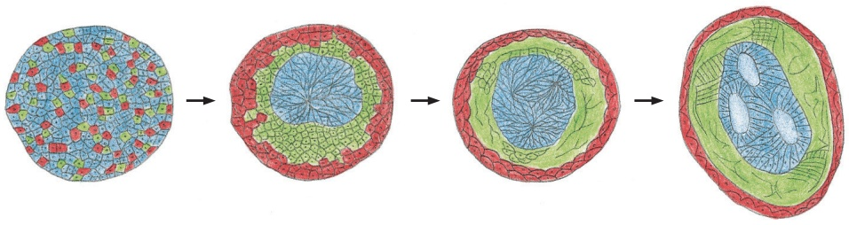

Figure 19–7 Sorting out. Cells from different layers of an early amphibian embryo will sort out according to their origins. In the classical experiment shown here, mesoderm cells (green), neural plate cells (blue), and epidermal cells (red) have been disaggregated and then reaggregated in a random mixture. They sort out into an arrangement reminiscent of a normal embryo, with a “neural tube” internally, epidermis externally, and mesoderm in between. (Modified from P.L. Townes and J. Holtfreter, J. Exp. Zool. 128:53–120, 1955. With permission from John Wiley & Sons.)

Figure 19–8 Changing patterns of cadherin expression during construction of the vertebrate nervous system. The figure shows cross sections of the early chick embryo, as the neural tube detaches from the ectoderm and then as neural crest cells detach from the neural tube. (A, B) Immunofluorescence micrographs showing the developing neural tube labeled with antibodies against (A) E-cadherin (blue) and (B) N-cadherin (yellow). (C) As the patterns of gene expression change, the different groups of cells segregate from one another according to the cadherins they express. (Micrographs courtesy of Miwako Nomura and Masatoshi Takeichi.)

These experiments, together with numerous more recent experiments, reveal that selective cell–cell recognition systems make cells of the same differentiated tissue preferentially adhere to one another.

Cadherins play a crucial part in these cell-sorting processes. The appearance and disappearance of specific cadherins correlate with steps in embryonic development where cells regroup and change their contacts to create new tissue structures. In the vertebrate embryo, for example, changes in cadherin expression are seen when the neural tube forms and pinches off from the overlying ectoderm: neural tube cells lose E-cadherin and acquire other cadherins, including N-cadherin, while the cells in the overlying ectoderm continue to express E-cadherin (**Figure 19–8A and B**). Then, when the neural crest cells migrate away from the neural tube, these cadherins become scarcely detectable, and another cadherin (cadherin 7) appears that helps hold the migrating cells together as loosely associated cell groups (**Figure 19–8C**). Finally, when some of the neural crest cells aggregate to form a ganglion, they switch on expression of N-cadherin again. If N-cadherin is artificially overexpressed in the emerging neural crest cells, the cells fail to escape from the neural tube.

Studies with cultured cells further support the importance of homophilic cadherin binding in tissue segregation. In a line of cultured fibroblasts called L cells, for example, cadherins are not expressed and the cells do not adhere to one another. When these cells are transfected with DNA encoding E-cadherin, E-cadherins on one cell bind to E-cadherins on another, resulting in cell–cell adhesion. If L cells expressing different cadherins are mixed together, they sort out and aggregate separately, indicating that different cadherins preferentially bind to their own type (**Figure 19–9A**), mimicking what happens when cells derived from tissues that express different cadherins are mixed together. A similar segregation of cells occurs if L cells expressing different amounts of the same cadherin are mixed together (**Figure 19–9B**). It therefore seems likely that both qualitative and quantitative differences in the expression of cadherins have a role in organizing tissues.

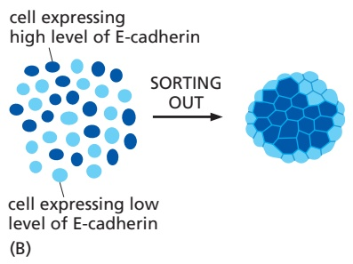

Figure 19–9 Cadherin-dependent cell sorting. Cells in culture can sort themselves out according to the type and level of cadherins they express. This can be visualized by labeling different MBoC7 m19.09/19.09populations of cells with dyes of different colors. (A) Cells expressing N-cadherin sort out from cells expressing E-cadherin. (B) Cells expressing high levels of E-cadherin sort out from cells expressing low levels of E-cadherin. The cells expressing high levels adhere more strongly and congregate internally.

## Assembly of Strong Cell–Cell Adhesions Requires Changes in the Actin Cytoskeleton

In their mature form, adherens junctions are enormous protein complexes containing hundreds to thousands of cadherin molecules, packed into dense, regular arrays that are linked on the extracellular side by lateral interactions between cadherin domains (see Figure 19–6C). The assembly of these junctions over a large surface area is not simply a matter of adding more cadherins to an initial attachment site, but also requires changes in the underlying actin cytoskeleton. Most important, strong adhesion requires a decrease in cortical tension at the site of the adhesion.

Cortical tension in a cell is much like the surface tension of a water droplet. In water, binding between water molecules at the air–water interface pulls the surface inward, resulting in a spherical shape that resists disruption by other surfaces that do not interact with the water molecules (**Figure 19–10A**). Similarly, an unattached cell in suspension assumes a spherical shape because of cortical tension, which results from the contractile activity generated by bundles of actin and non-muscle myosin II at the cell cortex, just beneath the plasma membrane (**Figure 19–10B**). This cortical tension is so strong that when two cells initially interact through binding of cadherins on their surfaces, cortical tension prevents the spreading of the adhesion surface—and the cells interact at a single point.

Assembly of a large adhesion surface therefore depends on local reduction of cortical tension, which is achieved by inhibition of cortical actin–myosin fiber formation. These changes depend in part on two small GTPases called Rac and Rho. As we discussed in Chapter 16 (see Figure 16–75), signals generated by these GTPases govern local actin filament behavior: Rho generally promotes the formation of actin–myosin stress fibers at the cell cortex, while Rac inhibits the formation of these fibers and instead promotes branched actin networks. When two epithelial precursor cells first interact at a small cluster of cadherin linkages, the cadherins generate intracellular signals that promote local activation of Rac and inhibition of Rho. The result is disassembly of actin–myosin fibers and loss of local cortical tension—which then allows further cadherin recruitment to spread the adhesion to a larger surface area (**Figure 19–10C**). Rac activation has the added benefit of stimulating local actin protrusions from the cell, which also contributes to expansion of the junction. The implications of this mechanism are clear: the development of strong adhesions depends not only on the cell adhesion molecules themselves but also on the associated regulatory systems that govern actin behavior.

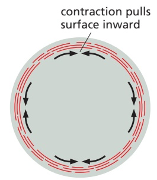

Figure 19–10 Local changes in cortical tension help promote the initial formation of an adherens junction. (A) Surface tension of a water droplet results from binding among water molecules at the air–water interface, pulling the surface inward. (B) In an unattached cell, the contraction of actin–myosin bundles at the cell cortex (red) creates cortical tension, drawing the surface inward. (C) When two epithelial cell precursors first interact, small cadherin clusters (green) assemble at the contact site. Cortical tension prevents this initial interaction site from spreading. The cadherins generate local signals to inhibit the GTPase Rho and activate the GTPase Rac, leading to localized disassembly of actin–myosin fibers, loss of cortical tension, and formation of branched actin networks and cell protrusions––all of which allow the recruitment of more cadherins and the spreading of the cell–cell junction over a greater surface area. In the long term (not shown), the large adherens junction inhibits Rac and stimulates Rho, thereby promoting formation of local actin–myosin fibers that interact with the cadherins (see Figure 19–11).

Eventually, after large numbers of cadherin molecules are aligned at a nascent adherens junction, Rac is inhibited and Rho is activated, which promotes the assembly of linear, contractile actin filament bundles that link the adherens junction to the actin cytoskeleton. These new linkages pull the junction inward, generating tension that stimulates further actin recruitment and expansion of the junction, as we describe in the next sections.

## Catenins Link Classical Cadherins to the Actin Cytoskeleton

The extracellular domains of cadherins mediate homophilic binding at adherens junctions. The intracellular domains of typical cadherins, including all classical and some nonclassical ones, interact with filaments of the cytoskeleton: actin at adherens junctions and intermediate filaments at desmosomes (see Table 19–1). These cytoskeletal linkages are essential for efficient cell–cell adhesion, as cadherins that lack their cytoplasmic domains cannot stably hold cells together.

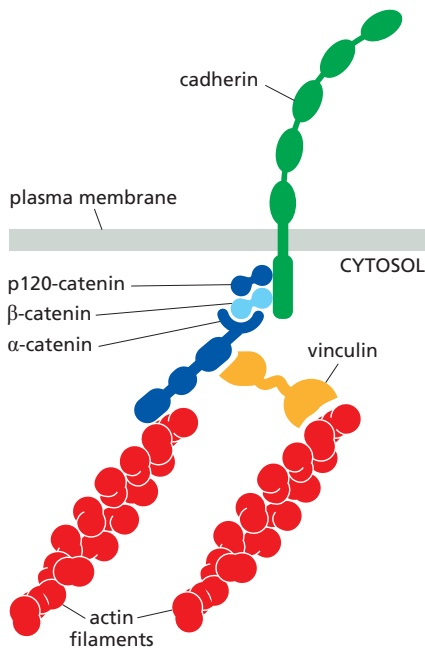

The linkage of cadherins to the cytoskeleton depends on adaptor proteins that assemble on the cytoplasmic tail of the cadherin. At adherens junctions, the cadherin tail binds two such proteins, b-catenin and a distant relative called p120-catenin; a third protein called a-catenin interacts with β-catenin and recruits other proteins to provide a dynamic linkage to actin filaments (**Figure 19–11**). At desmosomes, cadherins are linked to intermediate filaments through other adaptor proteins, including a β-catenin–related protein called plakoglobin, as we discuss later.

## Adherens Junctions Respond to Tension from Inside and Outside the Tissue

Figure 19–11 The linkage of classical cadherins to actin filaments. The cadherins are coupled indirectly to actin filaments through an adaptor proteinBoC7 m19.10/19.11 complex containing p120-catenin, β-catenin, and α-catenin. Other proteins, including vinculin, associate with α-catenin and help provide the linkage to actin. β-Catenin has a second, and very important, function in intracellular signaling, as we discuss in Chapter 15 (see Figure 15–61). For clarity, this diagram does not show the cadherin of the adjacent cell in the junction.

The protein complexes that mediate junctions either between cells or between cells and the extracellular matrix are dynamic machines that have the remarkable ability to sense mechanical stresses and generate biochemical signals that lead to an appropriate response. We call this mechanotransduction.

As we discussed in the previous sections, adherens junctions are linked through catenins to contractile bundles of actin and myosin II. These junctions are therefore subjected to pulling forces generated by the attached actin. The pulling forces are important for junction assembly and maintenance: inhibition of myosin activity, for example, results in the disassembly of many adherens junctions. Furthermore, the contractile forces acting on a junction in one cell are balanced by contractile forces at the junction of the neighboring cell, so that no cell pulls others toward it.

Adherens junctions sense the forces acting on them and modify local actin and myosin behavior to balance the forces on both sides of the junction. Evidence for these mechanisms comes from studies of pairs of cultured mammalian cells connected by adherens junctions. If contractile activity in one cell is increased experimentally, the adherens junctions linking the two cells increase in size, and the contractile activity of the second cell increases to match that of the first— resulting in a balance of forces across the junction. These and other experiments reveal that adherens junctions are not simply passive sites of protein–protein binding but are tension sensors that regulate their behavior in response to changing mechanical conditions.

Mechanotransduction at cell–cell junctions is thought to depend, at least in part, on proteins in the cadherin complex that alter their shape when stretched by tension. The protein α-catenin, for example, is stretched from a folded to an extended conformation when contractile activity increases at the junction. The unfolding exposes a cryptic binding site for another protein, vinculin, which promotes the recruitment of more actin to the junction (**Figure 19–12**). It is likely that these changes also lead to local regulation of the small GTPases that control actin and myosin behavior. By mechanisms such as this, pulling on a junction alters local actin behavior to make the junction stronger. Furthermore, as noted above, pulling on a junction in one cell will increase the contractile force generated in the attached cell.

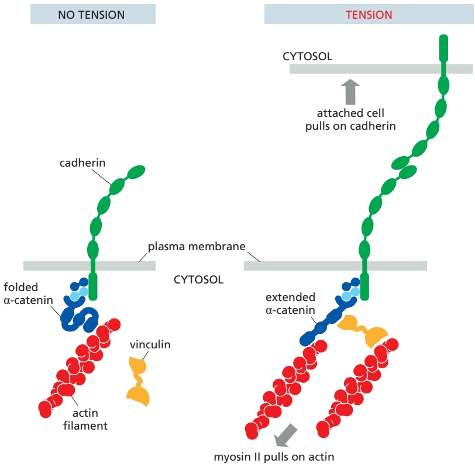

Figure 19–12 Mechanotransduction in an adherens junction. Cell–cell junctions are able to sense increased tension and respond by strengthening their actin linkages. When actin filaments are pulled from within the cell by non-muscle myosin II, the resulting force unfolds a domain in α-catenin, thereby exposing an otherwise hidden binding site for the adaptor protein vinculin. Vinculin then promotes additional actin recruitment, strengthening the linkages between the junction and the cytoskeleton.

Because all the cells in an epithelium are mechanically linked through their cell–cell junctions and cytoskeletons, mechanotransduction can also work over long distances. In the developing wing of Drosophila, for example, contraction of cells in the hinge of the wing results in mechanical stresses that spreadMBoC7 m19.12/19.12 throughout the wing, triggering changes in cell movement and orientation that are important for wing formation. It is likely that tension sensors throughout the tissue detect shifts in mechanical stress and trigger a molecular response. Because tension spreads quickly through all connected cells in a tissue, it provides an unusually rapid and effective signal for modifying cell behavior throughout the tissue.

## Tissue Remodeling Depends on the Coordination of Actin-mediated Contraction with Cell–Cell Adhesion

Adherens junctions are an essential part of the machinery for modeling the shapes of multicellular structures in the animal body. By indirectly linking the actin filaments in one cell to those in its neighbors, they enable the cells in the tissue to use their actin cytoskeletons in a coordinated way.

Adherens junctions occur in various forms. In many nonepithelial tissues, they appear as small punctate or linear attachments that connect the cortical actin filaments beneath the plasma membranes of two interacting cells. In heart muscle, they anchor the actin bundles of the contractile apparatus and act in parallel with desmosomes to link the contractile cells end-to-end. But the prototypical examples of adherens junctions occur in epithelia, where they often form a continuous **adhesion belt** (or zonula adherens) that encircles each of the cells just beneath the apical surface of the epithelium (**Figure 19–13**). Within each cell, a contractile bundle of actin filaments and myosin II lies adjacent to the adhesion belt, oriented parallel to the plasma membrane and tethered to it by the cadherins and their associated intracellular adaptor proteins. The actin–myosin bundles are thus linked, via the cadherins, into an extensive transcellular network. Coordinated contraction of this network provides the motile force for a fundamentalMBoC7 m19.13/19.13 process in animal morphogenesis—the folding of epithelial-cell sheets into tubes, spheres, and related structures (**Figure 19–14**).

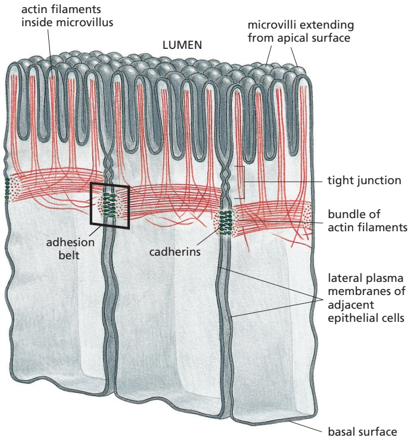

Figure 19–13 Adherens junctions between epithelial cells in the small intestine. These cells are specialized for absorption of nutrients; at their apical surfaces, facing the lumen of the gut, they have many microvilli (protrusions that increase the absorptive surface area). The adherens junction takes the form of an adhesion belt, encircling each of the interacting cells. Its most obvious feature is a contractile bundle of actin filaments running along the cytoplasmic surface of the junctional plasma membrane. The actin filament bundles are tethered by adaptor proteins to cadherins, which bind to cadherins on the adjacent cell. In this way, the actin filament bundles in adjacent cells are tied together. For clarity, this drawing does not show most of the other cell–cell and cell–matrix junctions of epithelial cells (see Figure 19–2).

In some forms of tissue remodeling, actin–myosin contractility is coordinated with major changes in local cell–cell adhesion patterns. An example can be found in cellular rearrangements that occur early in the development of the fruit fly Drosophila melanogaster. Soon after gastrulation, the outer epithelium of the embryo is elongated by a process called germ-band extension, in which the cells converge inward along the dorsal–ventral axis and extend along the anterior– posterior axis. Actin-dependent contraction along dorsal–ventral cell boundaries is accompanied by a loss of specific adherens junctions to allow cells to insert themselves between other cells (a process called intercalation), resulting in a longer and narrower epithelium (**Figure 19–15**). We do not fully understand the mechanisms underlying the disassembly of adherens junctions along dorsal–ventral cell boundaries, but one possibility is that actin-based contractile forces pull sufficiently hard on the edges of cell–cell adhesions to peel them apart, particularly if contraction is coupled to additional regulatory mechanisms that weaken the adhesion. There is evidence, for example, that remodeling of these and other adhesions during development depends on removal of cadherins from the cell surface by clathrin-mediated endocytosis.

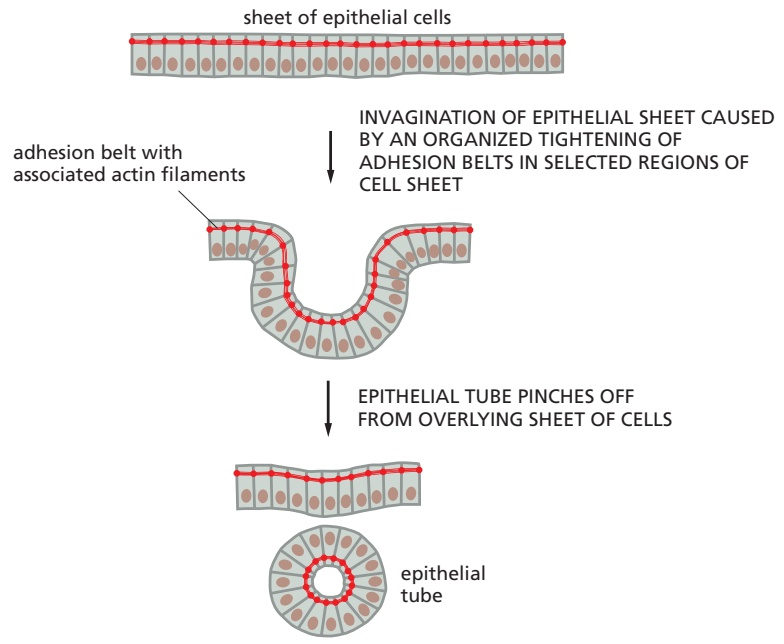

Figure 19–14 The folding of an epithelial sheet to form an epithelial tube. The oriented contraction of the bundles of actin and myosin filaments running along adhesion belts causes the epithelial cells to narrow at their apical surfaces, thereby helping the epithelial sheet to roll up into a tube. An example is the formation of the neural tube in early vertebrate development (see Figure 19–8).

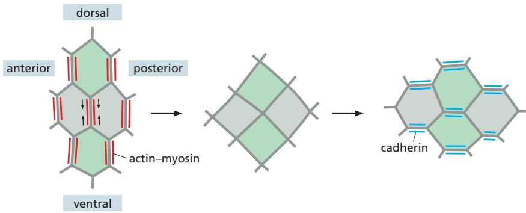

Figure 19–15 Remodeling of cell–cell adhesions in embryonic Drosophila epithelium. Depicted at left is a group of cells in the outer epithelium of a Drosophila embryo. During germ-band extension, cells converge toward each other (middle) on the dorsal–ventral axis and then extend (right) along the anterior–posterior axis. The result is intercalation: cells that were originally far apart along the dorsal–ventral axis (green) are inserted between the cells (gray) that separated them. These rearrangements depend on the spatial regulation of actin–myosin contractile bundles, which are localized primarily at the vertical cell boundaries (red, left). Contraction of these bundles is accompanied by removal of E-cadherin (not shown) at the same cell boundaries, resulting in shrinkage and loss of adhesion along the vertical axis (middle). New cadherin-based adhesions (blue, right) then form and expand along horizontal boundaries, resulting in extension of the cells in the anterior–posterior dimension.

## Desmosomes Give Epithelia Mechanical Strength

Desmosomes are structurally similar to adherens junctions but contain specialized cadherins that link to intermediate filaments instead of actin filaments. Their main function is to provide mechanical strength. Desmosomes are important in vertebrates but are not found, for example, in Drosophila. They are present in most mature vertebrate epithelia and are particularly plentiful in tissues that are subject to high levels of mechanical stress, such as heart muscle and the epidermis, the epithelium that forms the outer layer of the skin.

**Figure 19–16A** shows the general structure of a desmosome, and **Figure 19–16B** shows some of the proteins that form it. Desmosomes typically appear as buttonlike spots of adhesion, riveting the cells together (**Figure 19–16C**). Inside the cell, the bundles of rope-like intermediate filaments that are anchored to the desmosomes form a structural framework of great tensile strength (**Figure 19–16D**), with linkage to similar bundles in adjacent cells, creating a network that extends throughout the tissue (**Figure 19–17**). The particular type of intermediate filaments attached to the desmosomes depends on the cell type: they are keratin filaments in most epithelial cells, for example, and desmin filaments in heart muscle cells.

The importance of desmosomes is demonstrated by some forms of the potentially fatal skin disease pemphigus. Affected individuals make antibodies against one of their own desmosomal cadherin proteins. These antibodies bind to and disrupt the desmosomes that hold their epidermal cells (keratinocytes) together. This results in a severe blistering of the skin, with leakage of body fluids into the loosened epithelium.

## Tight Junctions Form a Seal Between Cells and a Fence Between Plasma Membrane Domains

Sheets of epithelial cells enclose and partition the animal body, lining all its surfaces and cavities, and creating internal compartments where specialized processes occur. The epithelial sheet seems to be one of the inventions that lie at the origin of animal evolution, diversifying in a huge variety of ways but retaining an organization that is based on a set of conserved molecular mechanisms.