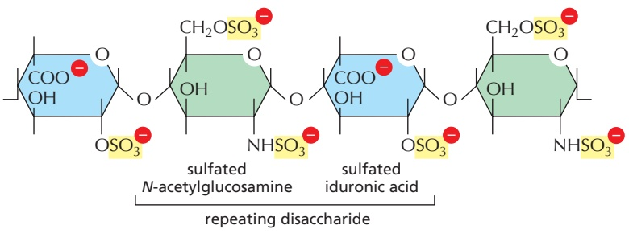

the matrix, while other fibrous proteins, such as the rubberlike elastin, give it resilience. Finally, the many matrix glycoproteins help cells migrate, settle, and differentiate in the appropriate locations.MBoC7 m19.32/

Figure 19–32 The repeating disaccharide sequence of a heparin glycosaminoglycan (GAG) chain. These chains can consist of as many as 75 disaccharide units but are typically less than half that size. There is a high density of negative charges along the chain because of the presence of both carboxyl and sulfate groups; indeed, heparin is the most densely charged biological molecule known. The most common form of heparin carries three sulfate groups in each disaccharide, as shown here. In vivo, the proportion of sulfated and nonsulfated groups is highly variable. Heparin has an average of about 2.7 sulfates per disaccharide. Heparan sulfate is a closely related GAG that is generally about twice the length of heparin and less charged, with an average of about 1 sulfate per disaccharide.

## Glycosaminoglycan (GAG) Chains Occupy Large Amounts of Space and Form Hydrated Gels

**Glycosaminoglycans (GAGs)** are unbranched polysaccharide chains composed of repeating disaccharide units. One of the two sugars in the repeating disaccharide is always an amino sugar (N-acetylglucosamine or N-acetylgalactosamine), which in most cases is sulfated. The second sugar is usually a uronic acid (glucuronic or iduronic). Because there are sulfate or carboxyl groups on most of their sugars, GAGs are highly negatively charged (**Figure 19–32**). Indeed, they are the most anionic molecules produced by animal cells. Four main groups of GAGs are distinguished by their sugars, the type of linkage between the sugars, and the number and location of sulfate groups: (1) hyaluronan, (2) chondroitin sulfate and dermatan sulfate, (3) heparin and heparan sulfate, and (4) keratan sulfate.

Polysaccharide chains are too stiff to fold into compact globular structures, and they are strongly hydrophilic. Thus, GAGs tend to adopt highly extended conformations that occupy a huge volume relative to their mass (**Figure 19–33**), and they form hydrated gels even at very low concentrations. The weight of GAGs in connective tissue is usually less than 10% of the weight of proteins, but GAG chains fill most of the extracellular space. Their high density of negative charges attracts a cloud of cations, especially Na+, that are osmotically active, causing large amounts of water to be sucked into the matrix. This creates a swelling pressure, or turgor, that enables the matrix to withstand compressive forces (in contrast to collagen fibrils, which resist stretching forces). The cartilage matrix that lines the knee joint, for example, can support pressures of hundreds of atmospheres in this way.

Defects in the production of GAGs can affect many different body systems. In one rare human genetic disease, for example, there is a severe deficiency in the synthesis of dermatan sulfate disaccharide. The affected individuals have a short stature, a prematurely aged appearance, and generalized defects in their skin, joints, muscles, and bones.

## Hyaluronan Acts as a Space Filler During Tissue Morphogenesis and Repair

**Hyaluronan** (also called hyaluronic acid or hyaluronate) is the simplest of the GAGs (**Figure 19–34**). It consists of a regular repeating sequence of up to 25,000 disaccharide units, is found in variable amounts in all tissues and fluids in adult animals, and is especially abundant in early embryos. Hyaluronan is not a typical GAG because it contains no sulfated sugars, all its disaccharide units are identical, its chain length is enormous, and it is not generally linked covalently to any core protein. Moreover, whereas other GAGs are synthesized inside the cell and released by exocytosis, hyaluronan is spun out directly from the cell surface by an enzyme complex embedded in the plasma membrane.

Figure 19–33 The relative dimensions and volumes occupied by various macromolecules. Several proteins and a single hydrated molecule of hyaluronan are shown, with molecular mass in daltons.

Figure 19–34 The repeating disaccharide sequence in hyaluronan, a relatively simple GAG. This ubiquitous molecule in vertebrates consists of a single long chain of up to 25,000 disaccharides. Note the absence of sulfate groups.

Hyaluronan is thought to have a role in resisting compressive forces in tissues and joints. It is also important as a space filler during embryonic development, where it can be used to force a change in the shape of a structure, as a small quantity expands with water to occupy a large volume. Hyaluronan synthesized locally from the basal side of an epithelium can deform the epithelium by creating a cellfree space beneath it, into which cells subsequently migrate. In the developing heart, for example, hyaluronan synthesis helps in this way to drive formation of the valves and septa that separate the heart’s chambers. Similar processes occur in several other organs. When cell migration ends, the excess hyaluronan is generally degraded by the enzyme hyaluronidase. Hyaluronan is also produced in large quantities during wound healing, and it is an important constituent of joint fluid, in which it serves as a lubricant.MBoC7 m19.34

## Proteoglycans Are Composed of GAG Chains Covalently Linked to a Core Protein

Except for hyaluronan, all GAGs are covalently attached to protein as **proteoglycans**, which are produced by most animal cells. Membrane-bound ribosomes make the polypeptide chain, or core protein, of a proteoglycan, which is then threaded into the lumen of the endoplasmic reticulum. The polysaccharide chains are mainly assembled on this core protein in the Golgi apparatus before delivery to the exterior of the cell by exocytosis. First, a special linkage tetrasaccharide is attached to a serine side chain on the core protein to serve as a primer for polysaccharide growth; then, one sugar at a time is added by specific glycosyl transferases (**Figure 19–35**). While still in the Golgi apparatus, many of the polymerized sugars are covalently modified by a sequential and coordinated series of reactions. These modifications include sulfation, which increases the negative charge, and

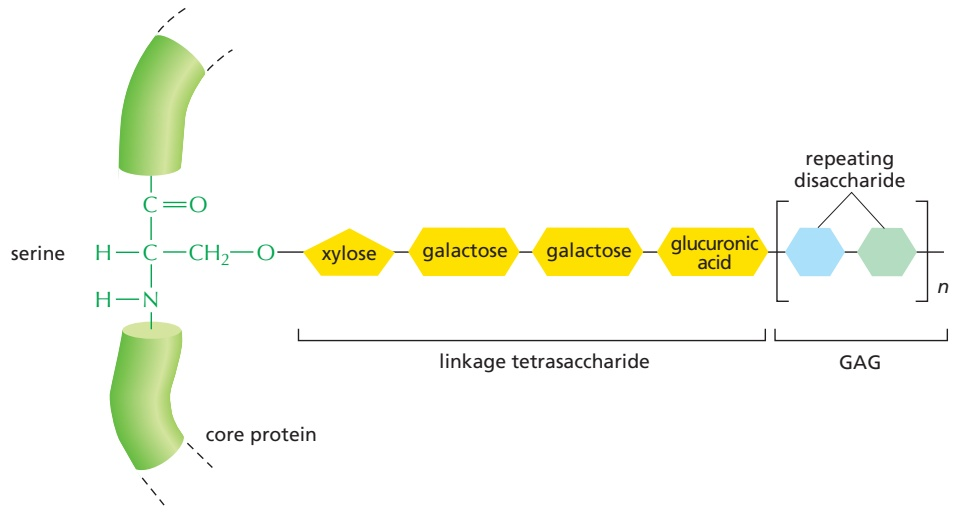

Figure 19–35 The linkage between a GAG chain and its core protein in a proteoglycan molecule. A specific linkage tetrasaccharide is first assembled on a serine side chain. The rest of the GAG chain, consisting mainly of a repeating disaccharide unit, is then synthesized, with one sugar added at a time. In chondroitin sulfate, the disaccharide is composed of d-glucuronic acid and N-acetyl-dgalactosamine; in heparan sulfate, it is either d-glucuronic acid or l-iduronic acid and N-acetyl-d-glucosamine.

epimerization, which alters the configuration of the substituents around individual carbon atoms in the sugar molecule.

Proteoglycans are clearly distinguished from other glycoproteins by the nature, quantity, and arrangement of their sugar side chains. By definition, at least one of the sugar side chains of a proteoglycan must be a GAG. Whereas glycoproteins generally contain relatively short, branched oligosaccharide chains that contribute only a small fraction of their mass, proteoglycans can contain as much as 95% carbohydrate by mass, mostly in the form of long, unbranched GAG chains, each typically about 80 sugars long.

In principle, proteoglycans have the potential for almost limitless heterogeneity. Even a single type of core protein can carry highly variable numbers and types of attached GAG chains. Moreover, the underlying repeating sequence of disaccharides in each GAG can be modified by a complex pattern of sulfate groups. The core proteins, too, are diverse, though many of them belong to structurally related families that share specific domains involved in binding to GAGs or other proteins.

Proteoglycans can be huge. The proteoglycan aggrecan, for example, which is a major component of cartilage, has a mass of about $3 \times 1 0 ^ { 6 }$ daltons with more than 100 GAG chains. Other proteoglycans are much smaller and have only 1–10 GAG chains; an example is decorin, which is secreted by fibroblasts and has a single GAG chain (see Figure 19–31). Decorin binds to collagen fibrils and regulates fibril assembly and fibril diameter; mice that cannot make decorin have fragile skin that has reduced tensile strength. The GAGs and proteoglycans of these various types can associate to form even larger polymeric complexes in the extracellular matrix. Molecules of aggrecan, for example, assemble with hyaluronan in cartilage matrix to form aggregates that are as big as a bacterium (**Figure 19–36**). Moreover, besides associating with one another, GAGs and proteoglycans associate with fibrous matrix proteins such as collagen and with protein meshworks such as the basal lamina, creating extremely complex composites (**Figure 19–37**).

Not all proteoglycans are secreted components of the extracellular matrix. Some are integral components of plasma membranes and have their core protein

Figure 19–36 An aggrecan aggregate from fetal bovine cartilage. (A) An electron micrograph of an aggrecan aggregate shadowed with platinum. Many free aggrecan molecules are also visible. (B) A drawing of the giant aggrecan aggregate shown in A. It consists of about 100 aggrecan monomers (see Figure 19–31) noncovalently bound through the N-terminal domain of the core protein to a single hyaluronan molecule. A link protein binds both to the core protein of the proteoglycan and to the hyaluronan molecule, thereby stabilizing the aggregate. The molecular mass of such a complex can be 108 daltons or more, and it occupies a volume equivalent to that of a bacterium, which is about 2 μm3. (A, courtesy of Lawrence Rosenberg.)

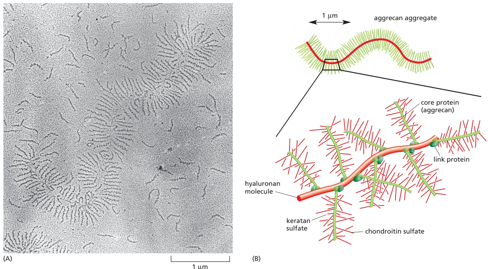

0.5 µm collagen fibril

Figure 19–37 Proteoglycans in the extracellular matrix of rat cartilage. The tissue was rapidly frozen at –196°C and fixed and stained while still frozen (a process called freeze substitution) to prevent the GAG chains from collapsing. In this electron micrograph, the proteoglycan molecules are seen to form a fine filamentous network in which a single striated collagen fibril is embedded. The more darkly stained parts of the proteoglycan molecules are the core proteins; the faintly stained threads are the GAG chains. (© 1984 E.B. Hunziker and R.K. Schenk. Originally published in J. Cell Biol. https://doi.org/10.1083/jcb.98.1.277.With permission from Rockefeller University Press.)

either inserted across the lipid bilayer or attached to the lipid bilayer by a glycosylphosphatidylinositol (GPI) anchor. Among the best-characterized plasma membrane proteoglycans are the syndecans, which have a membrane-spanning core protein whose intracellular domain interacts with the actin cytoskeleton and with signaling molecules in the cell cortex. The extracellular domain is linked to multiple GAG chains (primarily heparan sulfate). Syndecans are located on the surface of many types of cells, including fibroblasts and epithelial cells. In fibro-. / . blasts, syndecans can be found in cell–matrix adhesions, where they modulate integrin function by interacting with fibronectin on the cell surface and with cytoskeletal and signaling proteins inside the cell. As we discuss later, syndecans and related proteoglycans called glypicans also interact with soluble peptide growth factors, influencing their effects on cell growth and proliferation.

## Collagens Are the Major Proteins of the Extracellular Matrix

The **collagens** are a family of fibrous proteins found in all multicellular animals. They are secreted in large quantities by connective-tissue cells and in smaller quantities by many other cell types. As a major component of skin and bone, collagens are the most abundant proteins in mammals, where they constitute 25% of the total protein mass.

The primary feature of a typical collagen molecule is its long, stiff, triplestranded helical structure, in which three collagen polypeptide chains, called α chains, are wound around one another in a rope-like superhelix (**Figure 19–38**). Collagens are extremely rich in proline and glycine, both of which are important in the formation of the triple-stranded helix.

The human genome contains 42 distinct genes coding for different collagen α chains. Different combinations of these genes are expressed in different tissues. Although in principle thousands of types of triple-stranded collagen molecules could be assembled from various combinations of the 42 α chains, only a limited number of triple-helical combinations are possible, and roughly 40 types of collagen molecules have been found. Type I is by far the most common, being the principal collagen of skin and bone. It belongs to the class of **fibrillar collagens**, or fibril-forming collagens: after being secreted into the extracellular space, they assemble into higher-order polymers called **collagen fibrils**, which are thin structures (10–300 nm in diameter) many hundreds of micrometers long in mature tissues, where they are clearly visible in electron micrographs (**Figure 19–39**; see also Figure 19–37). Collagen fibrils often aggregate into larger, cablelike bundles, several micrometers in diameter, that are visible in the light microscope as collagen fibers.

<small>Figure 19–38 The structure of a typical collagen molecule. (A) A model of part of a single collagen α chain, in which each amino acid is represented by a sphere. The chain is about 1000 amino acids long. It is arranged as a left-handed helix, with three amino acids per turn and with glycine as every third amino acid. Therefore, an α chain is composed of a series of triplet Gly-X-Y sequences, in which X and Y can be any amino acid (although X is commonly proline and Y is commonly hydroxyproline, a form of proline that is chemically modified during collagen synthesis in the cell). (B) A model of part of a collagen molecule, in which three α chains, each shown in a different color, are wrapped around one another to form a triple-stranded helical rod. Glycine is the only amino acid small enough to occupy the crowded interior of the triple helix. Only a short length of the molecule is shown; the entire molecule is 300 nm long. (From a model by B.L. Trus.)</small>

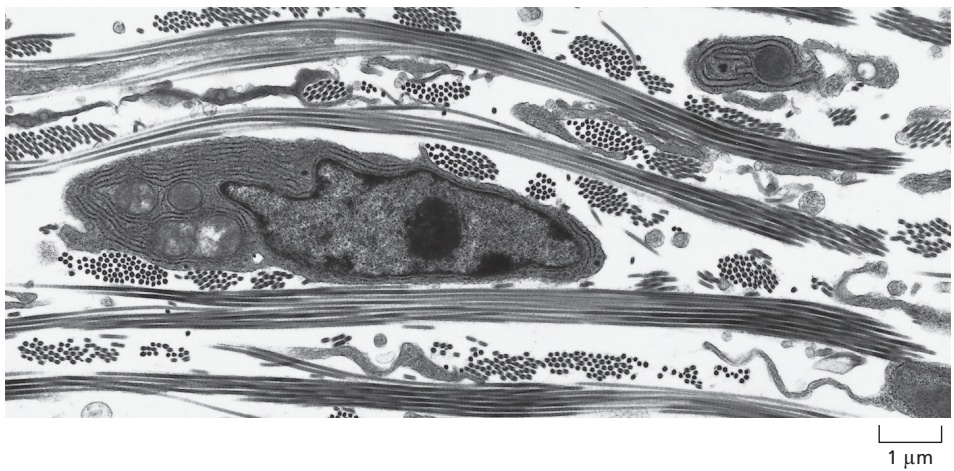

Figure 19–39 A fibroblast surrounded by collagen fibrils in the connective tissue of embryonic chick skin. In this electron micrograph, the fibrils are organized into bundles that run approximately at right angles to one another. Therefore, some bundles are oriented longitudinally, whereas others are seen in cross section. The collagen fibrils are produced by fibroblasts. (From C. Ploetz et al., J. Struct. Biol. 106:73–81, 1991. With permission from Elsevier.)

Collagen types IX and XII are called fibril-associated collagens because they decorate the surface of collagen fibrils. They are thought to link these fibrils to one another and to other components in the extracellular matrix. Types IV and VII are network-forming collagens: type IV forms a major part of the basal lamina, while type VII molecules form dimers that assemble into specialized structures called anchoring fibrils. Anchoring fibrils help attach the basal lamina of multi-layered epithelia to the underlying connective tissue and therefore are especially abundant in the skin. There are also a number of “collagen-like” proteins containing short collagen-like segments. These include collagen type XVII, which has a transmembrane domain and is found in hemidesmosomes, and type XVIII, the core protein of a proteoglycan in the basal lamina.

Many proteins appear to have evolved by repeated duplications of an original DNA sequence, giving rise to a repetitive pattern of amino acids. The genes that encode the α chains of most of the fibrillar collagens provide a good example: they are very large (up to 44 kilobases in length) and contain about 50 exons. Most of the exons are 54 or multiples of 54 nucleotides long, suggesting that these collagens originated through multiple duplications of a primordial gene containing 54 nucleotides and encoding exactly six Gly-X-Y repeats (see Figure 19–38).

**Table 19–2** provides additional details for some of the collagen types discussed in this chapter.

## Collagen Chains Undergo a Series of Post-translational Modifications

Individual collagen polypeptide chains are synthesized on membrane-bound ribosomes and injected into the lumen of the endoplasmic reticulum (ER) as larger precursors, called pro-a chains. These precursors not only have the short amino-terminal signal peptide required to direct the nascent polypeptide to the

hydroxyproline in protein

hydroxylysine in protein

<table><tbody><tr><td colspan="5">TABLE 19-2 Some Types of Collagen and Their Properties</td></tr><tr><td></td><td>Type</td><td>Polymerized form</td><td>Tissue distribution</td><td>Mutant phenotype</td></tr><tr><td rowspan="5">Fibril-forming (fibrillar)</td><td>I</td><td>Fibril</td><td>Bone, skin, tendons, ligaments, cornea, internal organs (accounts for 90% of body collagen)</td><td>Severe bone defects, fractures (osteogenesis imperfecta)</td></tr><tr><td>II</td><td>Fibril</td><td>Cartilage, intervertebral disc, notochord, vitreous humor of the eye</td><td>Cartilage deficiency, dwarfism (chondrodysplasia)</td></tr><tr><td>III</td><td>Fibril</td><td>Skin, blood vessels, internal organs</td><td>Fragile skin, loose joints, blood vessels prone to rupture (vascular Ehlers-Danlos syndrome)</td></tr><tr><td>V</td><td>Fibril (with type I)</td><td>As for type I</td><td>Fragile skin, loose joints (classical Ehlers-Danlos syndrome)</td></tr><tr><td>XI</td><td>Fibril (with type II)</td><td>As for type II</td><td>Myopia, blindness</td></tr><tr><td rowspan="2">Fibril-associated</td><td>IX</td><td>Lateral association with type II fibrils</td><td>Cartilage</td><td>Osteoarthritis</td></tr><tr><td>XII</td><td>Lateral association with type I fibrils</td><td>Tendons</td><td>Skeletal and muscle abnormalities</td></tr><tr><td rowspan="2">Network-forming</td><td>IV</td><td>Sheetlike network</td><td>Basal lamina</td><td>Kidney disease (glomerulonephritis), deafness</td></tr><tr><td>VII</td><td>Anchoring fibrils</td><td>Beneath stratified squamous epithelia</td><td>Skin blistering</td></tr><tr><td>Transmembrane</td><td>XVII</td><td>Nonfibrillar</td><td>Hemidesmosomes</td><td>Skin blistering</td></tr><tr><td>Proteoglycan core protein</td><td>XVIII</td><td>Nonfibrillar</td><td>Basal lamina</td><td>Myopia, detached retina, hydrocephalus</td></tr><tr><td colspan="5">Note that types I, IV, V, IX, and XI are each composed of two or three types of α chains (distinct, nonoverlapping sets in each case), whereas types II, III, VII, XII, XVII, and XVIII are composed of only one type of α chain each.</td></tr></tbody></table>

ER but also have, at both their N- and C-terminal ends, additional amino acids, called propeptides, that are clipped off at a later step of collagen assembly. Moreover, in the lumen of the ER, selected prolines and lysines are hydroxylated to form hydroxyproline and hydroxylysine, respectively, and some hydroxylysines are then glycosylated.

Each pro-α chain combines with two others to form a triple-stranded, helical molecule known as procollagen. The hydroxyl groups of hydroxyprolines and hydroxylysines (**Figure 19–40**) form interchain hydrogen bonds that help stabilize the triple-stranded helix. The enzyme that catalyzes proline hydroxylation requires ascorbic acid (vitamin C). In scurvy, the disease caused by a dietary deficiency of vitamin C that was common in sailors until the nineteenth century, defective pro-α chains fail to form a stable triple helix and are degraded, thereby inhibiting the production of new collagen fibrils. In healthy tissues, collagen is continually degraded and replaced (with a turnover time of months or years, depending on the tissue). In scurvy, replacement fails, and within a few months, with the gradual loss of the preexisting normal collagen in the matrix, blood vessels become fragile, teeth become loose in their sockets, and wounds cease to heal.

After secretion, the propeptides of the fibrillar procollagen molecules are removed by specific proteolytic enzymes outside the cell. This converts the procollagen molecules to collagen, which assemble in the extracellular space to form much larger collagen fibrils. The propeptides have at least two functions. First,

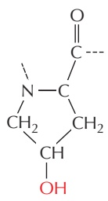

Figure 19–40 Hydroxylysine and

hydroxyproline. These modified amino acids are common in collagen. They are formed by enzymes that act after the lysine and proline have been incorporated into procollagen molecules.

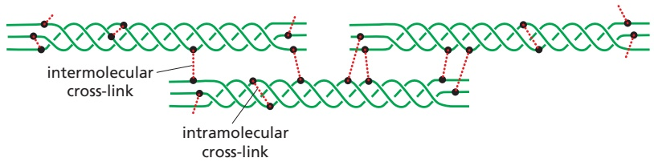

Figure 19–41 Cross-links formed between modified lysine side chains within a collagen fibril. Covalent intramolecular and intermolecular cross-links are formed in several steps. First, the extracellular enzyme lysyl oxidase deaminates certain lysines and hydroxylysines to yield highly reactive aldehyde groups. The aldehydes then react spontaneously to form covalent bonds with each other or with other lysines or hydroxylysines. Most of the cross-links form between the short nonhelical segments at each end of the collagen molecules.

they guide the intracellular formation of the triple-stranded collagen molecules.MBoC7 m19.65(5thEd)/19.41 Second, because they are retained until after secretion, they prevent the intracellular formation of large collagen fibrils, which could be catastrophic for the cell.

After the fibrils have formed in the extracellular space, they are greatly strengthened by the formation of covalent cross-links between lysine residues of the constituent collagen molecules (**Figure 19–41**). The types of covalent bonds involved are found only in collagen and elastin. If cross-linking is inhibited, the tensile strength of the fibrils is drastically reduced: collagenous tissues become fragile, and structures such as skin, tendons, and blood vessels tend to tear. The extent and type of cross-linking vary from tissue to tissue. Collagen is especially highly cross-linked in the Achilles tendon, for example, where tensile strength is crucial.

## Secreted Fibril-associated Collagens Help Organize the Fibrils

In contrast to GAGs, which resist compressive forces, collagen fibrils form structures that resist tensile forces. The fibrils have various diameters and are organized in different ways in different tissues. In mammalian skin, for example, they are woven in a wickerwork pattern so that they resist tensile stress in multiple directions; leather consists of this material, suitably preserved. In tendons, collagen fibrils are organized in parallel bundles aligned along the major axis of tension. In mature bone and in the cornea, they are arranged in orderly plywoodlike layers, with the fibrils in each layer lying parallel to one another but nearly at right angles to the fibrils in the layers on either side. The same arrangement occurs in tadpole skin (**Figure 19–42**).

The connective-tissue cells themselves determine the size and arrangement of the collagen fibrils. The cells can express one or more genes for the different types of fibrillar collagen molecules. But even fibrils composed of the same mixture of collagens have different arrangements in different tissues. How is this achieved? Part of the answer is that cells can regulate the disposition of the collagen molecules after secretion by guiding collagen fibril formation near the plasma membrane. In addition, cells can influence this organization by secreting, along with their fibrillar collagens, different kinds and amounts of other matrix macromolecules. In particular, they secrete the fibrous protein fibronectin, as we discuss later, and this precedes the formation of collagen fibrils and helps guide their organization.

**Fibril-associated collagens**, such as types IX and XII collagens, are thought to be especially important in organizing collagen fibrils. They differ from fibrillar collagens in the following ways. First, their triple-stranded helical structure is interrupted by one or two short nonhelical domains, which makes the molecules more flexible than fibrillar collagen molecules. Second, they do not aggregate with one another to form fibrils in the extracellular space. Instead, they bind in a periodic manner to the surface of fibrils formed by the fibrillar collagens. Type IX molecules bind to type II collagen–containing fibrils in cartilage, the cornea, and the vitreous of the eye (**Figure 19–43**), whereas type XII molecules bind to type I collagen–containing fibrils in tendons and various other tissues.

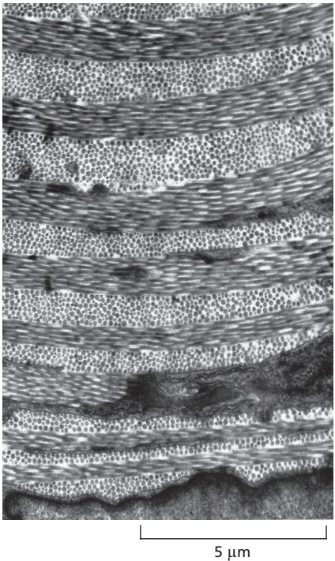

Figure 19–42 Collagen fibrils in the tadpole skin. This electron micrograph shows the plywoodlike arrangement of the fibrils: successive layers of fibrils are laid down nearly at right angles to each other. This organization is also found in mature bone and in the cornea. (Courtesy of Jerome Gross.)

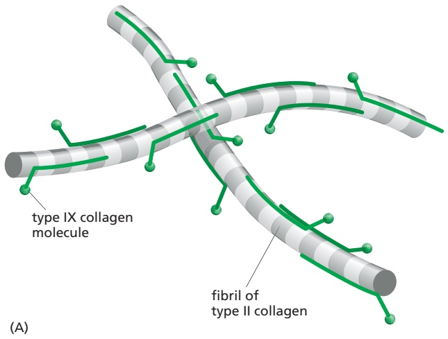

Figure 19–43 Type IX collagen. (A) Type IX collagen molecules binding in a periodic pattern to the surface of a fibril containing type II collagen. (B) Electron micrograph of a rotary-shadowed type II collagen–containing fibril in cartilage, decorated by type IX collagen molecules. (C) An individual type IX collagen molecule. (B and C, © 1988, L. Vaughan et al. Originally published in J. Cell Biol. https://doi.org/10.1083/jcb.106.3.991. With permission from Rockefeller University Press.)

Fibril-associated collagens are thought to mediate the interactions of collagen fibrils with one another and with other matrix macromolecules to help determine the organization of the fibrils in the matrix.

## Elastin Gives Tissues Their Elasticity

Many vertebrate tissues, such as skin, blood vessels, and lungs, need to be both strong and elastic in order to function. A network of **elastic fibers** in the extracellular matrix of these tissues gives them the resilience to recoil after transient stretch (**Figure 19–44**). Elastic fibers are at least five times more extensible than a rubber band of the same cross-sectional area. Long, inelastic collagen fibrils are interwoven with the elastic fibers to limit the extent of stretching and prevent the tissue from tearing.

The main component of elastic fibers is **elastin**, a highly hydrophobic protein (about 750 amino acids long), which, like collagen, is unusually rich in proline and glycine but, unlike collagen, is not glycosylated. Soluble tropoelastin (the biosynthetic precursor of elastin) is secreted into the extracellular space and assembled into elastic fibers close to the plasma membrane, generally in cell-surface infoldings. After secretion, the tropoelastin molecules become highly cross-linked to one another, generating an extensive network of elastin fibers and sheets. A mechanism similar to the one that operates in cross-linking collagen molecules forms cross-links between lysines in elastin molecules.

(A)

(B)

1 mm

100 µm

Figure 19–44 Elastic fibers. These scanning electron micrographs show (A) a low-power view of a segment of a dog’s aorta and (B) a high-power view of the dense network of longitudinally oriented elastic fibers in the outer layer of the same blood vessel. All the other components have been digested away with enzymes and formic acid. (From K.S. Haas et al., Anat. Rec. 230:86–96, 1991. With permission from Wiley-Liss.)

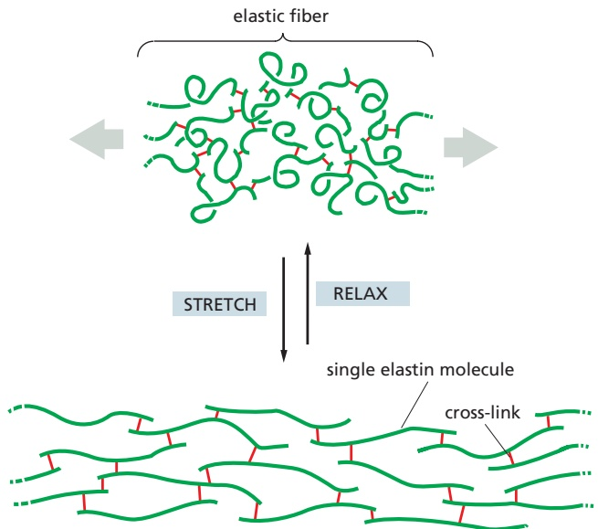

Figure 19–45 Stretching a network of elastin molecules. The molecules are joined together by covalent bonds (red) to generate a cross-linked network. In this model, each elastin molecule in the network can extend and contract in a manner resembling a random coil, so that the entire assembly can stretch and recoil like a rubber band.

The elastin protein is composed largely of two types of short segments that alternate along the polypeptide chain: hydrophobic segments, which are responsible for the elastic properties of the molecule; and alanine- and lysine-rich α-helical segments, which are cross-linked to adjacent molecules. Each segment is encoded by a separate exon. There is still uncertainty concerning the confor-MBoC7 m19.45/19.45 mation of elastin molecules in elastic fibers and how the structure of these fibers accounts for their rubberlike properties. However, it seems that parts of the elastin polypeptide chain, like the polymer chains in ordinary rubber, adopt a loose “random-coil” conformation, and it is the random-coil nature of the component molecules cross-linked into the elastic fiber network that allows the network to stretch and recoil like a rubber band (**Figure 19–45**).

Elastin is the dominant extracellular matrix protein in arteries, comprising 50% of the dry weight of the largest artery—the aorta (see Figure 19–44). Mutations in the elastin gene causing a deficiency of the protein in mice or humans result in narrowing of the aorta and other arteries and excessive proliferation of smooth muscle cells in the arterial wall. Apparently, the normal elasticity of an artery is required to restrain the proliferation of these cells.

Elastic fibers do not consist solely of elastin. The elastin core is covered with a sheath of microfibrils, each of which has a diameter of about 10 nm. The microfibrils appear before elastin in developing tissues and seem to provide scaffolding to guide elastin deposition. Arrays of microfibrils are elastic in their own right, and in some places they persist in the absence of elastin: they help to hold the lens in its place in the eye, for example. Microfibrils are composed of a number of distinct glycoproteins, including the large glycoprotein fibrillin, which binds to elastin and is essential for the integrity of elastic fibers. Mutations in the fibrillin gene result in Marfan syndrome, a relatively common human disorder. In the most severely affected individuals, the aorta is prone to rupture; other common effects include displacement of the lens and abnormalities of the skeleton and joints. Affected individuals are often unusually tall and lanky: Abraham Lincoln is suspected to have had the condition.

## Cells Govern and Respond to the Mechanical Properties of the Matrix

Cells interact with the extracellular matrix mechanically as well as chemically, and studies in culture suggest that the mechanical interaction can have dramatic effects on the architecture of connective tissue. Thus, when fibroblasts are mixed with a meshwork of randomly oriented collagen fibrils that form a gel in a culture dish, the fibroblasts tug on the meshwork, drawing in collagen from their surroundings and thereby causing the gel to contract to a small fraction of its initial volume. By similar activities, a cluster of fibroblasts surrounds itself with a capsule of densely packed and circumferentially oriented collagen fibers.

Figure 19–46 The shaping of the extracellular matrix by cells. This micrograph shows a region between two pieces of embryonic chick heart (rich in fibroblasts as well as heart muscle cells) that were cultured on a collagen gel for 4 days. A dense tract of aligned collagen fibers has formed between the explants, presumably as a result of the fibroblasts in the explants tugging on the collagen. (From D. Stopak and A.K. Harris, Dev. Biol. 90:383–398, 1982. With permission from Elsevier.)

If two small pieces of embryonic tissue containing fibroblasts are placed farMBoC7 e20.13/19.46 apart on a collagen gel, the intervening collagen becomes organized into a compact band of aligned fibers that connect the two explants (**Figure 19–46**). The fibroblasts subsequently migrate out from the explants along the aligned collagen fibers. Thus, the fibroblasts influence the alignment of the collagen fibers, and the collagen fibers in turn affect the distribution of the fibroblasts.

Fibroblasts may have a similar role in organizing the extracellular matrix inside the body. First they synthesize the collagen fibrils and deposit them in the correct orientation. Then they work on the matrix they have secreted, crawling over it and tugging on it so as to create tendons and ligaments and the tough, dense layers of connective tissue that surround and bind together most organs.

In addition to determining the orientation of the collagen fibrils they produce, fibroblasts control the overall density and composition of the extracellular matrix, which varies dramatically in different tissues. Some tissues, such as tendons and cartilage, are composed of dense matrix that is far more rigid and resistant to deformation than the soft, elastic matrix of tissues like fat and the brain. These differences depend on the ability of cells in these tissues to regulate the types of collagen and other proteins produced, the relative rates of matrix protein synthesis and degradation, and the amount of collagen and elastin cross-linking. The density of the matrix, in turn, regulates the behavior of the fibroblasts and other cells that travel through it; for example, the proliferation, migration, and developmental fate of stem cells are influenced by matrix composition and density. Abnormally high matrix density is associated with certain fibrotic diseases and appears to be a risk factor in some forms of cancer.

## Fibronectin and Other Multidomain Glycoproteins Help Organize the Matrix

In addition to proteoglycans, collagens, and elastic fibers, the extracellular matrix contains a large and varied assortment of glycoproteins that typically have multiple domains, each with specific binding sites for other matrix macromolecules and for receptors on the surface of cells (**Figure 19–47**). These proteins therefore contribute to both organizing the matrix and helping cells attach to it. Like the proteoglycans, they also guide cell movements in developing tissues by serving as tracks along which cells can migrate or as repellents that keep cells out of forbidden areas. They can also bind and thereby influence the function of peptide growth factors and other small molecules produced by nearby cells.

The best-understood member of this class of matrix proteins is **fibronectin**, a large glycoprotein found in all vertebrates and important for many cell–matrix interactions. Mutant mice that are unable to make fibronectin die early in embryogenesis because their endothelial cells fail to form proper blood vessels. The defect is thought to result from abnormalities in the interactions of these cells with the surrounding extracellular matrix, which normally contains fibronectin.

Fibronectin is a dimer composed of two very large subunits joined by disulfide bonds at their C-terminal ends. Each subunit contains a series of small repeated domains, or modules, separated by short stretches of flexible polypeptide chain (**Figure 19–48**). Each domain is usually encoded by a separate exon, suggesting that the fibronectin gene, like the genes encoding many matrix proteins, evolved by multiple exon duplications. In the human genome, there is only one fibronectin gene, containing about 50 exons of similar size, but the transcripts can be spliced in different ways to produce multiple fibronectin isoforms (see Figure 19–48B). The major repeat domain in fibronectin is called the **type III fibronectin repeat**, which is about 90 amino acids long and occurs at least 15 times in each subunit. This repeat is among the most common of all protein domains in vertebrates.

## Fibronectin Binds to Integrins

One way to analyze a complex multifunctional protein molecule such as fibronectin is to synthesize individual regions of the protein and test their ability to bind other proteins. By these and other methods, it was possible to show that one region of fibronectin binds to collagen, another to proteoglycans, and another to specific integrins on the surface of various types of cells (see Figure 19–48B). Synthetic peptides corresponding to different segments of the integrin-binding domain were then used to show that binding depends on a specific tripeptide sequence (Arg-Gly-Asp, or RGD) that is found in one of the type III repeats (see Figure 19–48C). Even very short peptides containing this **RGD sequence** can compete with fibronectin for the binding site on cells, thereby inhibiting the attachment of the cells to a fibronectin matrix.

Several extracellular proteins besides fibronectin also have an RGD sequence that mediates cell-surface binding. Many of these proteins are components of the

Figure 19–47 Complex glycoproteins of the extracellular matrix. Many matrix glycoproteins are large scaffold proteins containing multiple copies of specific protein-interaction domains. Each domain is folded into a discrete globular structure, and many such domains are arrayed along the protein like beads on a string. This diagram shows four representative proteins among the roughly 200 matrix glycoproteins that are found in mammals. Each protein contains multiple repeat domains, with the names listed in the key at the bottom. Fibronectin, for example, contains numerous copies of three different fibronectin repeats (types I–III, labeled here as FN1, FN2, and FN3). Two type III repeats near the center of the protein contain important binding sites for cell-surface integrins, whereas three nearby type III repeats form a binding site for heparin or heparan sulfate proteoglycans. FN repeats at the N-terminus are involved in binding fibrin or collagen. Other matrix proteins contain repeated sequences resembling those of epidermal growth factor (EGF), a major regulator of cell growth and proliferation; these repeats might serve a similar signaling function in matrix proteins. Other proteins contain domains, such as the insulin-like growth factor–binding protein (IGFBP) repeat, that bind and regulate the function of soluble growth factors. To add more structural diversity, many of these proteins are encoded by RNA transcripts that can be spliced in different ways, adding or removing exons, such as those in fibronectin. Finally, the scaffolding and regulatory functions of many matrix proteins are further expanded by assembly into multimeric forms, as shown at the right: fibronectin forms dimers linked at the C-termini, whereas tenascin and thrombospondin form N-terminally linked hexamers and trimers, respectively. Other domains include four repeats from thrombospondin (TSPN, TSP1, TSP3, TSP\_C). VWC, von Willebrand type C; FBG, fibrinogen-like. (Adapted from R.O. Hynes and A. Naba, Cold Spring Harb. Perspect. Biol. 4:a004903, 2012. With permission from Cold Spring Harbor Laboratory Press.)

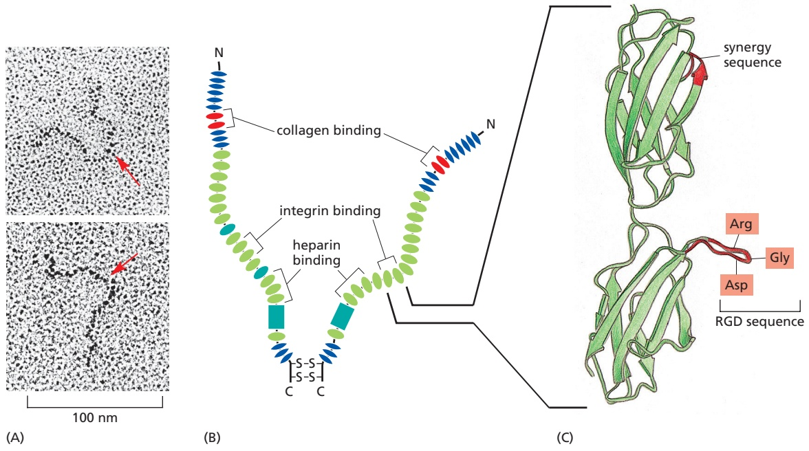

extracellular matrix, while others are involved in blood clotting. Peptides containing the RGD sequence have been useful in the development of anti-clotting drugs. Some snakes use a similar strategy to cause their victims to bleed: they secrete RGD-containing anti-clotting proteins called disintegrins into their venom.

The cell-surface receptors that bind RGD-containing proteins are members of the integrin family, which we describe in detail later. Each integrin specifically recognizes its own small set of matrix molecules, indicating that tight binding requires more than just the RGD sequence. Moreover, RGD sequences are not the only sequence motifs used for binding to integrins: many integrins recognize andMBoC7 m19.47/19.48 bind to other motifs instead.

## Tension Exerted by Cells Regulates the Assembly of Fibronectin Fibrils

Fibronectin can exist both in a soluble form, circulating in the blood and other body fluids, and as insoluble fibronectin fibrils, in which fibronectin dimers are cross-linked to one another by additional disulfide bonds and form part of the extracellular matrix. Unlike fibrillar collagen molecules, however, which can self-assemble into fibrils in a test tube, fibronectin molecules assemble into fibrils only on the surface of cells, and only where those cells possess appropriate fibronectin-binding proteins—in particular, integrins. The integrins provide a linkage from the fibronectin outside the cell to the actin cytoskeleton inside it. The linkage transmits tension to the fibronectin molecules—provided that they also have an attachment to some other structure—and stretches them, exposing cryptic binding sites in the fibronectin molecules (**Figure 19–49**). This allows them

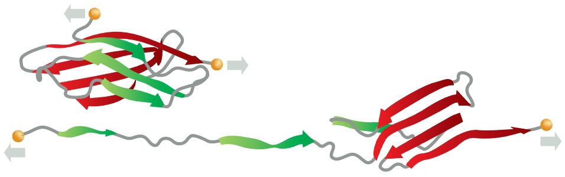

Figure 19–48 The structure of a fibronectin dimer. (A) Electron micrographs of individual fibronectin dimer molecules shadowed with platinum; red arrows mark the joined C-termini. (B) The two polypeptide chains are similar but generally not identical (being made from the same gene but from differently spliced mRNAs). They are joined by two disulfide bonds near the C-termini. Each chain is almost 2500 amino acids long and is folded into multiple domains (see Figure 19–47). As indicated, some domains are specialized for binding to a particular molecule. For simplicity, not all of the known binding sites are shown. (C) The three-dimensional structure of the ninth and tenth type III fibronectin repeats, as determined by x-ray crystallography. Both the Arg-Gly-Asp (RGD) and the “synergy” sequences shown in red are important for binding to integrins on cell surfaces. (A, from J. Engel et al., J. Mol. Biol. 150:97–120, 1981. With permission from Elsevier; C, from D.J. Leahy, Annu. Rev. Cell Dev. Biol. 13:363–393, 1997. With permission from Annual Reviews.)

Figure 19–49 Tension-sensing by fibronectin. Some type III fibronectin repeats are thought to unfold when fibronectin is stretched. The unfolding exposes cryptic binding sites that interact with other fibronectin molecules resulting in the formation of fibronectin filaments like those shown in Figure 19–50. (From V. Vogel and M. Sheetz, Nat. Rev. Mol. Cell Biol. 7:265–275, 2006. With permission from Springer Nature.)