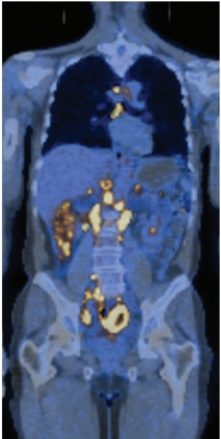
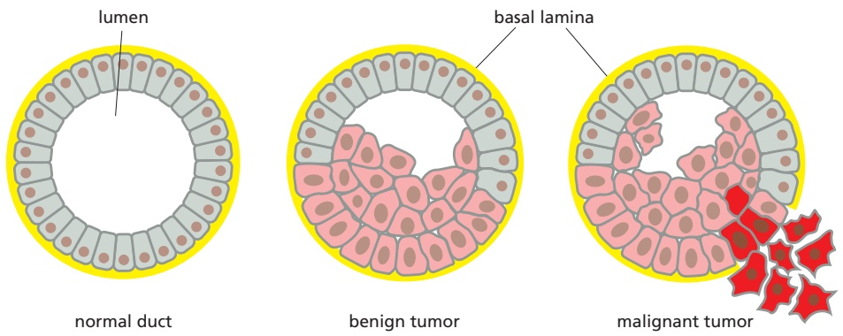
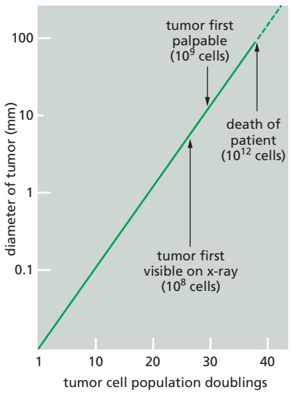
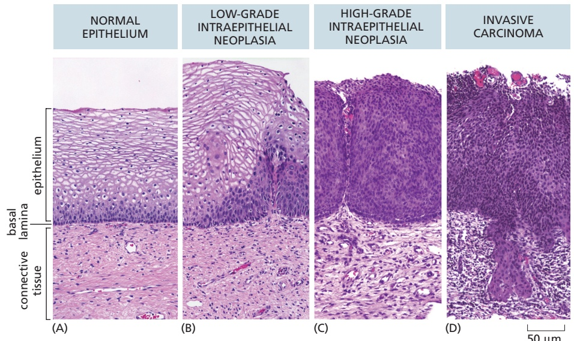
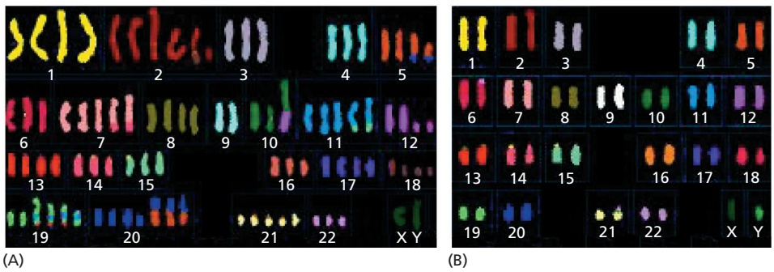
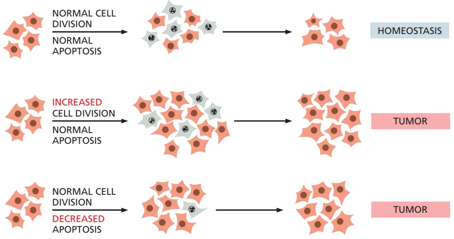
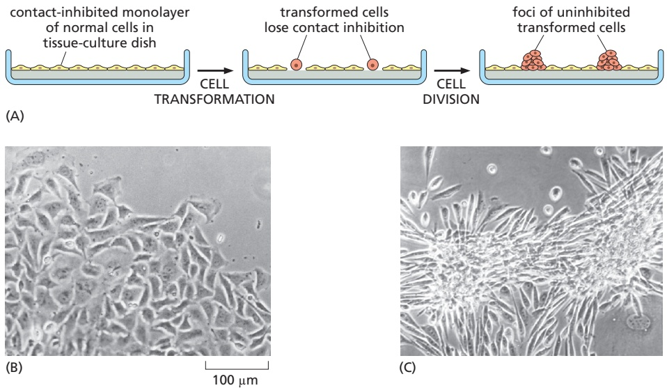
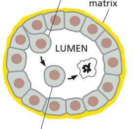
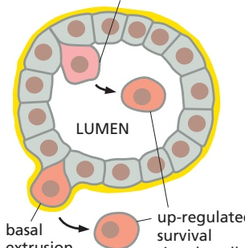
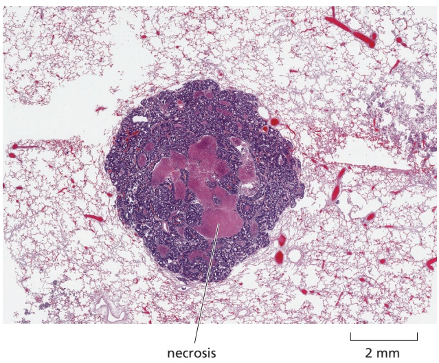

1163

C HAP T E R

20

About one in five of us will die of cancer, but that is not why we devote a chapter to this disease. Cancer cells break the most basic rules of cell behavior by which multicellular organisms are built and maintained, and they exploit every kind of opportunity to do so. These transgressions, while often tragic, help to reveal what the normal rules are and how they are enforced. As a result, cancer research helps to illuminate the fundamentals of cell biology—especially cell signaling (Chapter 15), the cell cycle and cell growth (Chapter 17), apoptosis (Chapter 18), and the control of tissue architecture (Chapters 19 and 22). Of course, with a deeper understanding of these normal processes, we also gain a deeper understanding of the disease and better tools to treat it.

In this chapter, we first consider what cancer is and describe the natural history of the disease from a cellular standpoint. We then discuss the molecular changes that make a cell cancerous. And we end the chapter by considering how our enhanced understanding of the molecular basis of cancer is leading to improved methods for its prevention and treatment.

Molecular disturbances that upset this harmony mean trouble for a multi-cellular society. In a human body with more than 1013 cells, billions of cells experience mutations every day, potentially disrupting the social controls. Most dangerously, a mutation may give one cell a selective advantage, allowing it to grow and divide slightly more vigorously and survive more readily than its neighbors. In this way, a mutated cell can become a founder of a growing mutant clone. Over time, repeated rounds of mutation, competition, and natural selection operating within the population of somatic cells can cause matters to go from bad to worse, jeopardizing the future of the multicellular organism. These are the basic ingredients of cancer: it is a disease in which an individual mutant clone of cells begins by prospering at the expense of its neighbors. In the end—as the

Unlike free-living cells such as bacteria or yeast, which compete to survive, the cells of a multicellular organism must be committed to collaboration. To coordinate their behavior, the cells send, receive, and interpret an elaborate set of extracellular signals that serve as social controls, directing cells how to act (discussed in Chapter 15). As a result, each cell normally behaves in a socially responsible manner—resting, growing, dividing, differentiating, or dying—as needed for the good of the organism.

## CANCER AS A MICROEVOLUTIONARY PROCESS

The body of an animal operates as a society or ecosystem, whose individual members are cells that reproduce by cell division and organize themselves into collaborative assemblies called tissues. This ecosystem is very peculiar, however, because self-sacrifice—as opposed to survival of the fittest—is the rule. Ultimately, all of the somatic cell lineages in animals dedicate their existence to the support of the germ cells, which alone have a chance of continued survival (discussed in Chapter 21). Because the genome of the somatic cells is the same as that of the germ-cell lineage that gives rise to sperm or eggs, through their self-sacrifice the somatic cells help to propagate copies of their own genes.

IN THIS CHAPTER

Cancer-critical Genes: How They Are Found and What They Do

Cancer as a Microevolutionary Process

Cancer Prevention and Treatment: Present and Future

---

1164

Chapter 20: Cancer

Figure 20–1 Metastasis. Malignant tumors typically give rise to metastases, making the cancer hard to eradicate. Shown in this fusion image is a whole-body scan of a patient with metastatic non-Hodgkin’s lymphoma (NHL). The background image of the body’s tissues was obtained by CT (computed x-ray tomography) scanning. Overlaid on this image, a PET (positron emission tomography) scan reveals the tumor tissue (yellow), detected by its unusually high uptake of radioactively labeled fluorodeoxyglucose (FDG). High FDG uptake occurs in cells with unusually active glucose uptake and metabolism, a characteristic of cancer cells (see Figure 20–18). The yellow spots in the abdominal region reveal multiple metastases. (Courtesy of S.S. Gambhir.)

clone evolves over time and spreads—it can destroy the entire cellular society (**Movie 20.1**).

In this section, we discuss the development of cancer as a microevolutionary process that takes place within the course of a human life span in a subpopulation of cells in the body. As we shall see, the process depends on the same principles of mutation and natural selection that have driven the evolution of living organisms on Earth for billions of years.

## Cancer Cells Bypass Normal Proliferation Controls and Colonize Other Tissues

Cancer cells are defined by two heritable properties: (1) they reproduce in defiance of the normal restraints on cell growth and division, and (2) they invade and colonize territories normally reserved for other cells. It is the combination of these properties that makes cancers particularly dangerous. An abnormal cell that goes through successive and inappropriate rounds of growth and division to proliferate out of control will give rise to a tumor, or neoplasm—literally, a new growth. As long as the neoplastic cells have not yet become invasive, however, the tumor is said to be **benign**. For most types of such neoplasms, removing or destroying the mass locally usually achieves a complete cure.

A tumor is considered a true cancer only if it is **malignant**; that is, when its cells have acquired the ability to invade surrounding tissue. Invasiveness is an essential characteristic of cancer cells. It allows them to break loose, enter blood or lymphatic vessels, and form secondary tumors called **metastases** at other sites in the body (**Figure 20–1**). In general, the more widely a cancer spreads, the harder it becomes to eradicate. It is metastases that usually kill the cancer patient by causing failure of a vital organ.

Figure 20–2 Cancer incidence and mortality in the United States. The estimated total number of new cases diagnosed in 2018 in the United States was 1,762,450, and total cancer deaths were 606,880. Note that deaths reflect cases diagnosed at many different stages and that well under half of the people who develop cancer die of it. The most common cancers are those of the digestive organs (including colon, pancreas, and liver), respiratory system (primarily lung and bronchus), reproductive tract (prostate and uterine), and breast. Skin cancers other than melanomas are not included in these figures, as almost all are cured easily and many are unrecorded. Each broad category has many subdivisions according to the specific cell type, the location in the body, and the microscopic appearance of the tumor. The data for the United Kingdom are similar. However, incidences are different in some other parts of the world, reflecting widespread exposures to different infectious agents and environmental toxins. (Data from American Cancer Society, Cancer Facts & Figures 2019.)

---

CANCER AS A MICROEVOLUTIONARY PROCESS

1165

Figure 20–3 Benign versus malignant tumors. A benign glandular tumor (pink cells; an adenoma) remains inside the basal lamina (yellow) that marks the boundary of the normal structure (a duct, in this example). In contrast, a malignant glandular tumor (red cells; an adenocarcinoma) can develop from a benign tumor cell, and it destroys the integrity of the tissue, as shown. There are many different forms that such tumors may take.

Cancers are traditionally classified according to the tissue and cell type from which they arise. **Carcinoma** is the name given to cancers arising from epithelial cells, and they are by far the most common cancers in humans, accounting for about 85% of cancers. Most of the normal cell turnover by proliferation and death in adults occurs in epithelia, and the cell types that undergo the most cell division cycles have the greatest probability of accumulating the multiple mutations needed to become cancerous. In addition, epithelial tissues are the most likely to be exposed to the various forms of physical and chemical damage thatMBoC7 m20.03/20.03 favor the development of cancer. **Figure 20–2** shows the types of cancers diagnosed in the United States, together with their incidence and death rates. After carcinomas, the next most common cancer types include the various **myelomas**, **leukemias**, and **lymphomas**, derived from white blood cells and their precursors (hemopoietic cells). **Sarcomas** that arise from connective tissue or muscle cells and cancers derived from cells of the nervous system are much less common.

In parallel with the set of names for malignant tumors, there is a related set of names for benign tumors: an adenoma, for example, is a benign epithelial tumor with a glandular organization; the corresponding type of malignant tumor is an adenocarcinoma (**Figure 20–3**).

Most cancers have characteristics that reflect their origin. Thus, for example, the cells of a basal-cell carcinoma, derived from a keratinocyte stem cell in the skin, generally continue to synthesize cytokeratin intermediate filaments, whereas the cells of a melanoma, derived from a pigment cell in the skin, will often (but not always) continue to make pigment granules. Cancers originating from different cell types are, in general, very different diseases. Basal-cell carcinomas of the skin, for example, are only locally invasive and rarely metastasize, whereas melanomas can become much more malignant and often form metastases. Basal-cell carcinomas are readily cured by surgery or local irradiation, whereas malignant melanomas, once they have metastasized widely, are frequently fatal.

Later, we shall see that there is also a different, newer way to classify cancers, one that cuts across the traditional classification by site of origin: we can now classify many of them in terms of the mutations that make the particular tumor cells cancerous. The final section of the chapter will show how this information can be crucial to the design and choice of treatments.

## Most Cancers Derive from a Single Abnormal Cell

Even after a cancer has metastasized, we can usually trace its origins to a single **primary tumor**, arising in a specific organ. The primary tumor is thought to arise by cell division from a single cell that initially experienced some heritable change. Subsequently, additional changes have accumulated in some of the descendants of this cell, allowing them to outgrow, out-divide, and often outlive their neighbors.

By the time it is first detected, a typical human cancer will have been developing for many years and will already contain a billion cancer cells or more (**Figure 20–4**). Tumors will usually also contain a variety of other cell types and

Figure 20–4 The growth of a typical human tumor, such as a tumor of the breast. The diameter of the tumor. / . is plotted on a logarithmic scale. Years may elapse before the tumor becomes noticeable. The doubling time for a typical breast tumor, for example, is about 100 days. However, particularly aggressive tumors may grow much more rapidly.

---

1166

Chapter 20: Cancer

associated extracellular matrix, termed the tumor stroma. For example, fibroblasts will be present in the supporting connective tissue associated with a carcinoma, in addition to immune cells and vascular endothelial cells. How can we be sure that the cancer cells are the clonal descendants of a single abnormal cell?

One way of proving clonal origin is through molecular analysis of the chromosomes in tumor cells. In almost all individuals with chronic myelogenous leukemia (CML), for example, we can distinguish the leukemic white blood cells from the individual’s normal cells by a specific chromosomal abnormality: the so-called Philadelphia chromosome, created by a translocation between the long arms of chromosomes 9 and 22 (**Figure 20–5**). When the DNA at the site of translocation is cloned and sequenced, it is found that the site of breakage and rejoining of the translocated fragments is identical in all the leukemic cells in any given individual, but that this site differs slightly (by a few hundred or thousand base pairs) from one individual to another. This is the expected result if, and only if, the cancer in each individual arises from a unique accident occurring in a single cell. (We will see later how this particular translocation promotes the development of CML by creating a novel hybrid gene encoding a protein that promotes cell proliferation.)

Many other lines of evidence, from a variety of different cancers, point to the same conclusion: most cancers originate from a single aberrant cell.

## Cancer Cells Contain Somatic Mutations

If a single abnormal cell is to give rise to a tumor, it must pass on its abnormality to its progeny: the aberration has to be heritable. Thus, the development of a clone of cancer cells depends on genetic changes. The tumor cells contain **somatic mutations**: they have one or more shared detectable abnormalities in their DNA sequence that distinguish them from the normal cells surrounding the tumor, as in the example of CML just described. (The mutations are called somatic because they occur in the soma, or body cells, not in the germ line.) Cancers are also driven by epigenetic changes—persistent, heritable changes in gene expression that result from modifications of chromatin structure without alteration of the cell’s DNA sequence. But somatic mutations that alter a DNA sequence appear to be a fundamental and universal feature, and cancer is in this sense a genetic disease.

Factors that cause genetic changes tend to provoke the development of cancer. Thus, **carcinogenesis** (the generation of cancer) can be linked to mutagenesis (the production of a change in the DNA sequence). This correlation is particularly clear for two classes of external agents: (1) chemical carcinogens (which typically cause simple changes in the nucleotide sequence), and (2) radiation, such as x-rays (which typically cause chromosome breaks and translocations) or ultraviolet (UV) light (which causes specific DNA base alterations).

As would be expected, people who have inherited a genetic defect in one of several DNA repair mechanisms, causing their cells to accumulate mutations at an elevated rate, run a heightened risk of cancer. Those with the disease xeroderma pigmentosum, for example, have defects in the system that repairs DNA damage induced by UV light, and they have a greatly increased incidence of skin cancers. Overall, inherited mutations are thought to play a role in 5–10% of all cancers, whereas somatic mutations and epigenetic changes are much more prevalent.

## A Single Mutation Is Not Enough to Change a Normal Cell into a Cancer Cell

It is estimated that there are $3 . 7   \times   1 0 ^ { 1 3 }$ cells in an average-sized human (not counting bacteria), and that $1 0 ^ { 1 6 }$ cell divisions occur within the body over the course of a typical lifetime. This cell proliferation occurs primarily in epithelia and the hemopoietic system and is balanced by cell death to maintain normal tissue homeostasis. Even in an environment that is free of mutagens, mutations would

Figure 20–5 The translocation between chromosomes 9 and 22 responsible for chronic myelogenous leukemia. The normal structures of chromosomes 9 and 22 are shown at the top. When a reciprocal translocation occurs between them at the indicated site, the result is the MBoC7 m20.05/20.05abnormal pair at the bottom. The smaller of the two resulting abnormal chromosomes (22q–) is called the Philadelphia chromosome, after the city where the abnormality was first recorded.

---

CANCER AS A MICROEVOLUTIONARY PROCESS

1167

occur spontaneously at an estimated rate of three per cell division, corresponding to about $1 0 ^ { - 6 }$ mutations per gene per cell division. This unavoidable error rate is set by fundamental limitations on the accuracy of DNA replication and repair (see pp. 253–254). This means that, over the course of a typical lifetime, every single human gene will have undergone mutation somewhere in the body on roughly $1 0 ^ { 1 0 }$ separate occasions. Among the resulting mutant cells, there will be many that have sustained deleterious mutations in genes that regulate cell growth and division, causing the cells to disobey the normal rules controlling cell turnover. Given the huge number of unavoidable mutations in a large organism like ourselves, the problem of cancer might seem to be not why it occurs, but why it occurs so infrequently.

Figure 20–6 Cancer prevalence as a function of age. Age versus malignant cancer prevalence is plotted for women in the Surveillance, Epidemiology, and End Results (SEER) 9 cancer registries for the year 2000. The prevalence of cancer rises steeply as a function of age. If only a single mutation were required to trigger a cancern20.212/20.06 and the mutation had an equal chance of occurring at any time, the prevalence of cancer would be the same at all ages. (Data from C. Harding et al., Cancer 118:1371–1386, 2012, doi 10.1002 /cncr.26376.)

If a mutation in a single gene were enough to convert a typical healthy cell into a cancer cell, we would not be viable organisms. Many lines of evidence indicate that the development of a cancer typically requires that a substantial number of independent, rare genetic and epigenetic accidents occur in the lineage that emanates from a single cell. One such indication comes from epidemiological studies of the incidence of cancer as a function of age (**Figure 20–6**). If a single mutation were responsible for cancer, occurring with a fixed probability per year, the chance of developing cancer in any given year of life should be independent of age. In fact, for most types of cancer, the incidence rises steeply with age—as would be expected if cancer is caused by a progressive, random accumulation of a set of mutations in a single lineage of cells. Notably, however, cancer incidence declines markedly among the very elderly. One interpretation of this phenomenon is that decreased cell proliferation, which is characteristic of declining stem cell function in octogenarians, provides fewer opportunities for mutation.

As discussed later, these indirect arguments linking the number of accumulated mutations to cancer development have now been confirmed by systematically sequencing the genomes of the tumor cells from individual cancer patients and cataloging the mutations that they contain.

## Many Cancers Develop Gradually Through Successive Rounds of Random Inherited Change Followed by Natural Selection

For those cancers known to have a specific external cause, the disease does not usually become apparent until long after exposure to the causal agent. The incidence of lung cancer, for example, does not begin to rise steeply until after decades of heavy smoking (**Figure 20–7**). Similarly, the incidence of leukemias in those exposed to intense radiation in Hiroshima and Nagasaki did not show a marked rise until about 5 years after the explosion of the atomic bombs. And industrial workers exposed for a limited period to chemical carcinogens do not usually develop the cancers characteristic of their occupation until 10, 20, or even more years after the exposure. During this long incubation period, the prospective cancer cells undergo a succession of changes, and the same presumably applies to cancers where the initial genetic lesion has no such obvious external cause.

The fact that the development of a cancer requires a gradual accumulation of mutations in a number of different genes within a cell helps to explain the wellknown phenomenon of **tumor progression**, whereby an initial mild disorder of cell behavior evolves gradually into a full-blown cancer (**Figure 20–8**).

At each stage of progression, some individual cell acquires an additional mutation or epigenetic change that gives it a selective advantage over its neighbors, making it better able to thrive in its environment—an environment that, inside a tumor, may be harsh, with low levels of oxygen, scarce nutrients, and the natural barriers to growth presented by the surrounding normal tissues. The larger the number of tumor cells, the higher the chance that at least one of them will undergo a change that favors it over its neighbors. Thus, as the tumor grows, progression accelerates. The offspring of the best-adapted cells continue to divide, eventually producing the dominant clones in a developing lesion

Figure 20–7 Smoking and lung cancer. A major increase in cigarette smoking that started in the early 1900s (blue line) caused a dramatic rise in lung cancer deaths (red line) after a lag time of about 20 years. Because cigarette smoking peaked in. / . 1980, lung cancer deaths are now declining after a similar lag. (Data from National Center for Health Statistics, Centers for Disease Control and Prevention, 2017.)

---

1168

Chapter 20: Cancer

Figure 20–8 Stages of progression in the development of cancer of the epithelium of the uterine cervix. Pathologists use standardized terminology to classify the types of disorders they see in tissue slices like those shown here. (A) In a stratified squamous epithelium, dividing cells are confined to the basal layer. (B) In this low-grade intraepithelial neoplasia (right half of image), dividing cells can be found throughout the lower third of the epithelium; the superficial cells are still flattened and show signs of differentiation. (C) In highgrade intraepithelial neoplasia, cells in all the epithelial layers are proliferating and exhibit defective differentiation. (D) True malignancy begins when the cells move through or destroy the basal lamina that underlies the epithelium and invade the underlying connective tissue. (Courtesy of Andrew J. Connolly.)

(**Figure 20–9**). Thus, tumor progression involves a large element of chance and usually takes many years, which may be why the majority of us will die of causes other than cancer.

Just as in the evolution of plants and animals, a kind of speciation often occurs: the original cancer cell lineage can diversify to give many genetically different subclones of cells. These may coexist in the same mass of tumor tissue; or they may migrate and colonize separate environments suited to their individual quirks, where they settle, thrive, and progress as independently evolving metastases. As new mutations arise within each tumor mass, different subclones may gain an advantage and come to predominate, only to be overtaken by others or outgrown by their own sub-subclones. The large amount of genetic diversity in most tumors is one of the chief factors that make cancer cures difficult; it also increases the importance of detecting a tumor as early as possible.

## Cancers Can Evolve Abruptly Due to Genetic InstabilityMBoC7 m20.08/20.08

If cancer cells evolved exclusively through the gradual accumulation of single deleterious mutations, then the time scale of transformation from premalignant disease to metastatic cancer should be predictable for a particular cancer type. However, this is not the case. As in the evolution of species, cancer evolution may proceed through long periods with no discernible change punctuated by the sudden generation of new phenotypes. The “Big Bang” theory of cancer evolution posits that in addition to gradual mutagenesis and selection for the fittest cells, periodic, cataclysmic genome disruption can promote rapid steps in the evolution of a cancer cell toward malignancy.

Unlike normal dividing cells, most human cancer cells accumulate genetic changes at an abnormally rapid rate and are said to be **genetically unstable**. This instability provides a selective advantage by speeding the process of tumor progression—allowing the subsequent accumulation of many additional mutations

<small>Figure 20–9 Clonal evolution during tumor progression. In this schematic diagram, a tumor develops through repeated rounds of mutation and proliferation, giving rise to a clone of fully malignant cancer cells. At each step, a single cell undergoes a mutation that either enhances cell proliferation or decreases cell death, so that its progeny become the dominant clone in the tumor. Proliferation of each clone hastens the occurrence of the next step of tumor progression by increasing the size of the cell population that is at risk of undergoing an additional mutation. The final step depicted here is invasion through the basal lamina, an initial step in metastasis. In reality, there may be more than the three steps shown here, depending on the tumor type, and a combination of genetic and epigenetic changes is involved. Not shown here is the fact that, over time, a variety of competing subclones will often arise in a tumor. As we will discuss later, this heterogeneity complicates cancer therapies.</small>

---

CANCER AS A MICROEVOLUTIONARY PROCESS

1169

Figure 20–10 Chromosome complements (karyotypes) of colon cancers showing different kinds of genetic instability. (A) The karyotype of a typical cancer shows many gross abnormalities in chromosome number and structure. Considerable variation can also exist from cell to cell (not shown). (B) The karyotype of a tumor that has a stable chromosome complement with few chromosomal anomalies; the genetic abnormalities in these tumors are mostly invisible, having been created by defects in DNA repair. All of the chromosomes in this figure were stained as in Figure 4–11, the DNA of each human chromosome being marked with a different combination of fluorescent dyes. (Courtesy of Wael Abdel-Rahman and Paul Edwards.)

required to produce a cancer. But the extent of the instability and its molecular origins differ from cancer to cancer and from individual to individual, both in severity and in character. In some cases, the karyotype—the set of chromosomes as they appear at mitosis—is normal or nearly so, but many point mutations are detected in individual genes, suggesting a failure of the repair mechanisms that normally correct errors in the replication or maintenance of DNA sequences. Often, however, the cancer cell karyotype is severely disordered, with many chromosomal breaks and rearrangements, resulting in many deletions, duplications, and amplifications of parts of the genome (Figure 20–10). Such highly disrupted genomes indicate that catastrophic events have occurred, likely due to defects in chromosome duplication or segregation during mitosis. For example, a common feature of many cancer cells is a failure to correctly attach all of the chromosomes to the mitotic spindle, which can result in chromosome breakage or aneuploidy,. / . the gain or loss of individual chromosomes. More dramatically, mitotic defects can also lead to the isolation of a single chromosome in one of the daughter cells within a “micronucleus,” where it is prone to massive DNA damage and chromosomal rearrangement, termed “chromothripsis” (Figure 20–11).

Figure 20–11 Chromosome segregation defects can give rise to aneuploidy and/or chromothripsis. Correct chromosome segregation requires that replicated copies of each chromosome, termed sister chromatids, are attached to opposite spindle poles. A mistake in this process is depicted in which one sister of a chromatid pair is attached to both spindle poles and is therefore pulled in opposite directions during anaphase, causing it to lag behind in the center of the cell, resulting in a lagging chromosome. (A) A lagging chromosome may end up in the same daughter cell as its sister, resulting in aneuploidy with n + 1 and n – 1 karyotypes (n = chromosome number). MBoC7 n20.202/20.11(B) Another possible outcome is that the lagging chromosome remains separated from the rest of the chromosomes in the daughter cell, forming its own “micronucleus” in the following interphase. DNA replication in micronuclei is frequently incomplete, and DNA damage accumulates, but this does not delay the cell cycle. In the next mitosis, the isolated chromosome is prone to undergo fragmentation during chromosome condensation, in a process called chromothripsis. (C) Micronuclei can persist over several generations of cell division, undergoing rounds of chromosome fragmentation and reassembly, or they can be reincorporated into a daughter cell nucleus (Movie 20.2). The fluorescence micrograph shows a primary nucleus and a micronucleus present in the same cell. Nuclear DNA staining (blue) appears uneven due to normal nuclear substructures. (C, from M.L. Leibowitz et al., Annu. Rev. Genet. 49:183–211, 2015. With permission from Annual Reviews.)

---

1170

Chapter 20: Cancer

From an evolutionary perspective, none of this should be a surprise: anything that increases the probability of random changes in gene function that are heritable from one cell generation to the next—and that are not too deleterious— will likely speed the evolution of a clone of cells toward malignancy, thereby causing this property to be selected for during tumor progression. Genome instability likely also contributes to the heterogeneity of cancer cells frequently observed within an individual tumor. By leading to multiple aberrant karyotypes, chromosome mis-segregation, aneuploidy—and more rarely chromothripsis— all act to shuffle the genetic cards, allowing cancer cells to sample a variety of different phenotypes and for different clones to coexist within a population.

## Some Cancers May Harbor a Small Population of Stem Cells

Self-renewing tissues, where cell division continues throughout life, are the breeding ground for the great majority of human cancers. They include the epidermis (the outer epithelial layer of the skin), the epithelial lining of the digestive and reproductive tracts, and the bone marrow, where blood cells are generated (see Chapter 22). With each cell division cycle comes the chance of mutation, which can be amplified dramatically by environmental factors. As a result, there is a strong correlation between the frequency of cell division and the incidence of cancer in a particular tissue (**Figure 20–12**).

In almost all proliferating tissues, renewal depends on the presence of stem cells, which divide to give rise to terminally differentiated cells, which do not divide. This creates a mixture of cells that are genetically identical and closely related by lineage but are in different states of differentiation. Many tumors similarly appear to consist of populations of cells in various states of differentiation. A comparison of tumor development to the normal homeostasis of stem cell– derived tissues may help us better understand the origin of some cancers and also why some tumors are so resistant to treatment.

To consider the implications, it is helpful to consider how normal stem-cell systems operate. When a normal stem cell divides, each daughter cell has a choice—it can remain a stem cell or it can commit to a pathway leading to differentiation. A stem-cell daughter remains in place to generate more cells in the future. A committed daughter typically undergoes some rounds of cell proliferation (as a so-called transit amplifying cell), but it then stops dividing, terminally differentiates, and eventually is discarded and replaced (it may die by apoptosis, with recycling of its materials, or be shed from the body). Therefore, stem cells tend to be vastly outnumbered by the cells that are committed to terminal differentiation. However, though few and far between and often relatively slowly dividing, stem cells carry the entire responsibility for maintenance of the tissue

Figure 20–12 The lifetime cancer risk is correlated with the division rate of the cell of origin of the cancer. This plot shows the relationship between the number of stem cell divisions in a given tissue and the lifetime risk of cancer in that tissue. At the lower extreme are osteosarcomas (cancers that originate in bone), which are derived from mesenchymal cells that divide infrequently and rarely give rise to cancer. In contrast, epithelial cells of the skin and digestive tract are highly proliferative and give rise to malignancies much more frequently. Dots represent specific cancer types and are colored to indicate their classification: sarcoma (light blue); neuronal (dark blue); carcinoma (purple); and skin (red). Note that environmental factors strongly amplify the risk of many cancers, such as for lung cancer between smokers and nonsmokers. (Data from C. Tomasetti and B. Vogelstein, Science 347:78–81, 2015, doi 10.1126/science.1260825.)

---

CANCER AS A MICROEVOLUTIONARY PROCESS

1171

Figure 20–13 Cancer stem cells can be responsible for a tumor’s growth and yet remain only a small part of the tumorcell population. (A) Lineage of stem cells producing transit amplifying cells. (B) How a small proportion of cancer stem cells can maintain a tumor. Although the much more abundant transit amplifying cells will eventually die, the number of cancer stem cells will increase slowly but steadily to produce a growing tumor.

over the long term. In a healthy body, feedback controls regulate the process, adjusting the balance of cell-fate choices, cell proliferation, and cell death in a way that corrects for any departure from proper cell population numbers.

During the development of cancer, mutations have the potential to subvert the normal cellular differentiation program in multiple ways; for example, by leading to an overproliferation of transit amplifying cells or to an inhibition of their terminal differentiation or death. More insidious, however, are mutations that lead to the generation of cancer stem cells. Some tumors appear to exhibit this etiology: they consist of rare **cancer stem cells** capable of self-renewal, together with much larger numbers of dividing transit amplifying cells that are derived from the cancer stem cells but have a limited capacity for self-renewal (**Figure 20–13**).

Evidence for the existence of cancer stem cells comes from experiments in which individual cells from a cancer are tested for their ability to give rise to fresh tumors when implanted into a mouse. It has been known for more than half a century that there is usually only a small chance—typically much less than 1%— that a tumor cell chosen at random and tested in this way will generate a new tumor. This by itself does not prove that the tumor cells are heterogeneous: like seeds scattered on difficult ground, each of them may have only a small chance of finding a spot where it can survive and grow. Modern technologies for sorting cells have shown, however, that subpopulations of cancer cells expressing markers typically found on the surface of stem cells have a greatly enhanced ability to found new tumors. Moreover, the new tumors consist of mixtures of cells that express the stem cell markers and cells that do not, all generated from the same founder cell that expressed the markers. The cancer stem-cell phenomenon, whatever its basis, implies that even when the tumor cells are genetically similar, they may be phenotypically diverse. A treatment that wipes out tumor cells in one state will often allow survival of others that remain a danger. Radiotherapy or a cytotoxic drug, for example, may selectively kill off the rapidly dividing cells, reducing the tumor volume to almost nothing, and yet spare a few slowly dividing cells that go on to resurrect the disease. This greatly adds to the difficulty of cancer therapy, and it is part of the reason why treatments that seem at first to succeed often end in relapse and disappointment.

## A Common Set of Hallmarks Typically Characterizes Cancerous Growth

Clearly, to produce a cancer, a cell must acquire a range of aberrant properties—a collection of subversive new skills—as it evolves. Different cancers require different combinations of these properties. Nevertheless, cancers all share some common hallmarks. These defining properties are commonly combined with other features, such as genetic instability, that help the miscreants to arise

---

1172

Chapter 20: Cancer

and thrive. A list of the key attributes of cancer cells in general would include the following:

1. Altered homeostasis that results in cells growing and dividing at a faster rate than they die

2. Bypass of normal limits to cell proliferation

3. Evasion of cell-death signals

4. Altered cellular metabolism

5. Manipulation of the tissue environment to support cell survival and to evade a deleterious immune response

6. Escape of cells from their home tissues and proliferation in foreign sites (metastasis)

Below we discuss these key features in more detail. In the next section of the chapter, we examine the mutations and molecular mechanisms that underlie these and other properties of cancer cells.

## Cancer Cells Display an Altered Control of Growth and Homeostasis

Mutability and large cell population numbers create opportunities for mutations to occur, but the driving force for development of a cancer has to come from some sort of selective advantage possessed by the mutant cells. Most obviously, a mutation or epigenetic change can confer such an advantage by increasing the rate at which a clone of cells proliferates or by enabling it to continue proliferating when normal cells would stop or die. One of the most important properties of many types of cancer cells is that they fail to undergo apoptosis when a normal cell would do so (**Figure 20–14**).

Cancer cells that can be grown in culture or cultured cells artificially engineered to contain the types of mutations encountered in cancers typically show a **transformed** phenotype. They are abnormal in their shape, their motility, their responses to growth factors in the culture medium, and, most characteristically, in the way they react to contact with the culture dish and with one another. Whereas most normal cells will not divide unless they are attached to the surface, transformed cells will often divide even if held in suspension. More generally, transformed cells no longer require all of the positive signals from their surroundings that normal cells require. In addition, transformed cells fail to recognize some negative influences. Thus, for example, normal cells become inhibited from moving and dividing when the culture reaches confluence (where the cells are touching one another), while transformed cells continue moving and dividing even after confluence, and so pile up in layer upon layer in the culture dish (**Figure 20–15**).

Figure 20–14 Both increased cell division and decreased apoptosis can contribute to tumorigenesis. In normal tissues, apoptosis balances cell division to maintain homeostasis (see Movie 18.1). During the development of cancer, either an increase in cell division or an inhibition of apoptosis can lead to the increased cell numbers important for tumorigenesis. The cells fated to undergo apoptosis are gray in this diagram. Both an increase in cell division and a decrease in apoptosis commonly contribute to tumor growth.

---

basal extrusion of tumor cell

CANCER AS A MICROEVOLUTIONARY PROCESS

1173

20 µm

Figure 20–15 Loss of contact inhibition by cancer cells in cell culture. Most normal cells stop proliferating once they have carpeted the dish with a single layer of cells: proliferation seems to depend on contact with the dish and to be inhibited by contacts with other cells—a phenomenon known as contact inhibition. Cancer cells, in contrast, usually disregard these restraints and continue to grow, so that they pile on top of one another (Movie 20.3). (A) Schematic drawing. (B and C) Light micrographs of normal (B) and transformed (C) fibroblasts. (B and C, courtesy of Lan Bo Chen.)

Cancer cells also misbehave in their natural environment, embedded in a tissue. For example, normal cells of the gut epithelium are constantly turning over through rounds of cell division and death, but maintain their barrier function by seamlessly extruding old or damaged cells into the gut lumen. Once detached from the matrix and matrix-associated survival signals, these cells die through a form of apoptosis. By overriding normal death signals, transformed cells may be able to survive after their ejection from the epithelium. However, because the normal direction of cell extrusion is into the lumen of the gut, they would nevertheless be swept away through the waste canal. However, some of the mutations selected for during cancer progression can change the direction of extrusion, thereby enabling the tumor cells to cross the basement membrane and invade the surrounding tissue, potentially leading to metastasis (**Figure 20–16**).

In conclusion, by disobeying the normal etiquette of where to live and when to die, cancer cells both evade growth suppression and explore new opportunities to prosper and multiply.

## Human Cancer Cells Escape a Built-in Limit to Cell Proliferation

Many normal human cells have a built-in limit to the number of times that they can divide when stimulated to proliferate in culture: they permanently stop dividing after a certain number of population doublings (25–50 for human fibroblasts, for example). This cell-division-counting mechanism is termed **replicative cell senescence**, and it generally depends on the progressive shortening of the telomeres at the ends of chromosomes, a process that eventually changes their structure (discussed in Chapter 17). As discussed in Chapter $5 ,$ the maintenance

apical extrusion extracellular(A) 7 matrix

loss of anchorage-dependent survival signals, apoptosis

(B)

apical extrusion of tumor cell(C)

up-regulated survival signals; cell bypasses apoptosis and escapes

Figure 20–16 The direction in which a cell extrudes from an epithelium has important consequences for its fate. (A) Under normal conditions, as cells proliferate in a tissue such as the gut or mammary epithelium and become more crowded, they are extruded into the lumen to maintain cell number. Extruded cells generally undergo apoptosis due to loss of survival signals. (B) Fluorescence micrograph of a cluster of mammary epithelial cells grown in three-dimensional (3D) culture and stained for its basal boundary (red) and nuclei (blue). As the sac of tissue grows, the central cells occupying the lumen undergo apoptosis as shown by staining with caspase-3 (green). (C) Tumor cells with up-regulated survival signals that have been extruded apically might survive but are likely to be eliminated nevertheless; for example, by excretion through the digestive tract or by secretion from the mammary gland. In contrast, tumor cells that have been extruded basally can more readily initiate invasion. (B, courtesy of J. Debnath.)

---

1174

Chapter 20: Cancer

of telomere DNA during S phase depends on the enzyme telomerase, which maintains a special telomeric DNA sequence that promotes the formation of protein cap structures to protect chromosome ends. Because many proliferating human cells (stem cells being an exception) are deficient in telomerase, their telomeres shorten with every division, and their protective caps deteriorate, creating a DNA damage signal because the unprotected chromosome ends resemble double-strand breaks. Eventually, the altered chromosome ends trigger a permanent cell-cycle arrest or cause the cell to die.

Human cancer cells avoid replicative cell senescence in one of two ways. Most often, they reactivate the telomerase gene as they proliferate, so that their telomeres do not shorten or become uncapped; alternatively, they can evoke a mechanism based on a DNA repair process that depends on homologous recombination for elongating their chromosome ends (called ALT). Regardless of the strategy used, the result is that the cancer cells continue to proliferate under conditions when normal cells would stop due to telomere erosion.

## Cancer Cells Have an Abnormal Ability to Bypass Death Signals

A large multicellular organism requires powerful safety mechanisms that guard against the trouble caused by damaged and deranged cells. These mechanisms are essential because, as previously explained, a large number of mutated cells will inevitably be produced. Normally, internal disorder gives rise to danger signals in the faulty cell, activating protective measures to reverse and cure this disorder or, failing that, activating decisions that lead to cell death by apoptosis (see Chapter 18). To survive, cancer cells require mutations to elude or break through these defenses designed to eliminate defective cells.

Cancer cells generally contain mutations that drive the cell into an abnormal state, where metabolic processes may be unbalanced and essential cell components may be produced in ill-matched proportions. States of this type, where the cell’s homeostatic mechanisms are inadequate to cope with an imposed disturbance, are loosely referred to as states of cell stress. As one example, chromosome breakage and other forms of DNA damage are commonly observed during the development of cancer, reflecting the genetic instability that cancer cells display. Thus, to survive and divide without limit, a prospective cancer cell must accumulate changes that disable the normal safety mechanisms that would otherwise cause a cell that is stressed to commit suicide by apoptosis.

While cancer cells tend to avoid apoptosis, this does not mean that they rarely die. On the contrary, in the interior of a large solid tumor, cell death often occurs on a massive scale: living conditions are difficult, with severe competition among the cancer cells for oxygen and nutrients. Most of these cells die by an alternative cell-death mechanism termed necrosis (**Figure 20–17**).

Figure 20–17 The interior of a large tumor is deprived of oxygen and nutrients. This cross section of a colon adenocarcinoma that has metastasized to the lung shows colorectal cancer cells that have formed a cohesive nodule (darkstaining region). The metastasis has central pink areas of necrosis where dying cancer cells have outgrown their blood supply and burst open, releasing their contents. Such anoxic regions are common in the interior of tumors. (Courtesy of Andrew J. Connolly.)