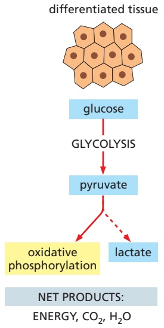
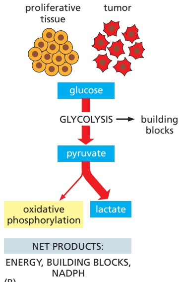
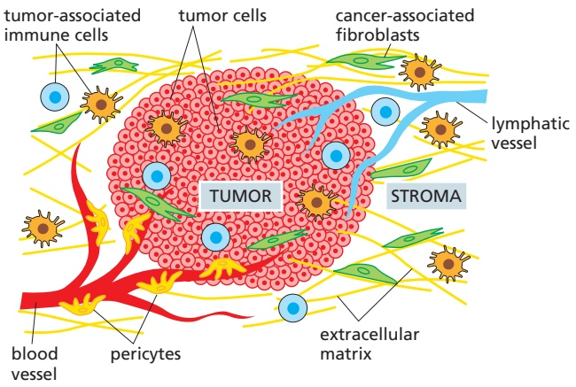
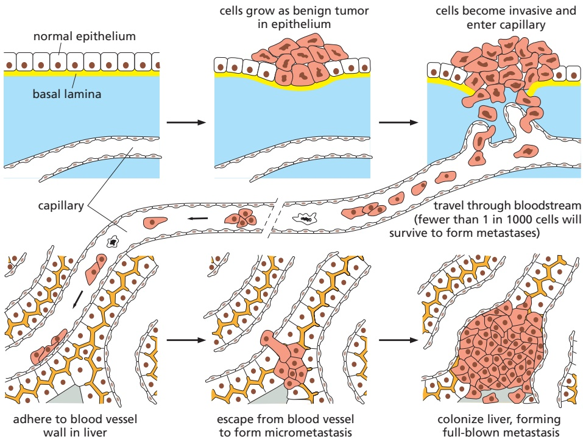
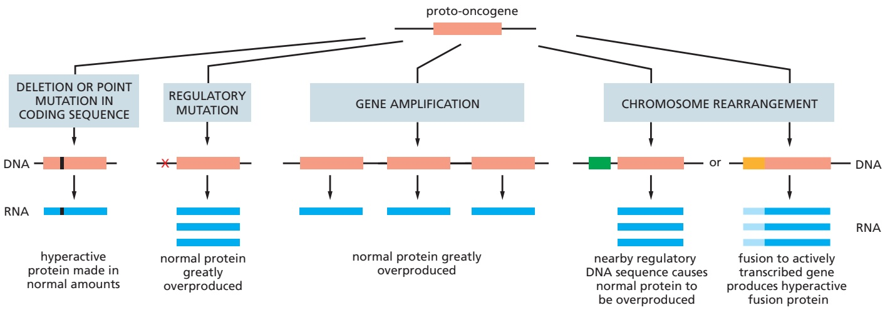
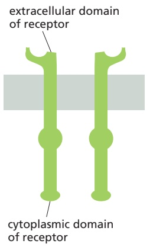
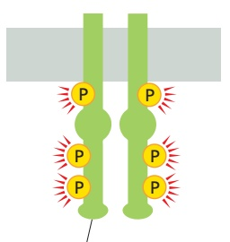
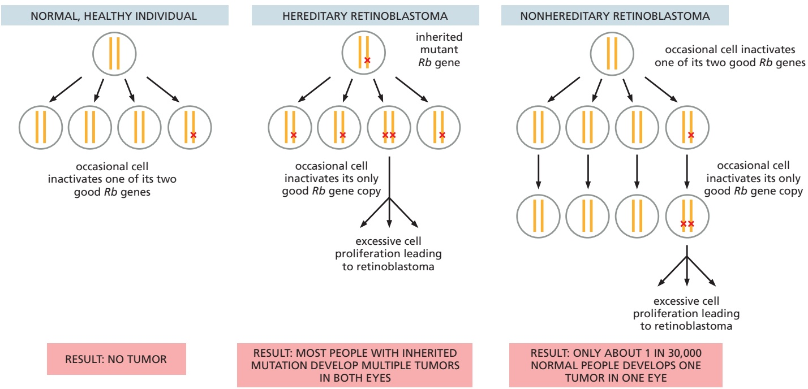
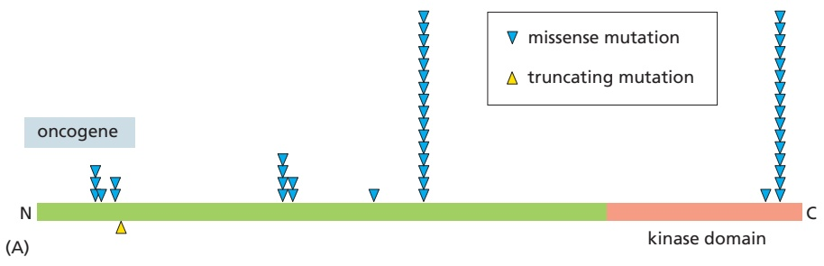
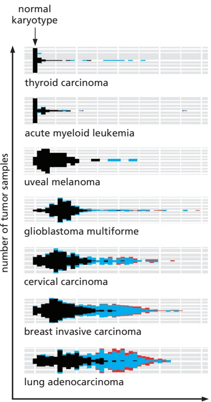

CANCER AS A MICROEVOLUTIONARY PROCESS

1175

(A)

(B)

Figure 20–18 The Warburg effect in tumor cells reflects a dramatic change in glucose uptake and sugar metabolism. (A) Cells that are not proliferating will normally oxidize nearly all of the glucose that they import from the blood to produce ATP through oxidative phosphorylation that takes place in their mitochondria. Only when deprived of oxygen will these cells generate most of their ATP from glycolysis, converting the pyruvate produced to lactate in order to regenerate the NAD+ that they need to keep glycolysis going (see Figure 2–50). (B) Tumor cells, by contrast, will generally produce abundant lactate even in the presence of oxygen. This results from a greatly increased rate of glycolysis that is fed by a very large increase in the rate of glucose import. In this way, tumor cells resemble the rapidly proliferating cells in embryos, which likewise require for biosynthesis a large supply of the smallmolecule building blocks that can be produced from imported glucose (see also Figure 2–60).

The tumor grows because the cell birthrate outpaces the cell death rate, but often by only a small margin. For this reason, the time that a tumor takes to double in size can be far longer than the cell-cycle time of the tumor cells.

## Cancer Cells Have Altered Sugar Metabolism

Given sufficient oxygen, differentiated cells in most adult tissues will fully oxidize almost all the carbon in the glucose they take up to $\mathrm { C O _ { 2 } } ,$ which is eventually exhaled by the lungs as a waste product. A growing tumor needs nutrients in abundance to provide the building blocks to make new macromolecules. Correspondingly, most tumors are metabolically more similar to a growing embryo than to normal adult tissue. Tumor cells consume glucose avidly, importing it from the blood at a rate that can be as much as 100 times higher than that for neighboring normal cells. Moreover, only a fraction of this imported glucose is fully oxidized to $\mathrm { C O _ { 2 } }$ by mitochondrial oxidative phosphorylation, which normally enables highly efficient production of ATP. Instead, the metabolism of carbon atoms from glucose is rewired to support the production of raw materials for the synthesis of the proteins, nucleic acids, and lipids that enable cellular proliferation (**Figure 20–18**). In other words, even though glycolysis is a much less efficient mode of ATP production than oxidative phosphorylation, it can continue unabated in cancer cells that find themselves in an oxygen-poor environment, and it has the critical added benefit of producing abundant cellular building blocks.

This tendency of tumor cells to de-emphasize oxidative phosphorylation even when oxygen is plentiful, while at the same time taking up large quantities of glucose, is necessary for the rapid proliferation of many cancer cells and is called the Warburg effect—so named because Otto Warburg first noticed the phenomenon in the early twentieth century. It is this abnormally high glucose uptake that allows tumors to be selectively imaged in whole-body scans (see Figure 20–1), thereby providing one way to monitor cancer progression and responses to treatment.

## The Tumor Microenvironment Influences Cancer Development

While the cancer cells in a tumor are the bearers of dangerous mutations and are often grossly abnormal, the other cells in the tumor—especially those of the supporting connective tissue, or **stroma**—are far from passive bystanders. The development of a tumor relies on a two-way communication between the cancer cells and tumor stroma, just as the normal development of epithelial organs relies on communication between epithelial cells and mesenchymal cells (discussed in Chapter 22).

---

1176

Chapter 20: Cancer

Figure 20–19 The tumor microenvironment plays a role in tumorigenesis. Tumors consist of many cell types, including cancer cells, endothelial cells, pericytes (vascular smooth muscle cells), fibroblasts, and inflammatory white blood cells. Communication among these and other cell types plays an important part in tumor development. Note, however, that only the cancer cells in a tumor are thought to contain mutations that make them genetically abnormal.

The stroma provides a framework for the tumor. As for normal connective tissue, the stroma is composed of fibroblasts and inflammatory white bloodMBoC7 n20.214/20.19 cells and of the endothelial cells that form blood and lymphatic vessels with their attendant smooth muscle cells (**Figure 20–19**). As a carcinoma progresses, the cancer cells induce changes in this stroma by secreting signal proteins that alter the behavior of the stromal cells and proteolytic enzymes that modify the extracellular matrix. The stromal cells in turn act back on the tumor cells by secreting signal proteins that stimulate cancer cell growth and division and proteases that further remodel the extracellular matrix. In these ways, the tumor and its stroma evolve together, like weeds and the ecosystem that they invade, and the tumor can become dependent on its particular stromal cells. Experiments using mice indicate that the growth of some transplanted carcinomas depends on the tumor-associated fibroblasts and that normal fibroblasts will not suffice.

Cancer cells have a complex interaction with the cells of the immune system that are present in the stroma, which have the potential to destroy the tumor if it is recognized as aberrant tissue but can also promote tumor growth by providing signals that stimulate cancer cell proliferation. The tumor can manipulate the immune system to its advantage in at least two ways. First, tumors may invoke an inflammatory reaction similar to what occurs when normal tissue is damaged, which helps them acquire the stroma they need for survival and growth. Tumors have therefore been likened to unhealed wounds, eliciting some of the same responses, including an increase in the permeability of nearby blood vessels, which allows the flow of signaling molecules in and out of the vessels, and the deposition of extracellular matrix. Tumors also stimulate the formation of new blood vessels, a process termed angiogenesis, which promotes survival of a tumor as it grows larger and becomes hypoxic in its interior. Second, and of equal importance, the tumor establishes an immunosuppressive microenvironment by blocking the activation of white blood cells that could lead to its destruction. Strategies that override this ability of a tumor to suppress an immune response have recently emerged as powerful tools in cancer therapy, and they are described in the last section of this chapter.

## Cancer Cells Must Survive and Proliferate in a Foreign Environment

In order to kill us, cancer cells generally need to spread and multiply at new sites in the body through a process called metastasis. This is the most deadly—and least understood—aspect of cancer, being responsible for 90% of cancer-associated deaths. By spreading through the body, a cancer becomes almost impossible to eradicate by either surgery or local irradiation. **Metastasis** is itself a multistep process: the cancer cells first have to invade local tissues and vessels, move through the circulation, leave the vessels, and then establish new cellular colonies

---

CANCER AS A MICROEVOLUTIONARY PROCESS

1177

Figure 20–20 Steps in the process of metastasis. This example illustrates the spread of a tumor from its site of origin (such as the bladder) to another organ (such as the liver). Tumor cells may enter the bloodstream directly by crossing the wall of a blood vessel, as diagrammed here, or, more commonly perhaps, by crossing the wall of a lymphatic vessel that ultimately discharges its contents (lymph) into the bloodstream. Tumor cells that have entered a lymphatic vessel often become trapped in lymph nodes along the way, giving rise to lymph-node metastases. Studies in animals show that typically fewer than one in every thousand malignant tumor cells introduced into the bloodstream is viable after 24 hours, and that less than 0.1% of these surviving circulating tumor cells (CTCs) will colonize a new tissue so as to produce a detectable tumor at a new site.

at distant sites (**Figure 20–20**). Each of these events is complex, and most of the molecular mechanisms involved are not yet clear, but the last step—colonization of distant sites—is rate limiting.

For a cancer cell to become malignant, it must break free of constraints that keep normal cells in their proper places and prevent them from invading neighboring tissues. Invasiveness is thus one of the defining properties of malignant tumors, which show a disorganized pattern of growth and ragged borders, with extensions into the surrounding tissue (see, for example, Figure 20–8). Although the underlying molecular changes are not well understood, invasiveness almost certainly requires a disruption of the adhesive mechanisms that normally keep cells tethered to their proper neighbors and to the extracellular matrix.

The next step in metastasis—the establishment of colonies in distant organs— begins with entry into the circulatory system: the invasive cancer cells must penetrate the wall of a blood or lymphatic vessel. Lymphatic vessels, being larger and having more flimsy walls than blood vessels, allow cancer cells to enter in small clumps; such clumps may then become trapped in lymph nodes, giving rise to lymph-node metastases. The cancer cells that enter blood vessels, in contrast, do so singly or, more rarely, in small clusters. With modern techniques for sorting cells according to their surface properties, it has become possible to detect these circulating tumor cells (CTCs) in samples of blood from cancer patients, even though they are only a minute fraction of the total blood-cell population. Notably, in a mouse model, CTC clusters gave rise to metastases at a significantly higher rate than single CTCs did. Presumably the adhesion of epithelial-derived cancer cells to one another helps to override death signals and suppress apoptosis.

Of the cancer cells that enter the lymphatics or bloodstream, only a tiny proportion succeed in making their exit, settling in new sites, and surviving and proliferating there as founders of metastases. To discover which of the later steps in metastasis present cancer cells with the greatest difficulties, one can label the cells with a fluorescent dye or green fluorescent protein (GFP), inject them into the bloodstream of a mouse, and then monitor their fate (**Movie 20.4**). In such experiments, one observes that many cells survive in the circulation, lodge in small vessels, and exit into the surrounding tissue, regardless of whether they come from a tumor that metastasizes or one that does not. Some cells die immediately after they enter foreign tissue; others survive entry into the foreign tissue but

---

1178

Chapter 20: Cancer

fail to proliferate. Still others divide a few times and then stop, forming micrometastases containing ten to several thousand cells. Very few establish full-blown metastases. Experiments show that fewer than one in thousands, perhaps one in millions, manages this feat. The final step of colonization seems to be the most difficult: like the Vikings who landed on the inhospitable shores of Greenland, the migrant cells may fail to survive in the alien environment or they may only thrive there for a short while to found a little colony—a micrometastasis—that then dies out (**Movie 20.5**).

Many cancers are discovered before they have managed to found metastatic colonies, and these can be cured by destruction of the primary tumor. But on occasion, an undetected, distant micrometastasis will remain dormant for many years, only to reveal its presence by erupting into growth to form a large secondary tumor long after the primary tumor has been removed.

## Summary

Cancer cells, by definition, grow and proliferate in defiance of normal controls (that is, they are neoplastic) and gain the ability to invade surrounding tissues and colonize distant organs (that is, they are malignant). By giving rise to secondary tumors, or metastases, they become difficult to eradicate by surgery or local irradiation. Cancers are thought to originate from a single cell that has experienced an initial mutation, but the progeny of this cell must undergo many further changes to become cancerous. Tumor progression usually takes many years and reflects the operation of a Darwinian-like process of evolution, in which somatic cells undergo mutation and epigenetic changes accompanied by natural selection and occasional bursts of genomic chaos that give rise to heterogeneity.

Cancer cells acquire a variety of special properties as they evolve, multiply, and spread. Their mutant genomes enable them to grow and divide in defiance of the signals that normally keep cell proliferation under tight control. As part of the evolutionary process of tumor progression, cancer cells acquire a collection of additional abnormalities, including defects in the controls that permanently stop cell division or induce apoptosis in response to cell stress or DNA damage and defects in the mechanisms that normally keep cells from straying from their proper place. All of these changes increase the ability of cancer cells to survive, grow, and divide in their original tissue and then to metastasize, founding new colonies in foreign environments. The evolution of a tumor also depends on other cells present in the tumor microenvironment, collectively called stromal cells, that the cancer attracts and manipulates.

Because many changes are needed to confer this collection of asocial behaviors, it is not surprising that most cancer cells are genetically and/or epigenetically unstable. This instability is thought to be selected for in the clones of aberrant cells that are able to produce tumors, because it greatly accelerates the accumulation of the further genetic and epigenetic changes that are required for tumor progression.

## CANCER-CRITICAL GENES: HOW THEY ARE FOUND AND WHAT THEY DO

As we have seen, cancer depends on the accumulation of heritable changes in somatic cells; that is, changes that are transmitted by a cell to its progeny. To understand it at a molecular level we need to identify the mutations and epigenetic alterations involved and to discover how they give rise to cancerous cell behavior. Finding the relevant cells is often easy; they are favored by natural selection and call attention to themselves by giving rise to tumors. But how do we identify those genes that have undergone cancer-promoting changes among all the other genes in the cancerous cells? A typical cancer depends on a whole set of mutations and epigenetic changes that are never exactly the same in two different patients, although there are commonalities among certain tumor types. In addition, a given cancer cell will also contain a large number of somatic mutations that are accidental by-products—so-called passengers rather than drivers—of its genetic instability, and it can be difficult to distinguish these incidental changes

---

CANCER-CRITICAL GENES: HOW THEY ARE FOUND AND WHAT THEY DO

1179

from those changes that have a causative role in the disease. Despite these difficulties, many of the genes that are repeatedly altered in human cancers have been identified over the past 40 years. We will call such genes, for want of a better term, cancer-critical genes, meaning all genes whose alteration can contribute to the causation or evolution of cancer.

In this section, we shall first discuss how cancer-critical genes are identified. We shall then examine their functions and the parts they play in conferring on cancer cells the properties outlined in the first part of the chapter. We shall end the section by discussing colon cancer as an extended example, showing how a succession of changes in cancer-critical genes enables a tumor to evolve from one pattern of bad behavior to another that is worse.

## The Identification of Gain-of-Function and Loss-of-Function Cancer Mutations Has Traditionally Required Different Methods

Cancer-critical genes are grouped into two broad classes, according to whether the cancer risk arises from too much activity of the gene product or too little. Genes of the first class, in which a gain-of-function mutation can drive a cell toward cancer, are called **proto-oncogenes**; their mutant, overactive or overexpressed forms are called **oncogenes**. Genes of the second class, in which a loss-of-function mutation can contribute to cancer, are called **tumor suppressor genes**. In either case, the mutation may lead toward cancer directly (by causing cells to proliferate when they should not) or indirectly; for example, by causing genetic or epigenetic instability and so hastening the occurrence of other inherited changes that directly stimulate tumor growth. Those genes whose alteration results in genomic instability represent a subclass of cancer-critical genes that are sometimes called genome maintenance genes.

As we shall see, mutations in oncogenes and tumor suppressor genes can have similar effects in promoting the development of cancer; overproduction of a signal for cell proliferation, for example, can result from either kind of mutation. Thus, from the point of view of a cancer cell, oncogenes and tumor suppressor genes—and the mutations that affect them—are flip sides of the same coin. The techniques that led to the discovery of these two categories of genes, however, are quite different.

The mutation of a single copy of a proto-oncogene that converts it to an oncogene has a dominant, growth-promoting effect on a cell (**Figure 20–21A**). Thus,

Figure 20–21 Cancer-critical mutations fall into two readily distinguishable categories, dominant and recessive. In this diagram, activating mutations are represented by solid red boxes, inactivating mutations by hollow red boxes. (A) Oncogenes act in a dominant manner: a gain-of-function mutation in a single copy of the cancer-critical gene can drive a cell toward cancer. (B) Mutations in tumor suppressor genes, on the other hand, generally act in a recessive manner: the function of both alleles of the cancercritical gene must be lost to drive a cell toward cancer. Although in this diagram the second allele of the tumor suppressor gene is inactivated by mutation, it is often inactivated instead by loss of the second chromosome. Not shown is the fact that mutation of some tumor suppressor genes can have an effect even when only one of the two gene copies is damaged.

---

1180

Chapter 20: Cancer

we can identify the oncogene by its effect when it is added—by DNA transfection, for example, or through transduction with a viral vector—to the genome of a suitable type of tester cell or experimental animal. In the case of the tumor suppressor gene, on the other hand, the cancer-causing alleles produced by the change are generally recessive: often (but not always) both copies of the normal gene must be removed or inactivated in the diploid somatic cell before an effect is seen (**Figure 20–21B**). This calls for a different experimental approach, one focusing on discovering what is missing in the cancer cell.

We begin by discussing a few examples of each class of cancer-critical genes to illustrate basic principles. These examples are chosen also for their historical importance: the experiments that led to their discovery—at different times and by different methods—marked turning points in the understanding of cancer.

## Retroviruses Led to the Identification of Oncogenes

The search for the genetic causes of human cancer took a circuitous route, beginning with clues that came from the study of **tumor viruses**. Although viruses are involved only in a minority of human cancers, a set of viruses that infect animals provided critical early tools for studying cancer.

One of the first animal viruses to be implicated in cancer was discovered in chickens more than 100 years ago, when an infectious agent that causes connective-tissue tumors, or sarcomas, was identified as a virus—the Rous sarcoma virus. Like all the other RNA tumor viruses discovered since, it is a **retrovirus**. When it infects a cell, its RNA genome is copied into DNA by reverse transcription, and the DNA is inserted into the host genome, where it can persist and be inherited by subsequent generations of cells. Something in the DNA inserted by the Rous sarcoma virus made the host cells cancerous, but what was it? The answer was a surprise. It turned out to be a piece of DNA that was unnecessary for the virus’s own survival or reproduction; instead, it was a passenger, a gene called v-Src, that the virus had picked up on its travels. v-Src was unmistakably similar, but not identical, to a gene—c-Src—that is found in all vertebrate genomes and encodes a protein tyrosine kinase. c-Src had evidently been taken up accidentally by the retrovirus from the genome of a previously infected host cell, and it had undergone mutation in the process to become an oncogene (v-Src).

This Nobel Prize–winning finding was followed by a flood of discoveries of other viral oncogenes carried by retroviruses that cause cancer in nonhuman animals. Each such oncogene turned out to have a counterpart proto-oncogene in the normal vertebrate genome. As was the case for Src, these other oncogenes generally differed from their normal counterparts, either in structure or in level of expression.

But how did this relate to typical human cancers, in which retroviruses were not known to play a role? In an assay to identify human oncogenes, DNA was extracted from human tumor cells, broken into fragments, and introduced into cultured mouse cells. Occasional colonies of abnormally proliferating cells began to appear in the culture dish that showed a transformed phenotype, outgrowing the untransformed cells in the culture and piling up in layer upon layer (see Figure 20–15). Each colony was a clone originating from a single cell that had incorporated a DNA fragment that drove cancerous behavior. Once isolated and sequenced, the DNA fragments were found to contain a human version of a gene already known from study of a retrovirus that caused tumors in rats—an oncogene called v-Ras. The newly discovered oncogene was clearly derived by mutation from a normal human gene, one of a small family of proto-oncogenes called **Ras**. This discovery in the early 1980s of the same oncogene in human tumor cells and in an animal tumor virus was electrifying. The implication that cancers are caused by mutations in a limited number of cancer-critical genes transformed our understanding of the molecular biology of cancer.

As discussed in Chapter 15, normal Ras proteins are monomeric GTPases that help transmit signals from cell-surface receptors to the cell interior (see Movie 15.7). The Ras oncogenes isolated from human tumors contain point

---

CANCER-CRITICAL GENES: HOW THEY ARE FOUND AND WHAT THEY DO

1181

Figure 20–22 The types of accidents that can convert a proto-oncogene into an oncogene.

mutations that create a hyperactive Ras protein that cannot shut itself off by hydrolyzing its bound GTP to GDP. Because this makes the protein hyperactive, its effect is dominant; that is, only one of the cell’s two gene copies needs to change to have an effect. One or another of the three human Ras family members is mutated in about 30% of all human cancers. Ras genes are thus among the most important of all cancer-critical genes.

## Genes Mutated in Cancer Can Be Made Overactive in Many Ways

**Figure 20–22** summarizes the types of accidents that can convert a protooncogene into an oncogene. (1) A small change in DNA sequence such as a point mutation or deletion may produce a hyperactive protein when it occurs within a protein-coding sequence or lead to protein overproduction when it occurs within a regulatory region for that gene. (2) Gene amplification events, such as those that can be caused by errors in DNA replication, may produce extra gene copies; this can lead to overproduction of the protein. (3) A chromosomal rearrangement— involving the breakage and rejoining of the DNA helix—may either change the protein-coding region, resulting in a hyperactive fusion protein, or alter the control regions for a gene so that a normal protein is overproduced.

As one example, the receptor for the extracellular signal protein epidermal growth factor (EGF) can be activated by a deletion that removes part of its extracellular domain, causing it to be active even in the absence of EGF (**Figure 20–23**). The mutant EGF receptor thus produces an inappropriate stimulatory signal, like a faulty doorbell that rings even when nobody is pressing the button. Mutations

truncated receptor triggers intracellular signaling in absence of growth factor

Figure 20–23 Mutation of the epidermal growth factor (EGF) receptor can make it active even in the absence of EGF, and consequently oncogenic. Normally, binding of EGF to the receptor’s extracellular domain leads to phosphorylation of the intracellular domain, which activates signaling. Truncation of the extracellular domain leads to hyperphosphorylation and inappropriate activation. Other types of activating mutations are observed in different cancers.

---

1182

Chapter 20: Cancer

of this type are frequently found in the most common type of human brain tumor, called glioblastoma.

As another example, the Myc protein, which acts in the nucleus to stimulate cell growth and division (see Chapter 17), generally contributes to cancer by being overproduced in its normal form. In some cases, the gene is amplified; that is, errors of DNA replication lead to the creation of large numbers of gene copies in a single cell. Or a point mutation can stabilize the protein, which normally turns over very rapidly. More commonly, the overproduction appears to be due to a change in a regulatory element that acts on the gene. For example, a chromosomal translocation can inappropriately bring powerful gene regulatory sequences next to the Myc protein-coding sequence, so as to produce unusually large amounts of Myc mRNA. Thus, in Burkitt’s lymphoma, a translocation brings the Myc gene under the control of sequences that normally drive the expression of antibody genes in B lymphocytes. As a result, the mutant B cells tend to proliferate excessively and form a tumor. Different specific chromosome translocations are common in other cancers.

## Studies of Rare Hereditary Cancer Syndromes First Identified Tumor Suppressor Genes

Identifying a gene that has been inactivated in the genome of a cancer cell requires a different strategy from finding a gene that has become hyperactive: one cannot, for example, use a cell transformation assay to identify something that simply is not there. The key insight that led to the discovery of the first tumor suppressor gene came from studies of a rare type of human cancer, **retinoblastoma**, which arises from cells in the retina of the eye that are converted to a cancerous state by an unusually small number of mutations. As often happens in biology, the discovery arose from examination of a special case, but it turned out to reveal a gene of widespread importance.

Retinoblastoma occurs in childhood, and tumors develop from neural pre-cursor cells in the immature retina. About one child in 20,000 is afflicted. One form of the disease is hereditary, and the other is not. In the hereditary form, multiple tumors usually arise independently, affecting both eyes; in the nonhereditary form, only one eye is affected, and by only one tumor. A few individuals with retinoblastoma have a visibly abnormal karyotype, with a deletion of a specific band on chromosome 13 that, if inherited, predisposes an individual to the disease. Deletions of this same region are also encountered in tumor cells from some patients with the nonhereditary disease, which suggested that the cancer was caused by loss of a critical gene in that location.

By mapping the location of this chromosomal deletion, it was possible to identify the Rb gene. It was then discovered that those who suffer from the hereditary form of the disease have a deletion or loss-of-function mutation present in one copy of the Rb gene in every somatic cell. These cells are predisposed to becoming cancerous but do not do so if they retain one good copy of the gene. The retinal cells that are cancerous are defective in both copies of Rb because of a somatic event that has eliminated the function of the previously good copy.

In individuals with the nonhereditary form of the disease, by contrast, the noncancerous cells show no defect in either copy of Rb, while the cancerous cells have become defective in both copies. These nonhereditary retinoblastomas are very rare because they require two independent events that inactivate the same gene on two chromosomes in a single retinal cell lineage (**Figure 20–24**).

The Rb gene is also missing in several common types of sporadic cancer, including carcinomas of lung, breast, and bladder. These more common cancers arise by a more complex series of genetic changes than does retinoblastoma, and they make their appearance much later in life. But in all of them, it seems, loss of Rb function is frequently a major step in the progression toward malignancy.

The Rb gene encodes the **Rb** protein, which is a universal regulator of the cell cycle in almost all cells of the body (see Figure 17–59). It acts as one of the main brakes on progress through the cell-division cycle, and its loss can allow cells to enter the cell cycle inappropriately, as we discuss later.

---

POSSIBLE WAYS OF ELIMINATING NORMAL Rb GENE

CANCER-CRITICAL GENES: HOW THEY ARE FOUND AND WHAT THEY DO

1183

## Both Genetic and Epigenetic Mechanisms Can Inactivate Tumor Suppressor Genes

For tumor suppressor genes, it is their inactivation that is dangerous. This inactivation can occur in many ways, with different combinations of mishaps serving to eliminate or cripple both gene copies. The first copy may, for example, be lostMBoC7 m20.20/20.24 by a small chromosomal deletion or inactivated by a point mutation due to a random error in DNA replication. The second copy is more commonly eliminated by a less specific mechanism that is likely to occur in cells progressing toward cancer that have become genetically unstable. For example, the chromosome carrying the remaining normal copy may be lost from the cell or damaged due to errors in chromosome segregation (see Figure 20–11) or the normal gene, along with neighboring genetic material, may be replaced by a mutant version through either a mitotic recombination event or a gene conversion that accompanies it (see pp. 305–306). Epigenetic changes provide another important way to permanently inactivate a tumor suppressor gene. Most commonly, the C nucleotides in CG sequences in its promoter may become methylated in a heritable manner, which can irreversibly silence the gene in a cell and in all of its progeny (see pp. 435–436). **Figure 20–25**

HEALTHY CELL WITH ONLY ONE NORMAL Rb GENE COPY

Figure 20–24 The genetic mechanisms that cause retinoblastoma. In the hereditary form, all cells in the body lack one of the normal two functional copies of the Rb tumor suppressor gene, and tumors arise from a clone of cells where the remaining copy is lost or inactivated by a somatic event (either mutation or epigenetic silencing). In the nonhereditary form, all cells initially contain two functional copies of the gene, and the tumor arises because both copies are lost or inactivated through the coincidence of two somatic events in a single line of cells.

Figure 20–25 Six ways of inactivating the remaining good copy of a tumor suppressor gene through changes in DNA sequence or an epigenetic mechanism. A cell that is defective in only one of its two copies of a tumor suppressor gene—for example, the Rb gene—usually behaves as a normal, healthy cell; the diagrams show how this cell may lose the function of the other gene copy as well and thereby progress toward cancer.

---

1184

Chapter 20: Cancer

summarizes the range of ways in which the remaining good copy of a tumor suppressor gene can be lost through a DNA sequence or epigenetic change, using the Rb gene as an example.

## Systematic Sequencing of Cancer Cell Genomes Has Transformed Our Understanding of the Disease

Methods such as those we have described above shone a spotlight on a set of cancer-critical genes that were identified in a piecemeal fashion. Meanwhile, the rest of the cancer cell genome remained in darkness: it was a mystery how many other mutations might lurk there, of what types, in which varieties of cancer, at what frequencies, with what variations from individual to individual, and with what consequences. With the sequencing of the human genome and the dramatic advances in DNA sequencing technology (see Figure 8–44), it has become possible to see the whole picture—to view cancer cell genomes in their entirety. This transforms our understanding of the disease.

Cancer cell genomes can be scanned systematically in several different ways. At one extreme—the most costly, but no longer prohibitively so—one can determine a tumor’s complete genome sequence. More cheaply, one can focus just on the 21,000 or so genes in the human genome that code for protein (the so-called exome), looking for mutations in the cancer cell DNA that alter the amino acid sequence of the product or prevent its synthesis (**Figure 20–26**). In addition, DNA sequencing enables a survey of the genome for regions that have undergone deletion or duplication to reveal copy number variations and the loss or gain of chromosomes (aneuploidy). The genome can also be scanned for epigenetic changes to reveal changes in methylation patterns of DNA or other changes that accompany transcriptional silencing or activation without affecting DNA sequence. Systematic sequencing of RNAs can reveal alterations in levels of gene expression by analysis of mRNAs (see Figure 7–5), as well as levels of regulatory noncoding RNAs. Finally, to measure the expression of known **cancercritical genes** directly by detecting their protein products, tumor cell lysates can be surveyed quantitatively using mass spectrometry. These approaches involve comparing cancer cells with normal controls—ideally, noncancerous cells originating in the same tissue and from the same individual.

A combination of the high-throughput methods described above has been applied to more than 10,000 tumors spanning 33 cancer types through a consortium called The Cancer Genome Atlas, which is coordinated by the National Institutes of Health. Other international and freely available resources, including COSMIC, the Catalog of Somatic Mutations in Cancer, are continually compiling new cancer data. As we discuss below, these large-scale projects have shed important new light on what types of alterations are present in a cancer genome, what kinds of genes or pathways are altered across and within cancer types, how

Figure 20–26 The distinct types of DNA sequence changes found in oncogenes compared to those in tumor suppressor genes. In this diagram, mutations that change an amino acid are denoted by blue arrowheads, whereas mutations that truncate the polypeptide chain are marked by yellow arrowheads. (A) As in this example (the PIK3CA gene, which produces a phosphoinositide 3-kinase subunit), oncogene mutations can be detected by the fact that the same nucleotide change is repeatedly found among the missense mutations in a gene. (B) As in this example (the Rb gene), for tumor suppressor genes missense mutations that abort protein synthesis by creating stop codons predominate. Note that only a few of the possible mutations in a protein-coding sequence are likely to be activating, while inactivation can be a consequence of missense, nonsense, and frameshift mutations. (Adapted from B. Vogelstein et al., Science 339:1546–1558, 2013.)

---

CANCER-CRITICAL GENES: HOW THEY ARE FOUND AND WHAT THEY DO

1185

heterogeneous the cancer cells within a tumor are, and how the patterns of alterations evolve over time during disease progression and treatment.

## Many Cancers Have an Extraordinarily Disrupted Genome

Cancer genome analysis reveals, first of all, the scale of gross genetic disruption in cancer cells. This varies greatly among cancer types and from one cancer patient to another, both in severity and in character. As discussed previously (see p. 1169) the chromosomal karyotype may appear normal, yet is riddled with numerous point mutations in individual genes due to a failure of the repair mechanisms that normally correct errors in the replication or maintenance of DNA sequences. Frequently, however, the karyotype is extremely disrupted, with many chromosomal breaks and rearrangements and chromosome sequences that are completely scrambled, indicating that extensive fragmentation of the DNA occurred followed by random re-assembly (as in chromothripsis; see Figure 20–11). From the pattern of changes, one can infer that disruptive events have occurred repeatedly during the evolution of the tumor, with a progressive increase in genetic disorder.

A common feature of many human cancers is aneuploidy—a change in chromosome karyotype from the normal number (46). A study of chromosome-level gain or loss across a panel of more than 10,000 cancer genomes revealed that most cancer types harbor a characteristic pattern of chromosomal abnormalities, with different arms or whole chromosomes altered at different frequencies. In many cases, the entire set of chromosomes was doubled or quadrupled because of complete failures in cell division, generating polyploid cells that subsequently experience additional chromosome gain and loss. Almost 90% of all the cancers surveyed showed some level of aneuploidy. **Figure 20–27** depicts a subset of the data showing selected tumor types, each of which displays a unique pattern of aneuploidy. Thus, for example, whereas 74% of thyroid carcinomas displayed a normal karyotype, less than 5% of glioblastoma and cervical carcinoma tumors possessed the normal chromosome number. Although the degree of aneuploidy is often characteristic of a cancer class, heterogeneity is also apparent. For example, one subset of glioblastomas is characterized by gain of chromosome 7 and loss of chromosome 10, but this combination of defects is not present in all cases, indicating that there are multiple pathways of genome disorder that can lead to different cancer subtypes.

Cancer genome studies also illuminate the underlying defects that bring about genome disruption. In ovarian cancers, for example, chromosome breaks, translocations, and deletions are very common, and these aberrations correlate with a high frequency of mutations and epigenetic silencing in the genes needed for repair of DNA double-strand breaks by homologous recombination, especially Brca1 and Brca2 (see pp. 300–301). In a subset of endometrial cancers, on the other hand, one instead finds many point mutations scattered throughout the genome, which could for example be caused by mutation of enzymes required for proofreading during DNA replication (see pp. 267–269). Thus, different cancers and cancer subtypes possess highly variable mutation rates, ranging from one base substitution per exome in some pediatric cancers to thousands of mutations per exome in mutagen-induced malignancies such as lung cancer and melanoma.

## Epigenetic and Chromatin Changes Contribute to Most Cancers

So far we have focused primarily on the mutations in cancer-critical genes that contribute directly to the hallmarks of cancer. Equally important to the genesis of cancer, however, are changes that modify gene expression epigenetically, without altering the DNA sequence. As discussed previously, increased methylation of DNA in the promoter region of a gene such as Rb can permanently silence it. In addition, reversible covalent modifications such as methylation and acetylation also occur on the histone proteins that package DNA into chromatin. These

number of chromosome arms

Figure 20–27 The prevalence of aneuploidy among different tumor types. For each tumor type, the total number of chromosome arms detected is plotted on the X axis. The number of MBoC7 n20.208/20.27chromosome arms in a normal karyotype is indicated. Genome doubling status is also shown (black, not double; blue, one genome doubling; red, two or more genome doublings). The number of tumor samples possessing the respective arm numbers is represented by the length of the bar on the Y axis for each tumor type. Note that samples from some tumor types predominantly possess a normal karyotype, while samples from other tumor types display extreme heterogeneity with a dramatic increase in chromosome arm numbers because of extensive aneuploidy. (Adapted from A.M. Taylor et al., Cancer Cell 33:676–689, 2018.)

---

1186

Chapter 20: Cancer

histone marks modulate gene expression by altering the conformation and accessibility of chromatin to regulatory factors such as transcription factors and chromatin remodeling complexes (see Chapter 7). An important finding of largescale genome sequencing projects is that roughly 50% of human cancers harbor mutations in chromatin proteins, which includes mutations in enzymes that add, remove, or recognize covalent marks on histones and DNA. Many of the resulting defects have the potential to cause heritable, epigenetic changes that modulate gene expression and contribute to tumorigenesis.

Frequently, genetic and epigenetic changes cooperate to cause cancer (**Figure 20–28**). In some cases, epigenetic changes precede characteristic oncogenic mutations and can even lead to them, such as when epigenetic silencing of genes required for the repair of DNA damage acts to increase mutation rates. In other cases, an accidental change in DNA sequence can disrupt chromatin and epigenetic regulation. One example is a gain-of-function mutation in the gene encoding isocitrate dehydrogenase (IDH), which is known to be a frequent initiating event in several cancers including glioma, leukemia, and other tumors. The mutant IDH produces elevated levels of a metabolite, 2-hydroxyglutarate, which acts to inhibit enzymes that demethylate DNA. Therefore, DNA in IDH-mutant cells becomes hypermethylated at random sites in the genome. Just as for DNA mutations, those epigenetic changes that provide a selective advantage in growth or survival will allow the affected cell and its descendants to persist and accumulate further changes, thereby contributing to cancer progression.

Figure 20–28 Epigenetic and genetic mechanisms can cooperate to promote the evolution of cancer. Both genetic mutations and environmental factors (such as metabolic state) can lead to epigenetic changes. As indicated, these epigenetic changes can in turn increase the rate at MBoC7 n20.218/20.28which genetic as well as further epigenetic changes accumulate—thereby speeding the process of cancer progression by altering gene expression in ways that promote cancer cell proliferation and are inherited in clones of cells.

The indirect effect of mutant IDH on DNA hypermethylation illustrates another important point: metabolic conditions affect the status of chromatin, which in turn can influence gene expression. Notably, only a minority of cancers with aberrant DNA methylation can be explained by an underlying genetic event. These observations suggest that environmental conditions, which may not themselves be mutagenic, can provide a source of epigenetic changes. Many DNA- and histone-modifying enzymes require metabolites as cofactors, providing a potential link between known risk factors for human cancer, such as diet and inflammation, and cancer development.

In addition to modulating the expression of individual genes, epigenetic changes can also have more global effects on the chromatin state, thereby influencing gene networks that underlie programs of cellular behavior. For example, different patterns of gene expression determined by epigenetic marks could restrict the ability of a cell to activate apoptosis or prevent it from exiting the cell cycle and undergoing differentiation. Evidence for such changes in cancer comes from characterization of rare pediatric brain tumors that lack somatic mutations and instead display aberrant DNA methylation profiles.

It is crucial to remember that altered patterns of gene activation and silencing due to epigenetic regulation are a normal feature of cellular differentiation, enabling the same genome to produce and maintain a multitude of different cell types through precise developmental programs (see Chapter 21). Thus, as for other properties of cancer cells, epigenetic changes do not represent new biology, but rather the subversion of existing cellular mechanisms.

## Hundreds of Human Genes Contribute to Cancer

Among the billions of somatic mutations now identified in cancer cells, how can we discover which of them are **drivers** of cancer; that is, causal factors in the development of the disease? Clearly, most will be merely **passengers**—mutations that happen to have occurred in the same cell as the driver mutations, thanks to genetic instability, but are irrelevant to the development of the cancer. One criterion is frequency of occurrence. Driver mutations affecting a gene that play a part in the disease will be seen repeatedly, in many different individuals with a particular type of cancer. In contrast, a passenger mutation that confers no selective advantage on the cancer cell is likely to be encountered only rarely.

By compiling the genome sequence data for different types of cancer, each with its own set of identified driver mutations, we can develop a comprehensive